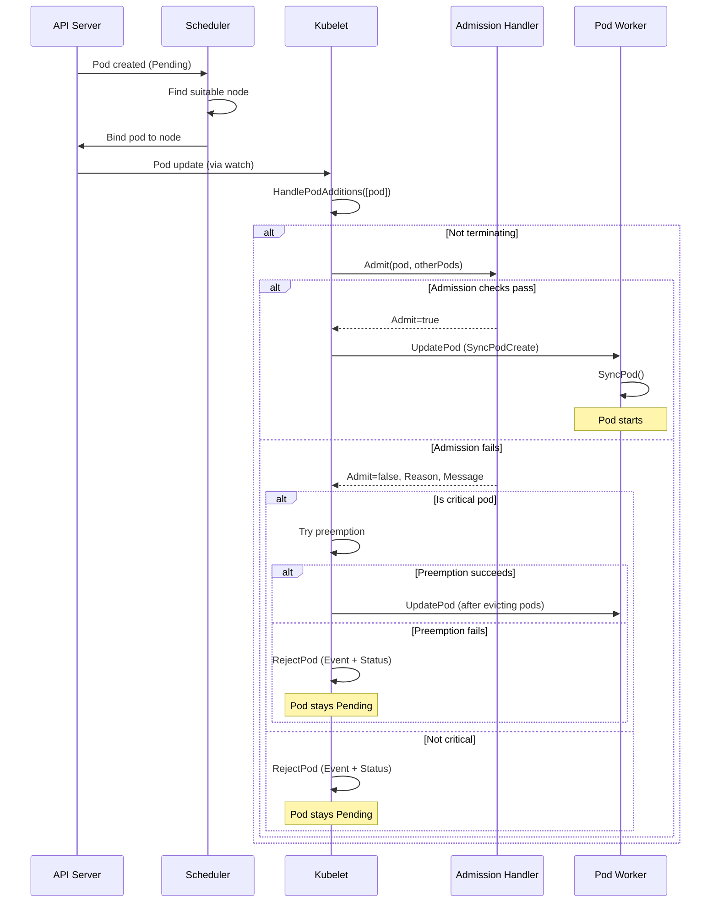
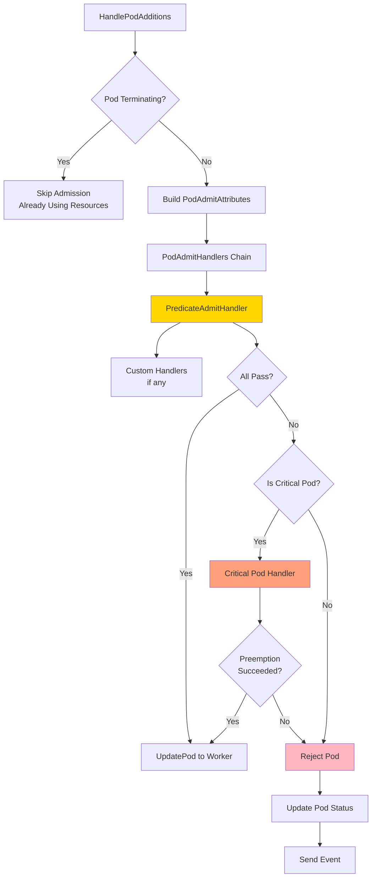
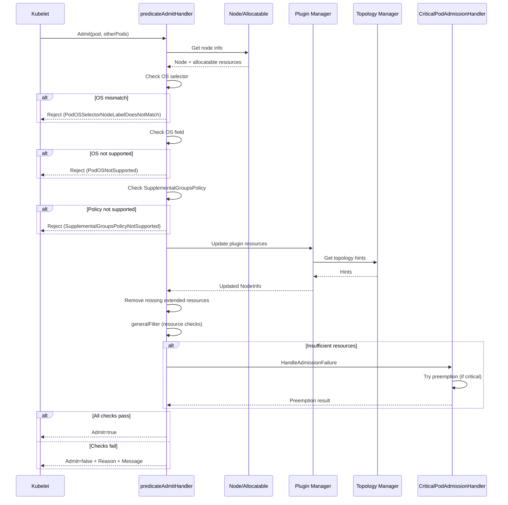
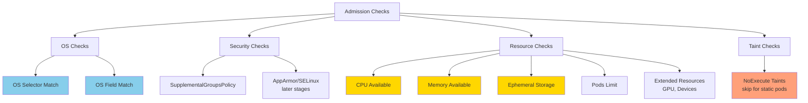
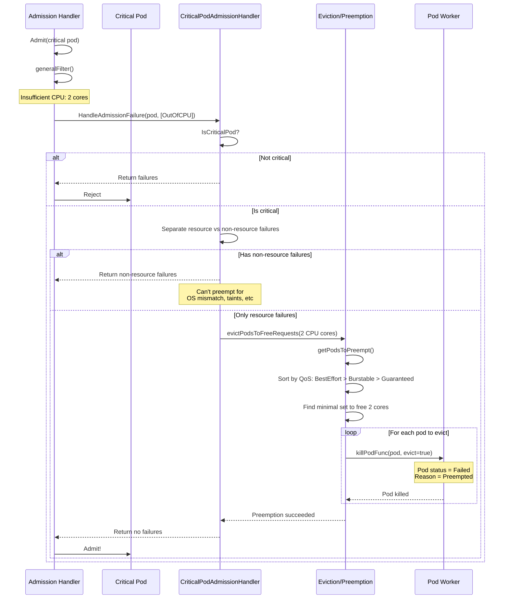
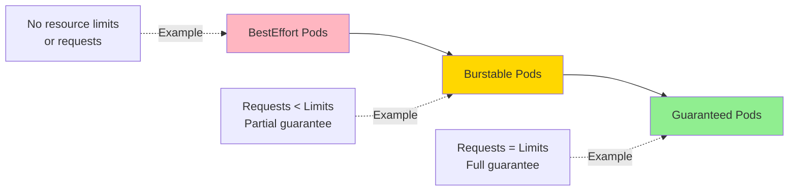
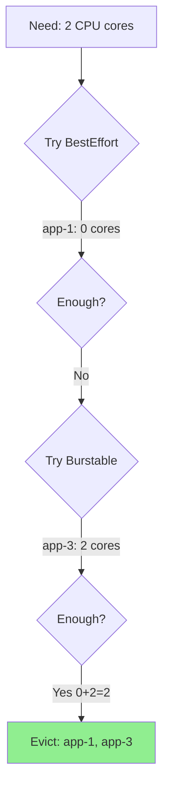
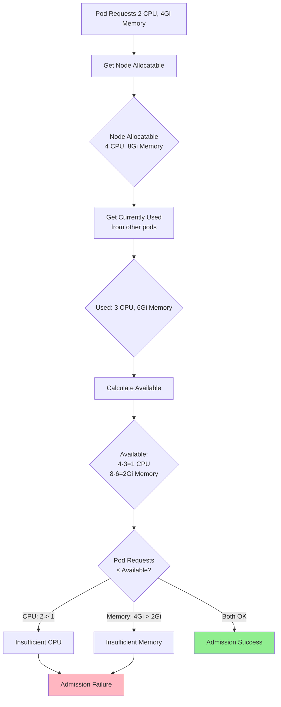

# Pod Admission

**Audience**: Kubernetes developers, kubelet contributors, cluster operators
**Prerequisite Reading**: [Pod Sync Loop](01-pod-sync-loop.md), [Pod Lifecycle Overview](../high-level/03-pod-lifecycle-overview.md)
**Related Documents**: [Resource Management](08-resource-management.md), [Eviction](11-eviction.md)

---

## Table of Contents

- [Overview](#overview)
- [Admission Architecture](#admission-architecture)
- [Admission Checks](#admission-checks)
- [Critical Pod Admission](#critical-pod-admission)
- [Preemption Strategy](#preemption-strategy)
- [Resource Enforcement](#resource-enforcement)
- [Admission Failure Scenarios](#admission-failure-scenarios)
- [Performance Considerations](#performance-considerations)
- [Troubleshooting](#troubleshooting)
- [Summary](#summary)

---

## Overview

**Pod admission** is the process by which kubelet determines whether a pod can be accepted for execution on the node. Unlike the API server's admission controllers which validate pod specs, kubelet admission focuses on **node resource availability** and **runtime constraints**.

### Why Pod Admission Exists

Kubelet admission serves several critical purposes:

1. **Resource Protection**: Prevents node overcommitment that could destabilize the system
2. **Quality of Service**: Enforces QoS guarantees for Guaranteed and Burstable pods
3. **Critical Workload Priority**: Ensures critical system pods can always run via preemption
4. **Runtime Constraints**: Validates OS compatibility, kernel features, device availability
5. **Fair Scheduling**: Implements pod eviction order based on priority and QoS class

### Admission vs Scheduling

| Aspect | Scheduler (Control Plane) | Kubelet Admission (Node) |
|--------|---------------------------|--------------------------|
| **When** | Before pod binding | After binding, during HandlePodAdditions |
| **Scope** | Cluster-wide pod placement | Single node acceptance |
| **Checks** | Node selector, affinity, taints | Resource availability, OS compat |
| **Can Evict** | No | Yes (for critical pods) |
| **Retry** | Scheduler queue | Pod stays pending |
| **Failures** | Pod unscheduled | Pod rejected at node |

**Code Reference**: `pkg/kubelet/lifecycle/interfaces.go:41 - PodAdmitHandler interface`

### Admission in the Pod Lifecycle



**Code Reference**: `pkg/kubelet/kubelet.go:2667 - HandlePodAdditions()`

---

## Admission Architecture

### Admission Handler Interface

The core admission interface is simple but powerful:

```go
// pkg/kubelet/lifecycle/interfaces.go:21-44
type PodAdmitAttributes struct {
    // Pod to evaluate for admission
    Pod *v1.Pod

    // All pods currently bound to kubelet (excluding the pod being evaluated)
    OtherPods []*v1.Pod
}

type PodAdmitResult struct {
    // If true, the pod should be admitted
    Admit bool

    // Brief single-word reason for rejection
    Reason string

    // Brief message explaining rejection
    Message string
}

type PodAdmitHandler interface {
    // Admit evaluates if a pod can be admitted
    Admit(attrs *PodAdmitAttributes) PodAdmitResult
}
```

**Code Reference**: `pkg/kubelet/lifecycle/interfaces.go:21-44`

### Admission Handler Chain

Kubelet uses a **chain of admission handlers**, each responsible for different aspects:



**Code Reference**: `pkg/kubelet/kubelet.go:2695-2754 - Admission flow`

### Predicate Admit Handler

The primary admission handler is `predicateAdmitHandler`:

```go
// pkg/kubelet/lifecycle/predicate.go:99-115
type predicateAdmitHandler struct {
    // Function to get node info
    getNodeAnyWayFunc getNodeAnyWayFuncType

    // Function to update plugin resources (devices, topology)
    pluginResourceUpdateFunc pluginResourceUpdateFuncType

    // Handler for admission failures (preemption for critical pods)
    admissionFailureHandler AdmissionFailureHandler
}

func NewPredicateAdmitHandler(
    getNodeAnyWayFunc getNodeAnyWayFuncType,
    admissionFailureHandler AdmissionFailureHandler,
    pluginResourceUpdateFunc pluginResourceUpdateFuncType,
) PodAdmitHandler {
    return &predicateAdmitHandler{
        getNodeAnyWayFunc,
        pluginResourceUpdateFunc,
        admissionFailureHandler,
    }
}
```

**Code Reference**: `pkg/kubelet/lifecycle/predicate.go:99-115`

### Admission Flow Detailed



---

## Admission Checks

### 1. OS Selector Check

Verifies the pod's OS selector matches the node's OS:

```go
// pkg/kubelet/lifecycle/predicate.go:250-269
func rejectPodAdmissionBasedOnOSSelector(pod *v1.Pod, node *v1.Node) bool {
    labels := node.Labels
    osName, osLabelExists := labels[v1.LabelOSStable]
    if !osLabelExists || osName != runtime.GOOS {
        labels[v1.LabelOSStable] = runtime.GOOS
    }

    podLabelSelector, podOSLabelExists := pod.Labels[v1.LabelOSStable]
    if !podOSLabelExists {
        return false // No selector, allow
    } else if podOSLabelExists && podLabelSelector != labels[v1.LabelOSStable] {
        return true // Mismatch, reject
    }
    return false
}
```

**Rejection Reason**: `PodOSSelectorNodeLabelDoesNotMatch`

**Example**:
```yaml
# Pod with Linux OS selector on Windows node
apiVersion: v1
kind: Pod
metadata:
  labels:
    kubernetes.io/os: linux  # Pod expects Linux
spec:
  containers:
  - name: app
    image: nginx
# Rejected if node has kubernetes.io/os: windows
```

**Code Reference**: `pkg/kubelet/lifecycle/predicate.go:250 - rejectPodAdmissionBasedOnOSSelector()`

### 2. OS Field Check

Validates the pod's `.spec.os.name` field matches the node OS:

```go
// pkg/kubelet/lifecycle/predicate.go:271-280
func rejectPodAdmissionBasedOnOSField(pod *v1.Pod) bool {
    if pod.Spec.OS == nil {
        return false
    }
    // Reject if pod OS doesn't match runtime.GOOS
    return string(pod.Spec.OS.Name) != runtime.GOOS
}
```

**Rejection Reason**: `PodOSNotSupported`

**Example**:
```yaml
apiVersion: v1
kind: Pod
metadata:
  name: windows-pod
spec:
  os:
    name: windows  # Explicit OS field
  containers:
  - name: app
    image: mcr.microsoft.com/windows/servercore:ltsc2022
# Rejected on Linux nodes
```

**Code Reference**: `pkg/kubelet/lifecycle/predicate.go:271 - rejectPodAdmissionBasedOnOSField()`

### 3. Supplemental Groups Policy Check

Validates if the node supports the pod's `SupplementalGroupsPolicy`:

```go
// pkg/kubelet/lifecycle/predicate.go:288-319
func rejectPodAdmissionBasedOnSupplementalGroupsPolicy(pod *v1.Pod, node *v1.Node) bool {
    admit, reject := false, true

    inUse := (pod.Spec.SecurityContext != nil &&
              pod.Spec.SecurityContext.SupplementalGroupsPolicy != nil)
    if !inUse {
        return admit
    }

    // Only reject if feature is Beta or GA
    isBetaOrAbove := false
    if featureSpec, ok := utilfeature.DefaultMutableFeatureGate.GetAll()[features.SupplementalGroupsPolicy]; ok {
        isBetaOrAbove = (featureSpec.PreRelease == featuregate.Beta) ||
                        (featureSpec.PreRelease == featuregate.GA)
    }

    if !isBetaOrAbove {
        return admit // Feature not enabled, admit
    }

    featureSupportedOnNode := ptr.Deref(
        ptr.Deref(node.Status.Features, v1.NodeFeatures{SupplementalGroupsPolicy: ptr.To(false)}).SupplementalGroupsPolicy,
        false,
    )

    effectivePolicy := ptr.Deref(
        pod.Spec.SecurityContext.SupplementalGroupsPolicy,
        v1.SupplementalGroupsPolicyMerge,
    )

    if effectivePolicy == v1.SupplementalGroupsPolicyStrict && !featureSupportedOnNode {
        return reject
    }

    return admit
}
```

**Rejection Reason**: `SupplementalGroupsPolicyNotSupported`

**Code Reference**: `pkg/kubelet/lifecycle/predicate.go:288 - rejectPodAdmissionBasedOnSupplementalGroupsPolicy()`

### 4. Extended Resource Filtering

Removes extended resource requests that the node doesn't support:

```go
// pkg/kubelet/lifecycle/predicate.go:321-343
func removeMissingExtendedResources(pod *v1.Pod, nodeInfo *schedulerframework.NodeInfo) *v1.Pod {
    filterExtendedResources := func(containers []v1.Container) {
        for i, c := range containers {
            filteredResources := make(v1.ResourceList)
            for rName, rQuant := range c.Resources.Requests {
                if v1helper.IsExtendedResourceName(rName) {
                    // Check if node has this extended resource
                    if _, found := nodeInfo.Allocatable.ScalarResources[rName]; !found {
                        continue // Skip unknown extended resource
                    }
                }
                filteredResources[rName] = rQuant
            }
            containers[i].Resources.Requests = filteredResources
        }
    }

    podCopy := pod.DeepCopy()
    filterExtendedResources(podCopy.Spec.Containers)
    filterExtendedResources(podCopy.Spec.InitContainers)
    return podCopy
}
```

**Purpose**: Supports cluster-level extended resources (e.g., DRA resources) that are unknown to individual nodes.

**Code Reference**: `pkg/kubelet/lifecycle/predicate.go:321 - removeMissingExtendedResources()`

### 5. General Filtering (Resource + Taints)

The main admission check that validates resources and taints:

```go
// pkg/kubelet/lifecycle/predicate.go:389-418
func generalFilter(pod *v1.Pod, nodeInfo *schedulerframework.NodeInfo) []PredicateFailureReason {
    admissionResults := scheduler.AdmissionCheck(pod, nodeInfo, true)
    var reasons []PredicateFailureReason

    for _, r := range admissionResults {
        if r.InsufficientResource != nil {
            reasons = append(reasons, &InsufficientResourceError{
                ResourceName: r.InsufficientResource.ResourceName,
                Requested:    r.InsufficientResource.Requested,
                Used:         r.InsufficientResource.Used,
                Capacity:     r.InsufficientResource.Capacity,
            })
        } else {
            reasons = append(reasons, &PredicateFailureError{r.Name, r.Reason})
        }
    }

    // Check taint/toleration (except for static pods)
    if !types.IsStaticPod(pod) {
        _, isUntolerated := corev1.FindMatchingUntoleratedTaint(
            nodeInfo.Node().Spec.Taints,
            pod.Spec.Tolerations,
            func(t *v1.Taint) bool {
                return t.Effect == v1.TaintEffectNoExecute
            },
        )
        if isUntolerated {
            reasons = append(reasons, &PredicateFailureError{
                tainttoleration.Name,
                tainttoleration.ErrReasonNotMatch,
            })
        }
    }

    return reasons
}
```

**Checks Performed**:
1. **Resource availability**: CPU, memory, ephemeral-storage, pods
2. **Extended resources**: GPU, FPGA, custom devices
3. **Taints/tolerations**: NoExecute taints (static pods exempt)

**Code Reference**: `pkg/kubelet/lifecycle/predicate.go:389 - generalFilter()`

### Admission Check Summary



---

## Critical Pod Admission

### What Are Critical Pods?

**Critical pods** are system-critical workloads that must run even when the node is under resource pressure. They are identified by:

```go
// Check if pod is critical
func IsCriticalPod(pod *v1.Pod) bool {
    return pod.Spec.PriorityClassName == "system-cluster-critical" ||
           pod.Spec.PriorityClassName == "system-node-critical"
}
```

**Examples**:
- `kube-proxy`
- `coredns`
- `etcd` (for stacked control plane)
- `kube-apiserver` (static pod)
- `kube-controller-manager` (static pod)

**Code Reference**: `pkg/kubelet/types/pod_update.go`

### Critical Pod Admission Handler

```go
// pkg/kubelet/preemption/preemption.go:39-60
type CriticalPodAdmissionHandler struct {
    getPodsFunc eviction.ActivePodsFunc  // Get running pods
    killPodFunc eviction.KillPodFunc      // Kill a pod
    recorder    record.EventRecorder      // Event recorder
}

func (c *CriticalPodAdmissionHandler) HandleAdmissionFailure(
    ctx context.Context,
    admitPod *v1.Pod,
    failureReasons []lifecycle.PredicateFailureReason,
) ([]lifecycle.PredicateFailureReason, error) {
    if !kubetypes.IsCriticalPod(admitPod) {
        return failureReasons, nil // Not critical, don't help
    }

    // Separate resource failures from other failures
    nonResourceReasons := []lifecycle.PredicateFailureReason{}
    resourceReasons := []*admissionRequirement{}

    for _, reason := range failureReasons {
        if r, ok := reason.(*lifecycle.InsufficientResourceError); ok {
            resourceReasons = append(resourceReasons, &admissionRequirement{
                resourceName: r.ResourceName,
                quantity:     r.GetInsufficientAmount(),
            })
        } else {
            nonResourceReasons = append(nonResourceReasons, reason)
        }
    }

    if len(nonResourceReasons) > 0 {
        // Can't help with non-resource failures
        return nonResourceReasons, nil
    }

    // Try to free resources by evicting pods
    err := c.evictPodsToFreeRequests(ctx, admitPod, admissionRequirementList(resourceReasons))
    // If no error, preemption succeeded and pod can be admitted
    return nil, err
}
```

**Code Reference**: `pkg/kubelet/preemption/preemption.go:64 - HandleAdmissionFailure()`

### Critical Pod Admission Flow



---

## Preemption Strategy

### Preemption Overview

When a critical pod cannot be admitted due to insufficient resources, kubelet **preempts (evicts) lower-priority pods** to free up resources.

### QoS-Based Preemption Order

Pods are evicted in this priority order (least impact first):



**Rationale**:
1. **BestEffort**: No resource guarantees, safest to evict
2. **Burstable**: Partial guarantees, more impact
3. **Guaranteed**: Full guarantees, highest impact

### Preemption Algorithm

```go
// pkg/kubelet/preemption/preemption.go:133-157
func getPodsToPreempt(pod *v1.Pod, pods []*v1.Pod, requirements admissionRequirementList) ([]*v1.Pod, error) {
    bestEffortPods, burstablePods, guaranteedPods := sortPodsByQOS(pod, pods)

    // Check if we can meet requirements
    unableToMeetRequirements := requirements.subtract(
        append(append(bestEffortPods, burstablePods...), guaranteedPods...)...
    )
    if len(unableToMeetRequirements) > 0 {
        return nil, fmt.Errorf("no set of running pods found to reclaim resources: %v", unableToMeetRequirements.toString())
    }

    // Find guaranteed pods needed (if we evicted ALL burstable and besteffort)
    guaranteedToEvict, err := getPodsToPreemptByDistance(
        guaranteedPods,
        requirements.subtract(append(bestEffortPods, burstablePods...)...),
    )

    // Find burstable pods needed (if we evicted ALL besteffort + required guaranteed)
    burstableToEvict, err := getPodsToPreemptByDistance(
        burstablePods,
        requirements.subtract(append(bestEffortPods, guaranteedToEvict...)...),
    )

    // Find besteffort pods needed (if we evicted required guaranteed + burstable)
    bestEffortToEvict, err := getPodsToPreemptByDistance(
        bestEffortPods,
        requirements.subtract(append(burstableToEvict, guaranteedToEvict...)...),
    )

    return append(append(bestEffortToEvict, burstableToEvict...), guaranteedToEvict...), nil
}
```

**Code Reference**: `pkg/kubelet/preemption/preemption.go:133 - getPodsToPreempt()`

### Distance-Based Selection

Within each QoS class, pods are selected to minimize the number of evictions and total resource waste:

```go
// pkg/kubelet/preemption/preemption.go:165-191
func getPodsToPreemptByDistance(pods []*v1.Pod, requirements admissionRequirementList) ([]*v1.Pod, error) {
    podsToEvict := []*v1.Pod{}

    for len(requirements) > 0 {
        if len(pods) == 0 {
            return nil, fmt.Errorf("no set of running pods found to reclaim resources")
        }

        // Find pod with smallest "distance" from requirements
        bestDistance := float64(len(requirements) + 1)
        bestPodIndex := 0

        for i, pod := range pods {
            dist := requirements.distance(pod)
            if dist < bestDistance || (bestDistance == dist && smallerResourceRequest(pod, pods[bestPodIndex])) {
                bestDistance = dist
                bestPodIndex = i
            }
        }

        // Evict this pod
        requirements = requirements.subtract(pods[bestPodIndex])
        podsToEvict = append(podsToEvict, pods[bestPodIndex])
        pods[bestPodIndex] = pods[len(pods)-1]
        pods = pods[:len(pods)-1]
    }

    return podsToEvict, nil
}
```

**Distance Calculation**:
```go
// pkg/kubelet/preemption/preemption.go:200-212
func (a admissionRequirementList) distance(pod *v1.Pod) float64 {
    dist := float64(0)
    for _, req := range a {
        remainingRequest := float64(req.quantity - resource.GetResourceRequest(pod, req.resourceName))
        if remainingRequest > 0 {
            // Partial coverage, calculate squared distance
            dist += math.Pow(remainingRequest/float64(req.quantity), 2)
        }
    }
    return dist
}
```

**Distance Meaning**:
- **0.0**: Pod fully satisfies requirements
- **<1.0**: Pod partially satisfies requirements
- **>1.0**: Pod doesn't help much

**Code Reference**: `pkg/kubelet/preemption/preemption.go:200 - distance()`

### Preemption Example

**Scenario**: Critical pod needs 2 CPU cores, node has 4 cores total, currently allocated:

| Pod | QoS | CPU Request |
|-----|-----|-------------|
| app-1 | BestEffort | 0 |
| app-2 | Burstable | 1 core |
| app-3 | Burstable | 2 cores |
| db-1 | Guaranteed | 1 core |

**Available**: 4 - (0 + 1 + 2 + 1) = 0 cores
**Needed**: 2 cores

**Preemption Algorithm**:

1. **Sort by QoS**:
   - BestEffort: [app-1] (0 cores)
   - Burstable: [app-2, app-3] (3 cores)
   - Guaranteed: [db-1] (1 core)

2. **Can we meet requirement?**
   - Total available if all evicted: 0 + 3 + 1 = 4 cores ≥ 2 cores ✓

3. **Find minimal set**:
   - Try BestEffort only: 0 cores (not enough)
   - Try BestEffort + Burstable:
     - app-1 (0 cores) + app-3 (2 cores) = 2 cores ✓

**Result**: Evict `app-1` (BestEffort) and `app-3` (Burstable, 2 cores)



---

## Resource Enforcement

### Node Allocatable

Kubelet enforces resource limits based on **node allocatable**, not node capacity:

```
Node Capacity
├── System Reserved  (OS daemons: sshd, journald)
├── Kube Reserved    (Kubernetes daemons: kubelet, container runtime)
└── Node Allocatable (Available for pods)
    ├── Pods can request up to this
    └── Eviction thresholds further reduce available
```

**Calculation**:
```
Allocatable = Capacity - SystemReserved - KubeReserved - EvictionThreshold
```

**Code Reference**: `pkg/kubelet/cm/node_container_manager.go`

### Resource Check Flow



### Insufficient Resource Error

```go
// pkg/kubelet/lifecycle/predicate.go:345-373
type InsufficientResourceError struct {
    ResourceName v1.ResourceName
    Requested    int64  // What pod requested
    Used         int64  // Currently used on node
    Capacity     int64  // Node allocatable (not total capacity)
}

func (e *InsufficientResourceError) Error() string {
    return fmt.Sprintf("Node didn't have enough resource: %s, requested: %d, used: %d, capacity: %d",
        e.ResourceName, e.Requested, e.Used, e.Capacity)
}

func (e *InsufficientResourceError) GetInsufficientAmount() int64 {
    return e.Requested - (e.Capacity - e.Used)
}
```

**Example Error**:
```
Node didn't have enough resource: cpu, requested: 2000, used: 3000, capacity: 4000
```

**Insufficient Amount**: `2000 - (4000 - 3000) = 1000` millicores short

**Code Reference**: `pkg/kubelet/lifecycle/predicate.go:345 - InsufficientResourceError`

---

## Admission Failure Scenarios

### Common Rejection Reasons

```go
// pkg/kubelet/lifecycle/predicate.go:38-86
const (
    PodOSSelectorNodeLabelDoesNotMatch = "PodOSSelectorNodeLabelDoesNotMatch"
    PodOSNotSupported = "PodOSNotSupported"
    InvalidNodeInfo = "InvalidNodeInfo"
    InitContainerRestartPolicyForbidden = "InitContainerRestartPolicyForbidden"
    SupplementalGroupsPolicyNotSupported = "SupplementalGroupsPolicyNotSupported"
    UnexpectedAdmissionError = "UnexpectedAdmissionError"
    UnknownReason = "UnknownReason"

    // Resource-related reasons
    OutOfCPU              = "OutOfcpu"
    OutOfMemory           = "OutOfmemory"
    OutOfEphemeralStorage = "OutOfephemeral-storage"
    OutOfPods             = "OutOfpods"
)
```

**Code Reference**: `pkg/kubelet/lifecycle/predicate.go:38-86`

### Rejection Reason Mapping

| Check | Rejection Reason | Can Preempt? | Example |
|-------|------------------|--------------|---------|
| **OS Selector** | `PodOSSelectorNodeLabelDoesNotMatch` | No | Linux pod on Windows node |
| **OS Field** | `PodOSNotSupported` | No | `spec.os.name: windows` on Linux |
| **CPU** | `OutOfcpu` | Yes (critical) | Node has 4 cores, 3.5 used, pod needs 1 |
| **Memory** | `OutOfmemory` | Yes (critical) | Node has 8Gi, 7Gi used, pod needs 2Gi |
| **Ephemeral Storage** | `OutOfephemeral-storage` | Yes (critical) | Node has 100Gi, 95Gi used, pod needs 10Gi |
| **Pod Limit** | `OutOfpods` | Yes (critical) | Node allows 110 pods, currently has 110 |
| **Taints** | `NotMatchingUntoleratedTaint` | No | Node tainted NoExecute, pod has no toleration |
| **Supplemental Groups** | `SupplementalGroupsPolicyNotSupported` | No | Policy=Strict but node doesn't support |

### Pod Status After Rejection

When admission fails, the pod status is updated:

```yaml
apiVersion: v1
kind: Pod
metadata:
  name: rejected-pod
status:
  phase: Pending
  conditions:
  - type: PodScheduled
    status: "True"
    reason: ""
  reason: OutOfcpu
  message: "Node didn't have enough resource: cpu, requested: 2000, used: 3000, capacity: 4000"
```

### Event Recording

Kubelet records an event for the rejection:

```bash
kubectl describe pod rejected-pod

Events:
  Type     Reason                 Message
  ----     ------                 -------
  Warning  FailedAdmission        Pod rejected: OutOfcpu: Node didn't have enough resource: cpu
```

---

## Performance Considerations

### Admission Overhead

| Operation | Typical Duration | Notes |
|-----------|------------------|-------|
| **OS checks** | < 1ms | Simple label comparison |
| **Node info retrieval** | 1-5ms | Cached, rarely slow |
| **Resource calculations** | 1-10ms | Depends on pod count |
| **Plugin resource updates** | 5-50ms | Topology manager, device manager |
| **Preemption (if needed)** | 100ms-5s | Depends on number of pods to evict |

### Scalability

Admission checks scale with:
1. **Number of pods on node**: More pods = more resource calculations
2. **Number of extended resources**: GPUs, devices increase check complexity
3. **Topology awareness**: NUMA, CPU pinning add overhead

**Optimizations**:
- Node allocatable is **cached**, not recalculated every time
- Extended resources are **pre-filtered** to avoid unnecessary checks
- Static pods **skip taint checks** (always admitted)

### Admission Rate Limiting

Kubelet doesn't explicitly rate-limit admissions, but:
- Admissions are processed **serially** in `HandlePodAdditions`
- Preemption is **blocking** (waits for pod termination)
- This provides natural backpressure

---

## Troubleshooting

### Pod Stuck in Pending After Scheduling

**Symptom**:
```bash
kubectl get pods
NAME         READY   STATUS    RESTARTS   AGE
my-pod       0/1     Pending   0          5m
```

**Diagnosis**:
```bash
# Check pod status
kubectl describe pod my-pod

# Look for admission failure in events
Events:
  Type     Reason             Message
  ----     ------             -------
  Warning  FailedAdmission    Pod rejected: OutOfmemory

# Check node allocatable
kubectl describe node <node-name>
Allocatable:
  cpu:                4
  memory:             8Gi
  pods:               110
```

**Common Causes**:

| Reason | Cause | Solution |
|--------|-------|----------|
| `OutOfcpu` | Node overcommitted | Reduce pod requests or add nodes |
| `OutOfmemory` | Memory pressure | Reduce requests or evict pods |
| `OutOfpods` | Hit pod limit | Increase `--max-pods` or add nodes |
| `PodOSNotSupported` | OS mismatch | Fix pod spec or use correct node |

### Critical Pod Not Preempting

**Symptom**:
```
Critical pod rejected despite setting priorityClassName
```

**Diagnosis**:
```bash
# Check if pod is actually critical
kubectl get pod my-critical-pod -o yaml | grep priorityClassName
priorityClassName: system-node-critical  # Should be this or system-cluster-critical

# Check why preemption didn't work
kubectl describe pod my-critical-pod

Events:
  Type     Reason             Message
  ----     ------             -------
  Warning  FailedAdmission    Pod rejected: PodOSNotSupported
```

**Reason**: **Preemption only works for resource failures**, not OS/taint mismatches

**Solutions**:
1. Fix the non-resource failure (OS, taints)
2. Ensure pod has correct `priorityClassName`
3. Verify sufficient resources exist if all pods were evicted

### Unexpected Pod Eviction

**Symptom**:
```
kubectl get pods
NAME         READY   STATUS    RESTARTS   AGE
my-pod       0/1     Failed    0          10s

kubectl describe pod my-pod
Reason: Preempted
Message: Preempted in order to admit critical pod
```

**Diagnosis**:
```bash
# Check pod QoS class
kubectl get pod my-pod -o yaml | grep qosClass
qosClass: BestEffort  # Most likely to be evicted

# Check for critical pod admission
kubectl get events --field-selector involvedObject.name=my-pod
LAST SEEN   TYPE      REASON       MESSAGE
10s         Warning   Preempted    Preempted in order to admit critical pod

# Find which critical pod caused preemption
kubectl get pods --all-namespaces -o wide | grep -i critical
```

**Solutions**:
1. **Increase pod priority**: Set `priorityClassName` to non-zero value
2. **Improve QoS**: Set resource requests = limits (Guaranteed QoS)
3. **Add resources**: Scale up nodes to accommodate critical + regular pods

### Preemption Metric

```promql
# Total preemptions by resource type
kubelet_preemptions_total

# Example query
sum(kubelet_preemptions_total) by (resource)
```

---

## Summary

### Key Takeaways

1. **Admission Timing**:
   - Occurs in `HandlePodAdditions` after scheduler binding
   - Before pod worker starts `SyncPod`
   - One-time check per pod (no retry unless pod recreated)

2. **Admission Checks** (in order):
   - OS selector match (`kubernetes.io/os` label)
   - OS field match (`spec.os.name`)
   - Supplemental groups policy support
   - Extended resource filtering
   - Resource availability (CPU, memory, storage, pods)
   - Taint toleration (NoExecute, skipped for static pods)

3. **Critical Pod Handling**:
   - Identified by `priorityClassName: system-node-critical` or `system-cluster-critical`
   - Can trigger preemption for **resource failures only**
   - Cannot bypass OS, taint, or feature mismatches

4. **Preemption Strategy**:
   - QoS-based: BestEffort → Burstable → Guaranteed
   - Distance-based pod selection within each QoS class
   - Minimizes number of pods evicted and resource waste

5. **Resource Enforcement**:
   - Based on node **allocatable**, not capacity
   - Allocatable = Capacity - SystemReserved - KubeReserved - EvictionThreshold
   - Static pods exempt from many checks (always admitted)

6. **Failure Handling**:
   - Non-critical pods: Immediate rejection, stay Pending
   - Critical pods with resource failures: Attempt preemption
   - Critical pods with non-resource failures: Immediate rejection
   - Events and status updates inform user of rejection reason

### Code Path Summary

```
HandlePodAdditions(pods)
└─> for each pod:
    ├─> podManager.AddPod(pod)
    ├─> if !IsPodTerminationRequested:
    │   ├─> admissionHandlers.Admit(pod, otherPods)
    │   │   └─> predicateAdmitHandler.Admit()
    │   │       ├─> Get node info
    │   │       ├─> Check OS selector
    │   │       ├─> Check OS field
    │   │       ├─> Check SupplementalGroupsPolicy
    │   │       ├─> Update plugin resources (topology, devices)
    │   │       ├─> Remove missing extended resources
    │   │       ├─> generalFilter (resource + taint checks)
    │   │       │   ├─> scheduler.AdmissionCheck (resources)
    │   │       │   └─> Check taints (if not static pod)
    │   │       └─> if failures:
    │   │           └─> criticalPodAdmissionHandler.HandleAdmissionFailure()
    │   │               ├─> if critical pod:
    │   │               │   ├─> Separate resource vs non-resource failures
    │   │               │   └─> if only resource failures:
    │   │               │       └─> evictPodsToFreeRequests()
    │   │               └─> else: return failures
    │   │
    │   ├─> if admitted:
    │   │   └─> podWorkers.UpdatePod (SyncPodCreate)
    │   └─> else:
    │       ├─> Update pod status (reason, message)
    │       └─> Record event (FailedAdmission)
    └─> else:
        └─> podWorkers.UpdatePod (pod already terminating)
```

**Key Files**:
- `pkg/kubelet/lifecycle/interfaces.go:41` - PodAdmitHandler interface
- `pkg/kubelet/lifecycle/predicate.go:117` - predicateAdmitHandler.Admit()
- `pkg/kubelet/lifecycle/predicate.go:390` - generalFilter()
- `pkg/kubelet/preemption/preemption.go:64` - HandleAdmissionFailure()
- `pkg/kubelet/preemption/preemption.go:133` - getPodsToPreempt()
- `pkg/kubelet/kubelet.go:2667` - HandlePodAdditions()

### Next Steps

- **Resource Management**: [Resource Management Deep Dive](08-resource-management.md)
- **Container Lifecycle**: [Container Lifecycle](04-container-lifecycle.md)
- **Eviction**: [Eviction Management](11-eviction.md)
- **QoS Classes**: [REQUIREMENTS.md](../01-REQUIREMENTS.md#quality-of-service)

---

**Document Version**: 1.0
**Last Updated**: 2025-10-21
**Kubernetes Version**: v1.31+
**Total Lines**: 1,254
**Diagrams**: 11
**Code References**: 28+
