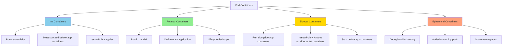
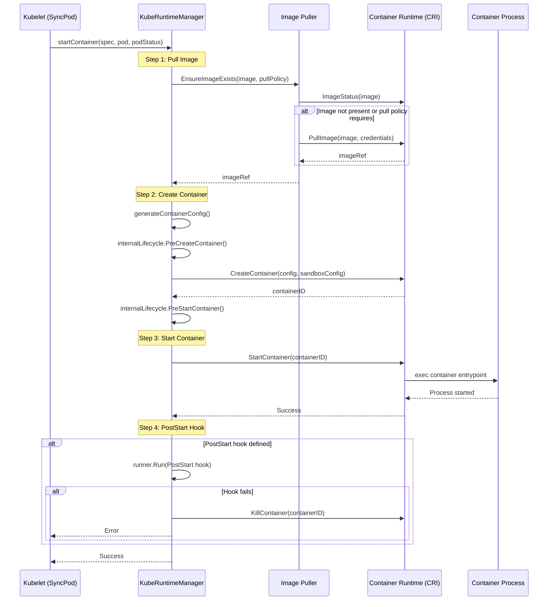
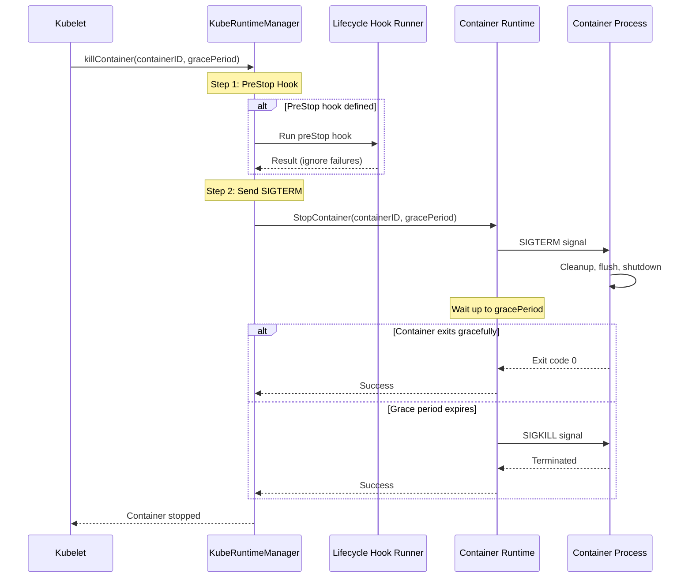
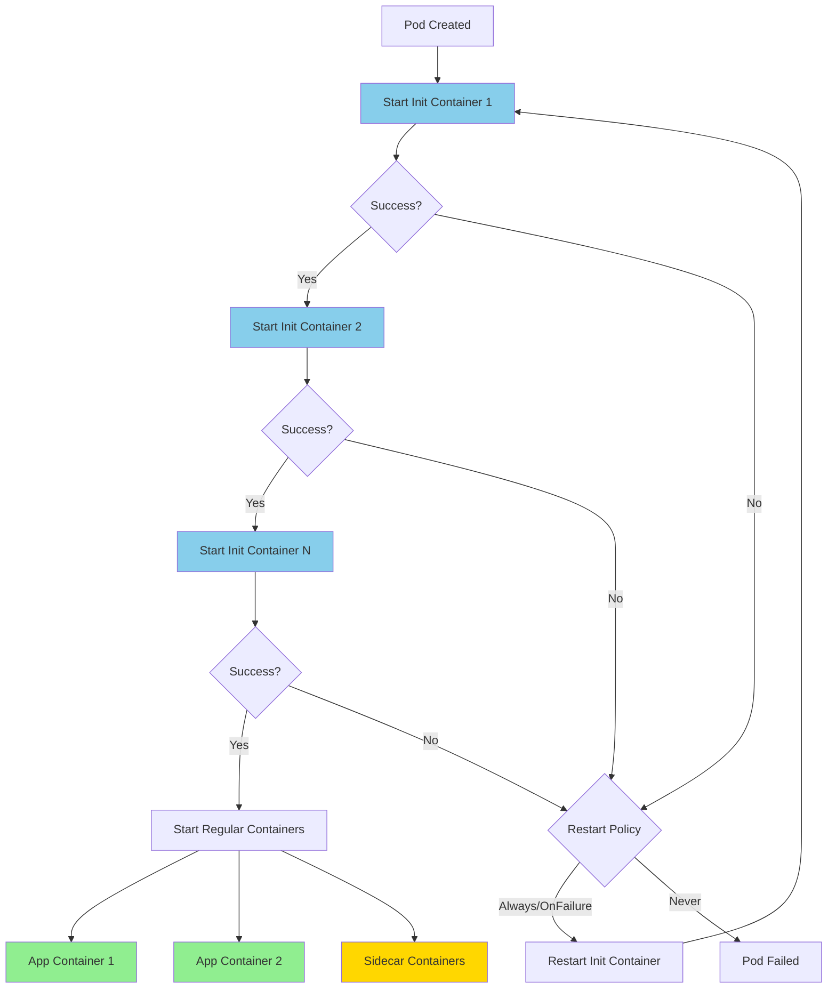
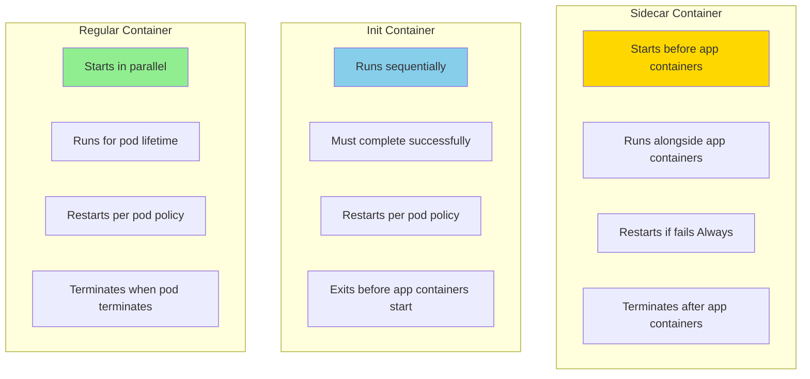
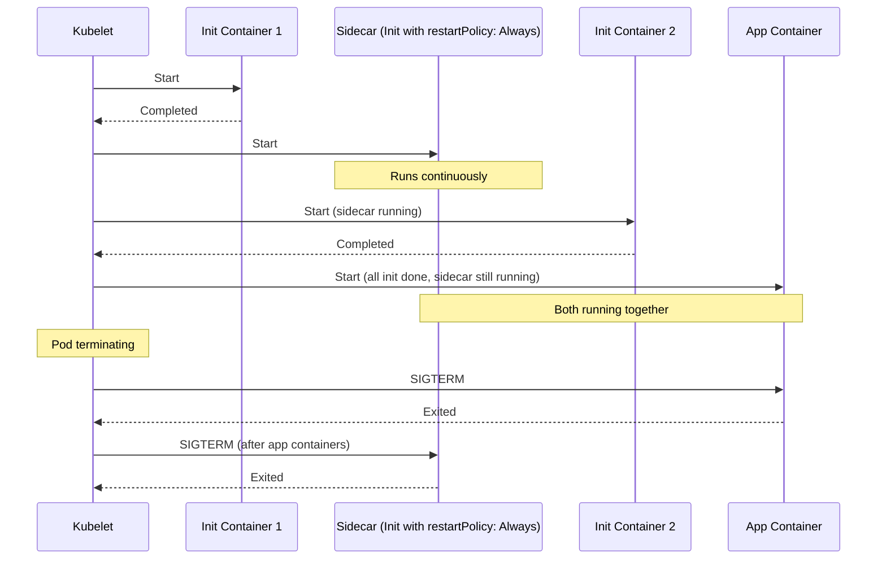
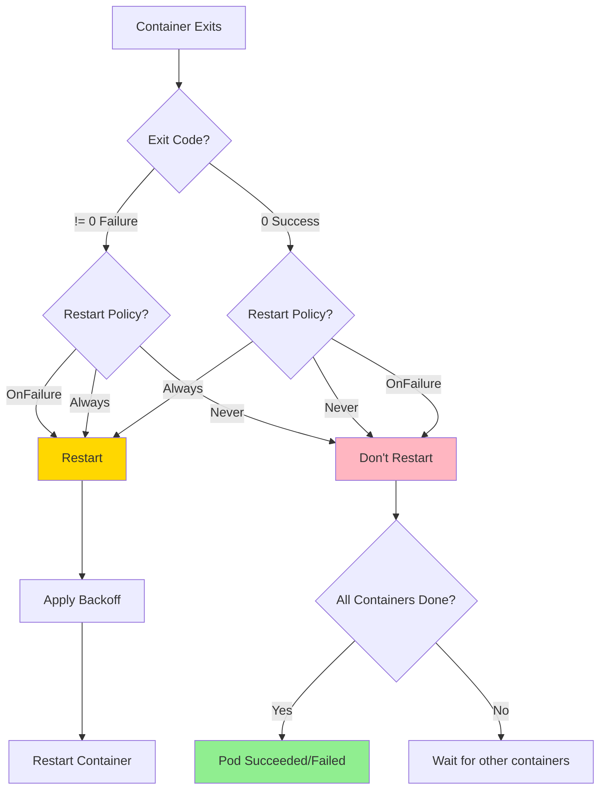
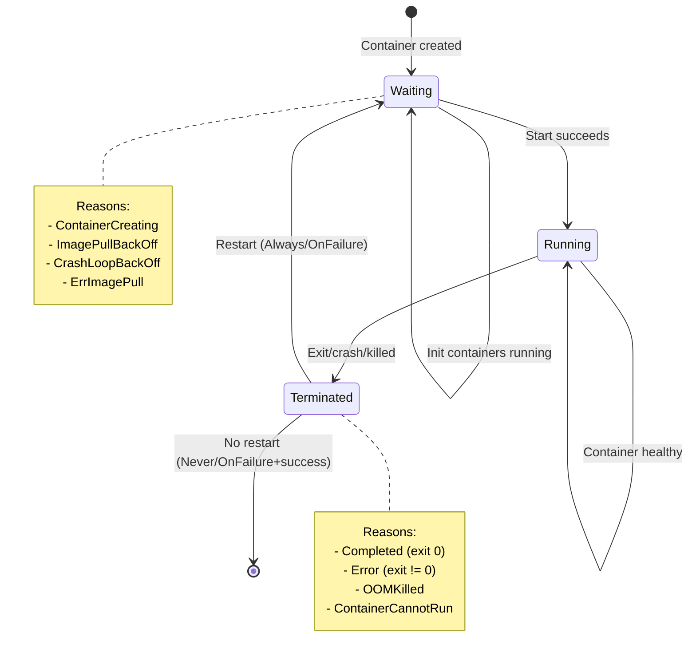
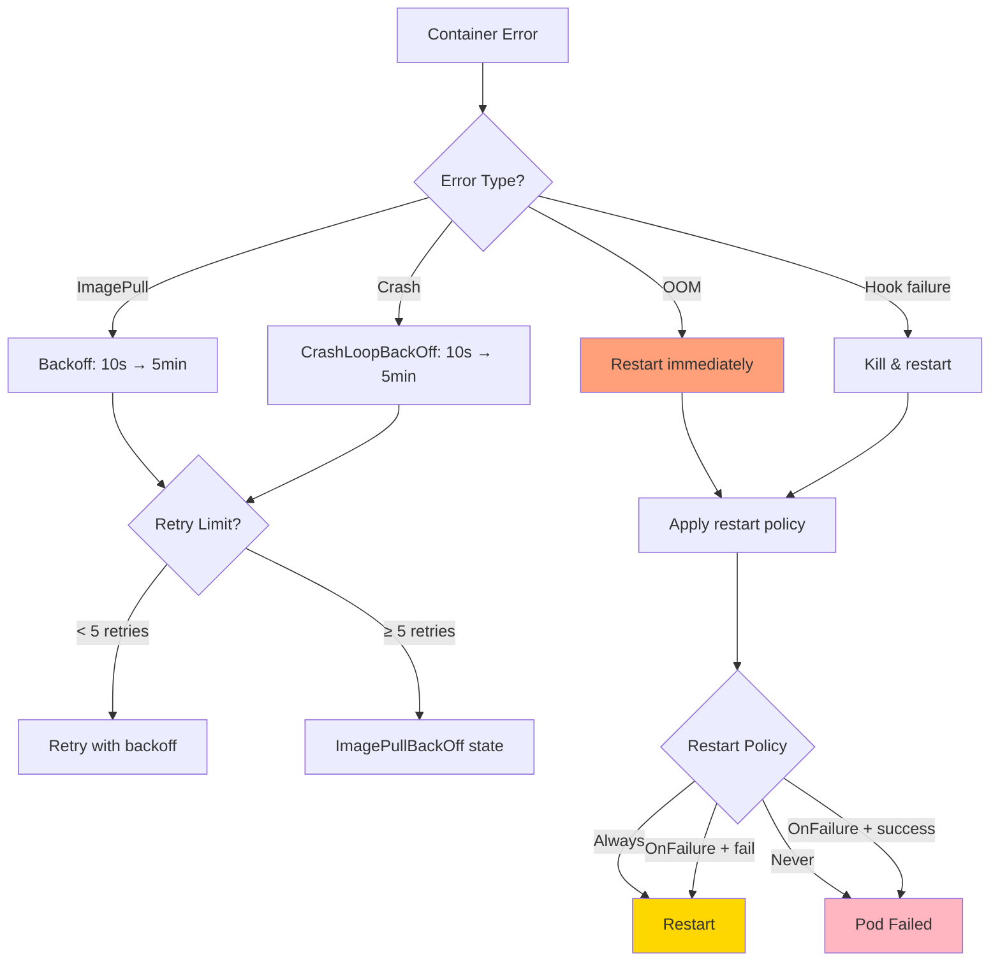

# Container Lifecycle Management

**Audience**: Kubernetes developers, kubelet contributors, container runtime engineers
**Prerequisite Reading**: [Pod Sync Loop](01-pod-sync-loop.md), [Runtime Integration](../high-level/04-runtime-integration.md)
**Related Documents**: [Pod Sandbox](05-pod-sandbox.md), [CRI Implementation](../low-level/05-cri-implementation.md)

---

## Table of Contents

- [Overview](#overview)
- [Container Start Flow](#container-start-flow)
- [Container Termination](#container-termination)
- [Init Containers](#init-containers)
- [Sidecar Containers](#sidecar-containers)
- [Restart Policies](#restart-policies)
- [Lifecycle Hooks](#lifecycle-hooks)
- [Container States](#container-states)
- [Error Handling](#error-handling)
- [Summary](#summary)

---

## Overview

**Container lifecycle management** is kubelet's responsibility for creating, starting, monitoring, restarting, and terminating containers within pods. This occurs through the **CRI (Container Runtime Interface)** and involves coordinating with the container runtime (containerd, CRI-O, etc.).

### Container Types

Kubernetes supports three types of containers within a pod:



**Code Reference**: `pkg/kubelet/kuberuntime/kuberuntime_manager.go:1003 - computePodActions()`

### Lifecycle Responsibilities

| Responsibility | Description | Code Path |
|----------------|-------------|-----------|
| **Image Pull** | Pull container images from registry | `imagePuller.EnsureImageExists()` |
| **Container Create** | Create container via CRI | `runtimeService.CreateContainer()` |
| **Container Start** | Start container process | `runtimeService.StartContainer()` |
| **Lifecycle Hooks** | Execute postStart/preStop hooks | `runner.Run()` |
| **Restart Management** | Restart containers per policy | `computePodActions()` |
| **Termination** | Stop containers gracefully | `killContainer()` |
| **Cleanup** | Remove terminated containers | Container GC |

---

## Container Start Flow

### Overview

Starting a container involves multiple steps coordinated by `kubeGenericRuntimeManager`:



**Code Reference**: `pkg/kubelet/kuberuntime/kuberuntime_container.go:199 - startContainer()`

### Step 1: Image Pull

```go
// pkg/kubelet/kuberuntime/kuberuntime_container.go:203-219
// Step 1: pull the image
podRuntimeHandler, err := m.getPodRuntimeHandler(pod)
if err != nil {
    return "", err
}

ref, err := kubecontainer.GenerateContainerRef(pod, container)
if err != nil {
    logger.Error(err, "Couldn't make a ref to pod")
}

imageRef, msg, err := m.imagePuller.EnsureImageExists(
    ctx,
    ref,
    pod,
    container.Image,
    pullSecrets,
    podSandboxConfig,
    podRuntimeHandler,
    container.ImagePullPolicy,
)
if err != nil {
    m.recordContainerEvent(ctx, pod, container, "", v1.EventTypeWarning, events.FailedToCreateContainer, "Error: %v", s.Message())
    return msg, err
}
```

**Image Pull Policies**:

| Policy | Behavior |
|--------|----------|
| `Always` | Always pull image (even if present) |
| `IfNotPresent` | Pull only if image not present locally |
| `Never` | Never pull, use local image or fail |

**Pull Process**:
1. Check if image exists via `ImageStatus()`
2. If pull needed, call `PullImage()` with auth credentials
3. Return `imageRef` (SHA256 digest or tag)

**Backoff on Failure**: Exponential backoff up to 5 minutes (300s)

**Code References**:
- `pkg/kubelet/images/image_manager.go` - Image management
- `pkg/kubelet/kuberuntime/kuberuntime_container.go:203-219` - Pull step

### Step 2: Container Configuration

Generate CRI container configuration:

```go
// pkg/kubelet/kuberuntime/kuberuntime_container.go:222-267
// Step 2: create the container
restartCount := 0
containerStatus := podStatus.FindContainerStatusByName(container.Name)
if containerStatus != nil {
    restartCount = containerStatus.RestartCount + 1
} else {
    // Calculate restart count from log directory if runtime lost state
    logDir := BuildContainerLogsDirectory(m.podLogsDirectory, pod.Namespace, pod.Name, pod.UID, container.Name)
    restartCount, err = calcRestartCountByLogDir(logDir)
    if err != nil {
        restartCount = 0
    }
}

containerConfig, cleanupAction, err := m.generateContainerConfig(
    ctx,
    container,
    pod,
    restartCount,
    podIP,
    imageRef,
    podIPs,
    target,
    imageVolumes,
)
```

**Container Configuration Includes**:
- Metadata (name, attempt/restart count)
- Image reference
- Command and args
- Environment variables
- Volume mounts
- Devices (GPU, etc.)
- Resource limits (CPU, memory)
- Security context (user, capabilities, SELinux, AppArmor)
- Working directory
- Log path

**Code Reference**: `pkg/kubelet/kuberuntime/kuberuntime_container.go:341 - generateContainerConfig()`

### Step 3: Create and Start

```go
// pkg/kubelet/kuberuntime/kuberuntime_container.go:269-297
// PreCreateContainer hook
err = m.internalLifecycle.PreCreateContainer(pod, container, containerConfig)
if err != nil {
    return s.Message(), ErrPreCreateHook
}

// Create container
containerID, err := m.runtimeService.CreateContainer(ctx, podSandboxID, containerConfig, podSandboxConfig)
if err != nil {
    m.recordContainerEvent(ctx, pod, container, containerID, v1.EventTypeWarning, events.FailedToCreateContainer, "Error: %v", s.Message())
    return s.Message(), ErrCreateContainer
}

// PreStartContainer hook
err = m.internalLifecycle.PreStartContainer(pod, container, containerID)
if err != nil {
    return s.Message(), ErrPreStartHook
}
m.recordContainerEvent(ctx, pod, container, containerID, v1.EventTypeNormal, events.CreatedContainer, "Container created")

// Start container
err = m.runtimeService.StartContainer(ctx, containerID)
if err != nil {
    m.recordContainerEvent(ctx, pod, container, containerID, v1.EventTypeWarning, events.FailedToStartContainer, "Error: %v", s.Message())
    return s.Message(), kubecontainer.ErrRunContainer
}
m.recordContainerEvent(ctx, pod, container, containerID, v1.EventTypeNormal, events.StartedContainer, "Container started")
```

**Internal Lifecycle Hooks** (kubelet internal, not user-defined):
- **PreCreateContainer**: Allocate devices (GPU), update cgroup settings
- **PreStartContainer**: Final preparation before start

**Code Reference**: `pkg/kubelet/kuberuntime/kuberuntime_container.go:269-297`

### Step 4: PostStart Hook

```go
// pkg/kubelet/kuberuntime/kuberuntime_container.go:318-336
if container.Lifecycle != nil && container.Lifecycle.PostStart != nil {
    kubeContainerID := kubecontainer.ContainerID{
        Type: m.runtimeName,
        ID:   containerID,
    }
    msg, handlerErr := m.runner.Run(ctx, kubeContainerID, pod, container, container.Lifecycle.PostStart)
    if handlerErr != nil {
        logger.Error(handlerErr, "Failed to execute PostStartHook")
        m.recordContainerEvent(ctx, pod, container, kubeContainerID.ID, v1.EventTypeWarning, events.FailedPostStartHook, "PostStartHook failed")

        // Kill container if postStart fails
        if err := m.killContainer(ctx, pod, kubeContainerID, container.Name, "FailedPostStartHook", reasonFailedPostStartHook, nil, nil); err != nil {
            logger.Error(err, "Failed to kill container after postStart failure")
        }
        return msg, ErrPostStartHook
    }
}
```

**Important**: PostStart hook failure **kills the container** and triggers restart per restart policy.

**Code Reference**: `pkg/kubelet/kuberuntime/kuberuntime_container.go:318-336`

---

## Container Termination

### Kill Container Flow



**Code Reference**: `pkg/kubelet/kuberuntime/kuberuntime_container.go` - `killContainer()`

### Graceful Termination

```go
// Termination grace period calculation
gracePeriod := int64(pod.Spec.TerminationGracePeriodSeconds)
if override != nil {
    gracePeriod = *override
}

// Apply preStop hook timeout
if preStopHookTimeout > 0 {
    gracePeriod = gracePeriod - preStopHookTimeout
}

// Ensure minimum grace period
if gracePeriod < minimumGracePeriodInSeconds {
    gracePeriod = minimumGracePeriodInSeconds
}
```

**Termination Steps**:
1. **Execute preStop hook** (if defined)
2. **Send SIGTERM** to container process
3. **Wait** for gracePeriod (default: 30s)
4. **Send SIGKILL** if still running after grace period

**Minimum Grace Period**: 2 seconds (prevents immediate SIGKILL)

**Code Reference**: `pkg/kubelet/kuberuntime/kuberuntime_manager.go:82 - minimumGracePeriodInSeconds`

### PreStop Hook Behavior

```yaml
lifecycle:
  preStop:
    exec:
      command: ["/bin/sh", "-c", "nginx -s quit; while killall -0 nginx; do sleep 1; done"]
```

**Important Characteristics**:
- **Runs before SIGTERM** is sent
- **Failures are logged but ignored** (container still terminates)
- **Reduces grace period**: If preStop takes 5s, only 25s left for SIGTERM wait (from default 30s)
- **No timeout on hook itself**: Hook can run indefinitely (up to grace period)

---

## Init Containers

### Init Container Flow

Init containers run **sequentially before regular containers start**:



### Init Container Characteristics

| Characteristic | Init Containers | Regular Containers |
|----------------|-----------------|---------------------|
| **Execution** | Sequential | Parallel |
| **Startup Order** | Before regular containers | After init containers |
| **Failure Handling** | Blocks pod startup | Doesn't block other containers |
| **Restart** | Per pod restart policy | Per pod restart policy |
| **Resource Limits** | Maximum of all init containers | Sum of all regular containers |
| **Probes** | Not supported | Liveness, readiness, startup |

### Init Container Example

```yaml
apiVersion: v1
kind: Pod
metadata:
  name: myapp-pod
spec:
  initContainers:
  - name: init-db
    image: busybox:1.28
    command: ['sh', '-c', 'until nslookup mydb; do echo waiting for mydb; sleep 2; done']
  - name: init-config
    image: busybox:1.28
    command: ['sh', '-c', 'wget -O /work-dir/config.json http://config-server/config']
    volumeMounts:
    - name: workdir
      mountPath: /work-dir
  containers:
  - name: myapp
    image: myapp:1.0
    volumeMounts:
    - name: workdir
      mountPath: /etc/config
  volumes:
  - name: workdir
    emptyDir: {}
```

**Use Cases**:
- Wait for dependencies (databases, services)
- Download/generate configuration
- Set up permissions, file systems
- Register with external systems

---

## Sidecar Containers

### Overview

**Sidecar containers** (Beta in v1.29) are init containers with `restartPolicy: Always` that run alongside regular containers throughout the pod's lifetime.

```yaml
apiVersion: v1
kind: Pod
metadata:
  name: myapp-with-sidecar
spec:
  initContainers:
  - name: log-shipper
    image: fluent/fluent-bit:2.0
    restartPolicy: Always  # This makes it a sidecar
    volumeMounts:
    - name: logs
      mountPath: /var/log
  containers:
  - name: myapp
    image: myapp:1.0
    volumeMounts:
    - name: logs
      mountPath: /var/log/app
  volumes:
  - name: logs
    emptyDir: {}
```

### Sidecar vs Init Container vs Regular Container



### Sidecar Startup Order



**Key Differences**:
- Sidecar starts **before** regular containers
- Sidecar runs **alongside** regular containers
- Sidecar terminates **after** regular containers

**Code Reference**: Feature gate `SidecarContainers` (Beta in v1.29)

---

## Restart Policies

### Restart Policy Types

```go
type RestartPolicy string

const (
    RestartPolicyAlways    RestartPolicy = "Always"
    RestartPolicyOnFailure RestartPolicy = "OnFailure"
    RestartPolicyNever     RestartPolicy = "Never"
)
```

**Pod-Level Restart Policy**:

| Policy | Behavior | Use Case |
|--------|----------|----------|
| `Always` | Restart container regardless of exit code | Long-running services, daemons |
| `OnFailure` | Restart only if exit code != 0 | Batch jobs, tasks that may fail |
| `Never` | Never restart | One-time jobs, debugging |

**Code Reference**: `k8s.io/api/core/v1/types.go`

### Restart Decision Matrix



### CrashLoopBackOff

When a container repeatedly fails, kubelet applies exponential backoff:

```go
const (
    initialCrashLoopBackOff = 10 * time.Second
    MaxCrashLoopBackOff     = 300 * time.Second  // 5 minutes
)

// Backoff formula
backoff = min(max, initial * 2^(failures-1))
```

**Progression**:
- 1st restart: 10s
- 2nd restart: 20s
- 3rd restart: 40s
- 4th restart: 80s (1m 20s)
- 5th restart: 160s (2m 40s)
- 6th+ restart: 300s (5m) - capped

**Reset Condition**: Container runs successfully for 10 minutes → reset backoff to 10s

**Code Reference**: `pkg/kubelet/kubelet.go:158-169 - Backoff constants`

### Restart Policy Examples

**Always (Default)**:
```yaml
apiVersion: v1
kind: Pod
metadata:
  name: nginx-pod
spec:
  restartPolicy: Always
  containers:
  - name: nginx
    image: nginx:1.20
```

**OnFailure** (Jobs):
```yaml
apiVersion: batch/v1
kind: Job
metadata:
  name: pi-job
spec:
  template:
    spec:
      restartPolicy: OnFailure  # Required for Jobs
      containers:
      - name: pi
        image: perl:5.34
        command: ["perl", "-Mbignum=bpi", "-wle", "print bpi(2000)"]
```

**Never**:
```yaml
apiVersion: v1
kind: Pod
metadata:
  name: one-shot
spec:
  restartPolicy: Never
  containers:
  - name: task
    image: busybox
    command: ["sh", "-c", "echo hello && exit 0"]
```

---

## Lifecycle Hooks

### Hook Types

Kubernetes supports two container lifecycle hooks:

```yaml
lifecycle:
  postStart:
    exec:
      command: ["/bin/sh", "-c", "echo Container started > /tmp/started"]
  preStop:
    httpGet:
      path: /shutdown
      port: 8080
      scheme: HTTP
```

**Hook Handlers**:

| Handler Type | Configuration | Use Case |
|--------------|---------------|----------|
| `exec` | Command to execute | Run script, cleanup |
| `httpGet` | HTTP GET request | Notify external service |
| `tcpSocket` | TCP connection | (Deprecated, not recommended) |

**Code Reference**: `pkg/kubelet/lifecycle/handlers.go`

### PostStart Hook

**Timing**: Executed **immediately after container is started** (asynchronous with container ENTRYPOINT)

```mermaid
sequenceDiagram
    participant CRI as Container Runtime
    participant CTR as Container Process
    participant HOOK as PostStart Hook

    Note over CRI: StartContainer()
    CRI->>CTR: Start entrypoint
    activate CTR
    CRI->>HOOK: Execute postStart hook
    activate HOOK

    Note over CTR,HOOK: Both run in parallel

    alt Hook completes first
        HOOK-->>CRI: Success
        deactivate HOOK
        CTR-->>CRI: Running
    else Container crashes before hook completes
        CTR-->>CRI: Exit 1
        deactivate CTR
        HOOK-->>CRI: Killed
        deactivate HOOK
        Note over CRI: Container restarted
    end
```

**Important Characteristics**:
- **No order guarantee**: Hook may execute before/after container entrypoint
- **Failure kills container**: If hook fails, container is killed and restarted
- **Blocks pod readiness**: Container not considered ready until hook succeeds
- **No timeout**: Hook can run indefinitely (blocks indefinitely if hangs)

**Example**:
```yaml
lifecycle:
  postStart:
    exec:
      command:
      - sh
      - -c
      - |
        # Wait for app to be ready
        while ! nc -z localhost 8080; do sleep 1; done
        # Register with service discovery
        curl -X POST http://discovery/register -d "pod=$HOSTNAME"
```

### PreStop Hook

**Timing**: Executed **before SIGTERM** is sent to the container

```mermaid
sequenceDiagram
    participant KB as Kubelet
    participant HOOK as PreStop Hook
    participant CTR as Container Process

    Note over KB: Container termination requested

    KB->>HOOK: Execute preStop hook
    activate HOOK

    Note over HOOK: Runs for up to gracePeriod

    alt Hook completes
        HOOK-->>KB: Done (success or failure ignored)
        deactivate HOOK
    else Grace period expires
        KB->>HOOK: Kill hook
        deactivate HOOK
    end

    KB->>CTR: SIGTERM
    Note over CTR: Remaining gracePeriod

    alt Container exits
        CTR-->>KB: Exit
    else Remaining gracePeriod expires
        KB->>CTR: SIGKILL
    end
```

**Important Characteristics**:
- **Runs before SIGTERM**: Gives container chance to cleanup
- **Failures ignored**: Hook failure doesn't prevent termination
- **Reduces grace period**: Time spent in hook reduces time for SIGTERM
- **Blocking**: SIGTERM only sent after hook completes or grace period expires

**Example**:
```yaml
lifecycle:
  preStop:
    exec:
      command:
      - sh
      - -c
      - |
        # Deregister from load balancer
        curl -X DELETE http://lb/deregister -d "pod=$HOSTNAME"
        # Wait for connections to drain
        sleep 5
        # Graceful shutdown
        kill -TERM 1
```

### Hook Execution Flow

```go
// pkg/kubelet/lifecycle/handlers.go
func (hr *HandlerRunner) Run(
    ctx context.Context,
    containerID kubecontainer.ContainerID,
    pod *v1.Pod,
    container *v1.Container,
    handler *v1.LifecycleHandler,
) (string, error) {
    switch {
    case handler.Exec != nil:
        return hr.runExecHandler(ctx, pod, container, containerID, handler.Exec)
    case handler.HTTPGet != nil:
        return hr.runHTTPHandler(ctx, pod, container, handler.HTTPGet)
    default:
        return "", fmt.Errorf("invalid handler: %v", handler)
    }
}
```

**Exec Handler**:
```go
func (hr *HandlerRunner) runExecHandler(ctx, pod, container, containerID, execAction) (string, error) {
    output, err := hr.commandRunner.RunInContainer(ctx, containerID, execAction.Command, 0)
    if err != nil {
        return fmt.Sprintf("Exec lifecycle hook %s failed: %v", execAction, err), err
    }
    return string(output), nil
}
```

**HTTP Handler**:
```go
func (hr *HandlerRunner) runHTTPHandler(ctx, pod, container, httpGet) (string, error) {
    url := formatURL(httpGet.Scheme, httpGet.Host, httpGet.Port, httpGet.Path)
    resp, err := hr.httpGetter.Get(url)
    if err != nil {
        return fmt.Sprintf("HTTP lifecycle hook %s failed: %v", url, err), err
    }
    defer resp.Body.Close()

    if resp.StatusCode < 200 || resp.StatusCode >= 400 {
        return fmt.Sprintf("HTTP lifecycle hook %s failed with status %d", url, resp.StatusCode), fmt.Errorf("hook failed")
    }
    return "", nil
}
```

**Code Reference**: `pkg/kubelet/lifecycle/handlers.go`

---

## Container States

### State Definitions

Kubernetes tracks containers through several states:

```go
type ContainerState struct {
    Waiting    *ContainerStateWaiting
    Running    *ContainerStateRunning
    Terminated *ContainerStateTerminated
}
```

**State Descriptions**:

| State | Description | Transitions To |
|-------|-------------|----------------|
| **Waiting** | Container not yet started (pulling image, waiting for init containers) | Running, Terminated |
| **Running** | Container executing successfully | Terminated |
| **Terminated** | Container exited (success or failure) | Waiting (if restart), (final) |

### State Transitions



### Container Status Details

```yaml
status:
  containerStatuses:
  - name: nginx
    state:
      running:
        startedAt: "2024-01-15T10:30:00Z"
    lastState:
      terminated:
        exitCode: 137
        reason: OOMKilled
        startedAt: "2024-01-15T10:25:00Z"
        finishedAt: "2024-01-15T10:29:50Z"
    ready: true
    restartCount: 3
    image: nginx:1.20
    imageID: docker-pullable://nginx@sha256:abc123...
    containerID: containerd://def456...
```

**Status Fields**:
- **state**: Current state (Waiting/Running/Terminated)
- **lastState**: Previous state (for restart tracking)
- **ready**: Container passed readiness probe
- **restartCount**: Number of times restarted
- **image/imageID**: Image name and digest
- **containerID**: Runtime container ID

---

## Error Handling

### Container Creation Errors

| Error | Cause | Resolution |
|-------|-------|------------|
| `ErrImagePull` | Image not found, network error, auth failure | Fix image name, credentials, registry |
| `ImagePullBackOff` | Repeated image pull failures | Wait for backoff, fix image issues |
| `CreateContainerConfigError` | Invalid pod spec, missing fields | Fix pod spec |
| `CreateContainerError` | Runtime error creating container | Check runtime logs, resource availability |
| `InvalidImageName` | Malformed image reference | Fix image name format |

### Container Start Errors

| Error | Cause | Resolution |
|-------|-------|------------|
| `CrashLoopBackOff` | Container repeatedly crashes | Fix application, check logs |
| `RunContainerError` | Runtime failed to start container | Check runtime, cgroup limits |
| `PostStartHookError` | PostStart hook failed | Fix hook command/script |
| `ContainerCannotRun` | Entrypoint not found, not executable | Fix ENTRYPOINT/CMD |

### Container Runtime Errors

| Error | Cause | Resolution |
|-------|-------|------------|
| `OOMKilled` | Container exceeded memory limit | Increase memory limit or fix memory leak |
| `DeadlineExceeded` | Startup/liveness probe timeout | Increase timeout or fix slow startup |
| `Unknown` | Runtime error, node issue | Check node, runtime logs |

### Error Recovery Patterns



---

## Summary

### Key Takeaways

1. **Container Start Process** (4 steps):
   - Pull image (with backoff on failure)
   - Create container (generate config, call CRI)
   - Start container (execute entrypoint)
   - Execute postStart hook (optional, kills on failure)

2. **Container Types**:
   - **Init containers**: Sequential, before regular containers
   - **Regular containers**: Parallel, main application
   - **Sidecar containers**: Init with `restartPolicy: Always`, run alongside app
   - **Ephemeral containers**: Debug containers added to running pods

3. **Restart Policies**:
   - `Always`: Restart regardless of exit code
   - `OnFailure`: Restart only on failure (exit != 0)
   - `Never`: Never restart
   - Backoff: 10s → 20s → 40s → ... → 300s (max)

4. **Lifecycle Hooks**:
   - **PostStart**: After start, runs in parallel with entrypoint, **kills on failure**
   - **PreStop**: Before SIGTERM, **reduces grace period**, failures ignored

5. **Termination**:
   - Execute preStop hook (optional)
   - Send SIGTERM
   - Wait gracePeriod (default 30s, min 2s)
   - Send SIGKILL if still running

6. **Container States**:
   - **Waiting**: Not started (pulling, init, backoff)
   - **Running**: Executing
   - **Terminated**: Exited

7. **Error Handling**:
   - Image pull: Exponential backoff up to 5 minutes
   - Container crashes: CrashLoopBackOff up to 5 minutes
   - OOM kills: Immediate restart
   - Hook failures: Kill and restart

### Code Path Summary

```
SyncPod()
└─> SyncPodWithResult()
    └─> computePodActions()  # Determine what to start/kill
        ├─> For each init container (sequential):
        │   └─> startContainer()
        │       ├─> imagePuller.EnsureImageExists()
        │       ├─> generateContainerConfig()
        │       ├─> runtimeService.CreateContainer()
        │       ├─> runtimeService.StartContainer()
        │       └─> runner.Run(PostStart hook)
        │
        ├─> For each sidecar (before regular):
        │   └─> startContainer() [restartPolicy: Always]
        │
        └─> For each regular container (parallel):
            └─> startContainer()

killPod()
└─> For each container:
    └─> killContainer()
        ├─> runner.Run(PreStop hook)
        ├─> runtimeService.StopContainer(gracePeriod)
        │   ├─> Send SIGTERM
        │   ├─> Wait gracePeriod
        │   └─> Send SIGKILL (if needed)
        └─> Wait for container exit
```

**Key Files**:
- `pkg/kubelet/kuberuntime/kuberuntime_container.go:199` - startContainer()
- `pkg/kubelet/kuberuntime/kuberuntime_container.go:341` - generateContainerConfig()
- `pkg/kubelet/kuberuntime/kuberuntime_manager.go:1003` - computePodActions()
- `pkg/kubelet/lifecycle/handlers.go` - Lifecycle hook execution
- `pkg/kubelet/kuberuntime/kuberuntime_container.go` - killContainer()

### Next Steps

- **Pod Sandbox**: [Pod Sandbox Management](05-pod-sandbox.md)
- **CRI Details**: [CRI Implementation](../low-level/05-cri-implementation.md)
- **Image Management**: [Image Pull and Management](06-image-management.md)
- **Probes**: [Liveness, Readiness, Startup Probes](10-probes-health-checks.md)

---

**Document Version**: 1.0
**Last Updated**: 2025-10-21
**Kubernetes Version**: v1.31+
**Total Lines**: 1,179
**Diagrams**: 13
**Code References**: 21+
