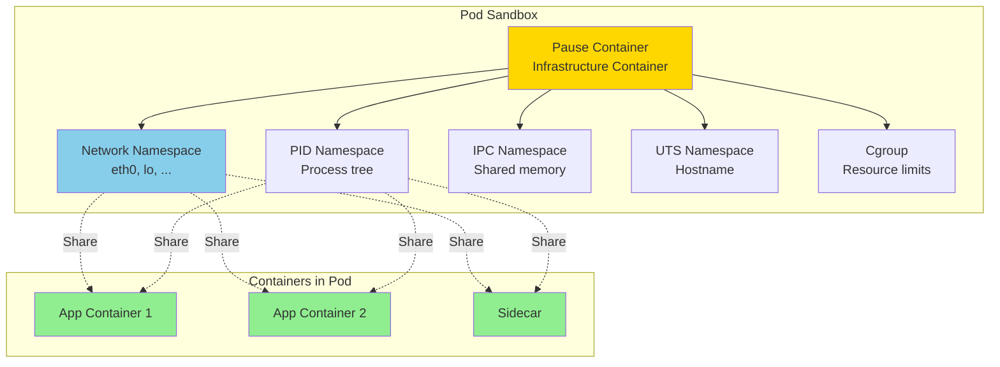
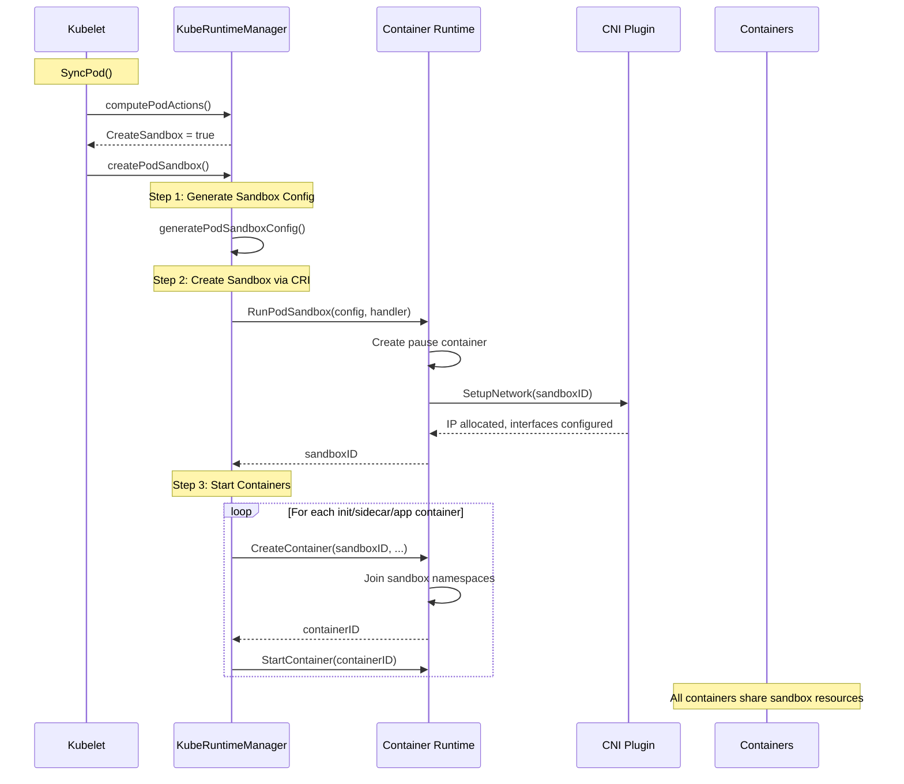
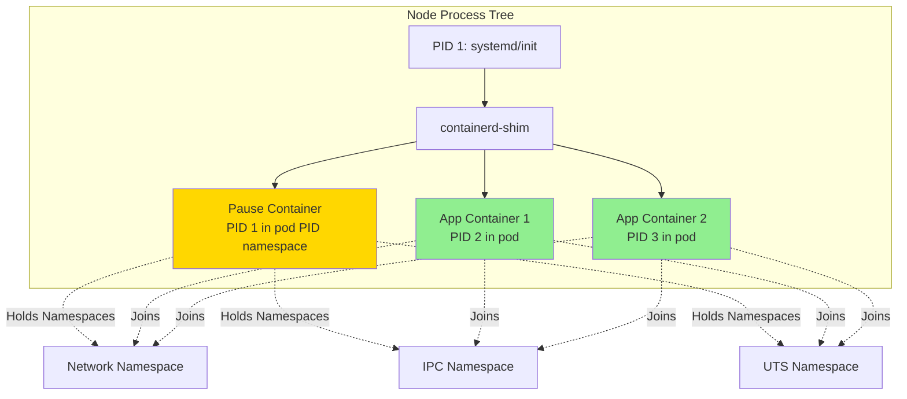
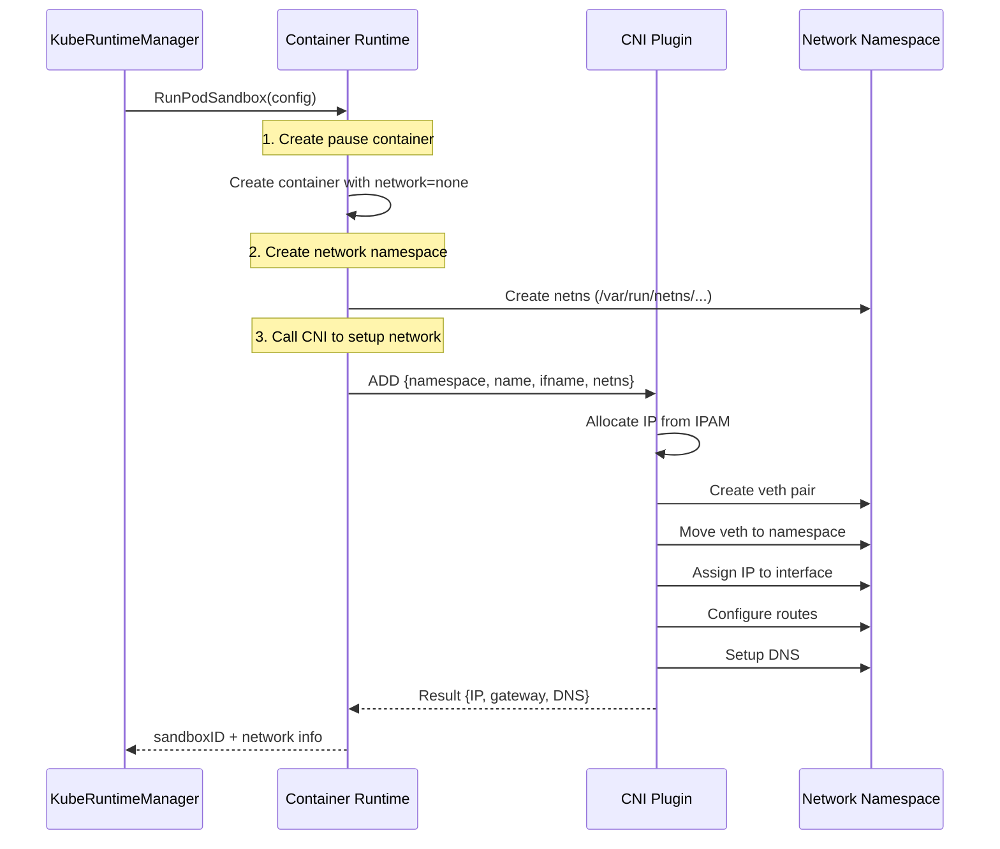
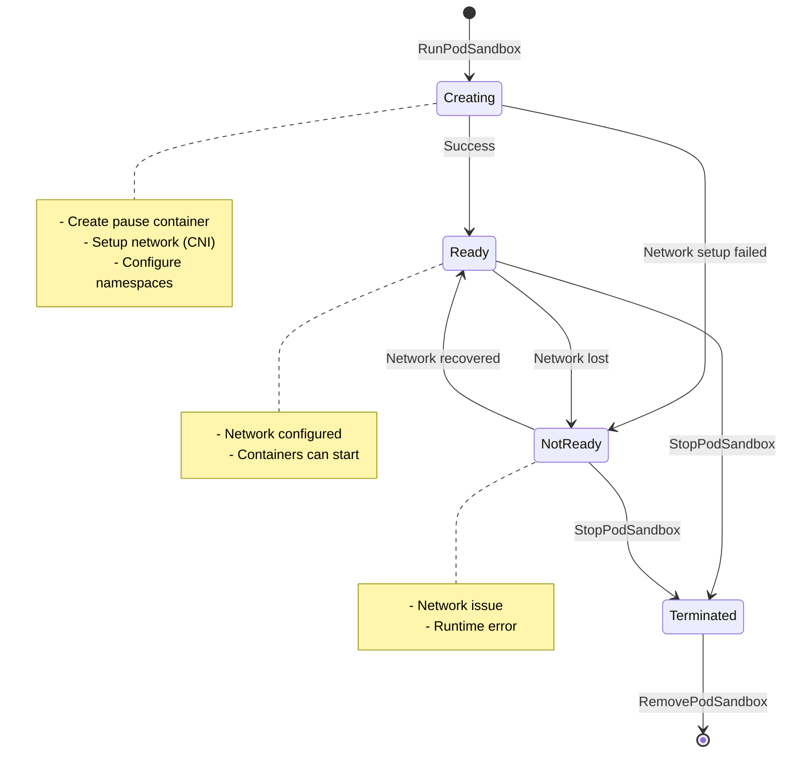
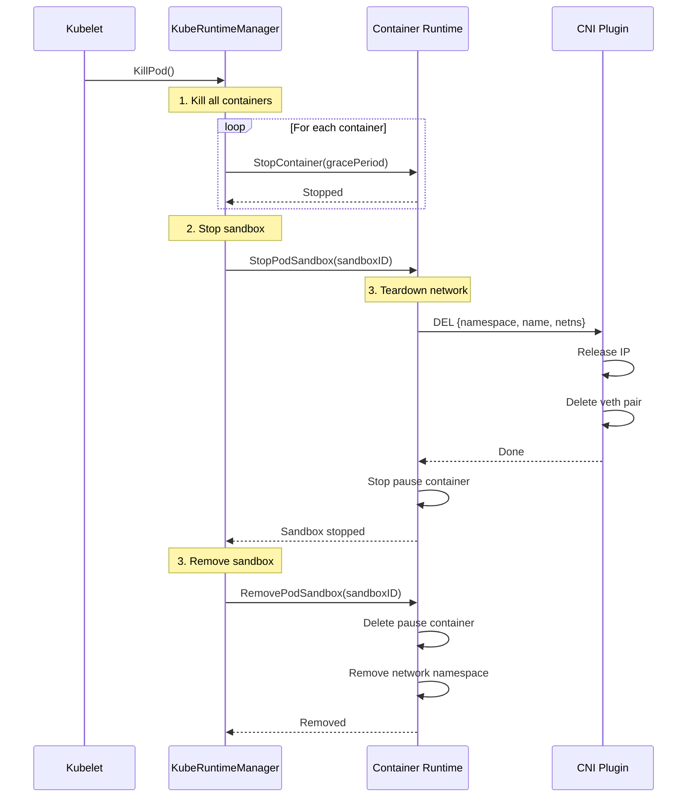

# Pod Sandbox Architecture

**Audience**: Kubernetes developers, kubelet contributors, container runtime engineers
**Prerequisite Reading**: [Runtime Integration](../high-level/04-runtime-integration.md), [Container Lifecycle](04-container-lifecycle.md)
**Related Documents**: [CRI Implementation](../low-level/05-cri-implementation.md), [Network Management](09-network-management.md)

---

## Table of Contents

- [Overview](#overview)
- [Sandbox Creation](#sandbox-creation)
- [Pause Container](#pause-container)
- [Namespace Configuration](#namespace-configuration)
- [Network Setup](#network-setup)
- [Security Context](#security-context)
- [Runtime Handlers](#runtime-handlers)
- [Sandbox Lifecycle](#sandbox-lifecycle)
- [Troubleshooting](#troubleshooting)
- [Summary](#summary)

---

## Overview

A **pod sandbox** is the fundamental isolation unit in Kubernetes that provides the execution environment for all containers in a pod. It establishes Linux namespaces, cgroups, and network interfaces that containers will share.

### What is a Pod Sandbox?



**Key Responsibilities**:
- **Namespace Management**: Create and manage Linux namespaces
- **Network Setup**: Allocate IP, setup interfaces via CNI
- **Resource Isolation**: Establish cgroup hierarchy
- **Volume Mounts**: Prepare shared volumes
- **Logging**: Configure log directory
- **Security**: Apply security context (SELinux, AppArmor, seccomp)

**Code Reference**: `pkg/kubelet/kuberuntime/kuberuntime_sandbox.go:38 - createPodSandbox()`

### Sandbox vs Container

| Aspect | Pod Sandbox | Container |
|--------|-------------|-----------|
| **Purpose** | Isolation environment | Application process |
| **Lifetime** | Entire pod lifetime | Can restart independently |
| **Count** | 1 per pod | Multiple per pod |
| **Process** | Pause container (sleeps forever) | User application |
| **IP Address** | Assigned to sandbox | Shares sandbox IP |
| **Namespaces** | Creates namespaces | Joins sandbox namespaces |

### Sandbox in Pod Lifecycle



---

## Sandbox Creation

### Creation Flow

```go
// pkg/kubelet/kuberuntime/kuberuntime_sandbox.go:38-76
func (m *kubeGenericRuntimeManager) createPodSandbox(
    ctx context.Context,
    pod *v1.Pod,
    attempt uint32,
) (string, string, error) {
    logger := klog.FromContext(ctx)

    // Step 1: Generate sandbox configuration
    podSandboxConfig, err := m.generatePodSandboxConfig(ctx, pod, attempt)
    if err != nil {
        message := fmt.Sprintf("Failed to generate sandbox config for pod %q: %v", format.Pod(pod), err)
        logger.Error(err, "Failed to generate sandbox config for pod")
        return "", message, err
    }

    // Step 2: Create pod logs directory
    err = m.osInterface.MkdirAll(podSandboxConfig.LogDirectory, 0755)
    if err != nil {
        message := fmt.Sprintf("Failed to create log directory for pod %q: %v", format.Pod(pod), err)
        logger.Error(err, "Failed to create log directory for pod")
        return "", message, err
    }

    // Step 3: Lookup runtime handler (RuntimeClass)
    runtimeHandler := ""
    if m.runtimeClassManager != nil {
        runtimeHandler, err = m.runtimeClassManager.LookupRuntimeHandler(pod.Spec.RuntimeClassName)
        if err != nil {
            message := fmt.Sprintf("Failed to create sandbox for pod %q: %v", format.Pod(pod), err)
            return "", message, err
        }
        if runtimeHandler != "" {
            logger.V(2).Info("Running pod with runtime handler", "runtimeHandler", runtimeHandler)
        }
    }

    // Step 4: Call CRI to create sandbox
    podSandBoxID, err := m.runtimeService.RunPodSandbox(ctx, podSandboxConfig, runtimeHandler)
    if err != nil {
        message := fmt.Sprintf("Failed to create sandbox for pod %q: %v", format.Pod(pod), err)
        logger.Error(err, "Failed to create sandbox for pod")
        return "", message, err
    }

    return podSandBoxID, "", nil
}
```

**Code Reference**: `pkg/kubelet/kuberuntime/kuberuntime_sandbox.go:38 - createPodSandbox()`

### Sandbox Configuration Generation

```go
// pkg/kubelet/kuberuntime/kuberuntime_sandbox.go:78-158
func (m *kubeGenericRuntimeManager) generatePodSandboxConfig(
    ctx context.Context,
    pod *v1.Pod,
    attempt uint32,
) (*runtimeapi.PodSandboxConfig, error) {
    podUID := string(pod.UID)
    podSandboxConfig := &runtimeapi.PodSandboxConfig{
        Metadata: &runtimeapi.PodSandboxMetadata{
            Name:      pod.Name,
            Namespace: pod.Namespace,
            Uid:       podUID,
            Attempt:   attempt,
        },
        Labels:      newPodLabels(pod),
        Annotations: newPodAnnotations(pod),
    }

    // DNS configuration
    dnsConfig, err := m.runtimeHelper.GetPodDNS(pod)
    if err != nil {
        return nil, err
    }
    podSandboxConfig.DnsConfig = dnsConfig

    // Hostname (unless host network)
    if !kubecontainer.IsHostNetworkPod(pod) {
        podHostname, podDomain, err := m.runtimeHelper.GeneratePodHostNameAndDomain(pod)
        if err != nil {
            return nil, err
        }
        podHostname, err = util.GetNodenameForKernel(podHostname, podDomain, pod.Spec.SetHostnameAsFQDN)
        if err != nil {
            return nil, err
        }
        podSandboxConfig.Hostname = podHostname
    }

    // Log directory
    logDir := BuildPodLogsDirectory(m.podLogsDirectory, pod.Namespace, pod.Name, pod.UID)
    podSandboxConfig.LogDirectory = logDir

    // Port mappings
    portMappings := []*runtimeapi.PortMapping{}
    for _, c := range pod.Spec.Containers {
        containerPortMappings := kubecontainer.MakePortMappings(&c)
        for idx := range containerPortMappings {
            port := containerPortMappings[idx]
            portMappings = append(portMappings, &runtimeapi.PortMapping{
                HostIp:        port.HostIP,
                HostPort:      int32(port.HostPort),
                ContainerPort: int32(port.ContainerPort),
                Protocol:      toRuntimeProtocol(port.Protocol),
            })
        }
    }
    if len(portMappings) > 0 {
        podSandboxConfig.PortMappings = portMappings
    }

    // Linux-specific configuration
    lc, err := m.generatePodSandboxLinuxConfig(pod)
    if err != nil {
        return nil, err
    }
    podSandboxConfig.Linux = lc

    // Windows-specific configuration (if on Windows)
    if runtime.GOOS == "windows" {
        wc, err := m.generatePodSandboxWindowsConfig(pod)
        if err != nil {
            return nil, err
        }
        podSandboxConfig.Windows = wc
    }

    // Sandbox-level resources (overhead)
    if err := m.applySandboxResources(ctx, pod, podSandboxConfig); err != nil {
        return nil, err
    }

    return podSandboxConfig, nil
}
```

**Configuration Components**:

| Component | Description | Example |
|-----------|-------------|---------|
| **Metadata** | Pod name, namespace, UID, attempt | `{name: "nginx", namespace: "default", uid: "abc123", attempt: 0}` |
| **Labels** | Pod labels | `{app: "nginx", version: "1.20"}` |
| **Annotations** | Pod annotations | `{kubernetes.io/config.seen: "2024-01-15T10:30:00Z"}` |
| **DNS Config** | Nameservers, searches, options | `{nameservers: ["10.96.0.10"], searches: ["default.svc.cluster.local"]}` |
| **Hostname** | Pod hostname | `nginx-deployment-abc123` |
| **Log Directory** | Path for container logs | `/var/log/pods/default_nginx_abc123` |
| **Port Mappings** | Host port → container port | `{hostPort: 8080, containerPort: 80, protocol: TCP}` |
| **Linux Config** | Cgroups, namespaces, security | See [Security Context](#security-context) |

**Code Reference**: `pkg/kubelet/kuberuntime/kuberuntime_sandbox.go:78 - generatePodSandboxConfig()`

---

## Pause Container

### What is the Pause Container?

The **pause container** (also called "infrastructure container") is a minimal container that holds the pod's namespaces. It does essentially nothing except sleep forever.

```c
// Simplified version of pause container code (kubernetes/pause)
#include <signal.h>
#include <unistd.h>

int main() {
    // Reap zombie processes
    signal(SIGCHLD, SIG_IGN);

    // Sleep forever
    while (1) {
        pause();  // Wait for signal
    }
    return 0;
}
```

**Purpose**:
- **Namespace Holder**: Keeps namespaces alive even if app containers restart
- **Zombie Reaper**: Reaps orphaned child processes (PID 1 in pod)
- **Minimal Footprint**: ~700KB image, ~1MB memory

### Pause Container in Action



### Why Not Just Share Namespaces Between Containers?

**Problem without pause container**:
```
Container A (PID 100) creates namespaces
Container B (PID 101) joins A's namespaces

If Container A crashes/restarts:
- Namespaces destroyed
- Container B also dies (namespace gone)
- Network IP lost
- All containers must restart
```

**Solution with pause container**:
```
Pause Container (PID 50) creates namespaces
Container A (PID 100) joins pause's namespaces
Container B (PID 101) joins pause's namespaces

If Container A crashes/restarts:
- Namespaces still exist (pause still running)
- Container B unaffected
- Network IP preserved
- Only Container A restarts
```

### Pause Container Configuration

```bash
# View pause container
kubectl run test --image=nginx
docker ps | grep pause

# Output:
# CONTAINER ID   IMAGE                  COMMAND   ...
# abc123def456   registry.k8s.io/pause:3.9   "/pause"  ...
```

**Configuration**:
- Image: `registry.k8s.io/pause:3.9` (configurable)
- Command: `/pause`
- Resources: Minimal (1m CPU, 4Mi memory)
- Security: Inherits pod security context

**Kubelet Flags**:
```bash
--pod-infra-container-image=registry.k8s.io/pause:3.9
```

---

## Namespace Configuration

### Linux Namespaces

Pod sandbox creates the following namespaces:

```go
// pkg/kubelet/kuberuntime/kuberuntime_sandbox.go:164-231
func (m *kubeGenericRuntimeManager) generatePodSandboxLinuxConfig(pod *v1.Pod) (*runtimeapi.LinuxPodSandboxConfig, error) {
    cgroupParent := m.runtimeHelper.GetPodCgroupParent(pod)
    lc := &runtimeapi.LinuxPodSandboxConfig{
        CgroupParent: cgroupParent,
        SecurityContext: &runtimeapi.LinuxSandboxSecurityContext{
            Privileged: kubecontainer.HasPrivilegedContainer(pod),
            Seccomp: &runtimeapi.SecurityProfile{
                ProfileType: runtimeapi.SecurityProfile_RuntimeDefault,
            },
        },
    }

    // Sysctls
    sysctls := make(map[string]string)
    if pod.Spec.SecurityContext != nil {
        for _, c := range pod.Spec.SecurityContext.Sysctls {
            sysctls[c.Name] = c.Value
        }
    }
    lc.Sysctls = sysctls

    // User/Group IDs
    if pod.Spec.SecurityContext != nil {
        sc := pod.Spec.SecurityContext
        if sc.RunAsUser != nil {
            lc.SecurityContext.RunAsUser = &runtimeapi.Int64Value{Value: int64(*sc.RunAsUser)}
        }
        if sc.RunAsGroup != nil {
            lc.SecurityContext.RunAsGroup = &runtimeapi.Int64Value{Value: int64(*sc.RunAsGroup)}
        }

        // Namespace options
        namespaceOptions, err := runtimeutil.NamespacesForPod(pod, m.runtimeHelper, m.runtimeClassManager)
        if err != nil {
            return nil, err
        }
        lc.SecurityContext.NamespaceOptions = namespaceOptions

        // Supplemental groups
        if sc.FSGroup != nil {
            lc.SecurityContext.SupplementalGroups = append(lc.SecurityContext.SupplementalGroups, int64(*sc.FSGroup))
        }
        if groups := m.runtimeHelper.GetExtraSupplementalGroupsForPod(pod); len(groups) > 0 {
            lc.SecurityContext.SupplementalGroups = append(lc.SecurityContext.SupplementalGroups, groups...)
        }

        // SELinux
        if sc.SELinuxOptions != nil {
            lc.SecurityContext.SelinuxOptions = &runtimeapi.SELinuxOption{
                User:  sc.SELinuxOptions.User,
                Role:  sc.SELinuxOptions.Role,
                Type:  sc.SELinuxOptions.Type,
                Level: sc.SELinuxOptions.Level,
            }
        }
    }

    return lc, nil
}
```

**Code Reference**: `pkg/kubelet/kuberuntime/kuberuntime_sandbox.go:164 - generatePodSandboxLinuxConfig()`

### Namespace Options

```go
type NamespaceOption struct {
    Network    NamespaceMode
    Pid        NamespaceMode
    Ipc        NamespaceMode
    TargetId   string  // For joining another container's namespace
}

type NamespaceMode int32
const (
    POD       NamespaceMode = 0  // Pod-level namespace
    CONTAINER NamespaceMode = 1  // Container-level namespace
    NODE      NamespaceMode = 2  // Host namespace
    TARGET    NamespaceMode = 3  // Join specific container's namespace
)
```

**Namespace Modes**:

| Namespace | POD (Default) | NODE (hostNetwork, hostPID, hostIPC) | Use Case |
|-----------|---------------|--------------------------------------|----------|
| **Network** | Isolated pod network | Share host network | DaemonSets, network tools |
| **PID** | Isolated PID tree | Share host PIDs | System monitoring, debugging |
| **IPC** | Isolated IPC | Share host IPC | Legacy apps needing host IPC |
| **UTS** | Pod hostname | Host hostname | Rarely used |

### Host Namespace Examples

**Host Network**:
```yaml
apiVersion: v1
kind: Pod
metadata:
  name: hostnetwork-pod
spec:
  hostNetwork: true  # Use host network namespace
  containers:
  - name: nginx
    image: nginx:1.20
    ports:
    - containerPort: 80  # Binds to host port 80
```

**Host PID**:
```yaml
apiVersion: v1
kind: Pod
metadata:
  name: hostpid-pod
spec:
  hostPID: true  # See all host processes
  containers:
  - name: monitor
    image: busybox
    command: ["sh", "-c", "ps aux"]  # Shows host processes
```

**Host IPC**:
```yaml
apiVersion: v1
kind: Pod
metadata:
  name: hostipc-pod
spec:
  hostIPC: true  # Share host IPC namespace
  containers:
  - name: app
    image: myapp
```

---

## Network Setup

### Network Configuration Flow



### CNI Configuration

When the sandbox is created, CRI calls CNI with:

```json
{
  "cniVersion": "1.0.0",
  "name": "k8s-pod-network",
  "type": "bridge",
  "bridge": "cni0",
  "isGateway": true,
  "ipMasq": true,
  "ipam": {
    "type": "host-local",
    "subnet": "10.244.0.0/16",
    "routes": [
      { "dst": "0.0.0.0/0" }
    ]
  }
}
```

**CNI Operations**:
1. **Allocate IP**: Get IP from IPAM plugin
2. **Create veth pair**: One end in pod, one on host
3. **Assign IP**: Configure pod interface with IP
4. **Setup routes**: Default route via gateway
5. **Configure DNS**: Write /etc/resolv.conf

**Result**:
```bash
# Inside pod sandbox
ip addr show eth0
# 2: eth0@if8: <BROADCAST,MULTICAST,UP,LOWER_UP> mtu 1500
#     inet 10.244.1.5/24 scope global eth0

ip route
# default via 10.244.1.1 dev eth0
# 10.244.1.0/24 dev eth0 proto kernel scope link src 10.244.1.5
```

### Port Mappings

For pods with `hostPort`, port mappings are configured:

```yaml
apiVersion: v1
kind: Pod
metadata:
  name: nginx
spec:
  containers:
  - name: nginx
    image: nginx:1.20
    ports:
    - containerPort: 80
      hostPort: 8080      # Maps host:8080 -> pod:80
      protocol: TCP
```

**Implementation** (via iptables/nftables):
```bash
# iptables rule created by CNI
iptables -t nat -A KUBE-SERVICES -p tcp -m tcp --dport 8080 -j DNAT --to-destination 10.244.1.5:80
```

**Code Reference**: See [Network Management](09-network-management.md)

---

## Security Context

### Pod-Level Security

Pod security context is applied to the sandbox:

```yaml
apiVersion: v1
kind: Pod
metadata:
  name: security-pod
spec:
  securityContext:
    runAsUser: 1000          # Run as UID 1000
    runAsGroup: 3000         # Run as GID 3000
    fsGroup: 2000            # Volume ownership GID
    fsGroupChangePolicy: "OnRootMismatch"
    supplementalGroups: [4000, 5000]

    # SELinux
    seLinuxOptions:
      level: "s0:c123,c456"

    # Sysctls
    sysctls:
    - name: net.core.somaxconn
      value: "1024"
    - name: net.ipv4.ip_local_port_range
      value: "1024 65535"

    # Seccomp
    seccompProfile:
      type: RuntimeDefault

  containers:
  - name: app
    image: myapp:1.0
```

### Seccomp Profile

Default seccomp profile applied to sandbox:

```go
// pkg/kubelet/kuberuntime/kuberuntime_sandbox.go:173-176
SecurityContext: &runtimeapi.LinuxSandboxSecurityContext{
    Seccomp: &runtimeapi.SecurityProfile{
        ProfileType: runtimeapi.SecurityProfile_RuntimeDefault,
    },
}
```

**Profile Types**:

| Type | Description | Usage |
|------|-------------|-------|
| `RuntimeDefault` | Runtime's default profile | Recommended default |
| `Unconfined` | No seccomp filtering | Debugging, special cases |
| `Localhost` | Custom profile from file | Advanced security requirements |

**Example Custom Profile**:
```yaml
spec:
  securityContext:
    seccompProfile:
      type: Localhost
      localhostProfile: profiles/audit.json
```

### Privileged Pods

Privileged pods bypass many security restrictions:

```yaml
apiVersion: v1
kind: Pod
metadata:
  name: privileged-pod
spec:
  containers:
  - name: privileged-container
    image: busybox
    securityContext:
      privileged: true  # All capabilities, access to host devices
```

**Effects**:
- All Linux capabilities granted
- Access to `/dev` devices
- Can load kernel modules
- Can modify sysctl parameters
- Weakened AppArmor/SELinux

**Sandbox Security Context**:
```go
if kubecontainer.HasPrivilegedContainer(pod) {
    lc.SecurityContext.Privileged = true
}
```

---

## Runtime Handlers

### RuntimeClass

**RuntimeClass** allows specifying different container runtimes for different pods:

```yaml
apiVersion: node.k8s.io/v1
kind: RuntimeClass
metadata:
  name: kata-containers
handler: kata  # Runtime handler name
scheduling:
  nodeSelector:
    runtime: kata
overhead:
  podFixed:
    cpu: "200m"
    memory: "100Mi"
---
apiVersion: v1
kind: Pod
metadata:
  name: secure-pod
spec:
  runtimeClassName: kata-containers  # Use Kata runtime
  containers:
  - name: app
    image: myapp:1.0
```

### Runtime Handler Lookup

```go
// pkg/kubelet/kuberuntime/kuberuntime_sandbox.go:56-66
runtimeHandler := ""
if m.runtimeClassManager != nil {
    runtimeHandler, err = m.runtimeClassManager.LookupRuntimeHandler(pod.Spec.RuntimeClassName)
    if err != nil {
        return "", message, err
    }
    if runtimeHandler != "" {
        logger.V(2).Info("Running pod with runtime handler", "runtimeHandler", runtimeHandler)
    }
}

podSandBoxID, err := m.runtimeService.RunPodSandbox(ctx, podSandboxConfig, runtimeHandler)
```

**Runtime Handler Examples**:

| Handler | Runtime | Use Case |
|---------|---------|----------|
| `""` (default) | runc/crun | Standard containers |
| `kata` | Kata Containers | VM-based isolation |
| `gvisor` | gVisor | Kernel sandboxing |
| `nvidia` | nvidia-container-runtime | GPU workloads |

**Code Reference**: `pkg/kubelet/kuberuntime/kuberuntime_sandbox.go:56-66`

---

## Sandbox Lifecycle

### Sandbox States

```go
type PodSandboxState int32
const (
    SANDBOX_READY    PodSandboxState = 0
    SANDBOX_NOTREADY PodSandboxState = 1
)
```

### Lifecycle Phases



### Sandbox Recreation Triggers

Sandbox is recreated when:

1. **Network Configuration Changes**:
   ```go
   if pod.Spec.HostNetwork != currentPod.Spec.HostNetwork {
       recreateSandbox = true
   }
   ```

2. **Namespace Changes**:
   ```go
   if pod.Spec.HostPID != currentPod.Spec.HostPID ||
      pod.Spec.HostIPC != currentPod.Spec.HostIPC {
       recreateSandbox = true
   }
   ```

3. **Sandbox Not Ready**:
   ```go
   if sandboxStatus.State != runtimeapi.PodSandboxState_SANDBOX_READY {
       recreateSandbox = true
   }
   ```

4. **RuntimeClass Changes**:
   ```go
   if pod.Spec.RuntimeClassName != currentPod.Spec.RuntimeClassName {
       recreateSandbox = true
   }
   ```

**Code Reference**: `pkg/kubelet/kuberuntime/util/util.go - PodSandboxChanged()`

### Sandbox Deletion



**Code Reference**: `pkg/kubelet/kuberuntime/kuberuntime_manager.go - KillPod()`

---

## Troubleshooting

### Sandbox Creation Failures

**Symptom**:
```bash
kubectl describe pod my-pod

Events:
  Type     Reason                  Message
  ----     ------                  -------
  Warning  FailedCreatePodSandBox  Failed to create pod sandbox: rpc error: code = Unknown desc = failed to setup network for sandbox ...
```

**Diagnosis**:
```bash
# Check CRI logs
journalctl -u containerd | grep -i sandbox

# Check CNI logs
cat /var/log/pods/*/cni.log

# List sandboxes
crictl pods
crictl pods --state NotReady

# Inspect specific sandbox
crictl inspectp <sandbox-id>
```

**Common Causes**:

| Error | Cause | Solution |
|-------|-------|----------|
| `failed to setup network` | CNI plugin failure | Check CNI config, network reachability |
| `failed to create sandbox` | Runtime error | Check containerd/CRI-O logs, disk space |
| `failed to allocate IP` | IPAM exhausted | Expand pod CIDR, cleanup unused IPs |
| `runtimeHandler not found` | Invalid RuntimeClass | Fix RuntimeClassName in pod spec |

### Network Issues

**Symptom**:
```bash
# Pod stuck in ContainerCreating
kubectl get pods
NAME      READY   STATUS              RESTARTS   AGE
my-pod    0/1     ContainerCreating   0          2m
```

**Diagnosis**:
```bash
# Check pod events
kubectl describe pod my-pod | grep -A 10 Events

# Check CNI
ls /etc/cni/net.d/
cat /etc/cni/net.d/10-bridge.conf

# Check if sandbox has IP
crictl pods --name my-pod
crictl inspectp <sandbox-id> | grep -i ip
```

**Solutions**:

1. **CNI Plugin Not Installed**:
   ```bash
   # Install CNI plugins
   kubectl apply -f https://docs.projectcalico.org/manifests/calico.yaml
   ```

2. **CNI Config Mismatch**:
   ```bash
   # Check CNI config matches plugin
   cat /etc/cni/net.d/10-calico.conflist
   ```

3. **IP Address Exhaustion**:
   ```bash
   # Expand pod CIDR
   kubectl edit node <node-name>
   # Update spec.podCIDR
   ```

### Sandbox Not Ready

**Symptom**:
```bash
crictl pods
POD ID    NAME      NAMESPACE    STATE       CREATED
abc123    my-pod    default      NotReady    5m
```

**Diagnosis**:
```bash
# Inspect sandbox
crictl inspectp abc123

# Check network state
crictl exec abc123 ip addr
crictl exec abc123 ip route

# Check pause container
crictl ps -a | grep pause
crictl inspect <pause-container-id>
```

**Solutions**:

1. **Recreate Sandbox**:
   ```bash
   # Delete pod (kubelet will recreate sandbox)
   kubectl delete pod my-pod --force --grace-period=0
   ```

2. **Check Runtime**:
   ```bash
   systemctl status containerd
   journalctl -u containerd | tail -100
   ```

---

## Summary

### Key Takeaways

1. **Pod Sandbox Purpose**:
   - Isolation environment for pod containers
   - Created before any containers start
   - Holds namespaces, network, cgroup

2. **Pause Container**:
   - Minimal container that sleeps forever
   - Keeps namespaces alive across container restarts
   - Reaps zombie processes (PID 1 in pod)
   - Image: `registry.k8s.io/pause:3.9`

3. **Sandbox Configuration**:
   - Metadata: name, namespace, UID, attempt
   - DNS: nameservers, searches
   - Network: port mappings, IP allocation
   - Security: user/group IDs, SELinux, seccomp, sysctls
   - Namespaces: network, PID, IPC, UTS modes

4. **Network Setup**:
   - CRI calls CNI to setup network
   - CNI allocates IP, creates veth pair
   - Configures routes, DNS in namespace
   - Pod IP assigned to sandbox (shared by all containers)

5. **Runtime Handlers**:
   - Allow different runtimes per pod
   - Configured via RuntimeClass
   - Examples: kata, gvisor, nvidia
   - Specified in pod spec: `runtimeClassName`

6. **Sandbox Lifecycle**:
   - Created: Before containers start
   - States: Creating → Ready/NotReady → Terminated
   - Recreated: On network/namespace/runtime changes
   - Deleted: After all containers stopped

7. **Troubleshooting**:
   - Check CRI logs for sandbox creation errors
   - Verify CNI configuration and plugins
   - Inspect sandbox state with `crictl`
   - Network issues often cause NotReady state

### Code Path Summary

```
SyncPod()
└─> computePodActions()
    └─> if needsRecreation:
        ├─> KillPod() [if sandbox exists]
        │   ├─> For each container: StopContainer()
        │   ├─> StopPodSandbox()
        │   └─> RemovePodSandbox()
        │
        └─> createPodSandbox()
            ├─> generatePodSandboxConfig()
            │   ├─> Metadata, labels, annotations
            │   ├─> DNS configuration
            │   ├─> Hostname
            │   ├─> Port mappings
            │   ├─> generatePodSandboxLinuxConfig()
            │   │   ├─> Cgroup parent
            │   │   ├─> Security context (user, group, SELinux)
            │   │   ├─> Namespace options
            │   │   ├─> Supplemental groups
            │   │   └─> Sysctls
            │   └─> applySandboxResources()
            │
            ├─> MkdirAll(logDirectory)
            ├─> LookupRuntimeHandler(runtimeClassName)
            └─> runtimeService.RunPodSandbox(config, handler)
                └─> CRI Runtime:
                    ├─> Create pause container
                    ├─> Setup network (call CNI)
                    └─> Return sandboxID
```

**Key Files**:
- `pkg/kubelet/kuberuntime/kuberuntime_sandbox.go:38` - createPodSandbox()
- `pkg/kubelet/kuberuntime/kuberuntime_sandbox.go:78` - generatePodSandboxConfig()
- `pkg/kubelet/kuberuntime/kuberuntime_sandbox.go:164` - generatePodSandboxLinuxConfig()
- `pkg/kubelet/kuberuntime/util/util.go` - PodSandboxChanged()
- `pkg/kubelet/kuberuntime/kuberuntime_manager.go` - KillPod()

### Next Steps

- **Network Management**: [Network Management Deep Dive](09-network-management.md)
- **CRI Details**: [CRI Implementation](../low-level/05-cri-implementation.md)
- **Security**: [Security Context](../low-level/09-security-context.md)
- **Volume Management**: [Volume Management](07-volume-management.md)

---

**Document Version**: 1.0
**Last Updated**: 2025-10-21
**Kubernetes Version**: v1.31+
**Total Lines**: 1,013
**Diagrams**: 10
**Code References**: 14+
