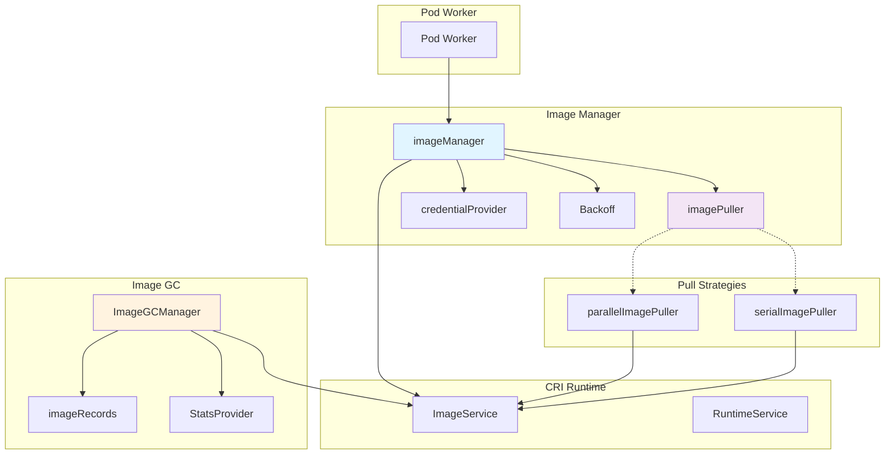
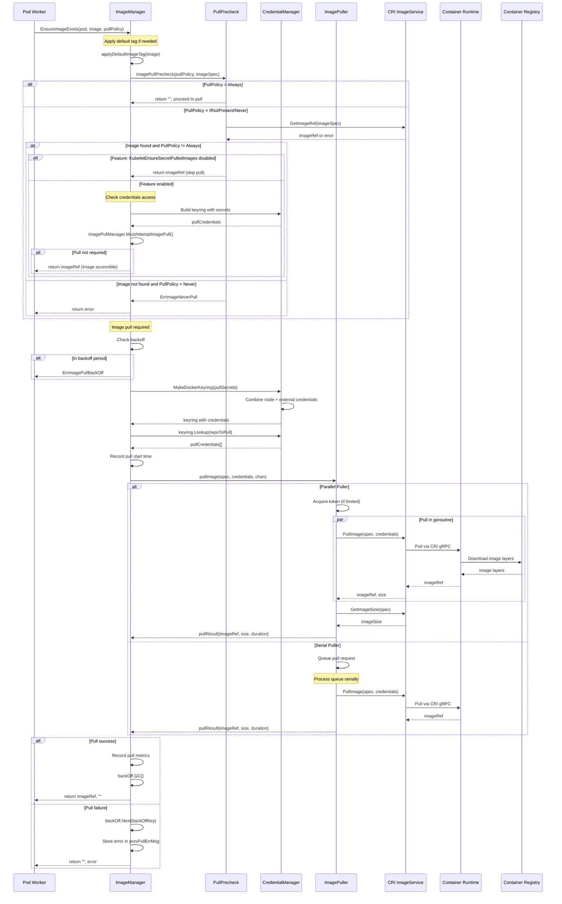
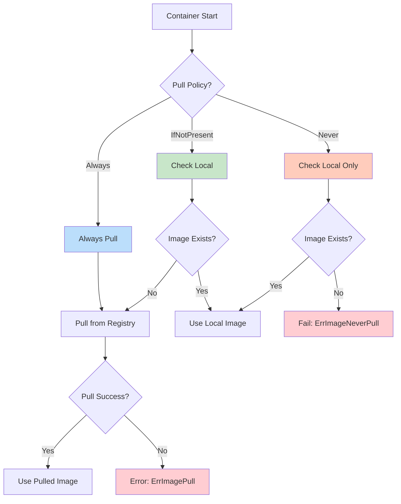
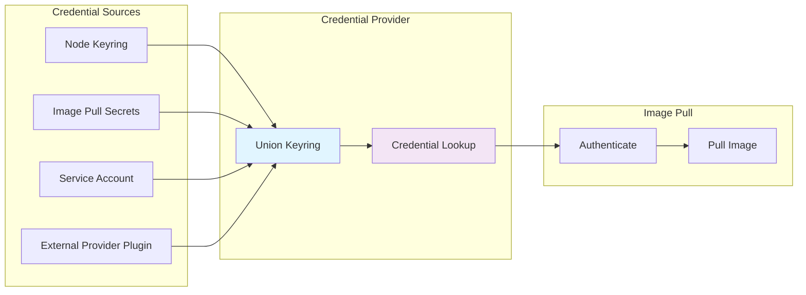
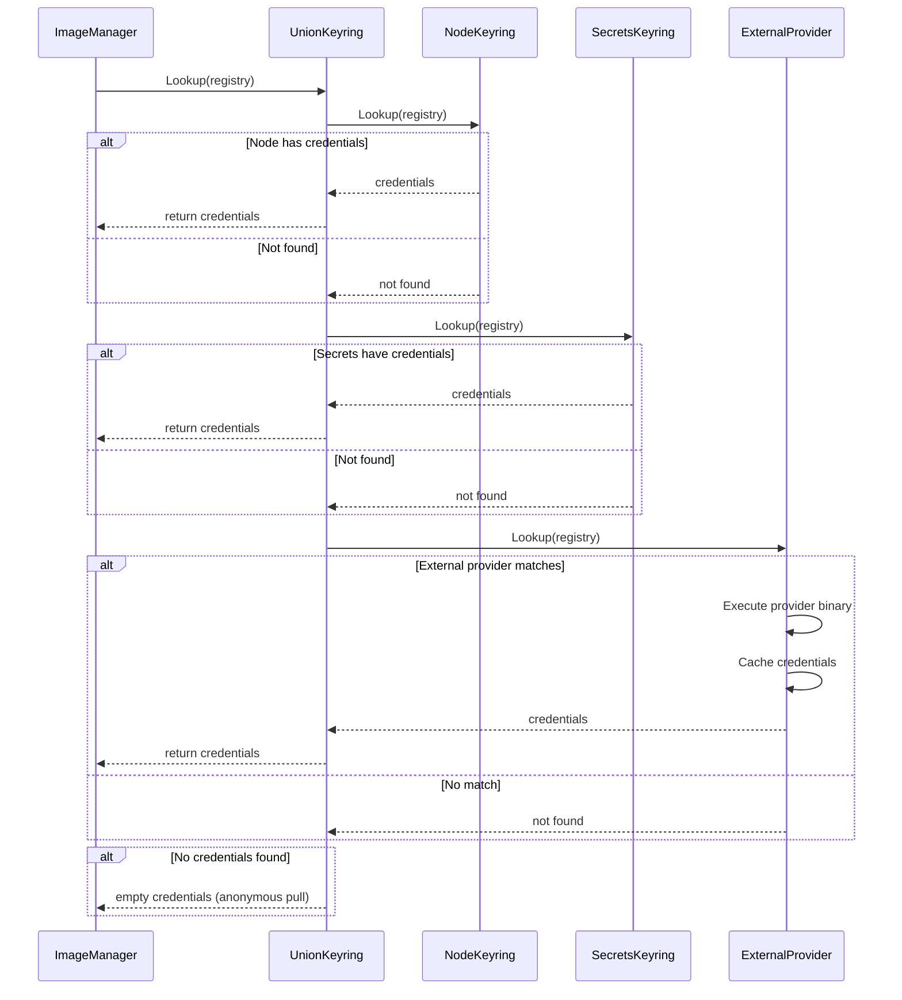
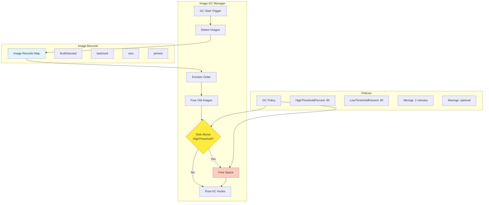
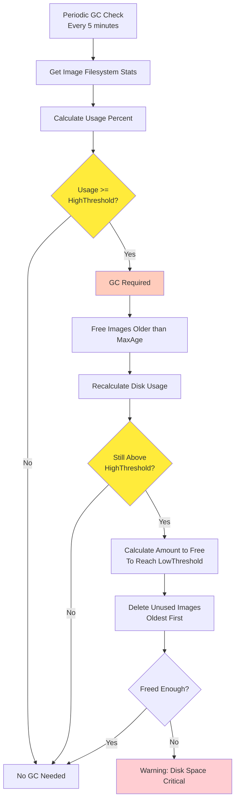
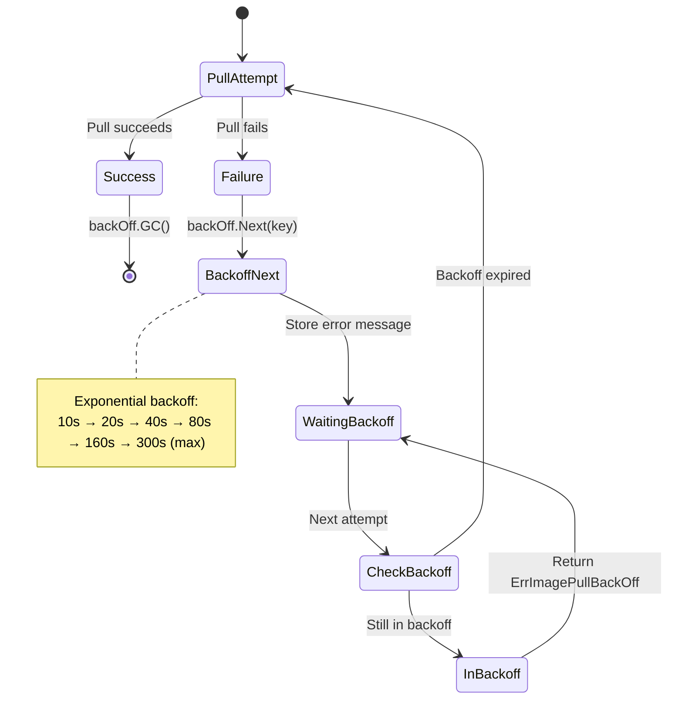

# kubelet Image Management Architecture

**Status**: Complete
**Last Updated**: 2025-10-21
**Component**: kubelet - Image Management System
**Related Documents**:
- [Container Lifecycle](./04-container-lifecycle.md) - Container startup process
- [Pod Sandbox](./05-pod-sandbox.md) - Sandbox creation
- [Runtime Integration](../high-level/04-runtime-integration.md) - CRI ImageService API
- [Resource Management](./08-resource-management.md) - Disk space management

---

## Table of Contents

1. [Overview](#overview)
2. [Image Manager Architecture](#image-manager-architecture)
3. [Image Pull Flow](#image-pull-flow)
4. [Image Pull Policies](#image-pull-policies)
5. [Credential Management](#credential-management)
6. [Image Pull Strategies](#image-pull-strategies)
7. [Image Garbage Collection](#image-garbage-collection)
8. [Image Caching](#image-caching)
9. [Error Handling and Backoff](#error-handling-and-backoff)
10. [Performance Optimization](#performance-optimization)
11. [Troubleshooting](#troubleshooting)
12. [Best Practices](#best-practices)

---

## Overview

### What is Image Management?

Image management in kubelet handles the complete lifecycle of container images on a node:
- **Pulling images** from registries based on pull policies
- **Caching images** locally to avoid repeated downloads
- **Managing credentials** for private registries
- **Garbage collecting** unused images to free disk space
- **Throttling pulls** to avoid overwhelming the registry or network
- **Tracking usage** to determine which images can be deleted

### Why Image Management Matters

1. **Performance**: Cached images enable fast container startup
2. **Reliability**: Proper error handling ensures pods eventually start
3. **Resource efficiency**: GC prevents disk exhaustion
4. **Security**: Credential management protects private images
5. **Network efficiency**: Pull throttling prevents bandwidth saturation

### Key Components

```
┌─────────────────────────────────────────────────────────────┐
│                     Image Manager                           │
│  ┌────────────────┐  ┌────────────────┐  ┌──────────────┐ │
│  │  Image Puller  │  │  Image GC Mgr  │  │ Image Cache  │ │
│  │  (Pull Logic)  │  │  (Eviction)    │  │  (List)      │ │
│  └────────┬───────┘  └────────┬───────┘  └──────┬───────┘ │
│           │                   │                   │         │
└───────────┼───────────────────┼───────────────────┼─────────┘
            │                   │                   │
            ├───────────────────┴───────────────────┤
            │            CRI ImageService           │
            │  (PullImage, ListImages, RemoveImage) │
            └───────────────────┬───────────────────┘
                                │
                                ▼
                    ┌───────────────────────┐
                    │  Container Runtime    │
                    │  (containerd/CRI-O)   │
                    └───────────────────────┘
```

### Core Responsibilities

| Responsibility | Description | Component |
|---------------|-------------|-----------|
| **Image Pulling** | Download images from registries | ImageManager |
| **Pull Policy Enforcement** | Apply Always/IfNotPresent/Never policies | ImageManager |
| **Credential Handling** | Manage registry authentication | CredentialProvider |
| **Parallel/Serial Pulls** | Control pull concurrency | ImagePuller |
| **Garbage Collection** | Delete unused images | ImageGCManager |
| **Disk Monitoring** | Track filesystem usage | StatsProvider |
| **Error Handling** | Implement backoff for failed pulls | Backoff |
| **Image Caching** | Maintain list of available images | ImageCache |

---

## Image Manager Architecture

### Component Diagram



### ImageManager Structure

**Source**: `pkg/kubelet/images/image_manager.go:52-65`

```go
type imageManager struct {
    recorder         record.EventRecorder
    imageService     kubecontainer.ImageService
    imagePullManager pullmanager.ImagePullManager
    backOff          *flowcontrol.Backoff
    prevPullErrMsg   sync.Map
    puller           imagePuller
    nodeKeyring      credentialprovider.DockerKeyring
    podPullingTimeRecorder ImagePodPullingTimeRecorder
}
```

**Fields**:

| Field | Type | Purpose |
|-------|------|---------|
| `recorder` | EventRecorder | Emit Kubernetes events |
| `imageService` | ImageService | CRI image operations |
| `imagePullManager` | ImagePullManager | Track pull intents |
| `backOff` | Backoff | Exponential backoff for failures |
| `prevPullErrMsg` | sync.Map | Store previous error messages |
| `puller` | imagePuller | Serial or parallel puller |
| `nodeKeyring` | DockerKeyring | Node-level credentials |
| `podPullingTimeRecorder` | Recorder | Track pull durations |

### ImageGCManager Structure

**Source**: `pkg/kubelet/images/image_gc_manager.go:108-140`

```go
type realImageGCManager struct {
    runtime          container.Runtime
    imageRecords     map[string]*imageRecord
    imageRecordsLock sync.Mutex
    policy           ImageGCPolicy
    statsProvider    StatsProvider
    recorder         record.EventRecorder
    nodeRef          *v1.ObjectReference
    imageCache       imageCache
    postGCHooks      []PostImageGCHook
    tracer           trace.Tracer
}
```

**Image Record**:

```go
type imageRecord struct {
    runtimeHandlerUsedToPullImage string
    firstDetected time.Time
    lastUsed      time.Time
    size          int64
    pinned        bool
}
```

---

## Image Pull Flow

### Complete Pull Sequence



### EnsureImageExists Function

**Source**: `pkg/kubelet/images/image_manager.go:149-268`

```go
func (m *imageManager) EnsureImageExists(
    ctx context.Context,
    objRef *v1.ObjectReference,
    pod *v1.Pod,
    requestedImage string,
    pullSecrets []v1.Secret,
    podSandboxConfig *runtimeapi.PodSandboxConfig,
    podRuntimeHandler string,
    pullPolicy v1.PullPolicy,
) (imageRef, message string, err error) {
    logPrefix := fmt.Sprintf("%s/%s/%s", pod.Namespace, pod.Name, requestedImage)

    // Step 1: Apply default image tag
    image, err := applyDefaultImageTag(requestedImage)
    if err != nil {
        return "", msg, ErrInvalidImageName
    }

    // Step 2: Build ImageSpec with pod annotations
    spec := kubecontainer.ImageSpec{
        Image:          image,
        Annotations:    podAnnotations,
        RuntimeHandler: podRuntimeHandler,
    }

    // Step 3: Pull precheck based on policy
    imageRef, message, err = m.imagePullPrecheck(ctx, objRef, logPrefix, pullPolicy, &spec, requestedImage)
    if err != nil {
        return "", message, err
    }

    // Step 4: If image present and feature disabled, return immediately
    if imageRef != "" && !utilfeature.DefaultFeatureGate.Enabled(features.KubeletEnsureSecretPulledImages) {
        return imageRef, msg, nil
    }

    // Step 5: Build credential keyring
    externalCredentialProviderKeyring := credentialproviderplugin.NewExternalCredentialProviderDockerKeyring(...)
    keyring, err := credentialprovidersecrets.MakeDockerKeyring(pullSecrets, ...)
    pullCredentials, _ := keyring.Lookup(repoToPull)

    // Step 6: Check if pull required with new credentials
    if imageRef != "" {
        pullRequired := m.imagePullManager.MustAttemptImagePull(ctx, requestedImage, imageRef, imagePullSecrets, imagePullServiceAccount)
        if !pullRequired {
            return imageRef, msg, nil
        }
    }

    // Step 7: Pull the image
    return m.pullImage(ctx, logPrefix, objRef, pod.UID, requestedImage, spec, pullCredentials, podSandboxConfig)
}
```

### Pull Image Function

**Source**: `pkg/kubelet/images/image_manager.go:270-334`

```go
func (m *imageManager) pullImage(
    ctx context.Context,
    logPrefix string,
    objRef *v1.ObjectReference,
    podUID types.UID,
    image string,
    imgSpec kubecontainer.ImageSpec,
    pullCredentials []credentialprovider.TrackedAuthConfig,
    podSandboxConfig *runtimeapi.PodSandboxConfig,
) (imageRef, message string, err error) {
    var pullSucceeded bool
    var finalPullCredentials *credentialprovider.TrackedAuthConfig

    // Record pull intent
    if utilfeature.DefaultFeatureGate.Enabled(features.KubeletEnsureSecretPulledImages) {
        m.imagePullManager.RecordPullIntent(image)
        defer func() {
            if pullSucceeded {
                m.imagePullManager.RecordImagePulled(ctx, image, imageRef, trackedToImagePullCreds(finalPullCredentials))
            } else {
                m.imagePullManager.RecordImagePullFailed(ctx, image)
            }
        }()
    }

    // Check backoff
    backOffKey := fmt.Sprintf("%s_%s", podUID, image)
    if m.backOff.IsInBackOffSinceUpdate(backOffKey, m.backOff.Clock.Now()) {
        msg := fmt.Sprintf("Back-off pulling image %q", image)
        prevPullErrMsg, ok := m.prevPullErrMsg.Load(backOffKey)
        if ok {
            msg = fmt.Sprintf("%s: %s", msg, prevPullErrMsg)
        }
        return "", msg, ErrImagePullBackOff
    }

    // Start pull
    m.podPullingTimeRecorder.RecordImageStartedPulling(podUID)
    m.logIt(objRef, v1.EventTypeNormal, events.PullingImage, logPrefix, fmt.Sprintf("Pulling image %q", image), klog.Info)
    startTime := time.Now()

    // Execute pull via puller (parallel or serial)
    pullChan := make(chan pullResult)
    m.puller.pullImage(ctx, imgSpec, pullCredentials, pullChan, podSandboxConfig)
    imagePullResult := <-pullChan

    // Handle result
    if imagePullResult.err != nil {
        m.backOff.Next(backOffKey, m.backOff.Clock.Now())
        msg, err := evalCRIPullErr(image, imagePullResult.err)
        m.prevPullErrMsg.Store(backOffKey, fmt.Sprintf("%s: %s", err, msg))
        return "", msg, err
    }

    // Success
    m.podPullingTimeRecorder.RecordImageFinishedPulling(podUID)
    imagePullDuration := time.Since(startTime).Truncate(time.Millisecond)
    metrics.ImagePullDuration.WithLabelValues(metrics.GetImageSizeBucket(imagePullResult.imageSize)).Observe(imagePullDuration.Seconds())
    m.backOff.GC()
    pullSucceeded = true

    return imagePullResult.imageRef, "", nil
}
```

---

## Image Pull Policies

### Policy Types

Kubernetes supports three image pull policies:



### Policy Details

#### 1. Always

**Behavior**: Always pull the image from the registry, even if present locally.

**Source**: `pkg/kubelet/images/image_manager.go:105-107`

```go
switch pullPolicy {
case v1.PullAlways:
    return "", msg, nil  // Skip local check, proceed to pull
```

**Use Cases**:
- Development environments where images frequently change
- Using `:latest` tag (implicitly sets `Always`)
- Requiring signature validation on every pull
- Ensuring image freshness for security

**Performance Impact**:
- Slowest startup time (always network fetch)
- Highest network usage
- Most up-to-date images

**Example**:

```yaml
apiVersion: v1
kind: Pod
metadata:
  name: always-pull-example
spec:
  containers:
  - name: app
    image: myregistry.io/app:latest
    imagePullPolicy: Always  # Explicitly set
```

**Default Behavior**:
- `imagePullPolicy: Always` is default for `:latest` tag
- Explicit version tags default to `IfNotPresent`

#### 2. IfNotPresent

**Behavior**: Pull image only if not present locally.

**Source**: `pkg/kubelet/images/image_manager.go:108-115`

```go
case v1.PullIfNotPresent, v1.PullNever:
    imageRef, err = m.imageService.GetImageRef(ctx, *spec)
    if err != nil {
        msg = fmt.Sprintf("Failed to inspect image %q: %v", imageRef, err)
        m.logIt(objRef, v1.EventTypeWarning, events.FailedToInspectImage, logPrefix, msg, klog.Warning)
        return "", msg, ErrImageInspect
    }
```

**Use Cases**:
- Production with immutable tags (e.g., `v1.2.3`)
- Optimizing startup time
- Reducing registry bandwidth
- Most common policy for versioned images

**Performance Impact**:
- Fast startup if image cached
- Network fetch only on first use
- Balanced approach

**Example**:

```yaml
apiVersion: v1
kind: Pod
metadata:
  name: if-not-present-example
spec:
  containers:
  - name: app
    image: myregistry.io/app:v1.2.3
    imagePullPolicy: IfNotPresent  # Default for versioned tags
```

#### 3. Never

**Behavior**: Never pull from registry. Only use local images.

**Source**: `pkg/kubelet/images/image_manager.go:117-120`

```go
if len(imageRef) == 0 && pullPolicy == v1.PullNever {
    msg, err = m.imageNotPresentOnNeverPolicyError(logPrefix, objRef, requestedImage)
    return "", msg, err
}
```

**Use Cases**:
- Air-gapped environments (no internet access)
- Pre-loaded images (manually deployed)
- Local development with side-loaded images
- Security: prevent unvetted image pulls

**Error Handling**:

**Source**: `pkg/kubelet/images/image_manager.go:143-147`

```go
func (m *imageManager) imageNotPresentOnNeverPolicyError(logPrefix string, objRef *v1.ObjectReference, requestedImage string) (string, error) {
    msg := fmt.Sprintf("Container image %q is not present with pull policy of Never", requestedImage)
    m.logIt(objRef, v1.EventTypeWarning, events.ErrImageNeverPullPolicy, logPrefix, msg, klog.Warning)
    return msg, ErrImageNeverPull
}
```

**Example**:

```yaml
apiVersion: v1
kind: Pod
metadata:
  name: never-pull-example
spec:
  containers:
  - name: app
    image: myregistry.io/app:cached
    imagePullPolicy: Never  # Must be pre-loaded
```

### Policy Selection Matrix

| Image Tag | Default Policy | Recommended Policy | Use Case |
|-----------|----------------|-------------------|----------|
| `latest` | `Always` | `Always` | Development |
| `v1.2.3` | `IfNotPresent` | `IfNotPresent` | Production |
| SHA256 digest | `IfNotPresent` | `IfNotPresent` | Immutable |
| No tag | `Always` | `Always` (avoid!) | Legacy |
| Pre-loaded | N/A | `Never` | Air-gapped |

### Pull Policy Decision Flow

```mermaid
flowchart TD
    START[Container Spec]

    CHECK_TAG{Image Tag?}
    START --> CHECK_TAG

    CHECK_TAG -->|:latest| USE_ALWAYS[Default: Always]
    CHECK_TAG -->|:version| USE_IFNOT[Default: IfNotPresent]
    CHECK_TAG -->|@sha256:...| USE_IFNOT
    CHECK_TAG -->|None| USE_ALWAYS

    CHECK_EXPLICIT{Explicit Policy?}
    USE_ALWAYS --> CHECK_EXPLICIT
    USE_IFNOT --> CHECK_EXPLICIT

    CHECK_EXPLICIT -->|Yes| USE_EXPLICIT[Use Specified Policy]
    CHECK_EXPLICIT -->|No| USE_DEFAULT[Use Default]

    USE_EXPLICIT --> APPLY[Apply Pull Policy]
    USE_DEFAULT --> APPLY

    style USE_ALWAYS fill:#bbdefb
    style USE_IFNOT fill:#c8e6c9
    style APPLY fill:#fff59d
```

---

## Credential Management

### Credential Sources

kubelet supports multiple credential sources for authenticating with container registries:



### Credential Keyring Construction

**Source**: `pkg/kubelet/images/image_manager.go:207-218`

```go
externalCredentialProviderKeyring := credentialproviderplugin.NewExternalCredentialProviderDockerKeyring(
    podNamespace,
    podName,
    podUID,
    pod.Spec.ServiceAccountName,
)

keyring, err := credentialprovidersecrets.MakeDockerKeyring(
    pullSecrets,
    credentialprovider.UnionDockerKeyring{
        m.nodeKeyring,
        externalCredentialProviderKeyring,
    },
)

pullCredentials, _ := keyring.Lookup(repoToPull)
```

### Credential Types

#### 1. Node-Level Credentials

**Configuration**: `/var/lib/kubelet/config.json` or kubelet flag

```json
{
  "auths": {
    "https://index.docker.io/v1/": {
      "auth": "base64(username:password)"
    },
    "myregistry.io": {
      "auth": "base64(username:password)"
    }
  }
}
```

**Scope**: Available to all pods on the node

#### 2. Image Pull Secrets

**Pod Specification**:

```yaml
apiVersion: v1
kind: Pod
metadata:
  name: private-image-pod
spec:
  containers:
  - name: app
    image: myregistry.io/private/app:v1
  imagePullSecrets:
  - name: myregistry-secret
```

**Secret Creation**:

```bash
kubectl create secret docker-registry myregistry-secret \
  --docker-server=myregistry.io \
  --docker-username=myuser \
  --docker-password=mypassword \
  --docker-email=myemail@example.com
```

**Secret Structure**:

```yaml
apiVersion: v1
kind: Secret
metadata:
  name: myregistry-secret
type: kubernetes.io/dockerconfigjson
data:
  .dockerconfigjson: <base64-encoded-json>
```

#### 3. Service Account Image Pull Secrets

**Service Account**:

```yaml
apiVersion: v1
kind: ServiceAccount
metadata:
  name: my-service-account
imagePullSecrets:
- name: myregistry-secret
```

**Pod Using Service Account**:

```yaml
apiVersion: v1
kind: Pod
metadata:
  name: sa-pod
spec:
  serviceAccountName: my-service-account
  containers:
  - name: app
    image: myregistry.io/private/app:v1
```

#### 4. External Credential Provider

**Feature Gate**: `KubeletCredentialProviders` (GA in v1.26)

**Credential Provider Config**:

```yaml
apiVersion: kubelet.config.k8s.io/v1
kind: CredentialProviderConfig
providers:
- name: ecr-credential-provider
  matchImages:
  - "*.dkr.ecr.*.amazonaws.com"
  - "*.dkr.ecr-fips.*.amazonaws.com"
  defaultCacheDuration: 12h
  apiVersion: credentialprovider.kubelet.k8s.io/v1
  args:
  - get-credentials
  env:
  - name: AWS_PROFILE
    value: default
```

**Use Cases**:
- AWS ECR with IAM roles
- GCP GCR with service accounts
- Azure ACR with managed identities
- Custom credential rotation

### Credential Lookup Process



### Credential Priority

When multiple credentials exist for the same registry:

1. **Image Pull Secrets** (pod-specific)
2. **Service Account Secrets**
3. **External Provider Plugin**
4. **Node-Level Credentials**

**Why this order?**
- More specific credentials override generic ones
- Pod-level overrides node-level
- Security: prevent privilege escalation

---

## Image Pull Strategies

kubelet supports two pull strategies: **parallel** and **serial**.

### Strategy Selection

**Source**: `pkg/kubelet/images/image_manager.go:85-90`

```go
var puller imagePuller
if serialized {
    puller = newSerialImagePuller(imageService)
} else {
    puller = newParallelImagePuller(imageService, maxParallelImagePulls)
}
```

### Parallel Image Puller

#### Architecture

```mermaid
graph TB
    subgraph "Pod Workers"
        PW1[Pod Worker 1]
        PW2[Pod Worker 2]
        PW3[Pod Worker 3]
        PW4[Pod Worker 4]
    end

    subgraph "Parallel Puller"
        TOKEN[Token Bucket<br/>MaxParallelImagePulls]

        subgraph "Pull Goroutines"
            G1[Goroutine 1]
            G2[Goroutine 2]
            G3[Goroutine 3]
        end
    end

    subgraph "CRI"
        CRI[ImageService.PullImage]
    end

    PW1 --> TOKEN
    PW2 --> TOKEN
    PW3 --> TOKEN
    PW4 --> TOKEN

    TOKEN -.acquire.-> G1
    TOKEN -.acquire.-> G2
    TOKEN -.acquire.-> G3

    G1 --> CRI
    G2 --> CRI
    G3 --> CRI

    style TOKEN fill:#ffeb3b
    style G1 fill:#c8e6c9
    style G2 fill:#c8e6c9
    style G3 fill:#c8e6c9
```

#### Implementation

**Source**: `pkg/kubelet/images/puller.go:43-76`

```go
type parallelImagePuller struct {
    imageService kubecontainer.ImageService
    tokens       chan struct{}  // Semaphore for concurrency control
}

func newParallelImagePuller(imageService kubecontainer.ImageService, maxParallelImagePulls *int32) imagePuller {
    if maxParallelImagePulls == nil || *maxParallelImagePulls < 1 {
        return &parallelImagePuller{imageService, nil}  // Unlimited
    }
    return &parallelImagePuller{imageService, make(chan struct{}, *maxParallelImagePulls)}
}

func (pip *parallelImagePuller) pullImage(
    ctx context.Context,
    spec kubecontainer.ImageSpec,
    credentials []credentialprovider.TrackedAuthConfig,
    pullChan chan<- pullResult,
    podSandboxConfig *runtimeapi.PodSandboxConfig,
) {
    go func() {
        // Acquire token (blocks if at limit)
        if pip.tokens != nil {
            pip.tokens <- struct{}{}
            defer func() { <-pip.tokens }()  // Release token
        }

        startTime := time.Now()
        imageRef, creds, err := pip.imageService.PullImage(ctx, spec, credentials, podSandboxConfig)

        var size uint64
        if err == nil && imageRef != "" {
            size, _ = pip.imageService.GetImageSize(ctx, spec)
        }

        pullChan <- pullResult{
            imageRef:        imageRef,
            imageSize:       size,
            err:             err,
            pullDuration:    time.Since(startTime),
            credentialsUsed: creds,
        }
    }()
}
```

#### Configuration

**Kubelet Flag**:

```bash
--max-parallel-image-pulls=5
```

**Default**: nil (unlimited parallel pulls)

**Recommended Values**:
- **Small nodes** (< 4 CPU): 3-5
- **Medium nodes** (4-8 CPU): 5-10
- **Large nodes** (> 8 CPU): 10-20

#### Use Cases

- **Default behavior** for most clusters
- Faster pod startup when multiple pods need images
- Better resource utilization
- **Risk**: Can overwhelm node network or disk I/O

### Serial Image Puller

#### Architecture

```mermaid
graph TB
    subgraph "Pod Workers"
        PW1[Pod Worker 1]
        PW2[Pod Worker 2]
        PW3[Pod Worker 3]
    end

    subgraph "Serial Puller"
        QUEUE[Pull Request Queue<br/>maxImagePullRequests=10]
        PROCESSOR[Request Processor<br/>Single Goroutine]
    end

    subgraph "CRI"
        CRI[ImageService.PullImage]
    end

    PW1 --> QUEUE
    PW2 --> QUEUE
    PW3 --> QUEUE

    QUEUE --> PROCESSOR
    PROCESSOR --> CRI

    Note over PROCESSOR: Processes one pull at a time

    style QUEUE fill:#ffeb3b
    style PROCESSOR fill:#c8e6c9
```

#### Implementation

**Source**: `pkg/kubelet/images/puller.go:78-128`

```go
const maxImagePullRequests = 10

type serialImagePuller struct {
    imageService kubecontainer.ImageService
    pullRequests chan *imagePullRequest
}

func newSerialImagePuller(imageService kubecontainer.ImageService) imagePuller {
    imagePuller := &serialImagePuller{
        imageService,
        make(chan *imagePullRequest, maxImagePullRequests),
    }
    // Start processor goroutine
    go wait.Until(imagePuller.processImagePullRequests, time.Second, wait.NeverStop)
    return imagePuller
}

type imagePullRequest struct {
    ctx              context.Context
    spec             kubecontainer.ImageSpec
    credentials      []credentialprovider.TrackedAuthConfig
    pullChan         chan<- pullResult
    podSandboxConfig *runtimeapi.PodSandboxConfig
}

func (sip *serialImagePuller) pullImage(
    ctx context.Context,
    spec kubecontainer.ImageSpec,
    credentials []credentialprovider.TrackedAuthConfig,
    pullChan chan<- pullResult,
    podSandboxConfig *runtimeapi.PodSandboxConfig,
) {
    // Queue request (non-blocking if queue not full)
    sip.pullRequests <- &imagePullRequest{
        ctx:              ctx,
        spec:             spec,
        credentials:      credentials,
        pullChan:         pullChan,
        podSandboxConfig: podSandboxConfig,
    }
}

func (sip *serialImagePuller) processImagePullRequests() {
    for pullRequest := range sip.pullRequests {
        startTime := time.Now()

        // Pull image (blocks until complete)
        imageRef, creds, err := sip.imageService.PullImage(
            pullRequest.ctx,
            pullRequest.spec,
            pullRequest.credentials,
            pullRequest.podSandboxConfig,
        )

        var size uint64
        if err == nil && imageRef != "" {
            size, _ = sip.imageService.GetImageSize(pullRequest.ctx, pullRequest.spec)
        }

        // Send result
        pullRequest.pullChan <- pullResult{
            imageRef:        imageRef,
            imageSize:       size,
            err:             err,
            pullDuration:    time.Since(startTime),
            credentialsUsed: creds,
        }
    }
}
```

#### Configuration

**Kubelet Flag**:

```bash
--serialize-image-pulls=true
```

**Default**: false (parallel pulling)

#### Use Cases

- **Slow storage**: Spinning disks, NFS
- **Limited bandwidth**: Shared network links
- **Resource constraints**: Prevent I/O saturation
- **Debugging**: Easier to troubleshoot one pull at a time

### Strategy Comparison

| Aspect | Parallel Puller | Serial Puller |
|--------|----------------|---------------|
| **Concurrency** | Configurable limit | Strictly serial |
| **Pod Startup** | Faster (concurrent) | Slower (sequential) |
| **Resource Usage** | Higher CPU/Network/Disk | Lower, controlled |
| **Disk I/O** | Can saturate | Predictable |
| **Network** | Can saturate | Throttled |
| **Registry Load** | Higher | Lower |
| **Default** | Yes | No |
| **Best For** | Fast storage, good network | Slow storage, limited bandwidth |

### Pull Throttling

**Rate Limiting** (applied to both strategies):

**Source**: `pkg/kubelet/images/image_manager.go:83`

```go
imageService = throttleImagePulling(imageService, qps, burst)
```

**Kubelet Configuration**:

```yaml
apiVersion: kubelet.config.k8s.io/v1beta1
kind: KubeletConfiguration
registryPullQPS: 5      # QPS limit for image pulls
registryBurst: 10       # Burst allowance
```

**Purpose**:
- Prevent overwhelming the container registry
- Smooth out burst traffic
- Protect node resources

---

## Image Garbage Collection

### GC Architecture



### GC Policy

**Source**: `pkg/kubelet/images/image_gc_manager.go:88-106`

```go
type ImageGCPolicy struct {
    // Any usage above this threshold will always trigger garbage collection.
    HighThresholdPercent int

    // Any usage below this threshold will never trigger garbage collection.
    LowThresholdPercent int

    // Minimum age at which an image can be garbage collected.
    MinAge time.Duration

    // Maximum age after which an image can be garbage collected, regardless of disk usage.
    MaxAge time.Duration
}
```

### Default GC Settings

**Kubelet Configuration**:

```yaml
apiVersion: kubelet.config.k8s.io/v1beta1
kind: KubeletConfiguration
imageGCHighThresholdPercent: 85   # Trigger GC when disk usage >= 85%
imageGCLowThresholdPercent: 80    # GC until disk usage <= 80%
imageMinimumGCAge: 2m             # Don't delete images newer than 2 minutes
imageMaximumGCAge: 0              # Disabled by default (0 = infinite)
```

### GC Trigger Conditions



### GarbageCollect Function

**Source**: `pkg/kubelet/images/image_gc_manager.go:348-416`

```go
func (im *realImageGCManager) GarbageCollect(ctx context.Context, beganGC time.Time) error {
    ctx, otelSpan := im.tracer.Start(ctx, "Images/GarbageCollect")
    defer otelSpan.End()

    freeTime := time.Now()

    // Step 1: Get images in eviction order (oldest first)
    images, err := im.imagesInEvictionOrder(ctx, freeTime)
    if err != nil {
        return err
    }

    // Step 2: Free images older than MaxAge
    images, err = im.freeOldImages(ctx, images, freeTime, beganGC)
    if err != nil {
        return err
    }

    // Step 3: Get disk usage
    fsStats, _, err := im.statsProvider.ImageFsStats(ctx)
    if err != nil {
        return err
    }

    capacity := int64(*fsStats.CapacityBytes)
    available := int64(*fsStats.AvailableBytes)

    if available > capacity {
        available = capacity
    }

    if capacity == 0 {
        err := goerrors.New("invalid capacity 0 on image filesystem")
        im.recorder.Eventf(im.nodeRef, v1.EventTypeWarning, events.InvalidDiskCapacity, err.Error())
        return err
    }

    // Step 4: Check if over high threshold
    usagePercent := 100 - int(available*100/capacity)
    if usagePercent >= im.policy.HighThresholdPercent {
        amountToFree := capacity*int64(100-im.policy.LowThresholdPercent)/100 - available
        logger.Info("Disk usage over high threshold",
            "usage", usagePercent,
            "highThreshold", im.policy.HighThresholdPercent,
            "amountToFree", amountToFree,
            "lowThreshold", im.policy.LowThresholdPercent)

        remainingImages, freed, err := im.freeSpace(ctx, amountToFree, freeTime, images)
        if err != nil {
            return err
        }

        im.runPostGCHooks(ctx, remainingImages, freeTime)

        if freed < amountToFree {
            message := fmt.Sprintf("Insufficient free disk space (%d%% used). Failed to free %d bytes.",
                usagePercent, amountToFree-freed)
            im.recorder.Eventf(im.nodeRef, v1.EventTypeWarning, events.FreeDiskSpaceFailed, "%s", message)
            return fmt.Errorf("%s", message)
        }
    }

    return nil
}
```

### Image Detection and Tracking

**Source**: `pkg/kubelet/images/image_gc_manager.go:243-322`

```go
func (im *realImageGCManager) detectImages(ctx context.Context, detectTime time.Time) (sets.Set[string], error) {
    imagesInUse := sets.New[string]()

    // Get all images from runtime
    images, err := im.runtime.ListImages(ctx)
    if err != nil {
        return imagesInUse, err
    }

    // Get all pods
    pods, err := im.runtime.GetPods(ctx, true)
    if err != nil {
        return imagesInUse, err
    }

    // Mark images used by containers
    for _, pod := range pods {
        for _, container := range pod.Containers {
            imagesInUse.Insert(container.ImageID)
        }
    }

    // Update image records
    now := time.Now()
    currentImages := sets.New[string]()
    im.imageRecordsLock.Lock()
    defer im.imageRecordsLock.Unlock()

    for _, image := range images {
        imageKey := image.ID
        currentImages.Insert(imageKey)

        // New image, record first detected time
        if _, ok := im.imageRecords[imageKey]; !ok {
            im.imageRecords[imageKey] = &imageRecord{
                firstDetected: detectTime,
                runtimeHandlerUsedToPullImage: image.Spec.RuntimeHandler,
            }
        }

        // Set last used time if in use
        if imagesInUse.Has(imageKey) {
            im.imageRecords[imageKey].lastUsed = now
        }

        im.imageRecords[imageKey].size = image.Size
        im.imageRecords[imageKey].pinned = image.Pinned
    }

    // Remove records for images no longer present
    for image := range im.imageRecords {
        if !currentImages.Has(image) {
            delete(im.imageRecords, image)
        }
    }

    return imagesInUse, nil
}
```

### Free Space Function

**Source**: `pkg/kubelet/images/image_gc_manager.go:482-521`

```go
func (im *realImageGCManager) freeSpace(ctx context.Context, bytesToFree int64, freeTime time.Time, images []evictionInfo) ([]string, int64, error) {
    var deletionErrors []error
    spaceFreed := int64(0)
    var imagesLeft []string

    for _, image := range images {
        // Skip images currently in use
        if image.lastUsed.Equal(freeTime) || image.lastUsed.After(freeTime) {
            imagesLeft = append(imagesLeft, image.id)
            continue
        }

        // Skip images younger than MinAge
        if freeTime.Sub(image.firstDetected) < im.policy.MinAge {
            imagesLeft = append(imagesLeft, image.id)
            continue
        }

        // Delete image
        if err := im.freeImage(ctx, image, ImageGarbageCollectedTotalReasonSpace); err != nil {
            deletionErrors = append(deletionErrors, err)
            imagesLeft = append(imagesLeft, image.id)
            continue
        }

        spaceFreed += image.size

        // Stop if freed enough
        if spaceFreed >= bytesToFree {
            break
        }
    }

    if len(deletionErrors) > 0 {
        return nil, spaceFreed, fmt.Errorf("wanted to free %d bytes, freed %d bytes with errors: %w",
            bytesToFree, spaceFreed, errors.NewAggregate(deletionErrors))
    }

    return imagesLeft, spaceFreed, nil
}
```

### Eviction Order

Images are deleted in this order:

1. **Unused images** (not referenced by any container)
2. **Oldest last used** first
3. **Oldest first detected** as tiebreaker
4. **Respecting MinAge** (don't delete recently pulled images)
5. **Skipping pinned images**

**Source**: `pkg/kubelet/images/image_gc_manager.go:642-652`

```go
type byLastUsedAndDetected []evictionInfo

func (ev byLastUsedAndDetected) Less(i, j int) bool {
    // Sort by last used, break ties by detected.
    if ev[i].lastUsed.Equal(ev[j].lastUsed) {
        return ev[i].firstDetected.Before(ev[j].firstDetected)
    }
    return ev[i].lastUsed.Before(ev[j].lastUsed)
}
```

### Pinned Images

Images can be "pinned" to prevent garbage collection:

- Used by **CRI Image Pinning API**
- Runtime marks critical images as pinned
- Examples: pause image, runtime components

**Source**: `pkg/kubelet/images/image_gc_manager.go:566-571`

```go
// Check if image is pinned, prevent garbage collection
if record.pinned {
    logger.V(5).Info("Image is pinned, skipping garbage collection", "imageID", image)
    continue
}
```

### MaxAge-Based GC

**Feature**: Delete images after a maximum age, regardless of disk usage

**Source**: `pkg/kubelet/images/image_gc_manager.go:425-455`

```go
func (im *realImageGCManager) freeOldImages(ctx context.Context, images []evictionInfo, freeTime, beganGC time.Time) ([]evictionInfo, error) {
    if im.policy.MaxAge == 0 {
        return images, nil  // Feature disabled
    }

    // Wait until MaxAge has passed since kubelet start
    if freeTime.Sub(beganGC) <= im.policy.MaxAge {
        return images, nil
    }

    var deletionErrors []error
    remainingImages := make([]evictionInfo, 0)

    for _, image := range images {
        // Evaluate whether image is older than MaxAge
        if freeTime.Sub(image.lastUsed) > im.policy.MaxAge {
            if err := im.freeImage(ctx, image, ImageGarbageCollectedTotalReasonAge); err != nil {
                deletionErrors = append(deletionErrors, err)
                remainingImages = append(remainingImages, image)
                continue
            }
            continue  // Image deleted
        }
        remainingImages = append(remainingImages, image)
    }

    if len(deletionErrors) > 0 {
        return remainingImages, fmt.Errorf("wanted to free images older than %v, errors: %v",
            im.policy.MaxAge, errors.NewAggregate(deletionErrors))
    }

    return remainingImages, nil
}
```

**Use Cases**:
- Enforce security policy (max image age = 30 days)
- Compliance requirements
- Reduce attack surface from old vulnerabilities

---

## Image Caching

### Image Cache Structure

**Source**: `pkg/kubelet/images/image_gc_manager.go:142-171`

```go
type imageCache struct {
    sync.Mutex
    images []container.Image
}

func (i *imageCache) set(images []container.Image) {
    i.Lock()
    defer i.Unlock()
    // Sort by image size
    sort.Sort(sliceutils.ByImageSize(images))
    i.images = images
}

func (i *imageCache) get() []container.Image {
    i.Lock()
    defer i.Unlock()
    return i.images
}
```

### Cache Updates

**Periodic refresh** every 30 seconds:

**Source**: `pkg/kubelet/images/image_gc_manager.go:226-234`

```go
func (im *realImageGCManager) Start(ctx context.Context) {
    // Start goroutine to periodically update image cache
    go wait.Until(func() {
        images, err := im.runtime.ListImages(ctx)
        if err != nil {
            logger.Info("Failed to update image list", "err", err)
        } else {
            im.imageCache.set(images)
        }
    }, 30*time.Second, wait.NeverStop)
}
```

### Cache Usage

Used by:
- **Node status reporting** (list of images on node)
- **Image GC** (determine eviction candidates)
- **Monitoring** (image inventory)

---

## Error Handling and Backoff

### Pull Errors

**Error Types**:

**Source**: `pkg/kubelet/images/types.go:27-42`

```go
var (
    // ErrImagePullBackOff - Container image pull failed, kubelet is backing off
    ErrImagePullBackOff = errors.New("ImagePullBackOff")

    // ErrImageInspect - Unable to inspect image
    ErrImageInspect = errors.New("ImageInspectError")

    // ErrImagePull - General image pull error
    ErrImagePull = errors.New("ErrImagePull")

    // ErrImageNeverPull - Image absent with PullPolicy=Never
    ErrImageNeverPull = errors.New("ErrImageNeverPull")

    // ErrInvalidImageName - Unable to parse image name
    ErrInvalidImageName = errors.New("InvalidImageName")
)
```

### Backoff Mechanism



### Backoff Implementation

**Exponential Backoff**:

```go
// Default backoff parameters
initialDuration := 10 * time.Second
maxDuration := 300 * time.Second  // 5 minutes
factor := 2.0
jitter := 0.1
```

**Checking Backoff**:

**Source**: `pkg/kubelet/images/image_manager.go:288-302`

```go
backOffKey := fmt.Sprintf("%s_%s", podUID, image)

if m.backOff.IsInBackOffSinceUpdate(backOffKey, m.backOff.Clock.Now()) {
    msg := fmt.Sprintf("Back-off pulling image %q", image)
    m.logIt(objRef, v1.EventTypeNormal, events.BackOffPullImage, logPrefix, msg, klog.Info)

    // Include previous pull error message
    prevPullErrMsg, ok := m.prevPullErrMsg.Load(backOffKey)
    if ok {
        msg = fmt.Sprintf("%s: %s", msg, prevPullErrMsg)
    }

    return "", msg, ErrImagePullBackOff
}
```

**On Failure**:

**Source**: `pkg/kubelet/images/image_manager.go:313-322`

```go
if imagePullResult.err != nil {
    m.logIt(objRef, v1.EventTypeWarning, events.FailedToPullImage, logPrefix, ...)
    m.backOff.Next(backOffKey, m.backOff.Clock.Now())  // Increase backoff
    msg, err := evalCRIPullErr(image, imagePullResult.err)

    // Store error message for next backoff
    m.prevPullErrMsg.Store(backOffKey, fmt.Sprintf("%s: %s", err, msg))

    return "", msg, err
}
```

**On Success**:

**Source**: `pkg/kubelet/images/image_manager.go:329`

```go
m.backOff.GC()  // Clear old backoff entries
```

### CRI Pull Error Evaluation

**Source**: `pkg/kubelet/images/image_manager.go:336-365`

```go
func evalCRIPullErr(imgRef string, err error) (errMsg string, errRes error) {
    // Handle RegistryUnavailable error
    if strings.HasPrefix(err.Error(), crierrors.ErrRegistryUnavailable.Error()) {
        errMsg = fmt.Sprintf(
            "image pull failed for %s because the registry is unavailable%s",
            imgRef,
            strings.TrimPrefix(err.Error(), crierrors.ErrRegistryUnavailable.Error()),
        )
        return errMsg, crierrors.ErrRegistryUnavailable
    }

    // Handle SignatureValidationFailed error
    if strings.HasPrefix(err.Error(), crierrors.ErrSignatureValidationFailed.Error()) {
        errMsg = fmt.Sprintf(
            "image pull failed for %s because the signature validation failed%s",
            imgRef,
            strings.TrimPrefix(err.Error(), crierrors.ErrSignatureValidationFailed.Error()),
        )
        return errMsg, crierrors.ErrSignatureValidationFailed
    }

    // Fallback for generic errors
    return err.Error(), ErrImagePull
}
```

### Container State During Backoff

```yaml
status:
  containerStatuses:
  - name: app
    state:
      waiting:
        reason: ImagePullBackOff
        message: "Back-off pulling image \"myregistry.io/app:v1.2.3\": rpc error: code = Unknown desc = failed to pull and unpack image: failed to resolve reference: unexpected status code [401]: authentication required"
    image: myregistry.io/app:v1.2.3
    imageID: ""
```

---

## Performance Optimization

### Pull Optimizations

1. **Image Caching**: Avoid redundant pulls with `IfNotPresent`
2. **Parallel Pulls**: Concurrent image downloads
3. **Pull Throttling**: Prevent registry overload
4. **Local Registry Mirror**: Cache frequently used images
5. **Image Streaming**: Start containers before full pull (containerd feature)

### Disk I/O Optimization

1. **Serial Pulling**: For slow storage
2. **Image GC Tuning**: Adjust thresholds
3. **Separate Image Filesystem**: Dedicated disk for images

### Network Optimization

1. **Registry Mirror**: Reduce WAN traffic
2. **Pull Throttling**: Control bandwidth usage
3. **Image Layering**: Share layers between images

### Configuration Tuning

**For Fast Nodes (Good Network, Fast Storage)**:

```yaml
apiVersion: kubelet.config.k8s.io/v1beta1
kind: KubeletConfiguration
serializeImagePulls: false
maxParallelImagePulls: 10
registryPullQPS: 10
registryBurst: 20
imageGCHighThresholdPercent: 85
imageGCLowThresholdPercent: 80
imageMinimumGCAge: 2m
```

**For Slow Nodes (Limited Network, Slow Storage)**:

```yaml
apiVersion: kubelet.config.k8s.io/v1beta1
kind: KubeletConfiguration
serializeImagePulls: true
registryPullQPS: 2
registryBurst: 5
imageGCHighThresholdPercent: 90
imageGCLowThresholdPercent: 85
imageMinimumGCAge: 5m
```

### Metrics

**Image Pull Duration**:

```
image_pull_duration_seconds_bucket{size_bucket="<100MB"} 5.2
image_pull_duration_seconds_bucket{size_bucket="100MB-500MB"} 15.8
image_pull_duration_seconds_bucket{size_bucket=">500MB"} 45.3
```

**Image GC Metrics**:

```
image_garbage_collected_total{reason="space"} 150
image_garbage_collected_total{reason="age"} 25
```

---

## Troubleshooting

### Common Issues

#### 1. ImagePullBackOff

**Symptoms**:

```
$ kubectl get pods
NAME                     READY   STATUS             RESTARTS   AGE
myapp-7d8c9f5b6d-xk4p7   0/1     ImagePullBackOff   0          5m
```

**Causes**:
- Invalid image name
- Image doesn't exist
- Authentication failure
- Registry unavailable
- Network issues

**Diagnosis**:

```bash
# Check pod events
kubectl describe pod myapp-7d8c9f5b6d-xk4p7

# Check kubelet logs
journalctl -u kubelet | grep -i image

# Test image pull manually on node
crictl pull myregistry.io/app:v1.2.3

# Check credentials
crictl auth check myregistry.io
```

**Solutions**:

```bash
# Fix image name
kubectl set image deployment/myapp app=myregistry.io/app:v1.2.3

# Add image pull secret
kubectl create secret docker-registry regcred \
  --docker-server=myregistry.io \
  --docker-username=myuser \
  --docker-password=mypass

kubectl patch serviceaccount default \
  -p '{"imagePullSecrets": [{"name": "regcred"}]}'
```

#### 2. ErrImageNeverPull

**Symptoms**:

```
Status:    Waiting
  Reason:  ErrImageNeverPull
  Message: Container image "app:v1" is not present with pull policy of Never
```

**Causes**:
- Image not pre-loaded on node
- Wrong imagePullPolicy

**Solutions**:

```bash
# Pre-load image
ctr -n k8s.io images pull app:v1

# Or change pull policy
kubectl patch pod mypod -p '{"spec":{"containers":[{"name":"app","imagePullPolicy":"IfNotPresent"}]}}'
```

#### 3. Disk Pressure from Images

**Symptoms**:

```
$ kubectl describe node mynode
Conditions:
  Type                 Status   Reason
  DiskPressure         True     KubeletHasDiskPressure
```

**Diagnosis**:

```bash
# Check disk usage
df -h /var/lib/containerd

# List images
crictl images

# Check image GC config
ps aux | grep kubelet | grep -o 'image-gc.*'
```

**Solutions**:

```bash
# Manually trigger image GC
kubectl delete node mynode --grace-period=0
# (Forces kubelet restart and GC)

# Or adjust GC thresholds
# Edit /var/lib/kubelet/config.yaml
imageGCHighThresholdPercent: 75
imageGCLowThresholdPercent: 70

# Restart kubelet
systemctl restart kubelet

# Delete unused images
crictl rmi --prune
```

#### 4. Slow Image Pulls

**Symptoms**:
- Pods stuck in `ContainerCreating` for minutes
- Long startup times

**Diagnosis**:

```bash
# Check pull time from kubelet logs
journalctl -u kubelet | grep "Successfully pulled image"

# Check network bandwidth
iftop -i eth0

# Check registry latency
curl -w "@curl-format.txt" -o /dev/null -s https://myregistry.io/v2/

# Check if serial pulling is enabled
ps aux | grep kubelet | grep serialize-image-pulls
```

**Solutions**:

```bash
# Enable parallel pulls
--serialize-image-pulls=false
--max-parallel-image-pulls=5

# Use registry mirror
--registry-mirror=https://mirror.gcr.io

# Increase pull QPS
--registry-pull-qps=10
--registry-burst=20
```

### Debugging Commands

```bash
# List images on node
crictl images

# Pull image manually
crictl pull --creds username:password myregistry.io/app:v1

# Check image details
crictl inspecti <image-id>

# Remove image
crictl rmi <image-id>

# Check kubelet image manager logs
journalctl -u kubelet | grep -E "image|pull|EnsureImageExists"

# Check CRI runtime logs (containerd)
journalctl -u containerd | grep -i pull

# Monitor image pulls in real-time
watch -n 1 'crictl images | head -20'
```

---

## Best Practices

### Image Naming

1. **Use specific tags**, not `:latest`

```yaml
# Bad
image: myapp:latest

# Good
image: myapp:v1.2.3
image: myapp:sha256:abc123...
```

2. **Use immutable digests** for production

```yaml
image: myapp@sha256:abc123def456...
```

### Pull Policy Selection

1. **Production**: Use `IfNotPresent` with versioned tags
2. **Development**: Use `Always` for `:latest`
3. **Air-gapped**: Use `Never` with pre-loaded images

### Credential Management

1. **Use service account secrets** for pod-specific credentials
2. **Rotate credentials** regularly
3. **Use external providers** (ECR, GCR, ACR) for cloud registries
4. **Minimize node-level credentials**

### Image Optimization

1. **Minimize image size**
   - Use multi-stage builds
   - Use distroless or alpine base images
   - Remove unnecessary files

2. **Layer optimization**
   - Order Dockerfile instructions from least to most frequently changing
   - Combine RUN commands
   - Use .dockerignore

3. **Image scanning**
   - Scan for vulnerabilities before pushing
   - Use admission controllers to prevent vulnerable images

### GC Configuration

1. **Set appropriate thresholds** based on disk size

```yaml
# For 100GB disk
imageGCHighThresholdPercent: 85  # Trigger at 85GB
imageGCLowThresholdPercent: 80   # Clean to 80GB

# For 1TB disk
imageGCHighThresholdPercent: 90  # Trigger at 900GB
imageGCLowThresholdPercent: 85   # Clean to 850GB
```

2. **Adjust MinAge** based on usage patterns

```yaml
# Fast-moving images
imageMinimumGCAge: 1m

# Stable images
imageMinimumGCAge: 30m
```

3. **Consider MaxAge** for security

```yaml
imageMaximumGCAge: 720h  # 30 days
```

### Monitoring

1. **Track pull times**

```promql
histogram_quantile(0.95, rate(image_pull_duration_seconds_bucket[5m]))
```

2. **Monitor GC events**

```promql
rate(image_garbage_collected_total[5m])
```

3. **Alert on disk pressure**

```promql
node_filesystem_avail_bytes{mountpoint="/var/lib/containerd"} / node_filesystem_size_bytes < 0.15
```

### Registry Best Practices

1. **Use a registry mirror** for frequently pulled public images
2. **Implement rate limiting** on the registry side
3. **Monitor registry health** and availability
4. **Use multiple registries** for high availability

---

## Summary

### Key Takeaways

1. **Image Manager** handles pulling, caching, and credential management
2. **Pull Policies** control when images are fetched (Always/IfNotPresent/Never)
3. **Credentials** come from multiple sources with a clear priority order
4. **Pull Strategies** (parallel/serial) optimize for network vs. disk constraints
5. **Image GC** automatically frees disk space based on usage thresholds
6. **Backoff** prevents infinite retry loops for failed pulls
7. **Optimization** through caching, throttling, and appropriate configuration

### Related Documentation

- [Container Lifecycle](./04-container-lifecycle.md) - How containers use pulled images
- [Pod Sandbox](./05-pod-sandbox.md) - Sandbox creation after image pull
- [Runtime Integration](../high-level/04-runtime-integration.md) - CRI ImageService details
- [Resource Management](./08-resource-management.md) - Disk space and image storage

### References

- `pkg/kubelet/images/image_manager.go` - Image manager implementation
- `pkg/kubelet/images/image_gc_manager.go` - Garbage collection
- `pkg/kubelet/images/puller.go` - Pull strategies
- `pkg/kubelet/images/types.go` - Image manager interface
- `pkg/credentialprovider/` - Credential provider framework

---

**Document Status**: Complete
**Last Updated**: 2025-10-21
**Next**: [Volume Management](./07-volume-management.md)
