# kubelet Volume Management Architecture

**Status**: Complete
**Last Updated**: 2025-10-21
**Component**: kubelet - Volume Manager
**Related Documents**:
- [Pod Sync Loop](./01-pod-sync-loop.md) - Volume setup during pod sync
- [Container Lifecycle](./04-container-lifecycle.md) - Container start after volumes
- [Runtime Integration](../high-level/04-runtime-integration.md) - CRI volume integration
- [Resource Management](./08-resource-management.md) - Volume storage resources

---

## Table of Contents

1. [Overview](#overview)
2. [Volume Manager Architecture](#volume-manager-architecture)
3. [State Management](#state-management)
4. [Volume Lifecycle](#volume-lifecycle)
5. [Reconciler Loop](#reconciler-loop)
6. [Populator Loop](#populator-loop)
7. [Operation Executor](#operation-executor)
8. [Volume Plugins](#volume-plugins)
9. [CSI Integration](#csi-integration)
10. [Volume Reconstruction](#volume-reconstruction)
11. [Troubleshooting](#troubleshooting)
12. [Best Practices](#best-practices)

---

## Overview

### What is Volume Management?

The Volume Manager in kubelet handles the complete lifecycle of volumes on a node:
- **Tracking desired state** based on pod specs
- **Tracking actual state** based on mounted volumes
- **Reconciling differences** between desired and actual
- **Executing operations** (attach, mount, unmount, detach)
- **Managing volume plugins** for different volume types
- **Handling CSI drivers** for out-of-tree storage

### Why Volume Management Matters

1. **Data persistence**: Containers can access persistent storage
2. **Configuration delivery**: ConfigMaps and Secrets mounted as volumes
3. **State isolation**: Each pod gets its own volume views
4. **Resource safety**: Proper cleanup prevents resource leaks
5. **Flexibility**: Support for many storage backends (CSI, in-tree, etc.)

### Key Responsibilities

```
┌──────────────────────────────────────────────────────────┐
│                   Volume Manager                         │
│  ┌──────────────────┐  ┌──────────────────┐            │
│  │ Desired State    │  │  Actual State    │            │
│  │ of World (DSW)   │  │  of World (ASW)  │            │
│  │ (From Pod Specs) │  │ (From Disk)      │            │
│  └────────┬─────────┘  └────────┬─────────┘            │
│           │                     │                       │
│           └──────┬──────────────┘                       │
│                  │                                      │
│           ┌──────▼────────┐                            │
│           │  Reconciler   │                            │
│           │ (Sync Loop)   │                            │
│           └──────┬────────┘                            │
│                  │                                      │
│           ┌──────▼──────────┐                          │
│           │ Operation       │                          │
│           │ Executor        │                          │
│           └──────┬──────────┘                          │
└──────────────────┼───────────────────────────────────────┘
                   │
        ┌──────────┴──────────┐
        │   Volume Plugins    │
        │ (CSI, emptyDir,     │
        │  ConfigMap, etc.)   │
        └─────────────────────┘
```

**Core Components**:

| Component | Purpose | Runs As |
|-----------|---------|---------|
| **Volume Manager** | Coordinates all volume operations | Manager struct |
| **Desired State** | Tracks volumes pods should have | Cache (DSW) |
| **Actual State** | Tracks volumes actually mounted | Cache (ASW) |
| **Populator** | Updates DSW from pod specs | Async loop (100ms) |
| **Reconciler** | Syncs DSW to ASW | Async loop (100ms) |
| **Operation Executor** | Executes attach/mount/unmount/detach | Worker goroutines |
| **Volume Plugins** | Implement volume-type-specific logic | Plugin interface |

---

## Volume Manager Architecture

### Overall Architecture

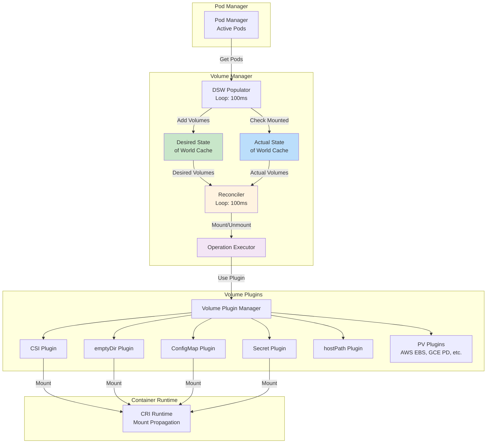

### Volume Manager Structure

**Source**: `pkg/kubelet/volumemanager/volume_manager.go:244-285`

```go
type volumeManager struct {
    // kubeClient is the kube API client used by DSW Populator
    kubeClient clientset.Interface

    // volumePluginMgr manages volume plugins
    volumePluginMgr *volume.VolumePluginMgr

    // desiredStateOfWorld: volumes that should be attached/mounted
    desiredStateOfWorld cache.DesiredStateOfWorld

    // actualStateOfWorld: volumes that are attached/mounted
    actualStateOfWorld cache.ActualStateOfWorld

    // operationExecutor starts async attach/detach/mount/unmount operations
    operationExecutor operationexecutor.OperationExecutor

    // reconciler reconciles DSW with ASW
    reconciler reconciler.Reconciler

    // desiredStateOfWorldPopulator populates DSW from kubelet PodManager
    desiredStateOfWorldPopulator populator.DesiredStateOfWorldPopulator

    // csiMigratedPluginManager tracks CSI migration status
    csiMigratedPluginManager csimigration.PluginManager

    // intreeToCSITranslator translates in-tree specs to CSI
    intreeToCSITranslator csimigration.InTreeToCSITranslator
}
```

### Volume Manager Initialization

**Source**: `pkg/kubelet/volumemanager/volume_manager.go:184-241`

```go
func NewVolumeManager(
    controllerAttachDetachEnabled bool,
    nodeName k8stypes.NodeName,
    podManager PodManager,
    podStateProvider PodStateProvider,
    kubeClient clientset.Interface,
    volumePluginMgr *volume.VolumePluginMgr,
    mounter mount.Interface,
    hostutil hostutil.HostUtils,
    kubeletPodsDir string,
    recorder record.EventRecorder,
    blockVolumePathHandler volumepathhandler.BlockVolumePathHandler,
) VolumeManager {
    seLinuxTranslator := util.NewSELinuxLabelTranslator()

    vm := &volumeManager{
        kubeClient:          kubeClient,
        volumePluginMgr:     volumePluginMgr,
        desiredStateOfWorld: cache.NewDesiredStateOfWorld(volumePluginMgr, seLinuxTranslator),
        actualStateOfWorld:  cache.NewActualStateOfWorld(nodeName, volumePluginMgr),
        operationExecutor:   operationexecutor.NewOperationExecutor(...),
    }

    intreeToCSITranslator := csitrans.New()
    csiMigratedPluginManager := csimigration.NewPluginManager(intreeToCSITranslator, ...)

    vm.desiredStateOfWorldPopulator = populator.NewDesiredStateOfWorldPopulator(
        kubeClient,
        desiredStateOfWorldPopulatorLoopSleepPeriod,  // 100ms
        podManager,
        podStateProvider,
        vm.desiredStateOfWorld,
        vm.actualStateOfWorld,
        csiMigratedPluginManager,
        intreeToCSITranslator,
        volumePluginMgr)

    vm.reconciler = reconciler.NewReconciler(
        kubeClient,
        controllerAttachDetachEnabled,
        reconcilerLoopSleepPeriod,  // 100ms
        waitForAttachTimeout,       // 10 minutes
        nodeName,
        vm.desiredStateOfWorld,
        vm.actualStateOfWorld,
        vm.desiredStateOfWorldPopulator.HasAddedPods,
        vm.operationExecutor,
        mounter,
        hostutil,
        volumePluginMgr,
        kubeletPodsDir)

    return vm
}
```

### Volume Manager Startup

**Source**: `pkg/kubelet/volumemanager/volume_manager.go:299-318`

```go
func (vm *volumeManager) Run(ctx context.Context, sourcesReady config.SourcesReady) {
    defer runtime.HandleCrash()

    if vm.kubeClient != nil {
        // Start informer for CSIDriver objects
        go vm.volumePluginMgr.Run(ctx.Done())
    }

    // Start desired state populator
    go vm.desiredStateOfWorldPopulator.Run(ctx, sourcesReady)
    logger.V(2).Info("The desired_state_of_world populator starts")

    logger.Info("Starting Kubelet Volume Manager")

    // Start reconciler
    go vm.reconciler.Run(ctx, ctx.Done())

    // Register Prometheus metrics
    metrics.Register(vm.actualStateOfWorld, vm.desiredStateOfWorld, vm.volumePluginMgr)

    <-ctx.Done()
    logger.Info("Shutting down Kubelet Volume Manager")
}
```

---

## State Management

### Desired State of World (DSW)

**Purpose**: Represents what volumes *should* be attached and mounted based on pod specs.

**Data Structure**:

```go
type DesiredStateOfWorld interface {
    // Add a volume to be mounted for the specified pod
    AddPodToVolume(podName, volumeName, ...)

    // Mark a pod as processed
    MarkVolumesReportedInUse(volumesReportedAsInUse)

    // Get all volumes that should be mounted
    GetVolumesToMount() []VolumeToMount

    // Get volume names for a specific pod
    GetVolumeNamesForPod(podName) map[string]UniqueVolumeName

    // Delete pod from DSW
    DeletePod(podName, volumeName)

    // Pop pod errors (for WaitForAttachAndMount)
    PopPodErrors(podName) []string
}
```

**Populated by**: Desired State of World Populator (from Pod Manager)

**Updated**: Every 100ms

### Actual State of World (ASW)

**Purpose**: Represents what volumes *are actually* attached and mounted on the node.

**Data Structure**:

```go
type ActualStateOfWorld interface {
    // Mark volume as attached
    MarkVolumeAsAttached(volumeName, devicePath, ...)

    // Mark volume as mounted for pod
    AddPodToVolume(podName, volumeName, ...)

    // Get all mounted volumes for a pod
    GetMountedVolumesForPod(podName) []MountedVolume

    // Check if volume exists (attached)
    VolumeExists(volumeName) bool

    // Mark volume as unmounted and detached
    MarkVolumeAsDetached(volumeName)

    // Get all attached volumes
    GetAttachedVolumes() []AttachedVolume
}
```

**Populated by**: Operation Executor (after successful operations)

**Updated**: After each attach/mount/unmount/detach operation completes

### State Synchronization

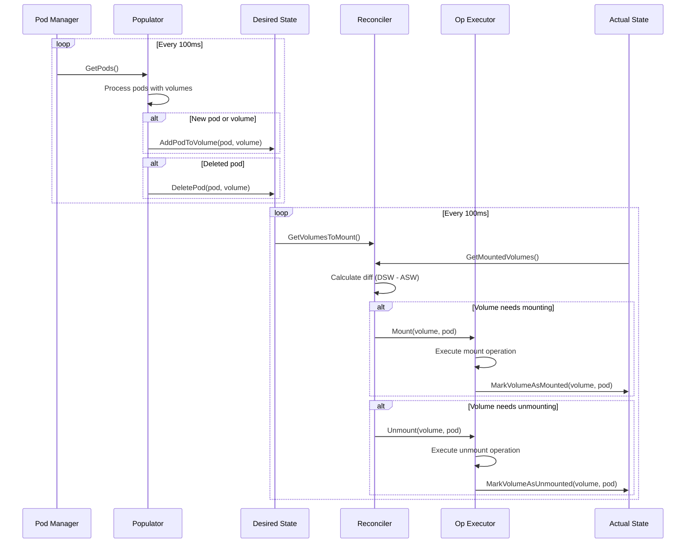

---

## Volume Lifecycle

### Complete Lifecycle Stages

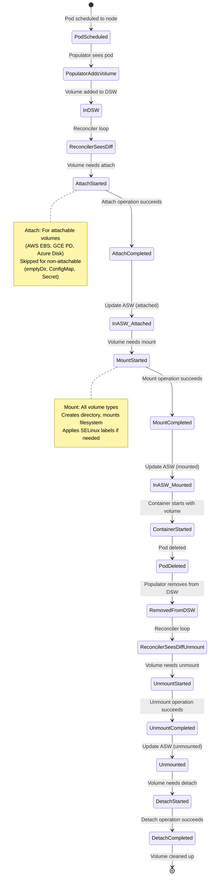

### Volume Mount Path Structure

```
/var/lib/kubelet/
├── pods/
│   └── <pod-uid>/
│       ├── volumes/
│       │   ├── kubernetes.io~empty-dir/
│       │   │   └── <volume-name>/          # emptyDir volume
│       │   ├── kubernetes.io~configmap/
│       │   │   └── <volume-name>/          # ConfigMap volume
│       │   ├── kubernetes.io~secret/
│       │   │   └── <volume-name>/          # Secret volume
│       │   └── kubernetes.io~csi/
│       │       └── <volume-name>/          # CSI volume
│       ├── volume-subpaths/
│       │   └── <volume-name>/
│       │       └── <container-name>/
│       │           └── <subpath>/          # Subpath mounts
│       └── plugins/
│           └── kubernetes.io~csi/
│               └── <volume-name>/          # CSI plugin data
└── plugins/
    └── kubernetes.io.csi/
        ├── <driver-name>/
        │   └── <volume-id>/                 # CSI staging path
        └── pv/
            └── <pv-name>/                   # Global mount path
```

### Attach vs Mount

| Operation | Attach | Mount |
|-----------|--------|-------|
| **Purpose** | Connect block device to node | Make filesystem accessible |
| **Applies to** | Block storage (EBS, PD, etc.) | All volumes |
| **Scope** | Node-level | Pod-level |
| **Executed by** | Attach/Detach controller OR kubelet | Kubelet volume manager |
| **Example** | Attach EBS volume to EC2 instance | Mount /dev/xvdf to /var/lib/kubelet/pods/.../volumes/... |
| **Requirement** | Must implement `Attacher` interface | Must implement `Mounter` interface |

**Attachable Volumes**:
- AWS EBS
- GCE PD
- Azure Disk
- iSCSI
- FC (Fibre Channel)
- CSI volumes (if driver supports attach)

**Non-Attachable Volumes**:
- emptyDir
- ConfigMap
- Secret
- hostPath
- Downward API
- Projected volumes

---

## Reconciler Loop

### Reconciler Architecture

The reconciler is the heart of the volume manager. It continuously syncs the desired state with the actual state.

**Source**: `pkg/kubelet/volumemanager/reconciler/reconciler.go:26-69`

```go
func (rc *reconciler) Run(ctx context.Context, stopCh <-chan struct{}) {
    logger := klog.FromContext(ctx)
    rc.reconstructVolumes(logger)
    logger.Info("Reconciler: start to sync state")
    wait.Until(func() { rc.reconcile(ctx) }, rc.loopSleepDuration, stopCh)
}

func (rc *reconciler) reconcile(ctx context.Context) {
    logger := klog.FromContext(ctx)
    readyToUnmount := rc.readyToUnmount()

    if readyToUnmount {
        // Step 1: Unmount volumes that are no longer needed
        // (This runs before mounts to handle volume migration scenarios)
        rc.unmountVolumes(logger)
    }

    // Step 2: Mount volumes that should be mounted
    // (This may also trigger attach if kubelet handles attach/detach)
    rc.mountOrAttachVolumes(logger)

    if readyToUnmount {
        // Step 3: Detach devices that should be detached
        rc.unmountDetachDevices(logger)

        // Step 4: Clean up orphan volumes
        rc.cleanOrphanVolumes(logger)
    }

    // Step 5: Update node status if needed
    if len(rc.volumesNeedUpdateFromNodeStatus) != 0 {
        rc.updateReconstructedFromNodeStatus(ctx)
    }

    if len(rc.volumesNeedUpdateFromNodeStatus) == 0 {
        // ASW is fully populated, start reconciling node.status.volumesInUse
        rc.updateLastSyncTime()
    }
}
```

### Reconciler Flow Diagram

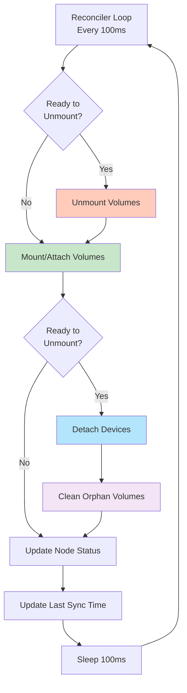

### Ready to Unmount Check

**Purpose**: Prevent premature unmounting during kubelet startup

```go
func (rc *reconciler) readyToUnmount() bool {
    // DSW populator must have added pods at least once
    if !rc.hasAddedPods() {
        return false
    }

    // ASW must be fully reconstructed from disk
    if !rc.hasReconstructed {
        return false
    }

    return true
}
```

**Why this matters**:
- During kubelet restart, volumes may be mounted on disk but not yet in DSW
- If we unmount before DSW is populated, we'll unmount volumes that should stay
- This prevents disruption to running containers

### Mount/Attach Operation

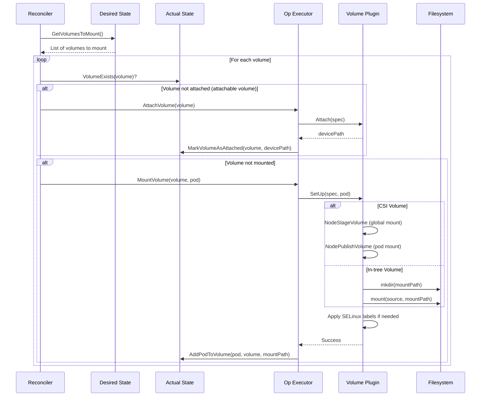

### Unmount/Detach Operation

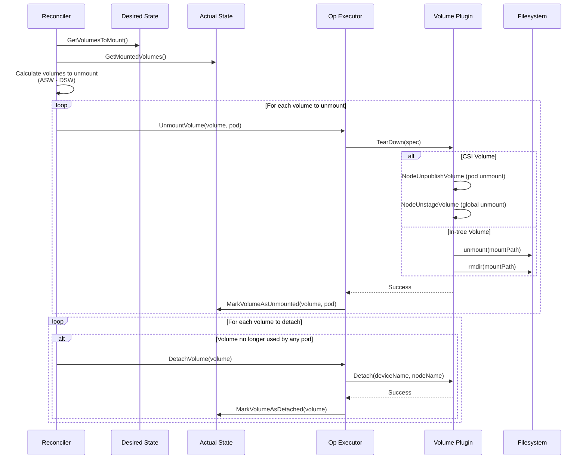

---

## Populator Loop

### Desired State of World Populator

**Purpose**: Keep DSW in sync with active pods from Pod Manager

**Source**: `pkg/kubelet/volumemanager/populator/desired_state_of_world_populator.go:143-176`

```go
func (dswp *desiredStateOfWorldPopulator) Run(ctx context.Context, sourcesReady config.SourcesReady) {
    logger := klog.FromContext(ctx)
    logger.Info("Desired state populator starts to run")

    // Wait for sources to be ready, then set hasAddedPods
    _ = wait.PollUntilContextCancel(ctx, dswp.loopSleepDuration, false, func(ctx context.Context) (bool, error) {
        done := sourcesReady.AllReady()
        dswp.populatorLoop(ctx)
        return done, nil
    })

    dswp.hasAddedPodsLock.Lock()
    if !dswp.hasAddedPods {
        logger.Info("Finished populating initial desired state of world")
        dswp.hasAddedPods = true
    }
    dswp.hasAddedPodsLock.Unlock()

    wait.UntilWithContext(ctx, dswp.populatorLoop, dswp.loopSleepDuration)
}

func (dswp *desiredStateOfWorldPopulator) populatorLoop(ctx context.Context) {
    logger := klog.FromContext(ctx)
    dswp.findAndAddNewPods(ctx)
    dswp.findAndRemoveDeletedPods(logger)
}
```

### Finding and Adding Pods

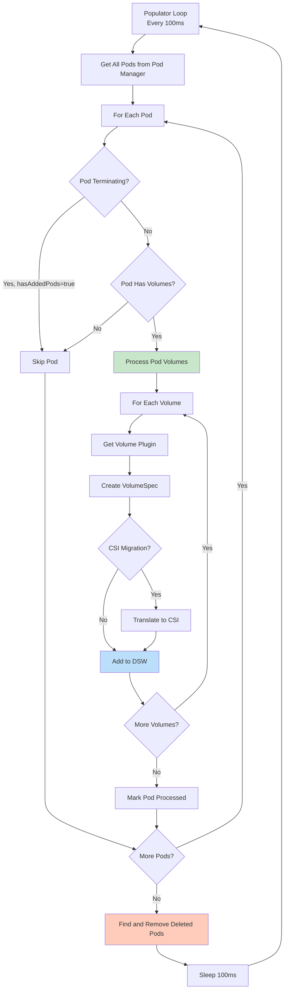

### Volume Types Processed

```go
// From pod.Spec.Volumes
for _, volume := range pod.Spec.Volumes {
    switch {
    case volume.PersistentVolumeClaim != nil:
        // PVC: Fetch PV from API, add to DSW
        processPVCVolume(pvcName, namespace)

    case volume.EmptyDir != nil:
        // emptyDir: Add directly to DSW
        processEmptyDirVolume()

    case volume.ConfigMap != nil:
        // ConfigMap: Add to DSW (data fetched during mount)
        processConfigMapVolume()

    case volume.Secret != nil:
        // Secret: Add to DSW (data fetched during mount)
        processSecretVolume()

    case volume.HostPath != nil:
        // hostPath: Add to DSW
        processHostPathVolume()

    case volume.DownwardAPI != nil:
        // Downward API: Add to DSW
        processDownwardAPIVolume()

    case volume.Projected != nil:
        // Projected: Add to DSW (combines ConfigMap, Secret, DownwardAPI)
        processProjectedVolume()

    case volume.CSI != nil:
        // Ephemeral CSI: Add to DSW
        processEphemeralCSIVolume()

    // ... other volume types
    }
}
```

---

## Operation Executor

### Operation Executor Architecture

The Operation Executor manages the actual execution of volume operations with proper concurrency control.

```go
type OperationExecutor interface {
    // AttachVolume attaches the volume to the node
    AttachVolume(volumeToAttach, actualStateOfWorld) error

    // DetachVolume detaches the volume from the node
    DetachVolume(volumeToDetach, actualStateOfWorld) error

    // MountVolume mounts the volume to the pod's directory
    MountVolume(waitForAttachTimeout, volumeToMount, actualStateOfWorld, isRemount) error

    // UnmountVolume unmounts the volume from the pod's directory
    UnmountVolume(volumeToUnmount, actualStateOfWorld, podsDir) error

    // VerifyVolumesAreAttached verifies volumes are attached to node
    VerifyVolumesAreAttached(attachedVolumes, nodeName, actualStateOfWorld) error

    // ExpandInUseVolume expands the volume (filesystem resize)
    ExpandInUseVolume(volumeToMount, actualStateOfWorld) error
}
```

### Operation Concurrency Control

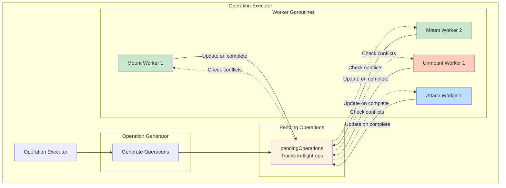

**Concurrency Rules**:

1. **Per-volume locking**: Only one operation per volume at a time
2. **Per-pod locking**: Only one mount/unmount per pod at a time
3. **Operation ordering**:
   - Unmount before mount (for volume migration)
   - Detach after unmount
   - Attach before mount

4. **Conflict prevention**:
   ```go
   // Can't mount while unmounting
   // Can't unmount while mounting
   // Can't attach while detaching
   // Can't detach while attaching
   ```

### Mount Operation Details

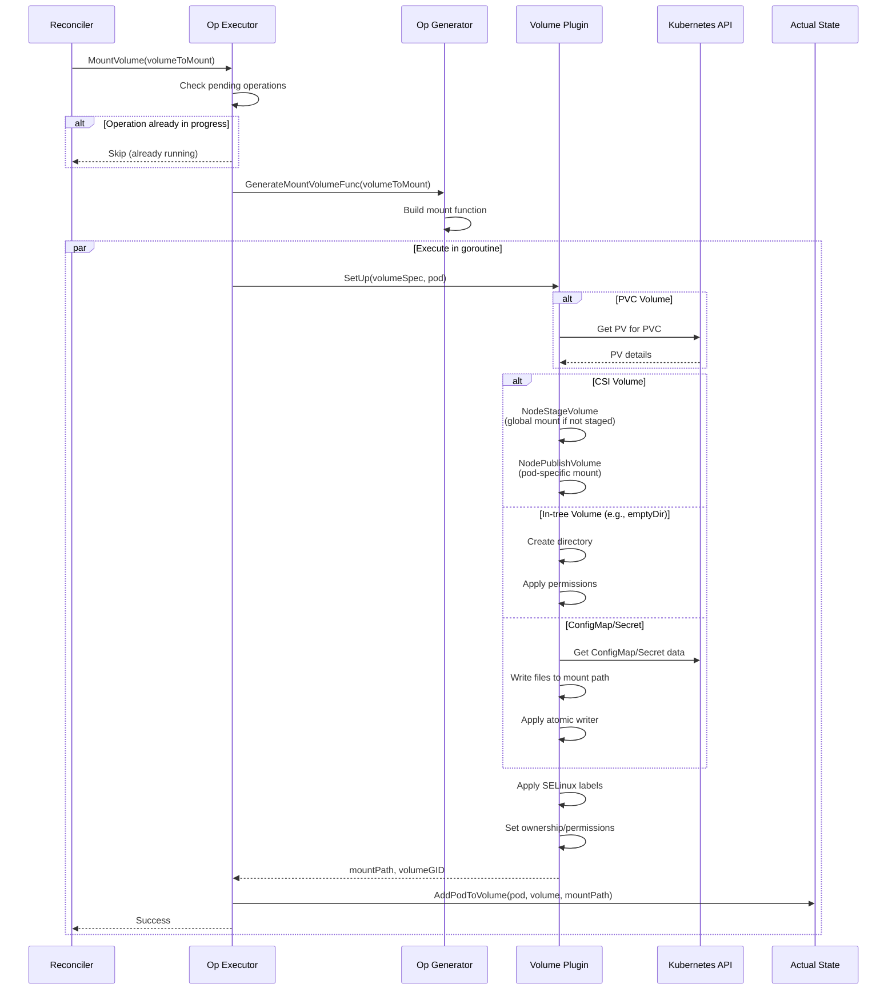

---

## Volume Plugins

### Plugin Interface Hierarchy

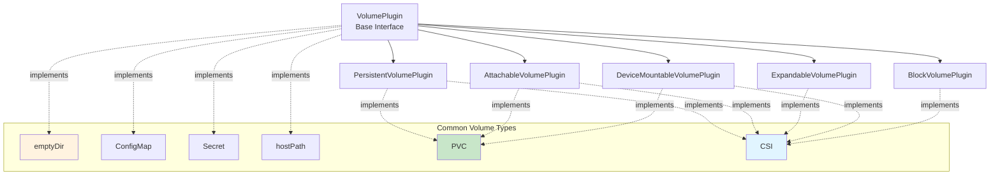

### VolumePlugin Interface

**Source**: `pkg/volume/plugins.go:126-181`

```go
type VolumePlugin interface {
    // Init initializes the plugin
    Init(host VolumeHost) error

    // GetPluginName returns the plugin's name
    GetPluginName() string

    // GetVolumeName returns unique volume identifier
    GetVolumeName(spec *Spec) (string, error)

    // CanSupport tests if plugin supports a spec
    CanSupport(spec *Spec) bool

    // RequiresRemount returns true if mount must be reexecuted
    // (e.g., Downward API volumes)
    RequiresRemount(spec *Spec) bool

    // NewMounter creates a volume.Mounter
    NewMounter(spec *Spec, pod *v1.Pod) (Mounter, error)

    // NewUnmounter creates a volume.Unmounter
    NewUnmounter(name string, podUID types.UID) (Unmounter, error)

    // ConstructVolumeSpec reconstructs spec from disk
    ConstructVolumeSpec(volumeName, volumePath string) (ReconstructedVolume, error)

    // SupportsMountOption returns true if plugin supports mount options
    SupportsMountOption() bool

    // SupportsSELinuxContextMount returns true if plugin supports SELinux
    SupportsSELinuxContextMount(spec *Spec) (bool, error)
}
```

### Common Volume Plugin Types

#### 1. emptyDir

**Purpose**: Temporary directory that shares pod's lifetime

**Mount**: Create directory at pod volume path

```yaml
volumes:
- name: cache
  emptyDir:
    sizeLimit: 1Gi
    medium: Memory  # Optional: use tmpfs
```

**Implementation**:
```go
func (ed *emptyDir) SetUp(fsGroup *int64) error {
    // Create directory
    err := os.MkdirAll(ed.GetPath(), 0750)

    // If medium=Memory, mount tmpfs
    if ed.medium == v1.StorageMediumMemory {
        err = ed.mounter.Mount("tmpfs", ed.GetPath(), "tmpfs", ...)
    }

    // Apply ownership
    err = volume.SetVolumeOwnership(ed, fsGroup)
    return nil
}
```

#### 2. ConfigMap

**Purpose**: Inject configuration data as files

**Mount**: Fetch ConfigMap data, write as files

```yaml
volumes:
- name: config
  configMap:
    name: app-config
    items:
    - key: config.yaml
      path: config.yaml
```

**Implementation**:
```go
func (cm *configMapVolume) SetUp(fsGroup *int64) error {
    // Fetch ConfigMap from API
    configMap, err := cm.getConfigMap(cm.namespace, cm.name)

    // Write data using atomic writer (ensures atomicity)
    writerContext := fmt.Sprintf("configmap/%s", cm.name)
    writer, err := volumeutil.NewAtomicWriter(cm.GetPath(), writerContext)

    payload := make(map[string]volumeutil.FileProjection)
    for key, data := range configMap.Data {
        payload[key] = volumeutil.FileProjection{
            Data: []byte(data),
            Mode: 0644,
        }
    }

    err = writer.Write(payload)
    return err
}
```

#### 3. Secret

**Purpose**: Inject sensitive data as files

**Mount**: Similar to ConfigMap but for Secret objects

```yaml
volumes:
- name: secrets
  secret:
    secretName: db-credentials
    items:
    - key: username
      path: username
    - key: password
      path: password
```

#### 4. PersistentVolumeClaim (PVC)

**Purpose**: Use persistent storage via PVC

**Mount**: Resolve PVC→PV, delegate to appropriate plugin

```yaml
volumes:
- name: data
  persistentVolumeClaim:
    claimName: my-pvc
```

**Implementation**:
```go
func (pvc *persistentVolumeClaim) SetUp(fsGroup *int64) error {
    // Resolve PVC to PV
    pv, err := pvc.getPersistentVolume()

    // Find plugin that handles this PV
    plugin, err := pvc.plugin.host.FindPluginBySpec(&pv.Spec)

    // Create mounter for the PV type
    mounter, err := plugin.NewMounter(pv, pod)

    // Delegate to underlying plugin
    return mounter.SetUp(fsGroup)
}
```

---

## CSI Integration

### CSI Architecture in kubelet

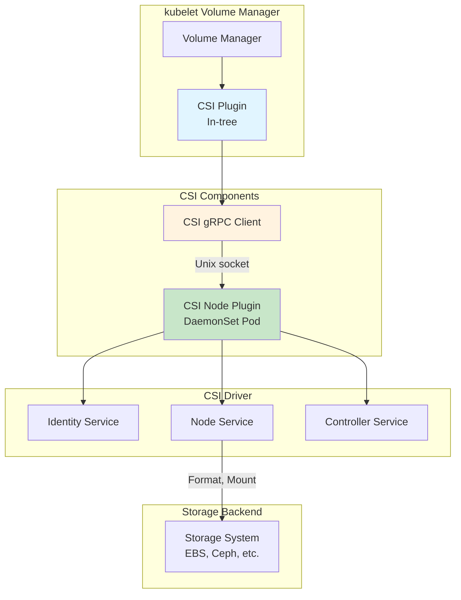

### CSI Volume Lifecycle

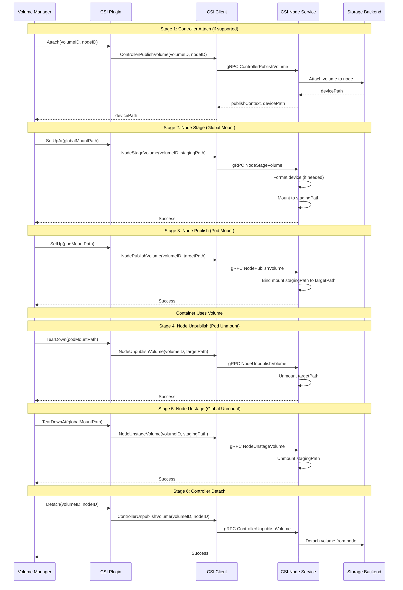

### CSI Volume Paths

```
# Global staging path (NodeStageVolume)
/var/lib/kubelet/plugins/kubernetes.io/csi/
└── <driver-name>/
    └── <volume-handle>/
        └── globalmount/          # Device mounted here

# Pod-specific path (NodePublishVolume)
/var/lib/kubelet/pods/<pod-uid>/volumes/kubernetes.io~csi/
└── <pv-name>/
    └── mount/                    # Bind mount from globalmount

# CSI plugin socket
/var/lib/kubelet/plugins/<driver-name>/csi.sock
```

---

## Volume Reconstruction

### Why Reconstruction?

When kubelet restarts, it must reconstruct the actual state of volumes from disk to avoid:
- Unmounting volumes that are still in use
- Leaking volumes (orphan mounts)
- Incorrect state in ASW

### Reconstruction Flow

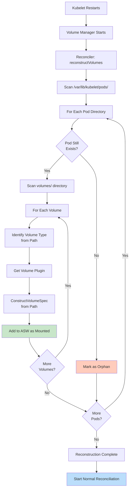

### ConstructVolumeSpec

Each volume plugin must implement reconstruction from disk:

```go
func (plugin *csiPlugin) ConstructVolumeSpec(volumeName, volumePath string) (*volume.Spec, error) {
    // Parse volumePath to extract volume information
    // Example volumePath:
    // /var/lib/kubelet/pods/<pod-uid>/volumes/kubernetes.io~csi/<pv-name>/mount

    // Read persisted volume data
    data, err := os.ReadFile(filepath.Join(volumePath, "..", "vol_data.json"))

    var volData map[string]string
    json.Unmarshal(data, &volData)

    // Reconstruct VolumeSpec
    spec := &volume.Spec{
        PersistentVolume: &v1.PersistentVolume{
            Spec: v1.PersistentVolumeSpec{
                PersistentVolumeSource: v1.PersistentVolumeSource{
                    CSI: &v1.CSIPersistentVolumeSource{
                        Driver:       volData["driverName"],
                        VolumeHandle: volData["volumeHandle"],
                        // ...
                    },
                },
            },
        },
    }

    return spec, nil
}
```

---

## Troubleshooting

### Common Issues

#### 1. Volume Mount Fails

**Symptoms**:

```
$ kubectl describe pod mypod
Events:
  Warning  FailedMount  Unable to attach or mount volumes: timeout expired waiting for volumes to attach or mount
```

**Diagnosis**:

```bash
# Check kubelet logs
journalctl -u kubelet | grep -i "volume\|mount"

# Check volume manager state
# Look for errors in reconciler or operation executor

# Check if volume is in DSW
grep "desiredStateOfWorld" /var/log/kubelet.log

# Check if volume is in ASW
grep "actualStateOfWorld" /var/log/kubelet.log

# Check PV/PVC status
kubectl get pv,pvc
kubectl describe pv <pv-name>
kubectl describe pvc <pvc-name>
```

**Solutions**:

```bash
# For CSI volumes, check CSI driver pod
kubectl get pods -n kube-system | grep csi

# Check CSI driver logs
kubectl logs -n kube-system <csi-node-pod>

# For attachment issues, check attach/detach controller
kubectl logs -n kube-system kube-controller-manager-* | grep attach

# Manually detach if stuck
kubectl patch pv <pv-name> -p '{"metadata":{"finalizers":null}}'
```

#### 2. Orphan Volumes

**Symptoms**: Volumes remain mounted after pod deletion

**Diagnosis**:

```bash
# List all mounted volumes
mount | grep kubelet

# Check for directories without corresponding pods
ls -la /var/lib/kubelet/pods/

# Check kubelet volume manager state
journalctl -u kubelet | grep "orphan"
```

**Solutions**:

```bash
# Kubelet should clean up automatically
# If not, check if reconciler is running
systemctl status kubelet

# Manually unmount if needed (caution!)
umount /var/lib/kubelet/pods/<pod-uid>/volumes/...

# Remove directory
rm -rf /var/lib/kubelet/pods/<pod-uid>/
```

#### 3. Volume Attachment Limit

**Symptoms**:

```
Events:
  Warning  FailedScheduling  0/3 nodes are available: 1 node has no volume attachment limit, 2 volumes are already attached
```

**Diagnosis**:

```bash
# Check node's volume attachment limit
kubectl get node <node-name> -o yaml | grep -A5 allocatable

# Check attached volumes
kubectl get node <node-name> -o yaml | grep volumesAttached -A50
```

**Solution**:
- Reduce number of volumes per pod
- Use fewer pods per node
- Increase attachment limits (cloud provider-specific)
- Use local volumes (emptyDir, hostPath) which don't count toward limit

#### 4. CSI Driver Issues

**Symptoms**: CSI volume operations fail

**Diagnosis**:

```bash
# Check CSI driver pods
kubectl get pods -n kube-system -l app=<csi-driver>

# Check CSI driver logs
kubectl logs -n kube-system <csi-driver-node-pod>

# Check kubelet CSI client logs
journalctl -u kubelet | grep -i csi

# Check CSI socket
ls -la /var/lib/kubelet/plugins/*/csi.sock

# Test CSI plugin manually
csi-sanity --csi.endpoint=/var/lib/kubelet/plugins/<driver>/csi.sock
```

### Debugging Commands

```bash
# List volume plugins
cat /var/lib/kubelet/config.yaml | grep -A10 volumePluginDir

# Check volume mounts for a specific pod
crictl inspect <container-id> | jq '.info.runtimeSpec.mounts'

# Monitor volume operations in real-time
journalctl -u kubelet -f | grep -E "mount|unmount|attach|detach"

# Check for stuck operations
journalctl -u kubelet | grep "operation.*pending"

# Verify SELinux labels (if using)
ls -laZ /var/lib/kubelet/pods/<pod-uid>/volumes/

# Check subpath mounts
ls -la /var/lib/kubelet/pods/<pod-uid>/volume-subpaths/
```

---

## Best Practices

### Volume Configuration

1. **Use specific volume types** appropriate for data

```yaml
# Good: Specific types
volumes:
- name: config
  configMap:
    name: app-config
- name: cache
  emptyDir: {}
- name: data
  persistentVolumeClaim:
    claimName: app-data

# Avoid: Overusing hostPath
volumes:
- name: data
  hostPath:
    path: /mnt/data  # Security risk, node-specific
```

2. **Set resource limits** on ephemeral volumes

```yaml
volumes:
- name: cache
  emptyDir:
    sizeLimit: 1Gi  # Prevent disk exhaustion
```

3. **Use ReadOnly** when appropriate

```yaml
volumeMounts:
- name: config
  mountPath: /etc/config
  readOnly: true  # Prevent accidental modification
```

### CSI Best Practices

1. **Use CSI over in-tree plugins**
   - In-tree plugins are deprecated
   - CSI provides better lifecycle management
   - Easier to update drivers

2. **Enable CSI migration** for legacy volumes

```yaml
# Enable CSI migration for AWS EBS
featureGates:
  CSIMigration: true
  CSIMigrationAWS: true
```

3. **Monitor CSI driver health**

```yaml
# Deploy CSI driver with health probe
livenessProbe:
  httpGet:
    path: /healthz
    port: 9808
```

### Volume Security

1. **Use Secrets** for sensitive data, not ConfigMaps

```yaml
# Good
volumes:
- name: creds
  secret:
    secretName: db-credentials

# Bad
volumes:
- name: creds
  configMap:
    name: db-credentials  # ConfigMaps are not encrypted
```

2. **Set fsGroup** for proper ownership

```yaml
securityContext:
  fsGroup: 2000  # Volume files owned by group 2000
```

3. **Use SELinux** labels

```yaml
securityContext:
  seLinuxOptions:
    level: "s0:c123,c456"
```

### Performance Optimization

1. **Use local storage** for cache/temp data

```yaml
# Fast, node-local storage
volumes:
- name: cache
  emptyDir: {}

# Or memory-backed
volumes:
- name: tmp
  emptyDir:
    medium: Memory
```

2. **Enable volume reconstruction** tuning

```yaml
# kubelet config
volumePluginDir: /usr/libexec/kubernetes/kubelet-plugins/volume/exec/
```

3. **Monitor volume metrics**

```promql
# Mount operation duration
kubelet_volume_stats_capacity_bytes
kubelet_volume_stats_used_bytes
kubelet_volume_stats_inodes_used
```

### Disaster Recovery

1. **Back up PV data** regularly
2. **Use volume snapshots** (CSI feature)

```yaml
apiVersion: snapshot.storage.k8s.io/v1
kind: VolumeSnapshot
metadata:
  name: my-snapshot
spec:
  source:
    persistentVolumeClaimName: my-pvc
```

3. **Test volume restoration** procedures

---

## Summary

### Key Takeaways

1. **Volume Manager** coordinates all volume operations via reconciliation loop
2. **Desired State** comes from pod specs (updated every 100ms)
3. **Actual State** reflects what's on disk (updated after operations)
4. **Reconciler** syncs desired → actual (mount, unmount, attach, detach)
5. **Volume Plugins** implement type-specific logic (CSI, emptyDir, ConfigMap, etc.)
6. **CSI** is the modern, preferred way to add storage support
7. **Reconstruction** enables safe kubelet restarts without data loss
8. **Concurrency control** prevents conflicts between operations

### Volume Manager Constants

```go
const (
    reconcilerLoopSleepPeriod                     = 100 * time.Millisecond
    desiredStateOfWorldPopulatorLoopSleepPeriod  = 100 * time.Millisecond
    podAttachAndMountTimeout                      = 2*time.Minute + 3*time.Second
    podAttachAndMountRetryInterval                = 300 * time.Millisecond
    waitForAttachTimeout                          = 10 * time.Minute
)
```

### Related Documentation

- [Pod Sync Loop](./01-pod-sync-loop.md) - How pod sync triggers volume setup
- [Container Lifecycle](./04-container-lifecycle.md) - Container start after volumes ready
- [Runtime Integration](../high-level/04-runtime-integration.md) - CRI and volume mounts
- [Image Management](./06-image-management.md) - Image storage on same filesystem

### References

- `pkg/kubelet/volumemanager/volume_manager.go` - Volume manager implementation
- `pkg/kubelet/volumemanager/reconciler/` - Reconciler loop
- `pkg/kubelet/volumemanager/populator/` - DSW populator
- `pkg/kubelet/volumemanager/cache/` - DSW and ASW caches
- `pkg/volume/` - Volume plugin interfaces
- `pkg/volume/csi/` - CSI plugin implementation

---

**Document Status**: Complete
**Last Updated**: 2025-10-21
**Next**: [Resource Management](./08-resource-management.md)
