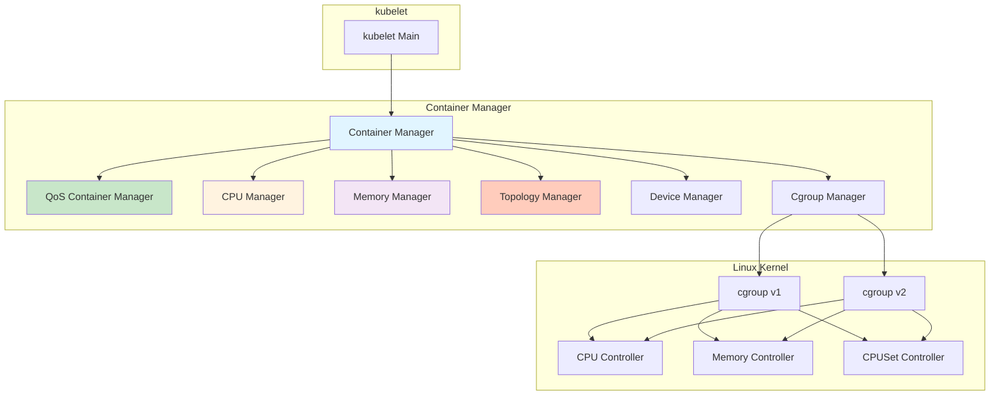
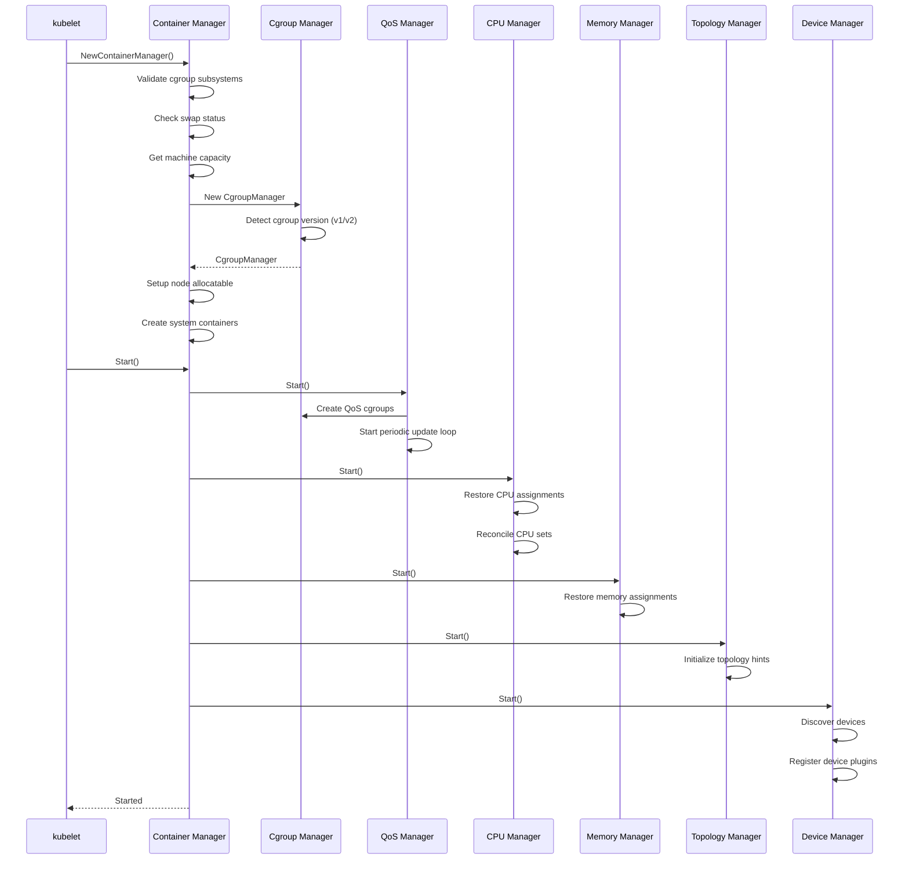
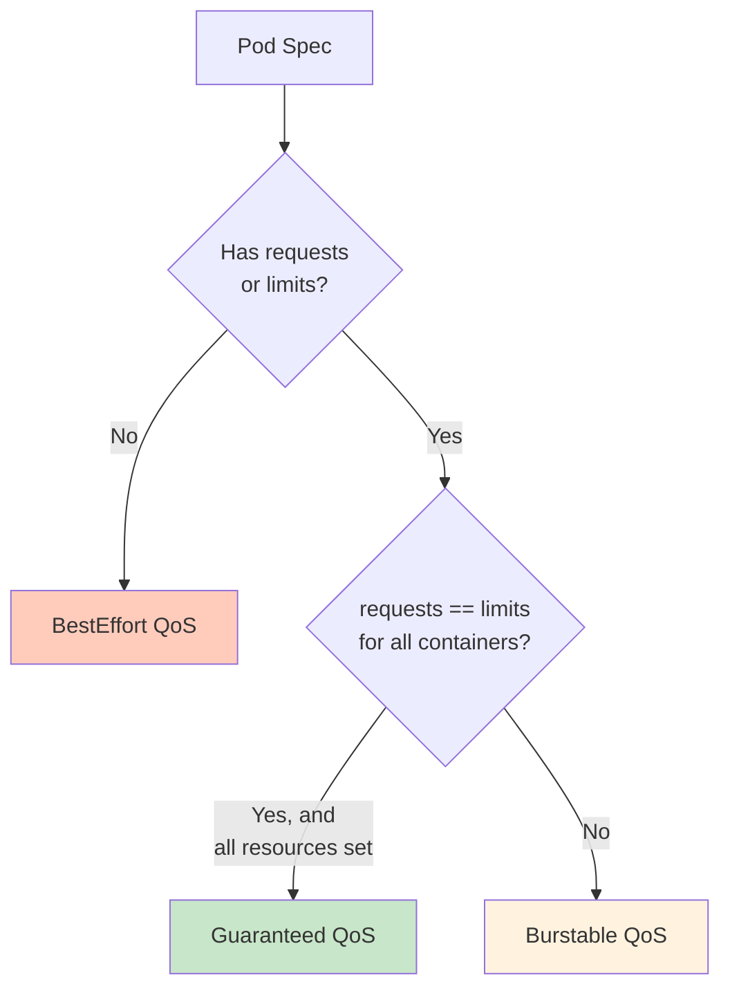
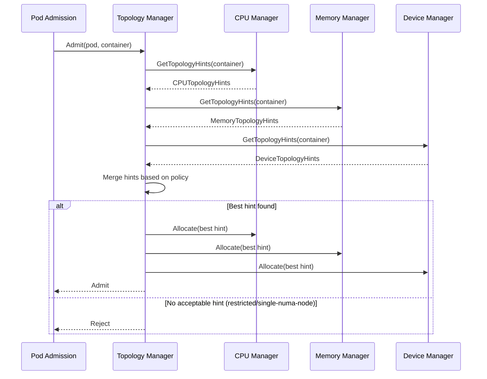

# kubelet Resource Management Architecture

**Status**: Complete
**Last Updated**: 2025-10-21
**Component**: kubelet - Resource Management (Container Manager)
**Related Documents**:
- [Pod Admission](./03-pod-admission.md) - Resource-based admission
- [Container Lifecycle](./04-container-lifecycle.md) - Container resource limits
- [Eviction](./11-eviction.md) - Resource-based eviction
- [System Overview](../high-level/01-system-overview.md) - Node resources

---

## Table of Contents

1. [Overview](#overview)
2. [Container Manager Architecture](#container-manager-architecture)
3. [Cgroups](#cgroups)
4. [QoS Management](#qos-management)
5. [Node Allocatable](#node-allocatable)
6. [CPU Management](#cpu-management)
7. [Memory Management](#memory-management)
8. [Topology Manager](#topology-manager)
9. [Device Manager](#device-manager)
10. [Resource Enforcement](#resource-enforcement)
11. [Troubleshooting](#troubleshooting)
12. [Best Practices](#best-practices)

---

## Overview

### What is Resource Management?

Resource management in kubelet ensures:
- **Fair resource allocation** among pods based on QoS
- **Resource isolation** using Linux cgroups
- **System stability** via node-level reservations
- **Performance optimization** through CPU pinning and NUMA awareness
- **Device allocation** for GPUs, FPGAs, and other hardware

### Why Resource Management Matters

1. **Predictable performance**: Pods get guaranteed resources
2. **Multi-tenancy**: Multiple pods share node resources safely
3. **System protection**: Node services remain stable
4. **Efficiency**: Optimal CPU/memory placement
5. **Hardware access**: Managed GPU/device allocation

### Key Concepts

```
Node Total Resources (100%)
├── System Reserved (10%)  ← OS, systemd, etc.
├── Kube Reserved (10%)    ← kubelet, kube-proxy, etc.
└── Allocatable (80%)      ← Available for pods
    ├── Guaranteed QoS (40%)
    ├── Burstable QoS (30%)
    └── BestEffort QoS (10%)
```

**Core Components**:

| Component | Purpose |
|-----------|---------|
| **Container Manager** | Top-level resource management coordinator |
| **QoS Container Manager** | Manages QoS-level cgroup hierarchy |
| **CPU Manager** | CPU affinity and pinning for guaranteed pods |
| **Memory Manager** | NUMA-aware memory allocation |
| **Topology Manager** | Coordinates CPU/memory/device topology |
| **Device Manager** | Allocates devices (GPUs, etc.) to pods |
| **Cgroup Manager** | Low-level cgroup operations |

---

## Container Manager Architecture

### Overall Architecture



### Container Manager Structure

**Source**: `pkg/kubelet/cm/container_manager_linux.go:101-141`

```go
type containerManagerImpl struct {
    sync.RWMutex
    cadvisorInterface   cadvisor.Interface
    mountUtil          mount.Interface
    NodeConfig
    status             Status
    systemContainers   []*systemContainer
    periodicTasks      []func()
    subsystems         *CgroupSubsystems
    nodeInfo           *v1.Node
    cgroupManager      CgroupManager
    capacity           v1.ResourceList
    internalCapacity   v1.ResourceList
    cgroupRoot         CgroupName
    recorder           record.EventRecorder
    qosContainerManager QOSContainerManager
    deviceManager      devicemanager.Manager
    cpuManager         cpumanager.Manager
    memoryManager      memorymanager.Manager
    topologyManager    topologymanager.Manager
    draManager         *dra.Manager
    kubeClient         clientset.Interface
    resourceUpdates    chan resourceupdates.Update
}
```

### Initialization Flow



---

## Cgroups

### Cgroup Basics

**cgroups (control groups)** are a Linux kernel feature that limits, accounts for, and isolates resource usage (CPU, memory, disk I/O, network, etc.) of process groups.

**Key Controllers**:
- **cpu**: CPU shares, quotas, periods
- **cpuset**: CPU affinity (pin to specific CPUs)
- **memory**: Memory limits, OOM control
- **blkio**: Block I/O throttling
- **pids**: Process count limits
- **hugetlb**: Huge pages

### Cgroup v1 vs v2

| Feature | cgroup v1 | cgroup v2 |
|---------|-----------|-----------|
| **Hierarchy** | Multiple hierarchies (one per controller) | Single unified hierarchy |
| **Controllers** | Independent | Coordinated |
| **CPU Controller** | cpu + cpuacct | Unified cpu |
| **I/O Controller** | blkio | io |
| **Memory** | memory | memory |
| **Adoption** | Legacy, widely supported | Modern, simpler, better |
| **kubelet Support** | Default | Auto-detected |

**Detection**:

```bash
# Check cgroup version
stat -fc %T /sys/fs/cgroup/

# cgroup2fs = cgroup v2
# tmpfs = cgroup v1
```

### Cgroup Hierarchy in kubelet

```
/sys/fs/cgroup/
└── kubepods/                          # kubelet root cgroup
    ├── kubepods-besteffort/           # BestEffort QoS cgroup
    │   └── kubepods-besteffort-pod<uid>/    # Pod cgroup
    │       ├── <container-id>/        # Container cgroup
    │       └── <container-id>/
    ├── kubepods-burstable/            # Burstable QoS cgroup
    │   └── kubepods-burstable-pod<uid>/
    │       ├── <container-id>/
    │       └── <container-id>/
    └── pod<uid>/                      # Guaranteed QoS pod (no intermediate tier)
        ├── <container-id>/
        └── <container-id>/
```

**Example**:

```bash
# Guaranteed Pod
/sys/fs/cgroup/kubepods/pod123abc456/container-789def/

# Burstable Pod
/sys/fs/cgroup/kubepods/kubepods-burstable/kubepods-burstable-pod123abc456/container-789def/

# BestEffort Pod
/sys/fs/cgroup/kubepods/kubepods-besteffort/kubepods-besteffort-pod123abc456/container-789def/
```

### Cgroup Manager Interface

```go
type CgroupManager interface {
    // Create creates cgroup
    Create(*CgroupConfig) error

    // Update updates cgroup
    Update(*CgroupConfig) error

    // Destroy destroys cgroup
    Destroy(*CgroupConfig) error

    // Exists checks if cgroup exists
    Exists(name CgroupName) bool

    // Name returns cgroup name
    Name(name CgroupName) string

    // CgroupName converts to cgroup path
    CgroupName(name CgroupName) string

    // Pids returns list of pids in cgroup
    Pids(name CgroupName) []int

    // ReduceCPULimits reduces CPU limits
    ReduceCPULimits(cgroupName CgroupName) error

    // MemoryUsage returns memory usage
    MemoryUsage(name CgroupName) (int64, error)
}
```

---

## QoS Management

### QoS Classes

Kubernetes assigns every pod a Quality of Service (QoS) class based on resource requests and limits:



#### 1. Guaranteed QoS

**Requirements**:
- Every container has CPU and memory requests AND limits
- Requests == Limits for both CPU and memory

**Example**:

```yaml
apiVersion: v1
kind: Pod
metadata:
  name: guaranteed-pod
spec:
  containers:
  - name: app
    image: nginx
    resources:
      requests:
        memory: "200Mi"
        cpu: "500m"
      limits:
        memory: "200Mi"  # Same as request
        cpu: "500m"      # Same as request
```

**Characteristics**:
- Highest priority
- Never evicted unless exceeding limits
- Best performance (no CPU throttling below limit)
- Placed directly under `/kubepods/`

#### 2. Burstable QoS

**Requirements**:
- At least one container has CPU or memory request
- Does not meet Guaranteed criteria

**Example**:

```yaml
apiVersion: v1
kind: Pod
metadata:
  name: burstable-pod
spec:
  containers:
  - name: app
    image: nginx
    resources:
      requests:
        memory: "100Mi"
        cpu: "250m"
      limits:
        memory: "200Mi"  # Higher than request
        cpu: "500m"      # Higher than request
```

**Characteristics**:
- Medium priority
- Can use more than requested (up to limit)
- Evicted before Guaranteed, after BestEffort
- CPU throttled when exceeding request
- Placed under `/kubepods/kubepods-burstable/`

#### 3. BestEffort QoS

**Requirements**:
- No containers have CPU or memory requests or limits

**Example**:

```yaml
apiVersion: v1
kind: Pod
metadata:
  name: besteffort-pod
spec:
  containers:
  - name: app
    image: nginx
    # No resources section
```

**Characteristics**:
- Lowest priority
- First to be evicted under pressure
- Can use all available resources when node is idle
- CPU shares set to minimum (2)
- Placed under `/kubepods/kubepods-besteffort/`

### QoS Container Manager

**Source**: `pkg/kubelet/cm/qos_container_manager_linux.go:52-61`

```go
type qosContainerManagerImpl struct {
    sync.Mutex
    qosContainersInfo  QOSContainersInfo
    subsystems         *CgroupSubsystems
    cgroupManager      CgroupManager
    activePods         ActivePodsFunc
    getNodeAllocatable func() v1.ResourceList
    cgroupRoot         CgroupName
    qosReserved        map[v1.ResourceName]int64
}
```

### QoS Cgroup Setup

**Source**: `pkg/kubelet/cm/qos_container_manager_linux.go:82-146`

```go
func (m *qosContainerManagerImpl) Start(getNodeAllocatable func() v1.ResourceList, activePods ActivePodsFunc) error {
    cm := m.cgroupManager
    rootContainer := m.cgroupRoot

    // Create top-level QoS cgroups (only Burstable and BestEffort)
    qosClasses := map[v1.PodQOSClass]CgroupName{
        v1.PodQOSBurstable:  NewCgroupName(rootContainer, "burstable"),
        v1.PodQOSBestEffort: NewCgroupName(rootContainer, "besteffort"),
    }

    for qosClass, containerName := range qosClasses {
        resourceParameters := &ResourceConfig{}

        // BestEffort gets minimum CPU shares (2)
        if qosClass == v1.PodQOSBestEffort {
            minShares := uint64(MinShares)  // MinShares = 2
            resourceParameters.CPUShares = &minShares
        }

        containerConfig := &CgroupConfig{
            Name:               containerName,
            ResourceParameters: resourceParameters,
        }

        // Create or update cgroup
        if !cm.Exists(containerName) {
            if err := cm.Create(containerConfig); err != nil {
                return fmt.Errorf("failed to create %v QOS cgroup: %v", qosClass, err)
            }
        } else {
            if err := cm.Update(containerConfig); err != nil {
                return fmt.Errorf("failed to update %v QOS cgroup: %v", qosClass, err)
            }
        }
    }

    // Store QoS container info
    m.qosContainersInfo = QOSContainersInfo{
        Guaranteed: rootContainer,        // Guaranteed pods go directly under root
        Burstable:  qosClasses[v1.PodQOSBurstable],
        BestEffort: qosClasses[v1.PodQOSBestEffort],
    }

    m.getNodeAllocatable = getNodeAllocatable
    m.activePods = activePods

    // Start periodic update loop (every 1 minute)
    go wait.Until(func() {
        err := m.UpdateCgroups()
        if err != nil {
            klog.InfoS("Failed to reserve QoS requests", "err", err)
        }
    }, periodicQOSCgroupUpdateInterval, wait.NeverStop)

    return nil
}
```

### QoS CPU Shares Calculation

**Source**: `pkg/kubelet/cm/qos_container_manager_linux.go:171-200`

```go
func (m *qosContainerManagerImpl) setCPUCgroupConfig(configs map[v1.PodQOSClass]*CgroupConfig) error {
    pods := m.activePods()
    burstablePodCPURequest := int64(0)

    // Sum all Burstable pod CPU requests
    for i := range pods {
        pod := pods[i]
        qosClass := v1qos.GetPodQOS(pod)
        if qosClass != v1.PodQOSBurstable {
            continue
        }
        req := resource.PodRequests(pod, resource.PodResourcesOptions{})
        if request, found := req[v1.ResourceCPU]; found {
            burstablePodCPURequest += request.MilliValue()
        }
    }

    // BestEffort always gets MinShares (2)
    bestEffortCPUShares := uint64(MinShares)
    configs[v1.PodQOSBestEffort].ResourceParameters.CPUShares = &bestEffortCPUShares

    // Burstable gets shares based on total requests
    burstableCPUShares := MilliCPUToShares(burstablePodCPURequest)
    configs[v1.PodQOSBurstable].ResourceParameters.CPUShares = &burstableCPUShares

    return nil
}

// MilliCPUToShares converts milliCPU to CPU shares
// Formula: shares = (milliCPU * 1024) / 1000
// 1 CPU = 1000 milliCPU = 1024 shares
func MilliCPUToShares(milliCPU int64) uint64 {
    if milliCPU == 0 {
        return MinShares
    }
    // Ensure minimum shares is 2
    shares := (milliCPU * 1024) / 1000
    if shares < MinShares {
        return MinShares
    }
    return uint64(shares)
}
```

**Example**:

```
Node has 4 CPUs

Burstable pods request 2 CPUs total (2000m)
→ Burstable cgroup shares = (2000 * 1024) / 1000 = 2048

BestEffort pods request nothing
→ BestEffort cgroup shares = 2 (minimum)

During CPU contention:
- Burstable pods get 2048/(2048+2) ≈ 99.9% of CPU
- BestEffort pods get 2/(2048+2) ≈ 0.1% of CPU
```

---

## Node Allocatable

### Resource Hierarchy

```
Node Capacity (Total Resources)
└── System Reserved
    └── Kube Reserved
        └── Node Allocatable ← Available for pods
            └── Pod Requests/Limits
```

**Formula**:

```
[Allocatable] = [Node Capacity] - [System Reserved] - [Kube Reserved] - [Eviction Threshold]
```

### Configuration

```yaml
apiVersion: kubelet.config.k8s.io/v1beta1
kind: KubeletConfiguration
# Total node resources (auto-detected)
# CPU: 4 cores, Memory: 16Gi

# Resources reserved for OS
systemReserved:
  cpu: 500m
  memory: 1Gi
  ephemeral-storage: 1Gi

# Resources reserved for Kubernetes components
kubeReserved:
  cpu: 500m
  memory: 1Gi
  ephemeral-storage: 1Gi

# Eviction thresholds (soft reserve)
evictionHard:
  memory.available: "500Mi"
  nodefs.available: "10%"

# Result: Allocatable
# CPU: 4000m - 500m - 500m = 3000m (3 CPUs)
# Memory: 16Gi - 1Gi - 1Gi - 500Mi = 13.5Gi
```

### Enforcement

**Enforcement Modes**:

```yaml
# Enforce cgroup limits for system/kube reserved
enforceNodeAllocatable:
- pods                    # Enforce on pods (default, always enabled)
- system-reserved        # Create cgroup for system services
- kube-reserved          # Create cgroup for kube services
```

**Cgroup Structure with Enforcement**:

```
/sys/fs/cgroup/
├── system.slice/              # System Reserved (if enforced)
│   ├── systemd-*
│   ├── sshd
│   └── ...
├── kubelet.service/           # Kube Reserved (if enforced)
│   ├── kubelet
│   ├── kube-proxy
│   └── ...
└── kubepods/                  # Pod allocatable
    ├── kubepods-besteffort/
    ├── kubepods-burstable/
    └── pod<uid>/
```

### Node Status Reporting

```go
// Node capacity and allocatable
node.Status.Capacity = v1.ResourceList{
    v1.ResourceCPU:              resource.MustParse("4"),
    v1.ResourceMemory:           resource.MustParse("16Gi"),
    v1.ResourceEphemeralStorage: resource.MustParse("100Gi"),
    v1.ResourcePods:             resource.MustParse("110"),
}

node.Status.Allocatable = v1.ResourceList{
    v1.ResourceCPU:              resource.MustParse("3"),      // 4 - 0.5 - 0.5
    v1.ResourceMemory:           resource.MustParse("13.5Gi"), // 16 - 1 - 1 - 0.5
    v1.ResourceEphemeralStorage: resource.MustParse("98Gi"),
    v1.ResourcePods:             resource.MustParse("110"),
}
```

---

## CPU Management

### CPU Manager Policies

kubelet CPU Manager provides CPU affinity for pods.

#### Policy: none (default)

- No CPU pinning
- Containers can run on any CPU
- CPU shares enforce proportional CPU usage
- Suitable for most workloads

#### Policy: static

- Exclusive CPU allocation for Guaranteed pods
- CPUs assigned are exclusive (not shared)
- Enables CPU pinning for latency-sensitive workloads
- Requires integer CPU requests/limits

**Configuration**:

```yaml
apiVersion: kubelet.config.k8s.io/v1beta1
kind: KubeletConfiguration
cpuManagerPolicy: static
cpuManagerReconcilePeriod: 10s
reservedSystemCPUs: "0-1"  # Reserve CPUs 0-1 for system
```

**CPU Assignment Example**:

```
Node has 8 CPUs (0-7)
Reserved CPUs: 0-1 (for system/kube)
Allocatable CPUs: 2-7 (6 CPUs for pods)

Pod 1 (Guaranteed, 2 CPUs) → Assigned CPUs 2-3 (exclusive)
Pod 2 (Guaranteed, 1 CPU)  → Assigned CPU 4 (exclusive)
Pod 3 (Burstable)          → Can use CPUs 5-7 (shared)
Pod 4 (BestEffort)         → Can use CPUs 5-7 (shared)
```

### CPU Manager State

```go
type State interface {
    GetCPUSet(podUID string, containerName string) (cpuset.CPUSet, bool)
    GetDefaultCPUSet() cpuset.CPUSet
    SetCPUSet(podUID string, containerName string, cset cpuset.CPUSet)
    Delete(podUID string, containerName string)
}
```

**State File**: `/var/lib/kubelet/cpu_manager_state`

```json
{
  "policyName": "static",
  "defaultCpuSet": "5-7",
  "entries": {
    "pod-uid-1": {
      "container-1": "2-3",
      "container-2": "4"
    }
  },
  "checksum": 12345
}
```

### CPU Pinning Implementation

```go
// Allocate CPUs for guaranteed pod
func (p *staticPolicy) Allocate(s state.State, pod *v1.Pod, container *v1.Container) error {
    if !guaranteedCPUs(container) {
        // Non-guaranteed pods use default CPU set
        return nil
    }

    numCPUs := int(guaranteedCPUs(container))

    // Get available CPUs
    availableCPUs := p.assignableCPUs(s)
    if availableCPUs.Size() < numCPUs {
        return fmt.Errorf("not enough CPUs available")
    }

    // Take CPUs using best-fit algorithm
    cpus := p.takeByTopology(availableCPUs, numCPUs)

    // Update state
    s.SetCPUSet(string(pod.UID), container.Name, cpus)

    return nil
}
```

---

## Memory Management

### Memory Manager Policies

kubelet Memory Manager provides NUMA-aware memory allocation.

#### Policy: None (default)

- No memory pinning
- Memory allocated from any NUMA node
- Suitable for most workloads

#### Policy: Static

- Exclusive memory NUMA node allocation for Guaranteed pods
- Memory pinned to specific NUMA nodes
- Requires guaranteed memory requests == limits
- Improves performance for NUMA-sensitive workloads

**Configuration**:

```yaml
apiVersion: kubelet.config.k8s.io/v1beta1
kind: KubeletConfiguration
memoryManagerPolicy: Static
reservedMemory:
- numaNode: 0
  limits:
    memory: 2Gi
- numaNode: 1
  limits:
    memory: 2Gi
```

### NUMA Topology Example

```
Node with 2 NUMA nodes:
NUMA Node 0: CPUs 0-3, Memory 8Gi
NUMA Node 1: CPUs 4-7, Memory 8Gi

Reserved Memory:
NUMA 0: 2Gi (system + kube)
NUMA 1: 2Gi (system + kube)

Allocatable Memory:
NUMA 0: 6Gi
NUMA 1: 6Gi

Pod 1 (Guaranteed, 4Gi memory, 2 CPUs):
→ Assigned NUMA 0: 4Gi memory, CPUs 0-1

Pod 2 (Guaranteed, 3Gi memory, 1 CPU):
→ Assigned NUMA 0: 2Gi + NUMA 1: 1Gi (split)
   or NUMA 1: 3Gi (if available)
```

---

## Topology Manager

### Purpose

Topology Manager coordinates resource allocation across CPU Manager, Memory Manager, and Device Manager to ensure:
- Co-located CPUs, memory, and devices on same NUMA node
- Optimal performance for NUMA-sensitive workloads
- Reduced cross-NUMA traffic

### Topology Manager Policies

#### 1. none (default)

- No topology alignment
- Each manager works independently

#### 2. best-effort

- Prefer aligned resources
- Fall back to any available resources if alignment impossible
- Never reject pod admission

#### 3. restricted

- Require aligned resources
- Reject pod if alignment impossible
- Strict NUMA alignment

#### 4. single-numa-node

- All resources must come from single NUMA node
- Strictest policy
- Reject pod if cannot fit on one NUMA node

**Configuration**:

```yaml
apiVersion: kubelet.config.k8s.io/v1beta1
kind: KubeletConfiguration
topologyManagerPolicy: single-numa-node
cpuManagerPolicy: static
memoryManagerPolicy: Static
```

### Topology Hint Generation



---

## Device Manager

### Device Plugin Framework

Device Manager enables kubelet to advertise and allocate specialized hardware resources (GPUs, FPGAs, InfiniBand, etc.) to pods.

**Architecture**:

```
┌─────────────────────────────────────┐
│         Device Plugin               │
│  (nvidia-device-plugin, etc.)       │
└──────────────┬──────────────────────┘
               │ gRPC (Unix socket)
               │ /var/lib/kubelet/device-plugins/
               │
┌──────────────▼──────────────────────┐
│       Device Manager (kubelet)      │
│  - Device discovery                 │
│  - Device allocation                │
│  - Device health monitoring         │
└──────────────┬──────────────────────┘
               │
┌──────────────▼──────────────────────┐
│     Container Runtime (CRI)         │
│  - Pass device to container         │
└─────────────────────────────────────┘
```

### Device Plugin API

```protobuf
service DevicePlugin {
    // ListAndWatch returns a stream of devices
    rpc ListAndWatch(Empty) returns (stream ListAndWatchResponse) {}

    // Allocate assigns devices to container
    rpc Allocate(AllocateRequest) returns (AllocateResponse) {}

    // GetDevicePluginOptions returns plugin options
    rpc GetDevicePluginOptions(Empty) returns (DevicePluginOptions) {}

    // PreStartContainer is called before container start
    rpc PreStartContainer(PreStartContainerRequest) returns (PreStartContainerResponse) {}

    // GetPreferredAllocation returns preferred devices
    rpc GetPreferredAllocation(PreferredAllocationRequest) returns (PreferredAllocationResponse) {}
}
```

### Device Advertisement

```go
// Device plugin advertises devices to kubelet
func (dp *NvidiaDevicePlugin) ListAndWatch(e *pluginapi.Empty, s pluginapi.DevicePlugin_ListAndWatchServer) error {
    // Send initial device list
    s.Send(&pluginapi.ListAndWatchResponse{
        Devices: []*pluginapi.Device{
            {ID: "GPU-0", Health: pluginapi.Healthy},
            {ID: "GPU-1", Health: pluginapi.Healthy},
            {ID: "GPU-2", Health: pluginapi.Healthy},
        },
    })

    // Watch for device health changes
    for {
        select {
        case update := <-dp.healthChan:
            s.Send(&pluginapi.ListAndWatchResponse{Devices: update})
        }
    }
}
```

### Device Allocation

```yaml
apiVersion: v1
kind: Pod
metadata:
  name: gpu-pod
spec:
  containers:
  - name: app
    image: nvidia/cuda
    resources:
      limits:
        nvidia.com/gpu: 2  # Request 2 GPUs
```

**Allocation Flow**:

1. Topology Manager requests hints from Device Manager
2. Device Manager returns available GPUs with NUMA affinity
3. Topology Manager selects best GPUs based on policy
4. Device Manager allocates selected GPUs
5. kubelet passes GPU device IDs to CRI
6. CRI configures container with GPU access

---

## Resource Enforcement

### CPU Enforcement

**CPU Shares** (Proportional):

```bash
# Set CPU shares for cgroup
echo 1024 > /sys/fs/cgroup/cpu/kubepods/pod<uid>/cpu.shares

# CPU shares only matter during contention
# If CPU is idle, container can use 100%
```

**CPU Quota** (Hard Limit):

```bash
# Set CPU quota (cgroup v1)
echo 100000 > /sys/fs/cgroup/cpu/kubepods/pod<uid>/cpu.cfs_period_us  # 100ms period
echo 50000 > /sys/fs/cgroup/cpu/kubepods/pod<uid>/cpu.cfs_quota_us    # 50ms quota = 0.5 CPU

# Container can use max 50% of one CPU
```

### Memory Enforcement

**Memory Limit**:

```bash
# Set memory limit
echo 536870912 > /sys/fs/cgroup/memory/kubepods/pod<uid>/memory.limit_in_bytes  # 512Mi

# If container exceeds limit → OOM kill
```

**OOM Score Adjustment**:

```go
// Adjust OOM score based on QoS
func GetContainerOOMScoreAdjust(pod *v1.Pod, container *v1.Container, memoryCapacity int64) int {
    switch qos.GetPodQOS(pod) {
    case v1.PodQOSGuaranteed:
        return guaranteedOOMScoreAdj  // -997
    case v1.PodQOSBurstable:
        return int(1000 - (request * 1000 / memoryCapacity))  // Dynamic based on request
    case v1.PodQOSBestEffort:
        return 1000  // Killed first
    }
}
```

### Resource Monitoring

```bash
# Monitor cgroup CPU usage
cat /sys/fs/cgroup/cpu/kubepods/pod<uid>/cpuacct.usage

# Monitor cgroup memory usage
cat /sys/fs/cgroup/memory/kubepods/pod<uid>/memory.usage_in_bytes

# Monitor cgroup memory limit
cat /sys/fs/cgroup/memory/kubepods/pod<uid>/memory.limit_in_bytes
```

---

## Troubleshooting

### Common Issues

#### 1. Pod Rejected: Insufficient CPU/Memory

**Symptoms**:

```
Events:
  Warning  FailedScheduling  0/3 nodes available: insufficient cpu
```

**Diagnosis**:

```bash
# Check node allocatable
kubectl describe node <node> | grep -A5 Allocatable

# Check pod requests
kubectl describe pod <pod> | grep -A10 Requests

# Check actual resource usage
kubectl top node <node>
```

#### 2. CPU Throttling

**Symptoms**: Container performance degraded

**Diagnosis**:

```bash
# Check CPU throttling stats
cat /sys/fs/cgroup/cpu/kubepods/pod<uid>/container<id>/cpu.stat | grep throttled

nr_periods 1000
nr_throttled 500      # Container was throttled 500 times
throttled_time 5000000000  # 5 seconds total throttled

# If nr_throttled is high, container is hitting CPU limit frequently
```

**Solution**:
- Increase CPU limit
- Review if CPU limit is appropriate
- Consider using CPU requests without limits for burstable workloads

#### 3. OOM Killed

**Symptoms**:

```
Status:     Failed
Reason:     OOMKilled
Exit Code:  137
```

**Diagnosis**:

```bash
# Check memory limit vs usage
kubectl describe pod <pod> | grep -A5 Limits
kubectl top pod <pod>

# Check OOM events in kernel logs
dmesg | grep -i oom
journalctl -k | grep -i oom

# Check cgroup OOM events
cat /sys/fs/cgroup/memory/kubepods/pod<uid>/memory.oom_control
```

**Solution**:
- Increase memory limit
- Optimize application memory usage
- Use memory profiling tools

#### 4. NUMA Imbalance

**Symptoms**: Poor performance despite adequate resources

**Diagnosis**:

```bash
# Check NUMA node allocations
numactl --hardware

# Check process NUMA affinity
numactl --show

# Check memory distribution
numastat -p <pid>
```

**Solution**:
- Enable Topology Manager with appropriate policy
- Enable CPU and Memory Manager with static policies
- Ensure pod requests align with NUMA node capacity

---

## Best Practices

### Resource Requests and Limits

1. **Always set requests** for production pods

```yaml
# Good
resources:
  requests:
    memory: "256Mi"
    cpu: "250m"
  limits:
    memory: "512Mi"
    cpu: "500m"

# Bad (no requests)
resources:
  limits:
    memory: "512Mi"
```

2. **Use Guaranteed QoS** for critical workloads

```yaml
# Critical database
resources:
  requests:
    memory: "2Gi"
    cpu: "1"
  limits:
    memory: "2Gi"  # Same as request
    cpu: "1"       # Same as request
```

3. **Set appropriate limits** to prevent noisy neighbors

### CPU Management

1. **Reserve CPUs** for system services

```yaml
reservedSystemCPUs: "0-1"  # Reserve first 2 CPUs
```

2. **Enable static CPU manager** for latency-sensitive workloads

```yaml
cpuManagerPolicy: static
```

3. **Use integer CPU requests** for exclusive CPUs

```yaml
# Gets exclusive CPUs with static policy
resources:
  requests:
    cpu: "2"  # Integer, not "2000m"
  limits:
    cpu: "2"
```

### Memory Management

1. **Set memory limits** to prevent OOM on node

```yaml
resources:
  limits:
    memory: "1Gi"  # Prevent single pod from consuming all memory
```

2. **Enable memory manager** for NUMA systems

```yaml
memoryManagerPolicy: Static
```

3. **Reserve memory** for system

```yaml
systemReserved:
  memory: "2Gi"
kubeReserved:
  memory: "1Gi"
```

### Node Configuration

1. **Configure allocatable** appropriately

```yaml
systemReserved:
  cpu: "500m"
  memory: "2Gi"
kubeReserved:
  cpu: "500m"
  memory: "1Gi"
enforceNodeAllocatable:
- pods
- system-reserved
- kube-reserved
```

2. **Use cgroup v2** if available

```bash
# Check if cgroup v2 is supported
stat -fc %T /sys/fs/cgroup/

# Enable cgroup v2 (requires kernel 4.5+)
# Add to kernel boot parameters: systemd.unified_cgroup_hierarchy=1
```

3. **Monitor resource usage**

```bash
# Enable metrics-server
kubectl top nodes
kubectl top pods --all-namespaces

# Use Prometheus + Grafana for detailed monitoring
```

---

## Summary

### Key Takeaways

1. **Container Manager** coordinates all resource management in kubelet
2. **QoS classes** (Guaranteed, Burstable, BestEffort) determine resource priority
3. **Cgroups** enforce CPU, memory, and other resource limits at kernel level
4. **Node Allocatable** = Capacity - System Reserved - Kube Reserved
5. **CPU Manager** provides CPU pinning for Guaranteed pods (static policy)
6. **Memory Manager** provides NUMA-aware memory allocation (static policy)
7. **Topology Manager** coordinates CPU/memory/device for optimal NUMA placement
8. **Device Manager** enables GPU and other device allocation

### Related Documentation

- [Pod Admission](./03-pod-admission.md) - Resource-based pod admission
- [Container Lifecycle](./04-container-lifecycle.md) - Container resource enforcement
- [Eviction](./11-eviction.md) - Resource pressure and eviction
- [System Overview](../high-level/01-system-overview.md) - Node architecture

### References

- `pkg/kubelet/cm/` - Container manager implementation
- `pkg/kubelet/cm/qos_container_manager_linux.go` - QoS management
- `pkg/kubelet/cm/cpumanager/` - CPU manager
- `pkg/kubelet/cm/memorymanager/` - Memory manager
- `pkg/kubelet/cm/topologymanager/` - Topology manager
- `pkg/kubelet/cm/devicemanager/` - Device manager

---

**Document Status**: Complete
**Last Updated**: 2025-10-21
**Next**: [Device Plugins](./09-device-plugins.md)
