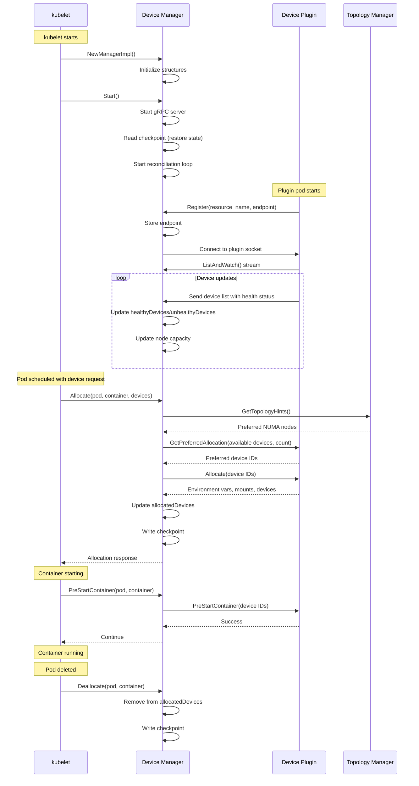
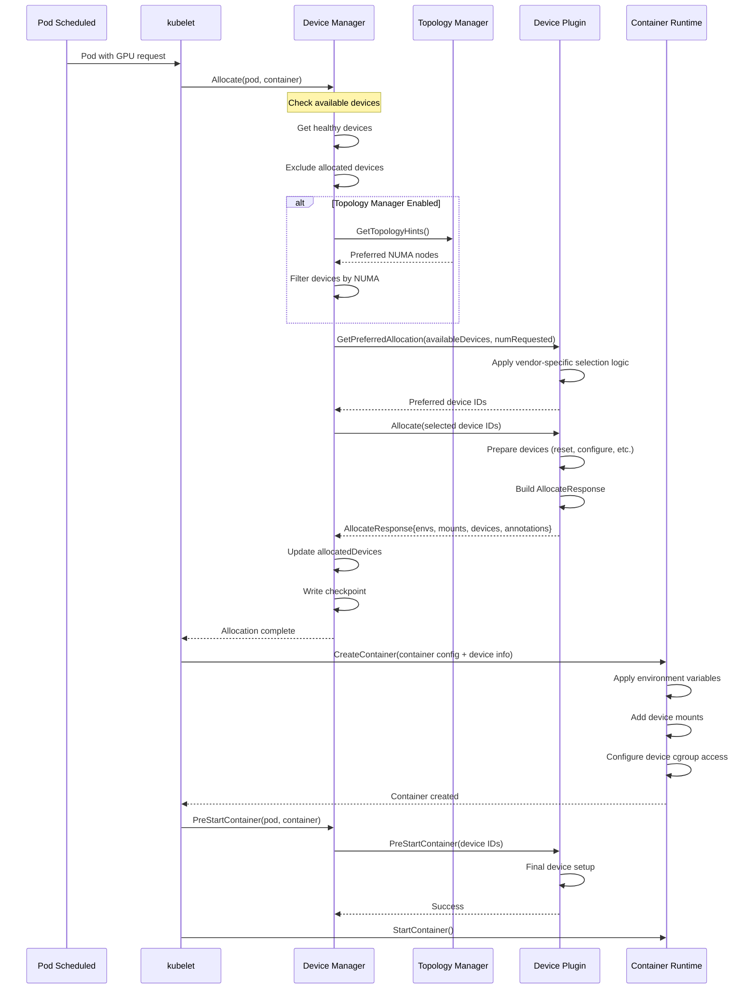

# kubelet Device Plugin Architecture

**Status**: Complete
**Last Updated**: 2025-10-21
**Component**: kubelet - Device Manager and Device Plugin Framework
**Related Documents**:
- [Resource Management](./08-resource-management.md) - Resource allocation basics
- [Topology Manager](./08-resource-management.md#topology-manager) - Device topology coordination
- [Pod Admission](./03-pod-admission.md) - Device-based admission
- [Container Lifecycle](./04-container-lifecycle.md) - Device assignment to containers

---

## Table of Contents

1. [Overview](#overview)
2. [Device Plugin Framework](#device-plugin-framework)
3. [Device Manager Architecture](#device-manager-architecture)
4. [Plugin Registration](#plugin-registration)
5. [Device Discovery and Advertisement](#device-discovery-and-advertisement)
6. [Device Allocation](#device-allocation)
7. [Device Health Monitoring](#device-health-monitoring)
8. [Topology Awareness](#topology-awareness)
9. [Common Device Plugins](#common-device-plugins)
10. [Implementing a Device Plugin](#implementing-a-device-plugin)
11. [Troubleshooting](#troubleshooting)
12. [Best Practices](#best-practices)

---

## Overview

### What are Device Plugins?

Device plugins are a way to extend kubelet to advertise and allocate **specialized hardware resources** to containers:
- GPUs (NVIDIA, AMD)
- FPGAs
- InfiniBand adapters
- High-performance NICs
- TPUs (Tensor Processing Units)
- Custom accelerators

### Why Device Plugins?

1. **Extensibility**: Add new device types without modifying kubelet
2. **Vendor independence**: Device vendors provide their own plugins
3. **Resource management**: Proper allocation and accounting of devices
4. **Isolation**: Devices allocated to one pod aren't visible to others
5. **Topology awareness**: Integrate with NUMA/topology manager

### Architecture Overview

```
┌─────────────────────────────────────────┐
│          Device Plugin Pod              │
│  (DaemonSet running on each node)       │
│  ┌───────────────────────────────────┐  │
│  │   Device Plugin Implementation    │  │
│  │   - nvidia-device-plugin          │  │
│  │   - intel-gpu-plugin              │  │
│  │   - amd-gpu-device-plugin         │  │
│  └─────────────┬─────────────────────┘  │
└────────────────┼────────────────────────┘
                 │ gRPC (Unix socket)
                 │ /var/lib/kubelet/device-plugins/
                 │
┌────────────────▼────────────────────────┐
│      kubelet Device Manager             │
│  ┌──────────────────────────────────┐   │
│  │  - Register plugins              │   │
│  │  - Discover devices              │   │
│  │  - Track device health           │   │
│  │  - Allocate devices to pods      │   │
│  │  - Generate topology hints       │   │
│  └──────────────┬───────────────────┘   │
└─────────────────┼───────────────────────┘
                  │
┌─────────────────▼───────────────────────┐
│       Container Runtime (CRI)           │
│  - Pass device information              │
│  - Configure container device access    │
│  - Set environment variables            │
└─────────────────────────────────────────┘
```

---

## Device Plugin Framework

### Device Plugin API

Device plugins communicate with kubelet via gRPC over a Unix socket.

**Protocol Definition**: `k8s.io/kubelet/pkg/apis/deviceplugin/v1beta1`

```protobuf
service DevicePlugin {
    // ListAndWatch returns a stream of List of Devices
    // Whenever a Device state changes or a Device disappears, ListAndWatch
    // returns the new list
    rpc ListAndWatch(Empty) returns (stream ListAndWatchResponse) {}

    // GetDevicePluginOptions returns options to be communicated with Device Manager
    rpc GetDevicePluginOptions(Empty) returns (DevicePluginOptions) {}

    // Allocate is called during container creation so that the Device
    // Plugin can run device specific operations and instruct Kubelet
    // of the steps to make the Device available in the container
    rpc Allocate(AllocateRequest) returns (AllocateResponse) {}

    // GetPreferredAllocation returns a preferred set of devices to allocate
    // from a list of available ones. The resulting preferred allocation is not
    // guaranteed to be the allocation ultimately performed by the
    // devicemanager. It is only designed to help the devicemanager make a more
    // informed allocation decision when possible.
    rpc GetPreferredAllocation(PreferredAllocationRequest) returns (PreferredAllocationResponse) {}

    // PreStartContainer is called, if indicated by Device Plugin during registration phase,
    // before each container start. Device plugin can run device specific operations
    // such as resetting the device before making devices available to the container
    rpc PreStartContainer(PreStartContainerRequest) returns (PreStartContainerResponse) {}
}

service Registration {
    rpc Register(RegisterRequest) returns (Empty) {}
}
```

### Message Types

**RegisterRequest**:

```protobuf
message RegisterRequest {
    // Version of the API the Device Plugin was built against
    string version = 1;
    // Name of the unix socket the device plugin is listening on
    // PATH = path.Join(DevicePluginPath, endpoint)
    string endpoint = 2;
    // Schedulable resource name. As of now it's expected to be a DNS Label
    string resource_name = 3;
    // Options to be communicated with Device Manager
    DevicePluginOptions options = 4;
}
```

**Device**:

```protobuf
message Device {
    // A unique ID assigned by the device plugin used
    // to identify devices during the communication
    // Max length of this field is 63 characters
    string ID = 1;
    // Health of the device, can be healthy or unhealthy, see constants.go
    string health = 2;
    // Topology for device
    TopologyInfo topology = 3;
}
```

**AllocateRequest/Response**:

```protobuf
message ContainerAllocateRequest {
    repeated string devicesIDs = 1;
}

message ContainerAllocateResponse {
    // List of environment variable to be set in the container to access one of more devices.
    map<string, string> envs = 1;
    // Mounts for the container.
    repeated Mount mounts = 2;
    // Devices for the container.
    repeated DeviceSpec devices = 3;
    // Container annotations to pass to the container runtime
    map<string, string> annotations = 4;
}

message DeviceSpec {
    // Path of the device within the container
    string container_path = 1;
    // Path of the device on the host
    string host_path = 2;
    // Cgroups permissions of the device, candidates are one or more of
    // * r - allows container to read from the specified device.
    // * w - allows container to write to the specified device.
    // * m - allows container to create device files that do not yet exist.
    string permissions = 3;
}
```

---

## Device Manager Architecture

### Device Manager Structure

**Source**: `pkg/kubelet/cm/devicemanager/manager.go:62-116`

```go
type ManagerImpl struct {
    checkpointdir string

    // endpoints maps resource name to plugin endpoint
    endpoints map[string]endpointInfo
    mutex     sync.Mutex

    server plugin.Server

    // activePods returns list of active pods
    activePods ActivePodsFunc

    sourcesReady config.SourcesReady

    // allDevices holds all registered devices
    allDevices ResourceDeviceInstances

    // healthyDevices contains healthy device IDs by resource name
    healthyDevices map[string]sets.Set[string]

    // unhealthyDevices contains unhealthy device IDs
    unhealthyDevices map[string]sets.Set[string]

    // allocatedDevices contains allocated device IDs
    allocatedDevices map[string]sets.Set[string]

    // podDevices contains pod to device mapping
    podDevices *podDevices
    checkpointManager checkpointmanager.CheckpointManager

    // numaNodes available on the node
    numaNodes []int

    // topologyAffinityStore for topology manager integration
    topologyAffinityStore topologymanager.Store

    // devicesToReuse for init container device reuse
    devicesToReuse PodReusableDevices

    containerMap containermap.ContainerMap
    containerRunningSet sets.Set[string]

    // update channel for device health updates
    update chan resourceupdates.Update
}
```

### Device Manager Lifecycle



---

## Plugin Registration

### Registration Flow

```mermaid
flowchart TD
    START[Device Plugin Starts]

    DIAL[Connect to kubelet Registration Socket<br/>/var/lib/kubelet/device-plugins/kubelet.sock]
    START --> DIAL

    REGISTER[Send RegisterRequest<br/>- API version<br/>- Plugin endpoint<br/>- Resource name<br/>- Options]
    DIAL --> REGISTER

    DM_VALIDATE{kubelet Device Manager<br/>Validates Request}
    REGISTER --> DM_VALIDATE

    DM_VALIDATE -->|Invalid| REJECT[Reject Registration]
    DM_VALIDATE -->|Valid| ACCEPT[Accept Registration]

    ACCEPT --> STORE[Store Plugin Endpoint]
    STORE --> CONNECT[Connect to Plugin Socket<br/>/var/lib/kubelet/device-plugins/<endpoint>]

    CONNECT --> LISTWATCH[Call ListAndWatch()]

    LISTWATCH --> STREAM[Receive Device Stream]

    STREAM --> UPDATE[Update Device Capacity]

    UPDATE --> READY[Plugin Ready]

    REJECT --> END[Plugin Failed]
    READY --> END2[Running]

    style REJECT fill:#ffcdd2
    style READY fill:#c8e6c9
```

### Registration Code Example

```go
// Device plugin connects to kubelet
func Register(kubeletEndpoint, pluginEndpoint, resourceName string, options *pluginapi.DevicePluginOptions) error {
    // Connect to kubelet registration socket
    conn, err := grpc.Dial(
        kubeletEndpoint,
        grpc.WithInsecure(),
        grpc.WithDialer(func(addr string, timeout time.Duration) (net.Conn, error) {
            return net.DialTimeout("unix", addr, timeout)
        }),
    )
    if err != nil {
        return fmt.Errorf("cannot connect to kubelet service: %v", err)
    }
    defer conn.Close()

    // Create registration client
    client := pluginapi.NewRegistrationClient(conn)

    // Send registration request
    request := &pluginapi.RegisterRequest{
        Version:      pluginapi.Version,
        Endpoint:     pluginEndpoint,
        ResourceName: resourceName,
        Options:      options,
    }

    _, err = client.Register(context.Background(), request)
    if err != nil {
        return fmt.Errorf("cannot register device plugin: %v", err)
    }

    return nil
}
```

---

## Device Discovery and Advertisement

### ListAndWatch Implementation

```go
// ListAndWatch sends device list and watches for changes
func (dp *DevicePlugin) ListAndWatch(e *pluginapi.Empty, s pluginapi.DevicePlugin_ListAndWatchServer) error {
    logger := klog.FromContext(s.Context())

    // Send initial device list
    devices := dp.discoverDevices()
    if err := s.Send(&pluginapi.ListAndWatchResponse{Devices: devices}); err != nil {
        return err
    }
    logger.Info("Sent initial device list", "count", len(devices))

    // Watch for device changes
    for {
        select {
        case <-dp.stop:
            return nil
        case update := <-dp.deviceUpdateChan:
            // Send updated device list
            if err := s.Send(&pluginapi.ListAndWatchResponse{Devices: update}); err != nil {
                return err
            }
            logger.Info("Sent device update", "count", len(update))
        case <-s.Context().Done():
            return s.Context().Err()
        }
    }
}

// Example: Discover NVIDIA GPUs
func (dp *NvidiaDevicePlugin) discoverDevices() []*pluginapi.Device {
    devices := []*pluginapi.Device{}

    // Query NVIDIA driver for available GPUs
    count, err := nvml.DeviceGetCount()
    if err != nil {
        logger.Error(err, "Failed to get device count")
        return devices
    }

    for i := 0; i < count; i++ {
        device, err := nvml.DeviceGetHandleByIndex(i)
        if err != nil {
            logger.Error(err, "Failed to get device handle", "index", i)
            continue
        }

        uuid, err := device.GetUUID()
        if err != nil {
            logger.Error(err, "Failed to get device UUID", "index", i)
            continue
        }

        // Check device health
        health := pluginapi.Healthy
        memory, err := device.GetMemoryInfo()
        if err != nil || memory.Free == 0 {
            health = pluginapi.Unhealthy
        }

        // Get NUMA node for topology
        topology := &pluginapi.TopologyInfo{}
        numaNode, err := device.GetNUMANode()
        if err == nil {
            topology.Nodes = []*pluginapi.NUMANode{
                {ID: int64(numaNode)},
            }
        }

        devices = append(devices, &pluginapi.Device{
            ID:       uuid,
            Health:   health,
            Topology: topology,
        })
    }

    return devices
}
```

### Node Capacity Update

When devices are discovered, kubelet updates node capacity:

```yaml
apiVersion: v1
kind: Node
metadata:
  name: node-1
status:
  capacity:
    cpu: "16"
    memory: "64Gi"
    nvidia.com/gpu: "4"          # 4 NVIDIA GPUs
    intel.com/fpga: "2"          # 2 Intel FPGAs
  allocatable:
    cpu: "15"
    memory: "60Gi"
    nvidia.com/gpu: "4"
    intel.com/fpga: "2"
```

---

## Device Allocation

### Allocation Request Flow



### Allocate Implementation Example

```go
// Allocate assigns devices to container
func (dp *DevicePlugin) Allocate(ctx context.Context, reqs *pluginapi.AllocateRequest) (*pluginapi.AllocateResponse, error) {
    responses := &pluginapi.AllocateResponse{}

    for _, req := range reqs.ContainerRequests {
        response := &pluginapi.ContainerAllocateResponse{}

        // For each requested device
        for _, deviceID := range req.DevicesIDs {
            // Add device to container
            response.Devices = append(response.Devices, &pluginapi.DeviceSpec{
                HostPath:      fmt.Sprintf("/dev/nvidia%s", deviceID),
                ContainerPath: fmt.Sprintf("/dev/nvidia%s", deviceID),
                Permissions:   "rw",
            })

            // Add device node
            response.Devices = append(response.Devices, &pluginapi.DeviceSpec{
                HostPath:      "/dev/nvidiactl",
                ContainerPath: "/dev/nvidiactl",
                Permissions:   "rw",
            })

            response.Devices = append(response.Devices, &pluginapi.DeviceSpec{
                HostPath:      "/dev/nvidia-uvm",
                ContainerPath: "/dev/nvidia-uvm",
                Permissions:   "rw",
            })
        }

        // Set environment variables
        response.Envs = map[string]string{
            "NVIDIA_VISIBLE_DEVICES": strings.Join(req.DevicesIDs, ","),
            "NVIDIA_DRIVER_CAPABILITIES": "compute,utility",
        }

        // Mount NVIDIA libraries
        response.Mounts = append(response.Mounts, &pluginapi.Mount{
            HostPath:      "/usr/local/nvidia",
            ContainerPath: "/usr/local/nvidia",
            ReadOnly:      true,
        })

        responses.ContainerResponses = append(responses.ContainerResponses, response)
    }

    return responses, nil
}
```

### Pod Specification

```yaml
apiVersion: v1
kind: Pod
metadata:
  name: gpu-pod
spec:
  containers:
  - name: cuda-app
    image: nvidia/cuda:11.0-base
    command: ["nvidia-smi"]
    resources:
      limits:
        nvidia.com/gpu: 2  # Request 2 GPUs
```

---

## Device Health Monitoring

### Health Status

Devices can be in two states:
- **Healthy**: Device is functioning correctly
- **Unhealthy**: Device has failed or is malfunctioning

### Health Update Flow

```go
// Monitor device health and send updates
func (dp *DevicePlugin) monitorDeviceHealth() {
    ticker := time.NewTicker(10 * time.Second)
    defer ticker.Stop()

    for {
        select {
        case <-ticker.C:
            devices := dp.checkDeviceHealth()
            // Send updated device list via ListAndWatch stream
            dp.deviceUpdateChan <- devices
        case <-dp.stop:
            return
        }
    }
}

func (dp *DevicePlugin) checkDeviceHealth() []*pluginapi.Device {
    devices := []*pluginapi.Device{}

    count, _ := nvml.DeviceGetCount()
    for i := 0; i < count; i++ {
        device, _ := nvml.DeviceGetHandleByIndex(i)
        uuid, _ := device.GetUUID()

        health := pluginapi.Healthy

        // Check for ECC errors
        eccErrors, err := device.GetTotalEccErrors()
        if err == nil && eccErrors > 0 {
            health = pluginapi.Unhealthy
        }

        // Check temperature
        temp, err := device.GetTemperature()
        if err == nil && temp > 85 {  // 85°C threshold
            health = pluginapi.Unhealthy
        }

        // Check if GPU is responding
        _, err = device.GetUtilizationRates()
        if err != nil {
            health = pluginapi.Unhealthy
        }

        devices = append(devices, &pluginapi.Device{
            ID:     uuid,
            Health: health,
        })
    }

    return devices
}
```

### Unhealthy Device Handling

When a device becomes unhealthy:
1. Plugin sends updated device list with `Health: Unhealthy`
2. Device Manager marks device as unhealthy
3. Device is excluded from future allocations
4. **Existing allocations** are NOT revoked (pods keep running)
5. Node capacity is NOT reduced (unhealthy != unavailable)

---

## Topology Awareness

### NUMA Affinity

Device plugins can report NUMA node affinity in device topology:

```go
topology := &pluginapi.TopologyInfo{
    Nodes: []*pluginapi.NUMANode{
        {ID: 0},  // Device attached to NUMA node 0
    },
}

device := &pluginapi.Device{
    ID:       "GPU-0",
    Health:   pluginapi.Healthy,
    Topology: topology,
}
```

### Topology Manager Integration

```go
// Device Manager implements TopologyHint provider
func (m *ManagerImpl) GetTopologyHints(pod *v1.Pod, container *v1.Container) map[string][]topologymanager.TopologyHint {
    hints := make(map[string][]topologymanager.TopologyHint)

    // For each requested device resource
    for resourceName, quantity := range container.Resources.Limits {
        if !m.isDevicePluginResource(resourceName) {
            continue
        }

        // Get available devices
        available := m.getAvailableDevices(resourceName)

        // Generate hints based on device NUMA topology
        resourceHints := []topologymanager.TopologyHint{}
        for _, device := range available {
            if device.Topology != nil {
                numaNodes := sets.NewInt()
                for _, node := range device.Topology.Nodes {
                    numaNodes.Insert(int(node.ID))
                }
                resourceHints = append(resourceHints, topologymanager.TopologyHint{
                    NUMANodeAffinity: numaNodes,
                    Preferred:        true,
                })
            }
        }

        hints[string(resourceName)] = resourceHints
    }

    return hints
}
```

**Example**: Pod requests 2 GPUs + 4 CPUs + 8Gi memory

```
Topology Manager (policy: single-numa-node) receives hints:
- GPU hints: [NUMA 0, NUMA 1]
- CPU hints: [NUMA 0 (CPUs 0-7), NUMA 1 (CPUs 8-15)]
- Memory hints: [NUMA 0 (8Gi avail), NUMA 1 (8Gi avail)]

Best hint: NUMA 0 (all resources available on same node)
→ Allocate GPUs from NUMA 0
→ Allocate CPUs 0-3 from NUMA 0
→ Allocate 8Gi memory from NUMA 0
```

---

## Common Device Plugins

### 1. NVIDIA GPU Device Plugin

**Repository**: https://github.com/NVIDIA/k8s-device-plugin

**Installation**:

```bash
kubectl create -f https://raw.githubusercontent.com/NVIDIA/k8s-device-plugin/main/nvidia-device-plugin.yml
```

**Supported Features**:
- GPU discovery and allocation
- Multi-GPU support
- MIG (Multi-Instance GPU) support
- GPU health monitoring
- NUMA topology awareness

**Pod Example**:

```yaml
apiVersion: v1
kind: Pod
metadata:
  name: gpu-pod
spec:
  containers:
  - name: cuda-test
    image: nvidia/cuda:11.0-base
    command: ["nvidia-smi"]
    resources:
      limits:
        nvidia.com/gpu: 1
```

### 2. Intel GPU Device Plugin

**Repository**: https://github.com/intel/intel-device-plugins-for-kubernetes

**Supports**: Intel integrated GPUs, Xe GPUs

### 3. AMD GPU Device Plugin

**Repository**: https://github.com/RadeonOpenCompute/k8s-device-plugin

**Supports**: AMD Radeon GPUs with ROCm

### 4. Intel FPGA Device Plugin

**Supports**: Intel FPGA acceleration cards

### 5. RDMA Device Plugin

**Supports**: InfiniBand and RoCE adapters

---

## Implementing a Device Plugin

### Step-by-Step Guide

#### 1. Discover Devices

```go
type MyDevicePlugin struct {
    devices []*pluginapi.Device
    stop    chan interface{}
}

func (dp *MyDevicePlugin) discoverDevices() []*pluginapi.Device {
    devices := []*pluginapi.Device{}

    // Example: Discover custom accelerators
    files, err := ioutil.ReadDir("/sys/class/my_accelerator/")
    if err != nil {
        return devices
    }

    for _, file := range files {
        deviceID := file.Name()
        devices = append(devices, &pluginapi.Device{
            ID:     deviceID,
            Health: pluginapi.Healthy,
        })
    }

    return devices
}
```

#### 2. Implement gRPC Server

```go
func (dp *MyDevicePlugin) Start() error {
    // Remove stale socket
    if err := os.Remove(dp.socket); err != nil && !os.IsNotExist(err) {
        return err
    }

    // Listen on Unix socket
    listener, err := net.Listen("unix", dp.socket)
    if err != nil {
        return err
    }

    // Create gRPC server
    dp.server = grpc.NewServer()
    pluginapi.RegisterDevicePluginServer(dp.server, dp)

    // Start serving
    go dp.server.Serve(listener)

    return nil
}
```

#### 3. Implement ListAndWatch

```go
func (dp *MyDevicePlugin) ListAndWatch(e *pluginapi.Empty, s pluginapi.DevicePlugin_ListAndWatchServer) error {
    // Send initial list
    dp.devices = dp.discoverDevices()
    s.Send(&pluginapi.ListAndWatchResponse{Devices: dp.devices})

    // Watch for changes
    for {
        select {
        case <-dp.stop:
            return nil
        case <-time.After(10 * time.Second):
            // Periodic health check
            dp.devices = dp.discoverDevices()
            s.Send(&pluginapi.ListAndWatchResponse{Devices: dp.devices})
        }
    }
}
```

#### 4. Implement Allocate

```go
func (dp *MyDevicePlugin) Allocate(ctx context.Context, reqs *pluginapi.AllocateRequest) (*pluginapi.AllocateResponse, error) {
    responses := &pluginapi.AllocateResponse{}

    for _, req := range reqs.ContainerRequests {
        response := &pluginapi.ContainerAllocateResponse{}

        for _, deviceID := range req.DevicesIDs {
            // Add device file
            response.Devices = append(response.Devices, &pluginapi.DeviceSpec{
                HostPath:      fmt.Sprintf("/dev/my_accel_%s", deviceID),
                ContainerPath: fmt.Sprintf("/dev/my_accel_%s", deviceID),
                Permissions:   "rw",
            })

            // Add environment variable
            response.Envs = map[string]string{
                "MY_ACCEL_DEVICES": strings.Join(req.DevicesIDs, ","),
            }
        }

        responses.ContainerResponses = append(responses.ContainerResponses, response)
    }

    return responses, nil
}
```

#### 5. Register with kubelet

```go
func (dp *MyDevicePlugin) Register() error {
    conn, err := grpc.Dial(
        pluginapi.KubeletSocket,
        grpc.WithInsecure(),
        grpc.WithDialer(dial),
    )
    if err != nil {
        return err
    }
    defer conn.Close()

    client := pluginapi.NewRegistrationClient(conn)
    request := &pluginapi.RegisterRequest{
        Version:      pluginapi.Version,
        Endpoint:     path.Base(dp.socket),
        ResourceName: "example.com/my-accelerator",
    }

    _, err = client.Register(context.Background(), request)
    return err
}
```

#### 6. Deploy as DaemonSet

```yaml
apiVersion: apps/v1
kind: DaemonSet
metadata:
  name: my-device-plugin
  namespace: kube-system
spec:
  selector:
    matchLabels:
      name: my-device-plugin
  template:
    metadata:
      labels:
        name: my-device-plugin
    spec:
      containers:
      - name: my-device-plugin
        image: my-org/my-device-plugin:v1.0
        securityContext:
          privileged: true
        volumeMounts:
        - name: device-plugin
          mountPath: /var/lib/kubelet/device-plugins
        - name: dev
          mountPath: /dev
      volumes:
      - name: device-plugin
        hostPath:
          path: /var/lib/kubelet/device-plugins
      - name: dev
        hostPath:
          path: /dev
```

---

## Troubleshooting

### Common Issues

#### 1. Plugin Registration Fails

**Symptoms**:

```
Failed to register device plugin: connection refused
```

**Diagnosis**:

```bash
# Check if kubelet device plugin socket exists
ls -la /var/lib/kubelet/device-plugins/kubelet.sock

# Check plugin logs
kubectl logs -n kube-system <device-plugin-pod>

# Check kubelet logs
journalctl -u kubelet | grep -i "device plugin"
```

**Solutions**:
- Ensure kubelet is running
- Check socket permissions
- Verify plugin is using correct socket path

#### 2. Devices Not Advertised

**Symptoms**: Node capacity doesn't show device resource

**Diagnosis**:

```bash
# Check node capacity
kubectl describe node <node> | grep -i capacity

# Check device plugin logs
kubectl logs -n kube-system <device-plugin-pod>

# Check if plugin registered
ls -la /var/lib/kubelet/device-plugins/
```

**Solutions**:
- Verify ListAndWatch is sending devices
- Check device discovery logic
- Ensure devices are healthy

#### 3. Device Allocation Fails

**Symptoms**:

```
Pod status: ContainerCreating
Events: Failed to allocate devices
```

**Diagnosis**:

```bash
# Check device allocation
kubectl describe pod <pod>

# Check available devices
kubectl describe node <node> | grep -A10 Allocatable

# Check kubelet logs
journalctl -u kubelet | grep -i allocate
```

**Solutions**:
- Verify sufficient devices available
- Check device health status
- Review Allocate() implementation

---

## Best Practices

### Plugin Development

1. **Implement health monitoring**

```go
// Continuously monitor device health
func (dp *Plugin) monitorHealth() {
    ticker := time.NewTicker(10 * time.Second)
    for range ticker.C {
        devices := dp.checkDeviceHealth()
        dp.updateChan <- devices
    }
}
```

2. **Handle kubelet restarts**

```go
// Reconnect on disconnection
func (dp *Plugin) serve() {
    for {
        if err := dp.Start(); err != nil {
            log.Error(err, "Failed to start")
            time.Sleep(5 * time.Second)
            continue
        }
        if err := dp.Register(); err != nil {
            log.Error(err, "Failed to register")
            time.Sleep(5 * time.Second)
            continue
        }
        // Block until disconnected
        <-dp.stop
        log.Info("Restarting plugin")
    }
}
```

3. **Provide topology information**

```go
topology := &pluginapi.TopologyInfo{
    Nodes: []*pluginapi.NUMANode{{ID: int64(numaNode)}},
}
```

### Deployment

1. **Use DaemonSets** for node-level plugins

2. **Set appropriate securityContext**

```yaml
securityContext:
  privileged: true  # Required for device access
```

3. **Mount necessary paths**

```yaml
volumeMounts:
- name: device-plugin
  mountPath: /var/lib/kubelet/device-plugins
- name: dev
  mountPath: /dev
- name: sys
  mountPath: /sys
```

4. **Add resource limits**

```yaml
resources:
  requests:
    cpu: 50m
    memory: 50Mi
  limits:
    cpu: 100m
    memory: 100Mi
```

---

## Summary

### Key Takeaways

1. **Device plugins** extend kubelet to support specialized hardware
2. **gRPC API** provides standardized plugin interface
3. **ListAndWatch** streams device availability and health
4. **Allocate** assigns devices to containers
5. **Topology awareness** enables NUMA-optimized allocation
6. **Health monitoring** ensures only healthy devices are allocated
7. **Checkpoint** preserves allocation across kubelet restarts

### Related Documentation

- [Resource Management](./08-resource-management.md) - Resource allocation framework
- [Topology Manager](./08-resource-management.md#topology-manager) - NUMA coordination
- [Pod Admission](./03-pod-admission.md) - Device-based admission
- [Container Lifecycle](./04-container-lifecycle.md) - Device setup in containers

### References

- `pkg/kubelet/cm/devicemanager/` - Device manager implementation
- `k8s.io/kubelet/pkg/apis/deviceplugin/v1beta1` - Device plugin API
- https://kubernetes.io/docs/concepts/extend-kubernetes/compute-storage-net/device-plugins/
- https://github.com/kubernetes/community/blob/master/contributors/design-proposals/resource-management/device-plugin.md

---

**Document Status**: Complete
**Last Updated**: 2025-10-21
**Next**: [Probes and Health Checks](./10-probes-health-checks.md)
