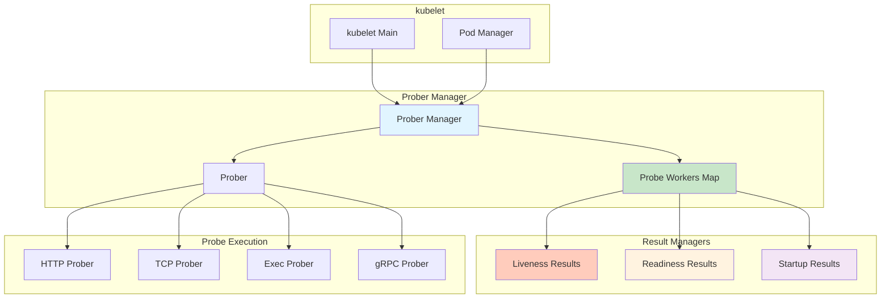
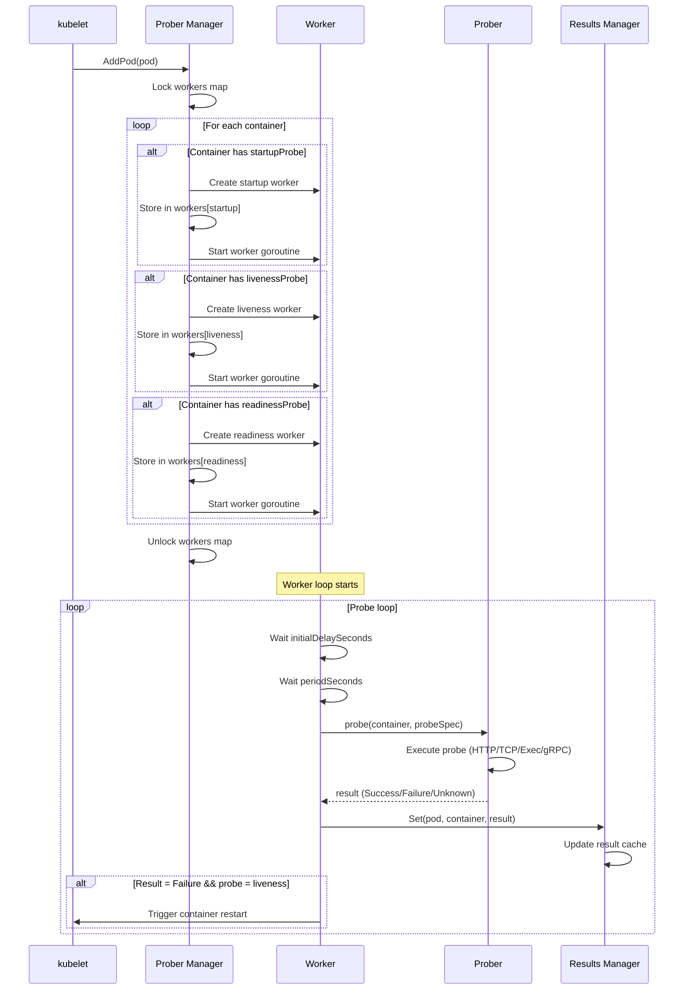

# kubelet Probes and Health Checks Architecture

**Status**: Complete
**Last Updated**: 2025-10-21
**Component**: kubelet - Prober Manager and Health Checks
**Related Documents**:
- [Container Lifecycle](./04-container-lifecycle.md) - Container restart based on probes
- [Pod Sync Loop](./01-pod-sync-loop.md) - Probe integration in sync loop
- [Pod Lifecycle Overview](../high-level/03-pod-lifecycle-overview.md) - Pod conditions
- [System Overview](../high-level/01-system-overview.md) - Health monitoring

---

## Table of Contents

1. [Overview](#overview)
2. [Probe Types](#probe-types)
3. [Probe Mechanisms](#probe-mechanisms)
4. [Prober Manager Architecture](#prober-manager-architecture)
5. [Probe Execution Flow](#probe-execution-flow)
6. [Probe Results Management](#probe-results-management)
7. [Startup Probes](#startup-probes)
8. [Liveness Probes](#liveness-probes)
9. [Readiness Probes](#readiness-probes)
10. [Probe Configuration](#probe-configuration)
11. [Troubleshooting](#troubleshooting)
12. [Best Practices](#best-practices)

---

## Overview

### What are Probes?

Kubernetes probes are **periodic health checks** performed by kubelet to determine container health and readiness:

- **Liveness probes**: Detect when to restart an unhealthy container
- **Readiness probes**: Determine when container is ready to accept traffic
- **Startup probes**: Handle slow-starting containers, protecting them during initialization

### Why Probes Matter

1. **Automatic recovery**: Restart failed containers without manual intervention
2. **Traffic management**: Only route traffic to healthy pods
3. **Rolling updates**: Ensure new pods are ready before terminating old ones
4. **Slow starts**: Protect containers with long initialization times
5. **Application health**: Detect app-level failures (not just process crashes)

### Probe Lifecycle

```
Container Start
     │
     ▼
[Startup Probe] ────► If fails repeatedly ────► Restart container
     │ Running                                        │
     │ (until success)                                │
     ▼                                                │
[Startup Success] ◄──────────────────────────────────┘
     │
     ├──► [Liveness Probe] ────► If fails ────► Restart container
     │         │ Running                              │
     │         │ (periodically)                       │
     │         ▼                                      │
     │    [Still alive] ◄───────────────────────────┘
     │
     └──► [Readiness Probe] ───► If fails ───► Remove from Service
               │ Running                            │
               │ (periodically)                     │
               ▼                                    │
          [Ready] ◄─────────────────────────────────┘
```

---

## Probe Types

### 1. Liveness Probe

**Purpose**: Detect when container application is in a broken state

**Action**: Restart the container

**Use Cases**:
- Deadlocked applications
- Infinite loops
- Corrupted internal state
- Application hung but process still running

**Example**:

```yaml
apiVersion: v1
kind: Pod
metadata:
  name: liveness-example
spec:
  containers:
  - name: app
    image: myapp:v1
    livenessProbe:
      httpGet:
        path: /healthz
        port: 8080
      initialDelaySeconds: 3
      periodSeconds: 10
      timeoutSeconds: 1
      successThreshold: 1
      failureThreshold: 3
```

**Behavior**:
- Wait 3 seconds after container start (`initialDelaySeconds`)
- Check every 10 seconds (`periodSeconds`)
- If fails 3 times in a row (`failureThreshold`), restart container
- Container must respond within 1 second (`timeoutSeconds`)

### 2. Readiness Probe

**Purpose**: Determine when container is ready to serve traffic

**Action**: Add/remove pod from Service endpoints

**Use Cases**:
- Loading configuration
- Warming up caches
- Establishing database connections
- Waiting for dependent services
- Temporary overload (rate limiting)

**Example**:

```yaml
apiVersion: v1
kind: Pod
metadata:
  name: readiness-example
spec:
  containers:
  - name: app
    image: myapp:v1
    readinessProbe:
      httpGet:
        path: /ready
        port: 8080
      initialDelaySeconds: 5
      periodSeconds: 5
      timeoutSeconds: 1
      successThreshold: 1
      failureThreshold: 3
```

**Behavior**:
- If fails, pod **NOT restarted** (unlike liveness)
- Pod removed from Service endpoints (no traffic routed)
- Once succeeds again, pod added back to Service
- Pod conditions updated: `Ready: True/False`

### 3. Startup Probe

**Purpose**: Protect slow-starting containers from premature restarts

**Action**: Disable liveness/readiness checks until startup succeeds

**Use Cases**:
- Legacy applications with long initialization
- Loading large datasets
- JVM applications with slow JIT warmup
- Applications with external dependency checks on startup

**Example**:

```yaml
apiVersion: v1
kind: Pod
metadata:
  name: startup-example
spec:
  containers:
  - name: slow-app
    image: legacy-app:v1
    startupProbe:
      httpGet:
        path: /startup
        port: 8080
      initialDelaySeconds: 0
      periodSeconds: 10
      timeoutSeconds: 1
      successThreshold: 1
      failureThreshold: 30  # 30 * 10 = 300 seconds max startup time
    livenessProbe:
      httpGet:
        path: /healthz
        port: 8080
      periodSeconds: 10
      failureThreshold: 3
```

**Behavior**:
- Liveness/readiness probes **disabled** until startup succeeds
- Allows up to 300 seconds for container to start (30 failures * 10s period)
- Once startup succeeds, liveness and readiness probes begin
- If startup fails repeatedly, container is restarted

### Probe Priority

```
1. Startup Probe (if defined)
   └─► Runs until success
       └─► Once successful, never runs again
           └─► Enables Liveness and Readiness probes

2. Liveness Probe (runs after startup success or if no startup probe)
   └─► Runs periodically
       └─► Failure ──► Restart container

3. Readiness Probe (runs after startup success or if no startup probe)
   └─► Runs periodically
       └─► Failure ──► Remove from Service endpoints
```

---

## Probe Mechanisms

### 1. HTTP GET

**Description**: Perform HTTP GET request to container

**Success**: HTTP status code >= 200 and < 400

**Failure**: HTTP status code < 200 or >= 400, or connection error

**Configuration**:

```yaml
livenessProbe:
  httpGet:
    path: /healthz
    port: 8080
    scheme: HTTP      # HTTP or HTTPS
    httpHeaders:
    - name: Custom-Header
      value: Awesome
```

**Implementation**:

```go
func (pb *prober) httpProbe(req *httpProbeRequest) (probe.Result, string, error) {
    url := fmt.Sprintf("%s://%s:%d%s", req.scheme, req.host, req.port, req.path)

    httpClient := &http.Client{Timeout: req.timeout}
    req, err := http.NewRequest("GET", url, nil)

    for _, header := range req.headers {
        req.Header.Set(header.Name, header.Value)
    }

    resp, err := httpClient.Do(req)
    if err != nil {
        return probe.Failure, err.Error(), nil
    }
    defer resp.Body.Close()

    if resp.StatusCode >= 200 && resp.StatusCode < 400 {
        return probe.Success, "HTTP probe succeeded", nil
    }

    return probe.Failure, fmt.Sprintf("HTTP status %d", resp.StatusCode), nil
}
```

**Use Cases**:
- Web applications
- REST APIs
- Microservices with HTTP endpoints

### 2. TCP Socket

**Description**: Attempt to open TCP connection to container port

**Success**: Connection established

**Failure**: Connection refused or timeout

**Configuration**:

```yaml
livenessProbe:
  tcpSocket:
    port: 8080
```

**Implementation**:

```go
func (pb *prober) tcpProbe(host string, port int, timeout time.Duration) (probe.Result, string, error) {
    conn, err := net.DialTimeout("tcp", net.JoinHostPort(host, strconv.Itoa(port)), timeout)
    if err != nil {
        return probe.Failure, err.Error(), nil
    }
    conn.Close()
    return probe.Success, "TCP probe succeeded", nil
}
```

**Use Cases**:
- Databases (MySQL, PostgreSQL)
- Message queues (Redis, RabbitMQ)
- Any TCP-based service without HTTP endpoint

### 3. Exec Command

**Description**: Execute command inside container

**Success**: Command exits with status code 0

**Failure**: Command exits with non-zero status code

**Configuration**:

```yaml
livenessProbe:
  exec:
    command:
    - cat
    - /tmp/healthy
```

**Implementation**:

```go
func (pb *prober) execProbe(containerID kubecontainer.ContainerID, cmd []string, timeout time.Duration) (probe.Result, string, error) {
    output, err := pb.runner.RunInContainer(containerID, cmd, timeout)
    if err != nil {
        exitErr, ok := err.(utilexec.ExitError)
        if ok && exitErr.ExitStatus() != 0 {
            return probe.Failure, string(output), nil
        }
        return probe.Unknown, "", err
    }
    return probe.Success, string(output), nil
}
```

**Use Cases**:
- Custom health checks
- Database connection tests (`pg_isready`)
- File existence checks
- Script-based validation

### 4. gRPC Probe

**Description**: Perform gRPC health check (Kubernetes 1.24+)

**Success**: gRPC health check returns `SERVING`

**Failure**: gRPC returns `NOT_SERVING` or connection error

**Configuration**:

```yaml
livenessProbe:
  grpc:
    port: 50051
    service: myservice  # Optional, defaults to ""
```

**Implementation**:

```go
func (pb *prober) grpcProbe(host string, port int, service string, timeout time.Duration) (probe.Result, string, error) {
    conn, err := grpc.DialContext(ctx, address, grpc.WithInsecure(), grpc.WithBlock())
    if err != nil {
        return probe.Failure, err.Error(), nil
    }
    defer conn.Close()

    client := grpc_health_v1.NewHealthClient(conn)
    resp, err := client.Check(ctx, &grpc_health_v1.HealthCheckRequest{Service: service})
    if err != nil {
        return probe.Failure, err.Error(), nil
    }

    if resp.Status == grpc_health_v1.HealthCheckResponse_SERVING {
        return probe.Success, "gRPC probe succeeded", nil
    }

    return probe.Failure, fmt.Sprintf("gRPC status: %v", resp.Status), nil
}
```

**Use Cases**:
- gRPC services
- High-performance RPC applications

---

## Prober Manager Architecture

### Component Structure



### Prober Manager Structure

**Source**: `pkg/kubelet/prober/prober_manager.go:93-115`

```go
type manager struct {
    // Map of active workers for probes
    workers map[probeKey]*worker
    workerLock sync.RWMutex

    // Status manager provides pod IP and container IDs
    statusManager status.Manager

    // Result managers for each probe type
    readinessManager results.Manager
    livenessManager  results.Manager
    startupManager   results.Manager

    // prober executes probe actions
    prober *prober

    start time.Time
}

type probeKey struct {
    podUID        types.UID
    containerName string
    probeType     probeType  // liveness, readiness, or startup
}
```

### Worker Structure

```go
type worker struct {
    // Stop signal
    stopCh chan struct{}

    // Pod reference
    pod *v1.Pod

    // Container reference
    container *v1.Container

    // Probe type (liveness, readiness, startup)
    probeType probeType

    // Prober manager reference
    probeManager *manager

    // Results manager for this probe type
    resultsManager results.Manager

    // Last known container ID
    containerID kubecontainer.ContainerID

    // Probe spec
    spec *v1.Probe

    // Initial delay before first probe
    initialDelay bool

    // Result from last probe
    lastResult probe.Result
}
```

---

## Probe Execution Flow

### Adding a Pod



### Worker Run Loop

```go
func (w *worker) run(ctx context.Context) {
    logger := klog.FromContext(ctx)
    probeTickerPeriod := time.Duration(w.spec.PeriodSeconds) * time.Second

    // Wait for initial delay
    if int(w.spec.InitialDelaySeconds) > 0 {
        time.Sleep(time.Duration(w.spec.InitialDelaySeconds) * time.Second)
    }

    // Probe loop
    probeTicker := time.NewTicker(probeTickerPeriod)
    defer probeTicker.Stop()

    for {
        select {
        case <-w.stopCh:
            return
        case <-probeTicker.C:
            // Get container ID
            status, ok := w.probeManager.statusManager.GetPodStatus(w.pod.UID)
            if !ok {
                continue
            }

            containerID, err := w.findContainerID(status)
            if err != nil {
                continue
            }

            // Execute probe
            result, output, err := w.probeManager.prober.probe(w.probeType, w.pod, status, w.container, containerID)

            // Record result
            if result == probe.Success {
                ProberResults.WithLabelValues(w.probeType.String(), probeResultSuccessful, ...).Inc()
            } else if result == probe.Failure {
                ProberResults.WithLabelValues(w.probeType.String(), probeResultFailed, ...).Inc()
            }

            // Update results manager
            w.resultsManager.Set(kubecontainer.ParseContainerID(containerID), result, w.pod)

            // Log failure
            if result == probe.Failure {
                logger.V(1).Info("Probe failed", "probeType", w.probeType, "pod", klog.KObj(w.pod), "container", w.container.Name, "error", output)
            }
        }
    }
}
```

---

## Probe Results Management

### Results Manager

```go
type Manager interface {
    // Get returns the cached result for container
    Get(containerID) (Result, bool)

    // Set sets the cached result for container
    Set(containerID, result Result, pod *v1.Pod)

    // Remove clears the cached result for container
    Remove(containerID)
}

type manager struct {
    // Map of container ID to probe result
    cache map[kubecontainer.ContainerID]Result
    cacheLock sync.RWMutex
}
```

### Result Types

```go
type Result int

const (
    Unknown Result = iota
    Success
    Failure
)
```

### Update Pod Status

**Source**: `pkg/kubelet/prober/prober_manager.go`

```go
func (m *manager) UpdatePodStatus(ctx context.Context, pod *v1.Pod, podStatus *v1.PodStatus) {
    // For each container status
    for i := range podStatus.ContainerStatuses {
        containerStatus := &podStatus.ContainerStatuses[i]

        // Check readiness
        if readinessResult, ok := m.readinessManager.Get(containerStatus.ContainerID); ok {
            containerStatus.Ready = readinessResult == probe.Success
        }

        // Check startup (if defined)
        if startupResult, ok := m.startupManager.Get(containerStatus.ContainerID); ok {
            containerStatus.Started = &[]bool{startupResult == probe.Success}[0]
        }
    }

    // Update pod Ready condition based on container readiness
    podutil.UpdatePodCondition(podStatus, &v1.PodCondition{
        Type:   v1.PodReady,
        Status: v1.ConditionTrue, // If all containers ready
    })
}
```

---

## Startup Probes

### Protecting Slow Containers

**Problem**: Slow-starting containers may be killed by liveness probes before they're ready.

**Solution**: Startup probe disables liveness/readiness until container is initialized.

**Example Scenario**:

```yaml
# Legacy Java application takes 120 seconds to start
apiVersion: v1
kind: Pod
metadata:
  name: java-app
spec:
  containers:
  - name: app
    image: legacy-java-app:v1
    startupProbe:
      httpGet:
        path: /healthz
        port: 8080
      failureThreshold: 30  # Allow 30 failures
      periodSeconds: 10      # Check every 10 seconds
      # Total: 300 seconds max startup time
    livenessProbe:
      httpGet:
        path: /healthz
        port: 8080
      periodSeconds: 10
      failureThreshold: 3   # Only 30 seconds tolerance once started
```

**Without Startup Probe**:
```
0s:   Container starts
10s:  Liveness probe fails (app not ready)
20s:  Liveness probe fails
30s:  Liveness probe fails (3rd failure)
30s:  Container restarted by kubelet
      ↓ Infinite restart loop!
```

**With Startup Probe**:
```
0s:   Container starts
10s:  Startup probe fails (app not ready, liveness disabled)
20s:  Startup probe fails
...
120s: Startup probe succeeds (app ready)
130s: Liveness probe begins
140s: Liveness probe checks
```

---

## Liveness Probes

### When to Use

Use liveness probes when your application:
- Can enter deadlock state
- Can consume all memory and become unresponsive
- Can enter infinite loops
- Needs explicit restart to recover

### When NOT to Use

Don't use liveness probes if:
- Application crashes (process exit) → kubelet restarts automatically
- Temporary errors are expected → use readiness probe instead
- Initialization takes time → use startup probe

### Avoiding Restart Loops

**Bad Example** (restart loop):

```yaml
# Application takes 30s to start, but liveness probe fails after 9s
livenessProbe:
  httpGet:
    path: /healthz
    port: 8080
  initialDelaySeconds: 0
  periodSeconds: 3
  failureThreshold: 3  # Fails at: 0s, 3s, 6s, 9s = RESTART
```

**Good Example**:

```yaml
# Give app sufficient time to start
livenessProbe:
  httpGet:
    path: /healthz
    port: 8080
  initialDelaySeconds: 60  # Wait 60s before first probe
  periodSeconds: 10
  failureThreshold: 3      # Allow 30s of failures
```

**Better Example** (with startup probe):

```yaml
startupProbe:
  httpGet:
    path: /healthz
    port: 8080
  periodSeconds: 5
  failureThreshold: 12  # 60s max startup
livenessProbe:
  httpGet:
    path: /healthz
    port: 8080
  periodSeconds: 10
  failureThreshold: 3
```

---

## Readiness Probes

### Readiness vs Liveness

| Aspect | Readiness | Liveness |
|--------|-----------|----------|
| **Purpose** | Is container ready to serve traffic? | Is container healthy? |
| **Action on Failure** | Remove from Service endpoints | Restart container |
| **Should fail during** | Startup, overload, dependency issues | Deadlock, corruption, hung state |
| **Recoverable?** | Yes, without restart | No, requires restart |

### Readiness Gate

**Use Case**: Wait for external conditions before marking pod ready

```yaml
apiVersion: v1
kind: Pod
metadata:
  name: pod-with-readiness-gate
spec:
  readinessGates:
  - conditionType: "www.example.com/feature-1"
  containers:
  - name: app
    image: nginx
    readinessProbe:
      httpGet:
        path: /ready
        port: 80
```

**External Controller Updates**:

```yaml
status:
  conditions:
  - type: "www.example.com/feature-1"
    status: "True"  # Set by external controller
  - type: "ContainersReady"
    status: "True"  # Set by kubelet based on probes
  - type: "Ready"
    status: "True"  # True only if both above are True
```

### Service Endpoints

**Service**:

```yaml
apiVersion: v1
kind: Service
metadata:
  name: my-service
spec:
  selector:
    app: myapp
  ports:
  - port: 80
    targetPort: 8080
```

**Endpoints** (managed by kubelet):

```yaml
apiVersion: v1
kind: Endpoints
metadata:
  name: my-service
subsets:
- addresses:
  - ip: 10.244.1.5  # Pod with Ready=True
  - ip: 10.244.1.6  # Pod with Ready=True
  notReadyAddresses:
  - ip: 10.244.1.7  # Pod with Ready=False (readiness probe failed)
  ports:
  - port: 8080
```

---

## Probe Configuration

### Configuration Parameters

```yaml
livenessProbe:
  httpGet:
    path: /healthz
    port: 8080

  initialDelaySeconds: 15  # Delay before first probe (default: 0)
  periodSeconds: 10        # How often to probe (default: 10)
  timeoutSeconds: 1        # Probe timeout (default: 1)
  successThreshold: 1      # Consecutive successes needed (default: 1)
  failureThreshold: 3      # Consecutive failures before action (default: 3)
```

**Parameter Descriptions**:

| Parameter | Description | Default | Recommendations |
|-----------|-------------|---------|-----------------|
| `initialDelaySeconds` | Delay before first probe | 0 | Set >= container start time (or use startup probe) |
| `periodSeconds` | Interval between probes | 10 | 5-10s for most apps, 1-3s for critical |
| `timeoutSeconds` | Probe request timeout | 1 | Increase for slow endpoints (e.g., 3-5s) |
| `successThreshold` | Successes to mark healthy | 1 | Usually keep at 1 |
| `failureThreshold` | Failures before action | 3 | 3-5 for readiness, 3 for liveness |

### Probe Timing Examples

**Conservative** (slow, tolerant):

```yaml
initialDelaySeconds: 60  # Wait 60s
periodSeconds: 30        # Check every 30s
failureThreshold: 5      # Tolerate 150s of failures
# Total: 60s + (30s * 5) = 210s before restart
```

**Aggressive** (fast, sensitive):

```yaml
initialDelaySeconds: 5   # Wait 5s
periodSeconds: 5         # Check every 5s
failureThreshold: 2      # Tolerate 10s of failures
# Total: 5s + (5s * 2) = 15s before restart
```

**Balanced** (recommended):

```yaml
initialDelaySeconds: 15  # Wait 15s
periodSeconds: 10        # Check every 10s
failureThreshold: 3      # Tolerate 30s of failures
# Total: 15s + (10s * 3) = 45s before restart
```

---

## Troubleshooting

### Common Issues

#### 1. Container Restart Loop

**Symptoms**:

```
$ kubectl get pods
NAME       READY   STATUS             RESTARTS   AGE
myapp      0/1     CrashLoopBackOff   5          3m
```

**Diagnosis**:

```bash
# Check events
kubectl describe pod myapp

Events:
  Liveness probe failed: HTTP probe failed with status code: 503
  Container will be restarted

# Check probe configuration
kubectl get pod myapp -o yaml | grep -A10 livenessProbe
```

**Causes**:
- `initialDelaySeconds` too short
- Application takes longer to start than probe allows
- Probe endpoint returns errors during normal operation

**Solutions**:

```yaml
# Add/increase initialDelaySeconds
livenessProbe:
  initialDelaySeconds: 60

# Or add startup probe
startupProbe:
  httpGet:
    path: /healthz
    port: 8080
  failureThreshold: 30
  periodSeconds: 10
```

#### 2. Pod Not Ready (Readiness Probe Failing)

**Symptoms**:

```
$ kubectl get pods
NAME    READY   STATUS    RESTARTS   AGE
myapp   0/1     Running   0          5m

$ kubectl describe pod myapp
Conditions:
  Type              Status
  Ready             False
  ContainersReady   False
```

**Diagnosis**:

```bash
# Check readiness probe status
kubectl describe pod myapp | grep -A5 "Readiness"

# Check application logs
kubectl logs myapp

# Test probe endpoint manually
kubectl exec myapp -- curl localhost:8080/ready
```

**Common Causes**:
- Application not fully initialized
- Database connection not established
- Required configuration missing
- Dependency service unavailable

#### 3. Intermittent Probe Failures

**Symptoms**: Probes occasionally fail even when app is healthy

**Causes**:
- `timeoutSeconds` too short
- Network latency
- Application under load
- Garbage collection pauses

**Solutions**:

```yaml
# Increase timeout
readinessProbe:
  timeoutSeconds: 5  # Instead of 1

# Increase failure threshold
readinessProbe:
  failureThreshold: 5  # More tolerant

# Decrease probe frequency
readinessProbe:
  periodSeconds: 30  # Instead of 10
```

### Debugging Commands

```bash
# View probe configuration
kubectl get pod <pod> -o yaml | grep -A15 Probe

# Check probe results in pod status
kubectl get pod <pod> -o jsonpath='{.status.containerStatuses[0]}'

# Watch pod events
kubectl get events --watch | grep <pod-name>

# Check container logs during probe
kubectl logs <pod> --follow

# Execute probe manually
kubectl exec <pod> -- wget -O- http://localhost:8080/healthz
kubectl exec <pod> -- curl http://localhost:8080/healthz

# For TCP probes
kubectl exec <pod> -- nc -zv localhost 8080

# For exec probes
kubectl exec <pod> -- cat /tmp/healthy
```

---

## Best Practices

### General Recommendations

1. **Always define readiness probes**

```yaml
# Minimum recommended
readinessProbe:
  httpGet:
    path: /ready
    port: 8080
  initialDelaySeconds: 5
  periodSeconds: 10
```

2. **Use startup probes for slow containers**

```yaml
# Protects slow starts
startupProbe:
  httpGet:
    path: /healthz
    port: 8080
  failureThreshold: 30
  periodSeconds: 10
```

3. **Liveness probes for applications that can hang**

```yaml
# Only if app can deadlock
livenessProbe:
  httpGet:
    path: /healthz
    port: 8080
  initialDelaySeconds: 60
  periodSeconds: 10
  failureThreshold: 3
```

### Probe Endpoint Implementation

#### HTTP Liveness Endpoint

```go
// /healthz endpoint - should be lightweight
func healthzHandler(w http.ResponseWriter, r *http.Request) {
    // Quick check - don't do expensive operations
    if isHealthy() {
        w.WriteHeader(http.StatusOK)
        w.Write([]byte("OK"))
    } else {
        w.WriteHeader(http.StatusServiceUnavailable)
        w.Write([]byte("Unhealthy"))
    }
}

func isHealthy() bool {
    // Check if core functionality works
    // E.g., critical goroutines running, no deadlocks
    return true
}
```

#### HTTP Readiness Endpoint

```go
// /ready endpoint - can check dependencies
func readyHandler(w http.ResponseWriter, r *http.Request) {
    // Check if ready to serve traffic
    if isReady() {
        w.WriteHeader(http.StatusOK)
        w.Write([]byte("Ready"))
    } else {
        w.WriteHeader(http.StatusServiceUnavailable)
        w.Write([]byte("Not Ready"))
    }
}

func isReady() bool {
    // Check dependencies
    if !databaseConnected() {
        return false
    }
    if !cacheWarmedUp() {
        return false
    }
    // OK to receive traffic
    return true
}
```

#### Exec Probe

```bash
#!/bin/sh
# /healthz.sh

# Check if application process is running
if ! pgrep -x myapp > /dev/null; then
    exit 1
fi

# Check if database connection works
if ! pg_isready -h localhost -p 5432; then
    exit 1
fi

# All checks passed
exit 0
```

### Configuration Tuning

**Web Application**:

```yaml
readinessProbe:
  httpGet:
    path: /ready
    port: 8080
  initialDelaySeconds: 5
  periodSeconds: 10
  timeoutSeconds: 1
  failureThreshold: 3

livenessProbe:
  httpGet:
    path: /healthz
    port: 8080
  initialDelaySeconds: 15
  periodSeconds: 20
  timeoutSeconds: 1
  failureThreshold: 3
```

**Database**:

```yaml
readinessProbe:
  exec:
    command:
    - pg_isready
    - -U
    - postgres
  initialDelaySeconds: 10
  periodSeconds: 10
  timeoutSeconds: 5
  failureThreshold: 3

livenessProbe:
  tcpSocket:
    port: 5432
  initialDelaySeconds: 30
  periodSeconds: 30
  timeoutSeconds: 5
  failureThreshold: 3
```

**Legacy Application**:

```yaml
startupProbe:
  httpGet:
    path: /healthz
    port: 8080
  periodSeconds: 10
  failureThreshold: 60  # 600 seconds = 10 minutes

livenessProbe:
  httpGet:
    path: /healthz
    port: 8080
  periodSeconds: 30
  failureThreshold: 3

readinessProbe:
  httpGet:
    path: /ready
    port: 8080
  periodSeconds: 10
  failureThreshold: 3
```

---

## Summary

### Key Takeaways

1. **Three probe types**: Startup (slow start), Liveness (restart), Readiness (traffic)
2. **Four probe mechanisms**: HTTP GET, TCP Socket, Exec, gRPC
3. **Prober Manager** creates worker goroutines for each probe
4. **Results cached** and used to update pod status and Service endpoints
5. **Startup probes** protect slow containers from premature liveness failures
6. **Liveness failures** restart container, **readiness failures** remove from Service
7. **Configuration critical**: `initialDelaySeconds`, `periodSeconds`, `failureThreshold`

### Probe Decision Matrix

| Situation | Startup | Liveness | Readiness |
|-----------|---------|----------|-----------|
| Fast startup (< 10s) | ❌ Not needed | ✅ If can hang | ✅ Always |
| Slow startup (> 30s) | ✅ Required | ✅ After startup | ✅ Always |
| Can deadlock | ❌ Not needed | ✅ Required | ✅ Always |
| Temporary overload | ❌ Not needed | ❌ Not needed | ✅ Required |
| External dependencies | ❌ Not needed | ❌ Maybe | ✅ Required |

### Related Documentation

- [Container Lifecycle](./04-container-lifecycle.md) - Container restart mechanics
- [Pod Sync Loop](./01-pod-sync-loop.md) - Probe integration
- [Pod Lifecycle](../high-level/03-pod-lifecycle-overview.md) - Pod conditions
- [System Overview](../high-level/01-system-overview.md) - Health monitoring

### References

- `pkg/kubelet/prober/prober_manager.go` - Prober manager implementation
- `pkg/kubelet/prober/worker.go` - Probe worker
- `pkg/kubelet/prober/prober.go` - Probe execution
- `pkg/kubelet/prober/results/` - Result management
- https://kubernetes.io/docs/tasks/configure-pod-container/configure-liveness-readiness-startup-probes/

---

**Document Status**: Complete
**Last Updated**: 2025-10-21
**Session**: Session 4 Complete
