# Eviction Management

## Table of Contents
- [Overview](#overview)
- [Eviction Architecture](#eviction-architecture)
- [Eviction Signals](#eviction-signals)
- [Eviction Thresholds](#eviction-thresholds)
- [Node Pressure Conditions](#node-pressure-conditions)
- [Eviction Manager Implementation](#eviction-manager-implementation)
- [Pod Selection and Ranking](#pod-selection-and-ranking)
- [Node-Level Resource Reclamation](#node-level-resource-reclamation)
- [Local Storage Eviction](#local-storage-eviction)
- [Eviction Process Flow](#eviction-process-flow)
- [Pod Admission During Resource Pressure](#pod-admission-during-resource-pressure)
- [Memory Threshold Notification](#memory-threshold-notification)
- [Graceful Node Shutdown](#graceful-node-shutdown)
- [Configuration and Tuning](#configuration-and-tuning)
- [Troubleshooting](#troubleshooting)
- [Best Practices](#best-practices)
- [Related Documentation](#related-documentation)

## Overview

The **Eviction Manager** is a critical kubelet component responsible for monitoring node resource usage and proactively evicting pods when the node experiences resource pressure. This mechanism protects node stability by freeing resources before the system enters a critical state (such as Out-Of-Memory conditions).

### Purpose and Goals

The eviction manager serves several key purposes:

1. **Node Stability**: Prevent node failure due to resource exhaustion
2. **Quality of Service**: Enforce QoS guarantees by evicting lower-priority pods first
3. **Resource Recovery**: Reclaim node resources through pod eviction and garbage collection
4. **Predictable Behavior**: Provide deterministic pod eviction based on resource usage
5. **Early Warning**: Signal resource pressure through node conditions before critical failures

### Eviction vs. OOM Killer

Kubelet eviction is superior to relying on the Linux OOM killer:

| Aspect | Kubelet Eviction | OOM Killer |
|--------|-----------------|------------|
| **Predictability** | Evicts entire pod cleanly | Kills random processes |
| **Grace Period** | Respects termination grace period | Immediate SIGKILL |
| **QoS Awareness** | Evicts BestEffort pods first | No QoS awareness |
| **Recovery** | Pods can be rescheduled | Process death may leave pod in bad state |
| **Control** | Configurable thresholds | Fixed kernel behavior |
| **Observability** | Events and metrics | Limited visibility |

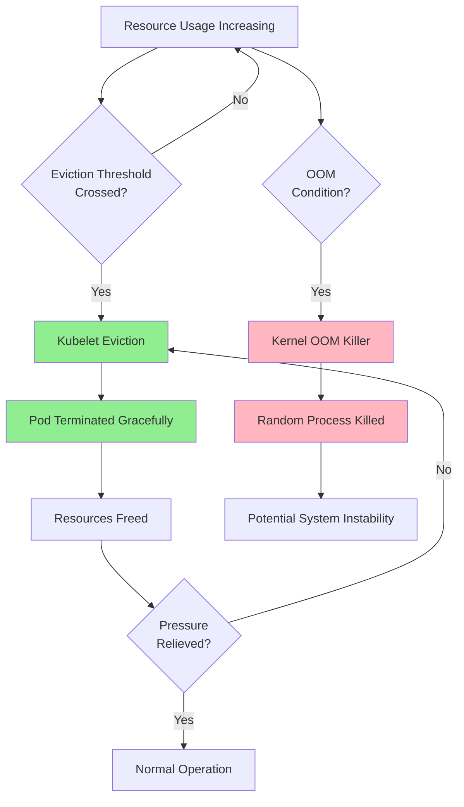

## Eviction Architecture

### Component Overview

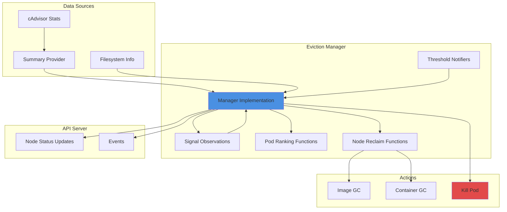

**File**: pkg/kubelet/eviction/eviction_manager.go:66

### Manager Structure

```go
type managerImpl struct {
    // Time tracking
    clock clock.WithTicker

    // Configuration
    config Config

    // Pod termination
    killPodFunc KillPodFunc

    // Garbage collection
    imageGC ImageGC
    containerGC ContainerGC

    // State protection
    sync.RWMutex

    // Node conditions
    nodeConditions []v1.NodeConditionType
    nodeConditionsLastObservedAt nodeConditionsObservedAt

    // Node reference and events
    nodeRef *v1.ObjectReference
    recorder record.EventRecorder

    // Stats collection
    summaryProvider stats.SummaryProvider

    // Threshold tracking
    thresholdsFirstObservedAt thresholdsObservedAt
    thresholdsMet []evictionapi.Threshold

    // Signal processing
    signalToRankFunc map[evictionapi.Signal]rankFunc
    signalToNodeReclaimFuncs map[evictionapi.Signal]nodeReclaimFuncs
    lastObservations signalObservations

    // Filesystem configuration
    dedicatedImageFs *bool
    splitContainerImageFs *bool

    // Memory notifications
    thresholdNotifiers []ThresholdNotifier
    thresholdsLastUpdated time.Time

    // Features
    localStorageCapacityIsolation bool
}
```

**File**: pkg/kubelet/eviction/eviction_manager.go:66

## Eviction Signals

Eviction signals represent the resource metrics that the eviction manager monitors to detect resource pressure.

### Signal Types

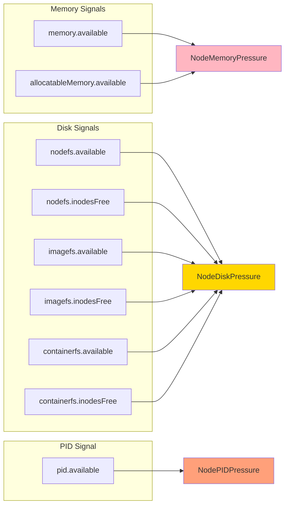

**File**: pkg/kubelet/eviction/api/types.go:28

### Memory Signals

#### memory.available

- **Description**: Available memory on the node (capacity - workingSet)
- **Calculation**: `node.capacity[memory] - node.stats.memory.workingSet`
- **Units**: Bytes
- **Typical Threshold**: 100Mi or 10% (hard), 1.5Gi or 15% (soft)
- **Node Condition**: NodeMemoryPressure

```yaml
# Example: Hard threshold at 100Mi
eviction-hard: memory.available<100Mi

# Example: Soft threshold at 1.5Gi with 90s grace period
eviction-soft: memory.available<1.5Gi
eviction-soft-grace-period: memory.available=90s
```

#### allocatableMemory.available

- **Description**: Available memory for pod allocation (excludes system reserved memory)
- **Calculation**: `node.allocatable[memory] - workingSet(all pods)`
- **Units**: Bytes
- **Purpose**: Protect system daemons and kernel
- **Node Condition**: NodeMemoryPressure

**File**: pkg/kubelet/eviction/api/types.go:29

### Disk Signals

#### nodefs.available

- **Description**: Available storage on the node's root filesystem
- **Usage**: Stores kubelet volumes (emptyDir, ConfigMaps, Secrets), daemon logs, container writable layers
- **Units**: Bytes or percentage
- **Typical Threshold**: 10% (hard), 15% (soft)
- **Node Condition**: NodeDiskPressure

```yaml
eviction-hard: nodefs.available<10%
eviction-soft: nodefs.available<15%
eviction-soft-grace-period: nodefs.available=2m
```

**File**: pkg/kubelet/eviction/api/types.go:32

#### nodefs.inodesFree

- **Description**: Available inodes on the node's root filesystem
- **Purpose**: Prevent "no space left on device" errors due to inode exhaustion
- **Units**: Number of inodes or percentage
- **Typical Threshold**: 5% (hard)

#### imagefs.available

- **Description**: Available storage on the image filesystem (if separate from nodefs)
- **Usage**: Stores container image layers
- **Configuration**: Requires dedicated imagefs partition
- **Units**: Bytes or percentage
- **Node Condition**: NodeDiskPressure

```mermaid
graph TB
    subgraph "Single Filesystem"
        SF[/dev/sda1]
        SF --> |nodefs + imagefs| ROOT1[/]
    end

    subgraph "Dual Filesystem"
        DF1[/dev/sda1]
        DF2[/dev/sdb1]
        DF1 --> |nodefs| ROOT2[/]
        DF2 --> |imagefs| VAR[/var/lib/containerd]
    end

    subgraph "Triple Filesystem"
        TF1[/dev/sda1]
        TF2[/dev/sdb1]
        TF3[/dev/sdc1]
        TF1 --> |nodefs| ROOT3[/]
        TF2 --> |imagefs| IMG[/var/lib/containerd/images]
        TF3 --> |containerfs| CONT[/var/lib/containerd/containers]
    end

    style SF fill:#FFD700
    style DF1 fill:#90EE90
    style DF2 fill:#87CEEB
    style TF1 fill:#90EE90
    style TF2 fill:#87CEEB
    style TF3 fill:#DDA0DD
```

#### imagefs.inodesFree

- **Description**: Available inodes on the image filesystem
- **Purpose**: Track inode usage for image layers

#### containerfs.available / containerfs.inodesFree

- **Description**: Available storage on container writable layer filesystem (if separate)
- **Feature**: Requires `KubeletSeparateDiskGC` feature gate
- **Configuration**: Automatically set to nodefs or imagefs based on runtime configuration

**File**: pkg/kubelet/eviction/api/types.go:43

### PID Signal

#### pid.available

- **Description**: Available process IDs on the node
- **Purpose**: Prevent PID exhaustion (fork bombs)
- **Calculation**: `node.allocatable[pids] - number of running PIDs`
- **Units**: Number of PIDs or percentage
- **Node Condition**: NodePIDPressure

```yaml
eviction-hard: pid.available<1000
```

**File**: pkg/kubelet/eviction/api/types.go:56

### Signal to Resource Mapping

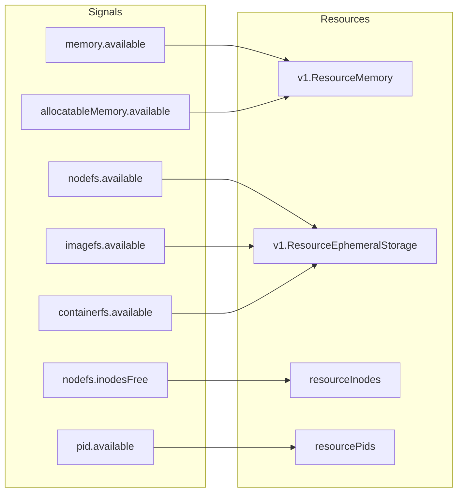

**File**: pkg/kubelet/eviction/helpers.go:98

## Eviction Thresholds

Eviction thresholds define when resource pressure triggers pod eviction.

### Threshold Types

#### Hard Thresholds

- **Grace Period**: None (0s)
- **Behavior**: Immediate eviction when threshold crossed
- **Termination**: Minimal grace period (1 second)
- **Use Case**: Critical resource conditions

```yaml
# Kubelet flags
--eviction-hard=memory.available<100Mi,nodefs.available<10%,imagefs.available<15%
```

**Example Configuration**:
```yaml
apiVersion: kubelet.config.k8s.io/v1beta1
kind: KubeletConfiguration
evictionHard:
  memory.available: "100Mi"
  nodefs.available: "10%"
  nodefs.inodesFree: "5%"
  imagefs.available: "15%"
  pid.available: "1000"
```

#### Soft Thresholds

- **Grace Period**: Required (e.g., 90s, 2m)
- **Behavior**: Eviction only if threshold continuously exceeded for grace period
- **Termination**: Respects pod's `terminationGracePeriodSeconds` (up to max)
- **Use Case**: Early warning, gradual resource pressure

```yaml
# Kubelet flags
--eviction-soft=memory.available<1.5Gi,nodefs.available<15%
--eviction-soft-grace-period=memory.available=90s,nodefs.available=2m
--eviction-max-pod-grace-period=120
```

**Example Configuration**:
```yaml
apiVersion: kubelet.config.k8s.io/v1beta1
kind: KubeletConfiguration
evictionSoft:
  memory.available: "1.5Gi"
  nodefs.available: "15%"
evictionSoftGracePeriod:
  memory.available: "90s"
  nodefs.available: "2m"
evictionMaxPodGracePeriodSeconds: 120
```

**File**: pkg/kubelet/eviction/api/types.go:97

### Threshold Structure

```go
type Threshold struct {
    // Signal defines the entity that was measured
    Signal Signal

    // Operator represents a relationship of a signal to a value
    Operator ThresholdOperator

    // Value is the threshold the resource is evaluated against
    Value ThresholdValue

    // GracePeriod represents the amount of time that a threshold
    // must be met before eviction is triggered
    GracePeriod time.Duration

    // MinReclaim represents the minimum amount of resource to
    // reclaim if the threshold is met
    MinReclaim *ThresholdValue
}

type ThresholdValue struct {
    // Quantity is a quantity associated with the signal
    Quantity *resource.Quantity

    // Percentage represents the usage percentage over the total resource
    Percentage float32
}
```

**File**: pkg/kubelet/eviction/api/types.go:97

### Minimum Reclaim

Minimum reclaim defines the minimum amount of resource that must be freed when a threshold is met. This prevents thrashing (evicting pods only to cross the threshold again immediately).

```yaml
# Reclaim at least 500Mi when memory.available threshold is met
--eviction-minimum-reclaim=memory.available=500Mi

# Reclaim at least 1Gi when nodefs.available threshold is met
--eviction-minimum-reclaim=nodefs.available=1Gi
```

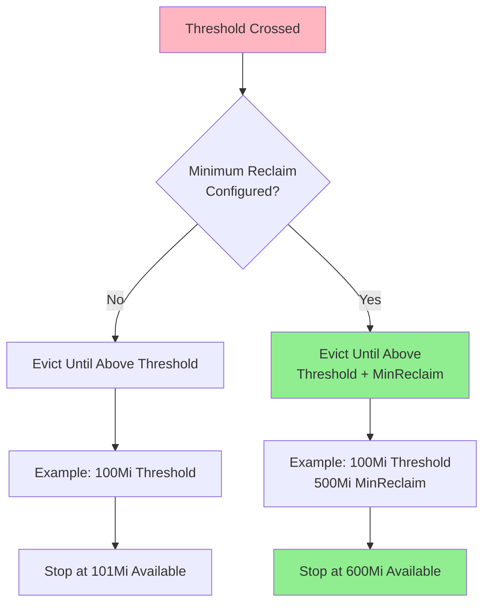

**Example**:
```yaml
apiVersion: kubelet.config.k8s.io/v1beta1
kind: KubeletConfiguration
evictionHard:
  memory.available: "100Mi"
evictionMinimumReclaim:
  memory.available: "500Mi"
```

**Behavior**: When memory.available falls below 100Mi, the eviction manager will continue evicting pods until memory.available reaches 600Mi (100Mi + 500Mi).

**File**: pkg/kubelet/eviction/api/types.go:107

### Threshold Evaluation Flow

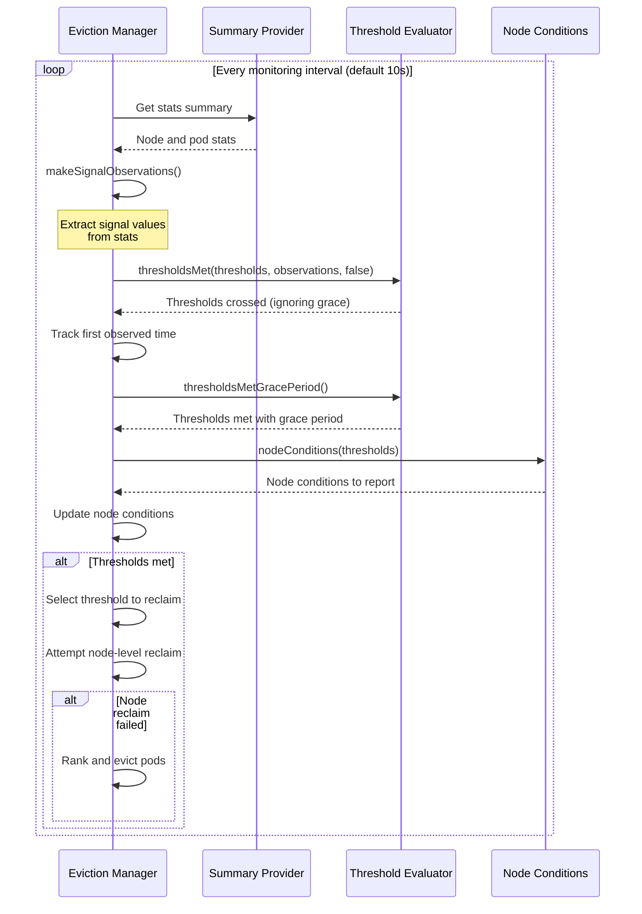

**File**: pkg/kubelet/eviction/eviction_manager.go:243

## Node Pressure Conditions

Node conditions signal resource pressure to the scheduler and other cluster components.

### Condition Types

| Condition | Triggered By | Effect |
|-----------|-------------|--------|
| **NodeMemoryPressure** | memory.available, allocatableMemory.available | No new BestEffort pods scheduled |
| **NodeDiskPressure** | nodefs, imagefs, containerfs (available or inodes) | No new pods scheduled |
| **NodePIDPressure** | pid.available | No new pods scheduled |

**File**: pkg/kubelet/eviction/helpers.go:86

### Condition State Transitions

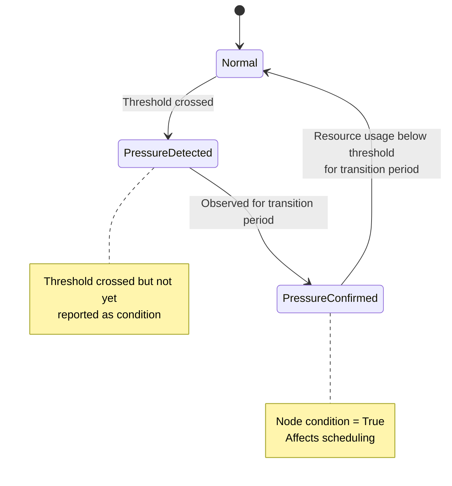

### Pressure Transition Period

The pressure transition period prevents flapping of node conditions.

```yaml
apiVersion: kubelet.config.k8s.io/v1beta1
kind: KubeletConfiguration
evictionPressureTransitionPeriod: 5m  # Default: 5 minutes
```

**Behavior**:
- **Entering Pressure**: Condition becomes True after continuously exceeding threshold for transition period
- **Exiting Pressure**: Condition becomes False after continuously staying below threshold for transition period

```mermaid
graph TB
    subgraph "Without Transition Period"
        T1[Threshold Crossed] --> C1[Condition True]
        C1 --> T2[Threshold OK]
        T2 --> C2[Condition False]
        C2 --> T3[Threshold Crossed]
        T3 --> C3[Condition True]
        T3 -.->|Flapping| T1
    end

    subgraph "With Transition Period (5m)"
        T4[Threshold Crossed] --> W1[Wait 5m]
        W1 --> C4{Still Crossed?}
        C4 -->|Yes| C5[Condition True]
        C4 -->|No| T4
        C5 --> T5[Threshold OK]
        T5 --> W2[Wait 5m]
        W2 --> C6{Still OK?}
        C6 -->|Yes| C7[Condition False]
        C6 -->|No| C5
    end

    style C1 fill:#FFB6C1
    style C3 fill:#FFB6C1
    style C5 fill:#FFB6C1
    style C7 fill:#90EE90
```

**File**: pkg/kubelet/eviction/eviction_manager.go:334

### Node Condition Effects

#### NodeMemoryPressure

**Scheduler Behavior**:
- No new **BestEffort** pods scheduled to the node
- **Burstable** and **Guaranteed** pods can still be scheduled
- Pods with memory pressure **toleration** can be scheduled

```yaml
# Pod tolerating memory pressure
apiVersion: v1
kind: Pod
metadata:
  name: critical-app
spec:
  tolerations:
  - key: node.kubernetes.io/memory-pressure
    operator: Exists
    effect: NoSchedule
  containers:
  - name: app
    image: critical-app:latest
```

**File**: pkg/kubelet/eviction/eviction_manager.go:159

#### NodeDiskPressure

**Scheduler Behavior**:
- **No new pods** scheduled to the node (regardless of QoS)
- Affects all pod priorities

#### NodePIDPressure

**Scheduler Behavior**:
- **No new pods** scheduled to the node
- Prevents PID exhaustion

### Condition Reporting

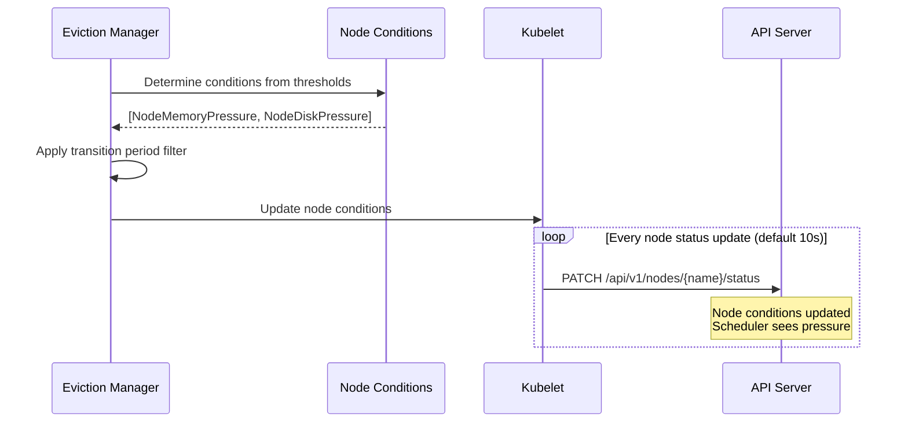

**File**: pkg/kubelet/eviction/eviction_manager.go:344

## Eviction Manager Implementation

### Initialization

```go
func NewManager(
    summaryProvider stats.SummaryProvider,
    config Config,
    killPodFunc KillPodFunc,
    imageGC ImageGC,
    containerGC ContainerGC,
    recorder record.EventRecorder,
    nodeRef *v1.ObjectReference,
    clock clock.WithTicker,
    localStorageCapacityIsolation bool,
) (Manager, lifecycle.PodAdmitHandler) {
    manager := &managerImpl{
        clock:                         clock,
        killPodFunc:                   killPodFunc,
        imageGC:                       imageGC,
        containerGC:                   containerGC,
        config:                        config,
        recorder:                      recorder,
        summaryProvider:               summaryProvider,
        nodeRef:                       nodeRef,
        nodeConditionsLastObservedAt:  nodeConditionsObservedAt{},
        thresholdsFirstObservedAt:     thresholdsObservedAt{},
        dedicatedImageFs:              nil,
        splitContainerImageFs:         nil,
        thresholdNotifiers:            []ThresholdNotifier{},
        localStorageCapacityIsolation: localStorageCapacityIsolation,
    }
    return manager, manager
}
```

**File**: pkg/kubelet/eviction/eviction_manager.go:115

### Start and Main Loop

```go
func (m *managerImpl) Start(
    diskInfoProvider DiskInfoProvider,
    podFunc ActivePodsFunc,
    podCleanedUpFunc PodCleanedUpFunc,
    monitoringInterval time.Duration,
) {
    // Initialize memory threshold notifiers (if enabled)
    thresholdHandler := func(message string) {
        klog.InfoS(message)
        m.synchronize(diskInfoProvider, podFunc)
    }

    if m.config.KernelMemcgNotification {
        for _, threshold := range m.config.Thresholds {
            if threshold.Signal == evictionapi.SignalMemoryAvailable ||
               threshold.Signal == evictionapi.SignalAllocatableMemoryAvailable {
                notifier, err := NewMemoryThresholdNotifier(
                    threshold,
                    m.config.PodCgroupRoot,
                    &CgroupNotifierFactory{},
                    thresholdHandler,
                )
                if err == nil {
                    go notifier.Start()
                    m.thresholdNotifiers = append(m.thresholdNotifiers, notifier)
                }
            }
        }
    }

    // Start the eviction manager monitoring loop
    go func() {
        for {
            evictedPods, err := m.synchronize(diskInfoProvider, podFunc)
            if evictedPods != nil && err == nil {
                // Wait for evicted pods to be cleaned up
                m.waitForPodsCleanup(podCleanedUpFunc, evictedPods)
            } else {
                if err != nil {
                    klog.ErrorS(err, "Eviction manager: failed to synchronize")
                }
                time.Sleep(monitoringInterval)
            }
        }
    }()
}
```

**File**: pkg/kubelet/eviction/eviction_manager.go:184

### Synchronization Flow

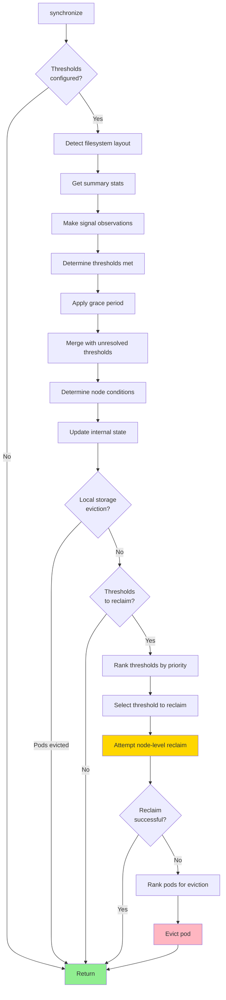

**File**: pkg/kubelet/eviction/eviction_manager.go:243

### Detailed Synchronization Implementation

```go
func (m *managerImpl) synchronize(
    diskInfoProvider DiskInfoProvider,
    podFunc ActivePodsFunc,
) ([]*v1.Pod, error) {
    // Step 1: Check if we have work to do
    thresholds := m.config.Thresholds
    if len(thresholds) == 0 && !m.localStorageCapacityIsolation {
        return nil, nil
    }

    // Step 2: Detect filesystem layout (first run only)
    if m.dedicatedImageFs == nil {
        hasImageFs, err := diskInfoProvider.HasDedicatedImageFs(ctx)
        if err != nil {
            return nil, fmt.Errorf("failed to get HasDedicatedImageFs: %w", err)
        }
        m.dedicatedImageFs = &hasImageFs

        splitContainerImageFs, err := diskInfoProvider.HasDedicatedContainerFs(ctx)
        if err != nil {
            klog.ErrorS(err, "failed to check split container filesystem")
        }
        m.splitContainerImageFs = &splitContainerImageFs

        // Build signal-to-rank and signal-to-reclaim function maps
        m.signalToRankFunc = buildSignalToRankFunc(hasImageFs, splitContainerImageFs)
        m.signalToNodeReclaimFuncs = buildSignalToNodeReclaimFuncs(
            m.imageGC,
            m.containerGC,
            hasImageFs,
            splitContainerImageFs,
        )
    }

    // Step 3: Get current stats
    activePods := podFunc()
    summary, err := m.summaryProvider.Get(ctx, true)
    if err != nil {
        klog.ErrorS(err, "failed to get summary stats")
        return nil, nil
    }

    // Step 4: Update threshold notifiers
    if m.clock.Since(m.thresholdsLastUpdated) > notifierRefreshInterval {
        m.thresholdsLastUpdated = m.clock.Now()
        for _, notifier := range m.thresholdNotifiers {
            notifier.UpdateThreshold(summary)
        }
    }

    // Step 5: Make observations
    observations, statsFunc := makeSignalObservations(summary)

    // Step 6: Determine thresholds met (ignoring grace period)
    thresholds = thresholdsMet(thresholds, observations, false)

    // Step 7: Merge with previously met thresholds not yet resolved
    if len(m.thresholdsMet) > 0 {
        thresholdsNotYetResolved := thresholdsMet(m.thresholdsMet, observations, true)
        thresholds = mergeThresholds(thresholds, thresholdsNotYetResolved)
    }

    // Step 8: Track when thresholds were first observed
    now := m.clock.Now()
    thresholdsFirstObservedAt := thresholdsFirstObservedAt(
        thresholds,
        m.thresholdsFirstObservedAt,
        now,
    )

    // Step 9: Determine node conditions
    nodeConditions := nodeConditions(thresholds)
    nodeConditionsLastObservedAt := nodeConditionsLastObservedAt(
        nodeConditions,
        m.nodeConditionsLastObservedAt,
        now,
    )

    // Step 10: Apply transition period
    nodeConditions = nodeConditionsObservedSince(
        nodeConditionsLastObservedAt,
        m.config.PressureTransitionPeriod,
        now,
    )

    // Step 11: Apply grace periods to thresholds
    thresholds = thresholdsMetGracePeriod(thresholdsFirstObservedAt, now)

    // Step 12: Update internal state
    m.Lock()
    m.nodeConditions = nodeConditions
    m.thresholdsFirstObservedAt = thresholdsFirstObservedAt
    m.nodeConditionsLastObservedAt = nodeConditionsLastObservedAt
    m.thresholdsMet = thresholds

    // Filter to thresholds with updated stats
    thresholds = thresholdsUpdatedStats(thresholds, observations, m.lastObservations)
    m.lastObservations = observations
    m.Unlock()

    // Step 13: Check for local storage eviction
    if m.localStorageCapacityIsolation {
        if evictedPods := m.localStorageEviction(activePods, statsFunc); len(evictedPods) > 0 {
            return evictedPods, nil
        }
    }

    // Step 14: If no thresholds to reclaim, return
    if len(thresholds) == 0 {
        return nil, nil
    }

    // Step 15: Rank thresholds by eviction priority
    sort.Sort(byEvictionPriority(thresholds))
    thresholdToReclaim, resourceToReclaim, foundAny := getReclaimableThreshold(thresholds)
    if !foundAny {
        return nil, nil
    }

    // Step 16: Record event
    m.recorder.Eventf(
        m.nodeRef,
        v1.EventTypeWarning,
        "EvictionThresholdMet",
        "Attempting to reclaim %s",
        resourceToReclaim,
    )

    // Step 17: Attempt node-level reclaim
    if m.reclaimNodeLevelResources(ctx, thresholdToReclaim.Signal, resourceToReclaim) {
        return nil, nil
    }

    // Step 18: Rank pods for eviction
    rank, ok := m.signalToRankFunc[thresholdToReclaim.Signal]
    if !ok {
        return nil, nil
    }

    if len(activePods) == 0 {
        klog.ErrorS(nil, "no pods are active to evict")
        return nil, nil
    }

    rank(activePods, statsFunc)

    // Step 19: Evict the first pod (highest priority for eviction)
    for i := range activePods {
        pod := activePods[i]
        gracePeriodOverride := int64(1)  // Hard eviction
        if !isHardEvictionThreshold(thresholdToReclaim) {
            // Soft eviction: respect pod's grace period up to max
            gracePeriodOverride = m.config.MaxPodGracePeriodSeconds
            if pod.Spec.TerminationGracePeriodSeconds != nil {
                gracePeriodOverride = min(
                    m.config.MaxPodGracePeriodSeconds,
                    *pod.Spec.TerminationGracePeriodSeconds,
                )
            }
        }

        message, annotations := evictionMessage(resourceToReclaim, pod, statsFunc, thresholds, observations)
        condition := &v1.PodCondition{
            Type:               v1.DisruptionTarget,
            ObservedGeneration: pod.Generation,
            Status:             v1.ConditionTrue,
            Reason:             v1.PodReasonTerminationByKubelet,
            Message:            message,
        }

        if m.evictPod(pod, gracePeriodOverride, message, annotations, condition) {
            metrics.Evictions.WithLabelValues(string(thresholdToReclaim.Signal)).Inc()
            return []*v1.Pod{pod}, nil
        }
    }

    return nil, nil
}
```

**File**: pkg/kubelet/eviction/eviction_manager.go:243

## Pod Selection and Ranking

When node-level resource reclamation is insufficient, the eviction manager must select and rank pods for eviction.

### Ranking Criteria

Pods are ranked for eviction based on:

1. **QoS Class**: BestEffort > Burstable > Guaranteed
2. **Resource Usage vs. Request**: Pods exceeding requests are evicted first
3. **Priority Class**: Lower priority pods evicted first
4. **Resource Consumption**: Within same QoS and priority, higher consumers evicted first

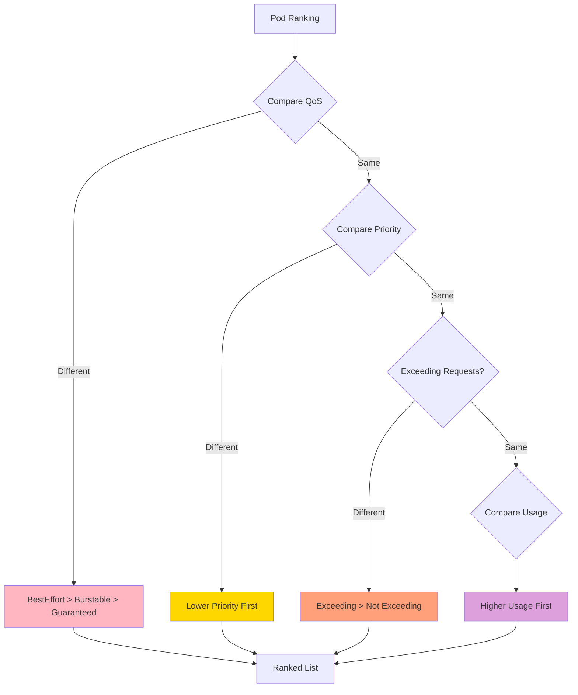

### Memory Eviction Ranking

```go
// rankMemoryPressure orders pods by priority, then QoS, then memory consumption
func rankMemoryPressure(pods []*v1.Pod, stats statsFunc) {
    orderedBy(
        priority,                    // 1. Priority (lower first)
        exceedMemoryRequests(stats), // 2. Exceeding memory requests
        memory(stats),               // 3. Memory consumption
    ).Sort(pods)
}
```

**Detailed Ordering**:

1. **BestEffort pods** using the most memory
2. **Burstable pods** exceeding memory requests, sorted by memory consumed beyond requests
3. **Burstable pods** not exceeding requests, sorted by total memory usage
4. **Guaranteed pods** (evicted only in extreme cases)

### Disk Eviction Ranking

```go
// rankDiskPressureFunc orders pods by priority, then QoS, then disk consumption
func rankDiskPressureFunc(fsStatsToMeasure []fsStatsType, diskResource v1.ResourceName) rankFunc {
    return func(pods []*v1.Pod, stats statsFunc) {
        orderedBy(
            priority,                                     // 1. Priority
            exceedDiskRequests(stats, fsStatsToMeasure, diskResource), // 2. Exceeding disk requests
            disk(stats, fsStatsToMeasure),               // 3. Disk consumption
        ).Sort(pods)
    }
}
```

**Filesystem Measurement**:
- **nodefs**: Logs + writable layers + local volumes
- **imagefs**: Image layers (if separate filesystem)

### PID Eviction Ranking

```go
// rankPIDPressure orders pods by priority, then QoS, then process count
func rankPIDPressure(pods []*v1.Pod, stats statsFunc) {
    orderedBy(
        priority,    // 1. Priority
        qos,         // 2. QoS (BestEffort > Burstable > Guaranteed)
        process,     // 3. Process count
    ).Sort(pods)
}
```

### Example: Memory Pressure Ranking

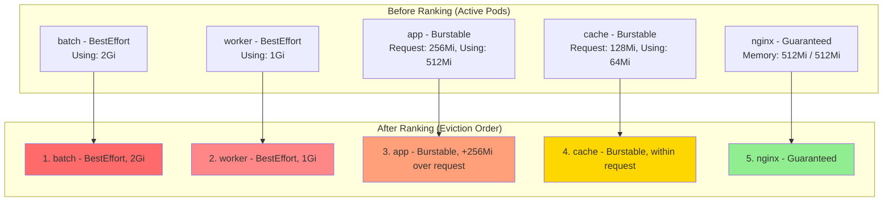

### Critical Pod Protection

Critical pods are **never evicted** by the eviction manager:

```go
func (m *managerImpl) evictPod(pod *v1.Pod, gracePeriodOverride int64, evictMsg string, annotations map[string]string, condition *v1.PodCondition) bool {
    // Critical pods cannot be evicted
    if kubelettypes.IsCriticalPod(pod) {
        klog.ErrorS(nil, "cannot evict a critical pod", "pod", klog.KObj(pod))
        return false
    }
    // ... proceed with eviction
}
```

**Critical Pod Criteria**:
- Has `priorityClassName: system-node-critical` or `system-cluster-critical`
- Or has annotation `scheduler.alpha.kubernetes.io/critical-pod: ""`

**File**: pkg/kubelet/eviction/eviction_manager.go:609

## Node-Level Resource Reclamation

Before evicting pods, the eviction manager attempts to reclaim node-level resources through garbage collection.

### Reclaim Functions

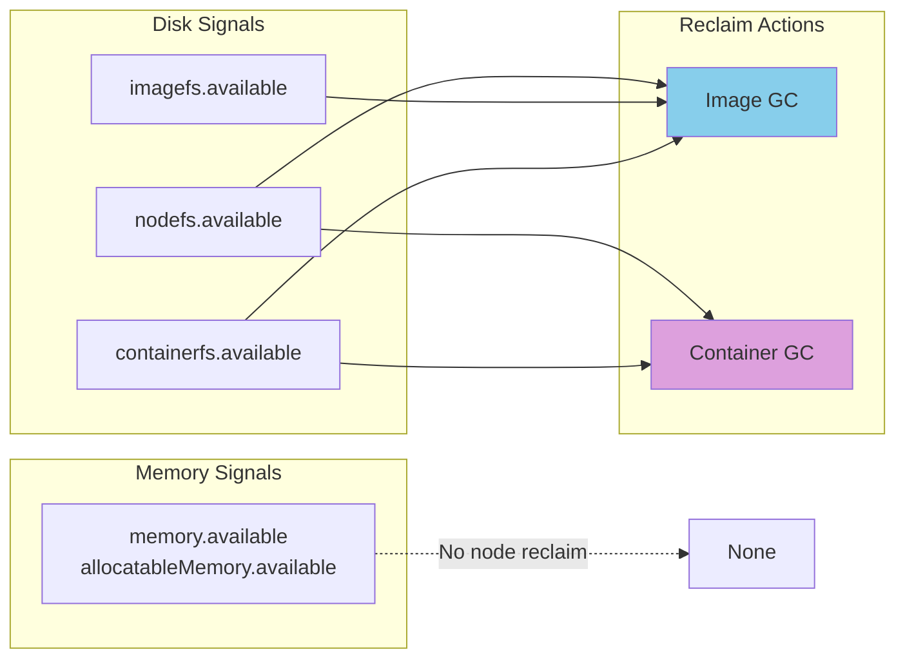

### Image Garbage Collection

**Trigger**: imagefs.available or containerfs.available thresholds

**Process**:
1. List all images on the node
2. Sort images by last used time (least recently used first)
3. Delete images until threshold is satisfied or minimum reclaim achieved

```go
type ImageGC interface {
    DeleteUnusedImages(ctx context.Context) error
}
```

**Configuration**:
```yaml
apiVersion: kubelet.config.k8s.io/v1beta1
kind: KubeletConfiguration
imageGCHighThresholdPercent: 85  # Start GC when disk usage > 85%
imageGCLowThresholdPercent: 80   # Stop GC when disk usage < 80%
```

**File**: pkg/kubelet/eviction/types.go:83

### Container Garbage Collection

**Trigger**: nodefs.available or containerfs.available thresholds

**Process**:
1. Delete containers from terminated pods
2. Delete old container writable layers
3. Free up disk space

```go
type ContainerGC interface {
    DeleteAllUnusedContainers(ctx context.Context) error
}
```

**File**: pkg/kubelet/eviction/types.go:89

### Reclaim Workflow

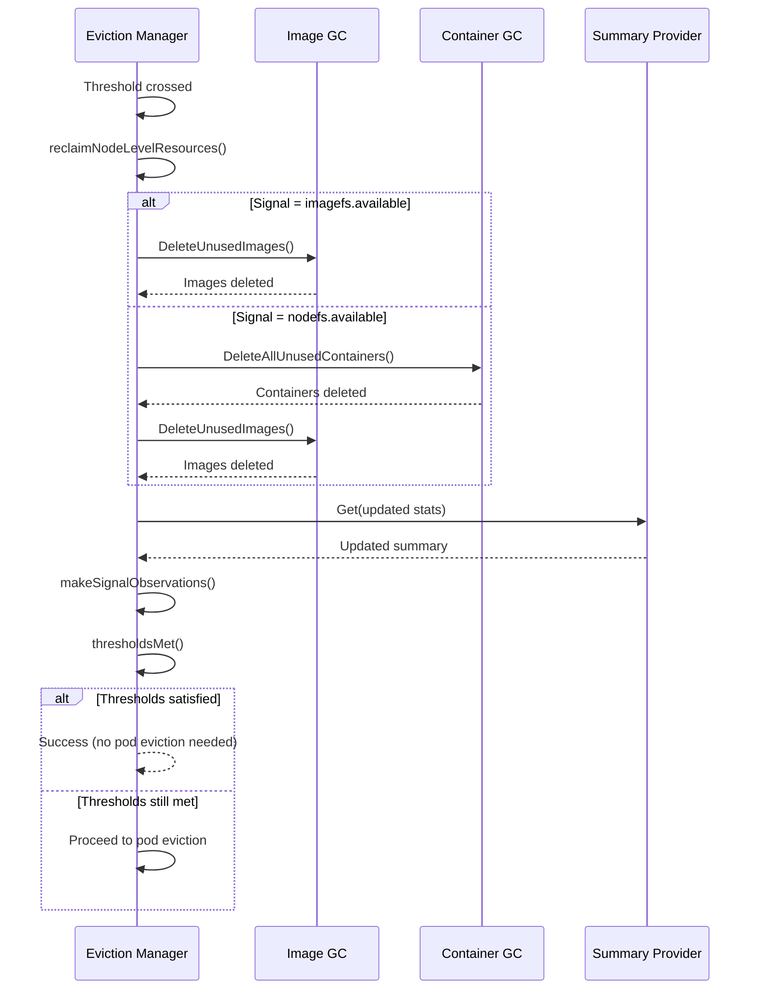

**File**: pkg/kubelet/eviction/eviction_manager.go:468

### Reclaim Example

**Scenario**: nodefs.available falls below 10% (1Gi available, 10Gi capacity)

**Reclaim Actions**:
1. **Container GC**: Delete stopped containers → Free 500Mi
2. **Image GC**: Delete unused images → Free 1.5Gi
3. **Check**: nodefs.available = 3Gi (30%) → Threshold satisfied!
4. **Result**: No pod eviction needed

## Local Storage Eviction

Local storage eviction handles pod-level ephemeral storage limits (emptyDir, container writable layers).

### Local Storage Types

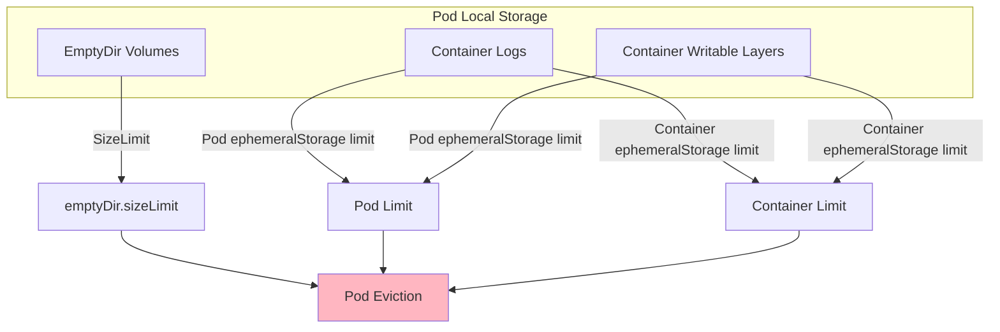

### EmptyDir Size Limit

```yaml
apiVersion: v1
kind: Pod
metadata:
  name: my-pod
spec:
  containers:
  - name: app
    image: nginx
    volumeMounts:
    - name: cache
      mountPath: /cache
  volumes:
  - name: cache
    emptyDir:
      sizeLimit: 1Gi  # Evict pod if cache exceeds 1Gi
```

**Eviction Logic**:
```go
func (m *managerImpl) emptyDirLimitEviction(podStats statsapi.PodStats, pod *v1.Pod) bool {
    for i := range pod.Spec.Volumes {
        source := &pod.Spec.Volumes[i].VolumeSource
        if source.EmptyDir != nil {
            size := source.EmptyDir.SizeLimit
            used := podVolumeUsed[pod.Spec.Volumes[i].Name]
            if used != nil && size != nil && size.Sign() == 1 && used.Cmp(*size) > 0 {
                // EmptyDir usage exceeds size limit, evict the pod
                m.evictPod(pod, 1, fmt.Sprintf(
                    "Usage of EmptyDir volume %q exceeds the limit %q",
                    pod.Spec.Volumes[i].Name,
                    size.String(),
                ), nil, nil)
                return true
            }
        }
    }
    return false
}
```

**File**: pkg/kubelet/eviction/eviction_manager.go:528

### Pod Ephemeral Storage Limit

```yaml
apiVersion: v1
kind: Pod
metadata:
  name: my-pod
spec:
  containers:
  - name: app
    image: nginx
    resources:
      limits:
        ephemeral-storage: 2Gi  # Combined limit for all containers
```

**Calculation**:
```
Pod ephemeral storage usage =
    Sum(container writable layers) +
    Sum(container logs) +
    Sum(emptyDir volumes)
```

**Eviction Logic**:
```go
func (m *managerImpl) podEphemeralStorageLimitEviction(podStats statsapi.PodStats, pod *v1.Pod) bool {
    podLimits := resourcehelper.PodLimits(pod, resourcehelper.PodResourcesOptions{})
    podEphemeralStorageLimit, found := podLimits[v1.ResourceEphemeralStorage]
    if !found {
        return false
    }

    podEphemeralStorageTotalUsage := &resource.Quantity{}
    if podStats.EphemeralStorage != nil && podStats.EphemeralStorage.UsedBytes != nil {
        podEphemeralStorageTotalUsage = resource.NewQuantity(
            int64(*podStats.EphemeralStorage.UsedBytes),
            resource.BinarySI,
        )
    }

    if podEphemeralStorageTotalUsage.Cmp(podEphemeralStorageLimit) > 0 {
        // Pod ephemeral storage usage exceeds limit
        m.evictPod(pod, 1, fmt.Sprintf(
            "Pod ephemeral local storage usage exceeds the total limit of containers %s",
            podEphemeralStorageLimit.String(),
        ), nil, nil)
        return true
    }
    return false
}
```

**File**: pkg/kubelet/eviction/eviction_manager.go:552

### Container Ephemeral Storage Limit

```yaml
apiVersion: v1
kind: Pod
metadata:
  name: my-pod
spec:
  containers:
  - name: app
    image: nginx
    resources:
      limits:
        ephemeral-storage: 1Gi  # Limit for this container only
  - name: sidecar
    image: busybox
    resources:
      limits:
        ephemeral-storage: 500Mi  # Separate limit for sidecar
```

**Calculation** (per container):
```
Container ephemeral storage usage =
    container writable layer +
    container logs
    (if dedicated imagefs: excludes image layers)
```

**Eviction Logic**:
```go
func (m *managerImpl) containerEphemeralStorageLimitEviction(podStats statsapi.PodStats, pod *v1.Pod) bool {
    thresholdsMap := make(map[string]*resource.Quantity)
    for _, container := range pod.Spec.Containers {
        ephemeralLimit := container.Resources.Limits.StorageEphemeral()
        if ephemeralLimit != nil && ephemeralLimit.Value() != 0 {
            thresholdsMap[container.Name] = ephemeralLimit
        }
    }

    for _, containerStat := range podStats.Containers {
        containerUsed := diskUsage(containerStat.Logs)
        if !*m.dedicatedImageFs {
            containerUsed.Add(*diskUsage(containerStat.Rootfs))
        }

        if ephemeralStorageThreshold, ok := thresholdsMap[containerStat.Name]; ok {
            if ephemeralStorageThreshold.Cmp(*containerUsed) < 0 {
                // Container exceeded ephemeral storage limit
                m.evictPod(pod, 1, fmt.Sprintf(
                    "Container %s exceeded its local ephemeral storage limit %q",
                    containerStat.Name,
                    ephemeralStorageThreshold.String(),
                ), nil, nil)
                return true
            }
        }
    }
    return false
}
```

**File**: pkg/kubelet/eviction/eviction_manager.go:577

## Eviction Process Flow

### Complete Eviction Workflow

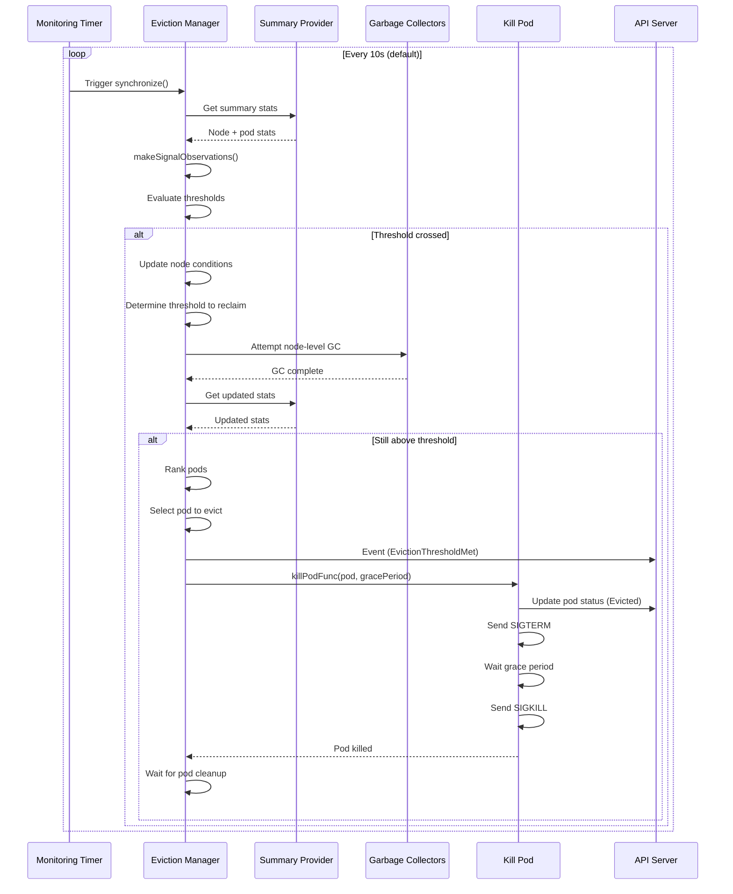

### Pod Eviction Details

```go
func (m *managerImpl) evictPod(
    pod *v1.Pod,
    gracePeriodOverride int64,
    evictMsg string,
    annotations map[string]string,
    condition *v1.PodCondition,
) bool {
    // Critical pods cannot be evicted
    if kubelettypes.IsCriticalPod(pod) {
        klog.ErrorS(nil, "cannot evict a critical pod", "pod", klog.KObj(pod))
        return false
    }

    // Record eviction event
    m.recorder.AnnotatedEventf(pod, annotations, v1.EventTypeWarning, Reason, evictMsg)

    // Kill pod (blocking call)
    klog.V(3).InfoS("Evicting pod", "pod", klog.KObj(pod), "message", evictMsg)
    err := m.killPodFunc(pod, true, &gracePeriodOverride, func(status *v1.PodStatus) {
        status.Phase = v1.PodFailed
        status.Reason = Reason
        status.Message = evictMsg
        if condition != nil {
            podutil.UpdatePodCondition(status, condition)
        }
    })

    if err != nil {
        klog.ErrorS(err, "pod failed to evict", "pod", klog.KObj(pod))
        return false
    }

    klog.InfoS("pod is evicted successfully", "pod", klog.KObj(pod))
    return true
}
```

**File**: pkg/kubelet/eviction/eviction_manager.go:605

### Pod Status After Eviction

```yaml
apiVersion: v1
kind: Pod
metadata:
  name: evicted-pod
status:
  phase: Failed
  reason: Evicted
  message: "The node was low on resource: memory. Container app was using 2Gi, request is 512Mi, has larger consumption of memory."
  conditions:
  - type: DisruptionTarget
    status: "True"
    reason: TerminationByKubelet
    message: "The node was low on resource: memory."
```

### Pod Cleanup Wait

After eviction, the eviction manager waits for the pod to be fully cleaned up before continuing:

```go
func (m *managerImpl) waitForPodsCleanup(podCleanedUpFunc PodCleanedUpFunc, pods []*v1.Pod) {
    timeout := m.clock.NewTimer(30 * time.Second)
    ticker := m.clock.NewTicker(1 * time.Second)

    for {
        select {
        case <-timeout.C():
            klog.InfoS("timed out waiting for pods to be cleaned up", "pods", pods)
            return
        case <-ticker.C():
            allCleanedUp := true
            for _, pod := range pods {
                if !podCleanedUpFunc(pod) {
                    allCleanedUp = false
                    break
                }
            }
            if allCleanedUp {
                klog.InfoS("pods successfully cleaned up", "pods", pods)
                return
            }
        }
    }
}
```

**File**: pkg/kubelet/eviction/eviction_manager.go:443

## Pod Admission During Resource Pressure

The eviction manager also acts as a pod admission handler, rejecting new pod admissions when the node is under resource pressure.

### Admission Logic

```go
func (m *managerImpl) Admit(attrs *lifecycle.PodAdmitAttributes) lifecycle.PodAdmitResult {
    m.RLock()
    defer m.RUnlock()

    // No node conditions = no pressure
    if len(m.nodeConditions) == 0 {
        return lifecycle.PodAdmitResult{Admit: true}
    }

    // Always admit critical pods
    if kubelettypes.IsCriticalPod(attrs.Pod) {
        return lifecycle.PodAdmitResult{Admit: true}
    }

    // Special handling for memory pressure only
    nodeOnlyHasMemoryPressureCondition :=
        hasNodeCondition(m.nodeConditions, v1.NodeMemoryPressure) &&
        len(m.nodeConditions) == 1

    if nodeOnlyHasMemoryPressureCondition {
        // Admit non-BestEffort pods during memory pressure
        notBestEffort := v1.PodQOSBestEffort != v1qos.GetPodQOS(attrs.Pod)
        if notBestEffort {
            return lifecycle.PodAdmitResult{Admit: true}
        }

        // Admit BestEffort pods that tolerate memory pressure
        if corev1helpers.TolerationsTolerateTaint(attrs.Pod.Spec.Tolerations, &v1.Taint{
            Key:    v1.TaintNodeMemoryPressure,
            Effect: v1.TaintEffectNoSchedule,
        }) {
            return lifecycle.PodAdmitResult{Admit: true}
        }
    }

    // Reject pod admission
    return lifecycle.PodAdmitResult{
        Admit:   false,
        Reason:  "Evicted",
        Message: fmt.Sprintf("The node had condition: %v", m.nodeConditions),
    }
}
```

**File**: pkg/kubelet/eviction/eviction_manager.go:146

### Admission Decision Matrix

| Node Condition | Pod QoS | Pod Has Toleration | Admitted? |
|----------------|---------|-------------------|-----------|
| None | Any | N/A | ✅ Yes |
| MemoryPressure | Guaranteed | N/A | ✅ Yes |
| MemoryPressure | Burstable | N/A | ✅ Yes |
| MemoryPressure | BestEffort | Yes | ✅ Yes |
| MemoryPressure | BestEffort | No | ❌ No |
| DiskPressure | Any | Any | ❌ No |
| PIDPressure | Any | Any | ❌ No |
| Multiple | Critical | N/A | ✅ Yes |

## Memory Threshold Notification

For memory thresholds, kubelet can optionally use kernel cgroup memory pressure notifications for faster response.

### Kernel Memcg Notification

**Configuration**:
```yaml
apiVersion: kubelet.config.k8s.io/v1beta1
kind: KubeletConfiguration
kernelMemcgNotification: true  # Enable cgroup memory notifications
```

**How It Works**:
1. Kubelet registers memory threshold with kernel cgroup
2. Kernel monitors memory usage in cgroup
3. When threshold crossed, kernel sends notification via eventfd
4. Kubelet immediately triggers synchronize() (no waiting for polling interval)

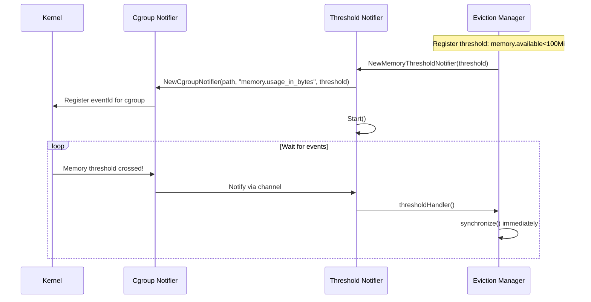

**Benefits**:
- **Faster response**: No waiting for polling interval (10s default)
- **Lower latency**: Eviction triggered within milliseconds
- **Reduced overhead**: Kernel does the monitoring

**Limitations**:
- Linux-only feature
- Requires cgroup v1 or v2 support
- Only works for memory signals

**File**: pkg/kubelet/eviction/eviction_manager.go:190

## Graceful Node Shutdown

When the kubelet receives a shutdown signal (SIGTERM), it initiates graceful node shutdown with eviction awareness.

### Shutdown Phases

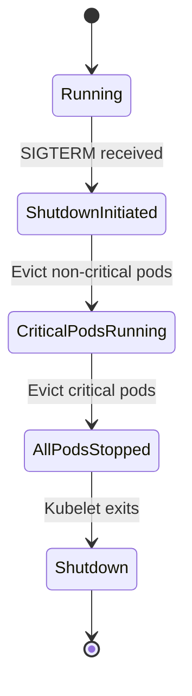

### Graceful Shutdown Configuration

```yaml
apiVersion: kubelet.config.k8s.io/v1beta1
kind: KubeletConfiguration
shutdownGracePeriod: 30s               # Total time for shutdown
shutdownGracePeriodCriticalPods: 10s   # Time reserved for critical pods
```

**Shutdown Timeline**:
```
T+0s:  Shutdown initiated
T+0s:  Start evicting non-critical pods (grace period: 20s)
T+20s: All non-critical pods terminated
T+20s: Start evicting critical pods (grace period: 10s)
T+30s: All pods terminated, kubelet exits
```

### Shutdown Priority

1. **Non-Critical Pods**: Evicted first with `shutdownGracePeriod - shutdownGracePeriodCriticalPods`
2. **Critical Pods**: Evicted last with `shutdownGracePeriodCriticalPods`

**File**: Related to graceful shutdown, but implementation is in pkg/kubelet/nodeshutdown/

## Configuration and Tuning

### Complete Configuration Example

```yaml
apiVersion: kubelet.config.k8s.io/v1beta1
kind: KubeletConfiguration

# Hard eviction thresholds (no grace period)
evictionHard:
  memory.available: "100Mi"
  nodefs.available: "10%"
  nodefs.inodesFree: "5%"
  imagefs.available: "15%"
  pid.available: "1000"

# Soft eviction thresholds (with grace periods)
evictionSoft:
  memory.available: "1.5Gi"
  nodefs.available: "15%"
  imagefs.available: "20%"

evictionSoftGracePeriod:
  memory.available: "90s"
  nodefs.available: "2m"
  imagefs.available: "2m"

# Maximum grace period for soft evictions
evictionMaxPodGracePeriodSeconds: 120

# Minimum amount to reclaim when threshold met
evictionMinimumReclaim:
  memory.available: "500Mi"
  nodefs.available: "1Gi"
  imagefs.available: "2Gi"

# Transition period before reporting node conditions
evictionPressureTransitionPeriod: 5m

# Image garbage collection
imageGCHighThresholdPercent: 85
imageGCLowThresholdPercent: 80

# Enable kernel memory notifications
kernelMemcgNotification: true

# Graceful shutdown
shutdownGracePeriod: 30s
shutdownGracePeriodCriticalPods: 10s
```

### Recommended Thresholds by Node Size

#### Small Nodes (2 CPU, 4Gi RAM)

```yaml
evictionHard:
  memory.available: "200Mi"
  nodefs.available: "10%"
evictionSoft:
  memory.available: "500Mi"
  nodefs.available: "15%"
evictionSoftGracePeriod:
  memory.available: "90s"
  nodefs.available: "2m"
evictionMinimumReclaim:
  memory.available: "200Mi"
  nodefs.available: "500Mi"
```

#### Medium Nodes (8 CPU, 16Gi RAM)

```yaml
evictionHard:
  memory.available: "500Mi"
  nodefs.available: "10%"
evictionSoft:
  memory.available: "1.5Gi"
  nodefs.available: "15%"
evictionSoftGracePeriod:
  memory.available: "90s"
  nodefs.available: "2m"
evictionMinimumReclaim:
  memory.available: "1Gi"
  nodefs.available: "1Gi"
```

#### Large Nodes (32 CPU, 64Gi RAM)

```yaml
evictionHard:
  memory.available: "1Gi"
  nodefs.available: "10%"
evictionSoft:
  memory.available: "4Gi"
  nodefs.available: "15%"
evictionSoftGracePeriod:
  memory.available: "2m"
  nodefs.available: "2m"
evictionMinimumReclaim:
  memory.available: "2Gi"
  nodefs.available: "2Gi"
```

## Troubleshooting

### Common Issues

#### Issue 1: Pods Evicted Too Aggressively

**Symptoms**:
- Pods frequently evicted
- Node conditions flapping
- Workloads unstable

**Diagnosis**:
```bash
# Check node conditions
kubectl describe node <node-name>

# View eviction events
kubectl get events --field-selector involvedObject.kind=Pod,reason=Evicted

# Check kubelet logs
journalctl -u kubelet | grep -i eviction
```

**Solutions**:
- Lower eviction thresholds (more conservative)
- Increase `evictionMinimumReclaim` to reduce eviction frequency
- Add resource requests to pods
- Increase node resources

#### Issue 2: Memory Pressure Constant

**Symptoms**:
- NodeMemoryPressure condition always true
- BestEffort pods cannot be scheduled

**Diagnosis**:
```bash
# Check memory usage
kubectl top node <node-name>

# Check pod memory consumption
kubectl top pods --all-namespaces --sort-by=memory

# Check eviction thresholds
ps aux | grep kubelet | grep eviction
```

**Solutions**:
```yaml
# Increase system reserved memory
systemReserved:
  memory: "1Gi"

# Increase kubelet reserved memory
kubeReserved:
  memory: "500Mi"

# Adjust memory thresholds
evictionHard:
  memory.available: "500Mi"  # Increased from 100Mi
```

#### Issue 3: Disk Pressure Due to Logs

**Symptoms**:
- NodeDiskPressure condition
- Pods evicted for nodefs.available

**Diagnosis**:
```bash
# Check disk usage
df -h /var/lib/kubelet

# Find large directories
du -h /var/lib/kubelet | sort -rh | head -20

# Check log sizes
du -sh /var/log/pods/*
```

**Solutions**:
```yaml
# Configure log rotation
containerLogMaxSize: "10Mi"
containerLogMaxFiles: 5

# Adjust disk thresholds
evictionHard:
  nodefs.available: "5%"  # Lowered from 10%
```

#### Issue 4: Image Filesystem Full

**Symptoms**:
- imagefs.available threshold crossed
- Image pulls failing

**Diagnosis**:
```bash
# Check imagefs usage (containerd)
df -h /var/lib/containerd

# List images
crictl images

# Check image sizes
crictl images | awk '{sum+=$6} END {print "Total: " sum/1024/1024 " GB"}'
```

**Solutions**:
```yaml
# Aggressive image GC
imageGCHighThresholdPercent: 80
imageGCLowThresholdPercent: 70

# Lower imagefs threshold
evictionHard:
  imagefs.available: "10%"
```

### Debugging Commands

```bash
# View current node conditions
kubectl get nodes -o jsonpath='{.items[*].status.conditions[?(@.type=="MemoryPressure")]}' | jq

# Check eviction history
kubectl get events --all-namespaces --field-selector reason=Evicted --sort-by='.lastTimestamp'

# View pod eviction details
kubectl describe pod <evicted-pod-name>

# Check kubelet eviction metrics
curl http://localhost:10255/metrics | grep eviction

# View node allocatable vs capacity
kubectl describe node <node-name> | grep -A 10 Allocatable
```

### Eviction Metrics

```prometheus
# Total evictions by signal
kubelet_evictions_total{signal="memory.available"}

# Eviction stats age (time between measurement and eviction)
kubelet_eviction_stats_age_seconds{signal="memory.available"}

# Node condition status
kubelet_node_condition{condition="MemoryPressure",status="true"}
```

## Best Practices

### 1. Set Appropriate Thresholds

- **Hard thresholds**: Reserve enough for system stability (kernel, system daemons)
- **Soft thresholds**: Provide early warning before hard thresholds
- **Minimum reclaim**: Set to 2-5x the threshold to prevent thrashing

### 2. Configure Resource Requests

```yaml
apiVersion: v1
kind: Pod
metadata:
  name: my-app
spec:
  containers:
  - name: app
    image: nginx
    resources:
      requests:
        memory: "512Mi"
        cpu: "500m"
        ephemeral-storage: "1Gi"
      limits:
        memory: "1Gi"
        ephemeral-storage: "2Gi"
```

### 3. Use QoS Classes Effectively

- **Guaranteed**: Critical applications, databases
- **Burstable**: General applications with variable load
- **BestEffort**: Batch jobs, non-critical workloads

### 4. Monitor Node Resources

```yaml
# Deploy node-exporter for detailed metrics
apiVersion: apps/v1
kind: DaemonSet
metadata:
  name: node-exporter
spec:
  template:
    spec:
      containers:
      - name: node-exporter
        image: prom/node-exporter:latest
```

### 5. Configure System Reserved Resources

```yaml
apiVersion: kubelet.config.k8s.io/v1beta1
kind: KubeletConfiguration
systemReserved:
  cpu: "200m"
  memory: "512Mi"
  ephemeral-storage: "1Gi"
kubeReserved:
  cpu: "100m"
  memory: "256Mi"
  ephemeral-storage: "500Mi"
enforceNodeAllocatable:
- pods
- system-reserved
- kube-reserved
```

### 6. Use Separate Filesystems

For production:
- **nodefs**: OS, kubelet data, logs, emptyDir
- **imagefs**: Container images
- **containerfs** (optional): Container writable layers

### 7. Implement Pod Disruption Budgets

```yaml
apiVersion: policy/v1
kind: PodDisruptionBudget
metadata:
  name: my-app-pdb
spec:
  minAvailable: 2
  selector:
    matchLabels:
      app: my-app
```

**Note**: PDBs do **not** prevent evictions due to resource pressure, but they help during voluntary disruptions.

### 8. Enable Graceful Shutdown

```yaml
apiVersion: kubelet.config.k8s.io/v1beta1
kind: KubeletConfiguration
shutdownGracePeriod: 30s
shutdownGracePeriodCriticalPods: 10s
```

### 9. Test Eviction Behavior

```bash
# Stress test memory
kubectl run stress --image=polinux/stress --restart=Never -- stress --vm 1 --vm-bytes 2G --vm-hang 0

# Monitor evictions
watch kubectl get events --field-selector reason=Evicted

# Check node conditions
watch kubectl get nodes -o custom-columns=NAME:.metadata.name,MEMORY:.status.conditions[3].status,DISK:.status.conditions[1].status
```

### 10. Log Analysis

```bash
# Monitor eviction manager logs
journalctl -u kubelet -f | grep "Eviction manager"

# Track specific pod eviction
journalctl -u kubelet | grep "Evicting pod" | grep <pod-name>
```

## Related Documentation

- [Pod Sync Loop](01-pod-sync-loop.md) - How eviction triggers pod sync
- [PLEG](02-pleg.md) - Pod Lifecycle Event Generator integration
- [Resource Management](08-resource-management.md) - QoS and cgroup enforcement
- [Garbage Collection](13-garbage-collection.md) - Node-level resource reclamation
- [Node Lifecycle](14-node-lifecycle.md) - Node conditions and status reporting
- [Pod Admission](03-pod-admission.md) - Admission during resource pressure
- [Status Manager](12-status-manager.md) - Pod status updates after eviction

---

**File References**:
- pkg/kubelet/eviction/eviction_manager.go:66 - Main eviction manager implementation
- pkg/kubelet/eviction/types.go:46 - Eviction configuration and interfaces
- pkg/kubelet/eviction/api/types.go:26 - Eviction signals and thresholds
- pkg/kubelet/eviction/helpers.go:84 - Helper functions for ranking and selection
- pkg/kubelet/eviction/memory_threshold_notifier.go - Kernel memory notifications

**Last Updated**: 2025-10-21
**Kubernetes Version**: v1.32+
