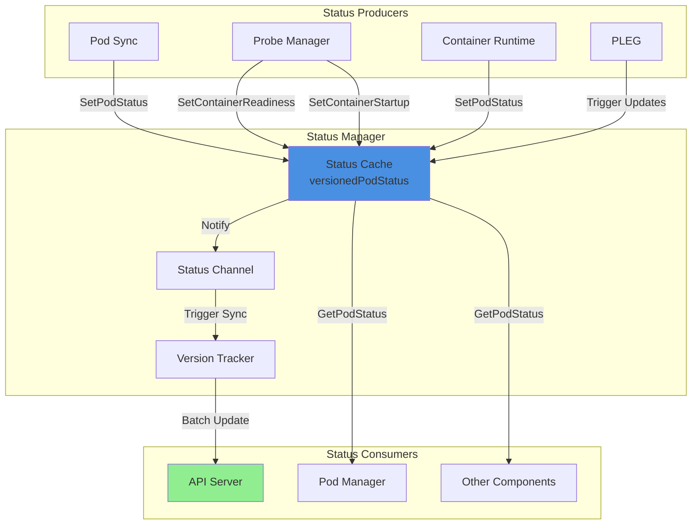
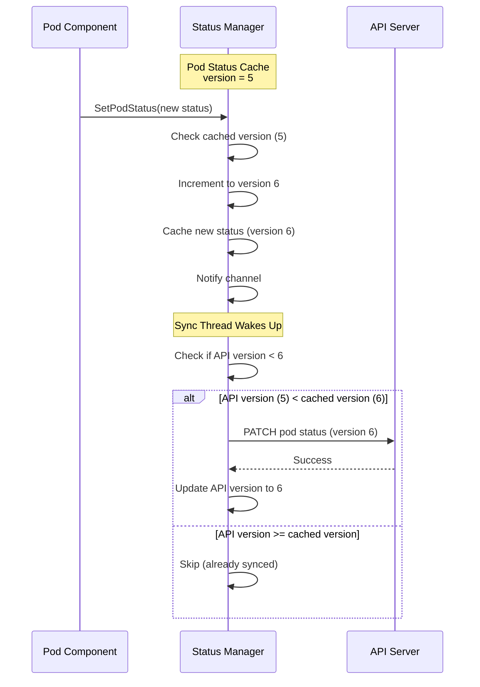
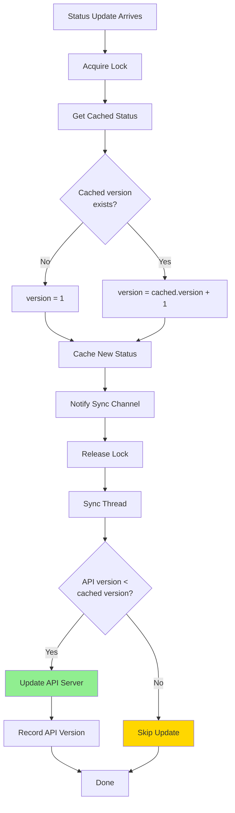
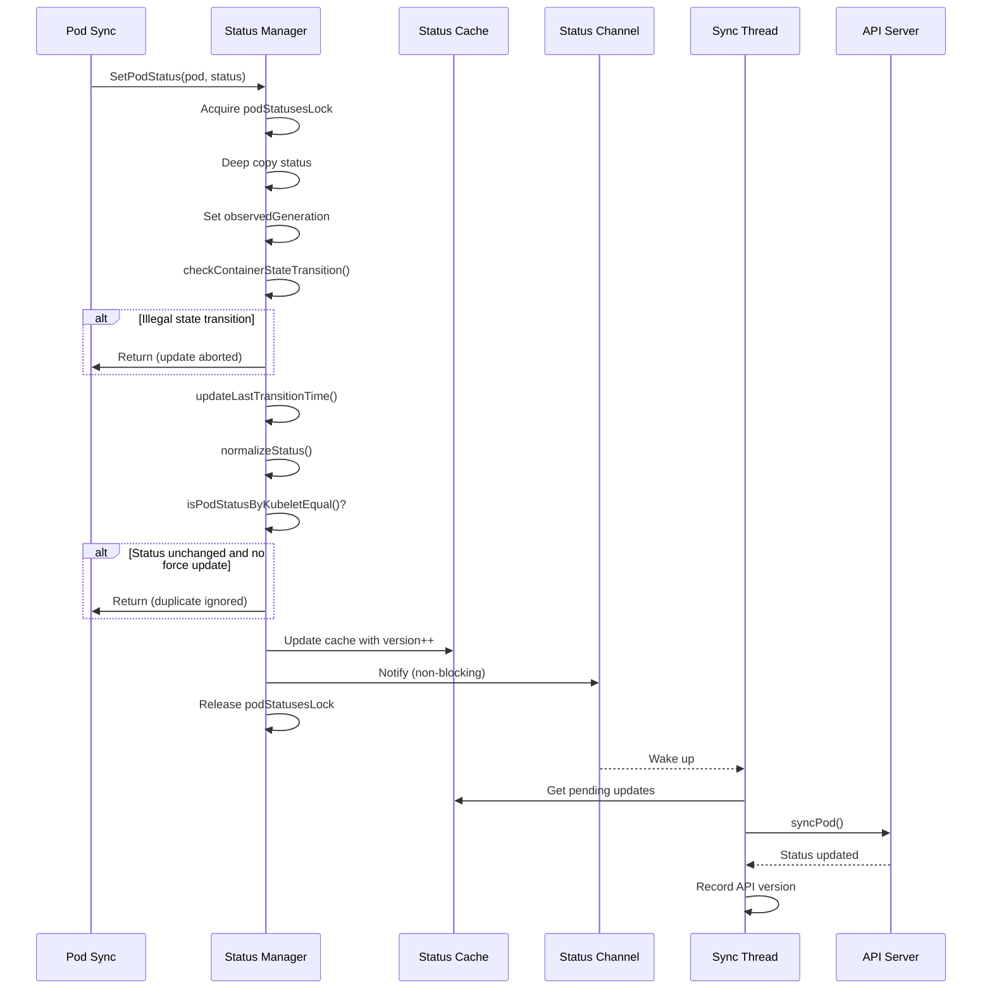
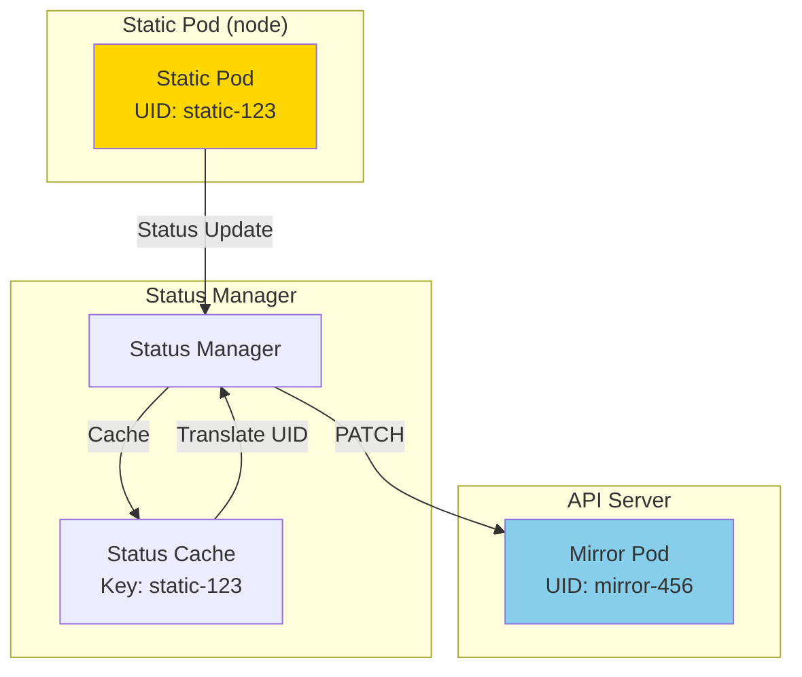
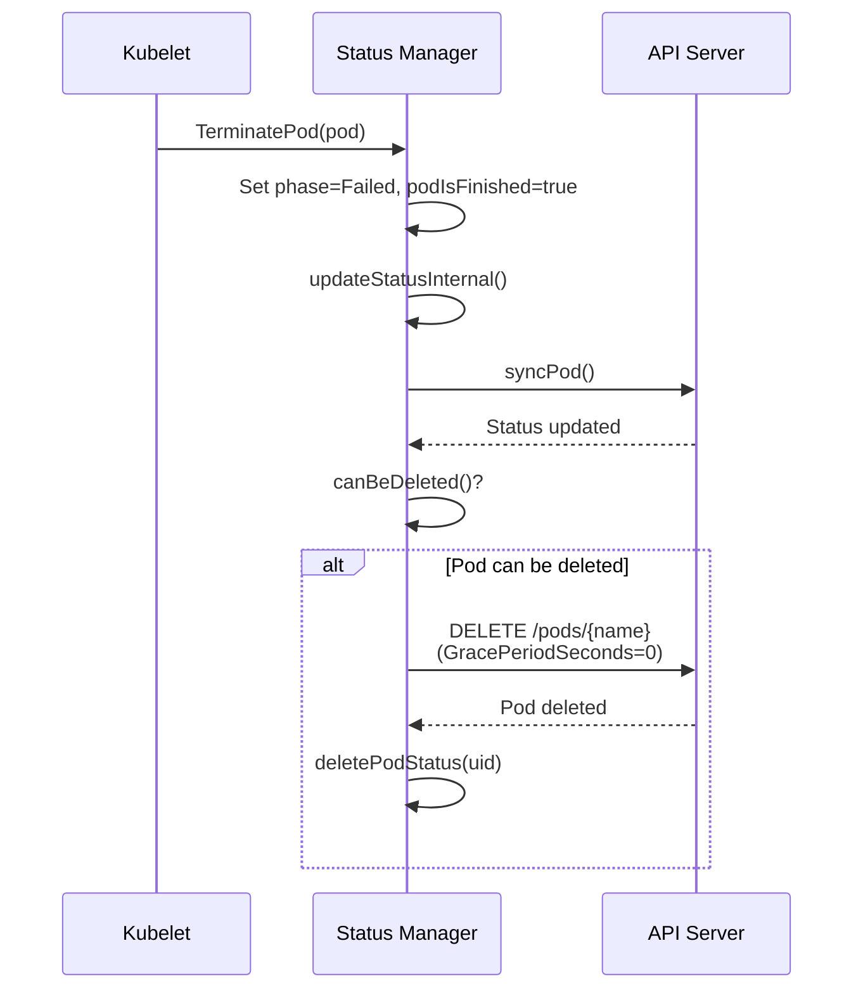
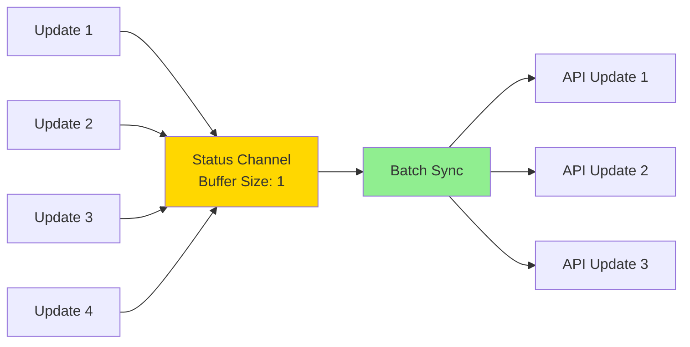

# Status Manager

## Table of Contents
- [Overview](#overview)
- [Status Manager Architecture](#status-manager-architecture)
- [Status Versioning](#status-versioning)
- [Status Update Flow](#status-update-flow)
- [Sync Loop](#sync-loop)
- [Pod Status Operations](#pod-status-operations)
- [Container Status Updates](#container-status-updates)
- [Pod Termination](#pod-termination)
- [Pod Conditions Generation](#pod-conditions-generation)
- [Status Merging](#status-merging)
- [Static Pods and Mirror Pods](#static-pods-and-mirror-pods)
- [Pod Deletion](#pod-deletion)
- [Pod Resize Conditions](#pod-resize-conditions)
- [Status Reconciliation](#status-reconciliation)
- [Performance and Optimization](#performance-and-optimization)
- [Troubleshooting](#troubleshooting)
- [Best Practices](#best-practices)
- [Related Documentation](#related-documentation)

## Overview

The **Status Manager** is the source of truth for pod status within the kubelet. It maintains a cache of pod statuses, tracks version numbers to prevent stale updates, and synchronizes status changes to the API server asynchronously. This component ensures that the API server always has an up-to-date view of pod status as observed by the kubelet.

### Purpose and Responsibilities

1. **Status Caching**: Maintain authoritative cache of pod statuses
2. **Version Tracking**: Prevent stale status updates using monotonically increasing versions
3. **Asynchronous Sync**: Batch and sync status updates to API server
4. **Container Updates**: Track individual container readiness and startup state
5. **Pod Conditions**: Generate and maintain pod conditions (Ready, ContainersReady, Initialized, etc.)
6. **Termination Handling**: Ensure proper status transitions during pod termination
7. **Static Pod Support**: Handle mirror pod status synchronization
8. **Deletion Management**: Delete pods from API server when termination is complete



**File**: pkg/kubelet/status/status_manager.go:67

## Status Manager Architecture

### Manager Structure

```go
type manager struct {
    // Kubernetes API client
    kubeClient clientset.Interface

    // Pod manager for pod lookups
    podManager PodManager

    // Status cache: pod UID -> versioned status
    podStatuses map[types.UID]versionedPodStatus

    // Resize conditions cache (feature gate: InPlacePodVerticalScaling)
    podResizeConditions map[types.UID]podResizeConditions

    // Lock protecting status caches
    podStatusesLock sync.RWMutex

    // Channel to trigger status sync
    podStatusChannel chan struct{}

    // API server status versions (mirror pod UID -> version)
    // Only accessed from sync thread
    apiStatusVersions map[kubetypes.MirrorPodUID]uint64

    // Pod deletion safety provider
    podDeletionSafety PodDeletionSafetyProvider

    // Startup latency tracking
    podStartupLatencyHelper PodStartupLatencyStateHelper
}
```

**File**: pkg/kubelet/status/status_manager.go:67

### Versioned Pod Status

```go
type versionedPodStatus struct {
    // Monotonically increasing version number (per pod)
    version uint64

    // Pod identification
    podName      string
    podNamespace string

    // Time when status update was first detected
    at time.Time

    // True if status is final (pod finished)
    podIsFinished bool

    // Actual pod status
    status v1.PodStatus
}
```

**Key Design Decisions**:
- **Version Number**: Prevents out-of-order status updates
- **Timestamp Tracking**: Measures sync latency from detection to API update
- **Finished Flag**: Tracks terminal pod state for proper deletion

**File**: pkg/kubelet/status/status_manager.go:50

### Manager Initialization

```go
func NewManager(
    kubeClient clientset.Interface,
    podManager PodManager,
    podDeletionSafety PodDeletionSafetyProvider,
    podStartupLatencyHelper PodStartupLatencyStateHelper,
) Manager {
    return &manager{
        kubeClient:              kubeClient,
        podManager:              podManager,
        podStatuses:             make(map[types.UID]versionedPodStatus),
        podResizeConditions:     make(map[types.UID]podResizeConditions),
        podStatusChannel:        make(chan struct{}, 1),
        apiStatusVersions:       make(map[kubetypes.MirrorPodUID]uint64),
        podDeletionSafety:       podDeletionSafety,
        podStartupLatencyHelper: podStartupLatencyHelper,
    }
}
```

**File**: pkg/kubelet/status/status_manager.go:187

## Status Versioning

The status manager uses **monotonically increasing version numbers** to ensure status updates are applied in the correct order and prevent stale updates from overwriting newer status.

### Version Tracking



**File**: pkg/kubelet/status/status_manager.go:852

### Version Comparison Logic

```go
// needsUpdate returns whether status is stale for the given pod UID
func (m *manager) needsUpdate(logger klog.Logger, uid types.UID, status versionedPodStatus) bool {
    latest, ok := m.apiStatusVersions[kubetypes.MirrorPodUID(uid)]

    // No version tracked or cached version is newer
    if !ok || latest < status.version {
        return true
    }

    // Check if pod can be deleted
    pod, ok := m.podManager.GetPodByUID(uid)
    if !ok {
        return false
    }
    return m.canBeDeleted(logger, pod, status.status, status.podIsFinished)
}
```

**File**: pkg/kubelet/status/status_manager.go:1083

### Preventing Stale Updates



**Example Scenario**:
```
T1: SetPodStatus(Running)  -> version 1 -> API update
T2: SetPodStatus(Failed)   -> version 2 -> API update
T3: SetPodStatus(Running)  -> version 3 -> Blocked! (illegal transition)
```

**File**: pkg/kubelet/status/status_manager.go:754

## Status Update Flow

### Complete Update Flow



**File**: pkg/kubelet/status/status_manager.go:754

### SetPodStatus Implementation

```go
func (m *manager) SetPodStatus(logger klog.Logger, pod *v1.Pod, status v1.PodStatus) {
    m.podStatusesLock.Lock()
    defer m.podStatusesLock.Unlock()

    // Make sure we're caching a deep copy
    status = *status.DeepCopy()

    // Set the observedGeneration for this pod status
    status.ObservedGeneration = podutil.CalculatePodStatusObservedGeneration(pod)

    // Force update if deletion timestamp is set
    forceUpdate := pod.DeletionTimestamp != nil

    m.updateStatusInternal(logger, pod, status, forceUpdate, false)
}
```

**File**: pkg/kubelet/status/status_manager.go:407

### Internal Update Logic

```go
func (m *manager) updateStatusInternal(
    logger klog.Logger,
    pod *v1.Pod,
    status v1.PodStatus,
    forceUpdate, podIsFinished bool,
) {
    var oldStatus v1.PodStatus
    cachedStatus, isCached := m.podStatuses[pod.UID]
    if isCached {
        oldStatus = cachedStatus.status
    } else {
        oldStatus = pod.Status
    }

    // Check for illegal state transitions
    if err := checkContainerStateTransition(&oldStatus, &status, &pod.Spec); err != nil {
        logger.Error(err, "Status update aborted")
        return
    }

    // Update LastTransitionTime for conditions
    updateLastTransitionTime(&status, &oldStatus, v1.ContainersReady)
    updateLastTransitionTime(&status, &oldStatus, v1.PodReady)
    updateLastTransitionTime(&status, &oldStatus, v1.PodInitialized)
    updateLastTransitionTime(&status, &oldStatus, v1.PodReadyToStartContainers)
    updateLastTransitionTime(&status, &oldStatus, v1.PodScheduled)
    updateLastTransitionTime(&status, &oldStatus, v1.DisruptionTarget)

    // Ensure start time doesn't change
    if oldStatus.StartTime != nil && !oldStatus.StartTime.IsZero() {
        status.StartTime = oldStatus.StartTime
    } else if status.StartTime.IsZero() {
        now := metav1.Now()
        status.StartTime = &now
    }

    // Prevent sending unnecessary patches
    if oldStatus.ObservedGeneration > status.ObservedGeneration {
        status.ObservedGeneration = oldStatus.ObservedGeneration
    }

    normalizeStatus(pod, &status)

    // Check if status actually changed
    if isCached && isPodStatusByKubeletEqual(&cachedStatus.status, &status) && !forceUpdate {
        logger.V(3).Info("Ignoring same status for pod")
        return
    }

    // Create new versioned status
    newStatus := versionedPodStatus{
        status:        status,
        version:       cachedStatus.version + 1,
        podName:       pod.Name,
        podNamespace:  pod.Namespace,
        podIsFinished: podIsFinished,
    }

    // Track time from first detection
    if cachedStatus.at.IsZero() {
        newStatus.at = time.Now()
    } else {
        newStatus.at = cachedStatus.at
    }

    m.podStatuses[pod.UID] = newStatus

    // Notify sync thread (non-blocking)
    select {
    case m.podStatusChannel <- struct{}{}:
    default:
        // Already a pending update
    }
}
```

**File**: pkg/kubelet/status/status_manager.go:756

### State Transition Validation

```go
func checkContainerStateTransition(oldStatuses, newStatuses *v1.PodStatus, podSpec *v1.PodSpec) error {
    // RestartPolicy=Always allows all transitions
    if podSpec.RestartPolicy == v1.RestartPolicyAlways {
        return nil
    }

    for _, oldStatus := range oldStatuses.ContainerStatuses {
        // Skip if not terminated
        if oldStatus.State.Terminated == nil {
            continue
        }

        // Skip if failed and RestartPolicy=OnFailure
        if oldStatus.State.Terminated.ExitCode != 0 &&
           podSpec.RestartPolicy == v1.RestartPolicyOnFailure {
            continue
        }

        // Check for illegal transition from terminated to non-terminated
        for _, newStatus := range newStatuses.ContainerStatuses {
            if oldStatus.Name == newStatus.Name && newStatus.State.Terminated == nil {
                return fmt.Errorf(
                    "terminated container %v attempted illegal transition to non-terminated state",
                    newStatus.Name,
                )
            }
        }
    }

    // Similar checks for init containers...
    return nil
}
```

**File**: pkg/kubelet/status/status_manager.go:681

## Sync Loop

The status manager runs a dedicated sync loop that batches and synchronizes status updates to the API server.

### Sync Loop Architecture

```mermaid
graph TB
    START[Start Sync Loop] --> CHECK{Client<br/>Available?}
    CHECK -->|No| SKIP[Skip (standalone mode)]
    CHECK -->|Yes| LOOP[Enter Main Loop]

    LOOP --> WAIT{Wait for Event}

    WAIT -->|Status Channel| BATCH1[syncBatch(incremental)]
    WAIT -->|10s Timer| BATCH2[syncBatch(full)]

    BATCH1 --> SELECT[Select Pods Needing Update]
    BATCH2 --> SELECT

    SELECT --> SYNC[Sync Each Pod to API]
    SYNC --> LOOP

    style BATCH1 fill:#87CEEB
    style BATCH2 fill:#FFD700
```

**File**: pkg/kubelet/status/status_manager.go:234

### Start Implementation

```go
func (m *manager) Start(ctx context.Context) {
    logger := klog.FromContext(ctx)

    // Don't start if no client (standalone mode)
    if m.kubeClient == nil {
        logger.Info("Kubernetes client is nil, not starting status manager")
        return
    }

    logger.Info("Starting to sync pod status with apiserver")

    syncTicker := time.NewTicker(10 * time.Second).C

    // Single goroutine for all syncs (avoids sync races)
    go wait.Forever(func() {
        for {
            select {
            case <-m.podStatusChannel:
                logger.V(4).Info("Syncing updated statuses")
                m.syncBatch(ctx, false) // Incremental
            case <-syncTicker:
                logger.V(4).Info("Syncing all statuses")
                m.syncBatch(ctx, true)  // Full reconciliation
            }
        }
    }, 0)
}
```

**Sync Modes**:
- **Incremental** (triggered by channel): Only sync pods with version > API version
- **Full** (every 10s): Reconcile all pods, clean up orphans

**File**: pkg/kubelet/status/status_manager.go:234

### Batch Sync Implementation

```go
func (m *manager) syncBatch(ctx context.Context, all bool) int {
    type podSync struct {
        podUID    types.UID
        statusUID kubetypes.MirrorPodUID
        status    versionedPodStatus
    }

    var updatedStatuses []podSync
    podToMirror, mirrorToPod := m.podManager.GetUIDTranslations()

    func() { // Critical section
        m.podStatusesLock.RLock()
        defer m.podStatusesLock.RUnlock()

        // Clean up orphaned API versions (full sync only)
        if all {
            for uid := range m.apiStatusVersions {
                _, hasPod := m.podStatuses[types.UID(uid)]
                _, hasMirror := mirrorToPod[uid]
                if !hasPod && !hasMirror {
                    delete(m.apiStatusVersions, uid)
                }
            }
        }

        // Decide which pods need status updates
        for uid, status := range m.podStatuses {
            // Translate pod UID to status UID (for static pods)
            uidOfStatus := kubetypes.MirrorPodUID(uid)
            if mirrorUID, ok := podToMirror[kubetypes.ResolvedPodUID(uid)]; ok {
                if mirrorUID == "" {
                    // Static pod without mirror, skip
                    continue
                }
                uidOfStatus = mirrorUID
            }

            // Incremental: only new versions
            if !all {
                if m.apiStatusVersions[uidOfStatus] >= status.version {
                    continue
                }
                updatedStatuses = append(updatedStatuses, podSync{uid, uidOfStatus, status})
                continue
            }

            // Full: check if update needed or reconciliation required
            if m.needsUpdate(logger, types.UID(uidOfStatus), status) {
                updatedStatuses = append(updatedStatuses, podSync{uid, uidOfStatus, status})
            } else if m.needsReconcile(logger, uid, status.status) {
                // Force update for reconciliation
                delete(m.apiStatusVersions, uidOfStatus)
                updatedStatuses = append(updatedStatuses, podSync{uid, uidOfStatus, status})
            }
        }
    }()

    // Sync pods to API server
    for _, update := range updatedStatuses {
        logger.V(5).Info("Sync pod status", "podUID", update.podUID, "statusUID", update.statusUID, "version", update.status.version)
        m.syncPod(ctx, update.podUID, update.status)
    }

    return len(updatedStatuses)
}
```

**File**: pkg/kubelet/status/status_manager.go:929

### Individual Pod Sync

```go
func (m *manager) syncPod(ctx context.Context, uid types.UID, status versionedPodStatus) {
    logger := klog.FromContext(ctx)

    // Get pod from API server
    pod, err := m.kubeClient.CoreV1().Pods(status.podNamespace).Get(ctx, status.podName, metav1.GetOptions{})
    if errors.IsNotFound(err) {
        logger.V(3).Info("Pod does not exist on the server")
        return
    }
    if err != nil {
        logger.Error(err, "Failed to get status for pod")
        return
    }

    // Check if pod was deleted and recreated (UID changed)
    translatedUID := m.podManager.TranslatePodUID(pod.UID)
    if len(translatedUID) > 0 && translatedUID != kubetypes.ResolvedPodUID(uid) {
        logger.V(2).Info("Pod was deleted and recreated, skipping status update")
        m.deletePodStatus(uid)
        return
    }

    // Merge with existing API status
    mergedStatus := mergePodStatus(
        pod,
        pod.Status,
        status.status,
        m.podDeletionSafety.PodCouldHaveRunningContainers(pod),
    )

    // Patch API server
    newPod, patchBytes, unchanged, err := statusutil.PatchPodStatus(
        ctx,
        m.kubeClient,
        pod.Namespace,
        pod.Name,
        pod.UID,
        pod.Status,
        mergedStatus,
    )

    if err != nil {
        logger.Error(err, "Failed to update status for pod")
        return
    }

    if unchanged {
        logger.V(3).Info("Status for pod is up-to-date")
    } else {
        logger.V(3).Info("Status for pod updated successfully")
        pod = newPod
        m.podStartupLatencyHelper.RecordStatusUpdated(pod)
    }

    // Measure sync latency
    if !status.at.IsZero() {
        duration := time.Since(status.at).Truncate(time.Millisecond)
        metrics.PodStatusSyncDuration.Observe(duration.Seconds())
    }

    // Record successful API update
    m.apiStatusVersions[kubetypes.MirrorPodUID(pod.UID)] = status.version

    // Delete pod if fully terminated
    if m.canBeDeleted(logger, pod, status.status, status.podIsFinished) {
        deleteOptions := metav1.DeleteOptions{
            GracePeriodSeconds: new(int64),
            Preconditions:      metav1.NewUIDPreconditions(string(pod.UID)),
        }
        err = m.kubeClient.CoreV1().Pods(pod.Namespace).Delete(ctx, pod.Name, deleteOptions)
        if err != nil {
            logger.Info("Failed to delete pod", "err", err)
            return
        }
        logger.V(3).Info("Pod fully terminated and removed from etcd")
        m.deletePodStatus(uid)
    }
}
```

**File**: pkg/kubelet/status/status_manager.go:1005

## Pod Status Operations

### Getting Pod Status

```go
func (m *manager) GetPodStatus(uid types.UID) (v1.PodStatus, bool) {
    m.podStatusesLock.RLock()
    defer m.podStatusesLock.RUnlock()

    // Translate UID (handles static pods)
    status, ok := m.podStatuses[types.UID(m.podManager.TranslatePodUID(uid))]
    return status.status, ok
}
```

**Usage**: Other kubelet components query status manager for current pod status.

**File**: pkg/kubelet/status/status_manager.go:400

### Removing Orphaned Statuses

```go
func (m *manager) RemoveOrphanedStatuses(logger klog.Logger, podUIDs map[types.UID]bool) {
    m.podStatusesLock.Lock()
    defer m.podStatusesLock.Unlock()

    for key := range m.podStatuses {
        if _, ok := podUIDs[key]; !ok {
            logger.V(5).Info("Removing pod from status map", "podUID", key)
            delete(m.podStatuses, key)

            // Also remove resize conditions
            if _, exists := m.podResizeConditions[key]; exists {
                delete(m.podResizeConditions, key)
                m.recordInProgressResizeCount()
                m.recordPendingResizeCount()
            }
        }
    }
}
```

**Called By**: Pod sync loop during housekeeping to clean up status for deleted pods.

**File**: pkg/kubelet/status/status_manager.go:909

## Container Status Updates

### Setting Container Readiness

```go
func (m *manager) SetContainerReadiness(
    logger klog.Logger,
    podUID types.UID,
    containerID kubecontainer.ContainerID,
    ready bool,
) {
    m.podStatusesLock.Lock()
    defer m.podStatusesLock.Unlock()

    pod, ok := m.podManager.GetPodByUID(podUID)
    if !ok {
        logger.V(4).Info("Pod has been deleted, no need to update readiness")
        return
    }

    oldStatus, found := m.podStatuses[pod.UID]
    if !found {
        logger.Info("Container readiness changed before pod has synced")
        return
    }

    // Find the container to update
    containerStatus, _, ok := findContainerStatus(&oldStatus.status, containerID.String())
    if !ok {
        logger.Info("Container readiness changed for unknown container")
        return
    }

    if containerStatus.Ready == ready {
        logger.V(4).Info("Container readiness unchanged")
        return
    }

    // Deep copy and update
    status := *oldStatus.status.DeepCopy()
    containerStatus, _, _ = findContainerStatus(&status, containerID.String())
    containerStatus.Ready = ready

    // Update pod conditions
    allContainerStatuses := append(status.InitContainerStatuses, status.ContainerStatuses...)
    updateCondition := func(conditionType v1.PodConditionType, condition v1.PodCondition) {
        // Find and update or append condition
        // ...
    }

    updateCondition(v1.PodReady, GeneratePodReadyCondition(pod, &oldStatus.status, status.Conditions, allContainerStatuses, status.Phase))
    updateCondition(v1.ContainersReady, GenerateContainersReadyCondition(pod, &oldStatus.status, allContainerStatuses, status.Phase))

    m.updateStatusInternal(logger, pod, status, false, false)
}
```

**Triggered By**: Probe manager when container readiness changes.

**File**: pkg/kubelet/status/status_manager.go:423

### Setting Container Startup

```go
func (m *manager) SetContainerStartup(
    logger klog.Logger,
    podUID types.UID,
    containerID kubecontainer.ContainerID,
    started bool,
) {
    m.podStatusesLock.Lock()
    defer m.podStatusesLock.Unlock()

    pod, ok := m.podManager.GetPodByUID(podUID)
    if !ok {
        return
    }

    oldStatus, found := m.podStatuses[pod.UID]
    if !found {
        return
    }

    // Find container
    containerStatus, _, ok := findContainerStatus(&oldStatus.status, containerID.String())
    if !ok {
        return
    }

    if containerStatus.Started != nil && *containerStatus.Started == started {
        return
    }

    // Update started field
    status := *oldStatus.status.DeepCopy()
    containerStatus, _, _ = findContainerStatus(&status, containerID.String())
    containerStatus.Started = &started

    m.updateStatusInternal(logger, pod, status, false, false)
}
```

**Triggered By**: Probe manager when startup probe succeeds.

**File**: pkg/kubelet/status/status_manager.go:486

## Pod Termination

### TerminatePod Implementation

```go
func (m *manager) TerminatePod(logger klog.Logger, pod *v1.Pod) {
    m.podStatusesLock.Lock()
    defer m.podStatusesLock.Unlock()

    // Get current status
    oldStatus := &pod.Status
    cachedStatus, isCached := m.podStatuses[pod.UID]
    if isCached {
        oldStatus = &cachedStatus.status
    }
    status := *oldStatus.DeepCopy()

    // Mark containers as terminated if pod has initialized
    if hasPodInitialized(logger, pod) {
        for i := range status.ContainerStatuses {
            if status.ContainerStatuses[i].State.Terminated != nil {
                continue
            }
            status.ContainerStatuses[i].State = v1.ContainerState{
                Terminated: &v1.ContainerStateTerminated{
                    Reason:   "ContainerStatusUnknown",
                    Message:  "The container could not be located when the pod was terminated",
                    ExitCode: 137,
                },
            }
        }
    }

    // Mark initialized init containers as terminated
    for i := range initializedContainers(status.InitContainerStatuses) {
        if status.InitContainerStatuses[i].State.Terminated != nil {
            continue
        }
        status.InitContainerStatuses[i].State = v1.ContainerState{
            Terminated: &v1.ContainerStateTerminated{
                Reason:   "ContainerStatusUnknown",
                Message:  "The container could not be located when the pod was terminated",
                ExitCode: 137,
            },
        }
    }

    // Transition to terminal phase (non-static pods)
    if !kubetypes.IsStaticPod(pod) {
        switch status.Phase {
        case v1.PodSucceeded, v1.PodFailed:
            // Already terminal
        case v1.PodPending, v1.PodRunning:
            status.Phase = v1.PodFailed
        default:
            logger.Error(fmt.Errorf("unknown phase: %v", status.Phase), "Unknown phase")
            status.Phase = v1.PodFailed
        }
    }

    m.updateStatusInternal(logger, pod, status, true, true)
}
```

**Purpose**: Ensure proper terminal status when pod is being deleted and containers may not be observable.

**File**: pkg/kubelet/status/status_manager.go:556

### Pod Initialization Check

```go
func hasPodInitialized(logger klog.Logger, pod *v1.Pod) bool {
    // No init containers = always initialized
    if len(pod.Spec.InitContainers) == 0 {
        return true
    }

    // Any container has moved out of waiting = initialized
    for _, status := range pod.Status.ContainerStatuses {
        if status.LastTerminationState.Terminated != nil || status.State.Waiting == nil {
            return true
        }
    }

    // Last init container completed successfully = initialized
    if l := len(pod.Status.InitContainerStatuses); l > 0 {
        container := pod.Spec.InitContainers[l-1]
        containerStatus := pod.Status.InitContainerStatuses[l-1]

        if podutil.IsRestartableInitContainer(&container) {
            if containerStatus.State.Running != nil &&
               containerStatus.Started != nil && *containerStatus.Started {
                return true
            }
        } else {
            if state := containerStatus.State; state.Terminated != nil && state.Terminated.ExitCode == 0 {
                return true
            }
        }
    }

    return false
}
```

**File**: pkg/kubelet/status/status_manager.go:624

## Pod Conditions Generation

### Ready Condition

```go
func GeneratePodReadyCondition(
    pod *v1.Pod,
    oldPodStatus *v1.PodStatus,
    conditions []v1.PodCondition,
    containerStatuses []v1.ContainerStatus,
    podPhase v1.PodPhase,
) v1.PodCondition {
    containersReady := GenerateContainersReadyCondition(pod, oldPodStatus, containerStatuses, podPhase)

    // If containers not ready, pod not ready
    if containersReady.Status != v1.ConditionTrue {
        return v1.PodCondition{
            Type:               v1.PodReady,
            ObservedGeneration: podutil.CalculatePodConditionObservedGeneration(oldPodStatus, pod.Generation, v1.PodReady),
            Status:             containersReady.Status,
            Reason:             containersReady.Reason,
            Message:            containersReady.Message,
        }
    }

    // Evaluate readiness gates
    unreadyMessages := []string{}
    for _, rg := range pod.Spec.ReadinessGates {
        _, c := podutil.GetPodConditionFromList(conditions, rg.ConditionType)
        if c == nil {
            unreadyMessages = append(unreadyMessages, fmt.Sprintf(
                "corresponding condition of pod readiness gate %q does not exist.",
                string(rg.ConditionType),
            ))
        } else if c.Status != v1.ConditionTrue {
            unreadyMessages = append(unreadyMessages, fmt.Sprintf(
                "the status of pod readiness gate %q is not \"True\", but %v",
                string(rg.ConditionType),
                c.Status,
            ))
        }
    }

    // Set Ready=False if any gate not ready
    if len(unreadyMessages) != 0 {
        return v1.PodCondition{
            Type:               v1.PodReady,
            ObservedGeneration: podutil.CalculatePodConditionObservedGeneration(oldPodStatus, pod.Generation, v1.PodReady),
            Status:             v1.ConditionFalse,
            Reason:             "ReadinessGatesNotReady",
            Message:            strings.Join(unreadyMessages, ", "),
        }
    }

    return v1.PodCondition{
        Type:               v1.PodReady,
        ObservedGeneration: podutil.CalculatePodConditionObservedGeneration(oldPodStatus, pod.Generation, v1.PodReady),
        Status:             v1.ConditionTrue,
    }
}
```

**File**: pkg/kubelet/status/generate.go:122

### ContainersReady Condition

```go
func GenerateContainersReadyCondition(
    pod *v1.Pod,
    oldPodStatus *v1.PodStatus,
    containerStatuses []v1.ContainerStatus,
    podPhase v1.PodPhase,
) v1.PodCondition {
    if containerStatuses == nil {
        return v1.PodCondition{
            Type:               v1.ContainersReady,
            ObservedGeneration: podutil.CalculatePodConditionObservedGeneration(oldPodStatus, pod.Generation, v1.ContainersReady),
            Status:             v1.ConditionFalse,
            Reason:             "UnknownContainerStatuses",
        }
    }

    unknownContainers := []string{}
    unreadyContainers := []string{}

    // Check restartable init containers
    for _, container := range pod.Spec.InitContainers {
        if !podutil.IsRestartableInitContainer(&container) {
            continue
        }
        if containerStatus, ok := podutil.GetContainerStatus(containerStatuses, container.Name); ok {
            if !containerStatus.Ready {
                unreadyContainers = append(unreadyContainers, container.Name)
            }
        } else {
            unknownContainers = append(unknownContainers, container.Name)
        }
    }

    // Check main containers
    for _, container := range pod.Spec.Containers {
        if containerStatus, ok := podutil.GetContainerStatus(containerStatuses, container.Name); ok {
            if !containerStatus.Ready {
                unreadyContainers = append(unreadyContainers, container.Name)
            }
        } else {
            unknownContainers = append(unknownContainers, container.Name)
        }
    }

    // Terminal phases
    if podPhase == v1.PodSucceeded && len(unknownContainers) == 0 {
        return v1.PodCondition{
            Type:               v1.ContainersReady,
            ObservedGeneration: podutil.CalculatePodConditionObservedGeneration(oldPodStatus, pod.Generation, v1.ContainersReady),
            Status:             v1.ConditionFalse,
            Reason:             "PodCompleted",
        }
    }
    if podPhase == v1.PodFailed {
        return v1.PodCondition{
            Type:               v1.ContainersReady,
            ObservedGeneration: podutil.CalculatePodConditionObservedGeneration(oldPodStatus, pod.Generation, v1.ContainersReady),
            Status:             v1.ConditionFalse,
            Reason:             "PodFailed",
        }
    }

    // Generate message
    unreadyMessages := []string{}
    if len(unknownContainers) > 0 {
        unreadyMessages = append(unreadyMessages, fmt.Sprintf("containers with unknown status: %s", unknownContainers))
    }
    if len(unreadyContainers) > 0 {
        unreadyMessages = append(unreadyMessages, fmt.Sprintf("containers with unready status: %s", unreadyContainers))
    }

    if len(unreadyMessages) != 0 {
        return v1.PodCondition{
            Type:               v1.ContainersReady,
            ObservedGeneration: podutil.CalculatePodConditionObservedGeneration(oldPodStatus, pod.Generation, v1.ContainersReady),
            Status:             v1.ConditionFalse,
            Reason:             "ContainersNotReady",
            Message:            strings.Join(unreadyMessages, ", "),
        }
    }

    return v1.PodCondition{
        Type:               v1.ContainersReady,
        ObservedGeneration: podutil.CalculatePodConditionObservedGeneration(oldPodStatus, pod.Generation, v1.ContainersReady),
        Status:             v1.ConditionTrue,
    }
}
```

**File**: pkg/kubelet/status/generate.go:46

## Status Merging

### Merge Logic

```go
func mergePodStatus(
    pod *v1.Pod,
    oldPodStatus, newPodStatus v1.PodStatus,
    couldHaveRunningContainers bool,
) v1.PodStatus {
    podConditions := []v1.PodCondition{}

    // Preserve non-kubelet-owned conditions from old status
    for _, c := range oldPodStatus.Conditions {
        if !kubetypes.PodConditionByKubelet(c.Type) {
            podConditions = append(podConditions, c)
        }
    }

    transitioningToTerminalPhase := !podutil.IsPodPhaseTerminal(oldPodStatus.Phase) &&
                                     podutil.IsPodPhaseTerminal(newPodStatus.Phase)

    // Add kubelet-owned and shared conditions from new status
    for _, c := range newPodStatus.Conditions {
        if kubetypes.PodConditionByKubelet(c.Type) {
            podConditions = append(podConditions, c)
        } else if kubetypes.PodConditionSharedByKubelet(c.Type) {
            if c.Type == v1.DisruptionTarget {
                // Only send DisruptionTarget when phase is terminal and no running containers
                if transitioningToTerminalPhase && !couldHaveRunningContainers {
                    updateLastTransitionTime(&newPodStatus, &oldPodStatus, c.Type)
                    if _, c := podutil.GetPodConditionFromList(newPodStatus.Conditions, c.Type); c != nil {
                        podConditions = statusutil.ReplaceOrAppendPodCondition(podConditions, c)
                    }
                }
            }
        }
    }
    newPodStatus.Conditions = podConditions

    // Preserve API server fields
    newPodStatus.ResourceClaimStatuses = oldPodStatus.ResourceClaimStatuses

    // Delay terminal phase transition if containers could still be running
    if transitioningToTerminalPhase && couldHaveRunningContainers {
        newPodStatus.Phase = oldPodStatus.Phase
        newPodStatus.Reason = oldPodStatus.Reason
        newPodStatus.Message = oldPodStatus.Message
    }

    // Explicitly set Ready=False for terminal phases
    if podutil.IsPodPhaseTerminal(newPodStatus.Phase) {
        if podutil.IsPodReadyConditionTrue(newPodStatus) || podutil.IsContainersReadyConditionTrue(newPodStatus) {
            containersReadyCondition := generateContainersReadyConditionForTerminalPhase(pod, &oldPodStatus, newPodStatus.Phase)
            podutil.UpdatePodCondition(&newPodStatus, &containersReadyCondition)

            podReadyCondition := generatePodReadyConditionForTerminalPhase(pod, &oldPodStatus, newPodStatus.Phase)
            podutil.UpdatePodCondition(&newPodStatus, &podReadyCondition)
        }
    }

    return newPodStatus
}
```

**Purpose**: Merge kubelet status with API server status while preserving non-kubelet fields.

**File**: pkg/kubelet/status/status_manager.go:1213

## Static Pods and Mirror Pods



### UID Translation

```go
// When syncing status for static pod
uidOfStatus := kubetypes.MirrorPodUID(uid)
if mirrorUID, ok := podToMirror[kubetypes.ResolvedPodUID(uid)]; ok {
    if mirrorUID == "" {
        // Static pod without mirror, skip sync
        continue
    }
    uidOfStatus = mirrorUID
}

// Update mirror pod status in API server
m.kubeClient.CoreV1().Pods(namespace).Patch(..., mirrorPodName, ...)
```

**File**: pkg/kubelet/status/status_manager.go:959

## Pod Deletion

### Deletion Criteria

```go
func (m *manager) canBeDeleted(
    logger klog.Logger,
    pod *v1.Pod,
    status v1.PodStatus,
    podIsFinished bool,
) bool {
    // Only delete pods with deletion timestamp
    if pod.DeletionTimestamp == nil || kubetypes.IsMirrorPod(pod) {
        return false
    }

    // Wait for terminal phase
    if !podutil.IsPodPhaseTerminal(pod.Status.Phase) {
        logger.V(3).Info("Delaying pod deletion as phase is non-terminal",
            "phase", pod.Status.Phase,
            "localPhase", status.Phase,
        )
        return false
    }

    // If podIsFinished=true, termination is complete
    if podIsFinished {
        logger.V(3).Info("Pod termination is finished as SyncTerminatedPod completes")
        return true
    }

    return false
}
```

**File**: pkg/kubelet/status/status_manager.go:1095

### Deletion Flow



**File**: pkg/kubelet/status/status_manager.go:1064

## Pod Resize Conditions

### Resize Condition Types

```go
type podResizeConditions struct {
    PodResizePending    *v1.PodCondition
    PodResizeInProgress *v1.PodCondition
}
```

**Conditions**:
- **PodResizePending**: Resize requested but not yet started
- **PodResizeInProgress**: Resize in progress

**File**: pkg/kubelet/status/status_manager.go:83

### Setting Resize Conditions

```go
func (m *manager) SetPodResizePendingCondition(
    podUID types.UID,
    reason, message string,
    observedGeneration int64,
) {
    m.podStatusesLock.Lock()
    defer m.podStatusesLock.Unlock()

    alreadyPending := m.podResizeConditions[podUID].PodResizePending != nil

    m.podResizeConditions[podUID] = podResizeConditions{
        PodResizePending: updatedPodResizeCondition(
            v1.PodResizePending,
            m.podResizeConditions[podUID].PodResizePending,
            reason,
            message,
            observedGeneration,
        ),
        PodResizeInProgress: m.podResizeConditions[podUID].PodResizeInProgress,
    }

    if !alreadyPending {
        m.recordPendingResizeCount()
    }
}
```

**File**: pkg/kubelet/status/status_manager.go:272

## Status Reconciliation

### Reconciliation Need Check

```go
func (m *manager) needsReconcile(logger klog.Logger, uid types.UID, status v1.PodStatus) bool {
    // Get pod (translate for static pods)
    pod, ok := m.podManager.GetPodByUID(uid)
    if !ok {
        return false
    }

    // For static pods, check mirror pod
    if kubetypes.IsStaticPod(pod) {
        mirrorPod, ok := m.podManager.GetMirrorPodByPod(pod)
        if !ok {
            return false
        }
        pod = mirrorPod
    }

    podStatus := pod.Status.DeepCopy()
    normalizeStatus(pod, podStatus)

    // Compare normalized statuses
    if isPodStatusByKubeletEqual(podStatus, &status) {
        return false
    }

    logger.V(3).Info("Pod status inconsistent, reconciliation needed",
        "statusDiff", diff.Diff(podStatus, &status))

    return true
}
```

**Purpose**: Detect when API server status diverges from kubelet cache and force reconciliation.

**File**: pkg/kubelet/status/status_manager.go:1123

## Performance and Optimization

### Status Sync Latency

```prometheus
# Metric tracking time from status update to API sync
kubelet_pod_status_sync_duration_seconds

# Histogram buckets: 0.001, 0.01, 0.1, 1, 10, 100
```

**Measurement**:
```go
if !status.at.IsZero() {
    duration := time.Since(status.at).Truncate(time.Millisecond)
    metrics.PodStatusSyncDuration.Observe(duration.Seconds())
}
```

**File**: pkg/kubelet/status/status_manager.go:1057

### Batching Strategy



**Benefits**:
- **Reduces API calls**: Multiple updates batched into single sync
- **Non-blocking notifications**: Channel with buffer size 1
- **Periodic reconciliation**: Full sync every 10s

### Optimization Techniques

1. **Deep Copy Only When Needed**: Status is deep copied only when caching
2. **Read Locks for Queries**: Use RLock for GetPodStatus
3. **Version Comparison**: Skip API update if version already synced
4. **Normalized Comparison**: Normalize timestamps before comparing statuses
5. **Incremental vs Full Sync**: Incremental sync on updates, full sync periodically

## Troubleshooting

### Issue 1: Status Updates Not Appearing

**Symptoms**:
- Pod status unchanged in API server
- `kubectl describe pod` shows outdated status

**Diagnosis**:
```bash
# Check kubelet logs for status updates
journalctl -u kubelet | grep "Status for pod updated"

# Check for errors
journalctl -u kubelet | grep -i "failed to update status"

# Check status sync latency
curl http://localhost:10255/metrics | grep kubelet_pod_status_sync_duration
```

**Solutions**:
- Check API server connectivity
- Verify kubelet authentication/authorization
- Check for kubelet-API server version skew

### Issue 2: Pod Stuck in Terminating

**Symptoms**:
- Pod shows `Terminating` for extended period
- Pod not deleted from API server

**Diagnosis**:
```bash
# Check pod phase
kubectl get pod <pod-name> -o jsonpath='{.status.phase}'

# Check deletion timestamp
kubectl get pod <pod-name> -o jsonpath='{.metadata.deletionTimestamp}'

# Check kubelet logs
journalctl -u kubelet | grep -i "delaying pod deletion"
```

**Solutions**:
```bash
# Force delete (if safe)
kubectl delete pod <pod-name> --force --grace-period=0

# Check for finalizers
kubectl get pod <pod-name> -o jsonpath='{.metadata.finalizers}'
```

### Issue 3: Ready Condition Flapping

**Symptoms**:
- Pod Ready condition rapidly changing
- Service endpoints adding/removing pod

**Diagnosis**:
```bash
# Watch pod conditions
kubectl get pod <pod-name> -w -o jsonpath='{.status.conditions[?(@.type=="Ready")]}'

# Check readiness probe configuration
kubectl get pod <pod-name> -o jsonpath='{.spec.containers[*].readinessProbe}'
```

**Solutions**:
- Increase `initialDelaySeconds` and `periodSeconds` for probes
- Adjust `successThreshold` and `failureThreshold`
- Check application health endpoint stability

## Best Practices

### 1. Don't Bypass Status Manager

Always update status through status manager, never directly via API client:

```go
// GOOD
statusManager.SetPodStatus(logger, pod, status)

// BAD
kubeClient.CoreV1().Pods(pod.Namespace).UpdateStatus(ctx, pod, metav1.UpdateOptions{})
```

### 2. Use Conditions for Application State

```yaml
apiVersion: v1
kind: Pod
metadata:
  name: my-app
spec:
  readinessGates:
  - conditionType: "example.com/feature-ready"
```

### 3. Monitor Status Sync Latency

```yaml
# Prometheus alert
- alert: HighPodStatusSyncLatency
  expr: histogram_quantile(0.99, kubelet_pod_status_sync_duration_seconds_bucket) > 10
  annotations:
    summary: "Pod status sync latency is high"
```

### 4. Handle Status Updates Idempotently

Status manager may call SetPodStatus multiple times with same status. Ensure handlers are idempotent.

### 5. Understand Condition Ownership

```yaml
# Kubelet-owned conditions
- PodScheduled
- Initialized
- ContainersReady
- PodReady
- PodReadyToStartContainers

# Shared conditions (kubelet can update)
- DisruptionTarget

# External conditions (kubelet preserves)
- Custom readiness gates
- ResourceClaim conditions
```

## Related Documentation

- [Pod Sync Loop](01-pod-sync-loop.md) - How pod sync triggers status updates
- [PLEG](02-pleg.md) - Container state changes trigger status updates
- [Probes and Health Checks](10-probes-health-checks.md) - Probe results update container readiness
- [Container Lifecycle](04-container-lifecycle.md) - Container state transitions
- [Eviction](11-eviction.md) - Eviction updates pod status to Failed
- [Pod Lifecycle Overview](../high-level/03-pod-lifecycle-overview.md) - Pod phases and conditions

---

**File References**:
- pkg/kubelet/status/status_manager.go:67 - Main status manager implementation
- pkg/kubelet/status/generate.go:44 - Pod condition generation
- pkg/kubelet/pod/pod_manager.go - Pod manager interface

**Last Updated**: 2025-10-21
**Kubernetes Version**: v1.32+
