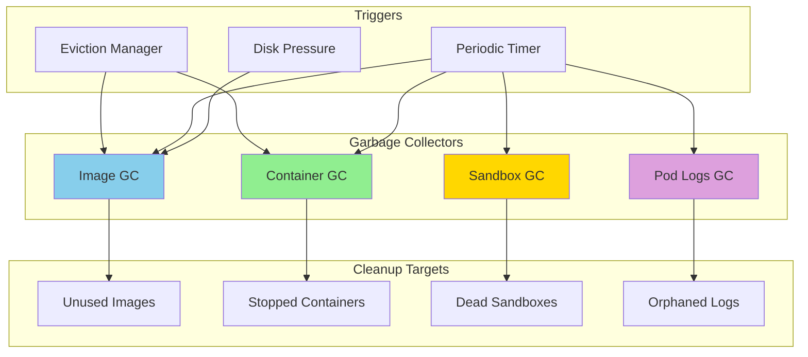
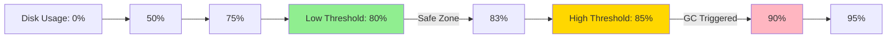
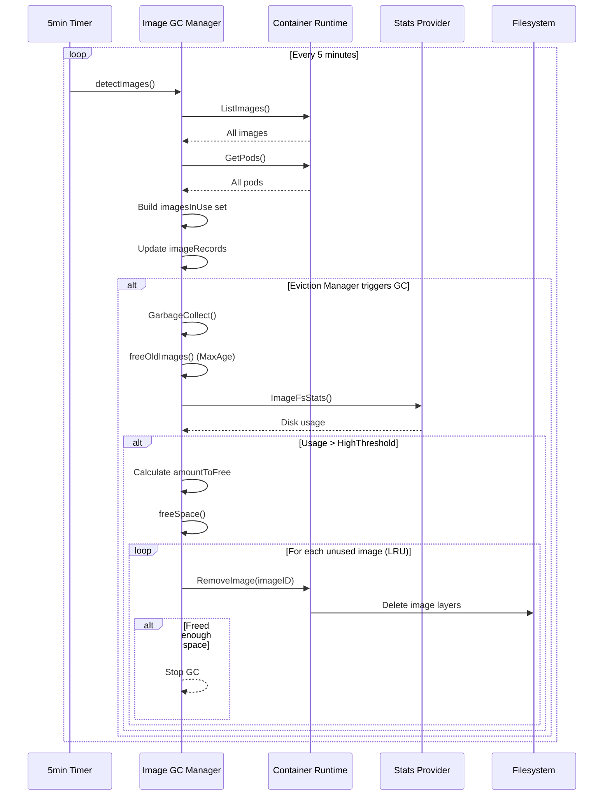
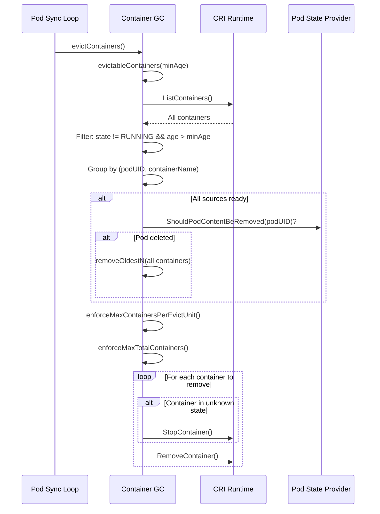
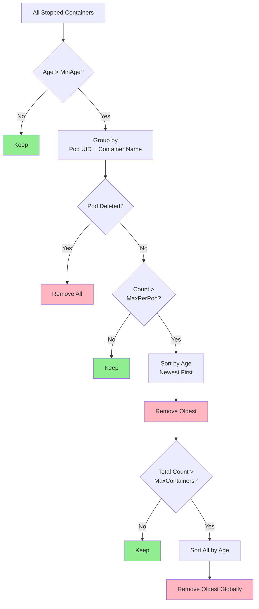
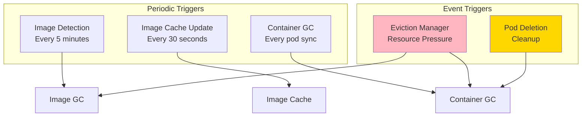

# Garbage Collection

## Table of Contents
- [Overview](#overview)
- [Image Garbage Collection](#image-garbage-collection)
- [Container Garbage Collection](#container-garbage-collection)
- [Pod Sandbox Garbage Collection](#pod-sandbox-garbage-collection)
- [Pod Logs Garbage Collection](#pod-logs-garbage-collection)
- [GC Policies and Configuration](#gc-policies-and-configuration)
- [GC Triggers and Scheduling](#gc-triggers-and-scheduling)
- [Image Tracking and Records](#image-tracking-and-records)
- [Eviction Order and Prioritization](#eviction-order-and-prioritization)
- [Integration with Eviction Manager](#integration-with-eviction-manager)
- [Metrics and Monitoring](#metrics-and-monitoring)
- [Troubleshooting](#troubleshooting)
- [Best Practices](#best-practices)
- [Related Documentation](#related-documentation)

## Overview

Kubernetes **Garbage Collection (GC)** on the kubelet manages disk space by removing unused containers, images, and associated resources. GC prevents disk exhaustion while balancing the need to keep resources for debugging and performance (avoiding re-downloading images).

### GC Components



**File**: pkg/kubelet/images/image_gc_manager.go:72

### GC Goals

1. **Prevent Disk Exhaustion**: Free disk space before critical thresholds
2. **Optimize Image Cache**: Keep frequently used images, remove stale ones
3. **Cleanup Terminated Pods**: Remove stopped containers and sandboxes
4. **Minimize Re-downloads**: Avoid evicting images that pods may soon need
5. **Debugging Support**: Retain recent containers for troubleshooting

## Image Garbage Collection

Image GC manages container image lifecycles, removing unused images when disk space is low or images are too old.

### Image GC Policy

```go
type ImageGCPolicy struct {
    // Trigger GC if disk usage exceeds this threshold
    HighThresholdPercent int  // Default: 85%

    // Stop GC when disk usage falls below this threshold
    LowThresholdPercent int   // Default: 80%

    // Minimum age before an image can be GC'd
    MinAge time.Duration      // Default: 2 minutes

    // Maximum age after which images are always GC'd (optional)
    MaxAge time.Duration      // Default: 0 (disabled)
}
```

**File**: pkg/kubelet/images/image_gc_manager.go:90

### GC Thresholds



**Behavior**:
- **Below Low Threshold (80%)**: No GC
- **Between Low and High (80%-85%)**: No GC (hysteresis band)
- **Above High Threshold (85%)**: GC until below low threshold

### Image GC Manager Structure

```go
type realImageGCManager struct {
    // Container runtime client
    runtime container.Runtime

    // Image usage records (imageID -> imageRecord)
    imageRecords map[string]*imageRecord
    imageRecordsLock sync.Mutex

    // GC policy
    policy ImageGCPolicy

    // Stats provider for disk usage
    statsProvider StatsProvider

    // Event recorder
    recorder record.EventRecorder
    nodeRef *v1.ObjectReference

    // Cached image list
    imageCache imageCache

    // Post-GC hooks
    postGCHooks []PostImageGCHook
}
```

**File**: pkg/kubelet/images/image_gc_manager.go:108

### Image Record Tracking

```go
type imageRecord struct {
    // Runtime handler used to pull this image
    runtimeHandlerUsedToPullImage string

    // First detection time
    firstDetected time.Time

    // Last used time (updated when container uses image)
    lastUsed time.Time

    // Image size in bytes
    size int64

    // Pinned status (never GC'd if true)
    pinned bool
}
```

**File**: pkg/kubelet/images/image_gc_manager.go:174

### Image GC Flow



**File**: pkg/kubelet/images/image_gc_manager.go:348

### GarbageCollect Implementation

```go
func (im *realImageGCManager) GarbageCollect(ctx context.Context, beganGC time.Time) error {
    logger := klog.FromContext(ctx)

    // Step 1: Get images in eviction order (LRU, then by size)
    freeTime := time.Now()
    images, err := im.imagesInEvictionOrder(ctx, freeTime)
    if err != nil {
        return err
    }

    // Step 2: Free old images (MaxAge-based GC)
    images, err = im.freeOldImages(ctx, images, freeTime, beganGC)
    if err != nil {
        return err
    }

    // Step 3: Get disk usage
    fsStats, _, err := im.statsProvider.ImageFsStats(ctx)
    if err != nil {
        return err
    }

    capacity := int64(*fsStats.CapacityBytes)
    available := int64(*fsStats.AvailableBytes)

    if capacity == 0 {
        return errors.New("invalid capacity 0 on image filesystem")
    }

    // Step 4: Check if above high threshold
    usagePercent := 100 - int(available*100/capacity)
    if usagePercent >= im.policy.HighThresholdPercent {
        // Calculate space to free
        amountToFree := capacity*int64(100-im.policy.LowThresholdPercent)/100 - available

        logger.Info("Disk usage above high threshold, freeing space",
            "usage", usagePercent,
            "highThreshold", im.policy.HighThresholdPercent,
            "amountToFree", amountToFree,
            "lowThreshold", im.policy.LowThresholdPercent)

        // Free space until below low threshold
        remainingImages, freed, err := im.freeSpace(ctx, amountToFree, freeTime, images)
        if err != nil {
            return err
        }

        if freed < amountToFree {
            logger.Info("Failed to free enough disk space",
                "amountToFree", amountToFree,
                "freed", freed)
            return fmt.Errorf("failed to garbage collect required amount of images")
        }

        // Run post-GC hooks
        for _, hook := range im.postGCHooks {
            hook(ctx, remainingImages, beganGC)
        }
    }

    return nil
}
```

**File**: pkg/kubelet/images/image_gc_manager.go:348

### Free Space Implementation

```go
func (im *realImageGCManager) freeSpace(
    ctx context.Context,
    bytesToFree int64,
    freeTime time.Time,
    images []evictionInfo,
) ([]string, int64, error) {
    logger := klog.FromContext(ctx)

    // Start freeing images (LRU order)
    var deletionErrors []error
    spaceFreed := int64(0)
    remainingImages := []string{}

    for _, image := range images {
        // Skip pinned images
        if image.pinned {
            remainingImages = append(remainingImages, image.imageRecord.id)
            continue
        }

        // Skip recently used images
        if image.lastUsed.Equal(freeTime) || image.lastUsed.After(freeTime) {
            remainingImages = append(remainingImages, image.imageRecord.id)
            continue
        }

        // Remove image
        logger.Info("Removing image to free space",
            "imageID", image.imageRecord.id,
            "size", image.imageRecord.size)

        err := im.runtime.RemoveImage(ctx, container.ImageSpec{Image: image.imageRecord.id})
        if err != nil {
            deletionErrors = append(deletionErrors, err)
            continue
        }

        // Track freed space
        delete(im.imageRecords, image.imageRecord.id)
        spaceFreed += image.imageRecord.size
        metrics.ImageGarbageCollectedTotal.WithLabelValues(ImageGarbageCollectedTotalReasonSpace).Inc()

        // Stop if freed enough
        if spaceFreed >= bytesToFree {
            break
        }
    }

    if len(deletionErrors) > 0 {
        return remainingImages, spaceFreed, errors.NewAggregate(deletionErrors)
    }

    return remainingImages, spaceFreed, nil
}
```

### Age-Based Image GC

```go
func (im *realImageGCManager) freeOldImages(
    ctx context.Context,
    images []evictionInfo,
    freeTime time.Time,
    beganGC time.Time,
) ([]evictionInfo, error) {
    logger := klog.FromContext(ctx)

    // Skip if MaxAge is disabled
    if im.policy.MaxAge == 0 {
        return images, nil
    }

    remainingImages := []evictionInfo{}
    var deletionErrors []error

    for _, image := range images {
        // Skip pinned images
        if image.pinned {
            remainingImages = append(remainingImages, image)
            continue
        }

        // Check if image exceeded max age
        imageAge := beganGC.Sub(image.firstDetected)
        if imageAge < im.policy.MaxAge {
            remainingImages = append(remainingImages, image)
            continue
        }

        // Remove old image
        logger.Info("Removing image due to max age",
            "imageID", image.imageRecord.id,
            "age", imageAge,
            "maxAge", im.policy.MaxAge)

        err := im.runtime.RemoveImage(ctx, container.ImageSpec{Image: image.imageRecord.id})
        if err != nil {
            deletionErrors = append(deletionErrors, err)
            remainingImages = append(remainingImages, image)
            continue
        }

        delete(im.imageRecords, image.imageRecord.id)
        metrics.ImageGarbageCollectedTotal.WithLabelValues(ImageGarbageCollectedTotalReasonAge).Inc()
    }

    if len(deletionErrors) > 0 {
        return remainingImages, errors.NewAggregate(deletionErrors)
    }

    return remainingImages, nil
}
```

**Configuration Example**:
```yaml
apiVersion: kubelet.config.k8s.io/v1beta1
kind: KubeletConfiguration
imageMaximumGCAge: 168h  # 7 days
```

## Container Garbage Collection

Container GC removes stopped containers based on age and count policies.

### Container GC Policy

```go
type GCPolicy struct {
    // Minimum age before a container can be GC'd
    MinAge time.Duration  // Default: 1 minute

    // Max containers to keep per pod per container (0 = no limit)
    MaxPerPodContainer int  // Default: 1

    // Max total containers to keep on node (0 = no limit)
    MaxContainers int  // Default: -1 (unlimited)
}
```

### Container GC Manager

```go
type containerGC struct {
    // CRI runtime service client
    client internalapi.RuntimeService

    // Runtime manager
    manager *kubeGenericRuntimeManager

    // Pod state provider
    podStateProvider podStateProvider
}
```

**File**: pkg/kubelet/kuberuntime/kuberuntime_gc.go:38

### Container GC Info

```go
type containerGCInfo struct {
    // Container ID
    id string

    // Container name
    name string

    // Creation time
    createTime time.Time

    // True if container in unknown state (needs stop before removal)
    unknown bool
}
```

**File**: pkg/kubelet/kuberuntime/kuberuntime_gc.go:56

### Container GC Flow



**File**: pkg/kubelet/kuberuntime/kuberuntime_gc.go:229

### Evictable Containers

```go
func (cgc *containerGC) evictableContainers(ctx context.Context, minAge time.Duration) (containersByEvictUnit, error) {
    containers, err := cgc.manager.getKubeletContainers(ctx, true)
    if err != nil {
        return containersByEvictUnit{}, err
    }

    evictUnits := make(containersByEvictUnit)
    newestGCTime := time.Now().Add(-minAge)

    for _, container := range containers {
        // Skip running containers
        if container.State == runtimeapi.ContainerState_CONTAINER_RUNNING {
            continue
        }

        createdAt := time.Unix(0, container.CreatedAt)
        // Skip containers younger than minAge
        if newestGCTime.Before(createdAt) {
            continue
        }

        labeledInfo := getContainerInfoFromLabels(ctx, container.Labels)
        containerInfo := containerGCInfo{
            id:         container.Id,
            name:       container.Metadata.Name,
            createTime: createdAt,
            unknown:    container.State == runtimeapi.ContainerState_CONTAINER_UNKNOWN,
        }

        // Group by (pod UID, container name)
        key := evictUnit{
            uid:  labeledInfo.PodUID,
            name: containerInfo.name,
        }
        evictUnits[key] = append(evictUnits[key], containerInfo)
    }

    return evictUnits, nil
}
```

**File**: pkg/kubelet/kuberuntime/kuberuntime_gc.go:192

### Enforce Max Containers Per Pod

```go
func (cgc *containerGC) enforceMaxContainersPerEvictUnit(
    ctx context.Context,
    evictUnits containersByEvictUnit,
    MaxContainers int,
) {
    for key := range evictUnits {
        toRemove := len(evictUnits[key]) - MaxContainers
        if toRemove > 0 {
            evictUnits[key] = cgc.removeOldestN(ctx, evictUnits[key], toRemove)
        }
    }
}
```

**Example**: If `MaxPerPodContainer = 2` and a pod has 5 stopped containers, the 3 oldest are removed.

**File**: pkg/kubelet/kuberuntime/kuberuntime_gc.go:118

### Remove Oldest N Containers

```go
func (cgc *containerGC) removeOldestN(ctx context.Context, containers []containerGCInfo, toRemove int) []containerGCInfo {
    logger := klog.FromContext(ctx)

    // Calculate number to keep
    numToKeep := len(containers) - toRemove
    if numToKeep > 0 {
        sort.Sort(byCreated(containers))  // Newest first
    }

    // Remove from oldest to newest (last to first)
    for i := len(containers) - 1; i >= numToKeep; i-- {
        if containers[i].unknown {
            // Stop unknown containers before removal
            id := kubecontainer.ContainerID{
                Type: cgc.manager.runtimeName,
                ID:   containers[i].id,
            }
            message := "Container is in unknown state, try killing it before removal"
            if err := cgc.manager.killContainer(ctx, nil, id, containers[i].name, message, reasonUnknown, nil, nil); err != nil {
                logger.Error(err, "Failed to stop container")
                continue
            }
        }

        if err := cgc.manager.removeContainer(ctx, containers[i].id); err != nil {
            logger.Error(err, "Failed to remove container")
        }
    }

    return containers[:numToKeep]
}
```

**File**: pkg/kubelet/kuberuntime/kuberuntime_gc.go:129

### Container Eviction Order



## Pod Sandbox Garbage Collection

Pod sandboxes (pause containers) are garbage collected when no longer needed.

### Sandbox GC Info

```go
type sandboxGCInfo struct {
    // Sandbox ID
    id string

    // Creation time
    createTime time.Time

    // True if sandbox is ready or has containers
    active bool
}
```

**File**: pkg/kubelet/kuberuntime/kuberuntime_gc.go:69

### Sandbox GC Criteria

A sandbox is evictable if:
1. **Not in ready state**
2. **Contains no containers**
3. Either:
   - Pod has been deleted, OR
   - Not the most recently created sandbox for the pod

### Evict Sandboxes Implementation

```go
func (cgc *containerGC) evictSandboxes(ctx context.Context, evictNonDeletedPods bool) error {
    // Get all containers and sandboxes
    containers, err := cgc.manager.getKubeletContainers(ctx, true)
    if err != nil {
        return err
    }

    sandboxes, err := cgc.manager.getKubeletSandboxes(ctx, true)
    if err != nil {
        return err
    }

    // Collect sandbox IDs that still have containers
    sandboxIDs := sets.New[string]()
    for _, container := range containers {
        sandboxIDs.Insert(container.PodSandboxId)
    }

    // Group sandboxes by pod UID
    sandboxesByPod := make(sandboxesByPodUID, len(sandboxes))
    for _, sandbox := range sandboxes {
        podUID := types.UID(sandbox.Metadata.Uid)
        sandboxInfo := sandboxGCInfo{
            id:         sandbox.Id,
            createTime: time.Unix(0, sandbox.CreatedAt),
        }

        // Mark active if ready or has containers
        if sandbox.State == runtimeapi.PodSandboxState_SANDBOX_READY ||
           sandboxIDs.Has(sandbox.Id) {
            sandboxInfo.active = true
        }

        sandboxesByPod[podUID] = append(sandboxesByPod[podUID], sandboxInfo)
    }

    // Evict sandboxes
    for podUID, sandboxes := range sandboxesByPod {
        if cgc.podStateProvider.ShouldPodContentBeRemoved(podUID) ||
           (evictNonDeletedPods && cgc.podStateProvider.ShouldPodRuntimeBeRemoved(podUID)) {
            // Remove all sandboxes if pod deleted
            cgc.removeOldestNSandboxes(ctx, sandboxes, len(sandboxes))
        } else {
            // Keep latest sandbox if pod still exists
            cgc.removeOldestNSandboxes(ctx, sandboxes, len(sandboxes)-1)
        }
    }

    return nil
}
```

**File**: pkg/kubelet/kuberuntime/kuberuntime_gc.go:281

### Remove Oldest Sandboxes

```go
func (cgc *containerGC) removeOldestNSandboxes(ctx context.Context, sandboxes []sandboxGCInfo, toRemove int) {
    numToKeep := len(sandboxes) - toRemove
    if numToKeep > 0 {
        sort.Sort(sandboxByCreated(sandboxes))  // Newest first
    }

    // Remove from oldest to newest
    for i := len(sandboxes) - 1; i >= numToKeep; i-- {
        if !sandboxes[i].active {
            cgc.removeSandbox(ctx, sandboxes[i].id)
        }
    }
}

func (cgc *containerGC) removeSandbox(ctx context.Context, sandboxID string) {
    logger := klog.FromContext(ctx)

    // Stop sandbox before removal (defensive)
    if err := cgc.client.StopPodSandbox(ctx, sandboxID); err != nil {
        logger.Error(err, "Failed to stop sandbox before removing")
        return
    }

    if err := cgc.client.RemovePodSandbox(ctx, sandboxID); err != nil {
        logger.Error(err, "Failed to remove sandbox")
    }
}
```

**File**: pkg/kubelet/kuberuntime/kuberuntime_gc.go:161

## Pod Logs Garbage Collection

Pod log directories are cleaned up when pods are deleted.

### Evict Pod Logs Implementation

```go
func (cgc *containerGC) evictPodLogsDirectories(ctx context.Context, allSourcesReady bool) error {
    logger := klog.FromContext(ctx)
    osInterface := cgc.manager.osInterface
    podLogsDirectory := cgc.manager.podLogsDirectory  // /var/log/pods

    // Only remove logs when all pod sources are ready
    if allSourcesReady {
        dirs, err := osInterface.ReadDir(podLogsDirectory)
        if err != nil {
            return fmt.Errorf("failed to read podLogsDirectory: %w", err)
        }

        for _, dir := range dirs {
            name := dir.Name()
            podUID := parsePodUIDFromLogsDirectory(name)

            if !cgc.podStateProvider.ShouldPodContentBeRemoved(podUID) {
                continue
            }

            logger.V(4).Info("Removing pod logs", "podUID", podUID)
            err := osInterface.RemoveAll(filepath.Join(podLogsDirectory, name))
            if err != nil {
                logger.Error(err, "Failed to remove pod logs directory")
            }
        }
    }

    return nil
}
```

**Log Directory Structure**:
```
/var/log/pods/
  ├── default_pod-name_pod-uid/
  │   ├── container-name/
  │   │   ├── 0.log
  │   │   └── 1.log.gz
  │   └── ...
  └── ...
```

**File**: pkg/kubelet/kuberuntime/kuberuntime_gc.go:330

## GC Policies and Configuration

### Complete Configuration Example

```yaml
apiVersion: kubelet.config.k8s.io/v1beta1
kind: KubeletConfiguration

# Image GC
imageGCHighThresholdPercent: 85  # Trigger GC at 85% disk usage
imageGCLowThresholdPercent: 80   # Stop GC at 80% disk usage
imageMinimumGCAge: 2m            # Minimum age before image can be GC'd
imageMaximumGCAge: 168h          # Max age (7 days), always GC after this

# Container GC
containerGCMinimumAge: 1m        # Minimum age before container can be GC'd
containerGCMaxPerPodContainer: 1 # Max dead containers to keep per pod per container
containerGCMaxContainers: -1     # Max total dead containers (-1 = unlimited)
```

### Kubelet Flags (Alternative)

```bash
kubelet \
  --image-gc-high-threshold=85 \
  --image-gc-low-threshold=80 \
  --minimum-image-ttl-duration=2m \
  --image-maximum-gc-age=168h \
  --minimum-container-ttl-duration=1m \
  --maximum-dead-containers-per-container=1 \
  --maximum-dead-containers=-1
```

### Configuration Trade-offs

| Setting | Low Value | High Value |
|---------|-----------|------------|
| **imageGCHighThresholdPercent** | More frequent GC, less disk usage | Less frequent GC, more disk usage |
| **imageMinimumGCAge** | Aggressive GC, more re-downloads | Conservative GC, better cache hit rate |
| **MaxPerPodContainer** | Less debugging info | More disk usage, better debugging |
| **imageMaximumGCAge** | Fresher images, more downloads | Staler images, less downloads |

## GC Triggers and Scheduling

### GC Trigger Types



### Image Detection Loop

```go
func (im *realImageGCManager) Start(ctx context.Context) {
    logger := klog.FromContext(ctx)

    // Detect images every 5 minutes
    go wait.Until(func() {
        _, err := im.detectImages(ctx, time.Now())
        if err != nil {
            logger.Info("Failed to monitor images", "err", err)
        }
    }, 5*time.Minute, wait.NeverStop)

    // Update image cache every 30 seconds
    go wait.Until(func() {
        images, err := im.runtime.ListImages(ctx)
        if err != nil {
            logger.Info("Failed to update image list", "err", err)
        } else {
            im.imageCache.set(images)
        }
    }, 30*time.Second, wait.NeverStop)
}
```

**File**: pkg/kubelet/images/image_gc_manager.go:217

### Container GC Triggers

Container GC is triggered:
1. **Every pod sync iteration** (periodic housekeeping)
2. **On eviction manager request** (disk pressure)
3. **After pod deletion** (cleanup)

## Image Tracking and Records

### Detect Images

```go
func (im *realImageGCManager) detectImages(ctx context.Context, detectTime time.Time) (sets.Set[string], error) {
    imagesInUse := sets.New[string]()

    // List all images
    images, err := im.runtime.ListImages(ctx)
    if err != nil {
        return imagesInUse, err
    }

    // List all pods
    pods, err := im.runtime.GetPods(ctx, true)
    if err != nil {
        return imagesInUse, err
    }

    // Build set of images in use
    for _, pod := range pods {
        for _, container := range pod.Containers {
            imagesInUse.Insert(container.ImageID)
        }
    }

    // Update image records
    now := time.Now()
    im.imageRecordsLock.Lock()
    defer im.imageRecordsLock.Unlock()

    currentImages := sets.New[string]()
    for _, image := range images {
        currentImages.Insert(image.ID)

        // New image
        if _, ok := im.imageRecords[image.ID]; !ok {
            im.imageRecords[image.ID] = &imageRecord{
                firstDetected: detectTime,
            }
        }

        // Update last used time if in use
        if imagesInUse.Has(image.ID) {
            im.imageRecords[image.ID].lastUsed = now
        }

        // Update size and pinned status
        im.imageRecords[image.ID].size = image.Size
        im.imageRecords[image.ID].pinned = image.Pinned
    }

    // Remove old images from records
    for imageID := range im.imageRecords {
        if !currentImages.Has(imageID) {
            delete(im.imageRecords, imageID)
        }
    }

    return imagesInUse, nil
}
```

**File**: pkg/kubelet/images/image_gc_manager.go:243

### Image Cache

```go
type imageCache struct {
    sync.Mutex
    images []container.Image
}

func (i *imageCache) set(images []container.Image) {
    i.Lock()
    defer i.Unlock()

    // Sort by size (largest first) for node status
    sort.Sort(sliceutils.ByImageSize(images))
    i.images = images
}

func (i *imageCache) get() []container.Image {
    i.Lock()
    defer i.Unlock()
    return i.images
}
```

**Purpose**: Provide fast access to image list for node status updates without querying runtime.

**File**: pkg/kubelet/images/image_gc_manager.go:143

## Eviction Order and Prioritization

### Image Eviction Order

```go
type evictionInfo struct {
    id          string
    imageRecord *imageRecord
}

// Images sorted for eviction (LRU, then by size)
func (im *realImageGCManager) imagesInEvictionOrder(ctx context.Context, freeTime time.Time) ([]evictionInfo, error) {
    images := []evictionInfo{}

    im.imageRecordsLock.Lock()
    defer im.imageRecordsLock.Unlock()

    for id, record := range im.imageRecords {
        images = append(images, evictionInfo{
            id:          id,
            imageRecord: record,
        })
    }

    // Sort: pinned images last, then by lastUsed (oldest first), then by size (largest first)
    sort.Slice(images, func(i, j int) bool {
        // Pinned images always last
        if images[i].pinned != images[j].pinned {
            return images[j].pinned
        }

        // Unused images before used images
        iUsed := images[i].lastUsed.Equal(freeTime) || images[i].lastUsed.After(freeTime)
        jUsed := images[j].lastUsed.Equal(freeTime) || images[j].lastUsed.After(freeTime)
        if iUsed != jUsed {
            return !iUsed
        }

        // LRU: older last used time first
        if !images[i].lastUsed.Equal(images[j].lastUsed) {
            return images[i].lastUsed.Before(images[j].lastUsed)
        }

        // Same last used: larger images first
        return images[i].size > images[j].size
    })

    return images, nil
}
```

**Eviction Priority**:
1. **Pinned images**: Never evicted
2. **Unused images**: Evicted before used images
3. **Least recently used**: Older last-used time evicted first
4. **Larger images**: If same last-used time, larger images evicted first

## Integration with Eviction Manager

### Eviction Manager Calls GC

```go
// In eviction manager
func (m *managerImpl) reclaimNodeLevelResources(
    ctx context.Context,
    signalToReclaim evictionapi.Signal,
    resourceToReclaim v1.ResourceName,
) bool {
    nodeReclaimFuncs := m.signalToNodeReclaimFuncs[signalToReclaim]
    for _, nodeReclaimFunc := range nodeReclaimFuncs {
        if err := nodeReclaimFunc(ctx); err != nil {
            klog.InfoS("Failed to reclaim resource", "err", err)
        }
    }
    // ...
}

// Node reclaim functions include:
// - Image GC: DeleteUnusedImages()
// - Container GC: DeleteAllUnusedContainers()
```

**File**: Related to pkg/kubelet/eviction/eviction_manager.go:468

### DeleteUnusedImages

```go
func (im *realImageGCManager) DeleteUnusedImages(ctx context.Context) error {
    // Force GC regardless of disk usage
    return im.GarbageCollect(ctx, time.Now())
}
```

**File**: pkg/kubelet/images/image_gc_manager.go:85

## Metrics and Monitoring

### Image GC Metrics

```prometheus
# Total images garbage collected
kubelet_image_garbage_collected_total{reason="age"}
kubelet_image_garbage_collected_total{reason="space"}

# Image manager operation duration
kubelet_image_manager_operations_duration_seconds{operation_type="list_images"}
kubelet_image_manager_operations_duration_seconds{operation_type="remove_image"}

# Image filesystem usage
kubelet_volume_stats_capacity_bytes{filesystem="imagefs"}
kubelet_volume_stats_available_bytes{filesystem="imagefs"}
kubelet_volume_stats_used_bytes{filesystem="imagefs"}
```

### Container GC Metrics

```prometheus
# Container GC operations
kubelet_runtime_operations_total{operation_type="remove_container"}
kubelet_runtime_operations_duration_seconds{operation_type="remove_container"}

# Sandbox GC operations
kubelet_runtime_operations_total{operation_type="remove_pod_sandbox"}
```

### Monitoring GC Health

```bash
# Check image GC activity
curl http://localhost:10255/metrics | grep kubelet_image_garbage_collected_total

# Check disk usage
curl http://localhost:10255/metrics | grep kubelet_volume_stats_available_bytes

# Check GC errors
journalctl -u kubelet | grep -i "failed to remove"
```

## Troubleshooting

### Issue 1: Disk Full Despite GC

**Symptoms**:
- Disk usage at 100%
- Image GC not freeing enough space

**Diagnosis**:
```bash
# Check image usage
crictl images

# Check which images are in use
crictl ps -a | awk '{print $2}' | sort | uniq

# Check pinned images
crictl images --quiet --pinned
```

**Solutions**:
1. Lower `imageGCHighThresholdPercent`:
```yaml
imageGCHighThresholdPercent: 70
imageGCLowThresholdPercent: 60
```

2. Enable `imageMaximumGCAge`:
```yaml
imageMaximumGCAge: 72h
```

3. Manually remove unused images:
```bash
crictl rmi --prune
```

### Issue 2: Images Constantly Re-downloaded

**Symptoms**:
- High network usage
- Frequent image pulls
- Slow pod startup

**Diagnosis**:
```bash
# Check image GC activity
journalctl -u kubelet | grep "Removing image"

# Check image ages
crictl images --verbose
```

**Solutions**:
1. Increase `imageMinimumGCAge`:
```yaml
imageMinimumGCAge: 10m
```

2. Increase `imageGCHighThresholdPercent`:
```yaml
imageGCHighThresholdPercent: 90
imageGCLowThresholdPercent: 85
```

3. Pre-pull frequently used images

### Issue 3: Too Many Dead Containers

**Symptoms**:
- High disk usage from containers
- Slow `crictl ps -a`

**Diagnosis**:
```bash
# Count dead containers
crictl ps -a --state=exited | wc -l

# Check container GC settings
ps aux | grep kubelet | grep container
```

**Solutions**:
```yaml
containerGCMaxPerPodContainer: 1  # Keep only 1 dead container per pod
```

## Best Practices

### 1. Configure Appropriate GC Thresholds

```yaml
# Production recommendations
imageGCHighThresholdPercent: 85
imageGCLowThresholdPercent: 80
imageMinimumGCAge: 5m
imageMaximumGCAge: 168h  # 7 days

containerGCMinimumAge: 1m
containerGCMaxPerPodContainer: 2  # Keep 2 for debugging
```

### 2. Use Separate Image Filesystem

```yaml
# Mount dedicated disk for container images
# /var/lib/containerd (containerd)
# /var/lib/containers (CRI-O)
```

**Benefits**:
- Prevent root filesystem exhaustion
- Better GC control
- Isolate image traffic

### 3. Monitor Disk Usage

```yaml
# Prometheus alerts
- alert: HighImageFsUsage
  expr: kubelet_volume_stats_used_bytes{filesystem="imagefs"} / kubelet_volume_stats_capacity_bytes{filesystem="imagefs"} > 0.80
  annotations:
    summary: "Image filesystem usage is high"

- alert: FrequentImageGC
  expr: rate(kubelet_image_garbage_collected_total[5m]) > 1
  annotations:
    summary: "Image GC running too frequently"
```

### 4. Pre-pull Critical Images

```yaml
# DaemonSet to pre-pull images
apiVersion: apps/v1
kind: DaemonSet
metadata:
  name: image-prepuller
spec:
  template:
    spec:
      initContainers:
      - name: prepull
        image: critical-app:v1.0
        command: ["/bin/true"]
```

### 5. Use Image Pinning (Feature Gate)

```yaml
# Pin critical images to prevent GC
apiVersion: v1
kind: Pod
metadata:
  name: critical-app
spec:
  containers:
  - name: app
    image: critical-app:v1.0
    imagePullPolicy: IfNotPresent
```

### 6. Tune for Node Size

**Small nodes (< 50Gi disk)**:
```yaml
imageGCHighThresholdPercent: 75
imageGCLowThresholdPercent: 70
imageMinimumGCAge: 2m
```

**Large nodes (> 200Gi disk)**:
```yaml
imageGCHighThresholdPercent: 90
imageGCLowThresholdPercent: 85
imageMinimumGCAge: 10m
```

## Related Documentation

- [Eviction Management](11-eviction.md) - How eviction triggers GC
- [Image Management](06-image-management.md) - Image pull and lifecycle
- [Volume Management](07-volume-management.md) - Volume cleanup
- [Resource Management](08-resource-management.md) - Disk resource tracking

---

**File References**:
- pkg/kubelet/images/image_gc_manager.go:72 - Image GC manager implementation
- pkg/kubelet/kuberuntime/kuberuntime_gc.go:38 - Container GC implementation

**Last Updated**: 2025-10-21
**Kubernetes Version**: v1.32+
