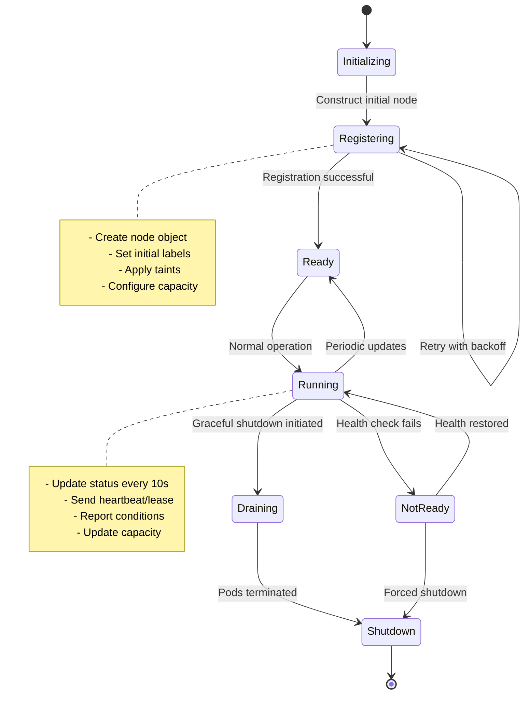
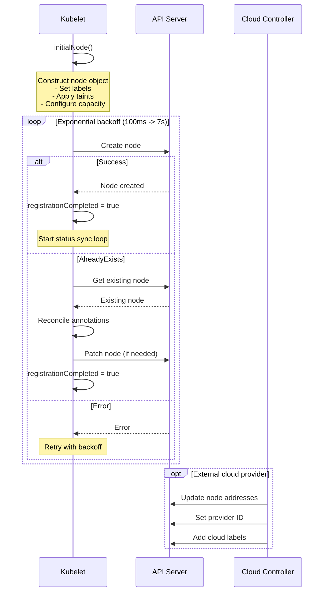
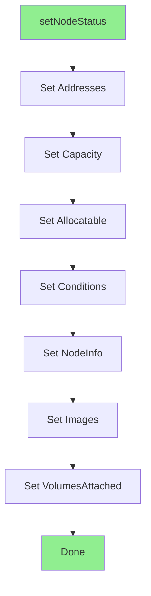
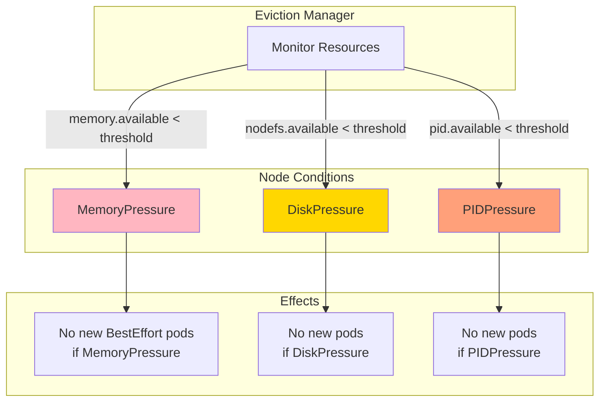
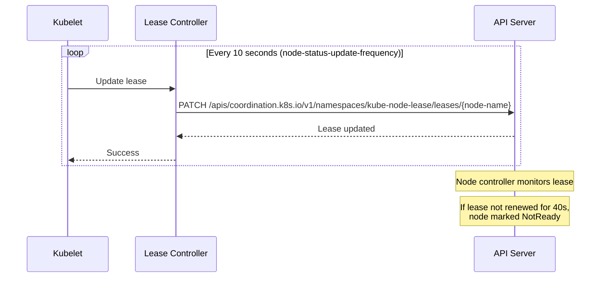
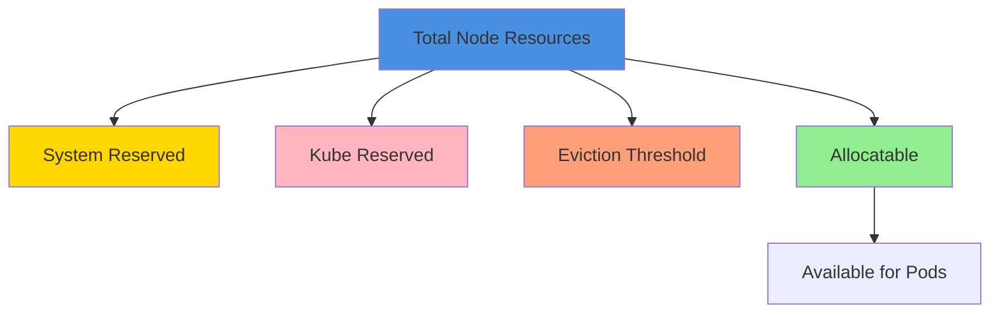
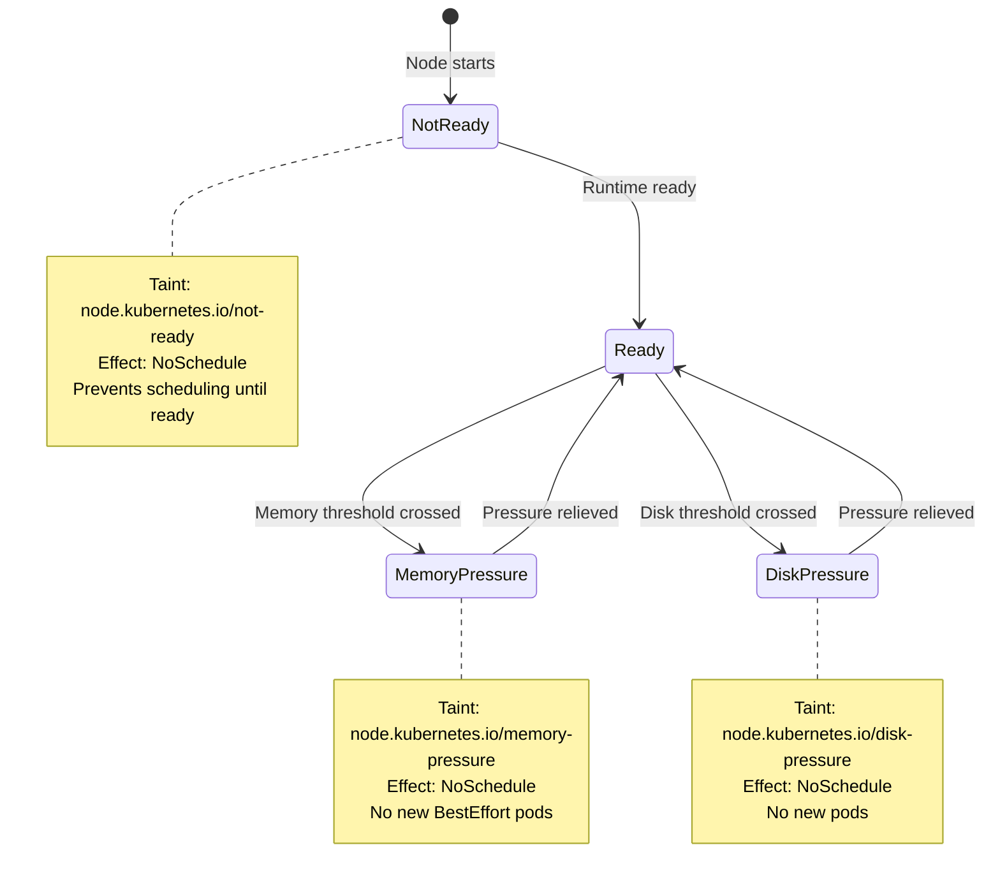
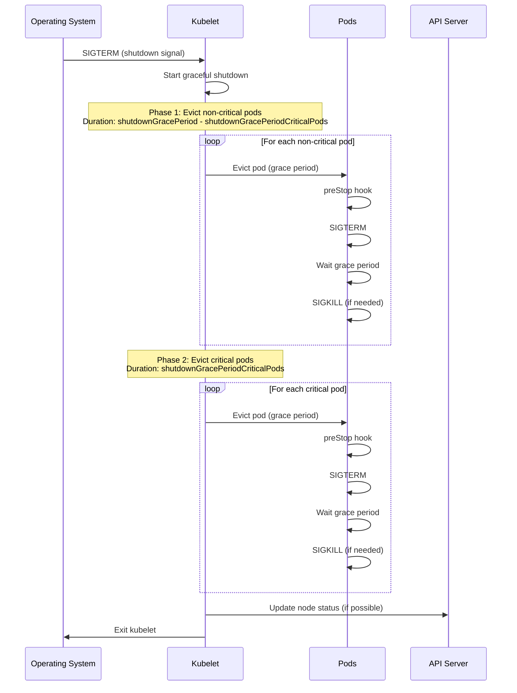
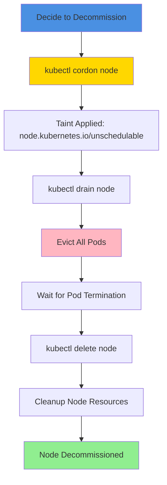

# Node Lifecycle

## Table of Contents
- [Overview](#overview)
- [Node Registration](#node-registration)
- [Node Status Updates](#node-status-updates)
- [Node Conditions](#node-conditions)
- [Node Heartbeat and Lease](#node-heartbeat-and-lease)
- [Node Capacity and Allocatable](#node-capacity-and-allocatable)
- [Node Information and Labels](#node-information-and-labels)
- [Node Taints and Tolerations](#node-taints-and-tolerations)
- [Graceful Node Shutdown](#graceful-node-shutdown)
- [Node Decommissioning](#node-decommissioning)
- [Node Not Ready Handling](#node-not-ready-handling)
- [Troubleshooting](#troubleshooting)
- [Best Practices](#best-practices)
- [Related Documentation](#related-documentation)

## Overview

The **Node Lifecycle** encompasses the complete journey of a Kubernetes node from initial registration through operational status updates to eventual decommissioning. The kubelet manages this lifecycle, ensuring the API server has an accurate view of node health, capacity, and availability.

### Lifecycle Phases



**File**: pkg/kubelet/kubelet_node_status.go:53

## Node Registration

### Registration Flow



**File**: pkg/kubelet/kubelet_node_status.go:53

### Register with API Server

```go
func (kl *Kubelet) registerWithAPIServer() {
    if kl.registrationCompleted {
        return
    }

    kl.nodeStartupLatencyTracker.RecordAttemptRegisterNode()

    step := 100 * time.Millisecond

    for {
        time.Sleep(step)
        // Exponential backoff: 100ms, 200ms, 400ms, ..., max 7s
        step = step * 2
        if step >= 7*time.Second {
            step = 7 * time.Second
        }

        node, err := kl.initialNode(context.TODO())
        if err != nil {
            klog.ErrorS(err, "Unable to construct v1.Node object for kubelet")
            continue
        }

        klog.InfoS("Attempting to register node", "node", klog.KObj(node))
        registered := kl.tryRegisterWithAPIServer(node)
        if registered {
            klog.InfoS("Successfully registered node", "node", klog.KObj(node))
            kl.registrationCompleted = true
            return
        }
    }
}
```

**File**: pkg/kubelet/kubelet_node_status.go:53

### Try Register Implementation

```go
func (kl *Kubelet) tryRegisterWithAPIServer(node *v1.Node) bool {
    _, err := kl.kubeClient.CoreV1().Nodes().Create(context.TODO(), node, metav1.CreateOptions{})
    if err == nil {
        kl.nodeStartupLatencyTracker.RecordRegisteredNewNode()
        return true
    }

    switch {
    case apierrors.IsAlreadyExists(err):
        // Node already exists, proceed to reconcile
    case apierrors.IsForbidden(err):
        klog.ErrorS(err, "Unable to register node, forbidden")
        return false
    default:
        klog.ErrorS(err, "Unable to register node")
        return false
    }

    // Node exists, get and reconcile
    existingNode, err := kl.kubeClient.CoreV1().Nodes().Get(context.TODO(), string(kl.nodeName), metav1.GetOptions{})
    if err != nil {
        klog.ErrorS(err, "Unable to get existing node")
        return false
    }

    originalNode := existingNode.DeepCopy()

    // Reconcile annotations and labels
    requiresUpdate := kl.reconcileCMADAnnotationWithExistingNode(node, existingNode)
    requiresUpdate = kl.updateDefaultLabels(node, existingNode) || requiresUpdate
    requiresUpdate = kl.reconcileExtendedResource(node, existingNode) || requiresUpdate
    requiresUpdate = kl.reconcileHugePageResource(node, existingNode) || requiresUpdate

    if requiresUpdate {
        if _, _, err := nodeutil.PatchNodeStatus(kl.kubeClient.CoreV1(), types.NodeName(kl.nodeName), originalNode, existingNode); err != nil {
            klog.ErrorS(err, "Unable to reconcile node")
            return false
        }
    }

    return true
}
```

**File**: pkg/kubelet/kubelet_node_status.go:90

### Initial Node Construction

```go
func (kl *Kubelet) initialNode(ctx context.Context) (*v1.Node, error) {
    node := &v1.Node{
        ObjectMeta: metav1.ObjectMeta{
            Name: string(kl.nodeName),
            Labels: map[string]string{
                v1.LabelHostname:      kl.hostname,
                v1.LabelOSStable:      goruntime.GOOS,
                v1.LabelArchStable:    goruntime.GOARCH,
                kubeletapis.LabelOS:   goruntime.GOOS,
                kubeletapis.LabelArch: goruntime.GOARCH,
            },
        },
    }

    // Add OS-specific labels
    osLabels, err := getOSSpecificLabels()
    if err != nil {
        return nil, err
    }
    for label, value := range osLabels {
        node.Labels[label] = value
    }

    // Apply initial taints
    nodeTaints := make([]v1.Taint, len(kl.registerWithTaints))
    copy(nodeTaints, kl.registerWithTaints)

    // Add unschedulable taint if needed
    if node.Spec.Unschedulable {
        unschedulableTaint := v1.Taint{
            Key:    v1.TaintNodeUnschedulable,
            Effect: v1.TaintEffectNoSchedule,
        }
        nodeTaints = append(nodeTaints, unschedulableTaint)
    }

    // Add cloud provider taint (removed by CCM when ready)
    if kl.externalCloudProvider {
        taint := v1.Taint{
            Key:    cloudproviderapi.TaintExternalCloudProvider,
            Value:  "true",
            Effect: v1.TaintEffectNoSchedule,
        }
        nodeTaints = append(nodeTaints, taint)
    }

    if len(nodeTaints) > 0 {
        node.Spec.Taints = nodeTaints
    }

    // Set controller-managed attach-detach annotation
    if kl.enableControllerAttachDetach {
        if node.Annotations == nil {
            node.Annotations = make(map[string]string)
        }
        node.Annotations[volutil.ControllerManagedAttachAnnotation] = "true"
    }

    // Apply user-specified labels
    for k, v := range kl.nodeLabels {
        node.ObjectMeta.Labels[k] = v
    }

    // Set provider ID (cloud-specific)
    if kl.providerID != "" {
        node.Spec.ProviderID = kl.providerID
    }

    // Set initial status (capacity, conditions, addresses, etc.)
    kl.setNodeStatus(ctx, node)

    return node, nil
}
```

**File**: pkg/kubelet/kubelet_node_status.go:302

## Node Status Updates

### Status Sync Loop

```go
const (
    nodeStatusUpdateRetry       = 5                        // Retries for status update
    nodeStatusUpdateFrequency   = 10 * time.Second        // Default update frequency
    nodeStatusReportFrequency   = 5 * time.Minute         // Report frequency for logs
    nodeStatusUpdateOnHeartbeat = true                    // Update on heartbeat
)

func (kl *Kubelet) syncNodeStatus() {
    ctx := context.TODO()
    kl.syncNodeStatusMux.Lock()
    defer kl.syncNodeStatusMux.Unlock()

    if kl.kubeClient == nil || kl.heartbeatClient == nil {
        return
    }

    // Get existing node
    node, err := kl.heartbeatClient.CoreV1().Nodes().Get(ctx, string(kl.nodeName), metav1.GetOptions{})
    if err != nil {
        klog.ErrorS(err, "Unable to get node")
        return
    }

    originalNode := node.DeepCopy()
    if originalNode == nil {
        klog.ErrorS(nil, "Nil originalNode")
        return
    }

    // Update node status
    kl.setNodeStatus(ctx, node)

    // Check if update needed
    if !nodeStatusHasChanged(&originalNode.Status, &node.Status) {
        return
    }

    // Try to update
    if _, err := kl.patchNodeStatus(originalNode, node); err != nil {
        klog.ErrorS(err, "Unable to update node status")
    }
}
```

### Set Node Status

Node status includes:
- **Addresses**: Internal IP, external IP, hostname
- **Capacity**: CPU, memory, ephemeral storage, pods, devices
- **Allocatable**: Resources available for pods
- **Conditions**: Ready, MemoryPressure, DiskPressure, PIDPressure, NetworkUnavailable
- **NodeInfo**: OS, kernel, container runtime, kubelet version
- **Images**: List of available images



**Status Setters** (applied in order):
1. `NodeAddress` - IP addresses and hostname
2. `MachineInfo` - Capacity and allocatable resources
3. `VersionInfo` - Kubelet, OS, kernel versions
4. `DaemonEndpoints` - Kubelet API port
5. `Images` - Available container images
6. `GoRuntime` - Go runtime version
7. `ReadyCondition` - Node ready status
8. `MemoryPressureCondition` - Memory pressure
9. `DiskPressureCondition` - Disk pressure
10. `PIDPressureCondition` - PID pressure
11. `VolumesInUse` - Attached volumes

**File**: pkg/kubelet/nodestatus/setters.go:58

## Node Conditions

### Condition Types

| Condition | Type | Description |
|-----------|------|-------------|
| **Ready** | v1.NodeReady | Node is healthy and ready to accept pods |
| **MemoryPressure** | v1.NodeMemoryPressure | Node is under memory pressure |
| **DiskPressure** | v1.NodeDiskPressure | Node is under disk pressure |
| **PIDPressure** | v1.NodePIDPressure | Node is under PID pressure |
| **NetworkUnavailable** | v1.NodeNetworkUnavailable | Node network is unavailable |

### Condition Structure

```yaml
apiVersion: v1
kind: Node
metadata:
  name: worker-1
status:
  conditions:
  - type: Ready
    status: "True"
    lastHeartbeatTime: "2024-01-15T10:30:00Z"
    lastTransitionTime: "2024-01-15T10:00:00Z"
    reason: KubeletReady
    message: kubelet is posting ready status
  - type: MemoryPressure
    status: "False"
    lastHeartbeatTime: "2024-01-15T10:30:00Z"
    lastTransitionTime: "2024-01-15T10:00:00Z"
    reason: KubeletHasSufficientMemory
    message: kubelet has sufficient memory available
  - type: DiskPressure
    status: "False"
    lastHeartbeatTime: "2024-01-15T10:30:00Z"
    lastTransitionTime: "2024-01-15T10:00:00Z"
    reason: KubeletHasNoDiskPressure
    message: kubelet has no disk pressure
  - type: PIDPressure
    status: "False"
    lastHeartbeatTime: "2024-01-15T10:30:00Z"
    lastTransitionTime: "2024-01-15T10:00:00Z"
    reason: KubeletHasSufficientPID
    message: kubelet has sufficient PID available
```

### Ready Condition

The `Ready` condition indicates whether the node can accept new pods.

**Reasons for Ready=True**:
- Runtime (containerd/CRI-O) is operational
- Container networking is functional
- Kubelet is running normally

**Reasons for Ready=False**:
- `KubeletNotReady`: Runtime not ready, network issues
- `RuntimeNotReady`: Container runtime is down
- `NetworkPluginNotReady`: CNI plugin not ready

**Reasons for Ready=Unknown**:
- Node controller hasn't heard from kubelet (typically after 40s)

### Resource Pressure Conditions



**Related**: See [Eviction Management](11-eviction.md)

## Node Heartbeat and Lease

### Node Lease Mechanism

Starting in Kubernetes 1.14, nodes use the **Lease API** for heartbeats instead of updating the entire node object. This significantly reduces API server load.



### Lease Object

```yaml
apiVersion: coordination.k8s.io/v1
kind: Lease
metadata:
  name: worker-1
  namespace: kube-node-lease
spec:
  holderIdentity: worker-1
  leaseDurationSeconds: 40
  renewTime: "2024-01-15T10:30:15Z"
```

### Configuration

```yaml
apiVersion: kubelet.config.k8s.io/v1beta1
kind: KubeletConfiguration

# Status update frequency (also lease update frequency)
nodeStatusUpdateFrequency: 10s

# Report frequency for logging
nodeStatusReportFrequency: 5m

# Lease duration
nodeLeaseDurationSeconds: 40
```

### Lease vs. Node Status Update

| Aspect | Node Lease | Node Status Update |
|--------|------------|-------------------|
| **Frequency** | Every 10s | Every 10s (if changed) |
| **Size** | ~200 bytes | ~10-50KB |
| **API Load** | Minimal | Higher |
| **Purpose** | Heartbeat only | Full status sync |
| **Failure Impact** | Node marked NotReady | Node status stale |

## Node Capacity and Allocatable

### Capacity vs. Allocatable



**Formula**:
```
Allocatable = Capacity - System Reserved - Kube Reserved - Eviction Threshold
```

### Node Capacity

```yaml
status:
  capacity:
    cpu: "4"
    ephemeral-storage: "100Gi"
    hugepages-1Gi: "0"
    hugepages-2Mi: "0"
    memory: "16Gi"
    pods: "110"
    nvidia.com/gpu: "1"
```

**Capacity Sources**:
- **CPU/Memory**: From cAdvisor machine info
- **Ephemeral Storage**: From container manager
- **Pods**: From kubelet config (`maxPods` or `podsPerCore`)
- **Devices**: From device plugins (GPU, FPGA, etc.)

**File**: pkg/kubelet/nodestatus/setters.go:194

### Node Allocatable

```yaml
status:
  allocatable:
    cpu: "3800m"
    ephemeral-storage: "90Gi"
    memory: "14Gi"
    pods: "110"
    nvidia.com/gpu: "1"
```

**Configuration**:
```yaml
apiVersion: kubelet.config.k8s.io/v1beta1
kind: KubeletConfiguration

# System reserved (OS, system daemons)
systemReserved:
  cpu: 100m
  memory: 1Gi
  ephemeral-storage: 5Gi

# Kube reserved (kubelet, container runtime)
kubeReserved:
  cpu: 100m
  memory: 1Gi
  ephemeral-storage: 5Gi

# Enforce reservations
enforceNodeAllocatable:
- pods
- system-reserved
- kube-reserved

# Eviction thresholds (soft are not subtracted from allocatable)
evictionHard:
  memory.available: "100Mi"
  nodefs.available: "10%"
```

## Node Information and Labels

### NodeInfo

```yaml
status:
  nodeInfo:
    architecture: amd64
    bootID: a1b2c3d4-e5f6-7890-abcd-ef1234567890
    containerRuntimeVersion: containerd://1.7.0
    kernelVersion: 5.15.0-100-generic
    kubeProxyVersion: v1.28.0
    kubeletVersion: v1.28.0
    machineID: 12345678901234567890123456789012
    operatingSystem: linux
    osImage: Ubuntu 22.04.3 LTS
    systemUUID: a1b2c3d4-e5f6-7890-abcd-ef1234567890
```

### Standard Labels

```yaml
metadata:
  labels:
    # Topology
    kubernetes.io/hostname: worker-1
    topology.kubernetes.io/region: us-west-2
    topology.kubernetes.io/zone: us-west-2a

    # Instance type
    node.kubernetes.io/instance-type: m5.xlarge

    # OS and arch
    kubernetes.io/os: linux
    kubernetes.io/arch: amd64

    # Beta labels (deprecated but still used)
    beta.kubernetes.io/os: linux
    beta.kubernetes.io/arch: amd64
    beta.kubernetes.io/instance-type: m5.xlarge
    failure-domain.beta.kubernetes.io/region: us-west-2
    failure-domain.beta.kubernetes.io/zone: us-west-2a
```

### Custom Labels

```bash
# Via kubelet flags
kubelet \
  --node-labels=environment=production,tier=backend,app-type=database

# Or via KubeletConfiguration
```

```yaml
apiVersion: kubelet.config.k8s.io/v1beta1
kind: KubeletConfiguration
nodeLabels:
  environment: production
  tier: backend
  app-type: database
```

**Restrictions**:
- Cannot set reserved labels (kubernetes.io/*, k8s.io/*)
- Maximum 63 characters per label value
- Must follow DNS subdomain format

## Node Taints and Tolerations

### Initial Taints

```go
// Applied during node registration
taints := []v1.Taint{
    {
        Key:    "node.kubernetes.io/not-ready",
        Effect: v1.TaintEffectNoSchedule,
    },
    {
        Key:    "node.cloudprovider.kubernetes.io/uninitialized",
        Value:  "true",
        Effect: v1.TaintEffectNoSchedule,
    },
}
```

### Taint Lifecycle



### Common Taints

| Taint Key | Effect | Applied When |
|-----------|--------|--------------|
| `node.kubernetes.io/not-ready` | NoSchedule | Node not ready |
| `node.kubernetes.io/unreachable` | NoSchedule | Node unreachable |
| `node.kubernetes.io/memory-pressure` | NoSchedule | Memory pressure detected |
| `node.kubernetes.io/disk-pressure` | NoSchedule | Disk pressure detected |
| `node.kubernetes.io/pid-pressure` | NoSchedule | PID pressure detected |
| `node.kubernetes.io/network-unavailable` | NoSchedule | Network unavailable |
| `node.kubernetes.io/unschedulable` | NoSchedule | Node cordoned |
| `node.cloudprovider.kubernetes.io/uninitialized` | NoSchedule | Cloud provider not initialized |

## Graceful Node Shutdown

### Shutdown Detection

Kubelet can detect system shutdowns and gracefully terminate pods.

```yaml
apiVersion: kubelet.config.k8s.io/v1beta1
kind: KubeletConfiguration

# Enable graceful shutdown
shutdownGracePeriod: 30s
shutdownGracePeriodCriticalPods: 10s
```

### Shutdown Flow



### Priority-Based Shutdown

Pods are terminated in priority order:
1. **BestEffort** (lowest priority)
2. **Burstable**
3. **Guaranteed**
4. **Critical pods** (system-node-critical, system-cluster-critical)

## Node Decommissioning

### Drain Node

```bash
# Cordon node (prevent new pods)
kubectl cordon worker-1

# Drain node (evict existing pods)
kubectl drain worker-1 \
  --ignore-daemonsets \
  --delete-emptydir-data \
  --force \
  --grace-period=300
```

### Decommission Flow



### Delete Node

```bash
# Delete node object from API server
kubectl delete node worker-1

# Stop kubelet on the node
systemctl stop kubelet

# Clean up node resources (optional)
kubeadm reset
```

## Node Not Ready Handling

### Node Controller Behavior

The node controller monitors node health and takes action when nodes become unhealthy.

```yaml
# kube-controller-manager flags
--node-monitor-period=5s                    # Check node status every 5s
--node-monitor-grace-period=40s             # Wait 40s before marking NotReady
--pod-eviction-timeout=5m                   # Wait 5m before evicting pods
```

### Node Not Ready Timeline

```mermaid
gantt
    title Node Not Ready Timeline
    dateFormat ss
    axisFormat %Ss

    section Kubelet
    Stops updating status: 00, 10s

    section Node Controller
    Detect missing heartbeat: 10, 40s
    Mark NodeNotReady: 40, 1s
    Wait for recovery: 41, 300s
    Start pod eviction: 341, 60s

    section Scheduler
    Stop scheduling pods: 40, 361s
```



**Timeline**:
- **T+0s**: Kubelet stops (or network partition)
- **T+10s**: Last successful status update (lease renewal)
- **T+40s**: Node controller marks node NotReady (lease expired)
- **T+40s**: Scheduler stops placing new pods on node
- **T+5m40s**: Node controller starts evicting pods (pod-eviction-timeout)
- **T+6m40s**: Pods recreated on healthy nodes

## Troubleshooting

### Issue 1: Node Stuck in NotReady

**Symptoms**:
- `kubectl get nodes` shows NotReady
- Pods not scheduling to node

**Diagnosis**:
```bash
# Check node conditions
kubectl describe node <node-name>

# Check kubelet logs
journalctl -u kubelet -f

# Check kubelet status
systemctl status kubelet

# Check runtime
crictl info
```

**Common Causes**:
1. **Kubelet not running**: `systemctl start kubelet`
2. **Runtime issues**: Check containerd/CRI-O logs
3. **Network issues**: Check CNI plugin
4. **Certificate expiration**: Renew kubelet certificates

### Issue 2: Node Registration Fails

**Symptoms**:
- Node doesn't appear in `kubectl get nodes`
- Kubelet logs show registration errors

**Diagnosis**:
```bash
# Check kubelet logs
journalctl -u kubelet | grep -i register

# Check API server connectivity
curl -k https://<api-server>:6443/healthz

# Check kubelet config
cat /var/lib/kubelet/config.yaml
```

**Solutions**:
- Verify kubelet configuration
- Check API server address
- Verify authentication (kubeconfig)
- Check authorization (RBAC)

### Issue 3: Frequent Node NotReady Flapping

**Symptoms**:
- Node oscillates between Ready and NotReady
- Pods being evicted and rescheduled

**Diagnosis**:
```bash
# Check node events
kubectl get events --field-selector involvedObject.name=<node-name>

# Check kubelet resource usage
top
free -h
df -h
```

**Solutions**:
- Increase node resources
- Adjust eviction thresholds
- Check for memory/disk pressure
- Investigate kubelet crashes

## Best Practices

### 1. Monitor Node Health

```yaml
# Prometheus alerts
- alert: NodeNotReady
  expr: kube_node_status_condition{condition="Ready",status="true"} == 0
  for: 5m
  annotations:
    summary: "Node {{ $labels.node }} is not ready"

- alert: NodeMemoryPressure
  expr: kube_node_status_condition{condition="MemoryPressure",status="true"} == 1
  annotations:
    summary: "Node {{ $labels.node }} has memory pressure"
```

### 2. Configure Appropriate Reservations

```yaml
systemReserved:
  cpu: 200m
  memory: 512Mi
  ephemeral-storage: 1Gi

kubeReserved:
  cpu: 100m
  memory: 256Mi
  ephemeral-storage: 1Gi
```

### 3. Use Node Labels for Workload Placement

```yaml
# Label nodes by workload type
kubectl label nodes worker-1 workload=compute-intensive
kubectl label nodes worker-2 workload=memory-intensive

# Use node selectors
apiVersion: v1
kind: Pod
spec:
  nodeSelector:
    workload: compute-intensive
```

### 4. Implement Graceful Shutdown

```yaml
shutdownGracePeriod: 60s
shutdownGracePeriodCriticalPods: 20s
```

### 5. Regular Node Maintenance

```bash
# Drain before maintenance
kubectl drain <node-name> --ignore-daemonsets

# Perform maintenance
# (OS updates, hardware replacement, etc.)

# Uncordon after maintenance
kubectl uncordon <node-name>
```

## Related Documentation

- [Initialization and Startup](../high-level/05-initialization-startup.md) - Kubelet startup and initialization
- [Eviction Management](11-eviction.md) - Resource pressure and node conditions
- [Resource Management](08-resource-management.md) - Capacity and allocatable calculation

---

**File References**:
- pkg/kubelet/kubelet_node_status.go:53 - Node registration and status updates
- pkg/kubelet/nodestatus/setters.go:58 - Node status setters

**Last Updated**: 2025-10-21
**Kubernetes Version**: v1.32+
