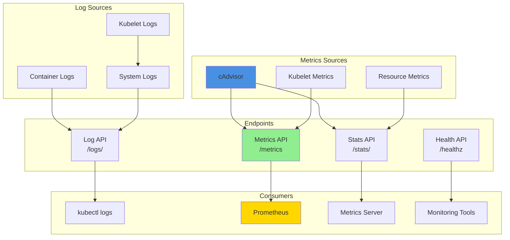
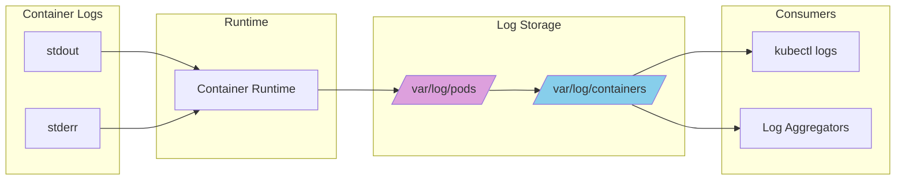
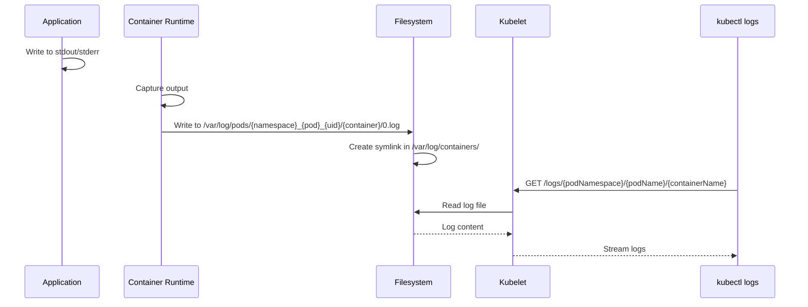
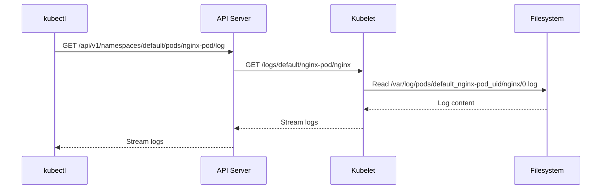

# Logging and Monitoring

## Table of Contents
- [Overview](#overview)
- [Logging Architecture](#logging-architecture)
- [Container Logging](#container-logging)
- [Kubelet Logging](#kubelet-logging)
- [Metrics Architecture](#metrics-architecture)
- [Kubelet Metrics](#kubelet-metrics)
- [cAdvisor Integration](#cadvisor-integration)
- [Resource Metrics](#resource-metrics)
- [Prometheus Integration](#prometheus-integration)
- [Health Endpoints](#health-endpoints)
- [Debugging and Profiling](#debugging-and-profiling)
- [Log Rotation and Management](#log-rotation-and-management)
- [Monitoring Best Practices](#monitoring-best-practices)
- [Troubleshooting](#troubleshooting)
- [Related Documentation](#related-documentation)

## Overview

Kubernetes logging and monitoring on the kubelet provides observability into node and pod health, resource usage, and operational metrics. The kubelet exposes multiple interfaces for logging, metrics collection, and debugging.

### Observability Stack



## Logging Architecture

### Log Types



### Log Directory Structure

```
/var/log/
├── pods/
│   ├── <namespace>_<pod-name>_<pod-uid>/
│   │   ├── <container-name>/
│   │   │   ├── 0.log           # Current log file
│   │   │   ├── 1.log           # Rotated log
│   │   │   └── 2.log.gz        # Compressed rotated log
│   │   └── ...
│   └── ...
├── containers/
│   ├── <pod-name>_<namespace>_<container-name>-<container-id>.log -> /var/log/pods/.../0.log
│   └── ...
└── ...
```

### Log Flow



## Container Logging

### Log API Endpoint

**Endpoint**: `http://localhost:10250/logs/{podNamespace}/{podName}/{containerName}`

**Query Parameters**:
- `follow`: Stream logs (boolean)
- `previous`: Get logs from previous container (boolean)
- `timestamps`: Include timestamps (boolean)
- `tailLines`: Number of lines from end (int)
- `sinceSeconds`: Logs since N seconds ago (int)
- `limitBytes`: Limit log size in bytes (int)

**Example**:
```bash
# Get last 100 lines
curl -k https://localhost:10250/logs/default/nginx-pod/nginx?tailLines=100

# Follow logs
curl -k https://localhost:10250/logs/default/nginx-pod/nginx?follow=true

# Get previous container logs
curl -k https://localhost:10250/logs/default/nginx-pod/nginx?previous=true
```

### kubectl logs Implementation

```bash
kubectl logs nginx-pod -c nginx
```

**Flow**:
1. `kubectl` calls API server
2. API server proxies request to kubelet
3. Kubelet streams logs from `/var/log/pods/`
4. Logs streamed back through API server to client



## Kubelet Logging

### Log Verbosity Levels

```bash
# Kubelet log levels (0-10)
kubelet --v=2  # Default
```

| Level | Description | Usage |
|-------|-------------|-------|
| 0 | Errors only | Production |
| 1 | Warnings | Production |
| 2 | Info (default) | Production |
| 3 | Extended info | Debugging |
| 4 | Debug | Detailed debugging |
| 5 | Trace | Very detailed |
| 6-10 | Ultra-verbose | Development only |

### Log Output

```bash
# Kubelet logs (systemd)
journalctl -u kubelet -f

# Kubelet logs (syslog)
tail -f /var/log/syslog | grep kubelet

# Kubelet logs (file)
tail -f /var/log/kubelet.log
```

### Structured Logging

Kubelet uses structured logging (klog):

```
I0121 10:30:15.123456       1 kubelet.go:2345] "Starting kubelet" version="v1.28.0"
I0121 10:30:15.234567       1 kubelet.go:2456] "Pod sync loop" syncDuration=100ms
E0121 10:30:15.345678       1 kubelet.go:2567] "Failed to sync pod" err="container not found" pod="default/nginx"
```

**Format**: `LEVEL MMDD HH:MM:SS.microseconds threadid file:line] message key=value ...`

- **LEVEL**: I (Info), W (Warning), E (Error), F (Fatal)
- **MMDD**: Month and day
- **HH:MM:SS**: Time
- **threadid**: Thread/goroutine ID
- **file:line**: Source file and line number
- **message**: Log message
- **key=value**: Structured fields

## Metrics Architecture

### Metrics Endpoints

```mermaid
graph TB
    subgraph "Kubelet Endpoints"
        ME[/metrics<br/>:10250/metrics]
        CE[/metrics/cadvisor<br/>:10250/metrics/cadvisor]
        PE[/metrics/probes<br/>:10250/metrics/probes]
        RE[/metrics/resource<br/>:10250/metrics/resource]
    end

    subgraph "Metrics Types"
        KM[Kubelet Operations]
        CM[Container Metrics]
        PM[Probe Results]
        RM[Resource Usage]
    end

    subgraph "Consumers"
        PROM[Prometheus]
        MS[Metrics Server]
    end

    ME --> KM
    CE --> CM
    PE --> PM
    RE --> RM

    KM --> PROM
    CM --> PROM
    PM --> PROM
    RM --> MS

    style ME fill:#90EE90
    style PROM fill:#FFD700
```

### /metrics Endpoint

**Kubelet operational metrics** (Prometheus format):

```bash
curl -k https://localhost:10250/metrics
```

**Sample Metrics**:
```prometheus
# Pod operations
kubelet_pod_start_duration_seconds_bucket{le="0.5"} 125
kubelet_pod_start_duration_seconds_count 150

# Container operations
kubelet_runtime_operations_total{operation_type="create_container"} 1250
kubelet_runtime_operations_duration_seconds{operation_type="create_container",quantile="0.99"} 0.5

# Volume operations
kubelet_volume_manager_total_volumes{state="actual_state_of_world"} 45

# Image operations
kubelet_image_garbage_collected_total{reason="age"} 10
kubelet_image_garbage_collected_total{reason="space"} 5

# Evictions
kubelet_evictions_total{signal="memory.available"} 2

# Node status
kubelet_node_status_update_total 1500
```

### /metrics/cadvisor Endpoint

**Container resource metrics** from cAdvisor:

```bash
curl -k https://localhost:10250/metrics/cadvisor
```

**Sample Metrics**:
```prometheus
# CPU usage
container_cpu_usage_seconds_total{namespace="default",pod="nginx",container="nginx"} 123.45

# Memory usage
container_memory_working_set_bytes{namespace="default",pod="nginx",container="nginx"} 134217728

# Network I/O
container_network_receive_bytes_total{namespace="default",pod="nginx"} 1048576
container_network_transmit_bytes_total{namespace="default",pod="nginx"} 2097152

# Filesystem usage
container_fs_usage_bytes{namespace="default",pod="nginx",container="nginx"} 536870912
```

### /metrics/probes Endpoint

**Probe (liveness, readiness, startup) metrics**:

```bash
curl -k https://localhost:10250/metrics/probes
```

**Sample Metrics**:
```prometheus
# Probe results
prober_probe_total{container="nginx",pod="nginx-pod",probe_type="Liveness",result="successful"} 150
prober_probe_total{container="nginx",pod="nginx-pod",probe_type="Readiness",result="successful"} 150

# Probe duration
prober_probe_duration_seconds{container="nginx",pod="nginx-pod",probe_type="Liveness",quantile="0.99"} 0.01
```

### /metrics/resource Endpoint

**Resource metrics for Metrics Server**:

```bash
curl -k https://localhost:10250/metrics/resource
```

**Format**: JSON (not Prometheus)

```json
{
  "node": {
    "nodeName": "worker-1",
    "cpu": {
      "time": "2024-01-21T10:30:00Z",
      "usageNanoCores": 250000000,
      "usageCoreNanoSeconds": 1234567890
    },
    "memory": {
      "time": "2024-01-21T10:30:00Z",
      "usageBytes": 2147483648,
      "workingSetBytes": 1610612736
    }
  },
  "pods": [
    {
      "podRef": {
        "name": "nginx",
        "namespace": "default",
        "uid": "abc-123"
      },
      "cpu": {
        "time": "2024-01-21T10:30:00Z",
        "usageNanoCores": 10000000,
        "usageCoreNanoSeconds": 123456789
      },
      "memory": {
        "time": "2024-01-21T10:30:00Z",
        "usageBytes": 134217728,
        "workingSetBytes": 104857600
      },
      "containers": [...]
    }
  ]
}
```

## Kubelet Metrics

### Key Metric Categories

#### 1. Pod Lifecycle Metrics

```prometheus
# Pod starts
kubelet_pod_start_duration_seconds_bucket
kubelet_pod_start_duration_seconds_count

# Pod worker operations
kubelet_pod_worker_duration_seconds_bucket

# Running pods
kubelet_running_pods
kubelet_running_containers

# Pod sync duration
kubelet_pod_sync_duration_seconds
```

#### 2. Container Runtime Metrics

```prometheus
# Runtime operations
kubelet_runtime_operations_total{operation_type="create_container"}
kubelet_runtime_operations_total{operation_type="start_container"}
kubelet_runtime_operations_total{operation_type="stop_container"}
kubelet_runtime_operations_total{operation_type="remove_container"}

# Runtime operation duration
kubelet_runtime_operations_duration_seconds{operation_type="create_container"}

# Runtime errors
kubelet_runtime_operations_errors_total{operation_type="create_container"}
```

#### 3. Volume Metrics

```prometheus
# Volume manager
kubelet_volume_manager_total_volumes{state="actual_state_of_world"}
kubelet_volume_manager_total_volumes{state="desired_state_of_world"}

# Volume operations
volume_manager_total_volumes{plugin_name="kubernetes.io/csi",state="actual_state_of_world"}
```

#### 4. Image Metrics

```prometheus
# Image pulls
kubelet_image_pull_duration_seconds_bucket

# Image garbage collection
kubelet_image_garbage_collected_total{reason="age"}
kubelet_image_garbage_collected_total{reason="space"}
```

#### 5. Eviction Metrics

```prometheus
# Evictions by signal
kubelet_evictions_total{signal="memory.available"}
kubelet_evictions_total{signal="nodefs.available"}
```

## cAdvisor Integration

### cAdvisor Role

cAdvisor (Container Advisor) is embedded in kubelet and provides container resource usage and performance metrics.

```mermaid
graph TB
    subgraph "cAdvisor"
        COLLECT[Collect Metrics]
        AGGREGATE[Aggregate Data]
        EXPOSE[Expose Metrics]
    end

    subgraph "Data Sources"
        CGROUP[cgroups]
        PROC[/proc]
        NET[Network Stats]
    end

    subgraph "Consumers"
        KL[Kubelet]
        PROM[Prometheus]
        MS[Metrics Server]
    end

    CGROUP --> COLLECT
    PROC --> COLLECT
    NET --> COLLECT

    COLLECT --> AGGREGATE
    AGGREGATE --> EXPOSE

    EXPOSE --> KL
    EXPOSE --> PROM
    EXPOSE --> MS

    style COLLECT fill:#4A90E2
    style EXPOSE fill:#90EE90
```

### cAdvisor Metrics

```prometheus
# CPU metrics
container_cpu_usage_seconds_total
container_cpu_system_seconds_total
container_cpu_user_seconds_total
container_cpu_cfs_throttled_seconds_total

# Memory metrics
container_memory_usage_bytes
container_memory_working_set_bytes
container_memory_rss
container_memory_cache
container_memory_swap

# Network metrics
container_network_receive_bytes_total
container_network_transmit_bytes_total
container_network_receive_packets_total
container_network_transmit_packets_total

# Filesystem metrics
container_fs_usage_bytes
container_fs_limit_bytes
container_fs_reads_total
container_fs_writes_total
```

## Resource Metrics

### Summary API

**Endpoint**: `http://localhost:10250/stats/summary`

Provides aggregated resource statistics for node and pods.

```bash
curl -k https://localhost:10250/stats/summary
```

**Response**:
```json
{
  "node": {
    "nodeName": "worker-1",
    "startTime": "2024-01-20T00:00:00Z",
    "cpu": {
      "time": "2024-01-21T10:30:00Z",
      "usageNanoCores": 500000000,
      "usageCoreNanoSeconds": 123456789000
    },
    "memory": {
      "time": "2024-01-21T10:30:00Z",
      "availableBytes": 4294967296,
      "usageBytes": 8589934592,
      "workingSetBytes": 6442450944,
      "rssBytes": 5368709120,
      "pageFaults": 1000000,
      "majorPageFaults": 100
    },
    "network": {
      "time": "2024-01-21T10:30:00Z",
      "name": "eth0",
      "rxBytes": 1073741824,
      "txBytes": 2147483648
    },
    "fs": {
      "time": "2024-01-21T10:30:00Z",
      "availableBytes": 53687091200,
      "capacityBytes": 107374182400,
      "usedBytes": 53687091200
    }
  },
  "pods": [...]
}
```

## Prometheus Integration

### Scrape Configuration

```yaml
# Prometheus config
scrape_configs:
- job_name: 'kubelet'
  scheme: https
  tls_config:
    ca_file: /var/run/secrets/kubernetes.io/serviceaccount/ca.crt
  bearer_token_file: /var/run/secrets/kubernetes.io/serviceaccount/token

  kubernetes_sd_configs:
  - role: node

  relabel_configs:
  - source_labels: [__address__]
    regex: '(.*):10250'
    replacement: '${1}:10250'
    target_label: __address__
  - source_labels: [__meta_kubernetes_node_name]
    target_label: node

- job_name: 'kubelet-cadvisor'
  scheme: https
  tls_config:
    ca_file: /var/run/secrets/kubernetes.io/serviceaccount/ca.crt
  bearer_token_file: /var/run/secrets/kubernetes.io/serviceaccount/token

  kubernetes_sd_configs:
  - role: node

  relabel_configs:
  - source_labels: [__address__]
    regex: '(.*):10250'
    replacement: '${1}:10250'
    target_label: __address__
  - source_labels: [__meta_kubernetes_node_name]
    target_label: node

  metrics_path: /metrics/cadvisor
```

### Example PromQL Queries

```promql
# CPU usage by pod
sum(rate(container_cpu_usage_seconds_total{namespace="default"}[5m])) by (pod)

# Memory usage by pod
sum(container_memory_working_set_bytes{namespace="default"}) by (pod)

# Network receive rate by pod
sum(rate(container_network_receive_bytes_total{namespace="default"}[5m])) by (pod)

# Pod start latency (p99)
histogram_quantile(0.99, kubelet_pod_start_duration_seconds_bucket)

# Container creation errors
rate(kubelet_runtime_operations_errors_total{operation_type="create_container"}[5m])
```

## Health Endpoints

### /healthz

**Purpose**: Liveness check for kubelet

```bash
curl http://localhost:10248/healthz
```

**Response**: `ok` (200 OK) or error (503 Service Unavailable)

### /healthz/log

**Purpose**: Health check for logging

```bash
curl http://localhost:10248/healthz/log
```

### /healthz/syncloop

**Purpose**: Health check for pod sync loop

```bash
curl http://localhost:10248/healthz/syncloop
```

**Implementation**:
- Checks if sync loop is running
- Monitors last successful sync time
- Returns unhealthy if sync loop stuck

## Debugging and Profiling

### Debug Endpoints

#### /debug/pprof

**CPU profiling**:
```bash
# 30-second CPU profile
curl -k https://localhost:10250/debug/pprof/profile?seconds=30 > cpu.pprof

# Analyze
go tool pprof cpu.pprof
```

**Heap profiling**:
```bash
curl -k https://localhost:10250/debug/pprof/heap > heap.pprof
go tool pprof heap.pprof
```

**Goroutine dump**:
```bash
curl -k https://localhost:10250/debug/pprof/goroutine?debug=2
```

#### /configz

**View kubelet configuration**:
```bash
curl -k https://localhost:10250/configz
```

#### /run

**Execute commands in pod containers** (requires authentication):
```bash
# Not recommended for production
```

## Log Rotation and Management

### Container Log Rotation

```yaml
apiVersion: kubelet.config.k8s.io/v1beta1
kind: KubeletConfiguration

# Maximum size before rotation
containerLogMaxSize: 10Mi

# Maximum number of old log files to keep
containerLogMaxFiles: 5
```

**Behavior**:
- When log file reaches `containerLogMaxSize`, it's rotated
- Old files renamed: `0.log` → `1.log`, `1.log` → `2.log`, etc.
- Files beyond `containerLogMaxFiles` are deleted
- Oldest files may be compressed (`.gz`)

### Example Rotation

```
# Before rotation (0.log = 10Mi)
/var/log/pods/default_nginx_uid/nginx/
├── 0.log (10Mi)
├── 1.log (10Mi)
└── 2.log.gz (3Mi compressed)

# After rotation
/var/log/pods/default_nginx_uid/nginx/
├── 0.log (0 bytes, new file)
├── 1.log (10Mi, was 0.log)
├── 2.log (10Mi, was 1.log)
└── 3.log.gz (3Mi, was 2.log.gz, deleted if maxFiles=3)
```

### Kubelet Log Rotation

Kubelet logs (systemd journal) are rotated by systemd:

```bash
# journald config
/etc/systemd/journald.conf

[Journal]
SystemMaxUse=1G
RuntimeMaxUse=100M
```

## Monitoring Best Practices

### 1. Essential Metrics to Monitor

```yaml
# Prometheus recording rules
groups:
- name: kubelet
  interval: 30s
  rules:
  # Pod start latency
  - record: kubelet:pod_start_duration:p99
    expr: histogram_quantile(0.99, kubelet_pod_start_duration_seconds_bucket)

  # Container creation rate
  - record: kubelet:container_create_rate
    expr: rate(kubelet_runtime_operations_total{operation_type="create_container"}[5m])

  # Memory usage percentage
  - record: node:memory_usage:percent
    expr: (1 - node_memory_MemAvailable_bytes / node_memory_MemTotal_bytes) * 100

  # Disk usage percentage
  - record: node:disk_usage:percent
    expr: (1 - node_filesystem_avail_bytes / node_filesystem_size_bytes) * 100
```

### 2. Critical Alerts

```yaml
groups:
- name: kubelet_alerts
  rules:
  - alert: KubeletDown
    expr: up{job="kubelet"} == 0
    for: 5m
    annotations:
      summary: "Kubelet is down on {{ $labels.node }}"

  - alert: KubeletTooManyPods
    expr: kubelet_running_pods > 100
    for: 10m
    annotations:
      summary: "Kubelet running {{ $value }} pods on {{ $labels.node }}"

  - alert: HighPodStartLatency
    expr: histogram_quantile(0.99, kubelet_pod_start_duration_seconds_bucket) > 60
    for: 10m
    annotations:
      summary: "High pod start latency ({{ $value }}s) on {{ $labels.node }}"

  - alert: ContainerCreationErrors
    expr: rate(kubelet_runtime_operations_errors_total{operation_type="create_container"}[5m]) > 0.01
    for: 5m
    annotations:
      summary: "Container creation errors on {{ $labels.node }}"
```

### 3. Resource Monitoring

```bash
# Top pods by CPU
kubectl top pods --all-namespaces --sort-by=cpu

# Top pods by memory
kubectl top pods --all-namespaces --sort-by=memory

# Top nodes
kubectl top nodes
```

## Troubleshooting

### Issue 1: kubectl logs Not Working

**Symptoms**:
- `kubectl logs` returns errors
- Cannot view container logs

**Diagnosis**:
```bash
# Check kubelet logs endpoint
curl -k https://localhost:10250/logs/default/nginx-pod/nginx

# Check log files exist
ls -la /var/log/pods/default_nginx-pod_uid/nginx/

# Check container runtime
crictl logs <container-id>
```

**Solutions**:
- Verify kubelet is running
- Check log file permissions
- Ensure container runtime is working

### Issue 2: Metrics Not Scraped

**Symptoms**:
- Prometheus not scraping kubelet
- Missing metrics in Prometheus

**Diagnosis**:
```bash
# Test metrics endpoint
curl -k https://localhost:10250/metrics

# Check Prometheus targets
# Prometheus UI: Status > Targets

# Check kubelet authentication
curl -k --cert /path/to/client.crt --key /path/to/client.key https://localhost:10250/metrics
```

**Solutions**:
- Verify Prometheus RBAC permissions
- Check TLS certificates
- Verify kubelet authentication mode

### Issue 3: High Kubelet CPU/Memory

**Symptoms**:
- Kubelet consuming excessive resources
- Node performance degraded

**Diagnosis**:
```bash
# Check kubelet resource usage
top -p $(pgrep kubelet)

# CPU profiling
curl -k https://localhost:10250/debug/pprof/profile?seconds=30 > cpu.pprof
go tool pprof -http=:8080 cpu.pprof

# Memory profiling
curl -k https://localhost:10250/debug/pprof/heap > heap.pprof
go tool pprof -http=:8080 heap.pprof
```

**Solutions**:
- Reduce log verbosity (`--v=2` instead of `--v=4`)
- Increase `--kube-api-qps` and `--kube-api-burst`
- Check for pod churn (frequent creates/deletes)
- Investigate memory leaks (upgrade kubelet)

## Related Documentation

- [PLEG](02-pleg.md) - Container state change events
- [Status Manager](12-status-manager.md) - Pod status updates and sync latency
- [Eviction](11-eviction.md) - Eviction metrics
- [Garbage Collection](13-garbage-collection.md) - GC metrics

---

**Last Updated**: 2025-10-21
**Kubernetes Version**: v1.32+
