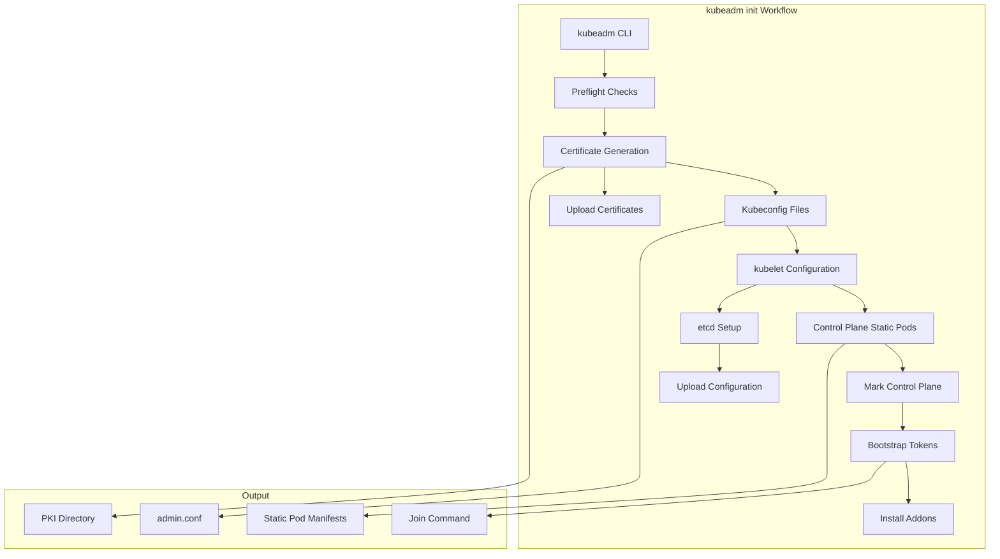
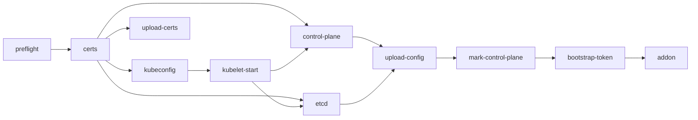
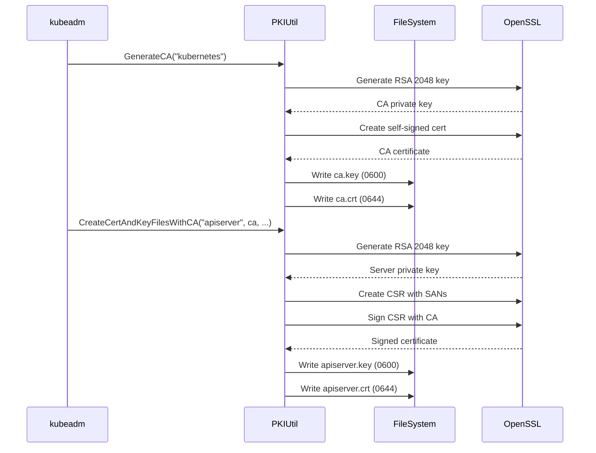
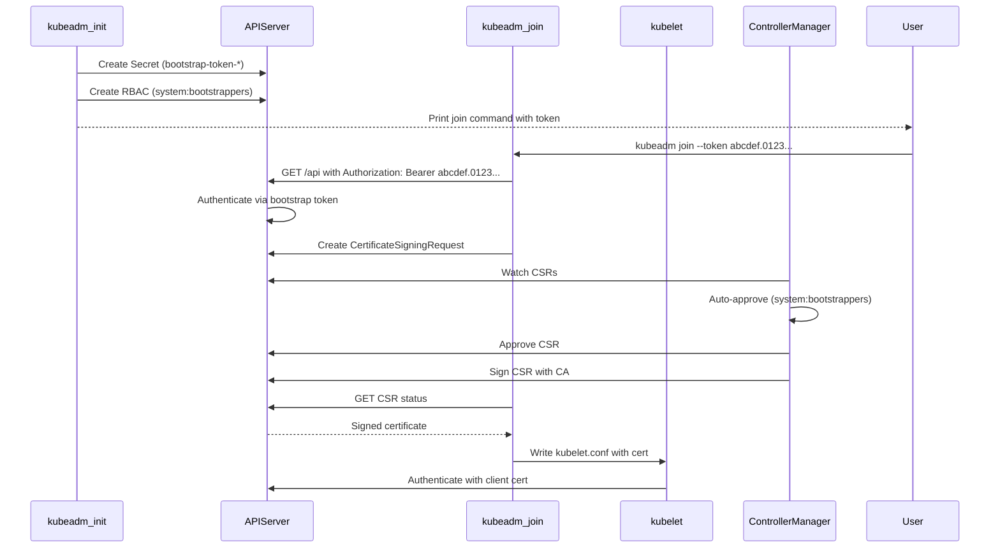
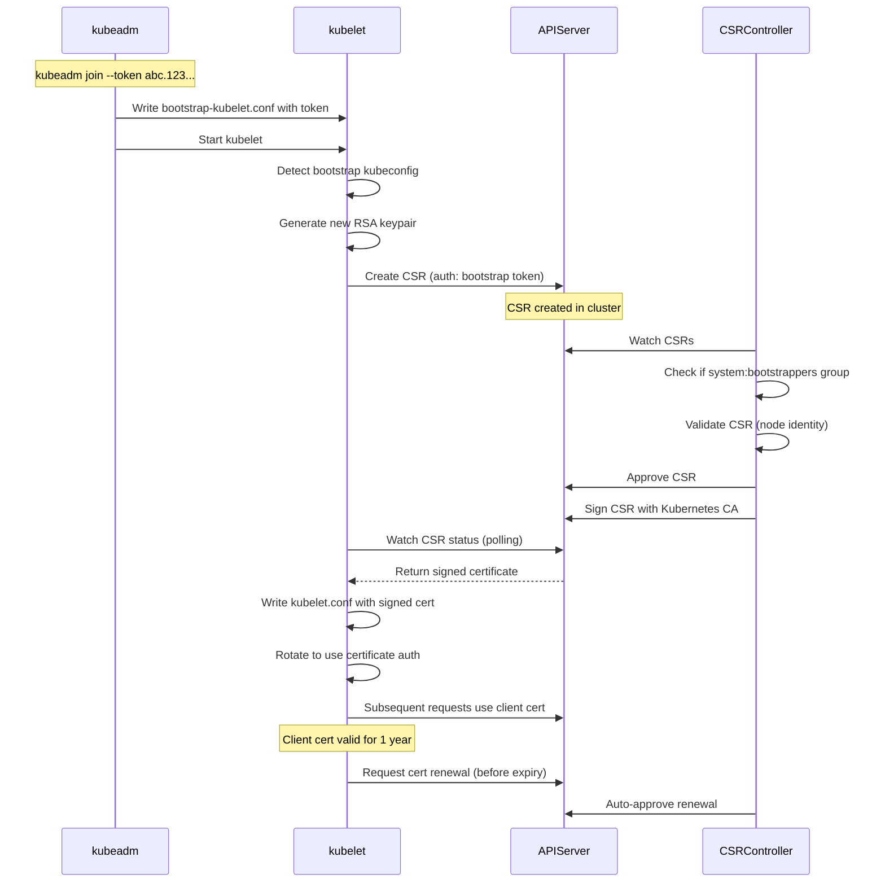
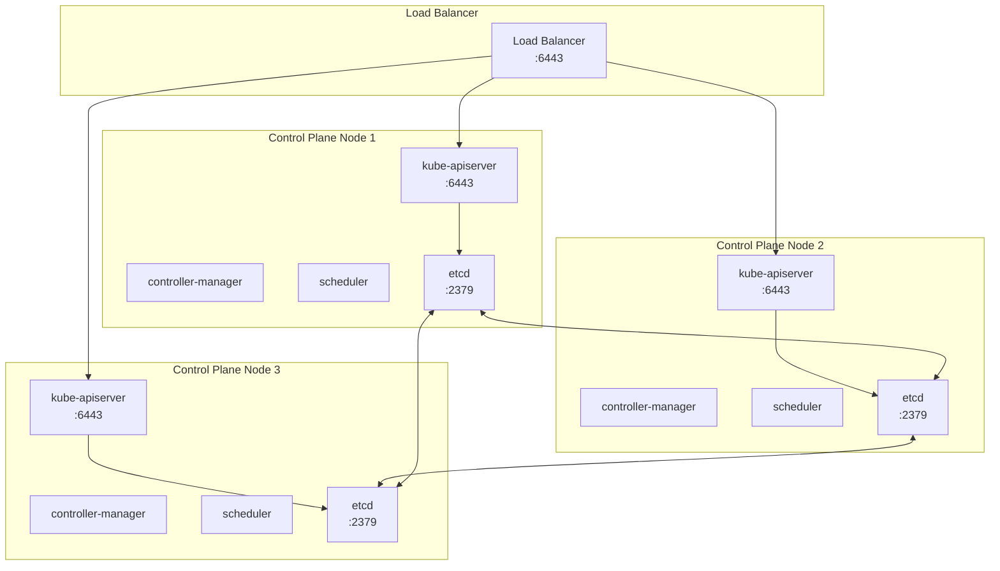
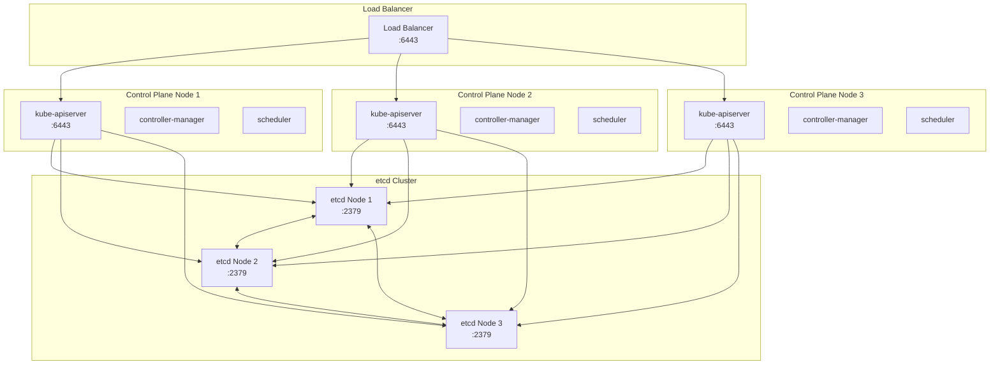

# **KUBEADM ARCHITECTURE**

**Deep Dive into Kubernetes Cluster Bootstrap for Platform Engineers**

━━━━━━━━━━━━━━━━━━━━━━━━━━━━━━━━━━━━━━━━━━━━━━━━━━━━━━━━━━━━━━━━━━━━━━━━━━━━━━

## **🎯 Purpose**

This document provides a comprehensive architectural analysis of kubeadm, the official Kubernetes cluster bootstrapping tool. This is NOT a user guide - it's deep technical documentation for platform engineers, architects, and contributors who need to understand how cluster initialization works at the source code level.

**Target Audience**:
- Platform engineers building custom cluster provisioning tools
- Architects designing enterprise Kubernetes platforms
- SREs operating production clusters at scale (5000+ nodes)
- Open source contributors to kubernetes/kubernetes
- Anyone implementing alternative bootstrap mechanisms

**What You'll Learn**:
- ✅ Why kubeadm uses phase-based architecture
- ✅ How certificate generation and distribution works internally
- ✅ Bootstrap token mechanics and security model
- ✅ kubelet TLS bootstrap workflow with code references
- ✅ Static pod manifest generation and lifecycle
- ✅ HA topology design decisions (stacked vs external etcd)
- ✅ How to debug kubeadm at source code level

━━━━━━━━━━━━━━━━━━━━━━━━━━━━━━━━━━━━━━━━━━━━━━━━━━━━━━━━━━━━━━━━━━━━━━━━━━━━━━

## **📐 kubeadm Design Philosophy**

### **Why kubeadm Exists**

**Problem Statement**: Before kubeadm (pre-Kubernetes 1.4), bootstrapping a cluster required:
- Manual certificate generation with openssl/cfssl
- Hand-crafted systemd units or static pod manifests
- Complex shell scripts (kube-up.sh) that were cloud-provider specific
- Deep knowledge of component flags and configuration

**kubeadm Goals**:
1. **Simplicity**: Reduce cluster bootstrap to `kubeadm init` and `kubeadm join`
2. **Composability**: Phase-based design allowing individual phase execution
3. **Cloud Agnostic**: Work on any infrastructure (bare metal, VMs, cloud)
4. **Production Ready**: Generate secure defaults, proper certificates
5. **Extensibility**: Configuration API for customization
6. **Idempotency**: Safe to re-run phases without corruption

**Code Location**: `cmd/kubeadm/` and `cmd/kubeadm/app/`

### **Design Principles**

**1. Phase-Based Architecture**

kubeadm decomposes cluster initialization into discrete phases:
- Each phase is independently executable
- Phases have explicit dependencies
- Idempotent operations (safe to retry)
- Enables partial cluster setup and debugging

**Why Phases?**
```
Traditional approach: Monolithic bootstrap script
- Hard to debug (which step failed?)
- Hard to customize (modify entire script)
- Hard to test (all-or-nothing)

kubeadm approach: Composable phases
- Debug specific phase (kubeadm init phase certs)
- Skip phases (--skip-phases=addon)
- Customize individual phases
- Test phases independently
```

**2. Declarative Configuration**

kubeadm uses a Configuration API (v1beta3) rather than imperative flags:
- Version control friendly (YAML in git)
- Reviewable and auditable
- Composable with GitOps workflows
- Type-safe with API validation

**3. Secure by Default**

- Generates unique certificates per cluster
- Strong CA private key protection (600 permissions)
- Bootstrap tokens with limited lifetime
- RBAC enabled by default
- Pod Security admission configured

━━━━━━━━━━━━━━━━━━━━━━━━━━━━━━━━━━━━━━━━━━━━━━━━━━━━━━━━━━━━━━━━━━━━━━━━━━━━━━

## **🏗️ Architecture Overview**

### **Component Relationships**



### **Key Abstractions**

| Abstraction | Purpose | Code Location |
|-------------|---------|---------------|
| **InitConfiguration** | Node-specific settings for `kubeadm init` | `cmd/kubeadm/app/apis/kubeadm/v1beta3/types.go` |
| **ClusterConfiguration** | Cluster-wide settings | `cmd/kubeadm/app/apis/kubeadm/v1beta3/types.go` |
| **JoinConfiguration** | Settings for `kubeadm join` | `cmd/kubeadm/app/apis/kubeadm/v1beta3/types.go` |
| **Phase** | Individual initialization step | `cmd/kubeadm/app/cmd/phases/` |
| **CertificateAuthority** | PKI operations | `cmd/kubeadm/app/util/pkiutil/` |

━━━━━━━━━━━━━━━━━━━━━━━━━━━━━━━━━━━━━━━━━━━━━━━━━━━━━━━━━━━━━━━━━━━━━━━━━━━━━━

## **⚙️ Phase-Based Initialization**

### **Complete Phase Inventory**

`kubeadm init` executes these phases in order:

| Phase | Description | Idempotent | Source |
|-------|-------------|------------|--------|
| **preflight** | Pre-flight checks (ports, swap, etc.) | Yes | `cmd/kubeadm/app/phases/preflight/` |
| **certs** | Generate all PKI certificates | Yes | `cmd/kubeadm/app/phases/certs/` |
| **kubeconfig** | Generate kubeconfig files | Yes | `cmd/kubeadm/app/phases/kubeconfig/` |
| **kubelet-start** | Write kubelet config, start kubelet | Yes | `cmd/kubeadm/app/phases/kubelet/` |
| **control-plane** | Generate static pod manifests | Yes | `cmd/kubeadm/app/phases/controlplane/` |
| **etcd** | Generate etcd static pod manifest | Yes | `cmd/kubeadm/app/phases/etcd/` |
| **upload-config** | Upload kubeadm/kubelet configs to cluster | Partial | `cmd/kubeadm/app/phases/uploadconfig/` |
| **upload-certs** | Upload certificates to Secret (HA) | Yes | `cmd/kubeadm/app/phases/uploadcerts/` |
| **mark-control-plane** | Label and taint control plane node | Yes | `cmd/kubeadm/app/phases/markcontrolplane/` |
| **bootstrap-token** | Generate bootstrap tokens | Yes | `cmd/kubeadm/app/phases/bootstraptoken/` |
| **kubelet-finalize** | Update kubelet settings post-TLS bootstrap | Partial | `cmd/kubeadm/app/phases/kubeletfinalize/` |
| **addon** | Install CoreDNS and kube-proxy | Partial | `cmd/kubeadm/app/phases/addons/` |

### **Phase Dependencies**



### **Running Individual Phases**

**Use Case**: Debugging certificate generation without re-initializing entire cluster

```bash
# Run only certificate generation phase
kubeadm init phase certs all

# Run specific certificate (e.g., only apiserver cert)
kubeadm init phase certs apiserver

# Skip addon phase
kubeadm init --skip-phases=addon

# View phases without executing
kubeadm init phase --help
```

**Architecture Benefit**: Each phase can be developed, tested, and debugged independently.

━━━━━━━━━━━━━━━━━━━━━━━━━━━━━━━━━━━━━━━━━━━━━━━━━━━━━━━━━━━━━━━━━━━━━━━━━━━━━━

## **🔐 Certificate Generation and PKI Architecture**

### **PKI Hierarchy**

kubeadm creates a complete PKI infrastructure with 3 Certificate Authorities:

```mermaid
graph TB
    subgraph "Kubernetes CA"
        KUBECA[kubernetes-ca.crt/key]
        APISERVER[apiserver.crt/key]
        APISERVERKUBELET[apiserver-kubelet-client.crt/key]
        ADMINCONF[admin.conf client cert]
        CONTROLLERCONF[controller-manager.conf client cert]
        SCHEDULERCONF[scheduler.conf client cert]
    end

    subgraph "etcd CA"
        ETCDCA[etcd/ca.crt/key]
        ETCDSERVER[etcd/server.crt/key]
        ETCDPEER[etcd/peer.crt/key]
        ETCDHEALTHCHECK[etcd/healthcheck-client.crt/key]
        ETCDAPICLIENT[apiserver-etcd-client.crt/key]
    end

    subgraph "Front Proxy CA"
        FRONTPROXYCA[front-proxy-ca.crt/key]
        FRONTPROXYCLIENT[front-proxy-client.crt/key]
    end

    KUBECA --> APISERVER
    KUBECA --> APISERVERKUBELET
    KUBECA --> ADMINCONF
    KUBECA --> CONTROLLERCONF
    KUBECA --> SCHEDULERCONF

    ETCDCA --> ETCDSERVER
    ETCDCA --> ETCDPEER
    ETCDCA --> ETCDHEALTHCHECK
    KUBECA --> ETCDAPICLIENT

    FRONTPROXYCA --> FRONTPROXYCLIENT
```



### **Certificate Inventory**

**Storage Location**: `/etc/kubernetes/pki/`

| Certificate | Purpose | Signed By | Validity | Usage |
|-------------|---------|-----------|----------|-------|
| **ca.crt/key** | Kubernetes CA | Self-signed | 10 years | Signs all Kubernetes certs |
| **apiserver.crt/key** | API server TLS | Kubernetes CA | 1 year | TLS server cert for API server |
| **apiserver-kubelet-client.crt/key** | API server → kubelet client | Kubernetes CA | 1 year | API server authenticates to kubelet |
| **front-proxy-ca.crt/key** | Front proxy CA | Self-signed | 10 years | Aggregation layer |
| **front-proxy-client.crt/key** | Front proxy client | Front proxy CA | 1 year | API aggregation |
| **etcd/ca.crt/key** | etcd CA | Self-signed | 10 years | Signs all etcd certs |
| **etcd/server.crt/key** | etcd server TLS | etcd CA | 1 year | etcd peer/client TLS |
| **etcd/peer.crt/key** | etcd peer communication | etcd CA | 1 year | etcd cluster membership |
| **etcd/healthcheck-client.crt/key** | Health check client | etcd CA | 1 year | liveness probes |
| **apiserver-etcd-client.crt/key** | API server → etcd client | etcd CA | 1 year | API server to etcd communication |
| **sa.key/pub** | ServiceAccount signing | N/A (RSA keypair) | N/A | Sign/verify SA tokens |

### **Certificate Generation Workflow**



**Code Reference**: `cmd/kubeadm/app/util/pkiutil/pki_helpers.go:NewCertAndKey()`

### **API Server Certificate SANs**

The API server certificate includes these Subject Alternative Names (SANs):

```yaml
DNS Names:
  - kubernetes
  - kubernetes.default
  - kubernetes.default.svc
  - kubernetes.default.svc.cluster.local
  - <control-plane-hostname>
IP Addresses:
  - 10.96.0.1  # Kubernetes service ClusterIP (first in service CIDR)
  - <control-plane-IP>
  - 127.0.0.1
  - ::1
  - <additional-sans from config>
```

**Why This Matters**:
- Clients can connect via service DNS name OR IP
- Control plane endpoint can be load balancer
- Localhost access for debugging
- Additional SANs for multi-homed systems or VIPs

**Code Reference**: `cmd/kubeadm/app/phases/certs/certlist.go:GetAPIServerCertSpec()`

### **Certificate Renewal**

**Automatic Renewal**: kubeadm automatically renews certificates during:
- `kubeadm upgrade apply`
- `kubeadm upgrade node`

**Manual Renewal**:
```bash
# Check certificate expiration
kubeadm certs check-expiration

# Renew all certificates
kubeadm certs renew all

# Renew specific certificate
kubeadm certs renew apiserver
```

**Architecture Decision**: 1-year validity for server/client certs (vs 10 years for CAs)
- **Rationale**: Force regular rotation, limit compromise window
- **Trade-off**: Operational burden vs security
- **Mitigation**: Automatic renewal during upgrades

━━━━━━━━━━━━━━━━━━━━━━━━━━━━━━━━━━━━━━━━━━━━━━━━━━━━━━━━━━━━━━━━━━━━━━━━━━━━━━

## **📝 Static Pod Manifests**

### **Why Static Pods for Control Plane?**

**Design Choice**: Control plane components (apiserver, controller-manager, scheduler, etcd) run as static pods managed by kubelet, NOT as Deployments/DaemonSets.

**Rationale**:
1. **Bootstrap Problem**: API server can't schedule itself (chicken-and-egg)
2. **Reduced Dependencies**: No dependency on functional control plane to start control plane
3. **Node Affinity**: Control plane binds to specific nodes
4. **Direct kubelet Management**: Faster restart, simpler debugging
5. **Immutable Infrastructure**: Manifests in version control

**Trade-Off**:
- ❌ No Deployment-style rolling updates
- ❌ No automatic rescheduling if node fails
- ✅ Simpler failure model
- ✅ Deterministic placement

### **Manifest Locations**

```bash
/etc/kubernetes/manifests/
├── kube-apiserver.yaml
├── kube-controller-manager.yaml
├── kube-scheduler.yaml
└── etcd.yaml  # Only for stacked etcd topology
```

**kubelet Configuration**: `staticPodPath: /etc/kubernetes/manifests/`

**Lifecycle**:
1. kubelet watches `/etc/kubernetes/manifests/` via filesystem inotify
2. Detects new/changed YAML files
3. Creates pods with names like `kube-apiserver-<node-name>`
4. Pod namespace: `kube-system`
5. Deletes pods if manifest file removed

### **API Server Static Pod Manifest**

Generated by: `cmd/kubeadm/app/phases/controlplane/manifests.go:CreateAPIServerStaticPodSpec()`

**Key Fields**:

```yaml
apiVersion: v1
kind: Pod
metadata:
  name: kube-apiserver
  namespace: kube-system
  labels:
    component: kube-apiserver
    tier: control-plane
spec:
  containers:
  - name: kube-apiserver
    image: registry.k8s.io/kube-apiserver:v1.31.0
    command:
    - kube-apiserver
    - --advertise-address=<node-ip>
    - --allow-privileged=true
    - --authorization-mode=Node,RBAC
    - --client-ca-file=/etc/kubernetes/pki/ca.crt
    - --enable-admission-plugins=NodeRestriction
    - --enable-bootstrap-token-auth=true
    - --etcd-cafile=/etc/kubernetes/pki/etcd/ca.crt
    - --etcd-certfile=/etc/kubernetes/pki/apiserver-etcd-client.crt
    - --etcd-keyfile=/etc/kubernetes/pki/apiserver-etcd-client.key
    - --etcd-servers=https://127.0.0.1:2379
    - --kubelet-client-certificate=/etc/kubernetes/pki/apiserver-kubelet-client.crt
    - --kubelet-client-key=/etc/kubernetes/pki/apiserver-kubelet-client.key
    - --kubelet-preferred-address-types=InternalIP,ExternalIP,Hostname
    - --proxy-client-cert-file=/etc/kubernetes/pki/front-proxy-client.crt
    - --proxy-client-key-file=/etc/kubernetes/pki/front-proxy-client.key
    - --requestheader-allowed-names=front-proxy-client
    - --requestheader-client-ca-file=/etc/kubernetes/pki/front-proxy-ca.crt
    - --requestheader-extra-headers-prefix=X-Remote-Extra-
    - --requestheader-group-headers=X-Remote-Group
    - --requestheader-username-headers=X-Remote-User
    - --secure-port=6443
    - --service-account-issuer=https://kubernetes.default.svc.cluster.local
    - --service-account-key-file=/etc/kubernetes/pki/sa.pub
    - --service-account-signing-key-file=/etc/kubernetes/pki/sa.key
    - --service-cluster-ip-range=10.96.0.0/12
    - --tls-cert-file=/etc/kubernetes/pki/apiserver.crt
    - --tls-private-key-file=/etc/kubernetes/pki/apiserver.key
    volumeMounts:
    - mountPath: /etc/kubernetes/pki
      name: k8s-certs
      readOnly: true
    - mountPath: /etc/ssl/certs
      name: ca-certs
      readOnly: true
    livenessProbe:
      failureThreshold: 8
      httpGet:
        host: <node-ip>
        path: /livez
        port: 6443
        scheme: HTTPS
      initialDelaySeconds: 10
      periodSeconds: 10
      timeoutSeconds: 15
    readinessProbe:
      failureThreshold: 3
      httpGet:
        host: <node-ip>
        path: /readyz
        port: 6443
        scheme: HTTPS
      periodSeconds: 1
      timeoutSeconds: 15
    resources:
      requests:
        cpu: 250m
  hostNetwork: true
  priorityClassName: system-node-critical
  securityContext:
    seccompProfile:
      type: RuntimeDefault
  volumes:
  - hostPath:
      path: /etc/kubernetes/pki
      type: DirectoryOrCreate
    name: k8s-certs
  - hostPath:
      path: /etc/ssl/certs
      type: DirectoryOrCreate
    name: ca-certs
```

**Architecture Insights**:
- `hostNetwork: true` - Binds directly to node's 6443 port
- `priorityClassName: system-node-critical` - Prevents eviction
- Liveness/readiness probes use `/livez` and `/readyz` endpoints
- Certificates mounted read-only from host filesystem
- No resource limits (only requests) for control plane

**Component Documentation References**:
- API server initialization: `../apiserver/high-level/03-initialization-flow.md`
- Admission plugins: `../apiserver/middle-level/06-admission-control.md`
- Authentication methods: `../apiserver/middle-level/04-authentication.md`

━━━━━━━━━━━━━━━━━━━━━━━━━━━━━━━━━━━━━━━━━━━━━━━━━━━━━━━━━━━━━━━━━━━━━━━━━━━━━━

## **🎫 Bootstrap Token Mechanics**

### **What is a Bootstrap Token?**

A bootstrap token is a short-lived, bearer token used for:
1. **Node authentication**: New nodes authenticate to API server
2. **CSR signing**: Nodes request certificate signing
3. **Discovery**: Nodes discover cluster CA and endpoint

**Format**: `<6-character-id>.<16-character-secret>`

Example: `abcdef.0123456789abcdef`

- **ID**: Public, used in Secret name (`bootstrap-token-abcdef`)
- **Secret**: Private, used for authentication

### **Bootstrap Token Workflow**



### **Bootstrap Token Secret Structure**

```yaml
apiVersion: v1
kind: Secret
metadata:
  name: bootstrap-token-abcdef
  namespace: kube-system
type: bootstrap.kubernetes.io/token
data:
  # Token components
  token-id: YWJjZGVm  # Base64("abcdef")
  token-secret: MDEyMzQ1Njc4OWFiY2RlZg==  # Base64("0123456789abcdef")

  # Metadata
  description: VGhlIGRlZmF1bHQgYm9vdHN0cmFwIHRva2Vu  # "The default bootstrap token"

  # Expiration
  expiration: MjAyNS0xMi0zMVQyMzo1OTo1OVo=  # ISO 8601 timestamp

  # Usage permissions
  usage-bootstrap-authentication: dHJ1ZQ==  # "true" - Can authenticate
  usage-bootstrap-signing: dHJ1ZQ==  # "true" - Can sign CSRs

  # Authorization groups
  auth-extra-groups: c3lzdGVtOmJvb3RzdHJhcHBlcnM6a3ViZWFkbTpkZWZhdWx0LW5vZGUtdG9rZW4=
    # system:bootstrappers:kubeadm:default-node-token
```

**Code Reference**: `cmd/kubeadm/app/phases/bootstraptoken/node/bootstraptoken.go`

### **Token Lifecycle**

**Creation** (during `kubeadm init`):
```go
// cmd/kubeadm/app/phases/bootstraptoken/node/bootstraptoken.go
func CreateNewTokens(client clientset.Interface, tokens []kubeadmapi.BootstrapToken) error {
    for _, token := range tokens {
        secretName := fmt.Sprintf("bootstrap-token-%s", token.Token.ID)
        secret := &v1.Secret{
            ObjectMeta: metav1.ObjectMeta{
                Name:      secretName,
                Namespace: metav1.NamespaceSystem,
            },
            Type: v1.SecretTypeBootstrapToken,
            Data: encodeTokenSecretData(token, time.Now()),
        }
        _, err := client.CoreV1().Secrets(metav1.NamespaceSystem).Create(ctx, secret, metav1.CreateOptions{})
        // ...
    }
}
```

**Cleanup** (automatic expiration):
- Controller: `controller-manager` runs `tokencleaner` controller
- Watches: Bootstrap token Secrets
- Action: Deletes expired tokens (past `expiration` field)
- **Component Reference**: `../controller-manager/23-bootstrap-token-controllers.md`

**Security Considerations**:
- ⚠️ Tokens are bearer tokens (possession = authentication)
- ⚠️ Should have short TTL (default: 24 hours)
- ⚠️ `--token-ttl` flag controls lifetime
- ✅ Auto-cleanup prevents indefinite validity
- ✅ RBAC limits what bootstrappers can do

━━━━━━━━━━━━━━━━━━━━━━━━━━━━━━━━━━━━━━━━━━━━━━━━━━━━━━━━━━━━━━━━━━━━━━━━━━━━━━

## **🔒 kubelet TLS Bootstrap**

### **Problem Statement**

**Challenge**: How does a new kubelet get a client certificate to authenticate to API server?

**Chicken-and-Egg**:
- Kubelet needs certificate to authenticate to API server
- Certificate signing requires API server access
- API server requires authentication

**Solution**: TLS Bootstrap with temporary bootstrap token

### **TLS Bootstrap Workflow**



### **Bootstrap kubeconfig**

During `kubeadm join`, this file is written: `/etc/kubernetes/bootstrap-kubelet.conf`

```yaml
apiVersion: v1
kind: Config
clusters:
- cluster:
    certificate-authority-data: <ca-cert-base64>
    server: https://<control-plane-endpoint>:6443
  name: kubernetes
contexts:
- context:
    cluster: kubernetes
    user: tls-bootstrap-token-user
  name: tls-bootstrap-token-user@kubernetes
current-context: tls-bootstrap-token-user@kubernetes
users:
- name: tls-bootstrap-token-user
  user:
    token: abcdef.0123456789abcdef
```

**Key Points**:
- `user.token` contains the bootstrap token
- **Not** a long-lived kubeconfig
- kubelet uses this **only once** to bootstrap
- Deleted after successful TLS bootstrap

### **CSR Creation**

kubelet creates a CertificateSigningRequest:

```yaml
apiVersion: certificates.k8s.io/v1
kind: CertificateSigningRequest
metadata:
  name: node-csr-<random-suffix>
spec:
  request: <base64-encoded-CSR>  # PKCS#10 CSR
  signerName: kubernetes.io/kube-apiserver-client-kubelet
  usages:
  - digital signature
  - key encipherment
  - client auth
  groups:
  - system:bootstrappers
  - system:nodes
  username: system:bootstrap:abcdef
```

**CSR Contents** (decoded):
```
Subject: O=system:nodes, CN=system:node:<node-name>
```

**Why This Structure?**:
- `O=system:nodes` → Maps to RBAC group `system:nodes`
- `CN=system:node:<node-name>` → Node identity
- Signer: `kubernetes.io/kube-apiserver-client-kubelet` → Node client cert

### **Auto-Approval Logic**

**Controller**: `certificates/approver/sarapprove` in controller-manager

**Code**: `pkg/controller/certificates/approver/sarapprove.go`

**Approval Conditions**:
```go
// For system:bootstrappers (initial node join)
if hasExactUsages(csr, kubeletClientUsages) &&
   isNodeClientCert(csr) &&
   hasGroup(csr, "system:bootstrappers") {

    // Auto-approve
    return true
}

// For system:nodes (certificate renewal)
if hasExactUsages(csr, kubeletClientUsages) &&
   isNodeClientCert(csr) &&
   hasGroup(csr, "system:nodes") &&
   isSelfNodeClientCertRenewal(csr) {

    // Auto-approve
    return true
}
```

**Security**: Only node client certs for `system:bootstrappers` or self-renewal for `system:nodes`

**Component Reference**: `../controller-manager/17-certificate-controllers.md` for CSR controller details

### **Certificate Rotation**

Once bootstrapped, kubelet:
1. Monitors certificate expiration (default: 1 year)
2. Requests renewal when <30% validity remains (~8 months)
3. Creates new CSR with `system:nodes` identity
4. CSR controller auto-approves (self-renewal)
5. kubelet rotates to new certificate without restart

**kubelet Configuration**:
```yaml
rotateCertificates: true  # Enable auto-rotation
```

**Component Reference**: `../kubelet/high-level/05-initialization-startup.md` for kubelet TLS bootstrap integration

━━━━━━━━━━━━━━━━━━━━━━━━━━━━━━━━━━━━━━━━━━━━━━━━━━━━━━━━━━━━━━━━━━━━━━━━━━━━━━

## **🏢 High Availability Topologies**

### **Topology Options**

kubeadm supports two HA topologies:

1. **Stacked etcd**: etcd runs on same nodes as control plane
2. **External etcd**: etcd runs on dedicated nodes

### **Stacked etcd Topology**



**Characteristics**:
- **Node Count**: Minimum 3 control plane nodes
- **etcd Quorum**: 3 members (tolerates 1 failure)
- **Blast Radius**: Node failure loses both control plane and etcd member
- **Complexity**: Lower (fewer nodes to manage)
- **Resource Usage**: Lower (no dedicated etcd nodes)
- **Network**: etcd and API server on same node (low latency)

**When to Use**:
- ✅ Clusters <1000 nodes
- ✅ Development or test environments
- ✅ Budget constraints (fewer nodes)
- ✅ Simple deployment

**Setup**:
```bash
# First control plane node
kubeadm init --control-plane-endpoint "lb.example.com:6443" --upload-certs

# Additional control plane nodes
kubeadm join lb.example.com:6443 --token <token> \
    --discovery-token-ca-cert-hash sha256:<hash> \
    --control-plane --certificate-key <cert-key>
```

### **External etcd Topology**



**Characteristics**:
- **Node Count**: 3 control plane + 3 etcd = 6 nodes minimum
- **etcd Quorum**: 3 members (tolerates 1 failure)
- **Blast Radius**: etcd and control plane failures independent
- **Complexity**: Higher (more nodes to manage)
- **Resource Usage**: Higher (dedicated etcd nodes)
- **Network**: etcd and API server on different nodes (network latency)

**When to Use**:
- ✅ Clusters >1000 nodes
- ✅ Production environments
- ✅ Compliance requirements (separate data and control planes)
- ✅ Independent scaling of etcd and control plane

**Setup**:
```bash
# 1. Setup external etcd cluster first (manual or kubeadm)
# 2. Create kubeadm config referencing external etcd

cat > kubeadm-config.yaml <<EOF
apiVersion: kubeadm.k8s.io/v1beta3
kind: ClusterConfiguration
etcd:
  external:
    endpoints:
    - https://etcd1.example.com:2379
    - https://etcd2.example.com:2379
    - https://etcd3.example.com:2379
    caFile: /etc/kubernetes/pki/etcd/ca.crt
    certFile: /etc/kubernetes/pki/apiserver-etcd-client.crt
    keyFile: /etc/kubernetes/pki/apiserver-etcd-client.key
controlPlaneEndpoint: "lb.example.com:6443"
EOF

# 3. Initialize first control plane node
kubeadm init --config kubeadm-config.yaml --upload-certs
```

### **HA Topology Comparison**

| Aspect | Stacked etcd | External etcd |
|--------|--------------|---------------|
| **Minimum Nodes** | 3 | 6 |
| **Node Failure Impact** | Lose control plane + etcd | Independent failures |
| **Setup Complexity** | Low | Medium-High |
| **etcd Performance** | Better (local) | Slightly worse (network) |
| **Resource Costs** | Lower | Higher |
| **Production Readiness** | Good for <1000 nodes | Best for >1000 nodes |
| **Failure Domain Separation** | No | Yes |
| **Recommended For** | Dev, test, small prod | Large production |

**Architecture Decision**: Choose based on scale and blast radius tolerance

**Component References**:
- Leader election patterns: `../distributed-systems/01-leader-election-patterns.md`
- etcd cluster management: `../etcd/middle-level/05-cluster-management.md`
- Raft consensus: `../distributed-systems/02-consensus-algorithms.md`

━━━━━━━━━━━━━━━━━━━━━━━━━━━━━━━━━━━━━━━━━━━━━━━━━━━━━━━━━━━━━━━━━━━━━━━━━━━━━━

## **⚙️ kubeadm Configuration API**

### **Configuration Types**

kubeadm uses typed YAML configurations (v1beta3):

| Type | Purpose | Used By |
|------|---------|---------|
| **InitConfiguration** | Node-specific init settings | `kubeadm init` |
| **ClusterConfiguration** | Cluster-wide settings | `kubeadm init`, `kubeadm upgrade` |
| **JoinConfiguration** | Node-specific join settings | `kubeadm join` |
| **KubeletConfiguration** | kubelet settings | Applied to kubelet |
| **KubeProxyConfiguration** | kube-proxy settings | Applied to kube-proxy |

### **Complete kubeadm Init Config**

```yaml
---
apiVersion: kubeadm.k8s.io/v1beta3
kind: InitConfiguration
bootstrapTokens:
- groups:
  - system:bootstrappers:kubeadm:default-node-token
  token: abcdef.0123456789abcdef
  ttl: 24h0m0s
  usages:
  - signing
  - authentication
localAPIEndpoint:
  advertiseAddress: 192.168.1.100
  bindPort: 6443
nodeRegistration:
  criSocket: unix:///var/run/containerd/containerd.sock
  imagePullPolicy: IfNotPresent
  name: control-plane-1
  taints:
  - effect: NoSchedule
    key: node-role.kubernetes.io/control-plane
---
apiVersion: kubeadm.k8s.io/v1beta3
kind: ClusterConfiguration
kubernetesVersion: v1.31.0
clusterName: production-cluster
controlPlaneEndpoint: "lb.example.com:6443"
networking:
  dnsDomain: cluster.local
  serviceSubnet: 10.96.0.0/12
  podSubnet: 10.244.0.0/16
certificatesDir: /etc/kubernetes/pki
imageRepository: registry.k8s.io
apiServer:
  timeoutForControlPlane: 4m0s
  certSANs:
  - lb.example.com
  - 192.168.1.100
  - api.cluster.internal
  extraArgs:
    authorization-mode: Node,RBAC
    enable-admission-plugins: NodeRestriction,PodSecurity
    audit-log-path: /var/log/kubernetes/audit.log
    audit-policy-file: /etc/kubernetes/audit-policy.yaml
  extraVolumes:
  - name: audit-policy
    hostPath: /etc/kubernetes/audit-policy.yaml
    mountPath: /etc/kubernetes/audit-policy.yaml
    readOnly: true
controllerManager:
  extraArgs:
    bind-address: 0.0.0.0
    node-cidr-mask-size: "24"
scheduler:
  extraArgs:
    bind-address: 0.0.0.0
etcd:
  local:
    dataDir: /var/lib/etcd
    extraArgs:
      listen-metrics-urls: http://0.0.0.0:2381
  # OR for external etcd:
  # external:
  #   endpoints:
  #   - https://etcd1:2379
  #   - https://etcd2:2379
  #   - https://etcd3:2379
  #   caFile: /etc/kubernetes/pki/etcd/ca.crt
  #   certFile: /etc/kubernetes/pki/apiserver-etcd-client.crt
  #   keyFile: /etc/kubernetes/pki/apiserver-etcd-client.key
---
apiVersion: kubelet.config.k8s.io/v1beta1
kind: KubeletConfiguration
cgroupDriver: systemd
failSwapOn: true
authentication:
  anonymous:
    enabled: false
  webhook:
    enabled: true
  x509:
    clientCAFile: /etc/kubernetes/pki/ca.crt
authorization:
  mode: Webhook
clusterDNS:
- 10.96.0.10
clusterDomain: cluster.local
rotateCertificates: true
serverTLSBootstrap: true
---
apiVersion: kubeproxy.config.k8s.io/v1alpha1
kind: KubeProxyConfiguration
mode: ipvs
ipvs:
  strictARP: true
clusterCIDR: 10.244.0.0/16
```

**Key Configuration Points**:

| Field | Purpose | Default |
|-------|---------|---------|
| `controlPlaneEndpoint` | Load balancer or VIP for HA | Localhost |
| `certificatesDir` | PKI storage location | `/etc/kubernetes/pki` |
| `podSubnet` | Pod CIDR (must match CNI) | Not set |
| `serviceSubnet` | Service ClusterIP range | `10.96.0.0/12` |
| `kubernetesVersion` | Kubernetes version to install | Latest stable |
| `criSocket` | Container runtime socket | Auto-detected |

### **Configuration Validation**

**Code**: `cmd/kubeadm/app/apis/kubeadm/validation/validation.go`

**Validations**:
- Network CIDR overlap (pod/service subnets must not overlap)
- Kubernetes version format (must be valid semver)
- etcd configuration (local XOR external)
- Certificate SANs (must be valid DNS names or IPs)
- Bootstrap token format (must match pattern)

━━━━━━━━━━━━━━━━━━━━━━━━━━━━━━━━━━━━━━━━━━━━━━━━━━━━━━━━━━━━━━━━━━━━━━━━━━━━━━

## **🔧 Troubleshooting kubeadm**

### **Common Preflight Check Failures**

**Error**: Port already in use
```
[ERROR Port-6443]: Port 6443 is in use
```
**Diagnosis**:
```bash
# Check what's using the port
sudo netstat -tlnp | grep 6443
# OR
sudo lsof -i :6443
```
**Resolution**: Stop the conflicting process or use different port

---

**Error**: Swap is enabled
```
[ERROR Swap]: running with swap on is not supported. Please disable swap
```
**Diagnosis**:
```bash
swapon -s
```
**Resolution**:
```bash
sudo swapoff -a
sudo sed -i '/ swap / s/^/#/' /etc/fstab
```

---

**Error**: Container runtime not detected
```
[ERROR CRI]: container runtime is not running
```
**Diagnosis**:
```bash
# Check containerd
systemctl status containerd

# Check socket
ls -l /var/run/containerd/containerd.sock
```
**Resolution**:
```bash
systemctl start containerd
systemctl enable containerd
```

### **Certificate Debugging**

**Check certificate expiration**:
```bash
kubeadm certs check-expiration

# Output:
# CERTIFICATE                EXPIRES                  RESIDUAL TIME
# admin.conf                 Dec 31, 2025 23:59 UTC   364d
# apiserver                  Dec 31, 2025 23:59 UTC   364d
```

**View certificate details**:
```bash
openssl x509 -in /etc/kubernetes/pki/apiserver.crt -text -noout

# Check SANs:
# X509v3 Subject Alternative Name:
#     DNS:control-plane-1, DNS:kubernetes, DNS:kubernetes.default, ...
#     IP Address:192.168.1.100, IP Address:10.96.0.1
```

**Verify certificate chain**:
```bash
openssl verify -CAfile /etc/kubernetes/pki/ca.crt /etc/kubernetes/pki/apiserver.crt

# Output: /etc/kubernetes/pki/apiserver.crt: OK
```

### **Static Pod Debugging**

**Check if kubelet sees manifest**:
```bash
# kubelet logs
journalctl -u kubelet -f

# Look for:
# "Starting static pod kube-apiserver"
# "Created static pod: kube-apiserver-<node>"
```

**Verify static pod is running**:
```bash
kubectl get pods -n kube-system | grep <node-name>

# You should see:
# kube-apiserver-control-plane-1
# kube-controller-manager-control-plane-1
# kube-scheduler-control-plane-1
# etcd-control-plane-1