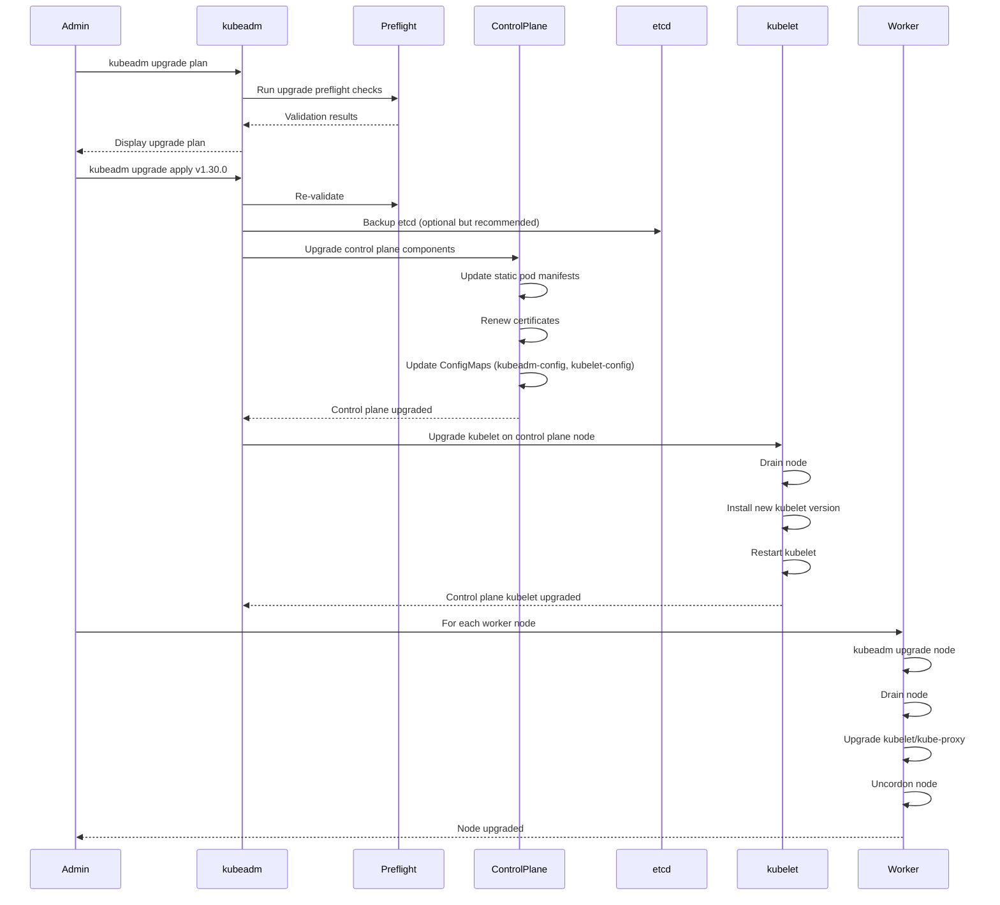

# **kubeadm Upgrade Strategies - Deep Architectural Analysis**

━━━━━━━━━━━━━━━━━━━━━━━━━━━━━━━━━━━━━━━━━━━━━━━━━━━━━━━━━━━━━━━━━━━━━━━━━━━━━━

## **📋 Document Overview**

**Target Audience**: Platform engineers, Kubernetes architects, SREs managing production clusters, open-source contributors

**Scope**: Deep architectural analysis of kubeadm upgrade mechanisms, version skew policies, and production upgrade strategies. This document examines upgrade workflows at the source code level, explains design decisions, and provides cross-component integration patterns.

**Prerequisites**:
- Understanding of [kubeadm architecture](./01-kubeadm-architecture.md)
- Familiarity with [kube-apiserver initialization](../apiserver/middle-level/03-initialization.md)
- Knowledge of [certificate management](../controller-manager/17-certificate-controllers.md)

━━━━━━━━━━━━━━━━━━━━━━━━━━━━━━━━━━━━━━━━━━━━━━━━━━━━━━━━━━━━━━━━━━━━━━━━━━━━━━

## **🎯 Design Philosophy**

### **Why Kubeadm Upgrade Design Matters**

kubeadm's upgrade design reflects critical architectural decisions about:

1. **Version Skew Tolerance**: Kubernetes components have specific version compatibility guarantees
2. **State Preservation**: Upgrades must preserve cluster state, configuration, and workload continuity
3. **Rollback Safety**: Design enables rollback mechanisms at multiple levels
4. **Certificate Renewal**: Automatic certificate rotation during upgrades
5. **Minimal Downtime**: Control plane upgrades with zero worker disruption

### **Core Design Principles**

```
┌─────────────────────────────────────────────────────────────┐
│  KUBEADM UPGRADE DESIGN PRINCIPLES                          │
├─────────────────────────────────────────────────────────────┤
│                                                              │
│  1. INCREMENTAL VERSION PROGRESSION                         │
│     └─ Only N → N+1 minor version upgrades supported       │
│                                                              │
│  2. CONTROL PLANE FIRST                                     │
│     └─ Always upgrade control plane before worker nodes    │
│                                                              │
│  3. DECLARATIVE CONFIGURATION PRESERVATION                  │
│     └─ ConfigMaps maintained through upgrade process       │
│                                                              │
│  4. AUTOMATIC CERTIFICATE RENEWAL                           │
│     └─ Certificates renewed during upgrade workflow        │
│                                                              │
│  5. PHASE-BASED EXECUTION                                   │
│     └─ Upgrade broken into verifiable, atomic phases       │
│                                                              │
│  6. PREFLIGHT VALIDATION                                    │
│     └─ Extensive checks before any state modification      │
│                                                              │
└─────────────────────────────────────────────────────────────┘
```

**Source Code References**:
- Core upgrade logic: `cmd/kubeadm/app/cmd/upgrade/upgrade.go`
- Version validation: `cmd/kubeadm/app/cmd/upgrade/common.go`
- Upgrade phases: `cmd/kubeadm/app/cmd/upgrade/plan.go`, `cmd/kubeadm/app/cmd/upgrade/apply.go`

━━━━━━━━━━━━━━━━━━━━━━━━━━━━━━━━━━━━━━━━━━━━━━━━━━━━━━━━━━━━━━━━━━━━━━━━━━━━━━

## **🏗️ Version Skew Policy**

### **Kubernetes Version Skew Rules**

Understanding version skew policy is critical for safe upgrades:

| **Component** | **Supported Skew** | **Rationale** | **Source Reference** |
|---------------|-------------------|---------------|---------------------|
| kube-apiserver | N (latest) | Single source of truth | `staging/src/k8s.io/component-base/version/` |
| kube-controller-manager | N or N-1 | Must support API changes | `pkg/controller/` |
| kube-scheduler | N or N-1 | Must understand API objects | `pkg/scheduler/` |
| kubelet | N, N-1, or N-2 | Extended skew for large clusters | `pkg/kubelet/apis/` |
| kube-proxy | N, N-1, or N-2 | Network rules must be compatible | `pkg/proxy/` |
| kubectl | N+1, N, or N-1 | Client tool flexibility | `staging/src/k8s.io/kubectl/` |

### **Version Skew Implementation**

```go
// cmd/kubeadm/app/util/version/version.go

// ValidateKubeletVersion checks if kubelet version is compatible with API server
func ValidateKubeletVersion(apiServerVersion, kubeletVersion string) error {
    apiMinor := apiServerVersion.Minor()
    kubeletMinor := kubeletVersion.Minor()

    // Kubelet can be up to 2 minor versions behind
    if kubeletMinor < apiMinor-2 {
        return errors.Errorf("kubelet version %s is too old (API server is %s)",
            kubeletVersion, apiServerVersion)
    }

    // Kubelet cannot be newer than API server
    if kubeletMinor > apiMinor {
        return errors.Errorf("kubelet version %s is newer than API server %s",
            kubeletVersion, apiServerVersion)
    }

    return nil
}
```

### **Version Compatibility Matrix**

```
API Server Version: v1.30.0
┌─────────────────────────────────────────────────────────┐
│                                                          │
│  v1.30.0  v1.29.x  v1.28.x  v1.27.x                     │
│    │         │         │         │                       │
│    └─────────┴─────────┴─────────┘                       │
│              VALID KUBELET VERSIONS                      │
│                                                          │
│  kube-controller-manager:                               │
│    v1.30.0 ✓   v1.29.x ✓   v1.28.x ✗                   │
│                                                          │
│  kube-scheduler:                                        │
│    v1.30.0 ✓   v1.29.x ✓   v1.28.x ✗                   │
│                                                          │
│  kubectl:                                               │
│    v1.31.x ✓   v1.30.x ✓   v1.29.x ✓   v1.28.x ✗       │
│                                                          │
└─────────────────────────────────────────────────────────┘
```

**Design Rationale**:
- **kubelet extended skew**: Allows gradual node upgrades in large clusters (5000+ nodes)
- **Control plane tight skew**: Ensures API compatibility and state management consistency
- **kubectl client flexibility**: Users can maintain stable client versions

━━━━━━━━━━━━━━━━━━━━━━━━━━━━━━━━━━━━━━━━━━━━━━━━━━━━━━━━━━━━━━━━━━━━━━━━━━━━━━

## **🔄 Upgrade Workflow Architecture**

### **High-Level Upgrade Flow**



### **Upgrade Command Breakdown**

#### **1. kubeadm upgrade plan**

```bash
kubeadm upgrade plan
```

**Source**: `cmd/kubeadm/app/cmd/upgrade/plan.go`

**Purpose**: Validates upgrade path and displays what will change

**Internal Workflow**:
```go
// cmd/kubeadm/app/cmd/upgrade/plan.go

func runPlan(flags *planFlags) error {
    // 1. Load current cluster configuration
    cfg, err := getConfig(flags.cfgPath)

    // 2. Detect current cluster version
    clusterVersion, err := getClusterVersion(client)

    // 3. Get available kubeadm versions
    availableVersions, err := getAvailableVersions()

    // 4. Run preflight checks
    if err := upgrade.RunPreflightChecks(cfg); err != nil {
        return err
    }

    // 5. Check version skew policy
    if err := validateVersionSkew(clusterVersion, targetVersion); err != nil {
        return err
    }

    // 6. Display upgrade plan
    printUpgradePlan(clusterVersion, availableVersions, cfg)

    return nil
}
```

**Output Example**:
```
Components that must be upgraded manually after you have upgraded the control plane with 'kubeadm upgrade apply':
COMPONENT   CURRENT       TARGET
kubelet     5 x v1.29.0   v1.30.0

Upgrade to the latest stable version:

COMPONENT                 CURRENT    TARGET
kube-apiserver            v1.29.0    v1.30.0
kube-controller-manager   v1.29.0    v1.30.0
kube-scheduler            v1.29.0    v1.30.0
kube-proxy                v1.29.0    v1.30.0
CoreDNS                   v1.11.1    v1.11.3
etcd                      3.5.10     3.5.12
```

#### **2. kubeadm upgrade apply**

```bash
kubeadm upgrade apply v1.30.0
```

**Source**: `cmd/kubeadm/app/cmd/upgrade/apply.go`

**Upgrade Phases** (executed in order):

```go
// cmd/kubeadm/app/cmd/upgrade/apply.go

var upgradeApplyPhases = []workflow.Phase{
    {
        Name:  "preflight",
        Run:   runPreflight,
    },
    {
        Name:  "control-plane",
        Run:   runControlPlaneUpgrade,
        Phases: []workflow.Phase{
            {
                Name: "certs",
                Run:  renewCertificates,
            },
            {
                Name: "kubeconfig",
                Run:  updateKubeconfigs,
            },
            {
                Name: "static-pods",
                Run:  upgradeStaticPods,
            },
        },
    },
    {
        Name:  "upload-config",
        Run:   uploadConfiguration,
    },
    {
        Name:  "kubelet",
        Run:   upgradeKubeletConfig,
    },
    {
        Name:  "bootstrap-token",
        Run:   updateBootstrapTokens,
    },
    {
        Name:  "addon",
        Run:   upgradeAddons,
        Phases: []workflow.Phase{
            {
                Name: "coredns",
                Run:  upgradeCoreDNS,
            },
            {
                Name: "kube-proxy",
                Run:  upgradeKubeProxy,
            },
        },
    },
}
```

### **Phase Execution Details**

#### **Phase 1: Preflight Checks**

```go
// cmd/kubeadm/app/phases/upgrade/preflight.go

func RunUpgradePreflightChecks(cfg *kubeadmapi.InitConfiguration) error {
    checks := []Checker{
        // Verify admin.conf exists and is valid
        NewFileExistsCheck("/etc/kubernetes/admin.conf"),

        // Check if control plane is healthy
        NewControlPlaneHealthCheck(),

        // Verify version skew policy
        NewVersionSkewCheck(cfg.KubernetesVersion),

        // Check for deprecated APIs
        NewDeprecatedAPICheck(),

        // Verify sufficient resources
        NewResourceCheck(),

        // Check etcd health
        NewEtcdHealthCheck(),
    }

    for _, check := range checks {
        if err := check.Check(); err != nil {
            return err
        }
    }

    return nil
}
```

**Common Preflight Failures**:

| **Check** | **Failure Condition** | **Resolution** |
|-----------|----------------------|----------------|
| ControlPlaneHealth | API server unreachable | Investigate API server logs, check certificates |
| VersionSkew | Target version > N+1 | Perform incremental upgrades (e.g., 1.28 → 1.29 → 1.30) |
| DeprecatedAPI | Workloads use removed APIs | Migrate to supported API versions before upgrade |
| EtcdHealth | etcd cluster unhealthy | Resolve etcd issues, see [etcd troubleshooting](../etcd/middle-level/07-performance-tuning.md) |

#### **Phase 2: Certificate Renewal**

```go
// cmd/kubeadm/app/phases/upgrade/certs.go

func RenewCertificates(cfg *kubeadmapi.InitConfiguration) error {
    // Certificates to renew during upgrade
    certsToRenew := []string{
        "apiserver",
        "apiserver-kubelet-client",
        "front-proxy-client",
        "apiserver-etcd-client",  // If using external etcd
    }

    for _, cert := range certsToRenew {
        // Load existing certificate
        existingCert, err := pkiutil.LoadCertificate(certPath(cert))

        // Check expiration
        if time.Until(existingCert.NotAfter) < 180*24*time.Hour {
            // Renew if less than 6 months remaining
            if err := pkiutil.RenewCertificate(cert, cfg); err != nil {
                return err
            }
            klog.Infof("Certificate %s renewed", cert)
        }
    }

    return nil
}
```

**Certificate Renewal Behavior**:
- **Automatic renewal**: All certificates renewed if < 180 days until expiration
- **CA preservation**: Root CAs are never renewed during upgrade
- **Kubeconfig updates**: admin.conf, controller-manager.conf, scheduler.conf updated with new certs
- **kubelet restart required**: kubelet must restart to use new API server certificate

**See**: [Certificate Controllers](../controller-manager/17-certificate-controllers.md) for certificate lifecycle management

#### **Phase 3: Static Pod Upgrade**

```go
// cmd/kubeadm/app/phases/upgrade/staticpods.go

func UpgradeStaticPodManifests(cfg *kubeadmapi.InitConfiguration) error {
    staticPods := []string{
        "kube-apiserver",
        "kube-controller-manager",
        "kube-scheduler",
        "etcd",  // If using stacked etcd
    }

    for _, pod := range staticPods {
        // 1. Generate new manifest with updated image version
        newManifest, err := generateManifest(pod, cfg)

        // 2. Create temporary manifest
        tmpPath := filepath.Join("/etc/kubernetes/tmp", pod+".yaml")
        if err := writeManifest(tmpPath, newManifest); err != nil {
            return err
        }

        // 3. Atomic rename to activate new manifest
        manifestPath := filepath.Join("/etc/kubernetes/manifests", pod+".yaml")
        if err := os.Rename(tmpPath, manifestPath); err != nil {
            return err
        }

        // 4. Wait for kubelet to restart pod with new version
        if err := waitForPodRestart(pod, cfg.KubernetesVersion); err != nil {
            return err
        }

        klog.Infof("Static pod %s upgraded to %s", pod, cfg.KubernetesVersion)
    }

    return nil
}
```

**Static Pod Upgrade Behavior**:

```
┌────────────────────────────────────────────────────────────┐
│  STATIC POD UPGRADE SEQUENCE                               │
├────────────────────────────────────────────────────────────┤
│                                                             │
│  1. Generate new manifest                                  │
│     └─ Image: registry.k8s.io/kube-apiserver:v1.30.0      │
│                                                             │
│  2. Write to /etc/kubernetes/tmp/kube-apiserver.yaml       │
│                                                             │
│  3. Atomic rename to /etc/kubernetes/manifests/            │
│     └─ Triggers kubelet file watch                        │
│                                                             │
│  4. kubelet detects manifest change                        │
│     ├─ Kills old pod                                       │
│     ├─ Starts new pod with v1.30.0 image                  │
│     └─ Waits for health checks                            │
│                                                             │
│  5. kubeadm polls pod status                               │
│     └─ Waits for Ready condition                          │
│                                                             │
└────────────────────────────────────────────────────────────┘
```

**Downtime Analysis**:
- **kube-apiserver**: ~10-30 seconds (pod restart time)
- **kube-controller-manager**: No API downtime (only affects controller reconciliation)
- **kube-scheduler**: No API downtime (only affects new pod scheduling)
- **etcd**: ~5-15 seconds if stacked (HA clusters have no downtime with 3+ members)

**Multi-Master HA Upgrade**: Upgrade one control plane node at a time to maintain API server availability

#### **Phase 4: ConfigMap Updates**

```go
// cmd/kubeadm/app/phases/upgrade/uploadconfig.go

func UploadConfiguration(cfg *kubeadmapi.InitConfiguration, client clientset.Interface) error {
    // Update kubeadm-config ConfigMap
    kubeadmCM := &v1.ConfigMap{
        ObjectMeta: metav1.ObjectMeta{
            Name:      "kubeadm-config",
            Namespace: "kube-system",
        },
        Data: map[string]string{
            "ClusterConfiguration": marshalConfig(cfg.ClusterConfiguration),
            "ClusterStatus":        marshalClusterStatus(cfg),
        },
    }

    if _, err := client.CoreV1().ConfigMaps("kube-system").Update(ctx, kubeadmCM, metav1.UpdateOptions{}); err != nil {
        return err
    }

    // Update kubelet-config ConfigMap
    kubeletCM := &v1.ConfigMap{
        ObjectMeta: metav1.ObjectMeta{
            Name:      fmt.Sprintf("kubelet-config-%d.%d", cfg.Major, cfg.Minor),
            Namespace: "kube-system",
        },
        Data: map[string]string{
            "kubelet": marshalKubeletConfig(cfg.KubeletConfiguration),
        },
    }

    if _, err := client.CoreV1().ConfigMaps("kube-system").CreateOrUpdate(ctx, kubeletCM, metav1.CreateOptions{}); err != nil {
        return err
    }

    return nil
}
```

**ConfigMap Version Strategy**:
- **kubeadm-config**: Single ConfigMap, always named `kubeadm-config`
- **kubelet-config**: Version-specific, named `kubelet-config-1.30` for v1.30.x
- **Rationale**: Allows mixed-version kubelet during upgrade (skew policy support)

#### **Phase 5: Addon Upgrades**

```go
// cmd/kubeadm/app/phases/upgrade/addons.go

func UpgradeCoreDNS(cfg *kubeadmapi.InitConfiguration, client clientset.Interface) error {
    // 1. Get current CoreDNS version
    currentVersion, err := getCoreDNSVersion(client)

    // 2. Determine target CoreDNS version from kubeadm
    targetVersion := getCoreDNSVersionForKubernetesVersion(cfg.KubernetesVersion)

    // 3. Update CoreDNS Deployment
    deployment, err := client.AppsV1().Deployments("kube-system").Get(ctx, "coredns", metav1.GetOptions{})

    // Update image
    deployment.Spec.Template.Spec.Containers[0].Image = fmt.Sprintf("registry.k8s.io/coredns/coredns:v%s", targetVersion)

    // Update ConfigMap if needed (Corefile changes)
    if err := updateCoreDNSConfigMap(client, currentVersion, targetVersion); err != nil {
        return err
    }

    // Apply deployment update
    _, err = client.AppsV1().Deployments("kube-system").Update(ctx, deployment, metav1.UpdateOptions{})

    return err
}

func UpgradeKubeProxy(cfg *kubeadmapi.InitConfiguration, client clientset.Interface) error {
    // Update kube-proxy DaemonSet
    ds, err := client.AppsV1().DaemonSets("kube-system").Get(ctx, "kube-proxy", metav1.GetOptions{})

    // Update image
    ds.Spec.Template.Spec.Containers[0].Image = fmt.Sprintf("registry.k8s.io/kube-proxy:v%s", cfg.KubernetesVersion)

    // Update kube-proxy ConfigMap with new Kubernetes version
    if err := updateKubeProxyConfig(client, cfg); err != nil {
        return err
    }

    _, err = client.AppsV1().DaemonSets("kube-system").Update(ctx, ds, metav1.UpdateOptions{})

    return err
}
```

**Addon Upgrade Behavior**:
- **CoreDNS**: Rolling update (default maxUnavailable: 1)
- **kube-proxy**: Rolling update on all nodes (typically completes within 2-5 minutes)
- **No user workload impact**: DNS and networking remain available during rollout

━━━━━━━━━━━━━━━━━━━━━━━━━━━━━━━━━━━━━━━━━━━━━━━━━━━━━━━━━━━━━━━━━━━━━━━━━━━━━━

## **🔧 Worker Node Upgrade**

### **Worker Node Upgrade Workflow**

```bash
# On control plane node: drain worker node
kubectl drain <node-name> --ignore-daemonsets --delete-emptydir-data

# On worker node: upgrade kubeadm
apt-get update && apt-get install -y kubeadm=1.30.0-00

# Upgrade node
kubeadm upgrade node

# Upgrade kubelet and kubectl
apt-get install -y kubelet=1.30.0-00 kubectl=1.30.0-00

# Restart kubelet
systemctl daemon-reload
systemctl restart kubelet

# On control plane: uncordon node
kubectl uncordon <node-name>
```

### **kubeadm upgrade node Implementation**

```go
// cmd/kubeadm/app/cmd/upgrade/node.go

func RunUpgradeNode(flags *nodeFlags) error {
    // Worker nodes only need to:
    // 1. Download kubelet configuration from updated ConfigMap
    // 2. Update local kubelet configuration
    // 3. No control plane component updates needed

    cfg, err := getNodeConfiguration()

    // Fetch kubelet-config ConfigMap for target version
    kubeletCM, err := fetchKubeletConfigMap(cfg.KubernetesVersion)

    // Write kubelet configuration
    kubeletConfigPath := "/var/lib/kubelet/config.yaml"
    if err := writeKubeletConfig(kubeletConfigPath, kubeletCM); err != nil {
        return err
    }

    klog.Infof("Kubelet configuration updated for version %s", cfg.KubernetesVersion)
    klog.Infof("Now restart kubelet with: systemctl restart kubelet")

    return nil
}
```

### **Drain Operation Deep Dive**

```go
// staging/src/k8s.io/kubectl/pkg/drain/drain.go

func (d *Drainer) Drain(node *v1.Node) error {
    // 1. Cordon the node (prevent new pods from scheduling)
    if err := d.CordonNode(node); err != nil {
        return err
    }

    // 2. Get all pods on the node
    pods, err := d.GetPodsForNode(node.Name)

    // 3. Filter pods based on drain options
    podsToDrain := d.FilterPods(pods)

    // 4. Evict pods using Eviction API (respects PodDisruptionBudgets)
    for _, pod := range podsToDrain {
        if err := d.EvictPod(pod); err != nil {
            return err
        }
    }

    // 5. Wait for all pods to terminate
    if err := d.WaitForPodTermination(podsToDrain); err != nil {
        return err
    }

    return nil
}
```

**Drain Filtering Logic**:

| **Pod Type** | **Default Behavior** | **Flag to Override** |
|--------------|---------------------|---------------------|
| DaemonSet pods | Ignored (not evicted) | `--ignore-daemonsets` (required) |
| Pods with emptyDir | Eviction fails | `--delete-emptydir-data` |
| Static pods | Ignored (managed by kubelet) | N/A |
| Mirror pods | Ignored (reflections of static pods) | N/A |
| Pods without controller | Eviction fails | `--force` |
| Pods violating PDB | Eviction waits | `--disable-eviction` |

**PodDisruptionBudget Interaction**:

```yaml
apiVersion: policy/v1
kind: PodDisruptionBudget
metadata:
  name: my-app-pdb
spec:
  minAvailable: 2
  selector:
    matchLabels:
      app: my-app
```

When draining:
1. kubectl calls Eviction API: `POST /api/v1/namespaces/{ns}/pods/{name}/eviction`
2. API server checks PDB controller
3. If eviction would violate PDB, eviction is rejected
4. kubectl waits and retries (default timeout: indefinite)

**Production Considerations**:
- Set `--timeout` to avoid indefinite hangs
- Review PDBs before large-scale upgrades
- Consider temporary PDB adjustments for maintenance windows

**See**: [Pod Disruption Budget Controller](../controller-manager/22-disruption-controller.md)

━━━━━━━━━━━━━━━━━━━━━━━━━━━━━━━━━━━━━━━━━━━━━━━━━━━━━━━━━━━━━━━━━━━━━━━━━━━━━━

## **🎯 Upgrade Strategies Comparison**

### **Strategy 1: Rolling Upgrade**

**Definition**: Upgrade nodes one at a time, draining workloads before upgrade

**Architecture**:
```
Control Plane Nodes:               Worker Nodes:
┌──────────┐                      ┌──────────┐  ┌──────────┐  ┌──────────┐
│ CP-1     │ ──────────────────>  │ Worker-1 │  │ Worker-2 │  │ Worker-3 │
│ v1.30    │  Upgrade first       │ v1.29    │  │ v1.29    │  │ v1.29    │
└──────────┘                      └──────────┘  └──────────┘  └──────────┘
                                       ↓              ↓             ↓
                                  ┌──────────┐  ┌──────────┐  ┌──────────┐
                                  │ Worker-1 │  │ Worker-2 │  │ Worker-3 │
                                  │ v1.30    │  │ v1.29    │  │ v1.29    │
                                  └──────────┘  └──────────┘  └──────────┘
                                                     ↓             ↓
                                                ┌──────────┐  ┌──────────┐
                                                │ Worker-2 │  │ Worker-3 │
                                                │ v1.30    │  │ v1.29    │
                                                └──────────┘  └──────────┘
                                                                  ↓
                                                             ┌──────────┐
                                                             │ Worker-3 │
                                                             │ v1.30    │
                                                             └──────────┘
```

**Implementation**:
```bash
#!/bin/bash
# rolling-upgrade.sh

NODES=$(kubectl get nodes -o name | grep -v control-plane)

for NODE in $NODES; do
    echo "Upgrading $NODE..."

    # Drain node
    kubectl drain $NODE --ignore-daemonsets --delete-emptydir-data --timeout=10m

    # SSH to node and upgrade (assumes SSH access)
    ssh $NODE << 'EOF'
        sudo apt-get update
        sudo apt-get install -y kubeadm=1.30.0-00
        sudo kubeadm upgrade node
        sudo apt-get install -y kubelet=1.30.0-00 kubectl=1.30.0-00
        sudo systemctl daemon-reload
        sudo systemctl restart kubelet
EOF

    # Uncordon node
    kubectl uncordon $NODE

    # Wait for node to be Ready
    kubectl wait --for=condition=Ready node/$NODE --timeout=5m

    # Optional: wait for workloads to stabilize
    sleep 30
done
```

**Advantages**:
- ✅ Minimal risk: One node at a time
- ✅ Easy rollback: Can stop at any point
- ✅ No additional capacity needed

**Disadvantages**:
- ❌ Slow: For 1000 nodes, could take 8-20 hours
- ❌ Workload disruption: Pods evicted and rescheduled
- ❌ PDB complications: Can block drain operations

**Best For**: Production clusters where stability > speed

### **Strategy 2: Blue-Green Upgrade**

**Definition**: Create new node pool with upgraded version, migrate workloads, delete old pool

**Architecture**:
```
┌─────────────────────────────────────────────────────────┐
│  BLUE POOL (v1.29)              GREEN POOL (v1.30)      │
├─────────────────────────────────────────────────────────┤
│                                                          │
│  ┌──────────┐  ┌──────────┐    ┌──────────┐            │
│  │ Worker-1 │  │ Worker-2 │    │ Worker-4 │  NEW       │
│  │ v1.29    │  │ v1.29    │    │ v1.30    │            │
│  └──────────┘  └──────────┘    └──────────┘            │
│                                                          │
│        Workloads migrate ─────────────>                 │
│                                                          │
│  ┌──────────┐                  ┌──────────┐            │
│  │ Worker-3 │                  │ Worker-5 │            │
│  │ v1.29    │                  │ v1.30    │            │
│  └──────────┘                  └──────────┘            │
│                                                          │
│        Workloads migrate ─────────────>                 │
│                                                          │
│  Delete old pool                        Green stable    │
│                                                          │
└─────────────────────────────────────────────────────────┘
```

**Implementation** (using node labels):
```bash
#!/bin/bash
# blue-green-upgrade.sh

# 1. Label existing nodes as "blue"
kubectl label nodes -l '!upgrade-pool' upgrade-pool=blue

# 2. Add new "green" nodes with v1.30 (assumes infrastructure automation)
# This step is infrastructure-specific (cloud autoscaling groups, etc.)
# New nodes should be labeled: upgrade-pool=green

# 3. Cordon blue nodes (prevent new workloads)
kubectl cordon -l upgrade-pool=blue

# 4. Wait for workloads to be scheduled on green nodes
# This relies on pod disruption budgets and natural pod churn, or:
for NODE in $(kubectl get nodes -l upgrade-pool=blue -o name); do
    kubectl drain $NODE --ignore-daemonsets --delete-emptydir-data --timeout=15m
done

# 5. Verify all workloads are on green nodes
kubectl get pods --all-namespaces -o wide | grep -v green

# 6. Delete blue node pool
kubectl delete nodes -l upgrade-pool=blue
# In cloud environments: delete the underlying node group/autoscaling group
```

**Advantages**:
- ✅ Fast: Parallel workload migration
- ✅ Easy rollback: Keep blue pool until verified
- ✅ Clean slate: New nodes avoid configuration drift

**Disadvantages**:
- ❌ Cost: Requires 2x capacity during migration
- ❌ Infrastructure dependency: Requires node provisioning automation
- ❌ StatefulSet complexity: Persistent volume reattachment delays

**Best For**: Cloud environments with autoscaling, teams with infrastructure-as-code maturity

### **Strategy 3: Canary Upgrade**

**Definition**: Upgrade a small subset of nodes first, validate, then proceed with full rollout

**Architecture**:
```
Phase 1: Canary (10% of nodes)
┌──────────┐  ┌──────────┐  ┌──────────┐  ┌──────────┐
│ Worker-1 │  │ Worker-2 │  │ Worker-3 │  │ Worker-4 │
│ v1.30    │  │ v1.29    │  │ v1.29    │  │ v1.29    │
│ CANARY   │  │          │  │          │  │          │
└──────────┘  └──────────┘  └──────────┘  └──────────┘

        ↓ Validate canary (24-72 hours)

Phase 2: Gradual Rollout (30% of nodes)
┌──────────┐  ┌──────────┐  ┌──────────┐  ┌──────────┐
│ Worker-1 │  │ Worker-2 │  │ Worker-3 │  │ Worker-4 │
│ v1.30    │  │ v1.30    │  │ v1.29    │  │ v1.29    │
└──────────┘  └──────────┘  └──────────┘  └──────────┘

        ↓ Validate (24 hours)

Phase 3: Full Rollout (100% of nodes)
┌──────────┐  ┌──────────┐  ┌──────────┐  ┌──────────┐
│ Worker-1 │  │ Worker-2 │  │ Worker-3 │  │ Worker-4 │
│ v1.30    │  │ v1.30    │  │ v1.30    │  │ v1.30    │
└──────────┘  └──────────┘  └──────────┘  └──────────┘
```

**Implementation**:
```bash
#!/bin/bash
# canary-upgrade.sh

ALL_NODES=$(kubectl get nodes -o jsonpath='{.items[*].metadata.name}' | grep -v control-plane)
TOTAL_NODES=$(echo $ALL_NODES | wc -w)

# Phase 1: Canary (10%)
CANARY_COUNT=$(( TOTAL_NODES / 10 ))
CANARY_NODES=$(echo $ALL_NODES | tr ' ' '\n' | head -n $CANARY_COUNT)

echo "=== Phase 1: Canary Upgrade ($CANARY_COUNT nodes) ==="
for NODE in $CANARY_NODES; do
    kubectl label node $NODE upgrade-phase=canary
    upgrade_node $NODE  # Function defined elsewhere
done

echo "Canary upgrade complete. Monitor for 24-72 hours."
echo "Metrics to watch:"
echo "  - kubelet version distribution"
echo "  - Pod restart rates"
echo "  - Application error rates"
echo "Press Enter to proceed with Phase 2, or Ctrl+C to abort"
read

# Phase 2: Gradual Rollout (30%)
PHASE2_COUNT=$(( TOTAL_NODES * 3 / 10 ))
PHASE2_NODES=$(echo $ALL_NODES | tr ' ' '\n' | grep -v -f <(echo "$CANARY_NODES") | head -n $PHASE2_COUNT)

echo "=== Phase 2: Gradual Rollout ($PHASE2_COUNT nodes) ==="
for NODE in $PHASE2_NODES; do
    kubectl label node $NODE upgrade-phase=gradual
    upgrade_node $NODE
done

echo "Phase 2 complete. Monitor for 24 hours."
echo "Press Enter to proceed with Phase 3, or Ctrl+C to abort"
read

# Phase 3: Full Rollout (remaining 60%)
REMAINING_NODES=$(echo $ALL_NODES | tr ' ' '\n' | grep -v -f <(echo "$CANARY_NODES $PHASE2_NODES"))

echo "=== Phase 3: Full Rollout (${REMAINING_NODES} nodes) ==="
for NODE in $REMAINING_NODES; do
    kubectl label node $NODE upgrade-phase=full
    upgrade_node $NODE
done

echo "=== Upgrade Complete ==="
```

**Monitoring Canary Metrics**:
```bash
# Check kubelet version distribution
kubectl get nodes -o jsonpath='{range .items[*]}{.metadata.name}{"\t"}{.status.nodeInfo.kubeletVersion}{"\n"}{end}' | sort -k2

# Check pod restart rates (looking for anomalies)
kubectl get pods --all-namespaces -o json | jq '.items[] | select(.status.containerStatuses[].restartCount > 5) | {name:.metadata.name, restarts:.status.containerStatuses[].restartCount}'

# Check application error rates (requires metrics server / prometheus)
kubectl top nodes
```

**Advantages**:
- ✅ Risk mitigation: Detect issues on small subset first
- ✅ Gradual validation: Time to monitor between phases
- ✅ Easy abort: Can halt rollout if canary shows problems

**Disadvantages**:
- ❌ Slow: Multi-phase approach extends timeline
- ❌ Requires monitoring: Need robust observability to validate canary
- ❌ Manual gates: Requires human decision between phases

**Best For**: Risk-averse organizations, first upgrade to new minor version, clusters with complex workloads

### **Strategy Comparison Matrix**

| **Criteria** | **Rolling** | **Blue-Green** | **Canary** |
|--------------|-------------|----------------|------------|
| **Speed** | Slow (1-2 days) | Fast (2-4 hours) | Slow (3-7 days) |
| **Risk** | Medium | Low | Very Low |
| **Cost** | Low (no extra capacity) | High (2x capacity) | Low |
| **Complexity** | Low | High (IaC required) | Medium |
| **Rollback** | Node-by-node | Instant (keep blue) | Instant (stop rollout) |
| **Workload Disruption** | High (all pods restarted) | Medium (migration) | High (all pods restarted) |
| **Best For** | Standard prod upgrades | Cloud-native, HA-critical | New version validation |

━━━━━━━━━━━━━━━━━━━━━━━━━━━━━━━━━━━━━━━━━━━━━━━━━━━━━━━━━━━━━━━━━━━━━━━━━━━━━━

## **⚠️ Common Upgrade Issues and Troubleshooting**

### **Issue 1: Upgrade Preflight Check Failures**

**Symptom**:
```
[upgrade/preflight] Some fatal errors occurred:
        [ERROR ExternalEtcdClientCertificates]: Error reading etcd client certificate
```

**Root Cause**: Missing or expired etcd client certificates

**Investigation**:
```bash
# Check etcd client certificates
ls -la /etc/kubernetes/pki/apiserver-etcd-client.*

# Check certificate expiration
kubeadm certs check-expiration

# Check etcd connectivity
ETCDCTL_API=3 etcdctl \
    --endpoints=https://127.0.0.1:2379 \
    --cacert=/etc/kubernetes/pki/etcd/ca.crt \
    --cert=/etc/kubernetes/pki/apiserver-etcd-client.crt \
    --key=/etc/kubernetes/pki/apiserver-etcd-client.key \
    member list
```

**Resolution**:
```bash
# Renew certificates first
kubeadm certs renew all

# Restart control plane components
systemctl restart kubelet

# Retry upgrade
kubeadm upgrade apply v1.30.0
```

**See**: [Certificate Management](../controller-manager/17-certificate-controllers.md)

### **Issue 2: Static Pod Upgrade Timeout**

**Symptom**:
```
[upgrade/apply] Waiting for static pod kube-apiserver to start...
[upgrade/apply] Static pod: kube-apiserver hash: <hash>
[upgrade/apply] Static pod: kube-apiserver-control-plane-1 static pod ready, waiting for 120s
[ERROR]: timeout waiting for pod kube-apiserver-control-plane-1 to start
```

**Root Cause**: API server failing to start with new version

**Investigation**:
```bash
# Check kubelet logs for static pod errors
journalctl -u kubelet -n 100 | grep kube-apiserver

# Check API server logs (if pod is running but not ready)
kubectl logs -n kube-system kube-apiserver-control-plane-1

# Check for manifest issues
cat /etc/kubernetes/manifests/kube-apiserver.yaml

# Common issues:
# - Invalid admission plugins
# - Incorrect feature gates
# - Removed/deprecated flags
```

**Common Deprecated Flags** (v1.29 → v1.30):

| **Deprecated Flag** | **Replacement** | **Action** |
|---------------------|----------------|------------|
| `--enable-admission-plugins=PodSecurityPolicy` | Pod Security Standards | Remove, use Pod Security Admission |
| `--insecure-port` | N/A (removed) | Remove from manifest |
| `--service-account-api-audiences` | `--api-audiences` | Update flag name |

**Resolution**:
```bash
# Rollback to previous manifest if needed
cp /etc/kubernetes/tmp/kube-apiserver.yaml.backup /etc/kubernetes/manifests/kube-apiserver.yaml

# Fix manifest issues
vi /etc/kubernetes/manifests/kube-apiserver.yaml

# kubelet will automatically restart pod when manifest changes
```

### **Issue 3: Node Drain Hangs on PodDisruptionBudget**

**Symptom**:
```bash
$ kubectl drain worker-1 --ignore-daemonsets
evicting pod my-namespace/my-app-abc123
error when evicting pod "my-app-abc123": Cannot evict pod as it would violate the pod's disruption budget.
```

**Root Cause**: PodDisruptionBudget prevents pod eviction

**Investigation**:
```bash
# Find the blocking PDB
kubectl get pdb --all-namespaces

# Check PDB status
kubectl describe pdb my-app-pdb -n my-namespace

# Output:
# Status:
#   Conditions Last Transition Time:  ...
#   Disruptions Allowed:               0    ← Problem: no disruptions allowed
#   Current Healthy:                   2
#   Desired Healthy:                   2
#   Expected Pods:                     2
```

**Workaround Options**:

**Option 1**: Temporarily increase replica count
```bash
# Scale up deployment to allow evictions
kubectl scale deployment my-app --replicas=4 -n my-namespace

# Wait for new pods to be Ready
kubectl wait --for=condition=Ready pod -l app=my-app -n my-namespace --timeout=60s

# Now drain will succeed
kubectl drain worker-1 --ignore-daemonsets
```

**Option 2**: Temporarily modify PDB
```bash
# Backup current PDB
kubectl get pdb my-app-pdb -n my-namespace -o yaml > my-app-pdb-backup.yaml

# Lower minAvailable
kubectl patch pdb my-app-pdb -n my-namespace -p '{"spec":{"minAvailable":1}}'

# Drain node
kubectl drain worker-1 --ignore-daemonsets

# Restore original PDB
kubectl apply -f my-app-pdb-backup.yaml
```

**Option 3**: Use force eviction (bypasses PDB - use with caution)
```bash
kubectl drain worker-1 --ignore-daemonsets --disable-eviction --force
```

**Prevention**: Review PDBs before maintenance
```bash
# List all PDBs with their constraints
kubectl get pdb --all-namespaces -o custom-columns=\
NAMESPACE:.metadata.namespace,\
NAME:.metadata.name,\
MIN_AVAILABLE:.spec.minAvailable,\
MAX_UNAVAILABLE:.spec.maxUnavailable,\
CURRENT:.status.currentHealthy,\
DESIRED:.status.desiredHealthy
```

### **Issue 4: kubelet Fails to Start After Upgrade**

**Symptom**:
```bash
$ systemctl status kubelet
● kubelet.service - kubelet: The Kubernetes Node Agent
   Loaded: loaded (/lib/systemd/system/kubelet.service; enabled)
   Active: failed (Result: exit-code)

$ journalctl -u kubelet -n 50
failed to run Kubelet: failed to load kubelet config file /var/lib/kubelet/config.yaml:
unknown field "podSecurityPolicy"
```

**Root Cause**: Deprecated fields in kubelet configuration

**Investigation**:
```bash
# Check kubelet config
cat /var/lib/kubelet/config.yaml

# Check for deprecated fields
# Common deprecated fields:
# - podSecurityPolicy (removed in v1.25)
# - resolvConf (deprecated, use Kubernetes DNS)
```

**Resolution**:
```bash
# Edit kubelet config
vi /var/lib/kubelet/config.yaml

# Remove deprecated field:
# Before:
# podSecurityPolicy: true

# After:
# (field removed)

# Restart kubelet
systemctl restart kubelet

# Verify
systemctl status kubelet
kubectl get node <node-name>
```

### **Issue 5: etcd Data Incompatibility**

**Symptom**:
```
[upgrade/etcd] Checking etcd version
[ERROR Etcd]: etcd cluster version (3.5.9) is older than the minimum required version (3.5.10)
```

**Root Cause**: etcd version too old for new Kubernetes version

**Investigation**:
```bash
# Check current etcd version
kubectl exec -n kube-system etcd-control-plane-1 -- etcdctl version

# Check required etcd version for target Kubernetes version
# See: https://kubernetes.io/docs/setup/release/version-skew-policy/#supported-component-versions
```

**Resolution**: Upgrade etcd first
```bash
# Backup etcd data first
ETCDCTL_API=3 etcdctl snapshot save /var/lib/etcd-backup.db \
    --endpoints=https://127.0.0.1:2379 \
    --cacert=/etc/kubernetes/pki/etcd/ca.crt \
    --cert=/etc/kubernetes/pki/etcd/server.crt \
    --key=/etc/kubernetes/pki/etcd/server.key

# Update etcd manifest
vi /etc/kubernetes/manifests/etcd.yaml

# Change image version:
# FROM: registry.k8s.io/etcd:3.5.9-0
# TO:   registry.k8s.io/etcd:3.5.12-0

# kubelet will automatically restart etcd
# Wait for etcd to be healthy
ETCDCTL_API=3 etcdctl endpoint health

# Retry Kubernetes upgrade
kubeadm upgrade apply v1.30.0
```

**See**: [etcd Cluster Management](../etcd/middle-level/05-cluster-management.md)

━━━━━━━━━━━━━━━━━━━━━━━━━━━━━━━━━━━━━━━━━━━━━━━━━━━━━━━━━━━━━━━━━━━━━━━━━━━━━━

## **🔒 Upgrade Safety and Rollback**

### **Pre-Upgrade Checklist**

```markdown
## Pre-Upgrade Checklist

### Cluster Health
- [ ] All nodes are Ready: `kubectl get nodes`
- [ ] All system pods are Running: `kubectl get pods -n kube-system`
- [ ] etcd is healthy: `etcdctl endpoint health`
- [ ] No pending certificate expirations: `kubeadm certs check-expiration`

### Backups
- [ ] etcd snapshot created: `etcdctl snapshot save`
- [ ] etcd snapshot verified: `etcdctl snapshot status`
- [ ] Cluster configuration backed up: `kubectl get cm kubeadm-config -n kube-system -o yaml > kubeadm-config-backup.yaml`
- [ ] Critical namespace manifests exported: `kubectl get all -n critical-namespace -o yaml > namespace-backup.yaml`

### Compatibility
- [ ] Workloads tested against new Kubernetes version (staging cluster)
- [ ] Third-party controllers compatible (CSI drivers, CNI, etc.)
- [ ] Deprecated APIs identified and migrated: `kubectl api-resources --deprecated=true`
- [ ] Custom admission webhooks compatible with new API server version

### Capacity Planning
- [ ] Sufficient node capacity for workload rescheduling during drain
- [ ] PodDisruptionBudgets reviewed and adjusted if needed
- [ ] Maintenance window scheduled (off-peak hours)

### Documentation
- [ ] Upgrade plan documented and reviewed
- [ ] Rollback procedure documented
- [ ] Oncall engineer identified
- [ ] Communication sent to stakeholders
```

### **Rollback Strategies**

#### **Control Plane Rollback**

**If upgrade fails during kubeadm upgrade apply**:

```bash
# 1. Rollback static pod manifests
cp /etc/kubernetes/tmp/kube-apiserver.yaml.backup /etc/kubernetes/manifests/kube-apiserver.yaml
cp /etc/kubernetes/tmp/kube-controller-manager.yaml.backup /etc/kubernetes/manifests/kube-controller-manager.yaml
cp /etc/kubernetes/tmp/kube-scheduler.yaml.backup /etc/kubernetes/manifests/kube-scheduler.yaml

# 2. If etcd was upgraded, rollback etcd manifest
cp /etc/kubernetes/tmp/etcd.yaml.backup /etc/kubernetes/manifests/etcd.yaml

# 3. Restart kubelet to reload manifests
systemctl restart kubelet

# 4. Verify control plane is running old version
kubectl version
kubectl get pods -n kube-system
```

**If upgrade succeeds but causes issues**:

Rollback is **NOT supported** for control plane after `kubeadm upgrade apply` completes successfully. The cluster state (ConfigMaps, CRDs) may have been modified. Options:

1. **Restore from etcd backup**:
```bash
# Stop API server
mv /etc/kubernetes/manifests/kube-apiserver.yaml /etc/kubernetes/tmp/

# Restore etcd snapshot
ETCDCTL_API=3 etcdctl snapshot restore /var/lib/etcd-backup.db \
    --data-dir=/var/lib/etcd-restored

# Update etcd manifest to use restored data directory
vi /etc/kubernetes/manifests/etcd.yaml
# Change: --data-dir=/var/lib/etcd
# To:     --data-dir=/var/lib/etcd-restored

# Start API server and other components
mv /etc/kubernetes/tmp/kube-apiserver.yaml /etc/kubernetes/manifests/
```

2. **Fresh cluster deployment** (if restore fails): Rebuild cluster from infrastructure-as-code and restore application state

#### **Worker Node Rollback**

**If worker node upgrade fails**:

```bash
# 1. Cordon node to prevent new workloads
kubectl cordon <node-name>

# 2. Downgrade kubeadm (if upgraded)
apt-get install --allow-downgrades -y kubeadm=1.29.0-00

# 3. Downgrade kubelet
apt-get install --allow-downgrades -y kubelet=1.29.0-00

# 4. Restart kubelet
systemctl daemon-reload
systemctl restart kubelet

# 5. Verify node is Ready
kubectl get node <node-name>

# 6. Uncordon if healthy
kubectl uncordon <node-name>
```

**Worker node rollback is safe** because worker nodes don't modify cluster state

### **Testing Upgrades**

#### **Staging Cluster Validation**

```bash
# 1. Create staging cluster matching production
# Use same Kubernetes version, add-ons, workloads

# 2. Perform upgrade on staging
kubeadm upgrade apply v1.30.0

# 3. Run validation tests
# - kubectl smoke tests
# - Application-specific integration tests
# - Load tests to verify performance

# 4. Monitor for 24-48 hours
# - Watch for increased error rates
# - Check for unexpected pod restarts
# - Verify all integrations working

# 5. Document issues found and resolutions

# 6. Only proceed to production if staging is stable
```

#### **Automated Validation Tests**

```bash
#!/bin/bash
# validate-upgrade.sh

echo "=== Cluster Validation Tests ==="

# Test 1: All nodes Ready
echo "Test 1: Node Status"
if kubectl get nodes | grep -v Ready; then
    echo "FAIL: Some nodes not Ready"
    exit 1
fi
echo "PASS: All nodes Ready"

# Test 2: All system pods Running
echo "Test 2: System Pods"
NOT_RUNNING=$(kubectl get pods -n kube-system --field-selector=status.phase!=Running --no-headers | wc -l)
if [ $NOT_RUNNING -gt 0 ]; then
    echo "FAIL: $NOT_RUNNING system pods not Running"
    kubectl get pods -n kube-system --field-selector=status.phase!=Running
    exit 1
fi
echo "PASS: All system pods Running"

# Test 3: API server responding
echo "Test 3: API Server Responsiveness"
if ! kubectl version --short &>/dev/null; then
    echo "FAIL: API server not responding"
    exit 1
fi
echo "PASS: API server responding"

# Test 4: Create test pod
echo "Test 4: Pod Creation"
kubectl run test-pod --image=nginx:1.14.2 --rm -i --restart=Never -- echo "test" &>/dev/null
if [ $? -ne 0 ]; then
    echo "FAIL: Cannot create test pod"
    exit 1
fi
echo "PASS: Pod creation successful"

# Test 5: DNS resolution
echo "Test 5: DNS Resolution"
kubectl run test-dns --image=busybox:1.28 --rm -i --restart=Never -- nslookup kubernetes.default &>/dev/null
if [ $? -ne 0 ]; then
    echo "FAIL: DNS resolution not working"
    exit 1
fi
echo "PASS: DNS resolution working"

# Test 6: Version consistency
echo "Test 6: Version Consistency"
EXPECTED_VERSION="v1.30.0"
APISERVER_VERSION=$(kubectl version -o json | jq -r '.serverVersion.gitVersion')
if [ "$APISERVER_VERSION" != "$EXPECTED_VERSION" ]; then
    echo "FAIL: API server version mismatch (expected $EXPECTED_VERSION, got $APISERVER_VERSION)"
    exit 1
fi
echo "PASS: Version is $EXPECTED_VERSION"

echo "=== All Tests Passed ==="
```

━━━━━━━━━━━━━━━━━━━━━━━━━━━━━━━━━━━━━━━━━━━━━━━━━━━━━━━━━━━━━━━━━━━━━━━━━━━━━━

## **📊 Upgrade Observability**

### **Metrics to Monitor During Upgrade**

#### **Control Plane Metrics**

```promql
# API Server Request Latency (should remain stable during upgrade)
histogram_quantile(0.99,
    rate(apiserver_request_duration_seconds_bucket[5m])
)

# API Server Error Rate (should not spike)
sum(rate(apiserver_request_total{code=~"5.."}[5m])) by (resource, verb)

# etcd Leader Changes (should be 0 or 1 during single-node upgrade)
rate(etcd_server_leader_changes_seen_total[5m])

# etcd DB Size (should remain stable)
etcd_mvcc_db_total_size_in_bytes

# Scheduler Queue Depth (may spike during node drain)
scheduler_queue_incoming_pods_total
```

#### **Node Metrics**

```promql
# Node Status (track node NotReady events)
kube_node_status_condition{condition="Ready",status="false"}

# Kubelet Version Distribution (visualize upgrade progress)
count by (version) (kube_node_info)

# Pod Evictions During Drain
rate(kube_pod_deletion_timestamp[5m])
```

#### **Workload Metrics**

```promql
# Pod Restart Rate (should not spike excessively)
rate(kube_pod_container_status_restarts_total[15m])

# Pod Scheduling Latency (may increase during drain/upgrades)
histogram_quantile(0.99,
    rate(scheduler_scheduling_attempt_duration_seconds_bucket[5m])
)

# Persistent Volume Attachment Time (critical for StatefulSets)
rate(storage_operation_duration_seconds_count{operation_name="volume_attach"}[5m])
```

### **Logging During Upgrade**

**Critical Log Locations**:

| **Component** | **Log Source** | **Key Patterns** |
|---------------|---------------|------------------|
| kubeadm | `/var/log/kubeadm.log` or STDOUT | `[upgrade/apply]`, `[preflight]`, `[ERROR]` |
| kubelet | `journalctl -u kubelet` | `Failed to start container`, `Back-off restarting` |
| kube-apiserver | `kubectl logs -n kube-system kube-apiserver-*` | `Unauthorized`, `TLS handshake error` |
| etcd | `kubectl logs -n kube-system etcd-*` | `raft: heartbeat timeout`, `leader changed` |

**Automated Log Collection**:
```bash
#!/bin/bash
# collect-upgrade-logs.sh

LOGDIR="/var/log/k8s-upgrade-$(date +%Y%m%d-%H%M%S)"
mkdir -p $LOGDIR

# Collect kubeadm logs (from STDOUT during upgrade)
kubectl logs -n kube-system -l component=kube-apiserver --tail=1000 > $LOGDIR/kube-apiserver.log
kubectl logs -n kube-system -l component=kube-controller-manager --tail=1000 > $LOGDIR/kube-controller-manager.log
kubectl logs -n kube-system -l component=kube-scheduler --tail=1000 > $LOGDIR/kube-scheduler.log
kubectl logs -n kube-system -l component=etcd --tail=1000 > $LOGDIR/etcd.log

# Collect kubelet logs
journalctl -u kubelet --since "1 hour ago" > $LOGDIR/kubelet.log

# Collect cluster state
kubectl get nodes -o wide > $LOGDIR/nodes.txt
kubectl get pods --all-namespaces -o wide > $LOGDIR/pods.txt
kubectl version --short > $LOGDIR/version.txt

# Collect events (often reveals upgrade issues)
kubectl get events --all-namespaces --sort-by='.lastTimestamp' > $LOGDIR/events.txt

echo "Logs collected in $LOGDIR"
```

━━━━━━━━━━━━━━━━━━━━━━━━━━━━━━━━━━━━━━━━━━━━━━━━━━━━━━━━━━━━━━━━━━━━━━━━━━━━━━

## **🚀 Advanced Upgrade Scenarios**

### **Multi-Cluster Upgrades**

For organizations managing hundreds of clusters:

**Upgrade Orchestration Architecture**:
```
┌──────────────────────────────────────────────────────────────┐
│  UPGRADE ORCHESTRATION SYSTEM                                 │
├──────────────────────────────────────────────────────────────┤
│                                                               │
│  ┌─────────────────┐        ┌──────────────────┐            │
│  │ Upgrade         │        │ Cluster          │            │
│  │ Controller      │───────>│ Inventory        │            │
│  │                 │        │ (500 clusters)   │            │
│  └─────────────────┘        └──────────────────┘            │
│         │                                                     │
│         ├──> Phase 1: Canary Clusters (10 clusters)         │
│         │    Duration: 7 days, validation required          │
│         │                                                     │
│         ├──> Phase 2: Wave 1 (50 clusters)                  │
│         │    Duration: 3 days, automated validation         │
│         │                                                     │
│         ├──> Phase 3: Wave 2 (150 clusters)                 │
│         │    Duration: 5 days                                │
│         │                                                     │
│         └──> Phase 4: Remaining (290 clusters)              │
│              Duration: 7 days                                │
│                                                               │
│  ┌─────────────────────────────────────────────────────┐    │
│  │ Automated Validation Gate                           │    │
│  │ - API server health check                           │    │
│  │ - Application smoke tests                           │    │
│  │ - Error rate within 2% of baseline                  │    │
│  │ - Latency within 10% of baseline                    │    │
│  └─────────────────────────────────────────────────────┘    │
│                                                               │
└──────────────────────────────────────────────────────────────┘
```

**Implementation** (using GitOps):
```yaml
# argocd-apps/cluster-upgrades.yaml
apiVersion: argoproj.io/v1alpha1
kind: ApplicationSet
metadata:
  name: kubernetes-upgrade-v1-30
spec:
  generators:
    - list:
        elements:
          # Canary clusters
          - cluster: prod-us-west-1
            wave: "0"
            validationRequired: "true"
          - cluster: prod-eu-west-1
            wave: "0"
            validationRequired: "true"

          # Wave 1 - Critical production
          - cluster: prod-us-east-1
            wave: "1"
            validationRequired: "true"
          # ... 48 more clusters

          # Wave 2 - Standard production
          - cluster: prod-ap-southeast-1
            wave: "2"
            validationRequired: "false"
          # ... 148 more clusters

  template:
    metadata:
      name: '{{cluster}}-upgrade'
    spec:
      project: platform
      source:
        repoURL: https://github.com/example/k8s-upgrade-manifests
        targetRevision: v1.30.0
        path: 'clusters/{{cluster}}'
      destination:
        name: '{{cluster}}'
      syncPolicy:
        automated:
          prune: false
          selfHeal: false
        syncOptions:
          - CreateNamespace=true
        # Sync wave controls rollout order
        syncWave: '{{wave}}'
      # Post-sync hook for validation
      hooks:
        - name: validate-upgrade
          hookType: PostSync
          script: |
            #!/bin/bash
            if [ "{{validationRequired}}" = "true" ]; then
              ./scripts/validate-cluster.sh {{cluster}}
            fi
```

### **Upgrading Large Clusters (5000+ Nodes)**

**Challenge**: Rolling upgrade of 5000 nodes at 1 node per minute = 83 hours

**Solution**: Parallel node upgrades with careful coordination

```bash
#!/bin/bash
# parallel-upgrade.sh

CONCURRENCY=50  # Upgrade 50 nodes concurrently
BATCH_DELAY=300  # Wait 5 minutes between batches

ALL_NODES=$(kubectl get nodes -o name | grep -v control-plane)

# Split nodes into batches
parallel --jobs $CONCURRENCY --timeout 600 --delay 2 \
    upgrade_node {} \
    ::: $ALL_NODES

# Function definition
upgrade_node() {
    NODE=$1
    echo "Upgrading $NODE..."

    kubectl drain $NODE --ignore-daemonsets --delete-emptydir-data --timeout=10m

    ssh $NODE << 'EOF'
        apt-get update
        apt-get install -y kubeadm=1.30.0-00
        kubeadm upgrade node
        apt-get install -y kubelet=1.30.0-00 kubectl=1.30.0-00
        systemctl daemon-reload
        systemctl restart kubelet
EOF

    kubectl uncordon $NODE
    kubectl wait --for=condition=Ready node/$NODE --timeout=5m
}

export -f upgrade_node
```

**Timeline Comparison**:
- **Sequential**: 5000 nodes × 1 minute = 83 hours
- **Parallel (50 concurrent)**: 5000 nodes ÷ 50 × 1 minute = 100 minutes = 1.7 hours

**Risks of Parallel Upgrade**:
- Scheduler overload (5000 pods rescheduling simultaneously)
- Network saturation (pod container image pulls)
- etcd write load (pod status updates)

**Mitigation**:
- Limit concurrency based on cluster capacity
- Pre-pull container images to nodes
- Temporarily scale down non-critical workloads
- Monitor scheduler queue depth and API server latency

### **Upgrading Clusters with External Dependencies**

**Scenario**: Kubernetes cluster with:
- External etcd cluster
- External load balancer (cloud provider)
- External authentication (OIDC, LDAP)
- External storage (CSI drivers)

**Upgrade Order**:
1. **External etcd** (if version incompatible)
2. **Control plane** (kubeadm upgrade apply)
3. **Cloud provider integration** (cloud-controller-manager)
4. **CSI drivers** (ensure compatibility)
5. **Worker nodes** (kubeadm upgrade node)

**Example: Upgrading with External etcd**

```bash
# 1. Backup external etcd
ETCDCTL_API=3 etcdctl snapshot save /backup/etcd-$(date +%s).db \
    --endpoints=https://etcd-1:2379,https://etcd-2:2379,https://etcd-3:2379 \
    --cacert=/etc/kubernetes/pki/etcd/ca.crt \
    --cert=/etc/kubernetes/pki/etcd/server.crt \
    --key=/etc/kubernetes/pki/etcd/server.key

# 2. Upgrade etcd cluster (rolling upgrade, one member at a time)
# On etcd-1:
systemctl stop etcd
apt-get install -y etcd-server=3.5.12
systemctl start etcd
# Wait for cluster to be healthy
ETCDCTL_API=3 etcdctl endpoint health

# Repeat for etcd-2, etcd-3

# 3. Verify etcd cluster health
ETCDCTL_API=3 etcdctl member list

# 4. Upgrade Kubernetes control plane
kubeadm upgrade apply v1.30.0 --etcd-upgrade=false

# Note: --etcd-upgrade=false prevents kubeadm from touching etcd
```

**See**: [External etcd Topology](./01-kubeadm-architecture.md#high-availability-topologies)

━━━━━━━━━━━━━━━━━━━━━━━━━━━━━━━━━━━━━━━━━━━━━━━━━━━━━━━━━━━━━━━━━━━━━━━━━━━━━━

## **🔗 Related Documentation**

### **Component-Specific Upgrade Details**
- **[kubeadm Architecture](./01-kubeadm-architecture.md)** - Understanding kubeadm's phase-based design
- **[Certificate Management](../controller-manager/17-certificate-controllers.md)** - Certificate renewal and lifecycle
- **[API Server Initialization](../apiserver/middle-level/03-initialization.md)** - API server startup and configuration
- **[etcd Cluster Management](../etcd/middle-level/05-cluster-management.md)** - etcd upgrade and backup procedures
- **[kubelet TLS Bootstrap](../kubelet/high-level/05-initialization-startup.md)** - Node join and certificate requests

### **Operational Context**
- **[High Availability Cluster Setup](./04-high-availability-cluster-setup.md)** - HA considerations during upgrades
- **[Disaster Recovery](../scalability/04-disaster-recovery-strategies.md)** - Backup and restore procedures
- **[Performance Benchmarking](../scalability/03-performance-benchmarking.md)** - Validating performance post-upgrade

━━━━━━━━━━━━━━━━━━━━━━━━━━━━━━━━━━━━━━━━━━━━━━━━━━━━━━━━━━━━━━━━━━━━━━━━━━━━━━

## **📚 Key Takeaways**

### **For Platform Engineers**

1. **Version Skew Policy is Critical**:
   - Control plane components: N or N-1
   - kubelet: N, N-1, or N-2
   - Always upgrade control plane before workers

2. **Upgrade is a Multi-Phase Process**:
   - Preflight validation prevents many issues
   - Static pod upgrades cause brief API server downtime (~10-30s)
   - Worker upgrades cause pod evictions and rescheduling

3. **Choose Strategy Based on Requirements**:
   - **Rolling**: Standard production upgrades (stability > speed)
   - **Blue-Green**: Cloud-native, cost-acceptable, fastest rollback
   - **Canary**: Risk-averse, first upgrade to new version

4. **Always Backup Before Upgrading**:
   - etcd snapshot is your last resort
   - Control plane rollback is NOT supported after successful upgrade
   - Worker node rollback is safe

5. **Monitor Key Metrics**:
   - API server latency and error rate
   - etcd health and leader stability
   - Pod restart rates during node drain
   - PDB violations

### **For Kubernetes Contributors**

1. **Upgrade Code Organization**:
   - `cmd/kubeadm/app/cmd/upgrade/` - CLI commands (plan, apply, diff)
   - `cmd/kubeadm/app/phases/upgrade/` - Phase implementations
   - `cmd/kubeadm/app/util/version/` - Version validation logic

2. **Key Design Decisions**:
   - **Idempotency**: All upgrade phases are idempotent
   - **Atomic manifest updates**: Rename, not in-place edit
   - **Certificate renewal**: Automatic during upgrade if < 180 days
   - **ConfigMap versioning**: kubelet-config is version-specific

3. **Extension Points**:
   - Custom preflight checks: Implement `Checker` interface
   - Custom upgrade phases: Add to `upgradeApplyPhases` workflow
   - Upgrade hooks: Pre/post-upgrade scripts

━━━━━━━━━━━━━━━━━━━━━━━━━━━━━━━━━━━━━━━━━━━━━━━━━━━━━━━━━━━━━━━━━━━━━━━━━━━━━━

**Document Version**: 1.0
**Kubernetes Version**: v1.30
**Last Updated**: 2024-01-15
**Maintained By**: Kubernetes Architecture Study Group
