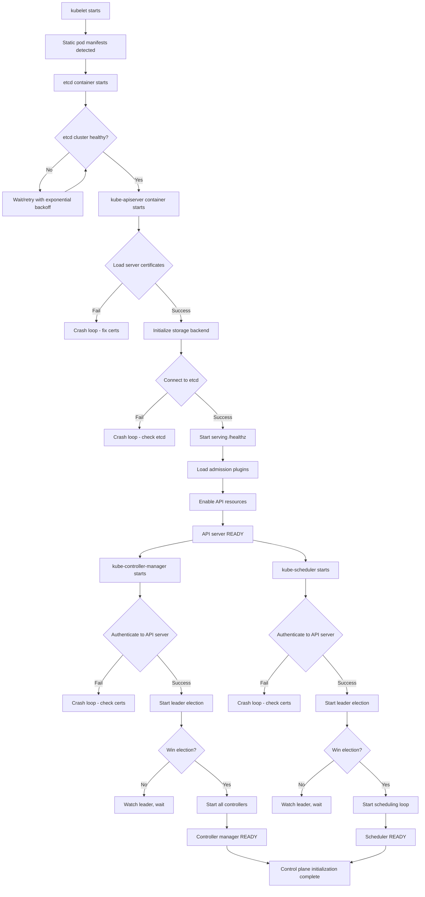
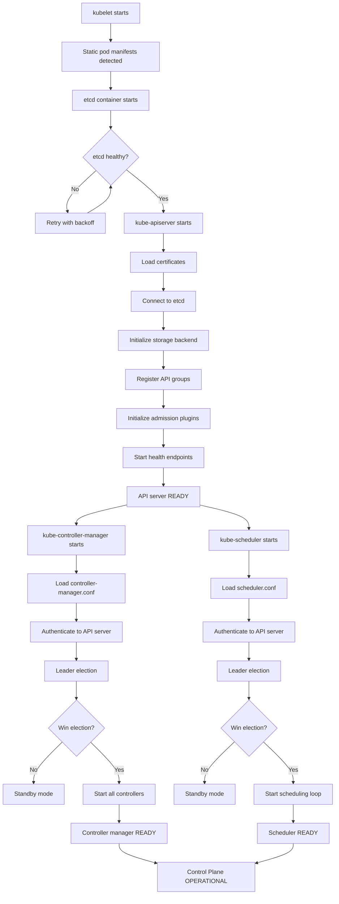

# **Control Plane Initialization - Deep Architectural Analysis**

━━━━━━━━━━━━━━━━━━━━━━━━━━━━━━━━━━━━━━━━━━━━━━━━━━━━━━━━━━━━━━━━━━━━━━━━━━━━━━

## **📋 Document Overview**

**Target Audience**: Platform engineers, Kubernetes architects, SREs managing production clusters, open-source contributors

**Scope**: Deep technical analysis of Kubernetes control plane component initialization sequences, bootstrap dependencies, startup ordering, and failure recovery mechanisms. This document examines initialization at the source code level to help platform engineers understand the intricate startup choreography and design custom cluster provisioning tools.

**Prerequisites**:
- Understanding of [kubeadm architecture](./01-kubeadm-architecture.md)
- Familiarity with [API server initialization](../apiserver/middle-level/03-initialization.md)
- Knowledge of [etcd cluster management](../etcd/middle-level/05-cluster-management.md)

━━━━━━━━━━━━━━━━━━━━━━━━━━━━━━━━━━━━━━━━━━━━━━━━━━━━━━━━━━━━━━━━━━━━━━━━━━━━━━

## **🎯 Design Philosophy**

### **Why Initialization Order Matters**

Control plane initialization must solve complex dependency challenges:

1. **Chicken-and-Egg Problems**: Controllers need API server, but API server needs storage (etcd)
2. **Bootstrap Authentication**: Components must authenticate before RBAC is fully initialized
3. **State Restoration**: Cluster must restore state from etcd before accepting new requests
4. **Leader Election**: Controllers must elect leaders before starting reconciliation
5. **Resource Dependencies**: Some resources (CRDs, admission webhooks) must exist before others

### **Core Initialization Principles**

```
┌──────────────────────────────────────────────────────────────┐
│  CONTROL PLANE INITIALIZATION PRINCIPLES                      │
├──────────────────────────────────────────────────────────────┤
│                                                               │
│  1. ORDERED DEPENDENCY INITIALIZATION                        │
│     └─ etcd → API server → controllers → scheduler          │
│                                                               │
│  2. FAIL-FAST VALIDATION                                     │
│     └─ Detect configuration errors before starting services │
│                                                               │
│  3. GRACEFUL DEGRADATION                                     │
│     └─ Components continue with reduced functionality       │
│                                                               │
│  4. IDEMPOTENT STARTUP                                       │
│     └─ Safe to restart at any point in initialization       │
│                                                               │
│  5. HEALTH CHECK GATES                                       │
│     └─ Components report readiness only when fully ready    │
│                                                               │
│  6. BOOTSTRAP TOKEN AUTHENTICATION                           │
│     └─ Special authentication for pre-RBAC initialization   │
│                                                               │
└──────────────────────────────────────────────────────────────┘
```

━━━━━━━━━━━━━━━━━━━━━━━━━━━━━━━━━━━━━━━━━━━━━━━━━━━━━━━━━━━━━━━━━━━━━━━━━━━━━━

## **🏗️ Component Initialization Sequence**

### **High-Level Initialization Flow**



### **Detailed Component Startup Timing**

**Typical Startup Timeline** (fresh cluster, single control plane node):

```
T+0s    : kubelet detects static pod manifests
T+2s    : etcd container starts, initializes data directory
T+5s    : etcd cluster healthy (single-member cluster)
T+6s    : kube-apiserver container starts
T+8s    : API server loads certificates, connects to etcd
T+12s   : API server starts serving /healthz, /readyz
T+14s   : API server enables core API groups (v1, apps/v1)
T+16s   : API server fully initialized, serving all APIs
T+17s   : kube-controller-manager container starts
T+19s   : Controller manager authenticates, starts leader election
T+21s   : Controller manager wins election (no competitors)
T+23s   : Controller manager starts all enabled controllers
T+25s   : kube-scheduler container starts
T+27s   : Scheduler authenticates, starts leader election
T+29s   : Scheduler wins election
T+30s   : Scheduler ready to schedule pods
━━━━━━━━━━━━━━━━━━━━━━━━━━━━━━━━━━━━━━━━━━━━━━━━
Total:  ~30 seconds for control plane to be fully operational
```

**Multi-Master HA Cluster** (3 control plane nodes):
- etcd cluster formation: +10-15 seconds (quorum establishment)
- Controller manager leader election: +2-5 seconds (Lease contention)
- Scheduler leader election: +2-5 seconds
- **Total**: ~45-50 seconds

━━━━━━━━━━━━━━━━━━━━━━━━━━━━━━━━━━━━━━━━━━━━━━━━━━━━━━━━━━━━━━━━━━━━━━━━━━━━━━

## **💾 etcd Initialization**

### **etcd Bootstrap Process**

```go
// staging/src/k8s.io/apiserver/pkg/storage/etcd3/store.go

type store struct {
    client *clientv3.Client
    codec  runtime.Codec
    // ...
}

func New(c *clientv3.Client, codec runtime.Codec) storage.Interface {
    return &store{
        client: c,
        codec:  codec,
    }
}

// Called during API server initialization
func (s *store) Versioner() storage.Versioner {
    return APIObjectVersioner{}
}
```

**etcd Startup Sequence**:

1. **Data Directory Initialization**
```bash
# /etc/kubernetes/manifests/etcd.yaml command
Command:
  - etcd
  - --data-dir=/var/lib/etcd
  - --initial-cluster-state=new  # or 'existing' for joining nodes
```

**Source**: `vendor/go.etcd.io/etcd/server/embed/etcd.go`

```go
func StartEtcd(inCfg *Config) (e *Etcd, err error) {
    // Validate configuration
    if err = inCfg.Validate(); err != nil {
        return nil, err
    }

    // Initialize data directory
    if err = os.MkdirAll(inCfg.Dir, 0700); err != nil {
        return nil, err
    }

    // Check if data directory is empty (new cluster) or existing
    walExist := wal.Exist(inCfg.GetWalDir())

    if walExist {
        // Existing data - restore from WAL
        e, err = restoreFromWAL(inCfg)
    } else {
        // New cluster - bootstrap
        e, err = bootstrapCluster(inCfg)
    }

    // Start serving client requests
    e.Server.Start()

    return e, nil
}
```

2. **Cluster State Detection**

| **Scenario** | **initial-cluster-state** | **Behavior** | **Use Case** |
|--------------|--------------------------|--------------|--------------|
| Fresh cluster | `new` | Creates new cluster, expects all members listed in `--initial-cluster` | `kubeadm init` |
| Existing cluster | `existing` | Joins existing cluster | `kubeadm join` for HA control plane |
| Restored from backup | `new` (with restored data dir) | Restarts as single-member cluster, must re-add members | Disaster recovery |

3. **Health Check Mechanism**

```go
// API server waits for etcd to be healthy before starting
// staging/src/k8s.io/apiserver/pkg/server/config.go

func (c *Config) WaitForStorageBackend(ctx context.Context) error {
    ticker := time.NewTicker(1 * time.Second)
    defer ticker.Stop()

    for {
        select {
        case <-ctx.Done():
            return ctx.Err()
        case <-ticker.C:
            // Try to list a single key to verify etcd is responsive
            _, err := c.RESTOptionsGetter.GetRESTOptions(schema.GroupResource{
                Group: "",
                Resource: "namespaces",
            })
            if err == nil {
                return nil  // etcd is healthy
            }
            klog.V(2).Infof("Waiting for storage backend: %v", err)
        }
    }
}
```

**etcd Health Endpoints**:
```bash
# kubelet health checks etcd via:
curl https://127.0.0.1:2379/health
# Returns: {"health":"true"}

# Liveness probe in static pod manifest:
livenessProbe:
  httpGet:
    path: /health
    port: 2379
    scheme: HTTPS
  initialDelaySeconds: 10
  periodSeconds: 10
  timeoutSeconds: 15
```

### **etcd Bootstrap Failure Scenarios**

#### **Scenario 1: Data Directory Corruption**

**Symptoms**:
```
etcd: invalid WAL CRC
etcd: cannot load WAL segment
```

**Resolution**:
```bash
# Option 1: Restore from snapshot
etcdctl snapshot restore /backup/etcd-snapshot.db --data-dir=/var/lib/etcd-restored

# Update etcd manifest
vi /etc/kubernetes/manifests/etcd.yaml
# Change: --data-dir=/var/lib/etcd-restored

# Option 2: If no backup, start fresh (DESTRUCTIVE - all cluster state lost)
rm -rf /var/lib/etcd
# kubelet will restart etcd with empty data directory
```

#### **Scenario 2: Initial Cluster Mismatch**

**Symptoms**:
```
etcd: member "etcd-1" has already been bootstrapped
etcd: conflicting cluster ID
```

**Cause**: `--initial-cluster` doesn't match existing cluster membership

**Resolution**:
```bash
# For joining nodes, use --initial-cluster-state=existing
# In /etc/kubernetes/manifests/etcd.yaml:
- --initial-cluster-state=existing
- --initial-cluster=etcd-1=https://192.168.1.101:2380,etcd-2=https://192.168.1.102:2380
```

**See**: [etcd Cluster Management](../etcd/middle-level/05-cluster-management.md) for detailed troubleshooting

━━━━━━━━━━━━━━━━━━━━━━━━━━━━━━━━━━━━━━━━━━━━━━━━━━━━━━━━━━━━━━━━━━━━━━━━━━━━━━

## **🌐 kube-apiserver Initialization**

### **API Server Startup Phases**

```go
// cmd/kube-apiserver/app/server.go

func Run(opts *options.ServerRunOptions, stopCh <-chan struct{}) error {
    // Phase 1: Create server configuration
    config, err := CreateServerConfig(opts)

    // Phase 2: Create API server instance
    server, err := CreateAPIServer(config, stopCh)

    // Phase 3: Initialize storage (connect to etcd)
    if err := server.PrepareRun(); err != nil {
        return err
    }

    // Phase 4: Start serving
    return server.Run(stopCh)
}
```

### **Phase 1: Configuration Creation**

**Certificate Loading**:
```go
// staging/src/k8s.io/apiserver/pkg/server/config.go

func LoadTLSConfig(certFile, keyFile, caFile string) (*tls.Config, error) {
    // Load server certificate and key
    cert, err := tls.LoadX509KeyPair(certFile, keyFile)
    if err != nil {
        return nil, fmt.Errorf("failed to load server certificate: %v", err)
    }

    // Load CA certificate for client authentication
    caCert, err := os.ReadFile(caFile)
    if err != nil {
        return nil, fmt.Errorf("failed to load CA certificate: %v", err)
    }

    caCertPool := x509.NewCertPool()
    caCertPool.AppendCertsFromPEM(caCert)

    tlsConfig := &tls.Config{
        Certificates: []tls.Certificate{cert},
        ClientCAs:    caCertPool,
        ClientAuth:   tls.RequireAndVerifyClientCert,  // mTLS enabled
        MinVersion:   tls.VersionTLS12,
    }

    return tlsConfig, nil
}
```

**Certificate Paths** (from static pod manifest):
```yaml
# /etc/kubernetes/manifests/kube-apiserver.yaml
spec:
  containers:
  - command:
    - kube-apiserver
    - --tls-cert-file=/etc/kubernetes/pki/apiserver.crt
    - --tls-private-key-file=/etc/kubernetes/pki/apiserver.key
    - --client-ca-file=/etc/kubernetes/pki/ca.crt
    - --kubelet-client-certificate=/etc/kubernetes/pki/apiserver-kubelet-client.crt
    - --kubelet-client-key=/etc/kubernetes/pki/apiserver-kubelet-client.key
    - --etcd-cafile=/etc/kubernetes/pki/etcd/ca.crt
    - --etcd-certfile=/etc/kubernetes/pki/apiserver-etcd-client.crt
    - --etcd-keyfile=/etc/kubernetes/pki/apiserver-etcd-client.key
```

**Certificate Failure Modes**:

| **Issue** | **Error Message** | **Resolution** |
|-----------|------------------|----------------|
| Missing cert file | `failed to load server certificate: no such file` | Regenerate certificates with `kubeadm init phase certs` |
| Expired certificate | `x509: certificate has expired` | Renew with `kubeadm certs renew apiserver` |
| CA mismatch | `x509: certificate signed by unknown authority` | Ensure all certs signed by same CA |
| Invalid SAN | `x509: certificate is valid for X, not Y` | Regenerate with correct `--apiserver-cert-extra-sans` |

### **Phase 2: Storage Backend Initialization**

```go
// staging/src/k8s.io/apiserver/pkg/server/storage/storage_factory.go

func (s *DefaultStorageFactory) NewConfig(resource schema.GroupResource) (*storagebackend.Config, error) {
    // Create etcd3 storage config
    config := &storagebackend.Config{
        Type: storagebackend.StorageTypeETCD3,
        Transport: storagebackend.TransportConfig{
            ServerList:    s.StorageConfig.Transport.ServerList,  // etcd endpoints
            KeyFile:       s.StorageConfig.Transport.KeyFile,
            TrustedCAFile: s.StorageConfig.Transport.TrustedCAFile,
            CertFile:      s.StorageConfig.Transport.CertFile,
        },
        Prefix: s.StorageConfig.Prefix,  // Default: "/registry"
        // ...
    }

    return config, nil
}

// staging/src/k8s.io/apiserver/pkg/storage/etcd3/store.go

func newClient(cfg *storagebackend.Config) (*clientv3.Client, error) {
    tlsConfig, err := cfg.Transport.TLSConfig()

    client, err := clientv3.New(clientv3.Config{
        Endpoints:   cfg.Transport.ServerList,
        DialTimeout: 5 * time.Second,
        TLS:         tlsConfig,
        // Retry configuration
        DialOptions: []grpc.DialOption{
            grpc.WithBlock(),  // Block until connection established
            grpc.WithReturnConnectionError(),
        },
    })

    // Verify connectivity
    ctx, cancel := context.WithTimeout(context.Background(), 5*time.Second)
    defer cancel()

    _, err = client.Get(ctx, "/")
    if err != nil {
        return nil, fmt.Errorf("failed to connect to etcd: %v", err)
    }

    return client, nil
}
```

**etcd Connection Retry Logic**:
```go
// API server retries etcd connection with exponential backoff
func (s *APIServer) waitForStorageBackend() error {
    backoff := wait.Backoff{
        Duration: 1 * time.Second,
        Factor:   2.0,
        Jitter:   0.1,
        Steps:    10,  // Max ~17 minutes
    }

    err := wait.ExponentialBackoff(backoff, func() (bool, error) {
        if err := s.testStorageConnection(); err != nil {
            klog.Warningf("Storage backend not ready: %v", err)
            return false, nil  // Retry
        }
        return true, nil  // Success
    })

    return err
}
```

**What Gets Stored in etcd**:

| **Resource Type** | **etcd Key Prefix** | **Example Key** |
|-------------------|--------------------|--------------------|
| Pods | `/registry/pods/` | `/registry/pods/default/nginx-abc123` |
| Services | `/registry/services/specs/` | `/registry/services/specs/default/kubernetes` |
| ConfigMaps | `/registry/configmaps/` | `/registry/configmaps/kube-system/kubeadm-config` |
| Secrets | `/registry/secrets/` | `/registry/secrets/default/my-secret` |
| Events | `/registry/events/` | `/registry/events/default/nginx-abc123.xxxxx` |

**Verification**:
```bash
# List all keys in etcd
ETCDCTL_API=3 etcdctl get / --prefix --keys-only \
    --endpoints=https://127.0.0.1:2379 \
    --cacert=/etc/kubernetes/pki/etcd/ca.crt \
    --cert=/etc/kubernetes/pki/apiserver-etcd-client.crt \
    --key=/etc/kubernetes/pki/apiserver-etcd-client.key

# Get a specific pod from etcd
ETCDCTL_API=3 etcdctl get /registry/pods/default/nginx --print-value-only
# Output: Binary protobuf data (not human-readable without decoding)
```

### **Phase 3: API Group Registration**

```go
// staging/src/k8s.io/apiserver/pkg/server/genericapiserver.go

func (s *GenericAPIServer) InstallLegacyAPIGroup(apiPrefix string, apiGroupInfo *APIGroupInfo) error {
    // Install core v1 API group (/api/v1)
    if err := s.installAPIResources(apiPrefix, apiGroupInfo); err != nil {
        return err
    }

    // Register discovery endpoints
    s.DiscoveryGroupManager.AddGroup(metav1.APIGroup{
        Name: "",
        Versions: []metav1.GroupVersionForDiscovery{
            {
                GroupVersion: "v1",
                Version:      "v1",
            },
        },
        PreferredVersion: metav1.GroupVersionForDiscovery{
            GroupVersion: "v1",
            Version:      "v1",
        },
    })

    return nil
}

func (s *GenericAPIServer) InstallAPIGroups(apiGroupInfos ...*APIGroupInfo) error {
    // Install named API groups (apps/v1, batch/v1, etc.)
    for _, apiGroupInfo := range apiGroupInfos {
        if err := s.installAPIGroup(apiGroupInfo); err != nil {
            return err
        }
    }

    return nil
}
```

**API Group Registration Order**:

```
1. Core API group (v1):          /api/v1
   - Pods, Services, ConfigMaps, Secrets, Namespaces, ...

2. Named API groups:
   - apps/v1:                    /apis/apps/v1
     - Deployments, StatefulSets, DaemonSets, ...

   - batch/v1:                   /apis/batch/v1
     - Jobs, CronJobs

   - rbac.authorization.k8s.io/v1:  /apis/rbac.authorization.k8s.io/v1
     - Roles, ClusterRoles, RoleBindings, ...

   - networking.k8s.io/v1:       /apis/networking.k8s.io/v1
     - NetworkPolicies, Ingresses

3. Aggregated APIs (if configured):
   - metrics.k8s.io/v1beta1:     /apis/metrics.k8s.io/v1beta1
     - (Served by metrics-server, not API server)
```

**Discovery Mechanism**:
```bash
# List all API groups
kubectl api-resources

# Get core API resources
curl https://localhost:6443/api/v1 -k --cert /etc/kubernetes/pki/apiserver-kubelet-client.crt --key /etc/kubernetes/pki/apiserver-kubelet-client.key

# Get named API groups
curl https://localhost:6443/apis -k --cert /etc/kubernetes/pki/apiserver-kubelet-client.crt --key /etc/kubernetes/pki/apiserver-kubelet-client.key
```

### **Phase 4: Admission Plugin Initialization**

```go
// plugin/pkg/admission/initialization/initialization.go

func (i *PluginInitializer) Initialize(plugin admission.Interface) {
    // Inject dependencies into admission plugins
    if wants, ok := plugin.(WantsExternalKubeClientSet); ok {
        wants.SetExternalKubeClientSet(i.externalClient)
    }

    if wants, ok := plugin.(WantsExternalKubeInformerFactory); ok {
        wants.SetExternalKubeInformerFactory(i.informerFactory)
    }

    // ... more dependency injections
}

// Example: PodSecurity admission plugin
func (a *PodSecurity) ValidateInitialization() error {
    if a.client == nil {
        return fmt.Errorf("missing client")
    }
    if a.defaultPolicy == nil {
        return fmt.Errorf("missing default policy")
    }
    return nil
}
```

**Critical Admission Plugins**:

| **Plugin** | **Purpose** | **Initialization Dependency** | **Failure Impact** |
|------------|-------------|------------------------------|-------------------|
| `NamespaceLifecycle` | Prevent creation in terminating namespaces | None | Medium (UX degradation) |
| `LimitRanger` | Enforce resource limits | Informer (LimitRange resources) | Low (limits not enforced) |
| `ServiceAccount` | Auto-inject service account tokens | TokenController running | High (pods can't authenticate) |
| `PodSecurity` | Enforce Pod Security Standards | None | High (security bypassed) |
| `MutatingAdmissionWebhook` | Call external mutating webhooks | Webhook configurations exist | Medium (mutations skipped) |
| `ValidatingAdmissionWebhook` | Call external validating webhooks | Webhook configurations exist | Medium (validations skipped) |

**Admission Plugin Ordering**:
```yaml
# /etc/kubernetes/manifests/kube-apiserver.yaml
- --enable-admission-plugins=NamespaceLifecycle,LimitRanger,ServiceAccount,PersistentVolumeLabel,DefaultStorageClass,DefaultTolerationSeconds,MutatingAdmissionWebhook,ValidatingAdmissionWebhook,ResourceQuota,PodSecurity
```

**Order matters**:
1. **Mutating plugins first** (modify objects)
2. **Validating plugins last** (validate final state)

### **Phase 5: Health Endpoints**

```go
// staging/src/k8s.io/apiserver/pkg/server/healthz/healthz.go

func InstallHandler(mux *http.ServeMux, checks ...HealthChecker) {
    // Register /healthz endpoint
    mux.HandleFunc("/healthz", func(w http.ResponseWriter, r *http.Request) {
        var failed bool
        var verboseOutput strings.Builder

        for _, check := range checks {
            err := check.Check(r)
            if err != nil {
                verboseOutput.WriteString(fmt.Sprintf("[-]%s failed: %v\n", check.Name(), err))
                failed = true
            } else {
                verboseOutput.WriteString(fmt.Sprintf("[+]%s ok\n", check.Name()))
            }
        }

        if failed {
            http.Error(w, verboseOutput.String(), http.StatusInternalServerError)
        } else {
            w.WriteHeader(http.StatusOK)
            w.Write([]byte("ok"))
        }
    })
}

// Register /readyz endpoint (stricter than /healthz)
func InstallReadyzHandler(mux *http.ServeMux, checks ...HealthChecker) {
    // Readiness includes additional checks:
    // - All API groups registered
    // - All admission plugins initialized
    // - Informers synced
    // Similar logic to /healthz but more comprehensive
}
```

**Health Check Components**:

| **Endpoint** | **Checks** | **Used By** | **Purpose** |
|--------------|-----------|-------------|-------------|
| `/healthz` | etcd connectivity, API server process alive | kubelet liveness probe | Restart if unhealthy |
| `/readyz` | All initialization complete, can serve requests | kubelet readiness probe | Traffic routing |
| `/livez` | Same as `/healthz` | kubelet liveness probe (newer) | Restart if unhealthy |

**Example Health Check**:
```bash
# Check if API server is healthy
curl -k https://localhost:6443/healthz
# Output: ok

# Verbose health check
curl -k https://localhost:6443/healthz?verbose
# Output:
# [+]ping ok
# [+]log ok
# [+]etcd ok
# [+]poststarthook/start-kube-apiserver-admission-initializer ok
# ...
# healthz check passed
```

**kubelet Static Pod Health Probes**:
```yaml
# /etc/kubernetes/manifests/kube-apiserver.yaml
livenessProbe:
  httpGet:
    path: /livez
    port: 6443
    scheme: HTTPS
  initialDelaySeconds: 10
  periodSeconds: 10
  timeoutSeconds: 15
  failureThreshold: 8  # Restart after 80 seconds of failure

readinessProbe:
  httpGet:
    path: /readyz
    port: 6443
    scheme: HTTPS
  initialDelaySeconds: 0
  periodSeconds: 1
  timeoutSeconds: 15
```

### **API Server Initialization Failure Scenarios**

#### **Scenario 1: etcd Connection Failure**

**Symptoms**:
```bash
$ kubectl get pods
The connection to the server localhost:6443 was refused - did you specify the right host or port?
```

**API Server Logs**:
```
Error: failed to create etcd client: context deadline exceeded
```

**Root Causes**:
- etcd not running
- Incorrect etcd endpoints in API server configuration
- Certificate mismatch between API server and etcd

**Investigation**:
```bash
# Check if etcd is running
kubectl get pods -n kube-system | grep etcd

# If static pod, check kubelet logs
journalctl -u kubelet | grep etcd

# Check etcd directly
ETCDCTL_API=3 etcdctl endpoint health \
    --endpoints=https://127.0.0.1:2379 \
    --cacert=/etc/kubernetes/pki/etcd/ca.crt \
    --cert=/etc/kubernetes/pki/etcd/server.crt \
    --key=/etc/kubernetes/pki/etcd/server.key

# Verify API server can connect to etcd
openssl s_client -connect 127.0.0.1:2379 \
    -cert /etc/kubernetes/pki/apiserver-etcd-client.crt \
    -key /etc/kubernetes/pki/apiserver-etcd-client.key \
    -CAfile /etc/kubernetes/pki/etcd/ca.crt
```

**Resolution**:
```bash
# Fix etcd configuration
vi /etc/kubernetes/manifests/etcd.yaml

# Or fix API server etcd client configuration
vi /etc/kubernetes/manifests/kube-apiserver.yaml
# Verify:
# - --etcd-servers=https://127.0.0.1:2379
# - --etcd-cafile=/etc/kubernetes/pki/etcd/ca.crt
# - --etcd-certfile=/etc/kubernetes/pki/apiserver-etcd-client.crt
# - --etcd-keyfile=/etc/kubernetes/pki/apiserver-etcd-client.key
```

#### **Scenario 2: Admission Webhook Timeout**

**Symptoms**:
```bash
$ kubectl create deployment nginx --image=nginx
Error from server (Timeout): error when creating deployment: Timeout: request did not complete within requested timeout 30s
```

**Root Cause**: Validating or mutating admission webhook not responding

**Investigation**:
```bash
# List webhook configurations
kubectl get validatingwebhookconfigurations
kubectl get mutatingwebhookconfigurations

# Check webhook endpoint
kubectl describe validatingwebhookconfiguration <name>

# Test webhook endpoint manually
curl -k https://<webhook-service>.<namespace>.svc:443/validate
```

**Workaround** (temporary):
```bash
# Delete problematic webhook configuration
kubectl delete validatingwebhookconfiguration <name>

# API server will immediately stop calling webhook
```

**Permanent Fix**:
- Fix webhook service/deployment
- Adjust webhook `failurePolicy: Ignore` (if acceptable)
- Set reasonable `timeoutSeconds` (default: 10s)

━━━━━━━━━━━━━━━━━━━━━━━━━━━━━━━━━━━━━━━━━━━━━━━━━━━━━━━━━━━━━━━━━━━━━━━━━━━━━━

## **🎛️ kube-controller-manager Initialization**

### **Controller Manager Startup Sequence**

```go
// cmd/kube-controller-manager/app/controllermanager.go

func Run(c *config.CompletedConfig, stopCh <-chan struct{}) error {
    // Phase 1: Create client for API server
    client, err := c.ClientBuilder.Client("controller-manager")

    // Phase 2: Start leader election
    leaderElector, err := leaderelection.NewLeaderElector(leaderelection.LeaderElectionConfig{
        Lock: &resourcelock.LeaseLock{
            LeaseMeta: metav1.ObjectMeta{
                Name:      "kube-controller-manager",
                Namespace: "kube-system",
            },
            Client: client.CoordinationV1(),
        },
        LeaseDuration: 15 * time.Second,
        RenewDeadline: 10 * time.Second,
        RetryPeriod:   2 * time.Second,
        Callbacks: leaderelection.LeaderCallbacks{
            OnStartedLeading: func(ctx context.Context) {
                // Phase 3: Start all controllers
                run(ctx, c)
            },
            OnStoppedLeading: func() {
                klog.Fatal("lost leader lease")
            },
        },
    })

    // Start leader election loop
    leaderElector.Run(context.Background())

    return nil
}
```

### **Phase 1: Client Creation and Authentication**

```go
// pkg/controller/client_builder.go

func (c *SimpleControllerClientBuilder) Client(name string) (clientset.Interface, error) {
    // Load in-cluster configuration
    config, err := rest.InClusterConfig()

    // In-cluster config uses:
    // - Token: /var/run/secrets/kubernetes.io/serviceaccount/token (for Pods)
    // - For static pods, uses kubeconfig file instead

    // For static pods (kube-controller-manager):
    config, err = clientcmd.BuildConfigFromFlags("", "/etc/kubernetes/controller-manager.conf")

    client, err := clientset.NewForConfig(config)

    return client, nil
}
```

**controller-manager.conf Structure**:
```yaml
apiVersion: v1
kind: Config
clusters:
- cluster:
    certificate-authority-data: <base64-encoded-ca-cert>
    server: https://127.0.0.1:6443
  name: kubernetes
contexts:
- context:
    cluster: kubernetes
    user: system:kube-controller-manager
  name: system:kube-controller-manager@kubernetes
current-context: system:kube-controller-manager@kubernetes
users:
- name: system:kube-controller-manager
  user:
    client-certificate-data: <base64-encoded-cert>
    client-key-data: <base64-encoded-key>
```

**Authentication Flow**:
1. Controller manager reads `/etc/kubernetes/controller-manager.conf`
2. Extracts client certificate and key
3. Makes TLS-authenticated request to API server
4. API server validates certificate against CA
5. API server extracts username from certificate CN: `system:kube-controller-manager`
6. RBAC check: Is `system:kube-controller-manager` allowed to perform this action?

**Required RBAC Permissions**:
```yaml
# system:kube-controller-manager ClusterRole (pre-created)
apiVersion: rbac.authorization.k8s.io/v1
kind: ClusterRole
metadata:
  name: system:kube-controller-manager
rules:
- apiGroups: [""]
  resources: ["*"]
  verbs: ["*"]  # Nearly full permissions
- apiGroups: ["apps"]
  resources: ["*"]
  verbs: ["*"]
# ... (extensive permissions for all controller operations)
```

### **Phase 2: Leader Election**

```go
// vendor/k8s.io/client-go/tools/leaderelection/leaderelection.go

func (le *LeaderElector) Run(ctx context.Context) {
    // Try to acquire leader lease
    if !le.tryAcquireOrRenew(ctx) {
        // Failed to acquire - watch for leader changes
        le.watchLeader(ctx)
        return
    }

    // Acquired lease - become leader
    le.config.Callbacks.OnStartedLeading(ctx)

    // Renew lease periodically
    go le.renew(ctx)

    <-ctx.Done()
}

func (le *LeaderElector) tryAcquireOrRenew(ctx context.Context) bool {
    now := metav1.Now()

    // Get existing lease
    lease, err := le.config.Lock.Get(ctx)

    if err != nil {
        // Lease doesn't exist - create it
        lease = &coordinationv1.Lease{
            ObjectMeta: metav1.ObjectMeta{
                Name:      le.config.Lock.Identity(),
                Namespace: le.config.Lock.Namespace(),
            },
            Spec: coordinationv1.LeaseSpec{
                HolderIdentity:       &le.config.Identity,
                LeaseDurationSeconds: int32(le.config.LeaseDuration.Seconds()),
                AcquireTime:          &now,
                RenewTime:            &now,
            },
        }

        _, err = le.config.Lock.Create(ctx, lease)
        return err == nil
    }

    // Lease exists - check if we can acquire it
    if lease.Spec.HolderIdentity != nil && *lease.Spec.HolderIdentity != le.config.Identity {
        // Another instance holds the lease
        renewTime := lease.Spec.RenewTime
        if time.Since(renewTime.Time) < le.config.LeaseDuration {
            // Lease still valid - cannot acquire
            return false
        }
        // Lease expired - we can steal it
    }

    // Update lease
    lease.Spec.HolderIdentity = &le.config.Identity
    lease.Spec.RenewTime = &now

    _, err = le.config.Lock.Update(ctx, lease)
    return err == nil
}
```

**Leader Election Parameters**:

| **Parameter** | **Default Value** | **Purpose** | **Impact of Tuning** |
|---------------|------------------|-------------|---------------------|
| `LeaseDuration` | 15 seconds | How long lease is valid | Lower = faster failover, higher churn |
| `RenewDeadline` | 10 seconds | Deadline for leader to renew lease | Must be < LeaseDuration |
| `RetryPeriod` | 2 seconds | How often to attempt acquisition/renewal | Lower = more API calls, faster detection |

**Lease Resource**:
```bash
# View current leader
kubectl get lease -n kube-system kube-controller-manager -o yaml
```

```yaml
apiVersion: coordination.k8s.io/v1
kind: Lease
metadata:
  name: kube-controller-manager
  namespace: kube-system
spec:
  holderIdentity: "control-plane-1_abc123-def456"
  leaseDurationSeconds: 15
  acquireTime: "2024-01-15T10:30:00Z"
  renewTime: "2024-01-15T10:30:45Z"
```

**Multi-Master Scenario**:
```
Control Plane Node 1:
  - kube-controller-manager instance: "control-plane-1_abc123"
  - Tries to acquire lease
  - Succeeds → becomes leader
  - Starts all controllers

Control Plane Node 2:
  - kube-controller-manager instance: "control-plane-2_def456"
  - Tries to acquire lease
  - Fails (lease held by control-plane-1)
  - Watches lease, waiting for expiration
  - Does NOT start controllers

Control Plane Node 3:
  - kube-controller-manager instance: "control-plane-3_ghi789"
  - Tries to acquire lease
  - Fails
  - Watches lease

[If control-plane-1 crashes or lease renewal fails]:
  - control-plane-2 or control-plane-3 steals lease
  - New leader starts controllers
  - Failover time: RenewDeadline + RetryPeriod ≈ 12 seconds
```

**See**: [Leader Election Implementation](../distributed-systems/03-leader-election.md)

### **Phase 3: Controller Initialization**

```go
// cmd/kube-controller-manager/app/controllermanager.go

func NewControllerInitializers() map[string]InitFunc {
    controllers := map[string]InitFunc{}

    // Register all controllers
    controllers["deployment"] = startDeploymentController
    controllers["replicaset"] = startReplicaSetController
    controllers["statefulset"] = startStatefulSetController
    controllers["daemonset"] = startDaemonSetController
    controllers["job"] = startJobController
    controllers["cronjob"] = startCronJobController
    controllers["namespace"] = startNamespaceController
    controllers["serviceaccount"] = startServiceAccountController
    controllers["garbagecollector"] = startGarbageCollectorController
    controllers["endpoint"] = startEndpointController
    controllers["endpointslice"] = startEndpointSliceController
    controllers["node"] = startNodeController
    controllers["persistentvolume-binder"] = startPersistentVolumeBinderController
    controllers["attachdetach"] = startAttachDetachController
    controllers["persistentvolume-expander"] = startVolumeExpandController
    // ... 30+ controllers total

    return controllers
}

func StartControllers(ctx context.Context, controllers map[string]InitFunc) error {
    // Start each enabled controller
    for controllerName, initFn := range controllers {
        if !isControllerEnabled(controllerName) {
            klog.Infof("Controller %s is disabled", controllerName)
            continue
        }

        klog.Infof("Starting controller: %s", controllerName)
        _, err := initFn(ctx)
        if err != nil {
            return fmt.Errorf("error starting %s controller: %v", controllerName, err)
        }
    }

    return nil
}
```

**Controller Startup Order** (matters for some controllers):

```
1. Namespace Controller
   └─ Must run first to handle namespace lifecycle

2. ServiceAccount Controller
   └─ Creates default service accounts in new namespaces

3. ServiceAccount Token Controller
   └─ Creates tokens for service accounts

4. Core Resource Controllers (parallel):
   ├─ Node Controller
   ├─ PersistentVolume Binder
   ├─ Endpoint Controller
   └─ Garbage Collector

5. Workload Controllers (parallel):
   ├─ ReplicaSet Controller
   ├─ Deployment Controller
   ├─ StatefulSet Controller
   ├─ DaemonSet Controller
   ├─ Job Controller
   └─ CronJob Controller

6. Storage Controllers (parallel):
   ├─ AttachDetach Controller
   ├─ PersistentVolume Expander
   └─ Volume Protection Controller

7. Certificate Controllers:
   ├─ CSR Approver
   └─ CSR Signer
```

**Informer Synchronization**:
```go
// Each controller uses shared informers
// Informers must sync before controller can start processing

func (c *DeploymentController) Run(workers int, stopCh <-chan struct{}) {
    defer utilruntime.HandleCrash()
    defer c.queue.ShutDown()

    klog.Infof("Starting deployment controller")
    defer klog.Infof("Shutting down deployment controller")

    // Wait for informer caches to sync
    if !cache.WaitForCacheSync(stopCh, c.dListerSynced, c.rsListerSynced, c.podListerSynced) {
        return
    }

    // Start worker goroutines
    for i := 0; i < workers; i++ {
        go wait.Until(c.worker, time.Second, stopCh)
    }

    <-stopCh
}
```

**Typical Informer Sync Time**: 1-5 seconds (depends on cluster size)

### **Controller Manager Health Checks**

```go
// cmd/kube-controller-manager/app/serving.go

func InstallHealthz(mux *mux.PathRecorderMux) {
    // Leader election health check
    mux.HandleFunc("/healthz/leader", func(w http.ResponseWriter, r *http.Request) {
        if isLeader() {
            w.WriteHeader(http.StatusOK)
            w.Write([]byte("ok"))
        } else {
            http.Error(w, "not leader", http.StatusServiceUnavailable)
        }
    })

    // Overall health (always returns OK if process is running)
    mux.HandleFunc("/healthz", func(w http.ResponseWriter, r *http.Request) {
        w.WriteHeader(http.StatusOK)
        w.Write([]byte("ok"))
    })
}
```

**Static Pod Health Probes**:
```yaml
# /etc/kubernetes/manifests/kube-controller-manager.yaml
livenessProbe:
  httpGet:
    path: /healthz
    port: 10257
    scheme: HTTPS
  initialDelaySeconds: 10
  periodSeconds: 10
  timeoutSeconds: 15
  failureThreshold: 8

# Note: No readinessProbe - controller manager is either leader or standby
# Readiness doesn't affect traffic routing (no inbound requests)
```

━━━━━━━━━━━━━━━━━━━━━━━━━━━━━━━━━━━━━━━━━━━━━━━━━━━━━━━━━━━━━━━━━━━━━━━━━━━━━━

## **📅 kube-scheduler Initialization**

### **Scheduler Startup Sequence**

```go
// cmd/kube-scheduler/app/server.go

func Run(ctx context.Context, cc *schedulerappconfig.CompletedConfig) error {
    // Phase 1: Create informer factory
    informerFactory := informers.NewSharedInformerFactory(cc.Client, 0)

    // Phase 2: Create scheduler instance
    sched, err := scheduler.New(
        cc.Client,
        informerFactory,
        cc.Recorder,
        ctx.Done(),
    )

    // Phase 3: Start leader election
    leaderElector, err := leaderelection.NewLeaderElector(leaderelection.LeaderElectionConfig{
        Lock: &resourcelock.LeaseLock{
            LeaseMeta: metav1.ObjectMeta{
                Name:      "kube-scheduler",
                Namespace: "kube-system",
            },
            Client: cc.Client.CoordinationV1(),
        },
        LeaseDuration: 15 * time.Second,
        RenewDeadline: 10 * time.Second,
        RetryPeriod:   2 * time.Second,
        Callbacks: leaderelection.LeaderCallbacks{
            OnStartedLeading: func(ctx context.Context) {
                // Start informers
                informerFactory.Start(ctx.Done())

                // Wait for cache sync
                informerFactory.WaitForCacheSync(ctx.Done())

                // Phase 4: Run scheduler
                sched.Run(ctx)
            },
            OnStoppedLeading: func() {
                klog.Fatal("lost leader lease")
            },
        },
    })

    leaderElector.Run(ctx)

    return nil
}
```

### **Scheduling Framework Initialization**

```go
// pkg/scheduler/scheduler.go

func New(
    client clientset.Interface,
    informerFactory informers.SharedInformerFactory,
    recorderFactory profile.RecorderFactory,
    stopCh <-chan struct{},
    opts ...Option,
) (*Scheduler, error) {
    // Create scheduler profile (default or custom)
    profile, err := newProfile(opts...)

    // Initialize scheduling queue
    schedulingQueue := internalqueue.NewSchedulingQueue(
        profile.QueueSort,
        informerFactory,
    )

    // Initialize framework plugins
    plugins, err := buildSchedulerPlugins(profile, informerFactory)

    sched := &Scheduler{
        SchedulerCache:  schedulercache.New(30*time.Second, stopCh),
        Algorithm:       genericScheduler,
        Profiles:        []*profile.Profile{profile},
        NextPod:         internalqueue.MakeNextPodFunc(schedulingQueue),
        Error:           MakeDefaultErrorFunc(client, schedulingQueue, schedulerCache),
        StopEverything:  stopCh,
        SchedulingQueue: schedulingQueue,
    }

    // Add event handlers to informers
    addAllEventHandlers(sched, informerFactory)

    return sched, nil
}
```

### **Scheduling Loop**

```go
// pkg/scheduler/scheduler.go

func (sched *Scheduler) Run(ctx context.Context) {
    // Start one scheduling cycle goroutine
    go wait.UntilWithContext(ctx, sched.scheduleOne, 0)

    <-ctx.Done()
}

func (sched *Scheduler) scheduleOne(ctx context.Context) {
    // Get next pod to schedule
    podInfo := sched.NextPod()
    if podInfo == nil || podInfo.Pod == nil {
        return
    }
    pod := podInfo.Pod

    // Run scheduling cycle
    scheduleResult, err := sched.Algorithm.Schedule(ctx, sched.Profiles[0], pod)

    if err != nil {
        // Scheduling failed
        sched.Error(podInfo, err)
        return
    }

    // Assume pod on node (optimistic binding)
    err = sched.assume(pod, scheduleResult.SuggestedHost)
    if err != nil {
        return
    }

    // Run binding cycle asynchronously
    go func() {
        // Run pre-bind plugins
        err := sched.RunPreBindPlugins(ctx, pod, scheduleResult.SuggestedHost)
        if err != nil {
            sched.Error(podInfo, err)
            return
        }

        // Bind pod to node
        err = sched.bind(ctx, pod, scheduleResult.SuggestedHost)
        if err != nil {
            sched.Error(podInfo, err)
            return
        }

        // Run post-bind plugins
        sched.RunPostBindPlugins(ctx, pod, scheduleResult.SuggestedHost)
    }()
}
```

**Scheduling Cycle Phases**:

```
┌────────────────────────────────────────────────────────────┐
│  SCHEDULING CYCLE (for each pod)                           │
├────────────────────────────────────────────────────────────┤
│                                                             │
│  1. PreFilter       │  Check pod requirements              │
│     ↓                 (e.g., PVC exists)                   │
│                                                             │
│  2. Filter          │  Find feasible nodes                 │
│     ↓                 (40 nodes → 10 feasible)             │
│                                                             │
│  3. PreScore        │  Prepare for scoring                 │
│     ↓                                                       │
│                                                             │
│  4. Score           │  Score each feasible node            │
│     ↓                 (10 nodes → scores 0-100)            │
│                                                             │
│  5. NormalizeScore  │  Normalize scores                    │
│     ↓                                                       │
│                                                             │
│  6. Reserve         │  Reserve resources on chosen node    │
│     ↓                                                       │
│                                                             │
│  7. Permit          │  Final approval                      │
│                                                             │
├────────────────────────────────────────────────────────────┤
│  BINDING CYCLE (async)                                     │
├────────────────────────────────────────────────────────────┤
│                                                             │
│  8. PreBind         │  Pre-binding hooks                   │
│     ↓                 (e.g., provision volumes)            │
│                                                             │
│  9. Bind            │  Update pod.spec.nodeName            │
│     ↓                                                       │
│                                                             │
│  10. PostBind       │  Post-binding hooks                  │
│                      (e.g., metrics, cleanup)              │
│                                                             │
└────────────────────────────────────────────────────────────┘
```

**See**: [Scheduler Architecture](../scheduler/high-level/01-scheduler-architecture.md) for detailed scheduling algorithm

### **Scheduler Health Checks**

```yaml
# /etc/kubernetes/manifests/kube-scheduler.yaml
livenessProbe:
  httpGet:
    path: /healthz
    port: 10259
    scheme: HTTPS
  initialDelaySeconds: 10
  periodSeconds: 10
  timeoutSeconds: 15
  failureThreshold: 8
```

━━━━━━━━━━━━━━━━━━━━━━━━━━━━━━━━━━━━━━━━━━━━━━━━━━━━━━━━━━━━━━━━━━━━━━━━━━━━━━

## **⚡ Bootstrap Sequence Dependencies**

### **Dependency Graph**



### **Critical Path Analysis**

**Longest Dependency Chain** (single control plane node):

```
kubelet → etcd (5s) → API server (10s) → controller-manager leader election (5s) → controllers start (3s) → READY

Total: ~23 seconds
```

**Parallelizable Components**:
- Controller manager and scheduler start simultaneously once API server is ready
- Both run leader election in parallel
- No dependency between controller manager and scheduler

**Failure Cascades**:
```
etcd fails to start
  ↓
API server cannot connect to storage
  ↓
API server enters crash loop
  ↓
Controller manager cannot authenticate
  ↓
Controller manager enters crash loop
  ↓
Scheduler cannot authenticate
  ↓
Scheduler enters crash loop
  ↓
━━━━━━━━━━━━━━━━━━━━━━━━━━━━━━━━━━━━━━━━━━━
Result: Entire control plane non-functional
```

**Resolution Priority**:
1. Fix etcd first (foundation)
2. API server will self-heal once etcd is healthy
3. Controller manager and scheduler will self-heal once API server is healthy

━━━━━━━━━━━━━━━━━━━━━━━━━━━━━━━━━━━━━━━━━━━━━━━━━━━━━━━━━━━━━━━━━━━━━━━━━━━━━━

## **🔍 Debugging Initialization Issues**

### **Diagnostic Workflow**

```bash
#!/bin/bash
# diagnose-control-plane.sh

echo "=== Control Plane Diagnostics ==="

# Step 1: Check kubelet status
echo "1. Checking kubelet..."
systemctl status kubelet
if [ $? -ne 0 ]; then
    echo "ERROR: kubelet not running"
    journalctl -u kubelet -n 50
    exit 1
fi

# Step 2: Check static pods
echo "2. Checking static pods..."
kubectl get pods -n kube-system | grep -E 'etcd|kube-apiserver|kube-controller-manager|kube-scheduler'

# Step 3: Check etcd
echo "3. Checking etcd health..."
ETCDCTL_API=3 etcdctl endpoint health \
    --endpoints=https://127.0.0.1:2379 \
    --cacert=/etc/kubernetes/pki/etcd/ca.crt \
    --cert=/etc/kubernetes/pki/etcd/server.crt \
    --key=/etc/kubernetes/pki/etcd/server.key

if [ $? -ne 0 ]; then
    echo "ERROR: etcd unhealthy"
    kubectl logs -n kube-system etcd-$(hostname) --tail=100
    exit 1
fi

# Step 4: Check API server
echo "4. Checking API server..."
curl -k https://localhost:6443/healthz
if [ $? -ne 0 ]; then
    echo "ERROR: API server not responding"
    kubectl logs -n kube-system kube-apiserver-$(hostname) --tail=100
    exit 1
fi

# Step 5: Check controller manager
echo "5. Checking controller manager..."
curl -k https://localhost:10257/healthz
kubectl logs -n kube-system kube-controller-manager-$(hostname) --tail=50

# Step 6: Check scheduler
echo "6. Checking scheduler..."
curl -k https://localhost:10259/healthz
kubectl logs -n kube-system kube-scheduler-$(hostname) --tail=50

# Step 7: Check leader election
echo "7. Checking leader election..."
kubectl get lease -n kube-system kube-controller-manager -o yaml
kubectl get lease -n kube-system kube-scheduler -o yaml

echo "=== Diagnostics Complete ==="
```

### **Common Initialization Failures**

| **Symptom** | **Component** | **Root Cause** | **Investigation** | **Resolution** |
|-------------|--------------|---------------|------------------|---------------|
| API server crash loop | kube-apiserver | etcd connection failure | `kubectl logs kube-apiserver-*` | Fix etcd configuration |
| "connection refused" | kube-apiserver | Not started or crash loop | `journalctl -u kubelet` | Check static pod manifest |
| Controller manager standby forever | kube-controller-manager | Cannot win leader election | `kubectl get lease -n kube-system` | Check network, delete stale lease |
| Pods stuck in Pending | kube-scheduler | Scheduler not running/not leader | `kubectl get lease kube-scheduler` | Check scheduler logs |
| Certificates expired | All components | Certificate expiration | `kubeadm certs check-expiration` | `kubeadm certs renew all` |

━━━━━━━━━━━━━━━━━━━━━━━━━━━━━━━━━━━━━━━━━━━━━━━━━━━━━━━━━━━━━━━━━━━━━━━━━━━━━━

## **🔗 Related Documentation**

### **Component-Specific Details**
- **[kubeadm Architecture](./01-kubeadm-architecture.md)** - Bootstrap process and initial cluster setup
- **[API Server Initialization](../apiserver/middle-level/03-initialization.md)** - Detailed API server startup
- **[etcd Cluster Management](../etcd/middle-level/05-cluster-management.md)** - etcd startup and cluster formation
- **[Leader Election](../distributed-systems/03-leader-election.md)** - Controller manager and scheduler HA
- **[Certificate Management](../controller-manager/17-certificate-controllers.md)** - Certificate bootstrapping and renewal

### **Operational Context**
- **[High Availability Setup](./04-high-availability-cluster-setup.md)** - Multi-master initialization
- **[Disaster Recovery](../scalability/04-disaster-recovery-strategies.md)** - Recovering from initialization failures
- **[Troubleshooting Patterns](../common/13-common-patterns-integration.md)** - Debugging distributed system issues

━━━━━━━━━━━━━━━━━━━━━━━━━━━━━━━━━━━━━━━━━━━━━━━━━━━━━━━━━━━━━━━━━━━━━━━━━━━━━━

## **📚 Key Takeaways**

### **For Platform Engineers**

1. **Initialization is Strictly Ordered**:
   - etcd must be healthy before API server starts
   - API server must be ready before controller manager/scheduler can authenticate
   - Leader election must complete before controllers/scheduler start work

2. **Failure Modes Cascade**:
   - etcd failure blocks entire control plane
   - API server failure blocks controller manager and scheduler
   - Fix issues from bottom up: etcd → API server → controllers/scheduler

3. **Health Checks are Critical**:
   - `/healthz`: Process alive
   - `/readyz`: Fully initialized and ready
   - kubelet uses these to restart unhealthy components

4. **Leader Election Enables HA**:
   - Multiple controller managers/schedulers can run
   - Only one actively processes resources
   - Failover time: ~10-15 seconds

5. **Static Pods Bootstrap the System**:
   - kubelet manages control plane components
   - No API server needed to start static pods
   - Self-healing through kubelet restart

### **For Kubernetes Contributors**

1. **Initialization Code Locations**:
   - etcd: `vendor/go.etcd.io/etcd/server/embed/`
   - API server: `cmd/kube-apiserver/app/server.go`
   - Controller manager: `cmd/kube-controller-manager/app/controllermanager.go`
   - Scheduler: `cmd/kube-scheduler/app/server.go`

2. **Key Design Patterns**:
   - **Fail-fast validation**: Catch configuration errors early
   - **Exponential backoff retries**: Gracefully handle transient failures
   - **Health check gates**: Only report ready when truly ready
   - **Leader election**: HA without split-brain

3. **Extension Points**:
   - Custom admission plugins: Add to initialization chain
   - Custom controllers: Register in controller manager
   - Custom schedulers: Implement Scheduler interface
   - Custom health checks: Add to healthz handlers

━━━━━━━━━━━━━━━━━━━━━━━━━━━━━━━━━━━━━━━━━━━━━━━━━━━━━━━━━━━━━━━━━━━━━━━━━━━━━━

**Document Version**: 1.0
**Kubernetes Version**: v1.30
**Last Updated**: 2024-01-15
**Maintained By**: Kubernetes Architecture Study Group
