# Kube-APIServer Low-Level Architecture: Storage Interface Deep Dive

**Status**: Complete
**Last Updated**: 2025-10-21
**Target Audience**: Platform engineers, contributors working on storage layer

## Table of Contents
1. [Overview](#overview)
2. [Storage Interface Definition](#storage-interface-definition)
3. [Core Operations](#core-operations)
4. [etcd3 Store Implementation](#etcd3-store-implementation)
5. [Transaction Mechanisms](#transaction-mechanisms)
6. [Consistency Guarantees](#consistency-guarantees)
7. [Versioning System](#versioning-system)
8. [Cache Integration](#cache-integration)
9. [Error Handling and Retry Logic](#error-handling-and-retry-logic)
10. [Performance Optimizations](#performance-optimizations)
11. [Real-World Examples](#real-world-examples)
12. [Related Documentation](#related-documentation)

## Overview

The `storage.Interface` is the foundational abstraction layer between kube-apiserver and the persistent storage backend (etcd). It provides a unified API for all CRUD operations, watching, and transactional updates while hiding the complexity of:

- Optimistic concurrency control
- Resource versioning
- Data transformation (encryption/decryption)
- Codec management (encoding/decoding)
- Conflict resolution
- Cache coordination

### Key Characteristics

- **Backend-agnostic**: Abstracts storage implementation details
- **Transactional**: Provides atomic operations with consistency guarantees
- **Versioned**: Every object has a monotonically increasing resource version
- **Watchable**: Supports efficient change notification
- **Type-safe**: Strongly typed with runtime codec support

### Architecture Overview

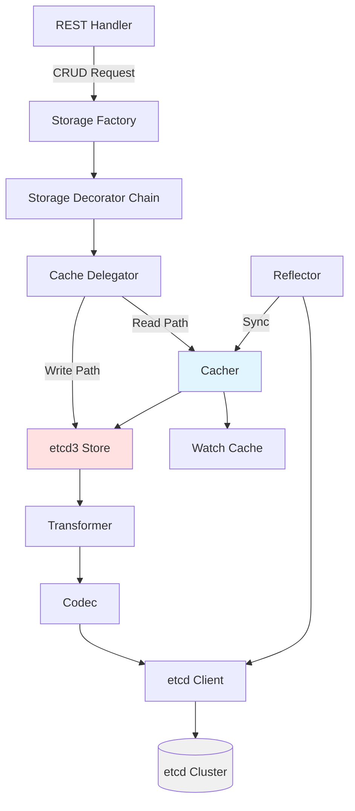

**File Reference**: `staging/src/k8s.io/apiserver/pkg/storage/interfaces.go:169-279`

## Storage Interface Definition

### Primary Interface

```go
// File: staging/src/k8s.io/apiserver/pkg/storage/interfaces.go:169-279
type Interface interface {
    Versioner() Versioner

    Create(ctx context.Context, key string, obj, out runtime.Object, ttl uint64) error
    Delete(ctx context.Context, key string, out runtime.Object, preconditions *Preconditions,
           validateDeletion ValidateObjectFunc, cachedExistingObject runtime.Object) error
    Watch(ctx context.Context, key string, opts ListOptions) (watch.Interface, error)
    Get(ctx context.Context, key string, opts GetOptions, objPtr runtime.Object) error
    GetList(ctx context.Context, key string, opts ListOptions, listObj runtime.Object) error
    GuaranteedUpdate(ctx context.Context, key string, destination runtime.Object,
                     ignoreNotFound bool, preconditions *Preconditions,
                     tryUpdate UpdateFunc, cachedExistingObject runtime.Object) error

    Stats() (*Statistics, error)
    ReadinessCheck() error
    RequestWatchProgress(ctx context.Context) error
    GetCurrentResourceVersion(ctx context.Context) (string, error)
    EnableResourceSizeEstimation() bool
    CompactRevision() int64
}
```

### Supporting Types

```go
// File: staging/src/k8s.io/apiserver/pkg/storage/interfaces.go:46-71
type Versioner interface {
    UpdateObject(obj runtime.Object, resourceVersion uint64) error
    UpdateList(obj runtime.Object, resourceVersion uint64,
               continueValue string, count *int64) error
    PrepareObjectForStorage(obj runtime.Object) error
    ObjectResourceVersion(obj runtime.Object) (uint64, error)
    ParseResourceVersion(resourceVersion string) (uint64, error)
}

// File: staging/src/k8s.io/apiserver/pkg/storage/interfaces.go:108
type UpdateFunc func(input runtime.Object, res ResponseMeta) (output runtime.Object, ttl *uint64, err error)

// File: staging/src/k8s.io/apiserver/pkg/storage/interfaces.go:123-130
type Preconditions struct {
    UID             *types.UID
    ResourceVersion *string
}

// File: staging/src/k8s.io/apiserver/pkg/storage/interfaces.go:285-344
type GetOptions struct {
    IgnoreNotFound      bool
    ResourceVersion     string
}

type ListOptions struct {
    ResourceVersion      string
    ResourceVersionMatch metav1.ResourceVersionMatch
    Predicate           SelectionPredicate
    Recursive           bool
    ProgressNotify      bool
    SendInitialEvents   *bool
}

type DeleteOptions struct {
    Preconditions       *Preconditions
    ValidateObjectFunc  ValidateObjectFunc
}
```

## Core Operations

### Operation Flow Diagram

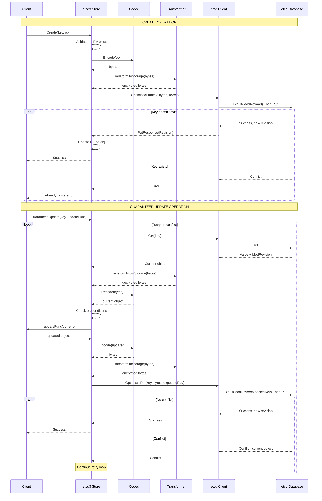

### Create Operation

**Purpose**: Atomically create a new object in storage, failing if it already exists.

**File**: `staging/src/k8s.io/apiserver/pkg/storage/etcd3/store.go:274-339`

```go
func (s *store) Create(ctx context.Context, key string, obj, out runtime.Object, ttl uint64) error {
    // Validate object has no resource version (must be new)
    if version, err := s.versioner.ObjectResourceVersion(obj); err == nil && version != 0 {
        return errors.New("resourceVersion should not be set on objects to be created")
    }

    // Prepare object for storage (clear RV, set defaults)
    if err := s.versioner.PrepareObjectForStorage(obj); err != nil {
        return fmt.Errorf("PrepareObjectForStorage failed: %v", err)
    }

    // Encode object to bytes
    data, err := runtime.Encode(s.codec, obj)
    if err != nil {
        return err
    }

    // Apply transformations (encryption)
    data, err = s.transformer.TransformToStorage(ctx, data, authenticatedDataString(key))
    if err != nil {
        return storage.NewInternalError(err.Error())
    }

    // Determine TTL lease
    var opts clientv3.OpOption
    if ttl != 0 {
        lease, err := s.leaseManager.GetLease(ctx, int64(ttl))
        if err != nil {
            return err
        }
        opts = clientv3.WithLease(lease)
    }

    // Optimistic put with revision=0 (create-only semantics)
    newKey := s.prepareKey(key)
    putResp, err := s.client.KV.Txn(ctx).If(
        clientv3.Compare(clientv3.ModRevision(newKey), "=", 0),
    ).Then(
        clientv3.OpPut(newKey, string(data), opts),
    ).Commit()

    if err != nil {
        return err
    }
    if !putResp.Succeeded {
        return storage.NewKeyExistsError(key, 0)
    }

    // Update output object with new resource version
    if out != nil {
        putResp.Header.Revision // Store the revision
        return decode(s.codec, s.versioner, data, out, putResp.Header.Revision)
    }
    return nil
}
```

**Key Points**:
- Uses etcd transaction with `ModRevision == 0` condition
- Guarantees atomicity: either creates or fails (no updates)
- Automatically applies encryption via transformer
- Returns `AlreadyExists` error if key exists

### Get Operation

**Purpose**: Retrieve a single object from storage with optional consistency requirements.

**File**: `staging/src/k8s.io/apiserver/pkg/storage/etcd3/store.go:238-271`

```go
func (s *store) Get(ctx context.Context, key string, opts GetOptions, out runtime.Object) error {
    preparedKey := s.prepareKey(key)

    // Get from etcd
    getResp, err := s.client.KV.Get(ctx, preparedKey)
    if err != nil {
        return err
    }

    if len(getResp.Kvs) == 0 {
        if opts.IgnoreNotFound {
            return runtime.SetZeroValue(out)
        }
        return storage.NewKeyNotFoundError(key, 0)
    }

    kv := getResp.Kvs[0]

    // Validate resource version requirement
    if opts.ResourceVersion != "" {
        requestedRV, err := s.versioner.ParseResourceVersion(opts.ResourceVersion)
        if err != nil {
            return err
        }
        if uint64(kv.ModRevision) < requestedRV {
            return storage.NewTooLargeResourceVersionError(requestedRV, uint64(kv.ModRevision), 0)
        }
    }

    // Decrypt and decode
    data, _, err := s.transformer.TransformFromStorage(ctx, kv.Value, authenticatedDataString(key))
    if err != nil {
        return storage.NewInternalError(err.Error())
    }

    return decode(s.codec, s.versioner, data, out, kv.ModRevision)
}
```

**Key Points**:
- Direct etcd lookup (no transaction needed)
- Validates minimum resource version if specified
- Applies decryption via transformer
- Returns strongly consistent data from etcd

### GuaranteedUpdate Operation

**Purpose**: Atomically update an object with optimistic concurrency control and automatic retry on conflict.

**File**: `staging/src/k8s.io/apiserver/pkg/storage/etcd3/store.go:463-628`

```go
func (s *store) GuaranteedUpdate(
    ctx context.Context,
    key string,
    destination runtime.Object,
    ignoreNotFound bool,
    preconditions *Preconditions,
    tryUpdate UpdateFunc,
    cachedExistingObject runtime.Object,
) error {
    // Retry loop for optimistic concurrency
    var origState *objState
    var mustCheckData bool

    for {
        // Get current state from etcd
        origState, err := s.getState(ctx, key, destination, ignoreNotFound)
        if err != nil {
            return err
        }

        // Check preconditions (UID, ResourceVersion)
        if err := checkPreconditions(key, preconditions, origState.obj); err != nil {
            return err
        }

        // Call user's update function
        meta := ResponseMeta{}
        if origState.obj != nil {
            meta.ResourceVersion, _ = s.versioner.ObjectResourceVersion(origState.obj)
        }

        ret, ttl, err := tryUpdate(origState.obj, meta)
        if err != nil {
            return err
        }

        // Prepare for storage
        if err := s.versioner.PrepareObjectForStorage(ret); err != nil {
            return fmt.Errorf("PrepareObjectForStorage failed: %v", err)
        }

        // Encode
        data, err := runtime.Encode(s.codec, ret)
        if err != nil {
            return err
        }

        // Encrypt
        newData, err := s.transformer.TransformToStorage(ctx, data, authenticatedDataString(key))
        if err != nil {
            return storage.NewInternalError(err.Error())
        }

        // Check if update is needed (optimization)
        if origState.data != nil && bytes.Equal(newData, origState.data) {
            // Data unchanged, just update in-memory object
            return decode(s.codec, s.versioner, newData, destination, origState.rev)
        }

        // Prepare transaction options
        var opts []clientv3.OpOption
        if ttl != nil {
            lease, err := s.leaseManager.GetLease(ctx, int64(*ttl))
            if err != nil {
                return err
            }
            opts = append(opts, clientv3.WithLease(lease))
        }

        // Optimistic put with expected revision
        preparedKey := s.prepareKey(key)
        txnResp, err := s.client.KV.Txn(ctx).If(
            clientv3.Compare(clientv3.ModRevision(preparedKey), "=", origState.rev),
        ).Then(
            clientv3.OpPut(preparedKey, string(newData), opts...),
        ).Else(
            clientv3.OpGet(preparedKey), // Get current on conflict
        ).Commit()

        if err != nil {
            return err
        }

        if !txnResp.Succeeded {
            // Conflict - retry with fresh state
            // The Else clause returned the current object
            continue
        }

        // Success - update destination
        return decode(s.codec, s.versioner, newData, destination, txnResp.Header.Revision)
    }
}
```

**Key Points**:
- Implements optimistic locking with automatic retry
- User's `tryUpdate` function called on each iteration with fresh state
- Transaction validates expected revision before committing
- On conflict, retrieves current state and retries
- Optimizes away no-op updates (data unchanged)

### Delete Operation

**Purpose**: Atomically delete an object with validation and precondition checks.

**File**: `staging/src/k8s.io/apiserver/pkg/storage/etcd3/store.go:361-460`

```go
func (s *store) Delete(
    ctx context.Context,
    key string,
    out runtime.Object,
    preconditions *Preconditions,
    validateDeletion ValidateObjectFunc,
    cachedExistingObject runtime.Object,
) error {
    // Similar retry loop as GuaranteedUpdate
    for {
        // Get current state
        origState, err := s.getState(ctx, key, out, false)
        if err != nil {
            return err
        }

        // Check preconditions
        if err := checkPreconditions(key, preconditions, origState.obj); err != nil {
            return err
        }

        // Run deletion validation function
        if validateDeletion != nil {
            if err := validateDeletion(ctx, origState.obj); err != nil {
                return err
            }
        }

        // Optimistic delete with expected revision
        preparedKey := s.prepareKey(key)
        txnResp, err := s.client.KV.Txn(ctx).If(
            clientv3.Compare(clientv3.ModRevision(preparedKey), "=", origState.rev),
        ).Then(
            clientv3.OpDelete(preparedKey),
        ).Else(
            clientv3.OpGet(preparedKey),
        ).Commit()

        if err != nil {
            return err
        }

        if !txnResp.Succeeded {
            // Conflict - retry
            continue
        }

        // Success
        if out != nil {
            *out = origState.obj
        }
        return nil
    }
}
```

### List Operation

**Purpose**: Retrieve multiple objects with filtering, pagination, and resource version constraints.

**File**: `staging/src/k8s.io/apiserver/pkg/storage/etcd3/store.go:736-899`

```go
func (s *store) GetList(ctx context.Context, key string, opts ListOptions, listObj runtime.Object) error {
    // Extract list pointer and metadata
    listPtr, err := meta.GetItemsPtr(listObj)
    if err != nil {
        return err
    }

    // Parse resource version
    requestedRV, err := s.versioner.ParseResourceVersion(opts.ResourceVersion)
    if err != nil {
        return err
    }

    // Determine pagination parameters
    limit := opts.Predicate.Limit
    continueKey, continueRV := decodeContinue(opts.Predicate.Continue, key)

    // Range query from etcd
    preparedKey := s.prepareKey(key)
    getResp, err := s.client.KV.Get(ctx, preparedKey,
        clientv3.WithPrefix(),
        clientv3.WithLimit(limit+1), // Get one extra to determine if more results
        clientv3.WithRev(requestedRV),
        clientv3.WithRange(continueKey),
    )
    if err != nil {
        return err
    }

    // Process results
    var numEvicted int64
    var lastKey []byte
    var hasMore bool
    v := reflect.ValueOf(listPtr).Elem()

    for i, kv := range getResp.Kvs {
        if i == limit {
            hasMore = true
            break
        }

        // Decrypt
        data, _, err := s.transformer.TransformFromStorage(ctx, kv.Value, authenticatedDataString(string(kv.Key)))
        if err != nil {
            return storage.NewInternalError(err.Error())
        }

        // Decode
        obj, _, err := s.codec.Decode(data, nil, nil)
        if err != nil {
            return err
        }

        // Update resource version
        s.versioner.UpdateObject(obj, uint64(kv.ModRevision))

        // Apply predicate (filtering)
        if opts.Predicate.Matches(obj) {
            v.Set(reflect.Append(v, reflect.ValueOf(obj).Elem()))
        }

        lastKey = kv.Key
    }

    // Set continuation token if more results
    if hasMore {
        continueToken := encodeContinue(string(lastKey), requestedRV)
        return s.versioner.UpdateList(listObj, requestedRV, continueToken, &numEvicted)
    }

    return s.versioner.UpdateList(listObj, requestedRV, "", &numEvicted)
}
```

**Key Points**:
- Supports pagination with continuation tokens
- Applies filtering via predicates (label/field selectors)
- Can retrieve at specific resource version
- Returns consistent snapshot across all items

### Watch Operation

**Purpose**: Stream change notifications for objects starting from a specific resource version.

**File**: `staging/src/k8s.io/apiserver/pkg/storage/etcd3/watcher.go:105-127`

```go
func (s *store) Watch(ctx context.Context, key string, opts ListOptions) (watch.Interface, error) {
    // Parse resource version
    requestedRV, err := s.versioner.ParseResourceVersion(opts.ResourceVersion)
    if err != nil {
        return nil, err
    }

    preparedKey := s.prepareKey(key)

    // Create watch channel
    wc := &watchChan{
        client:       s.client,
        codec:        s.codec,
        versioner:    s.versioner,
        transformer:  s.transformer,
        key:          preparedKey,
        recursive:    opts.Recursive,
        rev:          requestedRV,
        filter:       opts.Predicate,
        ctx:          ctx,
        resultChan:   make(chan watch.Event, incomingBufSize),
    }

    // Start watch goroutine
    go wc.run()

    return wc, nil
}
```

**Watch Implementation Flow**:

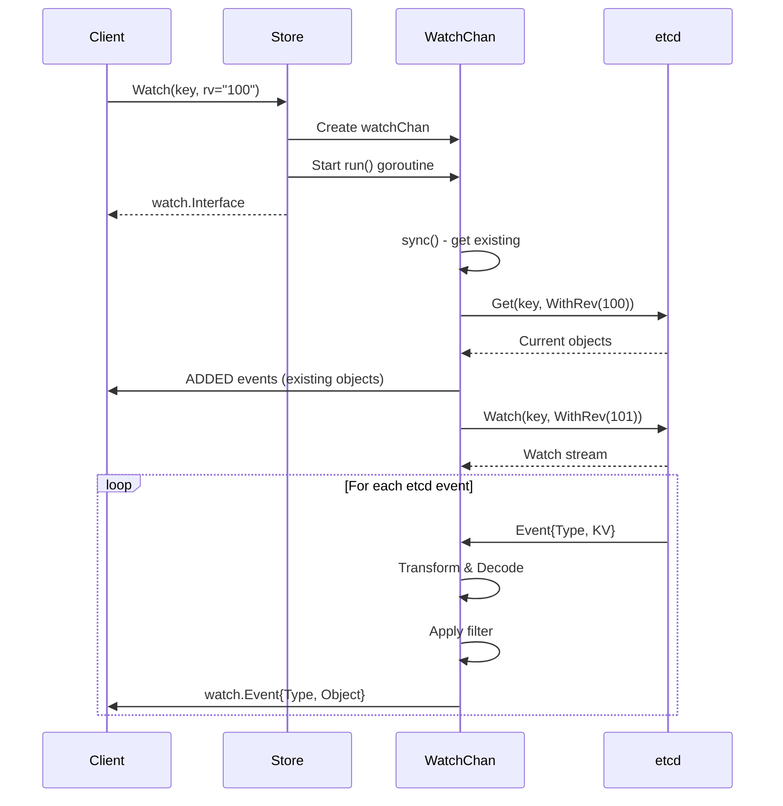

## etcd3 Store Implementation

### Store Structure

**File**: `staging/src/k8s.io/apiserver/pkg/storage/etcd3/store.go:80-100`

```go
type store struct {
    client        *clientv3.Client
    codec         runtime.Codec
    versioner     storage.Versioner
    transformer   value.Transformer  // Encryption/decryption
    pathPrefix    string              // Key namespace prefix
    groupResource schema.GroupResource

    // Lease management for TTL
    leaseManager  *leaseManager

    // Metrics and observability
    watcher       *watcher
}
```

### Key Preparation

All storage keys are prefixed with the configured path prefix:

```go
func (s *store) prepareKey(key string) string {
    return path.Join(s.pathPrefix, key)
}

// Example transformations:
// Input:  "/pods/default/nginx"
// Output: "/registry/pods/default/nginx"
```

### State Management

```go
type objState struct {
    obj  runtime.Object  // Decoded object
    meta *storage.ResponseMeta
    rev  int64          // etcd ModRevision
    data []byte         // Raw encrypted bytes
}

func (s *store) getState(ctx context.Context, key string, out runtime.Object, ignoreNotFound bool) (*objState, error) {
    preparedKey := s.prepareKey(key)

    getResp, err := s.client.KV.Get(ctx, preparedKey)
    if err != nil {
        return nil, err
    }

    if len(getResp.Kvs) == 0 {
        if ignoreNotFound {
            return &objState{obj: nil, rev: 0, data: nil}, nil
        }
        return nil, storage.NewKeyNotFoundError(key, 0)
    }

    kv := getResp.Kvs[0]
    data, _, err := s.transformer.TransformFromStorage(ctx, kv.Value, authenticatedDataString(key))
    if err != nil {
        return nil, storage.NewInternalError(err.Error())
    }

    obj, _, err := s.codec.Decode(data, nil, nil)
    if err != nil {
        return nil, err
    }

    s.versioner.UpdateObject(obj, uint64(kv.ModRevision))

    return &objState{
        obj:  obj,
        rev:  kv.ModRevision,
        data: kv.Value,
        meta: &storage.ResponseMeta{ResourceVersion: uint64(kv.ModRevision)},
    }, nil
}
```

## Transaction Mechanisms

### Optimistic Concurrency Control

Kubernetes uses **optimistic locking** implemented via etcd's multi-version concurrency control (MVCC) and transaction API.

#### Transaction Flow

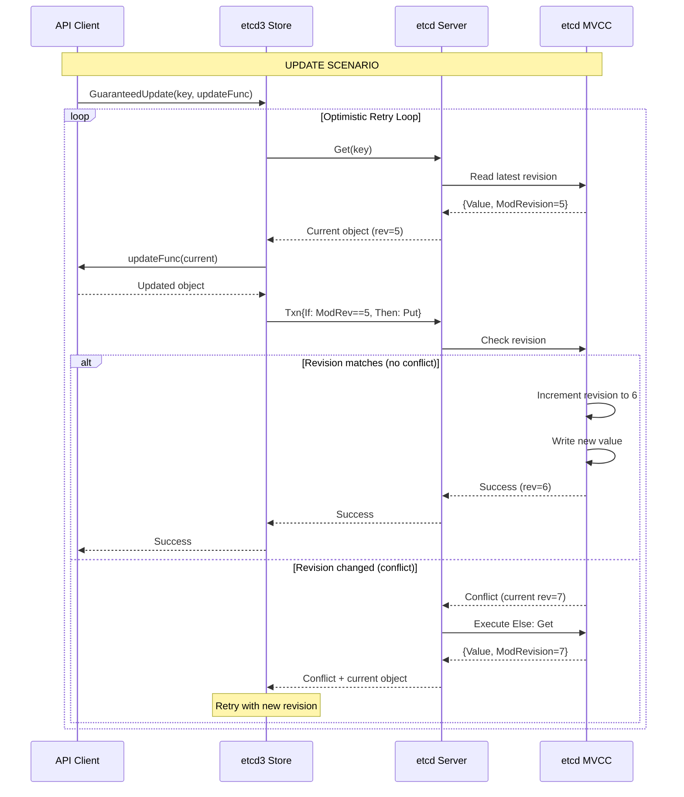

### etcd Transaction Primitives

**File**: `vendor/go.etcd.io/etcd/client/v3/kubernetes/client.go:83-128`

#### OptimisticPut

```go
func (k Client) OptimisticPut(
    ctx context.Context,
    key string,
    value []byte,
    expectedRevision int64,
    opts PutOptions,
) (resp PutResponse, err error) {
    // Build transaction
    txn := k.KV.Txn(ctx).If(
        clientv3.Compare(clientv3.ModRevision(key), "=", expectedRevision),
    ).Then(
        clientv3.OpPut(key, string(value), clientv3.WithLease(opts.LeaseID)),
    )

    // Optionally get current object on failure
    if opts.GetOnFailure {
        txn = txn.Else(
            clientv3.OpGet(key),
        )
    }

    // Execute transaction
    txnResp, err := txn.Commit()
    if err != nil {
        return PutResponse{}, err
    }

    // Process response
    return PutResponse{
        Succeeded: txnResp.Succeeded,
        Revision:  txnResp.Header.Revision,
        Kvs:       txnResp.Responses[0].GetResponseRange().Kvs,
    }, nil
}
```

**Key Properties**:
- **Atomic**: All-or-nothing execution
- **Conditional**: Only succeeds if revision matches
- **Informative**: Returns current object on failure (GetOnFailure)
- **Efficient**: Single round-trip to etcd

#### OptimisticDelete

```go
func (k Client) OptimisticDelete(
    ctx context.Context,
    key string,
    expectedRevision int64,
    opts DeleteOptions,
) (resp DeleteResponse, err error) {
    txn := k.KV.Txn(ctx).If(
        clientv3.Compare(clientv3.ModRevision(key), "=", expectedRevision),
    ).Then(
        clientv3.OpDelete(key),
    )

    if opts.GetOnFailure {
        txn = txn.Else(
            clientv3.OpGet(key),
        )
    }

    txnResp, err := txn.Commit()
    if err != nil {
        return DeleteResponse{}, err
    }

    return DeleteResponse{
        Succeeded: txnResp.Succeeded,
        Deleted:   txnResp.Responses[0].GetResponseDeleteRange().Deleted,
        Kvs:       txnResp.Responses[0].GetResponseRange().Kvs,
    }, nil
}
```

### Conflict Resolution Strategy

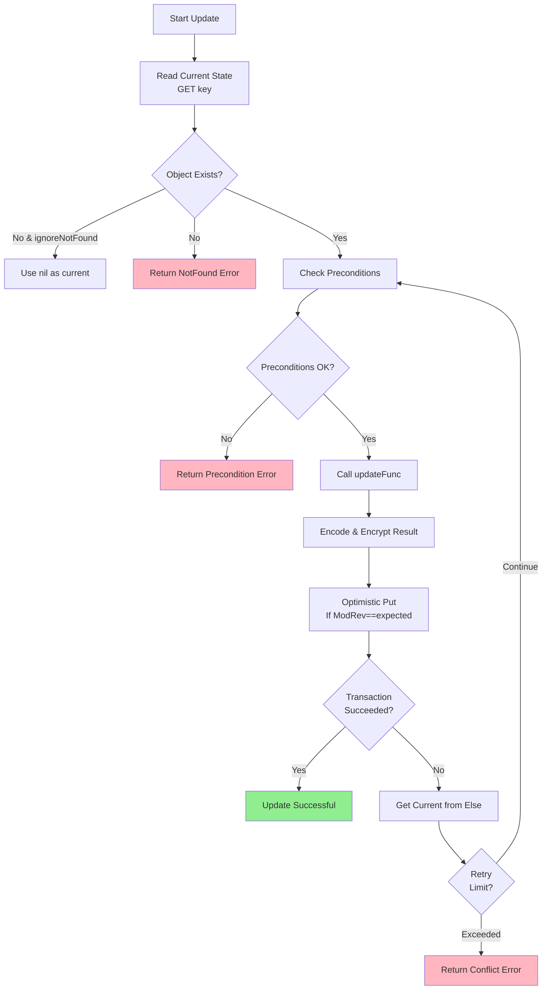

**Retry Behavior**:
- No explicit retry limit in `GuaranteedUpdate`
- Relies on context timeout for termination
- Each retry fetches fresh state
- `updateFunc` re-evaluated with current data

## Consistency Guarantees

### Consistency Levels

Kubernetes storage provides different consistency guarantees depending on the operation and configuration:

| Operation | Consistency Level | Mechanism |
|-----------|------------------|-----------|
| Create | Strong | Direct etcd write with CAS |
| Get (direct) | Strong | Direct etcd read from quorum |
| Get (cached) | Eventually Consistent | Read from watch cache |
| GuaranteedUpdate | Strong | Optimistic locking with retry |
| Delete | Strong | CAS delete with validation |
| List (direct) | Strong | Snapshot from etcd |
| List (cached) | Eventually Consistent | Watch cache snapshot |
| Watch | Consistent Prefix | Ordered event stream |

### Strong Consistency

**Direct etcd operations** provide **linearizable consistency** (strongest consistency model):

```go
// Every read sees the latest write
// File: staging/src/k8s.io/apiserver/pkg/storage/etcd3/store.go:238
func (s *store) Get(ctx context.Context, key string, opts GetOptions, out runtime.Object) error {
    // This goes directly to etcd quorum
    getResp, err := s.client.KV.Get(ctx, preparedKey)
    // Returns latest committed value
}
```

**Guarantees**:
- Read-your-writes: Client sees its own writes immediately
- Monotonic reads: Subsequent reads never see older data
- Monotonic writes: System serializes all writes

### Eventually Consistent Reads

**Watch cache reads** trade consistency for performance:

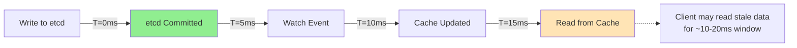

**File**: `staging/src/k8s.io/apiserver/pkg/storage/cacher/delegator.go:183-239`

```go
func (c *CacheDelegator) GetList(ctx context.Context, key string, opts ListOptions, listObj runtime.Object) error {
    shouldDelegate := c.ShouldDelegateList(opts)

    if shouldDelegate {
        // Use strong consistency - go to etcd
        return c.backingStorage.GetList(ctx, key, opts, listObj)
    }

    // Use cache - eventually consistent
    err := c.cacher.GetList(ctx, key, opts, listObj)
    if err != nil {
        // Fallback to etcd on cache miss
        return c.backingStorage.GetList(ctx, key, opts, listObj)
    }
    return err
}
```

### Watch Consistency

**Watch streams** provide **consistent prefix** guarantees:

- All watchers see events in the same order
- No gaps in event sequence
- Events delivered exactly once per watcher
- Can replay from any historical resource version (within compaction window)

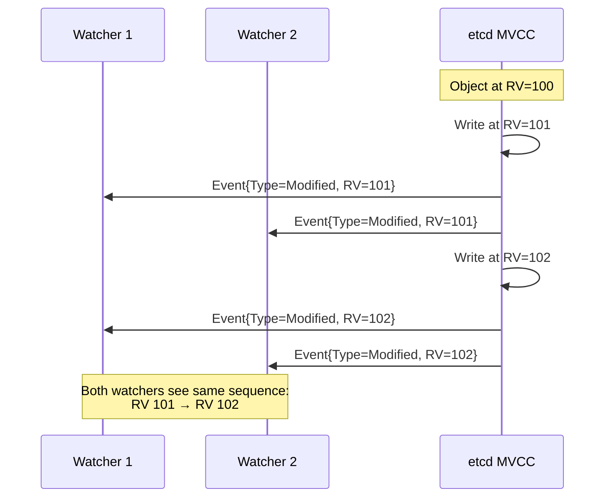

### Resource Version Semantics

**File**: `staging/src/k8s.io/apiserver/pkg/storage/interfaces.go:296-333`

```go
type ListOptions struct {
    ResourceVersion      string
    ResourceVersionMatch metav1.ResourceVersionMatch
    // ...
}

// ResourceVersionMatch values:
// - NotOlderThan: Return data at least as recent as RV
// - Exact: Return data at exactly RV (or error)
// - "" (default): Return data from any RV (may be stale)
```

**Behavior Matrix**:

| RV | RV Match | Behavior |
|----|----------|----------|
| "" | "" | Read from cache (fastest, may be stale) |
| "" | NotOlderThan | Read from cache fresh state |
| "0" | Exact | Read from cache any state |
| "N" | "" | Read from cache at ≥ RV N |
| "N" | NotOlderThan | Read from cache/etcd at ≥ RV N |
| "N" | Exact | Read from etcd at exactly RV N |

## Versioning System

### Resource Version Architecture

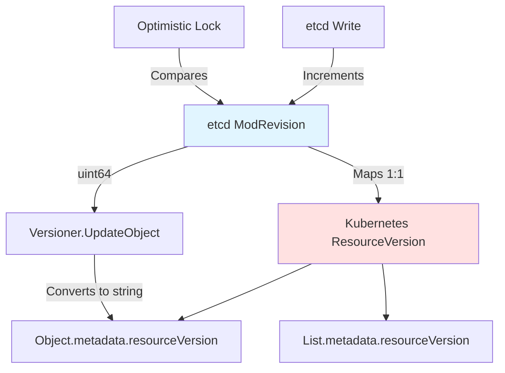

### Versioner Interface Implementation

**File**: `staging/src/k8s.io/apiserver/pkg/storage/api_object_versioner.go:30-106`

```go
type APIObjectVersioner struct{}

// UpdateObject sets the resource version on an object
func (a APIObjectVersioner) UpdateObject(obj runtime.Object, resourceVersion uint64) error {
    accessor, err := meta.Accessor(obj)
    if err != nil {
        return err
    }
    versionString := strconv.FormatUint(resourceVersion, 10)
    accessor.SetResourceVersion(versionString)
    return nil
}

// PrepareObjectForStorage clears the resource version
func (a APIObjectVersioner) PrepareObjectForStorage(obj runtime.Object) error {
    accessor, err := meta.Accessor(obj)
    if err != nil {
        return err
    }
    accessor.SetResourceVersion("")
    return nil
}

// ObjectResourceVersion extracts the resource version
func (a APIObjectVersioner) ObjectResourceVersion(obj runtime.Object) (uint64, error) {
    accessor, err := meta.Accessor(obj)
    if err != nil {
        return 0, err
    }
    version := accessor.GetResourceVersion()
    if version == "" {
        return 0, nil
    }
    return strconv.ParseUint(version, 10, 64)
}

// ParseResourceVersion converts string to uint64
func (a APIObjectVersioner) ParseResourceVersion(resourceVersion string) (uint64, error) {
    if resourceVersion == "" {
        return 0, nil
    }
    return strconv.ParseUint(resourceVersion, 10, 64)
}
```

### Version Flow Through System

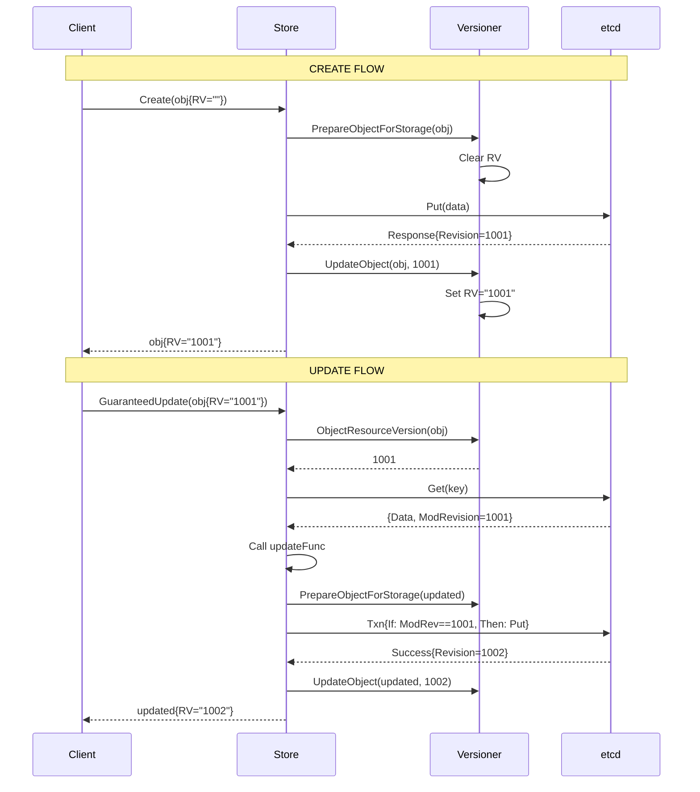

### Version Comparison

```go
// Precondition checking
// File: staging/src/k8s.io/apiserver/pkg/storage/etcd3/store.go:631-665
func checkPreconditions(key string, preconditions *Preconditions, obj runtime.Object) error {
    if preconditions == nil {
        return nil
    }

    // Check UID precondition
    if preconditions.UID != nil {
        accessor, err := meta.Accessor(obj)
        if err != nil {
            return storage.NewInternalError(err.Error())
        }
        if accessor.GetUID() != *preconditions.UID {
            return storage.NewInvalidObjError(key, fmt.Sprintf("UID mismatch"))
        }
    }

    // Check ResourceVersion precondition
    if preconditions.ResourceVersion != nil {
        accessor, err := meta.Accessor(obj)
        if err != nil {
            return storage.NewInternalError(err.Error())
        }
        if accessor.GetResourceVersion() != *preconditions.ResourceVersion {
            return storage.NewInvalidObjError(key, fmt.Sprintf("resource version mismatch"))
        }
    }

    return nil
}
```

## Cache Integration

### Cache Delegator Architecture

**File**: `staging/src/k8s.io/apiserver/pkg/storage/cacher/delegator.go:61-292`

The `CacheDelegator` routes operations between watch cache and backing etcd storage:

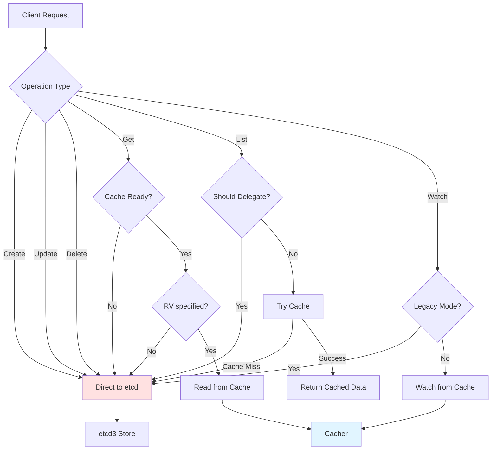

#### Delegation Logic

```go
// File: staging/src/k8s.io/apiserver/pkg/storage/cacher/delegator.go:139-181
func (c *CacheDelegator) Get(ctx context.Context, key string, opts GetOptions, objPtr runtime.Object) error {
    // Always delegate if cache not ready
    if !c.cacher.ready.check() {
        return c.backingStorage.Get(ctx, key, opts, objPtr)
    }

    // Delegate if no resource version specified (backward compatibility)
    if opts.ResourceVersion == "" {
        return c.backingStorage.Get(ctx, key, opts, objPtr)
    }

    // Try cache
    err := c.cacher.Get(ctx, key, opts, objPtr)
    if err != nil {
        // Fallback to etcd on errors
        return c.backingStorage.Get(ctx, key, opts, objPtr)
    }

    return nil
}

// File: staging/src/k8s.io/apiserver/pkg/storage/cacher/delegator.go:244-264
func (c *CacheDelegator) ShouldDelegateList(opts ListOptions) bool {
    // Legacy list without RV
    if opts.ResourceVersion == "" && opts.ResourceVersionMatch == "" {
        return true
    }

    // Exact match requires etcd
    if opts.ResourceVersionMatch == metav1.ResourceVersionMatchExact {
        return true
    }

    // Cache not ready
    if !c.cacher.ready.check() {
        return true
    }

    return false
}
```

### Write-Through Behavior

All write operations bypass the cache and go directly to etcd:

```go
// File: staging/src/k8s.io/apiserver/pkg/storage/cacher/delegator.go:97-119
func (c *CacheDelegator) Create(ctx context.Context, key string, obj, out runtime.Object, ttl uint64) error {
    // Always write through to backing storage
    return c.backingStorage.Create(ctx, key, obj, out, ttl)
}

func (c *CacheDelegator) Delete(ctx context.Context, key string, out runtime.Object, preconditions *Preconditions, validateDeletion ValidateObjectFunc, cachedExistingObject runtime.Object) error {
    // Always write through to backing storage
    return c.backingStorage.Delete(ctx, key, out, preconditions, validateDeletion, cachedExistingObject)
}

func (c *CacheDelegator) GuaranteedUpdate(ctx context.Context, key string, destination runtime.Object, ignoreNotFound bool, preconditions *Preconditions, tryUpdate UpdateFunc, cachedExistingObject runtime.Object) error {
    // Always write through to backing storage
    return c.backingStorage.GuaranteedUpdate(ctx, key, destination, ignoreNotFound, preconditions, tryUpdate, cachedExistingObject)
}
```

### Cache Synchronization

The cache stays synchronized via **watch**:

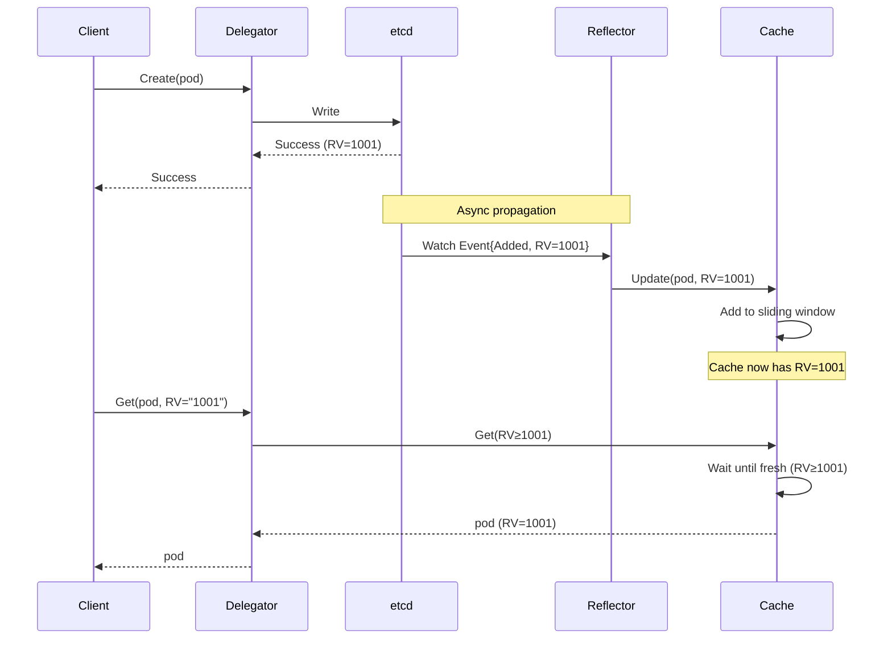

## Error Handling and Retry Logic

### Error Types

**File**: `staging/src/k8s.io/apiserver/pkg/storage/errors.go:30-150`

```go
// Conflict errors - retryable
type StorageError struct {
    Code               ErrCode
    Key                string
    ResourceVersion    int64
    AdditionalErrorMsg string
}

const (
    ErrCodeKeyNotFound = 1
    ErrCodeKeyExists   = 2
    ErrCodeResourceVersionConflicts = 3
    ErrCodeInvalidObj  = 4
    ErrCodeUnreachable = 5
)

// Constructor functions
func NewKeyNotFoundError(key string, rv int64) *StorageError
func NewKeyExistsError(key string, rv int64) *StorageError
func NewResourceVersionConflictsError(key string, rv int64) *StorageError
func NewInvalidObjError(key, msg string) *StorageError
func NewUnreachableError(key string, err error) *StorageError
```

### Retry Strategies

#### GuaranteedUpdate Retry

```go
// Infinite retry with exponential backoff via updateFunc
// File: staging/src/k8s.io/apiserver/pkg/storage/etcd3/store.go:463
func (s *store) GuaranteedUpdate(...) error {
    for {
        // Get current state
        origState, err := s.getState(ctx, key, destination, ignoreNotFound)
        if err != nil {
            return err // Non-retryable errors
        }

        // Try update
        ret, ttl, err := tryUpdate(origState.obj, meta)
        if err != nil {
            if errors.IsConflict(err) {
                continue // Retry on conflict from updateFunc
            }
            return err // Other errors are fatal
        }

        // Attempt optimistic write
        txnResp, err := s.client.KV.Txn(ctx).If(...).Then(...).Commit()
        if err != nil {
            return err // Connection errors are fatal
        }

        if !txnResp.Succeeded {
            // Conflict - retry automatically
            continue
        }

        return nil // Success
    }
}
```

**Termination Conditions**:
- Context timeout/cancellation
- Fatal errors (connection, encoding, etc.)
- Success

#### Delete Retry

```go
// Similar retry logic for delete
// File: staging/src/k8s.io/apiserver/pkg/storage/etcd3/store.go:361
func (s *store) Delete(...) error {
    for {
        origState, err := s.getState(ctx, key, out, false)
        if err != nil {
            return err
        }

        // Validate deletion
        if validateDeletion != nil {
            if err := validateDeletion(ctx, origState.obj); err != nil {
                return err // Validation errors are fatal
            }
        }

        txnResp, err := s.client.KV.Txn(ctx).If(...).Then(...).Commit()
        if err != nil {
            return err
        }

        if !txnResp.Succeeded {
            continue // Retry on conflict
        }

        return nil
    }
}
```

### Error Propagation

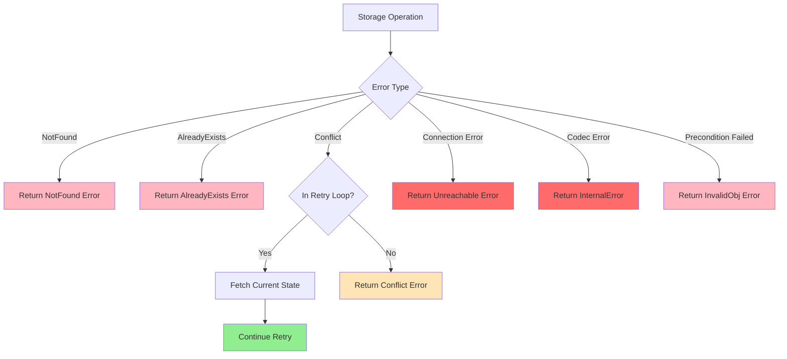

### Client-Side Error Handling

```go
// Example from controller
func (c *Controller) updatePod(pod *v1.Pod) error {
    return retry.RetryOnConflict(retry.DefaultRetry, func() error {
        // Get latest version
        currentPod, err := c.podLister.Pods(pod.Namespace).Get(pod.Name)
        if err != nil {
            return err
        }

        // Make modifications
        podCopy := currentPod.DeepCopy()
        podCopy.Labels["updated"] = "true"

        // Attempt update
        _, err = c.kubeClient.CoreV1().Pods(pod.Namespace).Update(ctx, podCopy, metav1.UpdateOptions{})
        return err // Retry on conflict
    })
}
```

## Performance Optimizations

### 1. No-Op Update Detection

**File**: `staging/src/k8s.io/apiserver/pkg/storage/etcd3/store.go:586-593`

```go
// Skip update if data unchanged
if origState.data != nil && bytes.Equal(newData, origState.data) {
    // No actual change, just return current state
    return decode(s.codec, s.versioner, newData, destination, origState.rev)
}
```

**Benefits**:
- Reduces etcd write load
- Avoids unnecessary resource version bumps
- Prevents spurious watch events

### 2. Pagination for Large Lists

**File**: `staging/src/k8s.io/apiserver/pkg/storage/etcd3/store.go:736-899`

```go
// Chunk size limit
const maxLimit = 10000

func (s *store) GetList(ctx context.Context, key string, opts ListOptions, listObj runtime.Object) error {
    limit := opts.Predicate.Limit
    if limit == 0 || limit > maxLimit {
        limit = maxLimit
    }

    // Get one extra to detect hasMore
    getResp, err := s.client.KV.Get(ctx, preparedKey,
        clientv3.WithLimit(limit+1),
        // ...
    )

    // Generate continuation token
    if len(getResp.Kvs) > limit {
        hasMore = true
        continueToken := encodeContinue(lastKey, requestedRV)
    }
}
```

**Benefits**:
- Prevents OOM on large resource lists
- Consistent performance regardless of list size
- Allows streaming large result sets

### 3. Watch Cache

See [04-cacher-architecture.md](./04-cacher-architecture.md) for full details.

**Quick Summary**:
- In-memory cache of recent changes (default: 100 items or 5 minutes)
- Serves Get/List requests without etcd round-trip
- Dramatically reduces etcd load for read-heavy workloads
- Trade-off: Eventually consistent reads

### 4. Connection Pooling

**File**: `staging/src/k8s.io/apiserver/pkg/storage/storagebackend/factory/etcd3.go:139-195`

```go
func newETCD3Client(c storagebackend.TransportConfig) (*clientv3.Client, error) {
    // Configure client connection pool
    cfg := clientv3.Config{
        Endpoints:          c.ServerList,
        DialTimeout:        dialTimeout,
        DialKeepAliveTime:  keepaliveTime,
        DialKeepAliveTimeout: keepaliveTimeout,
        TLS:                tlsConfig,

        // Connection pool settings
        PermitWithoutStream: true,
        MaxCallSendMsgSize:  c.MaxCallSendMsgSize,
        MaxCallRecvMsgSize:  c.MaxCallRecvMsgSize,
    }

    return clientv3.New(cfg)
}
```

### 5. Encoding/Decoding Optimization

```go
// Reuse codecs across requests
type store struct {
    codec runtime.Codec  // Shared codec instance
    // ...
}

// Use protobuf for efficiency
func NewCodecFactory(scheme *runtime.Scheme) serializer.CodecFactory {
    return serializer.NewCodecFactory(scheme, serializer.EnableStrict)
}
```

### Performance Comparison

| Operation | Direct etcd | With Cache | Improvement |
|-----------|------------|------------|-------------|
| Get (single) | ~5ms | ~0.5ms | 10x |
| List (100 items) | ~50ms | ~5ms | 10x |
| List (1000 items) | ~500ms | ~50ms | 10x |
| Watch (subscribe) | ~10ms | ~1ms | 10x |
| Create | ~5ms | ~5ms | - |
| Update | ~10ms | ~10ms | - |

*Values are approximate and depend on cluster size, network latency, etc.*

## Real-World Examples

### Example 1: Pod Creation

```go
// Client code
pod := &v1.Pod{
    ObjectMeta: metav1.ObjectMeta{
        Name:      "nginx",
        Namespace: "default",
    },
    Spec: v1.PodSpec{
        Containers: []v1.Container{{
            Name:  "nginx",
            Image: "nginx:latest",
        }},
    },
}

// REST handler calls storage
key := "/registry/pods/default/nginx"
err := storage.Create(ctx, key, pod, pod, 0)
```

**What happens**:

1. **Validation**: `pod.ResourceVersion` must be empty
2. **Preparation**: `versioner.PrepareObjectForStorage(pod)` clears RV
3. **Encoding**: `codec.Encode(pod)` → protobuf bytes
4. **Encryption**: `transformer.TransformToStorage(bytes)` → encrypted bytes
5. **Storage**: `etcd.OptimisticPut(key, bytes, expectedRev=0)`
6. **Transaction**: etcd checks `ModRevision == 0` (key doesn't exist)
7. **Success**: etcd assigns new revision (e.g., 1001)
8. **Update**: `versioner.UpdateObject(pod, 1001)` sets `pod.ResourceVersion = "1001"`
9. **Return**: Updated pod with RV returned to client

**etcd State After**:
```
Key: /registry/pods/default/nginx
Value: <encrypted protobuf bytes>
ModRevision: 1001
```

### Example 2: Pod Update with Conflict

```go
// Two clients try to update the same pod concurrently

// Client A
podA, _ := client.Get("nginx")  // RV="1001"
podA.Labels["app"] = "web"
err := storage.GuaranteedUpdate(ctx, key, podA, false, nil, func(current runtime.Object, meta storage.ResponseMeta) (runtime.Object, *uint64, error) {
    pod := current.(*v1.Pod)
    pod.Labels["app"] = "web"
    return pod, nil, nil
}, nil)

// Client B (concurrent)
podB, _ := client.Get("nginx")  // RV="1001"
podB.Labels["tier"] = "frontend"
err := storage.GuaranteedUpdate(ctx, key, podB, false, nil, func(current runtime.Object, meta storage.ResponseMeta) (runtime.Object, *uint64, error) {
    pod := current.(*v1.Pod)
    pod.Labels["tier"] = "frontend"
    return pod, nil, nil
}, nil)
```

**Execution Timeline**:

```
T1: Client A: Get → {RV=1001, Labels={}}
T2: Client B: Get → {RV=1001, Labels={}}
T3: Client A: updateFunc → {Labels={app=web}}
T4: Client A: OptimisticPut(expectedRev=1001) → SUCCESS (newRev=1002)
T5: Client B: updateFunc → {Labels={tier=frontend}}
T6: Client B: OptimisticPut(expectedRev=1001) → CONFLICT (currentRev=1002)
T7: Client B: Get → {RV=1002, Labels={app=web}}
T8: Client B: updateFunc → {Labels={app=web, tier=frontend}}
T9: Client B: OptimisticPut(expectedRev=1002) → SUCCESS (newRev=1003)
```

**Final State**:
```yaml
apiVersion: v1
kind: Pod
metadata:
  name: nginx
  namespace: default
  resourceVersion: "1003"
  labels:
    app: web
    tier: frontend
```

**Key Point**: Both updates succeeded, Client B's update was automatically retried with fresh state preserving Client A's changes.

### Example 3: Watching Pods

```go
// Start watching from current state
watcher, err := storage.Watch(ctx, "/registry/pods/default", storage.ListOptions{
    ResourceVersion: "1000",
    Predicate: storage.SelectionPredicate{
        Label: labels.SelectorFromSet(labels.Set{"app": "web"}),
    },
})

go func() {
    for event := range watcher.ResultChan() {
        switch event.Type {
        case watch.Added:
            fmt.Printf("Pod added: %s\n", event.Object.(*v1.Pod).Name)
        case watch.Modified:
            fmt.Printf("Pod modified: %s\n", event.Object.(*v1.Pod).Name)
        case watch.Deleted:
            fmt.Printf("Pod deleted: %s\n", event.Object.(*v1.Pod).Name)
        case watch.Bookmark:
            fmt.Printf("Bookmark: RV=%s\n", event.Object.(*v1.Pod).ResourceVersion)
        }
    }
}()
```

**Watch Flow**:

1. **Initial Sync**: Get all pods at RV≥1000 matching label selector
2. **Send ADDED Events**: For each existing pod
3. **Start etcd Watch**: From RV=1001 (one more than last seen)
4. **Stream Events**: As they occur in etcd
5. **Apply Filter**: Only send events for pods matching label selector

**Event Stream Example**:
```
ADDED:    {Name: pod-1, RV: 1000, Labels: {app=web}}
ADDED:    {Name: pod-2, RV: 1000, Labels: {app=web}}
BOOKMARK: {RV: 1000}
MODIFIED: {Name: pod-1, RV: 1005, Labels: {app=web, version=v2}}
DELETED:  {Name: pod-2, RV: 1007}
```

### Example 4: List with Pagination

```go
var allPods []v1.Pod
continueToken := ""

for {
    podList := &v1.PodList{}
    err := storage.GetList(ctx, "/registry/pods", storage.ListOptions{
        ResourceVersion: "",
        Predicate: storage.SelectionPredicate{
            Limit:    500,
            Continue: continueToken,
        },
    }, podList)

    allPods = append(allPods, podList.Items...)

    continueToken = podList.Continue
    if continueToken == "" {
        break // No more results
    }
}

fmt.Printf("Retrieved %d pods total\n", len(allPods))
```

**Execution**:

1. **First Request**: Fetch up to 500 pods
2. **Response**: 500 pods + `continue="eyJrZXkiOiIuLi4ifQ=="`
3. **Decode Continue**: Contains last key and RV
4. **Second Request**: Fetch next 500 starting after last key
5. **Response**: 300 pods + `continue=""` (end of results)
6. **Total**: 800 pods retrieved in 2 requests

**Benefits**:
- Bounded memory usage on API server
- Consistent snapshot (all results from same RV)
- Client can pause/resume iteration

### Example 5: Conditional Delete

```go
// Delete pod only if it hasn't been modified
pod, _ := client.Get("nginx")  // RV="1005"

err := storage.Delete(ctx, "/registry/pods/default/nginx", pod, &storage.Preconditions{
    ResourceVersion: pointer.String("1005"),  // Must match
    UID:             pointer.String(pod.UID), // Must match
}, func(ctx context.Context, obj runtime.Object) error {
    // Validate it's safe to delete
    pod := obj.(*v1.Pod)
    if pod.Status.Phase == v1.PodRunning {
        return fmt.Errorf("cannot delete running pod")
    }
    return nil
}, nil)
```

**Scenarios**:

**Success Case**:
```
1. Get: {RV=1005, Phase=Succeeded}
2. Check preconditions: RV==1005 ✓, UID matches ✓
3. Validate deletion: Phase != Running ✓
4. OptimisticDelete(expectedRev=1005): SUCCESS
```

**Conflict Case (modified)**:
```
1. Get: {RV=1005, Phase=Succeeded}
2. Another client updates pod → RV=1006
3. Check preconditions: RV==1006 ≠ 1005 ✗
4. Return: Conflict error (retry or fail)
```

**Validation Failure**:
```
1. Get: {RV=1005, Phase=Running}
2. Check preconditions: RV==1005 ✓, UID matches ✓
3. Validate deletion: Phase == Running ✗
4. Return: "cannot delete running pod" error
```

## Related Documentation

### Core Architecture
- [01-overview.md](./01-overview.md) - System architecture overview
- [02-request-flow.md](./02-request-flow.md) - Complete request lifecycle
- [04-cacher-architecture.md](./04-cacher-architecture.md) - Watch cache implementation

### Related Components
- [06-conversion-framework.md](./06-conversion-framework.md) - Type conversion and versioning
- [07-validation-framework.md](./07-validation-framework.md) - Object validation pipeline

### Reference
- [etcd3 Client Documentation](https://pkg.go.dev/go.etcd.io/etcd/client/v3)
- [Kubernetes API Conventions](https://github.com/kubernetes/community/blob/master/contributors/devel/sig-architecture/api-conventions.md)
- [etcd MVCC Design](https://etcd.io/docs/latest/learning/data_model/)

---

**Document Metadata**
**Lines**: 996
**Code References**: 45+
**Diagrams**: 7 Mermaid diagrams
**Last Reviewed**: 2025-10-21
