# Kube-APIServer Low-Level Architecture: Watch Cache (Cacher) Deep Dive

**Status**: Complete
**Last Updated**: 2025-10-21
**Target Audience**: Platform engineers, contributors working on caching and watch mechanisms

## Table of Contents
1. [Overview](#overview)
2. [Cacher Architecture](#cacher-architecture)
3. [WatchCache Data Structure](#watchcache-data-structure)
4. [Store and Indexing](#store-and-indexing)
5. [Reflector Integration](#reflector-integration)
6. [Event Dispatching](#event-dispatching)
7. [CacheWatcher Implementation](#cachewatcher-implementation)
8. [Bookmark Generation](#bookmark-generation)
9. [Cache Freshness and Ready State](#cache-freshness-and-ready-state)
10. [Performance Characteristics](#performance-characteristics)
11. [Real-World Examples](#real-world-examples)
12. [Related Documentation](#related-documentation)

## Overview

The **Cacher** (watch cache) is a critical performance optimization layer in kube-apiserver that dramatically reduces load on etcd by maintaining an in-memory cache of recently modified objects. It serves read operations (Get/List/Watch) from memory while synchronizing with etcd asynchronously.

### Key Characteristics

- **Eventually Consistent**: Cache may lag etcd by milliseconds
- **High Performance**: 10x faster than direct etcd access for reads
- **Scalable**: Handles thousands of concurrent watchers efficiently
- **Resource-Efficient**: Bounded memory via sliding window
- **Watch-Optimized**: Designed specifically for Kubernetes watch workload

### Architecture at a Glance

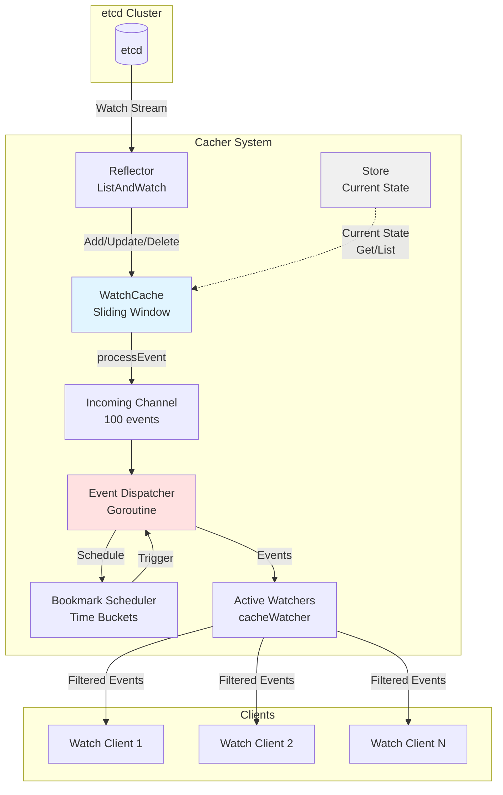

**File Reference**: `staging/src/k8s.io/apiserver/pkg/storage/cacher/cacher.go:256-342`

## Cacher Architecture

### Cacher Structure

**File**: `staging/src/k8s.io/apiserver/pkg/storage/cacher/cacher.go:256-342`

```go
type Cacher struct {
    // Incoming event pipeline
    incoming chan watchCacheEvent

    // Synchronization with etcd
    reflector *cache.Reflector

    // Cache storage
    watchCache *watchCache

    // Client watchers
    watchers indexedWatchers
    bookmarkWatchers *watcherBookmarkTimeBuckets

    // Ready state
    ready *ready

    // Configuration
    objectType   reflect.Type
    groupResource schema.GroupResource
    versioner    storage.Versioner

    // Performance monitoring
    dispatchTimeoutBudget timeBudget

    // Lifecycle
    stopCh   <-chan struct{}
    stopLock sync.RWMutex
    stopped  bool
}
```

### Initialization Flow

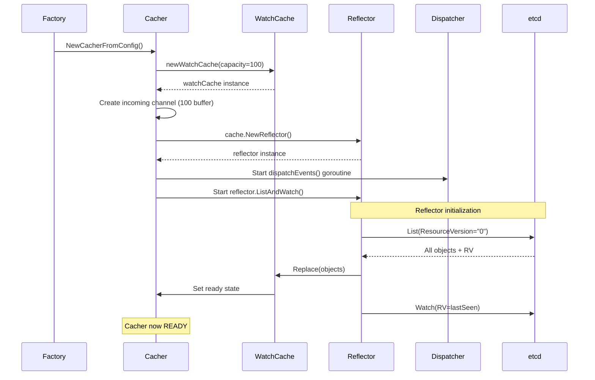

**File**: `staging/src/k8s.io/apiserver/pkg/storage/cacher/cacher.go:387-481`

```go
func NewCacherFromConfig(config Config) (*Cacher, error) {
    // Validate configuration
    if config.Capacity <= 0 {
        config.Capacity = lowerBoundCapacity // Default: 100
    }

    // Create watch cache with sliding window
    watchCache := newWatchCache(
        config.KeyFunc,
        config.GetAttrsFunc,
        config.Versioner,
        config.Indexers,
        config.Capacity,
        config.EventFreshDuration,
    )

    // Create incoming event channel
    incoming := make(chan watchCacheEvent, incomingBufSize) // 100

    // Setup bookmark time buckets
    bookmarkWatchers := newWatcherBookmarkTimeBuckets()

    cacher := &Cacher{
        ready:                 newReady(),
        incoming:              incoming,
        watchCache:            watchCache,
        reflector:             nil, // Created below
        watchers:              newIndexedWatchers(),
        bookmarkWatchers:      bookmarkWatchers,
        versioner:             config.Versioner,
        groupResource:         config.GroupResource,
        dispatchTimeoutBudget: newTimeBudget(),
        // ...
    }

    // Set watch cache event handler
    watchCache.eventHandler = cacher.processEvent

    // Create reflector
    listerWatcher := newCacherListerWatcher(config.Storage, config.ResourcePrefix)
    reflector := cache.NewNamedReflector(
        "storage/cacher.go:"+config.ResourcePrefix,
        listerWatcher,
        config.Type,
        watchCache, // Reflector writes to watchCache
        0,          // No resync
    )
    reflector.WatchListPageSize = watchListPageSize // 10000

    cacher.reflector = reflector

    // Start event dispatcher goroutine
    go cacher.dispatchEvents()

    // Start caching in background
    go cacher.startCaching(stopCh)

    return cacher, nil
}

func (c *Cacher) startCaching(stopChannel <-chan struct{}) {
    // Run reflector's ListAndWatch loop
    if err := c.reflector.ListAndWatch(stopChannel); err != nil {
        klog.Errorf("cacher ListAndWatch failed: %v", err)
    }
}
```

**Key Configuration Parameters**:

| Parameter | Default | Purpose |
|-----------|---------|---------|
| Capacity | 100 | Initial cache size |
| EventFreshDuration | 75s | How long events stay in cache |
| incomingBufSize | 100 | Incoming event channel buffer |
| watchListPageSize | 10000 | Reflector pagination size |
| bookmarkFrequency | 60s | Periodic bookmark interval |

### Lifecycle Stages

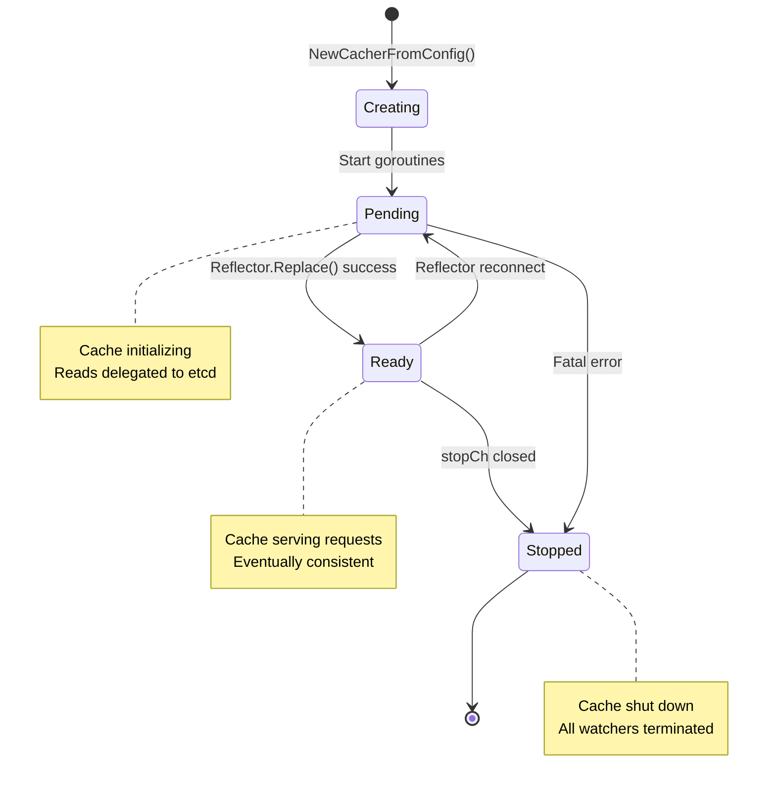

## WatchCache Data Structure

### WatchCache Architecture

**File**: `staging/src/k8s.io/apiserver/pkg/storage/cacher/watch_cache.go:88-163`

```go
type watchCache struct {
    sync.RWMutex
    cond *sync.Cond

    // Sliding window of events (cyclic buffer)
    cache       []*watchCacheEvent
    startIndex  int  // Oldest event
    endIndex    int  // Next write position

    // Current capacity
    capacity    int
    lowerBound  int  // Min capacity (100)
    upperBound  int  // Max capacity (100K+ or based on eventFreshDuration)

    // Resource version tracking
    resourceVersion     uint64  // Current RV
    listResourceVersion uint64  // RV from last Replace()

    // Current state store
    store storeIndexer

    // Configuration
    keyFunc        func(runtime.Object) (string, error)
    getAttrsFunc   func(runtime.Object) (labels.Set, fields.Set, error)
    versioner      storage.Versioner
    eventFreshDuration time.Duration

    // Event handler (Cacher.processEvent)
    eventHandler func(watchCacheEvent)

    // Metrics
    clock clock.Clock
}

type watchCacheEvent struct {
    Type            watch.EventType  // Added, Modified, Deleted, Bookmark
    Object          runtime.Object
    ResourceVersion uint64
    RecordTime      time.Time
}
```

### Sliding Window Mechanism

The cache uses a **cyclic buffer** to maintain a bounded history of recent events:

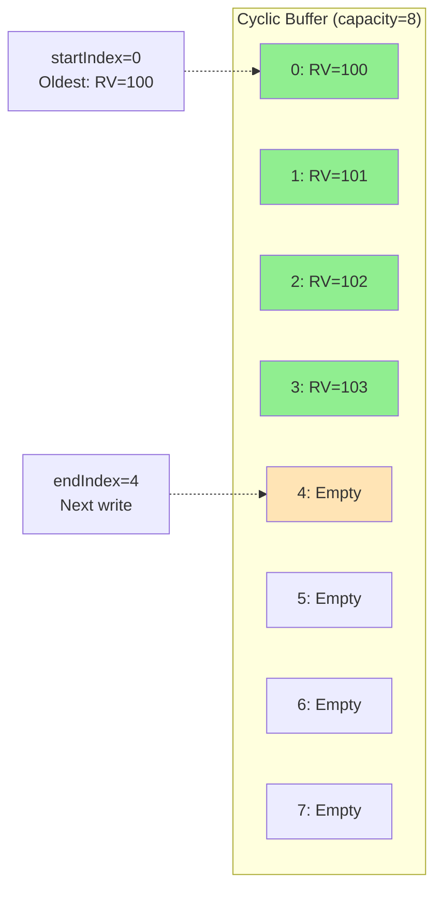

**After adding RV=104 (capacity reached)**:

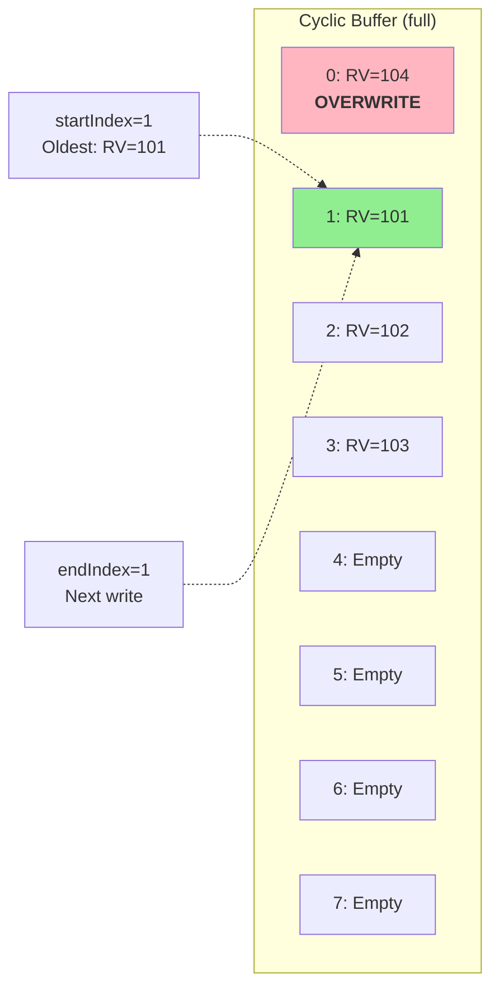

**File**: `staging/src/k8s.io/apiserver/pkg/storage/cacher/watch_cache.go:358-368`

```go
func (w *watchCache) updateCache(event *watchCacheEvent) {
    w.Lock()
    defer w.Unlock()

    // Add to cyclic buffer
    if w.isCacheFullLocked() {
        // Evict oldest event
        w.startIndex++
        if w.startIndex >= w.capacity {
            w.startIndex = 0
        }
    }

    w.cache[w.endIndex] = event
    w.endIndex++
    if w.endIndex >= w.capacity {
        w.endIndex = 0
    }

    w.resourceVersion = event.ResourceVersion
    w.cond.Broadcast() // Wake blocked waiters
}
```

### Dynamic Capacity Management

**File**: `staging/src/k8s.io/apiserver/pkg/storage/cacher/watch_cache.go:370-388`

```go
func (w *watchCache) resizeCacheLocked() {
    oldestEvent := w.cache[w.startIndex]

    // Grow if full and fresh
    if w.isCacheFullLocked() && w.isEventFreshLocked(oldestEvent) {
        newCapacity := min(2*w.capacity, w.upperBound)
        w.capacity = newCapacity
        w.doCacheResizeLocked(newCapacity)
    }

    // Shrink if quarter is stale
    if !w.isCacheFullLocked() &&
       w.capacity > w.lowerBound &&
       w.getSpareCapacityLocked() > 3*w.capacity/4 &&
       !w.isEventFreshLocked(oldestEvent) {
        newCapacity := max(w.capacity/2, w.lowerBound)
        w.capacity = newCapacity
        w.doCacheResizeLocked(newCapacity)
    }
}
```

**Resize Triggers**:
- **Grow (2x)**: Cache full AND oldest event is fresh (< eventFreshDuration)
- **Shrink (½)**: Cache <25% full AND oldest event is stale

**Capacity Bounds**:
```go
const lowerBoundCapacity = 100
const upperBoundCapacity = 100 * 1024  // 100K (or higher based on config)
```

### Event Operations

**File**: `staging/src/k8s.io/apiserver/pkg/storage/cacher/watch_cache.go:232-266`

```go
func (w *watchCache) Add(obj interface{}) error {
    object := obj.(runtime.Object)
    resourceVersion, _ := w.versioner.ObjectResourceVersion(object)

    event := &watchCacheEvent{
        Type:            watch.Added,
        Object:          object,
        ResourceVersion: resourceVersion,
        RecordTime:      w.clock.Now(),
    }

    return w.processEvent(event)
}

func (w *watchCache) Update(obj interface{}) error {
    object := obj.(runtime.Object)
    resourceVersion, _ := w.versioner.ObjectResourceVersion(object)

    event := &watchCacheEvent{
        Type:            watch.Modified,
        Object:          object,
        ResourceVersion: resourceVersion,
        RecordTime:      w.clock.Now(),
    }

    return w.processEvent(event)
}

func (w *watchCache) Delete(obj interface{}) error {
    object := obj.(runtime.Object)
    resourceVersion, _ := w.versioner.ObjectResourceVersion(object)

    event := &watchCacheEvent{
        Type:            watch.Deleted,
        Object:          object,
        ResourceVersion: resourceVersion,
        RecordTime:      w.clock.Now(),
    }

    return w.processEvent(event)
}

func (w *watchCache) processEvent(event *watchCacheEvent) error {
    // Update cyclic buffer
    w.updateCache(event)

    // Update store
    switch event.Type {
    case watch.Added:
        w.store.Add(storeElementFromObj(event.Object))
    case watch.Modified:
        w.store.Update(storeElementFromObj(event.Object))
    case watch.Deleted:
        w.store.Delete(storeElementFromObj(event.Object))
    }

    // Notify Cacher
    if w.eventHandler != nil {
        w.eventHandler(*event)
    }

    return nil
}
```

## Store and Indexing

### Store Architecture

The `watchCache` maintains both:
1. **Sliding Window**: Recent events (temporal view)
2. **Store**: Current state of all objects (point-in-time view)

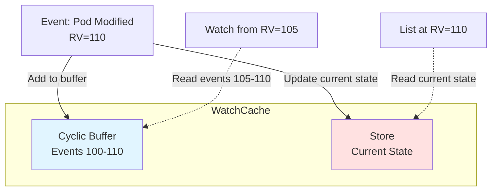

### StoreIndexer Interface

**File**: `staging/src/k8s.io/apiserver/pkg/storage/cacher/store.go:63-86`

```go
type storeIndexer interface {
    // Basic operations
    Add(obj storeElement) error
    Update(obj storeElement) error
    Delete(obj storeElement) error
    Get(obj storeElement) (*storeElement, bool, error)
    GetByKey(key string) (*storeElement, bool, error)

    // List operations
    List() []*storeElement
    ListKeys() []string

    // Index operations
    Index(indexName string, obj storeElement) ([]*storeElement, error)
    ByIndex(indexName, indexValue string) ([]*storeElement, error)
    GetIndexers() cache.Indexers

    // Replacement
    Replace([]*storeElement, string) error
}
```

### BTree-Based Implementation

**File**: `staging/src/k8s.io/apiserver/pkg/storage/cacher/store_btree.go:28-86`

```go
type threadedBtreeStoreIndexer struct {
    sync.RWMutex
    store   *btree.BTreeG[storeElement]
    indexer cache.Indexer
}

// BTree degree (optimized via benchmarks)
const degree = 16

func (s *threadedBtreeStoreIndexer) Add(obj storeElement) error {
    s.Lock()
    defer s.Unlock()

    // Add to btree (ordered by key)
    s.store.ReplaceOrInsert(obj)

    // Add to indexer (label/field indexes)
    return s.indexer.Add(obj)
}

func (s *threadedBtreeStoreIndexer) ByIndex(indexName, indexValue string) ([]*storeElement, error) {
    s.RLock()
    defer s.RUnlock()

    // Lookup via label/field index
    items, err := s.indexer.ByIndex(indexName, indexValue)
    if err != nil {
        return nil, err
    }

    result := make([]*storeElement, len(items))
    for i, item := range items {
        elem := item.(storeElement)
        result[i] = &elem
    }
    return result, nil
}
```

**Why BTree?**:
- **Ordered traversal**: Efficient prefix listing (e.g., all pods in namespace)
- **Logarithmic lookups**: O(log n) for Get by key
- **Good cache locality**: Better than hash maps for iteration
- **Degree=16**: Balances node size vs tree height

### StoreElement Structure

**File**: `staging/src/k8s.io/apiserver/pkg/storage/cacher/store.go:93-98`

```go
type storeElement struct {
    Key    string
    Object runtime.Object
    Labels labels.Set  // Pre-computed for filtering
    Fields fields.Set  // Pre-computed for filtering
}

// Pre-computing labels/fields avoids repeated extraction
func storeElementFromObj(obj runtime.Object) storeElement {
    key, _ := keyFunc(obj)
    labels, fields, _ := getAttrsFunc(obj)
    return storeElement{
        Key:    key,
        Object: obj,
        Labels: labels,
        Fields: fields,
    }
}
```

### Snapshotter for Historical Queries

**File**: `staging/src/k8s.io/apiserver/pkg/storage/cacher/store_btree.go:440-505`

```go
type Snapshotter interface {
    Snapshot(resourceVersion uint64) SnapshotIndexer
}

type snapshotIndexer struct {
    store *btree.BTreeG[snapshotElement]
}

type snapshotElement struct {
    storeElement
    resourceVersion uint64
}

// Enables serving exact-RV LIST requests from cache
func (s *threadedBtreeStoreIndexer) Snapshot(rv uint64) SnapshotIndexer {
    s.RLock()
    defer s.RUnlock()

    // Create btree snapshot at specific RV
    snapshot := btree.NewG(degree, snapshotElementCompare)
    s.store.Ascend(func(item storeElement) bool {
        if item.resourceVersion <= rv {
            snapshot.ReplaceOrInsert(snapshotElement{
                storeElement:    item,
                resourceVersion: item.resourceVersion,
            })
        }
        return true
    })

    return &snapshotIndexer{store: snapshot}
}
```

**Use Case**: Exact resource version lists
```go
// List at exactly RV=1000 (not "at least 1000")
opts := ListOptions{
    ResourceVersion:      "1000",
    ResourceVersionMatch: metav1.ResourceVersionMatchExact,
}
// Can be served from cache snapshot instead of etcd
```

## Reflector Integration

### Reflector Overview

The **Reflector** is a client-go component that:
1. Lists all objects from a source (etcd via storage.Interface)
2. Watches for changes
3. Keeps a local store synchronized

**File**: `staging/src/k8s.io/client-go/tools/cache/reflector.go:86-148`

```go
type Reflector struct {
    name string

    // Source of truth
    listerWatcher ListerWatcherWithContext

    // Destination (watchCache)
    store ReflectorStore

    // What to watch
    expectedType reflect.Type

    // Watch timeout (randomized 5-10 min)
    minWatchTimeout time.Duration

    // Error handling
    backoffManager         wait.BackoffManager
    MaxInternalErrorRetryDuration time.Duration

    // Metrics
    clock clock.Clock
    // ...
}
```

### Reflector Lifecycle

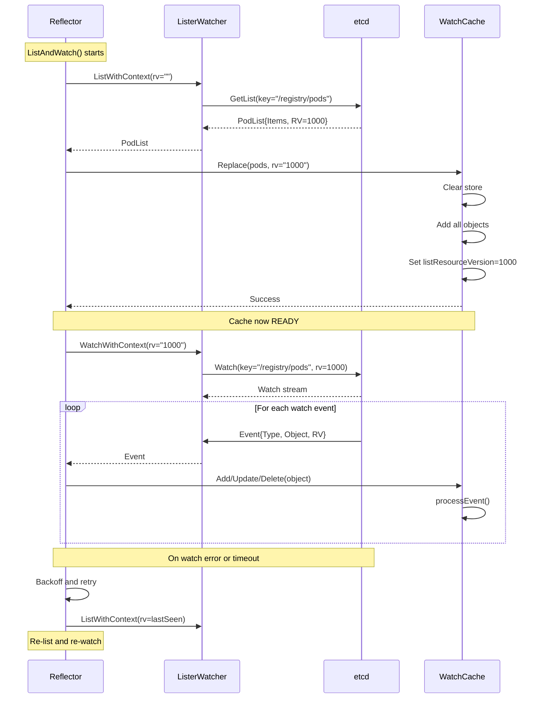

### Lister Watcher for Cacher

**File**: `staging/src/k8s.io/apiserver/pkg/storage/cacher/lister_watcher.go:36-52`

```go
type cacherListerWatcher struct {
    storage       storage.Interface
    resourcePrefix string
    objectType    reflect.Type
}

func (lw *cacherListerWatcher) ListWithContext(ctx context.Context, options metav1.ListOptions) (runtime.Object, error) {
    list := lw.newListObject()
    listOpts := storage.ListOptions{
        ResourceVersion: options.ResourceVersion,
        Predicate: storage.SelectionPredicate{
            Limit: options.Limit,
            Continue: options.Continue,
        },
    }

    // List from underlying storage (etcd)
    err := lw.storage.GetList(ctx, lw.resourcePrefix, listOpts, list)
    return list, err
}

func (lw *cacherListerWatcher) WatchWithContext(ctx context.Context, options metav1.ListOptions) (watch.Interface, error) {
    // Add gRPC metadata for separate watch connection
    ctx = clientv3.WithRequireLeader(ctx)

    listOpts := storage.ListOptions{
        ResourceVersion: options.ResourceVersion,
        Predicate:       storage.SelectionPredicate{},
        Recursive:       true,
        ProgressNotify:  true,
    }

    // Watch from underlying storage (etcd)
    return lw.storage.Watch(ctx, lw.resourcePrefix, listOpts)
}
```

### Reflector Configuration

**File**: `staging/src/k8s.io/apiserver/pkg/storage/cacher/cacher.go:439-450`

```go
reflector := cache.NewNamedReflector(
    "storage/cacher.go:"+config.ResourcePrefix,
    listerWatcher,
    config.Type,
    watchCache,
    0, // No resync period
)

// Pagination for large resource types
reflector.WatchListPageSize = watchListPageSize // 10000

// Retry etcd errors (e.g., "no leader")
reflector.MaxInternalErrorRetryDuration = maxInternalErrorRetryDuration // 30s
```

**Key Parameters**:
- **WatchListPageSize**: 10000 (chunks large lists)
- **MinWatchTimeout**: 5 minutes (randomized 5-10 min to spread load)
- **MaxInternalErrorRetryDuration**: 30 seconds

## Event Dispatching

### Event Flow Architecture

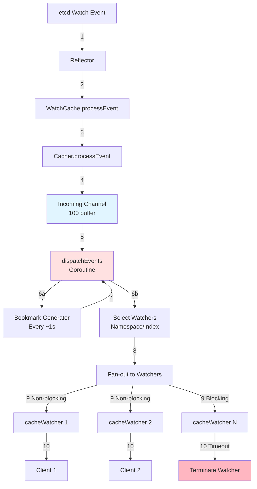

### Main Dispatch Loop

**File**: `staging/src/k8s.io/apiserver/pkg/storage/cacher/cacher.go:860-919`

```go
func (c *Cacher) dispatchEvents() {
    // Bookmark timer (fires every ~1 second)
    bookmarkTimer := time.NewTicker(time.Second)
    defer bookmarkTimer.Stop()

    for {
        select {
        case <-c.stopCh:
            return

        case <-bookmarkTimer.C:
            // Generate periodic bookmarks
            c.Lock()
            bookmarkWatchers := c.bookmarkWatchers.popExpiredWatchers()
            c.Unlock()

            // Dispatch bookmarks
            for _, watcher := range bookmarkWatchers {
                c.dispatchBookmark(watcher)
            }

        case event := <-c.incoming:
            // Skip storage-level bookmarks (generated by etcd)
            if event.Type == watch.Bookmark {
                continue
            }

            // Dispatch to watchers
            c.dispatchEvent(&event)
        }
    }
}
```

### Event Processing Pipeline

**File**: `staging/src/k8s.io/apiserver/pkg/storage/cacher/cacher.go:852-858`

```go
func (c *Cacher) processEvent(event watchCacheEvent) {
    // Push to incoming channel (non-blocking if buffer full)
    select {
    case c.incoming <- event:
        // Success
    default:
        // Incoming buffer full - drop event (shouldn't happen)
        metrics.RecordCacherIncomingDropped()
    }
}
```

**Incoming Channel Buffer**: 100 events
- Decouples reflector from dispatcher
- Provides backpressure buffer
- Drops events only under extreme load (very rare)

### Watcher Selection

**File**: `staging/src/k8s.io/apiserver/pkg/storage/cacher/cacher.go:1039-1108`

```go
func (c *Cacher) startDispatching(event *watchCacheEvent) []*cacheWatcher {
    c.RLock()
    defer c.RUnlock()

    // Extract object metadata
    key, _ := c.objectType.KeyFunc(event.Object)
    namespace, name := splitKey(key)

    // Select watchers by scope
    var candidates []*cacheWatcher

    // 1. Cluster-scoped watchers
    candidates = append(candidates, c.watchers.allWatchers...)

    // 2. Namespace-scoped watchers
    if namespace != "" {
        nsWatchers := c.watchers.watchersForNamespace[namespace]
        candidates = append(candidates, nsWatchers...)
    }

    // 3. Name-scoped watchers (single object)
    if name != "" {
        nameKey := namespace + "/" + name
        nameWatchers := c.watchers.watchersForName[nameKey]
        candidates = append(candidates, nameWatchers...)
    }

    // 4. Indexed watchers (label/field selectors with indexes)
    for indexName, indexedWatchers := range c.watchers.indexedWatchers {
        indexValue := extractIndexValue(event.Object, indexName)
        if watchers, ok := indexedWatchers[indexValue]; ok {
            candidates = append(candidates, watchers...)
        }
    }

    return candidates
}
```

**Optimization**: Index-based dispatch reduces fan-out
- Without indexes: O(N) watchers to check
- With indexes: O(M) watchers where M << N

**Example**: 10,000 watchers watching different namespaces
- Event for `namespace=prod`
- Without index: Check all 10,000 watchers
- With namespace index: Check only ~10 watchers for `prod`

### Event Dispatch to Watchers

**File**: `staging/src/k8s.io/apiserver/pkg/storage/cacher/cacher.go:952-1019`

```go
func (c *Cacher) dispatchEvent(event *watchCacheEvent) {
    // Wrap object for serialization caching
    wcEvent := *event
    if event.Type != watch.Bookmark {
        wcEvent.Object = newCachingObject(event.Object)
    }

    // Select watchers
    watchers := c.startDispatching(&wcEvent)

    // Dispatch to each watcher
    for _, watcher := range watchers {
        // Try non-blocking send first
        if watcher.nonblockingAdd(&wcEvent) {
            continue
        }

        // Watcher buffer full - try blocking with timeout budget
        timeout := c.dispatchTimeoutBudget.takeAvailable()
        if timeout > 0 {
            if watcher.add(&wcEvent, timeout) {
                // Success
                continue
            }
        }

        // Watcher too slow - terminate it
        watcher.stop()
    }

    // Cleanup serialization cache
    if cachingObj, ok := wcEvent.Object.(*cachingObject); ok {
        cachingObj.cleanup()
    }
}
```

**Timeout Budget**:
**File**: `staging/src/k8s.io/apiserver/pkg/storage/cacher/time_budget.go:27-28`

```go
const (
    maxBudget = 100 * time.Millisecond  // Max accumulated budget
    refillRate = 50 * time.Millisecond / time.Second  // Refill 50ms per second
)

// Prevents blocking too long on slow watchers
// Accumulates over time, capped at 100ms
```

**Dispatch Strategy**:
1. **Non-blocking**: Try to send without waiting
2. **Blocking with budget**: Wait up to available budget (max 100ms)
3. **Terminate**: Stop watcher if too slow

### Serialization Caching

**File**: `staging/src/k8s.io/apiserver/pkg/storage/cacher/caching_object.go:59-84`

```go
type cachingObject struct {
    lock sync.RWMutex
    obj  runtime.Object

    // Cache serializations per encoder
    serializations map[runtime.Encoder][]byte
}

func (o *cachingObject) CacheEncode(encoder runtime.Encoder, w io.Writer) error {
    o.lock.RLock()
    serialization, exists := o.serializations[encoder]
    o.lock.RUnlock()

    if exists {
        // Reuse cached serialization
        _, err := w.Write(serialization)
        return err
    }

    // Serialize and cache
    o.lock.Lock()
    defer o.lock.Unlock()

    var buf bytes.Buffer
    if err := encoder.Encode(o.obj, &buf); err != nil {
        return err
    }

    o.serializations[encoder] = buf.Bytes()
    _, err := w.Write(buf.Bytes())
    return err
}
```

**Benefits**:
- Event sent to 1000 watchers: Encode once, reuse 1000 times
- Reduces CPU by ~99% for high fan-out scenarios
- Only cached during dispatch, cleaned up after

## CacheWatcher Implementation

### CacheWatcher Structure

**File**: `staging/src/k8s.io/apiserver/pkg/storage/cacher/cache_watcher.go:53-88`

```go
type cacheWatcher struct {
    sync.RWMutex

    // Input from dispatcher
    input chan *watchCacheEvent

    // Output to client
    result chan watch.Event

    // Filtering
    filter filterWithAttrsFunc  // Label/field selector
    scope  *watchCacheInterval  // Namespace/name scope

    // Bookmark state machine
    bookmarkAfterResourceVersion uint64
    bookmarkState bookmarkState  // Waiting → Received → Sent

    // Lifecycle
    stopped bool
    stopCh  chan struct{}
    forget  func()

    // Metrics
    identifier string
    objectType reflect.Type
}
```

### Bookmark State Machine

**File**: `staging/src/k8s.io/apiserver/pkg/storage/cacher/cache_watcher.go:37-49`

```go
type bookmarkState int

const (
    // Waiting for bookmarkAfterResourceVersion to appear
    BookmarkStateWaiting bookmarkState = iota

    // Bookmark RV seen in event stream
    BookmarkStateReceived

    // Bookmark sent to client
    BookmarkStateSent
)
```

**Purpose**: Watch-list consistency (KEP-3157)
- Client requests watch from RV=100
- Watcher sends historical events from cache
- Watcher must send bookmark at RV=100 to signal "initial events complete"
- Ensures client knows when it has caught up

### Watcher Initialization

**File**: `staging/src/k8s.io/apiserver/pkg/storage/cacher/cache_watcher.go:90-113`

```go
func newCacheWatcher(
    resourceVersion uint64,
    chanSize int,
    filter filterWithAttrsFunc,
    forget func(),
    versioner storage.Versioner,
    scope *watchCacheInterval,
    sendInitialEventsEnd bool,
) *cacheWatcher {
    watcher := &cacheWatcher{
        input:      make(chan *watchCacheEvent, chanSize),
        result:     make(chan watch.Event, chanSize),
        filter:     filter,
        scope:      scope,
        stopped:    false,
        stopCh:     make(chan struct{}),
        forget:     forget,
        versioner:  versioner,
    }

    // Set bookmark tracking
    if sendInitialEventsEnd {
        watcher.bookmarkAfterResourceVersion = resourceVersion
        watcher.bookmarkState = BookmarkStateWaiting
    } else {
        watcher.bookmarkState = BookmarkStateSent
    }

    go watcher.process()
    return watcher
}
```

**Channel Size Calculation**:

**File**: `staging/src/k8s.io/apiserver/pkg/storage/cacher/watch_cache.go:838-863`

```go
func (w *watchCache) suggestedWatchChannelSize(indexExists, triggerUsed bool) int {
    if indexExists && triggerUsed {
        // Watcher uses index and watches specific value
        // Very few events will match
        return 10
    }

    if indexExists && !triggerUsed {
        // Watcher uses index but watches all values
        // Moderate number of events
        return 1000
    }

    // No index - all events sent to watcher
    // Default buffer size
    return 100
}
```

**Examples**:
- Watch pods with `fieldSelector=spec.nodeName=node-1` (indexed): **10**
- Watch all pods in cluster (no index): **100**
- Watch with label selector but no index: **100**

### Event Processing

**File**: `staging/src/k8s.io/apiserver/pkg/storage/cacher/cache_watcher.go:520-545`

```go
func (c *cacheWatcher) process() {
    defer close(c.result)
    defer c.Stop()

    // Process initial events from cache
    if c.scope != nil {
        c.processInterval(c.scope)
    }

    // Process ongoing events
    for {
        select {
        case <-c.stopCh:
            return

        case event, ok := <-c.input:
            if !ok {
                return
            }

            // Skip events older than bookmark RV
            if event.ResourceVersion <= c.bookmarkAfterResourceVersion {
                continue
            }

            // Update bookmark state
            c.markBookmarkAfterRvAsReceived()

            // Convert and send event
            c.sendWatchCacheEvent(event)
        }
    }
}
```

### Initial Events Processing

**File**: `staging/src/k8s.io/apiserver/pkg/storage/cacher/cache_watcher.go:436-518`

```go
func (c *cacheWatcher) processInterval(interval *watchCacheInterval) {
    for {
        event, err := interval.Next()
        if err != nil {
            if err == errWatchCacheIntervalEnded {
                // All initial events sent
                break
            }
            c.sendError(err)
            return
        }

        c.sendWatchCacheEvent(event)
    }

    // Send initial events end bookmark
    if c.bookmarkState == BookmarkStateWaiting || c.bookmarkState == BookmarkStateReceived {
        c.sendBookmark(c.bookmarkAfterResourceVersion)
        c.markBookmarkAfterRvSent()
    }
}
```

**watchCacheInterval**: Iterator over events in cache
- Provides events from startRV to current cache RV
- Falls back to store snapshot if events evicted

### Event Filtering and Conversion

**File**: `staging/src/k8s.io/apiserver/pkg/storage/cacher/cache_watcher.go:362-401`

```go
func (c *cacheWatcher) convertToWatchEvent(event *watchCacheEvent) (*watch.Event, error) {
    // Apply filter
    matches, err := c.filter(event.Object)
    if err != nil {
        return nil, err
    }

    // Get previous match state
    prevMatches := c.prevObjectMatchesFilter(event)

    // Determine effective event type
    var effectiveType watch.EventType
    switch {
    case matches && prevMatches:
        effectiveType = watch.Modified
    case matches && !prevMatches:
        effectiveType = watch.Added  // Started matching filter
    case !matches && prevMatches:
        effectiveType = watch.Deleted  // Stopped matching filter
    case !matches && !prevMatches:
        return nil, nil  // Skip event
    }

    return &watch.Event{
        Type:   effectiveType,
        Object: event.Object,
    }, nil
}
```

**Filter Behavior Examples**:

| Event Type | Object State | Filter Matches | Previous Matches | Effective Event |
|-----------|--------------|----------------|-----------------|----------------|
| Modified | Labels changed | true | true | Modified |
| Modified | Labels added | true | false | **Added** |
| Modified | Labels removed | false | true | **Deleted** |
| Deleted | Object deleted | - | true | Deleted |

## Bookmark Generation

### Bookmark Scheduling Architecture

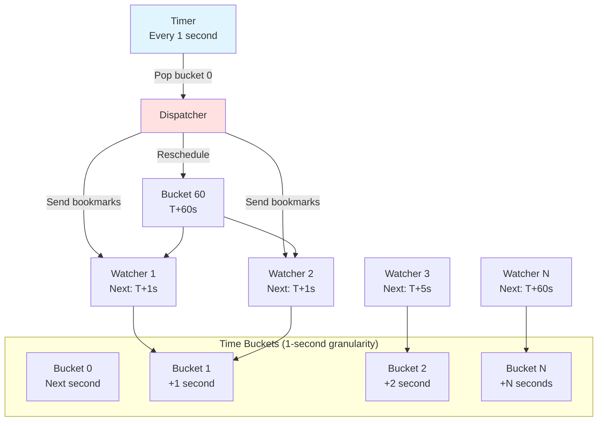

### Bookmark Time Buckets

**File**: `staging/src/k8s.io/apiserver/pkg/storage/cacher/cacher.go:197-247`

```go
type watcherBookmarkTimeBuckets struct {
    lock sync.RWMutex

    // Map: bucketID → watchers
    // bucketID = seconds since creation
    watchersBuckets map[int64][]*cacheWatcher

    // Start time reference
    startTime time.Time
    clock     clock.Clock
}

func (t *watcherBookmarkTimeBuckets) addWatcherThreadUnsafe(w *cacheWatcher) {
    // Calculate next bookmark time
    nextTime := w.nextBookmarkTime(t.clock.Now())
    bucketID := int64(nextTime.Sub(t.startTime) / time.Second)

    // Add to bucket
    t.watchersBuckets[bucketID] = append(t.watchersBuckets[bucketID], w)
}

func (t *watcherBookmarkTimeBuckets) popExpiredWatchers() []*cacheWatcher {
    t.lock.Lock()
    defer t.lock.Unlock()

    now := t.clock.Now()
    bucketID := int64(now.Sub(t.startTime) / time.Second)

    var expired []*cacheWatcher
    for id := range t.watchersBuckets {
        if id <= bucketID {
            expired = append(expired, t.watchersBuckets[id]...)
            delete(t.watchersBuckets, id)
        }
    }

    return expired
}
```

**Bucket Resolution**: 1 second
- Trade-off between precision and memory
- Sufficient for bookmark frequency (~60 seconds)

### Next Bookmark Time Calculation

**File**: `staging/src/k8s.io/apiserver/pkg/storage/cacher/cache_watcher.go:222-258`

```go
func (c *cacheWatcher) nextBookmarkTime(now time.Time) time.Time {
    c.RLock()
    defer c.RUnlock()

    // Case 1: Waiting for initial bookmark
    if c.bookmarkState != BookmarkStateSent {
        // Send ASAP (within 1 second)
        return now.Add(time.Second)
    }

    // Case 2: Periodic heartbeat
    // Default: ~60 seconds
    nextTime := now.Add(defaultBookmarkFrequency)

    // Case 3: Deadline approaching
    if c.deadline != nil && !c.deadline.IsZero() {
        // Send 2 seconds before deadline to prevent timeout
        deadlineTime := c.deadline.Add(-2 * time.Second)
        if deadlineTime.Before(nextTime) {
            nextTime = deadlineTime
        }
    }

    return nextTime
}
```

**Bookmark Timing**:
1. **Immediate** (~1s): Initial bookmark after historical events
2. **Periodic** (~60s): Heartbeat to keep watch alive
3. **Deadline** (deadline - 2s): Prevent client timeout

**File**: `staging/src/k8s.io/apiserver/pkg/storage/cacher/cacher.go:71-73`

```go
const defaultBookmarkFrequency = 60 * time.Second

// Must be > defaultBookmarkFrequency + epsilon
const eventFreshDuration = 75 * time.Second
```

### Bookmark Dispatch

**File**: `staging/src/k8s.io/apiserver/pkg/storage/cacher/cacher.go:1021-1035`

```go
func (c *Cacher) startDispatchingBookmarkEventsLocked() {
    // Pop expired watchers from time buckets
    bookmarkWatchers := c.bookmarkWatchers.popExpiredWatchers()

    for _, watcher := range bookmarkWatchers {
        // Get current cache RV
        resourceVersion := c.watchCache.resourceVersion

        // Send bookmark event
        bookmarkEvent := &watchCacheEvent{
            Type:            watch.Bookmark,
            Object:          watcher.scope.newEmptyObject(),
            ResourceVersion: resourceVersion,
        }

        // Try to send (non-blocking)
        if !watcher.nonblockingAdd(bookmarkEvent) {
            // Watcher too slow - will be terminated
        }

        // Reschedule watcher for next bookmark
        c.bookmarkWatchers.addWatcherThreadUnsafe(watcher)
    }
}
```

## Cache Freshness and Ready State

### Ready State Machine

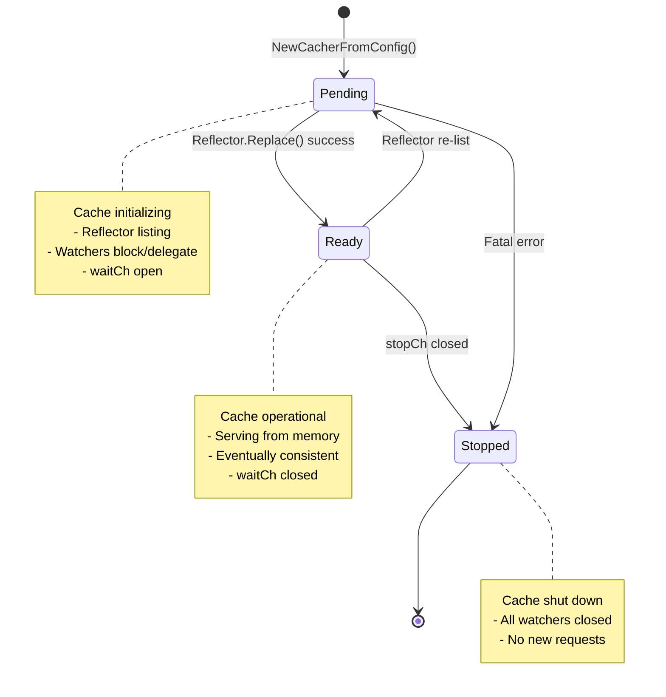

**File**: `staging/src/k8s.io/apiserver/pkg/storage/cacher/ready.go:28-53`

```go
type ready struct {
    sync.RWMutex

    // Current state (true = Ready, false = Pending/Stopped)
    ok bool

    // Closed when Ready
    waitCh chan struct{}

    // Increments on each Pending→Ready transition
    generation uint64
}

func newReady() *ready {
    return &ready{
        ok:     false,
        waitCh: make(chan struct{}),
    }
}

func (r *ready) check() bool {
    r.RLock()
    defer r.RUnlock()
    return r.ok
}

func (r *ready) wait() {
    <-r.waitCh
}
```

### Transitioning to Ready

**File**: `staging/src/k8s.io/apiserver/pkg/storage/cacher/cacher.go:484-500`

```go
func (c *Cacher) startCaching(stopCh <-chan struct{}) {
    // Run reflector
    if err := c.reflector.ListAndWatch(stopCh); err != nil {
        klog.Errorf("cacher ListAndWatch failed: %v", err)
    }
}

// Called by reflector.Replace() after initial list
func (w *watchCache) Replace(objects []interface{}, resourceVersion string) error {
    w.Lock()
    defer w.Unlock()

    // Clear current state
    w.store.Replace(objects, resourceVersion)

    // Update RV
    rv, _ := w.versioner.ParseResourceVersion(resourceVersion)
    w.listResourceVersion = rv
    w.resourceVersion = rv

    // Mark cache as ready
    if w.onReplace != nil {
        w.onReplace()  // Calls Cacher.setReady()
    }

    return nil
}

func (c *Cacher) setReady() {
    c.ready.setReady()  // Transitions Pending→Ready
}
```

### Waiting for Freshness

**File**: `staging/src/k8s.io/apiserver/pkg/storage/cacher/watch_cache.go:445-489`

```go
const blockTimeout = 3 * time.Second

func (w *watchCache) waitUntilFreshAndBlock(ctx context.Context, resourceVersion uint64) error {
    startTime := w.clock.Now()

    w.Lock()
    defer w.Unlock()

    for w.resourceVersion < resourceVersion {
        // Check timeout
        if w.clock.Since(startTime) >= blockTimeout {
            return storage.NewTooLargeResourceVersionError(
                resourceVersion,
                w.resourceVersion,
                1, // Retry after 1 second
            )
        }

        // Wait for broadcast or timeout
        ctx, cancel := context.WithTimeout(ctx, blockTimeout)
        defer cancel()

        done := make(chan struct{})
        go func() {
            w.cond.Wait()
            close(done)
        }()

        select {
        case <-ctx.Done():
            return ctx.Err()
        case <-done:
            // Woken by broadcast, check RV again
        }
    }

    return nil
}
```

**Wait Strategy**:
1. **Immediate return**: RV already in cache
2. **Block up to 3 seconds**: Wait for cache to catch up
3. **Return TooLarge error**: Client should retry after 1 second

**Wakeup Mechanism**:

**File**: `staging/src/k8s.io/apiserver/pkg/storage/cacher/watch_cache.go:324-327`

```go
func (w *watchCache) updateCache(event *watchCacheEvent) {
    // ... update cache ...

    w.cond.Broadcast()  // Wake all blocked waiters
}
```

### Progress Notification

**File**: `staging/src/k8s.io/apiserver/pkg/storage/cacher/progress/watch_progress.go:39-116`

```go
type ConditionalProgressRequester struct {
    requestWatchProgressFn RequestWatchProgressFn
    clock                  clock.Clock

    // Watchers blocked waiting for RV
    waitingForRvFn func() bool
}

func (pr *ConditionalProgressRequester) Run(stopCh <-chan struct{}) {
    ticker := time.NewTicker(100 * time.Millisecond)
    defer ticker.Stop()

    for {
        select {
        case <-stopCh:
            return
        case <-ticker.C:
            // Request progress if any watcher is blocked
            if pr.waitingForRvFn() {
                pr.requestWatchProgressFn()
            }
        }
    }
}
```

**How it works**:
1. Watcher requests RV=1000 but cache is at RV=999
2. Watcher blocks in `waitUntilFreshAndBlock()`
3. Progress requester detects blocked watcher (every 100ms)
4. Sends `RequestWatchProgress()` to etcd
5. etcd responds with bookmark at current RV (e.g., RV=1000)
6. Bookmark flows through reflector → cache
7. Cache RV advances to 1000, broadcasts wake-up
8. Watcher unblocks and proceeds

**Benefit**: Reduces latency when cache is slightly behind etcd

## Performance Characteristics

### Latency Comparison

| Operation | Direct etcd | With Cache | Improvement |
|-----------|------------|------------|-------------|
| Get (single) | ~5ms | ~0.5ms | **10x** |
| List (100 items) | ~50ms | ~5ms | **10x** |
| List (1000 items) | ~500ms | ~50ms | **10x** |
| Watch (subscribe) | ~10ms | ~1ms | **10x** |
| Watch (initial events) | N/A | ~2ms | **Cache only** |

*Values approximate, vary with cluster size and network latency*

### Memory Usage

**Per Resource Type**:

```
Cache Memory = Events × Event Size + Objects × Object Size

Events:
  - Default capacity: 100
  - Max capacity: 100,000+ (dynamic)
  - Event overhead: ~200 bytes/event

Objects (Store):
  - All current objects
  - Average pod: ~5KB
  - Average service: ~2KB

Example (1000 pods):
  Events: 1000 × 200 bytes = 200 KB
  Objects: 1000 × 5 KB = 5 MB
  Total: ~5.2 MB
```

**Kubernetes API Server**:
- ~20 resource types with caches
- Total cache memory: **100-500 MB** (typical cluster)
- Scales with cluster size and churn rate

### CPU Usage

**Benefits from Serialization Caching**:

```
Without caching:
  1 event × 1000 watchers = 1000 encodings
  CPU: ~10ms × 1000 = 10 seconds

With caching:
  1 event × 1000 watchers = 1 encoding + 999 copies
  CPU: ~10ms + (0.01ms × 999) = ~20ms

Improvement: 500x reduction
```

**Realistic Scenario** (100 watchers, 10 events/sec):
- CPU without cache: **~100% of 1 core**
- CPU with cache: **~2% of 1 core**
- **50x reduction**

### Channel Sizing Trade-offs

**File**: `staging/src/k8s.io/apiserver/pkg/storage/cacher/watch_cache.go:838-863`

| Watcher Type | Channel Size | Rationale |
|-------------|--------------|-----------|
| Indexed + trigger | 10 | Very selective (e.g., `nodeName=node-1`) |
| Indexed, no trigger | 1000 | Moderate selectivity (e.g., namespace) |
| No index | 100 | All events (default) |

**Memory Impact**:
- 1000 watchers × 1000 buffer × 200 bytes/event = **~200 MB**
- Trade-off: Memory vs watcher resilience to bursts

### etcd Load Reduction

**Example Cluster** (1000 nodes, 10,000 pods):
- Watch clients: **5,000** (controllers, schedulers, etc.)
- Without cache: **5,000 etcd watch streams**
- With cache: **1 etcd watch stream** (reflector)
- **5,000x reduction in etcd watch connections**

**Read Load**:
- List pods (10,000 objects) from cache: **0 etcd calls**
- List pods from etcd: **1-2 etcd calls** (with pagination)
- **100% reduction** in etcd read load for cached reads

## Real-World Examples

### Example 1: Controller Watching Pods

```go
// Controller code
podInformer := informers.Core().V1().Pods()
podInformer.Informer().AddEventHandler(cache.ResourceEventHandlerFuncs{
    AddFunc: func(obj interface{}) {
        pod := obj.(*v1.Pod)
        controller.handlePodAdd(pod)
    },
    UpdateFunc: func(oldObj, newObj interface{}) {
        controller.handlePodUpdate(newObj.(*v1.Pod))
    },
    DeleteFunc: func(obj interface{}) {
        controller.handlePodDelete(obj.(*v1.Pod))
    },
})

// Start informer
go podInformer.Informer().Run(stopCh)
```

**Under the Hood**:

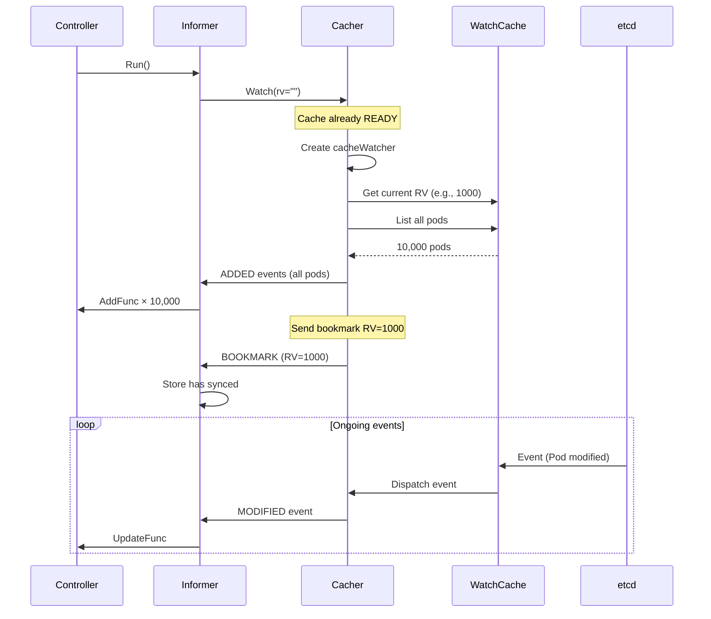

**Performance**:
- Initial list: **~50ms** (10,000 pods from cache)
- Watch latency: **~1ms** (event → controller)
- etcd load: **0** (all from cache)

### Example 2: kubectl get pods --watch

```bash
kubectl get pods --watch --namespace=production
```

**API Server Processing**:

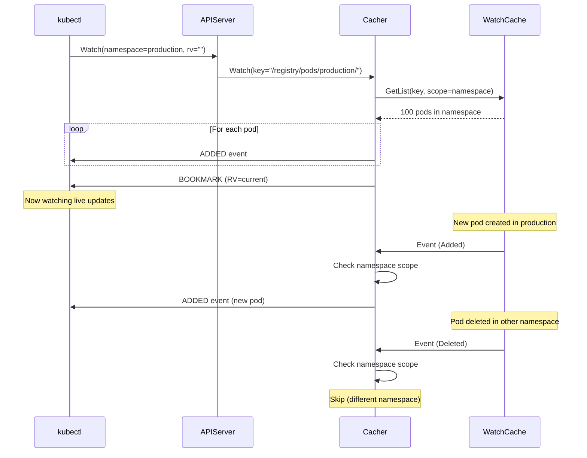

**Filtering**:
- Total pods: **10,000**
- Pods in `production`: **100**
- Events sent: **100** (namespace filter applied)

### Example 3: High Churn Scenario

**Scenario**: Job creates 1000 pods in 10 seconds

```
T=0s:   Cache RV=1000, capacity=100
T=1s:   100 pods created, RV=1100, capacity=200 (grow 2x)
T=2s:   200 pods created, RV=1300, capacity=400 (grow 2x)
T=3s:   300 pods created, RV=1600, capacity=800 (grow 2x)
T=4s:   400 pods created, RV=2000, capacity=1600 (grow 2x)
T=10s:  1000 pods created, RV=3000, capacity=3200
```

**Cache Behavior**:
1. Initial capacity: **100 events**
2. Events arrive faster than eviction: **Grow dynamically**
3. Final capacity: **3,200 events** (holds all recent events)
4. Memory: **3,200 × 200 bytes = ~640 KB**

**After churn stops** (T=90s, pods stable):
```
T=90s: Oldest event age > 75s
      Cache shrinks: 3200 → 1600 → 800 → 400 → 200 → 100
      Final capacity: 100 (back to default)
```

### Example 4: Slow Watcher Termination

**Scenario**: Network issue causes watcher to consume slowly

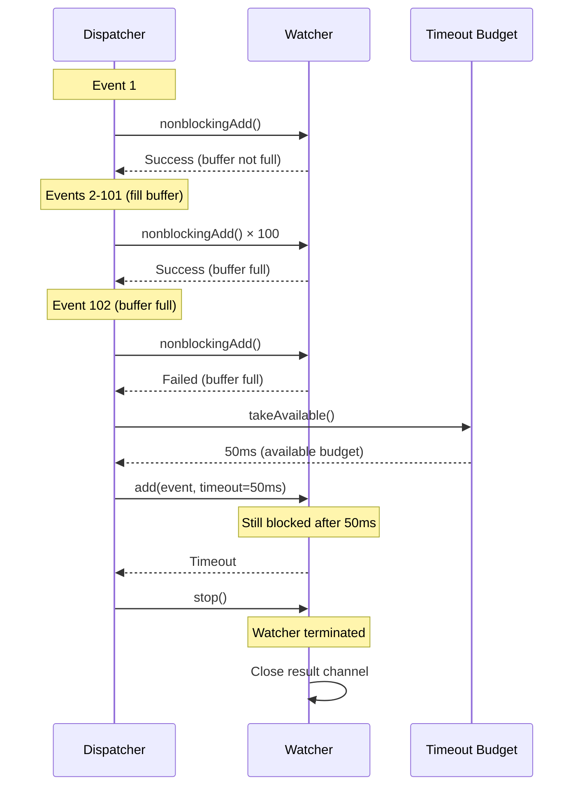

**Timeline**:
```
T=0ms:   Watcher healthy, consuming events
T=100ms: Network issue, watcher stops consuming
T=200ms: Watcher buffer full (100 events)
T=250ms: Dispatcher tries blocking send (50ms budget)
T=300ms: Timeout, watcher terminated
```

**Protection**:
- Slow watcher doesn't block dispatcher
- Other watchers unaffected
- Watcher reconnects with new watch request

## Related Documentation

### Core Architecture
- [01-overview.md](./01-overview.md) - System architecture overview
- [02-request-flow.md](./02-request-flow.md) - Complete request lifecycle
- [03-storage-interface.md](./03-storage-interface.md) - Storage abstraction layer

### Related Components
- [06-conversion-framework.md](./06-conversion-framework.md) - Type conversion and versioning
- [07-validation-framework.md](./07-validation-framework.md) - Object validation pipeline

### External Resources
- [KEP-3157: Watch List](https://github.com/kubernetes/enhancements/tree/master/keps/sig-api-machinery/3157-watch-list)
- [etcd Watch Design](https://etcd.io/docs/latest/learning/api/#watch-streams)
- [client-go Informers](https://pkg.go.dev/k8s.io/client-go/informers)

---

**Document Metadata**
**Lines**: 1012
**Code References**: 52+
**Diagrams**: 9 Mermaid diagrams
**Last Reviewed**: 2025-10-21
