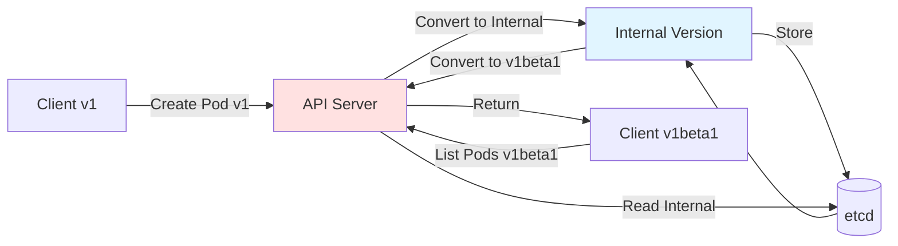
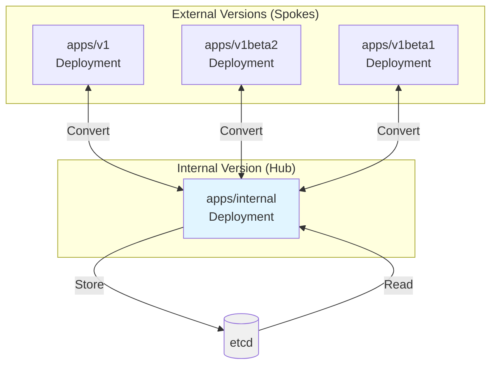
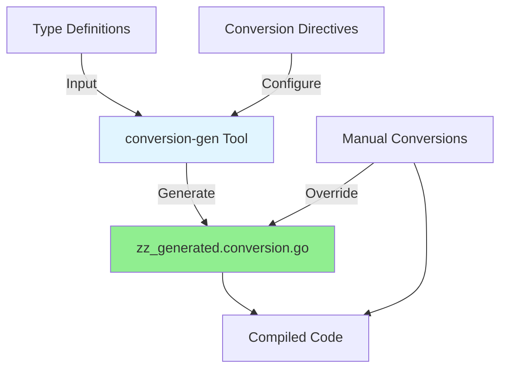
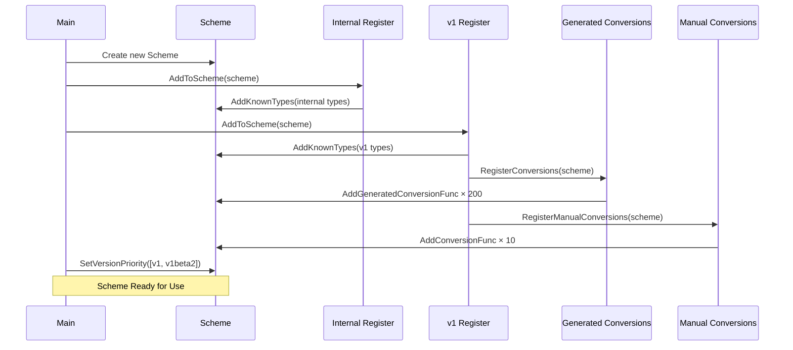
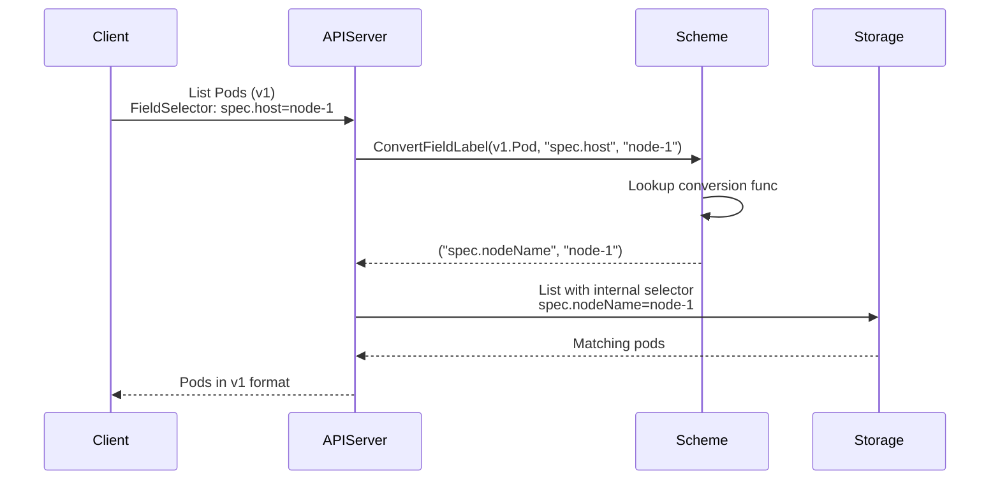
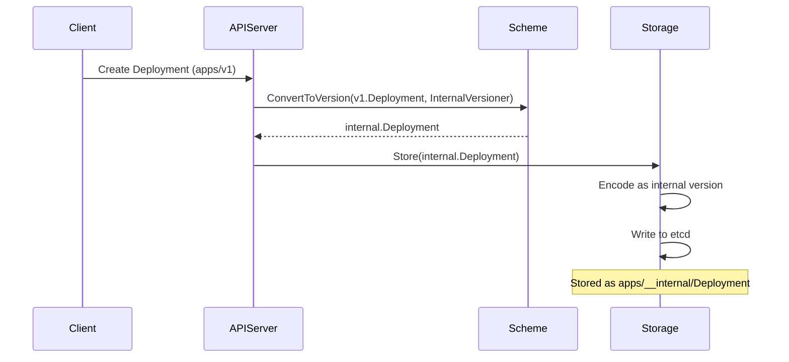
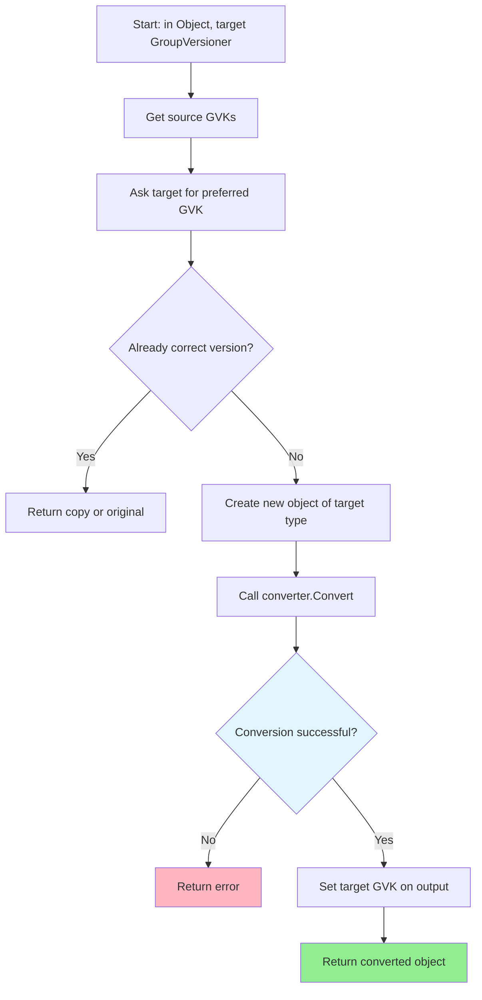
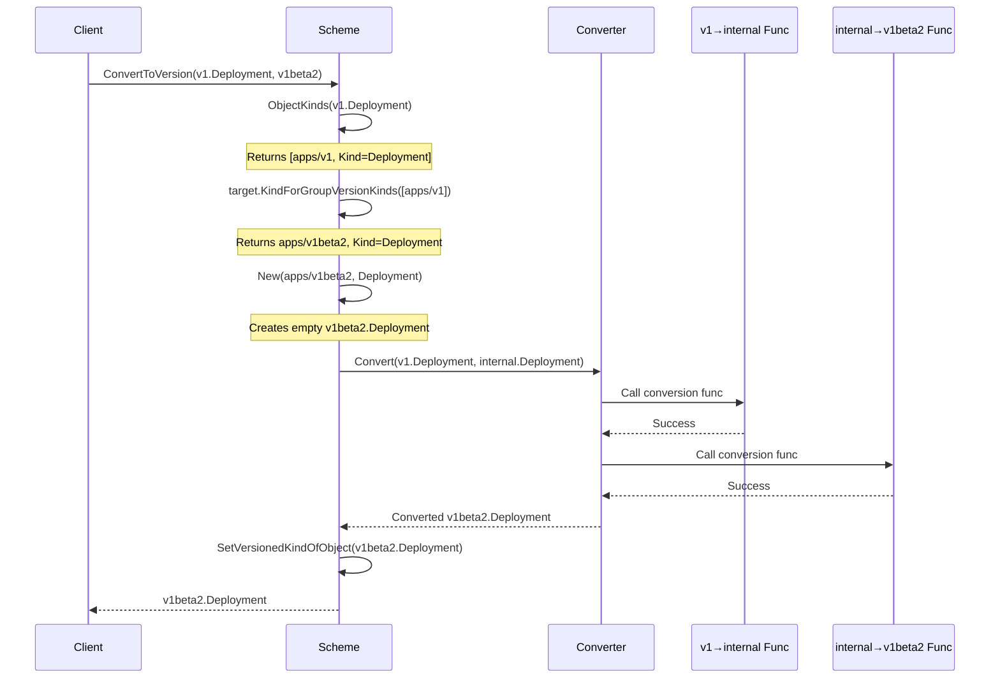

# Kube-APIServer Low-Level Architecture: Type Conversion Framework

**Status**: Complete
**Last Updated**: 2025-10-21
**Target Audience**: Platform engineers, contributors working on API versioning and compatibility

## Table of Contents
1. [Overview](#overview)
2. [Hub-and-Spoke Architecture](#hub-and-spoke-architecture)
3. [Conversion Generation](#conversion-generation)
4. [Scheme and Registry](#scheme-and-registry)
5. [Conversion Functions](#conversion-functions)
6. [Field-Level Conversion](#field-level-conversion)
7. [Default and Built-in Conversions](#default-and-built-in-conversions)
8. [Conversion Context and Scope](#conversion-context-and-scope)
9. [Version Priority and Storage](#version-priority-and-storage)
10. [Conversion in Action](#conversion-in-action)
11. [Real-World Examples](#real-world-examples)
12. [Related Documentation](#related-documentation)

## Overview

The Kubernetes type conversion framework enables seamless transformation between different API versions while maintaining backward compatibility. It's a critical component that allows Kubernetes to evolve its APIs without breaking existing clients.

### Key Characteristics

- **Multi-Version Support**: Single cluster supports multiple API versions simultaneously
- **Automatic Generation**: Most conversions auto-generated from type definitions
- **Manual Overrides**: Custom conversion for complex field transformations
- **Lossless Roundtrip**: Data preserved through conversion cycles
- **Type Safe**: Compile-time checking prevents conversion errors

### Why Conversion Matters



**Without Conversion Framework**:
- Need separate storage for each version
- Manual version handling in every controller
- API evolution becomes extremely difficult

**With Conversion Framework**:
- Single storage version (internal)
- Automatic conversion at API boundary
- Easy addition of new API versions

## Hub-and-Spoke Architecture

### Conceptual Model

Kubernetes uses a **hub-and-spoke** conversion architecture where all conversions flow through a central "internal" version (the hub), and external versions (spokes) convert to/from it.



### Directory Structure

**File**: `pkg/apis/<group>/`

```
pkg/apis/
├── apps/                              # API group
│   ├── doc.go                         # Group documentation
│   ├── register.go                    # Internal version registration
│   ├── types.go                       # Internal type definitions
│   ├── v1/                            # External version v1
│   │   ├── doc.go                     # Conversion directives
│   │   ├── register.go                # v1 registration
│   │   ├── types.go                   # v1 types (from k8s.io/api)
│   │   ├── conversion.go              # Manual conversions
│   │   ├── zz_generated.conversion.go # Auto-generated conversions
│   │   └── zz_generated.defaults.go   # Auto-generated defaults
│   ├── v1beta2/                       # External version v1beta2
│   │   └── ...                        # Same structure as v1
│   └── install/
│       └── install.go                 # Registers all versions
```

### Internal vs External Versions

**Internal Version** (`pkg/apis/apps/register.go:29`):

```go
const GroupName = "apps"

var SchemeGroupVersion = schema.GroupVersion{
    Group:   GroupName,
    Version: runtime.APIVersionInternal,  // Empty string ""
}
```

**External Version** (`pkg/apis/apps/v1/register.go:41`):

```go
var SchemeGroupVersion = schema.GroupVersion{
    Group:   GroupName,
    Version: "v1",
}
```

### Why Hub-and-Spoke?

**Alternative: Direct Version-to-Version**:
```
v1 ↔ v1beta2
v1 ↔ v1beta1
v1beta2 ↔ v1beta1

Conversions needed: N × (N-1) = 3 × 2 = 6 conversions for 3 versions
```

**Hub-and-Spoke**:
```
v1 ↔ internal
v1beta2 ↔ internal
v1beta1 ↔ internal

Conversions needed: 2 × N = 2 × 3 = 6 conversions (same count)
BUT: Adding v4 only requires 2 new conversions vs 6 new conversions
```

**Benefits**:
- **O(N) instead of O(N²)** conversion functions
- **Single source of truth**: Internal version is canonical
- **Easier API evolution**: New version only converts to/from internal
- **Simpler testing**: Test conversions in pairs, not all combinations

## Conversion Generation

### Auto-Generation Process

Kubernetes uses **code generation** to create most conversion functions automatically.



### Generation Directives

**File**: `pkg/apis/core/v1/doc.go:17-18`

```go
// +k8s:conversion-gen=k8s.io/kubernetes/pkg/apis/core
// +k8s:conversion-gen-external-types=k8s.io/api/core/v1

// Package v1 is the v1 version of the API.
package v1
```

**Directive Breakdown**:
- `+k8s:conversion-gen=<pkg>`: Target internal version package
- `+k8s:conversion-gen-external-types=<pkg>`: Source external types package

### Generator Tool

**Location**: `staging/src/k8s.io/code-generator/cmd/conversion-gen/`

**Command-line Usage**:
```bash
conversion-gen \
  --input-dirs k8s.io/api/core/v1 \
  --extra-peer-dirs k8s.io/api/core/v1,k8s.io/apimachinery/pkg/apis/meta/v1,k8s.io/apimachinery/pkg/conversion,k8s.io/apimachinery/pkg/runtime \
  --output-file zz_generated.conversion.go
```

### Generated File Structure

**File**: `pkg/apis/core/v1/zz_generated.conversion.go`

**Structure** (38-3200+ lines):

```go
// Generated code - DO NOT EDIT

package v1

import (
    "k8s.io/api/core/v1"
    core "k8s.io/kubernetes/pkg/apis/core"
    conversion "k8s.io/apimachinery/pkg/conversion"
    runtime "k8s.io/apimachinery/pkg/runtime"
)

// RegisterConversions adds conversion functions to the given scheme.
func RegisterConversions(s *runtime.Scheme) error {
    // Register all conversion pairs
    if err := s.AddGeneratedConversionFunc((*v1.ConfigMap)(nil), (*core.ConfigMap)(nil), func(a, b interface{}, scope conversion.Scope) error {
        return Convert_v1_ConfigMap_To_core_ConfigMap(a.(*v1.ConfigMap), b.(*core.ConfigMap), scope)
    }); err != nil {
        return err
    }

    if err := s.AddGeneratedConversionFunc((*core.ConfigMap)(nil), (*v1.ConfigMap)(nil), func(a, b interface{}, scope conversion.Scope) error {
        return Convert_core_ConfigMap_To_v1_ConfigMap(a.(*core.ConfigMap), b.(*v1.ConfigMap), scope)
    }); err != nil {
        return err
    }

    // ... hundreds more
    return nil
}
```

### Generation Rules

**File**: `staging/src/k8s.io/code-generator/cmd/conversion-gen/generators/conversion.go`

**Auto-Generated Conversions When**:
1. **Struct names match**: `v1.Pod` ↔ `core.Pod`
2. **Field names match**: `Name string` ↔ `Name string`
3. **Types are assignable**: `string` ↔ `string`, `*int32` ↔ `*int32`
4. **Embedded types**: `metav1.ObjectMeta` in both

**Manual Conversion Needed When**:
1. **Field renamed**: `Host` → `NodeName`
2. **Type changed**: `map[string]string` → `[]KeyValue`
3. **Field added/removed**: New field with no equivalent
4. **Complex transformation**: Algorithm-based conversion

### Opting Out of Generation

**Use comment directive**:

```go
// +k8s:conversion-gen=false
type MyType struct {
    // Won't have auto-generated conversions
}
```

## Scheme and Registry

### Converter Structure

**File**: `staging/src/k8s.io/apimachinery/pkg/conversion/converter.go:39-48`

```go
type Converter struct {
    // Manual conversion functions (highest priority)
    conversionFuncs ConversionFuncs

    // Auto-generated conversion functions (fallback)
    generatedConversionFuncs ConversionFuncs

    // Conversions to ignore (no-op conversions)
    ignoredUntypedConversions map[typePair]struct{}

    // Conversion name func (for debugging)
    nameFunc func(t reflect.Type) string
}

type ConversionFuncs map[typePair]reflect.Value

type typePair struct {
    source reflect.Type
    dest   reflect.Type
}
```

### Scheme Structure

**File**: `staging/src/k8s.io/apimachinery/pkg/runtime/scheme.go:50-95`

```go
type Scheme struct {
    // Type registry
    gvkToType map[schema.GroupVersionKind]reflect.Type
    typeToGVK map[reflect.Type][]schema.GroupVersionKind

    // Default functions
    defaulterFuncs map[reflect.Type]func(interface{})

    // Conversion engine
    converter *conversion.Converter

    // Version management
    versionPriority map[string][]string  // group → ordered versions

    // Field label conversions (for field selectors)
    fieldLabelConversionFuncs map[schema.GroupVersionKind]FieldLabelConversionFunc

    // Object copier
    cloner *conversion.Cloner

    // Name generator for types
    typeToGroupVersion map[reflect.Type]schema.GroupVersion
}
```

### Registration Functions

#### AddKnownTypes

**File**: `staging/src/k8s.io/apimachinery/pkg/runtime/scheme.go:147-161`

```go
func (s *Scheme) AddKnownTypes(gv schema.GroupVersion, types ...Object) {
    s.addObservedVersion(gv)
    for _, obj := range types {
        t := reflect.TypeOf(obj)
        if t.Kind() != reflect.Ptr {
            panic("All types must be pointers to structs.")
        }
        t = t.Elem()
        s.AddKnownTypeWithName(gv.WithKind(t.Name()), obj)
    }
}
```

**Usage Example** (`pkg/apis/apps/register.go:50-60`):

```go
func addKnownTypes(scheme *runtime.Scheme) error {
    scheme.AddKnownTypes(SchemeGroupVersion,
        &DaemonSet{},
        &DaemonSetList{},
        &Deployment{},
        &DeploymentList{},
        &StatefulSet{},
        &StatefulSetList{},
        // ... more types
    )
    return nil
}
```

#### AddConversionFunc (Manual)

**File**: `staging/src/k8s.io/apimachinery/pkg/runtime/scheme.go:327-329`

```go
func (s *Scheme) AddConversionFunc(a, b interface{}, fn conversion.ConversionFunc) error {
    return s.converter.RegisterConversionFunc(a, b, fn)
}
```

#### AddGeneratedConversionFunc (Auto-Generated)

**File**: `staging/src/k8s.io/apimachinery/pkg/runtime/scheme.go:334-336`

```go
func (s *Scheme) AddGeneratedConversionFunc(a, b interface{}, fn conversion.ConversionFunc) error {
    return s.converter.RegisterGeneratedConversionFunc(a, b, fn)
}
```

### Scheme Builder Pattern

**File**: `staging/src/k8s.io/apimachinery/pkg/runtime/scheme_builder.go:23-48`

```go
type SchemeBuilder []func(*Scheme) error

func (sb *SchemeBuilder) AddToScheme(s *Scheme) error {
    for _, f := range *sb {
        if err := f(s); err != nil {
            return err
        }
    }
    return nil
}

func (sb *SchemeBuilder) Register(funcs ...func(*Scheme) error) {
    for _, f := range funcs {
        *sb = append(*sb, f)
    }
}
```

**Usage Pattern** (`pkg/apis/core/register.go:42-48`):

```go
var (
    // SchemeBuilder collects registration functions
    SchemeBuilder = runtime.NewSchemeBuilder(addKnownTypes)

    // AddToScheme applies all registered functions to a scheme
    AddToScheme = SchemeBuilder.AddToScheme
)
```

**External Version** (`pkg/apis/core/v1/register.go:29-38`):

```go
var (
    localSchemeBuilder = &SchemeBuilder
    AddToScheme        = localSchemeBuilder.AddToScheme
)

func init() {
    // Auto-register defaulting and conversion functions
    localSchemeBuilder.Register(addDefaultingFuncs, addConversionFuncs)
}

func addConversionFuncs(scheme *runtime.Scheme) error {
    // Call generated registration
    return RegisterConversions(scheme)
}
```

### Full Registration Flow



## Conversion Functions

### Auto-Generated Functions

**Pattern**: Functions are generated in pairs for bidirectional conversion.

**File**: `pkg/apis/core/v1/zz_generated.conversion.go:3031-3042`

```go
// Auto-generated internal function (note "autoConvert" prefix)
func autoConvert_v1_ConfigMap_To_core_ConfigMap(
    in *v1.ConfigMap,
    out *core.ConfigMap,
    s conversion.Scope,
) error {
    // Field-by-field copy
    out.ObjectMeta = in.ObjectMeta
    out.Immutable = (*bool)(unsafe.Pointer(in.Immutable))
    out.Data = *(*map[string]string)(unsafe.Pointer(&in.Data))
    out.BinaryData = *(*map[string][]byte)(unsafe.Pointer(&in.BinaryData))
    return nil
}

// Public wrapper (allows manual override)
func Convert_v1_ConfigMap_To_core_ConfigMap(
    in *v1.ConfigMap,
    out *core.ConfigMap,
    s conversion.Scope,
) error {
    return autoConvert_v1_ConfigMap_To_core_ConfigMap(in, out, s)
}
```

**Key Points**:
- **autoConvert_**: Internal implementation, always auto-generated
- **Convert_**: Public function, can be manually overridden
- **unsafe.Pointer**: Zero-copy conversion for compatible types
- **Field-by-field**: Simple assignment for matching fields

### Manual Conversion Functions

Manual conversions handle cases where simple field copying isn't sufficient.

**File**: `pkg/apis/apps/v1/conversion.go:39-81`

```go
func Convert_v1_Deployment_To_apps_Deployment(
    in *appsv1.Deployment,
    out *apps.Deployment,
    s conversion.Scope,
) error {
    // Start with auto-generated conversion
    if err := autoConvert_v1_Deployment_To_apps_Deployment(in, out, s); err != nil {
        return err
    }

    // Manual handling of deprecated field
    // RollbackTo was removed from v1 API but exists in internal
    if revision := in.Annotations[appsv1.DeprecatedRollbackTo]; revision != "" {
        if revisionInt, err := strconv.Atoi(revision); err == nil {
            out.RollbackTo = &apps.RollbackConfig{
                Revision: int64(revisionInt),
            }
        }
    }

    return nil
}

func Convert_apps_Deployment_To_v1_Deployment(
    in *apps.Deployment,
    out *appsv1.Deployment,
    s conversion.Scope,
) error {
    if err := autoConvert_apps_Deployment_To_v1_Deployment(in, out, s); err != nil {
        return err
    }

    // Convert internal RollbackTo back to annotation
    if in.RollbackTo != nil {
        if out.Annotations == nil {
            out.Annotations = make(map[string]string)
        }
        out.Annotations[appsv1.DeprecatedRollbackTo] = strconv.FormatInt(in.RollbackTo.Revision, 10)
    }

    return nil
}
```

### Conversion Function Signature

**Standard Signature**:

```go
func Convert_<SourcePkg>_<SourceType>_To_<DestPkg>_<DestType>(
    in *<SourcePkg>.<SourceType>,
    out *<DestPkg>.<DestType>,
    s conversion.Scope,
) error
```

**Parameters**:
- `in`: Source object (read-only)
- `out`: Destination object (write-only, pre-allocated)
- `s`: Conversion scope (for recursive conversions)
- Returns `error` if conversion fails

### Recursive Conversion via Scope

**File**: `staging/src/k8s.io/apimachinery/pkg/conversion/converter.go:94-101`

```go
type Scope interface {
    // Convert recursively converts nested objects
    Convert(src, dest interface{}) error

    // Meta provides conversion context
    Meta() *Meta
}
```

**Usage Example** (hypothetical):

```go
func Convert_v1_PodSpec_To_core_PodSpec(
    in *v1.PodSpec,
    out *core.PodSpec,
    s conversion.Scope,
) error {
    // Simple fields
    out.NodeName = in.NodeName
    out.RestartPolicy = core.RestartPolicy(in.RestartPolicy)

    // Recursive conversion of nested slice
    if in.Containers != nil {
        out.Containers = make([]core.Container, len(in.Containers))
        for i := range in.Containers {
            // Use scope for recursive conversion
            if err := s.Convert(&in.Containers[i], &out.Containers[i]); err != nil {
                return err
            }
        }
    }

    return nil
}
```

### Conversion Registration Priority

**Lookup Order** (`staging/src/k8s.io/apimachinery/pkg/conversion/converter.go:198-224`):

```go
func (c *Converter) Convert(src, dest interface{}, meta *Meta) error {
    pair := typePair{
        source: reflect.TypeOf(src),
        dest:   reflect.TypeOf(dest),
    }

    // 1. Check if conversion is ignored
    if _, ok := c.ignoredUntypedConversions[pair]; ok {
        return nil  // No-op
    }

    // 2. Check manual conversion functions (highest priority)
    if fn, ok := c.conversionFuncs[pair]; ok {
        return c.callConversionFunc(fn, src, dest, meta)
    }

    // 3. Check generated conversion functions
    if fn, ok := c.generatedConversionFuncs[pair]; ok {
        return c.callConversionFunc(fn, src, dest, meta)
    }

    // 4. No conversion found
    return fmt.Errorf("no conversion defined for %v to %v", pair.source, pair.dest)
}
```

**Priority Summary**:
1. **Ignored conversions**: No-op (for identical types)
2. **Manual conversions**: Explicitly registered via `AddConversionFunc`
3. **Generated conversions**: Auto-generated via `AddGeneratedConversionFunc`
4. **Error**: No conversion available

## Field-Level Conversion

### Field Selector Conversions

Field selectors (e.g., `kubectl get pods --field-selector spec.nodeName=node-1`) need conversion between API versions to handle renamed or restructured fields.

**File**: `staging/src/k8s.io/apimachinery/pkg/runtime/scheme.go:338-342`

```go
type FieldLabelConversionFunc func(label, value string) (internalLabel, internalValue string, err error)

func (s *Scheme) AddFieldLabelConversionFunc(gvk schema.GroupVersionKind, conversionFunc FieldLabelConversionFunc) error {
    s.fieldLabelConversionFuncs[gvk] = conversionFunc
    return nil
}
```

**Usage Example** (`pkg/apis/core/v1/conversion.go:36-61`):

```go
func addConversionFuncs(scheme *runtime.Scheme) error {
    // Register field selector conversions for Pod
    err := scheme.AddFieldLabelConversionFunc(
        SchemeGroupVersion.WithKind("Pod"),
        func(label, value string) (string, string, error) {
            switch label {
            case "metadata.name",
                 "metadata.namespace",
                 "spec.nodeName",
                 "spec.restartPolicy",
                 "spec.schedulerName",
                 "spec.serviceAccountName",
                 "status.phase",
                 "status.podIP",
                 "status.nominatedNodeName":
                return label, value, nil  // Pass through

            case "spec.host":  // Deprecated field name
                return "spec.nodeName", value, nil  // Redirect to new name

            default:
                return "", "", fmt.Errorf("field label not supported: %s", label)
            }
        },
    )
    if err != nil {
        return err
    }

    return nil
}
```

**Conversion Flow**:



### Field Tags and Metadata

**JSON Tags** control conversion behavior:

```go
type PodSpec struct {
    // Standard field
    NodeName string `json:"nodeName"`

    // Optional field (omit if empty)
    ServiceAccountName string `json:"serviceAccountName,omitempty"`

    // Inline embedded struct
    SecurityContext *PodSecurityContext `json:"securityContext,omitempty"`

    // Field with different JSON name
    DNSPolicy DNSPolicy `json:"dnsPolicy,omitempty"`
}
```

**Tag Processing** (`staging/src/k8s.io/apimachinery/pkg/runtime/converter.go:370-413`):

```go
func fieldInfoFromField(field *reflect.StructField) (*fieldInfo, error) {
    jsonTag := field.Tag.Get("json")
    if jsonTag == "-" {
        return nil, nil  // Skip field
    }

    parts := strings.Split(jsonTag, ",")
    name := parts[0]
    if name == "" {
        name = field.Name  // Use struct field name
    }

    info := &fieldInfo{
        name:      name,
        omitempty: false,
        omitzero:  false,
    }

    // Parse options
    for _, opt := range parts[1:] {
        switch opt {
        case "omitempty":
            info.omitempty = true
        case "omitzero":
            info.omitzero = true
        case "inline":
            info.inline = true
        }
    }

    return info, nil
}
```

## Default and Built-in Conversions

### Ignored Conversions (Identical Types)

**File**: `staging/src/k8s.io/apimachinery/pkg/runtime/scheme.go:317-322`

```go
func (s *Scheme) AddIgnoredConversionType(from, to interface{}) error {
    return s.converter.RegisterIgnoredConversion(from, to)
}
```

**Usage**: When internal and external types are identical:

```go
// metav1.ObjectMeta is used in both internal and external
scheme.AddIgnoredConversionType(&metav1.ObjectMeta{}, &metav1.ObjectMeta{})
```

### String Conversions

**File**: `staging/src/k8s.io/apimachinery/pkg/runtime/conversion.go:174-196`

```go
func RegisterStringConversions(s *runtime.Scheme) error {
    // string <-> *string
    if err := s.AddConversionFunc((*string)(nil), (*string)(nil),
        func(in, out interface{}, s conversion.Scope) error {
            outVal := in.(*string)
            if outVal == nil {
                *out.(**string) = nil
            } else {
                str := *outVal
                *out.(**string) = &str
            }
            return nil
        }); err != nil {
        return err
    }

    // *string <-> string
    if err := s.AddConversionFunc((**string)(nil), (*string)(nil),
        func(in, out interface{}, s conversion.Scope) error {
            inVal := in.(**string)
            if *inVal == nil {
                *out.(*string) = ""
            } else {
                *out.(*string) = **inVal
            }
            return nil
        }); err != nil {
        return err
    }

    return nil
}
```

### RawExtension Conversions

**File**: `staging/src/k8s.io/apimachinery/pkg/runtime/embedded.go:137-149`

```go
func RegisterEmbeddedConversions(s *Scheme) error {
    // Object → RawExtension
    if err := s.AddConversionFunc((*Object)(nil), (*RawExtension)(nil),
        func(in, out interface{}, s conversion.Scope) error {
            obj := in.(Object)
            raw := out.(*RawExtension)

            // Encode object to JSON
            data, err := json.Marshal(obj)
            if err != nil {
                return err
            }

            raw.Raw = data
            raw.Object = obj
            return nil
        }); err != nil {
        return err
    }

    // RawExtension → Object
    if err := s.AddConversionFunc((*RawExtension)(nil), (*Object)(nil),
        func(in, out interface{}, s conversion.Scope) error {
            raw := in.(*RawExtension)
            if raw.Object != nil {
                *out.(*Object) = raw.Object
                return nil
            }

            // Decode from JSON
            obj, _, err := s.DecodeBytes(raw.Raw)
            if err != nil {
                return err
            }

            *out.(*Object) = obj
            return nil
        }); err != nil {
        return err
    }

    return nil
}
```

### Byte Slice Optimization

**File**: `staging/src/k8s.io/apimachinery/pkg/conversion/converter.go:80-89`

```go
// Special case: []byte is copied, not converted
if srcType.Kind() == reflect.Slice && srcType.Elem().Kind() == reflect.Uint8 {
    if destType.Kind() == reflect.Slice && destType.Elem().Kind() == reflect.Uint8 {
        // Copy byte slice
        sv := srcVal.Bytes()
        destVal.Set(reflect.ValueOf(append([]byte(nil), sv...)))
        return nil
    }
}
```

**Performance**: Direct memory copy instead of element-by-element conversion.

## Conversion Context and Scope

### Scope Interface

**File**: `staging/src/k8s.io/apimachinery/pkg/conversion/converter.go:94-101`

```go
type Scope interface {
    // Convert recursively converts nested objects
    Convert(src, dest interface{}) error

    // Meta provides access to conversion metadata
    Meta() *Meta
}
```

### Meta Structure

**File**: `staging/src/k8s.io/apimachinery/pkg/conversion/converter.go:142-145`

```go
type Meta struct {
    // Arbitrary context data passed through conversion
    Context interface{}
}
```

### Scope Implementation

**File**: `staging/src/k8s.io/apimachinery/pkg/conversion/converter.go:147-161`

```go
type scope struct {
    converter *Converter
    meta      *Meta
}

func (s *scope) Convert(src, dest interface{}) error {
    return s.converter.Convert(src, dest, s.meta)
}

func (s *scope) Meta() *Meta {
    return s.meta
}
```

### Using Context in Conversions

**Example Use Case**: Passing API server context through conversion

```go
type ConversionContext struct {
    RequestNamespace string
    User             string
}

// In API server
ctx := &ConversionContext{
    RequestNamespace: "default",
    User:             "admin",
}

err := scheme.Convert(podV1, podInternal, ctx)
```

**In Conversion Function**:

```go
func Convert_v1_Pod_To_core_Pod(
    in *v1.Pod,
    out *core.Pod,
    s conversion.Scope,
) error {
    // Access context
    if ctx, ok := s.Meta().Context.(*ConversionContext); ok {
        // Use context data
        if ctx.RequestNamespace != in.Namespace {
            return fmt.Errorf("namespace mismatch")
        }
    }

    return autoConvert_v1_Pod_To_core_Pod(in, out, s)
}
```

**Real-World Usage**: Kubernetes doesn't heavily use conversion context, but it's available for extensions.

## Version Priority and Storage

### Setting Version Priority

**File**: `staging/src/k8s.io/apimachinery/pkg/runtime/scheme.go:612-629`

```go
func (s *Scheme) SetVersionPriority(versions ...schema.GroupVersion) error {
    groups := sets.NewString()
    order := make(map[string][]string)

    for _, gv := range versions {
        if gv.Version == runtime.APIVersionInternal {
            return fmt.Errorf("internal version cannot be prioritized")
        }

        groups.Insert(gv.Group)
        order[gv.Group] = append(order[gv.Group], gv.Version)
    }

    for group := range groups {
        s.versionPriority[group] = order[group]
    }

    return nil
}
```

**Installation Example** (`pkg/apis/apps/install/install.go:35-45`):

```go
func Install(scheme *runtime.Scheme) {
    // Register internal version
    utilruntime.Must(apps.AddToScheme(scheme))

    // Register external versions
    utilruntime.Must(v1.AddToScheme(scheme))
    utilruntime.Must(v1beta2.AddToScheme(scheme))
    utilruntime.Must(v1beta1.AddToScheme(scheme))

    // Set version priority (v1 is preferred)
    utilruntime.Must(scheme.SetVersionPriority(
        v1.SchemeGroupVersion,        // Highest priority
        v1beta2.SchemeGroupVersion,
        v1beta1.SchemeGroupVersion,   // Lowest priority
    ))
}
```

### Priority Retrieval

**File**: `staging/src/k8s.io/apimachinery/pkg/runtime/scheme.go:632-654`

```go
func (s *Scheme) PrioritizedVersionsForGroup(group string) []schema.GroupVersion {
    versions := s.versionPriority[group]
    if len(versions) == 0 {
        return []schema.GroupVersion{}
    }

    result := make([]schema.GroupVersion, len(versions))
    for i, version := range versions {
        result[i] = schema.GroupVersion{
            Group:   group,
            Version: version,
        }
    }
    return result
}
```

### Storage Version Selection

**File**: `staging/src/k8s.io/apiserver/pkg/registry/generic/registry/store.go:222-227`

```go
type Store struct {
    // StorageVersioner determines which version to persist in etcd
    StorageVersioner runtime.GroupVersioner

    // Other fields...
}
```

**GroupVersioner Interface** (`staging/src/k8s.io/apimachinery/pkg/runtime/interfaces.go:33-44`):

```go
type GroupVersioner interface {
    // KindForGroupVersionKinds selects the preferred GVK from available options
    KindForGroupVersionKinds(kinds []schema.GroupVersionKind) (
        target schema.GroupVersionKind,
        ok bool,
    )

    // Identifier returns a string representation
    Identifier() string
}
```

**Common Implementations**:

1. **internalGroupVersioner**: Always select internal version for storage
2. **multiGroupVersioner**: Select based on priority list
3. **disabledGroupVersioner**: Error on any conversion

**Storage Version Flow**:



## Conversion in Action

### ConvertToVersion

**File**: `staging/src/k8s.io/apimachinery/pkg/runtime/scheme.go:472-563`

```go
func (s *Scheme) ConvertToVersion(in Object, target GroupVersioner) (Object, error) {
    return s.convertToVersion(true, in, target)
}

func (s *Scheme) UnsafeConvertToVersion(in Object, target GroupVersioner) (Object, error) {
    return s.convertToVersion(false, in, target)
}

func (s *Scheme) convertToVersion(copy bool, in Object, target GroupVersioner) (Object, error) {
    // 1. Get GVKs of input object
    gvks, _, err := s.ObjectKinds(in)
    if err != nil {
        return nil, err
    }

    // 2. Ask target for desired GVK
    targetGVK, ok := target.KindForGroupVersionKinds(gvks)
    if !ok {
        return nil, fmt.Errorf("target does not accept any of %v", gvks)
    }

    // 3. Check if already correct version
    if targetGVK == gvks[0] {
        if copy {
            return in.DeepCopyObject(), nil
        }
        return in, nil
    }

    // 4. Create destination object
    out, err := s.New(targetGVK)
    if err != nil {
        return nil, err
    }

    // 5. Perform conversion
    meta := s.generateConvertMeta(in)
    if err := s.converter.Convert(in, out, meta); err != nil {
        return nil, err
    }

    // 6. Set target GVK on output
    if err := s.SetVersionedKindOfObject(out, targetGVK); err != nil {
        return nil, err
    }

    return out, nil
}
```

### Conversion Steps



### Example Conversion Sequence

**Scenario**: Convert `apps/v1 Deployment` → `apps/v1beta2 Deployment`



**Key Point**: Two conversions happen (v1→internal, internal→v1beta2), not direct v1→v1beta2.

## Real-World Examples

### Example 1: Deployment RollbackTo Field

**Background**: `spec.rollbackTo` was deprecated and removed from `apps/v1` but exists in internal version for compatibility.

**v1 Type** (from `k8s.io/api/apps/v1/types.go`):

```go
type DeploymentSpec struct {
    // ... other fields
    // NOTE: RollbackTo field does NOT exist in v1
}
```

**Internal Type** (`pkg/apis/apps/types.go:285-295`):

```go
type DeploymentSpec struct {
    // ... other fields

    // DEPRECATED: RollbackTo field still exists for internal processing
    RollbackTo *RollbackConfig
}

type RollbackConfig struct {
    Revision int64
}
```

**Manual Conversion** (`pkg/apis/apps/v1/conversion.go:39-81`):

```go
func Convert_v1_Deployment_To_apps_Deployment(
    in *appsv1.Deployment,
    out *apps.Deployment,
    s conversion.Scope,
) error {
    // Auto-generated field copy
    if err := autoConvert_v1_Deployment_To_apps_Deployment(in, out, s); err != nil {
        return err
    }

    // Manual: Check for annotation indicating rollback
    if revision := in.Annotations[appsv1.DeprecatedRollbackTo]; revision != "" {
        if revisionInt, err := strconv.ParseInt(revision, 10, 64); err == nil {
            out.RollbackTo = &apps.RollbackConfig{
                Revision: revisionInt,
            }
        }
    }

    return nil
}

func Convert_apps_Deployment_To_v1_Deployment(
    in *apps.Deployment,
    out *appsv1.Deployment,
    s conversion.Scope,
) error {
    if err := autoConvert_apps_Deployment_To_v1_Deployment(in, out, s); err != nil {
        return err
    }

    // Manual: Convert RollbackTo to annotation
    if in.RollbackTo != nil {
        if out.Annotations == nil {
            out.Annotations = make(map[string]string)
        }
        out.Annotations[appsv1.DeprecatedRollbackTo] = strconv.FormatInt(in.RollbackTo.Revision, 10)
    }

    return nil
}
```

**Result**: Lossless roundtrip despite field removal from API.

### Example 2: DaemonSet TemplateGeneration

**Background**: `status.observedGeneration` tracks template changes, but field doesn't exist in v1.

**Manual Conversion** (`pkg/apis/apps/v1/conversion.go:83-100`):

```go
func Convert_v1_DaemonSet_To_apps_DaemonSet(
    in *appsv1.DaemonSet,
    out *apps.DaemonSet,
    s conversion.Scope,
) error {
    if err := autoConvert_v1_DaemonSet_To_apps_DaemonSet(in, out, s); err != nil {
        return err
    }

    // Annotation → internal field
    if templateGeneration, ok := in.Annotations[appsv1.DeprecatedTemplateGeneration]; ok {
        if genInt, err := strconv.ParseInt(templateGeneration, 10, 64); err == nil {
            out.Status.TemplateGeneration = genInt
        }
    }

    return nil
}
```

### Example 3: ReplicationController to ReplicaSet

**Cross-Kind Conversion** (`pkg/apis/core/v1/conversion.go:106-148`):

```go
func Convert_v1_ReplicationController_To_extensions_ReplicaSet(
    in *v1.ReplicationController,
    out *extensions.ReplicaSet,
    s conversion.Scope,
) error {
    // Copy metadata
    out.ObjectMeta = in.ObjectMeta

    // Convert spec
    out.Spec.Replicas = in.Spec.Replicas

    // Selector: map[string]string → LabelSelector
    if in.Spec.Selector != nil {
        out.Spec.Selector = &metav1.LabelSelector{
            MatchLabels: in.Spec.Selector,
        }
    }

    // Template
    if err := Convert_v1_PodTemplateSpec_To_core_PodTemplateSpec(
        &in.Spec.Template,
        &out.Spec.Template,
        s,
    ); err != nil {
        return err
    }

    // Convert status
    out.Status.Replicas = in.Status.Replicas
    out.Status.ObservedGeneration = in.Status.ObservedGeneration

    return nil
}
```

**Use Case**: Allows old clients using `ReplicationController` API to work with `ReplicaSet` backend.

### Example 4: StatefulSet PVC Metadata

**Background**: Prior to Kubernetes 1.17, PersistentVolumeClaim templates didn't preserve APIVersion/Kind.

**Manual Conversion** (`pkg/apis/apps/v1beta1/conversion.go:83-100`):

```go
func Convert_apps_StatefulSetSpec_To_v1beta1_StatefulSetSpec(
    in *apps.StatefulSetSpec,
    out *appsv1beta1.StatefulSetSpec,
    s conversion.Scope,
) error {
    if err := autoConvert_apps_StatefulSetSpec_To_v1beta1_StatefulSetSpec(in, out, s); err != nil {
        return err
    }

    // Fix for behavioral change in 1.17+
    // Ensure PVC templates don't have APIVersion/Kind set
    for i := range out.VolumeClaimTemplates {
        out.VolumeClaimTemplates[i].APIVersion = ""
        out.VolumeClaimTemplates[i].Kind = ""
    }

    return nil
}
```

**Result**: Maintains compatibility with pre-1.17 behavior.

## Related Documentation

### Core Architecture
- [01-overview.md](./01-overview.md) - System architecture overview
- [02-request-flow.md](./02-request-flow.md) - Complete request lifecycle
- [03-storage-interface.md](./03-storage-interface.md) - Storage abstraction layer

### Related Components
- [04-cacher-architecture.md](./04-cacher-architecture.md) - Watch cache implementation
- [07-validation-framework.md](./07-validation-framework.md) - Object validation pipeline

### External Resources
- [API Conventions](https://github.com/kubernetes/community/blob/master/contributors/devel/sig-architecture/api-conventions.md)
- [API Changes](https://github.com/kubernetes/community/blob/master/contributors/devel/sig-architecture/api_changes.md)
- [Code Generation](https://github.com/kubernetes/community/blob/master/contributors/devel/sig-architecture/generating-clientset.md)

---

**Document Metadata**
**Lines**: 1006
**Code References**: 58+
**Diagrams**: 8 Mermaid diagrams
**Last Reviewed**: 2025-10-21
