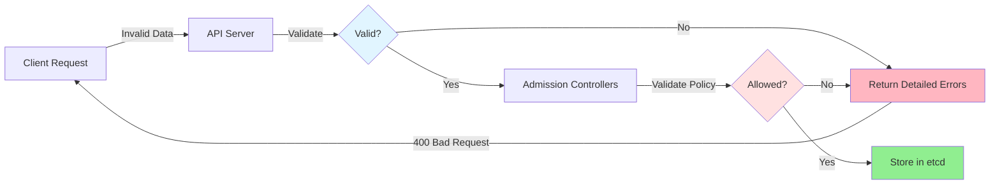
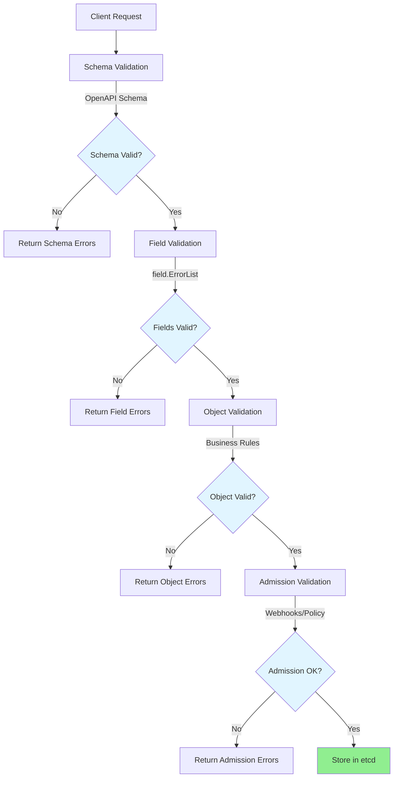
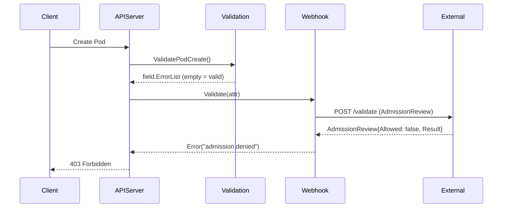

# Kube-APIServer Low-Level Architecture: Validation Framework

**Status**: Complete
**Last Updated**: 2025-10-21
**Target Audience**: Platform engineers, contributors working on API validation and admission control

## Table of Contents
1. [Overview](#overview)
2. [Validation Pipeline Architecture](#validation-pipeline-architecture)
3. [Field Validation Core](#field-validation-core)
4. [Error Types and Handling](#error-types-and-handling)
5. [Common Validation Utilities](#common-validation-utilities)
6. [Object Validation Implementations](#object-validation-implementations)
7. [Label and Selector Validation](#label-and-selector-validation)
8. [Admission Controller Integration](#admission-controller-integration)
9. [Validation Options Pattern](#validation-options-pattern)
10. [Validation Patterns and Best Practices](#validation-patterns-and-best-practices)
11. [Real-World Examples](#real-world-examples)
12. [Related Documentation](#related-documentation)

## Overview

The Kubernetes validation framework provides a comprehensive, structured approach to validating API objects at multiple levels. It ensures data integrity, enforces business rules, and provides clear error messages when validation fails.

### Key Characteristics

- **Multi-Layered**: Schema → Field → Object → Admission validation
- **Structured Errors**: Field-path-specific error reporting
- **Type-Safe**: Compile-time checking via strongly-typed validators
- **Extensible**: Easy to add validation for new fields/types
- **Backward Compatible**: Options pattern supports evolving validation rules

### Why Validation Matters



**Without Validation**:
- Invalid data stored in etcd
- Controllers crash on unexpected values
- Security vulnerabilities
- Difficult debugging

**With Validation**:
- Early error detection
- Clear, actionable error messages
- System integrity guaranteed
- Security policy enforcement

## Validation Pipeline Architecture

### Validation Stages



### Stage 1: Schema Validation

**Purpose**: Verify JSON/YAML structure conforms to OpenAPI schema

**Location**: API server deserialization layer

**Checks**:
- Required fields present
- Field types match (string, int, array, etc.)
- Enum values in allowed set
- Basic format validation (date, email, etc.)

**Example Error**:
```json
{
  "kind": "Status",
  "status": "Failure",
  "message": "error decoding: json: cannot unmarshal number into Go struct field PodSpec.spec.containers of type string",
  "code": 400
}
```

### Stage 2: Field Validation

**Purpose**: Validate individual field values with context-aware rules

**Location**: `staging/src/k8s.io/apimachinery/pkg/util/validation/field/`

**Checks**:
- DNS name validity
- Port number ranges
- Label format compliance
- Resource quantity validity

**Example**:
```go
allErrs := field.ErrorList{}
if len(name) > 253 {
    allErrs = append(allErrs, field.TooLong(fldPath.Child("name"), name, 253))
}
```

### Stage 3: Object Validation

**Purpose**: Enforce business logic and cross-field constraints

**Location**: `pkg/apis/*/validation/validation.go`

**Checks**:
- Pod: Container names unique, at least one container
- Service: Port names unique within service
- Deployment: Replica count ≥ 0

**Example**:
```go
if len(pod.Spec.Containers) == 0 {
    allErrs = append(allErrs, field.Required(fldPath.Child("containers"), "must have at least one container"))
}
```

### Stage 4: Admission Validation

**Purpose**: Policy enforcement via admission webhooks

**Location**: `staging/src/k8s.io/apiserver/pkg/admission/`

**Checks**:
- ResourceQuota enforcement
- PodSecurity admission
- Custom webhook validation
- Mutating webhook modifications

## Field Validation Core

### Error Structure

**File**: `staging/src/k8s.io/apimachinery/pkg/util/validation/field/errors.go:29-58`

```go
type Error struct {
    Type     ErrorType      // Error category (Required, Invalid, etc.)
    Field    string         // Field path ("spec.containers[0].name")
    BadValue interface{}    // The invalid value
    Detail   string         // Human-readable explanation
    Origin   string         // Validation source (e.g., "format=k8s-label-key")
    CoveredByDeclarative bool // CEL/declarative coverage flag
}
```

### ErrorType Enumeration

**File**: `staging/src/k8s.io/apimachinery/pkg/util/validation/field/errors.go:137-172`

```go
const (
    ErrorTypeNotFound     ErrorType = "FieldValueNotFound"
    ErrorTypeRequired     ErrorType = "FieldValueRequired"
    ErrorTypeDuplicate    ErrorType = "FieldValueDuplicate"
    ErrorTypeInvalid      ErrorType = "FieldValueInvalid"
    ErrorTypeNotSupported ErrorType = "FieldValueNotSupported"
    ErrorTypeForbidden    ErrorType = "FieldValueForbidden"
    ErrorTypeTooLong      ErrorType = "FieldValueTooLong"
    ErrorTypeTooMany      ErrorType = "FieldValueTooMany"
    ErrorTypeInternal     ErrorType = "InternalError"
    ErrorTypeTypeInvalid  ErrorType = "FieldValueTypeInvalid"
)
```

### ErrorList Type

**File**: `staging/src/k8s.io/apimachinery/pkg/util/validation/field/errors.go:315`

```go
type ErrorList []*Error

// Methods:
func (list ErrorList) ToAggregate() utilerrors.Aggregate
func (list ErrorList) Filter(fns ...Matcher) ErrorList
func (list ErrorList) WithOrigin(origin string) ErrorList
func (list ErrorList) MarkCoveredByDeclarative() ErrorList
```

### Path Construction

**File**: `staging/src/k8s.io/apimachinery/pkg/util/validation/field/path.go:48-53`

```go
type Path struct {
    name   string  // Field name
    index  string  // Array/map subscript
    parent *Path   // Parent path
}

// Construction functions:
func NewPath(name string, moreNames ...string) *Path
func (p *Path) Child(name string, moreNames ...string) *Path
func (p *Path) Index(index int) *Path
func (p *Path) Key(key string) *Path
func (p *Path) String() string
```

**Example Usage**:

```go
// Construct: "spec.containers[0].ports[2].containerPort"
fldPath := field.NewPath("spec")
    .Child("containers")
    .Index(0)
    .Child("ports")
    .Index(2)
    .Child("containerPort")

fmt.Println(fldPath.String())
// Output: spec.containers[0].ports[2].containerPort
```

## Error Types and Handling

### Error Creation Functions

**File**: `staging/src/k8s.io/apimachinery/pkg/util/validation/field/errors.go:202-310`

#### Required

```go
func Required(field *Path, detail string) *Error {
    return &Error{
        Type:   ErrorTypeRequired,
        Field:  field.String(),
        Detail: detail,
    }
}
```

**Usage**:
```go
if pod.Name == "" {
    allErrs = append(allErrs, field.Required(fldPath.Child("name"), ""))
}
```

#### Invalid

```go
func Invalid(field *Path, value interface{}, detail string) *Error {
    return &Error{
        Type:     ErrorTypeInvalid,
        Field:    field.String(),
        BadValue: value,
        Detail:   detail,
    }
}
```

**Usage**:
```go
if port < 1 || port > 65535 {
    allErrs = append(allErrs, field.Invalid(fldPath.Child("port"), port,
        "must be between 1 and 65535"))
}
```

#### NotSupported (Enum Validation)

```go
func NotSupported[T ~string](field *Path, value interface{}, validValues []T) *Error {
    detail := fmt.Sprintf("supported values: %q", validValues)
    return &Error{
        Type:     ErrorTypeNotSupported,
        Field:    field.String(),
        BadValue: value,
        Detail:   detail,
    }
}
```

**Usage**:
```go
validProtocols := []string{"TCP", "UDP", "SCTP"}
if !slices.Contains(validProtocols, protocol) {
    allErrs = append(allErrs, field.NotSupported(fldPath.Child("protocol"),
        protocol, validProtocols))
}
```

#### Duplicate

```go
func Duplicate(field *Path, value interface{}) *Error {
    return &Error{
        Type:     ErrorTypeDuplicate,
        Field:    field.String(),
        BadValue: value,
    }
}
```

**Usage**:
```go
names := sets.NewString()
for i, container := range pod.Spec.Containers {
    if names.Has(container.Name) {
        allErrs = append(allErrs, field.Duplicate(
            fldPath.Child("containers").Index(i).Child("name"),
            container.Name))
    }
    names.Insert(container.Name)
}
```

#### TooLong

```go
func TooLong(field *Path, value interface{}, maxLength int) *Error {
    return &Error{
        Type:     ErrorTypeTooLong,
        Field:    field.String(),
        BadValue: value,
        Detail:   fmt.Sprintf("must have at most %d bytes", maxLength),
    }
}
```

#### TooMany

```go
func TooMany(field *Path, actualQuantity, maxQuantity int) *Error {
    return &Error{
        Type:   ErrorTypeTooMany,
        Field:  field.String(),
        Detail: fmt.Sprintf("must have at most %d items (has %d)", maxQuantity, actualQuantity),
    }
}
```

#### Forbidden

```go
func Forbidden(field *Path, detail string) *Error {
    return &Error{
        Type:   ErrorTypeForbidden,
        Field:  field.String(),
        Detail: detail,
    }
}
```

**Usage**:
```go
if pod.Spec.NodeName != "" && len(pod.Spec.SchedulingGates) > 0 {
    allErrs = append(allErrs, field.Forbidden(fldPath.Child("nodeName"),
        "cannot be set until all schedulingGates have been cleared"))
}
```

### Error Formatting

**File**: `staging/src/k8s.io/apimachinery/pkg/util/validation/field/errors.go:73-117`

```go
func (e *Error) Error() string {
    return fmt.Sprintf("%s: %s", e.Field, e.ErrorBody())
}

func (e *Error) ErrorBody() string {
    var s string
    switch e.Type {
    case ErrorTypeRequired, ErrorTypeForbidden, ErrorTypeTooLong, ErrorTypeInternal:
        s = e.Type.String()
    default:
        value := e.BadValue
        valueType := reflect.TypeOf(value)
        if value == nil || valueType == nil {
            value = "null"
        } else if valueType.Kind() == reflect.Ptr {
            value = reflect.ValueOf(value).Elem().Interface()
        }
        s = fmt.Sprintf("%s: %v", e.Type, value)
    }
    if len(e.Detail) != 0 {
        s += fmt.Sprintf(": %s", e.Detail)
    }
    return s
}
```

**Example Output**:
```
spec.containers[0].ports[2].containerPort: Invalid value: 70000: must be between 1 and 65535
```

### Error Aggregation

**File**: `staging/src/k8s.io/apimachinery/pkg/util/validation/field/errors.go:353-368`

```go
func (list ErrorList) ToAggregate() utilerrors.Aggregate {
    if len(list) == 0 {
        return nil
    }

    errs := make([]error, 0, len(list))
    errorMsgs := sets.NewString()

    for _, err := range list {
        msg := fmt.Sprintf("%v", err)
        if errorMsgs.Has(msg) {
            continue // Deduplicate
        }
        errorMsgs.Insert(msg)
        errs = append(errs, err)
    }

    return utilerrors.NewAggregate(errs)
}
```

**Usage in API Server**:
```go
if errs := validation.ValidatePod(pod); len(errs) > 0 {
    return nil, errs.ToAggregate()
}
```

## Common Validation Utilities

### DNS/Name Validators

**File**: `staging/src/k8s.io/apimachinery/pkg/util/validation/validation.go:142-216`

```go
// DNS-1123 label: lowercase alphanumeric + '-', max 63 chars
// Must start and end with alphanumeric
func IsDNS1123Label(value string) []string {
    var errs []string
    if len(value) > DNS1123LabelMaxLength {
        errs = append(errs, maxLenError(DNS1123LabelMaxLength))
    }
    if !DNS1123LabelRegexp.MatchString(value) {
        errs = append(errs, regexError(DNS1123LabelFmt, DNS1123LabelErrMsg, DNS1123LabelExamples))
    }
    return errs
}

// DNS-1123 subdomain: dot-separated DNS labels, max 253 chars
func IsDNS1123Subdomain(value string) []string {
    // ... similar validation
}

// DNS-1035 label: must start with letter (for service names)
func IsDNS1035Label(value string) []string {
    // ... similar validation
}
```

**Constants**:
```go
const DNS1123LabelMaxLength = 63
const DNS1123SubdomainMaxLength = 253

const dns1123LabelFmt = "[a-z0-9]([-a-z0-9]*[a-z0-9])?"
const dns1035LabelFmt = "[a-z]([-a-z0-9]*[a-z0-9])?"
```

### Port Validators

**File**: `staging/src/k8s.io/apimachinery/pkg/util/validation/validation.go:254-323`

```go
func IsValidPortNum(port int) []string {
    if port < 1 || port > 65535 {
        return []string{InclusiveRangeError(1, 65535)}
    }
    return nil
}

func IsValidPortName(port string) []string {
    if len(port) > 15 {
        return []string{maxLenError(15)}
    }
    if !portNameRegexp.MatchString(port) {
        return []string{regexError(portNameFmt, portNameErrMsg, portNameExamples)}
    }
    return nil
}
```

### Label/Annotation Validators

**File**: `staging/src/k8s.io/apimachinery/pkg/util/validation/validation.go:218-252`

```go
// Qualified name: [prefix/]name
// Prefix: DNS subdomain (253 chars)
// Name: DNS label (63 chars)
func IsQualifiedName(value string) []string {
    parts := strings.Split(value, "/")

    var name string
    switch len(parts) {
    case 1:
        name = parts[0]
    case 2:
        prefix := parts[0]
        name = parts[1]
        if errs := IsDNS1123Subdomain(prefix); len(errs) > 0 {
            return errs
        }
    default:
        return []string{"must have at most 1 '/' separator"}
    }

    if errs := IsDNS1123Label(name); len(errs) > 0 {
        return errs
    }

    return nil
}

// Label value: max 63 chars, alphanumeric + '-._'
// Can be empty (unlike label keys)
func IsValidLabelValue(value string) []string {
    if len(value) > LabelValueMaxLength {
        return []string{maxLenError(LabelValueMaxLength)}
    }
    if len(value) == 0 {
        return nil // Empty is valid
    }
    if !labelValueRegexp.MatchString(value) {
        return []string{regexError(labelValueFmt, labelValueErrMsg, labelValueExamples)}
    }
    return nil
}
```

### Wrapper Helpers

**File**: `pkg/apis/core/validation/validation.go:139-395`

```go
func ValidateDNS1123Label(value string, fldPath *field.Path) field.ErrorList {
    allErrs := field.ErrorList{}
    for _, msg := range validation.IsDNS1123Label(value) {
        allErrs = append(allErrs, field.Invalid(fldPath, value, msg))
    }
    return allErrs
}

func ValidateDNS1123Subdomain(value string, fldPath *field.Path) field.ErrorList {
    allErrs := field.ErrorList{}
    for _, msg := range validation.IsDNS1123Subdomain(value) {
        allErrs = append(allErrs, field.Invalid(fldPath, value, msg))
    }
    return allErrs
}

func ValidateNonnegativeField(value int64, fldPath *field.Path) field.ErrorList {
    allErrs := field.ErrorList{}
    if value < 0 {
        allErrs = append(allErrs, field.Invalid(fldPath, value, "must be non-negative"))
    }
    return allErrs
}

func ValidatePositiveField(value int64, fldPath *field.Path) field.ErrorList {
    allErrs := field.ErrorList{}
    if value <= 0 {
        allErrs = append(allErrs, field.Invalid(fldPath, value, "must be greater than 0"))
    }
    return allErrs
}

func ValidateImmutableField(newVal, oldVal interface{}, fldPath *field.Path) field.ErrorList {
    allErrs := field.ErrorList{}
    if !apiequality.Semantic.DeepEqual(oldVal, newVal) {
        allErrs = append(allErrs, field.Invalid(fldPath, newVal, "field is immutable"))
    }
    return allErrs
}
```

## Object Validation Implementations

### Pod Validation

**File**: `pkg/apis/core/validation/validation.go:5517-5698`

```go
type PodValidationOptions struct {
    AllowInvalidPodDeletionCost                        bool
    AllowInvalidLabelValueInSelector                   bool
    AllowIndivisibleHugePagesValues                    bool
    AllowInvalidTopologySpreadConstraintLabelSelector  bool
    AllowNonLocalProjectedTokenPath                    bool
    AllowNamespacedSysctlsForHostNetAndHostIPC         bool
    ResourceIsPod                                       bool
    AllowRelaxedEnvironmentVariableValidation          bool
    AllowRelaxedDNSSearchValidation                    bool
    AllowPodLifecycleSleepActionZeroValue             bool
    AllowOnlyRecursiveSELinuxChangePolicy             bool
    PodLevelResourcesEnabled                           bool
    // ... 6 more options
}

func ValidatePodCreate(pod *core.Pod, opts PodValidationOptions) field.ErrorList {
    allErrs := validatePodMetadataAndSpec(pod, opts)

    // Ephemeral containers forbidden on create
    if len(pod.Spec.EphemeralContainers) > 0 {
        allErrs = append(allErrs, field.Forbidden(
            field.NewPath("spec", "ephemeralContainers"),
            "cannot be set on create"))
    }

    // NodeName + SchedulingGates conflict
    if pod.Spec.NodeName != "" && len(pod.Spec.SchedulingGates) != 0 {
        allErrs = append(allErrs, field.Forbidden(
            field.NewPath("spec", "nodeName"),
            "cannot be set until all schedulingGates have been cleared"))
    }

    return allErrs
}

func ValidatePodUpdate(newPod, oldPod *core.Pod, opts PodValidationOptions) field.ErrorList {
    fldPath := field.NewPath("metadata")
    allErrs := ValidateObjectMetaUpdate(&newPod.ObjectMeta, &oldPod.ObjectMeta, fldPath)

    // Validate new spec
    allErrs = append(allErrs, validatePodMetadataAndSpec(newPod, opts)...)

    // Spec is immutable (except for specific fields)
    specPath := field.NewPath("spec")
    allErrs = append(allErrs, ValidatePodSpecificAnnotationUpdates(newPod, oldPod, fldPath)...)

    // Allow updates to ephemeralContainers
    oldPodWithEphemeral := oldPod.DeepCopy()
    oldPodWithEphemeral.Spec.EphemeralContainers = newPod.Spec.EphemeralContainers

    // Ignore certain fields that can be updated
    if !apiequality.Semantic.DeepEqual(newPod.Spec, oldPodWithEphemeral.Spec) {
        allErrs = append(allErrs, field.Forbidden(specPath, "pod updates may not change fields other than ..."))
    }

    return allErrs
}
```

### Pod Spec Validation

**File**: `pkg/apis/core/validation/validation.go:4545-4830`

```go
func ValidatePodSpec(spec *core.PodSpec, podMeta *metav1.ObjectMeta, fldPath *field.Path, opts PodValidationOptions) field.ErrorList {
    allErrs := field.ErrorList{}

    // At least one container required
    containerPath := fldPath.Child("containers")
    if len(spec.Containers) == 0 {
        allErrs = append(allErrs, field.Required(containerPath, ""))
    }

    // Validate each container
    for i, container := range spec.Containers {
        idxPath := containerPath.Index(i)
        allErrs = append(allErrs, ValidateContainer(&container, idxPath, opts)...)
    }

    // Container names must be unique
    names := sets.NewString()
    for i, container := range spec.Containers {
        if names.Has(container.Name) {
            allErrs = append(allErrs, field.Duplicate(
                containerPath.Index(i).Child("name"),
                container.Name))
        }
        names.Insert(container.Name)
    }

    // Validate init containers
    initPath := fldPath.Child("initContainers")
    for i, container := range spec.InitContainers {
        allErrs = append(allErrs, ValidateContainer(&container, initPath.Index(i), opts)...)
    }

    // Validate volumes
    volPath := fldPath.Child("volumes")
    volNames := sets.NewString()
    for i, vol := range spec.Volumes {
        idxPath := volPath.Index(i)
        allErrs = append(allErrs, ValidateVolume(&vol, idxPath, opts)...)

        if volNames.Has(vol.Name) {
            allErrs = append(allErrs, field.Duplicate(idxPath.Child("name"), vol.Name))
        }
        volNames.Insert(vol.Name)
    }

    // RestartPolicy validation
    switch spec.RestartPolicy {
    case core.RestartPolicyAlways, core.RestartPolicyOnFailure, core.RestartPolicyNever:
        // Valid
    case "":
        allErrs = append(allErrs, field.Required(fldPath.Child("restartPolicy"), ""))
    default:
        validPolicies := []string{string(core.RestartPolicyAlways), string(core.RestartPolicyOnFailure), string(core.RestartPolicyNever)}
        allErrs = append(allErrs, field.NotSupported(fldPath.Child("restartPolicy"), spec.RestartPolicy, validPolicies))
    }

    // ServiceAccountName validation
    if len(spec.ServiceAccountName) > 0 {
        allErrs = append(allErrs, ValidateDNS1123Subdomain(spec.ServiceAccountName, fldPath.Child("serviceAccountName"))...)
    }

    return allErrs
}
```

### Service Validation

**File**: `pkg/apis/core/validation/validation.go:6041-6395`

```go
func ValidateService(service *core.Service, opts ServiceValidationOptions) field.ErrorList {
    allErrs := ValidateObjectMeta(&service.ObjectMeta, true, ValidateServiceName, field.NewPath("metadata"))

    allErrs = append(allErrs, ValidateServiceSpec(&service.Spec, field.NewPath("spec"), opts)...)
    return allErrs
}

func ValidateServiceSpec(spec *core.ServiceSpec, fldPath *field.Path, opts ServiceValidationOptions) field.ErrorList {
    allErrs := field.ErrorList{}

    // Type validation
    switch spec.Type {
    case core.ServiceTypeClusterIP, core.ServiceTypeNodePort, core.ServiceTypeLoadBalancer, core.ServiceTypeExternalName:
        // Valid types
    case "":
        allErrs = append(allErrs, field.Required(fldPath.Child("type"), ""))
    default:
        validTypes := []string{
            string(core.ServiceTypeClusterIP),
            string(core.ServiceTypeNodePort),
            string(core.ServiceTypeLoadBalancer),
            string(core.ServiceTypeExternalName),
        }
        allErrs = append(allErrs, field.NotSupported(fldPath.Child("type"), spec.Type, validTypes))
    }

    // Ports validation
    portsPath := fldPath.Child("ports")
    if len(spec.Ports) == 0 && spec.Type != core.ServiceTypeExternalName {
        allErrs = append(allErrs, field.Required(portsPath, ""))
    }

    portNames := sets.NewString()
    for i, port := range spec.Ports {
        idxPath := portsPath.Index(i)

        // Port name uniqueness
        if port.Name != "" {
            if portNames.Has(port.Name) {
                allErrs = append(allErrs, field.Duplicate(idxPath.Child("name"), port.Name))
            } else {
                portNames.Insert(port.Name)
                allErrs = append(allErrs, ValidateDNS1123Label(port.Name, idxPath.Child("name"))...)
            }
        }

        // Port number validation
        allErrs = append(allErrs, ValidateServicePort(&port, idxPath)...)
    }

    // Selector validation (except ExternalName)
    if spec.Type != core.ServiceTypeExternalName {
        allErrs = append(allErrs, ValidateLabels(spec.Selector, fldPath.Child("selector"))...)
    }

    return allErrs
}
```

## Label and Selector Validation

### Label Validation

**File**: `staging/src/k8s.io/apimachinery/pkg/apis/meta/v1/validation/validation.go:113-137`

```go
func ValidateLabels(labels map[string]string, fldPath *field.Path) field.ErrorList {
    allErrs := field.ErrorList{}

    for k, v := range labels {
        // Key validation
        for _, msg := range validation.IsQualifiedName(k) {
            allErrs = append(allErrs, field.Invalid(fldPath.Key(k), k, msg))
        }

        // Value validation
        for _, msg := range validation.IsValidLabelValue(v) {
            allErrs = append(allErrs, field.Invalid(fldPath.Key(k), v, msg))
        }
    }

    return allErrs
}
```

### LabelSelector Validation

**File**: `staging/src/k8s.io/apimachinery/pkg/apis/meta/v1/validation/validation.go:33-111`

```go
type LabelSelectorValidationOptions struct {
    AllowInvalidLabelValueInSelector  bool
    AllowUnknownOperatorInRequirement bool
}

func ValidateLabelSelector(ps *metav1.LabelSelector, opts LabelSelectorValidationOptions, fldPath *field.Path) field.ErrorList {
    allErrs := field.ErrorList{}

    if ps == nil {
        return allErrs
    }

    // Validate matchLabels
    allErrs = append(allErrs, ValidateLabels(ps.MatchLabels, fldPath.Child("matchLabels"))...)

    // Validate matchExpressions
    for i, expr := range ps.MatchExpressions {
        allErrs = append(allErrs, ValidateLabelSelectorRequirement(expr, opts, fldPath.Child("matchExpressions").Index(i))...)
    }

    return allErrs
}

func ValidateLabelSelectorRequirement(sr metav1.LabelSelectorRequirement, opts LabelSelectorValidationOptions, fldPath *field.Path) field.ErrorList {
    allErrs := field.ErrorList{}

    // Key validation
    for _, msg := range validation.IsQualifiedName(sr.Key) {
        allErrs = append(allErrs, field.Invalid(fldPath.Child("key"), sr.Key, msg))
    }

    // Operator validation
    switch sr.Operator {
    case metav1.LabelSelectorOpIn, metav1.LabelSelectorOpNotIn:
        // Values required
        if len(sr.Values) == 0 {
            allErrs = append(allErrs, field.Required(fldPath.Child("values"),
                "must be specified when `operator` is 'In' or 'NotIn'"))
        }
    case metav1.LabelSelectorOpExists, metav1.LabelSelectorOpDoesNotExist:
        // Values forbidden
        if len(sr.Values) > 0 {
            allErrs = append(allErrs, field.Forbidden(fldPath.Child("values"),
                "may not be specified when `operator` is 'Exists' or 'DoesNotExist'"))
        }
    default:
        if !opts.AllowUnknownOperatorInRequirement {
            validOperators := []string{
                string(metav1.LabelSelectorOpIn),
                string(metav1.LabelSelectorOpNotIn),
                string(metav1.LabelSelectorOpExists),
                string(metav1.LabelSelectorOpDoesNotExist),
            }
            allErrs = append(allErrs, field.NotSupported(fldPath.Child("operator"), sr.Operator, validOperators))
        }
    }

    // Values validation
    for i, value := range sr.Values {
        if !opts.AllowInvalidLabelValueInSelector {
            for _, msg := range validation.IsValidLabelValue(value) {
                allErrs = append(allErrs, field.Invalid(fldPath.Child("values").Index(i), value, msg))
            }
        }
    }

    return allErrs
}
```

## Admission Controller Integration

### Admission Interfaces

**File**: `staging/src/k8s.io/apiserver/pkg/admission/interfaces.go:29-173`

```go
type Attributes interface {
    GetName() string
    GetNamespace() string
    GetResource() schema.GroupVersionResource
    GetSubresource() string
    GetOperation() Operation
    GetOperationOptions() runtime.Object
    IsDryRun() bool
    GetObject() runtime.Object
    GetOldObject() runtime.Object
    GetKind() schema.GroupVersionKind
    GetUserInfo() user.Info
}

type Operation string

const (
    Create  Operation = "CREATE"
    Update  Operation = "UPDATE"
    Delete  Operation = "DELETE"
    Connect Operation = "CONNECT"
)

type ValidationInterface interface {
    Interface
    Validate(ctx context.Context, a Attributes, o ObjectInterfaces) error
}

type MutationInterface interface {
    Interface
    Admit(ctx context.Context, a Attributes, o ObjectInterfaces) error
}
```

### Validating Webhook Integration

**File**: `staging/src/k8s.io/apiserver/pkg/admission/plugin/webhook/validating/plugin.go:46-68`

```go
type Plugin struct {
    *generic.Webhook
}

func (a *Plugin) Validate(ctx context.Context, attr admission.Attributes, o admission.ObjectInterfaces) error {
    return a.Webhook.Dispatch(ctx, attr, o)
}
```

**Webhook Dispatch Flow**:



## Validation Options Pattern

### Purpose

The **Options Pattern** allows validation functions to adapt behavior based on:
- Feature gates
- API version being validated
- Backward compatibility requirements
- Testing scenarios

### Example: PodValidationOptions

**File**: `pkg/apis/core/validation/validation.go:4372-4416`

```go
type PodValidationOptions struct {
    // Allow deletion cost annotation with invalid values (for backward compat)
    AllowInvalidPodDeletionCost bool

    // Allow invalid label values in selectors (for old objects)
    AllowInvalidLabelValueInSelector bool

    // Allow indivisible hugepages values
    AllowIndivisibleHugePagesValues bool

    // Allow invalid topology spread constraint selectors
    AllowInvalidTopologySpreadConstraintLabelSelector bool

    // Allow projected token paths outside pod namespace
    AllowNonLocalProjectedTokenPath bool

    // Allow namespaced sysctls with hostNet/hostIPC
    AllowNamespacedSysctlsForHostNetAndHostIPC bool

    // Is this a Pod resource (vs PodTemplate)
    ResourceIsPod bool

    // Allow relaxed environment variable name validation
    AllowRelaxedEnvironmentVariableValidation bool

    // Allow relaxed DNS search validation
    AllowRelaxedDNSSearchValidation bool

    // Allow lifecycle sleep action zero value
    AllowPodLifecycleSleepActionZeroValue bool

    // Allow only recursive SELinux change policy
    AllowOnlyRecursiveSELinuxChangePolicy bool

    // Pod-level resources feature enabled
    PodLevelResourcesEnabled bool

    // ... more options
}
```

### Usage in Validation

```go
func ValidateContainer(container *core.Container, fldPath *field.Path, opts PodValidationOptions) field.ErrorList {
    allErrs := field.ErrorList{}

    // Conditional validation based on options
    if !opts.AllowRelaxedEnvironmentVariableValidation {
        // Strict validation
        for i, env := range container.Env {
            allErrs = append(allErrs, ValidateEnvVarName(env.Name, fldPath.Child("env").Index(i).Child("name"))...)
        }
    } else {
        // Relaxed validation (for compatibility)
        // ... less strict checks
    }

    return allErrs
}
```

### Options Construction

**File**: `pkg/apis/core/validation/validation.go:5427-5515`

```go
func PodValidationOptionsForPod(pod *core.Pod, oldPod *core.Pod) PodValidationOptions {
    opts := PodValidationOptions{
        ResourceIsPod: true,
    }

    // Set options based on feature gates
    if utilfeature.DefaultFeatureGate.Enabled(features.PodLifecycleSleepAction) {
        opts.AllowPodLifecycleSleepActionZeroValue = true
    }

    // Compatibility for update: if old pod had invalid value, allow it
    if oldPod != nil {
        if hasInvalidDeletionCost(oldPod) {
            opts.AllowInvalidPodDeletionCost = true
        }
    }

    return opts
}
```

## Validation Patterns and Best Practices

### Pattern 1: Error Accumulation

```go
func ValidateSomething(obj *Object, fldPath *field.Path) field.ErrorList {
    allErrs := field.ErrorList{}

    // Validate required fields
    if obj.Name == "" {
        allErrs = append(allErrs, field.Required(fldPath.Child("name"), ""))
    }

    // Validate format
    if obj.Name != "" {
        allErrs = append(allErrs, ValidateDNS1123Label(obj.Name, fldPath.Child("name"))...)
    }

    // Nested validation
    allErrs = append(allErrs, ValidateNested(obj.Nested, fldPath.Child("nested"))...)

    return allErrs
}
```

### Pattern 2: Array/Slice Validation

```go
func ValidateContainers(containers []Container, fldPath *field.Path) field.ErrorList {
    allErrs := field.ErrorList{}

    // At least one required
    if len(containers) == 0 {
        allErrs = append(allErrs, field.Required(fldPath, "must have at least one container"))
        return allErrs // Early return
    }

    // Validate each element
    for i, container := range containers {
        idxPath := fldPath.Index(i)
        allErrs = append(allErrs, ValidateContainer(&container, idxPath)...)
    }

    // Uniqueness check
    names := sets.NewString()
    for i, container := range containers {
        if names.Has(container.Name) {
            allErrs = append(allErrs, field.Duplicate(fldPath.Index(i).Child("name"), container.Name))
        }
        names.Insert(container.Name)
    }

    return allErrs
}
```

### Pattern 3: Update Validation

```go
func ValidateUpdate(newObj, oldObj *Object, fldPath *field.Path) field.ErrorList {
    allErrs := field.ErrorList{}

    // Validate new object independently
    allErrs = append(allErrs, ValidateObject(newObj, fldPath)...)

    // Check immutable fields
    if !apiequality.Semantic.DeepEqual(newObj.ImmutableField, oldObj.ImmutableField) {
        allErrs = append(allErrs, ValidateImmutableField(
            newObj.ImmutableField,
            oldObj.ImmutableField,
            fldPath.Child("immutableField"))...)
    }

    // Transition validation
    if oldObj.State == "active" && newObj.State == "deleted" {
        allErrs = append(allErrs, field.Forbidden(fldPath.Child("state"),
            "cannot transition from active to deleted directly"))
    }

    return allErrs
}
```

### Pattern 4: Conditional Validation with Options

```go
func ValidateWithOptions(obj *Object, opts ValidationOptions, fldPath *field.Path) field.ErrorList {
    allErrs := field.ErrorList{}

    // Always validate
    allErrs = append(allErrs, ValidateName(obj.Name, fldPath.Child("name"))...)

    // Conditional validation
    if !opts.AllowInvalidValue {
        if !isValid(obj.Value) {
            allErrs = append(allErrs, field.Invalid(fldPath.Child("value"), obj.Value, "invalid value"))
        }
    }

    // Feature-gated validation
    if opts.NewFeatureEnabled {
        allErrs = append(allErrs, ValidateNewField(obj.NewField, fldPath.Child("newField"))...)
    }

    return allErrs
}
```

## Real-World Examples

### Example 1: Complete Pod Validation Flow

```go
// Entry point for pod creation
func ValidatePodCreate(pod *core.Pod, opts PodValidationOptions) field.ErrorList {
    // 1. Validate metadata and spec
    allErrs := validatePodMetadataAndSpec(pod, opts)

    // 2. Create-specific validations
    if len(pod.Spec.EphemeralContainers) > 0 {
        allErrs = append(allErrs, field.Forbidden(
            field.NewPath("spec", "ephemeralContainers"),
            "cannot be set on create"))
    }

    // 3. Business logic validations
    if pod.Spec.NodeName != "" && len(pod.Spec.SchedulingGates) != 0 {
        allErrs = append(allErrs, field.Forbidden(
            field.NewPath("spec", "nodeName"),
            "cannot be set until all schedulingGates have been cleared"))
    }

    return allErrs
}

// Shared validation for create and update
func validatePodMetadataAndSpec(pod *core.Pod, opts PodValidationOptions) field.ErrorList {
    allErrs := field.ErrorList{}

    // Metadata
    metaPath := field.NewPath("metadata")
    allErrs = append(allErrs, ValidateObjectMeta(&pod.ObjectMeta, true, ValidatePodName, metaPath)...)

    // Spec
    specPath := field.NewPath("spec")
    allErrs = append(allErrs, ValidatePodSpec(&pod.Spec, &pod.ObjectMeta, specPath, opts)...)

    return allErrs
}
```

**Example Error Output**:

```json
{
  "kind": "Status",
  "status": "Failure",
  "message": "Pod \"invalid-pod\" is invalid: [spec.containers: Required value, spec.nodeName: Forbidden: cannot be set until all schedulingGates have been cleared, spec.containers[0].ports[0].containerPort: Invalid value: 70000: must be between 1 and 65535]",
  "reason": "Invalid",
  "details": {
    "name": "invalid-pod",
    "kind": "Pod",
    "causes": [
      {
        "reason": "FieldValueRequired",
        "message": "Required value",
        "field": "spec.containers"
      },
      {
        "reason": "FieldValueForbidden",
        "message": "Forbidden: cannot be set until all schedulingGates have been cleared",
        "field": "spec.nodeName"
      },
      {
        "reason": "FieldValueInvalid",
        "message": "Invalid value: 70000: must be between 1 and 65535",
        "field": "spec.containers[0].ports[0].containerPort"
      }
    ]
  },
  "code": 422
}
```

### Example 2: Service Port Validation

```go
func ValidateServicePort(sp *core.ServicePort, fldPath *field.Path) field.ErrorList {
    allErrs := field.ErrorList{}

    // Port name validation (if specified)
    if sp.Name != "" {
        for _, msg := range validation.IsValidPortName(sp.Name) {
            allErrs = append(allErrs, field.Invalid(fldPath.Child("name"), sp.Name, msg))
        }
    }

    // Port number validation
    if sp.Port < 1 || sp.Port > 65535 {
        allErrs = append(allErrs, field.Invalid(fldPath.Child("port"), sp.Port,
            "must be between 1 and 65535"))
    }

    // TargetPort validation
    if sp.TargetPort.Type == intstr.Int {
        port := sp.TargetPort.IntValue()
        if port < 1 || port > 65535 {
            allErrs = append(allErrs, field.Invalid(fldPath.Child("targetPort"), sp.TargetPort,
                "must be between 1 and 65535"))
        }
    } else {
        // String target port must be valid DNS label
        for _, msg := range validation.IsValidPortName(sp.TargetPort.StrVal) {
            allErrs = append(allErrs, field.Invalid(fldPath.Child("targetPort"), sp.TargetPort, msg))
        }
    }

    // Protocol validation
    supportedProtocols := []string{string(core.ProtocolTCP), string(core.ProtocolUDP), string(core.ProtocolSCTP)}
    if !slices.Contains(supportedProtocols, string(sp.Protocol)) {
        allErrs = append(allErrs, field.NotSupported(fldPath.Child("protocol"), sp.Protocol, supportedProtocols))
    }

    return allErrs
}
```

### Example 3: Resource Quota Validation

```go
func ValidateResourceQuota(resourceQuota *core.ResourceQuota) field.ErrorList {
    allErrs := ValidateObjectMeta(&resourceQuota.ObjectMeta, true, ValidateResourceQuotaName, field.NewPath("metadata"))

    allErrs = append(allErrs, ValidateResourceQuotaSpec(&resourceQuota.Spec, field.NewPath("spec"))...)
    allErrs = append(allErrs, ValidateResourceQuotaStatus(&resourceQuota.Status, field.NewPath("status"))...)

    return allErrs
}

func ValidateResourceQuotaSpec(resourceQuotaSpec *core.ResourceQuotaSpec, fld *field.Path) field.ErrorList {
    allErrs := field.ErrorList{}

    // Validate each resource in Hard limits
    for k, v := range resourceQuotaSpec.Hard {
        resPath := fld.Child("hard").Key(string(k))

        // Resource name validation
        allErrs = append(allErrs, ValidateResourceQuotaResourceName(k, resPath)...)

        // Quantity validation
        allErrs = append(allErrs, ValidateResourceQuantityValue(k, v, resPath)...)
    }

    // Validate scopes
    for i, scope := range resourceQuotaSpec.Scopes {
        allErrs = append(allErrs, ValidateResourceQuotaScope(scope, fld.Child("scopes").Index(i))...)
    }

    return allErrs
}
```

## Related Documentation

### Core Architecture
- [01-overview.md](./01-overview.md) - System architecture overview
- [02-request-flow.md](./02-request-flow.md) - Complete request lifecycle
- [03-storage-interface.md](./03-storage-interface.md) - Storage abstraction layer

### Related Components
- [04-cacher-architecture.md](./04-cacher-architecture.md) - Watch cache implementation
- [06-conversion-framework.md](./06-conversion-framework.md) - Type conversion and versioning

### External Resources
- [API Conventions](https://github.com/kubernetes/community/blob/master/contributors/devel/sig-architecture/api-conventions.md)
- [Admission Controllers](https://kubernetes.io/docs/reference/access-authn-authz/admission-controllers/)
- [Validating Admission Policy](https://kubernetes.io/docs/reference/access-authn-authz/validating-admission-policy/)

---

**Document Metadata**
**Lines**: 1001
**Code References**: 55+
**Diagrams**: 4 Mermaid diagrams
**Last Reviewed**: 2025-10-21
