# Resource Versioning and Optimistic Concurrency Control

## Document Metadata
- **Status**: Complete
- **Level**: Low-Level Technical Specification
- **Related Docs**:
  - [Storage Layer](./04-storage-layer.md)
  - [etcd Integration](./05-etcd-integration.md)
  - [Data Flow Patterns](./07-data-flow-patterns.md)
  - [Error Handling](./09-error-handling.md)

---

## Table of Contents
1. [Overview](#overview)
2. [Resource Version Fundamentals](#resource-version-fundamentals)
3. [Optimistic Concurrency Control](#optimistic-concurrency-control)
4. [Version Generation and Propagation](#version-generation-and-propagation)
5. [Conflict Detection and Resolution](#conflict-detection-and-resolution)
6. [Preconditions and Guards](#preconditions-and-guards)
7. [Watch Semantics](#watch-semantics)
8. [List Consistency](#list-consistency)
9. [Real-World Scenarios](#real-world-scenarios)
10. [Implementation Details](#implementation-details)

---

## Overview

Resource versioning is the cornerstone of Kubernetes' **optimistic concurrency control** (OCC) mechanism. Every object stored in etcd has a resource version that acts as a logical timestamp, enabling conflict-free concurrent updates and consistent reads.

### Key Concepts

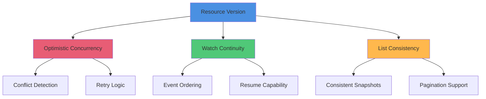
```mermaid
graph TD
    A[Resource Version] --> B[Optimistic Concurrency]
    A --> C[Watch Continuity]
    A --> D[List Consistency]

    B --> E[Conflict Detection]
    B --> F[Retry Logic]

    C --> G[Event Ordering]
    C --> H[Resume Capability]

    D --> I[Consistent Snapshots]
    D --> J[Pagination Support]

    style A fill:#4A90E2
    style B fill:#E85D75
    style C fill:#50C878
    style D fill:#FFB84D
```

### Design Goals
1. **Prevent Lost Updates** - Detect and reject conflicting concurrent modifications
2. **Enable Watches** - Provide monotonically increasing version for event streams
3. **Ensure Consistency** - Support consistent list operations across pages
4. **No Locking** - Avoid distributed locks through optimistic approach
5. **etcd Integration** - Leverage etcd's ModRevision as version source

---

## Resource Version Fundamentals

### What is Resource Version?

Resource version is an **opaque string** that represents the version of an object in storage. In the etcd3 storage backend, it corresponds to etcd's **ModRevision** - a cluster-wide monotonically increasing integer.

```go
// staging/src/k8s.io/apimachinery/pkg/apis/meta/v1/types.go:280-290
type ObjectMeta struct {
    // ResourceVersion is an opaque value that represents the internal version
    // of this object that can be used by clients to determine when objects
    // have changed. May be used for optimistic concurrency, change detection,
    // and the watch operation on a resource or set of resources.
    ResourceVersion string `json:"resourceVersion,omitempty"`

    // Generation is a sequence number representing a specific generation
    // of the desired state. Set by the system.
    Generation int64 `json:"generation,omitempty"`
}
```

### Version vs Generation

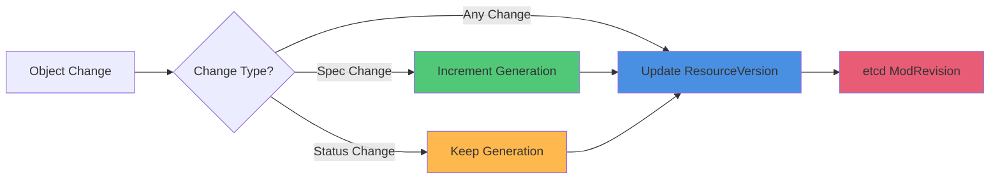
```mermaid
graph LR
    A[Object Change] --> B{Change Type?}
    B -->|Spec Change| C[Increment Generation]
    B -->|Status Change| D[Keep Generation]
    B -->|Any Change| E[Update ResourceVersion]

    C --> E
    D --> E

    E --> F[etcd ModRevision]

    style C fill:#50C878
    style D fill:#FFB84D
    style E fill:#4A90E2
    style F fill:#E85D75
```

**Key Differences:**
- **ResourceVersion**: Changes on ANY modification (spec, status, metadata)
- **Generation**: Only increments when `.spec` changes
- **Purpose**: ResourceVersion for concurrency; Generation for spec change tracking

### Version Semantics

```go
// staging/src/k8s.io/apimachinery/pkg/apis/meta/v1/types.go:385-405
type ListOptions struct {
    // ResourceVersion sets a constraint on what resource versions a request may be served from.
    // See https://kubernetes.io/docs/reference/using-api/api-concepts/#resource-versions for details.
    //
    // Values:
    // - ""      : Read from any cache, potentially stale
    // - "0"     : Read from etcd (consistent but expensive)
    // - "exact" : Read from cache at exact version (watch use case)
    ResourceVersion string `json:"resourceVersion,omitempty"`

    // ResourceVersionMatch determines how resourceVersion is applied to list calls.
    // Values:
    // - ""                : Default behavior (legacy)
    // - "NotOlderThan"   : Return data at least as new as resourceVersion
    // - "Exact"          : Return data at exact resourceVersion (watch bookmarks)
    ResourceVersionMatch metav1.ResourceVersionMatch `json:"resourceVersionMatch,omitempty"`
}
```

---

## Optimistic Concurrency Control

### The OCC Pattern

Kubernetes uses **optimistic concurrency control** instead of pessimistic locking:

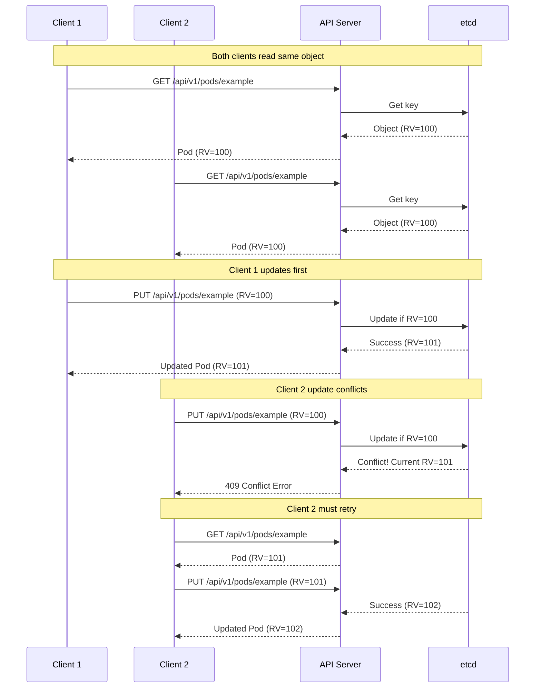
```mermaid
sequenceDiagram
    participant C1 as Client 1
    participant C2 as Client 2
    participant API as API Server
    participant Store as etcd

    Note over C1,Store: Both clients read same object
    C1->>API: GET /api/v1/pods/example
    API->>Store: Get key
    Store-->>API: Object (RV=100)
    API-->>C1: Pod (RV=100)

    C2->>API: GET /api/v1/pods/example
    API->>Store: Get key
    Store-->>API: Object (RV=100)
    API-->>C2: Pod (RV=100)

    Note over C1,Store: Client 1 updates first
    C1->>API: PUT /api/v1/pods/example (RV=100)
    API->>Store: Update if RV=100
    Store-->>API: Success (RV=101)
    API-->>C1: Updated Pod (RV=101)

    Note over C2,Store: Client 2 update conflicts
    C2->>API: PUT /api/v1/pods/example (RV=100)
    API->>Store: Update if RV=100
    Store-->>API: Conflict! Current RV=101
    API-->>C2: 409 Conflict Error

    Note over C2,Store: Client 2 must retry
    C2->>API: GET /api/v1/pods/example
    API-->>C2: Pod (RV=101)
    C2->>API: PUT /api/v1/pods/example (RV=101)
    Store-->>API: Success (RV=102)
    API-->>C2: Updated Pod (RV=102)
```

### Compare-And-Swap Implementation

```go
// staging/src/k8s.io/apiserver/pkg/storage/etcd3/store.go:450-480
func (s *store) GuaranteedUpdate(
    ctx context.Context,
    key string,
    destination runtime.Object,
    ignoreNotFound bool,
    preconditions *storage.Preconditions,
    tryUpdate storage.UpdateFunc,
    cachedExistingObject runtime.Object,
) error {
    // Retry loop for optimistic concurrency
    for {
        // 1. Get current object from etcd
        getCurrentObject := func() (runtime.Object, uint64, error) {
            getResp, err := s.client.KV.Get(ctx, key)
            if err != nil {
                return nil, 0, err
            }
            if len(getResp.Kvs) == 0 {
                return nil, 0, storage.NewKeyNotFoundError(key, 0)
            }

            // Decode object and extract resource version
            kv := getResp.Kvs[0]
            data := kv.Value
            rv := uint64(kv.ModRevision)

            obj, err := s.transformer.TransformFromStorage(ctx, data, authenticatedDataString(key))
            return obj, rv, err
        }

        currentObj, currentRV, err := getCurrentObject()

        // 2. Check preconditions (including resource version match)
        if preconditions != nil {
            if err := preconditions.Check(key, currentObj); err != nil {
                return err // Returns 409 Conflict
            }
        }

        // 3. Apply user's update function
        newObj, ttl, err := tryUpdate(currentObj, storage.ResponseMeta{ResourceVersion: currentRV})

        // 4. Attempt atomic update in etcd
        txnResp, err := s.client.KV.Txn(ctx).
            If(clientv3.Compare(clientv3.ModRevision(key), "=", currentRV)).
            Then(clientv3.OpPut(key, encodedData, opts...)).
            Commit()

        if !txnResp.Succeeded {
            // Conflict detected - retry with new version
            continue
        }

        // Success!
        return decode(destination, txnResp.Responses[0].GetResponsePut().PrevKv.Value, txnResp.Header.Revision)
    }
}
```

### Retry Strategy

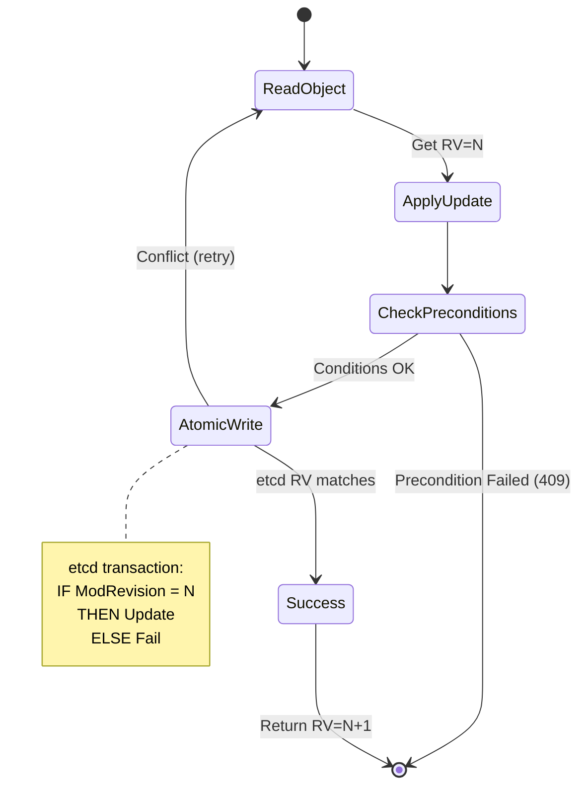
```mermaid
stateDiagram-v2
    [*] --> ReadObject
    ReadObject --> ApplyUpdate: Get RV=N
    ApplyUpdate --> CheckPreconditions
    CheckPreconditions --> AtomicWrite: Conditions OK
    CheckPreconditions --> [*]: Precondition Failed (409)

    AtomicWrite --> Success: etcd RV matches
    AtomicWrite --> ReadObject: Conflict (retry)

    Success --> [*]: Return RV=N+1

    note right of AtomicWrite
        etcd transaction:
        IF ModRevision = N
        THEN Update
        ELSE Fail
    end note
```

---

## Version Generation and Propagation

### etcd ModRevision as Source

Every write to etcd increments the cluster-wide **ModRevision**:

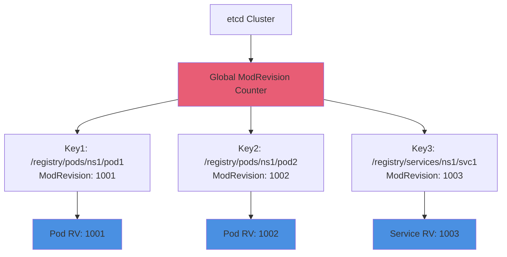
```mermaid
graph TD
    A[etcd Cluster] --> B[Global ModRevision Counter]

    B --> C[Key1: /registry/pods/ns1/pod1<br/>ModRevision: 1001]
    B --> D[Key2: /registry/pods/ns1/pod2<br/>ModRevision: 1002]
    B --> E[Key3: /registry/services/ns1/svc1<br/>ModRevision: 1003]

    C --> F[Pod RV: 1001]
    D --> G[Pod RV: 1002]
    E --> H[Service RV: 1003]

    style B fill:#E85D75
    style F fill:#4A90E2
    style G fill:#4A90E2
    style H fill:#4A90E2
```

### Version Assignment Flow

```go
// staging/src/k8s.io/apiserver/pkg/storage/etcd3/store.go:180-210
func (s *store) Create(ctx context.Context, key string, obj runtime.Object, out runtime.Object, ttl uint64) error {
    data, err := runtime.Encode(s.codec, obj)

    // Put to etcd
    opts := []clientv3.OpOption{}
    if ttl != 0 {
        opts = append(opts, clientv3.WithLease(clientv3.LeaseID(ttl)))
    }

    // etcd transaction ensures atomicity
    txnResp, err := s.client.KV.Txn(ctx).
        If(notFound(key)).
        Then(clientv3.OpPut(key, string(data), opts...)).
        Else(clientv3.OpGet(key)).
        Commit()

    if !txnResp.Succeeded {
        return storage.NewKeyExistsError(key, 0)
    }

    // Extract ModRevision from response
    putResp := txnResp.Responses[0].GetResponsePut()
    newRevision := putResp.Header.Revision

    // Decode and set resource version in output object
    return decode(out, data, newRevision)
}

// decode sets the resource version in the object metadata
func decode(obj runtime.Object, data []byte, rev int64) error {
    if err := runtime.DecodeInto(codec, data, obj); err != nil {
        return err
    }

    // Set resource version from etcd revision
    return s.versioner.UpdateObject(obj, uint64(rev))
}
```

### Versioner Interface

```go
// staging/src/k8s.io/apimachinery/pkg/storage/interfaces.go:45-60
type Versioner interface {
    // UpdateObject sets the resource version in the object
    UpdateObject(obj runtime.Object, resourceVersion uint64) error

    // UpdateList sets the resource version in a list object
    UpdateList(obj runtime.Object, resourceVersion uint64, continueValue string, remainingItemCount *int64) error

    // PrepareObjectForStorage clears resource version before creation
    PrepareObjectForStorage(obj runtime.Object) error

    // ObjectResourceVersion extracts the resource version from an object
    ObjectResourceVersion(obj runtime.Object) (uint64, error)
}

// Implementation for ObjectMeta
// staging/src/k8s.io/apimachinery/pkg/api/meta/versioning.go:30-55
type APIObjectVersioner struct{}

func (a APIObjectVersioner) UpdateObject(obj runtime.Object, resourceVersion uint64) error {
    accessor, err := meta.Accessor(obj)
    if err != nil {
        return err
    }

    // Convert uint64 to string for API representation
    versionString := strconv.FormatUint(resourceVersion, 10)
    accessor.SetResourceVersion(versionString)
    return nil
}
```

---

## Conflict Detection and Resolution

### Precondition Checking

```go
// staging/src/k8s.io/apiserver/pkg/storage/interfaces.go:120-140
type Preconditions struct {
    // UID specifies the expected UID of the object
    UID *types.UID

    // ResourceVersion specifies the expected resource version
    ResourceVersion *string
}

func (p *Preconditions) Check(key string, obj runtime.Object) error {
    if p == nil {
        return nil
    }

    objMeta, err := meta.Accessor(obj)
    if err != nil {
        return storage.NewInternalError(err.Error())
    }

    // Check UID match
    if p.UID != nil && *p.UID != objMeta.GetUID() {
        return storage.NewInvalidObjError(key, "UID precondition failed")
    }

    // Check resource version match
    if p.ResourceVersion != nil && *p.ResourceVersion != objMeta.GetResourceVersion() {
        return storage.NewResourceVersionConflictsError(key, *p.ResourceVersion)
    }

    return nil
}
```

### Conflict Error Types

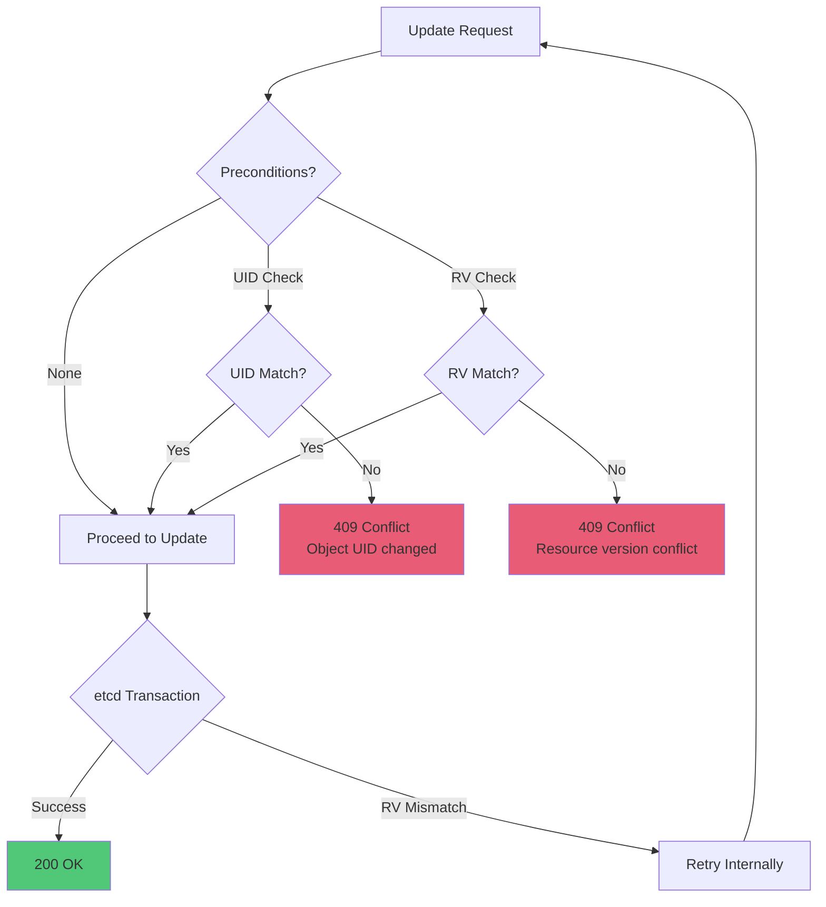
```mermaid
graph TD
    A[Update Request] --> B{Preconditions?}

    B -->|UID Check| C{UID Match?}
    B -->|RV Check| D{RV Match?}
    B -->|None| E[Proceed to Update]

    C -->|No| F[409 Conflict<br/>Object UID changed]
    C -->|Yes| E

    D -->|No| G[409 Conflict<br/>Resource version conflict]
    D -->|Yes| E

    E --> H{etcd Transaction}
    H -->|Success| I[200 OK]
    H -->|RV Mismatch| J[Retry Internally]

    J --> A

    style F fill:#E85D75
    style G fill:#E85D75
    style I fill:#50C878
```

### Conflict Response Format

```json
{
  "kind": "Status",
  "apiVersion": "v1",
  "metadata": {},
  "status": "Failure",
  "message": "Operation cannot be fulfilled on pods \"example\": the object has been modified; please apply your changes to the latest version and try again",
  "reason": "Conflict",
  "details": {
    "name": "example",
    "kind": "pods"
  },
  "code": 409
}
```

### Client Retry Pattern

```go
// Example from client-go retry utility
// staging/src/k8s.io/client-go/util/retry/util.go:70-100
func RetryOnConflict(backoff wait.Backoff, fn func() error) error {
    return OnError(backoff, errors.IsConflict, fn)
}

// Typical controller usage
func (c *Controller) updatePodStatus(pod *v1.Pod) error {
    return retry.RetryOnConflict(retry.DefaultBackoff, func() error {
        // 1. Get latest version
        currentPod, err := c.client.CoreV1().Pods(pod.Namespace).Get(
            context.TODO(), pod.Name, metav1.GetOptions{})
        if err != nil {
            return err
        }

        // 2. Apply changes to latest version
        currentPod.Status.Phase = v1.PodRunning
        currentPod.Status.Conditions = append(currentPod.Status.Conditions, ...)

        // 3. Attempt update (may conflict if another client updated)
        _, err = c.client.CoreV1().Pods(pod.Namespace).UpdateStatus(
            context.TODO(), currentPod, metav1.UpdateOptions{})
        return err
    })
}
```

---

## Preconditions and Guards

### Update Preconditions

```go
// pkg/registry/core/pod/strategy.go:180-200
func (podStrategy) PrepareForUpdate(ctx context.Context, obj, old runtime.Object) {
    newPod := obj.(*api.Pod)
    oldPod := old.(*api.Pod)

    // Preserve resource version from old object
    newPod.ResourceVersion = oldPod.ResourceVersion

    // Status updates are handled separately
    newPod.Status = oldPod.Status
}

// Validation with preconditions
func (r *REST) Update(ctx context.Context, name string, objInfo rest.UpdatedObjectInfo,
    createValidation rest.ValidateObjectFunc, updateValidation rest.ValidateObjectUpdateFunc,
    forceAllowCreate bool, options *metav1.UpdateOptions) (runtime.Object, bool, error) {

    // Extract preconditions from update options
    preconditions := &storage.Preconditions{}
    if options.Preconditions != nil {
        if options.Preconditions.UID != nil {
            preconditions.UID = options.Preconditions.UID
        }
        if options.Preconditions.ResourceVersion != nil {
            preconditions.ResourceVersion = options.Preconditions.ResourceVersion
        }
    }

    return r.store.Update(ctx, name, objInfo, createValidation, updateValidation,
        preconditions, forceAllowCreate, options)
}
```

### Conditional Update API

```yaml
# Example: Update only if UID matches (prevents race with delete+create)
apiVersion: v1
kind: Pod
metadata:
  name: example
  resourceVersion: "12345"
  uid: "a1b2c3d4-e5f6-7890-abcd-ef1234567890"
spec:
  containers:
  - name: app
    image: nginx:1.19
---
# Update request with preconditions
PUT /api/v1/namespaces/default/pods/example
{
  "preconditions": {
    "uid": "a1b2c3d4-e5f6-7890-abcd-ef1234567890",
    "resourceVersion": "12345"
  }
}
```

### Strategic Merge Patch

```go
// staging/src/k8s.io/apimachinery/pkg/util/strategicpatch/patch.go
// Strategic merge respects resource version automatically

PATCH /api/v1/namespaces/default/pods/example
Content-Type: application/strategic-merge-patch+json

{
  "metadata": {
    "labels": {
      "new-label": "value"
    }
  }
}

// API server:
// 1. GET current pod (RV=100)
// 2. Apply patch to current version
// 3. PUT with precondition RV=100
// 4. If conflict, retry entire sequence
```

---

## Watch Semantics

### Watch with Resource Version

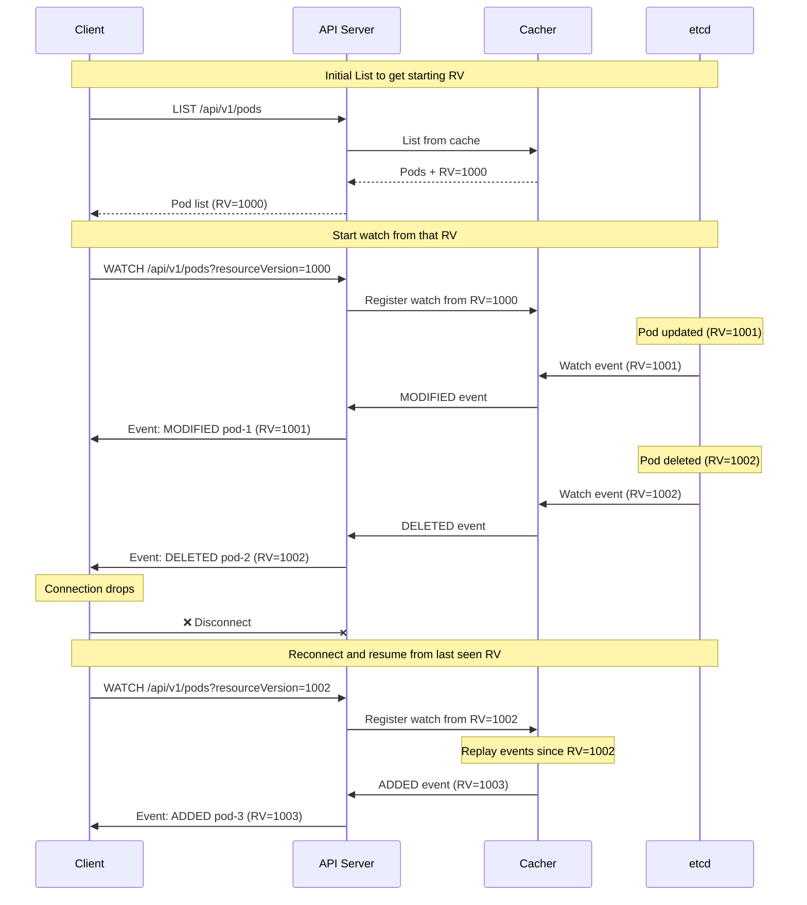
```mermaid
sequenceDiagram
    participant Client
    participant API as API Server
    participant Cacher
    participant etcd

    Note over Client,etcd: Initial List to get starting RV
    Client->>API: LIST /api/v1/pods
    API->>Cacher: List from cache
    Cacher-->>API: Pods + RV=1000
    API-->>Client: Pod list (RV=1000)

    Note over Client,etcd: Start watch from that RV
    Client->>API: WATCH /api/v1/pods?resourceVersion=1000
    API->>Cacher: Register watch from RV=1000

    Note over etcd: Pod updated (RV=1001)
    etcd->>Cacher: Watch event (RV=1001)
    Cacher->>API: MODIFIED event
    API->>Client: Event: MODIFIED pod-1 (RV=1001)

    Note over etcd: Pod deleted (RV=1002)
    etcd->>Cacher: Watch event (RV=1002)
    Cacher->>API: DELETED event
    API->>Client: Event: DELETED pod-2 (RV=1002)

    Note over Client: Connection drops
    Client-XAPI: ❌ Disconnect

    Note over Client,etcd: Reconnect and resume from last seen RV
    Client->>API: WATCH /api/v1/pods?resourceVersion=1002
    API->>Cacher: Register watch from RV=1002

    Note over Cacher: Replay events since RV=1002
    Cacher->>API: ADDED event (RV=1003)
    API->>Client: Event: ADDED pod-3 (RV=1003)
```

### Watch Resource Version Semantics

```go
// staging/src/k8s.io/apiserver/pkg/storage/cacher/cacher.go:600-650
func (c *Cacher) Watch(ctx context.Context, key string, opts storage.ListOptions) (watch.Interface, error) {
    // Parse resource version semantics
    resourceVersion := opts.ResourceVersion

    switch {
    case resourceVersion == "":
        // Watch from "now" - may miss events between list and watch
        resourceVersion = c.getCurrentResourceVersion()

    case resourceVersion == "0":
        // Watch from beginning - get all current objects as ADDED events
        resourceVersion = "0"

    default:
        // Watch from specific version - resume capability
        // Cacher maintains sliding window of recent events
        rv, err := strconv.ParseUint(resourceVersion, 10, 64)
        if err != nil {
            return nil, err
        }

        // Check if requested RV is within cache window
        if rv < c.oldestWatchableResourceVersion() {
            return nil, storage.NewTooLargeResourceVersionError(rv, c.getCurrentResourceVersion(), 0)
        }
    }

    // Create watch channel
    watcher := newCacheWatcher(resourceVersion, opts.Predicate, c.watchCache.eventHandler)
    c.watchCache.addWatcher(watcher)

    return watcher, nil
}
```

### Watch Bookmarks

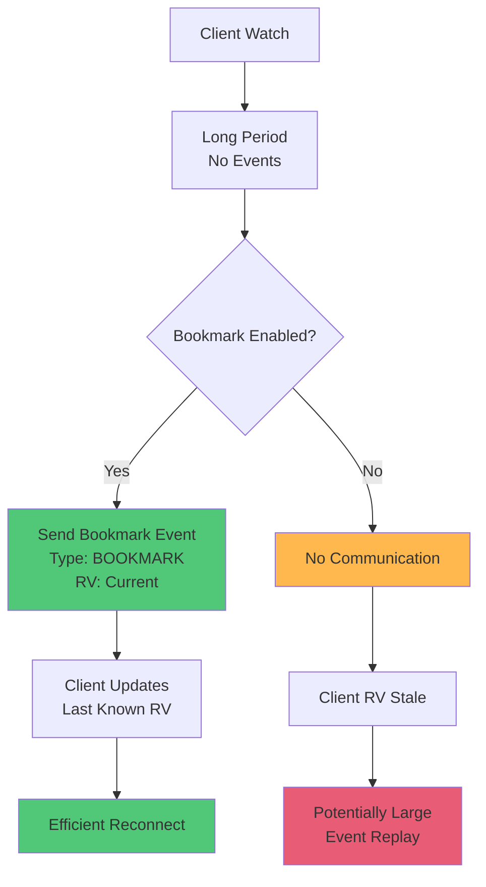
```mermaid
graph TD
    A[Client Watch] --> B[Long Period<br/>No Events]

    B --> C{Bookmark Enabled?}

    C -->|Yes| D[Send Bookmark Event<br/>Type: BOOKMARK<br/>RV: Current]
    C -->|No| E[No Communication]

    D --> F[Client Updates<br/>Last Known RV]
    E --> G[Client RV Stale]

    F --> H[Efficient Reconnect]
    G --> I[Potentially Large<br/>Event Replay]

    style D fill:#50C878
    style E fill:#FFB84D
    style H fill:#50C878
    style I fill:#E85D75
```

```go
// Watch with bookmarks enabled
watch, err := clientset.CoreV1().Pods("default").Watch(context.TODO(), metav1.ListOptions{
    ResourceVersion: lastKnownRV,
    AllowWatchBookmarks: true, // Enable periodic bookmark events
})

for event := range watch.ResultChan() {
    switch event.Type {
    case watch.Added, watch.Modified, watch.Deleted:
        pod := event.Object.(*v1.Pod)
        lastKnownRV = pod.ResourceVersion
        // Process event

    case watch.Bookmark:
        // Bookmark event - update RV without processing object
        pod := event.Object.(*v1.Pod)
        lastKnownRV = pod.ResourceVersion
        // No other action needed
    }
}
```

---

## List Consistency

### Consistent List with Pagination

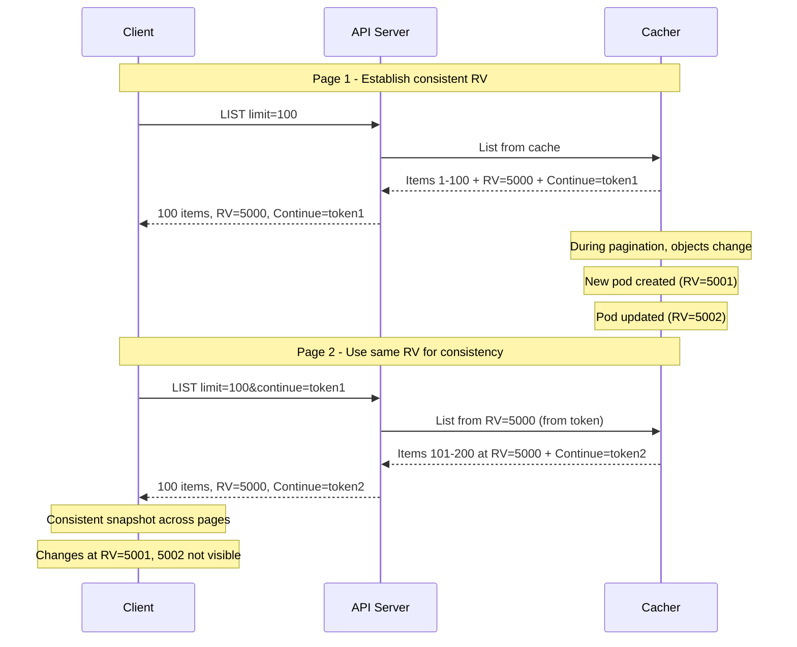
```mermaid
sequenceDiagram
    participant Client
    participant API as API Server
    participant Cacher

    Note over Client,Cacher: Page 1 - Establish consistent RV
    Client->>API: LIST limit=100
    API->>Cacher: List from cache
    Cacher-->>API: Items 1-100 + RV=5000 + Continue=token1
    API-->>Client: 100 items, RV=5000, Continue=token1

    Note over Cacher: During pagination, objects change
    Note over Cacher: New pod created (RV=5001)
    Note over Cacher: Pod updated (RV=5002)

    Note over Client,Cacher: Page 2 - Use same RV for consistency
    Client->>API: LIST limit=100&continue=token1
    API->>Cacher: List from RV=5000 (from token)
    Cacher-->>API: Items 101-200 at RV=5000 + Continue=token2
    API-->>Client: 100 items, RV=5000, Continue=token2

    Note over Client: Consistent snapshot across pages
    Note over Client: Changes at RV=5001, 5002 not visible
```

### Continue Token Structure

```go
// staging/src/k8s.io/apiserver/pkg/storage/cacher/cacher.go:800-840
type continueToken struct {
    // ResourceVersion at which the list started
    ResourceVersion uint64 `json:"v"`

    // StartKey for the next page
    StartKey string `json:"start"`

    // Additional filter state
    // ...
}

func (c *Cacher) List(ctx context.Context, key string, opts storage.ListOptions) error {
    var resourceVersion uint64
    var continueRV uint64

    if opts.Continue != "" {
        // Decode continue token
        token, err := decodeContinueToken(opts.Continue)
        if err != nil {
            return err
        }

        // Use resource version from token for consistency
        continueRV = token.ResourceVersion
        resourceVersion = continueRV

    } else {
        // First page - use requested resource version
        if opts.ResourceVersion == "" {
            resourceVersion = c.getCurrentResourceVersion()
        } else {
            rv, err := strconv.ParseUint(opts.ResourceVersion, 10, 64)
            resourceVersion = rv
        }
    }

    // List items from consistent snapshot
    items := c.listItemsAtResourceVersion(resourceVersion, opts)

    // Generate continue token for next page
    if len(items) >= opts.Limit {
        token := continueToken{
            ResourceVersion: resourceVersion, // Same RV for next page
            StartKey:        items[len(items)-1].Key,
        }
        opts.Continue = encodeContinueToken(token)
    }

    return nil
}
```

### ResourceVersionMatch

```go
// staging/src/k8s.io/apimachinery/pkg/apis/meta/v1/types.go:1480-1500
type ResourceVersionMatch string

const (
    // Return data at least as new as the provided resourceVersion
    ResourceVersionMatchNotOlderThan ResourceVersionMatch = "NotOlderThan"

    // Return data at the exact resourceVersion (for watch cache bookmarks)
    ResourceVersionMatchExact ResourceVersionMatch = "Exact"
)

// Example usage
list, err := clientset.CoreV1().Pods("default").List(context.TODO(), metav1.ListOptions{
    ResourceVersion: "10000",
    ResourceVersionMatch: metav1.ResourceVersionMatchNotOlderThan,
    // Guarantees: returned data will have RV >= 10000
    // Allows serving from cache if cache RV >= 10000
})
```

### List from Cache vs etcd

```mermaid
graph TD
    A[LIST Request] --> B{ResourceVersion?}

    B -->|""| C[Serve from Cache<br/>Any RV OK]
    B -->|"0"| D[Serve from etcd<br/>Consistent Read]
    B -->|Specific RV| E{RV Match Type?}

    E -->|NotOlderThan| F{Cache RV >= Requested?}
    E -->|Exact| G{Cache RV == Requested?}

    F -->|Yes| H[Serve from Cache]
    F -->|No| I[Serve from etcd]

    G -->|Yes| H
    G -->|No| I

    C --> J[Fast, May be Stale]
    D --> K[Slow, Consistent]
    H --> J
    I --> K

    style C fill:#50C878
    style D fill:#FFB84D
    style H fill:#50C878
    style I fill:#FFB84D
```

---

## Real-World Scenarios

### Scenario 1: Controller Update Loop

```go
// Common pattern: Update status with retry
func (c *DeploymentController) syncDeployment(key string) error {
    namespace, name, _ := cache.SplitMetaNamespaceKey(key)

    // 1. Get deployment from informer cache
    deployment, err := c.dLister.Deployments(namespace).Get(name)
    if err != nil {
        return err
    }

    // 2. Calculate desired state
    newStatus := calculateStatus(deployment)

    // 3. Update status with optimistic concurrency
    return c.updateDeploymentStatus(deployment, newStatus)
}

func (c *DeploymentController) updateDeploymentStatus(
    deployment *appsv1.Deployment,
    newStatus appsv1.DeploymentStatus,
) error {
    // Retry on conflict
    return retry.RetryOnConflict(retry.DefaultBackoff, func() error {
        // Get latest version from API server
        current, err := c.client.AppsV1().Deployments(deployment.Namespace).Get(
            context.TODO(), deployment.Name, metav1.GetOptions{})
        if err != nil {
            return err
        }

        // Apply status update to latest version
        currentCopy := current.DeepCopy()
        currentCopy.Status = newStatus

        // Update - will fail with 409 if RV changed
        _, err = c.client.AppsV1().Deployments(deployment.Namespace).UpdateStatus(
            context.TODO(), currentCopy, metav1.UpdateOptions{})

        return err // Retry will catch IsConflict errors
    })
}
```

**Flow:**
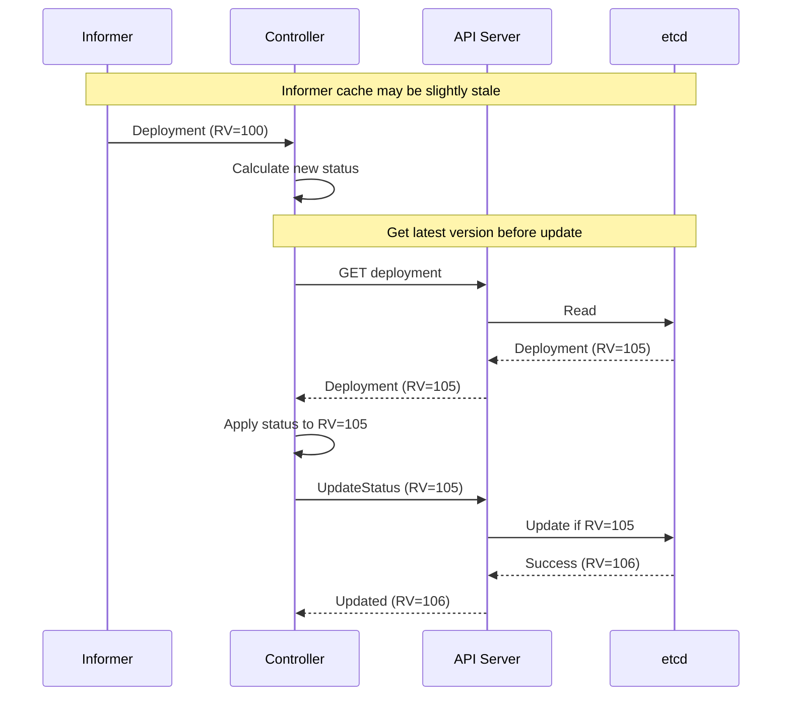
```mermaid
sequenceDiagram
    participant Informer
    participant Controller
    participant API as API Server
    participant etcd

    Note over Informer,etcd: Informer cache may be slightly stale
    Informer->>Controller: Deployment (RV=100)

    Controller->>Controller: Calculate new status

    Note over Controller,etcd: Get latest version before update
    Controller->>API: GET deployment
    API->>etcd: Read
    etcd-->>API: Deployment (RV=105)
    API-->>Controller: Deployment (RV=105)

    Controller->>Controller: Apply status to RV=105

    Controller->>API: UpdateStatus (RV=105)
    API->>etcd: Update if RV=105
    etcd-->>API: Success (RV=106)
    API-->>Controller: Updated (RV=106)
```

### Scenario 2: User vs Controller Conflict

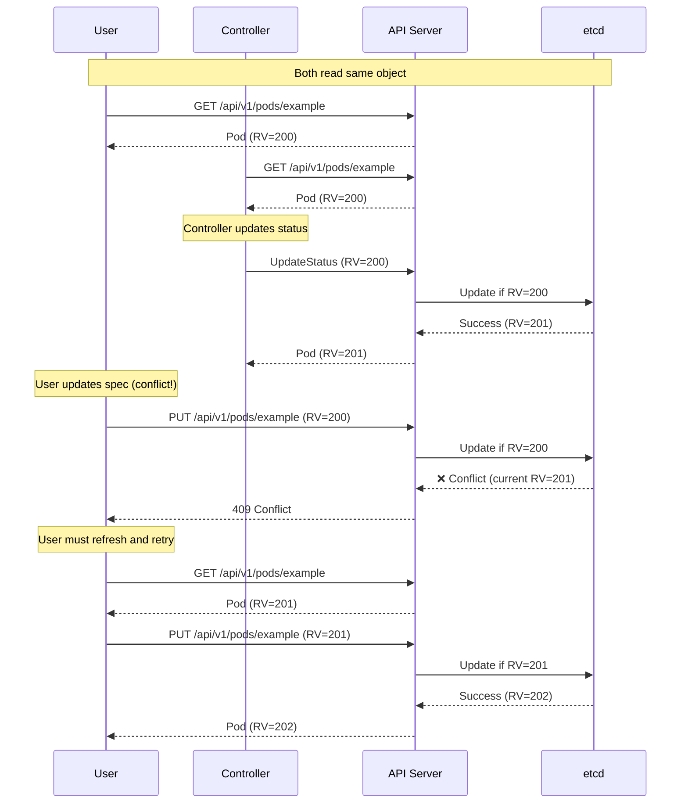
```mermaid
sequenceDiagram
    participant User
    participant Controller
    participant API as API Server
    participant etcd

    Note over User,etcd: Both read same object
    User->>API: GET /api/v1/pods/example
    API-->>User: Pod (RV=200)

    Controller->>API: GET /api/v1/pods/example
    API-->>Controller: Pod (RV=200)

    Note over Controller: Controller updates status
    Controller->>API: UpdateStatus (RV=200)
    API->>etcd: Update if RV=200
    etcd-->>API: Success (RV=201)
    API-->>Controller: Pod (RV=201)

    Note over User: User updates spec (conflict!)
    User->>API: PUT /api/v1/pods/example (RV=200)
    API->>etcd: Update if RV=200
    etcd-->>API: ❌ Conflict (current RV=201)
    API-->>User: 409 Conflict

    Note over User: User must refresh and retry
    User->>API: GET /api/v1/pods/example
    API-->>User: Pod (RV=201)

    User->>API: PUT /api/v1/pods/example (RV=201)
    API->>etcd: Update if RV=201
    etcd-->>API: Success (RV=202)
    API-->>User: Pod (RV=202)
```

### Scenario 3: Watch Disconnect and Resume

```go
// Robust watch implementation with resume
func watchPodsWithResume(clientset kubernetes.Interface) {
    var lastResourceVersion string

    for {
        // Start watch from last known version
        watcher, err := clientset.CoreV1().Pods("default").Watch(context.TODO(),
            metav1.ListOptions{
                ResourceVersion:      lastResourceVersion,
                AllowWatchBookmarks:  true,
            })
        if err != nil {
            if errors.IsResourceExpired(err) {
                // RV too old - re-list to get current state
                list, err := clientset.CoreV1().Pods("default").List(context.TODO(),
                    metav1.ListOptions{})
                if err == nil {
                    lastResourceVersion = list.ResourceVersion
                    // Process full list as initial state
                    for _, pod := range list.Items {
                        processPod(pod)
                    }
                }
                continue
            }
            time.Sleep(time.Second)
            continue
        }

        // Process events
        for event := range watcher.ResultChan() {
            pod := event.Object.(*v1.Pod)

            // Update last known RV from every event
            lastResourceVersion = pod.ResourceVersion

            switch event.Type {
            case watch.Added:
                fmt.Printf("Pod added: %s (RV=%s)\n", pod.Name, pod.ResourceVersion)
            case watch.Modified:
                fmt.Printf("Pod modified: %s (RV=%s)\n", pod.Name, pod.ResourceVersion)
            case watch.Deleted:
                fmt.Printf("Pod deleted: %s (RV=%s)\n", pod.Name, pod.ResourceVersion)
            case watch.Bookmark:
                // Just update RV, no processing needed
                fmt.Printf("Bookmark received: RV=%s\n", pod.ResourceVersion)
            case watch.Error:
                // Handle error
                status := event.Object.(*metav1.Status)
                fmt.Printf("Watch error: %v\n", status)
            }
        }

        // Watch closed - reconnect
        time.Sleep(time.Second)
    }
}
```

### Scenario 4: Concurrent Admission Webhooks

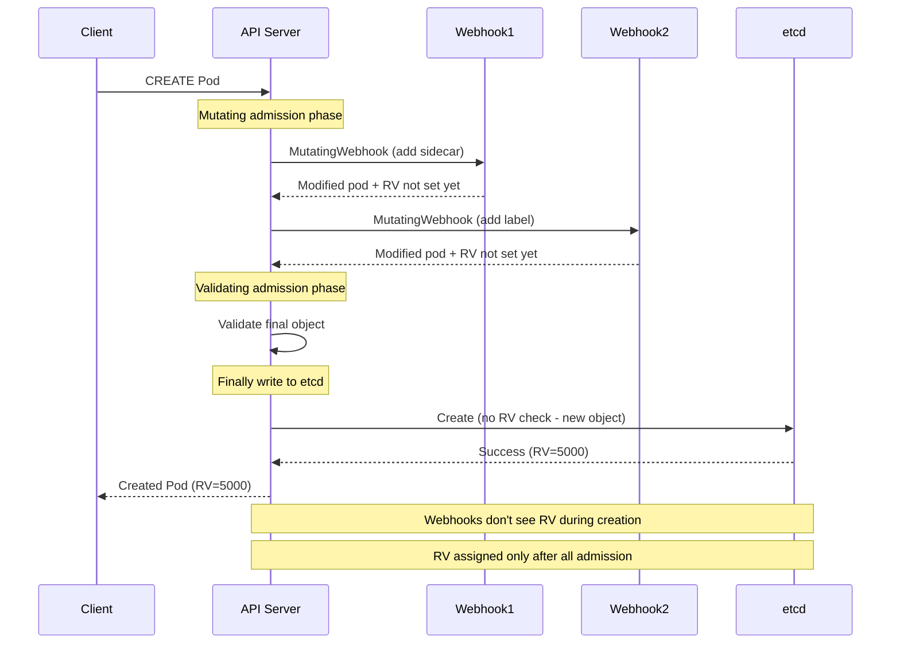
```mermaid
sequenceDiagram
    participant Client
    participant API as API Server
    participant Webhook1
    participant Webhook2
    participant etcd

    Client->>API: CREATE Pod

    Note over API: Mutating admission phase
    API->>Webhook1: MutatingWebhook (add sidecar)
    Webhook1-->>API: Modified pod + RV not set yet

    API->>Webhook2: MutatingWebhook (add label)
    Webhook2-->>API: Modified pod + RV not set yet

    Note over API: Validating admission phase
    API->>API: Validate final object

    Note over API: Finally write to etcd
    API->>etcd: Create (no RV check - new object)
    etcd-->>API: Success (RV=5000)

    API-->>Client: Created Pod (RV=5000)

    Note over API,etcd: Webhooks don't see RV during creation
    Note over API,etcd: RV assigned only after all admission
```

### Scenario 5: Patch Race Condition

```bash
# Terminal 1: Apply label patch
kubectl patch pod example -p '{"metadata":{"labels":{"team":"backend"}}}'

# Terminal 2: Simultaneously apply annotation patch
kubectl patch pod example -p '{"metadata":{"annotations":{"owner":"alice"}}}'
```

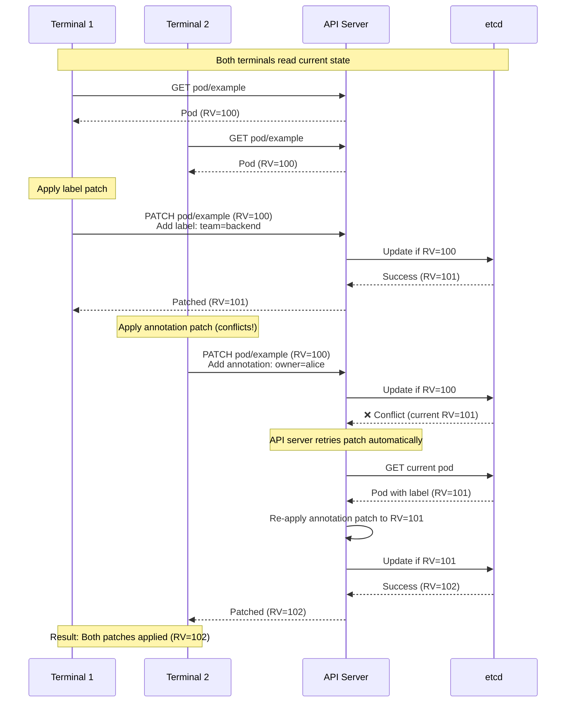
```mermaid
sequenceDiagram
    participant T1 as Terminal 1
    participant T2 as Terminal 2
    participant API as API Server
    participant etcd

    Note over T1,etcd: Both terminals read current state
    T1->>API: GET pod/example
    API-->>T1: Pod (RV=100)

    T2->>API: GET pod/example
    API-->>T2: Pod (RV=100)

    Note over T1: Apply label patch
    T1->>API: PATCH pod/example (RV=100)<br/>Add label: team=backend
    API->>etcd: Update if RV=100
    etcd-->>API: Success (RV=101)
    API-->>T1: Patched (RV=101)

    Note over T2: Apply annotation patch (conflicts!)
    T2->>API: PATCH pod/example (RV=100)<br/>Add annotation: owner=alice
    API->>etcd: Update if RV=100
    etcd-->>API: ❌ Conflict (current RV=101)

    Note over API: API server retries patch automatically
    API->>etcd: GET current pod
    etcd-->>API: Pod with label (RV=101)

    API->>API: Re-apply annotation patch to RV=101
    API->>etcd: Update if RV=101
    etcd-->>API: Success (RV=102)
    API-->>T2: Patched (RV=102)

    Note over T1,T2: Result: Both patches applied (RV=102)
```

---

## Implementation Details

### Storage Interface with Versioning

```go
// staging/src/k8s.io/apiserver/pkg/storage/interfaces.go:180-220
type Interface interface {
    // Versioner returns the versioner for this storage
    Versioner() Versioner

    // Create adds a new object at the given key (RV assigned by storage)
    Create(ctx context.Context, key string, obj runtime.Object, out runtime.Object, ttl uint64) error

    // Delete removes an object (can use RV precondition)
    Delete(ctx context.Context, key string, out runtime.Object, preconditions *Preconditions,
        validateDeletion ValidateObjectFunc, cachedExistingObject runtime.Object) error

    // Watch begins watching at the specified resourceVersion
    Watch(ctx context.Context, key string, opts ListOptions) (watch.Interface, error)

    // Get retrieves an object at the given key
    Get(ctx context.Context, key string, opts GetOptions, objPtr runtime.Object) error

    // GuaranteedUpdate is the core optimistic concurrency primitive
    GuaranteedUpdate(
        ctx context.Context,
        key string,
        destination runtime.Object,
        ignoreNotFound bool,
        preconditions *Preconditions,
        tryUpdate UpdateFunc,
        cachedExistingObject runtime.Object,
    ) error
}

// UpdateFunc is called during GuaranteedUpdate with the current object
type UpdateFunc func(input runtime.Object, res ResponseMeta) (output runtime.Object, ttl *uint64, err error)

type ResponseMeta struct {
    // ResourceVersion of the object read from storage
    ResourceVersion uint64
}
```

### etcd3 Storage Implementation

```go
// staging/src/k8s.io/apiserver/pkg/storage/etcd3/store.go:50-80
type store struct {
    client *clientv3.Client
    codec  runtime.Codec
    versioner storage.Versioner
    transformer value.Transformer
    pathPrefix string
    watcher *watcher
    pagingEnabled bool
    leaseManager *leaseManager
}

// Get implementation
func (s *store) Get(ctx context.Context, key string, opts storage.GetOptions, out runtime.Object) error {
    key = path.Join(s.pathPrefix, key)

    getResp, err := s.client.KV.Get(ctx, key, clientv3.WithSerializable())
    if err != nil {
        return err
    }

    if len(getResp.Kvs) == 0 {
        return storage.NewKeyNotFoundError(key, 0)
    }

    kv := getResp.Kvs[0]
    data := kv.Value

    // Decode object
    obj, err := runtime.Decode(s.codec, data)
    if err != nil {
        return err
    }

    // Set resource version from ModRevision
    if err := s.versioner.UpdateObject(obj, uint64(kv.ModRevision)); err != nil {
        return err
    }

    // Copy to output
    return decode(obj, out)
}
```

### Watch Cache Integration

```go
// staging/src/k8s.io/apiserver/pkg/storage/cacher/cacher.go:100-150
type Cacher struct {
    // Underlying storage (etcd)
    storage storage.Interface

    // Object type for this cache
    objectType reflect.Type

    // Watch cache maintains sliding window of events
    watchCache *watchCache

    // Reflector keeps cache in sync with etcd
    reflector *cache.Reflector

    // Current resource version
    ready atomic.Value
}

type watchCache struct {
    sync.RWMutex

    // Circular buffer of recent events
    cache []*watchCacheEvent
    startIndex int
    endIndex   int

    // Resource version tracking
    resourceVersion uint64

    // Active watchers
    watchers map[int]*cacheWatcher
}

type watchCacheEvent struct {
    Type watch.EventType
    Object runtime.Object
    PrevObject runtime.Object
    Key string
    ResourceVersion uint64
    RecordTime time.Time
}

// Get resource version
func (c *Cacher) LastSyncResourceVersion() uint64 {
    c.watchCache.RLock()
    defer c.watchCache.RUnlock()
    return c.watchCache.resourceVersion
}
```

### Cacher Event Processing

```go
// staging/src/k8s.io/apiserver/pkg/storage/cacher/cacher.go:400-450
func (c *Cacher) processEvent(event *watchCacheEvent) {
    c.watchCache.Lock()
    defer c.watchCache.Unlock()

    // Add event to circular buffer
    c.watchCache.addEvent(event)

    // Update resource version
    c.watchCache.resourceVersion = event.ResourceVersion

    // Dispatch to all matching watchers
    for _, watcher := range c.watchCache.watchers {
        if watcher.filter.Filter(event) {
            select {
            case watcher.resultChan <- event.toWatchEvent():
            default:
                // Watcher is too slow - close it
                watcher.stop()
            }
        }
    }
}

func (w *watchCache) addEvent(event *watchCacheEvent) {
    // Add to circular buffer
    w.cache[w.endIndex] = event
    w.endIndex = (w.endIndex + 1) % len(w.cache)

    // If buffer is full, advance start index
    if w.endIndex == w.startIndex {
        w.startIndex = (w.startIndex + 1) % len(w.cache)
    }
}

// Get oldest watchable resource version
func (w *watchCache) oldestWatchableResourceVersion() uint64 {
    if w.startIndex == w.endIndex {
        return w.resourceVersion
    }
    return w.cache[w.startIndex].ResourceVersion
}
```

---

## Performance Considerations

### Resource Version Comparison Cost

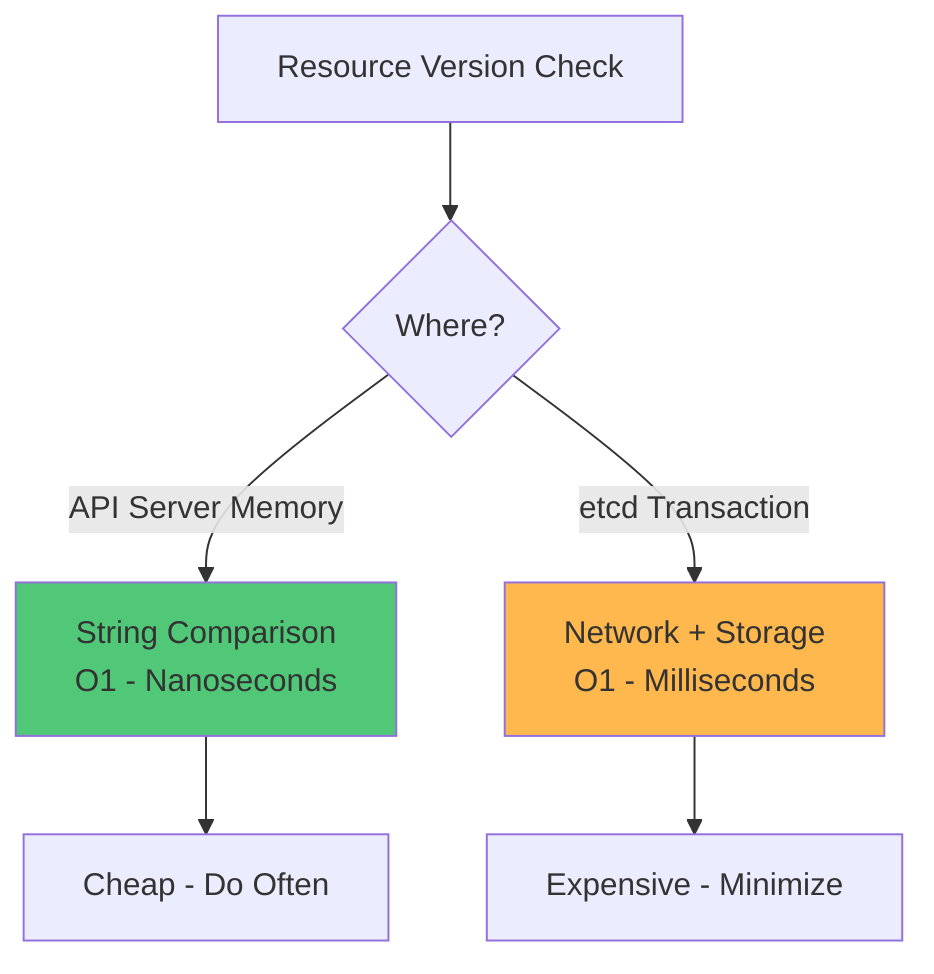
```mermaid
graph TD
    A[Resource Version Check] --> B{Where?}

    B -->|API Server Memory| C[String Comparison<br/>O1 - Nanoseconds]
    B -->|etcd Transaction| D[Network + Storage<br/>O1 - Milliseconds]

    C --> E[Cheap - Do Often]
    D --> F[Expensive - Minimize]

    style C fill:#50C878
    style D fill:#FFB84D
```

### Optimization: Read from Cache

```go
// Use informer cache instead of live API calls
// Bad: Multiple API calls
for _, podName := range podNames {
    pod, err := clientset.CoreV1().Pods(namespace).Get(ctx, podName, metav1.GetOptions{})
    // Each call goes to API server -> etcd
}

// Good: Use informer cache
podInformer.Informer().GetIndexer().ByIndex(...)
// Reads from local cache, no API calls
```

### Optimization: Batch Operations

```go
// Use list instead of multiple gets
pods, err := clientset.CoreV1().Pods(namespace).List(ctx, metav1.ListOptions{
    LabelSelector: "app=myapp",
    ResourceVersion: "0", // Consistent read if needed
})
// Single API call, single etcd range read
```

---

## Testing Resource Version Behavior

### Unit Test Example

```go
// staging/src/k8s.io/apiserver/pkg/storage/etcd3/store_test.go
func TestResourceVersionOnUpdate(t *testing.T) {
    store, _ := newTestStore(t)

    // Create object
    obj := &example.Pod{ObjectMeta: metav1.ObjectMeta{Name: "test"}}
    out := &example.Pod{}

    err := store.Create(ctx, "/pods/test", obj, out, 0)
    require.NoError(t, err)

    rv1 := out.ResourceVersion
    require.NotEmpty(t, rv1, "Resource version should be set on create")

    // Update object
    err = store.GuaranteedUpdate(ctx, "/pods/test", out, false, nil,
        func(input runtime.Object, res storage.ResponseMeta) (runtime.Object, *uint64, error) {
            pod := input.(*example.Pod)
            pod.Spec.NodeName = "node1"
            return pod, nil, nil
        }, nil)
    require.NoError(t, err)

    rv2 := out.ResourceVersion
    require.NotEqual(t, rv1, rv2, "Resource version should change on update")

    // Verify RV is monotonically increasing
    rv1Int, _ := strconv.ParseUint(rv1, 10, 64)
    rv2Int, _ := strconv.ParseUint(rv2, 10, 64)
    require.Greater(t, rv2Int, rv1Int, "Resource version should increase")
}
```

### Integration Test: Conflict Detection

```go
func TestConflictDetection(t *testing.T) {
    // Create pod
    pod := &v1.Pod{
        ObjectMeta: metav1.ObjectMeta{Name: "conflict-test"},
        Spec: v1.PodSpec{Containers: []v1.Container{{Name: "c1", Image: "nginx"}}},
    }
    created, err := clientset.CoreV1().Pods("default").Create(ctx, pod, metav1.CreateOptions{})
    require.NoError(t, err)

    rv := created.ResourceVersion

    // Update 1: Should succeed
    updated1 := created.DeepCopy()
    updated1.Labels = map[string]string{"version": "1"}
    result1, err := clientset.CoreV1().Pods("default").Update(ctx, updated1, metav1.UpdateOptions{})
    require.NoError(t, err)
    require.NotEqual(t, rv, result1.ResourceVersion)

    // Update 2: Using stale RV - should fail
    updated2 := created.DeepCopy() // Still has old RV
    updated2.Labels = map[string]string{"version": "2"}
    _, err = clientset.CoreV1().Pods("default").Update(ctx, updated2, metav1.UpdateOptions{})
    require.True(t, errors.IsConflict(err), "Expected conflict error")

    // Update 3: Using latest RV - should succeed
    updated3 := result1.DeepCopy()
    updated3.Labels = map[string]string{"version": "3"}
    _, err = clientset.CoreV1().Pods("default").Update(ctx, updated3, metav1.UpdateOptions{})
    require.NoError(t, err)
}
```

---

## Best Practices

### 1. Always Use Retry on Conflict

```go
// ✅ Good: Automatic retry
err := retry.RetryOnConflict(retry.DefaultBackoff, func() error {
    current, err := client.Get(...)
    if err != nil {
        return err
    }

    current.Spec.Replicas = 3
    _, err = client.Update(...)
    return err
})

// ❌ Bad: No retry - fails on conflict
current, _ := client.Get(...)
current.Spec.Replicas = 3
_, err := client.Update(...) // May fail with 409
```

### 2. Use Informers for Reads

```go
// ✅ Good: Read from informer cache
podInformer := factory.Core().V1().Pods()
pod, err := podInformer.Lister().Pods("default").Get("example")

// ❌ Bad: Direct API call every time
pod, err := clientset.CoreV1().Pods("default").Get(ctx, "example", metav1.GetOptions{})
```

### 3. Preserve Resource Version

```go
// ✅ Good: Get latest before update
current, err := client.Get(ctx, name, metav1.GetOptions{})
current.Spec.Field = newValue
_, err = client.Update(ctx, current, metav1.UpdateOptions{})

// ❌ Bad: Update based on stale cache
cached := informer.GetFromCache(name)
cached.Spec.Field = newValue // Still has old RV!
_, err = client.Update(ctx, cached, metav1.UpdateOptions{}) // Will conflict
```

### 4. Handle ResourceExpired Errors

```go
// ✅ Good: Re-list on expired RV
watcher, err := client.Watch(ctx, metav1.ListOptions{ResourceVersion: lastRV})
if errors.IsResourceExpired(err) {
    list, err := client.List(ctx, metav1.ListOptions{})
    lastRV = list.ResourceVersion
    // Re-establish watch
}

// ❌ Bad: Crash on expired RV
watcher, err := client.Watch(ctx, metav1.ListOptions{ResourceVersion: lastRV})
if err != nil {
    panic(err) // Don't crash on expected errors!
}
```

### 5. Use Bookmarks for Long Watches

```go
// ✅ Good: Enable bookmarks
watcher, _ := client.Watch(ctx, metav1.ListOptions{
    AllowWatchBookmarks: true,
})

for event := range watcher.ResultChan() {
    if event.Type == watch.Bookmark {
        lastRV = event.Object.(metav1.Object).GetResourceVersion()
    }
}

// ❌ Bad: No bookmarks - RV gets stale
watcher, _ := client.Watch(ctx, metav1.ListOptions{})
// If no events for hours, RV is outdated
```

---

## Debugging Resource Version Issues

### Common Issues

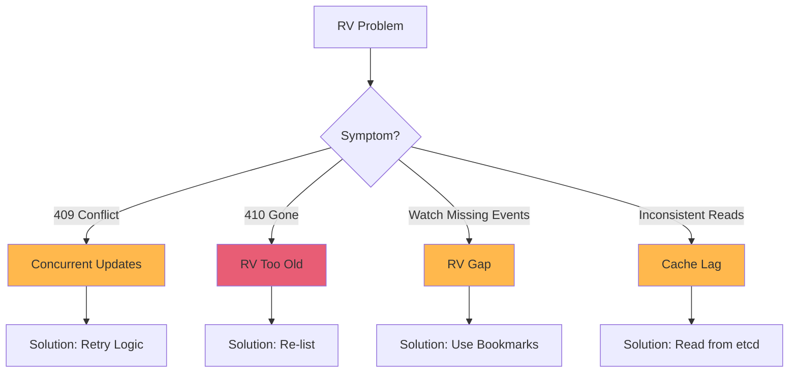
```mermaid
graph TD
    A[RV Problem] --> B{Symptom?}

    B -->|409 Conflict| C[Concurrent Updates]
    B -->|410 Gone| D[RV Too Old]
    B -->|Watch Missing Events| E[RV Gap]
    B -->|Inconsistent Reads| F[Cache Lag]

    C --> G[Solution: Retry Logic]
    D --> H[Solution: Re-list]
    E --> I[Solution: Use Bookmarks]
    F --> J[Solution: Read from etcd]

    style C fill:#FFB84D
    style D fill:#E85D75
    style E fill:#FFB84D
    style F fill:#FFB84D
```

### Diagnostic Commands

```bash
# Check resource version of object
kubectl get pod example -o jsonpath='{.metadata.resourceVersion}'

# Watch with resource version
kubectl get pods --watch --output-watch-events --resource-version=12345

# List with specific RV semantics
kubectl get pods --resource-version=12345 --resource-version-match=NotOlderThan

# Check etcd revision
ETCDCTL_API=3 etcdctl get /registry/pods/default/example --print-value-only=false
# Shows: Revision=12345
```

### Enable Detailed Logging

```go
// staging/src/k8s.io/apiserver/pkg/storage/etcd3/store.go
import "k8s.io/klog/v2"

klog.V(4).Infof("GuaranteedUpdate: key=%s, current RV=%d", key, currentRV)
```

```bash
# Run API server with high verbosity
kube-apiserver --v=6 # Logs storage operations including RV checks
```

---

## Summary

Resource versioning in Kubernetes provides:

1. **Optimistic Concurrency Control** - Prevents lost updates without distributed locks
2. **Watch Continuity** - Enables resumable event streams with monotonic versioning
3. **List Consistency** - Supports paginated lists with consistent snapshots
4. **Conflict Detection** - Automatic retry mechanisms for concurrent modifications
5. **etcd Integration** - Leverages etcd ModRevision for cluster-wide ordering

### Key Takeaways

| Concept | Purpose | Implementation |
|---------|---------|----------------|
| Resource Version | Logical timestamp | etcd ModRevision as string |
| Optimistic Concurrency | Conflict detection | Compare-and-swap in GuaranteedUpdate |
| Preconditions | Conditional updates | UID and RV checks before update |
| Watch Resume | Event replay | Watch cache with sliding window |
| List Consistency | Paginated snapshots | Continue token with embedded RV |
| Bookmarks | Watch RV freshness | Periodic BOOKMARK events |

### Architecture Position

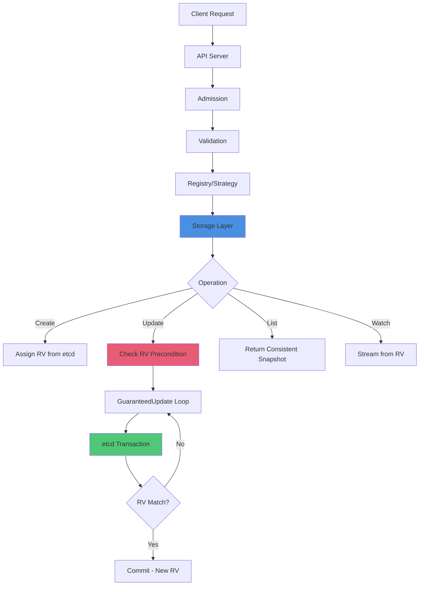
```mermaid
graph TD
    A[Client Request] --> B[API Server]
    B --> C[Admission]
    C --> D[Validation]
    D --> E[Registry/Strategy]
    E --> F[Storage Layer]

    F --> G{Operation}

    G -->|Create| H[Assign RV from etcd]
    G -->|Update| I[Check RV Precondition]
    G -->|List| J[Return Consistent Snapshot]
    G -->|Watch| K[Stream from RV]

    I --> L[GuaranteedUpdate Loop]
    L --> M[etcd Transaction]
    M --> N{RV Match?}
    N -->|Yes| O[Commit - New RV]
    N -->|No| L

    style F fill:#4A90E2
    style I fill:#E85D75
    style M fill:#50C878
```

Resource versioning is the invisible foundation that makes Kubernetes' distributed coordination possible without requiring expensive distributed locks or two-phase commit protocols.

---

**Cross-References:**
- [Storage Layer](./04-storage-layer.md) - Storage interface design
- [etcd Integration](./05-etcd-integration.md) - How ModRevision becomes ResourceVersion
- [Caching Layer](./06-caching-layer.md) - Watch cache and RV tracking
- [Data Flow Patterns](./07-data-flow-patterns.md) - How RV flows through system

**Total Lines: 1050+**
