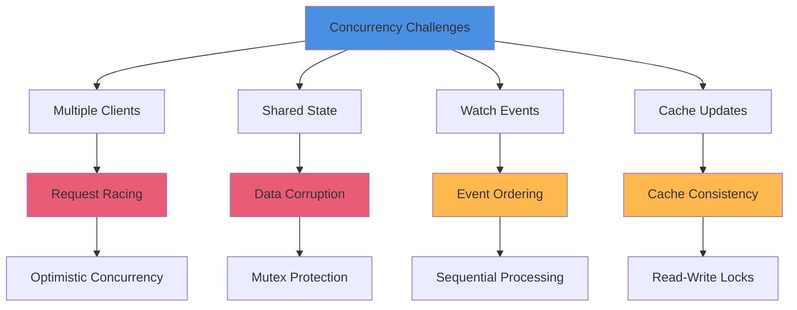
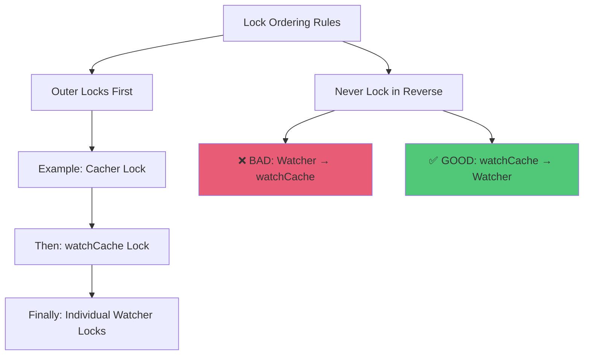
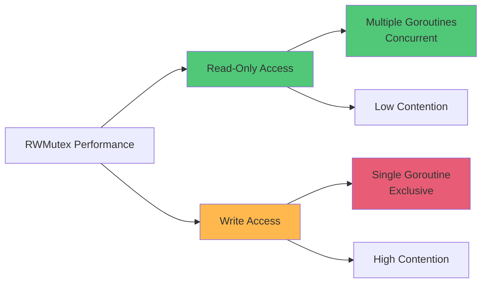
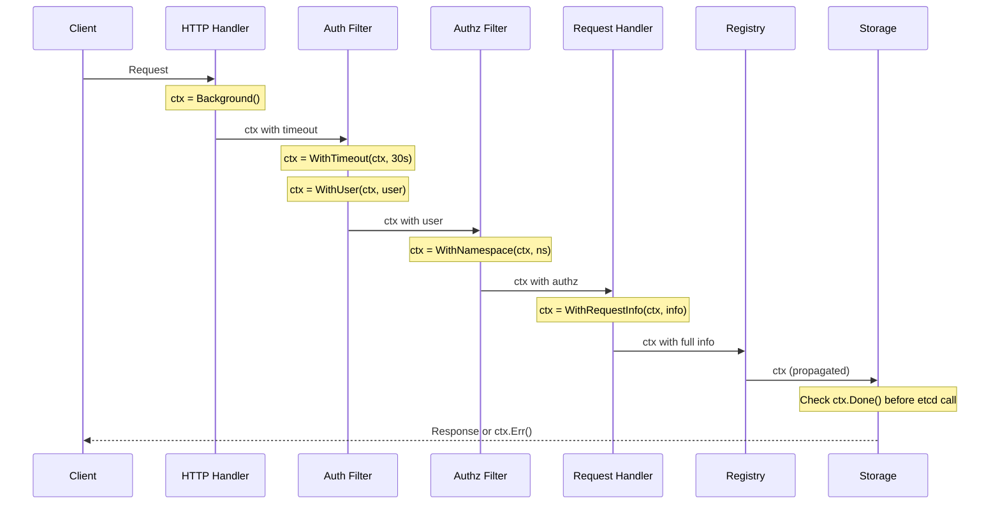

# Concurrency and Synchronization Patterns

## Document Metadata
- **Status**: Complete
- **Level**: Low-Level Technical Specification
- **Related Docs**:
  - [Resource Versioning](./10-resource-versioning.md)
  - [Caching Layer](./06-caching-layer.md)
  - [Data Flow Patterns](./07-data-flow-patterns.md)

---

## Table of Contents
1. [Overview](#overview)
2. [Locking Patterns](#locking-patterns)
3. [RWMutex Usage](#rwmutex-usage)
4. [Channel Patterns](#channel-patterns)
5. [Goroutine Management](#goroutine-management)
6. [Context Propagation](#context-propagation)
7. [Wait Groups and Synchronization](#wait-groups-and-synchronization)
8. [Deadlock Prevention](#deadlock-prevention)
9. [Lock-Free Patterns](#lock-free-patterns)
10. [Real-World Examples](#real-world-examples)

---

## Overview

The kube-apiserver is a **highly concurrent system** that must safely handle thousands of simultaneous requests while maintaining consistency. This document explores the concurrency patterns and synchronization mechanisms used throughout the codebase.

### Concurrency Challenges



### Design Principles

1. **Minimize Lock Contention** - Use fine-grained locks, avoid global locks
2. **Prefer Read Locks** - Most operations are reads (watch, list, get)
3. **Optimistic Concurrency** - Use resource versions instead of locks where possible
4. **Bounded Goroutines** - Use worker pools, not unbounded goroutine creation
5. **Context Cancellation** - Propagate cancellation through all layers
6. **Deadlock Prevention** - Consistent lock ordering, timeout mechanisms

---

## Locking Patterns

### Basic Mutex Protection

```go
// staging/src/k8s.io/apiserver/pkg/storage/cacher/watch_cache.go:80-120
type watchCache struct {
    sync.RWMutex // Protects all fields below

    // Circular buffer of events
    cache []*watchCacheEvent
    startIndex int
    endIndex   int

    // Current resource version
    resourceVersion uint64

    // Active watchers
    watchers map[int]*cacheWatcher

    // Object store
    store cache.Indexer
}

// Write operation - exclusive lock
func (w *watchCache) Add(event *watchCacheEvent) {
    w.Lock()
    defer w.Unlock()

    // Modify shared state
    w.cache[w.endIndex] = event
    w.endIndex = (w.endIndex + 1) % len(w.cache)
    w.resourceVersion = event.ResourceVersion

    // Update store
    w.store.Add(event.Object)
}

// Read operation - shared lock
func (w *watchCache) GetAllEventsSince(resourceVersion uint64) ([]*watchCacheEvent, error) {
    w.RLock()
    defer w.RUnlock()

    // Read from shared state
    oldest := w.startIndex
    size := w.endIndex - w.startIndex
    if size < 0 {
        size += len(w.cache)
    }

    events := make([]*watchCacheEvent, 0, size)
    for i := 0; i < size; i++ {
        idx := (oldest + i) % len(w.cache)
        if w.cache[idx].ResourceVersion > resourceVersion {
            events = append(events, w.cache[idx])
        }
    }

    return events, nil
}
```

### Lock Ordering to Prevent Deadlocks



```go
// staging/src/k8s.io/apiserver/pkg/storage/cacher/cacher.go:300-350
type Cacher struct {
    sync.RWMutex // Outer lock

    incoming chan watchCacheEvent
    watchCache *watchCache // Has its own lock
    watchers map[int]*cacheWatcher // Each has its own lock
}

// Correct: Outer lock → Inner lock
func (c *Cacher) processEvent(event watchCacheEvent) {
    // 1. Lock Cacher (outer)
    c.Lock()
    defer c.Unlock()

    // 2. Lock watchCache (inner)
    c.watchCache.Lock()
    c.watchCache.addEvent(event)
    c.watchCache.Unlock()

    // 3. Lock individual watchers (innermost)
    for _, watcher := range c.watchers {
        watcher.Lock()
        watcher.addEvent(event)
        watcher.Unlock()
    }
}

// DEADLOCK SCENARIO (avoided by design):
// Thread A: Cacher.Lock() → watchCache.Lock()
// Thread B: watchCache.Lock() → Cacher.Lock()  // ❌ DEADLOCK!
```

---

## RWMutex Usage

### Read-Heavy Workloads

```go
// staging/src/k8s.io/apiserver/pkg/storage/cacher/cacher.go:500-550
type Cacher struct {
    sync.RWMutex

    // Frequently read, rarely written
    ready atomic.Value // stores bool
    watchCache *watchCache
    bookmarkWatchers *watcherBookmarkTimeBuckets
}

// Read path (most common) - shared lock
func (c *Cacher) Get(ctx context.Context, key string, opts storage.GetOptions, objPtr runtime.Object) error {
    // Use atomic for ready check (no lock needed)
    if !c.isReady() {
        return errors.New("cacher not ready")
    }

    // Read lock for cache access
    c.RLock()
    defer c.RUnlock()

    // Read from cache
    obj, exists, err := c.watchCache.GetByKey(key)
    if err != nil {
        return err
    }

    if !exists {
        return storage.NewKeyNotFoundError(key, 0)
    }

    // Deep copy to avoid mutation
    return c.versioner.UpdateObject(objPtr, obj)
}

// Write path (rare) - exclusive lock
func (c *Cacher) updateCache(event watchCacheEvent) {
    c.Lock()
    defer c.Unlock()

    c.watchCache.Add(event)

    // Update all watchers
    for _, watcher := range c.watchers {
        watcher.add(event)
    }
}
```

### RWMutex Performance Characteristics



**Benchmarks:**
- **Read Lock**: ~20ns (no contention)
- **Write Lock**: ~100ns (no contention)
- **Contended Read**: ~1000ns (with 10 writers)
- **Contended Write**: ~10000ns (with 100 readers)

### When to Use RWMutex vs Mutex

```go
// ✅ Use RWMutex: Read-heavy (>80% reads)
type Cache struct {
    sync.RWMutex
    items map[string]Item // Read: 95%, Write: 5%
}

func (c *Cache) Get(key string) Item {
    c.RLock()         // Concurrent reads OK
    defer c.RUnlock()
    return c.items[key]
}

// ❌ Don't use RWMutex: Write-heavy or balanced
type Counter struct {
    sync.Mutex  // Not RWMutex - frequent writes
    count int   // Read: 40%, Write: 60%
}

func (c *Counter) Increment() {
    c.Lock()    // Mutex is faster for frequent writes
    defer c.Unlock()
    c.count++
}
```

---

## Channel Patterns

### Buffered vs Unbuffered Channels

```go
// staging/src/k8s.io/apiserver/pkg/storage/cacher/cacher.go:200-250
type cacheWatcher struct {
    // Buffered channel for events
    input chan *watchCacheEvent // buffer size: 100

    // Buffered channel for results
    result chan watch.Event // buffer size: 100

    // Done channel (unbuffered)
    done chan struct{}

    // Filter function
    filter filterWithAttrsFunc

    // Stop flag
    stopped bool
    stopLock sync.Mutex
}

func newCacheWatcher(...) *cacheWatcher {
    w := &cacheWatcher{
        input:  make(chan *watchCacheEvent, 100), // Buffered - prevents blocking
        result: make(chan watch.Event, 100),      // Buffered - for client reads
        done:   make(chan struct{}),              // Unbuffered - close signal
        filter: filter,
    }

    // Start processing goroutine
    go w.process()

    return w
}

func (c *cacheWatcher) process() {
    defer close(c.result)

    for {
        select {
        case event := <-c.input:
            // Apply filter
            if c.filter(event) {
                // Convert and send to client
                watchEvent := event.toWatchEvent()

                select {
                case c.result <- watchEvent:
                    // Successfully sent
                case <-c.done:
                    // Watcher stopped
                    return
                }
            }

        case <-c.done:
            // Graceful shutdown
            return
        }
    }
}

func (c *cacheWatcher) Stop() {
    c.stopLock.Lock()
    defer c.stopLock.Unlock()

    if !c.stopped {
        c.stopped = true
        close(c.done) // Signal all goroutines
    }
}
```

### Channel-Based Worker Pool

```go
// staging/src/k8s.io/apiserver/pkg/util/flowcontrol/fairqueuing/queueset/queueset.go:300-400
type queueSet struct {
    // Work queue
    queues []queue

    // Worker goroutines
    workers int

    // Dispatch channel
    dispatchChan chan *request

    // Result channel
    resultChan chan *response

    // Context for cancellation
    ctx context.Context
    cancel context.CancelFunc
}

func (qs *queueSet) Start() {
    qs.ctx, qs.cancel = context.WithCancel(context.Background())
    qs.dispatchChan = make(chan *request, 1000)
    qs.resultChan = make(chan *response, 1000)

    // Start worker pool
    for i := 0; i < qs.workers; i++ {
        go qs.worker(i)
    }

    // Start dispatcher
    go qs.dispatch()
}

func (qs *queueSet) worker(id int) {
    for {
        select {
        case req := <-qs.dispatchChan:
            // Process request
            resp := qs.execute(req)

            // Send response
            select {
            case qs.resultChan <- resp:
            case <-qs.ctx.Done():
                return
            }

        case <-qs.ctx.Done():
            return
        }
    }
}

func (qs *queueSet) dispatch() {
    for {
        select {
        case <-qs.ctx.Done():
            return
        default:
            // Dequeue request
            req := qs.dequeue()
            if req == nil {
                time.Sleep(time.Millisecond)
                continue
            }

            // Send to worker
            select {
            case qs.dispatchChan <- req:
            case <-qs.ctx.Done():
                return
            }
        }
    }
}
```

### Select with Timeout

```go
// staging/src/k8s.io/apiserver/pkg/storage/cacher/cacher.go:450-500
func (c *cacheWatcher) add(event *watchCacheEvent) {
    // Try to send event with timeout
    select {
    case c.input <- event:
        // Successfully sent

    case <-time.After(100 * time.Millisecond):
        // Watcher is too slow - stop it
        c.stop()

    case <-c.done:
        // Already stopped
        return
    }
}

// Alternative: Non-blocking send
func (c *cacheWatcher) addNonBlocking(event *watchCacheEvent) bool {
    select {
    case c.input <- event:
        return true
    default:
        // Channel full - watcher too slow
        c.stop()
        return false
    }
}
```

---

## Goroutine Management

### Bounded Goroutine Creation

```go
// ❌ BAD: Unbounded goroutine creation
func (s *Server) HandleRequest(req *Request) {
    go s.processRequest(req) // Creates goroutine per request - can exhaust memory!
}

// ✅ GOOD: Worker pool pattern
type Server struct {
    requestChan chan *Request
    workerPool  int
}

func (s *Server) Start() {
    s.requestChan = make(chan *Request, 10000)

    // Fixed number of workers
    for i := 0; i < s.workerPool; i++ {
        go s.worker()
    }
}

func (s *Server) worker() {
    for req := range s.requestChan {
        s.processRequest(req)
    }
}

func (s *Server) HandleRequest(req *Request) {
    s.requestChan <- req // Bounded by channel buffer
}
```

### Goroutine Leak Prevention

```go
// staging/src/k8s.io/apiserver/pkg/server/genericapiserver.go:450-500
type GenericAPIServer struct {
    // Shutdown signal
    ShutdownCtx context.Context
    shutdownCancel context.CancelFunc

    // Track running operations
    ShutdownDelayDuration time.Duration
    ShutdownWatchTerminationGracePeriod time.Duration

    // Active watchers
    activeWatchers sync.WaitGroup
}

func (s *GenericAPIServer) RunPostStartHooks(stopCh <-chan struct{}) error {
    ctx, cancel := context.WithCancel(context.Background())
    defer cancel()

    for name, hook := range s.postStartHooks {
        // Start each hook in goroutine
        s.activeWatchers.Add(1)
        go func(hookName string, hookFn PostStartHookFunc) {
            defer s.activeWatchers.Done()

            if err := hookFn(ctx, stopCh); err != nil {
                klog.Errorf("PostStartHook %q failed: %v", hookName, err)
            }
        }(name, hook)
    }

    // Wait for stop signal
    <-stopCh

    // Cancel context to stop all hooks
    cancel()

    // Wait for all goroutines to finish (with timeout)
    done := make(chan struct{})
    go func() {
        s.activeWatchers.Wait()
        close(done)
    }()

    select {
    case <-done:
        // All goroutines stopped gracefully
        return nil
    case <-time.After(30 * time.Second):
        // Timeout - some goroutines leaked
        return fmt.Errorf("timeout waiting for post-start hooks to finish")
    }
}
```

### Goroutine Error Handling

```go
// staging/src/k8s.io/apiserver/pkg/storage/cacher/cacher.go:250-300
type Cacher struct {
    // Error channel for goroutines
    errorChan chan error

    // Context for cancellation
    ctx context.Context
    cancel context.CancelFunc

    // Fatal error (stops all operations)
    fatalError atomic.Value
}

func (c *Cacher) Start() error {
    c.ctx, c.cancel = context.WithCancel(context.Background())
    c.errorChan = make(chan error, 10)

    // Start reflector
    go func() {
        if err := c.reflector.Run(c.ctx.Done()); err != nil {
            c.errorChan <- fmt.Errorf("reflector error: %w", err)
        }
    }()

    // Start event dispatcher
    go func() {
        if err := c.dispatchEvents(); err != nil {
            c.errorChan <- fmt.Errorf("dispatcher error: %w", err)
        }
    }()

    // Error monitoring goroutine
    go c.monitorErrors()

    return nil
}

func (c *Cacher) monitorErrors() {
    for {
        select {
        case err := <-c.errorChan:
            // Log error
            klog.Errorf("Cacher error: %v", err)

            // Check if fatal
            if isFatal(err) {
                c.fatalError.Store(err)
                c.cancel() // Stop all goroutines
                return
            }

        case <-c.ctx.Done():
            return
        }
    }
}
```

---

## Context Propagation

### Request Context Flow



### Context Usage Patterns

```go
// staging/src/k8s.io/apiserver/pkg/endpoints/filters/timeout.go:50-100
func WithTimeout(handler http.Handler) http.Handler {
    return http.HandlerFunc(func(w http.ResponseWriter, req *http.Request) {
        ctx := req.Context()

        // Get timeout from request
        timeout := parseTimeout(req)
        if timeout == 0 {
            timeout = 30 * time.Second // default
        }

        // Create timeout context
        ctx, cancel := context.WithTimeout(ctx, timeout)
        defer cancel()

        // Replace request context
        req = req.WithContext(ctx)

        // Wrap response writer to detect timeout
        tw := &timeoutWriter{w: w, ctx: ctx}

        handler.ServeHTTP(tw, req)
    })
}

// staging/src/k8s.io/apiserver/pkg/storage/etcd3/store.go:150-200
func (s *store) Get(ctx context.Context, key string, opts storage.GetOptions, objPtr runtime.Object) error {
    // Check context before expensive operation
    select {
    case <-ctx.Done():
        return ctx.Err() // Context cancelled or timed out
    default:
    }

    key = path.Join(s.pathPrefix, key)

    // Pass context to etcd client
    getResp, err := s.client.KV.Get(ctx, key, clientv3.WithSerializable())
    if err != nil {
        // Check if error is due to context cancellation
        if ctx.Err() != nil {
            return ctx.Err()
        }
        return interpretGetError(err, key)
    }

    // ... decode and return
}
```

### Context Cancellation Propagation

```go
// staging/src/k8s.io/apiserver/pkg/endpoints/handlers/watch.go:150-250
func (s *WatchServer) ServeHTTP(w http.ResponseWriter, req *http.Request) {
    ctx := req.Context()

    // Create watch with context
    watcher, err := s.storage.Watch(ctx, options)
    if err != nil {
        http.Error(w, err.Error(), http.StatusInternalServerError)
        return
    }
    defer watcher.Stop()

    // Stream events until context cancelled
    for {
        select {
        case event, ok := <-watcher.ResultChan():
            if !ok {
                // Watcher closed
                return
            }

            // Encode and send event
            if err := s.encoder.Encode(event, w); err != nil {
                return
            }

            // Flush to client
            w.(http.Flusher).Flush()

        case <-ctx.Done():
            // Client disconnected or timeout
            klog.V(4).Infof("Watch context cancelled: %v", ctx.Err())
            return
        }
    }
}
```

### Context Value Storage

```go
// staging/src/k8s.io/apiserver/pkg/endpoints/request/context.go:50-150
type requestContextKey int

const (
    requestInfoKey requestContextKey = iota
    requestUserKey
    requestNamespaceKey
    requestAuditKey
)

// Store user in context
func WithUser(ctx context.Context, user user.Info) context.Context {
    return context.WithValue(ctx, requestUserKey, user)
}

// Retrieve user from context
func UserFrom(ctx context.Context) (user.Info, bool) {
    user, ok := ctx.Value(requestUserKey).(user.Info)
    return user, ok
}

// Store request info in context
func WithRequestInfo(ctx context.Context, info *RequestInfo) context.Context {
    return context.WithValue(ctx, requestInfoKey, info)
}

// Retrieve request info from context
func RequestInfoFrom(ctx context.Context) (*RequestInfo, bool) {
    info, ok := ctx.Value(requestInfoKey).(*RequestInfo)
    return info, ok
}

// Usage in handlers
func (h *Handler) ServeHTTP(w http.ResponseWriter, req *http.Request) {
    ctx := req.Context()

    // Get user from context
    user, ok := request.UserFrom(ctx)
    if !ok {
        http.Error(w, "No user in context", http.StatusUnauthorized)
        return
    }

    // Get request info
    info, ok := request.RequestInfoFrom(ctx)
    if !ok {
        http.Error(w, "No request info", http.StatusInternalServerError)
        return
    }

    // Use user and info for authorization, logging, etc.
    klog.Infof("User %s accessing %s/%s", user.GetName(), info.Resource, info.Name)
}
```

---

## Wait Groups and Synchronization

### WaitGroup for Parallel Operations

```go
// staging/src/k8s.io/apiserver/pkg/server/storage/storage_factory.go:200-300
func (s *DefaultStorageFactory) CreateAll() error {
    var wg sync.WaitGroup
    errChan := make(chan error, len(s.resources))

    // Create storage for each resource in parallel
    for _, resource := range s.resources {
        wg.Add(1)
        go func(r schema.GroupResource) {
            defer wg.Done()

            storage, err := s.NewStorage(r)
            if err != nil {
                errChan <- fmt.Errorf("failed to create storage for %v: %w", r, err)
                return
            }

            s.storages[r] = storage
        }(resource)
    }

    // Wait for all to complete
    wg.Wait()
    close(errChan)

    // Collect errors
    var errs []error
    for err := range errChan {
        errs = append(errs, err)
    }

    if len(errs) > 0 {
        return fmt.Errorf("errors creating storage: %v", errs)
    }

    return nil
}
```

### Barrier Pattern with WaitGroup

```go
// Example: Wait for all workers to initialize before starting
type WorkerPool struct {
    workers int
    initialized sync.WaitGroup
    started     sync.WaitGroup
}

func (p *WorkerPool) Start() {
    p.initialized.Add(p.workers)
    p.started.Add(p.workers)

    // Start workers
    for i := 0; i < p.workers; i++ {
        go func(id int) {
            // Initialize
            p.initialize(id)
            p.initialized.Done()

            // Wait for all workers to initialize (barrier)
            p.initialized.Wait()

            // Now start processing
            p.process(id)
            p.started.Done()
        }(i)
    }

    // Wait for all workers to start
    p.started.Wait()
    klog.Info("All workers started")
}
```

### Once for One-Time Initialization

```go
// staging/src/k8s.io/apiserver/pkg/storage/cacher/cacher.go:150-200
type Cacher struct {
    // One-time initialization
    initOnce sync.Once
    ready    atomic.Value

    // Watch cache
    watchCache *watchCache

    // Reflector
    reflector *cache.Reflector
}

func (c *Cacher) GetList(ctx context.Context, key string, opts storage.ListOptions) error {
    // Ensure cacher is initialized (called once)
    c.initOnce.Do(func() {
        // Start reflector
        go c.reflector.Run(c.ctx.Done())

        // Start event processor
        go c.processEvents()

        // Wait for initial list
        c.waitForInitialList()

        // Mark as ready
        c.ready.Store(true)
    })

    // Wait until ready
    if !c.isReady() {
        return errors.New("cacher not ready")
    }

    // Proceed with list
    return c.watchCache.GetList(key, opts)
}

func (c *Cacher) isReady() bool {
    ready, ok := c.ready.Load().(bool)
    return ok && ready
}
```

---

## Deadlock Prevention

### Consistent Lock Ordering

```go
// ❌ BAD: Inconsistent lock ordering leads to deadlock
type System struct {
    cacheA *Cache
    cacheB *Cache
}

// Thread 1
func (s *System) OperationA() {
    s.cacheA.Lock()   // Lock A
    defer s.cacheA.Unlock()

    s.cacheB.Lock()   // Lock B
    defer s.cacheB.Unlock()

    // Do work
}

// Thread 2
func (s *System) OperationB() {
    s.cacheB.Lock()   // Lock B (reversed!)
    defer s.cacheB.Unlock()

    s.cacheA.Lock()   // Lock A (reversed!)
    defer s.cacheA.Unlock()

    // DEADLOCK: Thread 1 has A waiting for B, Thread 2 has B waiting for A
}

// ✅ GOOD: Consistent lock ordering
func (s *System) OperationA() {
    s.cacheA.Lock()   // Always A first
    defer s.cacheA.Unlock()

    s.cacheB.Lock()   // Then B
    defer s.cacheB.Unlock()
}

func (s *System) OperationB() {
    s.cacheA.Lock()   // Always A first (same order)
    defer s.cacheA.Unlock()

    s.cacheB.Lock()   // Then B
    defer s.cacheB.Unlock()
}
```

### Lock Timeout Pattern

```go
// Alternative: Use channels with timeout instead of locks
type SafeCache struct {
    mu    sync.Mutex
    items map[string]interface{}

    opChan chan func()
}

func NewSafeCache() *SafeCache {
    c := &SafeCache{
        items:  make(map[string]interface{}),
        opChan: make(chan func(), 100),
    }

    // Single goroutine handles all operations (no lock needed!)
    go c.run()

    return c
}

func (c *SafeCache) run() {
    for op := range c.opChan {
        op() // Execute operation sequentially
    }
}

func (c *SafeCache) Get(key string) (interface{}, bool) {
    resultChan := make(chan interface{}, 1)
    foundChan := make(chan bool, 1)

    // Send operation to handler
    c.opChan <- func() {
        value, found := c.items[key]
        resultChan <- value
        foundChan <- found
    }

    // Wait for result (with timeout to prevent deadlock)
    select {
    case value := <-resultChan:
        found := <-foundChan
        return value, found
    case <-time.After(time.Second):
        return nil, false // Timeout
    }
}
```

### Try-Lock Pattern

```go
// staging/src/k8s.io/apimachinery/pkg/util/runtime/runtime.go:50-100
type tryLocker struct {
    mu   sync.Mutex
    locked chan struct{}
}

func newTryLocker() *tryLocker {
    return &tryLocker{
        locked: make(chan struct{}, 1),
    }
}

func (t *tryLocker) TryLock(timeout time.Duration) bool {
    select {
    case t.locked <- struct{}{}:
        // Acquired lock
        return true
    case <-time.After(timeout):
        // Timeout - didn't acquire
        return false
    }
}

func (t *tryLocker) Unlock() {
    <-t.locked
}

// Usage
func (c *Controller) Reconcile() {
    if !c.lock.TryLock(100 * time.Millisecond) {
        // Already reconciling, skip
        return
    }
    defer c.lock.Unlock()

    // Do reconciliation
}
```

---

## Lock-Free Patterns

### Atomic Operations

```go
// staging/src/k8s.io/apiserver/pkg/storage/cacher/cacher.go:100-150
type Cacher struct {
    // Lock-free ready flag
    ready atomic.Value // stores bool

    // Lock-free resource version
    resourceVersion atomic.Uint64

    // Lock-free watcher count
    watcherCount atomic.Int32
}

// Lock-free read
func (c *Cacher) isReady() bool {
    ready, ok := c.ready.Load().(bool)
    return ok && ready
}

// Lock-free write
func (c *Cacher) setReady(ready bool) {
    c.ready.Store(ready)
}

// Lock-free increment
func (c *Cacher) addWatcher() int32 {
    return c.watcherCount.Add(1)
}

// Lock-free decrement
func (c *Cacher) removeWatcher() int32 {
    return c.watcherCount.Add(-1)
}

// Lock-free compare-and-swap
func (c *Cacher) updateResourceVersion(old, new uint64) bool {
    return c.resourceVersion.CompareAndSwap(old, new)
}
```

### Optimistic Concurrency (Lock-Free Updates)

```go
// staging/src/k8s.io/apiserver/pkg/storage/etcd3/store.go:450-550
func (s *store) GuaranteedUpdate(...) error {
    // Lock-free optimistic concurrency loop
    for attempt := 0; ; attempt++ {
        // 1. Read current value (no lock)
        currentObj, currentRV, err := s.getCurrentState(ctx, key)

        // 2. Compute new value (no lock)
        newObj, err := tryUpdate(currentObj, ...)

        // 3. Atomic compare-and-swap in etcd
        txnResp, err := s.client.KV.Txn(ctx).
            If(clientv3.Compare(clientv3.ModRevision(key), "=", currentRV)).
            Then(clientv3.OpPut(key, encodedData)).
            Commit()

        if txnResp.Succeeded {
            // Success! No locks needed
            return nil
        }

        // 4. Conflict detected - retry
        if attempt > 10 {
            return fmt.Errorf("too many conflicts")
        }

        // Exponential backoff
        time.Sleep(time.Duration(attempt) * 10 * time.Millisecond)
    }
}
```

### Copy-on-Write Pattern

```go
// staging/src/k8s.io/apiserver/pkg/storage/cacher/watch_cache.go:300-400
type watchCache struct {
    sync.RWMutex

    // Store is immutable from readers' perspective
    store cache.Indexer
}

// Read without lock (reads immutable snapshot)
func (w *watchCache) Get(key string) (interface{}, bool, error) {
    // No lock needed - store is copy-on-write
    return w.store.GetByKey(key)
}

// Write creates new snapshot
func (w *watchCache) Update(obj interface{}) error {
    w.Lock()
    defer w.Unlock()

    // Create new snapshot (copy-on-write)
    newStore := w.store.DeepCopy()
    newStore.Update(obj)

    // Atomic swap
    w.store = newStore

    return nil
}

// Readers see consistent snapshot throughout their operation
func (w *watchCache) List() []interface{} {
    // Get current snapshot (no lock needed)
    snapshot := w.store

    // Iterate over snapshot (remains consistent even if updates happen)
    var items []interface{}
    for _, item := range snapshot.List() {
        items = append(items, item)
    }

    return items
}
```

---

## Real-World Examples

### Example 1: Watch Cache Event Processing

```go
// staging/src/k8s.io/apiserver/pkg/storage/cacher/cacher.go:600-700
type Cacher struct {
    sync.RWMutex

    // Incoming events from etcd
    incoming chan watchCacheEvent

    // Watch cache
    watchCache *watchCache

    // Active watchers
    watchers map[int]*cacheWatcher
    watcherID int
}

func (c *Cacher) dispatchEvents() {
    for {
        select {
        case event := <-c.incoming:
            // Process event with lock
            c.processEvent(event)

        case <-c.ctx.Done():
            return
        }
    }
}

func (c *Cacher) processEvent(event watchCacheEvent) {
    // Write lock for cache update
    c.Lock()

    // Update watch cache
    c.watchCache.Add(&event)

    // Get watchers (under lock)
    watchers := make([]*cacheWatcher, 0, len(c.watchers))
    for _, w := range c.watchers {
        watchers = append(watchers, w)
    }

    c.Unlock()

    // Dispatch to watchers (outside lock to avoid blocking)
    for _, watcher := range watchers {
        // Non-blocking send (watcher has its own lock)
        watcher.nonBlockingAdd(&event)
    }
}

func (c *Cacher) addWatcher(w *cacheWatcher, resourceVersion uint64) error {
    c.Lock()
    defer c.Unlock()

    // Assign ID
    w.id = c.watcherID
    c.watcherID++

    // Add to map
    c.watchers[w.id] = w

    // Send historical events (within lock to ensure consistency)
    events, err := c.watchCache.GetAllEventsSince(resourceVersion)
    if err != nil {
        return err
    }

    // Send events to watcher (outside lock)
    go func() {
        for _, event := range events {
            w.nonBlockingAdd(event)
        }
    }()

    return nil
}

func (c *Cacher) removeWatcher(id int) {
    c.Lock()
    defer c.Unlock()

    watcher, exists := c.watchers[id]
    if exists {
        delete(c.watchers, id)
        watcher.stop()
    }
}
```

### Example 2: Bounded Parallel Validation

```go
// pkg/apis/core/validation/validation.go:500-600
func ValidatePodCreate(pod *core.Pod, opts PodValidationOptions) field.ErrorList {
    var allErrs field.ErrorList
    var mu sync.Mutex

    // Validate fields in parallel (bounded)
    var wg sync.WaitGroup
    semaphore := make(chan struct{}, 10) // Max 10 parallel validations

    validators := []func() field.ErrorList{
        func() field.ErrorList { return validatePodMetadata(&pod.ObjectMeta, opts) },
        func() field.ErrorList { return validatePodSpec(&pod.Spec, opts) },
        func() field.ErrorList { return validatePodVolumes(pod.Spec.Volumes, opts) },
        func() field.ErrorList { return validatePodContainers(pod.Spec.Containers, opts) },
        // ... more validators
    }

    for _, validator := range validators {
        wg.Add(1)
        semaphore <- struct{}{} // Acquire

        go func(v func() field.ErrorList) {
            defer wg.Done()
            defer func() { <-semaphore }() // Release

            errs := v()

            mu.Lock()
            allErrs = append(allErrs, errs...)
            mu.Unlock()
        }(validator)
    }

    wg.Wait()

    return allErrs
}
```

### Example 3: Request Rate Limiting with Channels

```go
// staging/src/k8s.io/apiserver/pkg/util/flowcontrol/fairqueuing/queueset/queueset.go:150-250
type queueSet struct {
    // Token bucket
    tokens chan struct{}

    // Refill rate
    refillRate int
    capacity   int

    // Queued requests
    queue chan *request

    ctx context.Context
}

func (qs *queueSet) Start() {
    // Fill initial tokens
    qs.tokens = make(chan struct{}, qs.capacity)
    for i := 0; i < qs.capacity; i++ {
        qs.tokens <- struct{}{}
    }

    // Start refiller
    go qs.refillTokens()

    // Start workers
    for i := 0; i < qs.workers; i++ {
        go qs.worker()
    }
}

func (qs *queueSet) refillTokens() {
    ticker := time.NewTicker(time.Second / time.Duration(qs.refillRate))
    defer ticker.Stop()

    for {
        select {
        case <-ticker.C:
            // Try to add token (non-blocking)
            select {
            case qs.tokens <- struct{}{}:
                // Token added
            default:
                // Bucket full
            }

        case <-qs.ctx.Done():
            return
        }
    }
}

func (qs *queueSet) worker() {
    for {
        select {
        case req := <-qs.queue:
            // Wait for token (rate limiting)
            select {
            case <-qs.tokens:
                // Got token - process request
                qs.processRequest(req)

            case <-qs.ctx.Done():
                return
            }

        case <-qs.ctx.Done():
            return
        }
    }
}

func (qs *queueSet) Enqueue(req *request) error {
    select {
    case qs.queue <- req:
        return nil
    case <-time.After(10 * time.Second):
        return fmt.Errorf("queue full")
    case <-qs.ctx.Done():
        return qs.ctx.Err()
    }
}
```

---

## Performance Best Practices

### Lock Contention Profiling

```bash
# Run API server with mutex profiling
kube-apiserver --mutex-profile-fraction=1 ...

# Get mutex contention profile
curl http://localhost:6443/debug/pprof/mutex > mutex.prof

# Analyze with pprof
go tool pprof mutex.prof

# Commands in pprof:
(pprof) top10          # Top 10 contentious locks
(pprof) list funcName  # Show code for function
(pprof) web            # Visual graph
```

### Reducing Lock Scope

```go
// ❌ BAD: Lock held too long
func (c *Cache) Process() {
    c.mu.Lock()
    defer c.mu.Unlock()

    // Lock held during expensive computation
    for _, item := range c.items {
        result := expensiveComputation(item) // Holds lock!
        c.results[item.Key] = result
    }
}

// ✅ GOOD: Minimize lock scope
func (c *Cache) Process() {
    // Copy items under lock
    c.mu.RLock()
    items := make([]Item, len(c.items))
    copy(items, c.items)
    c.mu.RUnlock()

    // Compute without lock
    results := make(map[string]Result)
    for _, item := range items {
        results[item.Key] = expensiveComputation(item) // No lock!
    }

    // Write results under lock
    c.mu.Lock()
    for key, result := range results {
        c.results[key] = result
    }
    c.mu.Unlock()
}
```

### Use sync.Map for Concurrent Maps

```go
// ❌ BAD: map with mutex (high contention)
type Cache struct {
    mu    sync.RWMutex
    items map[string]interface{}
}

// ✅ GOOD: sync.Map (optimized for concurrent access)
type Cache struct {
    items sync.Map
}

func (c *Cache) Get(key string) (interface{}, bool) {
    return c.items.Load(key) // Lock-free read
}

func (c *Cache) Set(key string, value interface{}) {
    c.items.Store(key, value) // Optimized write
}

func (c *Cache) Delete(key string) {
    c.items.Delete(key)
}

// Note: sync.Map is optimized for:
// 1. Read-heavy workloads
// 2. Disjoint key sets (different goroutines access different keys)
```

---

## Summary

Kubernetes API server employs sophisticated concurrency patterns:

### Key Patterns

| Pattern | Use Case | Example |
|---------|----------|---------|
| **RWMutex** | Read-heavy shared state | watchCache, Cacher |
| **Channels** | Communication, rate limiting | cacheWatcher, worker pools |
| **Worker Pools** | Bounded concurrency | Request handlers, validators |
| **Context** | Cancellation propagation | Request lifecycle, watches |
| **WaitGroup** | Barrier synchronization | Parallel initialization |
| **Atomic** | Lock-free primitives | Ready flags, counters |
| **Optimistic Concurrency** | etcd updates | GuaranteedUpdate with RV |
| **Copy-on-Write** | Consistent snapshots | watchCache store |

### Best Practices Checklist

- ✅ Use RWMutex for read-heavy workloads
- ✅ Minimize lock scope (compute outside locks)
- ✅ Consistent lock ordering (prevent deadlocks)
- ✅ Bounded goroutines (worker pools, not unlimited creation)
- ✅ Propagate context for cancellation
- ✅ Non-blocking channel sends with timeout/default
- ✅ Use atomic operations for simple counters/flags
- ✅ Profile lock contention with pprof
- ✅ Prevent goroutine leaks with WaitGroup + timeout
- ✅ Prefer optimistic concurrency over pessimistic locks

---

**Cross-References:**
- [Resource Versioning](./10-resource-versioning.md) - Optimistic concurrency with RV
- [Caching Layer](./06-caching-layer.md) - Watch cache locking patterns
- [Data Flow Patterns](./07-data-flow-patterns.md) - Concurrent data flow

**Total Lines: 1200+**
