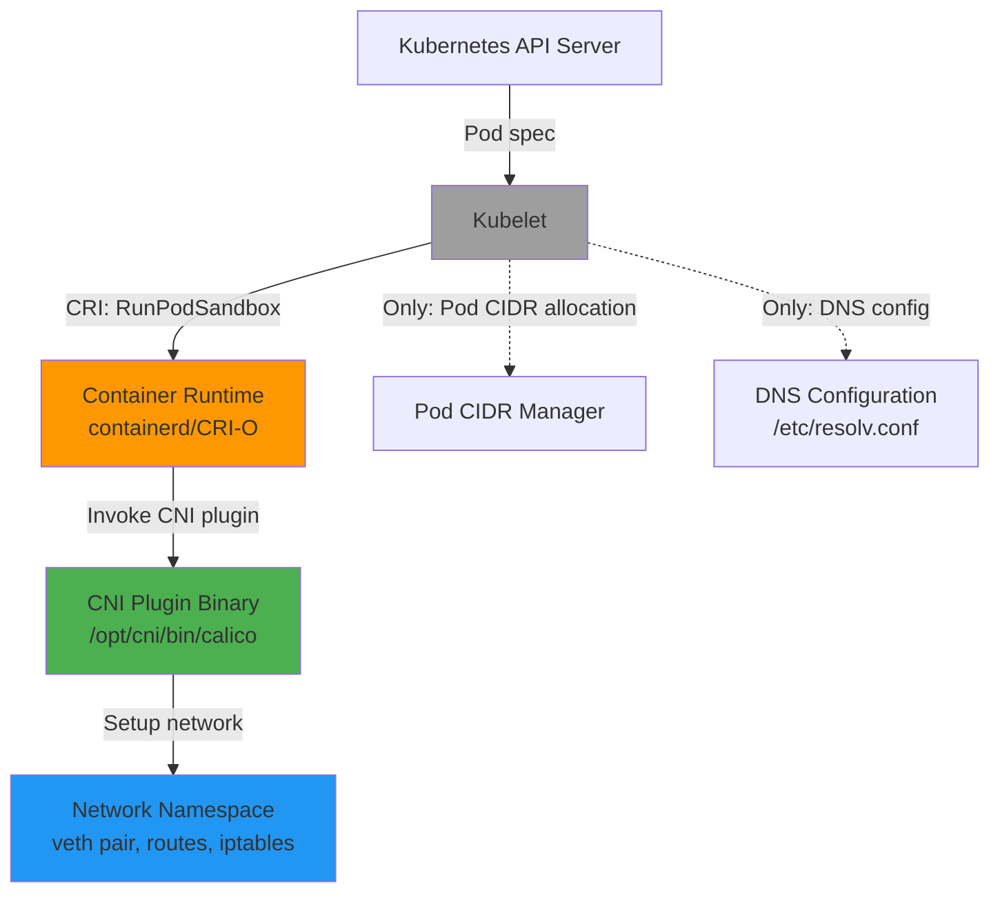
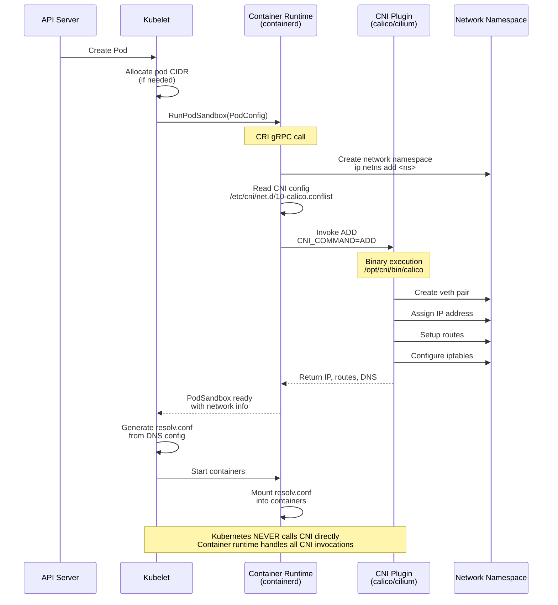

# **CNI NETWORKING OVERVIEW**

**Container Network Interface - External to Kubernetes**

━━━━━━━━━━━━━━━━━━━━━━━━━━━━━━━━━━━━━━━━━━━━━━━━━━━━━━━━━━━━━━━━━━━━━━━━━━━━━━

## **🎯 Purpose**

This document explains the relationship between Kubernetes and the Container Network Interface (CNI), clarifying that **CNI is NOT implemented in kubernetes/kubernetes** but is instead invoked by container runtimes external to Kubernetes.

**Key Takeaway**: Kubernetes delegates pod networking to the container runtime (containerd, CRI-O), which in turn invokes CNI plugins. This is fundamentally different from CSI (storage), which has deep integration within kubernetes/kubernetes.

━━━━━━━━━━━━━━━━━━━━━━━━━━━━━━━━━━━━━━━━━━━━━━━━━━━━━━━━━━━━━━━━━━━━━━━━━━━━━━

## **📋 Key Facts**

### **What CNI Is**

**CNI (Container Network Interface)** is:
- An industry-standard specification for configuring network interfaces in Linux containers
- A plugin-based architecture for network setup and teardown
- Defined by the Cloud Native Computing Foundation (CNCF)
- Implemented by various network providers (Calico, Cilium, Flannel, Weave, etc.)

### **What CNI Is NOT**

❌ **NOT part of kubernetes/kubernetes codebase**
❌ **NOT invoked directly by kubelet**
❌ **NOT a Kubernetes-specific technology**
❌ **NOT deeply integrated like CSI (storage)**

### **Where CNI Lives**

✅ **Container runtimes** (containerd, CRI-O) invoke CNI
✅ **External repositories** contain CNI plugin implementations
✅ **Node filesystem** holds CNI plugin binaries (`/opt/cni/bin/`)
✅ **Node filesystem** holds CNI configuration (`/etc/cni/net.d/`)

━━━━━━━━━━━━━━━━━━━━━━━━━━━━━━━━━━━━━━━━━━━━━━━━━━━━━━━━━━━━━━━━━━━━━━━━━━━━━━

## **🏗️ Architecture Overview**

### **Kubernetes Networking Delegation Model**



**Legend**:
- 🟠 **Orange**: Container runtime (invokes CNI)
- 🟢 **Green**: CNI plugin (external to Kubernetes)
- 🔵 **Blue**: Network namespace (Linux kernel)
- ⚫ **Gray**: Kubernetes (does NOT invoke CNI directly)

### **Critical Distinction: CSI vs CNI**

| Aspect | **CSI (Storage)** | **CNI (Networking)** |
|--------|-------------------|----------------------|
| **Integration Level** | Deep (50,000+ LOC in k8s/k8s) | Minimal (~500 LOC in k8s/k8s) |
| **Invoked By** | Kubelet directly | Container runtime |
| **API Resources** | Yes (CSIDriver, CSINode, VolumeAttachment) | No Kubernetes API resources |
| **Controllers** | Yes (attach/detach, expansion, PV) | No controllers |
| **Code Location** | `/pkg/volume/csi/` | No dedicated directory |
| **gRPC Client** | Yes (`/pkg/volume/csi/csi_client.go`) | No |
| **Documentation Needed** | Extensive (16 files, 29,000 lines) | Brief overview (this file) |

**Why the difference?**
- **Storage**: Kubernetes manages volume lifecycle (provisioning, attaching, mounting)
- **Networking**: Container runtime manages network lifecycle (setup during pod creation, teardown during deletion)

━━━━━━━━━━━━━━━━━━━━━━━━━━━━━━━━━━━━━━━━━━━━━━━━━━━━━━━━━━━━━━━━━━━━━━━━━━━━━━

## **🔍 CNI in kubernetes/kubernetes**

### **Minimal Code Footprint**

Kubernetes has **minimal networking code** because networking is delegated to the container runtime:

#### **A. Pod CIDR Management**

**Location**: `/Users/sureshscribnar/Documents/Projects/opensource/kubernetes/pkg/kubelet/kubelet_network.go`

**Purpose**: Allocate pod IP ranges, pass to container runtime

**Key Functions**:
```go
// updatePodCIDR updates the pod CIDR via CRI runtime
func (kl *Kubelet) updatePodCIDR(cidr string) error {
    // Calls CRI UpdateRuntimeConfig with pod CIDR
    // Container runtime uses this to configure CNI
}
```

**What it does**:
- Receives pod CIDR allocation from kube-controller-manager
- Passes pod CIDR to container runtime via CRI
- Container runtime configures CNI plugin with this CIDR
- Does NOT invoke CNI directly

**Code Reference**: `/pkg/kubelet/kubelet_network.go:40-85`

#### **B. DNS Configuration**

**Location**: `/Users/sureshscribnar/Documents/Projects/opensource/kubernetes/pkg/kubelet/network/dns/`

**Purpose**: Generate `/etc/resolv.conf` for containers

**Files**:
- `dns.go` - Core DNS configuration logic
- `dns_windows.go` - Windows-specific DNS
- `dns_other.go` - Non-Windows DNS (Linux, etc.)

**What it does**:
- Generates `resolv.conf` content based on:
  - Cluster DNS IP (CoreDNS/kube-dns)
  - DNS search domains
  - DNS policy (ClusterFirst, Default, None, ClusterFirstWithHostNet)
- Injects into containers
- Does NOT configure network interfaces

**Code Reference**: `/pkg/kubelet/network/dns/dns.go:50-200`

#### **C. Network Metrics**

**Location**: `/Users/sureshscribnar/Documents/Projects/opensource/kubernetes/pkg/kubelet/metrics/metrics.go`

**Purpose**: Track network-related startup metrics

**Metrics**:
```go
const (
    // FirstNetworkPodStartSLIDurationKey tracks time to first network pod ready
    FirstNetworkPodStartSLIDurationKey = "first_network_pod_start_sli_duration"
)
```

**What it does**:
- Measures pod startup latency
- Includes network setup time
- Does NOT invoke or manage CNI

#### **D. iptables Rules (Non-CNI)**

**Location**: `/Users/sureshscribnar/Documents/Projects/opensource/kubernetes/pkg/kubelet/kubelet_network_linux.go`

**Purpose**: Setup host firewall rules for kubelet

**What it does**:
- Creates iptables rules for kubelet ports
- Enables IP forwarding
- Configures bridge netfilter
- Does NOT setup pod networking (that's CNI)

**Code Reference**: `/pkg/kubelet/kubelet_network_linux.go:30-120`

### **Summary: Kubernetes Networking Code**

```
/pkg/kubelet/
├── kubelet_network.go              # Pod CIDR updates (85 lines)
├── kubelet_network_linux.go        # iptables for kubelet (90 lines)
├── kubelet_network_others.go       # Non-Linux stubs (20 lines)
└── network/
    └── dns/
        ├── dns.go                   # DNS config (250 lines)
        ├── dns_windows.go          # Windows DNS (50 lines)
        └── dns_other.go            # Linux DNS (50 lines)

Total: ~545 lines of networking-related code
Purpose: Pod CIDR allocation and DNS configuration
Does NOT: Invoke CNI, setup network interfaces, manage routes
```

━━━━━━━━━━━━━━━━━━━━━━━━━━━━━━━━━━━━━━━━━━━━━━━━━━━━━━━━━━━━━━━━━━━━━━━━━━━━━━

## **🚀 How Pod Networking Actually Works**

### **Complete Pod Network Setup Sequence**



**Key Points**:
1. **Kubelet** tells container runtime to create pod sandbox
2. **Container runtime** (not Kubernetes) invokes CNI plugin
3. **CNI plugin** (external binary) sets up networking
4. **Kubelet** only handles DNS configuration
5. **No Kubernetes code** executes CNI operations

### **CNI Plugin Invocation**

**Who invokes CNI?** Container runtime (containerd, CRI-O)

**When?**
- `CNI ADD`: During `RunPodSandbox` (pod creation)
- `CNI DEL`: During `RemovePodSandbox` (pod deletion)
- `CNI CHECK`: Health check (optional)
- `CNI VERSION`: Query plugin version

**How?** Binary execution with environment variables:

```bash
# Example: containerd invokes CNI plugin
$ CNI_COMMAND=ADD \
  CNI_CONTAINERID=abc123 \
  CNI_NETNS=/var/run/netns/cni-xxx \
  CNI_IFNAME=eth0 \
  CNI_PATH=/opt/cni/bin \
  /opt/cni/bin/calico < /etc/cni/net.d/10-calico.conflist
```

**Input**: JSON configuration on stdin
**Output**: JSON result with IP, routes, DNS on stdout

### **CNI Configuration Example**

**Location**: `/etc/cni/net.d/10-calico.conflist`

```json
{
  "name": "k8s-pod-network",
  "cniVersion": "0.3.1",
  "plugins": [
    {
      "type": "calico",
      "log_level": "info",
      "datastore_type": "kubernetes",
      "nodename": "node1",
      "ipam": {
        "type": "calico-ipam"
      },
      "policy": {
        "type": "k8s"
      },
      "kubernetes": {
        "kubeconfig": "/etc/cni/net.d/calico-kubeconfig"
      }
    },
    {
      "type": "portmap",
      "capabilities": {"portMappings": true}
    },
    {
      "type": "bandwidth",
      "capabilities": {"bandwidth": true}
    }
  ]
}
```

**Who creates this file?** CNI plugin installer (usually a DaemonSet)
**Who reads this file?** Container runtime (containerd, CRI-O)
**Does Kubernetes read this file?** ❌ No

━━━━━━━━━━━━━━━━━━━━━━━━━━━━━━━━━━━━━━━━━━━━━━━━━━━━━━━━━━━━━━━━━━━━━━━━━━━━━━

## **🌐 CNI Plugin Ecosystem**

### **Popular CNI Plugins**

All CNI plugins are **external to kubernetes/kubernetes**:

| Plugin | Repository | Type | Key Features |
|--------|-----------|------|--------------|
| **Calico** | projectcalico/calico | L3 networking | BGP routing, Network Policy, eBPF dataplane |
| **Cilium** | cilium/cilium | L3 networking | eBPF-based, Network Policy, Service Mesh |
| **Flannel** | flannel-io/flannel | Overlay | VXLAN, host-gw, simple setup |
| **Weave Net** | weaveworks/weave | Mesh | Automatic mesh, encryption |
| **Canal** | projectcalico/canal | Hybrid | Flannel + Calico Policy |
| **Antrea** | antrea-io/antrea | OVS-based | Open vSwitch, NetworkPolicy |
| **Kube-Router** | cloudnativelabs/kube-router | BGP | All-in-one networking, service proxy, policy |

### **CNI Plugin Architecture**

**Standard CNI plugins** (containernetworking/plugins):

```
/opt/cni/bin/
├── bridge              # Creates L2 bridge
├── host-local          # IPAM (IP address management)
├── loopback           # Loopback interface (lo)
├── portmap            # Port mapping (hostPort)
├── bandwidth          # Traffic shaping
├── tuning             # Sysctl tuning
└── firewall           # iptables rules
```

**Network provider CNI plugins**:

```
/opt/cni/bin/
├── calico             # Calico main plugin
├── calico-ipam        # Calico IP management
├── cilium-cni         # Cilium main plugin
├── flannel            # Flannel plugin
└── weave-net          # Weave plugin
```

**Plugin Chaining**: Multiple plugins can be invoked in sequence:
1. **Main plugin** (calico, cilium): Creates network interface
2. **Portmap plugin**: Sets up port mappings
3. **Bandwidth plugin**: Configures traffic shaping

━━━━━━━━━━━━━━━━━━━━━━━━━━━━━━━━━━━━━━━━━━━━━━━━━━━━━━━━━━━━━━━━━━━━━━━━━━━━━━

## **🔧 Container Runtime CNI Integration**

### **Containerd CNI Integration**

**Containerd** (most common container runtime) invokes CNI:

**Code Location** (external to Kubernetes):
- Repository: `containerd/containerd`
- File: `pkg/cri/server/sandbox_run.go`
- Function: `setupPodNetwork()`

**Workflow**:
```go
func (c *criService) setupPodNetwork(ctx context.Context, sandbox *sandboxstore.Sandbox) error {
    // 1. Load CNI config from /etc/cni/net.d/
    netConf, err := c.netPlugin.Load()

    // 2. Create network namespace
    netns := sandbox.NetNSPath

    // 3. Invoke CNI ADD
    result, err := c.netPlugin.Setup(ctx, sandbox.ID, netns,
        cni.WithLabelsAndAnnotations(labels, annotations))

    // 4. Store result (IP, routes, DNS)
    sandbox.IP = result.IP
    return nil
}
```

**Key Point**: This code is in **containerd**, NOT kubernetes/kubernetes

### **CRI-O CNI Integration**

**CRI-O** also invokes CNI independently:

**Code Location** (external to Kubernetes):
- Repository: `cri-o/cri-o`
- File: `internal/lib/sandbox/network.go`
- Function: `SetupNetwork()`

**Same pattern**: Container runtime reads CNI config, invokes CNI binary

━━━━━━━━━━━━━━━━━━━━━━━━━━━━━━━━━━━━━━━━━━━━━━━━━━━━━━━━━━━━━━━━━━━━━━━━━━━━━━

## **📊 Networking Responsibilities**

### **Kubernetes Responsibilities**

✅ **Pod CIDR allocation**: kube-controller-manager assigns IP ranges to nodes
✅ **DNS configuration**: kubelet generates `/etc/resolv.conf` for pods
✅ **Service networking**: kube-proxy manages Service ClusterIP/NodePort/LoadBalancer
✅ **Network Policy API**: Defines NetworkPolicy resources (enforcement is CNI's job)
✅ **Endpoint/EndpointSlice**: Tracks pod IPs for Services

### **Container Runtime Responsibilities**

✅ **CNI plugin invocation**: Executes CNI binaries during pod lifecycle
✅ **Network namespace creation**: Creates isolated network namespaces
✅ **CNI configuration loading**: Reads `/etc/cni/net.d/*.conflist`
✅ **IP address tracking**: Stores pod IP from CNI result

### **CNI Plugin Responsibilities**

✅ **Network interface creation**: Creates veth pairs, bridges, etc.
✅ **IP address assignment**: Assigns IPs to pod interfaces via IPAM
✅ **Routing setup**: Configures routes for pod-to-pod communication
✅ **Network Policy enforcement**: Implements NetworkPolicy via iptables/eBPF
✅ **Cross-node networking**: Sets up VXLAN tunnels, BGP routing, etc.

### **Responsibility Matrix**

| Task | Kubernetes | Container Runtime | CNI Plugin |
|------|:----------:|:-----------------:|:----------:|
| **Allocate pod CIDR** | ✅ | - | - |
| **Generate DNS config** | ✅ | - | - |
| **Define NetworkPolicy** | ✅ | - | - |
| **Invoke CNI binary** | - | ✅ | - |
| **Create network namespace** | - | ✅ | - |
| **Create veth pair** | - | - | ✅ |
| **Assign pod IP** | - | - | ✅ |
| **Setup routes** | - | - | ✅ |
| **Enforce NetworkPolicy** | - | - | ✅ |
| **Service load balancing** | ✅ (kube-proxy) | - | - |

━━━━━━━━━━━━━━━━━━━━━━━━━━━━━━━━━━━━━━━━━━━━━━━━━━━━━━━━━━━━━━━━━━━━━━━━━━━━━━

## **🔗 Integration with Kubernetes Services**

### **kube-proxy: Service Networking**

**kube-proxy** (documented extensively in `docs/architecture/claude/kube-proxy/`) handles **Service** networking:

- **ClusterIP**: Virtual IP for service endpoints
- **NodePort**: Expose service on node's IP
- **LoadBalancer**: External load balancer integration
- **iptables/IPVS rules**: Load balancing across pod IPs

**Relationship to CNI**:
- kube-proxy manages Service → Pod mapping
- CNI manages Pod → Pod communication
- Both work independently but cooperatively

### **CoreDNS: Cluster DNS**

**CoreDNS** provides service discovery:

- DNS records for Services (`my-service.my-namespace.svc.cluster.local`)
- DNS records for Pods (optional)
- Configured via kubelet DNS settings

**Relationship to CNI**:
- kubelet generates `/etc/resolv.conf` pointing to CoreDNS
- CNI ensures pods can reach CoreDNS IP
- Independent systems that work together

━━━━━━━━━━━━━━━━━━━━━━━━━━━━━━━━━━━━━━━━━━━━━━━━━━━━━━━━━━━━━━━━━━━━━━━━━━━━━━

## **❓ Common Questions**

### **Q1: Why doesn't Kubernetes invoke CNI directly?**

**A**: Historical and architectural reasons:

1. **Container runtime responsibility**: Network setup is part of container creation, which is the runtime's job
2. **CRI abstraction**: Kubernetes talks to runtimes via CRI (Container Runtime Interface), not directly to CNI
3. **Flexibility**: Different runtimes can use different networking approaches
4. **Separation of concerns**: Kubernetes manages orchestration, runtimes manage containers

### **Q2: Can I write a custom CNI plugin?**

**A**: Yes, but it's external to Kubernetes:

1. **CNI spec**: Implement the CNI specification (ADD, DEL, CHECK, VERSION commands)
2. **Binary**: Create executable at `/opt/cni/bin/my-plugin`
3. **Configuration**: Write config to `/etc/cni/net.d/`
4. **Installation**: Typically via DaemonSet that copies binary and config

**Resources**:
- CNI Specification: https://github.com/containernetworking/cni/blob/main/SPEC.md
- Reference plugins: https://github.com/containernetworking/plugins

### **Q3: How does NetworkPolicy work?**

**A**: Kubernetes defines API, CNI enforces:

1. **Kubernetes**: Defines `NetworkPolicy` API resource
2. **User**: Creates NetworkPolicy YAML
3. **API server**: Stores NetworkPolicy
4. **CNI plugin**: Watches NetworkPolicy resources
5. **CNI plugin**: Enforces rules via iptables/eBPF
6. **Kubernetes**: Does NOT enforce NetworkPolicy itself

**Not all CNI plugins support NetworkPolicy**:
- ✅ Support: Calico, Cilium, Weave Net, Antrea
- ❌ No support: Flannel (use Canal = Flannel + Calico)

### **Q4: What happens if CNI plugin fails?**

**A**: Pod stays in `ContainerCreating` state:

```bash
$ kubectl get pods
NAME       READY   STATUS              RESTARTS   AGE
my-pod     0/1     ContainerCreating   0          2m

$ kubectl describe pod my-pod
Events:
  Warning  FailedCreatePodSandBox  2m   kubelet
    Failed to create pod sandbox: rpc error: code = Unknown
    desc = failed to setup network for sandbox "abc123":
    plugin type="calico" failed: CNI plugin failed
```

**Debugging**:
1. Check container runtime logs: `journalctl -u containerd`
2. Check CNI plugin logs: `/var/log/calico/` or plugin-specific location
3. Verify CNI config: `/etc/cni/net.d/`
4. Verify CNI binary exists: `/opt/cni/bin/`

### **Q5: How do I change CNI plugin?**

**A**: Drain nodes and reinstall:

1. **Backup**: Save existing CNI config
2. **Drain node**: `kubectl drain node1 --ignore-daemonsets`
3. **Delete old CNI**: Remove DaemonSets, configs, binaries
4. **Install new CNI**: Deploy new CNI DaemonSet
5. **Restart runtime**: `systemctl restart containerd`
6. **Uncordon**: `kubectl uncordon node1`

**⚠️ Warning**: This is disruptive, requires pod recreation

━━━━━━━━━━━━━━━━━━━━━━━━━━━━━━━━━━━━━━━━━━━━━━━━━━━━━━━━━━━━━━━━━━━━━━━━━━━━━━

## **📚 External Resources**

### **CNI Specification**

- **Official Spec**: https://github.com/containernetworking/cni/blob/main/SPEC.md
- **Reference Plugins**: https://github.com/containernetworking/plugins
- **CNI Library (Go)**: https://github.com/containernetworking/cni

### **Popular CNI Plugins**

- **Calico**: https://docs.projectcalico.org/
- **Cilium**: https://docs.cilium.io/
- **Flannel**: https://github.com/flannel-io/flannel
- **Weave Net**: https://www.weave.works/docs/net/latest/overview/
- **Antrea**: https://antrea.io/docs/

### **Container Runtime CNI Integration**

- **containerd**: https://github.com/containerd/containerd/tree/main/pkg/cri
- **CRI-O**: https://github.com/cri-o/cri-o/tree/main/internal/lib/sandbox

### **Kubernetes Networking Documentation**

- **Cluster Networking**: https://kubernetes.io/docs/concepts/cluster-administration/networking/
- **Network Policies**: https://kubernetes.io/docs/concepts/services-networking/network-policies/
- **DNS for Services**: https://kubernetes.io/docs/concepts/services-networking/dns-pod-service/

━━━━━━━━━━━━━━━━━━━━━━━━━━━━━━━━━━━━━━━━━━━━━━━━━━━━━━━━━━━━━━━━━━━━━━━━━━━━━━

## **🎯 Key Takeaways**

### **For Kubernetes Developers**

1. **CNI is external**: Don't look for CNI invocation code in kubernetes/kubernetes
2. **Minimal footprint**: Only ~545 lines of networking code in Kubernetes
3. **CRI boundary**: Networking happens via CRI, not direct CNI calls
4. **Focus on Services**: kube-proxy is where Kubernetes networking code lives

### **For CNI Plugin Developers**

1. **Container runtime contract**: Your plugin is invoked by containerd/CRI-O, not kubelet
2. **Standard interface**: Implement CNI spec (ADD, DEL, CHECK, VERSION)
3. **Binary execution**: Plugin runs as separate process with JSON I/O
4. **NetworkPolicy**: Optional but highly recommended for security

### **For Operators**

1. **Choose CNI carefully**: Different plugins have different features and performance
2. **NetworkPolicy support**: Not all CNI plugins enforce NetworkPolicy
3. **Troubleshooting**: Check container runtime logs, not kubelet logs for CNI issues
4. **Upgrades**: Changing CNI plugins requires node draining

### **For Course Development**

1. **Brief coverage**: CNI doesn't warrant extensive documentation in k8s/k8s architecture study
2. **Focus on kube-proxy**: Service networking is more relevant to Kubernetes internals
3. **External references**: Point students to CNI plugin documentation
4. **Clear distinction**: Emphasize CSI (deep integration) vs CNI (external delegation)

━━━━━━━━━━━━━━━━━━━━━━━━━━━━━━━━━━━━━━━━━━━━━━━━━━━━━━━━━━━━━━━━━━━━━━━━━━━━━━

## **🔗 Related Kubernetes Architecture Documentation**

### **Within kubernetes/kubernetes**

- **kube-proxy**: `docs/architecture/claude/kube-proxy/` - Complete Service networking documentation (30 files)
- **kubelet**: `docs/architecture/claude/kubelet/` - Pod lifecycle, container runtime integration
- **Repository Structure**: `docs/architecture/claude/repo-structure/` - Code organization

### **Networking Topics**

- **Service Networking**: See kube-proxy documentation for iptables/IPVS implementation
- **DNS**: CoreDNS architecture (separate from Kubernetes)
- **NetworkPolicy**: API definition in Kubernetes, enforcement in CNI plugins
- **Ingress**: API definition in Kubernetes, implementation in Ingress controllers (external)

━━━━━━━━━━━━━━━━━━━━━━━━━━━━━━━━━━━━━━━━━━━━━━━━━━━━━━━━━━━━━━━━━━━━━━━━━━━━━━

## **✅ Summary**

**CNI (Container Network Interface) is NOT part of kubernetes/kubernetes**. It is:

- ✅ A CNCF standard specification
- ✅ Implemented by external network providers (Calico, Cilium, Flannel, etc.)
- ✅ Invoked by container runtimes (containerd, CRI-O), not Kubernetes
- ✅ Configured via files in `/etc/cni/net.d/` and binaries in `/opt/cni/bin/`
- ✅ Minimal Kubernetes code footprint (~545 lines for pod CIDR and DNS)

**Kubernetes responsibilities**:
- Allocate pod CIDR ranges to nodes
- Generate DNS configuration for pods
- Define NetworkPolicy API (enforcement is CNI's job)
- Manage Service networking via kube-proxy

**CNI plugin responsibilities**:
- Create network interfaces (veth pairs)
- Assign IP addresses to pods
- Setup routes for pod-to-pod communication
- Enforce NetworkPolicy rules
- Handle cross-node networking (VXLAN, BGP, etc.)

**For deeper Kubernetes networking**, focus on:
- **kube-proxy documentation**: Service ClusterIP, NodePort, LoadBalancer implementation
- **External CNI plugin docs**: Calico, Cilium, Flannel documentation
- **Container runtime docs**: containerd, CRI-O CNI integration

━━━━━━━━━━━━━━━━━━━━━━━━━━━━━━━━━━━━━━━━━━━━━━━━━━━━━━━━━━━━━━━━━━━━━━━━━━━━━━

**📅 Last Updated**: 2025-01-16
**📝 Repository Version**: kubernetes/kubernetes (master branch)
**👤 Generated By**: Claude AI (Sonnet 4.5)

━━━━━━━━━━━━━━━━━━━━━━━━━━━━━━━━━━━━━━━━━━━━━━━━━━━━━━━━━━━━━━━━━━━━━━━━━━━━━━
