# **KUBERNETES NETWORKING OVERVIEW**

**Comprehensive Guide to the Kubernetes Networking Model**

━━━━━━━━━━━━━━━━━━━━━━━━━━━━━━━━━━━━━━━━━━━━━━━━━━━━━━━━━━━━━━━━━━━━━━━━━━━━━━

## **🎯 Purpose**

This document provides a comprehensive overview of the Kubernetes networking model, explaining how pods communicate across nodes, how services provide stable endpoints, and how the fundamental networking requirements shape the entire Kubernetes architecture.

**What You'll Learn**:
- ✅ The three fundamental Kubernetes networking requirements
- ✅ How pod-to-pod communication works across nodes
- ✅ How network namespaces provide isolation
- ✅ The role of CNI plugins in pod networking
- ✅ How services abstract pod networking
- ✅ Container networking fundamentals

**Prerequisites**:
- Basic understanding of Linux networking (IP addressing, routing)
- Familiarity with Kubernetes pods and services
- Knowledge of container fundamentals

━━━━━━━━━━━━━━━━━━━━━━━━━━━━━━━━━━━━━━━━━━━━━━━━━━━━━━━━━━━━━━━━━━━━━━━━━━━━━━

## **📋 Table of Contents**

1. [The Kubernetes Networking Model](#the-kubernetes-networking-model)
2. [Fundamental Networking Requirements](#fundamental-networking-requirements)
3. [Pod Networking Architecture](#pod-networking-architecture)
4. [Network Namespaces](#network-namespaces)
5. [Service Networking](#service-networking)
6. [Container Network Interface (CNI)](#container-network-interface)
7. [IP Address Management](#ip-address-management)
8. [DNS and Service Discovery](#dns-and-service-discovery)
9. [Network Traffic Flows](#network-traffic-flows)
10. [Best Practices](#best-practices)
11. [Troubleshooting](#troubleshooting)

━━━━━━━━━━━━━━━━━━━━━━━━━━━━━━━━━━━━━━━━━━━━━━━━━━━━━━━━━━━━━━━━━━━━━━━━━━━━━━

## **🌐 The Kubernetes Networking Model**

### **Overview**

Kubernetes implements a **flat network model** where every pod gets its own unique IP address and can communicate directly with any other pod in the cluster, regardless of which node the pods are running on.

This is fundamentally different from traditional networking models where containers share the host's network or require explicit port mapping.

### **Design Philosophy**

The Kubernetes networking model is based on the following principles:

1. **Simplicity**: Applications shouldn't need to be aware they're running in containers
2. **Compatibility**: Legacy applications designed for VMs should work in containers
3. **Flexibility**: Multiple networking implementations can satisfy the model
4. **Scalability**: The model must work at massive scale

### **Networking Architecture Layers**

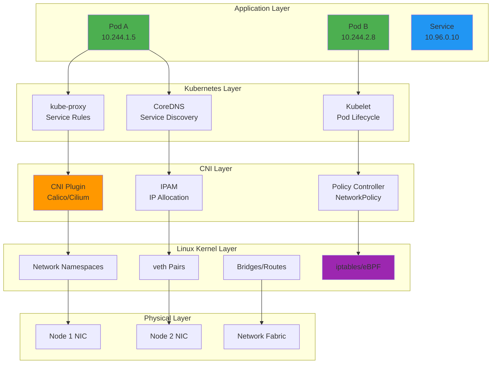

**Legend**:
- 🟢 **Green**: Application pods with unique IPs
- 🔵 **Blue**: Kubernetes service abstraction
- 🟠 **Orange**: CNI plugin layer (external to Kubernetes)
- 🟣 **Purple**: Packet filtering and forwarding

━━━━━━━━━━━━━━━━━━━━━━━━━━━━━━━━━━━━━━━━━━━━━━━━━━━━━━━━━━━━━━━━━━━━━━━━━━━━━━

## **📜 Fundamental Networking Requirements**

### **The Three Golden Rules**

Kubernetes defines three fundamental requirements that all network implementations must satisfy:

#### **Requirement 1: Pod-to-Pod Communication Without NAT**

```
┌─────────────────────────────────────────────────────────────┐
│ Rule: All pods can communicate with all other pods without  │
│       Network Address Translation (NAT)                     │
└─────────────────────────────────────────────────────────────┘
```

**What this means**:
- Pod `10.244.1.5` on Node A can directly send packets to Pod `10.244.2.8` on Node B
- The source IP in the packet remains `10.244.1.5` (no NAT)
- The destination IP in the packet remains `10.244.2.8` (no NAT)

**Why this matters**:
- Applications can bind to their pod IP without special configuration
- Network policies can filter by source/destination pod IP
- Debugging is simpler (no NAT translation tables)

**Implementation**:
- CNI plugins create routes or tunnels between nodes
- Pod IPs are routable across the entire cluster
- No port mapping required

#### **Requirement 2: Node-to-Pod Communication Without NAT**

```
┌─────────────────────────────────────────────────────────────┐
│ Rule: All nodes can communicate with all pods (and vice     │
│       versa) without NAT                                    │
└─────────────────────────────────────────────────────────────┘
```

**What this means**:
- Node `192.168.1.10` can directly communicate with Pod `10.244.2.8`
- Pod `10.244.2.8` can directly communicate with Node `192.168.1.10`
- Useful for kubelet health checks, log collection, metrics scraping

**Why this matters**:
- Kubelet can perform readiness/liveness probes
- Node-level components (DaemonSets) can communicate with pods
- Monitoring and logging systems work seamlessly

#### **Requirement 3: Pod IP Consistency**

```
┌─────────────────────────────────────────────────────────────┐
│ Rule: The IP a pod sees for itself is the same IP that      │
│       others see for the pod                                │
└─────────────────────────────────────────────────────────────┘
```

**What this means**:
- If a pod runs `ip addr` and sees `10.244.1.5`, other pods see the same IP
- No split-brain networking where internal and external IPs differ
- Applications can discover their own IP reliably

**Why this matters**:
- Applications can advertise their IP to service registries
- Cluster autoscalers can make accurate networking decisions
- Troubleshooting is consistent (same IP everywhere)

### **Kubernetes Networking Model Diagram**

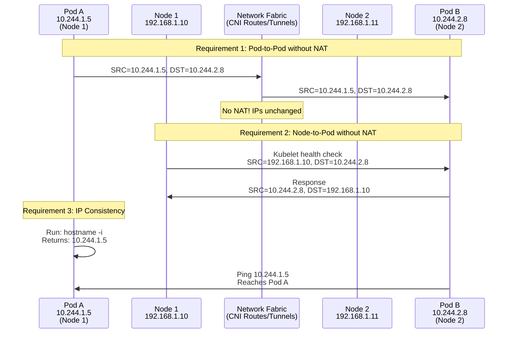

### **What the Requirements DON'T Mandate**

The Kubernetes networking model is deliberately flexible:

❌ **Not required**:
- Specific CNI plugin (Calico, Cilium, Flannel, etc.)
- Specific encapsulation method (VXLAN, IPIP, BGP, etc.)
- NetworkPolicy enforcement (optional)
- Service mesh integration (optional)
- Encryption (optional, but recommended)

✅ **Required**:
- Only the three golden rules above

This flexibility allows different environments to choose the best networking solution:
- **Cloud providers**: Use cloud SDN (AWS VPC CNI, Azure CNI, GCE)
- **On-premises**: Use BGP routing (Calico), overlay networks (Flannel)
- **High-security**: Use encrypted CNI (Calico Wireguard, Weave encryption)

━━━━━━━━━━━━━━━━━━━━━━━━━━━━━━━━━━━━━━━━━━━━━━━━━━━━━━━━━━━━━━━━━━━━━━━━━━━━━━

## **🏗️ Pod Networking Architecture**

### **Pod Network Anatomy**

Each pod gets its own network namespace with a unique IP address. Here's how it's structured:

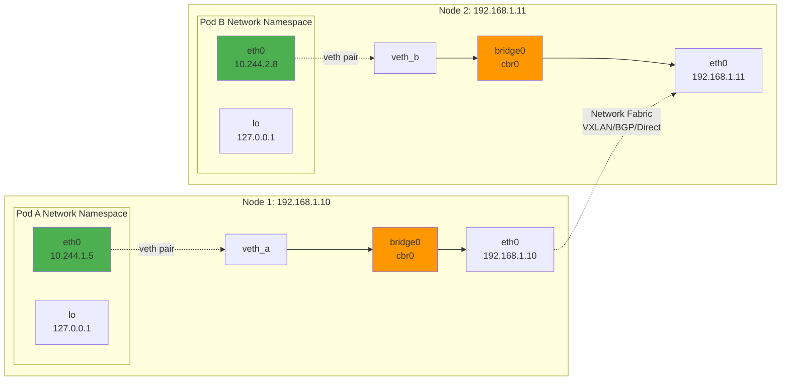

**Components**:

1. **Pod Network Namespace**: Isolated network stack for the pod
2. **eth0 Interface**: Pod's primary network interface (inside namespace)
3. **veth Pair**: Virtual ethernet cable connecting namespace to host
4. **Bridge**: L2 switch on the host connecting all local pods
5. **Node NIC**: Physical/virtual NIC for inter-node communication

### **Pod Network Creation Flow**

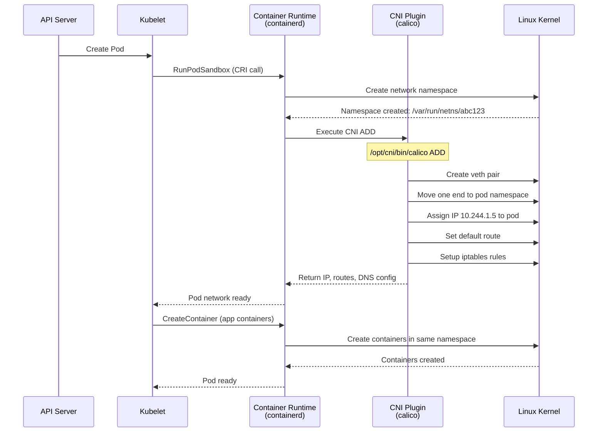

**Step-by-step**:

1. **Namespace Creation**: Runtime creates isolated network namespace
2. **CNI Invocation**: Runtime calls CNI plugin binary
3. **Interface Setup**: CNI creates veth pair, assigns IP
4. **Routing Setup**: CNI configures routes for pod-to-pod communication
5. **Policy Setup**: CNI installs NetworkPolicy rules (if applicable)
6. **Return Results**: CNI returns IP, routes, DNS to runtime
7. **Container Creation**: Containers join the prepared network namespace

### **Pod Network Namespace Details**

**What's inside a pod's network namespace?**

```bash
# From within a pod
$ ip addr show
1: lo: <LOOPBACK,UP,LOWER_UP> mtu 65536 qdisc noqueue state UNKNOWN
    inet 127.0.0.1/8 scope host lo
2: eth0@if7: <BROADCAST,MULTICAST,UP,LOWER_UP> mtu 1500 qdisc noqueue state UP
    inet 10.244.1.5/24 brd 10.244.1.255 scope global eth0

$ ip route show
default via 10.244.1.1 dev eth0
10.244.1.0/24 dev eth0 proto kernel scope link src 10.244.1.5

$ cat /etc/resolv.conf
nameserver 10.96.0.10
search default.svc.cluster.local svc.cluster.local cluster.local
options ndots:5
```

**Key observations**:
- **Loopback (lo)**: Standard `127.0.0.1` for local communication
- **eth0**: Pod's primary interface with cluster-routable IP
- **Default route**: All traffic goes via CNI-provided gateway
- **DNS**: Points to CoreDNS service for cluster DNS resolution

### **Code Reference: Kubelet Network Setup**

**File**: `/pkg/kubelet/kubelet_network.go`

```go
// updatePodCIDR updates the pod CIDR in the runtime config
// This is one of the few networking responsibilities in Kubernetes core
func (kl *Kubelet) updatePodCIDR(cidr string) error {
    // Set the pod CIDR internally.
    kl.runtimeState.setPodCIDR(cidr)

    // Update the runtime configuration with the new pod CIDR
    if kl.containerRuntime != nil {
        if err := kl.containerRuntime.UpdateRuntimeConfig(&runtimeapi.RuntimeConfig{
            NetworkConfig: &runtimeapi.NetworkConfig{
                PodCidr: cidr,
            },
        }); err != nil {
            klog.ErrorS(err, "Failed to update runtime config with pod CIDR", "podCIDR", cidr)
            return err
        }
    }

    klog.InfoS("Updated pod CIDR", "podCIDR", cidr)
    return nil
}
```

**Location**: `/pkg/kubelet/kubelet_network.go:45-65`

**What this code does**:
- Kubelet receives pod CIDR allocation from kube-controller-manager
- Updates container runtime (containerd/CRI-O) with the CIDR
- Runtime passes this to CNI plugin during network setup
- **Does NOT** directly invoke CNI (that's the runtime's job)

━━━━━━━━━━━━━━━━━━━━━━━━━━━━━━━━━━━━━━━━━━━━━━━━━━━━━━━━━━━━━━━━━━━━━━━━━━━━━━

## **🔒 Network Namespaces**

### **What Are Network Namespaces?**

Network namespaces are a Linux kernel feature that provides network isolation. Each namespace has its own:

- Network interfaces
- IP addresses
- Routing tables
- iptables rules
- Network statistics

### **Network Namespace Hierarchy**

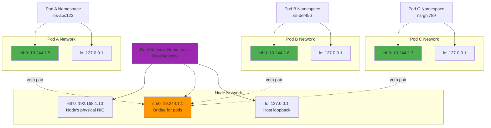

### **Container Sharing in Pods**

All containers in a pod share the same network namespace:

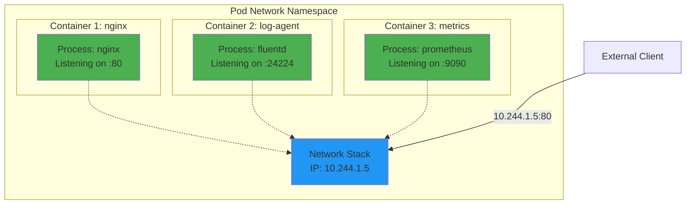

**Key characteristics**:
- **Shared IP**: All containers have the same IP (`10.244.1.5`)
- **Shared ports**: Only one container can bind to a port (e.g., `:80`)
- **Localhost communication**: Containers can talk via `localhost`
- **Shared network policy**: NetworkPolicy applies to entire pod

**Example**: Sidecar pattern
```yaml
apiVersion: v1
kind: Pod
metadata:
  name: webapp
spec:
  containers:
  - name: nginx
    image: nginx:1.21
    ports:
    - containerPort: 80
  - name: log-forwarder
    image: fluentd:v1.14
    # Can access nginx logs via localhost:80
    # Shares same network namespace
```

### **Host Network Mode**

Some pods run in the host's network namespace (not isolated):

```yaml
apiVersion: v1
kind: Pod
metadata:
  name: kube-proxy
spec:
  hostNetwork: true  # Use host's network namespace
  containers:
  - name: kube-proxy
    image: k8s.gcr.io/kube-proxy:v1.28.0
```

**When to use host network**:
- **kube-proxy**: Needs to manipulate host iptables
- **CNI DaemonSets**: Need to setup host networking
- **Monitoring agents**: Need to see host network stats

**⚠️ Warning**: Pods with `hostNetwork: true`:
- Share host's IP address
- Can conflict on ports
- Bypass NetworkPolicy
- Should be used sparingly

### **Namespace Operations**

**View network namespaces on a node**:
```bash
# List all network namespaces
$ ls /var/run/netns/
cni-0a1b2c3d-4e5f-6789-abcd-ef0123456789
cni-1a2b3c4d-5e6f-7890-bcde-f01234567890

# Or use ip command
$ ip netns list
cni-0a1b2c3d-4e5f-6789-abcd-ef0123456789
cni-1a2b3c4d-5e6f-7890-bcde-f01234567890
```

**Execute command in pod's namespace**:
```bash
# Find the pod's process ID
$ crictl pods --name nginx-pod
POD ID              CREATED             STATE    NAME         NAMESPACE
abc123def456        10 minutes ago      Ready    nginx-pod    default

# Find the network namespace
$ crictl inspectp abc123def456 | grep -i namespace
# Or directly:
$ nsenter --net=/var/run/netns/cni-abc123 ip addr
```

**Debug pod networking from node**:
```bash
# See pod's routing table
$ nsenter --net=/var/run/netns/cni-abc123 ip route

# Test connectivity from pod's perspective
$ nsenter --net=/var/run/netns/cni-abc123 ping 10.244.2.5

# See pod's iptables rules
$ nsenter --net=/var/run/netns/cni-abc123 iptables -L -n -v
```

━━━━━━━━━━━━━━━━━━━━━━━━━━━━━━━━━━━━━━━━━━━━━━━━━━━━━━━━━━━━━━━━━━━━━━━━━━━━━━

## **⚖️ Service Networking**

### **Why Services?**

Pods are ephemeral - they get created, deleted, and rescheduled with new IPs. Services provide:

1. **Stable endpoint**: ClusterIP that doesn't change
2. **Load balancing**: Distribute traffic across pod replicas
3. **Service discovery**: DNS name for the service
4. **External access**: NodePort and LoadBalancer types

### **Service Types**

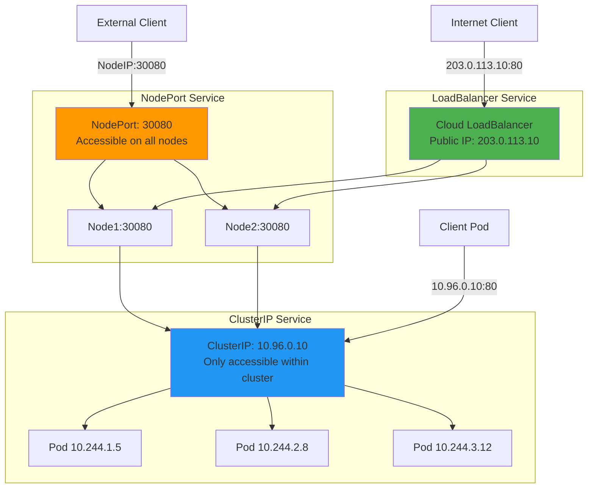

### **Service to Endpoints Mapping**

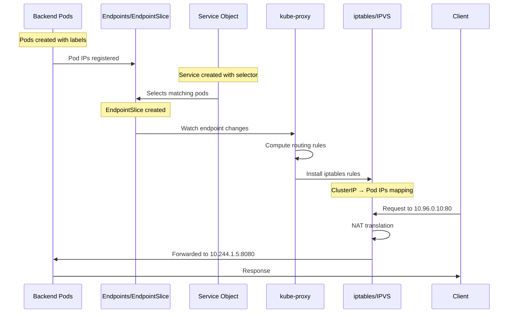

### **Service Definition Example**

```yaml
apiVersion: v1
kind: Service
metadata:
  name: web-service
  namespace: production
spec:
  type: ClusterIP
  selector:
    app: web
    tier: frontend
  ports:
  - name: http
    protocol: TCP
    port: 80        # Service port
    targetPort: 8080  # Pod port
  - name: https
    protocol: TCP
    port: 443
    targetPort: 8443
  sessionAffinity: ClientIP  # Optional: sticky sessions
  sessionAffinityConfig:
    clientIP:
      timeoutSeconds: 10800  # 3 hours
```

**Service creates**:
1. **ClusterIP**: `10.96.0.10` (virtual IP, managed by kube-proxy)
2. **DNS name**: `web-service.production.svc.cluster.local`
3. **Endpoints**: List of pod IPs matching selector

**Corresponding Endpoints**:
```yaml
apiVersion: v1
kind: Endpoints
metadata:
  name: web-service
  namespace: production
subsets:
- addresses:
  - ip: 10.244.1.5
    nodeName: node-1
    targetRef:
      kind: Pod
      name: web-pod-1
  - ip: 10.244.2.8
    nodeName: node-2
    targetRef:
      kind: Pod
      name: web-pod-2
  - ip: 10.244.3.12
    nodeName: node-3
    targetRef:
      kind: Pod
      name: web-pod-3
  ports:
  - name: http
    port: 8080
    protocol: TCP
  - name: https
    port: 8443
    protocol: TCP
```

### **kube-proxy Service Implementation**

kube-proxy runs on every node and implements Service routing. See the comprehensive `docs/architecture/claude/kube-proxy/` documentation for details.

**kube-proxy modes**:

| Mode | Mechanism | Performance | Use Case |
|------|-----------|-------------|----------|
| **iptables** | iptables NAT rules | Good | Default, widely compatible |
| **IPVS** | Linux Virtual Server | Excellent | Large clusters (>1000 services) |
| **eBPF** | Extended BPF programs | Best | Modern kernels, Cilium CNI |

**iptables mode example**:
```bash
# Service ClusterIP rule
-A KUBE-SERVICES -d 10.96.0.10/32 -p tcp --dport 80 -j KUBE-SVC-WEBSERVICE

# Load balancing across backends
-A KUBE-SVC-WEBSERVICE -m statistic --mode random --probability 0.33333 -j KUBE-SEP-1
-A KUBE-SVC-WEBSERVICE -m statistic --mode random --probability 0.50000 -j KUBE-SEP-2
-A KUBE-SVC-WEBSERVICE -j KUBE-SEP-3

# Backend pod #1
-A KUBE-SEP-1 -p tcp -m tcp -j DNAT --to-destination 10.244.1.5:8080

# Backend pod #2
-A KUBE-SEP-2 -p tcp -m tcp -j DNAT --to-destination 10.244.2.8:8080

# Backend pod #3
-A KUBE-SEP-3 -p tcp -m tcp -j DNAT --to-destination 10.244.3.12:8080
```

**How it works**:
1. Client sends packet to `10.96.0.10:80`
2. iptables intercepts packet in `PREROUTING` chain
3. Randomly selects backend pod (1/3 probability each)
4. Performs DNAT to pod IP (e.g., `10.244.1.5:8080`)
5. Packet forwarded to pod
6. Response returns via connection tracking (conntrack)

━━━━━━━━━━━━━━━━━━━━━━━━━━━━━━━━━━━━━━━━━━━━━━━━━━━━━━━━━━━━━━━━━━━━━━━━━━━━━━

## **🔌 Container Network Interface (CNI)**

### **What is CNI?**

CNI (Container Network Interface) is a **specification and plugin ecosystem** for configuring network interfaces in Linux containers.

**Key points**:
- ❌ **NOT** part of kubernetes/kubernetes codebase
- ✅ Invoked by container runtime (containerd, CRI-O)
- ✅ Plugin-based architecture
- ✅ Industry standard (CNCF project)

See `01-cni-networking-overview.md` in this directory for comprehensive CNI details.

### **CNI Responsibilities**

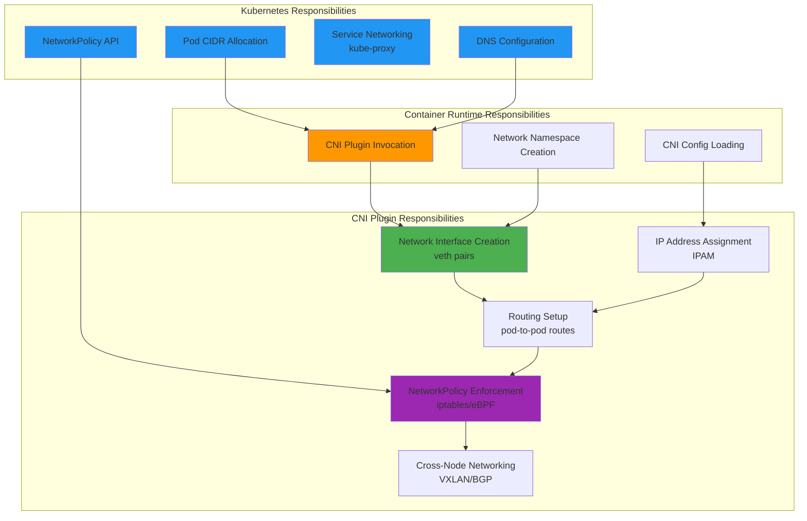

### **Popular CNI Plugins**

| Plugin | Type | NetworkPolicy | Encryption | Best For |
|--------|------|---------------|------------|----------|
| **Calico** | L3 Routing (BGP) | ✅ Yes | ✅ Wireguard | On-premises, BGP networks |
| **Cilium** | eBPF | ✅ Yes (L7) | ✅ IPsec/Wireguard | Modern kernels, observability |
| **Flannel** | Overlay (VXLAN) | ❌ No | ❌ No | Simple setups, learning |
| **Weave Net** | Mesh | ✅ Yes | ✅ Built-in | Easy setup, small clusters |
| **AWS VPC CNI** | Cloud Native | ✅ Yes (SecurityGroups) | ✅ VPC | AWS EKS |
| **Azure CNI** | Cloud Native | ✅ Yes (NSG) | ✅ VNet | Azure AKS |
| **Antrea** | OVS | ✅ Yes (L7) | ✅ IPsec | VMware environments |

### **CNI Plugin Operation**

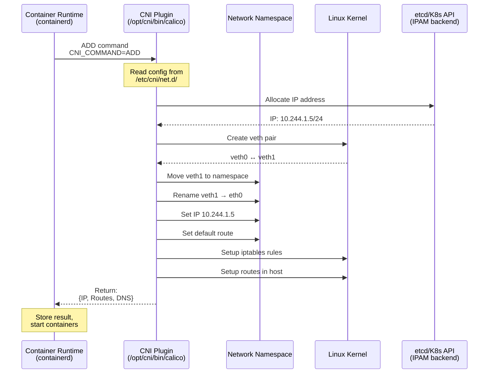

### **CNI Configuration Example**

**File**: `/etc/cni/net.d/10-calico.conflist`

```json
{
  "name": "k8s-pod-network",
  "cniVersion": "0.3.1",
  "plugins": [
    {
      "type": "calico",
      "log_level": "info",
      "log_file_path": "/var/log/calico/cni/cni.log",
      "datastore_type": "kubernetes",
      "nodename": "node-1",
      "mtu": 1440,
      "ipam": {
        "type": "calico-ipam",
        "assign_ipv4": "true",
        "assign_ipv6": "false"
      },
      "policy": {
        "type": "k8s"
      },
      "kubernetes": {
        "kubeconfig": "/etc/cni/net.d/calico-kubeconfig"
      }
    },
    {
      "type": "portmap",
      "snat": true,
      "capabilities": {"portMappings": true}
    },
    {
      "type": "bandwidth",
      "capabilities": {"bandwidth": true}
    }
  ]
}
```

**Plugin chain**:
1. **calico**: Main networking (veth, IP, routes)
2. **portmap**: Container port mapping (hostPort)
3. **bandwidth**: Traffic shaping (ingress/egress limits)

━━━━━━━━━━━━━━━━━━━━━━━━━━━━━━━━━━━━━━━━━━━━━━━━━━━━━━━━━━━━━━━━━━━━━━━━━━━━━━

## **📡 IP Address Management (IPAM)**

### **Pod CIDR Allocation**

Kubernetes allocates pod IP ranges in a hierarchical manner:

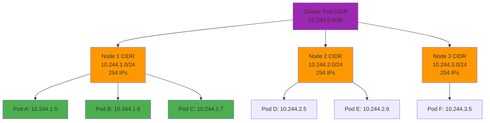

### **IPAM Allocation Process**

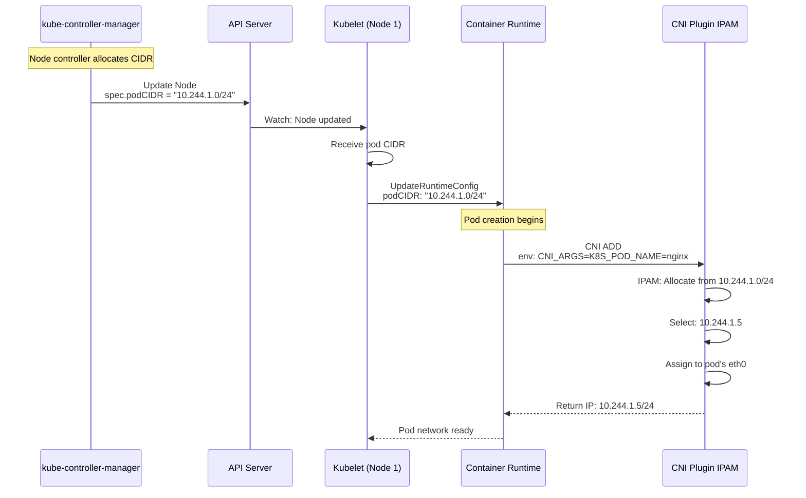

### **IPAM Implementations**

**1. Host-local IPAM** (Default for many CNIs)
```json
{
  "ipam": {
    "type": "host-local",
    "ranges": [
      [{
        "subnet": "10.244.1.0/24",
        "rangeStart": "10.244.1.10",
        "rangeEnd": "10.244.1.250",
        "gateway": "10.244.1.1"
      }]
    ],
    "routes": [
      {"dst": "0.0.0.0/0"}
    ]
  }
}
```
- Stores allocations in local files
- Fast, no external dependencies
- Per-node CIDR management

**2. Calico IPAM**
```json
{
  "ipam": {
    "type": "calico-ipam",
    "assign_ipv4": "true",
    "assign_ipv6": "false"
  }
}
```
- Uses Kubernetes API or etcd for allocation
- Supports IP pools and affinity
- Handles IP reclamation

**3. Cloud Provider IPAM** (AWS VPC CNI)
```json
{
  "ipam": {
    "type": "aws-vpc-eni-ipam"
  }
}
```
- Assigns IPs from VPC subnets
- Pods get routable cloud IPs
- Integrates with cloud networking

### **Service CIDR vs Pod CIDR**

```
┌────────────────────────────────────────────────────────────┐
│ Cluster Network Ranges                                     │
├────────────────────────────────────────────────────────────┤
│                                                            │
│ Pod CIDR:     10.244.0.0/16                               │
│ ├─ Node 1:    10.244.1.0/24  (254 pod IPs)               │
│ ├─ Node 2:    10.244.2.0/24  (254 pod IPs)               │
│ └─ Node 3:    10.244.3.0/24  (254 pod IPs)               │
│                                                            │
│ Service CIDR: 10.96.0.0/12                                │
│ ├─ ClusterIP: 10.96.0.1 - 10.111.255.254 (1M services)   │
│ ├─ CoreDNS:   10.96.0.10                                  │
│ └─ Services:  10.96.x.x (virtual IPs, kube-proxy)        │
│                                                            │
│ Node CIDR:    192.168.1.0/24                              │
│ ├─ Node 1:    192.168.1.10                                │
│ ├─ Node 2:    192.168.1.11                                │
│ └─ Node 3:    192.168.1.12                                │
│                                                            │
└────────────────────────────────────────────────────────────┘
```

**Key differences**:

| Aspect | Pod CIDR | Service CIDR |
|--------|----------|--------------|
| **Routable** | Yes (CNI routes) | No (virtual IPs) |
| **Assignment** | CNI IPAM | kube-apiserver |
| **Managed by** | CNI plugin | kube-proxy |
| **Persistent** | No (pod lifecycle) | Yes (until service deleted) |
| **DNS** | Optional | Always (CoreDNS) |

━━━━━━━━━━━━━━━━━━━━━━━━━━━━━━━━━━━━━━━━━━━━━━━━━━━━━━━━━━━━━━━━━━━━━━━━━━━━━━

## **🔍 DNS and Service Discovery**

### **CoreDNS Architecture**

CoreDNS provides cluster DNS for service discovery:

```mermaid
graph TB
    subgraph "Pod"
        APP[Application]
        RESOLV[/etc/resolv.conf<br/>nameserver 10.96.0.10]
    end

    subgraph "CoreDNS Service"
        DNS_SVC[Service: kube-dns<br/>ClusterIP: 10.96.0.10]
        DNS_POD1[CoreDNS Pod 1]
        DNS_POD2[CoreDNS Pod 2]

        DNS_SVC --> DNS_POD1
        DNS_SVC --> DNS_POD2
    end

    subgraph "Service Registry"
        API[Kubernetes API<br/>Services/Endpoints]
    end

    APP -->|DNS query:<br/>web-service.default.svc.cluster.local| RESOLV
    RESOLV -->|UDP:53| DNS_SVC
    DNS_POD1 -->|Watch| API
    DNS_POD2 -->|Watch| API
    DNS_POD1 -->|Response:<br/>10.96.0.10 (ClusterIP)| APP

    style DNS_SVC fill:#2196F3
    style DNS_POD1 fill:#4CAF50
    style DNS_POD2 fill:#4CAF50
    style API fill:#FF9800
```

### **DNS Record Types**

**Services**:
```
<service-name>.<namespace>.svc.<cluster-domain>
```

Examples:
```
web-service.default.svc.cluster.local         → 10.96.0.10
database.production.svc.cluster.local         → 10.96.5.25
redis.cache.svc.cluster.local                 → 10.96.8.100
```

**Pods** (optional, disabled by default):
```
<pod-ip-with-dashes>.<namespace>.pod.<cluster-domain>
```

Example:
```
10-244-1-5.default.pod.cluster.local          → 10.244.1.5
```

**Headless Services** (ClusterIP: None):
```
<pod-name>.<service-name>.<namespace>.svc.<cluster-domain>
```

Example:
```yaml
apiVersion: v1
kind: Service
metadata:
  name: mysql
spec:
  clusterIP: None  # Headless service
  selector:
    app: mysql
  ports:
  - port: 3306
---
apiVersion: v1
kind: Pod
metadata:
  name: mysql-0
  labels:
    app: mysql
```

DNS records:
```
mysql.default.svc.cluster.local               → No ClusterIP (returns pod IPs)
mysql-0.mysql.default.svc.cluster.local       → 10.244.1.5
mysql-1.mysql.default.svc.cluster.local       → 10.244.2.8
```

### **DNS Configuration in Pods**

**File**: `/etc/resolv.conf` (generated by kubelet)

```bash
nameserver 10.96.0.10
search default.svc.cluster.local svc.cluster.local cluster.local
options ndots:5
```

**Code Reference**: `/pkg/kubelet/network/dns/dns.go`

```go
// formDNSConfigFitsLimits returns DNS config based on pod's DNS policy
func (c *Configurer) formDNSConfigFitsLimits(hostDNS []string, hostSearch []string,
    podDNS *v1.PodDNSConfig) (*runtimeapi.DNSConfig, error) {

    // Generate search domains
    searches := []string{
        fmt.Sprintf("%s.svc.%s", pod.Namespace, c.ClusterDomain),
        fmt.Sprintf("svc.%s", c.ClusterDomain),
        c.ClusterDomain,
    }

    // Set nameservers (CoreDNS ClusterIP)
    nameservers := []string{c.clusterDNS}

    // Set ndots option (default: 5)
    options := []string{"ndots:5"}

    return &runtimeapi.DNSConfig{
        Servers:  nameservers,
        Searches: searches,
        Options:  options,
    }, nil
}
```

**Location**: `/pkg/kubelet/network/dns/dns.go:120-180`

### **DNS Search Path Behavior**

**ndots:5 explanation**:

When a pod queries `web-service`, DNS tries:
1. `web-service.default.svc.cluster.local` (namespace)
2. `web-service.svc.cluster.local` (cluster)
3. `web-service.cluster.local`
4. `web-service` (absolute, external DNS)

**Why ndots:5?**
- If name has < 5 dots, try search domains first
- If name has ≥ 5 dots, try as absolute name first
- `web-service` has 0 dots → try search domains
- `google.com` has 1 dot → try search domains
- `web.example.com` has 2 dots → try search domains
- `api.prod.example.com.cluster.local` has 5 dots → try absolute first

**Performance impact**:
```bash
# Bad: 5 DNS queries for external domain
$ curl http://api.example.com
# Queries:
# 1. api.example.com.default.svc.cluster.local (NXDOMAIN)
# 2. api.example.com.svc.cluster.local (NXDOMAIN)
# 3. api.example.com.cluster.local (NXDOMAIN)
# 4. api.example.com (SUCCESS)

# Good: 1 DNS query with trailing dot
$ curl http://api.example.com.
# Queries:
# 1. api.example.com (SUCCESS)
```

**Best practice**: Add trailing dot for external domains in production.

### **DNS Policy Options**

```yaml
apiVersion: v1
kind: Pod
metadata:
  name: dns-example
spec:
  dnsPolicy: ClusterFirst  # Options: ClusterFirst, Default, None, ClusterFirstWithHostNet
  dnsConfig:
    nameservers:
    - 8.8.8.8
    searches:
    - custom.local
    options:
    - name: ndots
      value: "2"
  containers:
  - name: app
    image: nginx
```

**DNS Policies**:

| Policy | Behavior | Use Case |
|--------|----------|----------|
| **ClusterFirst** | Use CoreDNS, fall back to host DNS | Default for all pods |
| **Default** | Inherit DNS from node's `/etc/resolv.conf` | Debugging, special cases |
| **None** | No DNS, must specify `dnsConfig` | Custom DNS setup |
| **ClusterFirstWithHostNet** | Use CoreDNS even with `hostNetwork: true` | hostNetwork pods needing cluster DNS |

━━━━━━━━━━━━━━━━━━━━━━━━━━━━━━━━━━━━━━━━━━━━━━━━━━━━━━━━━━━━━━━━━━━━━━━━━━━━━━

## **🚦 Network Traffic Flows**

### **Traffic Flow #1: Pod-to-Pod (Same Node)**

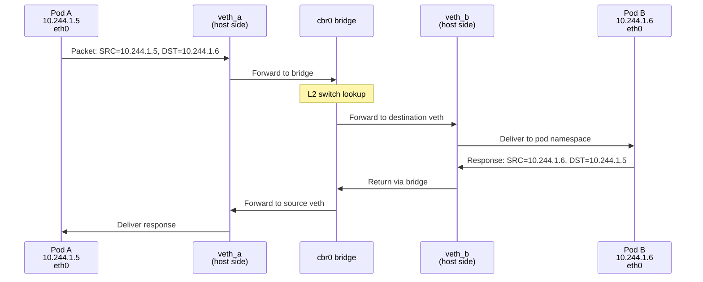

**Linux commands to verify**:
```bash
# Show bridge and connected interfaces
$ brctl show cbr0
bridge name     bridge id               STP enabled     interfaces
cbr0            8000.0242ac110001       no              veth_a
                                                        veth_b
                                                        veth_c

# Show bridge forwarding table
$ brctl showmacs cbr0
port no mac addr                is local?       ageing timer
  1     02:42:ac:11:00:05       yes                0.00
  2     02:42:ac:11:00:06       yes                0.00
```

### **Traffic Flow #2: Pod-to-Pod (Different Nodes)**

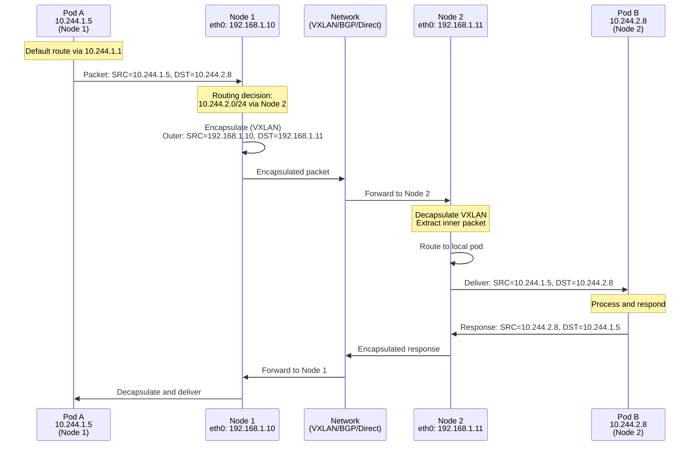

**Routing on Node 1**:
```bash
$ ip route
default via 192.168.1.1 dev eth0
10.244.1.0/24 dev cbr0 proto kernel scope link src 10.244.1.1
10.244.2.0/24 via 192.168.1.11 dev eth0  # CNI-installed route
10.244.3.0/24 via 192.168.1.12 dev eth0
192.168.1.0/24 dev eth0 proto kernel scope link src 192.168.1.10
```

### **Traffic Flow #3: Pod-to-Service**

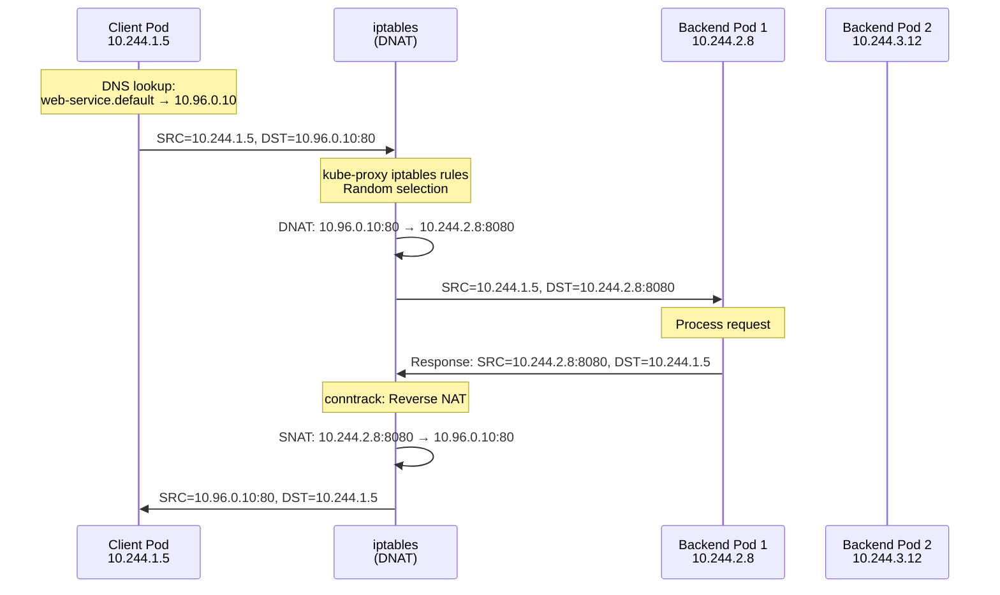

**iptables rules (simplified)**:
```bash
# Client accesses service ClusterIP
-A OUTPUT -d 10.96.0.10/32 -p tcp --dport 80 -j KUBE-SERVICES

# Service chain
-A KUBE-SERVICES -d 10.96.0.10/32 -p tcp --dport 80 -j KUBE-SVC-WEB

# Load balancing (50/50 for 2 backends)
-A KUBE-SVC-WEB -m statistic --mode random --probability 0.5 -j KUBE-SEP-1
-A KUBE-SVC-WEB -j KUBE-SEP-2

# Backend 1 DNAT
-A KUBE-SEP-1 -p tcp -j DNAT --to-destination 10.244.2.8:8080

# Backend 2 DNAT
-A KUBE-SEP-2 -p tcp -j DNAT --to-destination 10.244.3.12:8080
```

### **Traffic Flow #4: External-to-Service (NodePort)**

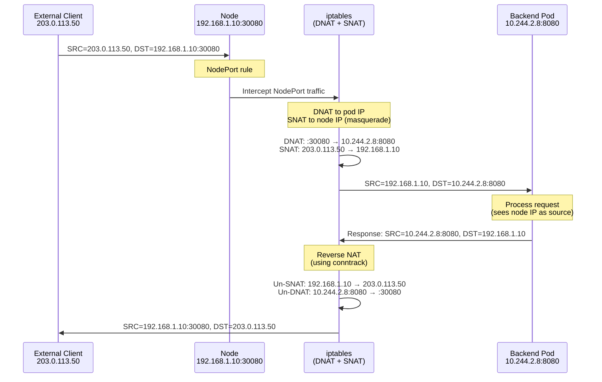

**Why SNAT for NodePort?**
- Without SNAT, pod responds directly to client
- Client sent packet to Node IP, expects response from Node IP
- SNAT makes pod see request from Node IP
- Response returns via Node, NAT reversed

**externalTrafficPolicy: Local** (no SNAT):
```yaml
apiVersion: v1
kind: Service
metadata:
  name: web-service
spec:
  type: NodePort
  externalTrafficPolicy: Local  # No SNAT, preserve client IP
  selector:
    app: web
  ports:
  - port: 80
    targetPort: 8080
    nodePort: 30080
```

Benefits:
- ✅ Pod sees real client IP (no SNAT)
- ✅ Better for logging, security
- ❌ Only routes to local pods (no cross-node load balancing)

━━━━━━━━━━━━━━━━━━━━━━━━━━━━━━━━━━━━━━━━━━━━━━━━━━━━━━━━━━━━━━━━━━━━━━━━━━━━━━

## **✅ Best Practices**

### **Network Design**

#### **1. Choose Appropriate CIDR Ranges**

```yaml
# Good: Non-overlapping ranges
clusterCIDR: 10.244.0.0/16      # 65,536 pod IPs
serviceCIDR: 10.96.0.0/12       # 1,048,576 service IPs
nodeCIDR: 192.168.1.0/24        # 254 node IPs
```

**Considerations**:
- ✅ Avoid RFC1918 ranges used by corporate networks
- ✅ Size pod CIDR for expected cluster growth
- ✅ Leave room for multiple clusters (multi-cluster)
- ✅ Document IP allocation for troubleshooting

#### **2. Select the Right CNI Plugin**

| Requirement | Recommended CNI |
|-------------|-----------------|
| **High performance, modern kernel** | Cilium (eBPF) |
| **BGP routing, on-premises** | Calico |
| **Simple overlay, learning** | Flannel |
| **Cloud (AWS)** | AWS VPC CNI |
| **Cloud (Azure)** | Azure CNI |
| **NetworkPolicy enforcement** | Calico, Cilium, Weave |
| **L7 visibility** | Cilium |
| **Encryption** | Calico Wireguard, Cilium IPsec |

#### **3. Enable NetworkPolicy**

```yaml
# Default deny all ingress
apiVersion: networking.k8s.io/v1
kind: NetworkPolicy
metadata:
  name: default-deny-ingress
  namespace: production
spec:
  podSelector: {}  # All pods in namespace
  policyTypes:
  - Ingress
  # Empty ingress: [] means deny all
```

**Best practices**:
- Start with default deny
- Explicitly allow required traffic
- Test policies in staging first
- Document policy intent

#### **4. Use Services for Discovery**

```yaml
# Good: Use service DNS names
env:
- name: DATABASE_URL
  value: "postgres://postgres.database.svc.cluster.local:5432/mydb"

# Bad: Hardcode pod IPs
env:
- name: DATABASE_URL
  value: "postgres://10.244.2.8:5432/mydb"  # Pod IP changes!
```

#### **5. Configure Appropriate DNS**

```yaml
# For external API calls
apiVersion: v1
kind: Pod
metadata:
  name: api-client
spec:
  dnsConfig:
    options:
    - name: ndots
      value: "1"  # Reduce DNS queries for external domains
  containers:
  - name: client
    image: api-client:1.0
```

### **Performance Optimization**

#### **1. Use IPVS for Large Clusters**

```bash
# kube-proxy configuration
apiVersion: kubeproxy.config.k8s.io/v1alpha1
kind: KubeProxyConfiguration
mode: "ipvs"  # Default: iptables
ipvs:
  scheduler: "rr"  # Round-robin
```

**When to use IPVS**:
- ✅ >1000 services
- ✅ High connection rate
- ✅ Better load balancing algorithms

#### **2. Enable Connection Tracking**

```bash
# Increase conntrack limits on nodes
sysctl -w net.netfilter.nf_conntrack_max=1000000
sysctl -w net.netfilter.nf_conntrack_tcp_timeout_established=86400
```

#### **3. Use NodeLocal DNSCache**

Deploy NodeLocal DNSCache to reduce DNS query latency:

```yaml
apiVersion: apps/v1
kind: DaemonSet
metadata:
  name: node-local-dns
  namespace: kube-system
spec:
  selector:
    matchLabels:
      k8s-app: node-local-dns
  template:
    spec:
      hostNetwork: true
      # ... (NodeLocal DNSCache config)
```

**Benefits**:
- ✅ Reduces DNS query latency (local cache)
- ✅ Reduces load on CoreDNS
- ✅ Handles DNS query spikes

### **Security Hardening**

#### **1. Enable Encryption**

```yaml
# Calico with Wireguard
apiVersion: projectcalico.org/v3
kind: FelixConfiguration
metadata:
  name: default
spec:
  wireguardEnabled: true
  wireguardInterfaceName: wg0
```

#### **2. Restrict External Access**

```yaml
# Only allow specific external IPs
apiVersion: networking.k8s.io/v1
kind: NetworkPolicy
metadata:
  name: allow-external-api
spec:
  podSelector:
    matchLabels:
      app: backend
  policyTypes:
  - Egress
  egress:
  - to:
    - ipBlock:
        cidr: 203.0.113.0/24  # Allowed external range
    ports:
    - protocol: TCP
      port: 443
```

#### **3. Use LoadBalancer Source Ranges**

```yaml
apiVersion: v1
kind: Service
metadata:
  name: web-service
spec:
  type: LoadBalancer
  loadBalancerSourceRanges:
  - "203.0.113.0/24"  # Only allow these IPs
  ports:
  - port: 80
    targetPort: 8080
```

### **Monitoring and Observability**

#### **1. Monitor Network Metrics**

```prometheus
# Prometheus queries for network health

# Pod network errors
rate(container_network_receive_errors_total[5m])

# DNS query latency
histogram_quantile(0.99, rate(coredns_dns_request_duration_seconds_bucket[5m]))

# Service endpoint availability
kube_endpoint_address_available{namespace="production"}

# NetworkPolicy rule hits (Cilium)
rate(cilium_policy_l3_l4_accept[5m])
```

#### **2. Enable Flow Logs** (Cilium Hubble)

```yaml
# Cilium with Hubble
apiVersion: v1
kind: ConfigMap
metadata:
  name: cilium-config
  namespace: kube-system
data:
  enable-hubble: "true"
  hubble-listen-address: ":4244"
  hubble-metrics-server: ":9091"
```

**View flows**:
```bash
$ hubble observe --namespace production
Nov 16 10:23:45: default/web-pod-1 -> production/db-pod-1:3306 (tcp SYN)
Nov 16 10:23:45: production/db-pod-1:3306 -> default/web-pod-1 (tcp SYN-ACK)
```

━━━━━━━━━━━━━━━━━━━━━━━━━━━━━━━━━━━━━━━━━━━━━━━━━━━━━━━━━━━━━━━━━━━━━━━━━━━━━━

## **🔧 Troubleshooting**

### **Common Issues and Solutions**

#### **Issue 1: Pods Can't Communicate**

**Symptoms**:
```bash
$ kubectl exec pod-a -- ping 10.244.2.8
PING 10.244.2.8 (10.244.2.8): 56 data bytes
^C
--- 10.244.2.8 ping statistics ---
10 packets transmitted, 0 packets received, 100% packet loss
```

**Diagnosis**:

```bash
# 1. Check pod IP
$ kubectl get pod pod-a -o wide
NAME    READY   STATUS    IP            NODE
pod-a   1/1     Running   10.244.1.5    node-1

# 2. Check CNI plugin status
$ kubectl -n kube-system get pods -l k8s-app=calico-node
NAME                READY   STATUS    RESTARTS   AGE
calico-node-abc     1/1     Running   0          5d

# 3. Check routes on node
$ ssh node-1
$ ip route | grep 10.244.2.0
10.244.2.0/24 via 192.168.1.11 dev eth0

# 4. Test connectivity from node
$ ping 10.244.2.8
# If this fails, CNI routing is broken

# 5. Check iptables rules
$ iptables -L -n -v | grep 10.244.2.8
```

**Solutions**:
- Restart CNI DaemonSet pods
- Check CNI configuration in `/etc/cni/net.d/`
- Verify network connectivity between nodes
- Check for NetworkPolicy blocking traffic

#### **Issue 2: DNS Resolution Failing**

**Symptoms**:
```bash
$ kubectl exec pod-a -- nslookup web-service
Server:    10.96.0.10
Address:   10.96.0.10:53

** server can't find web-service.default.svc.cluster.local: NXDOMAIN
```

**Diagnosis**:

```bash
# 1. Check CoreDNS pods
$ kubectl -n kube-system get pods -l k8s-app=kube-dns
NAME                       READY   STATUS    RESTARTS   AGE
coredns-6d4b75cb6d-abc     1/1     Running   0          5d
coredns-6d4b75cb6d-def     1/1     Running   0          5d

# 2. Check CoreDNS service
$ kubectl -n kube-system get svc kube-dns
NAME       TYPE        CLUSTER-IP   EXTERNAL-IP   PORT(S)         AGE
kube-dns   ClusterIP   10.96.0.10   <none>        53/UDP,53/TCP   30d

# 3. Test DNS from pod
$ kubectl exec pod-a -- cat /etc/resolv.conf
nameserver 10.96.0.10
search default.svc.cluster.local svc.cluster.local cluster.local

# 4. Test CoreDNS directly
$ kubectl exec pod-a -- nslookup kubernetes.default 10.96.0.10
# If this works, CoreDNS is fine

# 5. Check CoreDNS logs
$ kubectl -n kube-system logs -l k8s-app=kube-dns
```

**Solutions**:
- Restart CoreDNS pods
- Check CoreDNS configuration (Corefile)
- Verify pod can reach CoreDNS ClusterIP
- Check NetworkPolicy not blocking DNS

#### **Issue 3: Service Not Accessible**

**Symptoms**:
```bash
$ kubectl exec pod-a -- curl http://web-service
curl: (7) Failed to connect to web-service port 80: Connection refused
```

**Diagnosis**:

```bash
# 1. Check service exists
$ kubectl get svc web-service
NAME          TYPE        CLUSTER-IP    EXTERNAL-IP   PORT(S)   AGE
web-service   ClusterIP   10.96.0.10    <none>        80/TCP    5m

# 2. Check endpoints
$ kubectl get endpoints web-service
NAME          ENDPOINTS                         AGE
web-service   10.244.1.5:8080,10.244.2.8:8080   5m
# Empty endpoints = no matching pods!

# 3. Check pod labels match service selector
$ kubectl get svc web-service -o yaml | grep -A 2 selector
selector:
  app: web

$ kubectl get pods -l app=web
NAME       READY   STATUS    RESTARTS   AGE
web-pod-1  1/1     Running   0          5m
web-pod-2  1/1     Running   0          5m

# 4. Check kube-proxy
$ kubectl -n kube-system get pods -l k8s-app=kube-proxy
NAME                READY   STATUS    RESTARTS   AGE
kube-proxy-abc      1/1     Running   0          30d

# 5. Check iptables rules (on node)
$ iptables-save | grep web-service
```

**Solutions**:
- Fix service selector to match pod labels
- Ensure pods are running and ready
- Restart kube-proxy if rules missing
- Check NetworkPolicy not blocking service access

#### **Issue 4: NetworkPolicy Not Working**

**Symptoms**:
```bash
# Applied deny-all policy, but pods still accessible
$ kubectl exec attacker-pod -- curl http://victim-pod
HTTP/1.1 200 OK
```

**Diagnosis**:

```bash
# 1. Check CNI supports NetworkPolicy
$ kubectl get pods -n kube-system -l k8s-app=calico-node
# If no Calico/Cilium/Weave, NetworkPolicy won't work

# 2. Check policy exists
$ kubectl get networkpolicy
NAME                POD-SELECTOR   AGE
deny-all-ingress    <all>          5m

# 3. Check policy details
$ kubectl describe networkpolicy deny-all-ingress

# 4. Check pod labels match policy selector
$ kubectl get pods --show-labels
```

**Solutions**:
- Install CNI that supports NetworkPolicy
- Verify policy selector matches pods
- Check policy syntax (ingress/egress)
- Test with explicit allow rules

### **Debugging Tools**

#### **tcpdump on Node**

```bash
# Capture traffic on bridge
$ tcpdump -i cbr0 -n
tcpdump: verbose output suppressed, use -v or -vv for full protocol decode
listening on cbr0, link-type EN10MB (Ethernet), capture size 262144 bytes
10:23:45.123456 IP 10.244.1.5.12345 > 10.244.2.8.80: Flags [S], seq 123456
```

#### **nsenter for Pod Network**

```bash
# Get pod's network namespace
$ crictl pods --name nginx-pod
POD ID              NAME
abc123def456        nginx-pod

# Inspect namespace
$ crictl inspectp abc123def456 | grep -i "network_namespace"
  "network_namespace": "/var/run/netns/cni-abc123"

# Execute in pod's namespace
$ nsenter --net=/var/run/netns/cni-abc123 ip addr
$ nsenter --net=/var/run/netns/cni-abc123 iptables -L
$ nsenter --net=/var/run/netns/cni-abc123 tcpdump -i eth0
```

#### **Cilium/Hubble (if using Cilium)**

```bash
# Install Hubble CLI
$ hubble observe --namespace production

# Monitor connectivity issues
$ hubble observe --type drop

# Check NetworkPolicy enforcement
$ hubble observe --verdict DENIED
```

━━━━━━━━━━━━━━━━━━━━━━━━━━━━━━━━━━━━━━━━━━━━━━━━━━━━━━━━━━━━━━━━━━━━━━━━━━━━━━

## **📚 Summary**

### **Key Takeaways**

1. **Kubernetes Networking Model**:
   - Flat network: every pod gets unique IP
   - No NAT for pod-to-pod communication
   - CNI plugins implement the model

2. **Components**:
   - **Pods**: Network namespace with eth0 interface
   - **Services**: Stable ClusterIP for pod groups
   - **kube-proxy**: Service implementation (iptables/IPVS)
   - **CoreDNS**: Service discovery and DNS
   - **CNI**: Pod network setup (veth, routes, IP)

3. **Traffic Flows**:
   - Pod → Pod: Direct routing (same/different nodes)
   - Pod → Service: iptables DNAT to backend pods
   - External → Service: NodePort/LoadBalancer

4. **Best Practices**:
   - Choose CNI based on requirements
   - Enable NetworkPolicy for security
   - Use services for discovery
   - Monitor network metrics

### **Next Steps**

Continue learning about Kubernetes networking:

1. **[02-network-policy-architecture.md](high-level/02-network-policy-architecture.md)**: NetworkPolicy API and enforcement
2. **[01-network-policies.md](middle-level/01-network-policies.md)**: Writing effective network policies
3. **[02-policy-controllers.md](middle-level/02-policy-controllers.md)**: CNI plugin comparison (Calico, Cilium)
4. **[kube-proxy docs](../../kube-proxy/)**: Deep dive into Service implementation

### **Related Documentation**

- **CNI Overview**: `01-cni-networking-overview.md`
- **kube-proxy**: `docs/architecture/claude/kube-proxy/`
- **kubelet**: `docs/architecture/claude/kubelet/`

━━━━━━━━━━━━━━━━━━━━━━━━━━━━━━━━━━━━━━━━━━━━━━━━━━━━━━━━━━━━━━━━━━━━━━━━━━━━━━

**📅 Last Updated**: 2025-11-16
**📝 Kubernetes Version**: v1.28+
**👤 Author**: Claude AI (Sonnet 4.5)
**🔗 Repository**: kubernetes/kubernetes

━━━━━━━━━━━━━━━━━━━━━━━━━━━━━━━━━━━━━━━━━━━━━━━━━━━━━━━━━━━━━━━━━━━━━━━━━━━━━━
