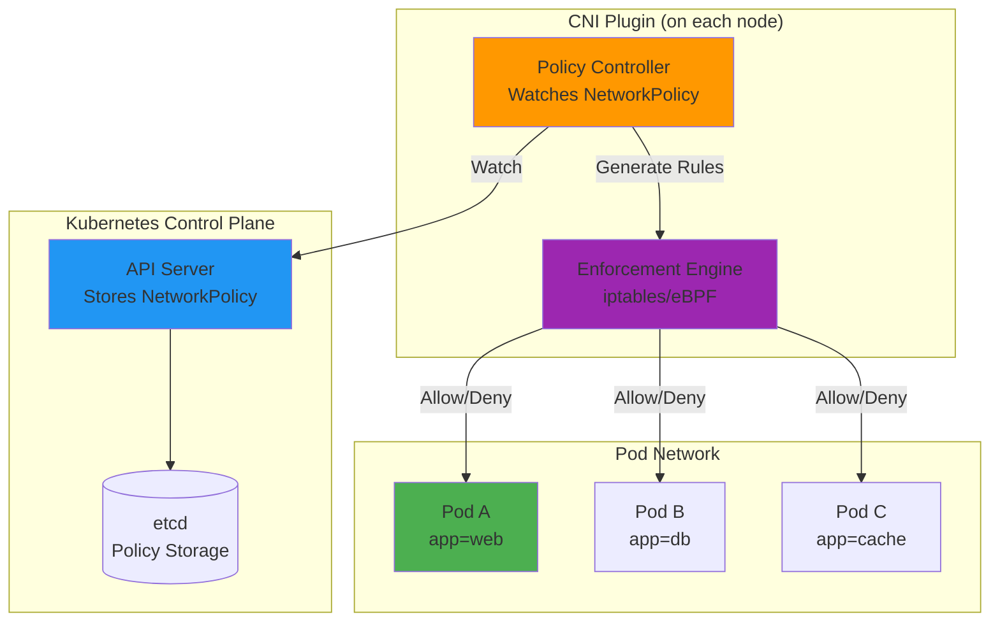
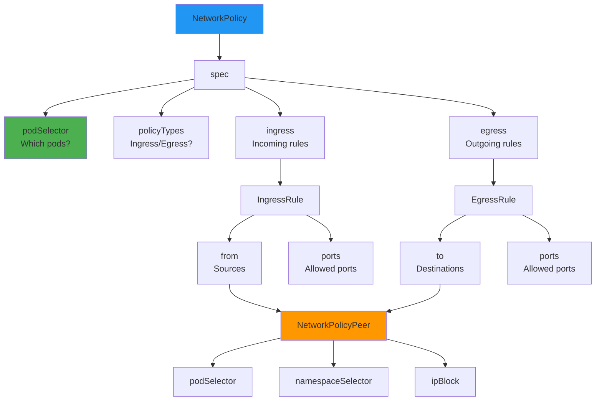
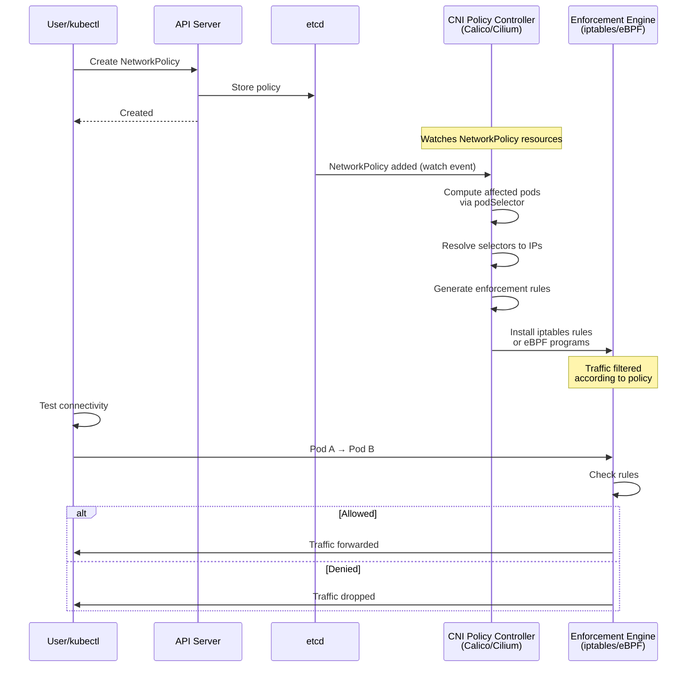
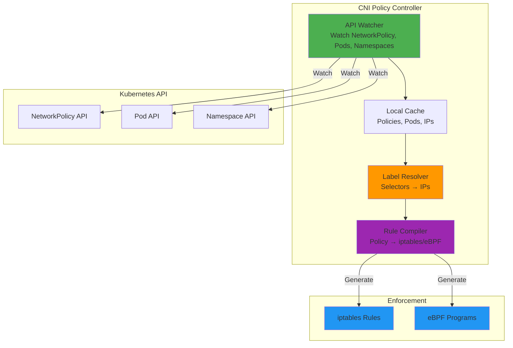
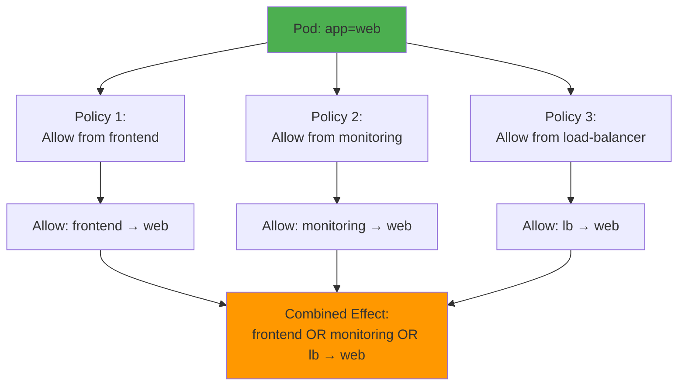
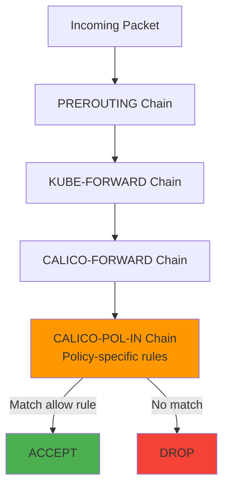
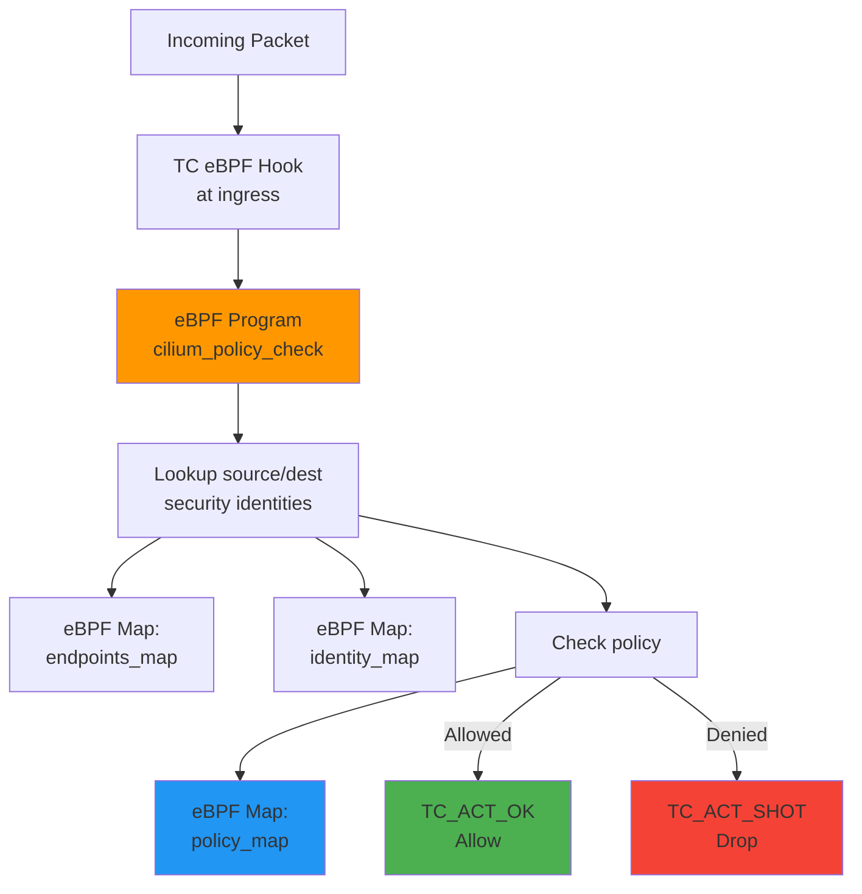

# **NETWORK POLICY ARCHITECTURE**

**Kubernetes NetworkPolicy Resource Design and Enforcement Model**

━━━━━━━━━━━━━━━━━━━━━━━━━━━━━━━━━━━━━━━━━━━━━━━━━━━━━━━━━━━━━━━━━━━━━━━━━━━━━━

## **🎯 Purpose**

This document explains the architecture of Kubernetes NetworkPolicy resources, how they're defined, stored, and enforced by CNI plugins to provide network segmentation and security.

**What You'll Learn**:
- ✅ NetworkPolicy API design and structure
- ✅ How NetworkPolicy resources are processed
- ✅ The policy controller pattern used by CNI plugins
- ✅ Ingress and egress rule semantics
- ✅ Pod and namespace selector mechanisms
- ✅ How multiple policies combine
- ✅ Implementation patterns across different CNIs

**Prerequisites**:
- Understanding of Kubernetes networking basics
- Familiarity with Kubernetes API resources
- Basic knowledge of iptables or eBPF concepts

━━━━━━━━━━━━━━━━━━━━━━━━━━━━━━━━━━━━━━━━━━━━━━━━━━━━━━━━━━━━━━━━━━━━━━━━━━━━━━

## **📋 Table of Contents**

1. [NetworkPolicy Overview](#networkpolicy-overview)
2. [API Design](#api-design)
3. [Policy Controller Architecture](#policy-controller-architecture)
4. [Ingress Rules](#ingress-rules)
5. [Egress Rules](#egress-rules)
6. [Selector Mechanisms](#selector-mechanisms)
7. [Policy Combination](#policy-combination)
8. [Enforcement Models](#enforcement-models)
9. [Best Practices](#best-practices)
10. [Troubleshooting](#troubleshooting)

━━━━━━━━━━━━━━━━━━━━━━━━━━━━━━━━━━━━━━━━━━━━━━━━━━━━━━━━━━━━━━━━━━━━━━━━━━━━━━

## **🌐 NetworkPolicy Overview**

### **What is NetworkPolicy?**

NetworkPolicy is a Kubernetes API resource that specifies how groups of pods are allowed to communicate with each other and other network endpoints.



### **Key Characteristics**

**Namespace-scoped**: NetworkPolicies apply to pods within a namespace
```yaml
apiVersion: networking.k8s.io/v1
kind: NetworkPolicy
metadata:
  name: allow-web-to-db
  namespace: production  # Only affects production namespace
```

**Additive**: Multiple policies combine (OR logic)
- If NO policies select a pod → all traffic allowed
- If ANY policy selects a pod → default deny, then allowed by rules

**Layer 3/4 only**: NetworkPolicy operates at network and transport layers
- ✅ IP addresses (CIDR blocks)
- ✅ Protocols (TCP, UDP, SCTP)
- ✅ Ports (80, 443, 3306, etc.)
- ❌ Layer 7 (HTTP paths, headers) - use service mesh

**Stateful**: Return traffic is automatically allowed
- If pod A → pod B allowed, then pod B → pod A response allowed

### **NetworkPolicy vs Security Groups**

| Feature | NetworkPolicy | Cloud Security Groups |
|---------|---------------|----------------------|
| **Scope** | Pod-level | Instance/ENI-level |
| **Management** | Kubernetes YAML | Cloud provider API |
| **Selectors** | Label-based | Tag/ID-based |
| **Portability** | Cloud-agnostic | Cloud-specific |
| **Layer** | L3/L4 | L3/L4 |
| **Enforcement** | CNI plugin | Cloud SDN |

━━━━━━━━━━━━━━━━━━━━━━━━━━━━━━━━━━━━━━━━━━━━━━━━━━━━━━━━━━━━━━━━━━━━━━━━━━━━━━

## **📜 API Design**

### **NetworkPolicy Resource Structure**

**File**: `/staging/src/k8s.io/api/networking/v1/types.go`

```go
// NetworkPolicy describes what network traffic is allowed for a set of Pods
type NetworkPolicy struct {
    metav1.TypeMeta `json:",inline"`
    metav1.ObjectMeta `json:"metadata,omitempty"`

    // spec represents the specification of the desired behavior for this NetworkPolicy.
    Spec NetworkPolicySpec `json:"spec,omitempty"`
}

// NetworkPolicySpec provides the specification of a NetworkPolicy
type NetworkPolicySpec struct {
    // podSelector selects the pods to which this NetworkPolicy object applies.
    // The array of rules is applied to any pods selected by this field.
    // An empty selector matches all pods in the policy's namespace.
    PodSelector metav1.LabelSelector `json:"podSelector"`

    // ingress is a list of ingress rules to be applied to the selected pods.
    // Traffic is allowed to a pod if there are no NetworkPolicies selecting the pod
    // (and cluster policy otherwise allows the traffic), OR if the traffic source is
    // the pod's local node, OR if the traffic matches at least one ingress rule.
    Ingress []NetworkPolicyIngressRule `json:"ingress,omitempty"`

    // egress is a list of egress rules to be applied to the selected pods.
    // Outgoing traffic is allowed if there are no NetworkPolicies selecting the pod
    // (and cluster policy otherwise allows the traffic), OR if the traffic matches
    // at least one egress rule.
    Egress []NetworkPolicyEgressRule `json:"egress,omitempty"`

    // policyTypes is a list of rule types that the NetworkPolicy relates to.
    // Valid options are ["Ingress"], ["Egress"], or ["Ingress", "Egress"].
    PolicyTypes []PolicyType `json:"policyTypes,omitempty"`
}
```

**Location**: `/staging/src/k8s.io/api/networking/v1/types.go:30-106`

### **Complete NetworkPolicy Example**

```yaml
apiVersion: networking.k8s.io/v1
kind: NetworkPolicy
metadata:
  name: comprehensive-policy
  namespace: production
spec:
  # SELECT: Which pods this policy applies to
  podSelector:
    matchLabels:
      app: web
      tier: frontend

  # POLICY TYPES: What kind of traffic to control
  policyTypes:
  - Ingress  # Control incoming traffic
  - Egress   # Control outgoing traffic

  # INGRESS: Allow incoming traffic from specific sources
  ingress:
  - from:
    # Source 1: Pods with specific labels
    - podSelector:
        matchLabels:
          role: load-balancer
    # Source 2: Pods in specific namespaces
    - namespaceSelector:
        matchLabels:
          environment: production
      podSelector:
        matchLabels:
          role: monitoring
    # Source 3: Specific IP ranges
    - ipBlock:
        cidr: 203.0.113.0/24
        except:
        - 203.0.113.10/32
    ports:
    - protocol: TCP
      port: 80
    - protocol: TCP
      port: 443

  # EGRESS: Allow outgoing traffic to specific destinations
  egress:
  - to:
    # Destination 1: Database pods
    - podSelector:
        matchLabels:
          app: postgres
    ports:
    - protocol: TCP
      port: 5432
  - to:
    # Destination 2: External API
    - ipBlock:
        cidr: 192.0.2.0/24
    ports:
    - protocol: TCP
      port: 443
  # Egress for DNS (always needed!)
  - to:
    - namespaceSelector:
        matchLabels:
          name: kube-system
      podSelector:
        matchLabels:
          k8s-app: kube-dns
    ports:
    - protocol: UDP
      port: 53
```

### **API Components Breakdown**



### **NetworkPolicyPort Structure**

```go
// NetworkPolicyPort describes a port to allow traffic on
type NetworkPolicyPort struct {
    // protocol represents the protocol (TCP, UDP, or SCTP) which traffic must match.
    // If not specified, this field defaults to TCP.
    Protocol *v1.Protocol `json:"protocol,omitempty"`

    // port represents the port on the given protocol. This can either be a numerical or named
    // port on a pod. If this field is not provided, this matches all port names and numbers.
    Port *intstr.IntOrString `json:"port,omitempty"`

    // endPort indicates that the range of ports from port to endPort if set, inclusive,
    // should be allowed by the policy. This field cannot be defined if the port field
    // is not defined or if the port field is defined as a named (string) port.
    // The endPort must be equal or greater than port.
    EndPort *int32 `json:"endPort,omitempty"`
}
```

**Location**: `/staging/src/k8s.io/api/networking/v1/types.go:153-173`

**Port examples**:
```yaml
# Numeric port
ports:
- protocol: TCP
  port: 8080

# Named port (references container's portName)
ports:
- protocol: TCP
  port: http  # Matches containerPort.name: http

# Port range (Kubernetes 1.25+)
ports:
- protocol: TCP
  port: 8000
  endPort: 9000  # Allows 8000-9000
```

### **NetworkPolicyPeer Structure**

```go
// NetworkPolicyPeer describes a peer to allow traffic to/from.
// Only certain combinations of fields are allowed
type NetworkPolicyPeer struct {
    // podSelector is a label selector which selects pods.
    // This field follows standard label selector semantics;
    // if present but empty, it selects all pods.
    PodSelector *metav1.LabelSelector `json:"podSelector,omitempty"`

    // namespaceSelector selects namespaces using cluster-scoped labels.
    // This field follows standard label selector semantics;
    // if present but empty, it selects all namespaces.
    NamespaceSelector *metav1.LabelSelector `json:"namespaceSelector,omitempty"`

    // ipBlock defines policy on a particular IPBlock.
    // If this field is set then neither of the other fields can be.
    IPBlock *IPBlock `json:"ipBlock,omitempty"`
}
```

**Location**: `/staging/src/k8s.io/api/networking/v1/types.go:191-216`

**Peer combinations**:

| podSelector | namespaceSelector | ipBlock | Meaning |
|-------------|-------------------|---------|---------|
| ✅ | ❌ | ❌ | Pods in same namespace |
| ❌ | ✅ | ❌ | All pods in matching namespaces |
| ✅ | ✅ | ❌ | Pods matching labels in matching namespaces |
| ❌ | ❌ | ✅ | IP CIDR range |
| ✅/✅ | ❌/❌ | ✅ | ❌ INVALID |

━━━━━━━━━━━━━━━━━━━━━━━━━━━━━━━━━━━━━━━━━━━━━━━━━━━━━━━━━━━━━━━━━━━━━━━━━━━━━━

## **🏗️ Policy Controller Architecture**

### **How NetworkPolicy is Enforced**

Kubernetes **does not enforce** NetworkPolicy itself. CNI plugins implement policy controllers that watch NetworkPolicy resources and enforce them.



### **Policy Controller Components**



### **Controller Responsibilities**

**1. Watch Kubernetes Resources**
```go
// Pseudo-code for CNI policy controller
func (c *PolicyController) Run() {
    // Watch NetworkPolicy resources
    policyInformer.AddEventHandler(cache.ResourceEventHandlerFuncs{
        AddFunc:    c.onPolicyAdd,
        UpdateFunc: c.onPolicyUpdate,
        DeleteFunc: c.onPolicyDelete,
    })

    // Watch Pod resources (to resolve selectors)
    podInformer.AddEventHandler(cache.ResourceEventHandlerFuncs{
        AddFunc:    c.onPodAdd,
        UpdateFunc: c.onPodUpdate,
        DeleteFunc: c.onPodDelete,
    })

    // Watch Namespace resources (for namespaceSelector)
    namespaceInformer.AddEventHandler(cache.ResourceEventHandlerFuncs{
        AddFunc:    c.onNamespaceAdd,
        UpdateFunc: c.onNamespaceUpdate,
        DeleteFunc: c.onNamespaceDelete,
    })
}
```

**2. Resolve Selectors to IPs**
```go
func (c *PolicyController) resolvePodSelector(
    namespace string,
    selector *metav1.LabelSelector) []string {

    // Find all pods matching selector in namespace
    pods := c.podLister.Pods(namespace).List(selector)

    // Extract IPs
    var ips []string
    for _, pod := range pods {
        if pod.Status.PodIP != "" {
            ips = append(ips, pod.Status.PodIP)
        }
    }
    return ips
}
```

**3. Compile Rules**
```go
func (c *PolicyController) compilePolicyToRules(
    policy *networkingv1.NetworkPolicy) []EnforcementRule {

    var rules []EnforcementRule

    // Get pods selected by this policy
    selectedPods := c.resolvePodSelector(
        policy.Namespace,
        &policy.Spec.PodSelector)

    // Process ingress rules
    for _, ingressRule := range policy.Spec.Ingress {
        for _, from := range ingressRule.From {
            sourcePods := c.resolvePeer(from, policy.Namespace)

            for _, port := range ingressRule.Ports {
                rule := EnforcementRule{
                    Direction: "ingress",
                    Sources:   sourcePods,
                    Destinations: selectedPods,
                    Protocol:  port.Protocol,
                    Port:      port.Port,
                    Action:    "allow",
                }
                rules = append(rules, rule)
            }
        }
    }

    return rules
}
```

**4. Install Enforcement Rules**
```go
func (c *PolicyController) installRules(rules []EnforcementRule) error {
    // For iptables-based CNIs
    for _, rule := range rules {
        iptablesCmd := fmt.Sprintf(
            "iptables -A FORWARD -s %s -d %s -p %s --dport %d -j ACCEPT",
            rule.Sources,
            rule.Destinations,
            rule.Protocol,
            rule.Port,
        )
        exec.Command("iptables", iptablesCmd).Run()
    }

    // For eBPF-based CNIs (Cilium)
    // Install eBPF programs and update maps
    return nil
}
```

### **Scaling Considerations**

**Problem**: Label selectors can match many pods
```yaml
# This selector might match 1000s of pods
spec:
  ingress:
  - from:
    - namespaceSelector:
        matchLabels:
          environment: production
      podSelector: {}  # All pods in production namespaces!
```

**Solutions**:

1. **IP Sets** (iptables optimization)
```bash
# Instead of 1000 iptables rules:
# -A FORWARD -s 10.244.1.5 -j ACCEPT
# -A FORWARD -s 10.244.1.6 -j ACCEPT
# ... (1000 rules)

# Use ipset:
ipset create prod-pods hash:ip
ipset add prod-pods 10.244.1.5
ipset add prod-pods 10.244.1.6
# ... (1000 entries)

iptables -A FORWARD -m set --match-set prod-pods src -j ACCEPT
# Just 1 rule!
```

2. **eBPF Maps** (Cilium approach)
```c
// eBPF map storing allowed source IPs
BPF_HASH(allowed_sources, __u32, __u8);

// Check in eBPF program
if (bpf_map_lookup_elem(&allowed_sources, &src_ip)) {
    return TC_ACT_OK;  // Allow
}
return TC_ACT_SHOT;  // Drop
```

3. **Incremental Updates**
- Only update rules for affected pods
- Batch updates to reduce churn
- Use eventual consistency models

━━━━━━━━━━━━━━━━━━━━━━━━━━━━━━━━━━━━━━━━━━━━━━━━━━━━━━━━━━━━━━━━━━━━━━━━━━━━━━

## **🔽 Ingress Rules**

### **Ingress Rule Structure**

```go
// NetworkPolicyIngressRule describes a particular set of traffic that is allowed
// to the pods matched by a NetworkPolicySpec's podSelector.
// The traffic must match both ports and from.
type NetworkPolicyIngressRule struct {
    // ports is a list of ports which should be made accessible on the pods selected for
    // this rule. Each item in this list is combined using a logical OR.
    Ports []NetworkPolicyPort `json:"ports,omitempty"`

    // from is a list of sources which should be able to access the pods selected for this rule.
    // Items in this list are combined using a logical OR operation.
    From []NetworkPolicyPeer `json:"from,omitempty"`
}
```

**Location**: `/staging/src/k8s.io/api/networking/v1/types.go:108-128`

### **Ingress Rule Semantics**

```
Traffic is ALLOWED if:
  (Source matches ANY from[] entry)
  AND
  (Destination port matches ANY ports[] entry)
```

**Example**:
```yaml
spec:
  podSelector:
    matchLabels:
      app: web
  ingress:
  - from:
    - podSelector:
        matchLabels:
          role: frontend
    - podSelector:
        matchLabels:
          role: monitoring
    ports:
    - protocol: TCP
      port: 80
    - protocol: TCP
      port: 443
```

**Interpretation**:
- Allow traffic to `app=web` pods
- From: `role=frontend` OR `role=monitoring` pods
- To ports: 80 OR 443
- Protocol: TCP

**Traffic matrix**:
```
frontend:80  → web:80   ✅ ALLOWED
frontend:443 → web:443  ✅ ALLOWED
frontend:8080→ web:8080 ❌ DENIED (port not in list)
monitoring:80→ web:80   ✅ ALLOWED
attacker:80  → web:80   ❌ DENIED (source not in list)
```

### **Default Deny Ingress**

```yaml
# Deny all ingress to selected pods
apiVersion: networking.k8s.io/v1
kind: NetworkPolicy
metadata:
  name: default-deny-ingress
spec:
  podSelector: {}  # All pods in namespace
  policyTypes:
  - Ingress
  # No ingress rules = deny all
```

**Effect**:
- All pods in namespace isolated for ingress
- No incoming traffic allowed
- Must create allow rules explicitly

### **Allow All Ingress**

```yaml
# Allow all ingress to selected pods
apiVersion: networking.k8s.io/v1
kind: NetworkPolicy
metadata:
  name: allow-all-ingress
spec:
  podSelector: {}
  policyTypes:
  - Ingress
  ingress:
  - {}  # Empty rule = allow from anywhere
```

### **Common Ingress Patterns**

**Pattern 1: Allow from specific pods**
```yaml
apiVersion: networking.k8s.io/v1
kind: NetworkPolicy
metadata:
  name: allow-from-frontend
  namespace: backend
spec:
  podSelector:
    matchLabels:
      app: api
  ingress:
  - from:
    - podSelector:
        matchLabels:
          app: frontend
    ports:
    - protocol: TCP
      port: 8080
```

**Pattern 2: Allow from specific namespace**
```yaml
apiVersion: networking.k8s.io/v1
kind: NetworkPolicy
metadata:
  name: allow-from-monitoring
spec:
  podSelector:
    matchLabels:
      app: database
  ingress:
  - from:
    - namespaceSelector:
        matchLabels:
          name: monitoring
    ports:
    - protocol: TCP
      port: 9090  # Prometheus scrape
```

**Pattern 3: Allow from external IPs**
```yaml
apiVersion: networking.k8s.io/v1
kind: NetworkPolicy
metadata:
  name: allow-from-office
spec:
  podSelector:
    matchLabels:
      app: admin-panel
  ingress:
  - from:
    - ipBlock:
        cidr: 203.0.113.0/24  # Office network
    ports:
    - protocol: TCP
      port: 443
```

**Pattern 4: Multi-tier application**
```yaml
# Frontend → Backend → Database
---
# Database: Only allow from backend
apiVersion: networking.k8s.io/v1
kind: NetworkPolicy
metadata:
  name: db-allow-backend
  namespace: production
spec:
  podSelector:
    matchLabels:
      tier: database
  ingress:
  - from:
    - podSelector:
        matchLabels:
          tier: backend
    ports:
    - protocol: TCP
      port: 5432
---
# Backend: Only allow from frontend
apiVersion: networking.k8s.io/v1
kind: NetworkPolicy
metadata:
  name: backend-allow-frontend
  namespace: production
spec:
  podSelector:
    matchLabels:
      tier: backend
  ingress:
  - from:
    - podSelector:
        matchLabels:
          tier: frontend
    ports:
    - protocol: TCP
      port: 8080
---
# Frontend: Allow from external load balancer
apiVersion: networking.k8s.io/v1
kind: NetworkPolicy
metadata:
  name: frontend-allow-external
  namespace: production
spec:
  podSelector:
    matchLabels:
      tier: frontend
  ingress:
  - from:
    - ipBlock:
        cidr: 0.0.0.0/0  # Public access
    ports:
    - protocol: TCP
      port: 80
    - protocol: TCP
      port: 443
```

━━━━━━━━━━━━━━━━━━━━━━━━━━━━━━━━━━━━━━━━━━━━━━━━━━━━━━━━━━━━━━━━━━━━━━━━━━━━━━

## **🔼 Egress Rules**

### **Egress Rule Structure**

```go
// NetworkPolicyEgressRule describes a particular set of traffic that is allowed
// out of pods matched by a NetworkPolicySpec's podSelector.
// The traffic must match both ports and to.
type NetworkPolicyEgressRule struct {
    // ports is a list of destination ports for outgoing traffic.
    Ports []NetworkPolicyPort `json:"ports,omitempty"`

    // to is a list of destinations for outgoing traffic of pods selected for this rule.
    To []NetworkPolicyPeer `json:"to,omitempty"`
}
```

**Location**: `/staging/src/k8s.io/api/networking/v1/types.go:130-151`

### **Egress Rule Semantics**

```
Traffic is ALLOWED if:
  (Destination matches ANY to[] entry)
  AND
  (Destination port matches ANY ports[] entry)
```

### **Default Deny Egress**

```yaml
apiVersion: networking.k8s.io/v1
kind: NetworkPolicy
metadata:
  name: default-deny-egress
spec:
  podSelector: {}
  policyTypes:
  - Egress
  # No egress rules = deny all outgoing
```

**⚠️ Warning**: This blocks DNS! Always allow DNS egress.

### **Egress with DNS**

```yaml
apiVersion: networking.k8s.io/v1
kind: NetworkPolicy
metadata:
  name: allow-dns-and-api
spec:
  podSelector:
    matchLabels:
      app: web
  policyTypes:
  - Egress
  egress:
  # ALWAYS INCLUDE DNS!
  - to:
    - namespaceSelector:
        matchLabels:
          name: kube-system
      podSelector:
        matchLabels:
          k8s-app: kube-dns
    ports:
    - protocol: UDP
      port: 53
  # Allow to backend API
  - to:
    - podSelector:
        matchLabels:
          app: backend
    ports:
    - protocol: TCP
      port: 8080
```

### **Common Egress Patterns**

**Pattern 1: Allow to specific service**
```yaml
apiVersion: networking.k8s.io/v1
kind: NetworkPolicy
metadata:
  name: allow-to-database
spec:
  podSelector:
    matchLabels:
      app: backend
  policyTypes:
  - Egress
  egress:
  - to:
    - podSelector:
        matchLabels:
          app: postgres
    ports:
    - protocol: TCP
      port: 5432
  # Don't forget DNS!
  - to:
    - namespaceSelector: {}
      podSelector:
        matchLabels:
          k8s-app: kube-dns
    ports:
    - protocol: UDP
      port: 53
```

**Pattern 2: Allow to external API**
```yaml
apiVersion: networking.k8s.io/v1
kind: NetworkPolicy
metadata:
  name: allow-to-payment-gateway
spec:
  podSelector:
    matchLabels:
      app: payment-service
  policyTypes:
  - Egress
  egress:
  # External payment API
  - to:
    - ipBlock:
        cidr: 192.0.2.0/24  # Payment gateway IPs
    ports:
    - protocol: TCP
      port: 443
  # DNS
  - to:
    - namespaceSelector: {}
      podSelector:
        matchLabels:
          k8s-app: kube-dns
    ports:
    - protocol: UDP
      port: 53
```

**Pattern 3: Prevent data exfiltration**
```yaml
# Block all egress except approved services
apiVersion: networking.k8s.io/v1
kind: NetworkPolicy
metadata:
  name: prevent-exfiltration
  namespace: sensitive-data
spec:
  podSelector: {}
  policyTypes:
  - Egress
  egress:
  # Allow to other pods in same namespace
  - to:
    - podSelector: {}
  # Allow to specific external service only
  - to:
    - ipBlock:
        cidr: 203.0.113.50/32  # Approved API server
    ports:
    - protocol: TCP
      port: 443
  # DNS
  - to:
    - namespaceSelector: {}
      podSelector:
        matchLabels:
          k8s-app: kube-dns
    ports:
    - protocol: UDP
      port: 53
  # Block everything else (no catch-all rule)
```

━━━━━━━━━━━━━━━━━━━━━━━━━━━━━━━━━━━━━━━━━━━━━━━━━━━━━━━━━━━━━━━━━━━━━━━━━━━━━━

## **🎯 Selector Mechanisms**

### **Pod Selector**

Selects pods using label selectors (standard Kubernetes label matching).

**Empty selector** = all pods in namespace:
```yaml
spec:
  podSelector: {}  # Matches all pods
```

**Label-based selector**:
```yaml
spec:
  podSelector:
    matchLabels:
      app: web
      version: v2
  # Matches pods with BOTH labels
```

**Expression-based selector**:
```yaml
spec:
  podSelector:
    matchExpressions:
    - key: app
      operator: In
      values:
      - web
      - api
    - key: environment
      operator: NotIn
      values:
      - development
```

### **Namespace Selector**

Selects namespaces using labels on Namespace resources.

**Label a namespace**:
```yaml
apiVersion: v1
kind: Namespace
metadata:
  name: production
  labels:
    environment: production
    team: platform
```

**Select by namespace labels**:
```yaml
spec:
  ingress:
  - from:
    - namespaceSelector:
        matchLabels:
          environment: production
```

### **Combined Selectors**

**Both podSelector AND namespaceSelector**:
```yaml
spec:
  ingress:
  - from:
    # Pods with role=monitoring in namespaces with environment=production
    - namespaceSelector:
        matchLabels:
          environment: production
      podSelector:
        matchLabels:
          role: monitoring
```

**Logical interpretation**:
```
Allow from:
  Pods matching podSelector
  IN
  Namespaces matching namespaceSelector
```

**Multiple peers (OR logic)**:
```yaml
spec:
  ingress:
  - from:
    # Source 1: monitoring pods in production namespaces
    - namespaceSelector:
        matchLabels:
          environment: production
      podSelector:
        matchLabels:
          role: monitoring
    # OR
    # Source 2: all pods in kube-system namespace
    - namespaceSelector:
        matchLabels:
          name: kube-system
    # OR
    # Source 3: specific IP range
    - ipBlock:
        cidr: 203.0.113.0/24
```

### **Selector Resolution Diagram**

```mermaid
graph TB
    START[NetworkPolicy Created]
    POD_SEL{podSelector<br/>in spec?}
    SELECTED_PODS[Selected Pods<br/>Policy applies to these]

    FROM_PEER{from[] peers}
    POD_SEL_FROM{Has<br/>podSelector?}
    NS_SEL_FROM{Has<br/>namespaceSelector?}
    IP_BLOCK{Has<br/>ipBlock?}

    POD_MATCH[Match pods<br/>in same namespace]
    NS_MATCH[Match all pods<br/>in matching namespaces]
    POD_NS_MATCH[Match pods<br/>in matching namespaces]
    IP_MATCH[Match IP range]

    COMBINE[Combine with OR<br/>All matching sources allowed]

    START --> POD_SEL
    POD_SEL -->|Yes| SELECTED_PODS
    SELECTED_PODS --> FROM_PEER

    FROM_PEER --> POD_SEL_FROM
    FROM_PEER --> NS_SEL_FROM
    FROM_PEER --> IP_BLOCK

    POD_SEL_FROM -->|Only podSelector| POD_MATCH
    NS_SEL_FROM -->|Only namespaceSelector| NS_MATCH
    POD_SEL_FROM -->|Both| POD_NS_MATCH
    NS_SEL_FROM -->|Both| POD_NS_MATCH
    IP_BLOCK --> IP_MATCH

    POD_MATCH --> COMBINE
    NS_MATCH --> COMBINE
    POD_NS_MATCH --> COMBINE
    IP_MATCH --> COMBINE

    style SELECTED_PODS fill:#4CAF50
    style COMBINE fill:#FF9800
```

━━━━━━━━━━━━━━━━━━━━━━━━━━━━━━━━━━━━━━━━━━━━━━━━━━━━━━━━━━━━━━━━━━━━━━━━━━━━━━

## **🔀 Policy Combination**

### **Multiple Policies on Same Pod**

When multiple NetworkPolicies select the same pod, they **combine additively** (OR logic).



**Example**:
```yaml
# Policy 1
apiVersion: networking.k8s.io/v1
kind: NetworkPolicy
metadata:
  name: allow-from-frontend
spec:
  podSelector:
    matchLabels:
      app: web
  ingress:
  - from:
    - podSelector:
        matchLabels:
          role: frontend
---
# Policy 2 (same pod selector)
apiVersion: networking.k8s.io/v1
kind: NetworkPolicy
metadata:
  name: allow-from-monitoring
spec:
  podSelector:
    matchLabels:
      app: web
  ingress:
  - from:
    - podSelector:
        matchLabels:
          role: monitoring
```

**Result**: `app=web` pods accept traffic from:
- `role=frontend` pods (Policy 1)
- OR `role=monitoring` pods (Policy 2)

### **Isolation States**

A pod can be in different isolation states for ingress and egress:

| State | Ingress | Egress | Effect |
|-------|---------|--------|--------|
| **Not isolated** | No policies | No policies | All traffic allowed |
| **Ingress isolated** | Has policies | No policies | Ingress filtered, egress open |
| **Egress isolated** | No policies | Has policies | Egress filtered, ingress open |
| **Fully isolated** | Has policies | Has policies | Both filtered |

**Example**:
```yaml
# Ingress-only isolation
apiVersion: networking.k8s.io/v1
kind: NetworkPolicy
metadata:
  name: isolate-ingress
spec:
  podSelector:
    matchLabels:
      app: web
  policyTypes:
  - Ingress  # Only isolate ingress
  ingress:
  - from:
    - podSelector:
        matchLabels:
          role: frontend
# Egress is NOT isolated (fully open)
```

### **Policy Precedence**

```
┌─────────────────────────────────────────────────────────┐
│ NetworkPolicy Decision Flow                             │
├─────────────────────────────────────────────────────────┤
│                                                         │
│ 1. Is pod selected by ANY NetworkPolicy?               │
│    ├─ NO  → Allow all traffic (not isolated)           │
│    └─ YES → Continue to step 2                          │
│                                                         │
│ 2. For the traffic direction (ingress/egress):         │
│    Does ANY policy have policyTypes for this direction? │
│    ├─ NO  → Allow all (not isolated for this direction)│
│    └─ YES → Continue to step 3                          │
│                                                         │
│ 3. Does traffic match ANY rule in ANY policy?          │
│    ├─ YES → ALLOW                                       │
│    └─ NO  → DENY (default deny once isolated)          │
│                                                         │
└─────────────────────────────────────────────────────────┘
```

### **Namespace-level Defaults**

```yaml
# Apply default deny to entire namespace
apiVersion: networking.k8s.io/v1
kind: NetworkPolicy
metadata:
  name: default-deny-all
  namespace: production
spec:
  podSelector: {}  # All pods in namespace
  policyTypes:
  - Ingress
  - Egress
  # No rules = deny all
```

Then create specific allow policies:
```yaml
# Allow specific traffic
apiVersion: networking.k8s.io/v1
kind: NetworkPolicy
metadata:
  name: allow-web-to-db
  namespace: production
spec:
  podSelector:
    matchLabels:
      app: database
  policyTypes:
  - Ingress
  ingress:
  - from:
    - podSelector:
        matchLabels:
          app: web
    ports:
    - protocol: TCP
      port: 5432
```

━━━━━━━━━━━━━━━━━━━━━━━━━━━━━━━━━━━━━━━━━━━━━━━━━━━━━━━━━━━━━━━━━━━━━━━━━━━━━━

## **⚙️ Enforcement Models**

### **iptables Enforcement (Calico, Weave)**



**iptables rules example**:
```bash
# Calico-generated rules for NetworkPolicy
# Chain: CALICO-POL-IN (policy ingress)

# Policy: allow-from-frontend
-A CALICO-POL-IN -m comment --comment "Policy allow-from-frontend ingress" \
  -m set --match-set frontend-pods src \
  -p tcp --dport 8080 \
  -j ACCEPT

# Policy: allow-from-monitoring
-A CALICO-POL-IN -m comment --comment "Policy allow-from-monitoring ingress" \
  -m set --match-set monitoring-pods src \
  -p tcp --dport 9090 \
  -j ACCEPT

# Default deny (if no match above)
-A CALICO-POL-IN -m comment --comment "Default deny" \
  -j DROP
```

### **eBPF Enforcement (Cilium)**



**eBPF approach benefits**:
- ✅ Faster (kernel bypass)
- ✅ More efficient (no iptables rule traversal)
- ✅ Better scalability (hash maps vs linear rules)
- ✅ L7 visibility (can inspect HTTP, etc.)

### **Comparison**

| Aspect | iptables | eBPF |
|--------|----------|------|
| **Performance** | Good | Excellent |
| **Scalability** | ~1000 rules | 100,000+ rules |
| **Latency** | O(n) rule scan | O(1) hash lookup |
| **Kernel version** | Any | 4.9+ |
| **Complexity** | Medium | High |
| **Debugging** | iptables-save | bpftool, Hubble |
| **L7 support** | No | Yes (Cilium) |

━━━━━━━━━━━━━━━━━━━━━━━━━━━━━━━━━━━━━━━━━━━━━━━━━━━━━━━━━━━━━━━━━━━━━━━━━━━━━━

## **✅ Best Practices**

### **1. Start with Default Deny**

```yaml
# Apply to namespace
apiVersion: networking.k8s.io/v1
kind: NetworkPolicy
metadata:
  name: default-deny-all
  namespace: production
spec:
  podSelector: {}
  policyTypes:
  - Ingress
  - Egress
```

**Then add explicit allows**:
- Easier to audit (allow list vs deny list)
- More secure (fail closed)
- Clear intent

### **2. Always Allow DNS**

```yaml
egress:
- to:
  - namespaceSelector:
      matchLabels:
        name: kube-system
    podSelector:
      matchLabels:
        k8s-app: kube-dns
  ports:
  - protocol: UDP
    port: 53
```

### **3. Use Meaningful Names**

```yaml
# Good
metadata:
  name: allow-frontend-to-backend-api

# Bad
metadata:
  name: policy-1
```

### **4. Document Policies**

```yaml
apiVersion: networking.k8s.io/v1
kind: NetworkPolicy
metadata:
  name: allow-web-to-db
  annotations:
    description: "Allow web tier to access PostgreSQL database"
    owner: "platform-team"
    jira: "SEC-1234"
```

### **5. Test Before Applying**

```bash
# Apply to test namespace first
kubectl apply -f policy.yaml -n staging

# Test connectivity
kubectl exec -n staging test-pod -- curl http://target-svc

# Monitor for issues
kubectl logs -n kube-system -l k8s-app=calico-node
```

### **6. Label Namespaces**

```yaml
apiVersion: v1
kind: Namespace
metadata:
  name: production
  labels:
    environment: production
    team: platform
    compliance: pci-dss
```

**Use in policies**:
```yaml
spec:
  ingress:
  - from:
    - namespaceSelector:
        matchLabels:
          environment: production
```

### **7. Version Control Policies**

```bash
# Store policies in Git
git add networkpolicies/
git commit -m "Add network segmentation for payment service"
git push

# Apply via GitOps (ArgoCD, Flux)
```

━━━━━━━━━━━━━━━━━━━━━━━━━━━━━━━━━━━━━━━━━━━━━━━━━━━━━━━━━━━━━━━━━━━━━━━━━━━━━━

## **🔧 Troubleshooting**

### **Issue 1: Policy Not Working**

**Symptoms**: Traffic not blocked despite policy

**Diagnosis**:
```bash
# 1. Check CNI supports NetworkPolicy
kubectl get pods -n kube-system | grep -E 'calico|cilium|weave'

# 2. Verify policy exists
kubectl get networkpolicy -n production

# 3. Check policy selects pods
kubectl get networkpolicy allow-web -o yaml | yq .spec.podSelector
kubectl get pods -l app=web --show-labels

# 4. Check CNI logs
kubectl logs -n kube-system -l k8s-app=calico-node | grep -i policy
```

### **Issue 2: DNS Not Working After Policy**

**Symptoms**: Pods can't resolve DNS

**Solution**: Add DNS egress rule
```yaml
egress:
- to:
  - namespaceSelector: {}
    podSelector:
      matchLabels:
        k8s-app: kube-dns
  ports:
  - protocol: UDP
    port: 53
```

### **Issue 3: Policy Too Broad**

**Symptoms**: Unexpected pods affected

**Diagnosis**:
```bash
# See which pods are selected
kubectl get pods -l app=web --show-labels

# Check all policies affecting a pod
kubectl describe pod web-pod-123 | grep -A 5 "NetworkPolicy"
```

━━━━━━━━━━━━━━━━━━━━━━━━━━━━━━━━━━━━━━━━━━━━━━━━━━━━━━━━━━━━━━━━━━━━━━━━━━━━━━

## **📚 Summary**

### **Key Points**

1. **NetworkPolicy is declarative**: Define desired network access rules
2. **CNI enforces**: Calico, Cilium, Weave translate policies to iptables/eBPF
3. **Additive**: Multiple policies combine with OR logic
4. **Default behavior**: No policy = allow all, any policy = default deny
5. **Selectors**: Pod labels, namespace labels, IP blocks

### **Next Steps**

- **[01-network-policies.md](../middle-level/01-network-policies.md)**: Practical policy examples
- **[02-policy-controllers.md](../middle-level/02-policy-controllers.md)**: CNI implementation details
- **[01-policy-enforcement.md](../low-level/01-policy-enforcement.md)**: iptables/eBPF deep dive

━━━━━━━━━━━━━━━━━━━━━━━━━━━━━━━━━━━━━━━━━━━━━━━━━━━━━━━━━━━━━━━━━━━━━━━━━━━━━━

**📅 Last Updated**: 2025-11-16
**📝 Kubernetes Version**: v1.28+
**👤 Author**: Claude AI (Sonnet 4.5)

━━━━━━━━━━━━━━━━━━━━━━━━━━━━━━━━━━━━━━━━━━━━━━━━━━━━━━━━━━━━━━━━━━━━━━━━━━━━━━
