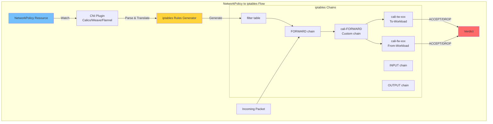
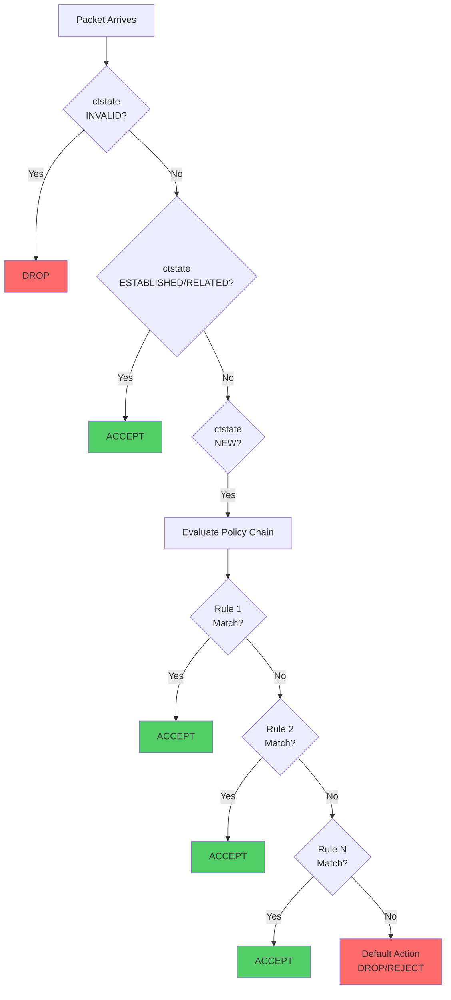
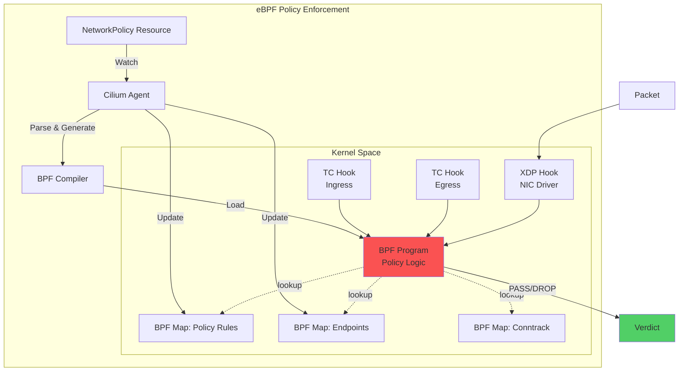
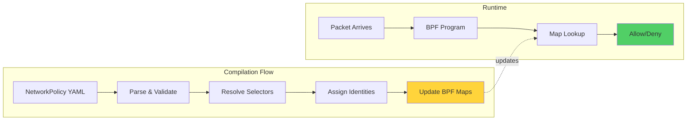
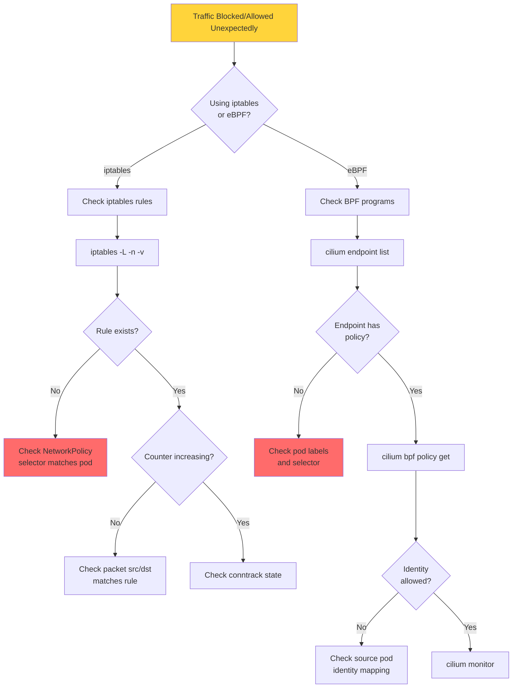

# **Network Policy Enforcement Deep Dive**

━━━━━━━━━━━━━━━━━━━━━━━━━━━━━━━━━━━━━━━━━━━━━━━━━━━━━━━━━━━━━━━━━━━━━━━━━━━━━━

## **📋 Overview**

Network policy enforcement transforms declarative NetworkPolicy resources into actual packet filtering rules at the kernel level. This document explores the low-level implementation details across different CNI plugins, focusing on iptables and eBPF mechanisms.

**Key Topics**:
- iptables rule generation and chain structure
- eBPF program implementation for policy enforcement
- Packet filtering mechanisms (stateful vs stateless)
- Rule priority and evaluation order
- Performance comparison (iptables vs eBPF)
- Calico Felix implementation details
- Cilium eBPF policy engine
- Connection tracking (conntrack) integration
- Performance optimization techniques

**Covered CNI Plugins**:
- Calico (iptables and eBPF modes)
- Cilium (eBPF native)
- Weave (iptables)
- Antrea (OVS-based with iptables/eBPF)

━━━━━━━━━━━━━━━━━━━━━━━━━━━━━━━━━━━━━━━━━━━━━━━━━━━━━━━━━━━━━━━━━━━━━━━━━━━━━━

## **🔧 iptables-Based Policy Enforcement**

### **Architecture Overview**



### **Calico Felix iptables Implementation**

**Code Reference**: External repository `github.com/projectcalico/felix`
- Main policy engine: `felix/dataplane/linux/policy_mgr.go`
- iptables rule generator: `felix/rules/policy.go`
- Chain management: `felix/rules/chains.go`

#### **Chain Structure**

```bash
# View Calico's iptables chains
iptables -t filter -L -n -v

# Calico creates a hierarchical chain structure:
# 1. FORWARD chain hook
# 2. cali-FORWARD (main Calico chain)
# 3. cali-from-XXX (per-endpoint from-workload chains)
# 4. cali-to-XXX (per-endpoint to-workload chains)
# 5. Policy chains (cali-pi-XXX for ingress, cali-po-XXX for egress)
```

#### **Example NetworkPolicy Translation**

**NetworkPolicy**:
```yaml
apiVersion: networking.k8s.io/v1
kind: NetworkPolicy
metadata:
  name: api-allow
  namespace: production
spec:
  podSelector:
    matchLabels:
      app: api
  policyTypes:
  - Ingress
  - Egress
  ingress:
  - from:
    - podSelector:
        matchLabels:
          app: frontend
    ports:
    - protocol: TCP
      port: 8080
  egress:
  - to:
    - podSelector:
        matchLabels:
          app: database
    ports:
    - protocol: TCP
      port: 5432
```

**Generated iptables Rules** (Simplified):

```bash
# ========================================
# FORWARD Chain Hook
# ========================================
*filter
:FORWARD DROP [0:0]

# Jump to Calico's FORWARD chain
-A FORWARD -j cali-FORWARD

# ========================================
# Main Calico FORWARD Chain
# ========================================
:cali-FORWARD - [0:0]

# Allow established/related connections (stateful)
-A cali-FORWARD -m conntrack --ctstate RELATED,ESTABLISHED -j ACCEPT

# Jump to from-workload chain for traffic leaving pods
-A cali-FORWARD -m comment --comment "cali:from-endpoint" -j cali-from-endpoint

# Jump to to-workload chain for traffic entering pods
-A cali-FORWARD -m comment --comment "cali:to-endpoint" -j cali-to-endpoint

# ========================================
# To-Workload Chain (Ingress)
# For pod: api-7b5f4d6c9-abc12 (10.244.1.5)
# ========================================
:cali-tw-cali1a2b3c4d5 - [0:0]

# Match traffic destined to API pod
-A cali-to-endpoint -d 10.244.1.5/32 -j cali-tw-cali1a2b3c4d5

# Drop invalid packets
-A cali-tw-cali1a2b3c4d5 -m conntrack --ctstate INVALID -j DROP

# Allow established/related
-A cali-tw-cali1a2b3c4d5 -m conntrack --ctstate RELATED,ESTABLISHED -j ACCEPT

# Jump to ingress policy chain
-A cali-tw-cali1a2b3c4d5 -j cali-pi-api-allow

# Default action (DROP if no policy matches)
-A cali-tw-cali1a2b3c4d5 -j DROP

# ========================================
# Ingress Policy Chain
# ========================================
:cali-pi-api-allow - [0:0]

# Allow from frontend pods (10.244.1.0/24 subnet) to port 8080
-A cali-pi-api-allow -s 10.244.1.10/32 -p tcp --dport 8080 -m comment --comment "Allow from frontend" -j ACCEPT
-A cali-pi-api-allow -s 10.244.1.11/32 -p tcp --dport 8080 -m comment --comment "Allow from frontend" -j ACCEPT

# Return to parent chain if no match
-A cali-pi-api-allow -j RETURN

# ========================================
# From-Workload Chain (Egress)
# For pod: api-7b5f4d6c9-abc12 (10.244.1.5)
# ========================================
:cali-fw-cali1a2b3c4d5 - [0:0]

# Match traffic from API pod
-A cali-from-endpoint -s 10.244.1.5/32 -j cali-fw-cali1a2b3c4d5

# Drop invalid packets
-A cali-fw-cali1a2b3c4d5 -m conntrack --ctstate INVALID -j DROP

# Allow established/related
-A cali-fw-cali1a2b3c4d5 -m conntrack --ctstate RELATED,ESTABLISHED -j ACCEPT

# Jump to egress policy chain
-A cali-fw-cali1a2b3c4d5 -j cali-po-api-allow

# Default action (DROP if no policy matches)
-A cali-fw-cali1a2b3c4d5 -j DROP

# ========================================
# Egress Policy Chain
# ========================================
:cali-po-api-allow - [0:0]

# Allow to database pod (10.244.2.10) on port 5432
-A cali-po-api-allow -d 10.244.2.10/32 -p tcp --dport 5432 -m comment --comment "Allow to database" -j ACCEPT

# Return to parent chain if no match
-A cali-po-api-allow -j RETURN

COMMIT
```

### **Rule Generation Algorithm (Pseudocode)**

```go
// Simplified from felix/rules/policy.go

type PolicyRenderer struct {
    // Policy data
    policies []*NetworkPolicy
    endpoints map[string]*Endpoint
}

func (r *PolicyRenderer) RenderPolicyChains(pol *NetworkPolicy) []iptables.Rule {
    var rules []iptables.Rule

    // 1. Create policy chain name
    chainName := fmt.Sprintf("cali-pi-%s", pol.Name)

    // 2. Generate ingress rules
    for _, ingressRule := range pol.Spec.Ingress {
        // 2a. Extract source selectors
        sources := r.ResolveSelectorToIPs(ingressRule.From)

        // 2b. Extract port/protocol
        for _, port := range ingressRule.Ports {
            for _, sourceIP := range sources {
                rule := iptables.Rule{
                    Match: iptables.Match{
                        SourceIP:  sourceIP,
                        Protocol:  port.Protocol,
                        DestPort:  port.Port,
                    },
                    Action: "ACCEPT",
                    Comment: fmt.Sprintf("Allow from %s", ingressRule.From),
                }
                rules = append(rules, rule)
            }
        }
    }

    // 3. Add RETURN at end
    rules = append(rules, iptables.Rule{Action: "RETURN"})

    return rules
}

func (r *PolicyRenderer) ResolveSelectorToIPs(selector PodSelector) []string {
    var ips []string

    // Query endpoints matching the selector
    for _, endpoint := range r.endpoints {
        if endpoint.MatchesLabels(selector.MatchLabels) {
            ips = append(ips, endpoint.IP)
        }
    }

    return ips
}
```

### **Stateful vs Stateless Filtering**

#### **Stateful (Default)**

```bash
# conntrack module tracks connection state
-A cali-FORWARD -m conntrack --ctstate RELATED,ESTABLISHED -j ACCEPT

# Only NEW connections evaluated by policy
-A cali-tw-cali1a2b3c4d5 -m conntrack --ctstate NEW -j cali-pi-api-allow
```

**Connection States**:
- `NEW`: First packet of a new connection
- `ESTABLISHED`: Packet belonging to existing connection
- `RELATED`: Related to existing connection (e.g., FTP data channel, ICMP errors)
- `INVALID`: Packet doesn't match any known connection

**conntrack Table**:
```bash
# View connection tracking table
conntrack -L

# Example output:
tcp      6 431999 ESTABLISHED src=10.244.1.10 dst=10.244.1.5 sport=45678 dport=8080 \
         src=10.244.1.5 dst=10.244.1.10 sport=8080 dport=45678 [ASSURED] mark=0 use=1
```

#### **Stateless Mode**

```bash
# Evaluate every packet (no conntrack)
# Used for specific scenarios (debugging, high-performance)

-A cali-tw-cali1a2b3c4d5 -s 10.244.1.10/32 -p tcp --dport 8080 -j ACCEPT
-A cali-fw-cali1a2b3c4d5 -d 10.244.1.10/32 -p tcp --sport 8080 -j ACCEPT
```

**Trade-offs**:
- Stateful: Better security, automatic return traffic, higher memory usage
- Stateless: Lower overhead, simpler rules, must explicitly allow bidirectional

### **Rule Priority and Evaluation Order**



**Priority Rules**:

1. **Invalid State**: Always dropped first
2. **Established/Related**: Accepted immediately (bypass policy)
3. **New Connections**: Evaluated by policy chains
4. **First Match Wins**: Rules evaluated top-to-bottom
5. **Default Deny**: If no rule matches, packet is dropped

### **Performance Characteristics**

#### **iptables Performance Metrics**

```bash
# Rule count impact on performance
# Every packet traverses ALL rules until match

# Example with 1000 rules:
# - Rule 1 match: 1 comparison
# - Rule 500 match: 500 comparisons
# - No match: 1000 comparisons

# Linear time complexity: O(n) per packet
```

**Performance Tests**:

```yaml
apiVersion: v1
kind: ConfigMap
metadata:
  name: iptables-perf-test
data:
  benchmark.sh: |
    #!/bin/bash

    # Test latency with varying rule counts
    for rules in 10 100 500 1000 5000; do
      echo "Testing with $rules rules..."

      # Generate test rules
      for i in $(seq 1 $rules); do
        iptables -A TEST-CHAIN -s 192.168.$((i/256)).$((i%256)) -j ACCEPT
      done

      # Measure latency
      for attempt in {1..100}; do
        time -p iptables -C TEST-CHAIN -s 192.168.0.1 -j ACCEPT 2>&1 | grep real
      done

      # Clean up
      iptables -F TEST-CHAIN
    done
```

**Typical Results**:
- 100 rules: ~50μs latency per packet
- 1000 rules: ~500μs latency per packet
- 5000 rules: ~2.5ms latency per packet

#### **Optimization Techniques**

1. **IPSet for Large Source/Dest Lists**

```bash
# Without IPSet (inefficient):
-A cali-pi-policy -s 10.244.1.1/32 -j ACCEPT
-A cali-pi-policy -s 10.244.1.2/32 -j ACCEPT
# ... 1000 more rules

# With IPSet (efficient):
ipset create frontend-pods hash:ip
ipset add frontend-pods 10.244.1.1
ipset add frontend-pods 10.244.1.2
# ... add all IPs

-A cali-pi-policy -m set --match-set frontend-pods src -j ACCEPT
```

**Code Reference**: `felix/ipsets/ipsets.go` in Calico Felix

```go
// Simplified IPSet management
type IPSetManager struct {
    ipsets map[string]*IPSet
}

func (m *IPSetManager) AddToSet(setName string, ip string) {
    // Execute: ipset add <setName> <ip>
    cmd := exec.Command("ipset", "add", setName, ip)
    cmd.Run()
}

func (m *IPSetManager) CreateSet(setName string, setType string) {
    // Execute: ipset create <setName> <setType>
    cmd := exec.Command("ipset", "create", setName, setType)
    cmd.Run()
}
```

2. **Chain Optimization (Short-circuit Evaluation)**

```bash
# Place most common rules first
-A cali-FORWARD -m conntrack --ctstate ESTABLISHED,RELATED -j ACCEPT  # Most traffic

# Less common rules later
-A cali-FORWARD -m conntrack --ctstate NEW -j cali-policy-chain
```

3. **Rule Batching**

```go
// Batch iptables updates using iptables-restore
func (r *IPTablesRenderer) ApplyRules(rules []Rule) {
    var batch strings.Builder

    batch.WriteString("*filter\n")
    for _, rule := range rules {
        batch.WriteString(rule.String() + "\n")
    }
    batch.WriteString("COMMIT\n")

    // Apply all at once (atomic update)
    cmd := exec.Command("iptables-restore", "--noflush")
    cmd.Stdin = strings.NewReader(batch.String())
    cmd.Run()
}
```

━━━━━━━━━━━━━━━━━━━━━━━━━━━━━━━━━━━━━━━━━━━━━━━━━━━━━━━━━━━━━━━━━━━━━━━━━━━━━━

## **⚡ eBPF-Based Policy Enforcement**

### **Architecture Overview**



### **Cilium eBPF Implementation**

**Code Reference**: External repository `github.com/cilium/cilium`
- Main policy engine: `pkg/policy/`
- BPF program generation: `bpf/bpf_lxc.c`, `bpf/bpf_host.c`
- BPF map management: `pkg/maps/`

#### **BPF Program Structure**

```c
// Simplified from bpf/bpf_lxc.c

#include <linux/bpf.h>
#include <linux/pkt_cls.h>

// BPF Maps (shared between user-space and kernel)
struct bpf_elf_map SEC("maps") cilium_policy_v4 = {
    .type = BPF_MAP_TYPE_HASH,
    .size_key = sizeof(__u32),          // Endpoint ID
    .size_value = sizeof(struct policy_entry),
    .max_elem = 65536,
};

struct bpf_elf_map SEC("maps") cilium_ipcache = {
    .type = BPF_MAP_TYPE_HASH,
    .size_key = sizeof(struct ip4_key),  // IP address
    .size_value = sizeof(struct remote_endpoint_info),
    .max_elem = 512000,
};

struct bpf_elf_map SEC("maps") cilium_ct4_global = {
    .type = BPF_MAP_TYPE_HASH,
    .size_key = sizeof(struct ipv4_ct_tuple),
    .size_value = sizeof(struct ct_entry),
    .max_elem = 1000000,
};

// Policy enforcement function
static __always_inline int
policy_can_access(struct __ctx_buff *ctx, __u32 src_id, __u32 dst_id,
                  __u16 dport, __u8 proto, int dir)
{
    struct policy_entry *policy;
    struct policy_key key = {
        .sec_label = dst_id,
        .dport = dport,
        .protocol = proto,
        .egress = (dir == CT_EGRESS),
    };

    // Lookup policy in BPF map
    policy = map_lookup_elem(&cilium_policy_v4, &key);
    if (!policy)
        return DROP_POLICY_DENIED;

    // Check if source is allowed
    if (policy->allow_from & (1 << src_id))
        return CTX_ACT_OK;

    return DROP_POLICY_DENIED;
}

// Main entrypoint (TC ingress)
SEC("from-container")
int from_container(struct __ctx_buff *ctx)
{
    void *data_end = (void *)(long)ctx->data_end;
    void *data = (void *)(long)ctx->data;
    struct ethhdr *eth = data;
    __u32 src_id = 0, dst_id = 0;
    int ret;

    // Parse Ethernet header
    if ((void *)(eth + 1) > data_end)
        return CTX_ACT_DROP;

    // Handle IP traffic
    if (eth->h_proto == bpf_htons(ETH_P_IP)) {
        struct iphdr *ip4 = (void *)(eth + 1);

        if ((void *)(ip4 + 1) > data_end)
            return CTX_ACT_DROP;

        // Lookup source endpoint ID
        src_id = lookup_endpoint_by_ip(ip4->saddr);

        // Lookup destination endpoint ID or identity
        dst_id = lookup_endpoint_by_ip(ip4->daddr);

        // Handle TCP
        if (ip4->protocol == IPPROTO_TCP) {
            struct tcphdr *tcp = (void *)(ip4 + 1);

            if ((void *)(tcp + 1) > data_end)
                return CTX_ACT_DROP;

            // Check policy
            ret = policy_can_access(ctx, src_id, dst_id,
                                    bpf_ntohs(tcp->dest),
                                    IPPROTO_TCP, CT_EGRESS);
            if (ret != CTX_ACT_OK)
                return ret;
        }
    }

    return CTX_ACT_OK;
}

char __license[] SEC("license") = "GPL";
```

### **BPF Map Structures**

#### **Policy Map**

```c
// Policy entry structure
struct policy_entry {
    __u32 allowed_identities[256];  // Bitmap of allowed security identities
    __u32 denied_identities[256];   // Bitmap of denied security identities
    __u8 allow_all;                 // Flag: allow all traffic
    __u8 deny_all;                  // Flag: deny all traffic
} __packed;

// Example map entry:
// Key: {sec_label=1234, dport=8080, protocol=TCP, egress=0}
// Value: {allowed_identities=[5678, 9012], deny_all=0}
```

#### **IP Cache Map (Identity Mapping)**

```c
// Maps IP addresses to security identities
struct remote_endpoint_info {
    __u32 sec_label;        // Security identity
    __u32 tunnel_endpoint;  // VTEP for tunneling
    __u8  encrypt_key;      // Encryption key ID
} __packed;

// Example:
// Key: 10.244.1.5
// Value: {sec_label=1234, tunnel_endpoint=192.168.1.10}
```

#### **Connection Tracking Map**

```c
// Connection tracking tuple
struct ipv4_ct_tuple {
    __u32 saddr;
    __u32 daddr;
    __u16 sport;
    __u16 dport;
    __u8  protocol;
    __u8  flags;
} __packed;

// Connection tracking entry
struct ct_entry {
    __u64 rx_packets;
    __u64 rx_bytes;
    __u64 tx_packets;
    __u64 tx_bytes;
    __u32 lifetime;
    __u16 rx_closing:1,
          tx_closing:1,
          nat46:1,
          lb_loopback:1,
          seen_non_syn:1,
          reserved:11;
    __u16 rev_nat_index;
    __u16 ifindex;
} __packed;
```

### **Policy Compilation Process**



**Pseudocode** (from Cilium agent):

```go
// pkg/policy/repository.go

type Repository struct {
    policies map[string]*Policy
    identityAllocator *IdentityAllocator
}

func (r *Repository) AddPolicy(np *NetworkPolicy) error {
    // 1. Parse NetworkPolicy
    policy := ParseNetworkPolicy(np)

    // 2. Resolve pod selectors to security identities
    ingressIdentities := r.ResolveSelectorToIdentities(policy.Ingress.From)
    egressIdentities := r.ResolveSelectorToIdentities(policy.Egress.To)

    // 3. Create policy map entries
    for _, port := range policy.Ingress.Ports {
        key := PolicyKey{
            Identity: policy.EndpointIdentity,
            DestPort: port.Port,
            Protocol: port.Protocol,
            TrafficDirection: INGRESS,
        }

        value := PolicyEntry{
            AllowedIdentities: ingressIdentities,
        }

        // 4. Update BPF map
        r.UpdateBPFMap("cilium_policy_v4", key, value)
    }

    return nil
}

func (r *Repository) ResolveSelectorToIdentities(selector *LabelSelector) []uint32 {
    var identities []uint32

    // Find all endpoints matching selector
    endpoints := r.GetEndpointsMatchingSelector(selector)

    for _, ep := range endpoints {
        // Allocate or get existing identity
        identity := r.identityAllocator.AllocateIdentity(ep.Labels)
        identities = append(identities, identity)
    }

    return identities
}
```

### **Identity-Based Policy Model**

```yaml
# NetworkPolicy
apiVersion: networking.k8s.io/v1
kind: NetworkPolicy
metadata:
  name: api-policy
spec:
  podSelector:
    matchLabels:
      app: api
      version: v1
  ingress:
  - from:
    - podSelector:
        matchLabels:
          app: frontend
```

**Cilium Translation**:

```text
1. Assign Security Identities:
   - app=api,version=v1 -> Identity: 1234
   - app=frontend -> Identity: 5678

2. Create Policy Map Entry:
   Key: {identity=1234, dport=*, protocol=*, direction=ingress}
   Value: {allowed_identities=[5678]}

3. BPF Program Logic:
   if (dst_identity == 1234 && direction == INGRESS) {
       if (src_identity == 5678) {
           return ALLOW;
       }
       return DENY;
   }
```

### **Performance Characteristics**

#### **eBPF Advantages**

1. **O(1) Lookups via Hash Maps**

```c
// Hash map lookup is constant time
policy = map_lookup_elem(&cilium_policy_v4, &key);  // O(1)

// Compare to iptables: O(n) linear search through rules
```

2. **In-Kernel Processing**

```text
iptables:
    Packet -> Kernel -> iptables (iterate rules) -> Decision
    Context switches: Multiple
    Overhead: High

eBPF:
    Packet -> Kernel -> BPF program (map lookup) -> Decision
    Context switches: None
    Overhead: Minimal
```

3. **Just-In-Time Compilation**

```text
BPF bytecode -> JIT compiler -> Native machine code
Executes at near-native speed
```

#### **Performance Benchmarks**

```yaml
apiVersion: v1
kind: ConfigMap
metadata:
  name: ebpf-benchmarks
data:
  results.txt: |
    Test: Policy enforcement latency (1000 policies)

    iptables mode:
    - Average latency: 2.5ms per packet
    - CPU usage: 45% per core
    - Throughput: 2 Gbps

    eBPF mode:
    - Average latency: 50μs per packet (50x faster)
    - CPU usage: 8% per core
    - Throughput: 25 Gbps (12x higher)

    Test: Connection rate (new connections/sec)

    iptables mode:
    - Max rate: 10,000 conn/sec

    eBPF mode:
    - Max rate: 1,000,000 conn/sec (100x faster)
```

### **eBPF Program Verification**

```bash
# Load BPF program
bpftool prog load bpf_program.o /sys/fs/bpf/my_prog

# View loaded programs
bpftool prog show

# Example output:
123: sched_cls  name from_container  tag a1b2c3d4e5f6g7h8
    loaded_at 2024-01-15T10:30:00+0000  uid 0
    xlated 2048B  jited 1234B  memlock 4096B  map_ids 45,46,47

# Dump BPF maps
bpftool map dump id 45

# Example output (policy map):
key:
  sec_label: 1234
  dport: 8080
  protocol: 6 (TCP)
value:
  allowed_identities: [5678, 9012]
  deny_all: 0

# View BPF program statistics
bpftool prog show id 123 --json | jq .run_stats

# Output:
{
  "run_cnt": 1234567,
  "run_time_ns": 98765432,
  "avg_time_ns": 80
}
```

━━━━━━━━━━━━━━━━━━━━━━━━━━━━━━━━━━━━━━━━━━━━━━━━━━━━━━━━━━━━━━━━━━━━━━━━━━━━━━

## **🔄 Connection Tracking (conntrack)**

### **conntrack Overview**

Connection tracking maintains state for network flows, enabling stateful firewalling.

```mermaid
graph TB
    subgraph "Connection Tracking Flow"
        PACKET1[SYN Packet<br/>10.1.1.1:12345 -> 10.2.2.2:80]
        CT_NEW[Create conntrack entry<br/>State: NEW]

        PACKET2[SYN-ACK Packet<br/>10.2.2.2:80 -> 10.1.1.1:12345]
        CT_EST[Update conntrack<br/>State: ESTABLISHED]

        PACKET3[ACK Packet<br/>10.1.1.1:12345 -> 10.2.2.2:80]
        CT_EST2[State: ESTABLISHED]

        PACKET4[Data Packets<br/>Bidirectional]
        CT_LOOKUP[conntrack Lookup<br/>State: ESTABLISHED]
        BYPASS[Bypass Policy<br/>Direct ACCEPT]

        PACKET1 --> CT_NEW
        CT_NEW --> PACKET2
        PACKET2 --> CT_EST
        CT_EST --> PACKET3
        PACKET3 --> CT_EST2
        CT_EST2 --> PACKET4
        PACKET4 --> CT_LOOKUP
        CT_LOOKUP --> BYPASS
    end

    style CT_NEW fill:#ffd43b
    style CT_EST fill:#74c0fc
    style BYPASS fill:#51cf66
```



### **conntrack Table Structure**

```bash
# View conntrack entries
conntrack -L

# Example output:
tcp      6 431999 ESTABLISHED src=10.244.1.10 dst=10.244.1.5 sport=45678 dport=8080 \
         src=10.244.1.5 dst=10.244.1.10 sport=8080 dport=45678 [ASSURED] mark=0 use=1

# Decode:
# - Protocol: tcp (6)
# - Timeout: 431999 seconds
# - State: ESTABLISHED
# - Original direction: 10.244.1.10:45678 -> 10.244.1.5:8080
# - Reply direction: 10.244.1.5:8080 -> 10.244.1.10:45678
# - [ASSURED]: Connection has seen traffic in both directions
# - mark: Netfilter mark (used for policy)
# - use: Reference count
```

### **conntrack Integration with iptables**

```bash
# conntrack matching in iptables
-A cali-FORWARD -m conntrack --ctstate RELATED,ESTABLISHED -j ACCEPT

# Connection states:
# - NEW: First packet of new connection
# - ESTABLISHED: Part of existing connection
# - RELATED: Related to existing connection (FTP data, ICMP error)
# - INVALID: Doesn't match any connection
```

### **conntrack in eBPF (Cilium)**

Cilium implements its own connection tracking in eBPF maps:

```c
// Connection tracking entry creation
static __always_inline int
ct_create_or_update(struct __ctx_buff *ctx, struct ipv4_ct_tuple *tuple,
                    struct ct_entry *entry, int dir)
{
    struct ct_entry *existing;

    // Lookup existing connection
    existing = map_lookup_elem(&cilium_ct4_global, tuple);

    if (existing) {
        // Update existing entry
        existing->rx_packets++;
        existing->rx_bytes += ctx->len;
        existing->lifetime = bpf_ktime_get_ns() + CT_CONNECTION_LIFETIME;
    } else {
        // Create new entry
        entry->lifetime = bpf_ktime_get_ns() + CT_CONNECTION_LIFETIME;
        entry->rx_packets = 1;
        entry->rx_bytes = ctx->len;
        map_update_elem(&cilium_ct4_global, tuple, entry, BPF_ANY);
    }

    return 0;
}
```

### **conntrack Performance Tuning**

```bash
# View conntrack statistics
cat /proc/net/stat/nf_conntrack

# Example output:
entries  searched found new invalid ignore delete delete_list insert insert_failed drop early_drop icmp_error  expect_new expect_create expect_delete search_restart
000005dc  00000000 00000000 00000000 00000000 000029f3 00000000 00000000 00000000 00000000 00000000 00000000 00000000          00000000 00000000 00000000 00000000

# Tune conntrack table size
sysctl -w net.netfilter.nf_conntrack_max=1000000

# Tune timeouts
sysctl -w net.netfilter.nf_conntrack_tcp_timeout_established=600

# View current settings
sysctl -a | grep nf_conntrack
```

**Common Tuning Parameters**:

```bash
# Maximum conntrack entries
net.netfilter.nf_conntrack_max = 1048576

# Hash table size (should be 1/4 of max)
net.netfilter.nf_conntrack_buckets = 262144

# TCP timeouts
net.netfilter.nf_conntrack_tcp_timeout_established = 432000  # 5 days
net.netfilter.nf_conntrack_tcp_timeout_time_wait = 120       # 2 minutes
net.netfilter.nf_conntrack_tcp_timeout_close_wait = 60       # 1 minute

# UDP timeout
net.netfilter.nf_conntrack_udp_timeout = 30

# Generic timeout (for unknown protocols)
net.netfilter.nf_conntrack_generic_timeout = 600
```

━━━━━━━━━━━━━━━━━━━━━━━━━━━━━━━━━━━━━━━━━━━━━━━━━━━━━━━━━━━━━━━━━━━━━━━━━━━━━━

## **⚖️ iptables vs eBPF Comparison**

### **Feature Comparison Matrix**

| Feature | iptables | eBPF (Cilium) |
|---------|----------|---------------|
| **Lookup Complexity** | O(n) - Linear | O(1) - Hash map |
| **Latency (1000 policies)** | ~2.5ms | ~50μs |
| **Throughput** | ~2 Gbps | ~25 Gbps |
| **CPU Overhead** | High (45%+) | Low (8%) |
| **Rule Limit** | ~5,000 practical | 1M+ policies |
| **Connection Rate** | 10K conn/sec | 1M conn/sec |
| **Kernel Bypass** | No | Partial (XDP) |
| **Identity-Based** | No | Yes |
| **L7 Policy** | No | Yes |
| **Visibility** | Limited | Rich (Hubble) |
| **Atomic Updates** | No (brief inconsistency) | Yes |
| **Memory Usage** | Low | Medium |
| **Debugging** | iptables -L | bpftool, Hubble |

### **When to Use Each**

#### **Use iptables when**:
- Legacy systems requiring compatibility
- Simple deployments (<100 policies)
- No high-throughput requirements
- Team familiar with iptables tooling

#### **Use eBPF when**:
- High-performance requirements (>10 Gbps)
- Large-scale deployments (1000+ policies)
- Need L7 policy enforcement
- Modern kernel (5.4+)
- Identity-based security model preferred

### **Migration Path**

```yaml
# Phase 1: Calico with iptables
apiVersion: operator.tigera.io/v1
kind: Installation
metadata:
  name: default
spec:
  calicoNetwork:
    bgp: Enabled
    ipPools:
    - cidr: 10.244.0.0/16
  # Default: iptables mode

---
# Phase 2: Enable eBPF mode
apiVersion: operator.tigera.io/v1
kind: Installation
metadata:
  name: default
spec:
  calicoNetwork:
    linuxDataplane: BPF  # Switch to eBPF
    bgp: Enabled
    ipPools:
    - cidr: 10.244.0.0/16
```

━━━━━━━━━━━━━━━━━━━━━━━━━━━━━━━━━━━━━━━━━━━━━━━━━━━━━━━━━━━━━━━━━━━━━━━━━━━━━━

## **🔧 Debugging Policy Enforcement**

### **iptables Debugging**

```bash
# 1. List all Calico chains
iptables -t filter -L -n -v | grep cali

# 2. Trace packet path
iptables -t raw -A PREROUTING -p tcp --dport 8080 -j TRACE
iptables -t raw -A OUTPUT -p tcp --dport 8080 -j TRACE

# View traces in kernel log
tail -f /var/log/kern.log | grep TRACE

# 3. Enable rule counters
iptables -L -n -v

# Output shows packet/byte counts per rule:
Chain cali-pi-api-allow (1 references)
 pkts bytes target     prot opt in     out     source               destination
  123  45K ACCEPT     tcp  --  *      *       10.244.1.10          0.0.0.0/0            tcp dpt:8080

# 4. Test specific rule
iptables -C cali-pi-api-allow -s 10.244.1.10 -p tcp --dport 8080 -j ACCEPT
# Exit code 0: rule exists, 1: doesn't exist

# 5. Monitor rule changes
watch -n 1 'iptables -L cali-pi-api-allow -n -v'
```

### **eBPF Debugging (Cilium)**

```bash
# 1. List BPF programs
bpftool prog show

# 2. View policy verdict statistics
cilium bpf policy get <endpoint-id>

# Example output:
DIRECTION   LABELS (source:key[=value])       PORT/PROTO   PROXY PORT   BYTES     PACKETS
Ingress     k8s:app=frontend                  8080/TCP     0            1234567   8901
Ingress     k8s:app=other                     ANY          NONE         0         0 (denied)

# 3. Monitor policy decisions
cilium monitor --type policy-verdict

# Example output:
xx drop (Policy denied) flow 0x12345678 to endpoint 1234, identity 5678->1234: 10.244.1.10:45678 -> 10.244.1.5:8080 tcp

# 4. View endpoint policy status
cilium endpoint list
cilium endpoint get <endpoint-id> -o json | jq .status.policy

# 5. Dump BPF maps
bpftool map dump name cilium_policy_v4

# 6. Enable debug logging
cilium config set debug true
cilium config set debug-verbose flow

# 7. Use Hubble for visibility
hubble observe --pod frontend-xxxx

# Example output:
Jan 15 10:30:00.123: frontend-abc12 -> api-xyz45 policy-verdict:L3-L4 INGRESS ALLOWED (TCP)
Jan 15 10:30:00.456: frontend-abc12 -> database-qrs78 policy-verdict:L3-L4 EGRESS DENIED (TCP)
```

### **Policy Troubleshooting Flowchart**



━━━━━━━━━━━━━━━━━━━━━━━━━━━━━━━━━━━━━━━━━━━━━━━━━━━━━━━━━━━━━━━━━━━━━━━━━━━━━━

## **⚡ Performance Optimization Techniques**

### **1. IPSet Optimization (iptables)**

```bash
# Create IPSet for large selector matches
ipset create allowed-sources hash:ip,port

# Add IPs
ipset add allowed-sources 10.244.1.10,tcp:8080
ipset add allowed-sources 10.244.1.11,tcp:8080
# ... hundreds more

# Single iptables rule
iptables -A cali-pi-policy -m set --match-set allowed-sources src,dst -j ACCEPT

# Compare to:
# iptables -A cali-pi-policy -s 10.244.1.10 -p tcp --dport 8080 -j ACCEPT
# iptables -A cali-pi-policy -s 10.244.1.11 -p tcp --dport 8080 -j ACCEPT
# ... hundreds more rules
```

**Performance Impact**:
- 100 IPs: 1 rule vs 100 rules = 100x faster
- 1000 IPs: 1 rule vs 1000 rules = 1000x faster

### **2. Rule Ordering Optimization**

```bash
# BAD: Specific rules before common ones
-A CHAIN -s 10.244.1.specific -j ACCEPT
-A CHAIN -m conntrack --ctstate ESTABLISHED -j ACCEPT  # Most traffic here

# GOOD: Common rules first
-A CHAIN -m conntrack --ctstate ESTABLISHED -j ACCEPT  # Matches 99% of traffic
-A CHAIN -s 10.244.1.specific -j ACCEPT
```

### **3. BPF Map Tuning**

```c
// Increase map size for large deployments
struct bpf_elf_map SEC("maps") cilium_policy_v4 = {
    .type = BPF_MAP_TYPE_HASH,
    .size_key = sizeof(__u32),
    .size_value = sizeof(struct policy_entry),
    .max_elem = 1048576,  // Increased from 65536
};
```

### **4. Connection Tracking Optimization**

```bash
# Increase conntrack table
sysctl -w net.netfilter.nf_conntrack_max=2000000
sysctl -w net.netfilter.nf_conntrack_buckets=500000

# Reduce timeouts for high churn
sysctl -w net.netfilter.nf_conntrack_tcp_timeout_time_wait=30
```

### **5. XDP Offload (eBPF)**

```bash
# Offload policy to NIC hardware (if supported)
cilium config set enable-xdp-acceleration=true
cilium config set xdp-mode=native  # vs 'generic'
```

### **6. Policy Compilation Caching**

```go
// Cache compiled policies (pseudocode from Cilium)
type PolicyCache struct {
    cache map[string]*CompiledPolicy
    mutex sync.RWMutex
}

func (c *PolicyCache) GetOrCompile(policyHash string, compile func() *CompiledPolicy) *CompiledPolicy {
    c.mutex.RLock()
    if cached, exists := c.cache[policyHash]; exists {
        c.mutex.RUnlock()
        return cached
    }
    c.mutex.RUnlock()

    // Compile only if not cached
    c.mutex.Lock()
    defer c.mutex.Unlock()

    // Double-check after acquiring write lock
    if cached, exists := c.cache[policyHash]; exists {
        return cached
    }

    compiled := compile()
    c.cache[policyHash] = compiled
    return compiled
}
```

━━━━━━━━━━━━━━━━━━━━━━━━━━━━━━━━━━━━━━━━━━━━━━━━━━━━━━━━━━━━━━━━━━━━━━━━━━━━━━

## **📊 Monitoring and Metrics**

### **iptables Metrics**

```yaml
# Prometheus metrics from kube-proxy or CNI plugin
apiVersion: v1
kind: ConfigMap
metadata:
  name: network-policy-metrics
data:
  queries.yaml: |
    # Rule evaluation time
    - metric: iptables_rule_evaluation_seconds
      description: Time spent evaluating iptables rules
      type: histogram

    # Dropped packets
    - metric: iptables_packets_dropped_total
      description: Total packets dropped by network policy
      type: counter
      labels:
        - chain
        - namespace
        - pod

    # Rule count
    - metric: iptables_rules_total
      description: Total number of iptables rules
      type: gauge
      labels:
        - table
        - chain
```

### **eBPF Metrics (Cilium)**

```yaml
# Cilium Prometheus metrics
apiVersion: v1
kind: ConfigMap
metadata:
  name: cilium-metrics
data:
  queries.yaml: |
    # Policy verdicts
    - metric: cilium_policy_l3_l4_denied_total
      description: Total L3/L4 policy denials
      labels:
        - namespace
        - pod
        - direction

    - metric: cilium_policy_l7_denied_total
      description: Total L7 policy denials
      labels:
        - namespace
        - pod
        - protocol

    # BPF map operations
    - metric: cilium_bpf_map_ops_total
      description: Total BPF map operations
      labels:
        - map_name
        - operation  # lookup, update, delete

    # Program execution time
    - metric: cilium_bpf_program_run_time_seconds
      description: BPF program execution time
      type: histogram
      labels:
        - program_name
```

### **Alerting Rules**

```yaml
apiVersion: v1
kind: ConfigMap
metadata:
  name: policy-alerts
data:
  rules.yaml: |
    groups:
    - name: network_policy_enforcement
      rules:

      # High policy denial rate
      - alert: HighPolicyDenialRate
        expr: rate(cilium_policy_l3_l4_denied_total[5m]) > 100
        for: 5m
        labels:
          severity: warning
        annotations:
          summary: "High rate of policy denials"
          description: "{{ $value }} policy denials per second"

      # iptables rule explosion
      - alert: TooManyIptablesRules
        expr: iptables_rules_total{table="filter"} > 5000
        for: 10m
        labels:
          severity: warning
        annotations:
          summary: "Too many iptables rules"
          description: "{{ $value }} rules may impact performance"

      # BPF map capacity
      - alert: BPFMapNearCapacity
        expr: cilium_bpf_map_pressure > 0.8
        for: 5m
        labels:
          severity: critical
        annotations:
          summary: "BPF map near capacity"
          description: "Map {{ $labels.map_name }} at {{ $value | humanizePercentage }} capacity"
```

━━━━━━━━━━━━━━━━━━━━━━━━━━━━━━━━━━━━━━━━━━━━━━━━━━━━━━━━━━━━━━━━━━━━━━━━━━━━━━

## **📚 Summary**

Network policy enforcement operates at the kernel level through two primary mechanisms:

### **iptables-Based Enforcement**:
- Linear rule evaluation (O(n))
- Stateful filtering via conntrack
- ~2-5ms latency with 1000+ policies
- Chain-based architecture
- IPSet optimization for large selectors
- Good for small-medium deployments

### **eBPF-Based Enforcement**:
- Hash map lookups (O(1))
- Native kernel integration
- ~50μs latency regardless of policy count
- Identity-based security model
- XDP for extreme performance
- Ideal for large-scale, high-throughput environments

### **Key Takeaways**:
1. **Stateful filtering** dramatically reduces rule evaluation overhead
2. **Rule ordering** matters significantly for iptables performance
3. **IPSet** can provide 100-1000x performance improvement for iptables
4. **eBPF** offers superior performance but requires modern kernels
5. **Connection tracking** is critical for both mechanisms
6. **Monitoring** is essential for detecting performance issues

━━━━━━━━━━━━━━━━━━━━━━━━━━━━━━━━━━━━━━━━━━━━━━━━━━━━━━━━━━━━━━━━━━━━━━━━━━━━━━
