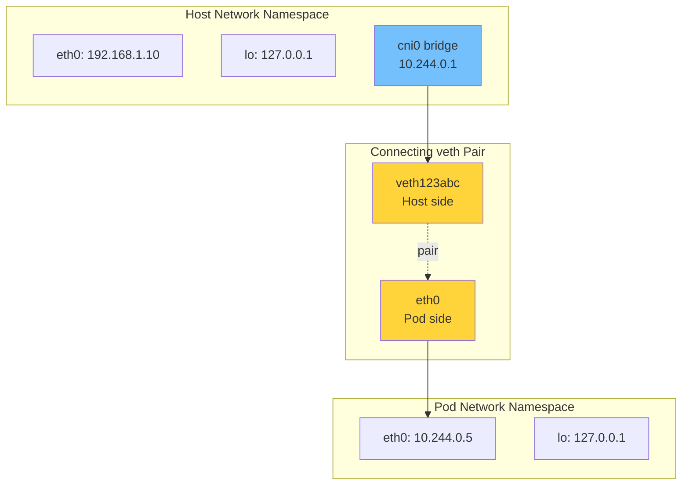
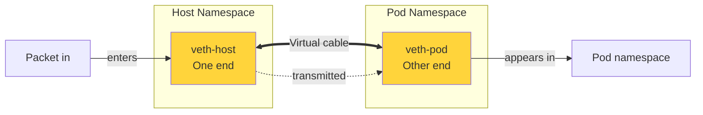
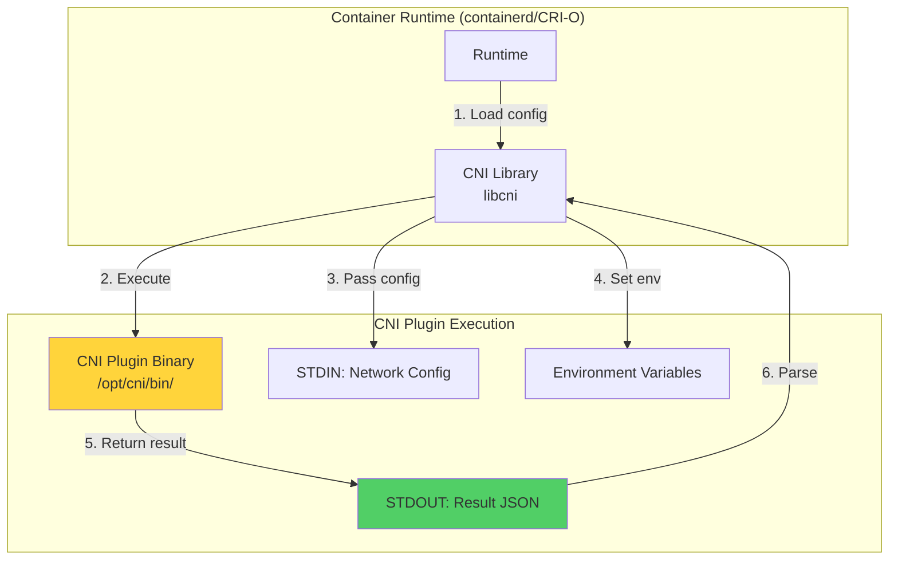
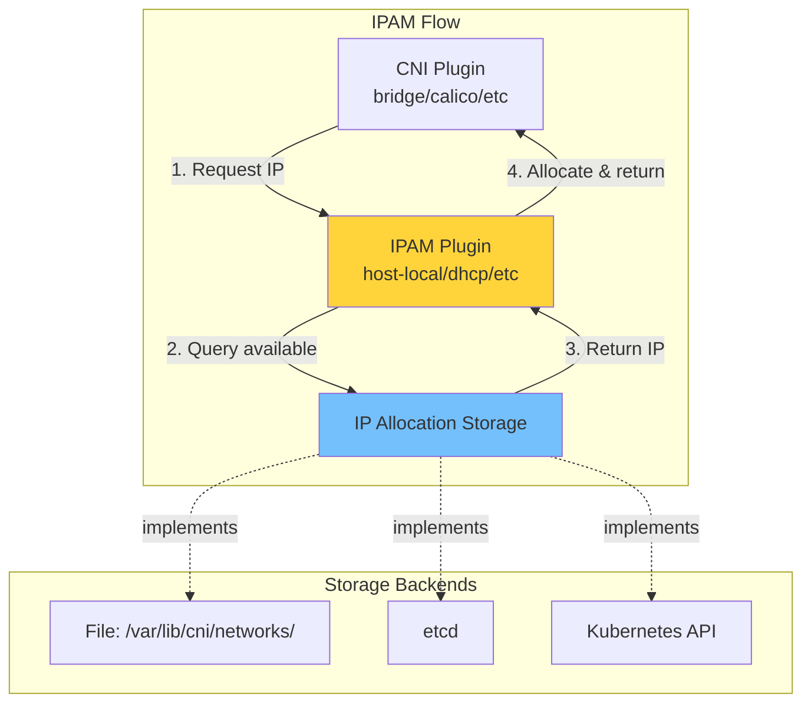
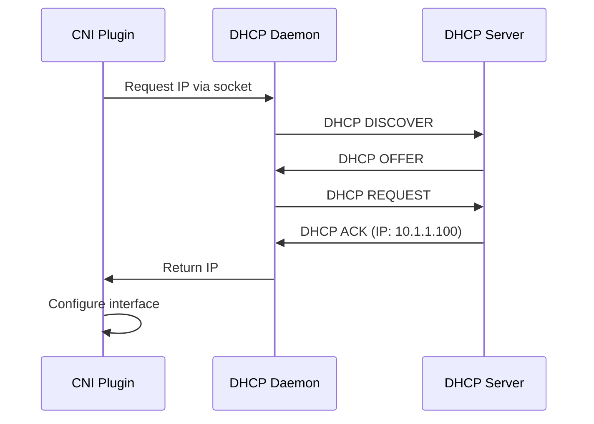
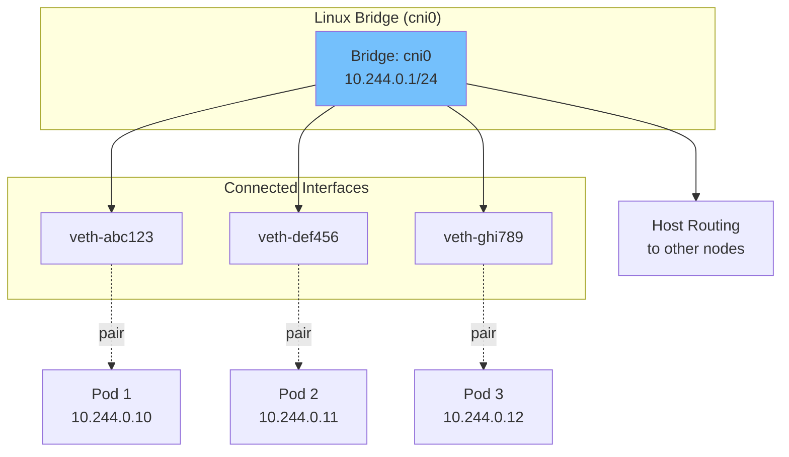
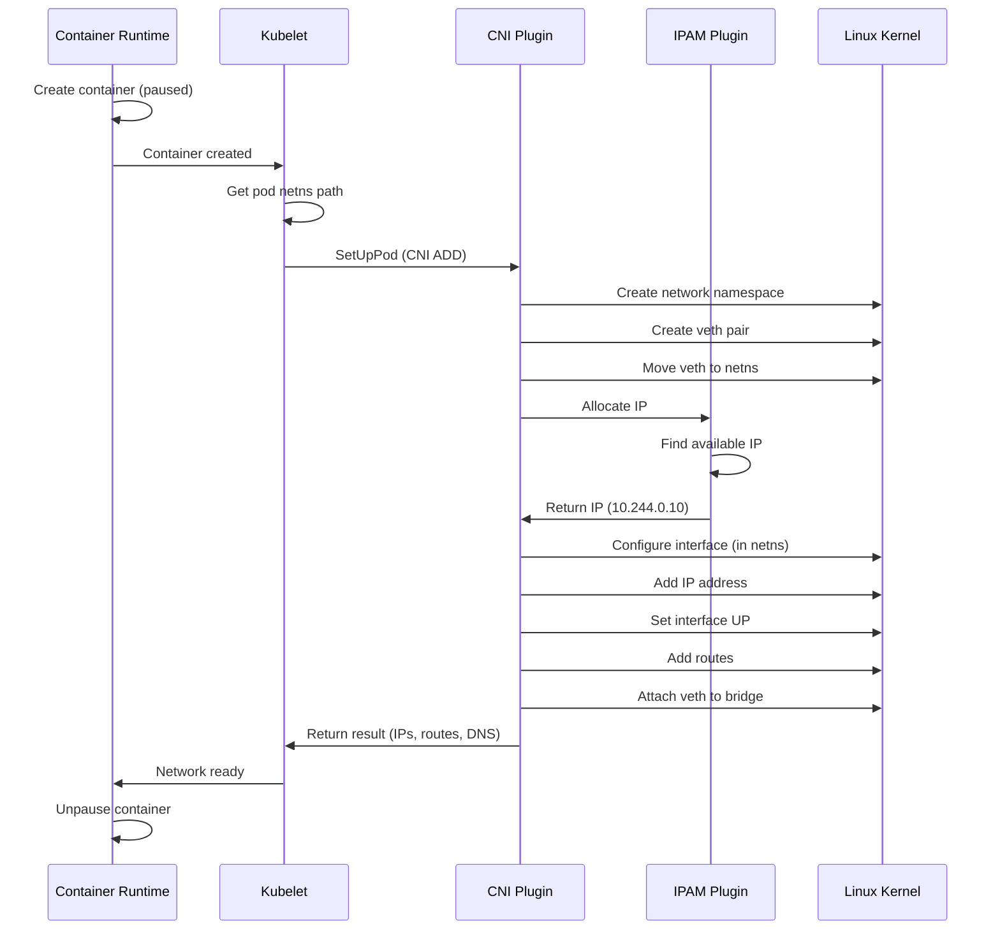

# **Pod Networking Deep Dive**

━━━━━━━━━━━━━━━━━━━━━━━━━━━━━━━━━━━━━━━━━━━━━━━━━━━━━━━━━━━━━━━━━━━━━━━━━━━━━━

## **📋 Overview**

Pod networking establishes network connectivity for containers using Linux kernel primitives, CNI plugins, and container runtime integration. This document explores the low-level implementation details of how pods get network interfaces, IP addresses, and connectivity.

**Key Topics**:
- veth pair creation and configuration
- Network namespace creation and management
- CNI plugin execution workflow (ADD/DEL/CHECK/VERSION)
- IP Address Management (IPAM) implementations
- Bridge and routing configuration
- Pod network initialization sequence
- Container runtime integration (containerd, CRI-O)
- Network interface naming conventions
- Troubleshooting network setup issues

**Code References**:
- Kubelet network setup: `/pkg/kubelet/kubelet_network.go`
- Network plugin interface: `/pkg/kubelet/network/`
- Container runtime: `/pkg/kubelet/cri/`

━━━━━━━━━━━━━━━━━━━━━━━━━━━━━━━━━━━━━━━━━━━━━━━━━━━━━━━━━━━━━━━━━━━━━━━━━━━━━━

## **🔧 Network Namespace Fundamentals**

### **Network Namespace Overview**



### **Network Namespace Creation**

**Kernel Operations**:

```bash
# Create a new network namespace
ip netns add pod-abc123

# List network namespaces
ip netns list

# Execute command in namespace
ip netns exec pod-abc123 ip addr

# View namespace file
ls -la /var/run/netns/
# Output: lrwxrwxrwx 1 root root 0 Jan 15 10:00 pod-abc123 -> /proc/12345/ns/net
```

**Low-Level System Call** (via `/proc/<pid>/ns/net`):

```c
#include <sched.h>
#include <fcntl.h>

// Create new network namespace
int create_netns() {
    // Call unshare to create new network namespace
    if (unshare(CLONE_NEWNET) == -1) {
        perror("unshare");
        return -1;
    }
    return 0;
}

// Enter existing network namespace
int enter_netns(const char *netns_path) {
    int fd = open(netns_path, O_RDONLY);
    if (fd == -1) {
        perror("open");
        return -1;
    }

    // Use setns to join the namespace
    if (setns(fd, CLONE_NEWNET) == -1) {
        perror("setns");
        close(fd);
        return -1;
    }

    close(fd);
    return 0;
}
```

### **Kubelet Network Namespace Management**

**Code Reference**: `/pkg/kubelet/dockershim/network/netns_linux.go` (legacy) and CRI implementations

```go
// Simplified from kubelet code

package network

import (
    "fmt"
    "os"
    "path/filepath"
    "syscall"
)

const (
    // NetNSPathPrefix is the path prefix for network namespaces
    NetNSPathPrefix = "/var/run/netns"
)

type NetNS interface {
    // Do runs the given function in the network namespace
    Do(f func() error) error
    // Path returns the path to the network namespace
    Path() string
    // Close closes the network namespace
    Close() error
}

type netNS struct {
    path string
    fd   *os.File
}

// NewNetNS creates a new network namespace
func NewNetNS() (NetNS, error) {
    // Create temporary file to hold namespace reference
    f, err := os.CreateTemp(NetNSPathPrefix, "pod-netns-")
    if err != nil {
        return nil, err
    }
    defer os.Remove(f.Name())

    // Call unshare to create new network namespace
    if err := syscall.Unshare(syscall.CLONE_NEWNET); err != nil {
        return nil, fmt.Errorf("failed to unshare network namespace: %v", err)
    }

    // Bind mount current network namespace to file
    nsPath := fmt.Sprintf("/proc/self/ns/net")
    if err := syscall.Mount(nsPath, f.Name(), "none", syscall.MS_BIND, ""); err != nil {
        return nil, fmt.Errorf("failed to bind mount namespace: %v", err)
    }

    // Open namespace file descriptor
    nsFd, err := os.Open(f.Name())
    if err != nil {
        return nil, err
    }

    return &netNS{
        path: f.Name(),
        fd:   nsFd,
    }, nil
}

// GetNetNS gets an existing network namespace by path
func GetNetNS(path string) (NetNS, error) {
    fd, err := os.Open(path)
    if err != nil {
        return nil, err
    }

    return &netNS{
        path: path,
        fd:   fd,
    }, nil
}

// Do executes a function in the network namespace
func (ns *netNS) Do(f func() error) error {
    // Save current network namespace
    currentNS, err := os.Open("/proc/self/ns/net")
    if err != nil {
        return err
    }
    defer currentNS.Close()

    // Switch to target namespace
    if err := syscall.Setns(int(ns.fd.Fd()), syscall.CLONE_NEWNET); err != nil {
        return fmt.Errorf("failed to enter network namespace: %v", err)
    }

    // Execute function
    execErr := f()

    // Switch back to original namespace
    if err := syscall.Setns(int(currentNS.Fd()), syscall.CLONE_NEWNET); err != nil {
        return fmt.Errorf("failed to return to original namespace: %v", err)
    }

    return execErr
}

func (ns *netNS) Path() string {
    return ns.path
}

func (ns *netNS) Close() error {
    if err := ns.fd.Close(); err != nil {
        return err
    }
    return os.Remove(ns.path)
}
```

━━━━━━━━━━━━━━━━━━━━━━━━━━━━━━━━━━━━━━━━━━━━━━━━━━━━━━━━━━━━━━━━━━━━━━━━━━━━━━

## **🔗 veth Pair Creation**

### **veth Pair Overview**

Virtual Ethernet (veth) devices are always created in pairs, acting as a virtual cable connecting two network namespaces.



### **Creating veth Pairs**

**Manual Creation**:

```bash
# 1. Create veth pair in host namespace
ip link add veth-host type veth peer name veth-pod

# 2. Verify creation
ip link show veth-host
ip link show veth-pod

# Example output:
# 5: veth-host@veth-pod: <BROADCAST,MULTICAST> mtu 1500 qdisc noop state DOWN mode DEFAULT
# 6: veth-pod@veth-host: <BROADCAST,MULTICAST> mtu 1500 qdisc noop state DOWN mode DEFAULT

# 3. Move one end to pod namespace
ip link set veth-pod netns pod-abc123

# 4. Configure interfaces
# In host namespace:
ip link set veth-host up
ip link set veth-host master cni0  # Attach to bridge

# In pod namespace:
ip netns exec pod-abc123 ip link set veth-pod name eth0
ip netns exec pod-abc123 ip addr add 10.244.0.5/24 dev eth0
ip netns exec pod-abc123 ip link set eth0 up
ip netns exec pod-abc123 ip route add default via 10.244.0.1
```

### **Programmatic veth Creation**

**Netlink API** (used by CNI plugins):

```go
// Using vishvananda/netlink library

package main

import (
    "fmt"
    "github.com/vishvananda/netlink"
    "github.com/vishvananda/netns"
)

func createVethPair(hostVethName, podVethName string, mtu int) error {
    // Create veth pair
    veth := &netlink.Veth{
        LinkAttrs: netlink.LinkAttrs{
            Name:  hostVethName,
            MTU:   mtu,
            Flags: net.FlagUp,
        },
        PeerName: podVethName,
    }

    // Add veth pair
    if err := netlink.LinkAdd(veth); err != nil {
        return fmt.Errorf("failed to create veth pair: %v", err)
    }

    return nil
}

func moveVethToPodNamespace(vethName string, podNS netns.NsHandle) error {
    // Get veth link
    link, err := netlink.LinkByName(vethName)
    if err != nil {
        return fmt.Errorf("failed to find veth %s: %v", vethName, err)
    }

    // Move to namespace
    if err := netlink.LinkSetNsFd(link, int(podNS)); err != nil {
        return fmt.Errorf("failed to move veth to namespace: %v", err)
    }

    return nil
}

func setupPodVeth(podNS netns.NsHandle, vethName string, ip *net.IPNet, gateway net.IP) error {
    // Execute in pod namespace
    return netns.Do(podNS, func() error {
        // Rename veth to eth0
        link, err := netlink.LinkByName(vethName)
        if err != nil {
            return err
        }

        if err := netlink.LinkSetName(link, "eth0"); err != nil {
            return err
        }

        // Add IP address
        addr := &netlink.Addr{IPNet: ip}
        if err := netlink.AddrAdd(link, addr); err != nil {
            return err
        }

        // Bring interface up
        if err := netlink.LinkSetUp(link); err != nil {
            return err
        }

        // Add default route
        route := &netlink.Route{
            LinkIndex: link.Attrs().Index,
            Dst:       nil, // default route
            Gw:        gateway,
        }
        if err := netlink.RouteAdd(route); err != nil {
            return err
        }

        return nil
    })
}
```

### **veth Naming Conventions**

Different CNI plugins use different naming schemes:

```yaml
# Calico
host_side: cali<hash>  # e.g., cali1a2b3c4d5e
pod_side: eth0

# Flannel
host_side: veth<hash>  # e.g., veth12345678
pod_side: eth0

# Weave
host_side: vethwe-bridge
pod_side: ethwe

# Cilium
host_side: lxc<hash>  # e.g., lxc_health
pod_side: eth0
```

**Code Reference**: `/pkg/kubelet/dockershim/network/cni/cni.go`

━━━━━━━━━━━━━━━━━━━━━━━━━━━━━━━━━━━━━━━━━━━━━━━━━━━━━━━━━━━━━━━━━━━━━━━━━━━━━━

## **🔌 CNI Plugin Execution**

### **CNI Specification Overview**

The Container Network Interface (CNI) specification defines how container runtimes invoke network plugins.



### **CNI Operations**

#### **ADD Operation**

Invoked when creating a pod's network.

```bash
# Environment variables
CNI_COMMAND=ADD
CNI_CONTAINERID=abc123
CNI_NETNS=/var/run/netns/pod-abc123
CNI_IFNAME=eth0
CNI_ARGS=K8S_POD_NAMESPACE=default;K8S_POD_NAME=my-pod;K8S_POD_INFRA_CONTAINER_ID=abc123
CNI_PATH=/opt/cni/bin

# Network configuration (passed via STDIN)
cat network-config.json | CNI_COMMAND=ADD CNI_CONTAINERID=abc123 \
    CNI_NETNS=/var/run/netns/pod-abc123 CNI_IFNAME=eth0 \
    /opt/cni/bin/bridge
```

**Network Configuration** (`network-config.json`):

```json
{
  "cniVersion": "0.4.0",
  "name": "mynet",
  "type": "bridge",
  "bridge": "cni0",
  "isGateway": true,
  "ipMasq": true,
  "ipam": {
    "type": "host-local",
    "subnet": "10.244.0.0/24",
    "routes": [
      { "dst": "0.0.0.0/0" }
    ]
  }
}
```

**Expected Result** (returned via STDOUT):

```json
{
  "cniVersion": "0.4.0",
  "interfaces": [
    {
      "name": "cni0",
      "mac": "0a:58:0a:f4:00:01"
    },
    {
      "name": "veth12345678",
      "mac": "f6:4e:e1:3e:90:4c"
    },
    {
      "name": "eth0",
      "mac": "0a:58:0a:f4:00:05",
      "sandbox": "/var/run/netns/pod-abc123"
    }
  ],
  "ips": [
    {
      "version": "4",
      "interface": 2,
      "address": "10.244.0.5/24",
      "gateway": "10.244.0.1"
    }
  ],
  "routes": [
    {
      "dst": "0.0.0.0/0",
      "gw": "10.244.0.1"
    }
  ],
  "dns": {
    "nameservers": ["10.96.0.10"],
    "domain": "cluster.local",
    "search": ["default.svc.cluster.local", "svc.cluster.local", "cluster.local"]
  }
}
```

#### **DEL Operation**

Invoked when deleting a pod's network.

```bash
# Environment variables (same as ADD)
CNI_COMMAND=DEL
CNI_CONTAINERID=abc123
CNI_NETNS=/var/run/netns/pod-abc123
CNI_IFNAME=eth0

# Execute
cat network-config.json | CNI_COMMAND=DEL CNI_CONTAINERID=abc123 \
    CNI_NETNS=/var/run/netns/pod-abc123 CNI_IFNAME=eth0 \
    /opt/cni/bin/bridge

# Expected: No output (return code 0 on success)
```

#### **CHECK Operation**

Verifies network configuration is still valid.

```bash
CNI_COMMAND=CHECK
CNI_CONTAINERID=abc123
CNI_NETNS=/var/run/netns/pod-abc123
CNI_IFNAME=eth0

cat network-config.json | CNI_COMMAND=CHECK CNI_CONTAINERID=abc123 \
    CNI_NETNS=/var/run/netns/pod-abc123 CNI_IFNAME=eth0 \
    /opt/cni/bin/bridge

# Expected: No output if valid, error message if invalid
```

#### **VERSION Operation**

Returns supported CNI versions.

```bash
CNI_COMMAND=VERSION /opt/cni/bin/bridge

# Output:
{
  "cniVersion": "0.4.0",
  "supportedVersions": ["0.1.0", "0.2.0", "0.3.0", "0.3.1", "0.4.0"]
}
```

### **Kubelet CNI Integration**

**Code Reference**: `/pkg/kubelet/network/cni/cni.go:130-250`

```go
// Simplified from kubelet CNI plugin manager

package cni

import (
    "context"
    "fmt"
    "github.com/containernetworking/cni/libcni"
    "github.com/containernetworking/cni/pkg/types"
)

type cniNetworkPlugin struct {
    cniConfig      libcni.CNI
    netConfigs     []*libcni.NetworkConfigList
    defaultNetwork *libcni.NetworkConfigList
}

// SetUpPod sets up the network for a pod
func (plugin *cniNetworkPlugin) SetUpPod(
    namespace string,
    name string,
    id string,
    netnsPath string,
    annotations map[string]string,
) error {
    // Build runtime configuration
    rt := &libcni.RuntimeConf{
        ContainerID: id,
        NetNS:       netnsPath,
        IfName:      "eth0",
        Args: [][2]string{
            {"K8S_POD_NAMESPACE", namespace},
            {"K8S_POD_NAME", name},
            {"K8S_POD_INFRA_CONTAINER_ID", id},
        },
    }

    // Execute CNI ADD
    result, err := plugin.cniConfig.AddNetworkList(
        context.Background(),
        plugin.defaultNetwork,
        rt,
    )
    if err != nil {
        return fmt.Errorf("failed to setup network: %v", err)
    }

    // Parse result
    res, err := types.GetResult(result)
    if err != nil {
        return fmt.Errorf("failed to parse CNI result: %v", err)
    }

    // Log assigned IP
    if len(res.IPs) > 0 {
        klog.Infof("Assigned IP %s to pod %s/%s", res.IPs[0].Address, namespace, name)
    }

    return nil
}

// TearDownPod tears down the network for a pod
func (plugin *cniNetworkPlugin) TearDownPod(
    namespace string,
    name string,
    id string,
    netnsPath string,
) error {
    rt := &libcni.RuntimeConf{
        ContainerID: id,
        NetNS:       netnsPath,
        IfName:      "eth0",
        Args: [][2]string{
            {"K8S_POD_NAMESPACE", namespace},
            {"K8S_POD_NAME", name},
            {"K8S_POD_INFRA_CONTAINER_ID", id},
        },
    }

    // Execute CNI DEL
    err := plugin.cniConfig.DelNetworkList(
        context.Background(),
        plugin.defaultNetwork,
        rt,
    )
    if err != nil {
        return fmt.Errorf("failed to teardown network: %v", err)
    }

    return nil
}
```

━━━━━━━━━━━━━━━━━━━━━━━━━━━━━━━━━━━━━━━━━━━━━━━━━━━━━━━━━━━━━━━━━━━━━━━━━━━━━━

## **📍 IP Address Management (IPAM)**

### **IPAM Overview**

IPAM plugins allocate IP addresses to pods and manage the IP pool.



### **host-local IPAM Plugin**

Stores allocations in local files.

**Configuration**:

```json
{
  "ipam": {
    "type": "host-local",
    "subnet": "10.244.0.0/24",
    "rangeStart": "10.244.0.10",
    "rangeEnd": "10.244.0.250",
    "gateway": "10.244.0.1",
    "routes": [
      { "dst": "0.0.0.0/0" }
    ]
  }
}
```

**Allocation Storage**:

```bash
# Storage location
ls -la /var/lib/cni/networks/mynet/

# Example files:
# 10.244.0.10  -> contains container ID
# 10.244.0.11  -> contains container ID
# last_reserved_ip.0 -> contains last allocated IP

# Content of 10.244.0.10:
cat /var/lib/cni/networks/mynet/10.244.0.10
# Output: abc123def456  (container ID)
```

**Allocation Algorithm** (simplified):

```go
// From containernetworking/plugins/plugins/ipam/host-local

package allocator

import (
    "fmt"
    "net"
    "os"
    "path/filepath"
)

type IPAllocator struct {
    subnet    *net.IPNet
    rangeStart net.IP
    rangeEnd  net.IP
    storeDir  string
}

func (a *IPAllocator) Allocate(containerID string) (net.IP, error) {
    // Lock to prevent concurrent allocation
    lock := a.acquireLock()
    defer lock.Release()

    // Read last allocated IP
    lastIP, err := a.readLastIP()
    if err != nil {
        lastIP = a.rangeStart
    }

    // Find next available IP
    for ip := nextIP(lastIP); !ip.Equal(lastIP); ip = nextIP(ip) {
        // Check if IP is in range
        if !a.inRange(ip) {
            continue
        }

        // Check if IP is already allocated
        ipFile := filepath.Join(a.storeDir, ip.String())
        if _, err := os.Stat(ipFile); err == nil {
            // Already allocated
            continue
        }

        // Allocate IP
        if err := os.WriteFile(ipFile, []byte(containerID), 0644); err != nil {
            return nil, err
        }

        // Update last allocated IP
        a.writeLastIP(ip)

        return ip, nil
    }

    return nil, fmt.Errorf("no available IPs in range")
}

func (a *IPAllocator) Release(ip net.IP) error {
    lock := a.acquireLock()
    defer lock.Release()

    ipFile := filepath.Join(a.storeDir, ip.String())
    return os.Remove(ipFile)
}

func nextIP(ip net.IP) net.IP {
    next := make(net.IP, len(ip))
    copy(next, ip)

    for i := len(next) - 1; i >= 0; i-- {
        next[i]++
        if next[i] > 0 {
            break
        }
    }

    return next
}
```

### **DHCP IPAM Plugin**

Obtains IPs from external DHCP server.

**Configuration**:

```json
{
  "ipam": {
    "type": "dhcp"
  }
}
```

**DHCP Daemon**:

```bash
# Start DHCP daemon (must run on each node)
/opt/cni/bin/dhcp daemon

# Daemon listens on Unix socket
ls -la /run/cni/dhcp.sock
```

**DHCP Flow**:



### **Calico IPAM**

Uses Kubernetes API or etcd for IP allocation.

**Configuration**:

```json
{
  "ipam": {
    "type": "calico-ipam",
    "assign_ipv4": "true",
    "assign_ipv6": "false",
    "ipv4_pools": ["10.244.0.0/16"]
  }
}
```

**IP Pool Definition**:

```yaml
apiVersion: projectcalico.org/v3
kind: IPPool
metadata:
  name: default-ipv4-pool
spec:
  cidr: 10.244.0.0/16
  blockSize: 26  # Allocate /26 blocks to each node
  ipipMode: Always
  natOutgoing: true
  nodeSelector: all()
```

**Block Allocation**:

```text
Node 1: 10.244.0.0/26   (64 IPs)
Node 2: 10.244.0.64/26  (64 IPs)
Node 3: 10.244.0.128/26 (64 IPs)
```

**Storage in Kubernetes**:

```yaml
# IPAMBlock CRD
apiVersion: crd.projectcalico.org/v1
kind: IPAMBlock
metadata:
  name: 10-244-0-0-26
spec:
  cidr: 10.244.0.0/26
  affinity: host:node-1
  allocations:
  - 0  # 10.244.0.0 (reserved)
  - 0  # 10.244.0.1 (gateway)
  - null
  - 1  # 10.244.0.3 (allocated to pod abc123)
  - 2  # 10.244.0.4 (allocated to pod def456)
  # ... 59 more entries
  attributes:
  - handle_id: k8s-pod-abc123
    secondary:
      namespace: default
      pod: my-pod
```

━━━━━━━━━━━━━━━━━━━━━━━━━━━━━━━━━━━━━━━━━━━━━━━━━━━━━━━━━━━━━━━━━━━━━━━━━━━━━━

## **🌉 Bridge Configuration**

### **Linux Bridge Overview**

A Linux bridge connects multiple network interfaces at Layer 2.



### **Bridge Creation and Configuration**

```bash
# 1. Create bridge
ip link add cni0 type bridge

# 2. Assign IP address (gateway for pods)
ip addr add 10.244.0.1/24 dev cni0

# 3. Bring bridge up
ip link set cni0 up

# 4. Enable IPv4 forwarding
sysctl -w net.ipv4.ip_forward=1

# 5. Configure iptables for NAT (if ipMasq enabled)
iptables -t nat -A POSTROUTING -s 10.244.0.0/24 ! -o cni0 -j MASQUERADE

# 6. Attach veth to bridge
ip link set veth-abc123 master cni0

# 7. View bridge interfaces
bridge link show cni0

# Output:
# 5: veth-abc123 state UP @if6
# 7: veth-def456 state UP @if8
```

### **Bridge Plugin Implementation**

**Code**: External CNI plugins repository `containernetworking/plugins/plugins/main/bridge`

```go
// Simplified bridge plugin

package main

import (
    "github.com/containernetworking/cni/pkg/skel"
    "github.com/containernetworking/cni/pkg/types"
    "github.com/vishvananda/netlink"
)

type NetConf struct {
    types.NetConf
    BrName   string `json:"bridge"`
    IsGW     bool   `json:"isGateway"`
    IPMasq   bool   `json:"ipMasq"`
}

func cmdAdd(args *skel.CmdArgs) error {
    // Parse config
    conf, err := parseConfig(args.StdinData)
    if err != nil {
        return err
    }

    // Get or create bridge
    br, err := setupBridge(conf)
    if err != nil {
        return err
    }

    // Get network namespace
    netns, err := ns.GetNS(args.Netns)
    if err != nil {
        return err
    }
    defer netns.Close()

    // Create veth pair
    hostVeth, containerVeth, err := setupVeth(args.IfName, conf.MTU, netns)
    if err != nil {
        return err
    }

    // Attach host veth to bridge
    if err := netlink.LinkSetMaster(hostVeth, br); err != nil {
        return err
    }

    // Get IP from IPAM
    ipamResult, err := ipam.ExecAdd(conf.IPAM.Type, args.StdinData)
    if err != nil {
        return err
    }

    // Configure interface in pod namespace
    err = netns.Do(func(_ ns.NetNS) error {
        // Rename veth to desired name (e.g., eth0)
        if err := netlink.LinkSetName(containerVeth, args.IfName); err != nil {
            return err
        }

        // Add IP address
        addr := &netlink.Addr{IPNet: ipamResult.IPs[0].Address}
        if err := netlink.AddrAdd(containerVeth, addr); err != nil {
            return err
        }

        // Bring interface up
        if err := netlink.LinkSetUp(containerVeth); err != nil {
            return err
        }

        // Add routes
        for _, route := range ipamResult.Routes {
            r := &netlink.Route{
                LinkIndex: containerVeth.Attrs().Index,
                Dst:       route.Dst,
                Gw:        route.GW,
            }
            if err := netlink.RouteAdd(r); err != nil {
                return err
            }
        }

        return nil
    })

    return nil
}

func setupBridge(conf *NetConf) (*netlink.Bridge, error) {
    // Check if bridge exists
    br, err := netlink.LinkByName(conf.BrName)
    if err == nil {
        // Bridge exists
        return br.(*netlink.Bridge), nil
    }

    // Create bridge
    bridge := &netlink.Bridge{
        LinkAttrs: netlink.LinkAttrs{
            Name: conf.BrName,
            MTU:  conf.MTU,
        },
    }

    if err := netlink.LinkAdd(bridge); err != nil {
        return nil, err
    }

    // Bring bridge up
    if err := netlink.LinkSetUp(bridge); err != nil {
        return nil, err
    }

    // Configure gateway IP if requested
    if conf.IsGW {
        addr, _ := netlink.ParseAddr(conf.IPAM.Gateway + "/24")
        if err := netlink.AddrAdd(bridge, addr); err != nil {
            return nil, err
        }
    }

    return bridge, nil
}
```

### **Bridging with iptables NAT**

When `ipMasq` is enabled, traffic from pods to external networks is SNAT'd:

```bash
# View NAT rules
iptables -t nat -L POSTROUTING -n -v

# Example output:
Chain POSTROUTING (policy ACCEPT 0 packets, 0 bytes)
 pkts bytes target     prot opt in     out     source               destination
  123  45K MASQUERADE  all  --  *      !cni0   10.244.0.0/24        0.0.0.0/0

# Packet flow:
# Pod (10.244.0.10) -> External (8.8.8.8)
# Before NAT: src=10.244.0.10 dst=8.8.8.8
# After NAT:  src=192.168.1.5 (node IP) dst=8.8.8.8
# Reply:      src=8.8.8.8 dst=192.168.1.5
# After unNAT: src=8.8.8.8 dst=10.244.0.10
```

━━━━━━━━━━━━━━━━━━━━━━━━━━━━━━━━━━━━━━━━━━━━━━━━━━━━━━━━━━━━━━━━━━━━━━━━━━━━━━

## **🛣️ Routing Configuration**

### **Pod Routing Table**

```bash
# View pod's routing table
ip netns exec pod-abc123 ip route

# Example output:
default via 10.244.0.1 dev eth0
10.244.0.0/24 dev eth0 proto kernel scope link src 10.244.0.10
```

**Route Breakdown**:
- `default via 10.244.0.1`: All traffic goes to gateway (bridge)
- `10.244.0.0/24 dev eth0`: Local subnet directly reachable via eth0

### **Host Routing Table**

```bash
# View host routing table
ip route

# Example output:
default via 192.168.1.1 dev eth0
10.244.0.0/24 dev cni0 proto kernel scope link src 10.244.0.1
10.244.1.0/24 via 192.168.1.11 dev eth0  # Route to node-2's pods
10.244.2.0/24 via 192.168.1.12 dev eth0  # Route to node-3's pods
192.168.1.0/24 dev eth0 proto kernel scope link src 192.168.1.10
```

### **Cross-Node Routing**

Different CNI plugins use different approaches:

#### **Flannel (VXLAN)**

```bash
# VXLAN tunnel device
ip link show flannel.1

# Output:
flannel.1: <BROADCAST,MULTICAST,UP,LOWER_UP> mtu 1450 qdisc noqueue state UNKNOWN
    link/ether 0a:58:0a:f4:00:00 brd ff:ff:ff:ff:ff:ff

# Routing via VXLAN
ip route
10.244.1.0/24 via 10.244.1.0 dev flannel.1 onlink

# ARP/FDB entries
bridge fdb show dev flannel.1
0a:58:0a:f4:01:00 dst 192.168.1.11 self permanent
```

**Packet Encapsulation**:

```text
Original packet:
| Src: 10.244.0.10 | Dst: 10.244.1.10 | Data |

VXLAN encapsulation:
| Outer IP Header                      | VXLAN Header | Original Packet |
| Src: 192.168.1.10 | Dst: 192.168.1.11 | VNI: 1       | ...             |
```

#### **Calico (BGP)**

```bash
# Bird BGP daemon
birdc show route

# Output:
10.244.1.0/26      via 192.168.1.11 on eth0 [node_192_168_1_11 00:30:45] * (100) [i]
10.244.2.0/26      via 192.168.1.12 on eth0 [node_192_168_1_12 00:25:12] * (100) [i]

# Direct routing (no encapsulation)
ip route
10.244.1.0/26 via 192.168.1.11 dev eth0 proto bird
10.244.2.0/26 via 192.168.1.12 dev eth0 proto bird
```

**Packet Flow** (no encapsulation):

```text
| Src: 10.244.0.10 | Dst: 10.244.1.10 | Data |
  (routed directly to next-hop node)
```

━━━━━━━━━━━━━━━━━━━━━━━━━━━━━━━━━━━━━━━━━━━━━━━━━━━━━━━━━━━━━━━━━━━━━━━━━━━━━━

## **🔄 Pod Network Initialization Sequence**

### **Complete Flow**



### **Detailed Steps**

#### **Step 1: Container Creation**

```bash
# Container runtime creates pause container
containerd create --namespace k8s.io --id abc123 pause:3.9

# Pause container holds the network namespace
ps aux | grep pause
# root     12345  0.0  0.0   1024   256 ?        Ss   10:00   0:00 /pause
```

#### **Step 2: Network Namespace Setup**

```bash
# Get container's network namespace
NETNS_PATH=/proc/12345/ns/net

# Create persistent link
ln -s /proc/12345/ns/net /var/run/netns/pod-abc123
```

#### **Step 3: CNI Plugin Execution**

**Code Reference**: `/pkg/kubelet/dockershim/network/cni/cni.go:190`

```go
func (plugin *cniNetworkPlugin) SetUpPod(namespace, name, id string) error {
    netnsPath := plugin.host.GetNetNS(id)

    _, err := plugin.addToNetwork(
        plugin.getDefaultNetwork(),
        name, namespace, id, netnsPath,
    )

    return err
}
```

#### **Step 4: veth Creation and Configuration**

```bash
# Inside CNI plugin:

# 1. Create veth pair
ip link add veth-host type veth peer name veth-pod

# 2. Move to namespace
ip link set veth-pod netns /var/run/netns/pod-abc123

# 3. Configure host side
ip link set veth-host up
ip link set veth-host master cni0

# 4. Configure pod side (in namespace)
ip netns exec pod-abc123 ip link set veth-pod name eth0
ip netns exec pod-abc123 ip addr add 10.244.0.10/24 dev eth0
ip netns exec pod-abc123 ip link set eth0 up
ip netns exec pod-abc123 ip route add default via 10.244.0.1
```

#### **Step 5: DNS Configuration**

```bash
# CNI returns DNS info, kubelet writes to /etc/resolv.conf

# Inside pod:
cat /etc/resolv.conf

# Output:
nameserver 10.96.0.10
search default.svc.cluster.local svc.cluster.local cluster.local
options ndots:5
```

**Code Reference**: `/pkg/kubelet/network/dns/dns.go`

```go
func (c *Configurer) SetupDNSinContainerizedMounter(containerID string) error {
    // Get DNS config from CNI result
    dnsConfig := c.generateDNSConfig()

    // Write to container's resolv.conf
    resolvPath := fmt.Sprintf("/var/run/docker/netns/%s/resolv.conf", containerID)

    content := fmt.Sprintf("nameserver %s\nsearch %s\noptions ndots:5\n",
        dnsConfig.Nameservers[0],
        strings.Join(dnsConfig.Searches, " "))

    return os.WriteFile(resolvPath, []byte(content), 0644)
}
```

━━━━━━━━━━━━━━━━━━━━━━━━━━━━━━━━━━━━━━━━━━━━━━━━━━━━━━━━━━━━━━━━━━━━━━━━━━━━━━

## **🔍 Troubleshooting Pod Networking**

### **Issue 1: Pod has no network interface**

```bash
# Check if CNI plugin executed
kubectl describe pod my-pod | grep -A 10 Events

# Look for:
# Failed to setup network for pod: CNI failed

# Debug steps:
# 1. Check CNI plugin exists
ls /opt/cni/bin/

# 2. Check CNI config
ls /etc/cni/net.d/

# 3. Check kubelet logs
journalctl -u kubelet -f | grep CNI

# 4. Manually test CNI
CNI_COMMAND=ADD CNI_CONTAINERID=test CNI_NETNS=/var/run/netns/test \
  CNI_IFNAME=eth0 CNI_PATH=/opt/cni/bin \
  /opt/cni/bin/bridge < /etc/cni/net.d/10-bridge.conf
```

### **Issue 2: Cannot ping pod**

```bash
# 1. Check interface exists
ip netns exec pod-abc123 ip addr

# 2. Check routes
ip netns exec pod-abc123 ip route

# 3. Check if interface is UP
ip netns exec pod-abc123 ip link show eth0

# 4. Ping gateway
ip netns exec pod-abc123 ping -c 3 10.244.0.1

# 5. Check veth peer
ip link show | grep veth

# 6. Check bridge membership
bridge link show
```

### **Issue 3: IP allocation failure**

```bash
# 1. Check IPAM plugin
cat /etc/cni/net.d/10-bridge.conf | jq .ipam

# 2. Check IP pool exhaustion
ls /var/lib/cni/networks/mynet/ | wc -l

# Compare to subnet size (e.g., /24 = 254 usable IPs)

# 3. Check for stale allocations
# List all allocated IPs
ls /var/lib/cni/networks/mynet/

# Check if containers still exist
for ip in $(ls /var/lib/cni/networks/mynet/); do
  cid=$(cat /var/lib/cni/networks/mynet/$ip)
  crictl inspect $cid &>/dev/null || echo "Stale: $ip -> $cid"
done

# 4. Clean up stale allocations
# (manually remove files or use CNI GC)
```

### **Issue 4: Cross-node communication fails**

```bash
# 1. Check routing on source node
ip route | grep 10.244.1.0

# 2. Ping destination node
ping -c 3 192.168.1.11

# 3. Check if packets are being routed
tcpdump -i eth0 -n dst 10.244.1.10

# 4. Check CNI plugin logs
# For Calico:
kubectl logs -n kube-system -l k8s-app=calico-node

# For Flannel:
kubectl logs -n kube-system -l app=flannel

# 5. Check overlay network (if using VXLAN)
ip -d link show flannel.1

# 6. Check BGP peering (if using Calico)
calicoctl node status
```

━━━━━━━━━━━━━━━━━━━━━━━━━━━━━━━━━━━━━━━━━━━━━━━━━━━━━━━━━━━━━━━━━━━━━━━━━━━━━━

## **📊 Performance Considerations**

### **MTU Settings**

```bash
# Check MTU along path
# Pod interface
ip netns exec pod-abc123 ip link show eth0 | grep mtu
# mtu 1450

# veth host side
ip link show veth-abc123 | grep mtu
# mtu 1450

# Bridge
ip link show cni0 | grep mtu
# mtu 1500

# Host interface
ip link show eth0 | grep mtu
# mtu 1500

# MTU mismatch can cause:
# - Packet fragmentation
# - Performance degradation
# - Connection failures

# Set MTU in CNI config
{
  "cniVersion": "0.4.0",
  "name": "mynet",
  "type": "bridge",
  "mtu": 1450
}
```

### **veth Pair Performance**

```text
Overhead of veth pair:
- Context switches between namespaces
- Memory copies
- Typical overhead: 5-10% CPU, 10-15μs latency

Optimization:
- Use larger MTU (if supported)
- Enable offloading features (GRO, TSO, GSO)
- Consider SR-IOV for high-performance workloads
```

### **Bridge vs Routing**

```yaml
# Bridge mode (most CNIs)
Pros:
  - Simple Layer 2 switching
  - Works with all protocols
Cons:
  - Broadcast domain limits scalability
  - Potential MAC table exhaustion

# Routing mode (Calico, Cilium)
Pros:
  - No broadcast domain
  - Better scalability
  - No MAC learning overhead
Cons:
  - Requires routing protocol (BGP)
  - More complex setup
```

━━━━━━━━━━━━━━━━━━━━━━━━━━━━━━━━━━━━━━━━━━━━━━━━━━━━━━━━━━━━━━━━━━━━━━━━━━━━━━

## **📚 Summary**

Pod networking involves several low-level components working together:

### **Network Namespace**:
- Isolated network stack per pod
- Created via `unshare(CLONE_NEWNET)` syscall
- Persistent reference via `/var/run/netns/`

### **veth Pair**:
- Virtual Ethernet cable connecting namespaces
- One end in host, one end in pod namespace
- Renamed to `eth0` inside pod

### **CNI Plugin**:
- Executes ADD/DEL/CHECK operations
- Receives config via STDIN, env vars
- Returns network configuration via STDOUT
- Integrates with IPAM for IP allocation

### **IPAM**:
- Allocates IP addresses from pool
- Stores allocations (file, etcd, K8s API)
- Handles IP reclamation

### **Bridge/Routing**:
- Bridge mode: L2 switching (cni0)
- Routing mode: L3 routing (Calico, Cilium)
- NAT for external connectivity (ipMasq)

### **Key Takeaways**:
- Pod networking is built on standard Linux primitives
- CNI provides standardized interface for plugins
- IPAM is critical for IP management
- Different CNIs use different dataplane approaches
- Understanding low-level details aids troubleshooting

━━━━━━━━━━━━━━━━━━━━━━━━━━━━━━━━━━━━━━━━━━━━━━━━━━━━━━━━━━━━━━━━━━━━━━━━━━━━━━
