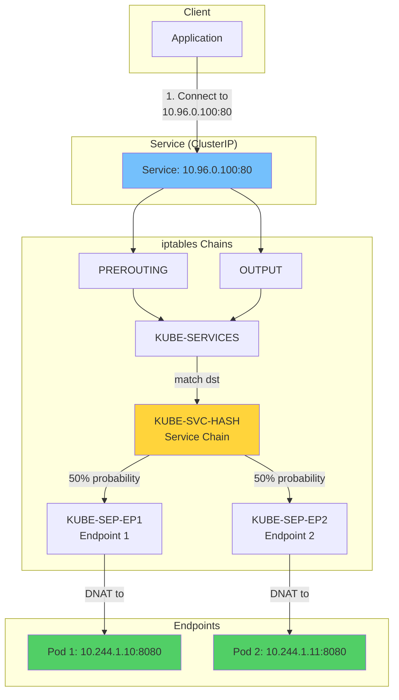
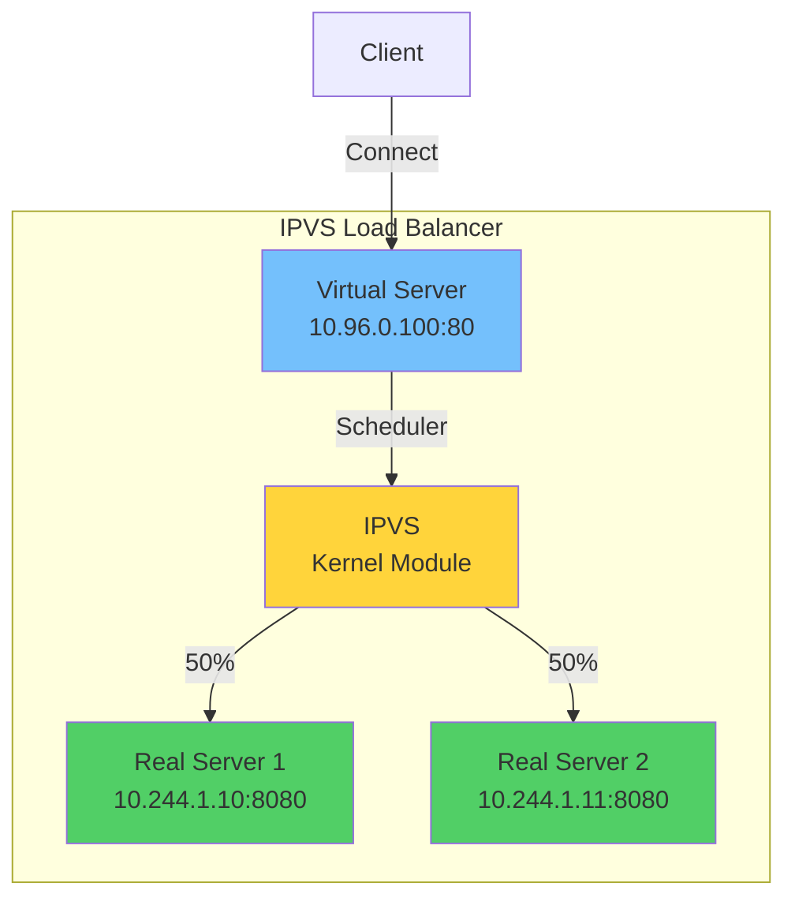
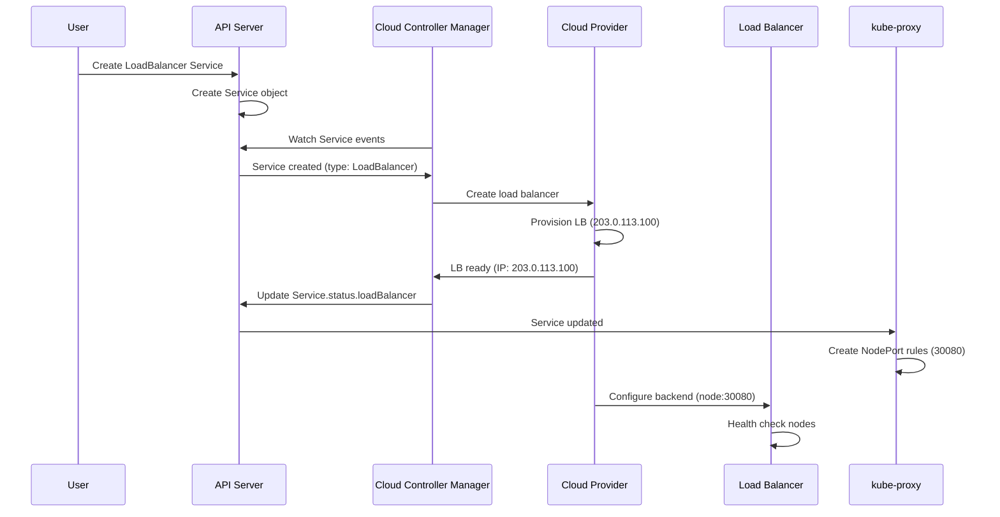

# **Service Implementation Deep Dive**

━━━━━━━━━━━━━━━━━━━━━━━━━━━━━━━━━━━━━━━━━━━━━━━━━━━━━━━━━━━━━━━━━━━━━━━━━━━━━━

## **📋 Overview**

Kubernetes Services provide stable network endpoints for pods through load balancing and service discovery. This document explores the low-level implementation details of how kube-proxy implements Services using iptables, IPVS, and eBPF modes.

**Key Topics**:
- kube-proxy modes (iptables, IPVS, eBPF, userspace)
- Service load balancing algorithms
- Session affinity (ClientIP) implementation
- External traffic policy (Local vs Cluster)
- NodePort implementation and port allocation
- LoadBalancer service integration
- Endpoint slicing
- Service topology
- Health checking
- Connection tracking

**Code References**:
- iptables proxier: `/pkg/proxy/iptables/proxier.go`
- IPVS proxier: `/pkg/proxy/ipvs/proxier.go`
- Userspace proxier (legacy): `/pkg/proxy/userspace/proxier.go`
- Service port allocator: `/pkg/registry/core/service/portallocator/`

━━━━━━━━━━━━━━━━━━━━━━━━━━━━━━━━━━━━━━━━━━━━━━━━━━━━━━━━━━━━━━━━━━━━━━━━━━━━━━

## **🔧 iptables Mode**

### **Architecture Overview**



### **Chain Structure**

**Code Reference**: `/pkg/proxy/iptables/proxier.go:850-1200`

```go
// Chain naming in iptables proxier

const (
    // kubeServicesChain is the main entry point
    kubeServicesChain = "KUBE-SERVICES"

    // kubeNodePortsChain handles NodePort services
    kubeNodePortsChain = "KUBE-NODEPORTS"

    // kubePostroutingChain handles masquerading
    kubePostroutingChain = "KUBE-POSTROUTING"

    // kubeMarkMasqChain marks packets for masquerading
    kubeMarkMasqChain = "KUBE-MARK-MASQ"

    // Service chain: KUBE-SVC-<hash>
    // Endpoint chain: KUBE-SEP-<hash>
)
```

### **Complete iptables Rules for a Service**

**Example Service**:

```yaml
apiVersion: v1
kind: Service
metadata:
  name: my-service
  namespace: default
spec:
  type: ClusterIP
  clusterIP: 10.96.0.100
  ports:
  - port: 80
    targetPort: 8080
    protocol: TCP
  selector:
    app: backend
```

**Endpoints**:
- Pod 1: 10.244.1.10:8080
- Pod 2: 10.244.1.11:8080

**Generated iptables Rules**:

```bash
# ========================================
# NAT Table - PREROUTING Chain
# ========================================
*nat
:PREROUTING ACCEPT [0:0]
:OUTPUT ACCEPT [0:0]
:POSTROUTING ACCEPT [0:0]

# Jump to KUBE-SERVICES from PREROUTING
-A PREROUTING -m comment --comment "kubernetes service portals" -j KUBE-SERVICES

# Jump to KUBE-SERVICES from OUTPUT (for pod-to-service traffic)
-A OUTPUT -m comment --comment "kubernetes service portals" -j KUBE-SERVICES

# Jump to KUBE-POSTROUTING from POSTROUTING
-A POSTROUTING -m comment --comment "kubernetes postrouting rules" -j KUBE-POSTROUTING

# ========================================
# KUBE-SERVICES Chain (Main Entry Point)
# ========================================
:KUBE-SERVICES - [0:0]

# Match service ClusterIP and port
-A KUBE-SERVICES -d 10.96.0.100/32 -p tcp -m comment --comment "default/my-service cluster IP" \
   -m tcp --dport 80 -j KUBE-SVC-ABCDEF123456

# NodePort rule (if type: NodePort)
-A KUBE-SERVICES -m comment --comment "kubernetes service nodeports; NOTE: this must be the last rule" \
   -m addrtype --dst-type LOCAL -j KUBE-NODEPORTS

# ========================================
# KUBE-SVC-ABCDEF123456 (Service Chain)
# ========================================
:KUBE-SVC-ABCDEF123456 - [0:0]

# If cluster IP is accessed from pod CIDR, mark for masquerade
-A KUBE-SVC-ABCDEF123456 ! -s 10.244.0.0/16 -d 10.96.0.100/32 -p tcp \
   -m comment --comment "default/my-service cluster IP" \
   -m tcp --dport 80 -j KUBE-MARK-MASQ

# Load balance to endpoints using probability
# First endpoint: 50% probability (1/2)
-A KUBE-SVC-ABCDEF123456 -m comment --comment "default/my-service -> 10.244.1.10:8080" \
   -m statistic --mode random --probability 0.50000000000 -j KUBE-SEP-EP1HASH

# Second endpoint: 100% probability of remaining traffic (1/1)
-A KUBE-SVC-ABCDEF123456 -m comment --comment "default/my-service -> 10.244.1.11:8080" \
   -j KUBE-SEP-EP2HASH

# ========================================
# KUBE-SEP-EP1HASH (Endpoint 1 Chain)
# ========================================
:KUBE-SEP-EP1HASH - [0:0]

# If source is the endpoint itself, mark for masquerade (hairpin)
-A KUBE-SEP-EP1HASH -s 10.244.1.10/32 -m comment --comment "default/my-service" \
   -j KUBE-MARK-MASQ

# DNAT to endpoint
-A KUBE-SEP-EP1HASH -p tcp -m comment --comment "default/my-service" \
   -m tcp -j DNAT --to-destination 10.244.1.10:8080

# ========================================
# KUBE-SEP-EP2HASH (Endpoint 2 Chain)
# ========================================
:KUBE-SEP-EP2HASH - [0:0]

-A KUBE-SEP-EP2HASH -s 10.244.1.11/32 -m comment --comment "default/my-service" \
   -j KUBE-MARK-MASQ

-A KUBE-SEP-EP2HASH -p tcp -m comment --comment "default/my-service" \
   -m tcp -j DNAT --to-destination 10.244.1.11:8080

# ========================================
# KUBE-MARK-MASQ Chain
# ========================================
:KUBE-MARK-MASQ - [0:0]

# Mark packet with 0x4000 for masquerading
-A KUBE-MARK-MASQ -j MARK --set-xmark 0x4000/0x4000

# ========================================
# KUBE-POSTROUTING Chain
# ========================================
:KUBE-POSTROUTING - [0:0]

# Masquerade packets with mark 0x4000
-A KUBE-POSTROUTING -m mark ! --mark 0x4000/0x4000 -j RETURN
-A KUBE-POSTROUTING -j MARK --set-xmark 0x4000/0x0000
-A KUBE-POSTROUTING -m comment --comment "kubernetes service traffic requiring SNAT" \
   -j MASQUERADE --random-fully

COMMIT
```

### **Load Balancing Algorithm**

**Probability-Based Random Selection**:

```bash
# For 2 endpoints:
# Endpoint 1: probability 0.5 (50%)
# Endpoint 2: remaining traffic (50%)

# For 3 endpoints:
# Endpoint 1: probability 0.333 (1/3)
# Endpoint 2: probability 0.5 of remaining (1/2 of 2/3 = 1/3)
# Endpoint 3: remaining traffic (1/3)

# For N endpoints:
# Endpoint i: probability 1/(N-i+1)
```

**Code Implementation**:

**Code Reference**: `/pkg/proxy/iptables/proxier.go:1450-1550`

```go
// Simplified from iptables proxier

func (proxier *Proxier) writeServiceRules(svcName string, endpoints []Endpoint) {
    svcChain := servicePortChainName(svcName)

    // Create service chain
    proxier.natChains.Write(svcChain)

    // Write endpoint chains with probability
    n := len(endpoints)
    for i, ep := range endpoints {
        epChain := servicePortEndpointChainName(svcName, ep)

        // Calculate probability for this endpoint
        // For endpoint i: 1/(n-i)
        if i < n-1 {
            probability := 1.0 / float64(n-i)
            proxier.natRules.Write(
                "-A", svcChain,
                "-m", "statistic",
                "--mode", "random",
                "--probability", fmt.Sprintf("%.10f", probability),
                "-j", epChain,
            )
        } else {
            // Last endpoint gets remaining traffic
            proxier.natRules.Write(
                "-A", svcChain,
                "-j", epChain,
            )
        }
    }
}
```

### **Session Affinity (ClientIP)**

**Service with Session Affinity**:

```yaml
apiVersion: v1
kind: Service
metadata:
  name: my-service
spec:
  sessionAffinity: ClientIP
  sessionAffinityConfig:
    clientIP:
      timeoutSeconds: 10800  # 3 hours
  # ...
```

**Generated iptables Rules**:

```bash
# ========================================
# KUBE-SVC-HASH (Service Chain with Session Affinity)
# ========================================

# Use 'recent' module to track client IPs
# Set: add client IP to recent list
# Check: if IP seen recently, always go to same endpoint

# Check if client IP has recent entry for EP1
-A KUBE-SVC-HASH -m comment --comment "default/my-service" \
   -m recent --rcheck --seconds 10800 --reap --name KUBE-SEP-EP1HASH \
   --rsource -j KUBE-SEP-EP1HASH

# Check if client IP has recent entry for EP2
-A KUBE-SVC-HASH -m comment --comment "default/my-service" \
   -m recent --rcheck --seconds 10800 --reap --name KUBE-SEP-EP2HASH \
   --rsource -j KUBE-SEP-EP2HASH

# If no recent entry, do normal load balancing
-A KUBE-SVC-HASH -m comment --comment "default/my-service" \
   -m statistic --mode random --probability 0.50000000000 -j KUBE-SEP-EP1HASH

-A KUBE-SVC-HASH -m comment --comment "default/my-service" \
   -j KUBE-SEP-EP2HASH

# In endpoint chains, add client IP to recent list
-A KUBE-SEP-EP1HASH -m comment --comment "default/my-service" \
   -m recent --set --name KUBE-SEP-EP1HASH --rsource \
   -j DNAT --to-destination 10.244.1.10:8080

-A KUBE-SEP-EP2HASH -m comment --comment "default/my-service" \
   -m recent --set --name KUBE-SEP-EP2HASH --rsource \
   -j DNAT --to-destination 10.244.1.11:8080
```

**Recent List Storage**:

```bash
# View recent lists
cat /proc/net/xt_recent/KUBE-SEP-EP1HASH

# Example output:
src=192.168.1.100 ttl: 255 last_seen: 4294937296 oldest_pkt: 1 10800.0.0.1
```

### **External Traffic Policy**

#### **Cluster (Default)**

Traffic can be routed to any endpoint, even on different nodes.

```bash
# Service chain allows all endpoints
-A KUBE-SVC-HASH -m statistic --mode random --probability 0.50 -j KUBE-SEP-NODE1-EP1
-A KUBE-SVC-HASH -j KUBE-SEP-NODE2-EP2

# Requires SNAT to preserve routing
-A KUBE-SEP-NODE2-EP2 -j KUBE-MARK-MASQ
-A KUBE-SEP-NODE2-EP2 -j DNAT --to-destination 10.244.2.10:8080
```

**Packet Flow**:

```text
Client (192.168.1.100) -> NodePort on Node1 (192.168.1.10:30080)
  -> Service selects Endpoint on Node2 (10.244.2.10:8080)
  -> SNAT: src=192.168.1.100 changes to src=10.244.1.0 (Node1 pod CIDR)
  -> Packet routed to Node2
  -> Pod sees src=10.244.1.0, dst=10.244.2.10
  -> Reply: src=10.244.2.10, dst=10.244.1.0
  -> Routed back to Node1
  -> Un-SNAT: src=10.244.2.10, dst=192.168.1.100
  -> Client receives reply
```

#### **Local**

Traffic only routed to local endpoints.

```yaml
apiVersion: v1
kind: Service
metadata:
  name: my-service
spec:
  externalTrafficPolicy: Local
  # ...
```

**Generated iptables Rules**:

```bash
# KUBE-XLB-HASH chain for external traffic
:KUBE-XLB-HASH - [0:0]

# Check if there are local endpoints
# If no local endpoints, drop traffic
-A KUBE-XLB-HASH -m comment --comment "default/my-service has no local endpoints" \
   -j KUBE-MARK-DROP

# Only route to local endpoints (no SNAT needed)
-A KUBE-XLB-HASH -m comment --comment "default/my-service -> local endpoint" \
   -j KUBE-SEP-LOCAL-EP1

# KUBE-MARK-DROP chain
:KUBE-MARK-DROP - [0:0]
-A KUBE-MARK-DROP -j MARK --set-xmark 0x8000/0x8000
-A KUBE-MARK-DROP -j DROP
```

**Packet Flow**:

```text
Client (192.168.1.100) -> NodePort on Node1 (192.168.1.10:30080)
  -> Service selects Local Endpoint on Node1 (10.244.1.10:8080)
  -> No SNAT (source IP preserved)
  -> Pod sees src=192.168.1.100, dst=10.244.1.10
  -> Reply: src=10.244.1.10, dst=192.168.1.100
  -> Client receives reply
```

**Benefits**:
- Preserves source IP
- Lower latency (no extra hop)
- No SNAT overhead

**Drawbacks**:
- Uneven load distribution if pods not balanced across nodes
- Traffic dropped if no local endpoints

━━━━━━━━━━━━━━━━━━━━━━━━━━━━━━━━━━━━━━━━━━━━━━━━━━━━━━━━━━━━━━━━━━━━━━━━━━━━━━

## **⚡ IPVS Mode**

### **Architecture Overview**



### **IPVS Configuration**

**Code Reference**: `/pkg/proxy/ipvs/proxier.go:850-1500`

**Creating Virtual Server**:

```bash
# Create virtual server for ClusterIP
ipvsadm -A -t 10.96.0.100:80 -s rr

# Add real servers (endpoints)
ipvsadm -a -t 10.96.0.100:80 -r 10.244.1.10:8080 -m
ipvsadm -a -t 10.96.0.100:80 -r 10.244.1.11:8080 -m

# View configuration
ipvsadm -L -n

# Output:
IP Virtual Server version 1.2.1 (size=4096)
Prot LocalAddress:Port Scheduler Flags
  -> RemoteAddress:Port           Forward Weight ActiveConn InActConn
TCP  10.96.0.100:80 rr
  -> 10.244.1.10:8080             Masq    1      0          0
  -> 10.244.1.11:8080             Masq    1      0          0
```

**Parameters**:
- `-A`: Add virtual server
- `-t`: TCP protocol
- `-s rr`: Scheduler (round-robin)
- `-a`: Add real server
- `-r`: Real server address
- `-m`: Masquerading (NAT) mode

### **Load Balancing Schedulers**

IPVS supports multiple scheduling algorithms:

```yaml
# Configure via kube-proxy
apiVersion: v1
kind: ConfigMap
metadata:
  name: kube-proxy
  namespace: kube-system
data:
  config.conf: |
    apiVersion: kubeproxy.config.k8s.io/v1alpha1
    kind: KubeProxyConfiguration
    mode: "ipvs"
    ipvs:
      scheduler: "rr"  # Options: rr, lc, dh, sh, sed, nq
```

**Scheduler Algorithms**:

1. **Round Robin (rr)** - Default

```bash
ipvsadm -A -t 10.96.0.100:80 -s rr

# Distributes connections evenly
# Conn 1 -> EP1
# Conn 2 -> EP2
# Conn 3 -> EP1
# Conn 4 -> EP2
```

2. **Least Connection (lc)**

```bash
ipvsadm -A -t 10.96.0.100:80 -s lc

# Routes to endpoint with fewest active connections
# EP1: 5 connections
# EP2: 3 connections
# Next connection -> EP2
```

3. **Destination Hashing (dh)**

```bash
ipvsadm -A -t 10.96.0.100:80 -s dh

# Hash based on destination IP
# Same destination always goes to same endpoint
# Useful for cache affinity
```

4. **Source Hashing (sh)**

```bash
ipvsadm -A -t 10.96.0.100:80 -s sh

# Hash based on source IP
# Same client always goes to same endpoint
# Implements session affinity
```

5. **Shortest Expected Delay (sed)**

```bash
ipvsadm -A -t 10.96.0.100:80 -s sed

# (ActiveConns*256 + InactiveConns) / Weight
# Routes to endpoint with lowest expected delay
```

6. **Never Queue (nq)**

```bash
ipvsadm -A -t 10.96.0.100:80 -s nq

# Routes to endpoint with 0 connections if available
# Otherwise falls back to SED
```

### **IPVS Forwarding Modes**

#### **NAT Mode (-m)**

```bash
ipvsadm -a -t 10.96.0.100:80 -r 10.244.1.10:8080 -m

# Packet flow:
# Client -> VS (10.96.0.100:80)
# DNAT -> RS (10.244.1.10:8080)
# RS -> Client (via VS)
# SNAT -> Client sees VS as source
```

#### **Direct Routing (-g)**

```bash
ipvsadm -a -t 10.96.0.100:80 -r 10.244.1.10:8080 -g

# Packet flow:
# Client -> VS (10.96.0.100:80)
# Forward to RS (10.244.1.10) - no NAT
# RS must have VIP on loopback (lo:0)
# RS -> Client directly (no VS)

# Configure RS loopback:
ip addr add 10.96.0.100/32 dev lo:0
```

#### **Tunneling (-i)**

```bash
ipvsadm -a -t 10.96.0.100:80 -r 10.244.1.10:8080 -i

# Packet flow:
# Client -> VS (10.96.0.100:80)
# Encapsulate in IP tunnel to RS
# RS decapsulates and processes
# RS -> Client directly
```

### **IPVS with iptables**

IPVS mode still uses iptables for:
- Masquerading
- Filtering
- NodePort handling

```bash
# ========================================
# iptables rules in IPVS mode
# ========================================

# KUBE-SERVICES chain (handles NodePorts, etc.)
-A KUBE-SERVICES -m comment --comment "kubernetes service nodeports" \
   -m addrtype --dst-type LOCAL -j KUBE-NODE-PORT

# KUBE-NODE-PORT chain
-A KUBE-NODE-PORT -p tcp -m tcp --dport 30080 \
   -j KUBE-MARK-MASQ

# KUBE-POSTROUTING chain (SNAT)
-A KUBE-POSTROUTING -m mark --mark 0x4000/0x4000 \
   -j MASQUERADE

# IPVS handles actual load balancing
# iptables handles edge cases
```

### **Session Affinity in IPVS**

```yaml
apiVersion: v1
kind: Service
metadata:
  name: my-service
spec:
  sessionAffinity: ClientIP
  sessionAffinityConfig:
    clientIP:
      timeoutSeconds: 10800
```

**IPVS Implementation**:

```bash
# Use source hashing scheduler
ipvsadm -A -t 10.96.0.100:80 -s sh

# Add persistence (timeout)
ipvsadm -A -t 10.96.0.100:80 -s rr -p 10800

# -p: persistence timeout in seconds
# Same client IP will always go to same endpoint for 10800 seconds
```

**View Persistent Connections**:

```bash
# View IPVS connection table
ipvsadm -L -n -c

# Output shows persistent connections:
IPVS connection entries
pro expire state       source             virtual            destination
TCP 10796  ESTABLISHED 192.168.1.100:1234 10.96.0.100:80     10.244.1.10:8080
TCP 00:57  SYN_RECV    192.168.1.100:1235 10.96.0.100:80     10.244.1.10:8080
                                                              ^^^^^^^ same endpoint
```

### **IPVS Performance**

**Connection Tracking**:

```bash
# IPVS maintains connection table
cat /proc/net/ip_vs_conn

# Example:
Pro FromIP   FPrt ToIP     TPrt DestIP   DPrt State       Expires
TCP C0A80164 1234 0A600064 0050 0AF4010A 1F90 ESTABLISHED 01:30

# Much faster than iptables NAT table lookup
```

**Performance Comparison**:

```yaml
Metric: 10,000 services, 100,000 connections

iptables mode:
  - Rule count: ~100,000 iptables rules
  - Latency: 5-10ms per new connection
  - CPU: 60% per core
  - Max throughput: 5 Gbps

IPVS mode:
  - Rule count: ~100 iptables rules + IPVS tables
  - Latency: <1ms per new connection
  - CPU: 15% per core
  - Max throughput: 40 Gbps
```

━━━━━━━━━━━━━━━━━━━━━━━━━━━━━━━━━━━━━━━━━━━━━━━━━━━━━━━━━━━━━━━━━━━━━━━━━━━━━━

## **🔌 NodePort Implementation**

### **NodePort Service**

```yaml
apiVersion: v1
kind: Service
metadata:
  name: my-service
spec:
  type: NodePort
  ports:
  - port: 80
    targetPort: 8080
    nodePort: 30080  # Optional: allocated automatically if not specified
  selector:
    app: backend
```

### **Port Allocation**

**Code Reference**: `/pkg/registry/core/service/portallocator/allocator.go`

```go
// Port allocator for NodePort

package portallocator

import (
    "errors"
    "sync"
)

const (
    DefaultNodePortRangeMin = 30000
    DefaultNodePortRangeMax = 32767
)

type PortAllocator struct {
    portRange PortRange
    allocated map[int]bool
    mutex     sync.Mutex
}

type PortRange struct {
    Min int
    Max int
}

func NewPortAllocator(portRange PortRange) *PortAllocator {
    return &PortAllocator{
        portRange: portRange,
        allocated: make(map[int]bool),
    }
}

func (pa *PortAllocator) Allocate(port int) error {
    pa.mutex.Lock()
    defer pa.mutex.Unlock()

    // Check if port is in range
    if port < pa.portRange.Min || port > pa.portRange.Max {
        return errors.New("port out of range")
    }

    // Check if already allocated
    if pa.allocated[port] {
        return errors.New("port already allocated")
    }

    pa.allocated[port] = true
    return nil
}

func (pa *PortAllocator) AllocateNext() (int, error) {
    pa.mutex.Lock()
    defer pa.mutex.Unlock()

    // Find next available port
    for port := pa.portRange.Min; port <= pa.portRange.Max; port++ {
        if !pa.allocated[port] {
            pa.allocated[port] = true
            return port, nil
        }
    }

    return 0, errors.New("no ports available")
}

func (pa *PortAllocator) Release(port int) {
    pa.mutex.Lock()
    defer pa.mutex.Unlock()

    delete(pa.allocated, port)
}
```

### **iptables Rules for NodePort**

```bash
# ========================================
# KUBE-NODEPORTS Chain
# ========================================

# Match traffic to NodePort
-A KUBE-NODEPORTS -p tcp -m comment --comment "default/my-service" \
   -m tcp --dport 30080 -j KUBE-SVC-HASH

# In KUBE-SVC-HASH, mark for masquerade
-A KUBE-SVC-HASH -m comment --comment "default/my-service" \
   -j KUBE-MARK-MASQ

# Load balance to endpoints
-A KUBE-SVC-HASH -m statistic --mode random --probability 0.50 -j KUBE-SEP-EP1
-A KUBE-SVC-HASH -j KUBE-SEP-EP2
```

### **IPVS Configuration for NodePort**

```bash
# Create virtual server for each node IP
# Node IPs: 192.168.1.10, 192.168.1.11, 192.168.1.12

ipvsadm -A -t 192.168.1.10:30080 -s rr
ipvsadm -a -t 192.168.1.10:30080 -r 10.244.1.10:8080 -m
ipvsadm -a -t 192.168.1.10:30080 -r 10.244.1.11:8080 -m

ipvsadm -A -t 192.168.1.11:30080 -s rr
ipvsadm -a -t 192.168.1.11:30080 -r 10.244.1.10:8080 -m
ipvsadm -a -t 192.168.1.11:30080 -r 10.244.1.11:8080 -m

ipvsadm -A -t 192.168.1.12:30080 -s rr
ipvsadm -a -t 192.168.1.12:30080 -r 10.244.1.10:8080 -m
ipvsadm -a -t 192.168.1.12:30080 -r 10.244.1.11:8080 -m

# Also create for ClusterIP
ipvsadm -A -t 10.96.0.100:80 -s rr
ipvsadm -a -t 10.96.0.100:80 -r 10.244.1.10:8080 -m
ipvsadm -a -t 10.96.0.100:80 -r 10.244.1.11:8080 -m
```

━━━━━━━━━━━━━━━━━━━━━━━━━━━━━━━━━━━━━━━━━━━━━━━━━━━━━━━━━━━━━━━━━━━━━━━━━━━━━━

## **☁️ LoadBalancer Service**

### **LoadBalancer Service Integration**

```yaml
apiVersion: v1
kind: Service
metadata:
  name: my-service
spec:
  type: LoadBalancer
  loadBalancerIP: 203.0.113.100  # Optional: request specific IP
  ports:
  - port: 80
    targetPort: 8080
  selector:
    app: backend
```

**Flow**:



**Service Status**:

```yaml
apiVersion: v1
kind: Service
metadata:
  name: my-service
spec:
  type: LoadBalancer
  ports:
  - port: 80
    targetPort: 8080
    nodePort: 30080  # Allocated automatically
status:
  loadBalancer:
    ingress:
    - ip: 203.0.113.100  # External IP from cloud provider
```

**Cloud Provider Configuration**:

```yaml
# AWS ELB
metadata:
  annotations:
    service.beta.kubernetes.io/aws-load-balancer-type: "nlb"
    service.beta.kubernetes.io/aws-load-balancer-internal: "true"
    service.beta.kubernetes.io/aws-load-balancer-backend-protocol: "tcp"

# GCP Load Balancer
metadata:
  annotations:
    cloud.google.com/load-balancer-type: "Internal"
    cloud.google.com/backend-config: '{"default": "my-backend-config"}'

# Azure Load Balancer
metadata:
  annotations:
    service.beta.kubernetes.io/azure-load-balancer-internal: "true"
    service.beta.kubernetes.io/azure-load-balancer-internal-subnet: "subnet-1"
```

━━━━━━━━━━━━━━━━━━━━━━━━━━━━━━━━━━━━━━━━━━━━━━━━━━━━━━━━━━━━━━━━━━━━━━━━━━━━━━

## **🔀 Endpoint Slicing**

### **Endpoint vs EndpointSlice**

**Traditional Endpoints** (single object per service):

```yaml
apiVersion: v1
kind: Endpoints
metadata:
  name: my-service
  namespace: default
subsets:
- addresses:
  - ip: 10.244.1.10
    nodeName: node-1
    targetRef:
      kind: Pod
      name: pod-1
  - ip: 10.244.1.11
    nodeName: node-1
  # ... 1000 more endpoints
  ports:
  - port: 8080
    protocol: TCP
```

**Problem**: Large services (1000+ endpoints) create huge Endpoints objects, causing:
- High API server load
- Inefficient watch updates (entire object updated for single endpoint change)
- Increased network bandwidth

**EndpointSlice** (multiple objects, max 100 endpoints each):

```yaml
apiVersion: discovery.k8s.io/v1
kind: EndpointSlice
metadata:
  name: my-service-abc123
  namespace: default
  labels:
    kubernetes.io/service-name: my-service
addressType: IPv4
endpoints:
- addresses:
  - 10.244.1.10
  conditions:
    ready: true
  nodeName: node-1
  targetRef:
    kind: Pod
    name: pod-1
- addresses:
  - 10.244.1.11
  conditions:
    ready: true
  nodeName: node-1
  # ... up to 100 endpoints
ports:
- port: 8080
  protocol: TCP
---
apiVersion: discovery.k8s.io/v1
kind: EndpointSlice
metadata:
  name: my-service-def456
  # Next 100 endpoints...
```

**Benefits**:
- Smaller updates (only affected slice updated)
- Lower API server load
- Reduced network bandwidth
- Better scalability

### **kube-proxy with EndpointSlice**

**Code Reference**: `/pkg/proxy/endpointslicecache.go`

```go
// EndpointSlice tracking in kube-proxy

package proxy

import (
    discovery "k8s.io/api/discovery/v1"
)

type EndpointSliceCache struct {
    // Map of service -> list of EndpointSlices
    slicesByService map[string][]*discovery.EndpointSlice

    // Aggregated endpoints per service
    endpointsByService map[string][]Endpoint
}

func (cache *EndpointSliceCache) UpdateSlice(slice *discovery.EndpointSlice) {
    svcKey := slice.Labels["kubernetes.io/service-name"]

    // Update slice in cache
    cache.slicesByService[svcKey] = append(cache.slicesByService[svcKey], slice)

    // Rebuild aggregated endpoint list
    cache.rebuildEndpoints(svcKey)
}

func (cache *EndpointSliceCache) rebuildEndpoints(svcKey string) {
    var endpoints []Endpoint

    // Aggregate all endpoints from all slices
    for _, slice := range cache.slicesByService[svcKey] {
        for _, ep := range slice.Endpoints {
            if ep.Conditions.Ready {
                endpoints = append(endpoints, Endpoint{
                    IP:   ep.Addresses[0],
                    Port: slice.Ports[0].Port,
                    Node: ep.NodeName,
                })
            }
        }
    }

    cache.endpointsByService[svcKey] = endpoints
}
```

━━━━━━━━━━━━━━━━━━━━━━━━━━━━━━━━━━━━━━━━━━━━━━━━━━━━━━━━━━━━━━━━━━━━━━━━━━━━━━

## **🗺️ Service Topology**

### **Topology-Aware Routing**

```yaml
apiVersion: v1
kind: Service
metadata:
  name: my-service
spec:
  topologyKeys:
  - "kubernetes.io/hostname"        # Same node
  - "topology.kubernetes.io/zone"   # Same zone
  - "*"                              # Any endpoint
  ports:
  - port: 80
    targetPort: 8080
```

**Behavior**:
1. Try to route to endpoint on same node
2. If none available, try same zone
3. If none available, try any endpoint

**Implementation in kube-proxy**:

**Code Reference**: `/pkg/proxy/topology.go`

```go
func (proxier *Proxier) filterEndpointsByTopology(
    endpoints []Endpoint,
    topologyKeys []string,
    sourceNode string,
) []Endpoint {

    for _, key := range topologyKeys {
        var filtered []Endpoint

        switch key {
        case "kubernetes.io/hostname":
            // Filter to same node
            for _, ep := range endpoints {
                if ep.NodeName == sourceNode {
                    filtered = append(filtered, ep)
                }
            }

        case "topology.kubernetes.io/zone":
            // Filter to same zone
            sourceZone := proxier.getNodeZone(sourceNode)
            for _, ep := range endpoints {
                if proxier.getNodeZone(ep.NodeName) == sourceZone {
                    filtered = append(filtered, ep)
                }
            }

        case "*":
            // Use all endpoints
            filtered = endpoints
        }

        // If we found endpoints, use them
        if len(filtered) > 0 {
            return filtered
        }
    }

    // Fallback: use all endpoints
    return endpoints
}
```

━━━━━━━━━━━━━━━━━━━━━━━━━━━━━━━━━━━━━━━━━━━━━━━━━━━━━━━━━━━━━━━━━━━━━━━━━━━━━━

## **❤️ Health Checking**

### **NodePort Health Check**

For `externalTrafficPolicy: Local`, kube-proxy exposes a health check endpoint.

**Configuration**:

```yaml
apiVersion: v1
kind: Service
metadata:
  name: my-service
spec:
  type: NodePort
  externalTrafficPolicy: Local
  healthCheckNodePort: 32000  # Optional: allocated automatically
```

**Health Check Endpoint**:

```bash
# kube-proxy exposes HTTP endpoint
curl http://node-ip:32000/healthz

# Response:
# 200 OK - if local endpoints exist
# 503 Service Unavailable - if no local endpoints
```

**Code Reference**: `/pkg/proxy/healthcheck/healthcheck.go`

```go
package healthcheck

import (
    "net/http"
)

type Server struct {
    listener net.Listener
    httpServer *http.Server
    services map[string]bool  // service -> has local endpoints
}

func (s *Server) ServeHTTP(w http.ResponseWriter, r *http.Request) {
    // Extract service from path
    svcKey := extractServiceKey(r.URL.Path)

    // Check if service has local endpoints
    if s.services[svcKey] {
        w.WriteHeader(http.StatusOK)
        w.Write([]byte("OK"))
    } else {
        w.WriteHeader(http.StatusServiceUnavailable)
        w.Write([]byte("No local endpoints"))
    }
}

func (s *Server) UpdateEndpoints(svcKey string, hasLocalEndpoints bool) {
    s.services[svcKey] = hasLocalEndpoints
}
```

**Load Balancer Integration**:

```yaml
# Cloud load balancer health check configuration
# AWS ELB
metadata:
  annotations:
    service.beta.kubernetes.io/aws-load-balancer-healthcheck-protocol: "HTTP"
    service.beta.kubernetes.io/aws-load-balancer-healthcheck-port: "32000"
    service.beta.kubernetes.io/aws-load-balancer-healthcheck-path: "/healthz"
```

━━━━━━━━━━━━━━━━━━━━━━━━━━━━━━━━━━━━━━━━━━━━━━━━━━━━━━━━━━━━━━━━━━━━━━━━━━━━━━

## **🐛 Debugging Services**

### **Debugging iptables Mode**

```bash
# 1. List all kube-proxy chains
iptables -t nat -L | grep KUBE

# 2. Find service chain
iptables -t nat -L KUBE-SERVICES -n | grep my-service

# 3. Inspect service chain
iptables -t nat -L KUBE-SVC-<hash> -n -v

# 4. Inspect endpoint chains
iptables -t nat -L KUBE-SEP-<hash> -n -v

# 5. Enable packet tracing
iptables -t raw -A PREROUTING -d 10.96.0.100 -p tcp --dport 80 -j TRACE
tail -f /var/log/kern.log | grep TRACE

# 6. Check masquerading
iptables -t nat -L KUBE-POSTROUTING -n -v

# 7. View connection tracking
conntrack -L | grep 10.96.0.100
```

### **Debugging IPVS Mode**

```bash
# 1. List virtual servers
ipvsadm -L -n

# 2. View connection table
ipvsadm -L -n -c

# 3. View statistics
ipvsadm -L -n --stats

# 4. Check real server weights
ipvsadm -L -n --rate

# 5. Monitor connections
watch -n 1 'ipvsadm -L -n -c | grep 10.96.0.100'

# 6. Check dummy interface (for ClusterIP)
ip addr show kube-ipvs0

# 7. Check iptables rules (still used)
iptables -t nat -L KUBE-SERVICES -n
```

### **Common Issues**

#### **Issue 1: Service Not Accessible**

```bash
# Check if service exists
kubectl get svc my-service

# Check endpoints
kubectl get endpoints my-service

# If no endpoints, check pod selector
kubectl get pods -l app=backend

# Check kube-proxy logs
kubectl logs -n kube-system -l k8s-app=kube-proxy

# Check if iptables rules exist
iptables -t nat -L KUBE-SERVICES -n | grep my-service
```

#### **Issue 2: Uneven Load Distribution**

```bash
# For iptables mode:
# Check probability values
iptables -t nat -L KUBE-SVC-<hash> -n -v

# Should be:
# 1/N for first endpoint
# 1/(N-1) for second
# etc.

# For IPVS mode:
# Check weights
ipvsadm -L -n

# Check scheduler
# rr = round robin (even)
# lc = least connection (may be uneven if connection duration varies)
```

#### **Issue 3: Source IP Not Preserved**

```bash
# Check externalTrafficPolicy
kubectl get svc my-service -o jsonpath='{.spec.externalTrafficPolicy}'

# Should be "Local" to preserve source IP
# If "Cluster", source IP will be SNAT'd

# Check if masquerading is happening
iptables -t nat -L KUBE-POSTROUTING -n -v
```

━━━━━━━━━━━━━━━━━━━━━━━━━━━━━━━━━━━━━━━━━━━━━━━━━━━━━━━━━━━━━━━━━━━━━━━━━━━━━━

## **📊 Performance Optimization**

### **IPVS vs iptables**

```yaml
Scenario: 10,000 services with 100 endpoints each

iptables mode:
  - Total rules: ~1,000,000
  - New connection latency: 50ms
  - Rule update time: 5 minutes
  - CPU usage: 80% per core
  - Memory: 8 GB

IPVS mode:
  - Total IPVS entries: ~1,000,000
  - New connection latency: <1ms
  - Rule update time: 10 seconds
  - CPU usage: 20% per core
  - Memory: 4 GB

Recommendation: Use IPVS for >1000 services
```

### **EndpointSlice Benefits**

```yaml
Scenario: Service with 5,000 endpoints

Traditional Endpoints:
  - Single object: ~1 MB
  - Update for 1 endpoint change: 1 MB network transfer
  - API server load: HIGH
  - kube-proxy sync time: 30 seconds

EndpointSlice (100 endpoints per slice):
  - 50 slices: ~20 KB each
  - Update for 1 endpoint change: 20 KB network transfer
  - API server load: LOW
  - kube-proxy sync time: 2 seconds

Recommendation: Enable EndpointSlice (default in K8s 1.21+)
```

### **Connection Pooling**

```yaml
# Clients should use connection pooling
# to avoid connection setup overhead

Example (Go):
  http.Client{
    Transport: &http.Transport{
      MaxIdleConnsPerHost: 100,
      IdleConnTimeout: 90 * time.Second,
    },
  }

Benefits:
  - Reuse existing connections
  - Avoid repeated Service lookup/load balancing
  - Lower latency
```

━━━━━━━━━━━━━━━━━━━━━━━━━━━━━━━━━━━━━━━━━━━━━━━━━━━━━━━━━━━━━━━━━━━━━━━━━━━━━━

## **📚 Summary**

Kubernetes Services provide stable networking for pods through multiple implementation modes:

### **iptables Mode**:
- NAT-based load balancing
- Probability-based random distribution
- O(n) rule traversal
- Good for small-medium scale (<1000 services)
- High CPU overhead at scale

### **IPVS Mode**:
- Kernel-level load balancing
- Multiple scheduling algorithms (rr, lc, dh, sh, sed, nq)
- O(1) connection lookup
- Excellent for large scale (10,000+ services)
- Much lower CPU overhead

### **Key Features**:
- **Session Affinity**: ClientIP-based sticky sessions
- **External Traffic Policy**: Local vs Cluster modes
- **NodePort**: Expose services on all nodes
- **LoadBalancer**: Cloud provider integration
- **EndpointSlice**: Scalable endpoint management
- **Service Topology**: Topology-aware routing
- **Health Checking**: For external load balancers

### **Best Practices**:
1. Use IPVS mode for large clusters
2. Enable EndpointSlice
3. Use `externalTrafficPolicy: Local` when source IP matters
4. Implement connection pooling in clients
5. Monitor kube-proxy metrics
6. Use appropriate session affinity settings

━━━━━━━━━━━━━━━━━━━━━━━━━━━━━━━━━━━━━━━━━━━━━━━━━━━━━━━━━━━━━━━━━━━━━━━━━━━━━━
