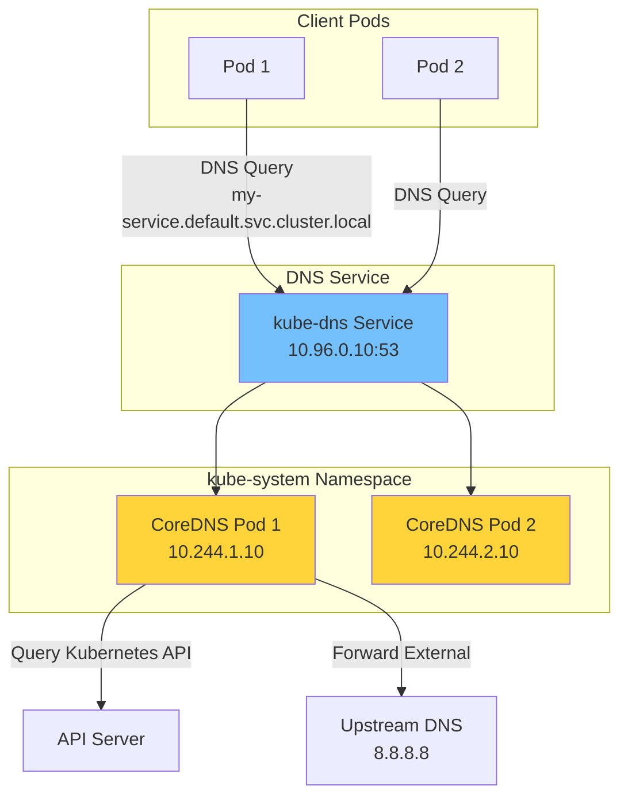
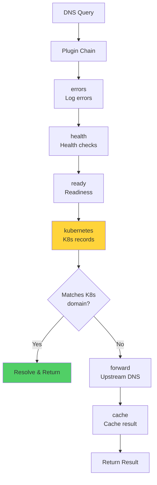
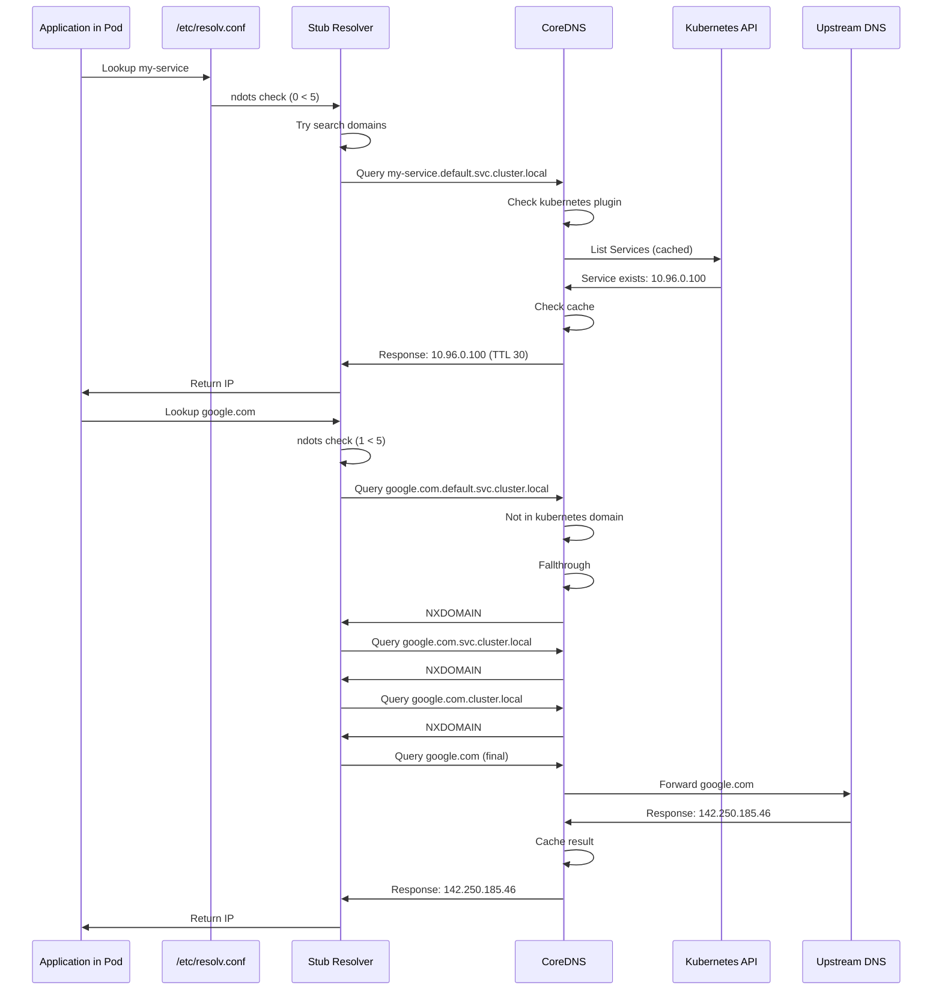

# **DNS Resolution in Kubernetes**

━━━━━━━━━━━━━━━━━━━━━━━━━━━━━━━━━━━━━━━━━━━━━━━━━━━━━━━━━━━━━━━━━━━━━━━━━━━━━━

## **📋 Overview**

DNS provides service discovery in Kubernetes, allowing pods to find services by name. CoreDNS is the default DNS server, resolving both Kubernetes service names and external domains. This document explores the complete DNS implementation from CoreDNS architecture to pod DNS configuration.

**Key Topics**:
- CoreDNS architecture and plugin system
- Service DNS records (A, SRV, CNAME)
- Pod DNS policy (Default, ClusterFirst, ClusterFirstWithHostNet, None)
- DNS resolution flow and query processing
- CoreDNS configuration (Corefile)
- DNS caching and TTL management
- External DNS integration
- DNS troubleshooting and debugging
- Performance tuning
- DNS security considerations

**Code References**:
- Kubelet DNS configuration: `/pkg/kubelet/network/dns/dns.go`
- CoreDNS manifests: `/cluster/addons/dns/coredns/`
- CoreDNS (external): `github.com/coredns/coredns`

━━━━━━━━━━━━━━━━━━━━━━━━━━━━━━━━━━━━━━━━━━━━━━━━━━━━━━━━━━━━━━━━━━━━━━━━━━━━━━

## **🏗️ CoreDNS Architecture**

### **CoreDNS Deployment**



**Deployment YAML**:

**Code Reference**: `/cluster/addons/dns/coredns/coredns.yaml.in`

```yaml
apiVersion: v1
kind: ServiceAccount
metadata:
  name: coredns
  namespace: kube-system
---
apiVersion: rbac.authorization.k8s.io/v1
kind: ClusterRole
metadata:
  name: system:coredns
rules:
- apiGroups:
  - ""
  resources:
  - endpoints
  - services
  - pods
  - namespaces
  verbs:
  - list
  - watch
- apiGroups:
  - discovery.k8s.io
  resources:
  - endpointslices
  verbs:
  - list
  - watch
---
apiVersion: rbac.authorization.k8s.io/v1
kind: ClusterRoleBinding
metadata:
  name: system:coredns
roleRef:
  apiGroup: rbac.authorization.k8s.io
  kind: ClusterRole
  name: system:coredns
subjects:
- kind: ServiceAccount
  name: coredns
  namespace: kube-system
---
apiVersion: v1
kind: ConfigMap
metadata:
  name: coredns
  namespace: kube-system
data:
  Corefile: |
    .:53 {
        errors
        health {
           lameduck 5s
        }
        ready
        kubernetes cluster.local in-addr.arpa ip6.arpa {
           pods insecure
           fallthrough in-addr.arpa ip6.arpa
           ttl 30
        }
        prometheus :9153
        forward . /etc/resolv.conf {
           max_concurrent 1000
        }
        cache 30
        loop
        reload
        loadbalance
    }
---
apiVersion: apps/v1
kind: Deployment
metadata:
  name: coredns
  namespace: kube-system
  labels:
    k8s-app: kube-dns
spec:
  replicas: 2
  selector:
    matchLabels:
      k8s-app: kube-dns
  template:
    metadata:
      labels:
        k8s-app: kube-dns
    spec:
      serviceAccountName: coredns
      tolerations:
      - key: node-role.kubernetes.io/control-plane
        operator: Exists
        effect: NoSchedule
      nodeSelector:
        kubernetes.io/os: linux
      affinity:
        podAntiAffinity:
          preferredDuringSchedulingIgnoredDuringExecution:
          - weight: 100
            podAffinityTerm:
              labelSelector:
                matchExpressions:
                - key: k8s-app
                  operator: In
                  values:
                  - kube-dns
              topologyKey: kubernetes.io/hostname
      containers:
      - name: coredns
        image: registry.k8s.io/coredns/coredns:v1.10.1
        imagePullPolicy: IfNotPresent
        resources:
          limits:
            memory: 170Mi
          requests:
            cpu: 100m
            memory: 70Mi
        args:
        - -conf
        - /etc/coredns/Corefile
        volumeMounts:
        - name: config-volume
          mountPath: /etc/coredns
          readOnly: true
        ports:
        - containerPort: 53
          name: dns
          protocol: UDP
        - containerPort: 53
          name: dns-tcp
          protocol: TCP
        - containerPort: 9153
          name: metrics
          protocol: TCP
        livenessProbe:
          httpGet:
            path: /health
            port: 8080
            scheme: HTTP
          initialDelaySeconds: 60
          timeoutSeconds: 5
          successThreshold: 1
          failureThreshold: 5
        readinessProbe:
          httpGet:
            path: /ready
            port: 8181
            scheme: HTTP
        securityContext:
          allowPrivilegeEscalation: false
          capabilities:
            add:
            - NET_BIND_SERVICE
            drop:
            - all
          readOnlyRootFilesystem: true
      dnsPolicy: Default
      volumes:
      - name: config-volume
        configMap:
          name: coredns
          items:
          - key: Corefile
            path: Corefile
---
apiVersion: v1
kind: Service
metadata:
  name: kube-dns
  namespace: kube-system
  annotations:
    prometheus.io/port: "9153"
    prometheus.io/scrape: "true"
  labels:
    k8s-app: kube-dns
    kubernetes.io/cluster-service: "true"
    kubernetes.io/name: "CoreDNS"
spec:
  selector:
    k8s-app: kube-dns
  clusterIP: 10.96.0.10  # Typically the 10th IP in service CIDR
  ports:
  - name: dns
    port: 53
    protocol: UDP
  - name: dns-tcp
    port: 53
    protocol: TCP
  - name: metrics
    port: 9153
    protocol: TCP
```

### **CoreDNS Plugin Architecture**

CoreDNS is built on a plugin system. Each plugin provides specific functionality.



**Core Plugins Used**:

1. **errors**: Logs errors
2. **health**: HTTP health endpoint
3. **ready**: HTTP readiness endpoint
4. **kubernetes**: Resolves Kubernetes services/pods
5. **prometheus**: Metrics endpoint
6. **forward**: Forwards to upstream DNS
7. **cache**: Caches responses
8. **loop**: Detects forwarding loops
9. **reload**: Auto-reload configuration
10. **loadbalance**: Round-robin A/AAAA records

━━━━━━━━━━━━━━━━━━━━━━━━━━━━━━━━━━━━━━━━━━━━━━━━━━━━━━━━━━━━━━━━━━━━━━━━━━━━━━

## **📝 DNS Record Types**

### **Service DNS Records**

#### **ClusterIP Service**

```yaml
apiVersion: v1
kind: Service
metadata:
  name: my-service
  namespace: default
spec:
  clusterIP: 10.96.0.100
  ports:
  - name: http
    port: 80
    targetPort: 8080
    protocol: TCP
  - name: https
    port: 443
    targetPort: 8443
    protocol: TCP
  selector:
    app: backend
```

**Generated DNS Records**:

```bash
# A Record (IPv4)
my-service.default.svc.cluster.local.  30  IN  A  10.96.0.100

# SRV Records (service discovery with port info)
_http._tcp.my-service.default.svc.cluster.local.  30  IN  SRV  0 100 80 my-service.default.svc.cluster.local.
_https._tcp.my-service.default.svc.cluster.local.  30  IN  SRV  0 100 443 my-service.default.svc.cluster.local.

# Query format:
# _<port-name>._<protocol>.<service>.<namespace>.svc.cluster.local
```

**DNS Query Examples**:

```bash
# Full FQDN
nslookup my-service.default.svc.cluster.local

# Output:
Server:   10.96.0.10
Address:  10.96.0.10#53

Name:     my-service.default.svc.cluster.local
Address:  10.96.0.100

# Short names (with search domains)
nslookup my-service

# Resolves to: my-service.default.svc.cluster.local
# (if queried from pod in default namespace)

# SRV record query
nslookup -type=SRV _http._tcp.my-service.default.svc.cluster.local

# Output:
_http._tcp.my-service.default.svc.cluster.local service = 0 100 80 my-service.default.svc.cluster.local.
```

#### **Headless Service**

```yaml
apiVersion: v1
kind: Service
metadata:
  name: my-headless-service
  namespace: default
spec:
  clusterIP: None  # Headless
  ports:
  - port: 80
  selector:
    app: backend
```

**Endpoints**:
- Pod 1: 10.244.1.10
- Pod 2: 10.244.1.11
- Pod 3: 10.244.2.10

**Generated DNS Records**:

```bash
# A Records (one per pod)
my-headless-service.default.svc.cluster.local.  30  IN  A  10.244.1.10
my-headless-service.default.svc.cluster.local.  30  IN  A  10.244.1.11
my-headless-service.default.svc.cluster.local.  30  IN  A  10.244.2.10

# Query returns all pod IPs
nslookup my-headless-service.default.svc.cluster.local

# Output:
Name:     my-headless-service.default.svc.cluster.local
Address:  10.244.1.10
Name:     my-headless-service.default.svc.cluster.local
Address:  10.244.1.11
Name:     my-headless-service.default.svc.cluster.local
Address:  10.244.2.10
```

**StatefulSet Pod DNS**:

```yaml
apiVersion: v1
kind: Service
metadata:
  name: my-statefulset-service
spec:
  clusterIP: None
  selector:
    app: statefulset
---
apiVersion: apps/v1
kind: StatefulSet
metadata:
  name: my-statefulset
spec:
  serviceName: my-statefulset-service
  replicas: 3
  selector:
    matchLabels:
      app: statefulset
  template:
    metadata:
      labels:
        app: statefulset
    # ...
```

**Individual Pod DNS**:

```bash
# Each pod gets a unique DNS name
<pod-name>.<service-name>.<namespace>.svc.cluster.local

my-statefulset-0.my-statefulset-service.default.svc.cluster.local -> 10.244.1.10
my-statefulset-1.my-statefulset-service.default.svc.cluster.local -> 10.244.1.11
my-statefulset-2.my-statefulset-service.default.svc.cluster.local -> 10.244.2.10

# Query individual pod
nslookup my-statefulset-0.my-statefulset-service.default.svc.cluster.local

# Output:
Name:     my-statefulset-0.my-statefulset-service.default.svc.cluster.local
Address:  10.244.1.10
```

#### **ExternalName Service**

```yaml
apiVersion: v1
kind: Service
metadata:
  name: external-database
  namespace: default
spec:
  type: ExternalName
  externalName: db.example.com
```

**Generated DNS Record**:

```bash
# CNAME record
external-database.default.svc.cluster.local.  30  IN  CNAME  db.example.com.

# Query
nslookup external-database.default.svc.cluster.local

# Output:
external-database.default.svc.cluster.local canonical name = db.example.com.
Name:     db.example.com
Address:  203.0.113.50
```

### **Pod DNS Records**

**Pod with Pod DNS Enabled**:

```yaml
apiVersion: v1
kind: Pod
metadata:
  name: my-pod
  namespace: default
spec:
  hostname: custom-hostname  # Optional
  subdomain: my-subdomain    # Optional
  containers:
  - name: app
    image: nginx
```

**Generated DNS Records**:

```bash
# Without hostname/subdomain:
# No DNS record (pods insecure mode)

# With hostname and subdomain:
custom-hostname.my-subdomain.default.svc.cluster.local -> <pod-ip>

# Pod IP-based DNS (if enabled):
10-244-1-10.default.pod.cluster.local -> 10.244.1.10
# (dashes replace dots in IP)
```

━━━━━━━━━━━━━━━━━━━━━━━━━━━━━━━━━━━━━━━━━━━━━━━━━━━━━━━━━━━━━━━━━━━━━━━━━━━━━━

## **🔧 Pod DNS Configuration**

### **DNS Policy**

**Code Reference**: `/pkg/kubelet/network/dns/dns.go:50-200`

```go
// DNS policy types

const (
    // DNSClusterFirstWithHostNet indicates that the pod should use cluster DNS first,
    // but if not resolved, use host network DNS
    DNSClusterFirstWithHostNet DNSPolicy = "ClusterFirstWithHostNet"

    // DNSClusterFirst indicates that the pod should use cluster DNS first
    DNSClusterFirst DNSPolicy = "ClusterFirst"

    // DNSDefault indicates that the pod should use the default DNS
    DNSDefault DNSPolicy = "Default"

    // DNSNone indicates that the pod should not use any DNS configuration
    DNSNone DNSPolicy = "None"
)
```

#### **ClusterFirst (Default)**

```yaml
apiVersion: v1
kind: Pod
metadata:
  name: my-pod
spec:
  dnsPolicy: ClusterFirst  # Default
  containers:
  - name: app
    image: nginx
```

**Generated /etc/resolv.conf**:

```bash
nameserver 10.96.0.10
search default.svc.cluster.local svc.cluster.local cluster.local
options ndots:5
```

**Breakdown**:
- `nameserver 10.96.0.10`: CoreDNS service IP
- `search default.svc.cluster.local svc.cluster.local cluster.local`: Search domains
- `ndots:5`: If query has <5 dots, try search domains first

**Search Domain Behavior**:

```bash
# Query: my-service
# Has 0 dots (<5), so try search domains:

1. my-service.default.svc.cluster.local
2. my-service.svc.cluster.local
3. my-service.cluster.local
4. my-service (as-is)

# Query: my-service.production.svc.cluster.local
# Has 4 dots (<5), so try search domains:

1. my-service.production.svc.cluster.local.default.svc.cluster.local (fails)
2. my-service.production.svc.cluster.local.svc.cluster.local (fails)
3. my-service.production.svc.cluster.local.cluster.local (fails)
4. my-service.production.svc.cluster.local (succeeds)

# Query: google.com
# Has 1 dot (<5), so try search domains:

1. google.com.default.svc.cluster.local (fails)
2. google.com.svc.cluster.local (fails)
3. google.com.cluster.local (fails)
4. google.com (succeeds)

# To avoid search domain attempts, use trailing dot:
# google.com. (has absolute FQDN, skips search)
```

#### **Default**

```yaml
apiVersion: v1
kind: Pod
metadata:
  name: my-pod
spec:
  dnsPolicy: Default
  containers:
  - name: app
    image: nginx
```

**Generated /etc/resolv.conf**:

```bash
# Inherits from node's /etc/resolv.conf

nameserver 8.8.8.8
nameserver 8.8.4.4
search example.com
options ndots:1
```

**Use Cases**:
- Pods that need to use host DNS
- Pods that don't need Kubernetes service discovery

#### **ClusterFirstWithHostNet**

```yaml
apiVersion: v1
kind: Pod
metadata:
  name: my-pod
spec:
  hostNetwork: true
  dnsPolicy: ClusterFirstWithHostNet
  containers:
  - name: app
    image: nginx
```

**Generated /etc/resolv.conf**:

```bash
nameserver 10.96.0.10
search default.svc.cluster.local svc.cluster.local cluster.local
options ndots:5
```

**Use Cases**:
- Pods using `hostNetwork: true` but need K8s service discovery
- kube-proxy, CNI plugins, etc.

#### **None**

```yaml
apiVersion: v1
kind: Pod
metadata:
  name: my-pod
spec:
  dnsPolicy: None
  dnsConfig:
    nameservers:
    - 1.1.1.1
    - 1.0.0.1
    searches:
    - my-domain.com
    options:
    - name: ndots
      value: "2"
  containers:
  - name: app
    image: nginx
```

**Generated /etc/resolv.conf**:

```bash
nameserver 1.1.1.1
nameserver 1.0.0.1
search my-domain.com
options ndots:2
```

**Use Cases**:
- Complete custom DNS configuration
- Testing scenarios

### **DNS Configuration Implementation**

**Code Reference**: `/pkg/kubelet/network/dns/dns.go:220-350`

```go
// Simplified DNS configuration logic

package dns

import (
    "fmt"
    "os"
)

type Configurer struct {
    clusterDNS    []string  // ClusterDNS IPs
    clusterDomain string    // cluster.local
}

func (c *Configurer) GetPodDNS(pod *v1.Pod) (*PodDNS, error) {
    dnsPolicy := pod.Spec.DNSPolicy
    if dnsPolicy == "" {
        dnsPolicy = v1.DNSClusterFirst
    }

    switch dnsPolicy {
    case v1.DNSClusterFirstWithHostNet:
        return c.generateClusterFirstDNS(pod)

    case v1.DNSClusterFirst:
        if pod.Spec.HostNetwork {
            return c.getHostDNS()
        }
        return c.generateClusterFirstDNS(pod)

    case v1.DNSDefault:
        return c.getHostDNS()

    case v1.DNSNone:
        return c.generateCustomDNS(pod)

    default:
        return nil, fmt.Errorf("unknown DNS policy: %s", dnsPolicy)
    }
}

func (c *Configurer) generateClusterFirstDNS(pod *v1.Pod) (*PodDNS, error) {
    // Nameservers: CoreDNS service IPs
    nameservers := c.clusterDNS

    // Search domains
    searches := []string{
        fmt.Sprintf("%s.svc.%s", pod.Namespace, c.clusterDomain),
        fmt.Sprintf("svc.%s", c.clusterDomain),
        c.clusterDomain,
    }

    // Options
    options := []string{"ndots:5"}

    // Merge with pod's dnsConfig if specified
    if pod.Spec.DNSConfig != nil {
        nameservers = append(nameservers, pod.Spec.DNSConfig.Nameservers...)
        searches = append(searches, pod.Spec.DNSConfig.Searches...)
        options = append(options, formatOptions(pod.Spec.DNSConfig.Options)...)
    }

    return &PodDNS{
        Nameservers: nameservers,
        Searches:    searches,
        Options:     options,
    }, nil
}

func (c *Configurer) getHostDNS() (*PodDNS, error) {
    // Read /etc/resolv.conf from host
    content, err := os.ReadFile("/etc/resolv.conf")
    if err != nil {
        return nil, err
    }

    return parseResolvConf(content), nil
}

func (c *Configurer) generateCustomDNS(pod *v1.Pod) (*PodDNS, error) {
    if pod.Spec.DNSConfig == nil {
        return &PodDNS{}, nil
    }

    return &PodDNS{
        Nameservers: pod.Spec.DNSConfig.Nameservers,
        Searches:    pod.Spec.DNSConfig.Searches,
        Options:     formatOptions(pod.Spec.DNSConfig.Options),
    }, nil
}

func (c *Configurer) WriteDNSConfig(pod *v1.Pod, resolvPath string) error {
    dns, err := c.GetPodDNS(pod)
    if err != nil {
        return err
    }

    // Generate resolv.conf content
    var content string
    for _, ns := range dns.Nameservers {
        content += fmt.Sprintf("nameserver %s\n", ns)
    }
    if len(dns.Searches) > 0 {
        content += fmt.Sprintf("search %s\n", strings.Join(dns.Searches, " "))
    }
    if len(dns.Options) > 0 {
        content += fmt.Sprintf("options %s\n", strings.Join(dns.Options, " "))
    }

    // Write to file
    return os.WriteFile(resolvPath, []byte(content), 0644)
}
```

━━━━━━━━━━━━━━━━━━━━━━━━━━━━━━━━━━━━━━━━━━━━━━━━━━━━━━━━━━━━━━━━━━━━━━━━━━━━━━

## **🔄 DNS Resolution Flow**

### **Complete Query Flow**



### **CoreDNS Kubernetes Plugin**

**Plugin Configuration**:

```text
kubernetes cluster.local in-addr.arpa ip6.arpa {
    pods insecure
    fallthrough in-addr.arpa ip6.arpa
    ttl 30
}
```

**Parameters**:
- `cluster.local in-addr.arpa ip6.arpa`: Zones to handle
- `pods insecure`: Enable pod DNS records
- `fallthrough`: If not found, pass to next plugin
- `ttl 30`: DNS record TTL (30 seconds)

**Query Processing** (simplified from CoreDNS source):

```go
// Simplified from github.com/coredns/coredns/plugin/kubernetes

func (k *Kubernetes) ServeDNS(ctx context.Context, w dns.ResponseWriter, r *dns.Msg) (int, error) {
    // Extract query name
    qname := r.Question[0].Name

    // Check if query is for kubernetes domain
    if !k.inZone(qname) {
        // Not our zone, fallthrough to next plugin
        return plugin.NextOrFailure(k.Name(), k.Next, ctx, w, r)
    }

    // Parse query: service-name.namespace.svc.cluster.local
    parts := strings.Split(qname, ".")

    if len(parts) >= 5 && parts[len(parts)-5] == "svc" {
        // Service query
        namespace := parts[len(parts)-4]
        serviceName := parts[len(parts)-5]

        // Lookup service
        svc, err := k.getService(namespace, serviceName)
        if err != nil {
            // Service not found
            return k.errorResponse(w, r, dns.RcodeNameError)
        }

        // Build response
        records := k.buildServiceRecords(svc, qname)
        return k.writeResponse(w, r, records)
    }

    // ... handle other query types (pods, endpoints, etc.)

    return plugin.NextOrFailure(k.Name(), k.Next, ctx, w, r)
}

func (k *Kubernetes) getService(namespace, name string) (*v1.Service, error) {
    // Query from cache (watches Kubernetes API)
    return k.serviceCache.Get(namespace, name)
}

func (k *Kubernetes) buildServiceRecords(svc *v1.Service, qname string) []dns.RR {
    var records []dns.RR

    if svc.Spec.ClusterIP != "None" {
        // ClusterIP service: return A record
        records = append(records, &dns.A{
            Hdr: dns.RR_Header{
                Name:   qname,
                Rrtype: dns.TypeA,
                Class:  dns.ClassINET,
                Ttl:    k.ttl,
            },
            A: net.ParseIP(svc.Spec.ClusterIP),
        })
    } else {
        // Headless service: return A records for all endpoints
        endpoints := k.getEndpoints(svc.Namespace, svc.Name)
        for _, ep := range endpoints {
            records = append(records, &dns.A{
                Hdr: dns.RR_Header{
                    Name:   qname,
                    Rrtype: dns.TypeA,
                    Class:  dns.ClassINET,
                    Ttl:    k.ttl,
                },
                A: net.ParseIP(ep.IP),
            })
        }
    }

    return records
}
```

━━━━━━━━━━━━━━━━━━━━━━━━━━━━━━━━━━━━━━━━━━━━━━━━━━━━━━━━━━━━━━━━━━━━━━━━━━━━━━

## **⚡ Caching and Performance**

### **CoreDNS Cache Plugin**

**Configuration**:

```text
.:53 {
    # ... other plugins
    cache 30
}
```

**Cache Behavior**:

```bash
# First query
nslookup my-service.default.svc.cluster.local

# CoreDNS:
# - Query kubernetes plugin
# - Get result: 10.96.0.100 (TTL 30)
# - Cache result for 30 seconds
# - Return to client

# Second query (within 30 seconds)
nslookup my-service.default.svc.cluster.local

# CoreDNS:
# - Check cache
# - Return cached result (no API query)
```

**Cache Statistics**:

```bash
# Query Prometheus metrics
curl http://coredns:9153/metrics | grep coredns_cache

# Example output:
coredns_cache_entries{server="dns://:53",type="success"} 1234
coredns_cache_hits_total{server="dns://:53",type="success"} 5678
coredns_cache_misses_total{server="dns://:53"} 910
```

### **Client-Side Caching**

Applications should cache DNS results to reduce lookup overhead.

**Example (Go)**:

```go
// Custom DNS resolver with caching
type CachedResolver struct {
    resolver *net.Resolver
    cache    map[string]cachedResult
    ttl      time.Duration
    mutex    sync.RWMutex
}

type cachedResult struct {
    ips       []net.IP
    expiresAt time.Time
}

func (r *CachedResolver) LookupIP(host string) ([]net.IP, error) {
    // Check cache
    r.mutex.RLock()
    if cached, ok := r.cache[host]; ok && time.Now().Before(cached.expiresAt) {
        r.mutex.RUnlock()
        return cached.ips, nil
    }
    r.mutex.RUnlock()

    // Cache miss: perform lookup
    ips, err := r.resolver.LookupIP(context.Background(), "ip4", host)
    if err != nil {
        return nil, err
    }

    // Store in cache
    r.mutex.Lock()
    r.cache[host] = cachedResult{
        ips:       ips,
        expiresAt: time.Now().Add(r.ttl),
    }
    r.mutex.Unlock()

    return ips, nil
}
```

### **Performance Tuning**

**Corefile Optimizations**:

```text
.:53 {
    errors
    health {
       lameduck 5s
    }
    ready

    # Increase cache size and TTL
    cache 300 {
        success 10000  # Cache 10k successful responses
        denial 1000    # Cache 1k NXDOMAIN responses
    }

    # Kubernetes plugin optimizations
    kubernetes cluster.local in-addr.arpa ip6.arpa {
        pods insecure
        fallthrough in-addr.arpa ip6.arpa
        ttl 60  # Increase TTL to 60 seconds
    }

    # Forward with more concurrency
    forward . /etc/resolv.conf {
        max_concurrent 10000
        expire 10s
        policy sequential
    }

    # Reload configuration quickly
    reload 10s

    # Load balance
    loadbalance round_robin
}
```

**Resource Allocation**:

```yaml
# CoreDNS deployment
spec:
  template:
    spec:
      containers:
      - name: coredns
        resources:
          requests:
            cpu: 200m      # Increase for high query rate
            memory: 128Mi  # Increase for large cache
          limits:
            memory: 256Mi
```

**Horizontal Scaling**:

```yaml
# Scale CoreDNS replicas
apiVersion: apps/v1
kind: Deployment
metadata:
  name: coredns
spec:
  replicas: 5  # Increase for high load

  # Add HPA
---
apiVersion: autoscaling/v2
kind: HorizontalPodAutoscaler
metadata:
  name: coredns-hpa
spec:
  scaleTargetRef:
    apiVersion: apps/v1
    kind: Deployment
    name: coredns
  minReplicas: 2
  maxReplicas: 10
  metrics:
  - type: Resource
    resource:
      name: cpu
      target:
        type: Utilization
        averageUtilization: 70
```

━━━━━━━━━━━━━━━━━━━━━━━━━━━━━━━━━━━━━━━━━━━━━━━━━━━━━━━━━━━━━━━━━━━━━━━━━━━━━━

## **🌐 External DNS Integration**

### **ExternalDNS**

ExternalDNS synchronizes Kubernetes services/ingresses with external DNS providers.

```yaml
apiVersion: apps/v1
kind: Deployment
metadata:
  name: external-dns
  namespace: kube-system
spec:
  selector:
    matchLabels:
      app: external-dns
  template:
    metadata:
      labels:
        app: external-dns
    spec:
      serviceAccountName: external-dns
      containers:
      - name: external-dns
        image: registry.k8s.io/external-dns/external-dns:v0.13.5
        args:
        - --source=service
        - --source=ingress
        - --domain-filter=example.com
        - --provider=aws  # or google, azure, cloudflare, etc.
        - --policy=sync
        - --txt-owner-id=k8s-cluster-1
        - --interval=1m
```

**Service Annotation**:

```yaml
apiVersion: v1
kind: Service
metadata:
  name: my-service
  annotations:
    external-dns.alpha.kubernetes.io/hostname: api.example.com
    external-dns.alpha.kubernetes.io/ttl: "300"
spec:
  type: LoadBalancer
  ports:
  - port: 80
  selector:
    app: api
```

**Result**:
- ExternalDNS creates DNS record: `api.example.com -> <LoadBalancer IP>`
- External clients can access via `api.example.com`

━━━━━━━━━━━━━━━━━━━━━━━━━━━━━━━━━━━━━━━━━━━━━━━━━━━━━━━━━━━━━━━━━━━━━━━━━━━━━━

## **🔍 Troubleshooting DNS**

### **Common Issues**

#### **Issue 1: Cannot Resolve Service**

```bash
# 1. Check if DNS service exists
kubectl get svc -n kube-system kube-dns

# 2. Check CoreDNS pods
kubectl get pods -n kube-system -l k8s-app=kube-dns

# 3. Check pod's resolv.conf
kubectl exec my-pod -- cat /etc/resolv.conf

# Should contain:
# nameserver 10.96.0.10
# search default.svc.cluster.local svc.cluster.local cluster.local

# 4. Test DNS from pod
kubectl exec my-pod -- nslookup kubernetes.default.svc.cluster.local

# 5. Check CoreDNS logs
kubectl logs -n kube-system -l k8s-app=kube-dns
```

#### **Issue 2: Slow DNS Resolution**

```bash
# 1. Check CoreDNS metrics
kubectl port-forward -n kube-system svc/kube-dns 9153:9153
curl http://localhost:9153/metrics | grep coredns_dns_request_duration

# 2. Check cache hit rate
curl http://localhost:9153/metrics | grep coredns_cache_hits

# Low hit rate? Increase cache size

# 3. Check for ndots issues
# Query: google.com
# With ndots:5, tries:
#   google.com.default.svc.cluster.local (NXDOMAIN)
#   google.com.svc.cluster.local (NXDOMAIN)
#   google.com.cluster.local (NXDOMAIN)
#   google.com (SUCCESS)

# Solution: Use FQDN with trailing dot
# google.com. (skips search domains)

# 4. Monitor query latency
kubectl exec my-pod -- time nslookup my-service
```

#### **Issue 3: DNS Timeouts**

```bash
# 1. Check CoreDNS CPU/memory
kubectl top pods -n kube-system -l k8s-app=kube-dns

# 2. Check for network policy blocking DNS
kubectl exec my-pod -- nslookup kubernetes.default.svc.cluster.local

# If timeout, check NetworkPolicy
kubectl get netpol -A

# Ensure DNS egress allowed:
apiVersion: networking.k8s.io/v1
kind: NetworkPolicy
metadata:
  name: allow-dns
spec:
  podSelector: {}
  policyTypes:
  - Egress
  egress:
  - to:
    - namespaceSelector:
        matchLabels:
          name: kube-system
    ports:
    - protocol: UDP
      port: 53

# 3. Check CoreDNS forward settings
kubectl get cm -n kube-system coredns -o yaml

# Increase max_concurrent if needed
```

### **Debugging Tools**

```bash
# 1. nslookup
kubectl exec my-pod -- nslookup my-service.default.svc.cluster.local

# 2. dig (more detailed)
kubectl exec my-pod -- dig my-service.default.svc.cluster.local

# Example output:
;; ANSWER SECTION:
my-service.default.svc.cluster.local. 30 IN A 10.96.0.100

;; Query time: 1 msec
;; SERVER: 10.96.0.10#53(10.96.0.10)

# 3. host
kubectl exec my-pod -- host my-service.default.svc.cluster.local

# 4. Test DNS directly (bypass resolv.conf)
kubectl exec my-pod -- nslookup my-service.default.svc.cluster.local 10.96.0.10

# 5. Check search domain expansion
kubectl exec my-pod -- sh -c 'echo my-service | strace -e trace=connect nslookup 2>&1 | grep connect'
```

### **CoreDNS Debug Logging**

```yaml
# Enable debug logging
apiVersion: v1
kind: ConfigMap
metadata:
  name: coredns
  namespace: kube-system
data:
  Corefile: |
    .:53 {
        log  # Enable query logging
        errors
        # ... rest of config
    }
```

**View Logs**:

```bash
kubectl logs -n kube-system -l k8s-app=kube-dns -f

# Example output:
[INFO] 10.244.1.10:45678 - 12345 "A IN my-service.default.svc.cluster.local. udp 59 false 512" NOERROR qr,aa,rd 106 0.000123s
```

━━━━━━━━━━━━━━━━━━━━━━━━━━━━━━━━━━━━━━━━━━━━━━━━━━━━━━━━━━━━━━━━━━━━━━━━━━━━━━

## **🔒 DNS Security**

### **DNS Spoofing Prevention**

**DNSSEC** (not commonly used in Kubernetes):

```text
# CoreDNS DNSSEC plugin
.:53 {
    dnssec {
        key file /etc/coredns/Kcluster.local.+013+12345
    }
    # ... other plugins
}
```

### **NetworkPolicy for DNS**

**Restrict DNS queries to CoreDNS only**:

```yaml
apiVersion: networking.k8s.io/v1
kind: NetworkPolicy
metadata:
  name: allow-dns-only
  namespace: default
spec:
  podSelector: {}
  policyTypes:
  - Egress
  egress:
  # Allow DNS to kube-system
  - to:
    - namespaceSelector:
        matchLabels:
          name: kube-system
    - podSelector:
        matchLabels:
          k8s-app: kube-dns
    ports:
    - protocol: UDP
      port: 53
    - protocol: TCP
      port: 53
  # Block other DNS servers
  # (no rule allowing port 53 to other destinations)
```

### **Prevent DNS Data Exfiltration**

```yaml
# Monitor for suspicious DNS queries
apiVersion: v1
kind: ConfigMap
metadata:
  name: coredns-security
data:
  Corefile: |
    .:53 {
        # Log all queries
        log

        # Block known bad domains
        block {
            malicious-domain.com
            phishing-site.com
        }

        # Rate limit queries per client
        ratelimit 100  # Max 100 queries/sec per IP

        # ... rest of config
    }
```

━━━━━━━━━━━━━━━━━━━━━━━━━━━━━━━━━━━━━━━━━━━━━━━━━━━━━━━━━━━━━━━━━━━━━━━━━━━━━━

## **📊 Monitoring and Metrics**

### **CoreDNS Metrics**

```yaml
# Prometheus ServiceMonitor
apiVersion: monitoring.coreos.com/v1
kind: ServiceMonitor
metadata:
  name: coredns
  namespace: kube-system
spec:
  selector:
    matchLabels:
      k8s-app: kube-dns
  endpoints:
  - port: metrics
    interval: 30s
```

**Key Metrics**:

```yaml
# Query rate
rate(coredns_dns_requests_total[5m])

# Query latency
histogram_quantile(0.99, rate(coredns_dns_request_duration_seconds_bucket[5m]))

# Cache hit rate
rate(coredns_cache_hits_total[5m]) / rate(coredns_dns_requests_total[5m])

# Error rate
rate(coredns_dns_responses_total{rcode="SERVFAIL"}[5m])
```

### **Alerting Rules**:

```yaml
groups:
- name: coredns
  rules:
  - alert: CoreDNSDown
    expr: up{job="kube-dns"} == 0
    for: 5m
    labels:
      severity: critical
    annotations:
      summary: "CoreDNS is down"

  - alert: HighDNSQueryLatency
    expr: histogram_quantile(0.99, rate(coredns_dns_request_duration_seconds_bucket[5m])) > 1
    for: 5m
    labels:
      severity: warning
    annotations:
      summary: "DNS query latency is high (>1s at p99)"

  - alert: LowCacheHitRate
    expr: rate(coredns_cache_hits_total[5m]) / rate(coredns_dns_requests_total[5m]) < 0.5
    for: 10m
    labels:
      severity: warning
    annotations:
      summary: "DNS cache hit rate is low (<50%)"
```

━━━━━━━━━━━━━━━━━━━━━━━━━━━━━━━━━━━━━━━━━━━━━━━━━━━━━━━━━━━━━━━━━━━━━━━━━━━━━━

## **📚 Summary**

Kubernetes DNS provides service discovery through CoreDNS:

### **CoreDNS Architecture**:
- Plugin-based architecture
- Watches Kubernetes API for services/endpoints
- Serves cluster-local DNS records
- Forwards external queries to upstream DNS

### **DNS Records**:
- **Services**: A records for ClusterIP, multiple A records for headless
- **SRV Records**: Port/protocol discovery
- **StatefulSets**: Individual pod DNS names
- **ExternalName**: CNAME records

### **DNS Policy**:
- **ClusterFirst**: Default, uses CoreDNS first
- **Default**: Uses node's DNS
- **ClusterFirstWithHostNet**: For hostNetwork pods
- **None**: Custom DNS configuration

### **Performance**:
- Cache queries (30s default TTL)
- Tune cache size for high load
- Use FQDN with trailing dot to avoid search domain overhead
- Scale CoreDNS horizontally
- Monitor cache hit rate

### **Best Practices**:
1. Use CoreDNS metrics for monitoring
2. Enable caching in applications
3. Use FQDN for external domains (trailing dot)
4. Tune ndots setting for your workload
5. Scale CoreDNS for high query rates
6. Implement NetworkPolicy for DNS security
7. Monitor query latency and error rates

━━━━━━━━━━━━━━━━━━━━━━━━━━━━━━━━━━━━━━━━━━━━━━━━━━━━━━━━━━━━━━━━━━━━━━━━━━━━━━
