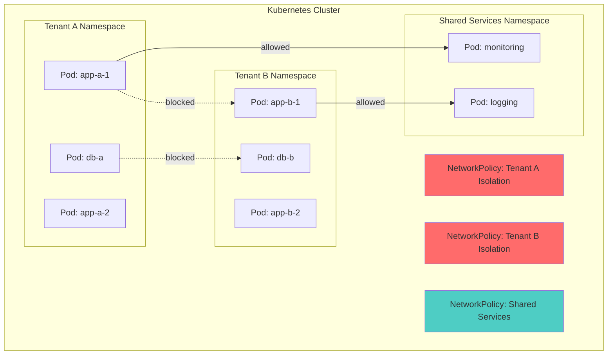
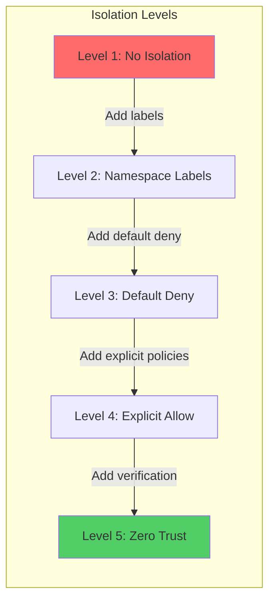
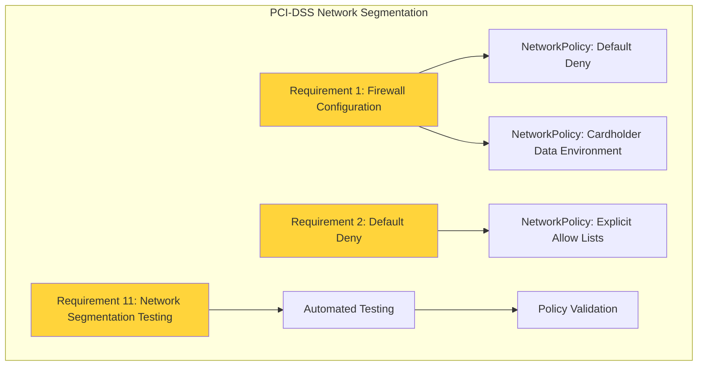
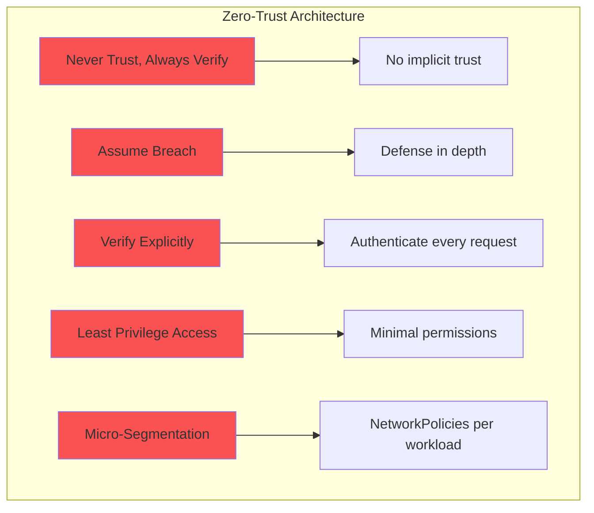

# **Network Segmentation in Kubernetes**

━━━━━━━━━━━━━━━━━━━━━━━━━━━━━━━━━━━━━━━━━━━━━━━━━━━━━━━━━━━━━━━━━━━━━━━━━━━━━━

## **📋 Overview**

Network segmentation in Kubernetes enables multi-tenancy, security isolation, and compliance through strategic use of NetworkPolicies, namespaces, and architectural patterns. This document covers comprehensive strategies for isolating workloads, implementing zero-trust architectures, and meeting regulatory compliance requirements.

**Key Topics**:
- Multi-tenancy isolation patterns
- Namespace-level segmentation strategies
- Default-deny NetworkPolicy patterns
- Compliance mapping (PCI-DSS, HIPAA, SOC2)
- Zero-trust network architecture
- Tenant separation models
- Policy templates and best practices

━━━━━━━━━━━━━━━━━━━━━━━━━━━━━━━━━━━━━━━━━━━━━━━━━━━━━━━━━━━━━━━━━━━━━━━━━━━━━━

## **🎯 Multi-Tenancy Network Isolation**

### **Tenancy Models**

Kubernetes supports two primary multi-tenancy models:

#### **Hard Multi-Tenancy**
```yaml
# Tenant completely isolated from each other
# Separate clusters per tenant (most secure)
# Use case: Different organizations, competitors
```

#### **Soft Multi-Tenancy**
```yaml
# Tenants share infrastructure but are isolated
# Namespace-based separation
# Use case: Different teams in same organization
```

### **Soft Multi-Tenancy Architecture**



### **Complete Tenant Isolation Example**

#### **Tenant A Namespace Setup**

```yaml
# tenant-a-namespace.yaml
apiVersion: v1
kind: Namespace
metadata:
  name: tenant-a
  labels:
    tenant: tenant-a
    isolation: strict
    compliance: pci-dss
---
# Default deny all traffic
apiVersion: networking.k8s.io/v1
kind: NetworkPolicy
metadata:
  name: default-deny-all
  namespace: tenant-a
spec:
  podSelector: {}
  policyTypes:
  - Ingress
  - Egress
---
# Allow intra-namespace communication
apiVersion: networking.k8s.io/v1
kind: NetworkPolicy
metadata:
  name: allow-same-namespace
  namespace: tenant-a
spec:
  podSelector: {}
  policyTypes:
  - Ingress
  - Egress
  ingress:
  - from:
    - podSelector: {}
  egress:
  - to:
    - podSelector: {}
---
# Allow DNS resolution
apiVersion: networking.k8s.io/v1
kind: NetworkPolicy
metadata:
  name: allow-dns
  namespace: tenant-a
spec:
  podSelector: {}
  policyTypes:
  - Egress
  egress:
  - to:
    - namespaceSelector:
        matchLabels:
          name: kube-system
    - podSelector:
        matchLabels:
          k8s-app: kube-dns
    ports:
    - protocol: UDP
      port: 53
    - protocol: TCP
      port: 53
---
# Allow monitoring from shared services
apiVersion: networking.k8s.io/v1
kind: NetworkPolicy
metadata:
  name: allow-monitoring
  namespace: tenant-a
spec:
  podSelector:
    matchLabels:
      monitoring: enabled
  policyTypes:
  - Ingress
  ingress:
  - from:
    - namespaceSelector:
        matchLabels:
          name: monitoring
    - podSelector:
        matchLabels:
          app: prometheus
    ports:
    - protocol: TCP
      port: 9090
---
# Allow egress to external services (controlled)
apiVersion: networking.k8s.io/v1
kind: NetworkPolicy
metadata:
  name: allow-external-egress
  namespace: tenant-a
spec:
  podSelector:
    matchLabels:
      external-access: allowed
  policyTypes:
  - Egress
  egress:
  - to:
    - ipBlock:
        cidr: 0.0.0.0/0
        except:
        - 169.254.169.254/32  # Block metadata service
        - 10.0.0.0/8          # Block internal networks
        - 172.16.0.0/12
        - 192.168.0.0/16
    ports:
    - protocol: TCP
      port: 443
    - protocol: TCP
      port: 80
```

#### **Tenant B Namespace Setup**

```yaml
# tenant-b-namespace.yaml
apiVersion: v1
kind: Namespace
metadata:
  name: tenant-b
  labels:
    tenant: tenant-b
    isolation: strict
    compliance: hipaa
---
# Default deny all traffic
apiVersion: networking.k8s.io/v1
kind: NetworkPolicy
metadata:
  name: default-deny-all
  namespace: tenant-b
spec:
  podSelector: {}
  policyTypes:
  - Ingress
  - Egress
---
# Allow intra-namespace communication
apiVersion: networking.k8s.io/v1
kind: NetworkPolicy
metadata:
  name: allow-same-namespace
  namespace: tenant-b
spec:
  podSelector: {}
  policyTypes:
  - Ingress
  - Egress
  ingress:
  - from:
    - podSelector: {}
  egress:
  - to:
    - podSelector: {}
---
# Allow DNS resolution
apiVersion: networking.k8s.io/v1
kind: NetworkPolicy
metadata:
  name: allow-dns
  namespace: tenant-b
spec:
  podSelector: {}
  policyTypes:
  - Egress
  egress:
  - to:
    - namespaceSelector:
        matchLabels:
          name: kube-system
    ports:
    - protocol: UDP
      port: 53
---
# HIPAA-specific: Encryption required for external traffic
apiVersion: networking.k8s.io/v1
kind: NetworkPolicy
metadata:
  name: allow-encrypted-external
  namespace: tenant-b
spec:
  podSelector:
    matchLabels:
      external-access: allowed
  policyTypes:
  - Egress
  egress:
  - to:
    - ipBlock:
        cidr: 0.0.0.0/0
        except:
        - 169.254.169.254/32
        - 10.0.0.0/8
        - 172.16.0.0/12
        - 192.168.0.0/16
    ports:
    - protocol: TCP
      port: 443  # Only HTTPS allowed
```

━━━━━━━━━━━━━━━━━━━━━━━━━━━━━━━━━━━━━━━━━━━━━━━━━━━━━━━━━━━━━━━━━━━━━━━━━━━━━━

## **🔒 Namespace-Level Isolation Strategies**

### **Isolation Patterns**



### **Level 1: No Isolation (Default Kubernetes)**

```yaml
# No NetworkPolicies applied
# All pods can communicate freely
# NOT RECOMMENDED for production
```

### **Level 2: Namespace Label-Based Isolation**

```yaml
apiVersion: v1
kind: Namespace
metadata:
  name: development
  labels:
    environment: dev
    isolation-level: "2"
---
apiVersion: v1
kind: Namespace
metadata:
  name: production
  labels:
    environment: prod
    isolation-level: "2"
---
# Prevent dev from accessing prod
apiVersion: networking.k8s.io/v1
kind: NetworkPolicy
metadata:
  name: deny-from-dev
  namespace: production
spec:
  podSelector: {}
  policyTypes:
  - Ingress
  ingress:
  - from:
    - namespaceSelector:
        matchExpressions:
        - key: environment
          operator: NotIn
          values:
          - dev
```

### **Level 3: Default Deny with DNS**

```yaml
# Default deny all
apiVersion: networking.k8s.io/v1
kind: NetworkPolicy
metadata:
  name: default-deny-all
  namespace: production
spec:
  podSelector: {}
  policyTypes:
  - Ingress
  - Egress
---
# Allow DNS only
apiVersion: networking.k8s.io/v1
kind: NetworkPolicy
metadata:
  name: allow-dns-only
  namespace: production
spec:
  podSelector: {}
  policyTypes:
  - Egress
  egress:
  - to:
    - namespaceSelector:
        matchLabels:
          name: kube-system
    ports:
    - protocol: UDP
      port: 53
```

### **Level 4: Explicit Allow Lists**

```yaml
# Three-tier application isolation
apiVersion: networking.k8s.io/v1
kind: NetworkPolicy
metadata:
  name: frontend-policy
  namespace: production
spec:
  podSelector:
    matchLabels:
      tier: frontend
  policyTypes:
  - Ingress
  - Egress
  ingress:
  - from:
    - namespaceSelector:
        matchLabels:
          name: ingress-nginx
    ports:
    - protocol: TCP
      port: 8080
  egress:
  - to:
    - podSelector:
        matchLabels:
          tier: backend
    ports:
    - protocol: TCP
      port: 8080
  - to:
    - namespaceSelector:
        matchLabels:
          name: kube-system
    ports:
    - protocol: UDP
      port: 53
---
apiVersion: networking.k8s.io/v1
kind: NetworkPolicy
metadata:
  name: backend-policy
  namespace: production
spec:
  podSelector:
    matchLabels:
      tier: backend
  policyTypes:
  - Ingress
  - Egress
  ingress:
  - from:
    - podSelector:
        matchLabels:
          tier: frontend
    ports:
    - protocol: TCP
      port: 8080
  egress:
  - to:
    - podSelector:
        matchLabels:
          tier: database
    ports:
    - protocol: TCP
      port: 5432
  - to:
    - namespaceSelector:
        matchLabels:
          name: kube-system
    ports:
    - protocol: UDP
      port: 53
---
apiVersion: networking.k8s.io/v1
kind: NetworkPolicy
metadata:
  name: database-policy
  namespace: production
spec:
  podSelector:
    matchLabels:
      tier: database
  policyTypes:
  - Ingress
  - Egress
  ingress:
  - from:
    - podSelector:
        matchLabels:
          tier: backend
    ports:
    - protocol: TCP
      port: 5432
  egress:
  - to:
    - namespaceSelector:
        matchLabels:
          name: kube-system
    ports:
    - protocol: UDP
      port: 53
```

### **Level 5: Zero Trust with Verification**

```yaml
# Requires mTLS and identity verification
# Typically implemented with service mesh (Istio, Linkerd)
apiVersion: security.istio.io/v1beta1
kind: PeerAuthentication
metadata:
  name: default
  namespace: production
spec:
  mtls:
    mode: STRICT
---
apiVersion: security.istio.io/v1beta1
kind: AuthorizationPolicy
metadata:
  name: frontend-authz
  namespace: production
spec:
  selector:
    matchLabels:
      tier: frontend
  action: ALLOW
  rules:
  - from:
    - source:
        principals:
        - "cluster.local/ns/ingress-nginx/sa/ingress-nginx"
    to:
    - operation:
        methods: ["GET", "POST"]
        paths: ["/api/*"]
---
apiVersion: security.istio.io/v1beta1
kind: AuthorizationPolicy
metadata:
  name: backend-authz
  namespace: production
spec:
  selector:
    matchLabels:
      tier: backend
  action: ALLOW
  rules:
  - from:
    - source:
        principals:
        - "cluster.local/ns/production/sa/frontend"
    to:
    - operation:
        methods: ["GET", "POST", "PUT", "DELETE"]
---
apiVersion: security.istio.io/v1beta1
kind: AuthorizationPolicy
metadata:
  name: database-authz
  namespace: production
spec:
  selector:
    matchLabels:
      tier: database
  action: ALLOW
  rules:
  - from:
    - source:
        principals:
        - "cluster.local/ns/production/sa/backend"
```

━━━━━━━━━━━━━━━━━━━━━━━━━━━━━━━━━━━━━━━━━━━━━━━━━━━━━━━━━━━━━━━━━━━━━━━━━━━━━━

## **🛡️ Default Deny NetworkPolicy Patterns**

### **Pattern 1: Complete Default Deny**

```yaml
# Blocks ALL ingress and egress traffic
# Most secure starting point
apiVersion: networking.k8s.io/v1
kind: NetworkPolicy
metadata:
  name: default-deny-all
  namespace: secure-namespace
spec:
  podSelector: {}
  policyTypes:
  - Ingress
  - Egress
```

### **Pattern 2: Default Deny Ingress Only**

```yaml
# Blocks all incoming traffic
# Allows all outgoing traffic
apiVersion: networking.k8s.io/v1
kind: NetworkPolicy
metadata:
  name: default-deny-ingress
  namespace: secure-namespace
spec:
  podSelector: {}
  policyTypes:
  - Ingress
```

### **Pattern 3: Default Deny with Essential Services**

```yaml
# Default deny all
apiVersion: networking.k8s.io/v1
kind: NetworkPolicy
metadata:
  name: default-deny-all
  namespace: app-namespace
spec:
  podSelector: {}
  policyTypes:
  - Ingress
  - Egress
---
# Allow DNS
apiVersion: networking.k8s.io/v1
kind: NetworkPolicy
metadata:
  name: allow-dns
  namespace: app-namespace
spec:
  podSelector: {}
  policyTypes:
  - Egress
  egress:
  - to:
    - namespaceSelector:
        matchLabels:
          name: kube-system
    ports:
    - protocol: UDP
      port: 53
    - protocol: TCP
      port: 53
---
# Allow API server communication (for service accounts)
apiVersion: networking.k8s.io/v1
kind: NetworkPolicy
metadata:
  name: allow-apiserver
  namespace: app-namespace
spec:
  podSelector:
    matchLabels:
      needs-apiserver: "true"
  policyTypes:
  - Egress
  egress:
  - to:
    - namespaceSelector:
        matchLabels:
          name: kube-system
    - podSelector:
        matchLabels:
          component: kube-apiserver
    ports:
    - protocol: TCP
      port: 443
---
# Allow health checks from kubelet
apiVersion: networking.k8s.io/v1
kind: NetworkPolicy
metadata:
  name: allow-health-checks
  namespace: app-namespace
spec:
  podSelector: {}
  policyTypes:
  - Ingress
  ingress:
  - from:
    - ipBlock:
        cidr: 10.0.0.0/8  # Node CIDR range
    ports:
    - protocol: TCP
      port: 8080  # Health check port
```

### **Pattern 4: Default Deny with Monitoring**

```yaml
# Default deny
apiVersion: networking.k8s.io/v1
kind: NetworkPolicy
metadata:
  name: default-deny-all
  namespace: app-namespace
spec:
  podSelector: {}
  policyTypes:
  - Ingress
  - Egress
---
# Allow Prometheus scraping
apiVersion: networking.k8s.io/v1
kind: NetworkPolicy
metadata:
  name: allow-prometheus
  namespace: app-namespace
spec:
  podSelector:
    matchLabels:
      prometheus.io/scrape: "true"
  policyTypes:
  - Ingress
  ingress:
  - from:
    - namespaceSelector:
        matchLabels:
          name: monitoring
    - podSelector:
        matchLabels:
          app: prometheus
    ports:
    - protocol: TCP
      port: 9090
---
# Allow logging to FluentD/Fluentbit
apiVersion: networking.k8s.io/v1
kind: NetworkPolicy
metadata:
  name: allow-logging
  namespace: app-namespace
spec:
  podSelector: {}
  policyTypes:
  - Egress
  egress:
  - to:
    - namespaceSelector:
        matchLabels:
          name: logging
    - podSelector:
        matchLabels:
          app: fluentd
    ports:
    - protocol: TCP
      port: 24224
```

### **Pattern 5: Default Deny with Service Mesh**

```yaml
# Default deny at NetworkPolicy level
apiVersion: networking.k8s.io/v1
kind: NetworkPolicy
metadata:
  name: default-deny-all
  namespace: mesh-namespace
spec:
  podSelector: {}
  policyTypes:
  - Ingress
  - Egress
---
# Allow sidecar injection
apiVersion: networking.k8s.io/v1
kind: NetworkPolicy
metadata:
  name: allow-sidecar
  namespace: mesh-namespace
spec:
  podSelector: {}
  policyTypes:
  - Ingress
  - Egress
  ingress:
  - from:
    - podSelector: {}
  egress:
  - to:
    - podSelector: {}
  - to:
    - namespaceSelector:
        matchLabels:
          name: istio-system
    ports:
    - protocol: TCP
      port: 15012  # Pilot XDS
    - protocol: TCP
      port: 15014  # Pilot monitoring
---
# Service mesh handles authorization
apiVersion: security.istio.io/v1beta1
kind: AuthorizationPolicy
metadata:
  name: default-deny-mesh
  namespace: mesh-namespace
spec:
  action: DENY
  rules:
  - from:
    - source:
        notNamespaces: ["mesh-namespace"]
```

━━━━━━━━━━━━━━━━━━━━━━━━━━━━━━━━━━━━━━━━━━━━━━━━━━━━━━━━━━━━━━━━━━━━━━━━━━━━━━

## **📜 Compliance Requirements Mapping**

### **PCI-DSS Compliance**

#### **Requirements Overview**



#### **PCI-DSS Network Segmentation**

```yaml
# Cardholder Data Environment (CDE) namespace
apiVersion: v1
kind: Namespace
metadata:
  name: pci-cde
  labels:
    compliance: pci-dss
    zone: cde
    audit: enabled
---
# Requirement 1.2.1: Restrict inbound/outbound traffic
apiVersion: networking.k8s.io/v1
kind: NetworkPolicy
metadata:
  name: cde-default-deny
  namespace: pci-cde
  annotations:
    pci-requirement: "1.2.1"
    description: "Default deny all traffic to CDE"
spec:
  podSelector: {}
  policyTypes:
  - Ingress
  - Egress
---
# Requirement 1.3.4: Do not allow unauthorized outbound traffic
apiVersion: networking.k8s.io/v1
kind: NetworkPolicy
metadata:
  name: cde-egress-control
  namespace: pci-cde
  annotations:
    pci-requirement: "1.3.4"
    description: "Control outbound traffic from CDE"
spec:
  podSelector:
    matchLabels:
      scope: cardholder-data
  policyTypes:
  - Egress
  egress:
  # Only allow to payment gateway
  - to:
    - ipBlock:
        cidr: 203.0.113.0/24  # Payment gateway IP range
    ports:
    - protocol: TCP
      port: 443
  # Allow DNS
  - to:
    - namespaceSelector:
        matchLabels:
          name: kube-system
    ports:
    - protocol: UDP
      port: 53
---
# Requirement 1.3.1: Implement DMZ
apiVersion: networking.k8s.io/v1
kind: NetworkPolicy
metadata:
  name: dmz-ingress
  namespace: pci-cde
  annotations:
    pci-requirement: "1.3.1"
    description: "DMZ between internet and CDE"
spec:
  podSelector:
    matchLabels:
      tier: dmz
  policyTypes:
  - Ingress
  ingress:
  # Allow from internet-facing load balancer only
  - from:
    - namespaceSelector:
        matchLabels:
          name: ingress-nginx
          zone: dmz
    ports:
    - protocol: TCP
      port: 443
---
# Requirement 1.3.2: Limit inbound internet traffic to DMZ
apiVersion: networking.k8s.io/v1
kind: NetworkPolicy
metadata:
  name: cde-internal-only
  namespace: pci-cde
  annotations:
    pci-requirement: "1.3.2"
    description: "Internal CDE components accessible from DMZ only"
spec:
  podSelector:
    matchLabels:
      tier: application
      scope: cardholder-data
  policyTypes:
  - Ingress
  ingress:
  - from:
    - podSelector:
        matchLabels:
          tier: dmz
    ports:
    - protocol: TCP
      port: 8080
---
# Requirement 1.3.6: Place database in internal zone
apiVersion: networking.k8s.io/v1
kind: NetworkPolicy
metadata:
  name: database-isolation
  namespace: pci-cde
  annotations:
    pci-requirement: "1.3.6"
    description: "Database accessible from application tier only"
spec:
  podSelector:
    matchLabels:
      tier: database
      scope: cardholder-data
  policyTypes:
  - Ingress
  ingress:
  - from:
    - podSelector:
        matchLabels:
          tier: application
          scope: cardholder-data
    ports:
    - protocol: TCP
      port: 5432
---
# Requirement 1.2.3: Prohibit direct routes between internet and CDE
apiVersion: networking.k8s.io/v1
kind: NetworkPolicy
metadata:
  name: prohibit-internet-cde
  namespace: pci-cde
  annotations:
    pci-requirement: "1.2.3"
    description: "No direct internet access to CDE"
spec:
  podSelector:
    matchLabels:
      scope: cardholder-data
  policyTypes:
  - Ingress
  ingress:
  - from:
    - podSelector: {}  # Only same namespace
    - namespaceSelector:
        matchExpressions:
        - key: zone
          operator: In
          values:
          - dmz
          - internal
```

#### **PCI-DSS Audit Policy**

```yaml
# Enable audit logging for all CDE traffic
apiVersion: v1
kind: ConfigMap
metadata:
  name: audit-policy
  namespace: pci-cde
data:
  policy.yaml: |
    apiVersion: audit.k8s.io/v1
    kind: Policy
    rules:
    # Log all NetworkPolicy changes
    - level: RequestResponse
      resources:
      - group: "networking.k8s.io"
        resources: ["networkpolicies"]
      namespaces: ["pci-cde"]
    # Log all pod creation/deletion in CDE
    - level: Metadata
      resources:
      - group: ""
        resources: ["pods"]
      namespaces: ["pci-cde"]
      verbs: ["create", "delete"]
```

### **HIPAA Compliance**

#### **HIPAA Network Requirements**

```yaml
# Protected Health Information (PHI) namespace
apiVersion: v1
kind: Namespace
metadata:
  name: hipaa-phi
  labels:
    compliance: hipaa
    data-classification: phi
    encryption: required
---
# HIPAA §164.312(a)(1): Access Control
apiVersion: networking.k8s.io/v1
kind: NetworkPolicy
metadata:
  name: phi-access-control
  namespace: hipaa-phi
  annotations:
    hipaa-requirement: "164.312(a)(1)"
    description: "Implement technical policies to allow access only to authorized persons"
spec:
  podSelector: {}
  policyTypes:
  - Ingress
  - Egress
---
# HIPAA §164.312(e)(1): Transmission Security
apiVersion: networking.k8s.io/v1
kind: NetworkPolicy
metadata:
  name: phi-transmission-security
  namespace: hipaa-phi
  annotations:
    hipaa-requirement: "164.312(e)(1)"
    description: "Guard against unauthorized access during transmission"
spec:
  podSelector:
    matchLabels:
      data-type: phi
  policyTypes:
  - Egress
  egress:
  # Only HTTPS allowed
  - to:
    - ipBlock:
        cidr: 0.0.0.0/0
        except:
        - 169.254.169.254/32
        - 10.0.0.0/8
        - 172.16.0.0/12
        - 192.168.0.0/16
    ports:
    - protocol: TCP
      port: 443  # HTTPS only
  # Internal encrypted communication
  - to:
    - podSelector: {}
    ports:
    - protocol: TCP
      port: 8443  # TLS-encrypted app port
---
# HIPAA §164.308(a)(4)(ii)(B): Isolate clearinghouse functions
apiVersion: networking.k8s.io/v1
kind: NetworkPolicy
metadata:
  name: clearinghouse-isolation
  namespace: hipaa-phi
  annotations:
    hipaa-requirement: "164.308(a)(4)(ii)(B)"
    description: "Isolate healthcare clearinghouse functions"
spec:
  podSelector:
    matchLabels:
      function: clearinghouse
  policyTypes:
  - Ingress
  - Egress
  ingress:
  - from:
    - podSelector:
        matchLabels:
          authorized: clearinghouse-access
    ports:
    - protocol: TCP
      port: 8443
  egress:
  - to:
    - podSelector:
        matchLabels:
          function: clearinghouse
  - to:
    - namespaceSelector:
        matchLabels:
          name: kube-system
    ports:
    - protocol: UDP
      port: 53
---
# HIPAA Minimum Necessary Rule
apiVersion: networking.k8s.io/v1
kind: NetworkPolicy
metadata:
  name: minimum-necessary
  namespace: hipaa-phi
  annotations:
    hipaa-requirement: "164.502(b)"
    description: "Limit access to minimum necessary"
spec:
  podSelector:
    matchLabels:
      tier: application
  policyTypes:
  - Egress
  egress:
  # Only access database for authorized operations
  - to:
    - podSelector:
        matchLabels:
          tier: database
          function: phi-storage
    ports:
    - protocol: TCP
      port: 5432
```

#### **HIPAA with Service Mesh (mTLS)**

```yaml
# Require mutual TLS for all PHI transmissions
apiVersion: security.istio.io/v1beta1
kind: PeerAuthentication
metadata:
  name: hipaa-mtls
  namespace: hipaa-phi
  annotations:
    hipaa-requirement: "164.312(e)(1)"
spec:
  mtls:
    mode: STRICT
---
# Authorization for PHI access
apiVersion: security.istio.io/v1beta1
kind: AuthorizationPolicy
metadata:
  name: phi-authorization
  namespace: hipaa-phi
spec:
  selector:
    matchLabels:
      data-type: phi
  action: ALLOW
  rules:
  - from:
    - source:
        principals:
        - "cluster.local/ns/hipaa-phi/sa/authorized-app"
    to:
    - operation:
        methods: ["GET", "POST"]
    when:
    - key: request.auth.claims[role]
      values: ["healthcare-provider", "administrator"]
```

### **SOC 2 Compliance**

#### **SOC 2 Trust Service Criteria**

```yaml
# Common Criteria 6.6: Logical and Physical Access Controls
apiVersion: v1
kind: Namespace
metadata:
  name: soc2-app
  labels:
    compliance: soc2
    trust-criteria: cc6.6
---
# CC6.6: Restrict logical access
apiVersion: networking.k8s.io/v1
kind: NetworkPolicy
metadata:
  name: soc2-access-restriction
  namespace: soc2-app
  annotations:
    soc2-criteria: "CC6.6"
    description: "Restricts logical access via network policies"
spec:
  podSelector: {}
  policyTypes:
  - Ingress
  - Egress
---
# CC6.7: Restrict access to sensitive information
apiVersion: networking.k8s.io/v1
kind: NetworkPolicy
metadata:
  name: sensitive-data-access
  namespace: soc2-app
  annotations:
    soc2-criteria: "CC6.7"
spec:
  podSelector:
    matchLabels:
      data-classification: sensitive
  policyTypes:
  - Ingress
  ingress:
  - from:
    - podSelector:
        matchLabels:
          authorized-sensitive: "true"
    ports:
    - protocol: TCP
      port: 8080
---
# CC7.2: Detect and respond to security incidents
apiVersion: networking.k8s.io/v1
kind: NetworkPolicy
metadata:
  name: security-monitoring
  namespace: soc2-app
  annotations:
    soc2-criteria: "CC7.2"
spec:
  podSelector: {}
  policyTypes:
  - Ingress
  ingress:
  # Allow security monitoring tools
  - from:
    - namespaceSelector:
        matchLabels:
          name: security-monitoring
    - podSelector:
        matchLabels:
          app: security-scanner
    ports:
    - protocol: TCP
      port: 9090
```

#### **SOC 2 Compliance Matrix**

```yaml
apiVersion: v1
kind: ConfigMap
metadata:
  name: soc2-compliance-matrix
  namespace: soc2-app
data:
  compliance-mapping.yaml: |
    trust_service_criteria:
      CC6.1:
        description: "Obtain or generate and use cryptographic keys"
        network_policy: "require-tls-policy"
        verification: "Verify all traffic is TLS encrypted"

      CC6.6:
        description: "Restrict logical access"
        network_policies:
          - "default-deny-all"
          - "explicit-allow-lists"
        verification: "Verify no unauthorized access paths exist"

      CC6.7:
        description: "Restrict access to sensitive information"
        network_policies:
          - "sensitive-data-access"
          - "role-based-access"
        verification: "Verify sensitive data isolation"

      CC7.2:
        description: "Detect and respond to security incidents"
        network_policies:
          - "security-monitoring"
          - "audit-logging"
        verification: "Verify monitoring coverage"

      CC7.3:
        description: "Evaluate security events"
        network_policies:
          - "alert-on-policy-violation"
        verification: "Verify alert mechanisms"
```

━━━━━━━━━━━━━━━━━━━━━━━━━━━━━━━━━━━━━━━━━━━━━━━━━━━━━━━━━━━━━━━━━━━━━━━━━━━━━━

## **🔐 Zero-Trust Network Architecture**

### **Zero-Trust Principles**



### **Zero-Trust Implementation**

#### **Step 1: Inventory and Classify**

```yaml
# Classify all workloads
apiVersion: v1
kind: Pod
metadata:
  name: web-app
  labels:
    app: web
    tier: frontend
    trust-level: public
    data-access: none
    identity: web-app-v1
spec:
  serviceAccountName: web-app
  containers:
  - name: nginx
    image: nginx:1.21
---
apiVersion: v1
kind: Pod
metadata:
  name: api-server
  labels:
    app: api
    tier: backend
    trust-level: internal
    data-access: read-write
    identity: api-server-v1
spec:
  serviceAccountName: api-server
  containers:
  - name: app
    image: api-server:1.0
---
apiVersion: v1
kind: Pod
metadata:
  name: database
  labels:
    app: postgres
    tier: database
    trust-level: restricted
    data-access: full
    identity: postgres-v1
spec:
  serviceAccountName: database
  containers:
  - name: postgres
    image: postgres:13
```

#### **Step 2: Default Deny All**

```yaml
# Default deny everything
apiVersion: networking.k8s.io/v1
kind: NetworkPolicy
metadata:
  name: zero-trust-default-deny
  namespace: production
spec:
  podSelector: {}
  policyTypes:
  - Ingress
  - Egress
```

#### **Step 3: Explicit Identity-Based Policies**

```yaml
# Frontend can only receive from ingress
apiVersion: networking.k8s.io/v1
kind: NetworkPolicy
metadata:
  name: frontend-identity-policy
  namespace: production
spec:
  podSelector:
    matchLabels:
      identity: web-app-v1
  policyTypes:
  - Ingress
  - Egress
  ingress:
  - from:
    - namespaceSelector:
        matchLabels:
          name: ingress-nginx
    - podSelector:
        matchLabels:
          app.kubernetes.io/name: ingress-nginx
    ports:
    - protocol: TCP
      port: 80
  egress:
  # Can only call API backend
  - to:
    - podSelector:
        matchLabels:
          identity: api-server-v1
    ports:
    - protocol: TCP
      port: 8080
  # DNS resolution
  - to:
    - namespaceSelector:
        matchLabels:
          name: kube-system
    ports:
    - protocol: UDP
      port: 53
---
# Backend can only receive from frontend
apiVersion: networking.k8s.io/v1
kind: NetworkPolicy
metadata:
  name: backend-identity-policy
  namespace: production
spec:
  podSelector:
    matchLabels:
      identity: api-server-v1
  policyTypes:
  - Ingress
  - Egress
  ingress:
  - from:
    - podSelector:
        matchLabels:
          identity: web-app-v1
    ports:
    - protocol: TCP
      port: 8080
  egress:
  # Can only access database
  - to:
    - podSelector:
        matchLabels:
          identity: postgres-v1
    ports:
    - protocol: TCP
      port: 5432
  # DNS resolution
  - to:
    - namespaceSelector:
        matchLabels:
          name: kube-system
    ports:
    - protocol: UDP
      port: 53
---
# Database accepts only from backend
apiVersion: networking.k8s.io/v1
kind: NetworkPolicy
metadata:
  name: database-identity-policy
  namespace: production
spec:
  podSelector:
    matchLabels:
      identity: postgres-v1
  policyTypes:
  - Ingress
  - Egress
  ingress:
  - from:
    - podSelector:
        matchLabels:
          identity: api-server-v1
    ports:
    - protocol: TCP
      port: 5432
  egress:
  # DNS only
  - to:
    - namespaceSelector:
        matchLabels:
          name: kube-system
    ports:
    - protocol: UDP
      port: 53
```

#### **Step 4: Add Cryptographic Identity (Service Mesh)**

```yaml
# Require mutual TLS for all communication
apiVersion: security.istio.io/v1beta1
kind: PeerAuthentication
metadata:
  name: zero-trust-mtls
  namespace: production
spec:
  mtls:
    mode: STRICT
---
# Identity-based authorization
apiVersion: security.istio.io/v1beta1
kind: AuthorizationPolicy
metadata:
  name: frontend-to-backend
  namespace: production
spec:
  selector:
    matchLabels:
      identity: api-server-v1
  action: ALLOW
  rules:
  - from:
    - source:
        principals:
        - "cluster.local/ns/production/sa/web-app"
    to:
    - operation:
        methods: ["GET", "POST"]
        paths: ["/api/*"]
    when:
    - key: request.auth.claims[identity]
      values: ["web-app-v1"]
---
apiVersion: security.istio.io/v1beta1
kind: AuthorizationPolicy
metadata:
  name: backend-to-database
  namespace: production
spec:
  selector:
    matchLabels:
      identity: postgres-v1
  action: ALLOW
  rules:
  - from:
    - source:
        principals:
        - "cluster.local/ns/production/sa/api-server"
    when:
    - key: request.auth.claims[identity]
      values: ["api-server-v1"]
```

#### **Step 5: Continuous Verification**

```yaml
# Policy to enforce continuous verification
apiVersion: v1
kind: ConfigMap
metadata:
  name: zero-trust-verification
  namespace: production
data:
  verification-checks.yaml: |
    continuous_verification:
      network_policies:
        - name: "Verify default deny exists"
          check: "kubectl get netpol zero-trust-default-deny -n production"

        - name: "Verify all pods have explicit policies"
          check: |
            for pod in $(kubectl get pods -n production -o name); do
              kubectl describe netpol -n production | grep -q $pod || echo "Missing policy for $pod"
            done

        - name: "Verify no overly permissive policies"
          check: |
            kubectl get netpol -n production -o yaml | grep -q "podSelector: {}" && echo "Warning: Broad policy found"

      mtls_verification:
        - name: "Verify strict mTLS mode"
          check: "kubectl get peerauthentication zero-trust-mtls -n production -o yaml | grep 'mode: STRICT'"

        - name: "Verify all services have mTLS"
          check: "istioctl authn tls-check -n production"

      identity_verification:
        - name: "Verify service account usage"
          check: |
            kubectl get pods -n production -o jsonpath='{.items[*].spec.serviceAccountName}' | \
            grep -v "default" || echo "Pod using default service account"
```

### **Zero-Trust Monitoring**

```yaml
# Prometheus rules for zero-trust monitoring
apiVersion: v1
kind: ConfigMap
metadata:
  name: zero-trust-alerts
  namespace: monitoring
data:
  zero-trust-rules.yaml: |
    groups:
    - name: zero_trust_network
      interval: 30s
      rules:

      # Alert on policy violations
      - alert: NetworkPolicyViolation
        expr: |
          sum(rate(cilium_policy_l3_l4_denied_total[5m])) by (namespace, pod) > 0
        for: 5m
        labels:
          severity: warning
          compliance: zero-trust
        annotations:
          summary: "Network policy violation detected"
          description: "Pod {{ $labels.pod }} in namespace {{ $labels.namespace }} has denied connections"

      # Alert on missing policies
      - alert: PodWithoutNetworkPolicy
        expr: |
          count(kube_pod_info) by (namespace, pod)
          unless
          count(cilium_policy) by (namespace, pod)
        for: 15m
        labels:
          severity: critical
          compliance: zero-trust
        annotations:
          summary: "Pod without network policy"
          description: "Pod {{ $labels.pod }} in namespace {{ $labels.namespace }} has no network policy"

      # Alert on non-mTLS traffic
      - alert: NonMutualTLSTraffic
        expr: |
          sum(rate(istio_requests_total{security_policy!="mutual_tls"}[5m])) > 0
        for: 5m
        labels:
          severity: critical
          compliance: zero-trust
        annotations:
          summary: "Non-mTLS traffic detected"
          description: "Traffic without mutual TLS detected in zero-trust environment"
```

━━━━━━━━━━━━━━━━━━━━━━━━━━━━━━━━━━━━━━━━━━━━━━━━━━━━━━━━━━━━━━━━━━━━━━━━━━━━━━

## **📝 Network Policy Templates**

### **Template 1: Three-Tier Application**

```yaml
# templates/three-tier-app.yaml
---
# Namespace
apiVersion: v1
kind: Namespace
metadata:
  name: {{ .Values.namespace }}
  labels:
    app: {{ .Values.appName }}
---
# Default deny
apiVersion: networking.k8s.io/v1
kind: NetworkPolicy
metadata:
  name: default-deny-all
  namespace: {{ .Values.namespace }}
spec:
  podSelector: {}
  policyTypes:
  - Ingress
  - Egress
---
# Frontend policy
apiVersion: networking.k8s.io/v1
kind: NetworkPolicy
metadata:
  name: frontend-policy
  namespace: {{ .Values.namespace }}
spec:
  podSelector:
    matchLabels:
      tier: frontend
      app: {{ .Values.appName }}
  policyTypes:
  - Ingress
  - Egress
  ingress:
  - from:
    - namespaceSelector:
        matchLabels:
          name: {{ .Values.ingressNamespace }}
    ports:
    - protocol: TCP
      port: {{ .Values.frontendPort }}
  egress:
  - to:
    - podSelector:
        matchLabels:
          tier: backend
          app: {{ .Values.appName }}
    ports:
    - protocol: TCP
      port: {{ .Values.backendPort }}
  - to:
    - namespaceSelector:
        matchLabels:
          name: kube-system
    ports:
    - protocol: UDP
      port: 53
---
# Backend policy
apiVersion: networking.k8s.io/v1
kind: NetworkPolicy
metadata:
  name: backend-policy
  namespace: {{ .Values.namespace }}
spec:
  podSelector:
    matchLabels:
      tier: backend
      app: {{ .Values.appName }}
  policyTypes:
  - Ingress
  - Egress
  ingress:
  - from:
    - podSelector:
        matchLabels:
          tier: frontend
          app: {{ .Values.appName }}
    ports:
    - protocol: TCP
      port: {{ .Values.backendPort }}
  egress:
  - to:
    - podSelector:
        matchLabels:
          tier: database
          app: {{ .Values.appName }}
    ports:
    - protocol: TCP
      port: {{ .Values.databasePort }}
  - to:
    - namespaceSelector:
        matchLabels:
          name: kube-system
    ports:
    - protocol: UDP
      port: 53
---
# Database policy
apiVersion: networking.k8s.io/v1
kind: NetworkPolicy
metadata:
  name: database-policy
  namespace: {{ .Values.namespace }}
spec:
  podSelector:
    matchLabels:
      tier: database
      app: {{ .Values.appName }}
  policyTypes:
  - Ingress
  - Egress
  ingress:
  - from:
    - podSelector:
        matchLabels:
          tier: backend
          app: {{ .Values.appName }}
    ports:
    - protocol: TCP
      port: {{ .Values.databasePort }}
  egress:
  - to:
    - namespaceSelector:
        matchLabels:
          name: kube-system
    ports:
    - protocol: UDP
      port: 53
```

#### **Template Values**

```yaml
# values.yaml
namespace: my-app-prod
appName: my-application
ingressNamespace: ingress-nginx

frontendPort: 8080
backendPort: 8080
databasePort: 5432
```

### **Template 2: Microservices with Service Mesh**

```yaml
# templates/microservices-mesh.yaml
---
apiVersion: v1
kind: Namespace
metadata:
  name: {{ .Values.namespace }}
  labels:
    istio-injection: enabled
    app: {{ .Values.appName }}
---
# Default deny at network layer
apiVersion: networking.k8s.io/v1
kind: NetworkPolicy
metadata:
  name: default-deny-all
  namespace: {{ .Values.namespace }}
spec:
  podSelector: {}
  policyTypes:
  - Ingress
  - Egress
---
# Allow mesh traffic
apiVersion: networking.k8s.io/v1
kind: NetworkPolicy
metadata:
  name: allow-mesh
  namespace: {{ .Values.namespace }}
spec:
  podSelector: {}
  policyTypes:
  - Ingress
  - Egress
  ingress:
  - from:
    - podSelector: {}
  - from:
    - namespaceSelector:
        matchLabels:
          name: istio-system
  egress:
  - to:
    - podSelector: {}
  - to:
    - namespaceSelector:
        matchLabels:
          name: istio-system
  - to:
    - namespaceSelector:
        matchLabels:
          name: kube-system
    ports:
    - protocol: UDP
      port: 53
---
# Strict mTLS
apiVersion: security.istio.io/v1beta1
kind: PeerAuthentication
metadata:
  name: default-mtls
  namespace: {{ .Values.namespace }}
spec:
  mtls:
    mode: STRICT
---
{{- range .Values.services }}
# Authorization policy for {{ .name }}
apiVersion: security.istio.io/v1beta1
kind: AuthorizationPolicy
metadata:
  name: {{ .name }}-authz
  namespace: {{ $.Values.namespace }}
spec:
  selector:
    matchLabels:
      app: {{ .name }}
  action: ALLOW
  rules:
  {{- range .allowedCallers }}
  - from:
    - source:
        principals:
        - "cluster.local/ns/{{ $.Values.namespace }}/sa/{{ . }}"
  {{- end }}
    to:
    - operation:
        methods: {{ .allowedMethods | toJson }}
        {{- if .allowedPaths }}
        paths: {{ .allowedPaths | toJson }}
        {{- end }}
---
{{- end }}
```

#### **Microservices Template Values**

```yaml
# values-microservices.yaml
namespace: microservices-prod
appName: my-microservices

services:
  - name: user-service
    allowedCallers:
      - api-gateway
      - admin-service
    allowedMethods:
      - GET
      - POST
      - PUT
    allowedPaths:
      - /api/users/*

  - name: order-service
    allowedCallers:
      - api-gateway
      - user-service
    allowedMethods:
      - GET
      - POST
    allowedPaths:
      - /api/orders/*

  - name: payment-service
    allowedCallers:
      - order-service
    allowedMethods:
      - POST
    allowedPaths:
      - /api/payments/*
```

### **Template 3: Data Processing Pipeline**

```yaml
# templates/data-pipeline.yaml
---
apiVersion: v1
kind: Namespace
metadata:
  name: {{ .Values.namespace }}
  labels:
    workload-type: data-pipeline
---
# Default deny
apiVersion: networking.k8s.io/v1
kind: NetworkPolicy
metadata:
  name: default-deny-all
  namespace: {{ .Values.namespace }}
spec:
  podSelector: {}
  policyTypes:
  - Ingress
  - Egress
---
# Ingestion service
apiVersion: networking.k8s.io/v1
kind: NetworkPolicy
metadata:
  name: ingestion-policy
  namespace: {{ .Values.namespace }}
spec:
  podSelector:
    matchLabels:
      stage: ingestion
  policyTypes:
  - Ingress
  - Egress
  ingress:
  # Allow external data sources
  - from:
    - ipBlock:
        cidr: {{ .Values.dataSourceCIDR }}
    ports:
    - protocol: TCP
      port: {{ .Values.ingestionPort }}
  egress:
  # Send to processing queue
  - to:
    - podSelector:
        matchLabels:
          component: message-queue
    ports:
    - protocol: TCP
      port: {{ .Values.queuePort }}
  - to:
    - namespaceSelector:
        matchLabels:
          name: kube-system
    ports:
    - protocol: UDP
      port: 53
---
# Processing workers
apiVersion: networking.k8s.io/v1
kind: NetworkPolicy
metadata:
  name: processing-policy
  namespace: {{ .Values.namespace }}
spec:
  podSelector:
    matchLabels:
      stage: processing
  policyTypes:
  - Ingress
  - Egress
  ingress:
  # No ingress needed (pull from queue)
  egress:
  # Pull from queue
  - to:
    - podSelector:
        matchLabels:
          component: message-queue
    ports:
    - protocol: TCP
      port: {{ .Values.queuePort }}
  # Write to storage
  - to:
    - podSelector:
        matchLabels:
          stage: storage
    ports:
    - protocol: TCP
      port: {{ .Values.storagePort }}
  - to:
    - namespaceSelector:
        matchLabels:
          name: kube-system
    ports:
    - protocol: UDP
      port: 53
---
# Storage layer
apiVersion: networking.k8s.io/v1
kind: NetworkPolicy
metadata:
  name: storage-policy
  namespace: {{ .Values.namespace }}
spec:
  podSelector:
    matchLabels:
      stage: storage
  policyTypes:
  - Ingress
  - Egress
  ingress:
  # Accept from processing
  - from:
    - podSelector:
        matchLabels:
          stage: processing
    ports:
    - protocol: TCP
      port: {{ .Values.storagePort }}
  # Accept from analytics
  - from:
    - podSelector:
        matchLabels:
          stage: analytics
    ports:
    - protocol: TCP
      port: {{ .Values.storagePort }}
  egress:
  # DNS only
  - to:
    - namespaceSelector:
        matchLabels:
          name: kube-system
    ports:
    - protocol: UDP
      port: 53
---
# Analytics/Query service
apiVersion: networking.k8s.io/v1
kind: NetworkPolicy
metadata:
  name: analytics-policy
  namespace: {{ .Values.namespace }}
spec:
  podSelector:
    matchLabels:
      stage: analytics
  policyTypes:
  - Ingress
  - Egress
  ingress:
  # Accept from API gateway
  - from:
    - namespaceSelector:
        matchLabels:
          name: {{ .Values.apiNamespace }}
    ports:
    - protocol: TCP
      port: {{ .Values.analyticsPort }}
  egress:
  # Query storage
  - to:
    - podSelector:
        matchLabels:
          stage: storage
    ports:
    - protocol: TCP
      port: {{ .Values.storagePort }}
  - to:
    - namespaceSelector:
        matchLabels:
          name: kube-system
    ports:
    - protocol: UDP
      port: 53
```

━━━━━━━━━━━━━━━━━━━━━━━━━━━━━━━━━━━━━━━━━━━━━━━━━━━━━━━━━━━━━━━━━━━━━━━━━━━━━━

## **✅ Testing Multi-Tenancy Isolation**

### **Test Framework**

```yaml
# test-isolation.yaml
apiVersion: v1
kind: ConfigMap
metadata:
  name: isolation-tests
  namespace: kube-system
data:
  test-runner.sh: |
    #!/bin/bash
    set -e

    echo "=== Multi-Tenancy Isolation Test Suite ==="

    # Test 1: Verify default deny
    echo "Test 1: Verify default deny policies exist"
    for ns in tenant-a tenant-b; do
      if kubectl get netpol default-deny-all -n $ns &>/dev/null; then
        echo "✓ Default deny policy exists in $ns"
      else
        echo "✗ FAILED: No default deny policy in $ns"
        exit 1
      fi
    done

    # Test 2: Verify cross-tenant isolation
    echo "Test 2: Verify cross-tenant isolation"
    kubectl run test-pod-a --image=nicolaka/netshoot -n tenant-a --rm -it -- /bin/bash -c \
      "timeout 5 nc -zv service-b.tenant-b 80 2>&1" && \
      echo "✗ FAILED: tenant-a can reach tenant-b" && exit 1 || \
      echo "✓ Cross-tenant traffic blocked"

    # Test 3: Verify intra-tenant communication
    echo "Test 3: Verify intra-tenant communication"
    kubectl run test-pod-a1 --image=nicolaka/netshoot -n tenant-a --rm -it -- /bin/bash -c \
      "timeout 5 nc -zv service-a.tenant-a 80 2>&1" && \
      echo "✓ Intra-tenant traffic allowed" || \
      echo "✗ FAILED: Intra-tenant traffic blocked"

    # Test 4: Verify DNS resolution works
    echo "Test 4: Verify DNS resolution"
    kubectl run test-dns --image=nicolaka/netshoot -n tenant-a --rm -it -- /bin/bash -c \
      "nslookup kubernetes.default.svc.cluster.local" && \
      echo "✓ DNS resolution works" || \
      echo "✗ FAILED: DNS resolution blocked"

    # Test 5: Verify monitoring access
    echo "Test 5: Verify monitoring access"
    kubectl run test-monitoring --image=curlimages/curl -n monitoring --rm -it -- \
      curl -s http://pod-ip.tenant-a:9090/metrics && \
      echo "✓ Monitoring can access metrics" || \
      echo "✗ FAILED: Monitoring cannot access metrics"

    # Test 6: Verify external access restrictions
    echo "Test 6: Verify external access restrictions"
    kubectl run test-external --image=nicolaka/netshoot -n tenant-a --rm -it -- /bin/bash -c \
      "timeout 5 curl -s https://google.com" && \
      echo "✗ FAILED: Unrestricted external access" && exit 1 || \
      echo "✓ External access properly restricted"

    echo "=== All tests passed ==="
```

### **Automated Policy Validation**

```yaml
# validate-policies.yaml
apiVersion: v1
kind: ConfigMap
metadata:
  name: policy-validator
  namespace: kube-system
data:
  validate.py: |
    #!/usr/bin/env python3
    import subprocess
    import json
    import sys

    def get_network_policies(namespace):
        """Get all NetworkPolicies in a namespace"""
        result = subprocess.run(
            ['kubectl', 'get', 'netpol', '-n', namespace, '-o', 'json'],
            capture_output=True, text=True
        )
        return json.loads(result.stdout)

    def get_pods(namespace):
        """Get all Pods in a namespace"""
        result = subprocess.run(
            ['kubectl', 'get', 'pods', '-n', namespace, '-o', 'json'],
            capture_output=True, text=True
        )
        return json.loads(result.stdout)

    def validate_default_deny(namespace):
        """Validate default deny policy exists"""
        policies = get_network_policies(namespace)

        for policy in policies['items']:
            spec = policy['spec']
            # Check for empty podSelector (applies to all pods)
            if not spec.get('podSelector', {}).get('matchLabels'):
                # Check for both ingress and egress policy types
                policy_types = spec.get('policyTypes', [])
                if 'Ingress' in policy_types and 'Egress' in policy_types:
                    # Check that there are no ingress/egress rules (default deny)
                    if not spec.get('ingress') and not spec.get('egress'):
                        return True, "Default deny policy found"

        return False, "No default deny policy found"

    def validate_pod_coverage(namespace):
        """Validate all pods are covered by policies"""
        policies = get_network_policies(namespace)
        pods = get_pods(namespace)

        uncovered_pods = []

        for pod in pods['items']:
            pod_name = pod['metadata']['name']
            pod_labels = pod['metadata'].get('labels', {})

            covered = False
            for policy in policies['items']:
                pod_selector = policy['spec'].get('podSelector', {})

                # Empty selector matches all pods
                if not pod_selector or not pod_selector.get('matchLabels'):
                    covered = True
                    break

                # Check if pod labels match policy selector
                match_labels = pod_selector.get('matchLabels', {})
                if all(pod_labels.get(k) == v for k, v in match_labels.items()):
                    covered = True
                    break

            if not covered:
                uncovered_pods.append(pod_name)

        if uncovered_pods:
            return False, f"Uncovered pods: {', '.join(uncovered_pods)}"
        return True, "All pods covered by policies"

    def validate_no_overly_permissive(namespace):
        """Validate no overly permissive policies"""
        policies = get_network_policies(namespace)

        issues = []

        for policy in policies['items']:
            policy_name = policy['metadata']['name']
            spec = policy['spec']

            # Check ingress rules
            for rule in spec.get('ingress', []):
                if not rule.get('from'):
                    issues.append(f"{policy_name}: Allows all ingress")
                else:
                    for from_rule in rule['from']:
                        # Check for 0.0.0.0/0 CIDR
                        ip_block = from_rule.get('ipBlock', {})
                        if ip_block.get('cidr') == '0.0.0.0/0':
                            issues.append(f"{policy_name}: Allows all IP addresses")

            # Check egress rules
            for rule in spec.get('egress', []):
                if not rule.get('to'):
                    issues.append(f"{policy_name}: Allows all egress")

        if issues:
            return False, "; ".join(issues)
        return True, "No overly permissive policies"

    def main():
        namespaces = ['tenant-a', 'tenant-b', 'production']

        all_passed = True

        for namespace in namespaces:
            print(f"\n=== Validating {namespace} ===")

            # Test 1: Default deny
            passed, message = validate_default_deny(namespace)
            print(f"{'✓' if passed else '✗'} Default deny: {message}")
            all_passed = all_passed and passed

            # Test 2: Pod coverage
            passed, message = validate_pod_coverage(namespace)
            print(f"{'✓' if passed else '✗'} Pod coverage: {message}")
            all_passed = all_passed and passed

            # Test 3: No overly permissive
            passed, message = validate_no_overly_permissive(namespace)
            print(f"{'✓' if passed else '✗'} Permissiveness: {message}")
            all_passed = all_passed and passed

        sys.exit(0 if all_passed else 1)

    if __name__ == '__main__':
        main()
```

### **Continuous Compliance Testing**

```yaml
# compliance-test-cronjob.yaml
apiVersion: batch/v1
kind: CronJob
metadata:
  name: network-policy-compliance
  namespace: kube-system
spec:
  schedule: "0 */6 * * *"  # Every 6 hours
  jobTemplate:
    spec:
      template:
        spec:
          serviceAccountName: policy-tester
          containers:
          - name: compliance-tester
            image: python:3.9-slim
            command:
            - /bin/bash
            - -c
            - |
              apt-get update && apt-get install -y kubectl
              python3 /scripts/validate.py
              bash /scripts/test-runner.sh
            volumeMounts:
            - name: scripts
              mountPath: /scripts
          volumes:
          - name: scripts
            configMap:
              name: policy-validator
          restartPolicy: OnFailure
---
apiVersion: v1
kind: ServiceAccount
metadata:
  name: policy-tester
  namespace: kube-system
---
apiVersion: rbac.authorization.k8s.io/v1
kind: ClusterRole
metadata:
  name: policy-tester
rules:
- apiGroups: ["networking.k8s.io"]
  resources: ["networkpolicies"]
  verbs: ["get", "list"]
- apiGroups: [""]
  resources: ["pods", "namespaces"]
  verbs: ["get", "list", "create", "delete"]
---
apiVersion: rbac.authorization.k8s.io/v1
kind: ClusterRoleBinding
metadata:
  name: policy-tester
roleRef:
  apiGroup: rbac.authorization.k8s.io
  kind: ClusterRole
  name: policy-tester
subjects:
- kind: ServiceAccount
  name: policy-tester
  namespace: kube-system
```

━━━━━━━━━━━━━━━━━━━━━━━━━━━━━━━━━━━━━━━━━━━━━━━━━━━━━━━━━━━━━━━━━━━━━━━━━━━━━━

## **🔄 Migration Strategies**

### **Migration from Flat to Segmented Network**

```mermaid
graph LR
    subgraph "Phase 1: Assessment"
        A1[Inventory Workloads]
        A2[Map Communication]
        A3[Classify by Sensitivity]
    end

    subgraph "Phase 2: Planning"
        P1[Design Namespaces]
        P2[Define Policies]
        P3[Create Test Plan]
    end

    subgraph "Phase 3: Implementation"
        I1[Deploy Monitoring]
        I2[Apply Policies]
        I3[Validate]
    end

    subgraph "Phase 4: Enforcement"
        E1[Enable Default Deny]
        E2[Monitor & Adjust]
        E3[Audit]
    end

    A1 --> A2 --> A3 --> P1
    P1 --> P2 --> P3 --> I1
    I1 --> I2 --> I3 --> E1
    E1 --> E2 --> E3

    style A1 fill:#ffd43b
    style P1 fill:#74c0fc
    style I1 fill:#a9e34b
    style E1 fill:#ff6b6b
```



### **Phase 1: Assessment**

```bash
#!/bin/bash
# assess-current-state.sh

echo "=== Network Segmentation Assessment ==="

# 1. Inventory all namespaces
echo "Current Namespaces:"
kubectl get namespaces -o custom-columns=NAME:.metadata.name,LABELS:.metadata.labels

# 2. Inventory all workloads
echo -e "\nWorkload Inventory:"
for ns in $(kubectl get ns -o jsonpath='{.items[*].metadata.name}'); do
  echo "Namespace: $ns"
  kubectl get pods -n $ns -o custom-columns=NAME:.metadata.name,LABELS:.metadata.labels
done

# 3. Check existing NetworkPolicies
echo -e "\nExisting NetworkPolicies:"
kubectl get netpol --all-namespaces

# 4. Map service communication
echo -e "\nService Communication Map:"
kubectl get svc --all-namespaces -o custom-columns=NAMESPACE:.metadata.namespace,NAME:.metadata.name,SELECTOR:.spec.selector

# 5. Generate communication matrix using service mesh or network monitoring
echo -e "\nGenerating communication matrix..."
# If using Istio:
# kubectl get virtualservices,destinationrules --all-namespaces

# If using network monitoring (e.g., Cilium Hubble):
# hubble observe --all -o json | jq '.flow | {source: .source.namespace, dest: .destination.namespace}'
```

### **Phase 2: Planning**

```yaml
# migration-plan.yaml
apiVersion: v1
kind: ConfigMap
metadata:
  name: migration-plan
  namespace: kube-system
data:
  namespaces.yaml: |
    # Namespace redesign
    namespaces:
      - name: frontend-prod
        labels:
          environment: production
          tier: frontend
          sensitivity: public

      - name: backend-prod
        labels:
          environment: production
          tier: backend
          sensitivity: internal

      - name: data-prod
        labels:
          environment: production
          tier: data
          sensitivity: confidential

      - name: monitoring
        labels:
          function: monitoring
          access: cross-namespace

  policies.yaml: |
    # Policy design
    policies:
      frontend-prod:
        - default-deny-all
        - allow-from-ingress
        - allow-to-backend
        - allow-dns
        - allow-monitoring

      backend-prod:
        - default-deny-all
        - allow-from-frontend
        - allow-to-data
        - allow-dns
        - allow-monitoring

      data-prod:
        - default-deny-all
        - allow-from-backend
        - allow-dns
        - allow-monitoring-readonly

  test-plan.yaml: |
    # Testing strategy
    phases:
      1_monitoring_only:
        description: "Deploy policies in monitoring mode (no enforcement)"
        duration: "1 week"
        success_criteria:
          - "Baseline traffic patterns established"
          - "No unexpected traffic flows identified"

      2_gradual_enforcement:
        description: "Enable enforcement for non-critical namespaces"
        duration: "2 weeks"
        success_criteria:
          - "No service disruptions"
          - "All expected traffic flows working"

      3_full_enforcement:
        description: "Enable enforcement for all namespaces"
        duration: "Ongoing"
        success_criteria:
          - "Zero unhandled traffic denials"
          - "Compliance requirements met"
```

### **Phase 3: Implementation**

```bash
#!/bin/bash
# implement-segmentation.sh

set -e

echo "=== Phase 3: Implementation ==="

# Step 1: Deploy monitoring
echo "Step 1: Deploying monitoring..."
kubectl apply -f - <<EOF
apiVersion: v1
kind: Namespace
metadata:
  name: network-monitoring
---
# Deploy network policy monitoring (e.g., Cilium Hubble, Calico Enterprise UI)
# This is deployment-specific
EOF

# Step 2: Create new namespaces
echo "Step 2: Creating namespaces..."
kubectl apply -f - <<EOF
apiVersion: v1
kind: Namespace
metadata:
  name: frontend-prod
  labels:
    environment: production
    tier: frontend
---
apiVersion: v1
kind: Namespace
metadata:
  name: backend-prod
  labels:
    environment: production
    tier: backend
---
apiVersion: v1
kind: Namespace
metadata:
  name: data-prod
  labels:
    environment: production
    tier: data
EOF

# Step 3: Apply policies in audit mode (if CNI supports)
echo "Step 3: Applying policies in audit mode..."
# For Calico:
# kubectl apply -f policies/ --set policyTypes=audit

# For Cilium (using annotations):
kubectl apply -f - <<EOF
apiVersion: networking.k8s.io/v1
kind: NetworkPolicy
metadata:
  name: default-deny-all
  namespace: frontend-prod
  annotations:
    cilium.io/policy-audit-mode: "true"
spec:
  podSelector: {}
  policyTypes:
  - Ingress
  - Egress
EOF

# Step 4: Monitor for 1 week
echo "Step 4: Monitoring traffic patterns..."
echo "Review logs and metrics for 1 week before proceeding"

# Step 5: Apply actual policies
echo "Step 5: Ready to apply enforcement policies"
echo "Run: kubectl apply -f policies-enforcement/"
```

### **Phase 4: Enforcement**

```yaml
# enforcement-policies/default-deny-all.yaml
# Apply to all production namespaces
apiVersion: networking.k8s.io/v1
kind: NetworkPolicy
metadata:
  name: default-deny-all
  namespace: frontend-prod
spec:
  podSelector: {}
  policyTypes:
  - Ingress
  - Egress
---
apiVersion: networking.k8s.io/v1
kind: NetworkPolicy
metadata:
  name: default-deny-all
  namespace: backend-prod
spec:
  podSelector: {}
  policyTypes:
  - Ingress
  - Egress
---
apiVersion: networking.k8s.io/v1
kind: NetworkPolicy
metadata:
  name: default-deny-all
  namespace: data-prod
spec:
  podSelector: {}
  policyTypes:
  - Ingress
  - Egress
```

```bash
#!/bin/bash
# enforce-segmentation.sh

echo "=== Phase 4: Enforcement ==="

# Step 1: Enable default deny
echo "Step 1: Enabling default deny..."
kubectl apply -f enforcement-policies/default-deny-all.yaml

# Step 2: Apply explicit allow policies
echo "Step 2: Applying explicit allow policies..."
kubectl apply -f enforcement-policies/

# Step 3: Monitor for denials
echo "Step 3: Monitoring for policy denials..."

# For Cilium:
# kubectl logs -n kube-system -l k8s-app=cilium --tail=100 | grep "Policy denied"

# For Calico:
# kubectl logs -n calico-system -l k8s-app=calico-node --tail=100 | grep "Denied"

# Step 4: Set up alerts
kubectl apply -f - <<EOF
apiVersion: v1
kind: ConfigMap
metadata:
  name: network-policy-alerts
  namespace: monitoring
data:
  rules.yaml: |
    groups:
    - name: network_policy_enforcement
      rules:
      - alert: UnexpectedPolicyDenial
        expr: |
          rate(cilium_policy_l3_l4_denied_total[5m]) > 0
        for: 5m
        labels:
          severity: warning
        annotations:
          summary: "Unexpected network policy denial"
          description: "Traffic is being denied that may be legitimate"
EOF

echo "=== Enforcement complete ==="
echo "Monitor alerts and adjust policies as needed"
```

━━━━━━━━━━━━━━━━━━━━━━━━━━━━━━━━━━━━━━━━━━━━━━━━━━━━━━━━━━━━━━━━━━━━━━━━━━━━━━

## **📊 Best Practices**

### **1. Start with Default Deny**

Always begin with a default deny policy and explicitly allow only required traffic.

```yaml
# GOOD: Start restrictive, then allow
apiVersion: networking.k8s.io/v1
kind: NetworkPolicy
metadata:
  name: default-deny-all
spec:
  podSelector: {}
  policyTypes:
  - Ingress
  - Egress
```

### **2. Use Namespace Labels**

Label namespaces for easy policy targeting:

```yaml
apiVersion: v1
kind: Namespace
metadata:
  name: production
  labels:
    environment: prod
    compliance: pci-dss
    monitoring: enabled
```

### **3. Apply Defense in Depth**

Combine multiple security layers:

```yaml
# Layer 1: NetworkPolicy (L3/L4)
# Layer 2: Service Mesh AuthorizationPolicy (L7)
# Layer 3: RBAC (API access)
# Layer 4: Pod Security Standards
```

### **4. Document Policy Intent**

Use annotations to document why policies exist:

```yaml
apiVersion: networking.k8s.io/v1
kind: NetworkPolicy
metadata:
  name: database-isolation
  annotations:
    purpose: "PCI-DSS Requirement 1.3.6"
    owner: "security-team@example.com"
    review-date: "2024-06-01"
spec:
  # ...
```

### **5. Version Control Policies**

```bash
# Store all policies in Git
policies/
├── namespaces/
│   ├── production/
│   │   ├── default-deny.yaml
│   │   ├── frontend-policy.yaml
│   │   └── backend-policy.yaml
│   └── staging/
├── compliance/
│   ├── pci-dss/
│   └── hipaa/
└── templates/
```

### **6. Automate Testing**

```yaml
# CI/CD pipeline integration
apiVersion: v1
kind: ConfigMap
metadata:
  name: ci-policy-tests
data:
  test.sh: |
    #!/bin/bash
    # Run before deploying
    kubectl apply --dry-run=server -f policies/
    python3 validate-policies.py
    ./run-isolation-tests.sh
```

### **7. Monitor and Alert**

```yaml
# Prometheus alerts for policy violations
- alert: NetworkPolicyViolation
  expr: rate(policy_denied_total[5m]) > threshold

- alert: PodWithoutPolicy
  expr: pods_without_network_policy > 0
```

### **8. Regular Audits**

```bash
# Monthly audit script
#!/bin/bash
# audit-policies.sh

echo "=== Network Policy Audit ==="
echo "Date: $(date)"

# Check for pods without policies
echo "Pods without NetworkPolicies:"
# Run validation script

# Check for overly permissive policies
echo "Overly permissive policies:"
kubectl get netpol --all-namespaces -o yaml | grep "0.0.0.0/0"

# Verify compliance requirements
echo "Compliance check:"
./validate-compliance.py --standard pci-dss
```

━━━━━━━━━━━━━━━━━━━━━━━━━━━━━━━━━━━━━━━━━━━━━━━━━━━━━━━━━━━━━━━━━━━━━━━━━━━━━━

## **🔍 Troubleshooting**

### **Issue 1: Legitimate Traffic Blocked**

```bash
# Symptom: Application cannot reach required service

# Step 1: Check if NetworkPolicy exists
kubectl get netpol -n <namespace>

# Step 2: Describe the policy
kubectl describe netpol <policy-name> -n <namespace>

# Step 3: Check pod labels
kubectl get pod <pod-name> -n <namespace> --show-labels

# Step 4: Verify policy matches pod
kubectl get netpol <policy-name> -n <namespace> -o yaml

# Step 5: Check CNI plugin logs
# For Cilium:
kubectl logs -n kube-system -l k8s-app=cilium | grep <pod-name>

# For Calico:
kubectl logs -n calico-system -l k8s-app=calico-node | grep <pod-name>

# Step 6: Add explicit allow rule
kubectl apply -f - <<EOF
apiVersion: networking.k8s.io/v1
kind: NetworkPolicy
metadata:
  name: allow-specific-traffic
  namespace: <namespace>
spec:
  podSelector:
    matchLabels:
      app: <app-name>
  policyTypes:
  - Egress
  egress:
  - to:
    - podSelector:
        matchLabels:
          app: <target-app>
    ports:
    - protocol: TCP
      port: <port>
EOF
```

### **Issue 2: DNS Resolution Fails**

```bash
# Symptom: Pods cannot resolve DNS names

# Always add DNS egress rule:
kubectl apply -f - <<EOF
apiVersion: networking.k8s.io/v1
kind: NetworkPolicy
metadata:
  name: allow-dns
  namespace: <namespace>
spec:
  podSelector: {}
  policyTypes:
  - Egress
  egress:
  - to:
    - namespaceSelector:
        matchLabels:
          name: kube-system
    ports:
    - protocol: UDP
      port: 53
    - protocol: TCP
      port: 53
EOF
```

### **Issue 3: Health Checks Failing**

```bash
# Symptom: Kubelet health checks blocked

# Allow health checks from nodes:
kubectl apply -f - <<EOF
apiVersion: networking.k8s.io/v1
kind: NetworkPolicy
metadata:
  name: allow-health-checks
  namespace: <namespace>
spec:
  podSelector: {}
  policyTypes:
  - Ingress
  ingress:
  - from:
    - ipBlock:
        cidr: <node-cidr>/24
    ports:
    - protocol: TCP
      port: <liveness-port>
    - protocol: TCP
      port: <readiness-port>
EOF
```

━━━━━━━━━━━━━━━━━━━━━━━━━━━━━━━━━━━━━━━━━━━━━━━━━━━━━━━━━━━━━━━━━━━━━━━━━━━━━━

## **📚 Summary**

Network segmentation in Kubernetes provides:

1. **Multi-Tenancy Isolation**: Hard and soft isolation models for different use cases
2. **Namespace-Level Segmentation**: Five levels of isolation from basic to zero-trust
3. **Default Deny Patterns**: Multiple patterns for different security requirements
4. **Compliance Mapping**: Complete examples for PCI-DSS, HIPAA, and SOC 2
5. **Zero-Trust Architecture**: Identity-based policies with continuous verification
6. **Policy Templates**: Reusable templates for common architectures
7. **Testing Frameworks**: Automated validation and compliance testing
8. **Migration Strategies**: Phased approach from flat to segmented networks

**Key Takeaways**:
- Always start with default deny
- Use defense in depth (multiple security layers)
- Document policy intent and ownership
- Automate testing and validation
- Monitor and alert on violations
- Regular audits for compliance
- Version control all policies

━━━━━━━━━━━━━━━━━━━━━━━━━━━━━━━━━━━━━━━━━━━━━━━━━━━━━━━━━━━━━━━━━━━━━━━━━━━━━━
