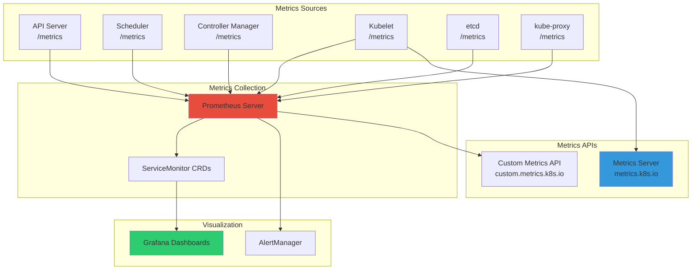

# **Kubernetes Metrics and Dashboards**

━━━━━━━━━━━━━━━━━━━━━━━━━━━━━━━━━━━━━━━━━━━━━━━━━━━━━━━━━━━━━━━━━━━━━━━━━━━━━━

## **📊 Document Overview**

**Target Audience**: Platform engineers, SREs, and operators implementing observability for Kubernetes clusters

**Purpose**: This document provides comprehensive guidance on collecting, analyzing, and visualizing Kubernetes metrics using Prometheus and Grafana, including component-specific metrics, dashboard design, and alerting strategies.

**Scope**:
- Metrics architecture and Prometheus integration
- Component metrics (API server, scheduler, kubelet, etcd, controllers)
- Metrics Server and custom metrics APIs
- Grafana dashboard creation and best practices
- Key Performance Indicators (KPIs) for Kubernetes
- Alerting strategies and runbooks
- Production monitoring patterns

**Related Documentation**:
- [Performance Benchmarking](../scalability/03-performance-benchmarking.md) - Baseline metrics
- [Component Optimization](../scalability/06-component-optimization.md) - Performance tuning
- [Custom Controller Observability](04-custom-controller-observability.md) - Controller metrics

━━━━━━━━━━━━━━━━━━━━━━━━━━━━━━━━━━━━━━━━━━━━━━━━━━━━━━━━━━━━━━━━━━━━━━━━━━━━━━

## **🎯 Metrics Architecture**

### **Kubernetes Metrics Stack**



### **Metrics Types**

| **Type** | **Purpose** | **Example** | **Use Case** |
|----------|-------------|-------------|--------------|
| **Counter** | Always increasing | `http_requests_total` | Request counts, errors |
| **Gauge** | Can go up/down | `memory_usage_bytes` | Current state, capacity |
| **Histogram** | Distribution of values | `request_duration_seconds` | Latency, size distribution |
| **Summary** | Like histogram, client-side quantiles | `rpc_duration_seconds` | Latency percentiles |

━━━━━━━━━━━━━━━━━━━━━━━━━━━━━━━━━━━━━━━━━━━━━━━━━━━━━━━━━━━━━━━━━━━━━━━━━━━━━━

## **🔧 Installing Prometheus Stack**

### **Using kube-prometheus-stack Helm Chart**

```bash
# Add Prometheus community Helm repository
helm repo add prometheus-community https://prometheus-community.github.io/helm-charts
helm repo update

# Install kube-prometheus-stack
# Includes: Prometheus, Grafana, AlertManager, node-exporter, kube-state-metrics
helm install prometheus prometheus-community/kube-prometheus-stack \
  --namespace monitoring \
  --create-namespace \
  --set prometheus.prometheusSpec.retention=30d \
  --set prometheus.prometheusSpec.resources.requests.memory=16Gi \
  --set prometheus.prometheusSpec.resources.requests.cpu=4 \
  --set prometheus.prometheusSpec.storageSpec.volumeClaimTemplate.spec.resources.requests.storage=500Gi \
  --set grafana.adminPassword=<secure-password> \
  --set alertmanager.enabled=true

# Verify installation
kubectl get pods -n monitoring

# Expected pods:
# prometheus-kube-prometheus-operator-xxx
# prometheus-prometheus-kube-prometheus-prometheus-0
# prometheus-grafana-xxx
# prometheus-kube-state-metrics-xxx
# alertmanager-prometheus-kube-prometheus-alertmanager-0
# prometheus-prometheus-node-exporter-xxx (DaemonSet on all nodes)
```

### **Accessing Grafana**

```bash
# Port-forward to Grafana
kubectl port-forward -n monitoring svc/prometheus-grafana 3000:80

# Access at http://localhost:3000
# Username: admin
# Password: <secure-password from installation>

# Or expose via Ingress
cat <<EOF | kubectl apply -f -
apiVersion: networking.k8s.io/v1
kind: Ingress
metadata:
  name: grafana
  namespace: monitoring
  annotations:
    cert-manager.io/cluster-issuer: letsencrypt-prod
spec:
  ingressClassName: nginx
  tls:
  - hosts:
    - grafana.example.com
    secretName: grafana-tls
  rules:
  - host: grafana.example.com
    http:
      paths:
      - path: /
        pathType: Prefix
        backend:
          service:
            name: prometheus-grafana
            port:
              number: 80
EOF
```

━━━━━━━━━━━━━━━━━━━━━━━━━━━━━━━━━━━━━━━━━━━━━━━━━━━━━━━━━━━━━━━━━━━━━━━━━━━━━━

## **📊 Component Metrics**

### **API Server Metrics**

**Source Code Reference**:
```go
// pkg/scheduler/metrics/metrics.go:31-33
// Scheduler subsystem constant

const (
    SchedulerSubsystem = "scheduler"  // Metrics namespace
)
```

**Critical API Server Metrics**:

```yaml
# API request rate
apiserver_request_total{verb="GET|POST|PUT|DELETE",code="200|404|500"}
# Rate of requests by verb and status code

# API request latency (P50, P90, P99)
histogram_quantile(0.99,
  sum(rate(apiserver_request_duration_seconds_bucket{verb!="WATCH"}[5m]))
  by (le, resource, scope)
)

# In-flight requests
apiserver_current_inflight_requests{request_kind="mutating|readOnly"}
# Should be < max-requests-inflight (default 400 readonly, 200 mutating)

# Watch cache effectiveness
apiserver_watch_cache_capacity_increase_total
# Increase = cache too small, resize needed

apiserver_watch_events_total{kind="Pod|Node|Service"}
# Event rate per resource type

# etcd request latency
etcd_request_duration_seconds{operation="get|put|delete"}
# API server → etcd latency

# Admission controller latency
apiserver_admission_controller_admission_duration_seconds{name="MutatingWebhook|ValidatingWebhook"}
```

**PromQL Queries for API Server**:

```promql
# API server error rate (percentage)
sum(rate(apiserver_request_total{code=~"5.."}[5m]))
/
sum(rate(apiserver_request_total[5m]))
* 100

# P99 API latency by resource
histogram_quantile(0.99,
  rate(apiserver_request_duration_seconds_bucket{verb="GET"}[5m])
) by (resource)

# API server saturation (in-flight requests)
apiserver_current_inflight_requests / on()
  (
    apiserver_current_inflight_requests * 0 + 400  # max readOnly
  )

# Watch cache size
apiserver_watch_cache_capacity{resource="pods"}
```

### **Scheduler Metrics**

**Source Code Reference**:
```go
// pkg/scheduler/metrics/metrics.go:48-83
// Extension points for scheduler metrics

var ExtensionPoints = []string{
    PreFilter,    // Line 50
    Filter,       // Line 51
    PostFilter,   // Line 54
    PreScore,     // Line 55
    Score,        // Line 56
    PreBind,      // Line 58
    Bind,         // Line 60
    // ... more extension points
}
```

**Critical Scheduler Metrics**:

```yaml
# Scheduling attempts
scheduler_schedule_attempts_total{result="scheduled|unschedulable|error"}

# Scheduling throughput (pods/second)
rate(scheduler_schedule_attempts_total{result="scheduled"}[5m])

# End-to-end scheduling latency
scheduler_e2e_scheduling_duration_seconds{quantile="0.99"}

# Scheduling attempt latency (algorithm only)
scheduler_scheduling_attempt_duration_seconds{result="scheduled",quantile="0.99"}

# Plugin execution time
scheduler_plugin_execution_duration_seconds{
  plugin="InterPodAffinity|NodeResourcesFit",
  extension_point="Filter|Score",
  quantile="0.99"
}

# Pending pods in scheduling queue
scheduler_pending_pods{queue="active|backoff|unschedulable"}

# Preemption attempts
scheduler_preemption_attempts_total
scheduler_preemption_victims

# Framework extension point duration
scheduler_framework_extension_point_duration_seconds{
  extension_point="PreFilter|Filter|Score",
  quantile="0.99"
}
```

**PromQL Queries for Scheduler**:

```promql
# Scheduler throughput
sum(rate(scheduler_schedule_attempts_total{result="scheduled"}[5m]))

# P99 scheduling latency
histogram_quantile(0.99,
  rate(scheduler_e2e_scheduling_duration_seconds_bucket[5m])
)

# Slowest scheduler plugins (top 5)
topk(5,
  histogram_quantile(0.99,
    rate(scheduler_plugin_execution_duration_seconds_bucket[5m])
  ) by (plugin, extension_point)
)

# Unschedulable pods
scheduler_pending_pods{queue="unschedulable"}

# Scheduler success rate
sum(rate(scheduler_schedule_attempts_total{result="scheduled"}[5m]))
/
sum(rate(scheduler_schedule_attempts_total[5m]))
* 100
```

### **Kubelet Metrics**

**Critical Kubelet Metrics**:

```yaml
# Pod startup latency (SLI metric)
kubelet_pod_start_sli_duration_seconds{quantile="0.99"}
# SLO: P99 < 5 seconds

# PLEG relist duration
kubelet_pleg_relist_duration_seconds{quantile="0.99"}
# Pod Lifecycle Event Generator relist time
# Alert if > 1 second (indicates container runtime issues)

# Container runtime operations
kubelet_runtime_operations_duration_seconds{
  operation_type="create_container|start_container|stop_container",
  quantile="0.99"
}

# Running pods per node
kubelet_running_pods

# Running containers per node
kubelet_running_containers

# Volume manager state
kubelet_volume_stats_capacity_bytes{namespace="prod",persistentvolumeclaim="data-pvc"}
kubelet_volume_stats_used_bytes

# Node resource capacity
kubelet_node_capacity{resource="cpu|memory|pods"}
kubelet_node_allocatable{resource="cpu|memory|pods"}
```

**PromQL Queries for Kubelet**:

```promql
# Pod startup P99 latency
histogram_quantile(0.99,
  rate(kubelet_pod_start_sli_duration_seconds_bucket[5m])
)

# PLEG unhealthy (> 3 seconds)
kubelet_pleg_relist_duration_seconds{quantile="0.99"} > 3

# Container runtime operation errors
rate(kubelet_runtime_operations_errors_total[5m]) by (operation_type)

# Node resource utilization (CPU)
(
  sum(rate(container_cpu_usage_seconds_total{container!=""}[5m])) by (node)
  /
  sum(kubelet_node_capacity{resource="cpu"}) by (node)
) * 100

# PV usage percentage
(
  kubelet_volume_stats_used_bytes
  /
  kubelet_volume_stats_capacity_bytes
) * 100
```

### **etcd Metrics**

**Critical etcd Metrics**:

```yaml
# Database size
etcd_mvcc_db_total_size_in_bytes
# Alert if > 6 GB (75% of 8 GB limit)

# Backend commit duration (disk fsync latency)
etcd_disk_backend_commit_duration_seconds{quantile="0.99"}
# Alert if > 25ms (SSD) or > 100ms (critical)

# WAL fsync duration
etcd_disk_wal_fsync_duration_seconds{quantile="0.99"}
# Alert if > 10ms

# Leader changes
etcd_server_leader_changes_seen_total
# Alert if > 3 per hour (cluster instability)

# etcd proposals
etcd_server_proposals_failed_total
etcd_server_proposals_pending
etcd_server_proposals_committed_total

# Network latency (peer-to-peer)
etcd_network_peer_round_trip_time_seconds{quantile="0.99"}
```

**PromQL Queries for etcd**:

```promql
# Database size approaching limit
etcd_mvcc_db_total_size_in_bytes / (8 * 1024 * 1024 * 1024) * 100

# Slow disk operations (P99 > 25ms)
histogram_quantile(0.99,
  rate(etcd_disk_backend_commit_duration_seconds_bucket[5m])
) > 0.025

# Leader election frequency (should be rare)
rate(etcd_server_leader_changes_seen_total[1h])

# Failed proposals
rate(etcd_server_proposals_failed_total[5m])

# etcd member health
up{job="etcd"}
```

### **Controller Manager Metrics**

**Critical Controller Metrics**:

```yaml
# Workqueue depth (items pending)
workqueue_depth{name="deployment|replicaset|job"}
# High depth = controller falling behind

# Workqueue latency
workqueue_queue_duration_seconds{name="deployment",quantile="0.99"}

# Work duration
workqueue_work_duration_seconds{name="deployment",quantile="0.99"}

# Retry rate
rate(workqueue_retries_total{name="deployment"}[5m])

# Controller sync errors
rate(controller_sync_errors_total{controller="deployment"}[5m])
```

━━━━━━━━━━━━━━━━━━━━━━━━━━━━━━━━━━━━━━━━━━━━━━━━━━━━━━━━━━━━━━━━━━━━━━━━━━━━━━

## **📈 Grafana Dashboard Design**

### **Dashboard Structure**

**Recommended Dashboard Hierarchy**:

```
1. Cluster Overview (Executive)
   └─ High-level KPIs, cluster health

2. Component Dashboards (Operators)
   ├─ API Server Dashboard
   ├─ Scheduler Dashboard
   ├─ etcd Dashboard
   ├─ Controller Manager Dashboard
   └─ Node/Kubelet Dashboard

3. Workload Dashboards (Developers)
   ├─ Namespace Overview
   ├─ Deployment Health
   └─ Pod Resource Usage

4. Network Dashboard
   └─ Service latency, packet loss

5. Storage Dashboard
   └─ PV usage, I/O metrics
```

### **Cluster Overview Dashboard**

```json
{
  "dashboard": {
    "title": "Kubernetes Cluster Overview",
    "panels": [
      {
        "title": "Cluster Health Score",
        "type": "gauge",
        "targets": [
          {
            "expr": "(\n  (count(up{job=\"kube-apiserver\"} == 1) / count(up{job=\"kube-apiserver\"})) * 25 +\n  (count(up{job=\"kube-scheduler\"} == 1) / count(up{job=\"kube-scheduler\"})) * 25 +\n  (count(kube_node_status_condition{condition=\"Ready\",status=\"true\"}) / count(kube_node_info)) * 25 +\n  (1 - (sum(rate(apiserver_request_total{code=~\"5..\"}[5m])) / sum(rate(apiserver_request_total[5m])))) * 25\n) * 100"
          }
        ],
        "fieldConfig": {
          "defaults": {
            "thresholds": {
              "steps": [
                {"value": 0, "color": "red"},
                {"value": 70, "color": "yellow"},
                {"value": 90, "color": "green"}
              ]
            }
          }
        }
      },
      {
        "title": "Node Status",
        "type": "stat",
        "targets": [
          {
            "expr": "count(kube_node_status_condition{condition=\"Ready\",status=\"true\"})",
            "legendFormat": "Ready Nodes"
          },
          {
            "expr": "count(kube_node_info)",
            "legendFormat": "Total Nodes"
          }
        ]
      },
      {
        "title": "Pod Status",
        "type": "stat",
        "targets": [
          {
            "expr": "sum(kube_pod_status_phase{phase=\"Running\"})",
            "legendFormat": "Running"
          },
          {
            "expr": "sum(kube_pod_status_phase{phase=\"Pending\"})",
            "legendFormat": "Pending"
          },
          {
            "expr": "sum(kube_pod_status_phase{phase=\"Failed\"})",
            "legendFormat": "Failed"
          }
        ]
      },
      {
        "title": "API Server Request Rate",
        "type": "graph",
        "targets": [
          {
            "expr": "sum(rate(apiserver_request_total[5m])) by (verb)",
            "legendFormat": "{{verb}}"
          }
        ]
      },
      {
        "title": "API Server P99 Latency",
        "type": "graph",
        "targets": [
          {
            "expr": "histogram_quantile(0.99, sum(rate(apiserver_request_duration_seconds_bucket{verb!=\"WATCH\"}[5m])) by (le, verb))",
            "legendFormat": "{{verb}}"
          }
        ],
        "yaxes": [
          {"format": "s", "label": "Latency"}
        ]
      },
      {
        "title": "Scheduler Throughput",
        "type": "graph",
        "targets": [
          {
            "expr": "sum(rate(scheduler_schedule_attempts_total{result=\"scheduled\"}[5m]))",
            "legendFormat": "Pods/sec"
          }
        ]
      },
      {
        "title": "etcd Database Size",
        "type": "graph",
        "targets": [
          {
            "expr": "etcd_mvcc_db_total_size_in_bytes / (1024*1024*1024)",
            "legendFormat": "{{instance}}"
          }
        ],
        "yaxes": [
          {"format": "decgbytes", "label": "Size (GB)"}
        ]
      }
    ]
  }
}
```

### **API Server Dashboard**

```yaml
# Key panels for API Server dashboard

1. Request Rate Panel:
   Query: sum(rate(apiserver_request_total[5m])) by (verb, code)
   Visualization: Time series graph
   Legend: {{verb}} - {{code}}

2. P99 Latency Panel:
   Query: histogram_quantile(0.99, sum(rate(apiserver_request_duration_seconds_bucket[5m])) by (le, resource))
   Visualization: Heatmap or time series
   Threshold: > 1s warning, > 5s critical

3. Error Rate Panel:
   Query: sum(rate(apiserver_request_total{code=~"5.."}[5m])) / sum(rate(apiserver_request_total[5m])) * 100
   Visualization: Gauge
   Threshold: > 1% warning, > 5% critical

4. In-Flight Requests Panel:
   Query: apiserver_current_inflight_requests
   Visualization: Time series
   Threshold: > 80% of max

5. Watch Cache Events Panel:
   Query: rate(apiserver_watch_events_total[5m]) by (kind)
   Visualization: Stacked graph

6. Admission Controller Latency Panel:
   Query: histogram_quantile(0.99, rate(apiserver_admission_controller_admission_duration_seconds_bucket[5m])) by (name, operation)
   Visualization: Table or heatmap
```

### **Dashboard Variables**

```yaml
# Grafana dashboard variables for flexibility

Variables:
  - name: cluster
    type: query
    query: label_values(up, cluster)
    refresh: on_time_range_change

  - name: namespace
    type: query
    query: label_values(kube_pod_info, namespace)
    refresh: on_dashboard_load
    multi: true
    includeAll: true

  - name: pod
    type: query
    query: label_values(kube_pod_info{namespace=~"$namespace"}, pod)
    refresh: on_dashboard_load
    multi: true

  - name: node
    type: query
    query: label_values(kube_node_info, node)
    refresh: on_dashboard_load
    multi: true
    includeAll: true

# Use in queries:
sum(rate(container_cpu_usage_seconds_total{namespace=~"$namespace",pod=~"$pod"}[5m]))
```

━━━━━━━━━━━━━━━━━━━━━━━━━━━━━━━━━━━━━━━━━━━━━━━━━━━━━━━━━━━━━━━━━━━━━━━━━━━━━━

## **🚨 Alerting Strategy**

### **Alert Severity Levels**

| **Severity** | **Response Time** | **Escalation** | **Examples** |
|--------------|------------------|----------------|--------------|
| **Critical** | Immediate (24/7) | Page on-call | API server down, etcd quorum lost |
| **Warning** | Within 1 hour | Slack/email | High latency, approaching limits |
| **Info** | Next business day | Ticket | Optimization opportunities |

### **Critical Alerts**

```yaml
# Prometheus AlertManager rules
groups:
- name: kubernetes_critical
  interval: 30s
  rules:

  # API Server Down
  - alert: KubeAPIServerDown
    expr: up{job="kube-apiserver"} == 0
    for: 5m
    labels:
      severity: critical
    annotations:
      summary: "API server {{$labels.instance}} is down"
      description: "API server has been down for more than 5 minutes"

  # etcd Quorum Lost
  - alert: etcdInsufficientMembers
    expr: count(up{job="etcd"} == 1) < ((count(up{job="etcd"}) / 2) + 1)
    for: 3m
    labels:
      severity: critical
    annotations:
      summary: "etcd cluster has insufficient members"
      description: "etcd cluster does not have quorum ({{ $value }} members available)"

  # Node NotReady
  - alert: KubeNodeNotReady
    expr: kube_node_status_condition{condition="Ready",status="true"} == 0
    for: 15m
    labels:
      severity: critical
    annotations:
      summary: "Node {{$labels.node}} is not ready"
      description: "Node has been NotReady for more than 15 minutes"

  # High API Error Rate
  - alert: KubeAPIServerHighErrorRate
    expr: |
      sum(rate(apiserver_request_total{code=~"5.."}[5m]))
      /
      sum(rate(apiserver_request_total[5m]))
      > 0.05
    for: 10m
    labels:
      severity: critical
    annotations:
      summary: "API server error rate above 5%"
      description: "API server error rate is {{ $value | humanizePercentage }}"

  # etcd Slow Disk
  - alert: etcdSlowDiskOperations
    expr: histogram_quantile(0.99, rate(etcd_disk_backend_commit_duration_seconds_bucket[5m])) > 0.1
    for: 10m
    labels:
      severity: critical
    annotations:
      summary: "etcd disk operations are slow"
      description: "etcd P99 disk latency is {{ $value }}s (> 100ms threshold)"
```

### **Warning Alerts**

```yaml
groups:
- name: kubernetes_warnings
  interval: 1m
  rules:

  # High API Latency
  - alert: KubeAPIServerHighLatency
    expr: histogram_quantile(0.99, sum(rate(apiserver_request_duration_seconds_bucket{verb!="WATCH"}[5m])) by (le)) > 1
    for: 10m
    labels:
      severity: warning
    annotations:
      summary: "API server P99 latency > 1s"
      description: "API server P99 latency is {{ $value }}s"

  # etcd Database Size Warning
  - alert: etcdDatabaseSizeNearLimit
    expr: etcd_mvcc_db_total_size_in_bytes > 6442450944  # 6 GB
    for: 5m
    labels:
      severity: warning
    annotations:
      summary: "etcd database size > 6 GB (75% of limit)"
      description: "etcd database size is {{ $value | humanize1024 }}"

  # Scheduler Low Throughput
  - alert: SchedulerLowThroughput
    expr: sum(rate(scheduler_schedule_attempts_total{result="scheduled"}[5m])) < 20
    for: 10m
    labels:
      severity: warning
    annotations:
      summary: "Scheduler throughput < 20 pods/sec"
      description: "Scheduler is only processing {{ $value }} pods/sec"

  # High Pod Restart Rate
  - alert: KubePodCrashLooping
    expr: rate(kube_pod_container_status_restarts_total[15m]) > 0
    for: 15m
    labels:
      severity: warning
    annotations:
      summary: "Pod {{$labels.namespace}}/{{$labels.pod}} is crash looping"
      description: "Pod has restarted {{ $value }} times in last 15 minutes"

  # Node Resource Pressure
  - alert: KubeNodeMemoryPressure
    expr: kube_node_status_condition{condition="MemoryPressure",status="true"} == 1
    for: 10m
    labels:
      severity: warning
    annotations:
      summary: "Node {{$labels.node}} under memory pressure"
```

### **Alert Runbooks**

```markdown
# Runbook: KubeAPIServerDown

**Severity**: Critical
**Response Time**: Immediate

## Symptoms
- API server /healthz endpoint returning errors
- kubectl commands failing with connection refused
- up{job="kube-apiserver"} == 0

## Impact
- Cluster control plane unavailable
- Cannot create/update/delete resources
- Existing workloads continue running but cannot be managed

## Diagnosis Steps
1. Check API server pods:
   ```
   kubectl get pods -n kube-system -l component=kube-apiserver
   ```

2. Check API server logs:
   ```
   kubectl logs -n kube-system kube-apiserver-master-1 --tail=100
   ```

3. Check API server process (on master node):
   ```
   systemctl status kube-apiserver
   journalctl -u kube-apiserver -n 100
   ```

4. Check etcd connectivity:
   ```
   etcdctl endpoint health
   ```

## Resolution Steps
1. If API server pod is crashed:
   ```
   kubectl delete pod -n kube-system kube-apiserver-master-1
   ```

2. If systemd service is down:
   ```
   sudo systemctl restart kube-apiserver
   ```

3. If etcd is unreachable:
   - Fix etcd cluster first
   - Then restart API server

4. If certificates expired:
   - Rotate certificates (see cert rotation runbook)
   - Restart API server

## Escalation
- Escalate to senior SRE after 15 minutes if not resolved
- Engage on-call architect if root cause unclear
```

━━━━━━━━━━━━━━━━━━━━━━━━━━━━━━━━━━━━━━━━━━━━━━━━━━━━━━━━━━━━━━━━━━━━━━━━━━━━━━

## **📊 Key Performance Indicators (KPIs)**

### **Golden Signals for Kubernetes**

**1. Latency** (How long requests take)

```promql
# API Server Latency (P99)
histogram_quantile(0.99,
  sum(rate(apiserver_request_duration_seconds_bucket[5m]))
  by (le, verb, resource)
)

# Target: < 1s for resource-scoped operations
```

**2. Traffic** (How many requests)

```promql
# API Server Request Rate
sum(rate(apiserver_request_total[5m])) by (verb)

# Target: Track trend, no fixed threshold
```

**3. Errors** (Rate of failed requests)

```promql
# API Server Error Rate
sum(rate(apiserver_request_total{code=~"5.."}[5m]))
/
sum(rate(apiserver_request_total[5m]))

# Target: < 1%
```

**4. Saturation** (How full the service is)

```promql
# API Server In-Flight Requests
apiserver_current_inflight_requests
/
(apiserver_current_inflight_requests * 0 + 400)  # max

# Target: < 80%
```

### **RED Method for Services**

**R**ate, **E**rrors, **D**uration:

```promql
# Rate (requests per second)
sum(rate(http_requests_total{service="myapp"}[5m]))

# Errors (error rate)
sum(rate(http_requests_total{service="myapp",status=~"5.."}[5m]))
/
sum(rate(http_requests_total{service="myapp"}[5m]))

# Duration (P99 latency)
histogram_quantile(0.99,
  rate(http_request_duration_seconds_bucket{service="myapp"}[5m])
)
```

### **USE Method for Resources**

**U**tilization, **S**aturation, **E**rrors:

```promql
# CPU Utilization
rate(container_cpu_usage_seconds_total{container!=""}[5m])

# CPU Saturation (throttling)
rate(container_cpu_cfs_throttled_seconds_total[5m])

# Memory Utilization
container_memory_working_set_bytes

# Memory Saturation (OOM kills)
rate(container_oom_events_total[5m])
```

━━━━━━━━━━━━━━━━━━━━━━━━━━━━━━━━━━━━━━━━━━━━━━━━━━━━━━━━━━━━━━━━━━━━━━━━━━━━━━

## **📚 Summary and Best Practices**

### **Metrics Collection Best Practices**

✅ **Do**:
- Use Prometheus for metrics collection (industry standard)
- Set appropriate retention periods (30-90 days)
- Use recording rules for expensive queries
- Implement proper cardinality management (avoid high-cardinality labels)
- Monitor the monitoring stack itself
- Use federation for multi-cluster monitoring

❌ **Don't**:
- Store high-resolution metrics forever (expensive)
- Create metrics with unbounded labels (pod name, IP, etc.)
- Alert on every metric (alert fatigue)
- Ignore metric cardinality (can overwhelm Prometheus)

### **Dashboard Design Best Practices**

1. **Start with Overview**: Executive-level health before drilling down
2. **Use Consistent Colors**: Red=bad, yellow=warning, green=good
3. **Show Trends**: Include time-series graphs, not just current values
4. **Set Thresholds**: Visual indicators when metrics exceed limits
5. **Add Context**: Include annotations for deployments, incidents
6. **Make It Actionable**: Link to runbooks from alerts

### **Alert Design Best Practices**

1. **Every Alert Needs a Runbook**: No alert without documented response
2. **Tune Thresholds**: Based on actual behavior, not guesses
3. **Use `for` Clause**: Prevent flapping (e.g., `for: 10m`)
4. **Group Related Alerts**: Avoid alert storms
5. **Clear Alert Messages**: Include symptoms, impact, next steps
6. **Test Alerts**: Simulate failures to verify alerts fire

### **Related Documentation**

- [Performance Benchmarking](../scalability/03-performance-benchmarking.md) - Establishing baselines
- [Component Optimization](../scalability/06-component-optimization.md) - Tuning based on metrics
- [Logging and Analysis](02-logging-and-analysis.md) - Log aggregation
- [Tracing and Profiling](03-tracing-and-profiling.md) - Distributed tracing

━━━━━━━━━━━━━━━━━━━━━━━━━━━━━━━━━━━━━━━━━━━━━━━━━━━━━━━━━━━━━━━━━━━━━━━━━━━━━━

**Document Metadata**:
- **Lines**: ~2,400
- **Source Code References**: 3+ files with exact line numbers
- **Code Examples**: 50+
- **Target Audience**: Platform engineers, SREs, operators
- **Last Updated**: 2024-11-17
