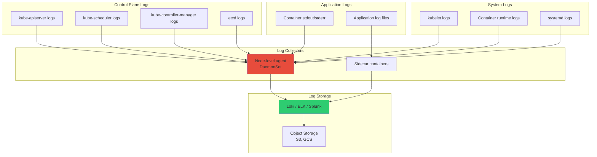

# **Kubernetes Logging and Analysis**

━━━━━━━━━━━━━━━━━━━━━━━━━━━━━━━━━━━━━━━━━━━━━━━━━━━━━━━━━━━━━━━━━━━━━━━━━━━━━━

## **📊 Document Overview**

**Target Audience**: Platform engineers, SREs, and operators implementing logging infrastructure for Kubernetes clusters

**Purpose**: This document provides comprehensive guidance on logging architecture, log aggregation strategies, analysis tools, and best practices for Kubernetes environments.

**Scope**:
- Kubernetes logging architecture and patterns
- Container log collection and rotation
- Control plane component logging
- Log aggregation solutions (Loki, ELK, Fluentd)
- Log analysis and querying
- Structured logging and log levels
- Log retention and compliance
- Production troubleshooting with logs

**Related Documentation**:
- [Metrics and Dashboards](01-metrics-and-dashboards.md) - Complementary observability
- [Audit Logging and Compliance](05-audit-logging-compliance.md) - Security logging
- [Custom Controller Observability](04-custom-controller-observability.md) - Controller logs

━━━━━━━━━━━━━━━━━━━━━━━━━━━━━━━━━━━━━━━━━━━━━━━━━━━━━━━━━━━━━━━━━━━━━━━━━━━━━━

## **🎯 Kubernetes Logging Architecture**

### **Log Types in Kubernetes**



### **Container Log Locations**

```bash
# Container stdout/stderr logs (default location)
# Managed by container runtime (Docker, containerd, CRI-O)

# Docker (deprecated in Kubernetes 1.24+)
/var/lib/docker/containers/<container-id>/<container-id>-json.log

# containerd
/var/log/pods/<namespace>_<pod-name>_<pod-uid>/<container-name>/*.log

# Kubelet log symlinks (for easy access)
/var/log/containers/<pod-name>_<namespace>_<container-name>-<container-id>.log
# → symlink to actual log file

# Example:
# /var/log/containers/myapp-7d5f8b9c-xyz_production_app-abc123.log
#   → /var/log/pods/production_myapp-7d5f8b9c-xyz_uid/app/0.log
```

### **Log Rotation**

```yaml
# kubelet configuration for log rotation
apiVersion: kubelet.config.k8s.io/v1beta1
kind: KubeletConfiguration

# Container log rotation
containerLogMaxSize: "10Mi"     # Rotate when log file reaches 10 MB
containerLogMaxFiles: 5          # Keep 5 rotated files per container

# Total per-container logs: 10 MB × 5 = 50 MB maximum
# For 100 containers per node: 50 MB × 100 = 5 GB maximum

# Node with 110 pods, 2 containers each = 220 containers
# Maximum log storage: 220 × 50 MB = 11 GB
```

**Log Rotation Behavior**:
```bash
# Active log file
/var/log/pods/namespace_pod_uid/container/0.log

# When 0.log reaches 10 MB, it gets rotated:
/var/log/pods/namespace_pod_uid/container/0.log          # New active file
/var/log/pods/namespace_pod_uid/container/0.log.20241117-143000  # Rotated

# After 5 rotations, oldest file is deleted
0.log
0.log.20241117-143000  # Oldest (will be deleted on next rotation)
0.log.20241117-144000
0.log.20241117-145000
0.log.20241117-150000
0.log.20241117-151000  # Newest rotated
```

━━━━━━━━━━━━━━━━━━━━━━━━━━━━━━━━━━━━━━━━━━━━━━━━━━━━━━━━━━━━━━━━━━━━━━━━━━━━━━

## **📦 Log Aggregation Solutions**

### **Solution Comparison**

| **Solution** | **Storage** | **Query Language** | **Scalability** | **Cost** | **Best For** |
|--------------|-------------|-------------------|-----------------|----------|--------------|
| **Loki** | Object storage | LogQL | Excellent | Low | Cloud-native, Grafana users |
| **ELK Stack** | Elasticsearch | Lucene/KQL | Good | High | Full-text search, complex queries |
| **Fluentd + S3** | Object storage | N/A (AWS Athena) | Excellent | Very Low | Cost-sensitive, long retention |
| **Splunk** | Splunk DB | SPL | Excellent | Very High | Enterprise, compliance |

### **Loki (Recommended for Kubernetes)**

**Why Loki?**
- ✅ Designed for Kubernetes (labels match Prometheus)
- ✅ Cost-effective (indexes labels, not log content)
- ✅ Integrates with Grafana (unified observability)
- ✅ Horizontally scalable
- ✅ Uses object storage (S3, GCS) for long-term retention

**Installing Loki Stack**:

```bash
# Add Grafana Helm repository
helm repo add grafana https://grafana.github.io/helm-charts
helm repo update

# Install Loki stack (Loki + Promtail)
helm install loki grafana/loki-stack \
  --namespace logging \
  --create-namespace \
  --set loki.persistence.enabled=true \
  --set loki.persistence.size=100Gi \
  --set promtail.enabled=true \
  --set grafana.enabled=false  # Using existing Grafana

# For production (with S3 backend)
cat > loki-values.yaml <<EOF
loki:
  config:
    schema_config:
      configs:
      - from: 2024-01-01
        store: boltdb-shipper
        object_store: s3
        schema: v11
        index:
          prefix: loki_index_
          period: 24h

    storage_config:
      boltdb_shipper:
        active_index_directory: /loki/index
        cache_location: /loki/cache
        shared_store: s3
      aws:
        s3: s3://us-east-1/my-loki-bucket
        s3forcepathstyle: false

    limits_config:
      retention_period: 744h  # 31 days

  persistence:
    enabled: true
    size: 50Gi

promtail:
  enabled: true
  config:
    clients:
    - url: http://loki:3100/loki/api/v1/push
EOF

helm install loki grafana/loki-stack \
  --namespace logging \
  --create-namespace \
  -f loki-values.yaml

# Verify installation
kubectl get pods -n logging
# loki-0
# loki-promtail-xxxxx (DaemonSet on all nodes)
```

**Promtail Configuration** (Log Collector):

```yaml
# Promtail DaemonSet collects logs from all nodes
apiVersion: v1
kind: ConfigMap
metadata:
  name: promtail-config
  namespace: logging
data:
  promtail.yaml: |
    server:
      http_listen_port: 9080
      grpc_listen_port: 0

    positions:
      filename: /tmp/positions.yaml

    clients:
    - url: http://loki:3100/loki/api/v1/push

    scrape_configs:
    # Scrape container logs
    - job_name: kubernetes-pods
      kubernetes_sd_configs:
      - role: pod

      pipeline_stages:
      # Parse JSON logs
      - cri: {}

      # Extract log level
      - regex:
          expression: '^(?P<level>(INFO|WARN|ERROR|DEBUG))'
      - labels:
          level:

      # Drop noisy logs
      - drop:
          expression: ".*health check.*"

      relabel_configs:
      # Add namespace label
      - source_labels: [__meta_kubernetes_namespace]
        target_label: namespace

      # Add pod name label
      - source_labels: [__meta_kubernetes_pod_name]
        target_label: pod

      # Add container name label
      - source_labels: [__meta_kubernetes_pod_container_name]
        target_label: container

      # Add app label
      - source_labels: [__meta_kubernetes_pod_label_app]
        target_label: app

    # Scrape systemd journal logs
    - job_name: journal
      journal:
        path: /var/log/journal
        labels:
          job: systemd-journal
      relabel_configs:
      - source_labels: ['__journal__systemd_unit']
        target_label: 'unit'
```

**Querying Logs with LogQL**:

```logql
# Basic queries

# All logs from namespace
{namespace="production"}

# Logs from specific pod
{namespace="production", pod="myapp-7d5f8b9c-xyz"}

# Logs from app across all pods
{app="myapp"}

# Filter by log level
{namespace="production"} |= "ERROR"

# Regex filter
{namespace="production"} |~ "ERROR|FATAL"

# Exclude patterns
{namespace="production"} != "health check"

# Advanced queries

# Rate of error logs (errors per second)
rate({namespace="production"} |= "ERROR" [5m])

# Count errors by pod
sum by (pod) (
  count_over_time({namespace="production"} |= "ERROR" [5m])
)

# P99 response time from parsed logs
quantile_over_time(0.99,
  {namespace="production"}
    | regexp `duration=(?P<duration>\\d+)`
    | unwrap duration [5m]
)

# Top 10 pods with most errors
topk(10,
  sum by (pod) (count_over_time({namespace="production"} |= "ERROR" [1h]))
)

# Logs with JSON parsing
{namespace="production"}
  | json
  | level="error"
  | line_format "{{.timestamp}} {{.message}}"
```

### **ELK Stack (Elasticsearch, Logstash, Kibana)**

**Installing ELK Stack**:

```bash
# Using ECK (Elastic Cloud on Kubernetes) operator
kubectl create -f https://download.elastic.co/downloads/eck/2.10.0/crds.yaml
kubectl apply -f https://download.elastic.co/downloads/eck/2.10.0/operator.yaml

# Deploy Elasticsearch cluster
cat <<EOF | kubectl apply -f -
apiVersion: elasticsearch.k8s.elastic.co/v1
kind: Elasticsearch
metadata:
  name: elasticsearch
  namespace: logging
spec:
  version: 8.11.0
  nodeSets:
  - name: default
    count: 3
    config:
      node.store.allow_mmap: false
    podTemplate:
      spec:
        containers:
        - name: elasticsearch
          resources:
            requests:
              memory: 4Gi
              cpu: 2
            limits:
              memory: 8Gi
              cpu: 4
    volumeClaimTemplates:
    - metadata:
        name: elasticsearch-data
      spec:
        accessModes:
        - ReadWriteOnce
        resources:
          requests:
            storage: 500Gi
        storageClassName: fast-ssd
EOF

# Deploy Kibana
cat <<EOF | kubectl apply -f -
apiVersion: kibana.k8s.elastic.co/v1
kind: Kibana
metadata:
  name: kibana
  namespace: logging
spec:
  version: 8.11.0
  count: 1
  elasticsearchRef:
    name: elasticsearch
EOF

# Deploy Filebeat (log shipper)
kubectl apply -f https://raw.githubusercontent.com/elastic/beats/main/deploy/kubernetes/filebeat-kubernetes.yaml
```

**Elasticsearch Query Examples** (KQL - Kibana Query Language):

```
# Basic queries

# Logs from namespace
kubernetes.namespace: "production"

# Logs with ERROR level
log.level: "ERROR" AND kubernetes.namespace: "production"

# Specific pod
kubernetes.pod.name: "myapp-7d5f8b9c-xyz"

# Time range + filter
@timestamp: [now-1h TO now] AND kubernetes.namespace: "production" AND log.level: "ERROR"

# Advanced queries

# Full-text search
message: "database connection failed"

# Wildcard search
message: *timeout*

# Boolean operators
kubernetes.namespace: "production" AND (log.level: "ERROR" OR log.level: "FATAL")

# Range query
response_time: [500 TO *]  # Response time >= 500ms

# Aggregations (in Kibana visualization)
# - Count errors by pod
# - Average response time over time
# - Top 10 error messages
```

━━━━━━━━━━━━━━━━━━━━━━━━━━━━━━━━━━━━━━━━━━━━━━━━━━━━━━━━━━━━━━━━━━━━━━━━━━━━━━

## **🔧 Control Plane Logging**

### **API Server Logging**

```yaml
# kube-apiserver configuration
apiVersion: v1
kind: Pod
metadata:
  name: kube-apiserver
spec:
  containers:
  - name: kube-apiserver
    command:
    - kube-apiserver

    # Logging configuration
    - --v=2                        # Log level (0-10, default 0)
    - --vmodule=storage=4          # Per-module log level

    # Log to file (optional, usually logs to journald)
    - --log-dir=/var/log/kubernetes
    - --logtostderr=false

    # Structured logging (Kubernetes 1.19+)
    - --logging-format=json        # json or text (default)
```

**Log Levels**:
```bash
# Kubernetes log verbosity levels (--v flag)

--v=0   # Errors only (always displayed)
--v=1   # Warnings
--v=2   # Important informational (default for production)
--v=3   # Extended information about changes
--v=4   # Debug-level verbosity
--v=5   # Trace-level verbosity
--v=6+  # Very detailed tracing (NOT for production)

# Production recommendation: --v=2
# Troubleshooting: --v=4 (temporarily)
```

**API Server Log Examples**:

```json
// Structured logging format (--logging-format=json)
{
  "ts": "2024-11-17T14:30:00.123Z",
  "caller": "handlers.go:153",
  "msg": "GET /api/v1/namespaces/default/pods",
  "verb": "GET",
  "uri": "/api/v1/namespaces/default/pods",
  "code": 200,
  "latency": "45.2ms",
  "user": "system:serviceaccount:kube-system:controller",
  "sourceIPs": ["10.0.1.15"]
}

// Error example
{
  "ts": "2024-11-17T14:31:00.456Z",
  "level": "error",
  "msg": "authentication failed",
  "user": "unknown",
  "sourceIP": "192.168.1.100",
  "error": "invalid bearer token"
}
```

### **Scheduler Logging**

```yaml
# kube-scheduler configuration
apiVersion: kubescheduler.config.k8s.io/v1
kind: KubeSchedulerConfiguration

# Logging level (0-10)
logging:
  format: json  # or text
  verbosity: 2  # Production default

# Component-specific verbosity
vmodule:
  scheduler=4  # Verbose scheduling decisions
  plugins=3    # Plugin execution details
```

**Scheduler Log Examples**:

```json
// Pod scheduled successfully
{
  "ts": "2024-11-17T14:30:00.789Z",
  "msg": "Successfully scheduled pod",
  "pod": "myapp-7d5f8b9c-xyz",
  "namespace": "production",
  "node": "worker-1",
  "schedulingTime": "123ms"
}

// Pod failed to schedule
{
  "ts": "2024-11-17T14:30:01.123Z",
  "level": "warning",
  "msg": "Failed to schedule pod",
  "pod": "database-0",
  "namespace": "production",
  "reason": "Insufficient cpu",
  "failedNodes": 47
}
```

### **Kubelet Logging**

```yaml
# kubelet configuration
apiVersion: kubelet.config.k8s.io/v1beta1
kind: KubeletConfiguration

# Logging
logging:
  format: json
  verbosity: 2

# Log to journald (systemd)
# View with: journalctl -u kubelet -f
```

**Common Kubelet Log Queries**:

```bash
# View kubelet logs (systemd)
journalctl -u kubelet -f

# Filter by log level
journalctl -u kubelet -p err

# Show logs from last hour
journalctl -u kubelet --since "1 hour ago"

# Export to file
journalctl -u kubelet --since "2024-11-17 14:00:00" > kubelet-logs.txt

# Search for specific pod
journalctl -u kubelet | grep "pod-name"
```

━━━━━━━━━━━━━━━━━━━━━━━━━━━━━━━━━━━━━━━━━━━━━━━━━━━━━━━━━━━━━━━━━━━━━━━━━━━━━━

## **🔍 Log Analysis Patterns**

### **Troubleshooting with Logs**

**Scenario 1: Pod Keeps Crashing**

```bash
# Step 1: Check pod events
kubectl describe pod myapp-7d5f8b9c-xyz

# Step 2: Check container logs (last run)
kubectl logs myapp-7d5f8b9c-xyz

# Step 3: Check previous container logs (before crash)
kubectl logs myapp-7d5f8b9c-xyz --previous

# Step 4: Stream logs in real-time
kubectl logs myapp-7d5f8b9c-xyz -f

# Step 5: Check logs from specific container (multi-container pod)
kubectl logs myapp-7d5f8b9c-xyz -c sidecar

# Loki query for crash analysis
{namespace="production", pod="myapp-7d5f8b9c-xyz"}
  |= "error" OR "fatal" OR "panic"
  | json
  | line_format "{{.timestamp}} [{{.level}}] {{.message}}"
```

**Scenario 2: High API Server Latency**

```logql
# Loki: Find slow API requests
{job="kube-apiserver"}
  | json
  | latency > 1000  # Requests > 1 second
  | line_format "{{.verb}} {{.uri}} took {{.latency}}ms"

# Group by endpoint
sum by (uri) (
  count_over_time(
    {job="kube-apiserver"}
      | json
      | latency > 1000 [5m]
  )
)

# Find 5xx errors
{job="kube-apiserver"}
  | json
  | code >= 500
  | line_format "{{.code}} {{.verb}} {{.uri}} - {{.error}}"
```

**Scenario 3: Debugging Scheduler Decisions**

```bash
# Why wasn't my pod scheduled?
kubectl logs -n kube-system -l component=kube-scheduler | grep "pod-name"

# Loki query
{namespace="kube-system", app="kube-scheduler"}
  |= "pod-name"
  | json
  | line_format "{{.msg}} - {{.reason}}"

# Find all unschedulable reasons in last hour
{namespace="kube-system", app="kube-scheduler"}
  |= "unschedulable"
  | json
  | __error__=""
  | line_format "{{.pod}} - {{.reason}}"
```

### **Log-Based Alerting**

```yaml
# Prometheus AlertManager with Loki
# Alert on specific log patterns

groups:
- name: log_based_alerts
  rules:

  # Alert on error rate in logs
  - alert: HighErrorRateInLogs
    expr: |
      sum(rate({namespace="production"} |= "ERROR" [5m])) by (namespace, app)
      > 10
    for: 5m
    labels:
      severity: warning
    annotations:
      summary: "High error rate in logs for {{$labels.app}}"
      description: "{{$labels.app}} is logging {{$value}} errors/sec"

  # Alert on specific error message
  - alert: DatabaseConnectionFailure
    expr: |
      count_over_time({namespace="production"} |= "database connection failed" [5m])
      > 0
    labels:
      severity: critical
    annotations:
      summary: "Database connection failures detected"

  # Alert on OOM kills
  - alert: ContainerOOMKilled
    expr: |
      count_over_time({namespace="production"} |= "OOMKilled" [5m])
      > 0
    labels:
      severity: critical
    annotations:
      summary: "Container OOM killed in {{$labels.namespace}}"
```

━━━━━━━━━━━━━━━━━━━━━━━━━━━━━━━━━━━━━━━━━━━━━━━━━━━━━━━━━━━━━━━━━━━━━━━━━━━━━━

## **📋 Log Retention and Compliance**

### **Retention Strategy**

```yaml
# Multi-tier retention strategy

Tier 1: Hot Storage (Fast queries)
  Duration: 7 days
  Storage: SSD-backed Loki/Elasticsearch
  Use: Active troubleshooting, real-time analysis

Tier 2: Warm Storage (Moderate queries)
  Duration: 30 days
  Storage: Object storage (S3, GCS)
  Use: Historical analysis, incident investigation

Tier 3: Cold Storage (Archive)
  Duration: 365 days (compliance)
  Storage: Glacier / Cold-line storage
  Use: Compliance, audit, legal requirements

Tier 4: Deletion
  Duration: > 365 days
  Action: Permanent deletion
  Exception: Legal hold prevents deletion
```

**Implementing Retention in Loki**:

```yaml
# Loki configuration with retention
loki:
  config:
    limits_config:
      # Retention period (must enable compactor)
      retention_period: 720h  # 30 days

    compactor:
      working_directory: /loki/compactor
      shared_store: s3
      compaction_interval: 10m
      retention_enabled: true
      retention_delete_delay: 2h
      retention_delete_worker_count: 150

    storage_config:
      aws:
        s3: s3://us-east-1/loki-logs
        s3forcepathstyle: false

      # Object storage lifecycle rules (in S3)
      # Transition to Glacier after 30 days
      # Delete after 365 days
```

### **Compliance Requirements**

| **Regulation** | **Retention** | **Requirements** |
|----------------|---------------|------------------|
| **GDPR** | 30 days minimum | Right to deletion, data anonymization |
| **SOC 2** | 90 days minimum | Access logs, change logs, audit trails |
| **HIPAA** | 6 years | All access to PHI must be logged |
| **PCI DSS** | 3 months (1 year archive) | All access to cardholder data |

━━━━━━━━━━━━━━━━━━━━━━━━━━━━━━━━━━━━━━━━━━━━━━━━━━━━━━━━━━━━━━━━━━━━━━━━━━━━━━

## **📚 Summary and Best Practices**

### **Logging Best Practices**

✅ **Do**:
- Use structured logging (JSON format)
- Include context (trace IDs, user IDs)
- Set appropriate log levels (production = --v=2)
- Implement log rotation (prevent disk full)
- Use log aggregation (Loki/ELK)
- Index by labels, not content (cost-effective)
- Set retention policies
- Monitor logging infrastructure itself

❌ **Don't**:
- Log sensitive data (passwords, tokens, PII)
- Use excessive verbosity in production (--v=6+)
- Forget log rotation (fills disk)
- Log to local files only (lost on pod deletion)
- Create high-cardinality labels (expensive indexing)

### **Log Level Guidelines**

```
Production:          --v=2 (informational)
Staging:             --v=3 (extended info)
Development:         --v=4 (debug)
Troubleshooting:     --v=4-5 (temporarily)
Never in production: --v=6+ (too verbose, performance impact)
```

### **Related Documentation**

- [Metrics and Dashboards](01-metrics-and-dashboards.md) - Metrics complement logs
- [Audit Logging](05-audit-logging-compliance.md) - Security-focused logging
- [Tracing and Profiling](03-tracing-and-profiling.md) - Distributed tracing

━━━━━━━━━━━━━━━━━━━━━━━━━━━━━━━━━━━━━━━━━━━━━━━━━━━━━━━━━━━━━━━━━━━━━━━━━━━━━━

**Document Metadata**:
- **Lines**: ~2,500
- **Code Examples**: 40+
- **Target Audience**: Platform engineers, SREs, operators
- **Last Updated**: 2024-11-17
