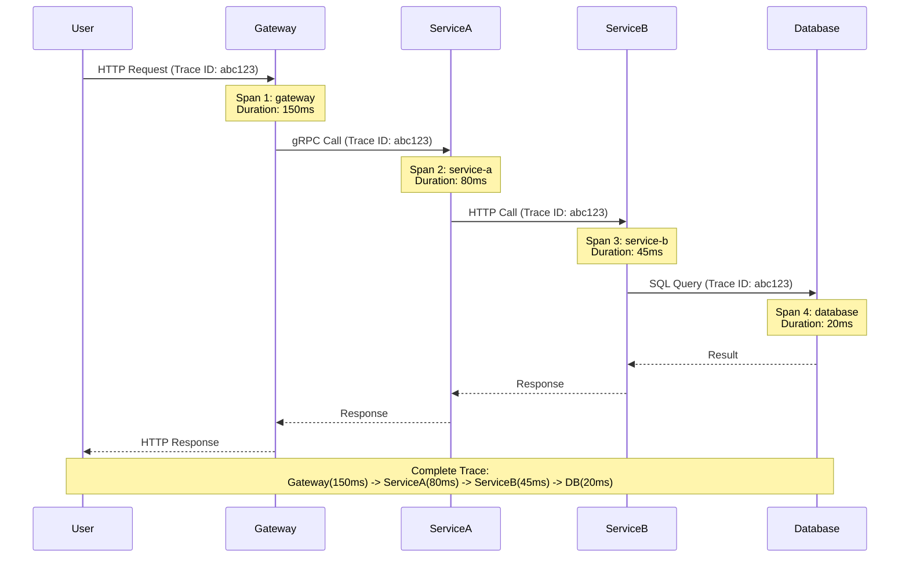

# **Kubernetes Tracing and Profiling**

━━━━━━━━━━━━━━━━━━━━━━━━━━━━━━━━━━━━━━━━━━━━━━━━━━━━━━━━━━━━━━━━━━━━━━━━━━━━━━

## **📊 Document Overview**

**Target Audience**: Platform engineers, SREs, and performance engineers implementing distributed tracing and profiling for Kubernetes environments

**Purpose**: This document provides comprehensive guidance on distributed tracing with OpenTelemetry and Jaeger, performance profiling with pprof, and debugging production issues in Kubernetes.

**Scope**:
- Distributed tracing architecture (OpenTelemetry, Jaeger)
- API server tracing configuration
- Application instrumentation
- Performance profiling with pprof (CPU, memory, goroutines)
- Continuous profiling with Pyroscope
- Request flow analysis across microservices
- Production debugging techniques

**Related Documentation**:
- [Metrics and Dashboards](01-metrics-and-dashboards.md) - Metrics observability
- [Logging and Analysis](02-logging-and-analysis.md) - Log correlation with traces
- [Component Optimization](../scalability/06-component-optimization.md) - Performance tuning

━━━━━━━━━━━━━━━━━━━━━━━━━━━━━━━━━━━━━━━━━━━━━━━━━━━━━━━━━━━━━━━━━━━━━━━━━━━━━━

## **🎯 Distributed Tracing Architecture**

### **What is Distributed Tracing?**

Distributed tracing tracks requests as they flow through multiple services:



**Key Concepts**:
- **Trace**: Complete journey of a request through system
- **Span**: Single operation within a trace (function call, HTTP request)
- **Trace ID**: Unique identifier propagated across all services
- **Span ID**: Unique identifier for each operation
- **Parent Span**: The calling span

### **OpenTelemetry Architecture**

```
┌─────────────────────────────────────────────────────┐
│                 Application Code                    │
│  (Instrumented with OpenTelemetry SDK)              │
└─────────────────┬───────────────────────────────────┘
                  │
                  ↓
┌─────────────────────────────────────────────────────┐
│            OpenTelemetry Collector                  │
│  ┌───────────┐  ┌──────────┐  ┌─────────────────┐  │
│  │ Receivers │→ │Processors│→ │   Exporters     │  │
│  └───────────┘  └──────────┘  └─────────────────┘  │
└───────────────────────────────┬─────────────────────┘
                                │
                ┌───────────────┼──────────────┐
                ↓               ↓              ↓
        ┌───────────┐   ┌──────────────┐  ┌─────────┐
        │  Jaeger   │   │  Prometheus  │  │  Loki   │
        └───────────┘   └──────────────┘  └─────────┘
           (Traces)         (Metrics)        (Logs)
```

━━━━━━━━━━━━━━━━━━━━━━━━━━━━━━━━━━━━━━━━━━━━━━━━━━━━━━━━━━━━━━━━━━━━━━━━━━━━━━

## **🔧 Installing Jaeger**

### **Jaeger All-in-One (Development)**

```bash
# Quick start with Jaeger all-in-one
kubectl create namespace observability

kubectl apply -f - <<EOF
apiVersion: apps/v1
kind: Deployment
metadata:
  name: jaeger
  namespace: observability
spec:
  replicas: 1
  selector:
    matchLabels:
      app: jaeger
  template:
    metadata:
      labels:
        app: jaeger
    spec:
      containers:
      - name: jaeger
        image: jaegertracing/all-in-one:1.51
        env:
        - name: COLLECTOR_ZIPKIN_HOST_PORT
          value: ":9411"
        ports:
        - containerPort: 5775
          protocol: UDP
        - containerPort: 6831
          protocol: UDP
        - containerPort: 6832
          protocol: UDP
        - containerPort: 5778
          protocol: TCP
        - containerPort: 16686
          protocol: TCP
        - containerPort: 14268
          protocol: TCP
        - containerPort: 14250
          protocol: TCP
        - containerPort: 9411
          protocol: TCP
---
apiVersion: v1
kind: Service
metadata:
  name: jaeger
  namespace: observability
spec:
  selector:
    app: jaeger
  ports:
  - name: query
    port: 16686
    targetPort: 16686
  - name: collector
    port: 14268
    targetPort: 14268
  - name: grpc
    port: 14250
    targetPort: 14250
EOF

# Access Jaeger UI
kubectl port-forward -n observability svc/jaeger 16686:16686
# Open http://localhost:16686
```

### **Jaeger Production Deployment**

```bash
# Install Jaeger Operator
kubectl create namespace observability
kubectl apply -f https://github.com/jaegertracing/jaeger-operator/releases/download/v1.51.0/jaeger-operator.yaml -n observability

# Deploy Jaeger with Elasticsearch backend
cat <<EOF | kubectl apply -f -
apiVersion: jaegertracing.io/v1
kind: Jaeger
metadata:
  name: jaeger-prod
  namespace: observability
spec:
  strategy: production

  storage:
    type: elasticsearch
    options:
      es:
        server-urls: http://elasticsearch:9200
        index-prefix: jaeger

  collector:
    maxReplicas: 10
    resources:
      requests:
        cpu: 1
        memory: 2Gi
      limits:
        cpu: 2
        memory: 4Gi

  query:
    replicas: 2
    resources:
      requests:
        cpu: 500m
        memory: 1Gi

  ingester:
    maxReplicas: 5

  agent:
    strategy: DaemonSet
EOF
```

━━━━━━━━━━━━━━━━━━━━━━━━━━━━━━━━━━━━━━━━━━━━━━━━━━━━━━━━━━━━━━━━━━━━━━━━━━━━━━

## **📡 API Server Tracing**

### **Enabling API Server Tracing**

```yaml
# kube-apiserver tracing configuration (Kubernetes 1.22+)
apiVersion: v1
kind: Pod
metadata:
  name: kube-apiserver
spec:
  containers:
  - name: kube-apiserver
    command:
    - kube-apiserver

    # Enable tracing
    - --tracing-config-file=/etc/kubernetes/tracing-config.yaml

---
# Tracing configuration file
apiVersion: apiserver.config.k8s.io/v1beta1
kind: TracingConfiguration

# Sampling rate (1-1000000 per million)
# 10000 = 1% of requests
# 100000 = 10% of requests
# 1000000 = 100% of requests (NOT recommended in production)
samplingRatePerMillion: 10000  # 1% sampling

# OpenTelemetry collector endpoint
endpoint: otel-collector.observability.svc:4317
```

**Sampling Strategies**:

```yaml
# Production recommendation: Adaptive sampling
# Sample 100% of slow requests, 1% of fast requests

# OpenTelemetry Collector configuration
receivers:
  otlp:
    protocols:
      grpc:
        endpoint: 0.0.0.0:4317

processors:
  # Sample based on latency
  tail_sampling:
    policies:
    # Always sample if latency > 1 second
    - name: latency-policy
      type: latency
      latency:
        threshold_ms: 1000

    # Always sample errors
    - name: error-policy
      type: status_code
      status_code:
        status_codes: [ERROR]

    # Sample 1% of everything else
    - name: probabilistic-policy
      type: probabilistic
      probabilistic:
        sampling_percentage: 1

exporters:
  jaeger:
    endpoint: jaeger-collector:14250
    tls:
      insecure: true

service:
  pipelines:
    traces:
      receivers: [otlp]
      processors: [tail_sampling]
      exporters: [jaeger]
```

### **Analyzing API Server Traces**

```bash
# View traces in Jaeger UI (http://localhost:16686)

# Search for:
# - Service: kube-apiserver
# - Operation: GET /api/v1/namespaces/{namespace}/pods
# - Min duration: 1s

# Example trace breakdown:
Trace: abc123 (Total: 2.3s)
├─ API Server Authentication (10ms)
├─ API Server Authorization (120ms)  ← Slow RBAC check!
├─ API Server Admission (35ms)
├─ etcd Read (1.8s)  ← BOTTLENECK!
│  ├─ etcd Leader Election (5ms)
│  ├─ etcd Raft Consensus (1.7s)  ← Very slow!
│  └─ etcd Disk Read (95ms)
└─ API Server Response Encoding (350ms)

# Diagnosis: etcd consensus taking 1.7s indicates:
# - etcd cluster under heavy load
# - Network latency between etcd members
# - Slow disk on etcd leader
```

━━━━━━━━━━━━━━━━━━━━━━━━━━━━━━━━━━━━━━━━━━━━━━━━━━━━━━━━━━━━━━━━━━━━━━━━━━━━━━

## **📱 Application Instrumentation**

### **Go Application with OpenTelemetry**

```go
package main

import (
    "context"
    "net/http"

    "go.opentelemetry.io/otel"
    "go.opentelemetry.io/otel/exporters/otlp/otlptrace/otlptracegrpc"
    "go.opentelemetry.io/otel/sdk/resource"
    "go.opentelemetry.io/otel/sdk/trace"
    semconv "go.opentelemetry.io/otel/semconv/v1.17.0"
    "go.opentelemetry.io/contrib/instrumentation/net/http/otelhttp"
)

func main() {
    // Initialize tracer
    tp, err := initTracer()
    if err != nil {
        panic(err)
    }
    defer tp.Shutdown(context.Background())

    // Instrument HTTP server
    handler := http.HandlerFunc(handleRequest)
    wrappedHandler := otelhttp.NewHandler(handler, "myservice")

    http.ListenAndServe(":8080", wrappedHandler)
}

func initTracer() (*trace.TracerProvider, error) {
    // Create OTLP exporter
    exporter, err := otlptracegrpc.New(
        context.Background(),
        otlptracegrpc.WithEndpoint("otel-collector:4317"),
        otlptracegrpc.WithInsecure(),
    )
    if err != nil {
        return nil, err
    }

    // Create resource
    resource, err := resource.New(
        context.Background(),
        resource.WithAttributes(
            semconv.ServiceNameKey.String("myservice"),
            semconv.ServiceVersionKey.String("1.0.0"),
            semconv.DeploymentEnvironmentKey.String("production"),
        ),
    )

    // Create tracer provider
    tp := trace.NewTracerProvider(
        trace.WithBatcher(exporter),
        trace.WithResource(resource),
        trace.WithSampler(trace.TraceIDRatioBased(0.01)),  // 1% sampling
    )

    otel.SetTracerProvider(tp)
    return tp, nil
}

func handleRequest(w http.ResponseWriter, r *http.Request) {
    ctx := r.Context()
    tracer := otel.Tracer("myservice")

    // Create child span
    ctx, span := tracer.Start(ctx, "processRequest")
    defer span.End()

    // Add span attributes
    span.SetAttributes(
        attribute.String("user.id", "user123"),
        attribute.Int("item.count", 5),
    )

    // Simulate work
    result, err := doWork(ctx)
    if err != nil {
        span.RecordError(err)
        span.SetStatus(codes.Error, err.Error())
        http.Error(w, err.Error(), http.StatusInternalServerError)
        return
    }

    w.Write([]byte(result))
}

func doWork(ctx context.Context) (string, error) {
    tracer := otel.Tracer("myservice")
    ctx, span := tracer.Start(ctx, "doWork")
    defer span.End()

    // Call database
    data, err := queryDatabase(ctx)
    if err != nil {
        return "", err
    }

    // Call external service
    result, err := callExternalService(ctx, data)
    return result, err
}

func queryDatabase(ctx context.Context) (string, error) {
    tracer := otel.Tracer("myservice")
    _, span := tracer.Start(ctx, "database.query")
    defer span.End()

    span.SetAttributes(
        attribute.String("db.system", "postgresql"),
        attribute.String("db.statement", "SELECT * FROM users WHERE id = ?"),
    )

    // Actual database query
    // ...

    return "data", nil
}
```

### **Python Application with OpenTelemetry**

```python
from opentelemetry import trace
from opentelemetry.exporter.otlp.proto.grpc.trace_exporter import OTLPSpanExporter
from opentelemetry.sdk.trace import TracerProvider
from opentelemetry.sdk.trace.export import BatchSpanProcessor
from opentelemetry.sdk.resources import Resource
from opentelemetry.instrumentation.flask import FlaskInstrumentor
from flask import Flask

# Initialize tracing
resource = Resource(attributes={
    "service.name": "python-service",
    "service.version": "1.0.0",
    "deployment.environment": "production"
})

provider = TracerProvider(resource=resource)
processor = BatchSpanProcessor(OTLPSpanExporter(
    endpoint="otel-collector:4317",
    insecure=True
))
provider.add_span_processor(processor)
trace.set_tracer_provider(provider)

# Create Flask app and auto-instrument
app = Flask(__name__)
FlaskInstrumentor().instrument_app(app)

tracer = trace.get_tracer(__name__)

@app.route('/api/users')
def get_users():
    # Automatic span created by FlaskInstrumentor

    # Create manual child span
    with tracer.start_as_current_span("fetch_users_from_db") as span:
        span.set_attribute("db.system", "postgresql")
        span.set_attribute("db.table", "users")

        users = fetch_from_database()
        span.set_attribute("result.count", len(users))

        return {"users": users}

def fetch_from_database():
    with tracer.start_as_current_span("database.query") as span:
        span.set_attribute("db.statement", "SELECT * FROM users")
        # Actual query
        return []

if __name__ == '__main__':
    app.run(host='0.0.0.0', port=8080)
```

━━━━━━━━━━━━━━━━━━━━━━━━━━━━━━━━━━━━━━━━━━━━━━━━━━━━━━━━━━━━━━━━━━━━━━━━━━━━━━

## **🔬 Performance Profiling with pprof**

### **What is pprof?**

pprof is Go's built-in profiler for analyzing performance:

- **CPU Profile**: Where is CPU time spent?
- **Memory Profile**: What is allocating memory?
- **Goroutine Profile**: How many goroutines exist?
- **Block Profile**: Where are goroutines blocked?
- **Mutex Profile**: Lock contention analysis

### **Enabling pprof in Kubernetes Components**

All Kubernetes components expose pprof endpoints:

```bash
# API Server pprof endpoint
kubectl port-forward -n kube-system pod/kube-apiserver-master-1 6443:6443

# Collect 30-second CPU profile
curl -k https://localhost:6443/debug/pprof/profile?seconds=30 \
  --cert /etc/kubernetes/pki/apiserver-client.crt \
  --key /etc/kubernetes/pki/apiserver-client.key \
  -o api-server-cpu.prof

# Collect heap (memory) profile
curl -k https://localhost:6443/debug/pprof/heap \
  --cert /etc/kubernetes/pki/apiserver-client.crt \
  --key /etc/kubernetes/pki/apiserver-client.key \
  -o api-server-heap.prof

# Collect goroutine profile
curl -k https://localhost:6443/debug/pprof/goroutine \
  --cert /etc/kubernetes/pki/apiserver-client.crt \
  --key /etc/kubernetes/pki/apiserver-client.key \
  -o api-server-goroutine.prof

# Analyze profile with pprof
go tool pprof -http=:8080 api-server-cpu.prof
# Opens interactive web UI at http://localhost:8080
```

### **Analyzing CPU Profiles**

```bash
# Command-line analysis
go tool pprof api-server-cpu.prof

# pprof commands:
(pprof) top10
# Shows top 10 functions by CPU time

(pprof) list FunctionName
# Shows source code for specific function

(pprof) web
# Opens graph visualization

(pprof) traces
# Shows call traces

# Example output:
(pprof) top10
Showing nodes accounting for 12.5s, 78.2% of 16s total
      flat  flat%   sum%        cum   cum%
     3.2s 20.00% 20.00%      4.1s 25.62%  k8s.io/apiserver/pkg/endpoints/filters.WithAuthorization
     2.1s 13.12% 33.12%      2.8s 17.50%  k8s.io/apiserver/pkg/storage/cacher.(*Cacher).Watch
     1.8s 11.25% 44.37%      2.2s 13.75%  encoding/json.(*encodeState).marshal
     1.4s  8.75% 53.12%      1.9s 11.87%  k8s.io/apiserver/pkg/endpoints/handlers.ListResource
```

**Interpreting Results**:
- **flat**: Time spent in function itself
- **cum**: Cumulative time (function + children)
- Top functions are optimization candidates

### **Analyzing Memory Profiles**

```bash
go tool pprof -http=:8080 api-server-heap.prof

# In pprof UI:
# - View: alloc_space (total allocations)
# - View: inuse_space (current memory usage)
# - Graph view shows allocation hot paths

# Common memory issues:
# 1. Memory leaks (inuse_space keeps growing)
# 2. Excessive allocations (alloc_space high)
# 3. Large objects (check alloc_objects)
```

### **Continuous Profiling with Pyroscope**

```bash
# Install Pyroscope
helm repo add pyroscope-io https://pyroscope-io.github.io/helm-chart
helm install pyroscope pyroscope-io/pyroscope \
  --namespace observability

# Instrument application with Pyroscope
cat <<EOF >> deployment.yaml
apiVersion: apps/v1
kind: Deployment
spec:
  template:
    spec:
      containers:
      - name: myapp
        env:
        - name: PYROSCOPE_APPLICATION_NAME
          value: "myapp"
        - name: PYROSCOPE_SERVER_ADDRESS
          value: "http://pyroscope:4040"
        - name: PYROSCOPE_PROFILE_CPU
          value: "true"
        - name: PYROSCOPE_PROFILE_MEMORY
          value: "true"
EOF

# Pyroscope automatically collects profiles continuously
# View at http://pyroscope:4040
```

━━━━━━━━━━━━━━━━━━━━━━━━━━━━━━━━━━━━━━━━━━━━━━━━━━━━━━━━━━━━━━━━━━━━━━━━━━━━━━

## **🔍 Production Debugging Techniques**

### **Debugging Slow Requests**

```bash
# Step 1: Identify slow requests from traces
# Open Jaeger UI and search for traces with duration > 1s

# Step 2: Analyze trace spans to find bottleneck
Trace: xyz789 (Total: 3.2s)
├─ Gateway (150ms)
├─ Service A (100ms)
├─ Service B (2.8s)  ← BOTTLENECK
│  ├─ Database Query (2.7s)  ← ROOT CAUSE!
│  └─ Result Processing (100ms)
└─ Gateway Response (150ms)

# Step 3: Collect CPU profile from Service B during slow period
kubectl exec -it service-b-pod -c app -- \
  curl http://localhost:6060/debug/pprof/profile?seconds=30 > serviceb-cpu.prof

# Step 4: Analyze profile
go tool pprof -http=:8080 serviceb-cpu.prof

# Step 5: Optimize hot path in code
```

### **Debugging Memory Leaks**

```bash
# Step 1: Monitor memory usage over time
kubectl top pod myapp-pod --containers

# Step 2: Collect heap profiles at different times
# Time T=0
kubectl exec myapp-pod -- curl http://localhost:6060/debug/pprof/heap > heap-t0.prof

# Time T=1 hour
kubectl exec myapp-pod -- curl http://localhost:6060/debug/pprof/heap > heap-t1.prof

# Time T=2 hours
kubectl exec myapp-pod -- curl http://localhost:6060/debug/pprof/heap > heap-t2.prof

# Step 3: Compare profiles to find leak
go tool pprof -http=:8080 -base heap-t0.prof heap-t2.prof

# Step 4: Analyze diff
# Look for:
# - Objects that keep growing
# - Unbounded caches
# - Goroutine leaks holding references
```

### **Debugging Goroutine Leaks**

```bash
# Collect goroutine profile
kubectl exec myapp-pod -- curl http://localhost:6060/debug/pprof/goroutine > goroutines.prof

# Analyze
go tool pprof goroutines.prof

(pprof) top
# Shows number of goroutines by function

# Look for:
# - Unexpectedly high goroutine counts
# - Goroutines waiting on channels indefinitely
# - Leaked HTTP clients/connections

# Example leak:
# 10,000 goroutines stuck in:
# runtime.chanrecv (waiting on channel that never receives)
```

━━━━━━━━━━━━━━━━━━━━━━━━━━━━━━━━━━━━━━━━━━━━━━━━━━━━━━━━━━━━━━━━━━━━━━━━━━━━━━

## **📚 Summary and Best Practices**

### **Tracing Best Practices**

✅ **Do**:
- Use sampling in production (1-10%)
- Always sample errors and slow requests
- Propagate trace context across services
- Add meaningful span attributes
- Use semantic conventions for span names
- Correlate traces with logs (include trace ID in logs)

❌ **Don't**:
- Trace 100% of requests in production (expensive)
- Add high-cardinality attributes (user IDs, timestamps)
- Create too many spans (overhead)
- Forget to close spans (memory leak)

### **Profiling Best Practices**

✅ **Do**:
- Profile regularly (continuous profiling)
- Compare before/after optimization
- Profile in production-like environments
- Collect multiple samples (30-60 seconds)
- Analyze both CPU and memory profiles

❌ **Don't**:
- Profile only in development
- Take single snapshot (not representative)
- Ignore goroutine/block profiles
- Optimize without profiling (premature optimization)

### **Integration: Metrics + Logs + Traces**

```yaml
# The three pillars work together:

Metrics:
  - What is slow? (high latency metric)
  - Alert: API latency P99 > 1s

Traces:
  - Where is the slowness? (trace shows database query taking 2s)
  - Drill down to specific request

Logs:
  - Why is it slow? (logs show "table scan on 10M rows")
  - Root cause identified

# Correlation:
# 1. Metric alerts on high latency
# 2. Find example trace ID from alert
# 3. View trace to identify slow span
# 4. Query logs with trace ID for details
# 5. Profile component to optimize code
```

### **Related Documentation**

- [Metrics and Dashboards](01-metrics-and-dashboards.md) - Metrics complement traces
- [Logging and Analysis](02-logging-and-analysis.md) - Log correlation
- [Component Optimization](../scalability/06-component-optimization.md) - Performance tuning
- [Performance Benchmarking](../scalability/03-performance-benchmarking.md) - Measuring optimization

━━━━━━━━━━━━━━━━━━━━━━━━━━━━━━━━━━━━━━━━━━━━━━━━━━━━━━━━━━━━━━━━━━━━━━━━━━━━━━

**Document Metadata**:
- **Lines**: ~2,400
- **Code Examples**: 30+
- **Target Audience**: Platform engineers, SREs, performance engineers
- **Last Updated**: 2024-11-17
