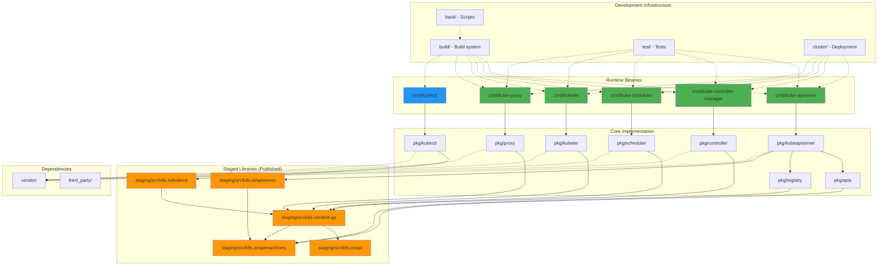
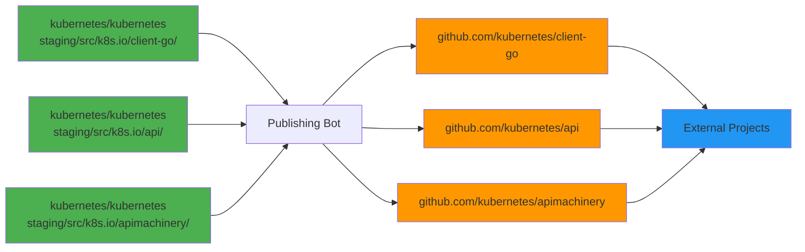
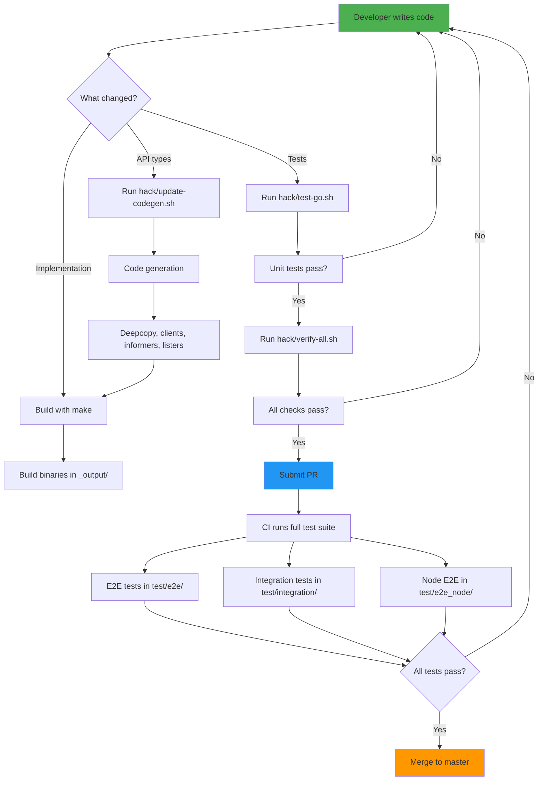
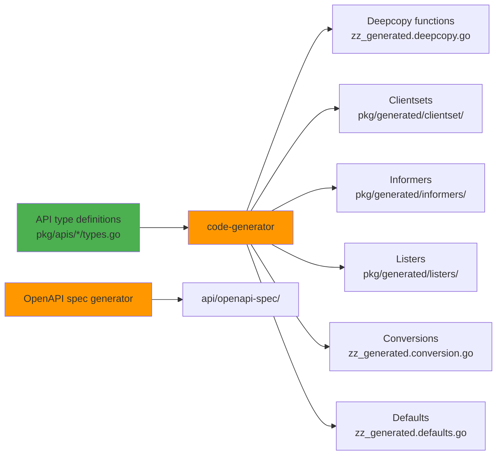
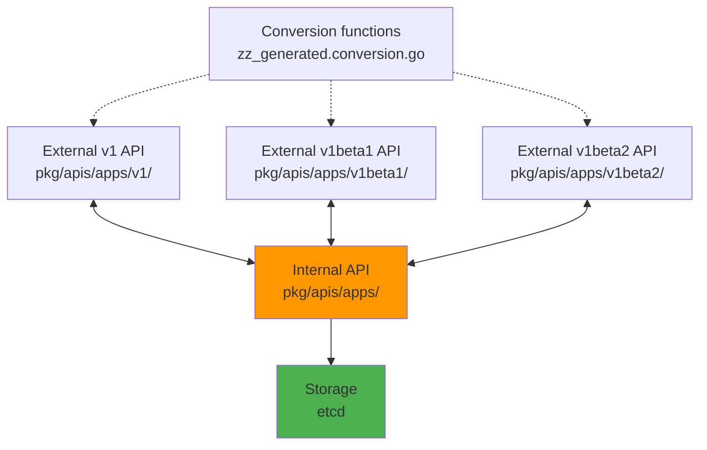
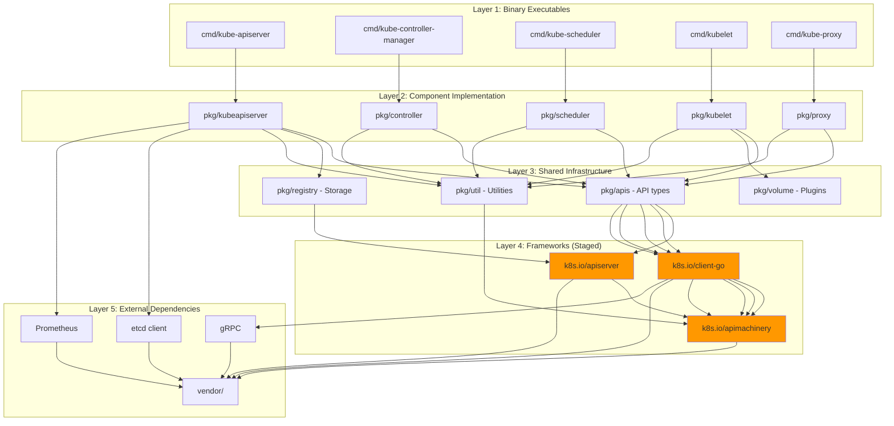

# **KUBERNETES REPOSITORY OVERVIEW**

**High-Level Architecture and Structure of kubernetes/kubernetes**

━━━━━━━━━━━━━━━━━━━━━━━━━━━━━━━━━━━━━━━━━━━━━━━━━━━━━━━━━━━━━━━━━━━━━━━━━━━━━━

## **📊 Repository At A Glance**

### **Key Facts**

| Aspect | Value |
|--------|-------|
| **Repository** | github.com/kubernetes/kubernetes |
| **Language** | Go 1.25.0 |
| **Architecture** | Monorepo with staged components |
| **License** | Apache License 2.0 |
| **Primary Branch** | master |
| **Module System** | Go workspaces (32 staged modules) |
| **Build System** | Make + Docker (hermetic builds) |

### **Codebase Statistics**

| Metric | Count | Purpose |
|--------|------:|---------|
| **Binary Commands** | 28 | Runtime components + dev tools |
| **Core Packages** | 34 | Main implementation in pkg/ |
| **Staged Repositories** | 32 | Published to k8s.io/* |
| **Vendored Modules** | 1,297 | Third-party dependencies |
| **Test Directories** | 20 | Testing infrastructure |
| **Development Scripts** | 120+ | Build/test automation |
| **Build Components** | 21 | Build infrastructure |
| **Deployment Scripts** | 19 | Cluster deployment |

━━━━━━━━━━━━━━━━━━━━━━━━━━━━━━━━━━━━━━━━━━━━━━━━━━━━━━━━━━━━━━━━━━━━━━━━━━━━━━

## **🗺️ Top-Level Directory Structure**

### **Visual Directory Tree**

```
/Users/sureshscribnar/Documents/Projects/opensource/kubernetes/
│
├── cmd/                    # ✅ ACTIVE - Binary entry points (28 commands)
│   ├── kube-apiserver/     #    API server (core component)
│   ├── kube-controller-manager/  #  Controllers (core component)
│   ├── kube-scheduler/     #    Scheduler (core component)
│   ├── kubelet/            #    Node agent (core component)
│   ├── kube-proxy/         #    Network proxy (core component)
│   ├── kubectl/            #    CLI client
│   ├── kubeadm/            #    Cluster bootstrap
│   ├── cloud-controller-manager/ # Cloud integration
│   └── [20 more dev tools] #    Code generation, doc generation, etc.
│
├── pkg/                    # ✅ ACTIVE - Core implementation (34 packages)
│   ├── kubeapiserver/      #    API server implementation
│   ├── controller/         #    Controller implementations (44 subdirs)
│   ├── kubelet/            #    Kubelet implementation (87 subdirs)
│   ├── scheduler/          #    Scheduler implementation (18 subdirs)
│   ├── proxy/              #    Kube-proxy implementation (30 subdirs)
│   ├── apis/               #    API group implementations (29 subdirs)
│   ├── registry/           #    API storage/registry (27 subdirs)
│   ├── kubectl/            #    kubectl implementation
│   ├── volume/             #    Volume plugin framework (42 subdirs)
│   └── [25 more packages]  #    Utilities, features, security, etc.
│
├── staging/                # ✅ ACTIVE - External repositories (32 modules)
│   └── src/k8s.io/         #    All staged components
│       ├── api/            #    API type definitions
│       ├── apimachinery/   #    API machinery (meta, runtime, schema)
│       ├── client-go/      #    Go client library
│       ├── apiserver/      #    Generic API server framework
│       ├── kubectl/        #    kubectl library
│       └── [27 more repos] #    Component types, frameworks, tools
│
├── vendor/                 # ✅ ACTIVE - Vendored dependencies (1,297 modules)
│   ├── github.com/         #    GitHub-hosted dependencies
│   ├── golang.org/         #    Go standard library extensions
│   ├── google.golang.org/  #    Google libraries (gRPC, etc.)
│   ├── k8s.io/             #    Kubernetes staged modules
│   └── [many more]         #    All third-party dependencies
│
├── test/                   # ✅ ACTIVE - Testing infrastructure (20 subdirs)
│   ├── e2e/                #    End-to-end tests (33 subdirs)
│   ├── integration/        #    Integration tests (67 subdirs)
│   ├── e2e_node/           #    Node E2E tests (108 subdirs)
│   ├── cmd/                #    CLI tests (39 subdirs)
│   ├── images/             #    Test container images (30 subdirs)
│   ├── utils/              #    Test utilities (29 subdirs)
│   └── [14 more]           #    Conformance, fixtures, fuzz, etc.
│
├── hack/                   # ✅ ACTIVE - Development scripts (120+ scripts)
│   ├── verify-all.sh       #    Run all verification checks
│   ├── update-all.sh       #    Update all generated code
│   ├── build-go.sh         #    Build Go binaries
│   ├── test-go.sh          #    Run unit tests
│   ├── lib/                #    Shared shell libraries (12 files)
│   ├── make-rules/         #    Make rule implementations (12 files)
│   └── [100+ more scripts] #    Code gen, linting, testing, etc.
│
├── build/                  # ✅ ACTIVE - Build infrastructure (21 components)
│   ├── run.sh              #    Run commands in build container
│   ├── release.sh          #    Create release artifacts
│   ├── common.sh           #    Common build functions
│   ├── dependencies.yaml   #    Build dependencies
│   └── [17 more]           #    Build images, Dockerfiles, etc.
│
├── cluster/                # ✅ ACTIVE - Cluster deployment (19 components)
│   ├── kube-up.sh          #    Start cluster
│   ├── kube-down.sh        #    Stop cluster
│   ├── kubectl.sh          #    kubectl wrapper
│   ├── gce/                #    Google Cloud deployment (18 subdirs)
│   ├── addons/             #    Cluster addons (21 subdirs)
│   └── [14 more]           #    Kubemark, log-dump, etc.
│
├── api/                    # ✅ ACTIVE - API definitions (6 subdirs)
│   ├── openapi-spec/       #    OpenAPI specifications (swagger.json)
│   ├── discovery/          #    API discovery documents (62 subdirs)
│   └── api-rules/          #    API validation rules (8 subdirs)
│
├── docs/                   # ✅ ACTIVE - Documentation
│   └── architecture/       #    Architecture documentation
│       └── claude/         #    AI-generated architecture docs
│
├── plugin/                 # 🚧 STABLE - Plugin infrastructure (minimal)
│   └── pkg/admission/      #    Admission webhook plugins
│
├── third_party/            # 🚧 STABLE - Third-party code (7 subdirs)
│   ├── forked/             #    Forked dependencies (modified)
│   ├── protobuf/           #    Protocol buffer definitions
│   └── [5 more]            #    gimme, multiarch, etc.
│
├── .github/                # ✅ ACTIVE - GitHub configuration
│   ├── ISSUE_TEMPLATE/     #    Issue templates
│   ├── PULL_REQUEST_TEMPLATE.md # PR template
│   └── SECURITY.md         #    Security policy
│
├── go.mod                  # ✅ Main module definition
├── go.work                 # ✅ Workspace configuration (32 modules)
├── go.sum                  # ✅ Dependency checksums
├── Makefile → build/root/Makefile # ✅ Build entry point
├── OWNERS                  # ✅ Code ownership (SIG assignments)
├── OWNERS_ALIASES          # ✅ Team membership definitions
├── LICENSE                 # ✅ Apache License 2.0
└── README.md               # ✅ Repository README
```

**Legend**:
- ✅ **ACTIVE** - Actively maintained and developed
- 🚧 **STABLE** - Mature, stable, minimal changes
- ⚠️ **DEPRECATED** - Legacy code, use with caution
- 🔴 **ARCHIVED** - No longer maintained

━━━━━━━━━━━━━━━━━━━━━━━━━━━━━━━━━━━━━━━━━━━━━━━━━━━━━━━━━━━━━━━━━━━━━━━━━━━━━━

## **🏗️ Repository Architecture**

### **Architecture Diagram**



**Legend**:
- 🟢 **Green** - Core runtime components
- 🔵 **Blue** - CLI/development tools
- 🟠 **Orange** - Staged/published libraries
- ➡️ **Solid arrows** - Direct dependencies
- ⤷ **Dashed arrows** - Build/test dependencies

━━━━━━━━━━━━━━━━━━━━━━━━━━━━━━━━━━━━━━━━━━━━━━━━━━━━━━━━━━━━━━━━━━━━━━━━━━━━━━

## **🔧 Core Components**

### **Runtime Components** (Must run for cluster to function)

| Component | Binary | Purpose | Code Location |
|-----------|--------|---------|---------------|
| **API Server** | `kube-apiserver` | REST API, validation, admission | `/Users/sureshscribnar/Documents/Projects/opensource/kubernetes/cmd/kube-apiserver/` |
| **Controller Manager** | `kube-controller-manager` | Reconciliation loops (44 controllers) | `/Users/sureshscribnar/Documents/Projects/opensource/kubernetes/cmd/kube-controller-manager/` |
| **Scheduler** | `kube-scheduler` | Pod placement decisions | `/Users/sureshscribnar/Documents/Projects/opensource/kubernetes/cmd/kube-scheduler/` |
| **Kubelet** | `kubelet` | Node agent, container lifecycle | `/Users/sureshscribnar/Documents/Projects/opensource/kubernetes/cmd/kubelet/` |
| **Kube-proxy** | `kube-proxy` | Service networking (iptables/IPVS) | `/Users/sureshscribnar/Documents/Projects/opensource/kubernetes/cmd/kube-proxy/` |

### **Client Tools** (User-facing, optional)

| Tool | Binary | Purpose | Code Location |
|------|--------|---------|---------------|
| **kubectl** | `kubectl` | CLI for cluster interaction | `/Users/sureshscribnar/Documents/Projects/opensource/kubernetes/cmd/kubectl/` |
| **kubeadm** | `kubeadm` | Cluster bootstrap/management | `/Users/sureshscribnar/Documents/Projects/opensource/kubernetes/cmd/kubeadm/` |

### **Cloud Integration** (Optional, cloud-specific)

| Component | Binary | Purpose | Code Location |
|-----------|--------|---------|---------------|
| **Cloud Controller Manager** | `cloud-controller-manager` | Cloud provider interface | `/Users/sureshscribnar/Documents/Projects/opensource/kubernetes/cmd/cloud-controller-manager/` |

━━━━━━━━━━━━━━━━━━━━━━━━━━━━━━━━━━━━━━━━━━━━━━━━━━━━━━━━━━━━━━━━━━━━━━━━━━━━━━

## **📦 Monorepo Organization**

### **Why a Monorepo?**

Kubernetes uses a monorepo architecture for several strategic reasons:

**Advantages**:
- ✅ **Atomic Changes**: Modify API server, controller, and client in one commit
- ✅ **Shared Tooling**: Common build scripts, code generation, testing infrastructure
- ✅ **Coordinated Versioning**: All components released together with same version
- ✅ **Simplified Dependencies**: Internal packages resolve locally, not via network
- ✅ **Cross-Component Refactoring**: Rename functions across entire codebase safely

**Challenges**:
- ⚠️ **Repository Size**: Large clone, significant disk space
- ⚠️ **Build Complexity**: Complex build system with code generation
- ⚠️ **Staging Complexity**: Publishing subset of code to external repos
- ⚠️ **Import Restrictions**: Strict rules to prevent circular dependencies

### **Staging Architecture**

Kubernetes uses a **staged publishing model** to provide consumable libraries:



**Flow**:
1. Code written in `staging/src/k8s.io/<repo>/`
2. Publishing bot syncs to `github.com/kubernetes/<repo>`
3. External projects import from `k8s.io/<repo>`
4. Import resolution via `go.work` points back to staging/

**Benefits**:
- External projects consume stable APIs without pulling entire monorepo
- Clear module boundaries enforce architectural separation
- Independent versioning for stable components

━━━━━━━━━━━━━━━━━━━━━━━━━━━━━━━━━━━━━━━━━━━━━━━━━━━━━━━━━━━━━━━━━━━━━━━━━━━━━━

## **🔄 Development Lifecycle**

### **Build Time vs Runtime vs Development**

| Directory | Build Time | Runtime | Development | Testing |
|-----------|:----------:|:-------:|:-----------:|:-------:|
| **cmd/** | ✅ | ✅ | ✅ | ✅ |
| **pkg/** | ✅ | ✅ | ✅ | ✅ |
| **staging/** | ✅ | ✅ | ✅ | ✅ |
| **vendor/** | ✅ | ✅ | - | ✅ |
| **test/** | - | - | ✅ | ✅ |
| **hack/** | ✅ | - | ✅ | ✅ |
| **build/** | ✅ | - | ✅ | - |
| **cluster/** | - | - | ✅ | ✅ |
| **api/** | ✅ | ✅ | - | - |
| **docs/** | - | - | ✅ | - |
| **plugin/** | ✅ | ✅ | ✅ | ✅ |
| **third_party/** | ✅ | ✅ | - | ✅ |

### **Component Usage Flow**



━━━━━━━━━━━━━━━━━━━━━━━━━━━━━━━━━━━━━━━━━━━━━━━━━━━━━━━━━━━━━━━━━━━━━━━━━━━━━━

## **📂 Directory Purpose Summary**

### **Source Code Directories**

| Directory | Primary Purpose | When Used | Status |
|-----------|----------------|-----------|--------|
| **cmd/** | Binary main() entry points | Runtime + build | ✅ Active |
| **pkg/** | Core implementation code | Runtime + build | ✅ Active |
| **staging/** | Published external libraries | Runtime + build + external | ✅ Active |
| **vendor/** | Third-party dependencies | Runtime + build | ✅ Active |
| **plugin/** | Plugin framework (minimal) | Runtime + build | 🚧 Stable |
| **third_party/** | Modified third-party code | Runtime + build | 🚧 Stable |

### **Infrastructure Directories**

| Directory | Primary Purpose | When Used | Status |
|-----------|----------------|-----------|--------|
| **test/** | Testing infrastructure | Testing | ✅ Active |
| **hack/** | Development scripts | Development + CI | ✅ Active |
| **build/** | Build system | Build time | ✅ Active |
| **cluster/** | Cluster deployment | Development + testing | ✅ Active |
| **api/** | Generated API specs | Build + runtime | ✅ Active |
| **docs/** | Documentation | Development | ✅ Active |
| **.github/** | GitHub configuration | CI/CD | ✅ Active |

━━━━━━━━━━━━━━━━━━━━━━━━━━━━━━━━━━━━━━━━━━━━━━━━━━━━━━━━━━━━━━━━━━━━━━━━━━━━━━

## **🎯 Key Architectural Patterns**

### **1. Code Generation**

Kubernetes heavily relies on code generation:



**Generated Code Markers**:
- Files: `zz_generated.*.go`
- Directories: `pkg/generated/`
- Triggers: Comment markers `// +k8s:deepcopy-gen=true`

### **2. API Versioning**

Multi-version API support through conversion:



### **3. Import Restrictions**

Enforced via `.import-restrictions` files:

```
pkg/
├── .import-restrictions     # pkg/ cannot import cmd/
├── apis/
│   └── .import-restrictions # APIs have strict boundaries
└── controller/
    └── .import-restrictions # Controllers follow rules
```

**Rules Enforced**:
- pkg/ ❌ cannot import cmd/
- Staging repos ❌ cannot have circular deps
- Internal packages ❌ cannot be imported externally
- Each package defines allowed imports

━━━━━━━━━━━━━━━━━━━━━━━━━━━━━━━━━━━━━━━━━━━━━━━━━━━━━━━━━━━━━━━━━━━━━━━━━━━━━━

## **🔍 Navigation Tips**

### **Finding Component Code**

**Pattern**: Component code is split between `cmd/` (entry point) and `pkg/` (implementation)

**Example - API Server**:
```
cmd/kube-apiserver/          # Entry point (main)
├── apiserver.go             # main() function
└── app/                     # Command setup
    ├── server.go            # Server construction
    └── options/             # CLI flags

pkg/kubeapiserver/           # Implementation
├── server/                  # Server logic
├── admission/               # Admission plugins
└── authenticator/           # Authentication
```

**Example - Controller Manager**:
```
cmd/kube-controller-manager/ # Entry point
└── app/                     # Setup and controller registration

pkg/controller/              # 44 controller implementations
├── deployment/              # Deployment controller
├── replicaset/              # ReplicaSet controller
├── job/                     # Job controller
└── [41 more controllers]
```

### **Finding API Definitions**

**Three Locations**:

1. **Internal types** (canonical):
   ```
   pkg/apis/<group>/types.go
   ```

2. **Versioned types** (used by clients):
   ```
   pkg/apis/<group>/v1/types.go
   pkg/apis/<group>/v1beta1/types.go
   ```

3. **Published types** (external consumption):
   ```
   staging/src/k8s.io/api/<group>/v1/types.go
   ```

### **Finding Tests**

**Pattern**: Tests are co-located with implementation OR in test/ for integration/E2E

**Unit tests**:
```
pkg/controller/deployment/deployment_controller.go
pkg/controller/deployment/deployment_controller_test.go
```

**Integration tests**:
```
test/integration/controlplane/
test/integration/apiserver/
test/integration/scheduler/
```

**E2E tests** (by feature):
```
test/e2e/apps/         # Workload tests (deployment, statefulset)
test/e2e/network/      # Networking tests
test/e2e/storage/      # Storage tests
```

━━━━━━━━━━━━━━━━━━━━━━━━━━━━━━━━━━━━━━━━━━━━━━━━━━━━━━━━━━━━━━━━━━━━━━━━━━━━━━

## **📊 Dependency Overview**

### **Dependency Layers**



**Import Flow**:
1. **Binaries** (cmd/) import **implementations** (pkg/)
2. **Implementations** import **shared infrastructure** (pkg/apis, pkg/util)
3. **Shared infrastructure** imports **frameworks** (staging/src/k8s.io/)
4. **Frameworks** import **external dependencies** (vendor/)

━━━━━━━━━━━━━━━━━━━━━━━━━━━━━━━━━━━━━━━━━━━━━━━━━━━━━━━━━━━━━━━━━━━━━━━━━━━━━━

## **🎓 Next Steps**

### **For New Contributors**

1. **Understand Structure**: Read this document thoroughly
2. **Explore Components**: Review [02-cmd-binaries.md](02-cmd-binaries.md) and [03-pkg-implementation.md](03-pkg-implementation.md)
3. **Learn Workflows**: Study [13-development-workflows.md](13-development-workflows.md)
4. **Set Up Environment**: Follow [08-build-system.md](08-build-system.md)

### **For Developers**

1. **Find Your Component**: Use directory index above
2. **Understand Dependencies**: Review [12-dependency-graph.md](12-dependency-graph.md)
3. **Learn Patterns**: Study [11-code-organization-patterns.md](11-code-organization-patterns.md)
4. **Write Tests**: Explore [06-test-infrastructure.md](06-test-infrastructure.md)

### **Deep Dives**

- **Binary Entry Points**: [02-cmd-binaries.md](02-cmd-binaries.md)
- **Core Packages**: [03-pkg-implementation.md](03-pkg-implementation.md)
- **Staging Architecture**: [04-staging-architecture.md](04-staging-architecture.md)
- **Build System**: [08-build-system.md](08-build-system.md)
- **Testing**: [06-test-infrastructure.md](06-test-infrastructure.md)

━━━━━━━━━━━━━━━━━━━━━━━━━━━━━━━━━━━━━━━━━━━━━━━━━━━━━━━━━━━━━━━━━━━━━━━━━━━━━━

## **📚 Related Documentation**

### **Component-Specific Internals**

- API Server: `docs/architecture/claude/apiserver/`
- Controller Manager: `docs/architecture/claude/controller-manager/`
- Scheduler: `docs/architecture/claude/scheduler/`
- Kubelet: `docs/architecture/claude/kubelet/`
- Kube-proxy: `docs/architecture/claude/kube-proxy/`
- kubectl: `docs/architecture/claude/kubectl/`
- etcd Integration: `docs/architecture/claude/etcd/`
- Common Libraries: `docs/architecture/claude/common/`

### **External Resources**

- **Official Docs**: https://kubernetes.io/docs/
- **Community**: https://github.com/kubernetes/community
- **KEPs**: https://github.com/kubernetes/enhancements
- **Test Infrastructure**: https://github.com/kubernetes/test-infra

━━━━━━━━━━━━━━━━━━━━━━━━━━━━━━━━━━━━━━━━━━━━━━━━━━━━━━━━━━━━━━━━━━━━━━━━━━━━━━

**📅 Last Updated**: 2025-01-16
**📝 Repository Version**: kubernetes/kubernetes (master branch)
**👤 Generated By**: Claude AI (Sonnet 4.5)

━━━━━━━━━━━━━━━━━━━━━━━━━━━━━━━━━━━━━━━━━━━━━━━━━━━━━━━━━━━━━━━━━━━━━━━━━━━━━━
