# **Kubernetes Repository Structure: cmd/ Binaries**

━━━━━━━━━━━━━━━━━━━━━━━━━━━━━━━━━━━━━━━━━━━━━━━━━━━━━━━━━━━━━━━━━━━━━━━━━━━━━━

## **📋 Document Information**

- **Purpose**: Comprehensive documentation of all 25 binaries in the cmd/ directory
- **Audience**: Kubernetes developers, contributors, and architects
- **Scope**: Runtime components, cluster management, code generation, verification tools, and test utilities
- **Last Updated**: 2025-11-16
- **Related Docs**:
  - [03-pkg-implementation.md](./03-pkg-implementation.md) - Package implementations
  - [04-staging-architecture.md](./04-staging-architecture.md) - Staging repository structure
  - [11-code-organization-patterns.md](./11-code-organization-patterns.md) - Code patterns

━━━━━━━━━━━━━━━━━━━━━━━━━━━━━━━━━━━━━━━━━━━━━━━━━━━━━━━━━━━━━━━━━━━━━━━━━━━━━━

## **🎯 Overview**

The `cmd/` directory contains the main entry points for all Kubernetes binaries. These are organized into five major categories:

1. **Runtime Components** (7 binaries) - Core cluster components
2. **Cluster Management** (2 binaries) - Deployment and testing tools
3. **Code Generation Tools** (8 binaries) - Documentation and utility generators
4. **Verification Tools** (6 binaries) - Code quality and import checking
5. **Test Utilities** (2 binaries) - Testing support tools

```mermaid
graph TB
    subgraph "**cmd/ Directory Structure**"
        CMD[cmd/]

        subgraph "**Runtime Components (7)**"
            APISERVER[kube-apiserver]
            CTRLMGR[kube-controller-manager]
            SCHED[kube-scheduler]
            KUBELET[kubelet]
            PROXY[kube-proxy]
            KUBECTL[kubectl]
            CCM[cloud-controller-manager]
        end

        subgraph "**Cluster Management (2)**"
            KUBEADM[kubeadm]
            KUBEMARK[kubemark]
        end

        subgraph "**Code Generation (8)**"
            GENDOCS[gendocs]
            GENKUBEDOCS[genkubedocs]
            GENMAN[genman]
            GENYAML[genyaml]
            GENSWAGGER[genswaggertypedocs]
            GENUTILS[genutils]
            GOTEMPLATE[gotemplate]
            IMPORTBOSS[import-boss]
        end

        subgraph "**Verification Tools (6)**"
            CLICHECK[clicheck]
            DEPCHECK[dependencycheck]
            DEPVERIFY[dependencyverifier]
            FIELDCHECK[fieldnamedocscheck]
            IMPORTVERIFY[importverifier]
            PREFERREDIMPORTS[preferredimports]
        end

        subgraph "**Test Utilities (2)**"
            PRUNEJUNIT[prune-junit-xml]
            KUBECTLCONV[kubectl-convert]
        end

        CMD --> APISERVER
        CMD --> CTRLMGR
        CMD --> SCHED
        CMD --> KUBELET
        CMD --> PROXY
        CMD --> KUBECTL
        CMD --> CCM
        CMD --> KUBEADM
        CMD --> KUBEMARK
        CMD --> GENDOCS
        CMD --> GENKUBEDOCS
        CMD --> GENMAN
        CMD --> GENYAML
        CMD --> GENSWAGGER
        CMD --> GENUTILS
        CMD --> GOTEMPLATE
        CMD --> IMPORTBOSS
        CMD --> CLICHECK
        CMD --> DEPCHECK
        CMD --> DEPVERIFY
        CMD --> FIELDCHECK
        CMD --> IMPORTVERIFY
        CMD --> PREFERREDIMPORTS
        CMD --> PRUNEJUNIT
        CMD --> KUBECTLCONV
    end

    style CMD fill:#1a1a2e,stroke:#16213e,stroke-width:4px,color:#fff
    style APISERVER fill:#0f3460,stroke:#16213e,stroke-width:2px,color:#fff
    style CTRLMGR fill:#0f3460,stroke:#16213e,stroke-width:2px,color:#fff
    style SCHED fill:#0f3460,stroke:#16213e,stroke-width:2px,color:#fff
    style KUBELET fill:#0f3460,stroke:#16213e,stroke-width:2px,color:#fff
    style PROXY fill:#0f3460,stroke:#16213e,stroke-width:2px,color:#fff
    style KUBECTL fill:#0f3460,stroke:#16213e,stroke-width:2px,color:#fff
    style CCM fill:#0f3460,stroke:#16213e,stroke-width:2px,color:#fff
```

━━━━━━━━━━━━━━━━━━━━━━━━━━━━━━━━━━━━━━━━━━━━━━━━━━━━━━━━━━━━━━━━━━━━━━━━━━━━━━

## **🚀 Runtime Components**

### **1. kube-apiserver**

**Path**: `/Users/sureshscribnar/Documents/Projects/opensource/kubernetes/cmd/kube-apiserver/`

**Status**: ✅ Active

**Purpose**: The Kubernetes API server is the central management entity that exposes the Kubernetes API. It is the front-end for the Kubernetes control plane.

**Directory Structure**:
```
cmd/kube-apiserver/
├── apiserver.go           # Main entry point
├── app/                   # Application logic
│   ├── server.go          # Server initialization
│   ├── options/           # Configuration options
│   │   ├── options.go
│   │   └── validation.go
│   ├── aggregator.go      # API aggregation
│   ├── discovery.go       # API discovery
│   └── testing/           # Test utilities
└── BUILD                  # Bazel build file
```

**Key Responsibilities**:
- REST API exposure for all Kubernetes resources
- Authentication, authorization, admission control
- API versioning and validation
- Watch mechanism implementation
- OpenAPI specification serving
- API aggregation layer

**Code Flow**:

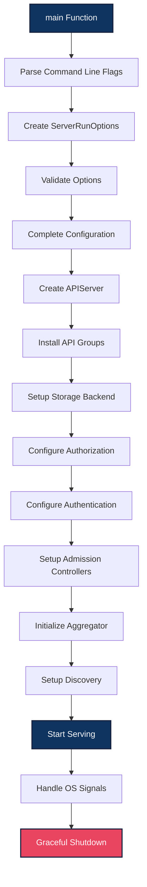

**Main Entry Point**:
```go
// File: /Users/sureshscribnar/Documents/Projects/opensource/kubernetes/cmd/kube-apiserver/apiserver.go
func main() {
    command := app.NewAPIServerCommand()
    code := cli.Run(command)
    os.Exit(code)
}
```

**Configuration Options**:
- `--etcd-servers`: List of etcd servers
- `--service-cluster-ip-range`: CIDR for service IPs
- `--authorization-mode`: Authorization plugins (RBAC, Node, Webhook)
- `--enable-admission-plugins`: Admission controllers
- `--tls-cert-file`, `--tls-private-key-file`: TLS configuration
- `--client-ca-file`: Client certificate authority
- `--service-account-key-file`: Service account signing key

**Dependencies**:
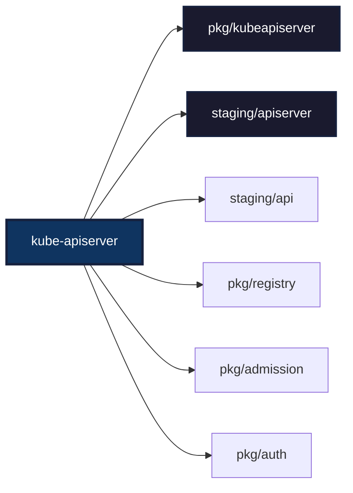

━━━━━━━━━━━━━━━━━━━━━━━━━━━━━━━━━━━━━━━━━━━━━━━━━━━━━━━━━━━━━━━━━━━━━━━━━━━━━━

### **2. kube-controller-manager**

**Path**: `/Users/sureshscribnar/Documents/Projects/opensource/kubernetes/cmd/kube-controller-manager/`

**Status**: ✅ Active

**Purpose**: Runs core control loops that regulate the state of the cluster through the API server.

**Directory Structure**:
```
cmd/kube-controller-manager/
├── controller-manager.go  # Main entry point
├── app/                   # Application logic
│   ├── controllermanager.go
│   ├── options/           # Configuration options
│   │   ├── options.go
│   │   └── validation.go
│   ├── core.go            # Core controllers
│   ├── apps.go            # Apps controllers
│   ├── batch.go           # Batch controllers
│   ├── discovery.go       # Discovery controllers
│   └── testing/
└── BUILD
```

**Embedded Controllers** (37 total):

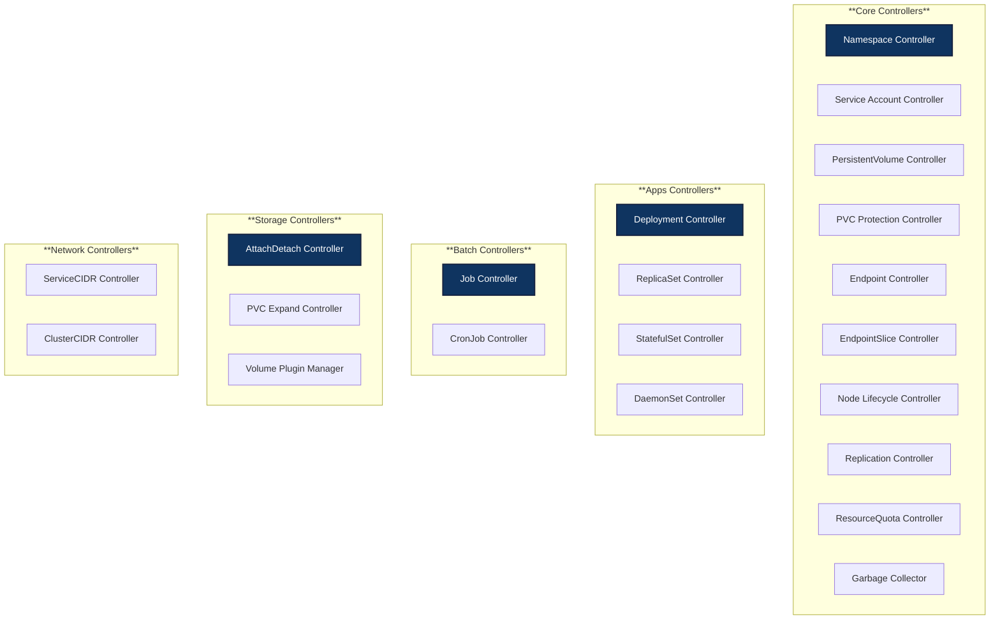

**Controller Lifecycle**:

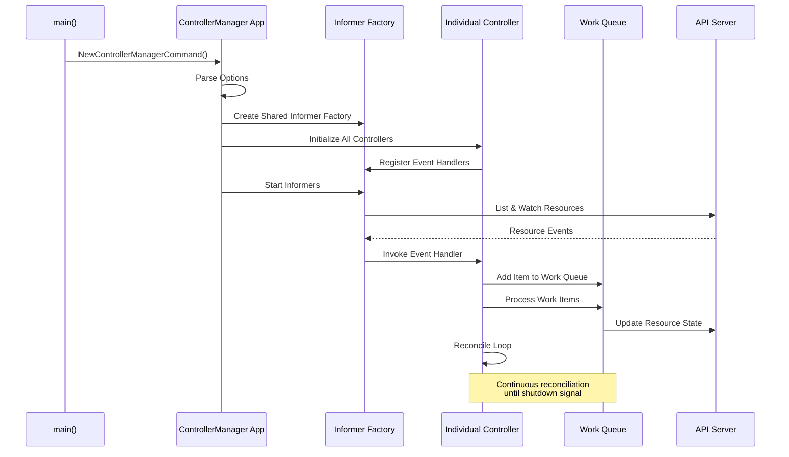

**Main Entry Point**:
```go
// File: /Users/sureshscribnar/Documents/Projects/opensource/kubernetes/cmd/kube-controller-manager/controller-manager.go
func main() {
    command := app.NewControllerManagerCommand()
    code := cli.Run(command)
    os.Exit(code)
}
```

**Key Configuration**:
- `--controllers`: List of controllers to enable (default: all)
- `--leader-elect`: Enable leader election
- `--cluster-cidr`: CIDR for pod IPs
- `--service-cluster-ip-range`: CIDR for service IPs
- `--node-monitor-grace-period`: Grace period before marking node unhealthy
- `--concurrent-*-syncs`: Concurrency for various controllers

**Controller Registration**:
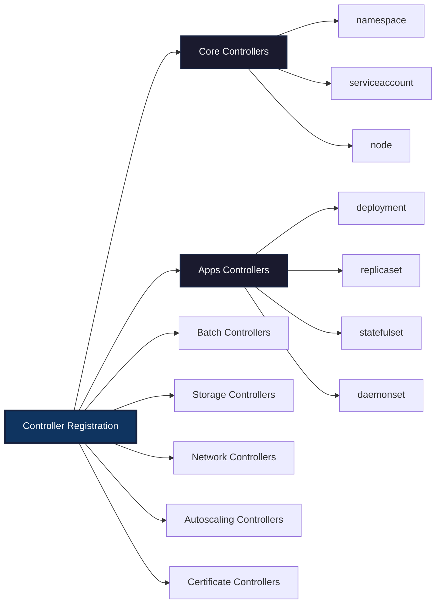

━━━━━━━━━━━━━━━━━━━━━━━━━━━━━━━━━━━━━━━━━━━━━━━━━━━━━━━━━━━━━━━━━━━━━━━━━━━━━━

### **3. kube-scheduler**

**Path**: `/Users/sureshscribnar/Documents/Projects/opensource/kubernetes/cmd/kube-scheduler/`

**Status**: ✅ Active

**Purpose**: Watches for newly created Pods with no assigned node and selects a node for them to run on.

**Directory Structure**:
```
cmd/kube-scheduler/
├── scheduler.go           # Main entry point
├── app/                   # Application logic
│   ├── server.go          # Scheduler server
│   ├── options/           # Configuration options
│   │   ├── options.go
│   │   ├── options_test.go
│   │   └── validation.go
│   ├── config/            # Configuration setup
│   │   ├── config.go
│   │   └── config_test.go
│   └── testing/
└── BUILD
```

**Scheduling Framework**:

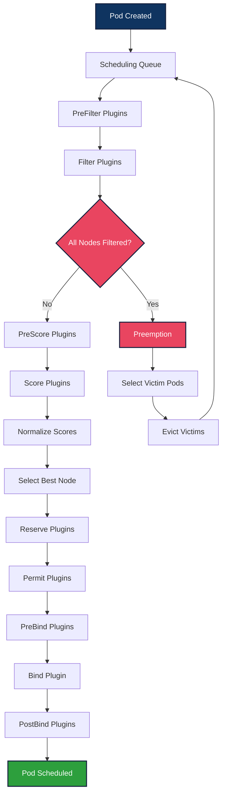

**Scheduling Plugins**:

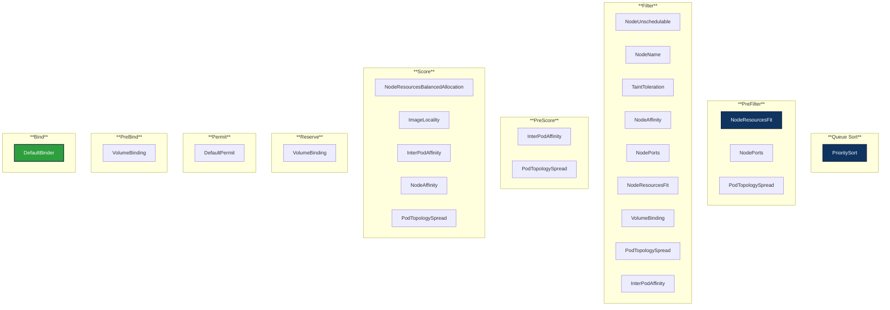

**Main Entry Point**:
```go
// File: /Users/sureshscribnar/Documents/Projects/opensource/kubernetes/cmd/kube-scheduler/scheduler.go
func main() {
    command := app.NewSchedulerCommand()
    code := cli.Run(command)
    os.Exit(code)
}
```

**Key Configuration**:
- `--config`: Path to scheduler configuration file
- `--leader-elect`: Enable leader election
- `--scheduler-name`: Name of the scheduler
- `--kubeconfig`: Path to kubeconfig file
- `--bind-address`: IP address for metrics and health checks
- `--secure-port`: HTTPS port for metrics

**Scheduler Configuration File**:
```yaml
# Example scheduler configuration
apiVersion: kubescheduler.config.k8s.io/v1
kind: KubeSchedulerConfiguration
leaderElection:
  leaderElect: true
clientConnection:
  kubeconfig: /etc/kubernetes/scheduler.conf
profiles:
- schedulerName: default-scheduler
  plugins:
    queueSort:
      enabled:
      - name: PrioritySort
    preFilter:
      enabled:
      - name: NodeResourcesFit
      - name: NodePorts
    filter:
      enabled:
      - name: NodeUnschedulable
      - name: NodeName
      - name: TaintToleration
    score:
      enabled:
      - name: NodeResourcesBalancedAllocation
      - name: ImageLocality
```

━━━━━━━━━━━━━━━━━━━━━━━━━━━━━━━━━━━━━━━━━━━━━━━━━━━━━━━━━━━━━━━━━━━━━━━━━━━━━━

### **4. kubelet**

**Path**: `/Users/sureshscribnar/Documents/Projects/opensource/kubernetes/cmd/kubelet/`

**Status**: ✅ Active

**Purpose**: The primary node agent that runs on each node, manages Pod lifecycle, and communicates with the API server.

**Directory Structure**:
```
cmd/kubelet/
├── kubelet.go             # Main entry point
├── app/                   # Application logic
│   ├── server.go          # Kubelet server setup
│   ├── options/           # Configuration options
│   │   ├── options.go
│   │   ├── container_runtime.go
│   │   ├── osflags.go
│   │   └── globalflags.go
│   ├── auth.go            # Authentication setup
│   ├── plugins.go         # Plugin initialization
│   └── server_test.go
└── BUILD
```

**Kubelet Responsibilities**:

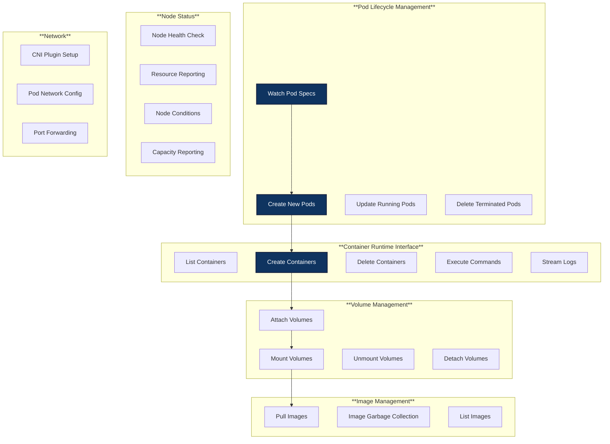

**Kubelet Sync Loop**:

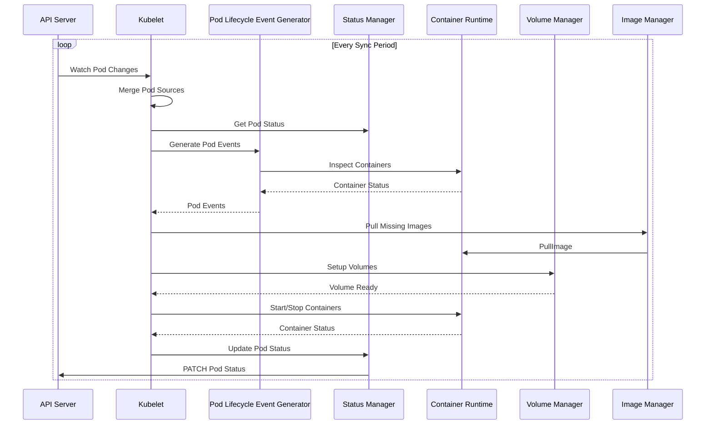

**Main Entry Point**:
```go
// File: /Users/sureshscribnar/Documents/Projects/opensource/kubernetes/cmd/kubelet/kubelet.go
func main() {
    command := app.NewKubeletCommand()
    code := cli.Run(command)
    os.Exit(code)
}
```

**Key Configuration**:
- `--container-runtime-endpoint`: CRI endpoint (default: unix:///var/run/containerd/containerd.sock)
- `--pod-manifest-path`: Static pod manifest directory
- `--kubeconfig`: Path to kubeconfig for API server connection
- `--node-ip`: IP address of the node
- `--cluster-dns`: DNS server IP for cluster
- `--cluster-domain`: Cluster domain suffix
- `--cgroup-driver`: Cgroup driver (cgroupfs or systemd)
- `--max-pods`: Maximum number of pods per node
- `--eviction-hard`: Hard eviction thresholds

**CRI Integration**:

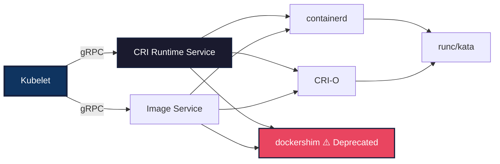

━━━━━━━━━━━━━━━━━━━━━━━━━━━━━━━━━━━━━━━━━━━━━━━━━━━━━━━━━━━━━━━━━━━━━━━━━━━━━━

### **5. kube-proxy**

**Path**: `/Users/sureshscribnar/Documents/Projects/opensource/kubernetes/cmd/kube-proxy/`

**Status**: ✅ Active

**Purpose**: Network proxy that runs on each node, implementing the Kubernetes Service concept by maintaining network rules.

**Directory Structure**:
```
cmd/kube-proxy/
├── proxy.go               # Main entry point
├── app/                   # Application logic
│   ├── server.go          # Proxy server
│   ├── server_others.go   # Unix-specific code
│   ├── server_windows.go  # Windows-specific code
│   ├── conntrack.go       # Connection tracking
│   └── server_test.go
└── BUILD
```

**Proxy Modes**:

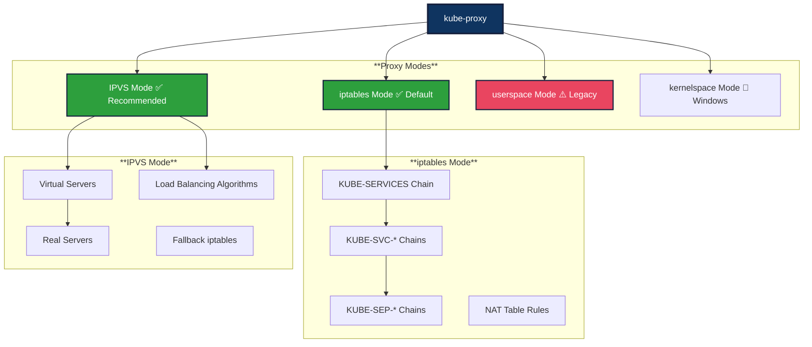

**Service to iptables Rules**:

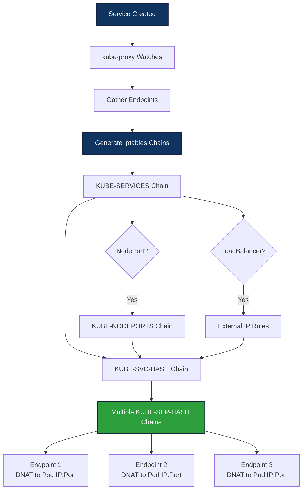

**Main Entry Point**:
```go
// File: /Users/sureshscribnar/Documents/Projects/opensource/kubernetes/cmd/kube-proxy/proxy.go
func main() {
    command := app.NewProxyCommand()
    code := cli.Run(command)
    os.Exit(code)
}
```

**Key Configuration**:
- `--proxy-mode`: Proxy mode (iptables, ipvs, kernelspace)
- `--cluster-cidr`: CIDR for pod IPs
- `--masquerade-all`: SNAT all traffic
- `--iptables-sync-period`: Sync period for iptables rules
- `--ipvs-sync-period`: Sync period for IPVS rules
- `--ipvs-scheduler`: IPVS load balancing algorithm (rr, lc, dh, sh, sed, nq)
- `--conntrack-max-per-core`: Maximum tracked connections per CPU core

**IPVS Load Balancing Algorithms**:

| Algorithm | Name | Description |
|-----------|------|-------------|
| `rr` | Round Robin | Distributes requests evenly |
| `lc` | Least Connection | Routes to server with fewest connections |
| `dh` | Destination Hashing | Routes based on destination IP |
| `sh` | Source Hashing | Routes based on source IP (session affinity) |
| `sed` | Shortest Expected Delay | Routes to server with shortest queue |
| `nq` | Never Queue | Distributes to idle server if available |

━━━━━━━━━━━━━━━━━━━━━━━━━━━━━━━━━━━━━━━━━━━━━━━━━━━━━━━━━━━━━━━━━━━━━━━━━━━━━━

### **6. kubectl**

**Path**: `/Users/sureshscribnar/Documents/Projects/opensource/kubernetes/cmd/kubectl/`

**Status**: ✅ Active

**Purpose**: Command-line tool for controlling Kubernetes clusters.

**Directory Structure**:
```
cmd/kubectl/
├── kubectl.go             # Main entry point
└── BUILD
```

**Note**: Most kubectl implementation resides in:
- `/Users/sureshscribnar/Documents/Projects/opensource/kubernetes/pkg/kubectl/`
- `/Users/sureshscribnar/Documents/Projects/opensource/kubernetes/staging/src/k8s.io/kubectl/`

**Command Categories**:

```mermaid
graph TB
    KUBECTL[kubectl]

    subgraph "**Basic Commands**"
        CREATE[create]
        EXPOSE[expose]
        RUN[run]
        SET[set]
    end

    subgraph "**Deploy Commands**"
        ROLLOUT[rollout]
        SCALE[scale]
        AUTOSCALE[autoscale]
    end

    subgraph "**Cluster Management**"
        CERTIFICATE[certificate]
        CLUSTER_INFO[cluster-info]
        TOP[top]
        CORDON[cordon/uncordon]
        DRAIN[drain]
        TAINT[taint]
    end

    subgraph "**Troubleshooting**"
        DESCRIBE[describe]
        LOGS[logs]
        ATTACH[attach]
        EXEC[exec]
        PORT_FORWARD[port-forward]
        PROXY[proxy]
        CP[cp]
        AUTH[auth]
    end

    subgraph "**Advanced Commands**"
        DIFF[diff]
        APPLY[apply]
        PATCH[patch]
        REPLACE[replace]
        WAIT[wait]
        KUSTOMIZE[kustomize]
    end

    subgraph "**Settings Commands**"
        LABEL[label]
        ANNOTATE[annotate]
        COMPLETION[completion]
    end

    KUBECTL --> CREATE
    KUBECTL --> ROLLOUT
    KUBECTL --> CERTIFICATE
    KUBECTL --> DESCRIBE
    KUBECTL --> DIFF
    KUBECTL --> LABEL

    style KUBECTL fill:#0f3460,stroke:#16213e,stroke-width:3px,color:#fff
    style CREATE fill:#1a1a2e,stroke:#16213e,stroke-width:2px,color:#fff
    style APPLY fill:#1a1a2e,stroke:#16213e,stroke-width:2px,color:#fff
```

**kubectl Command Flow**:

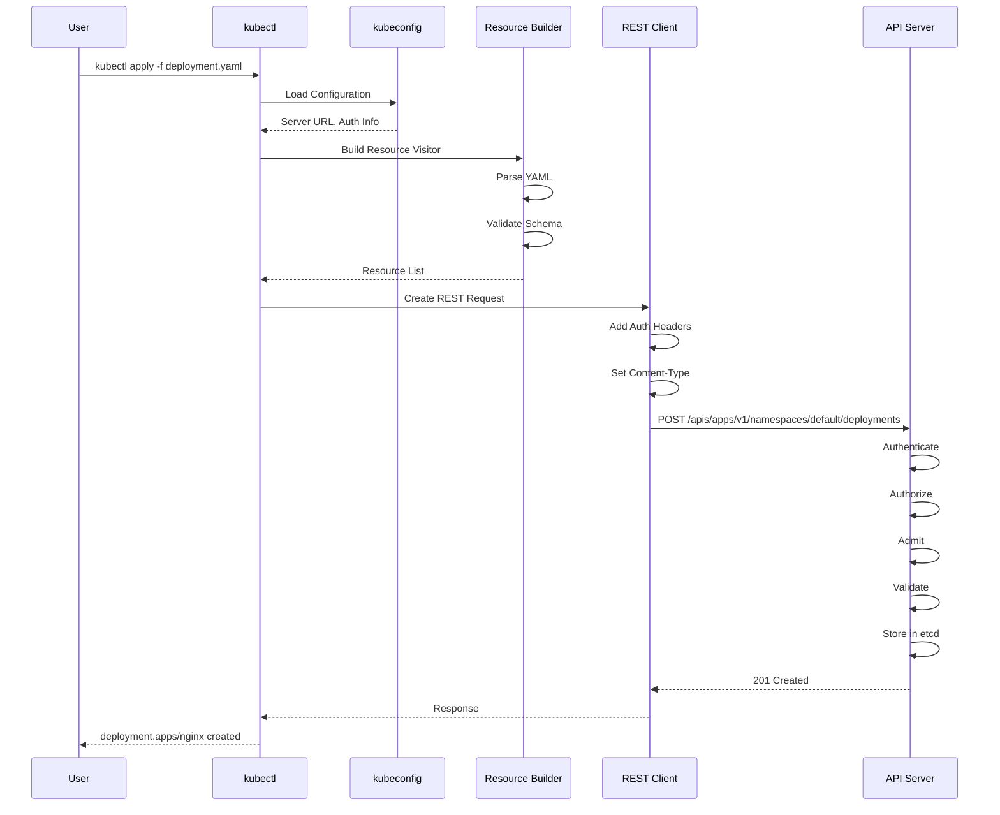

**Main Entry Point**:
```go
// File: /Users/sureshscribnar/Documents/Projects/opensource/kubernetes/cmd/kubectl/kubectl.go
func main() {
    command := cmd.NewDefaultKubectlCommand()
    code := cli.Run(command)
    os.Exit(code)
}
```

**Plugin System**:

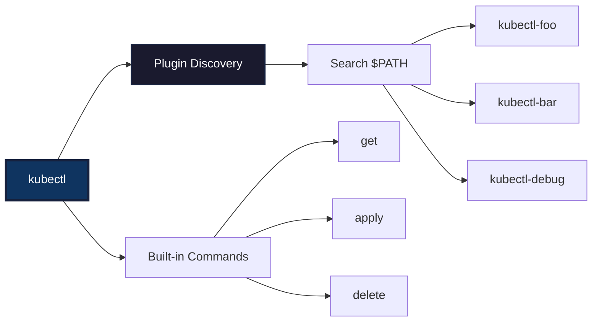

━━━━━━━━━━━━━━━━━━━━━━━━━━━━━━━━━━━━━━━━━━━━━━━━━━━━━━━━━━━━━━━━━━━━━━━━━━━━━━

### **7. cloud-controller-manager**

**Path**: `/Users/sureshscribnar/Documents/Projects/opensource/kubernetes/cmd/cloud-controller-manager/`

**Status**: ✅ Active

**Purpose**: Embeds cloud-specific control logic, allowing cloud providers to integrate with Kubernetes.

**Directory Structure**:
```
cmd/cloud-controller-manager/
├── controller-manager.go  # Main entry point
├── app/                   # Application logic
│   ├── controllermanager.go
│   ├── options/
│   │   ├── options.go
│   │   └── validation.go
│   ├── cloudproviders/
│   │   └── providers.go
│   └── config/
│       └── config.go
└── BUILD
```

**Cloud Controllers**:

```mermaid
graph TB
    CCM[Cloud Controller Manager]

    subgraph "**Core Controllers**"
        NODE[Node Controller]
        ROUTE[Route Controller]
        SERVICE[Service Controller]
    end

    subgraph "**Node Controller Responsibilities**"
        NODE_INIT[Initialize Node]
        NODE_UPDATE[Update Node Addresses]
        NODE_MONITOR[Monitor Node Status]
        NODE_DELETE[Delete Cloud Instance]
    end

    subgraph "**Route Controller Responsibilities**"
        ROUTE_CREATE[Create Routes]
        ROUTE_UPDATE[Update Routes]
        ROUTE_DELETE[Delete Routes]
        ROUTE_SYNC[Sync Route Table]
    end

    subgraph "**Service Controller Responsibilities**"
        LB_CREATE[Create Load Balancer]
        LB_UPDATE[Update Load Balancer]
        LB_DELETE[Delete Load Balancer]
        LB_SYNC[Sync LB Status]
    end

    CCM --> NODE
    CCM --> ROUTE
    CCM --> SERVICE

    NODE --> NODE_INIT
    NODE --> NODE_UPDATE
    NODE --> NODE_MONITOR
    NODE --> NODE_DELETE

    ROUTE --> ROUTE_CREATE
    ROUTE --> ROUTE_UPDATE
    ROUTE --> ROUTE_DELETE

    SERVICE --> LB_CREATE
    SERVICE --> LB_UPDATE
    SERVICE --> LB_DELETE

    style CCM fill:#0f3460,stroke:#16213e,stroke-width:3px,color:#fff
    style NODE fill:#1a1a2e,stroke:#16213e,stroke-width:2px,color:#fff
    style ROUTE fill:#1a1a2e,stroke:#16213e,stroke-width:2px,color:#fff
    style SERVICE fill:#1a1a2e,stroke:#16213e,stroke-width:2px,color:#fff
```

**Cloud Provider Interface**:

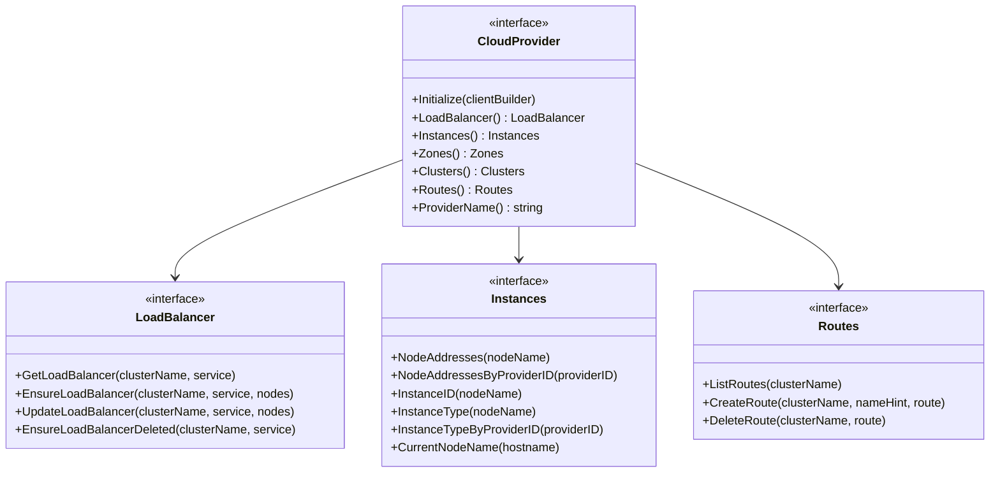

**Main Entry Point**:
```go
// File: /Users/sureshscribnar/Documents/Projects/opensource/kubernetes/cmd/cloud-controller-manager/controller-manager.go
func main() {
    command := app.NewCloudControllerManagerCommand()
    code := cli.Run(command)
    os.Exit(code)
}
```

**Key Configuration**:
- `--cloud-provider`: Cloud provider name (aws, gce, azure, vsphere, etc.)
- `--cloud-config`: Path to cloud provider configuration file
- `--use-service-account-credentials`: Use service account credentials
- `--controllers`: List of controllers to enable
- `--configure-cloud-routes`: Configure routes via cloud provider

**Cloud Provider Migration**:

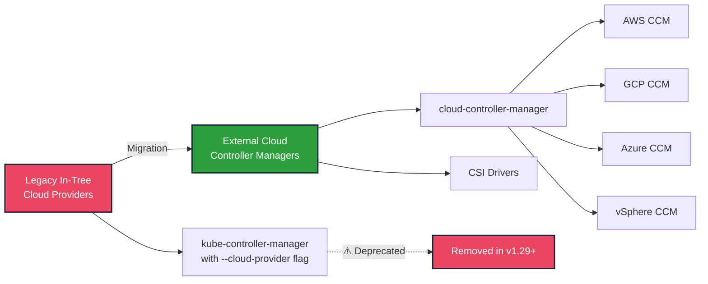

━━━━━━━━━━━━━━━━━━━━━━━━━━━━━━━━━━━━━━━━━━━━━━━━━━━━━━━━━━━━━━━━━━━━━━━━━━━━━━

## **🔧 Cluster Management Tools**

### **8. kubeadm**

**Path**: `/Users/sureshscribnar/Documents/Projects/opensource/kubernetes/cmd/kubeadm/`

**Status**: ✅ Active

**Purpose**: Tool for bootstrapping Kubernetes clusters with best-practice configuration.

**Directory Structure**:
```
cmd/kubeadm/
├── kubeadm.go             # Main entry point
├── app/                   # Application logic
│   ├── cmd/               # Commands
│   │   ├── init.go
│   │   ├── join.go
│   │   ├── reset.go
│   │   ├── upgrade/
│   │   ├── token/
│   │   ├── certs/
│   │   ├── config/
│   │   └── alpha/
│   ├── phases/            # Phase implementations
│   │   ├── init/
│   │   ├── join/
│   │   ├── upgrade/
│   │   └── reset/
│   ├── util/
│   └── discovery/
└── BUILD
```

**kubeadm Commands**:

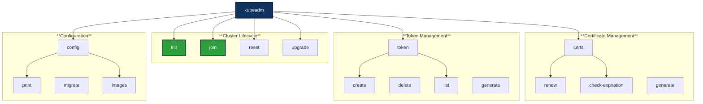

**kubeadm init Phases**:

```mermaid
flowchart TB
    START[kubeadm init] --> PREFLIGHT[Preflight Checks]
    PREFLIGHT --> CERTS[Generate Certificates]
    CERTS --> KUBECONFIG[Generate kubeconfig Files]
    KUBECONFIG --> KUBELET_START[Generate kubelet Config]
    KUBELET_START --> CONTROL_PLANE[Generate Static Pod Manifests]
    CONTROL_PLANE --> ETCD[Wait for etcd]
    ETCD --> WAIT_CONTROL[Wait for Control Plane]
    WAIT_CONTROL --> UPLOAD_CONFIG[Upload Configuration]
    UPLOAD_CONFIG --> UPLOAD_CERTS[Upload Certificates]
    UPLOAD_CERTS --> MARK_CONTROL[Mark Control Plane]
    MARK_CONTROL --> BOOTSTRAP[Bootstrap Tokens]
    BOOTSTRAP --> KUBELET_FINALIZE[Finalize kubelet]
    KUBELET_FINALIZE --> ADDONS[Install Addons]
    ADDONS --> COMPLETE[✅ Cluster Ready]

    ADDONS --> COREDNS[CoreDNS]
    ADDONS --> KUBEPROXY[kube-proxy]

    style START fill:#0f3460,stroke:#16213e,stroke-width:2px,color:#fff
    style COMPLETE fill:#2d9f3d,stroke:#16213e,stroke-width:3px,color:#fff
    style CERTS fill:#1a1a2e,stroke:#16213e,stroke-width:2px,color:#fff
    style CONTROL_PLANE fill:#1a1a2e,stroke:#16213e,stroke-width:2px,color:#fff
```

**kubeadm join Phases**:

```mermaid
flowchart TB
    START[kubeadm join] --> PREFLIGHT[Preflight Checks]
    PREFLIGHT --> DISCOVERY[Cluster Info Discovery]
    DISCOVERY --> BOOTSTRAP[TLS Bootstrap]
    BOOTSTRAP --> KUBELET_START[Start kubelet]
    KUBELET_START --> CONTROL_PLANE{Control Plane?}

    CONTROL_PLANE -->|Yes| DOWNLOAD_CERTS[Download Certificates]
    DOWNLOAD_CERTS --> CERTS[Generate Missing Certs]
    CERTS --> KUBECONFIG[Generate kubeconfig]
    KUBECONFIG --> MANIFESTS[Control Plane Manifests]
    MANIFESTS --> MARK[Mark Control Plane]

    CONTROL_PLANE -->|No| WORKER_COMPLETE[✅ Worker Node Joined]
    MARK --> CONTROL_COMPLETE[✅ Control Plane Joined]

    style START fill:#0f3460,stroke:#16213e,stroke-width:2px,color:#fff
    style WORKER_COMPLETE fill:#2d9f3d,stroke:#16213e,stroke-width:3px,color:#fff
    style CONTROL_COMPLETE fill:#2d9f3d,stroke:#16213e,stroke-width:3px,color:#fff
```

**Main Entry Point**:
```go
// File: /Users/sureshscribnar/Documents/Projects/opensource/kubernetes/cmd/kubeadm/kubeadm.go
func main() {
    command := app.NewKubeadmCommand(os.Stdin, os.Stdout, os.Stderr)
    err := command.Execute()
    if err != nil {
        os.Exit(1)
    }
}
```

**Certificates Generated**:

| Certificate | Path | Purpose |
|-------------|------|---------|
| ca.crt | /etc/kubernetes/pki/ | Cluster CA certificate |
| apiserver.crt | /etc/kubernetes/pki/ | API server certificate |
| apiserver-kubelet-client.crt | /etc/kubernetes/pki/ | API server to kubelet client cert |
| front-proxy-ca.crt | /etc/kubernetes/pki/ | Front proxy CA |
| front-proxy-client.crt | /etc/kubernetes/pki/ | Front proxy client cert |
| etcd/ca.crt | /etc/kubernetes/pki/etcd/ | etcd CA certificate |
| etcd/server.crt | /etc/kubernetes/pki/etcd/ | etcd server certificate |
| etcd/peer.crt | /etc/kubernetes/pki/etcd/ | etcd peer certificate |
| etcd/healthcheck-client.crt | /etc/kubernetes/pki/etcd/ | etcd health check client |
| apiserver-etcd-client.crt | /etc/kubernetes/pki/ | API server to etcd client cert |
| sa.key / sa.pub | /etc/kubernetes/pki/ | Service account signing key |

━━━━━━━━━━━━━━━━━━━━━━━━━━━━━━━━━━━━━━━━━━━━━━━━━━━━━━━━━━━━━━━━━━━━━━━━━━━━━━

### **9. kubemark**

**Path**: `/Users/sureshscribnar/Documents/Projects/opensource/kubernetes/cmd/kubemark/`

**Status**: ✅ Active

**Purpose**: Performance testing tool that creates "hollow" nodes to simulate large-scale clusters.

**Directory Structure**:
```
cmd/kubemark/
├── hollow_node.go         # Hollow node implementation
├── hollow-node.go         # Main entry point
└── BUILD
```

**Kubemark Architecture**:

```mermaid
graph TB
    subgraph "**Real Cluster**"
        REAL_API[Real API Server]
        REAL_ETCD[Real etcd]
        REAL_CTRL[Real Controllers]
    end

    subgraph "**Kubemark Cluster**"
        KUBEMARK_POD1[Kubemark Pod 1<br/>Hollow Kubelet + Hollow Proxy]
        KUBEMARK_POD2[Kubemark Pod 2<br/>Hollow Kubelet + Hollow Proxy]
        KUBEMARK_POD3[Kubemark Pod 3<br/>Hollow Kubelet + Hollow Proxy]
        KUBEMARK_PODN[Kubemark Pod N<br/>Hollow Kubelet + Hollow Proxy]
    end

    KUBEMARK_POD1 --> REAL_API
    KUBEMARK_POD2 --> REAL_API
    KUBEMARK_POD3 --> REAL_API
    KUBEMARK_PODN --> REAL_API

    REAL_API --> REAL_ETCD
    REAL_API --> REAL_CTRL

    style REAL_API fill:#0f3460,stroke:#16213e,stroke-width:3px,color:#fff
    style KUBEMARK_POD1 fill:#1a1a2e,stroke:#16213e,stroke-width:2px,color:#fff
    style KUBEMARK_POD2 fill:#1a1a2e,stroke:#16213e,stroke-width:2px,color:#fff
    style KUBEMARK_POD3 fill:#1a1a2e,stroke:#16213e,stroke-width:2px,color:#fff
    style KUBEMARK_PODN fill:#1a1a2e,stroke:#16213e,stroke-width:2px,color:#fff
```

**Hollow Components**:

```mermaid
graph LR
    subgraph "**Hollow Kubelet**"
        HK[Hollow Kubelet]
        HK_STATUS[Report Node Status ✅]
        HK_HEARTBEAT[Send Heartbeats ✅]
        HK_PODS[Actually Run Pods ❌]
        HK_VOLUMES[Mount Volumes ❌]
        HK_LOGS[Provide Logs ❌]
    end

    subgraph "**Hollow Proxy**"
        HP[Hollow Proxy]
        HP_WATCH[Watch Services ✅]
        HP_ENDPOINTS[Watch Endpoints ✅]
        HP_RULES[Program iptables ❌]
        HP_FORWARD[Forward Traffic ❌]
    end

    HK --> HK_STATUS
    HK --> HK_HEARTBEAT
    HK -.-> HK_PODS
    HK -.-> HK_VOLUMES
    HK -.-> HK_LOGS

    HP --> HP_WATCH
    HP --> HP_ENDPOINTS
    HP -.-> HP_RULES
    HP -.-> HP_FORWARD

    style HK fill:#0f3460,stroke:#16213e,stroke-width:2px,color:#fff
    style HP fill:#0f3460,stroke:#16213e,stroke-width:2px,color:#fff
    style HK_STATUS fill:#2d9f3d,stroke:#16213e,stroke-width:2px,color:#fff
    style HK_HEARTBEAT fill:#2d9f3d,stroke:#16213e,stroke-width:2px,color:#fff
    style HK_PODS fill:#e94560,stroke:#16213e,stroke-width:2px,color:#fff
```

**Use Cases**:

1. **Scalability Testing**: Test control plane with thousands of nodes
2. **Performance Benchmarking**: Measure API server response times
3. **Controller Testing**: Test controller behavior at scale
4. **Scheduler Testing**: Test scheduling algorithms with many nodes
5. **Resource Planning**: Determine control plane resource requirements

**Main Entry Point**:
```go
// File: /Users/sureshscribnar/Documents/Projects/opensource/kubernetes/cmd/kubemark/hollow-node.go
func main() {
    command := NewHollowNodeCommand()
    err := command.Execute()
    if err != nil {
        os.Exit(1)
    }
}
```

━━━━━━━━━━━━━━━━━━━━━━━━━━━━━━━━━━━━━━━━━━━━━━━━━━━━━━━━━━━━━━━━━━━━━━━━━━━━━━

## **📝 Code Generation Tools**

### **10. gendocs**

**Path**: `/Users/sureshscribnar/Documents/Projects/opensource/kubernetes/cmd/gendocs/`

**Status**: ✅ Active

**Purpose**: Generates documentation for Kubernetes API types.

**Directory Structure**:
```
cmd/gendocs/
├── gendocs.go             # Main entry point
└── BUILD
```

**Documentation Generation Flow**:

```mermaid
flowchart LR
    SOURCE[Go Source Files] --> PARSER[Parse Go AST]
    PARSER --> TYPES[Extract Type Definitions]
    TYPES --> METADATA[Extract Metadata]
    METADATA --> TEMPLATE[Apply Templates]
    TEMPLATE --> MARKDOWN[Generate Markdown]
    MARKDOWN --> OUTPUT[Output Files]

    METADATA --> COMMENTS[Doc Comments]
    METADATA --> TAGS[Struct Tags]
    METADATA --> DEFAULTS[Default Values]

    style SOURCE fill:#0f3460,stroke:#16213e,stroke-width:2px,color:#fff
    style OUTPUT fill:#2d9f3d,stroke:#16213e,stroke-width:2px,color:#fff
```

━━━━━━━━━━━━━━━━━━━━━━━━━━━━━━━━━━━━━━━━━━━━━━━━━━━━━━━━━━━━━━━━━━━━━━━━━━━━━━

### **11. genkubedocs**

**Path**: `/Users/sureshscribnar/Documents/Projects/opensource/kubernetes/cmd/genkubedocs/`

**Status**: ✅ Active

**Purpose**: Generates documentation for kubectl commands.

**Directory Structure**:
```
cmd/genkubedocs/
├── gen_kubectl_docs.go    # Main entry point
└── BUILD
```

**Usage**:
```bash
# Generate kubectl documentation
go run cmd/genkubedocs/gen_kubectl_docs.go \
    --output-dir docs/user-guide/kubectl/
```

**Generated Documentation**:
- Command reference pages
- Flag descriptions
- Usage examples
- Related commands

━━━━━━━━━━━━━━━━━━━━━━━━━━━━━━━━━━━━━━━━━━━━━━━━━━━━━━━━━━━━━━━━━━━━━━━━━━━━━━

### **12. genman**

**Path**: `/Users/sureshscribnar/Documents/Projects/opensource/kubernetes/cmd/genman/`

**Status**: ✅ Active

**Purpose**: Generates man pages for Kubernetes commands.

**Directory Structure**:
```
cmd/genman/
├── gen_kube_man.go        # Main entry point
└── BUILD
```

**Man Page Generation**:

```mermaid
flowchart TB
    COMMANDS[Cobra Commands] --> PARSER[Parse Command Tree]
    PARSER --> EXTRACT[Extract Metadata]
    EXTRACT --> GENERATOR[Man Page Generator]
    GENERATOR --> SECTIONS[Man Page Sections]

    SECTIONS --> NAME[NAME Section]
    SECTIONS --> SYNOPSIS[SYNOPSIS Section]
    SECTIONS --> DESCRIPTION[DESCRIPTION Section]
    SECTIONS --> OPTIONS[OPTIONS Section]
    SECTIONS --> EXAMPLES[EXAMPLES Section]
    SECTIONS --> SEE_ALSO[SEE ALSO Section]

    GENERATOR --> OUTPUT[/usr/share/man/man1/]

    style COMMANDS fill:#0f3460,stroke:#16213e,stroke-width:2px,color:#fff
    style OUTPUT fill:#2d9f3d,stroke:#16213e,stroke-width:2px,color:#fff
```

**Generated Man Pages**:
- kube-apiserver.1
- kube-controller-manager.1
- kube-scheduler.1
- kubelet.1
- kube-proxy.1
- kubectl.1
- kubeadm.1

━━━━━━━━━━━━━━━━━━━━━━━━━━━━━━━━━━━━━━━━━━━━━━━━━━━━━━━━━━━━━━━━━━━━━━━━━━━━━━

### **13. genyaml**

**Path**: `/Users/sureshscribnar/Documents/Projects/opensource/kubernetes/cmd/genyaml/`

**Status**: ✅ Active

**Purpose**: Generates YAML documentation for Kubernetes resources.

**Directory Structure**:
```
cmd/genyaml/
├── gen_kubectl_yaml.go    # Main entry point
└── BUILD
```

**YAML Documentation Generation**:

```mermaid
flowchart LR
    KUBECTL[kubectl Commands] --> METADATA[Extract Metadata]
    METADATA --> YAML[Generate YAML]
    YAML --> DOCS[Documentation Files]

    METADATA --> CMD_INFO[Command Info]
    METADATA --> FLAGS[Flags]
    METADATA --> EXAMPLES[Examples]

    style KUBECTL fill:#0f3460,stroke:#16213e,stroke-width:2px,color:#fff
    style DOCS fill:#2d9f3d,stroke:#16213e,stroke-width:2px,color:#fff
```

━━━━━━━━━━━━━━━━━━━━━━━━━━━━━━━━━━━━━━━━━━━━━━━━━━━━━━━━━━━━━━━━━━━━━━━━━━━━━━

### **14. genswaggertypedocs**

**Path**: `/Users/sureshscribnar/Documents/Projects/opensource/kubernetes/cmd/genswaggertypedocs/`

**Status**: ✅ Active

**Purpose**: Generates Swagger (OpenAPI) type documentation.

**Directory Structure**:
```
cmd/genswaggertypedocs/
├── swagger_type_docs.go   # Main entry point
└── BUILD
```

**OpenAPI Generation Flow**:

```mermaid
flowchart TB
    TYPES[Go Types] --> REFLECT[Type Reflection]
    REFLECT --> SWAGGER[Swagger Schema]
    SWAGGER --> MERGE[Merge with Manual Docs]
    MERGE --> VALIDATE[Validate Schema]
    VALIDATE --> OUTPUT[OpenAPI Spec]

    TYPES --> TAGS[JSON Tags]
    TYPES --> COMMENTS[Doc Comments]
    TYPES --> VALIDATION[Validation Tags]

    TAGS --> SWAGGER
    COMMENTS --> SWAGGER
    VALIDATION --> SWAGGER

    OUTPUT --> V2[OpenAPI v2<br/>Swagger 2.0]
    OUTPUT --> V3[OpenAPI v3<br/>OpenAPI 3.0]

    style TYPES fill:#0f3460,stroke:#16213e,stroke-width:2px,color:#fff
    style OUTPUT fill:#2d9f3d,stroke:#16213e,stroke-width:2px,color:#fff
```

**Generated Schema Components**:
- Type definitions
- Property descriptions
- Required fields
- Default values
- Validation constraints
- Enum values
- References ($ref)

━━━━━━━━━━━━━━━━━━━━━━━━━━━━━━━━━━━━━━━━━━━━━━━━━━━━━━━━━━━━━━━━━━━━━━━━━━━━━━

### **15. genutils**

**Path**: `/Users/sureshscribnar/Documents/Projects/opensource/kubernetes/cmd/genutils/`

**Status**: ✅ Active

**Purpose**: Generates utility code and documentation.

**Directory Structure**:
```
cmd/genutils/
├── genutils.go            # Main entry point
└── BUILD
```

━━━━━━━━━━━━━━━━━━━━━━━━━━━━━━━━━━━━━━━━━━━━━━━━━━━━━━━━━━━━━━━━━━━━━━━━━━━━━━

### **16. gotemplate**

**Path**: `/Users/sureshscribnar/Documents/Projects/opensource/kubernetes/cmd/gotemplate/`

**Status**: ✅ Active

**Purpose**: Go template processor for code generation.

**Directory Structure**:
```
cmd/gotemplate/
├── main.go                # Main entry point
└── BUILD
```

**Template Processing**:

```mermaid
flowchart LR
    TEMPLATE[Template Files] --> PARSER[Parse Templates]
    DATA[Input Data] --> PARSER
    PARSER --> EXECUTE[Execute Templates]
    EXECUTE --> OUTPUT[Generated Code]

    TEMPLATE --> VARIABLES[Template Variables]
    TEMPLATE --> FUNCTIONS[Template Functions]
    TEMPLATE --> CONTROL[Control Structures]

    style TEMPLATE fill:#0f3460,stroke:#16213e,stroke-width:2px,color:#fff
    style OUTPUT fill:#2d9f3d,stroke:#16213e,stroke-width:2px,color:#fff
```

━━━━━━━━━━━━━━━━━━━━━━━━━━━━━━━━━━━━━━━━━━━━━━━━━━━━━━━━━━━━━━━━━━━━━━━━━━━━━━

### **17. import-boss**

**Path**: `/Users/sureshscribnar/Documents/Projects/opensource/kubernetes/cmd/import-boss/`

**Status**: ✅ Active

**Purpose**: Enforces import restrictions defined in .import-restrictions files.

**Directory Structure**:
```
cmd/import-boss/
├── main.go                # Main entry point
└── BUILD
```

**Import Restriction Enforcement**:

```mermaid
flowchart TB
    START[Scan Repository] --> FIND[Find .import-restrictions Files]
    FIND --> PARSE[Parse Restriction Rules]
    PARSE --> SCAN[Scan Go Files]
    SCAN --> EXTRACT[Extract Import Statements]
    EXTRACT --> CHECK[Check Against Rules]
    CHECK --> VIOLATIONS{Violations Found?}
    VIOLATIONS -->|Yes| REPORT[Report Violations]
    VIOLATIONS -->|No| SUCCESS[✅ All Checks Passed]
    REPORT --> FAIL[❌ Exit with Error]

    style START fill:#0f3460,stroke:#16213e,stroke-width:2px,color:#fff
    style SUCCESS fill:#2d9f3d,stroke:#16213e,stroke-width:3px,color:#fff
    style FAIL fill:#e94560,stroke:#16213e,stroke-width:3px,color:#fff
```

**Import Restriction Example**:
```json
{
  "rules": [
    {
      "selectorRegexp": "k8s[.]io/kubernetes/pkg/.*",
      "allowedPrefixes": [
        "k8s.io/kubernetes/pkg",
        "k8s.io/api",
        "k8s.io/apimachinery",
        "k8s.io/client-go"
      ],
      "forbiddenPrefixes": [
        "k8s.io/kubernetes/cmd"
      ]
    }
  ]
}
```

**Common Restriction Patterns**:

| Pattern | Purpose |
|---------|---------|
| pkg/ → cmd/ | ✅ Forbidden - Prevents library code from depending on binaries |
| staging/ → pkg/ | ⚠️ Restricted - Staging repos should be independent |
| vendor/ → internal/ | ✅ Forbidden - Vendor code cannot import internal packages |
| test/ → pkg/ | ✅ Allowed - Tests can import production code |

━━━━━━━━━━━━━━━━━━━━━━━━━━━━━━━━━━━━━━━━━━━━━━━━━━━━━━━━━━━━━━━━━━━━━━━━━━━━━━

## **🔍 Verification Tools**

### **18. clicheck**

**Path**: `/Users/sureshscribnar/Documents/Projects/opensource/kubernetes/cmd/clicheck/`

**Status**: ✅ Active

**Purpose**: Verifies CLI documentation is up to date.

**Directory Structure**:
```
cmd/clicheck/
├── clicheck.go            # Main entry point
└── BUILD
```

**CLI Check Flow**:

```mermaid
flowchart TB
    START[clicheck] --> GENERATE[Generate Current Docs]
    GENERATE --> COMPARE[Compare with Committed Docs]
    COMPARE --> DIFF{Differences?}
    DIFF -->|Yes| FAIL[❌ Docs Out of Date]
    DIFF -->|No| SUCCESS[✅ Docs Up to Date]

    FAIL --> HINT[Hint: Run hack/update-generated-docs.sh]

    style START fill:#0f3460,stroke:#16213e,stroke-width:2px,color:#fff
    style SUCCESS fill:#2d9f3d,stroke:#16213e,stroke-width:3px,color:#fff
    style FAIL fill:#e94560,stroke:#16213e,stroke-width:3px,color:#fff
```

**Checked Documentation**:
- kubectl command reference
- kube-apiserver flags
- kube-controller-manager flags
- kube-scheduler flags
- kubelet flags
- kube-proxy flags

━━━━━━━━━━━━━━━━━━━━━━━━━━━━━━━━━━━━━━━━━━━━━━━━━━━━━━━━━━━━━━━━━━━━━━━━━━━━━━

### **19. dependencycheck**

**Path**: `/Users/sureshscribnar/Documents/Projects/opensource/kubernetes/cmd/dependencycheck/`

**Status**: ✅ Active

**Purpose**: Checks for forbidden dependencies in go.mod files.

**Directory Structure**:
```
cmd/dependencycheck/
├── dependencycheck.go     # Main entry point
└── BUILD
```

**Dependency Check Process**:

```mermaid
flowchart TB
    START[dependencycheck] --> READ[Read go.mod Files]
    READ --> PARSE[Parse Dependencies]
    PARSE --> RULES[Load Restriction Rules]
    RULES --> CHECK[Check Each Dependency]
    CHECK --> FORBIDDEN{Forbidden Dep?}
    FORBIDDEN -->|Yes| RECORD[Record Violation]
    FORBIDDEN -->|No| CONTINUE[Continue]
    RECORD --> MORE{More Deps?}
    CONTINUE --> MORE
    MORE -->|Yes| CHECK
    MORE -->|No| VIOLATIONS{Any Violations?}
    VIOLATIONS -->|Yes| FAIL[❌ Exit with Error]
    VIOLATIONS -->|No| SUCCESS[✅ All Deps OK]

    style START fill:#0f3460,stroke:#16213e,stroke-width:2px,color:#fff
    style SUCCESS fill:#2d9f3d,stroke:#16213e,stroke-width:3px,color:#fff
    style FAIL fill:#e94560,stroke:#16213e,stroke-width:3px,color:#fff
```

**Forbidden Dependencies Examples**:
- GPL-licensed packages
- Unmaintained packages
- Security-vulnerable versions
- Circular dependencies

━━━━━━━━━━━━━━━━━━━━━━━━━━━━━━━━━━━━━━━━━━━━━━━━━━━━━━━━━━━━━━━━━━━━━━━━━━━━━━

### **20. dependencyverifier**

**Path**: `/Users/sureshscribnar/Documents/Projects/opensource/kubernetes/cmd/dependencyverifier/`

**Status**: ✅ Active

**Purpose**: Verifies vendor/ directory matches go.mod.

**Directory Structure**:
```
cmd/dependencyverifier/
├── dependencyverifier.go  # Main entry point
└── BUILD
```

**Verification Flow**:

```mermaid
flowchart LR
    GOMOD[go.mod] --> PARSE[Parse Dependencies]
    VENDOR[vendor/] --> SCAN[Scan Vendored Code]
    PARSE --> COMPARE[Compare]
    SCAN --> COMPARE
    COMPARE --> MATCH{Match?}
    MATCH -->|Yes| SUCCESS[✅ Vendor OK]
    MATCH -->|No| FAIL[❌ Vendor Out of Sync]

    FAIL --> HINT[Run: go mod vendor]

    style GOMOD fill:#0f3460,stroke:#16213e,stroke-width:2px,color:#fff
    style SUCCESS fill:#2d9f3d,stroke:#16213e,stroke-width:3px,color:#fff
    style FAIL fill:#e94560,stroke:#16213e,stroke-width:3px,color:#fff
```

**Checks Performed**:
1. All go.mod dependencies are vendored
2. No extra packages in vendor/
3. Version matches exactly
4. Checksums are correct

━━━━━━━━━━━━━━━━━━━━━━━━━━━━━━━━━━━━━━━━━━━━━━━━━━━━━━━━━━━━━━━━━━━━━━━━━━━━━━

### **21. fieldnamedocscheck**

**Path**: `/Users/sureshscribnar/Documents/Projects/opensource/kubernetes/cmd/fieldnamedocscheck/`

**Status**: ✅ Active

**Purpose**: Verifies API field names match documentation.

**Directory Structure**:
```
cmd/fieldnamedocscheck/
├── fieldnamedocscheck.go  # Main entry point
└── BUILD
```

**Field Name Check**:

```mermaid
flowchart TB
    TYPES[API Type Definitions] --> EXTRACT[Extract Field Names]
    DOCS[API Documentation] --> PARSE[Parse Field Docs]
    EXTRACT --> COMPARE[Compare Names]
    PARSE --> COMPARE
    COMPARE --> MISMATCH{Mismatches?}
    MISMATCH -->|Yes| FAIL[❌ Documentation Out of Sync]
    MISMATCH -->|No| SUCCESS[✅ Docs Match Code]

    style TYPES fill:#0f3460,stroke:#16213e,stroke-width:2px,color:#fff
    style SUCCESS fill:#2d9f3d,stroke:#16213e,stroke-width:3px,color:#fff
    style FAIL fill:#e94560,stroke:#16213e,stroke-width:3px,color:#fff
```

**Common Issues Detected**:
- Field renamed but docs not updated
- New field added without docs
- Deprecated field still in docs
- Type changes not reflected

━━━━━━━━━━━━━━━━━━━━━━━━━━━━━━━━━━━━━━━━━━━━━━━━━━━━━━━━━━━━━━━━━━━━━━━━━━━━━━

### **22. importverifier**

**Path**: `/Users/sureshscribnar/Documents/Projects/opensource/kubernetes/cmd/importverifier/`

**Status**: ✅ Active

**Purpose**: Verifies import statements follow project conventions.

**Directory Structure**:
```
cmd/importverifier/
├── importverifier.go      # Main entry point
└── BUILD
```

**Import Verification**:

```mermaid
flowchart TB
    FILES[Go Source Files] --> PARSE[Parse Import Blocks]
    PARSE --> CHECK[Check Import Order]
    CHECK --> GROUPS[Check Import Groups]
    GROUPS --> STYLE[Check Import Style]
    STYLE --> ISSUES{Issues Found?}
    ISSUES -->|Yes| FAIL[❌ Import Violations]
    ISSUES -->|No| SUCCESS[✅ Imports OK]

    FAIL --> FIX[Run: goimports -w .]

    style FILES fill:#0f3460,stroke:#16213e,stroke-width:2px,color:#fff
    style SUCCESS fill:#2d9f3d,stroke:#16213e,stroke-width:3px,color:#fff
    style FAIL fill:#e94560,stroke:#16213e,stroke-width:3px,color:#fff
```

**Import Conventions**:

```go
// Correct import grouping
import (
    // Standard library
    "context"
    "fmt"
    "time"

    // Third-party
    "github.com/spf13/cobra"
    "go.uber.org/zap"

    // Kubernetes
    "k8s.io/api/core/v1"
    "k8s.io/apimachinery/pkg/runtime"
    "k8s.io/client-go/kubernetes"

    // Local
    "k8s.io/kubernetes/pkg/util"
)
```

━━━━━━━━━━━━━━━━━━━━━━━━━━━━━━━━━━━━━━━━━━━━━━━━━━━━━━━━━━━━━━━━━━━━━━━━━━━━━━

### **23. preferredimports**

**Path**: `/Users/sureshscribnar/Documents/Projects/opensource/kubernetes/cmd/preferredimports/`

**Status**: ✅ Active

**Purpose**: Ensures staging repos are imported instead of internal paths.

**Directory Structure**:
```
cmd/preferredimports/
├── preferredimports.go    # Main entry point
└── BUILD
```

**Preferred Import Checking**:

```mermaid
flowchart TB
    SCAN[Scan Go Files] --> IMPORTS[Extract Import Paths]
    IMPORTS --> CHECK[Check Against Preferred List]
    CHECK --> WRONG{Wrong Import?}
    WRONG -->|Yes| SUGGEST[Suggest Preferred Import]
    WRONG -->|No| CONTINUE[Continue]
    SUGGEST --> RECORD[Record Violation]
    CONTINUE --> MORE{More Files?}
    RECORD --> MORE
    MORE -->|Yes| SCAN
    MORE -->|No| VIOLATIONS{Any Violations?}
    VIOLATIONS -->|Yes| FAIL[❌ Use Preferred Imports]
    VIOLATIONS -->|No| SUCCESS[✅ All Imports OK]

    style SCAN fill:#0f3460,stroke:#16213e,stroke-width:2px,color:#fff
    style SUCCESS fill:#2d9f3d,stroke:#16213e,stroke-width:3px,color:#fff
    style FAIL fill:#e94560,stroke:#16213e,stroke-width:3px,color:#fff
```

**Preferred Imports Map**:

| Wrong Import (Internal) | Preferred Import (Staging) |
|-------------------------|----------------------------|
| `k8s.io/kubernetes/pkg/apis/core` | `k8s.io/api/core/v1` |
| `k8s.io/kubernetes/pkg/client/clientset_generated/clientset` | `k8s.io/client-go/kubernetes` |
| `k8s.io/kubernetes/pkg/api/meta` | `k8s.io/apimachinery/pkg/api/meta` |
| `k8s.io/kubernetes/pkg/runtime` | `k8s.io/apimachinery/pkg/runtime` |
| `k8s.io/kubernetes/pkg/util/wait` | `k8s.io/apimachinery/pkg/util/wait` |

**Rationale**:
- Staging repos are published independently
- External consumers must use staging imports
- Internal code should follow same pattern
- Prevents import confusion

━━━━━━━━━━━━━━━━━━━━━━━━━━━━━━━━━━━━━━━━━━━━━━━━━━━━━━━━━━━━━━━━━━━━━━━━━━━━━━

## **🧪 Test Utilities**

### **24. prune-junit-xml**

**Path**: `/Users/sureshscribnar/Documents/Projects/opensource/kubernetes/cmd/prune-junit-xml/`

**Status**: ✅ Active

**Purpose**: Prunes large JUnit XML test output files for CI/CD systems.

**Directory Structure**:
```
cmd/prune-junit-xml/
├── pruner.go              # Main entry point
└── BUILD
```

**Pruning Process**:

```mermaid
flowchart LR
    JUNIT[JUnit XML Files] --> PARSE[Parse XML]
    PARSE --> SIZE[Calculate Size]
    SIZE --> LARGE{Too Large?}
    LARGE -->|Yes| PRUNE[Prune Test Output]
    LARGE -->|No| KEEP[Keep Original]
    PRUNE --> WRITE[Write Pruned XML]
    KEEP --> OUTPUT[Output Files]
    WRITE --> OUTPUT

    PRUNE --> REMOVE_STDOUT[Remove stdout]
    PRUNE --> REMOVE_STDERR[Remove stderr]
    PRUNE --> KEEP_RESULTS[Keep Test Results]

    style JUNIT fill:#0f3460,stroke:#16213e,stroke-width:2px,color:#fff
    style OUTPUT fill:#2d9f3d,stroke:#16213e,stroke-width:2px,color:#fff
```

**Pruning Strategy**:
1. Keep test names and results (pass/fail)
2. Keep failure messages and stack traces
3. Remove verbose stdout/stderr output
4. Preserve test timing information
5. Maintain XML structure validity

**Usage**:
```bash
# Prune JUnit XML to reduce file size
prune-junit-xml \
  --input _artifacts/junit_*.xml \
  --output _artifacts/pruned/ \
  --max-size 10M
```

━━━━━━━━━━━━━━━━━━━━━━━━━━━━━━━━━━━━━━━━━━━━━━━━━━━━━━━━━━━━━━━━━━━━━━━━━━━━━━

### **25. kubectl-convert**

**Path**: `/Users/sureshscribnar/Documents/Projects/opensource/kubernetes/cmd/kubectl-convert/`

**Status**: ⚠️ Deprecated (moved to separate repository)

**Purpose**: Converts Kubernetes manifests between API versions.

**Directory Structure**:
```
cmd/kubectl-convert/
├── convert.go             # Main entry point
└── BUILD
```

**Conversion Process**:

```mermaid
flowchart TB
    INPUT[Input YAML/JSON] --> PARSE[Parse to Internal Version]
    PARSE --> DETECT[Detect Current Version]
    DETECT --> CONVERT[Convert to Target Version]
    CONVERT --> VALIDATE[Validate Schema]
    VALIDATE --> OUTPUT[Output YAML/JSON]

    CONVERT --> FIELDS[Field Mapping]
    CONVERT --> DEFAULTS[Apply Defaults]
    CONVERT --> DEPRECATIONS[Handle Deprecations]

    style INPUT fill:#0f3460,stroke:#16213e,stroke-width:2px,color:#fff
    style OUTPUT fill:#2d9f3d,stroke:#16213e,stroke-width:2px,color:#fff
```

**Example Usage**:
```bash
# Convert Deployment from apps/v1beta1 to apps/v1
kubectl convert -f deployment-v1beta1.yaml \
  --output-version apps/v1 \
  -o yaml > deployment-v1.yaml
```

**Common Conversions**:

| Resource | Old Version | New Version |
|----------|-------------|-------------|
| Deployment | apps/v1beta1 | apps/v1 |
| DaemonSet | extensions/v1beta1 | apps/v1 |
| NetworkPolicy | extensions/v1beta1 | networking.k8s.io/v1 |
| PodSecurityPolicy | policy/v1beta1 | ⚠️ Removed (use Pod Security Admission) |
| Ingress | networking.k8s.io/v1beta1 | networking.k8s.io/v1 |

**Deprecation Notice**:
```
⚠️ kubectl-convert is deprecated and moved to a separate plugin.
Install via: kubectl krew install convert
Repository: https://github.com/kubernetes/kubectl-convert
```

━━━━━━━━━━━━━━━━━━━━━━━━━━━━━━━━━━━━━━━━━━━━━━━━━━━━━━━━━━━━━━━━━━━━━━━━━━━━━━

## **📊 Binary Dependency Matrix**

```mermaid
graph TB
    subgraph "**Runtime Binaries**"
        APISERVER[kube-apiserver]
        CTRLMGR[kube-controller-manager]
        SCHED[kube-scheduler]
        KUBELET[kubelet]
        PROXY[kube-proxy]
        KUBECTL[kubectl]
        CCM[cloud-controller-manager]
    end

    subgraph "**pkg/ Dependencies**"
        PKG_API[pkg/kubeapiserver]
        PKG_CTRL[pkg/controller]
        PKG_SCHED[pkg/scheduler]
        PKG_KUBELET[pkg/kubelet]
        PKG_PROXY[pkg/proxy]
        PKG_KUBECTL[pkg/kubectl]
        PKG_CLOUD[pkg/cloudprovider]
    end

    subgraph "**staging/ Dependencies**"
        STAGING_API[staging/apiserver]
        STAGING_CLIENT[staging/client-go]
        STAGING_APIMACHINERY[staging/apimachinery]
        STAGING_COMPONENT[staging/component-base]
    end

    APISERVER --> PKG_API
    CTRLMGR --> PKG_CTRL
    SCHED --> PKG_SCHED
    KUBELET --> PKG_KUBELET
    PROXY --> PKG_PROXY
    KUBECTL --> PKG_KUBECTL
    CCM --> PKG_CLOUD

    PKG_API --> STAGING_API
    PKG_CTRL --> STAGING_CLIENT
    PKG_SCHED --> STAGING_CLIENT
    PKG_KUBELET --> STAGING_CLIENT
    PKG_PROXY --> STAGING_CLIENT
    PKG_KUBECTL --> STAGING_CLIENT

    STAGING_API --> STAGING_APIMACHINERY
    STAGING_CLIENT --> STAGING_APIMACHINERY

    PKG_API --> STAGING_COMPONENT
    PKG_CTRL --> STAGING_COMPONENT
    PKG_SCHED --> STAGING_COMPONENT

    style APISERVER fill:#0f3460,stroke:#16213e,stroke-width:2px,color:#fff
    style PKG_API fill:#1a1a2e,stroke:#16213e,stroke-width:2px,color:#fff
    style STAGING_API fill:#1a1a2e,stroke:#16213e,stroke-width:2px,color:#fff
```

━━━━━━━━━━━━━━━━━━━━━━━━━━━━━━━━━━━━━━━━━━━━━━━━━━━━━━━━━━━━━━━━━━━━━━━━━━━━━━

## **🔧 Build and Distribution**

### **Binary Build Process**

```mermaid
flowchart TB
    SOURCE[cmd/ Source Files] --> GOBUILD[go build]
    SOURCE --> BAZEL[bazel build]

    GOBUILD --> NATIVE[Native Binary]
    BAZEL --> CROSS[Cross-platform Binaries]

    NATIVE --> LOCAL[Local Development]
    CROSS --> RELEASE[Release Artifacts]

    RELEASE --> LINUX_AMD64[linux/amd64]
    RELEASE --> LINUX_ARM64[linux/arm64]
    RELEASE --> DARWIN_AMD64[darwin/amd64]
    RELEASE --> DARWIN_ARM64[darwin/arm64]
    RELEASE --> WINDOWS_AMD64[windows/amd64]

    RELEASE --> CONTAINERS[Container Images]
    CONTAINERS --> APISERVER_IMG[kube-apiserver image]
    CONTAINERS --> CTRLMGR_IMG[kube-controller-manager image]
    CONTAINERS --> SCHED_IMG[kube-scheduler image]
    CONTAINERS --> PROXY_IMG[kube-proxy image]

    style SOURCE fill:#0f3460,stroke:#16213e,stroke-width:2px,color:#fff
    style RELEASE fill:#2d9f3d,stroke:#16213e,stroke-width:2px,color:#fff
```

### **Build Commands**

```bash
# Build all binaries
make all

# Build specific binary
make WHAT=cmd/kube-apiserver

# Build for specific platform
make KUBE_BUILD_PLATFORMS=linux/amd64

# Cross-compile for multiple platforms
make cross

# Build using Bazel
bazel build //cmd/kube-apiserver
bazel build //cmd/...

# Build container images
make release-images
```

### **Binary Locations**

After building, binaries are placed in:
```
_output/
├── bin/                   # Native platform binaries
│   ├── kube-apiserver
│   ├── kube-controller-manager
│   ├── kube-scheduler
│   ├── kubelet
│   ├── kube-proxy
│   └── kubectl
└── dockerized/
    └── bin/
        └── linux/
            ├── amd64/
            └── arm64/
```

━━━━━━━━━━━━━━━━━━━━━━━━━━━━━━━━━━━━━━━━━━━━━━━━━━━━━━━━━━━━━━━━━━━━━━━━━━━━━━

## **📈 Binary Maintenance Status**

### **Status Legend**
- ✅ **Active**: Actively developed and maintained
- 🚧 **Stable**: Stable with minimal changes
- ⚠️ **Deprecated**: Deprecated but still functional
- ❌ **Removed**: Removed from codebase

### **Maintenance Status Table**

| Binary | Status | Last Major Change | Notes |
|--------|--------|-------------------|-------|
| kube-apiserver | ✅ Active | Ongoing | Core component |
| kube-controller-manager | ✅ Active | Ongoing | Core component |
| kube-scheduler | ✅ Active | Ongoing | Core component |
| kubelet | ✅ Active | Ongoing | Core component |
| kube-proxy | ✅ Active | Ongoing | Core component, considering alternatives |
| kubectl | ✅ Active | Ongoing | Primary CLI tool |
| cloud-controller-manager | ✅ Active | Ongoing | External cloud provider support |
| kubeadm | ✅ Active | Ongoing | Cluster bootstrap tool |
| kubemark | ✅ Active | v1.20 | Performance testing |
| gendocs | 🚧 Stable | v1.18 | Documentation generation |
| genkubedocs | 🚧 Stable | v1.18 | kubectl docs |
| genman | 🚧 Stable | v1.18 | Man page generation |
| genyaml | 🚧 Stable | v1.18 | YAML docs |
| genswaggertypedocs | 🚧 Stable | v1.18 | OpenAPI docs |
| genutils | 🚧 Stable | v1.18 | Utility generation |
| gotemplate | 🚧 Stable | v1.17 | Template processing |
| import-boss | ✅ Active | v1.22 | Import restrictions |
| clicheck | 🚧 Stable | v1.19 | CLI verification |
| dependencycheck | ✅ Active | v1.23 | Dependency checks |
| dependencyverifier | ✅ Active | v1.23 | Vendor verification |
| fieldnamedocscheck | 🚧 Stable | v1.19 | Field docs check |
| importverifier | 🚧 Stable | v1.19 | Import verification |
| preferredimports | ✅ Active | v1.22 | Preferred imports |
| prune-junit-xml | 🚧 Stable | v1.20 | Test output pruning |
| kubectl-convert | ⚠️ Deprecated | v1.28 | Moved to separate plugin |

━━━━━━━━━━━━━━━━━━━━━━━━━━━━━━━━━━━━━━━━━━━━━━━━━━━━━━━━━━━━━━━━━━━━━━━━━━━━━━

## **🎓 Usage Guidelines**

### **For Developers**

**Working with Runtime Components**:
1. **API Server Development**:
   ```bash
   # Run API server locally
   go run cmd/kube-apiserver/apiserver.go \
     --etcd-servers=http://127.0.0.1:2379 \
     --secure-port=6443
   ```

2. **Controller Development**:
   ```bash
   # Run specific controller
   go run cmd/kube-controller-manager/controller-manager.go \
     --controllers=deployment \
     --kubeconfig=/etc/kubernetes/admin.conf
   ```

3. **Scheduler Development**:
   ```bash
   # Run scheduler with custom config
   go run cmd/kube-scheduler/scheduler.go \
     --config=/path/to/scheduler-config.yaml
   ```

**Working with Code Generation**:
```bash
# Update generated documentation
hack/update-generated-docs.sh

# Verify import restrictions
go run cmd/import-boss/main.go

# Check dependencies
go run cmd/dependencycheck/dependencycheck.go
```

### **For Contributors**

**Pre-commit Checks**:
```bash
# Run all verification tools
hack/verify-all.sh

# Specific verifications
hack/verify-imports.sh
hack/verify-generated-docs.sh
hack/verify-vendor.sh
```

**Building Custom Binary**:
```bash
# Build single binary
make WHAT=cmd/kube-apiserver

# Build with custom tags
make GOLDFLAGS="-X k8s.io/component-base/version.gitVersion=custom"
```

### **For Cluster Operators**

**Deployment**:
```bash
# Initialize cluster with kubeadm
kubeadm init --pod-network-cidr=10.244.0.0/16

# Join worker node
kubeadm join <master-ip>:6443 --token <token> \
  --discovery-token-ca-cert-hash sha256:<hash>

# Check component health
kubectl get componentstatuses
kubectl get pods -n kube-system
```

**Troubleshooting**:
```bash
# Check API server logs
kubectl logs -n kube-system kube-apiserver-<node> --tail=100

# Check controller manager logs
kubectl logs -n kube-system kube-controller-manager-<node>

# Debug scheduler
kubectl logs -n kube-system kube-scheduler-<node> -v=4

# Verify kubelet
journalctl -u kubelet -f
```

━━━━━━━━━━━━━━━━━━━━━━━━━━━━━━━━━━━━━━━━━━━━━━━━━━━━━━━━━━━━━━━━━━━━━━━━━━━━━━

## **🚧 Common Issues and Solutions**

### **Runtime Component Issues**

**Issue 1: API Server Won't Start**
```bash
# Check etcd connectivity
etcdctl --endpoints=http://127.0.0.1:2379 endpoint health

# Verify certificates
openssl x509 -in /etc/kubernetes/pki/apiserver.crt -text -noout

# Check logs
journalctl -u kube-apiserver -n 100 --no-pager
```

**Issue 2: Controller Manager Not Connecting**
```bash
# Verify kubeconfig
kubectl --kubeconfig=/etc/kubernetes/controller-manager.conf get nodes

# Check leader election
kubectl get lease -n kube-system kube-controller-manager

# Debug mode
kube-controller-manager --kubeconfig=... -v=4
```

**Issue 3: Scheduler Not Scheduling Pods**
```bash
# Check scheduler logs
kubectl logs -n kube-system kube-scheduler-<node>

# Verify scheduler config
kubectl get cm -n kube-system kube-scheduler-config -o yaml

# Test scheduling manually
kubectl run test-pod --image=nginx --dry-run=server
```

### **Code Generation Issues**

**Issue 4: Generated Docs Out of Sync**
```bash
# Regenerate all docs
hack/update-generated-docs.sh

# Verify changes
hack/verify-generated-docs.sh

# Commit updated docs
git add docs/
git commit -m "Update generated documentation"
```

**Issue 5: Import Restrictions Violated**
```bash
# Check violations
go run cmd/import-boss/main.go

# Fix imports
goimports -w .

# Verify fix
hack/verify-imports.sh
```

━━━━━━━━━━━━━━━━━━━━━━━━━━━━━━━━━━━━━━━━━━━━━━━━━━━━━━━━━━━━━━━━━━━━━━━━━━━━━━

## **📚 Related Documentation**

### **Internal References**
- [03-pkg-implementation.md](./03-pkg-implementation.md) - Package structure
- [04-staging-architecture.md](./04-staging-architecture.md) - Staging repositories
- [05-vendor-dependencies.md](./05-vendor-dependencies.md) - Dependency management
- [07-hack-tools.md](./07-hack-tools.md) - Build and verification scripts
- [11-code-organization-patterns.md](./11-code-organization-patterns.md) - Code patterns
- [13-development-workflows.md](./13-development-workflows.md) - Development workflows

### **External Resources**
- [Kubernetes Components Documentation](https://kubernetes.io/docs/concepts/overview/components/)
- [Kubernetes Development Guide](https://github.com/kubernetes/community/tree/master/contributors/devel)
- [kubeadm Documentation](https://kubernetes.io/docs/reference/setup-tools/kubeadm/)
- [kubectl Reference](https://kubernetes.io/docs/reference/kubectl/)

━━━━━━━━━━━━━━━━━━━━━━━━━━━━━━━━━━━━━━━━━━━━━━━━━━━━━━━━━━━━━━━━━━━━━━━━━━━━━━

## **✅ Best Practices**

### **Binary Development**

1. **Follow Component Patterns**:
   - Use cobra for CLI structure
   - Implement graceful shutdown
   - Support leader election
   - Add health checks
   - Include metrics endpoints

2. **Configuration Management**:
   - Use structured configuration types
   - Validate configuration early
   - Provide sensible defaults
   - Support configuration files and flags
   - Document all options

3. **Error Handling**:
   - Return structured errors
   - Log at appropriate levels
   - Include context in errors
   - Handle signals properly
   - Implement retry logic

4. **Testing**:
   - Unit test business logic
   - Integration test components
   - E2E test critical paths
   - Benchmark performance
   - Test error conditions

### **Code Generation**

1. **Keep Generated Code Separate**:
   - Never manually edit generated files
   - Add `// +build !ignore_autogenerated` header
   - Use `//go:generate` directives
   - Document generation commands

2. **Verify Continuously**:
   - Run verification in CI
   - Check before committing
   - Update when types change
   - Keep generators up to date

### **Import Management**

1. **Use Staging Imports**:
   - Import from `k8s.io/api` not `pkg/apis`
   - Use `k8s.io/client-go` not internal client
   - Follow preferred imports
   - Avoid circular dependencies

2. **Organize Imports**:
   - Group by standard/third-party/k8s/local
   - Sort alphabetically within groups
   - Use goimports for formatting
   - Remove unused imports

━━━━━━━━━━━━━━━━━━━━━━━━━━━━━━━━━━━━━━━━━━━━━━━━━━━━━━━━━━━━━━━━━━━━━━━━━━━━━━

## **🔍 Summary**

The `cmd/` directory contains **25 binaries** organized into five categories:

### **Quick Reference**

| Category | Count | Purpose |
|----------|-------|---------|
| **Runtime Components** | 7 | Core cluster services |
| **Cluster Management** | 2 | Bootstrap and testing |
| **Code Generation** | 8 | Documentation and code gen |
| **Verification** | 6 | Code quality checks |
| **Test Utilities** | 2 | Testing support |

### **Critical Runtime Binaries**

1. **kube-apiserver** - Central API and authentication
2. **kube-controller-manager** - 37 embedded controllers
3. **kube-scheduler** - Pod scheduling with plugins
4. **kubelet** - Node agent and Pod lifecycle
5. **kube-proxy** - Service networking (iptables/IPVS)
6. **kubectl** - Primary CLI tool
7. **cloud-controller-manager** - Cloud provider integration

### **Essential Tools**

- **kubeadm** - Cluster bootstrapping
- **import-boss** - Import restriction enforcement
- **dependencycheck** - Dependency validation
- **preferredimports** - Staging import verification

━━━━━━━━━━━━━━━━━━━━━━━━━━━━━━━━━━━━━━━━━━━━━━━━━━━━━━━━━━━━━━━━━━━━━━━━━━━━━━

## **📊 Binary Statistics**

```mermaid
pie title Binary Distribution by Category
    "Runtime Components" : 7
    "Code Generation" : 8
    "Verification Tools" : 6
    "Cluster Management" : 2
    "Test Utilities" : 2
```

**Total Binaries**: 25
**Active Binaries**: 23
**Deprecated Binaries**: 1 (kubectl-convert)
**Average LOC per Binary**: ~5,000-50,000 lines

━━━━━━━━━━━━━━━━━━━━━━━━━━━━━━━━━━━━━━━━━━━━━━━━━━━━━━━━━━━━━━━━━━━━━━━━━━━━━━

**End of Document**

*For questions or contributions, see [CONTRIBUTING.md](https://github.com/kubernetes/kubernetes/blob/master/CONTRIBUTING.md)*
