# **Kubernetes Repository Structure: pkg/ Implementation**

━━━━━━━━━━━━━━━━━━━━━━━━━━━━━━━━━━━━━━━━━━━━━━━━━━━━━━━━━━━━━━━━━━━━━━━━━━━━━━

## **📋 Document Information**

- **Purpose**: Comprehensive documentation of the pkg/ directory structure and implementations
- **Audience**: Kubernetes developers, contributors, and architects
- **Scope**: 34 major packages with subdirectory analysis
- **Last Updated**: 2025-11-16
- **Related Docs**:
  - [02-cmd-binaries.md](./02-cmd-binaries.md) - Command-line binaries
  - [04-staging-architecture.md](./04-staging-architecture.md) - Staging repositories
  - [10-api-definitions.md](./10-api-definitions.md) - API structure
  - [11-code-organization-patterns.md](./11-code-organization-patterns.md) - Code patterns

━━━━━━━━━━━━━━━━━━━━━━━━━━━━━━━━━━━━━━━━━━━━━━━━━━━━━━━━━━━━━━━━━━━━━━━━━━━━━━

## **🎯 Overview**

The `pkg/` directory is the **heart of Kubernetes implementation**, containing all the core business logic, API implementations, and component-specific code. Unlike the `staging/` directory which contains publishable libraries, `pkg/` houses Kubernetes-specific internal implementations.

### **Key Characteristics**

- **34 major packages** organized by component and functionality
- **Internal-only code** not meant for external consumption
- **Component implementations** for all core Kubernetes services
- **API registry** for resource storage and validation
- **Utilities and helpers** for common operations
- **Feature gates** and configuration management

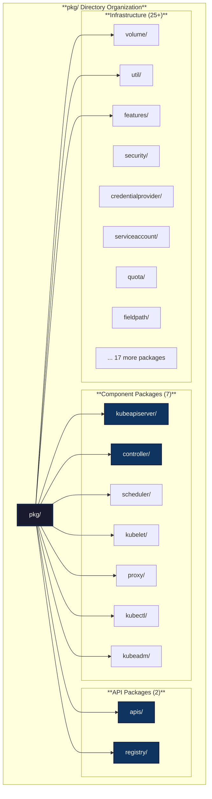

━━━━━━━━━━━━━━━━━━━━━━━━━━━━━━━━━━━━━━━━━━━━━━━━━━━━━━━━━━━━━━━━━━━━━━━━━━━━━━

## **🏗️ Complete Package Structure**

### **Full Directory Tree**

**Path**: `/Users/sureshscribnar/Documents/Projects/opensource/kubernetes/pkg/`

```
pkg/
├── kubeapiserver/          # API server implementation (17 subdirs)
├── controller/             # Controller implementations (40 subdirs)
├── scheduler/              # Scheduler implementation (24 subdirs)
├── kubelet/                # Kubelet implementation (83 subdirs)
├── proxy/                  # kube-proxy implementation (16 subdirs)
├── kubectl/                # kubectl implementation (27 subdirs)
├── kubeadm/                # kubeadm implementation (34 subdirs)
├── apis/                   # Internal API types (30+ groups)
├── registry/               # API storage layer (30+ resources)
├── volume/                 # Volume plugins (50+ subdirs)
├── util/                   # Utility packages (40+ subdirs)
├── features/               # Feature gate definitions
├── security/               # Security utilities (5 subdirs)
├── credentialprovider/     # Credential provider plugins
├── serviceaccount/         # Service account utilities
├── quota/                  # Resource quota (3 subdirs)
├── api/                    # Legacy API helpers
├── capabilities/           # Capability management
├── controlplane/           # Control plane utilities
├── fieldpath/              # Field path utilities
├── generated/              # Generated code
├── printers/               # Resource printers (5 subdirs)
├── routes/                 # API routes
├── securitycontext/        # Security context utilities
├── ssh/                    # SSH utilities
├── util/                   # Additional utilities
├── version/                # Version information
├── windows/                # Windows-specific code
├── cloudprovider/          # Cloud provider interface (deprecated)
├── probe/                  # Health/readiness probes
├── client/                 # Legacy client (deprecated)
├── master/                 # Legacy master code (deprecated)
├── watch/                  # Watch utilities
└── ... (additional packages)
```

━━━━━━━━━━━━━━━━━━━━━━━━━━━━━━━━━━━━━━━━━━━━━━━━━━━━━━━━━━━━━━━━━━━━━━━━━━━━━━

## **🔧 Component Packages**

### **1. pkg/kubeapiserver/**

**Path**: `/Users/sureshscribnar/Documents/Projects/opensource/kubernetes/pkg/kubeapiserver/`

**Status**: ✅ Active

**Purpose**: Core kube-apiserver implementation including admission, authentication, authorization, and API installation.

**Subdirectory Count**: 17

**Structure**:
```
pkg/kubeapiserver/
├── admission/              # Admission control plugins
│   ├── config/
│   ├── initializer/
│   └── plugins/
├── authenticator/          # Authentication setup
│   ├── config/
│   └── token/
├── authorizer/             # Authorization setup
│   ├── config/
│   └── modes/
├── options/                # Server options
│   ├── authentication.go
│   ├── authorization.go
│   ├── cloudprovider.go
│   ├── options.go
│   └── validation.go
├── server/                 # Server initialization
│   ├── config.go
│   ├── storage/
│   └── install/
├── apis/                   # Internal APIs
│   ├── config/
│   └── validation/
├── default_storage_factory_builder.go
└── ... (additional files)
```

**Key Responsibilities**:

```mermaid
graph TB
    subgraph "**API Server Components**"
        ADMISSION[Admission Control]
        AUTHN[Authentication]
        AUTHZ[Authorization]
        INSTALL[API Installation]
        STORAGE[Storage Factory]
    end

    subgraph "**Admission Plugins**"
        NAMESPACE_LIFECYCLE[NamespaceLifecycle]
        LIMIT_RANGER[LimitRanger]
        SERVICE_ACCOUNT[ServiceAccount]
        MUTATING_WEBHOOK[MutatingAdmissionWebhook]
        VALIDATING_WEBHOOK[ValidatingAdmissionWebhook]
        RESOURCE_QUOTA[ResourceQuota]
        POD_SECURITY[PodSecurity]
    end

    subgraph "**Auth Modes**"
        RBAC[RBAC]
        NODE_AUTH[Node]
        WEBHOOK_AUTH[Webhook]
        ABAC[ABAC]
    end

    ADMISSION --> NAMESPACE_LIFECYCLE
    ADMISSION --> LIMIT_RANGER
    ADMISSION --> SERVICE_ACCOUNT
    ADMISSION --> MUTATING_WEBHOOK
    ADMISSION --> VALIDATING_WEBHOOK
    ADMISSION --> RESOURCE_QUOTA
    ADMISSION --> POD_SECURITY

    AUTHZ --> RBAC
    AUTHZ --> NODE_AUTH
    AUTHZ --> WEBHOOK_AUTH
    AUTHZ --> ABAC

    style ADMISSION fill:#0f3460,stroke:#16213e,stroke-width:2px,color:#fff
    style AUTHN fill:#0f3460,stroke:#16213e,stroke-width:2px,color:#fff
    style AUTHZ fill:#0f3460,stroke:#16213e,stroke-width:2px,color:#fff
```

**Admission Controller Chain**:

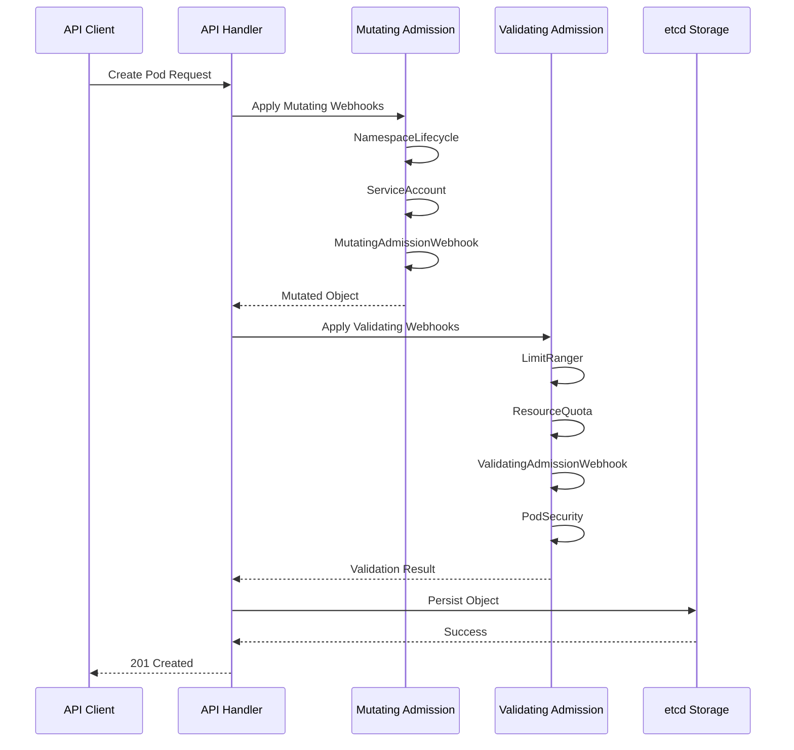

**Code Example**:
```go
// File: /Users/sureshscribnar/Documents/Projects/opensource/kubernetes/pkg/kubeapiserver/admission/config.go
func NewAdmissionPlugins() *admission.Plugins {
    plugins := admission.NewPlugins()

    // Register all admission plugins
    plugins.Register(namespacelifecycle.PluginName, func(config io.Reader) (admission.Interface, error) {
        return namespacelifecycle.NewLifecycle(), nil
    })

    plugins.Register(limitranger.PluginName, func(config io.Reader) (admission.Interface, error) {
        return limitranger.NewLimitRanger(), nil
    })

    // ... more plugin registrations

    return plugins
}
```

━━━━━━━━━━━━━━━━━━━━━━━━━━━━━━━━━━━━━━━━━━━━━━━━━━━━━━━━━━━━━━━━━━━━━━━━━━━━━━

### **2. pkg/controller/**

**Path**: `/Users/sureshscribnar/Documents/Projects/opensource/kubernetes/pkg/controller/`

**Status**: ✅ Active

**Purpose**: Implementations of all built-in controllers for kube-controller-manager.

**Subdirectory Count**: 40

**Structure**:
```
pkg/controller/
├── namespace/              # Namespace lifecycle controller
│   ├── deletion/
│   └── namespace_controller.go
├── deployment/             # Deployment controller
│   ├── deployment_controller.go
│   ├── sync.go
│   ├── rollout.go
│   └── util/
├── replicaset/             # ReplicaSet controller
│   ├── replica_set.go
│   └── replica_set_utils.go
├── statefulset/            # StatefulSet controller
│   ├── stateful_set.go
│   ├── stateful_pod_control.go
│   └── stateful_set_utils.go
├── daemonset/              # DaemonSet controller
│   ├── daemon_controller.go
│   └── util/
├── job/                    # Job controller
│   ├── job_controller.go
│   ├── cronjob_controller.go
│   └── indexed_job_utils.go
├── nodelifecycle/          # Node lifecycle controller
│   ├── node_lifecycle_controller.go
│   └── scheduler/
├── serviceaccount/         # ServiceAccount controller
│   └── tokens_controller.go
├── endpoint/               # Endpoint controller
│   └── endpoints_controller.go
├── endpointslice/          # EndpointSlice controller
│   ├── endpointslice_controller.go
│   └── reconciler.go
├── replication/            # ReplicationController
│   └── replication_controller.go
├── resourcequota/          # ResourceQuota controller
│   ├── resource_quota_controller.go
│   └── resource_quota_monitor.go
├── garbagecollector/       # Garbage collector
│   ├── garbagecollector.go
│   ├── graph.go
│   └── graph_builder.go
├── podgc/                  # Pod garbage collector
│   └── gc_controller.go
├── disruption/             # PodDisruptionBudget controller
│   └── disruption.go
├── ttl/                    # TTL controller
│   └── ttl_controller.go
├── ttlafterfinished/       # TTLAfterFinished controller
│   └── ttlafterfinished_controller.go
├── certificates/           # Certificate controllers
│   ├── approver/
│   ├── signer/
│   └── rootcacertpublisher/
├── volume/                 # Volume controllers
│   ├── attachdetach/
│   ├── persistentvolume/
│   ├── pvcprotection/
│   └── expand/
├── cloud/                  # Cloud controllers
│   ├── node_controller.go
│   └── cloud_controller.go
├── clusterroleaggregation/ # RBAC aggregation
│   └── clusterroleaggregation_controller.go
├── bootstrap/              # Bootstrap token controller
│   └── bootstrapsigner/
├── storageversiongc/       # Storage version GC
│   └── gc_controller.go
├── servicecidr/            # ServiceCIDR controller
│   └── servicecidr_controller.go
└── ... (additional controllers)
```

**Controller Architecture**:

```mermaid
graph TB
    subgraph "**Controller Manager**"
        MANAGER[Controller Manager]
        FACTORY[SharedInformer Factory]
    end

    subgraph "**Core Controllers**"
        NS[Namespace]
        RC[ReplicationController]
        SA[ServiceAccount]
        ENDPOINT[Endpoint]
        RESOURCE[ResourceQuota]
        GC[GarbageCollector]
    end

    subgraph "**Apps Controllers**"
        DEPLOY[Deployment]
        RS[ReplicaSet]
        STS[StatefulSet]
        DS[DaemonSet]
    end

    subgraph "**Batch Controllers**"
        JOB[Job]
        CRONJOB[CronJob]
    end

    subgraph "**Volume Controllers**"
        ATTACH[AttachDetach]
        PV[PersistentVolume]
        PVC[PVCProtection]
        EXPAND[VolumeExpand]
    end

    subgraph "**Node Controllers**"
        NODELIFE[NodeLifecycle]
        PODGC[PodGC]
    end

    MANAGER --> FACTORY
    FACTORY --> NS
    FACTORY --> RC
    FACTORY --> DEPLOY
    FACTORY --> JOB
    FACTORY --> ATTACH
    FACTORY --> NODELIFE

    style MANAGER fill:#0f3460,stroke:#16213e,stroke-width:3px,color:#fff
    style FACTORY fill:#1a1a2e,stroke:#16213e,stroke-width:2px,color:#fff
```

**Deployment Controller Flow**:

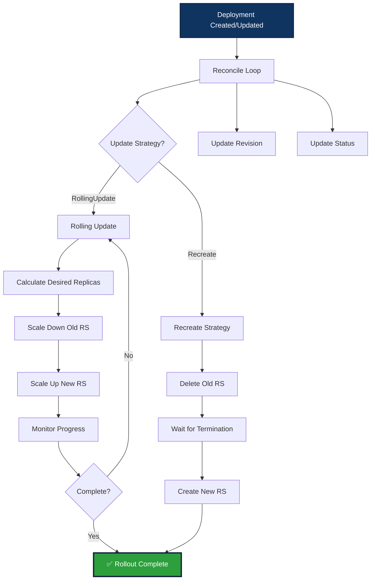

**Garbage Collector Graph**:

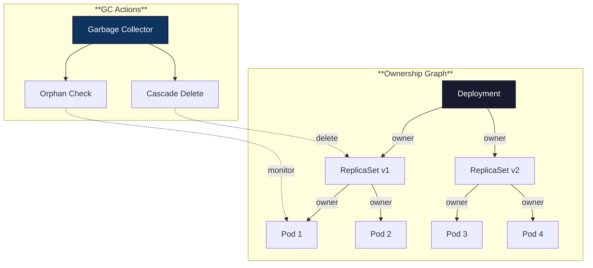

**Code Example**:
```go
// File: /Users/sureshscribnar/Documents/Projects/opensource/kubernetes/pkg/controller/deployment/deployment_controller.go
func (dc *DeploymentController) syncDeployment(key string) error {
    namespace, name, err := cache.SplitMetaNamespaceKey(key)
    deployment, err := dc.dLister.Deployments(namespace).Get(name)

    // Get all ReplicaSets owned by this Deployment
    rsList, err := dc.getReplicaSetsForDeployment(deployment)

    // Get all Pods owned by ReplicaSets
    podMap, err := dc.getPodMapForDeployment(deployment, rsList)

    // Sync deployment based on strategy
    if deployment.Spec.Paused {
        return dc.sync(deployment, rsList)
    }

    switch deployment.Spec.Strategy.Type {
    case apps.RollingUpdateDeploymentStrategyType:
        return dc.rolloutRolling(deployment, rsList, podMap)
    case apps.RecreateDeploymentStrategyType:
        return dc.rolloutRecreate(deployment, rsList, podMap)
    }

    return nil
}
```

━━━━━━━━━━━━━━━━━━━━━━━━━━━━━━━━━━━━━━━━━━━━━━━━━━━━━━━━━━━━━━━━━━━━━━━━━━━━━━

### **3. pkg/scheduler/**

**Path**: `/Users/sureshscribnar/Documents/Projects/opensource/kubernetes/pkg/scheduler/`

**Status**: ✅ Active

**Purpose**: Complete scheduler implementation including scheduling framework, plugins, and algorithms.

**Subdirectory Count**: 24

**Structure**:
```
pkg/scheduler/
├── framework/              # Scheduling framework
│   ├── interface.go        # Plugin interfaces
│   ├── runtime/            # Framework runtime
│   ├── plugins/            # Built-in plugins
│   │   ├── noderesources/
│   │   ├── nodeports/
│   │   ├── podtopologyspread/
│   │   ├── interpodaffinity/
│   │   ├── nodeaffinity/
│   │   ├── volumebinding/
│   │   └── ... (more plugins)
│   └── preemption/         # Preemption logic
├── algorithmprovider/      # Algorithm providers
│   └── registry.go
├── apis/                   # Scheduler API types
│   └── config/
│       ├── types.go
│       └── validation/
├── eventhandlers.go        # Event handlers
├── schedule_one.go         # Main scheduling logic
├── scheduler.go            # Scheduler struct
├── factory.go              # Scheduler factory
├── internal/               # Internal utilities
│   ├── cache/              # Scheduler cache
│   ├── queue/              # Scheduling queue
│   └── heap/               # Priority heap
├── metrics/                # Scheduler metrics
│   └── metrics.go
├── profile/                # Scheduler profiles
│   └── profile.go
└── ... (additional files)
```

**Scheduling Framework Extension Points**:

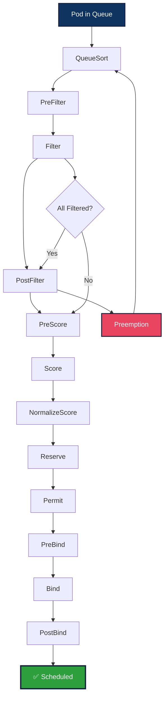

**Built-in Scheduling Plugins**:

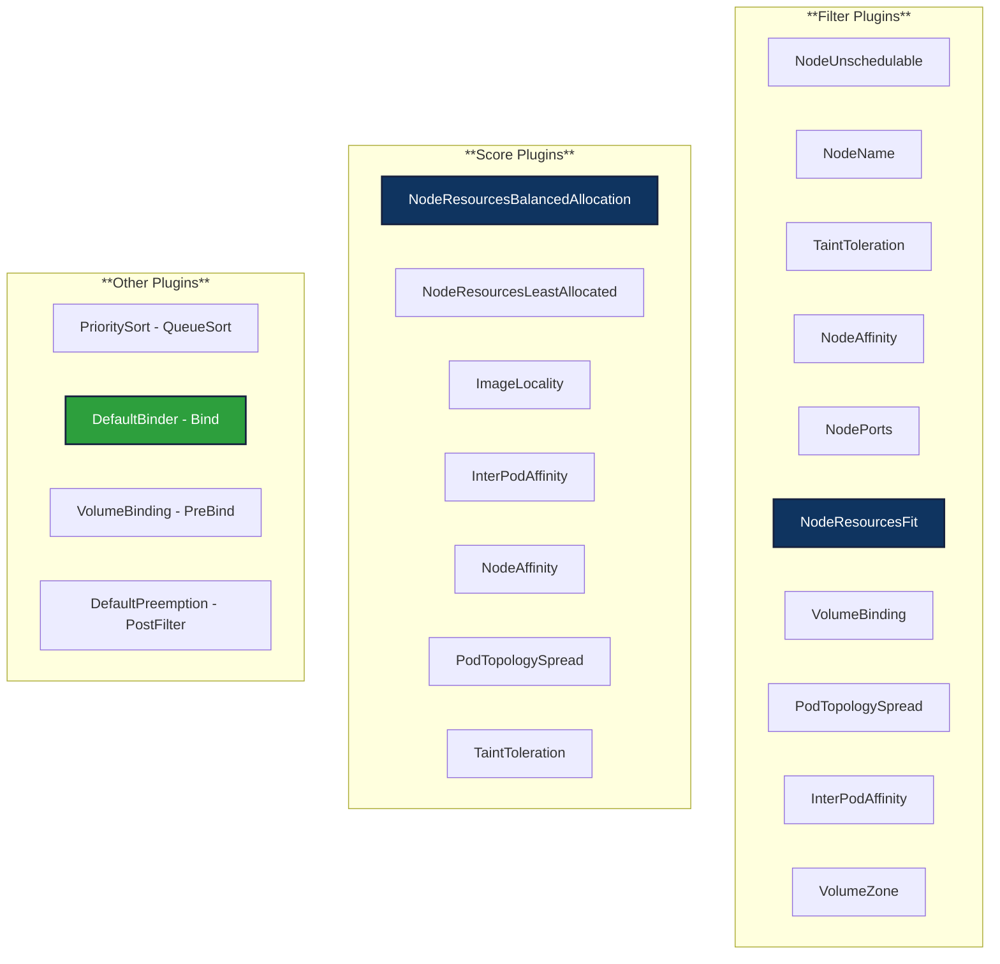

**Scheduler Cache Structure**:

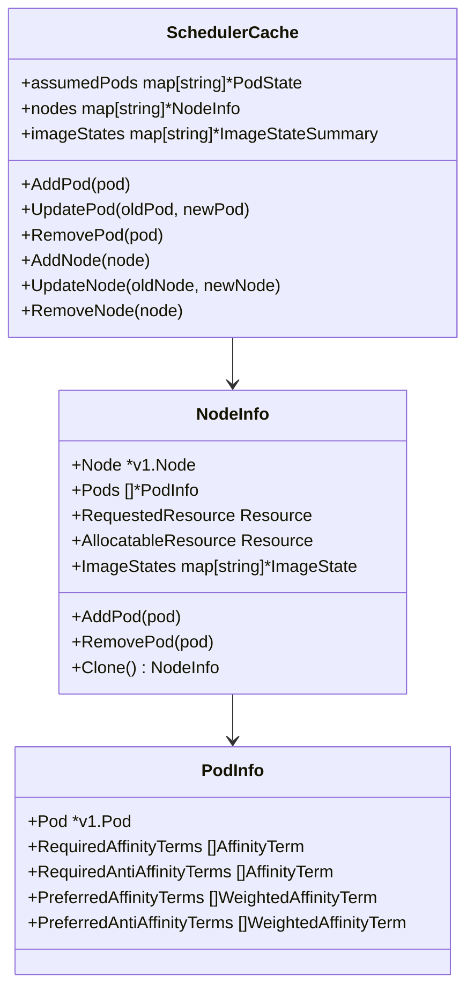

**Code Example**:
```go
// File: /Users/sureshscribnar/Documents/Projects/opensource/kubernetes/pkg/scheduler/schedule_one.go
func (sched *Scheduler) scheduleOne(ctx context.Context) {
    podInfo := sched.NextPod()
    pod := podInfo.Pod

    // Run "PreFilter" plugins
    state := framework.NewCycleState()
    preFilterStatus := sched.Framework.RunPreFilterPlugins(ctx, state, pod)

    // Find feasible nodes
    feasibleNodes, diagnosis, err := sched.findNodesThatFitPod(ctx, state, pod)

    if len(feasibleNodes) == 0 {
        // Run "PostFilter" plugins (preemption)
        result, status := sched.Framework.RunPostFilterPlugins(ctx, state, pod, diagnosis.NodeToStatusMap)
        return
    }

    // Prioritize nodes
    priorityList, err := sched.prioritizeNodes(ctx, state, pod, feasibleNodes)

    // Select host
    host, err := sched.selectHost(priorityList)

    // Run "Reserve" plugins
    sched.Framework.RunReservePlugins(ctx, state, pod, host)

    // Run "Permit" plugins
    sched.Framework.RunPermitPlugins(ctx, state, pod, host)

    // Bind pod to node
    err = sched.bind(ctx, pod, host, state)
}
```

━━━━━━━━━━━━━━━━━━━━━━━━━━━━━━━━━━━━━━━━━━━━━━━━━━━━━━━━━━━━━━━━━━━━━━━━━━━━━━

### **4. pkg/kubelet/**

**Path**: `/Users/sureshscribnar/Documents/Projects/opensource/kubernetes/pkg/kubelet/`

**Status**: ✅ Active

**Purpose**: Complete kubelet implementation including pod lifecycle, container runtime interface, volume management, and node status.

**Subdirectory Count**: 83 (largest component package)

**Structure**:
```
pkg/kubelet/
├── kubelet.go              # Main kubelet struct
├── kubelet_pods.go         # Pod management
├── kubelet_node_status.go  # Node status reporting
├── pod_workers.go          # Pod worker goroutines
├── pleg/                   # Pod Lifecycle Event Generator
│   ├── pleg.go
│   ├── generic.go
│   └── evented.go
├── container/              # Container abstractions
│   ├── runtime.go
│   ├── runtime_cache.go
│   └── sync_result.go
├── cri/                    # Container Runtime Interface
│   ├── remote/
│   │   ├── remote_runtime.go
│   │   └── remote_image.go
│   └── streaming/
│       ├── server.go
│       └── portforward/
├── kuberuntime/            # CRI implementation
│   ├── kuberuntime_manager.go
│   ├── kuberuntime_container.go
│   ├── kuberuntime_sandbox.go
│   └── kuberuntime_image.go
├── cm/                     # Cgroup/resource management
│   ├── container_manager.go
│   ├── cgroup_manager.go
│   ├── pod_container_manager.go
│   ├── cpumanager/
│   ├── memorymanager/
│   ├── topologymanager/
│   └── devicemanager/
├── status/                 # Status management
│   ├── status_manager.go
│   └── state/
├── prober/                 # Health/readiness probes
│   ├── prober.go
│   ├── prober_manager.go
│   └── worker.go
├── volumemanager/          # Volume lifecycle
│   ├── volume_manager.go
│   ├── reconciler/
│   └── populator/
├── images/                 # Image management
│   ├── image_manager.go
│   ├── image_gc_manager.go
│   └── puller.go
├── eviction/               # Eviction manager
│   ├── eviction_manager.go
│   ├── helpers.go
│   └── types.go
├── lifecycle/              # Pod lifecycle handlers
│   ├── handlers.go
│   ├── predicate.go
│   └── admission.go
├── network/                # Network management
│   ├── dns/
│   │   ├── dns.go
│   │   └── dns_config.go
│   ├── hostport/
│   └── kubenet/
├── metrics/                # Kubelet metrics
│   ├── metrics.go
│   └── collectors/
├── server/                 # Kubelet HTTP server
│   ├── server.go
│   ├── streaming.go
│   └── stats/
├── stats/                  # Stats/resource usage
│   ├── stats_provider.go
│   ├── cri_stats_provider.go
│   └── cadvisor_stats_provider.go
├── token/                  # Service account tokens
│   └── token_manager.go
├── pod/                    # Pod utilities
│   └── pod_manager.go
├── config/                 # Config sources
│   ├── config.go
│   ├── file.go
│   └── http.go
├── util/                   # Kubelet utilities
│   ├── podManager/
│   ├── manager/
│   └── ... (many utils)
├── apis/                   # Kubelet API types
│   ├── config/
│   └── stats/
├── pluginmanager/          # Device/CSI plugin manager
│   └── plugin_manager.go
├── checkpointmanager/      # Checkpoint manager
│   └── checkpoint_manager.go
├── nodeshutdown/           # Graceful node shutdown
│   └── nodeshutdown_manager.go
└── ... (60+ additional subdirs)
```

**Kubelet Architecture**:

```mermaid
graph TB
    subgraph "**Kubelet Core**"
        KUBELET[Kubelet Main Loop]
        POD_WORKERS[Pod Workers]
        PLEG[Pod Lifecycle Event Generator]
        STATUS_MGR[Status Manager]
    end

    subgraph "**Container Runtime**"
        CRI[CRI Client]
        RUNTIME[Container Runtime<br/>containerd/CRI-O]
    end

    subgraph "**Volume Management**"
        VOL_MGR[Volume Manager]
        VOL_PLUGINS[Volume Plugins]
    end

    subgraph "**Resource Management**"
        CM[Container Manager]
        CPU_MGR[CPU Manager]
        MEM_MGR[Memory Manager]
        DEVICE_MGR[Device Manager]
        TOPOLOGY_MGR[Topology Manager]
    end

    subgraph "**Health Checks**"
        PROBER[Probe Manager]
        LIVENESS[Liveness Probes]
        READINESS[Readiness Probes]
        STARTUP[Startup Probes]
    end

    subgraph "**Node Management**"
        NODE_STATUS[Node Status]
        EVICTION[Eviction Manager]
        IMAGE_GC[Image GC]
    end

    KUBELET --> POD_WORKERS
    KUBELET --> PLEG
    KUBELET --> STATUS_MGR
    KUBELET --> CRI
    KUBELET --> VOL_MGR
    KUBELET --> CM
    KUBELET --> PROBER
    KUBELET --> NODE_STATUS

    CRI --> RUNTIME
    VOL_MGR --> VOL_PLUGINS
    CM --> CPU_MGR
    CM --> MEM_MGR
    CM --> DEVICE_MGR
    CM --> TOPOLOGY_MGR
    PROBER --> LIVENESS
    PROBER --> READINESS
    PROBER --> STARTUP
    KUBELET --> EVICTION
    KUBELET --> IMAGE_GC

    style KUBELET fill:#0f3460,stroke:#16213e,stroke-width:3px,color:#fff
    style CRI fill:#1a1a2e,stroke:#16213e,stroke-width:2px,color:#fff
```

**Pod Sync Loop**:

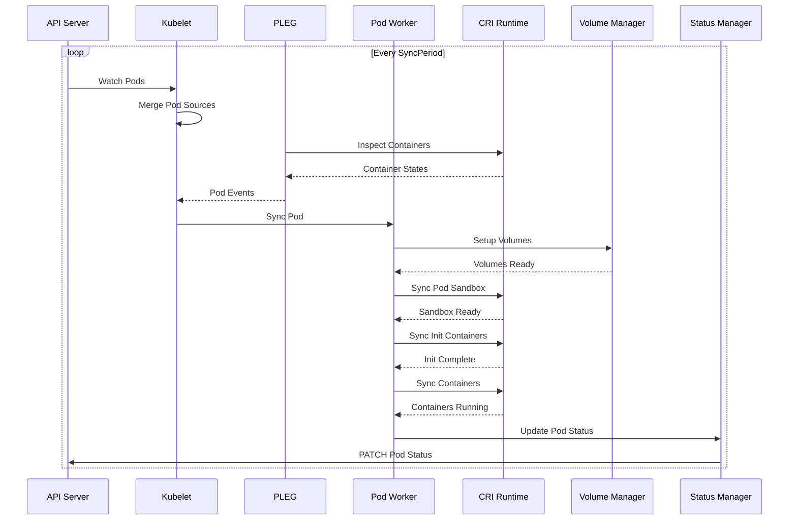

**PLEG (Pod Lifecycle Event Generator)**:

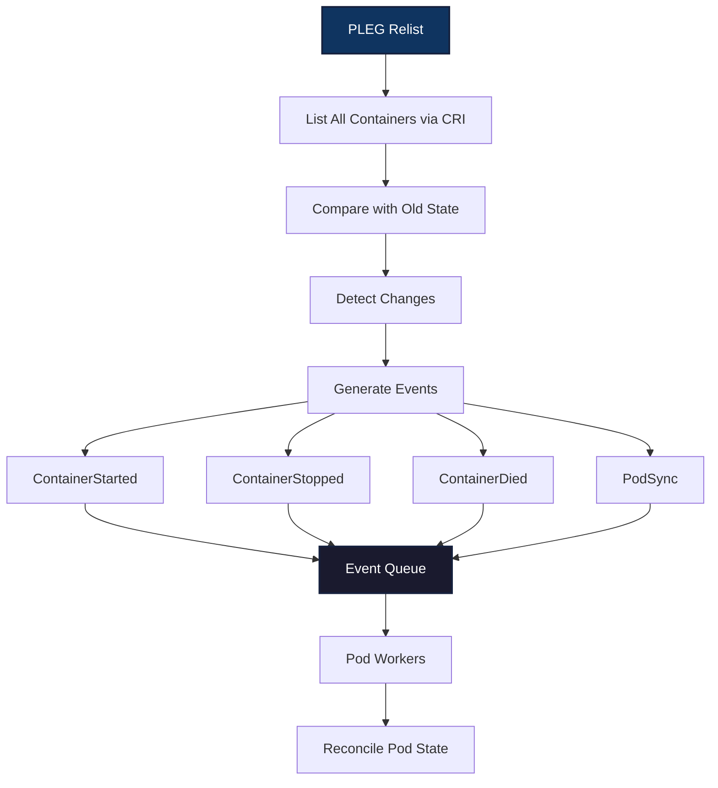

**Code Example**:
```go
// File: /Users/sureshscribnar/Documents/Projects/opensource/kubernetes/pkg/kubelet/kubelet.go
func (kl *Kubelet) syncPod(ctx context.Context, updateType kubetypes.SyncPodType, pod *v1.Pod, mirrorPod *v1.Pod, podStatus *kubecontainer.PodStatus) error {
    // Create pod sandbox if needed
    podSandboxID := podStatus.SandboxStatuses[0].Id
    if podSandboxID == "" {
        podSandboxID, err = kl.createPodSandbox(pod, podStatus.SandboxStatuses[0].Attempt)
    }

    // Make data directories for the pod
    if err := kl.makePodDataDirs(pod); err != nil {
        return err
    }

    // Volume manager will handle volume setup
    if !kl.podWorkers.IsPodVolumesReady(pod.UID) {
        return fmt.Errorf("volumes not ready")
    }

    // Pull secrets for pod
    pullSecrets := kl.getPullSecretsForPod(pod)

    // Sync init containers
    if err := kl.syncInitContainers(pod, podStatus, pullSecrets); err != nil {
        return err
    }

    // Sync regular containers
    if err := kl.syncContainers(pod, podStatus, pullSecrets, podSandboxID); err != nil {
        return err
    }

    return nil
}
```

━━━━━━━━━━━━━━━━━━━━━━━━━━━━━━━━━━━━━━━━━━━━━━━━━━━━━━━━━━━━━━━━━━━━━━━━━━━━━━

### **5. pkg/proxy/**

**Path**: `/Users/sureshscribnar/Documents/Projects/opensource/kubernetes/pkg/proxy/`

**Status**: ✅ Active

**Purpose**: kube-proxy implementation for service networking using iptables, IPVS, or kernelspace modes.

**Subdirectory Count**: 16

**Structure**:
```
pkg/proxy/
├── proxy.go                # Main proxy interface
├── config/                 # Service/endpoint config
│   ├── config.go
│   └── endpoints.go
├── iptables/               # iptables mode
│   ├── proxier.go
│   └── proxier_test.go
├── ipvs/                   # IPVS mode
│   ├── proxier.go
│   ├── proxier_test.go
│   └── util/
├── winkernel/              # Windows kernelspace mode
│   ├── proxier.go
│   └── hns.go
├── winuserspace/           # Windows userspace mode (deprecated)
│   └── proxier.go
├── userspace/              # Linux userspace mode (deprecated)
│   ├── proxier.go
│   └── port_allocator.go
├── util/                   # Proxy utilities
│   ├── iptables/
│   ├── ipvs/
│   ├── endpoints.go
│   └── service.go
├── healthcheck/            # Health check server
│   └── healthcheck.go
├── metrics/                # Proxy metrics
│   └── metrics.go
└── ... (additional files)
```

**Proxy Mode Comparison**:

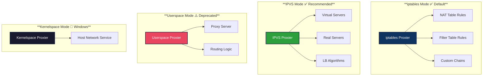

**Service to iptables Translation**:

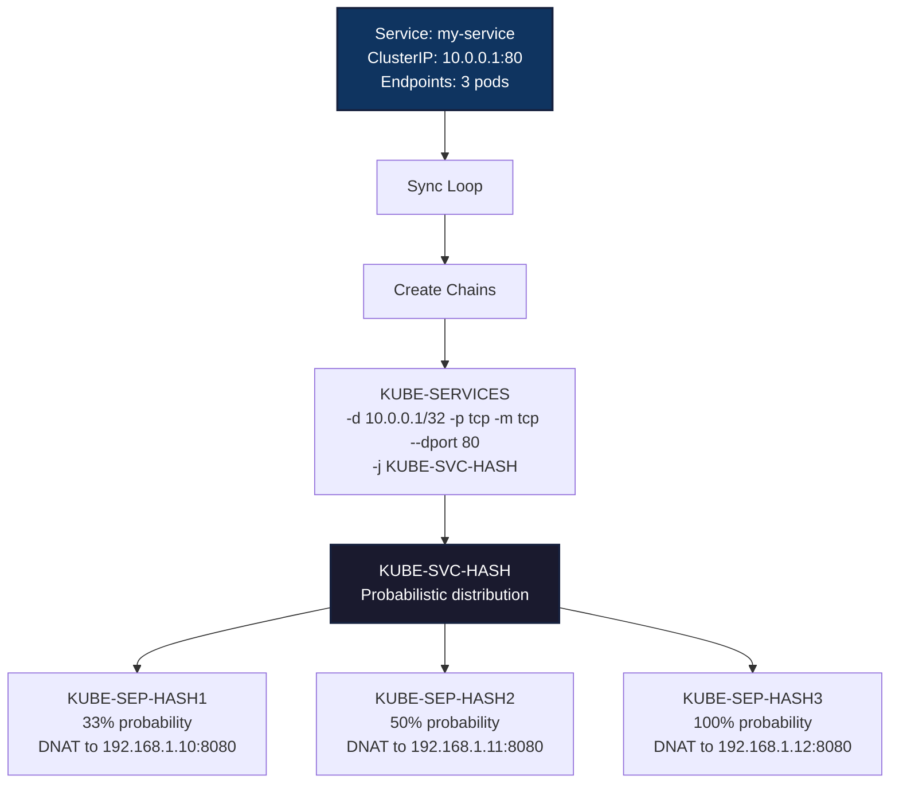

**IPVS Service Configuration**:

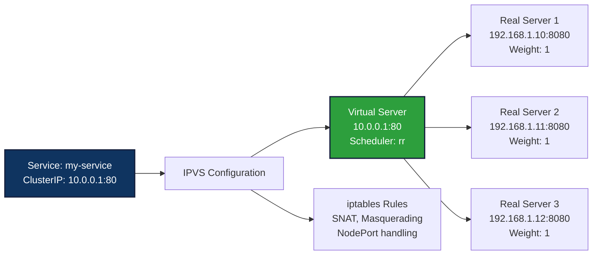

**Proxy Sync Loop**:

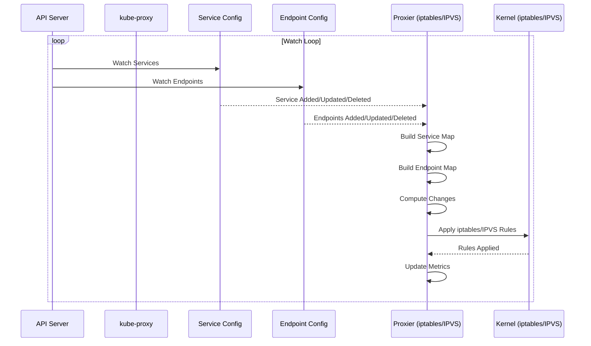

**Code Example**:
```go
// File: /Users/sureshscribnar/Documents/Projects/opensource/kubernetes/pkg/proxy/iptables/proxier.go
func (proxier *Proxier) syncProxyRules() {
    // Build service and endpoint maps
    serviceMap := proxier.serviceMap
    endpointsMap := proxier.endpointsMap

    // Ensure main chains exist
    proxier.iptables.EnsureChain(iptables.TableNAT, kubeServicesChain)
    proxier.iptables.EnsureChain(iptables.TableNAT, kubeNodePortsChain)

    // Build rules for each service
    for svcName, svc := range serviceMap {
        svcInfo := svc.(*serviceInfo)
        protocol := strings.ToLower(string(svcInfo.Protocol()))
        svcNameString := svcInfo.serviceNameString

        // Create chain for this service
        svcChain := servicePortChainName(svcNameString, protocol)
        proxier.iptables.EnsureChain(iptables.TableNAT, svcChain)

        // Get endpoints for service
        endpoints := endpointsMap[svcName]

        // Build endpoint chains
        for i, ep := range endpoints {
            epChain := servicePortEndpointChainName(svcNameString, protocol, ep)
            proxier.iptables.EnsureChain(iptables.TableNAT, epChain)

            // DNAT rule to endpoint
            proxier.natRules.Write(
                "-A", epChain,
                "-p", protocol,
                "-j", "DNAT",
                "--to-destination", ep.String(),
            )
        }
    }

    // Apply all rules atomically
    proxier.iptables.RestoreAll(proxier.natRules.Bytes(), iptables.NoFlushTables, iptables.RestoreCounters)
}
```

━━━━━━━━━━━━━━━━━━━━━━━━━━━━━━━━━━━━━━━━━━━━━━━━━━━━━━━━━━━━━━━━━━━━━━━━━━━━━━

### **6. pkg/kubectl/**

**Path**: `/Users/sureshscribnar/Documents/Projects/opensource/kubernetes/pkg/kubectl/`

**Status**: ⚠️ Migrating to staging

**Purpose**: kubectl command implementations and utilities (being migrated to staging/src/k8s.io/kubectl/).

**Subdirectory Count**: 27

**Note**: Most kubectl functionality is now in `/Users/sureshscribnar/Documents/Projects/opensource/kubernetes/staging/src/k8s.io/kubectl/`. This pkg/kubectl directory contains legacy code being phased out.

**Structure**:
```
pkg/kubectl/
├── cmd/                    # ⚠️ Deprecated - moved to staging
│   ├── apply/
│   ├── create/
│   ├── delete/
│   └── ... (legacy commands)
├── generate/               # ⚠️ Deprecated - generators removed
│   └── versioned/
├── metricsutil/            # Metrics utilities
│   └── metrics_printer.go
├── polymorphichelpers/     # Resource type helpers
│   ├── rollback.go
│   ├── logsforobject.go
│   └── helpers.go
├── scheme/                 # kubectl scheme
│   └── scheme.go
├── util/                   # kubectl utilities
│   ├── slice/
│   ├── term/
│   └── ... (various utils)
└── ... (legacy files)
```

**Migration Status**:

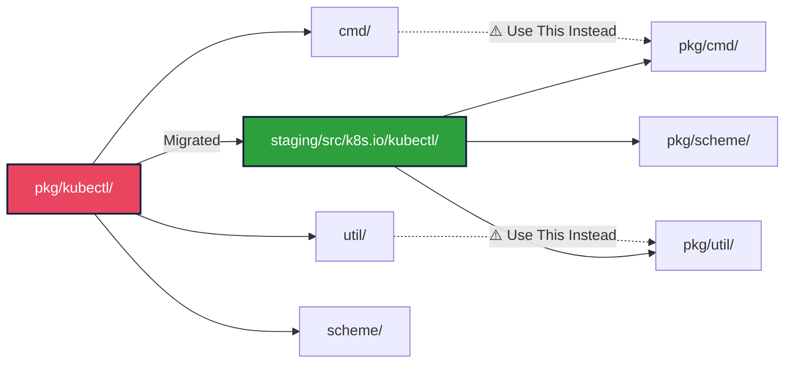

━━━━━━━━━━━━━━━━━━━━━━━━━━━━━━━━━━━━━━━━━━━━━━━━━━━━━━━━━━━━━━━━━━━━━━━━━━━━━━

### **7. pkg/kubeadm/**

**Path**: `/Users/sureshscribnar/Documents/Projects/opensource/kubernetes/pkg/kubeadm/`

**Status**: ✅ Active

**Purpose**: kubeadm implementation for cluster bootstrapping and management.

**Subdirectory Count**: 34

**Structure**:
```
pkg/kubeadm/
├── apis/                   # kubeadm API types
│   └── kubeadm/
│       ├── types.go
│       ├── v1beta3/
│       ├── v1beta4/
│       └── validation/
├── phases/                 # Phase implementations
│   ├── init/               # Init phases
│   │   ├── certs/
│   │   ├── kubeconfig/
│   │   ├── kubelet/
│   │   ├── control-plane/
│   │   ├── etcd/
│   │   ├── uploadconfig/
│   │   ├── uploadcerts/
│   │   ├── markcontrolplane/
│   │   ├── bootstraptoken/
│   │   └── addons/
│   ├── join/               # Join phases
│   │   ├── controlplane/
│   │   ├── kubelet/
│   │   └── data/
│   ├── upgrade/            # Upgrade phases
│   │   ├── apply/
│   │   ├── node/
│   │   └── plan/
│   └── reset/              # Reset phases
├── certs/                  # Certificate management
│   ├── renewal/
│   └── util/
├── constants/              # Constants
│   └── constants.go
├── features/               # Feature gates
│   └── features.go
├── util/                   # Utilities
│   ├── config/
│   ├── kustomize/
│   ├── patches/
│   ├── runtime/
│   └── ... (many utilities)
└── ... (additional files)
```

**kubeadm init Phases**:

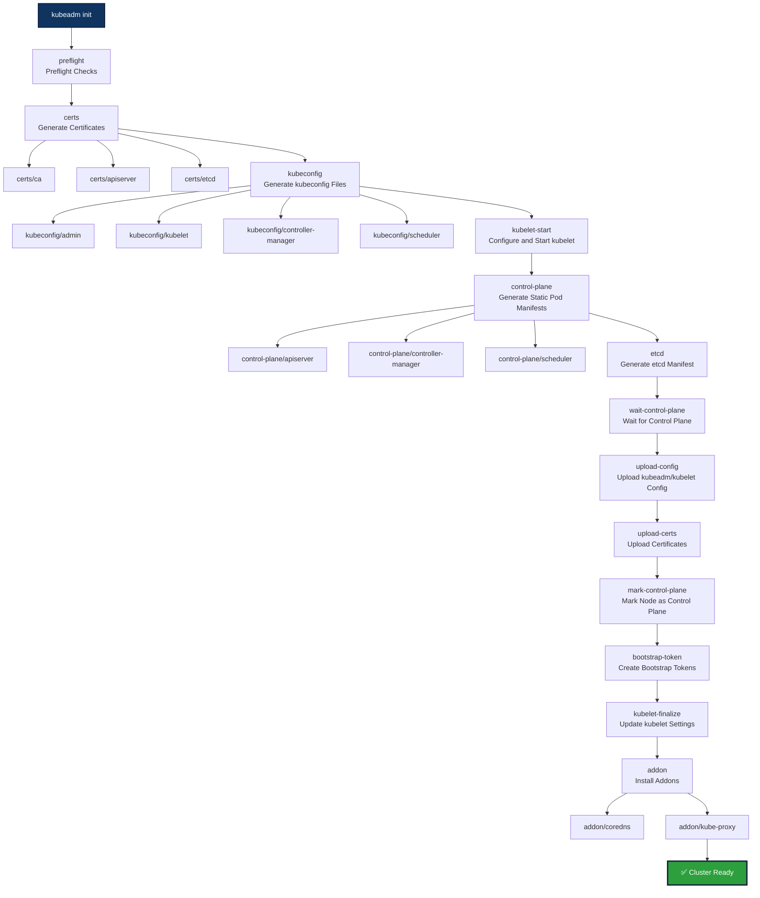

━━━━━━━━━━━━━━━━━━━━━━━━━━━━━━━━━━━━━━━━━━━━━━━━━━━━━━━━━━━━━━━━━━━━━━━━━━━━━━

## **📦 API Packages**

### **8. pkg/apis/**

**Path**: `/Users/sureshscribnar/Documents/Projects/opensource/kubernetes/pkg/apis/`

**Status**: ✅ Active

**Purpose**: Internal (unversioned) API type definitions for all Kubernetes resources.

**API Groups**: 30+

**Structure**:
```
pkg/apis/
├── core/                   # Core API group (v1)
│   ├── types.go            # Pod, Service, Node, etc.
│   ├── validation/
│   └── install/
├── apps/                   # apps API group
│   ├── types.go            # Deployment, StatefulSet, DaemonSet
│   ├── validation/
│   └── install/
├── batch/                  # batch API group
│   ├── types.go            # Job, CronJob
│   ├── validation/
│   └── install/
├── networking/             # networking.k8s.io
│   ├── types.go            # NetworkPolicy, Ingress
│   └── validation/
├── policy/                 # policy API group
│   ├── types.go            # PodDisruptionBudget, PodSecurityPolicy
│   └── validation/
├── rbac/                   # rbac.authorization.k8s.io
│   ├── types.go            # Role, RoleBinding, ClusterRole
│   └── validation/
├── storage/                # storage.k8s.io
│   ├── types.go            # StorageClass, VolumeAttachment
│   └── validation/
├── certificates/           # certificates.k8s.io
│   └── types.go            # CertificateSigningRequest
├── admissionregistration/ # admissionregistration.k8s.io
│   └── types.go            # ValidatingWebhookConfiguration
├── apiextensions/          # apiextensions.k8s.io
│   └── types.go            # CustomResourceDefinition
├── scheduling/             # scheduling.k8s.io
│   └── types.go            # PriorityClass
├── coordination/           # coordination.k8s.io
│   └── types.go            # Lease
├── node/                   # node.k8s.io
│   └── types.go            # RuntimeClass
├── discovery/              # discovery.k8s.io
│   └── types.go            # EndpointSlice
├── events/                 # events.k8s.io
│   └── types.go            # Event
├── autoscaling/            # autoscaling API group
│   └── types.go            # HorizontalPodAutoscaler
├── extensions/             # extensions (deprecated)
│   └── types.go
├── flowcontrol/            # flowcontrol.apiserver.k8s.io
│   └── types.go            # FlowSchema, PriorityLevelConfiguration
├── resource/               # resource.k8s.io
│   └── types.go            # ResourceClaim, ResourceClass
└── ... (additional API groups)
```

**Internal vs Versioned Types**:

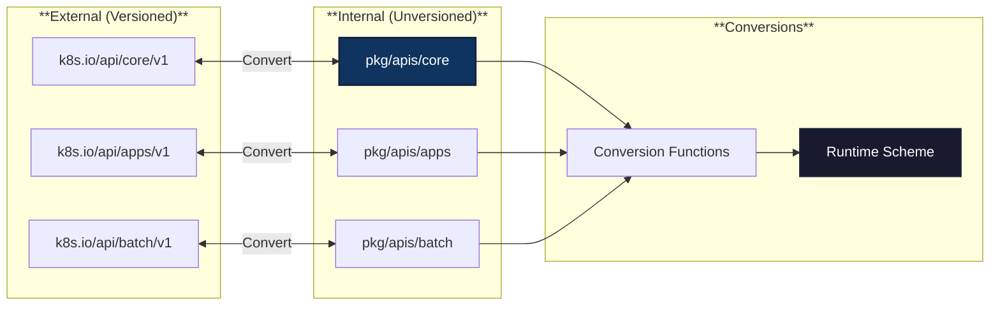

**API Type Example**:
```go
// File: /Users/sureshscribnar/Documents/Projects/opensource/kubernetes/pkg/apis/core/types.go
// Internal type (unversioned)
type Pod struct {
    TypeMeta
    ObjectMeta

    Spec PodSpec
    Status PodStatus
}

type PodSpec struct {
    Volumes []Volume
    InitContainers []Container
    Containers []Container
    RestartPolicy RestartPolicy
    NodeName string
    // ... many more fields
}
```

━━━━━━━━━━━━━━━━━━━━━━━━━━━━━━━━━━━━━━━━━━━━━━━━━━━━━━━━━━━━━━━━━━━━━━━━━━━━━━

### **9. pkg/registry/**

**Path**: `/Users/sureshscribnar/Documents/Projects/opensource/kubernetes/pkg/registry/`

**Status**: ✅ Active

**Purpose**: Storage layer implementations (REST storage) for all Kubernetes resources.

**Resource Count**: 30+ resource types

**Structure**:
```
pkg/registry/
├── core/                   # Core resources
│   ├── pod/
│   │   ├── storage/
│   │   │   ├── storage.go
│   │   │   └── eviction.go
│   │   └── strategy.go
│   ├── service/
│   │   ├── storage/
│   │   ├── strategy.go
│   │   └── allocator/
│   ├── node/
│   │   ├── storage/
│   │   └── strategy.go
│   ├── namespace/
│   ├── configmap/
│   ├── secret/
│   ├── persistentvolume/
│   ├── persistentvolumeclaim/
│   ├── serviceaccount/
│   ├── endpoint/
│   ├── event/
│   └── ... (more core resources)
├── apps/                   # apps resources
│   ├── deployment/
│   │   ├── storage/
│   │   └── strategy.go
│   ├── replicaset/
│   ├── statefulset/
│   └── daemonset/
├── batch/                  # batch resources
│   ├── job/
│   │   ├── storage/
│   │   └── strategy.go
│   └── cronjob/
├── networking/             # networking resources
│   ├── networkpolicy/
│   ├── ingress/
│   └── ingressclass/
├── rbac/                   # RBAC resources
│   ├── role/
│   ├── rolebinding/
│   ├── clusterrole/
│   └── clusterrolebinding/
├── storage/                # storage resources
│   ├── storageclass/
│   ├── volumeattachment/
│   └── csistoragecapacity/
├── certificates/           # certificates resources
│   └── certificates/
├── policy/                 # policy resources
│   └── poddisruptionbudget/
├── scheduling/             # scheduling resources
│   └── priorityclass/
├── coordination/           # coordination resources
│   └── lease/
├── discovery/              # discovery resources
│   └── endpointslice/
└── ... (additional resources)
```

**Registry Architecture**:

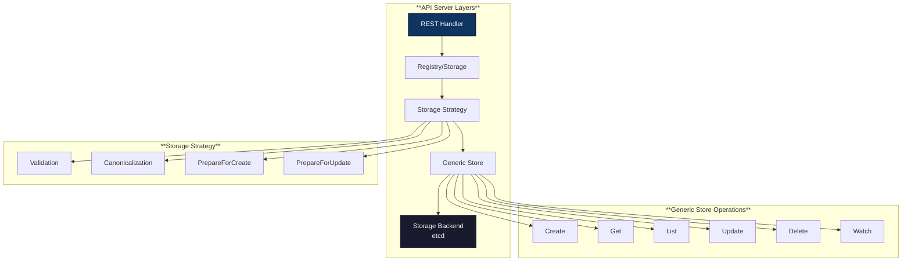

**Pod Storage Implementation**:

```mermaid
classDiagram
    class PodStorage {
        +Pod *REST
        +Binding *BindingREST
        +Eviction *EvictionREST
        +Status *StatusREST
        +Log *LogREST
        +Proxy *ProxyREST
        +Exec *ExecREST
        +Attach *AttachREST
        +PortForward *PortForwardREST
    }

    class REST {
        +Store *genericregistry.Store
        +Categories []string
        +Create(ctx, obj)
        +Update(ctx, name, objInfo)
        +Get(ctx, name)
        +List(ctx, options)
        +Delete(ctx, name)
        +Watch(ctx, options)
    }

    class PodStrategy {
        +NamespaceScoped() bool
        +PrepareForCreate(ctx, obj)
        +PrepareForUpdate(ctx, obj, old)
        +Validate(ctx, obj)
        +ValidateUpdate(ctx, obj, old)
        +Canonicalize(obj)
    }

    PodStorage --> REST
    PodStorage --> PodStrategy
    REST --> PodStrategy
```

**Code Example**:
```go
// File: /Users/sureshscribnar/Documents/Projects/opensource/kubernetes/pkg/registry/core/pod/storage/storage.go
type PodStorage struct {
    Pod         *REST
    Binding     *BindingREST
    Eviction    *EvictionREST
    Status      *StatusREST
    Log         *LogREST
    Proxy       *ProxyREST
    Exec        *ExecREST
    Attach      *AttachREST
    PortForward *PortForwardREST
}

// REST implements the main Pod storage
type REST struct {
    *genericregistry.Store
    proxyTransport http.RoundTripper
}

func NewStorage(optsGetter generic.RESTOptionsGetter, ...) (PodStorage, error) {
    store := &genericregistry.Store{
        NewFunc:     func() runtime.Object { return &api.Pod{} },
        NewListFunc: func() runtime.Object { return &api.PodList{} },
        PredicateFunc:             MatchPod,
        DefaultQualifiedResource: api.Resource("pods"),
        CreateStrategy:           pod.Strategy,
        UpdateStrategy:           pod.Strategy,
        DeleteStrategy:           pod.Strategy,
        TableConvertor:           printerstorage.TableConvertor{TableGenerator: printers.NewTableGenerator()},
    }

    options := &generic.StoreOptions{
        RESTOptions: optsGetter,
        AttrFunc:    GetAttrs,
    }

    if err := store.CompleteWithOptions(options); err != nil {
        return PodStorage{}, err
    }

    return PodStorage{
        Pod:      &REST{store, k8s_api_v1.SchemeGroupVersion},
        Binding:  &BindingREST{store: store},
        Eviction: newEvictionStorage(store, podDisruptionBudgetClient),
        Status:   &StatusREST{store: store},
        // ... initialize other subresources
    }, nil
}
```

━━━━━━━━━━━━━━━━━━━━━━━━━━━━━━━━━━━━━━━━━━━━━━━━━━━━━━━━━━━━━━━━━━━━━━━━━━━━━━

## **🔌 Infrastructure Packages**

### **10. pkg/volume/**

**Path**: `/Users/sureshscribnar/Documents/Projects/opensource/kubernetes/pkg/volume/`

**Status**: ✅ Active (CSI preferred)

**Purpose**: Volume plugin implementations for various storage backends.

**Plugin Count**: 50+

**Structure**:
```
pkg/volume/
├── volume.go               # Volume plugin interface
├── plugins.go              # Plugin registry
├── util/                   # Volume utilities
│   ├── volumehelper/
│   ├── subpath/
│   └── operationexecutor/
├── csi/                    # Container Storage Interface ✅ Preferred
│   ├── csi_plugin.go
│   ├── csi_attacher.go
│   ├── csi_mounter.go
│   └── csi_client.go
├── awsebs/                 # AWS EBS (deprecated, use CSI)
│   └── aws_ebs.go
├── azuredisk/              # Azure Disk (deprecated, use CSI)
│   └── azure_disk.go
├── azurefile/              # Azure File (deprecated, use CSI)
│   └── azure_file.go
├── gcepd/                  # GCE PD (deprecated, use CSI)
│   └── gce_pd.go
├── cinder/                 # OpenStack Cinder (deprecated, use CSI)
│   └── cinder.go
├── nfs/                    # NFS ✅ Active
│   └── nfs.go
├── iscsi/                  # iSCSI ✅ Active
│   └── iscsi.go
├── fc/                     # Fibre Channel ✅ Active
│   └── fc.go
├── hostpath/               # HostPath ✅ Active
│   └── host_path.go
├── emptydir/               # EmptyDir ✅ Active
│   └── empty_dir.go
├── configmap/              # ConfigMap ✅ Active
│   └── configmap.go
├── secret/                 # Secret ✅ Active
│   └── secret.go
├── downwardapi/            # Downward API ✅ Active
│   └── downwardapi.go
├── projected/              # Projected ✅ Active
│   └── projected.go
├── persistentvolume/       # PV controller
│   ├── pv_controller.go
│   └── pv_controller_base.go
├── flexvolume/             # FlexVolume ⚠️ Deprecated
│   └── flexvolume.go
├── flocker/                # Flocker ❌ Removed
├── git_repo/               # GitRepo ❌ Removed
├── glusterfs/              # GlusterFS ⚠️ Deprecated
├── rbd/                    # Ceph RBD ⚠️ Deprecated
├── cephfs/                 # CephFS ⚠️ Deprecated
├── portworx/               # Portworx ⚠️ Deprecated
├── storageos/              # StorageOS ⚠️ Deprecated
└── ... (additional plugins)
```

**Volume Plugin Migration**:

```mermaid
graph TB
    subgraph "**Legacy In-Tree Plugins ⚠️**"
        AWS_EBS[awsebs]
        AZURE_DISK[azuredisk]
        GCE_PD[gcepd]
        CINDER[cinder]
        VSPHERE[vsphere]
    end

    subgraph "**CSI Drivers ✅ Preferred**"
        AWS_CSI[AWS EBS CSI]
        AZURE_CSI[Azure Disk CSI]
        GCE_CSI[GCE PD CSI]
        CINDER_CSI[Cinder CSI]
        VSPHERE_CSI[vSphere CSI]
    end

    subgraph "**Built-in Plugins ✅ Active**"
        HOSTPATH[hostpath]
        EMPTYDIR[emptydir]
        CONFIGMAP[configmap]
        SECRET[secret]
        NFS[nfs]
    end

    subgraph "**CSI Interface**"
        CSI[pkg/volume/csi/]
        CSI_DRIVER[CSI Driver Registration]
    end

    AWS_EBS -.->|Migrate to| AWS_CSI
    AZURE_DISK -.->|Migrate to| AZURE_CSI
    GCE_PD -.->|Migrate to| GCE_CSI
    CINDER -.->|Migrate to| CINDER_CSI
    VSPHERE -.->|Migrate to| VSPHERE_CSI

    AWS_CSI --> CSI
    AZURE_CSI --> CSI
    GCE_CSI --> CSI
    CSI --> CSI_DRIVER

    style AWS_EBS fill:#e94560,stroke:#16213e,stroke-width:2px,color:#fff
    style AWS_CSI fill:#2d9f3d,stroke:#16213e,stroke-width:2px,color:#fff
    style CSI fill:#0f3460,stroke:#16213e,stroke-width:2px,color:#fff
    style HOSTPATH fill:#0f3460,stroke:#16213e,stroke-width:2px,color:#fff
```

**Volume Lifecycle**:

```mermaid
sequenceDiagram
    participant Pod as Pod
    participant Kubelet as Kubelet
    participant VolumeManager as Volume Manager
    participant Plugin as Volume Plugin
    participant Storage as Storage Backend

    Pod->>Kubelet: Pod Scheduled
    Kubelet->>VolumeManager: Setup Volumes
    VolumeManager->>Plugin: WaitForAttach (if needed)
    Plugin->>Storage: Attach Volume to Node
    Storage-->>Plugin: Attached
    Plugin-->>VolumeManager: Ready

    VolumeManager->>Plugin: MountDevice (if block device)
    Plugin->>Storage: Mount Device
    Storage-->>Plugin: Mounted
    Plugin-->>VolumeManager: Device Mounted

    VolumeManager->>Plugin: SetUp (mount to pod dir)
    Plugin->>Storage: Mount to Pod Directory
    Storage-->>Plugin: Setup Complete
    Plugin-->>VolumeManager: Volume Ready

    VolumeManager-->>Kubelet: All Volumes Ready
    Kubelet->>Kubelet: Start Containers

    Note over Pod,Storage: Pod Running with Volumes

    Pod->>Kubelet: Pod Deleted
    Kubelet->>VolumeManager: Teardown Volumes
    VolumeManager->>Plugin: TearDown
    Plugin->>Storage: Unmount from Pod Dir
    Plugin-->>VolumeManager: Torn Down

    VolumeManager->>Plugin: UnmountDevice
    Plugin->>Storage: Unmount Device
    Plugin-->>VolumeManager: Unmounted

    VolumeManager->>Plugin: Detach (if needed)
    Plugin->>Storage: Detach Volume
    Storage-->>Plugin: Detached
    Plugin-->>VolumeManager: Complete
```

━━━━━━━━━━━━━━━━━━━━━━━━━━━━━━━━━━━━━━━━━━━━━━━━━━━━━━━━━━━━━━━━━━━━━━━━━━━━━━

### **11. pkg/util/**

**Path**: `/Users/sureshscribnar/Documents/Projects/opensource/kubernetes/pkg/util/`

**Status**: ✅ Active

**Purpose**: Utility packages used throughout Kubernetes codebase.

**Subdirectory Count**: 40+

**Structure**:
```
pkg/util/
├── async/                  # Async utilities
│   └── runner.go
├── certificates/           # Certificate utilities
│   └── certificates.go
├── config/                 # Config utilities
│   └── config.go
├── conntrack/              # Connection tracking
│   └── conntrack.go
├── env/                    # Environment variables
│   └── env.go
├── file/                   # File utilities
│   └── file.go
├── filesystem/             # Filesystem operations
│   └── filesystem.go
├── hash/                   # Hashing utilities
│   └── hash.go
├── homedir/                # Home directory
│   └── homedir.go
├── initsystem/             # Init system detection
│   └── initsystem.go
├── iptables/               # iptables utilities
│   ├── iptables.go
│   └── testing/
├── ipvs/                   # IPVS utilities
│   ├── ipvs.go
│   └── ipvs_linux.go
├── labels/                 # Label utilities
│   └── labels.go
├── net/                    # Network utilities
│   ├── port_range.go
│   └── port_split.go
├── node/                   # Node utilities
│   └── node.go
├── oom/                    # OOM score adjustment
│   └── oom.go
├── parsers/                # Parsing utilities
│   └── parsers.go
├── pointer/                # Pointer utilities
│   └── pointer.go
├── procfs/                 # /proc filesystem
│   └── procfs.go
├── reference/              # Object reference
│   └── reference.go
├── resourcecontainer/      # Resource containers
│   └── resourcecontainer.go
├── selinux/                # SELinux utilities
│   └── selinux.go
├── slice/                  # Slice utilities
│   └── slice.go
├── sysctl/                 # sysctl utilities
│   └── sysctl.go
├── taints/                 # Taint utilities
│   └── taints.go
├── term/                   # Terminal utilities
│   └── term.go
├── tolerations/            # Toleration utilities
│   └── tolerations.go
└── ... (additional utilities)
```

━━━━━━━━━━━━━━━━━━━━━━━━━━━━━━━━━━━━━━━━━━━━━━━━━━━━━━━━━━━━━━━━━━━━━━━━━━━━━━

### **12. pkg/features/**

**Path**: `/Users/sureshscribnar/Documents/Projects/opensource/kubernetes/pkg/features/`

**Status**: ✅ Active

**Purpose**: Feature gate definitions for all Kubernetes features.

**Structure**:
```
pkg/features/
├── kube_features.go        # Feature gate registry
└── BUILD
```

**Feature Gates**:

```mermaid
graph TB
    subgraph "**Feature Lifecycle**"
        ALPHA[Alpha<br/>Off by Default]
        BETA[Beta<br/>On by Default]
        GA[GA/Stable<br/>Always On]
        DEPRECATED[Deprecated<br/>Removed]
    end

    ALPHA -->|Mature| BETA
    BETA -->|Stabilize| GA
    GA -->|Eventually| DEPRECATED

    subgraph "**Alpha Features**"
        ALPHA_1[Feature A]
        ALPHA_2[Feature B]
    end

    subgraph "**Beta Features**"
        BETA_1[Feature C]
        BETA_2[Feature D]
    end

    subgraph "**GA Features**"
        GA_1[Feature E]
        GA_2[Feature F]
    end

    ALPHA --> ALPHA_1
    ALPHA --> ALPHA_2
    BETA --> BETA_1
    BETA --> BETA_2
    GA --> GA_1
    GA --> GA_2

    style ALPHA fill:#e94560,stroke:#16213e,stroke-width:2px,color:#fff
    style BETA fill:#f39c12,stroke:#16213e,stroke-width:2px,color:#fff
    style GA fill:#2d9f3d,stroke:#16213e,stroke-width:3px,color:#fff
```

**Code Example**:
```go
// File: /Users/sureshscribnar/Documents/Projects/opensource/kubernetes/pkg/features/kube_features.go
const (
    // Alpha features (off by default)
    DynamicResourceAllocation featuregate.Feature = "DynamicResourceAllocation"

    // Beta features (on by default)
    CSIStorageCapacity featuregate.Feature = "CSIStorageCapacity"
    TopologyAwareHints featuregate.Feature = "TopologyAwareHints"

    // GA features (always on)
    PodSecurityPolicy featuregate.Feature = "PodSecurityPolicy" // Deprecated, removed
    WindowsHostProcessContainers featuregate.Feature = "WindowsHostProcessContainers"
)

var defaultKubernetesFeatureGates = map[featuregate.Feature]featuregate.FeatureSpec{
    DynamicResourceAllocation: {Default: false, PreRelease: featuregate.Alpha},
    CSIStorageCapacity:        {Default: true, PreRelease: featuregate.Beta},
    TopologyAwareHints:        {Default: true, PreRelease: featuregate.Beta},
    WindowsHostProcessContainers: {Default: true, PreRelease: featuregate.GA},
}
```

━━━━━━━━━━━━━━━━━━━━━━━━━━━━━━━━━━━━━━━━━━━━━━━━━━━━━━━━━━━━━━━━━━━━━━━━━━━━━━

## **🔐 Security Packages**

### **13. pkg/security/**

**Path**: `/Users/sureshscribnar/Documents/Projects/opensource/kubernetes/pkg/security/`

**Status**: ✅ Active

**Purpose**: Security-related utilities and helpers.

**Structure**:
```
pkg/security/
├── apparmor/               # AppArmor utilities
│   └── validate.go
├── podsecuritypolicy/      # PodSecurityPolicy (deprecated)
│   ├── provider.go
│   └── util/
└── seccomp/                # Seccomp utilities
    └── seccomp.go
```

━━━━━━━━━━━━━━━━━━━━━━━━━━━━━━━━━━━━━━━━━━━━━━━━━━━━━━━━━━━━━━━━━━━━━━━━━━━━━━

### **14. pkg/serviceaccount/**

**Path**: `/Users/sureshscribnar/Documents/Projects/opensource/kubernetes/pkg/serviceaccount/`

**Status**: ✅ Active

**Purpose**: Service account token generation and validation.

**Structure**:
```
pkg/serviceaccount/
├── jwt.go                  # JWT token handling
├── claims.go               # Token claims
└── legacy.go               # Legacy token support
```

━━━━━━━━━━━━━━━━━━━━━━━━━━━━━━━━━━━━━━━━━━━━━━━━━━━━━━━━━━━━━━━━━━━━━━━━━━━━━━

### **15. pkg/credentialprovider/**

**Path**: `/Users/sureshscribnar/Documents/Projects/opensource/kubernetes/pkg/credentialprovider/`

**Status**: ✅ Active

**Purpose**: Image registry credential providers.

**Structure**:
```
pkg/credentialprovider/
├── provider.go             # Provider interface
├── config.go               # Config parsing
├── aws/                    # AWS ECR
│   └── ecr_provider.go
├── azure/                  # Azure ACR
│   └── azure_credentials.go
├── gcp/                    # Google GCR
│   └── metadata.go
└── plugin/                 # External credential providers
    └── plugin.go
```

━━━━━━━━━━━━━━━━━━━━━━━━━━━━━━━━━━━━━━━━━━━━━━━━━━━━━━━━━━━━━━━━━━━━━━━━━━━━━━

## **📊 Package Statistics**

### **Package Size Distribution**

```mermaid
pie title Subdirectory Count by Major Package
    "kubelet" : 83
    "controller" : 40
    "kubeadm" : 34
    "util" : 40
    "kubectl" : 27
    "scheduler" : 24
    "kubeapiserver" : 17
    "proxy" : 16
    "volume" : 50
    "apis" : 30
    "registry" : 30
    "Other" : 50
```

### **Status Summary**

| Status | Count | Packages |
|--------|-------|----------|
| ✅ Active | 28 | Most packages |
| 🚧 Stable | 3 | Legacy but maintained |
| ⚠️ Deprecated | 2 | kubectl (migrating), cloudprovider |
| ❌ Removed | 1 | Some volume plugins |

━━━━━━━━━━━━━━━━━━━━━━━━━━━━━━━━━━━━━━━━━━━━━━━━━━━━━━━━━━━━━━━━━━━━━━━━━━━━━━

## **🔗 Package Dependencies**

### **Component to Package Mapping**

```mermaid
graph TB
    subgraph "**cmd/ Binaries**"
        CMD_API[cmd/kube-apiserver]
        CMD_CM[cmd/kube-controller-manager]
        CMD_SCHED[cmd/kube-scheduler]
        CMD_KUBELET[cmd/kubelet]
        CMD_PROXY[cmd/kube-proxy]
    end

    subgraph "**pkg/ Implementations**"
        PKG_API[pkg/kubeapiserver]
        PKG_CTRL[pkg/controller]
        PKG_SCHED[pkg/scheduler]
        PKG_KUBELET[pkg/kubelet]
        PKG_PROXY[pkg/proxy]
    end

    subgraph "**pkg/ Infrastructure**"
        PKG_APIS[pkg/apis]
        PKG_REGISTRY[pkg/registry]
        PKG_VOLUME[pkg/volume]
        PKG_UTIL[pkg/util]
    end

    CMD_API --> PKG_API
    CMD_CM --> PKG_CTRL
    CMD_SCHED --> PKG_SCHED
    CMD_KUBELET --> PKG_KUBELET
    CMD_PROXY --> PKG_PROXY

    PKG_API --> PKG_APIS
    PKG_API --> PKG_REGISTRY
    PKG_CTRL --> PKG_APIS
    PKG_SCHED --> PKG_APIS
    PKG_KUBELET --> PKG_VOLUME
    PKG_KUBELET --> PKG_UTIL

    style CMD_API fill:#0f3460,stroke:#16213e,stroke-width:2px,color:#fff
    style PKG_API fill:#1a1a2e,stroke:#16213e,stroke-width:2px,color:#fff
    style PKG_APIS fill:#1a1a2e,stroke:#16213e,stroke-width:2px,color:#fff
```

━━━━━━━━━━━━━━━━━━━━━━━━━━━━━━━━━━━━━━━━━━━━━━━━━━━━━━━━━━━━━━━━━━━━━━━━━━━━━━

## **📚 Related Documentation**

### **Internal References**
- [02-cmd-binaries.md](./02-cmd-binaries.md) - Command-line binaries that use these packages
- [04-staging-architecture.md](./04-staging-architecture.md) - Staging repositories
- [10-api-definitions.md](./10-api-definitions.md) - API definitions
- [11-code-organization-patterns.md](./11-code-organization-patterns.md) - Code organization
- [12-dependency-graph.md](./12-dependency-graph.md) - Dependency relationships

### **External Resources**
- [Kubernetes Architecture](https://kubernetes.io/docs/concepts/architecture/)
- [Kubernetes Development Guide](https://github.com/kubernetes/community/tree/master/contributors/devel)
- [API Conventions](https://github.com/kubernetes/community/blob/master/contributors/devel/sig-architecture/api-conventions.md)

━━━━━━━━━━━━━━━━━━━━━━━━━━━━━━━━━━━━━━━━━━━━━━━━━━━━━━━━━━━━━━━━━━━━━━━━━━━━━━

## **✅ Best Practices**

### **Package Organization**

1. **Component-Specific Logic**: Keep in component packages (kubeapiserver, controller, scheduler, kubelet, proxy)
2. **Shared Libraries**: Move to staging/ for external use
3. **Internal Types**: Keep in pkg/apis/
4. **Storage Layer**: Implement in pkg/registry/

### **Import Patterns**

```go
// ✅ Good: Import from staging
import "k8s.io/api/core/v1"
import "k8s.io/client-go/kubernetes"

// ❌ Bad: Import internal types externally
import "k8s.io/kubernetes/pkg/apis/core"
import "k8s.io/kubernetes/pkg/client/clientset_generated/clientset"
```

### **API Development**

1. **Define internal types** in `pkg/apis/<group>/types.go`
2. **Add storage** in `pkg/registry/<group>/<resource>/`
3. **Implement strategy** for validation and defaults
4. **Register** with API server
5. **Generate** clients and informers

━━━━━━━━━━━━━━━━━━━━━━━━━━━━━━━━━━━━━━━━━━━━━━━━━━━━━━━━━━━━━━━━━━━━━━━━━━━━━━

## **🔍 Summary**

The `pkg/` directory contains **34 major packages** organized into:

### **Core Categories**

1. **Component Packages (7)**: kubeapiserver, controller, scheduler, kubelet, proxy, kubectl, kubeadm
2. **API Packages (2)**: apis, registry
3. **Infrastructure (25+)**: volume, util, features, security, credentialprovider, etc.

### **Key Characteristics**

- **Internal-only code** not meant for external consumption
- **Component implementations** for all core Kubernetes services
- **Storage layer** connecting API to etcd
- **Utilities** used throughout the codebase

### **Total Subdirectories**: 400+

### **Largest Packages**:
1. kubelet - 83 subdirectories
2. volume - 50+ subdirectories
3. controller - 40 subdirectories
4. util - 40+ subdirectories

━━━━━━━━━━━━━━━━━━━━━━━━━━━━━━━━━━━━━━━━━━━━━━━━━━━━━━━━━━━━━━━━━━━━━━━━━━━━━━

**End of Document**

*For questions or contributions, see [CONTRIBUTING.md](https://github.com/kubernetes/kubernetes/blob/master/CONTRIBUTING.md)*
