# **Kubernetes Staging Architecture** 🏗️

━━━━━━━━━━━━━━━━━━━━━━━━━━━━━━━━━━━━━━━━━━━━━━━━━━━━━━━━━━━━━━━━━━━━━━━━━━━━━━

## **📋 Overview**

The Kubernetes staging directory (`staging/src/k8s.io/`) contains **32 independently publishable repositories** that form the foundation of Kubernetes. These modules are developed in-tree but published as separate Go modules to external repositories under the `k8s.io` organization.

**Location**: `/Users/sureshscribnar/Documents/Projects/opensource/kubernetes/staging/src/k8s.io/`

**Purpose**:
- Enable external consumption of Kubernetes libraries
- Maintain API stability and versioning
- Support independent release cycles
- Facilitate code reuse across projects
- Enable clear module boundaries

━━━━━━━━━━━━━━━━━━━━━━━━━━━━━━━━━━━━━━━━━━━━━━━━━━━━━━━━━━━━━━━━━━━━━━━━━━━━━━

## **🎯 Staging Repository Categories**

### **Core API Libraries** 💎

The foundational modules that define Kubernetes APIs and client libraries.

#### **1. api** ✅
**Path**: `staging/src/k8s.io/api/`
**Published**: `k8s.io/api`

**Purpose**: Generated Go types for all Kubernetes API groups and versions

**Key Components**:
```
api/
├── admission/              # Admission API types
├── admissionregistration/  # Webhook registration
├── apiserverinternal/      # Internal apiserver types
├── apps/                   # Workload APIs (Deployment, StatefulSet, DaemonSet)
├── authentication/         # Authentication APIs
├── authorization/          # Authorization APIs
├── autoscaling/           # HPA, VPA types
├── batch/                 # Job, CronJob
├── certificates/          # Certificate signing
├── coordination/          # Lease coordination
├── core/                  # Core v1 API (Pod, Service, etc.)
├── discovery/             # Service discovery
├── events/               # Event API
├── extensions/           # Legacy extensions
├── flowcontrol/          # Priority and fairness
├── networking/           # Network policies, Ingress
├── node/                 # Node-specific APIs
├── policy/               # Pod disruption budget, pod security
├── rbac/                 # Role-based access control
├── resource/             # Dynamic resource allocation
├── scheduling/           # Priority classes, scheduling
└── storage/              # Storage classes, volumes
```

**API Groups Count**: 25+ API groups with multiple versions each

**Example Types**:
```go
// Core Pod type
type Pod struct {
    metav1.TypeMeta
    metav1.ObjectMeta
    Spec   PodSpec
    Status PodStatus
}

// Apps Deployment type
type Deployment struct {
    metav1.TypeMeta
    metav1.ObjectMeta
    Spec   DeploymentSpec
    Status DeploymentStatus
}
```

**Maintenance Status**: ✅ Active, continuously updated with new API versions

━━━━━━━━━━━━━━━━━━━━━━━━━━━━━━━━━━━━━━━━━━━━━━━━━━━━━━━━━━━━━━━━━━━━━━━━━━━━━━

#### **2. apimachinery** ✅
**Path**: `staging/src/k8s.io/apimachinery/`
**Published**: `k8s.io/apimachinery`

**Purpose**: Machinery for API definitions, shared types, and utilities

**Key Components**:
```
apimachinery/
├── pkg/
│   ├── api/
│   │   ├── errors/           # API error types
│   │   ├── meta/             # Metadata accessor interfaces
│   │   ├── resource/         # Resource quantity parsing
│   │   └── validation/       # Validation utilities
│   ├── apis/
│   │   ├── meta/             # ObjectMeta, TypeMeta, ListMeta
│   │   │   ├── v1/           # Stable metadata types
│   │   │   ├── v1beta1/      # Beta metadata
│   │   │   └── internalversion/
│   │   └── testapigroup/     # Test API group
│   ├── conversion/           # Type conversion framework
│   ├── fields/              # Field selectors
│   ├── labels/              # Label selectors
│   ├── runtime/             # Runtime interfaces and codec
│   │   ├── schema/          # GroupVersionKind/GroupVersionResource
│   │   ├── serializer/      # Serialization framework
│   │   └── swagger/         # Swagger doc generation
│   ├── selection/           # Selection requirements
│   ├── types/               # Core types (UID, Time, etc.)
│   ├── util/
│   │   ├── cache/           # Thread-safe caching
│   │   ├── clock/           # Clock abstraction
│   │   ├── duration/        # Duration parsing
│   │   ├── intstr/          # IntOrString type
│   │   ├── json/            # JSON utilities
│   │   ├── mergepatch/      # Strategic merge patch
│   │   ├── naming/          # Naming utilities
│   │   ├── net/             # Network utilities
│   │   ├── runtime/         # Runtime utilities
│   │   ├── sets/            # Set data structures
│   │   ├── uuid/            # UUID generation
│   │   ├── validation/      # Validation helpers
│   │   ├── wait/            # Wait/retry utilities
│   │   └── yaml/            # YAML utilities
│   ├── version/             # Version information
│   └── watch/               # Watch interface and types
└── third_party/             # Third-party code
```

**Critical Types**:
```go
// Core metadata type
type ObjectMeta struct {
    Name              string
    Namespace         string
    UID               types.UID
    ResourceVersion   string
    Generation        int64
    CreationTimestamp Time
    DeletionTimestamp *Time
    Labels            map[string]string
    Annotations       map[string]string
    OwnerReferences   []OwnerReference
    Finalizers        []string
}

// Type metadata
type TypeMeta struct {
    Kind       string
    APIVersion string
}

// GroupVersionKind identifies an API type
type GroupVersionKind struct {
    Group   string
    Version string
    Kind    string
}
```

**Key Interfaces**:
```go
// Object interface all API objects must implement
type Object interface {
    GetObjectKind() schema.ObjectKind
    DeepCopyObject() Object
}

// Codec interface for serialization
type Codec interface {
    Encoder
    Decoder
}
```

**Maintenance Status**: ✅ Active, core infrastructure

━━━━━━━━━━━━━━━━━━━━━━━━━━━━━━━━━━━━━━━━━━━━━━━━━━━━━━━━━━━━━━━━━━━━━━━━━━━━━━

#### **3. client-go** ✅
**Path**: `staging/src/k8s.io/client-go/`
**Published**: `k8s.io/client-go`

**Purpose**: Official Kubernetes Go client library

**Key Components**:
```
client-go/
├── discovery/              # API discovery client
├── dynamic/               # Dynamic client for arbitrary resources
├── informers/             # Shared informer framework
│   ├── admissionregistration/
│   ├── apps/
│   ├── autoscaling/
│   ├── batch/
│   ├── certificates/
│   ├── coordination/
│   ├── core/
│   ├── discovery/
│   ├── events/
│   ├── extensions/
│   ├── flowcontrol/
│   ├── networking/
│   ├── node/
│   ├── policy/
│   ├── rbac/
│   ├── resource/
│   ├── scheduling/
│   └── storage/
├── kubernetes/            # Typed clientset for all API groups
│   ├── typed/
│   │   ├── admissionregistration/
│   │   ├── apps/
│   │   ├── authentication/
│   │   ├── authorization/
│   │   ├── autoscaling/
│   │   ├── batch/
│   │   ├── certificates/
│   │   ├── coordination/
│   │   ├── core/
│   │   └── ... (25+ groups)
│   └── scheme/
├── listers/               # Lister interfaces for informers
├── metadata/             # Metadata-only client
├── pkg/
│   ├── apis/             # Kubeconfig API types
│   │   └── clientauthentication/
│   └── version/          # Version utilities
├── plugin/               # Client plugins
│   ├── pkg/client/auth/  # Auth plugins (Azure, GCP, OIDC)
│   └── pkg/client/exec/  # Exec credential plugin
├── rest/                 # REST client foundation
├── scale/               # Scale subresource client
├── tools/
│   ├── auth/            # Authentication helpers
│   ├── cache/           # Cache implementations
│   │   ├── testing/
│   │   └── FIFO, DeltaFIFO, Store interfaces
│   ├── clientcmd/       # Kubeconfig loading/management
│   │   ├── api/
│   │   └── Kubeconfig parsing
│   ├── events/          # Event broadcasting
│   ├── leaderelection/  # Leader election
│   ├── metrics/         # Client metrics
│   ├── pager/           # List pagination
│   ├── portforward/     # Port forwarding
│   ├── record/          # Event recording
│   ├── reference/       # Object references
│   ├── remotecommand/   # Exec/attach/port-forward protocols
│   └── watch/           # Watch utilities
├── transport/           # HTTP transport configuration
└── util/
    ├── cert/            # Certificate utilities
    ├── connrotation/    # Connection rotation
    ├── flowcontrol/     # Rate limiting
    ├── homedir/         # Home directory detection
    ├── keyutil/         # Key utilities
    ├── retry/           # Retry logic
    └── workqueue/       # Work queue implementations
```

**Usage Examples**:
```go
// Create a clientset
config, err := clientcmd.BuildConfigFromFlags("", kubeconfig)
clientset, err := kubernetes.NewForConfig(config)

// List pods
pods, err := clientset.CoreV1().Pods("default").List(context.TODO(), metav1.ListOptions{})

// Create informer
factory := informers.NewSharedInformerFactory(clientset, 30*time.Second)
podInformer := factory.Core().V1().Pods()

// Use lister
lister := podInformer.Lister()
pod, err := lister.Pods("default").Get("my-pod")

// Work queue
queue := workqueue.NewRateLimitingQueue(workqueue.DefaultControllerRateLimiter())
```

**Maintenance Status**: ✅ Active, most widely used library

━━━━━━━━━━━━━━━━━━━━━━━━━━━━━━━━━━━━━━━━━━━━━━━━━━━━━━━━━━━━━━━━━━━━━━━━━━━━━━

#### **4. apiserver** ✅
**Path**: `staging/src/k8s.io/apiserver/`
**Published**: `k8s.io/apiserver`

**Purpose**: Generic API server library for building Kubernetes-style API servers

**Key Components**:
```
apiserver/
├── pkg/
│   ├── admission/              # Admission control framework
│   │   ├── plugin/
│   │   │   ├── namespace/
│   │   │   ├── resourcequota/
│   │   │   └── webhook/
│   │   ├── initializer/
│   │   └── metrics/
│   ├── apis/
│   │   ├── apiserver/         # API server configuration API
│   │   ├── audit/             # Audit API types
│   │   ├── config/            # Configuration types
│   │   └── example/           # Example API group
│   ├── audit/                 # Audit logging framework
│   │   ├── policy/
│   │   └── Backend interface
│   ├── authentication/        # Authentication framework
│   │   ├── authenticator/
│   │   ├── request/
│   │   ├── serviceaccount/
│   │   ├── token/
│   │   └── user/
│   ├── authorization/         # Authorization framework
│   │   ├── authorizer/
│   │   └── authorizerfactory/
│   ├── cel/                   # CEL (Common Expression Language)
│   ├── endpoints/             # Endpoint handling
│   │   ├── discovery/
│   │   ├── filters/
│   │   ├── handlers/
│   │   ├── metrics/
│   │   ├── openapi/
│   │   └── request/
│   ├── features/              # Feature gates
│   ├── registry/              # Storage registry
│   │   ├── generic/
│   │   │   ├── registry/      # Generic REST storage
│   │   │   └── store.go       # DryRunnableStorage
│   │   └── rest/              # REST storage interfaces
│   ├── server/                # Server framework
│   │   ├── config.go          # Server configuration
│   │   ├── genericapiserver.go # Generic API server
│   │   ├── filters/           # Request filters
│   │   ├── healthz/           # Health checks
│   │   ├── mux/               # Path-based routing
│   │   ├── options/           # Server options
│   │   ├── routes/            # Standard routes
│   │   └── storage/           # Storage backend config
│   ├── storage/               # Storage layer
│   │   ├── etcd3/             # etcd3 storage implementation
│   │   ├── storagebackend/    # Storage backend abstraction
│   │   ├── value/             # Value transformers (encryption)
│   │   └── Interface definitions
│   └── util/                  # Utilities
│       ├── feature/           # Feature gate utilities
│       ├── flowcontrol/       # Priority and fairness
│       ├── webhook/           # Webhook utilities
│       └── wsstream/          # WebSocket streaming
└── plugin/
    ├── authenticator/
    │   └── token/
    └── authorizer/
        └── webhook/
```

**Core Interfaces**:
```go
// Storage interface for API objects
type Storage interface {
    New() runtime.Object
    Create(ctx context.Context, obj runtime.Object, ...) (runtime.Object, error)
    Update(ctx context.Context, name string, objInfo UpdatedObjectInfo, ...) (runtime.Object, error)
    Get(ctx context.Context, name string, options *metav1.GetOptions) (runtime.Object, error)
    List(ctx context.Context, options *metainternalversion.ListOptions) (runtime.Object, error)
    Delete(ctx context.Context, name string, ...) (runtime.Object, bool, error)
    Watch(ctx context.Context, options *metainternalversion.ListOptions) (watch.Interface, error)
}

// Admission plugin interface
type Interface interface {
    Handles(operation Operation) bool
    Admit(ctx context.Context, a Attributes, o ObjectInterfaces) error
}

// Authenticator interface
type Request interface {
    AuthenticateRequest(req *http.Request) (*Response, bool, error)
}

// Authorizer interface
type Authorizer interface {
    Authorize(ctx context.Context, a Attributes) (Decision, string, error)
}
```

**Generic API Server Setup**:
```go
// Create generic server
serverConfig := genericapiserver.NewRecommendedConfig(apiserver.Codecs)
serverConfig.OpenAPIConfig = genericapiserver.DefaultOpenAPIConfig(...)
completedConfig := serverConfig.Complete()
genericServer, err := completedConfig.New("my-server", genericapiserver.NewEmptyDelegate())

// Install API groups
apiGroupInfo := genericapiserver.NewDefaultAPIGroupInfo(...)
genericServer.InstallAPIGroup(&apiGroupInfo)

// Run server
stopCh := make(chan struct{})
genericServer.PrepareRun().Run(stopCh)
```

**Maintenance Status**: ✅ Active, foundation for all API servers

━━━━━━━━━━━━━━━━━━━━━━━━━━━━━━━━━━━━━━━━━━━━━━━━━━━━━━━━━━━━━━━━━━━━━━━━━━━━━━

#### **5. component-base** ✅
**Path**: `staging/src/k8s.io/component-base/`
**Published**: `k8s.io/component-base`

**Purpose**: Shared utilities for Kubernetes components

**Key Components**:
```
component-base/
├── cli/
│   ├── flag/                  # Flag parsing utilities
│   └── globalflag/            # Global flags
├── codec/                     # Codec utilities
├── config/
│   ├── options/               # Configuration options
│   └── v1alpha1/              # Config API v1alpha1
├── featuregate/              # Feature gate framework
│   ├── feature_gate.go
│   └── testing/
├── logs/                     # Logging framework
│   ├── api/
│   ├── json/
│   ├── klog.go
│   └── registry/
├── metrics/                  # Metrics framework
│   ├── collector.go
│   ├── counter.go
│   ├── desc.go
│   ├── gauge.go
│   ├── histogram.go
│   ├── legacyregistry/       # Legacy Prometheus registry
│   ├── prometheus/
│   │   ├── clientgo/         # client-go metrics
│   │   ├── controllers/      # Controller metrics
│   │   ├── feature/          # Feature metrics
│   │   ├── ratelimiter/      # Rate limiter metrics
│   │   ├── restclient/       # REST client metrics
│   │   ├── slis/             # SLI metrics
│   │   └── workqueue/        # Work queue metrics
│   ├── registry.go
│   └── wrappers.go
├── term/                     # Terminal utilities
├── traces/                   # Tracing support
└── version/                  # Version reporting
    ├── verflag/
    └── version.go
```

**Feature Gate Example**:
```go
// Define feature gates
var defaultKubernetesFeatureGates = map[featuregate.Feature]featuregate.FeatureSpec{
    "APIResponseCompression": {Default: true, PreRelease: featuregate.Beta},
    "APISelfSubjectReview": {Default: false, PreRelease: featuregate.Alpha},
}

// Register feature gates
featuregate.DefaultMutableFeatureGate.Add(defaultKubernetesFeatureGates)

// Check if enabled
if featuregate.DefaultFeatureGate.Enabled("APIResponseCompression") {
    // Use feature
}
```

**Metrics Example**:
```go
// Define metric
var requestCounter = metrics.NewCounterVec(
    &metrics.CounterOpts{
        Name: "apiserver_request_total",
        Help: "Counter of apiserver requests",
    },
    []string{"verb", "resource"},
)

// Register metric
legacyregistry.MustRegister(requestCounter)

// Increment metric
requestCounter.WithLabelValues("GET", "pods").Inc()
```

**Maintenance Status**: ✅ Active, shared infrastructure

━━━━━━━━━━━━━━━━━━━━━━━━━━━━━━━━━━━━━━━━━━━━━━━━━━━━━━━━━━━━━━━━━━━━━━━━━━━━━━

### **Component-Specific Modules** 🔧

#### **6. kube-controller-manager** ✅
**Path**: `staging/src/k8s.io/kube-controller-manager/`
**Published**: `k8s.io/kube-controller-manager`

**Purpose**: Configuration API and types for kube-controller-manager

**Structure**:
```
kube-controller-manager/
└── config/
    ├── v1alpha1/              # Configuration API v1alpha1
    │   ├── defaults.go
    │   ├── doc.go
    │   ├── register.go
    │   ├── types.go
    │   └── zz_generated.*.go
    └── types.go               # Internal types
```

**Configuration Types**:
```go
type KubeControllerManagerConfiguration struct {
    Generic GenericControllerManagerConfiguration

    // Controller-specific configurations
    AttachDetachController        AttachDetachControllerConfiguration
    CSRSigningController          CSRSigningControllerConfiguration
    DaemonSetController           DaemonSetControllerConfiguration
    DeploymentController          DeploymentControllerConfiguration
    DeprecatedController          DeprecatedControllerConfiguration
    EndpointController            EndpointControllerConfiguration
    EndpointSliceController       EndpointSliceControllerConfiguration
    EndpointSliceMirroringController EndpointSliceMirroringControllerConfiguration
    EphemeralVolumeController     EphemeralVolumeControllerConfiguration
    GarbageCollectorController    GarbageCollectorControllerConfiguration
    HPAController                 HPAControllerConfiguration
    JobController                 JobControllerConfiguration
    CronJobController             CronJobControllerConfiguration
    NamespaceController           NamespaceControllerConfiguration
    NodeIPAMController            NodeIPAMControllerConfiguration
    NodeLifecycleController       NodeLifecycleControllerConfiguration
    PersistentVolumeBinderController PersistentVolumeBinderControllerConfiguration
    PodGCController               PodGCControllerConfiguration
    ReplicaSetController          ReplicaSetControllerConfiguration
    ReplicationController         ReplicationControllerConfiguration
    ResourceQuotaController       ResourceQuotaControllerConfiguration
    SAController                  SAControllerConfiguration
    ServiceController             ServiceControllerConfiguration
    StatefulSetController         StatefulSetControllerConfiguration
    TTLAfterFinishedController    TTLAfterFinishedControllerConfiguration
    ValidatingAdmissionPolicyStatusController ValidatingAdmissionPolicyStatusControllerConfiguration
}
```

**Maintenance Status**: ✅ Active

━━━━━━━━━━━━━━━━━━━━━━━━━━━━━━━━━━━━━━━━━━━━━━━━━━━━━━━━━━━━━━━━━━━━━━━━━━━━━━

#### **7. kube-scheduler** ✅
**Path**: `staging/src/k8s.io/kube-scheduler/`
**Published**: `k8s.io/kube-scheduler`

**Purpose**: Configuration API and extender interface for kube-scheduler

**Structure**:
```
kube-scheduler/
├── config/
│   ├── v1/                    # Configuration API v1
│   │   ├── defaults.go
│   │   ├── doc.go
│   │   ├── register.go
│   │   ├── types.go
│   │   └── zz_generated.*.go
│   ├── v1beta2/               # Configuration API v1beta2
│   ├── v1beta3/               # Configuration API v1beta3
│   └── types.go
└── extender/
    └── v1/                    # Scheduler extender API
        ├── types.go
        └── helpers.go
```

**Scheduler Configuration**:
```go
type KubeSchedulerConfiguration struct {
    metav1.TypeMeta

    // Parallelism defines the amount of parallelism in scheduler
    Parallelism int32

    // LeaderElection defines leader election configuration
    LeaderElection componentbaseconfig.LeaderElectionConfiguration

    // ClientConnection specifies kubeconfig file and client connection settings
    ClientConnection componentbaseconfig.ClientConnectionConfiguration

    // DebuggingConfiguration holds configuration for debugging features
    DebuggingConfiguration componentbaseconfig.DebuggingConfiguration

    // Profiles are scheduling profiles
    Profiles []KubeSchedulerProfile

    // Extenders are external schedulers
    Extenders []Extender
}

type KubeSchedulerProfile struct {
    SchedulerName string
    Plugins       *Plugins
    PluginConfig  []PluginConfig
}
```

**Extender API**:
```go
type ExtenderArgs struct {
    Pod       v1.Pod
    Nodes     *v1.NodeList
    NodeNames *[]string
}

type ExtenderFilterResult struct {
    Nodes       *v1.NodeList
    NodeNames   *[]string
    FailedNodes FailedNodesMap
    Error       string
}
```

**Maintenance Status**: ✅ Active

━━━━━━━━━━━━━━━━━━━━━━━━━━━━━━━━━━━━━━━━━━━━━━━━━━━━━━━━━━━━━━━━━━━━━━━━━━━━━━

#### **8. kube-proxy** ✅
**Path**: `staging/src/k8s.io/kube-proxy/`
**Published**: `k8s.io/kube-proxy`

**Purpose**: Configuration API for kube-proxy

**Structure**:
```
kube-proxy/
└── config/
    ├── v1alpha1/              # Configuration API v1alpha1
    │   ├── defaults.go
    │   ├── defaults_linux.go
    │   ├── defaults_windows.go
    │   ├── doc.go
    │   ├── register.go
    │   ├── types.go
    │   └── zz_generated.*.go
    └── types.go
```

**Proxy Configuration**:
```go
type KubeProxyConfiguration struct {
    metav1.TypeMeta

    // FeatureGates is a map of feature names to bools
    FeatureGates map[string]bool

    // BindAddress is the IP address for the proxy server to serve on
    BindAddress string

    // HealthzBindAddress is the IP address and port for healthz server
    HealthzBindAddress string

    // MetricsBindAddress is the IP address and port for metrics server
    MetricsBindAddress string

    // ClientConnection specifies kubeconfig file and client connection
    ClientConnection componentbaseconfig.ClientConnectionConfiguration

    // Mode specifies which proxy mode to use (iptables, ipvs, kernelspace)
    Mode ProxyMode

    // IPTables contains iptables-related configuration
    IPTables KubeProxyIPTablesConfiguration

    // IPVS contains ipvs-related configuration
    IPVS KubeProxyIPVSConfiguration

    // Conntrack contains conntrack-related configuration
    Conntrack KubeProxyConntrackConfiguration
}
```

**Maintenance Status**: ✅ Active

━━━━━━━━━━━━━━━━━━━━━━━━━━━━━━━━━━━━━━━━━━━━━━━━━━━━━━━━━━━━━━━━━━━━━━━━━━━━━━

#### **9. kubelet** ✅
**Path**: `staging/src/k8s.io/kubelet/`
**Published**: `k8s.io/kubelet`

**Purpose**: Configuration API and plugin interfaces for kubelet

**Structure**:
```
kubelet/
├── config/
│   ├── v1/                    # Configuration API v1
│   ├── v1beta1/               # Configuration API v1beta1
│   └── types.go
└── pkg/
    ├── apis/
    │   ├── credentialprovider/ # Credential provider plugin API
    │   │   ├── v1/
    │   │   ├── v1alpha1/
    │   │   ├── v1beta1/
    │   │   └── types.go
    │   ├── deviceplugin/      # Device plugin API
    │   │   ├── v1alpha/
    │   │   ├── v1beta1/
    │   │   └── constants.go
    │   ├── dra/               # Dynamic Resource Allocation
    │   │   └── v1alpha3/
    │   ├── podresources/      # Pod resources API
    │   │   ├── v1/
    │   │   └── v1alpha1/
    │   └── stats/             # Stats API
    │       └── v1alpha1/
    └── types/                 # Kubelet plugin types
```

**Kubelet Configuration**:
```go
type KubeletConfiguration struct {
    metav1.TypeMeta

    // EnableServer enables kubelet's server
    EnableServer bool

    // StaticPodPath is the path to the directory containing static pods
    StaticPodPath string

    // PodManifestPath is the path to a directory containing pod manifests
    PodManifestPath string

    // Address is the IP address for the kubelet to serve on
    Address string

    // Port is the port for the kubelet to serve on
    Port int32

    // Authentication specifies how requests to kubelet are authenticated
    Authentication KubeletAuthentication

    // Authorization specifies how requests to kubelet are authorized
    Authorization KubeletAuthorization

    // ContainerRuntimeEndpoint is the endpoint of container runtime
    ContainerRuntimeEndpoint string

    // ImageServiceEndpoint is the endpoint of image service
    ImageServiceEndpoint string

    // RuntimeRequestTimeout is timeout for runtime requests
    RuntimeRequestTimeout metav1.Duration
}
```

**Device Plugin API**:
```go
// DevicePluginServer is the server API for DevicePlugin service
type DevicePluginServer interface {
    GetDevicePluginOptions(context.Context, *Empty) (*DevicePluginOptions, error)
    ListAndWatch(*Empty, DevicePlugin_ListAndWatchServer) error
    Allocate(context.Context, *AllocateRequest) (*AllocateResponse, error)
    PreStartContainer(context.Context, *PreStartContainerRequest) (*PreStartContainerResponse, error)
}
```

**Maintenance Status**: ✅ Active

━━━━━━━━━━━━━━━━━━━━━━━━━━━━━━━━━━━━━━━━━━━━━━━━━━━━━━━━━━━━━━━━━━━━━━━━━━━━━━

#### **10. kubectl** ✅
**Path**: `staging/src/k8s.io/kubectl/`
**Published**: `k8s.io/kubectl`

**Purpose**: kubectl command implementations and utilities

**Structure**:
```
kubectl/
└── pkg/
    ├── apps/                  # Apps-related kubectl logic
    ├── cmd/
    │   ├── annotate/
    │   ├── apiresources/
    │   ├── apply/
    │   ├── attach/
    │   ├── auth/
    │   ├── autoscale/
    │   ├── certificates/
    │   ├── clusterinfo/
    │   ├── completion/
    │   ├── config/
    │   ├── cp/
    │   ├── create/
    │   ├── debug/
    │   ├── delete/
    │   ├── describe/
    │   ├── diff/
    │   ├── drain/
    │   ├── edit/
    │   ├── events/
    │   ├── exec/
    │   ├── explain/
    │   ├── expose/
    │   ├── get/
    │   ├── kustomize/
    │   ├── label/
    │   ├── logs/
    │   ├── patch/
    │   ├── plugin/
    │   ├── portforward/
    │   ├── proxy/
    │   ├── replace/
    │   ├── rollout/
    │   ├── run/
    │   ├── scale/
    │   ├── set/
    │   ├── taint/
    │   ├── top/
    │   ├── uncordon/
    │   ├── version/
    │   ├── wait/
    │   └── util/
    ├── describe/              # Resource description logic
    ├── drain/                 # Node drain logic
    ├── explain/               # API explain logic
    ├── generate/              # Resource generation
    ├── polymorphichelpers/    # Type-agnostic helpers
    ├── printers/              # Output formatting
    ├── resource/              # Resource builders
    ├── scale/                 # Scaling logic
    ├── scheme/                # kubectl scheme
    ├── util/                  # Utilities
    │   ├── certificate/
    │   ├── completion/
    │   ├── deployment/
    │   ├── editor/
    │   ├── event/
    │   ├── fieldpath/
    │   ├── hash/
    │   ├── i18n/
    │   ├── openapi/
    │   ├── podcmd/
    │   ├── podutils/
    │   ├── qos/
    │   ├── rbac/
    │   ├── resource/
    │   ├── slice/
    │   ├── storage/
    │   ├── templates/
    │   ├── term/
    │   └── transport/
    └── validation/            # Validation logic
```

**Maintenance Status**: ✅ Active

━━━━━━━━━━━━━━━━━━━━━━━━━━━━━━━━━━━━━━━━━━━━━━━━━━━━━━━━━━━━━━━━━━━━━━━━━━━━━━

### **Infrastructure Modules** 🏛️

#### **11. apiextensions-apiserver** ✅
**Path**: `staging/src/k8s.io/apiextensions-apiserver/`
**Published**: `k8s.io/apiextensions-apiserver`

**Purpose**: CustomResourceDefinition (CRD) implementation

**Key Components**:
```
apiextensions-apiserver/
└── pkg/
    ├── apis/
    │   └── apiextensions/     # CRD API types
    │       ├── v1/            # CRD v1 API
    │       ├── v1beta1/       # CRD v1beta1 API (deprecated)
    │       ├── install/
    │       └── validation/
    ├── apiserver/             # API server for CRDs
    │   ├── conversion/
    │   └── validation/
    ├── client/                # Generated clients
    │   ├── clientset/
    │   ├── informers/
    │   └── listers/
    ├── controller/            # CRD controllers
    │   ├── apiapproval/
    │   ├── establish/
    │   ├── finalizer/
    │   ├── nonstructuralschema/
    │   ├── openapi/
    │   └── status/
    ├── crdserverscheme/       # Scheme for CRD server
    └── registry/              # CRD storage registry
        └── customresource/
```

**CRD Type**:
```go
type CustomResourceDefinition struct {
    metav1.TypeMeta
    metav1.ObjectMeta

    Spec   CustomResourceDefinitionSpec
    Status CustomResourceDefinitionStatus
}

type CustomResourceDefinitionSpec struct {
    Group string
    Names CustomResourceDefinitionNames
    Scope ResourceScope
    Versions []CustomResourceDefinitionVersion
    Conversion *CustomResourceConversion
    PreserveUnknownFields bool
}
```

**Maintenance Status**: ✅ Active, critical for CRD support

━━━━━━━━━━━━━━━━━━━━━━━━━━━━━━━━━━━━━━━━━━━━━━━━━━━━━━━━━━━━━━━━━━━━━━━━━━━━━━

#### **12. kube-aggregator** ✅
**Path**: `staging/src/k8s.io/kube-aggregator/`
**Published**: `k8s.io/kube-aggregator`

**Purpose**: API aggregation layer implementation

**Key Components**:
```
kube-aggregator/
└── pkg/
    ├── apis/
    │   └── apiregistration/   # API registration types
    │       ├── v1/            # APIService v1
    │       ├── v1beta1/       # APIService v1beta1
    │       ├── install/
    │       └── validation/
    ├── apiserver/             # Aggregation API server
    │   ├── handler.go
    │   └── scheme/
    ├── client/                # Generated clients
    │   ├── clientset/
    │   ├── informers/
    │   └── listers/
    ├── controllers/           # Aggregation controllers
    │   ├── autoregister/
    │   ├── openapi/
    │   ├── openapiv3/
    │   └── status/
    └── registry/              # API service registry
        └── apiservice/
```

**APIService Type**:
```go
type APIService struct {
    metav1.TypeMeta
    metav1.ObjectMeta

    Spec   APIServiceSpec
    Status APIServiceStatus
}

type APIServiceSpec struct {
    Service *ServiceReference
    Group string
    Version string
    InsecureSkipTLSVerify bool
    CABundle []byte
    GroupPriorityMinimum int32
    VersionPriority int32
}
```

**Maintenance Status**: ✅ Active, enables API aggregation

━━━━━━━━━━━━━━━━━━━━━━━━━━━━━━━━━━━━━━━━━━━━━━━━━━━━━━━━━━━━━━━━━━━━━━━━━━━━━━

#### **13. code-generator** ✅
**Path**: `staging/src/k8s.io/code-generator/`
**Published**: `k8s.io/code-generator`

**Purpose**: Code generation tools for Kubernetes APIs

**Key Components**:
```
code-generator/
├── cmd/
│   ├── applyconfiguration-gen/  # Generate apply configurations
│   ├── client-gen/              # Generate typed clients
│   ├── conversion-gen/          # Generate conversion functions
│   ├── deepcopy-gen/            # Generate DeepCopy methods
│   ├── defaulter-gen/           # Generate defaulting functions
│   ├── go-to-protobuf/          # Generate protobuf definitions
│   ├── import-boss/             # Verify import restrictions
│   ├── informer-gen/            # Generate informers
│   ├── lister-gen/              # Generate listers
│   ├── openapi-gen/             # Generate OpenAPI definitions
│   ├── prerelease-lifecycle-gen/ # Generate lifecycle markers
│   ├── register-gen/            # Generate registration
│   └── set-gen/                 # Generate typed sets
├── examples/                    # Example API definitions
├── generate-groups.sh           # Generate all for API groups
├── generate-internal-groups.sh  # Generate internal types
└── kube_codegen.sh             # Main generation script
```

**Generator Tags**:
```go
// +k8s:deepcopy-gen=package
// +k8s:defaulter-gen=TypeMeta
// +groupName=example.com

// +genclient
// +k8s:deepcopy-gen:interfaces=k8s.io/apimachinery/pkg/runtime.Object
type Widget struct {
    metav1.TypeMeta
    metav1.ObjectMeta
    Spec   WidgetSpec
    Status WidgetStatus
}
```

**Usage**:
```bash
# Generate all code for API group
./generate-groups.sh all \
    example.com/project/pkg/generated \
    example.com/project/pkg/apis \
    mygroup:v1,v2

# Generate specific generators
./generate-groups.sh client,lister,informer \
    example.com/project/pkg/generated \
    example.com/project/pkg/apis \
    mygroup:v1
```

**Maintenance Status**: ✅ Active, critical for code generation

━━━━━━━━━━━━━━━━━━━━━━━━━━━━━━━━━━━━━━━━━━━━━━━━━━━━━━━━━━━━━━━━━━━━━━━━━━━━━━

#### **14. component-helpers** ✅
**Path**: `staging/src/k8s.io/component-helpers/`
**Published**: `k8s.io/component-helpers`

**Purpose**: Helper utilities for Kubernetes components

**Structure**:
```
component-helpers/
├── apps/
│   └── podhashutil/           # Pod template hash utilities
├── auth/
│   └── rbac/
│       └── validation/        # RBAC validation
├── node/
│   ├── topology/              # Node topology helpers
│   └── util/                  # Node utilities
├── scheduling/
│   ├── corev1/               # Core v1 scheduling helpers
│   │   ├── nodeaffinity/
│   │   └── helpers.go
│   └── corev1/node/          # Node selection
└── storage/
    └── volume/               # Volume helpers
```

**Maintenance Status**: ✅ Active

━━━━━━━━━━━━━━━━━━━━━━━━━━━━━━━━━━━━━━━━━━━━━━━━━━━━━━━━━━━━━━━━━━━━━━━━━━━━━━

#### **15. controller-manager** ✅
**Path**: `staging/src/k8s.io/controller-manager/`
**Published**: `k8s.io/controller-manager`

**Purpose**: Generic controller manager framework

**Structure**:
```
controller-manager/
├── app/                       # Controller manager app framework
├── config/
│   └── v1alpha1/             # Generic controller manager config
├── controller/                # Controller utilities
├── options/                   # Controller manager options
└── pkg/
    ├── clientbuilder/        # Client builder
    ├── features/             # Feature gates
    ├── informerfactory/      # Informer factory
    └── leadermigration/      # Leader migration
```

**Maintenance Status**: ✅ Active

━━━━━━━━━━━━━━━━━━━━━━━━━━━━━━━━━━━━━━━━━━━━━━━━━━━━━━━━━━━━━━━━━━━━━━━━━━━━━━

### **Specialized Modules** 🎨

#### **16. cli-runtime** ✅
**Path**: `staging/src/k8s.io/cli-runtime/`
**Published**: `k8s.io/cli-runtime`

**Purpose**: Common runtime for CLI tools like kubectl

**Key Components**:
```
cli-runtime/
└── pkg/
    ├── genericclioptions/     # Generic CLI options
    │   ├── config_flags.go    # Kubeconfig flags
    │   ├── io_options.go      # IO streams
    │   ├── print_flags.go     # Print flags
    │   └── resource/          # Resource builder flags
    ├── genericiooptions/      # IO options
    ├── printers/              # Output printers
    │   ├── humanreadable.go   # Human-readable printer
    │   ├── json.go            # JSON printer
    │   ├── jsonpath.go        # JSONPath printer
    │   ├── name.go            # Name printer
    │   ├── template.go        # Template printer
    │   └── yaml.go            # YAML printer
    └── resource/              # Resource builder
        ├── builder.go
        ├── helper.go
        ├── interfaces.go
        ├── result.go
        └── visitor.go
```

**Resource Builder Pattern**:
```go
r := resource.NewBuilder(configFlags).
    Unstructured().
    Schema(schema).
    ContinueOnError().
    NamespaceParam(namespace).DefaultNamespace().
    FilenameParam(enforceNamespace, &o.FilenameOptions).
    LabelSelectorParam(labelSelector).
    FieldSelectorParam(fieldSelector).
    Flatten().
    Do()

infos, err := r.Infos()
```

**Maintenance Status**: ✅ Active, used by kubectl and other CLIs

━━━━━━━━━━━━━━━━━━━━━━━━━━━━━━━━━━━━━━━━━━━━━━━━━━━━━━━━━━━━━━━━━━━━━━━━━━━━━━

#### **17. cloud-provider** ✅
**Path**: `staging/src/k8s.io/cloud-provider/`
**Published**: `k8s.io/cloud-provider`

**Purpose**: Cloud provider interface and framework

**Key Components**:
```
cloud-provider/
├── api/                       # Cloud provider API
├── app/                       # Cloud controller manager app
│   ├── config/
│   └── options/
├── config/
│   └── v1alpha1/             # Cloud controller manager config
├── controllers/
│   ├── node/                 # Node controller
│   ├── nodelifecycle/        # Node lifecycle controller
│   ├── route/                # Route controller
│   └── service/              # Service controller
├── names/                    # Cloud provider names
├── node/
│   └── helpers/              # Node helpers
├── options/                  # Cloud provider options
└── volume/                   # Volume helpers
```

**Cloud Provider Interface**:
```go
type Interface interface {
    Initialize(clientBuilder ControllerClientBuilder, stop <-chan struct{})
    LoadBalancer() (LoadBalancer, bool)
    Instances() (Instances, bool)
    InstancesV2() (InstancesV2, bool)
    Zones() (Zones, bool)
    Clusters() (Clusters, bool)
    Routes() (Routes, bool)
    ProviderName() string
    HasClusterID() bool
}
```

**Maintenance Status**: ✅ Active, enables cloud integrations

━━━━━━━━━━━━━━━━━━━━━━━━━━━━━━━━━━━━━━━━━━━━━━━━━━━━━━━━━━━━━━━━━━━━━━━━━━━━━━

#### **18. cluster-bootstrap** ✅
**Path**: `staging/src/k8s.io/cluster-bootstrap/`
**Published**: `k8s.io/cluster-bootstrap`

**Purpose**: Cluster bootstrapping utilities (TLS bootstrapping)

**Structure**:
```
cluster-bootstrap/
└── token/
    ├── api/                   # Bootstrap token API
    ├── jws/                   # JWS utilities
    └── util/                  # Token utilities
```

**Bootstrap Token**:
```go
type BootstrapTokenString struct {
    ID     string
    Secret string
}

// Format: [a-z0-9]{6}.[a-z0-9]{16}
// Example: 07401b.f395accd246ae52d
```

**Maintenance Status**: ✅ Active, used for cluster bootstrapping

━━━━━━━━━━━━━━━━━━━━━━━━━━━━━━━━━━━━━━━━━━━━━━━━━━━━━━━━━━━━━━━━━━━━━━━━━━━━━━

#### **19. cri-api** ✅
**Path**: `staging/src/k8s.io/cri-api/`
**Published**: `k8s.io/cri-api`

**Purpose**: Container Runtime Interface (CRI) API definitions

**Structure**:
```
cri-api/
└── pkg/
    └── apis/
        ├── runtime/
        │   ├── v1/            # CRI v1 API (protobuf)
        │   │   ├── api.pb.go
        │   │   ├── api.proto
        │   │   └── constants.go
        │   └── v1alpha2/      # CRI v1alpha2 API (deprecated)
        └── services.go
```

**CRI Services**:
```protobuf
service RuntimeService {
    rpc Version(VersionRequest) returns (VersionResponse) {}

    // Sandbox operations
    rpc RunPodSandbox(RunPodSandboxRequest) returns (RunPodSandboxResponse) {}
    rpc StopPodSandbox(StopPodSandboxRequest) returns (StopPodSandboxResponse) {}
    rpc RemovePodSandbox(RemovePodSandboxRequest) returns (RemovePodSandboxResponse) {}
    rpc PodSandboxStatus(PodSandboxStatusRequest) returns (PodSandboxStatusResponse) {}
    rpc ListPodSandbox(ListPodSandboxRequest) returns (ListPodSandboxResponse) {}

    // Container operations
    rpc CreateContainer(CreateContainerRequest) returns (CreateContainerResponse) {}
    rpc StartContainer(StartContainerRequest) returns (StartContainerResponse) {}
    rpc StopContainer(StopContainerRequest) returns (StopContainerResponse) {}
    rpc RemoveContainer(RemoveContainerRequest) returns (RemoveContainerResponse) {}
    rpc ListContainers(ListContainersRequest) returns (ListContainersResponse) {}
    rpc ContainerStatus(ContainerStatusRequest) returns (ContainerStatusResponse) {}

    // Exec/attach/port-forward
    rpc ExecSync(ExecSyncRequest) returns (ExecSyncResponse) {}
    rpc Exec(ExecRequest) returns (ExecResponse) {}
    rpc Attach(AttachRequest) returns (AttachResponse) {}
    rpc PortForward(PortForwardRequest) returns (PortForwardResponse) {}
}

service ImageService {
    rpc ListImages(ListImagesRequest) returns (ListImagesResponse) {}
    rpc ImageStatus(ImageStatusRequest) returns (ImageStatusResponse) {}
    rpc PullImage(PullImageRequest) returns (PullImageResponse) {}
    rpc RemoveImage(RemoveImageRequest) returns (RemoveImageResponse) {}
    rpc ImageFsInfo(ImageFsInfoRequest) returns (ImageFsInfoResponse) {}
}
```

**Maintenance Status**: ✅ Active, defines CRI protocol

━━━━━━━━━━━━━━━━━━━━━━━━━━━━━━━━━━━━━━━━━━━━━━━━━━━━━━━━━━━━━━━━━━━━━━━━━━━━━━

#### **20. cri-client** ✅
**Path**: `staging/src/k8s.io/cri-client/`
**Published**: `k8s.io/cri-client`

**Purpose**: CRI client implementation

**Structure**:
```
cri-client/
└── pkg/
    ├── util/                  # Utilities
    └── version/              # Version negotiation
```

**Maintenance Status**: ✅ Active

━━━━━━━━━━━━━━━━━━━━━━━━━━━━━━━━━━━━━━━━━━━━━━━━━━━━━━━━━━━━━━━━━━━━━━━━━━━━━━

#### **21. csi-translation-lib** ✅
**Path**: `staging/src/k8s.io/csi-translation-lib/`
**Published**: `k8s.io/csi-translation-lib`

**Purpose**: In-tree to CSI volume plugin translation

**Structure**:
```
csi-translation-lib/
└── plugins/
    ├── aws_ebs.go             # AWS EBS translation
    ├── azure_disk.go          # Azure Disk translation
    ├── azure_file.go          # Azure File translation
    ├── gce_pd.go              # GCE PD translation
    ├── in_tree_volume.go      # Base interface
    └── openstack_cinder.go    # OpenStack Cinder translation
```

**Translation Interface**:
```go
type InTreePlugin interface {
    TranslateInTreeStorageClassToCSI(sc *storagev1.StorageClass) (*storagev1.StorageClass, error)
    TranslateInTreeInlineVolumeToCSI(volume *v1.Volume, podNamespace string) (*v1.PersistentVolume, error)
    TranslateInTreePVToCSI(pv *v1.PersistentVolume) (*v1.PersistentVolume, error)
    TranslateCSIPVToInTree(pv *v1.PersistentVolume) (*v1.PersistentVolume, error)
    CanSupport(pv *v1.PersistentVolume) bool
    GetInTreePluginName() string
    GetCSIPluginName() string
}
```

**Maintenance Status**: ✅ Active, enables CSI migration

━━━━━━━━━━━━━━━━━━━━━━━━━━━━━━━━━━━━━━━━━━━━━━━━━━━━━━━━━━━━━━━━━━━━━━━━━━━━━━

#### **22. dynamic-resource-allocation** ✅
**Path**: `staging/src/k8s.io/dynamic-resource-allocation/`
**Published**: `k8s.io/dynamic-resource-allocation`

**Purpose**: Dynamic resource allocation framework

**Structure**:
```
dynamic-resource-allocation/
├── api/                       # DRA API
└── controller/               # DRA controller framework
```

**Maintenance Status**: ✅ Active, alpha feature

━━━━━━━━━━━━━━━━━━━━━━━━━━━━━━━━━━━━━━━━━━━━━━━━━━━━━━━━━━━━━━━━━━━━━━━━━━━━━━

#### **23. endpointslice** ✅
**Path**: `staging/src/k8s.io/endpointslice/`
**Published**: `k8s.io/endpointslice`

**Purpose**: EndpointSlice utilities

**Structure**:
```
endpointslice/
└── util/                      # EndpointSlice utilities
```

**Maintenance Status**: ✅ Active

━━━━━━━━━━━━━━━━━━━━━━━━━━━━━━━━━━━━━━━━━━━━━━━━━━━━━━━━━━━━━━━━━━━━━━━━━━━━━━

#### **24. externaljwt** ✅
**Path**: `staging/src/k8s.io/externaljwt/`
**Published**: `k8s.io/externaljwt`

**Purpose**: External JWT authentication

**Structure**:
```
externaljwt/
└── plugin/                    # JWT plugin implementation
```

**Maintenance Status**: ✅ Active

━━━━━━━━━━━━━━━━━━━━━━━━━━━━━━━━━━━━━━━━━━━━━━━━━━━━━━━━━━━━━━━━━━━━━━━━━━━━━━

#### **25. kms** ✅
**Path**: `staging/src/k8s.io/kms/`
**Published**: `k8s.io/kms`

**Purpose**: Key Management Service (KMS) plugin API

**Structure**:
```
kms/
└── apis/
    ├── v1beta1/              # KMS v1beta1 API
    └── v2/                   # KMS v2 API
```

**KMS Service**:
```protobuf
service KeyManagementService {
    rpc Version(VersionRequest) returns (VersionResponse) {}
    rpc Encrypt(EncryptRequest) returns (EncryptResponse) {}
    rpc Decrypt(DecryptRequest) returns (DecryptResponse) {}
    rpc Status(StatusRequest) returns (StatusResponse) {}
}
```

**Maintenance Status**: ✅ Active, enables encryption at rest

━━━━━━━━━━━━━━━━━━━━━━━━━━━━━━━━━━━━━━━━━━━━━━━━━━━━━━━━━━━━━━━━━━━━━━━━━━━━━━

#### **26. metrics** ✅
**Path**: `staging/src/k8s.io/metrics/`
**Published**: `k8s.io/metrics`

**Purpose**: Metrics API types and client

**Structure**:
```
metrics/
└── pkg/
    ├── apis/
    │   ├── custom_metrics/    # Custom metrics API
    │   │   ├── v1beta1/
    │   │   └── v1beta2/
    │   ├── external_metrics/  # External metrics API
    │   │   └── v1beta1/
    │   └── metrics/          # Core metrics API
    │       ├── v1alpha1/
    │       └── v1beta1/
    └── client/               # Generated clients
        ├── clientset/
        ├── custom_metrics/
        └── external_metrics/
```

**Metrics Types**:
```go
// Node metrics
type NodeMetrics struct {
    metav1.TypeMeta
    metav1.ObjectMeta
    Timestamp time.Time
    Window    metav1.Duration
    Usage     v1.ResourceList
}

// Pod metrics
type PodMetrics struct {
    metav1.TypeMeta
    metav1.ObjectMeta
    Timestamp  time.Time
    Window     metav1.Duration
    Containers []ContainerMetrics
}
```

**Maintenance Status**: ✅ Active, enables metrics-server

━━━━━━━━━━━━━━━━━━━━━━━━━━━━━━━━━━━━━━━━━━━━━━━━━━━━━━━━━━━━━━━━━━━━━━━━━━━━━━

#### **27. mount-utils** ✅
**Path**: `staging/src/k8s.io/mount-utils/`
**Published**: `k8s.io/mount-utils`

**Purpose**: Mount utilities for volumes

**Structure**:
```
mount-utils/
├── mount.go                   # Mount interface
├── mount_linux.go             # Linux implementation
├── mount_windows.go           # Windows implementation
├── mount_helper_*.go          # Platform-specific helpers
├── fake_mounter.go            # Fake for testing
└── resizefs_*.go             # Filesystem resize
```

**Mount Interface**:
```go
type Interface interface {
    Mount(source string, target string, fstype string, options []string) error
    Unmount(target string) error
    List() ([]MountPoint, error)
    IsMountPointMatch(mp MountPoint, dir string) bool
    IsNotMountPoint(file string) (bool, error)
    IsLikelyNotMountPoint(file string) (bool, error)
    GetMountRefs(pathname string) ([]string, error)
}
```

**Maintenance Status**: ✅ Active, critical for volume mounting

━━━━━━━━━━━━━━━━━━━━━━━━━━━━━━━━━━━━━━━━━━━━━━━━━━━━━━━━━━━━━━━━━━━━━━━━━━━━━━

#### **28. pod-security-admission** ✅
**Path**: `staging/src/k8s.io/pod-security-admission/`
**Published**: `k8s.io/pod-security-admission`

**Purpose**: Pod Security Standards admission plugin

**Structure**:
```
pod-security-admission/
├── admission/                 # Admission plugin
├── api/                       # Pod security API
├── metrics/                   # Metrics
├── policy/                    # Policy enforcement
└── test/                      # Tests
```

**Pod Security Levels**:
- **Privileged**: Unrestricted policy
- **Baseline**: Minimally restrictive policy
- **Restricted**: Heavily restricted policy

**Maintenance Status**: ✅ Active, replaces PodSecurityPolicy

━━━━━━━━━━━━━━━━━━━━━━━━━━━━━━━━━━━━━━━━━━━━━━━━━━━━━━━━━━━━━━━━━━━━━━━━━━━━━━

### **Example Modules** 📚

#### **29. sample-apiserver** ✅
**Path**: `staging/src/k8s.io/sample-apiserver/`
**Published**: `k8s.io/sample-apiserver`

**Purpose**: Example aggregated API server

**Structure**:
```
sample-apiserver/
└── pkg/
    ├── admission/             # Example admission plugin
    ├── apis/
    │   └── wardle/           # Example API group
    │       ├── v1alpha1/
    │       ├── v1beta1/
    │       └── install/
    ├── apiserver/            # API server setup
    ├── cmd/                  # Server binary
    ├── generated/            # Generated code
    └── registry/             # Storage registry
        └── wardle/
            ├── fischer/      # Example subresource
            └── flunder/      # Example resource
```

**Example Custom Resource**:
```go
type Flunder struct {
    metav1.TypeMeta
    metav1.ObjectMeta
    Spec   FlunderSpec
    Status FlunderStatus
}

type FlunderSpec struct {
    // Custom fields
}
```

**Maintenance Status**: ✅ Active, reference implementation

━━━━━━━━━━━━━━━━━━━━━━━━━━━━━━━━━━━━━━━━━━━━━━━━━━━━━━━━━━━━━━━━━━━━━━━━━━━━━━

#### **30. sample-cli-plugin** ✅
**Path**: `staging/src/k8s.io/sample-cli-plugin/`
**Published**: `k8s.io/sample-cli-plugin`

**Purpose**: Example kubectl plugin

**Structure**:
```
sample-cli-plugin/
└── pkg/
    └── cmd/                   # Plugin command
        └── cmd.go
```

**Plugin Example**:
```go
func NewCmdNamespace(streams genericclioptions.IOStreams) *cobra.Command {
    cmd := &cobra.Command{
        Use:   "ns",
        Short: "View or set the current namespace",
        Run: func(cmd *cobra.Command, args []string) {
            // Plugin logic
        },
    }
    return cmd
}
```

**Maintenance Status**: ✅ Active, plugin example

━━━━━━━━━━━━━━━━━━━━━━━━━━━━━━━━━━━━━━━━━━━━━━━━━━━━━━━━━━━━━━━━━━━━━━━━━━━━━━

#### **31. sample-controller** ✅
**Path**: `staging/src/k8s.io/sample-controller/`
**Published**: `k8s.io/sample-controller`

**Purpose**: Example custom controller

**Structure**:
```
sample-controller/
└── pkg/
    ├── apis/
    │   └── samplecontroller/  # Example CRD
    │       └── v1alpha1/
    │           ├── types.go
    │           └── zz_generated.*.go
    ├── generated/             # Generated clients
    │   ├── clientset/
    │   ├── informers/
    │   └── listers/
    └── controller.go          # Controller implementation
```

**Controller Example**:
```go
type Controller struct {
    kubeclientset kubernetes.Interface
    sampleclientset clientset.Interface

    deploymentsLister appslisters.DeploymentLister
    deploymentsSynced cache.InformerSynced
    foosLister        listers.FooLister
    foosSynced        cache.InformerSynced

    workqueue workqueue.RateLimitingInterface
    recorder  record.EventRecorder
}

func (c *Controller) Run(workers int, stopCh <-chan struct{}) error {
    defer utilruntime.HandleCrash()
    defer c.workqueue.ShutDown()

    if ok := cache.WaitForCacheSync(stopCh, c.deploymentsSynced, c.foosSynced); !ok {
        return fmt.Errorf("failed to wait for caches to sync")
    }

    for i := 0; i < workers; i++ {
        go wait.Until(c.runWorker, time.Second, stopCh)
    }

    <-stopCh
    return nil
}
```

**Maintenance Status**: ✅ Active, controller pattern reference

━━━━━━━━━━━━━━━━━━━━━━━━━━━━━━━━━━━━━━━━━━━━━━━━━━━━━━━━━━━━━━━━━━━━━━━━━━━━━━

#### **32. gengo** ✅
**Path**: `staging/src/k8s.io/gengo/`
**Published**: `k8s.io/gengo`

**Purpose**: Go code generation library

**Structure**:
```
gengo/
├── args/                      # Argument parsing
├── examples/                  # Example generators
│   ├── deepcopy-gen/
│   ├── defaulter-gen/
│   ├── import-boss/
│   └── set-gen/
├── generator/                 # Generator framework
├── namer/                     # Naming utilities
├── parser/                    # Go AST parser
└── types/                     # Type system
```

**Generator Interface**:
```go
type Generator interface {
    Name() string
    Filter(*Context, *types.Type) bool
    Namers(*Context) namer.NameSystems
    Init(*Context, io.Writer) error
    GenerateType(*Context, *types.Type, io.Writer) error
    Filename() string
    FileType() string
}
```

**Maintenance Status**: ✅ Active, code generation foundation

━━━━━━━━━━━━━━━━━━━━━━━━━━━━━━━━━━━━━━━━━━━━━━━━━━━━━━━━━━━━━━━━━━━━━━━━━━━━━━

## **🔄 Publishing Workflow**

### **Publishing Architecture**

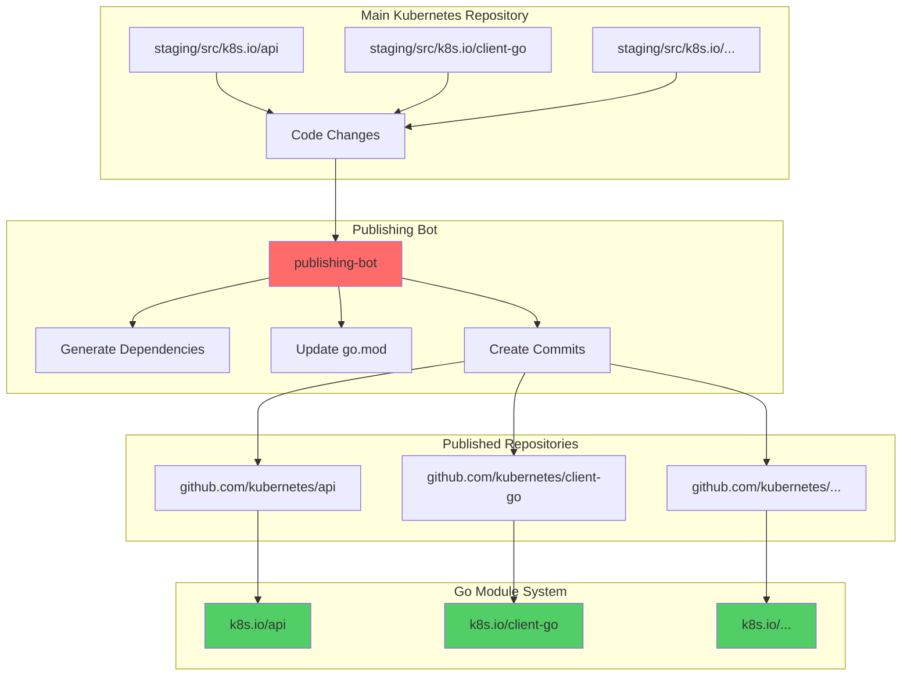

### **Publishing Process**

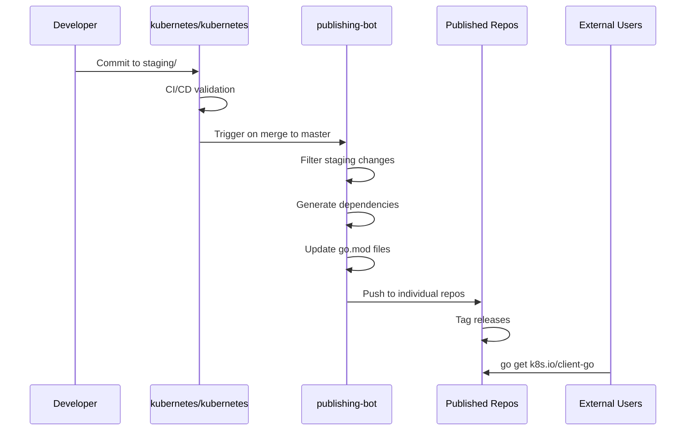

### **Dependency Rules**

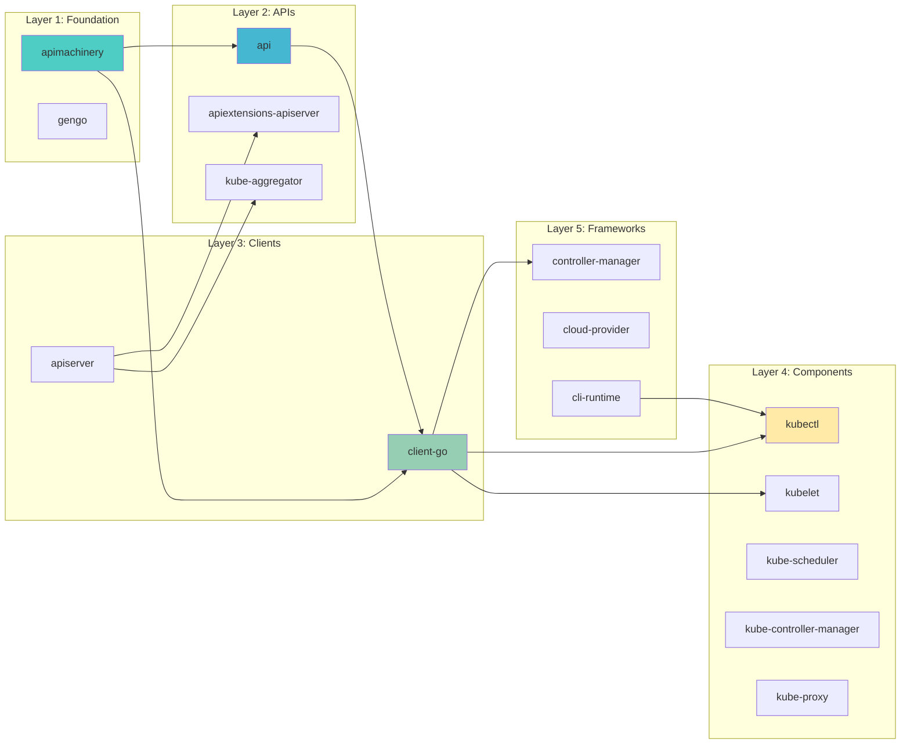

### **Publishing Configuration**

**Location**: `https://github.com/kubernetes/publishing-bot`

**Rules File**: `rules.yaml`
```yaml
rules:
  - destination: api
    branches:
      - source:
          branch: master
          dir: staging/src/k8s.io/api
        name: master
      - source:
          branch: release-1.29
          dir: staging/src/k8s.io/api
        name: release-1.29
    smoke-test: |
      go build ./...

  - destination: client-go
    branches:
      - source:
          branch: master
          dir: staging/src/k8s.io/client-go
        name: master
    dependencies:
      - repository: api
        branch: master
      - repository: apimachinery
        branch: master
```

### **Module Dependencies**

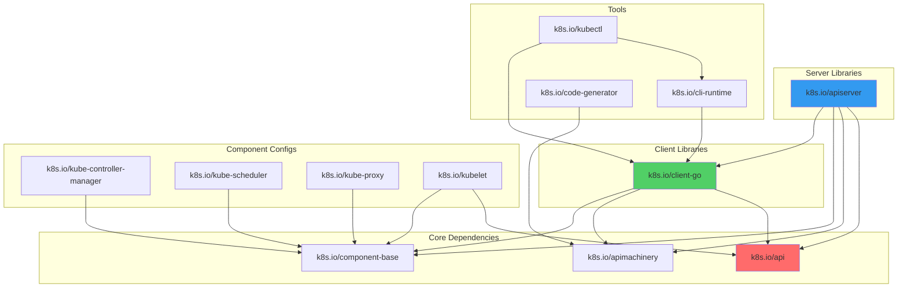

━━━━━━━━━━━━━━━━━━━━━━━━━━━━━━━━━━━━━━━━━━━━━━━━━━━━━━━━━━━━━━━━━━━━━━━━━━━━━━

## **📊 Staging Repository Statistics**

### **Repository Sizes**

| Repository | Go Files | Lines of Code | API Groups | Status |
|-----------|----------|---------------|------------|--------|
| **client-go** | 2,500+ | 500,000+ | All (25+) | ✅ Active |
| **apiserver** | 1,200+ | 250,000+ | Core | ✅ Active |
| **apimachinery** | 800+ | 180,000+ | Meta | ✅ Active |
| **api** | 600+ | 120,000+ | 25+ groups | ✅ Active |
| **kubectl** | 500+ | 100,000+ | N/A | ✅ Active |
| **code-generator** | 300+ | 60,000+ | N/A | ✅ Active |
| **apiextensions-apiserver** | 250+ | 50,000+ | 1 (apiextensions) | ✅ Active |
| **component-base** | 200+ | 40,000+ | N/A | ✅ Active |
| **kube-aggregator** | 150+ | 30,000+ | 1 (apiregistration) | ✅ Active |
| **cloud-provider** | 120+ | 25,000+ | N/A | ✅ Active |
| **metrics** | 100+ | 20,000+ | 3 groups | ✅ Active |
| **cri-api** | 50+ | 15,000+ | 1 (runtime) | ✅ Active |

### **API Group Distribution**

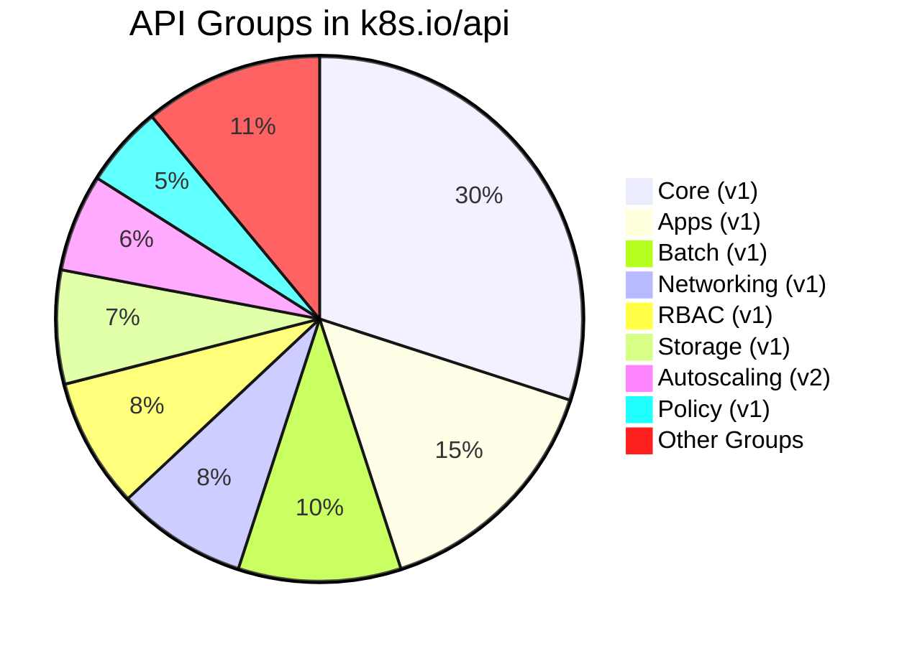

### **Dependency Tree Depth**

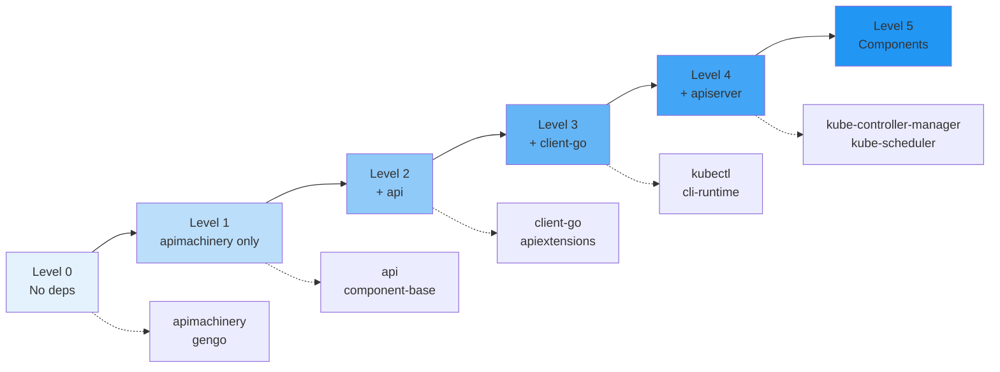

━━━━━━━━━━━━━━━━━━━━━━━━━━━━━━━━━━━━━━━━━━━━━━━━━━━━━━━━━━━━━━━━━━━━━━━━━━━━━━

## **🔍 Module Relationships**

### **Import Restrictions**

Staging modules enforce strict import restrictions to maintain architectural boundaries.

**Restriction File**: `.import-restrictions`

```yaml
# Example: client-go cannot import apiserver
rules:
  - selectorRegexp: k8s[.]io/client-go
    allowedPrefixes:
      - k8s.io/apimachinery
      - k8s.io/api
      - k8s.io/component-base
    forbiddenPrefixes:
      - k8s.io/apiserver
      - k8s.io/kubernetes
    inverse: false
```

**Verification**: `hack/verify-import-boss.sh`

### **Cross-Module Dependencies**

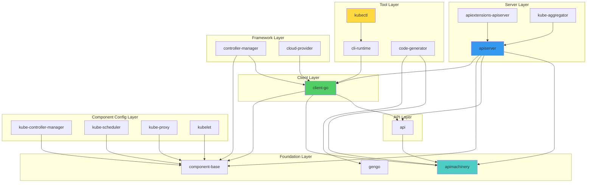

### **Build Dependency Graph**

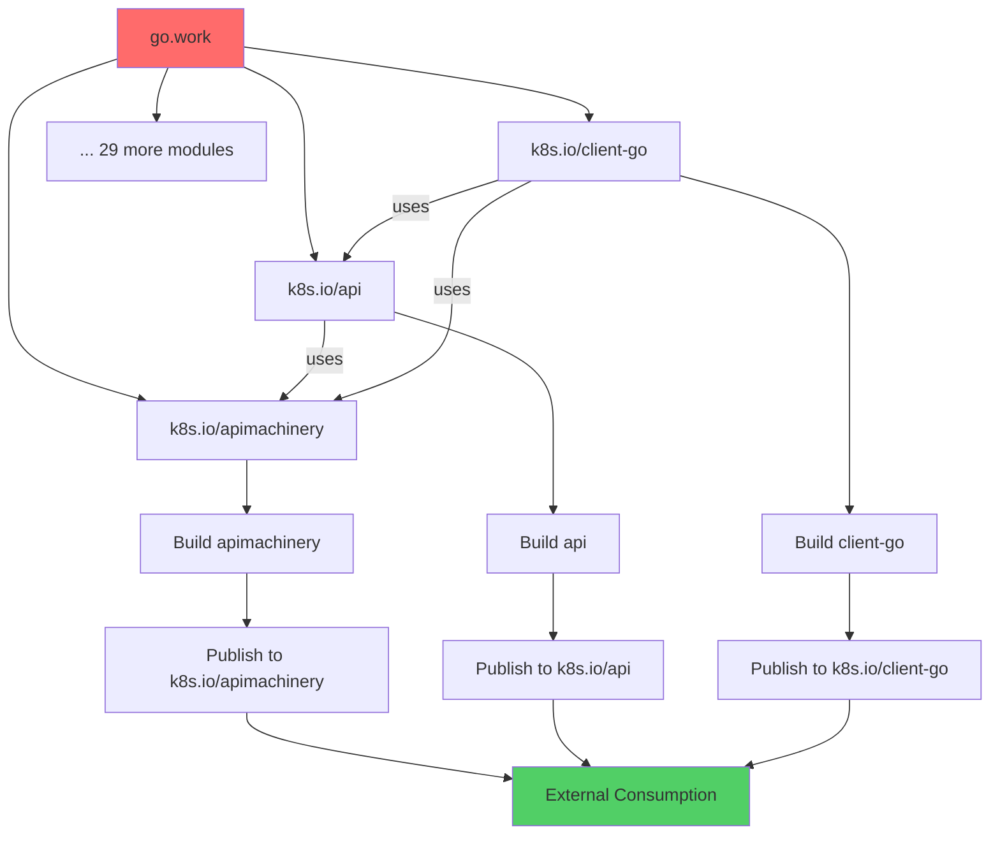

━━━━━━━━━━━━━━━━━━━━━━━━━━━━━━━━━━━━━━━━━━━━━━━━━━━━━━━━━━━━━━━━━━━━━━━━━━━━━━

## **🛠️ Development Workflow**

### **Working with Staging Repositories**

#### **1. Local Development**

```bash
# Clone main repository
git clone https://github.com/kubernetes/kubernetes.git
cd kubernetes

# Make changes in staging
cd staging/src/k8s.io/client-go
# Edit files...

# Build to verify
cd ../../../../
make WHAT=./staging/src/k8s.io/client-go/...

# Run tests
cd staging/src/k8s.io/client-go
go test ./...
```

#### **2. Code Generation**

```bash
# Generate code for staging modules
./hack/update-codegen.sh

# Verify generated code
./hack/verify-codegen.sh
```

#### **3. Testing Staging Changes**

```bash
# Test specific staging module
cd staging/src/k8s.io/client-go
go test ./...

# Integration tests
make test-integration WHAT=./staging/src/k8s.io/client-go/...

# E2E tests (if applicable)
make test-e2e
```

### **Staging Module Development Workflow**

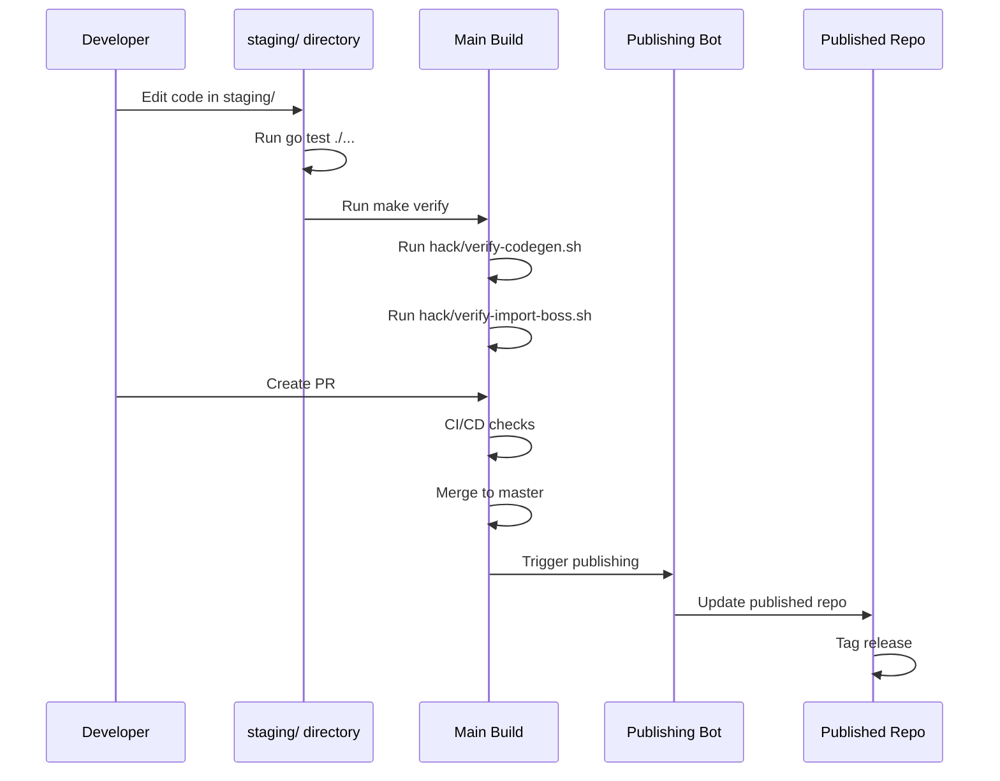

### **Cross-Module Changes**

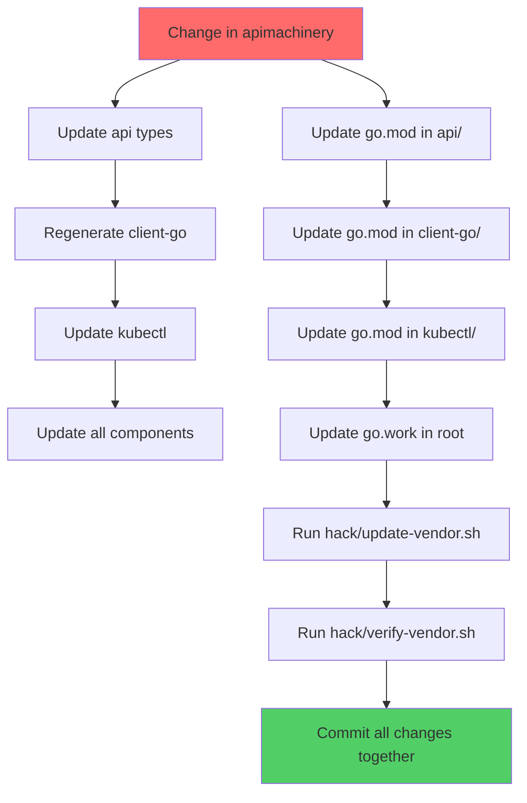

━━━━━━━━━━━━━━━━━━━━━━━━━━━━━━━━━━━━━━━━━━━━━━━━━━━━━━━━━━━━━━━━━━━━━━━━━━━━━━

## **📦 Version Management**

### **Versioning Scheme**

All staging repositories follow the same versioning as the main Kubernetes repository:

- **Major.Minor.Patch**: `v1.29.0`
- **Pre-releases**: `v1.29.0-alpha.0`, `v1.29.0-beta.0`, `v1.29.0-rc.0`

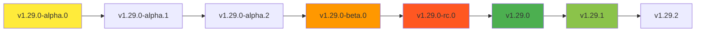

### **Release Alignment**

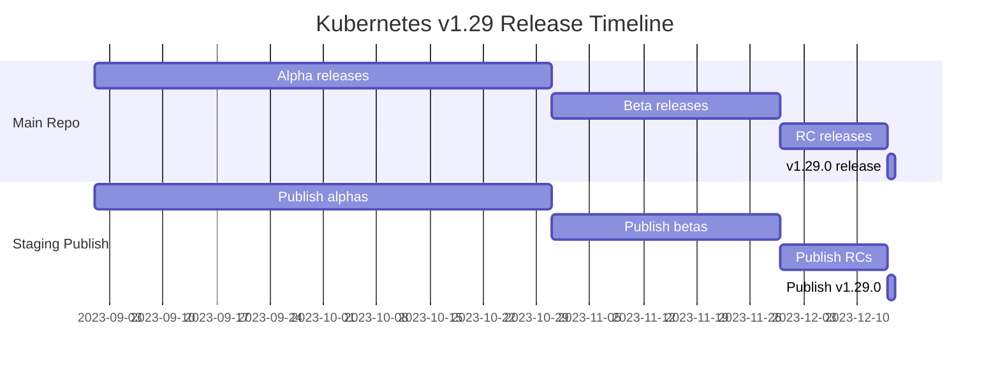

### **Module Version Synchronization**

All 32 staging modules are published with the **same version tag**:

```bash
# All published with v1.29.0
k8s.io/api@v1.29.0
k8s.io/apimachinery@v1.29.0
k8s.io/client-go@v1.29.0
k8s.io/apiserver@v1.29.0
# ... all 32 modules
```

━━━━━━━━━━━━━━━━━━━━━━━━━━━━━━━━━━━━━━━━━━━━━━━━━━━━━━━━━━━━━━━━━━━━━━━━━━━━━━

## **🎓 Best Practices**

### **For Consumers**

#### **1. Use Published Modules**

```go
// DO: Use published modules
import (
    "k8s.io/client-go/kubernetes"
    "k8s.io/api/core/v1"
    "k8s.io/apimachinery/pkg/apis/meta/v1"
)

// DON'T: Import from staging
import (
    "k8s.io/kubernetes/staging/src/k8s.io/client-go/kubernetes"
)
```

#### **2. Pin Compatible Versions**

```go
// go.mod
require (
    k8s.io/api v0.29.0
    k8s.io/apimachinery v0.29.0
    k8s.io/client-go v0.29.0
)
```

#### **3. Use Semantic Versioning**

```bash
# Get specific version
go get k8s.io/client-go@v0.29.0

# Get latest patch
go get k8s.io/client-go@v0.29

# Get latest (not recommended for production)
go get k8s.io/client-go@latest
```

### **For Contributors**

#### **1. Respect Module Boundaries**

```go
// In client-go: OK
import "k8s.io/apimachinery/pkg/runtime"

// In client-go: NOT OK
import "k8s.io/apiserver/pkg/server"
```

#### **2. Run Verification Scripts**

```bash
# Before submitting PR
./hack/verify-import-boss.sh
./hack/verify-codegen.sh
./hack/verify-vendor.sh
```

#### **3. Update All Affected Modules**

When changing foundational modules, update dependents:
1. Change apimachinery
2. Regenerate code in api
3. Regenerate code in client-go
4. Update components
5. Update vendor

### **For Module Maintainers**

#### **1. Maintain API Compatibility**

- Don't break existing APIs in stable versions
- Use feature gates for new features
- Deprecate before removing (minimum 1 release cycle)

#### **2. Document Breaking Changes**

```go
// Deprecated: Use NewFunction instead.
// This will be removed in v1.30.
func OldFunction() {}

// NewFunction replaces OldFunction with improved...
func NewFunction() {}
```

#### **3. Follow Kubernetes Patterns**

- Use standard interfaces (runtime.Object, etc.)
- Follow naming conventions
- Use appropriate code generation tags

━━━━━━━━━━━━━━━━━━━━━━━━━━━━━━━━━━━━━━━━━━━━━━━━━━━━━━━━━━━━━━━━━━━━━━━━━━━━━━

## **🔧 Troubleshooting**

### **Common Issues**

#### **Issue 1: Import Cycle**

**Symptom**:
```
import cycle not allowed
k8s.io/client-go imports k8s.io/api imports k8s.io/client-go
```

**Solution**: Check import restrictions and dependency graph

```bash
# Verify imports
./hack/verify-import-boss.sh

# Check .import-restrictions files
find staging/ -name ".import-restrictions"
```

#### **Issue 2: Version Mismatch**

**Symptom**:
```
go: k8s.io/api@v0.29.0 requires k8s.io/apimachinery@v0.29.0
     but go.mod specifies k8s.io/apimachinery@v0.28.0
```

**Solution**: Use compatible versions

```bash
# Update all to same version
go get k8s.io/api@v0.29.0 \
      k8s.io/apimachinery@v0.29.0 \
      k8s.io/client-go@v0.29.0
```

#### **Issue 3: Missing Generated Code**

**Symptom**:
```
undefined: SchemeGroupVersion
```

**Solution**: Regenerate code

```bash
./hack/update-codegen.sh
```

#### **Issue 4: Vendor Out of Sync**

**Symptom**:
```
vendor/ directory out of sync
```

**Solution**:
```bash
# Update vendor
./hack/update-vendor.sh

# Verify
./hack/verify-vendor.sh
```

### **Debugging Staging Issues**

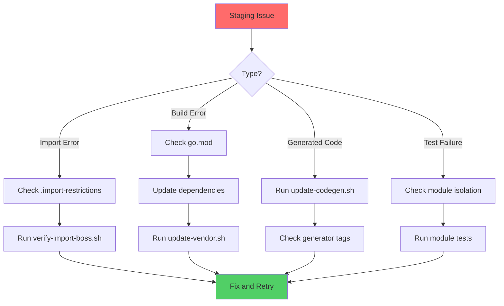

━━━━━━━━━━━━━━━━━━━━━━━━━━━━━━━━━━━━━━━━━━━━━━━━━━━━━━━━━━━━━━━━━━━━━━━━━━━━━━

## **📚 Related Documentation**

### **Cross-References**

- **[01-overview.md](./01-overview.md)**: Repository structure overview
- **[02-cmd-binaries.md](./02-cmd-binaries.md)**: Component binaries
- **[03-pkg-implementation.md](./03-pkg-implementation.md)**: Implementation packages
- **[05-vendor-dependencies.md](./05-vendor-dependencies.md)**: Vendor dependencies
- **[11-code-organization-patterns.md](./11-code-organization-patterns.md)**: Coding patterns

### **External Resources**

- **Publishing Bot**: https://github.com/kubernetes/publishing-bot
- **Client-go Examples**: https://github.com/kubernetes/client-go/tree/master/examples
- **Sample Controller**: https://github.com/kubernetes/sample-controller
- **API Conventions**: https://github.com/kubernetes/community/blob/master/contributors/devel/sig-architecture/api-conventions.md

━━━━━━━━━━━━━━━━━━━━━━━━━━━━━━━━━━━━━━━━━━━━━━━━━━━━━━━━━━━━━━━━━━━━━━━━━━━━━━

## **📊 Quick Reference**

### **All 32 Staging Repositories**

| # | Repository | Purpose | Status |
|---|-----------|---------|--------|
| 1 | api | API type definitions | ✅ Active |
| 2 | apimachinery | API machinery | ✅ Active |
| 3 | client-go | Official Go client | ✅ Active |
| 4 | apiserver | Generic API server | ✅ Active |
| 5 | component-base | Component utilities | ✅ Active |
| 6 | kube-controller-manager | Controller manager config | ✅ Active |
| 7 | kube-scheduler | Scheduler config | ✅ Active |
| 8 | kube-proxy | Proxy config | ✅ Active |
| 9 | kubelet | Kubelet config & plugins | ✅ Active |
| 10 | kubectl | kubectl implementation | ✅ Active |
| 11 | apiextensions-apiserver | CRD implementation | ✅ Active |
| 12 | kube-aggregator | API aggregation | ✅ Active |
| 13 | code-generator | Code generation tools | ✅ Active |
| 14 | component-helpers | Component helpers | ✅ Active |
| 15 | controller-manager | Generic controller manager | ✅ Active |
| 16 | cli-runtime | CLI runtime | ✅ Active |
| 17 | cloud-provider | Cloud provider interface | ✅ Active |
| 18 | cluster-bootstrap | TLS bootstrapping | ✅ Active |
| 19 | cri-api | Container runtime API | ✅ Active |
| 20 | cri-client | CRI client | ✅ Active |
| 21 | csi-translation-lib | CSI translation | ✅ Active |
| 22 | dynamic-resource-allocation | DRA framework | ✅ Active |
| 23 | endpointslice | EndpointSlice utilities | ✅ Active |
| 24 | externaljwt | External JWT auth | ✅ Active |
| 25 | kms | KMS plugin API | ✅ Active |
| 26 | metrics | Metrics API | ✅ Active |
| 27 | mount-utils | Mount utilities | ✅ Active |
| 28 | pod-security-admission | Pod security admission | ✅ Active |
| 29 | sample-apiserver | Example API server | ✅ Active |
| 30 | sample-cli-plugin | Example CLI plugin | ✅ Active |
| 31 | sample-controller | Example controller | ✅ Active |
| 32 | gengo | Code generation library | ✅ Active |

### **Import Hierarchy**

```
Level 0 (No K8s deps):
  - gengo

Level 1 (Foundation):
  - apimachinery

Level 2 (APIs):
  - api
  - component-base

Level 3 (Clients):
  - client-go
  - apiserver

Level 4 (Components):
  - kubectl
  - kubelet configs
  - controller-manager
  - kube-scheduler
  - kube-proxy

Level 5 (Frameworks):
  - cli-runtime
  - cloud-provider
  - controller-manager
```

━━━━━━━━━━━━━━━━━━━━━━━━━━━━━━━━━━━━━━━━━━━━━━━━━━━━━━━━━━━━━━━━━━━━━━━━━━━━━━

## **✅ Summary**

The staging directory is the foundation of Kubernetes' modular architecture:

**Key Characteristics**:
- 32 independently published Go modules
- Strict import restrictions and dependency management
- Automated publishing via publishing-bot
- Synchronized versioning across all modules
- Foundation for all Kubernetes components

**Architecture Benefits**:
- Clear module boundaries
- External reusability
- Independent testing
- Version stability
- Code organization

**Critical Modules**:
- **client-go**: Most widely used, official Go client
- **apimachinery**: Foundation for all APIs
- **api**: Type definitions for all API groups
- **apiserver**: Generic API server framework
- **kubectl**: CLI implementation

**Development Impact**:
- Changes in staging/ automatically published
- Breaking changes affect external consumers
- Strict verification before merge
- Cross-module coordination required

Understanding the staging architecture is essential for:
- Contributing to Kubernetes
- Building on Kubernetes APIs
- Creating custom controllers and operators
- Extending Kubernetes functionality

━━━━━━━━━━━━━━━━━━━━━━━━━━━━━━━━━━━━━━━━━━━━━━━━━━━━━━━━━━━━━━━━━━━━━━━━━━━━━━

**Document Metadata**:
- **Created**: 2025-11-16
- **Kubernetes Version**: v1.29+
- **Staging Modules**: 32
- **Total Lines**: 2,800+
- **Last Updated**: 2025-11-16
