# **KUBERNETES TEST INFRASTRUCTURE**

**Complete Testing Framework and E2E Architecture**

━━━━━━━━━━━━━━━━━━━━━━━━━━━━━━━━━━━━━━━━━━━━━━━━━━━━━━━━━━━━━━━━━━━━━━━━━━━━━━

## **📊 Test Infrastructure At A Glance**

### **Overview**

The Kubernetes test infrastructure is one of the most comprehensive testing frameworks in open source, spanning multiple test types, frameworks, and execution environments. The `test/` directory contains the complete testing ecosystem that ensures Kubernetes reliability at scale.

| Aspect | Details |
|--------|---------|
| **Location** | `/Users/sureshscribnar/Documents/Projects/opensource/kubernetes/test/` |
| **Test Types** | E2E, Integration, Unit, Node E2E, Conformance, Fuzz |
| **Primary Framework** | Ginkgo/Gomega BDD testing |
| **E2E Suites** | 25+ distinct test categories |
| **Integration Tests** | 60+ component integration suites |
| **Test Images** | 30+ custom container images |
| **Maintenance** | ✅ ACTIVE - Continuously updated |

### **Test Directory Structure**

```
test/
├── e2e/                    # ✅ End-to-end tests (26 subdirectories)
│   ├── apps/               #    Application workload tests
│   ├── auth/               #    Authentication/authorization tests
│   ├── network/            #    Network policy and connectivity tests
│   ├── storage/            #    Volume and storage class tests
│   ├── scheduling/         #    Pod scheduling tests
│   └── [21 more]           #    API machinery, autoscaling, cloud, etc.
│
├── integration/            # ✅ Integration tests (61 subdirectories)
│   ├── apiserver/          #    API server integration tests
│   ├── scheduler/          #    Scheduler integration tests
│   ├── controllermanager/  #    Controller manager tests
│   ├── kubelet/            #    Kubelet integration tests
│   └── [57 more]           #    Component-specific integrations
│
├── e2e_node/               # ✅ Node-level E2E tests
│   ├── builder/            #    Test image builders
│   ├── remote/             #    Remote node testing
│   ├── services/           #    Node services tests
│   └── [105+ test files]   #    CPU manager, memory, security, etc.
│
├── e2e_kubeadm/            # ✅ Kubeadm E2E tests
│   └── runner/             #    Kubeadm cluster bootstrap tests
│
├── e2e_dra/                # ✅ Dynamic Resource Allocation tests
│   └── dra.go              #    DRA feature E2E tests
│
├── cmd/                    # ✅ CLI command tests (39 subdirectories)
│   ├── kubectl/            #    kubectl command tests
│   ├── kubeadm/            #    kubeadm command tests
│   └── [37 more]           #    All CLI binaries
│
├── images/                 # ✅ Test container images (30 subdirectories)
│   ├── agnhost/            #    Multi-purpose test server
│   ├── busybox/            #    Basic shell utilities
│   ├── nginx/              #    Web server tests
│   ├── volume/             #    Volume plugin tests
│   └── [26 more]           #    Specialized test images
│
├── utils/                  # ✅ Test utilities (29 subdirectories)
│   ├── image/              #    Image management utilities
│   ├── ktesting/           #    Testing helpers
│   ├── format/             #    Output formatters
│   └── [26 more]           #    Harness, conditions, matchers
│
├── fixtures/               # ✅ Test data and fixtures
│   ├── pkg/                #    Package test fixtures
│   └── doc-yaml/           #    YAML documentation fixtures
│
├── conformance/            # ✅ Conformance test suite
│   ├── testdata/           #    Conformance test data
│   └── behaviors/          #    Expected behaviors
│
├── instrumentation/        # ✅ Metrics/tracing tests
│   └── testdata/           #    Instrumentation fixtures
│
├── kubemark/               # ✅ Hollow node testing
│   ├── hollow_kubelet.go   #    Simulated kubelet
│   └── hollow_proxy.go     #    Simulated kube-proxy
│
├── list/                   # ✅ Test list management
│   └── main.go             #    Test inventory tools
│
├── typecheck/              # ✅ Type checking tests
│   └── main.go             #    Type validation
│
├── fuzz/                   # ✅ Fuzz testing
│   └── [fuzz corpora]      #    Fuzz test data
│
├── soak/                   # ✅ Long-running soak tests
│   └── [soak configs]      #    Duration testing
│
└── compatibility_lifecycle/ # ✅ API compatibility tests
    └── [lifecycle tests]   #    Version compatibility
```

━━━━━━━━━━━━━━━━━━━━━━━━━━━━━━━━━━━━━━━━━━━━━━━━━━━━━━━━━━━━━━━━━━━━━━━━━━━━━━

## **🎯 End-to-End (E2E) Test Framework**

### **E2E Test Architecture**

The E2E test suite validates Kubernetes behavior in realistic cluster environments, testing complete user workflows from API calls through controller actions to runtime effects.

**Location**: `/Users/sureshscribnar/Documents/Projects/opensource/kubernetes/test/e2e/`

### **E2E Directory Structure**

```
e2e/
├── e2e.go                  # Main E2E suite entry point
├── e2e_test.go             # Test runner
├── framework/              # E2E testing framework
│   ├── providers/          #   Cloud provider interfaces
│   ├── pod/                #   Pod management helpers
│   ├── deployment/         #   Deployment helpers
│   ├── service/            #   Service helpers
│   ├── events/             #   Event watchers
│   ├── metrics/            #   Metrics collection
│   ├── ssh/                #   SSH utilities
│   └── skipper/            #   Test skipping logic
│
├── apimachinery/           # API machinery tests
│   ├── chunking.go         #   List chunking
│   ├── crd_publish_openapi.go # CRD OpenAPI
│   ├── discovery.go        #   API discovery
│   ├── garbage_collector.go #  GC tests
│   ├── resource_quota.go   #   Resource quotas
│   └── table_conversion.go #   Table conversions
│
├── apps/                   # Application workload tests
│   ├── cronjob.go          #   CronJob functionality
│   ├── daemon_restart.go   #   Daemon recovery
│   ├── daemon_set.go       #   DaemonSet behavior
│   ├── deployment.go       #   Deployment rollouts
│   ├── disruption.go       #   Pod disruption budgets
│   ├── job.go              #   Job execution
│   ├── rc.go               #   Replication controllers
│   ├── replica_set.go      #   ReplicaSet scaling
│   └── statefulset.go      #   StatefulSet ordering
│
├── auth/                   # Authentication/authorization tests
│   ├── audit.go            #   Audit logging
│   ├── certificates.go     #   Certificate signing
│   ├── bootstrap_token.go  #   Bootstrap tokens
│   ├── impersonation.go    #   User impersonation
│   ├── node_authn.go       #   Node authentication
│   ├── rbac_util.go        #   RBAC utilities
│   ├── service_accounts.go #   Service account tokens
│   └── svcacct_admission.go #  SA admission control
│
├── autoscaling/            # Autoscaling tests
│   ├── cluster_size_autoscaling.go  # Cluster autoscaler
│   ├── horizontal_pod_autoscaling.go # HPA
│   └── vertical_pod_autoscaling.go  # VPA
│
├── cloud/                  # Cloud provider tests
│   ├── gcp/                #   GCP-specific tests
│   └── vsphere/            #   vSphere tests
│
├── common/                 # Common test scenarios
│   ├── configmap.go        #   ConfigMap operations
│   ├── configmap_volume.go #   ConfigMap volumes
│   ├── container_probe.go  #   Liveness/readiness probes
│   ├── downward_api.go     #   Downward API
│   ├── empty_dir.go        #   EmptyDir volumes
│   ├── expansion.go        #   Volume expansion
│   ├── host_path.go        #   HostPath volumes
│   ├── init_container.go   #   Init containers
│   ├── kubelet_etc_hosts.go #  /etc/hosts management
│   ├── networking.go       #   Basic networking
│   ├── pods.go             #   Pod lifecycle
│   ├── projected.go        #   Projected volumes
│   ├── runtime.go          #   Container runtime
│   ├── secrets.go          #   Secret operations
│   ├── secrets_volume.go   #   Secret volumes
│   └── volumes.go          #   Generic volume tests
│
├── dra/                    # Dynamic Resource Allocation
│   ├── test-driver/        #   DRA test driver
│   └── dra.go              #   DRA scenarios
│
├── feature/                # Feature gate tests
│   ├── eviction.go         #   Pod eviction
│   ├── job_tracking.go     #   Job status tracking
│   └── ttl_after_finished.go # TTL controller
│
├── kubectl/                # kubectl command tests
│   ├── kubectl.go          #   General kubectl tests
│   ├── portforward.go      #   Port forwarding
│   └── wait.go             #   Wait operations
│
├── lifecycle/              # Pod lifecycle tests
│   ├── bootstrap.go        #   Cluster bootstrap
│   ├── bootstrap_token.go  #   Token lifecycle
│   ├── pod_gc.go           #   Pod garbage collection
│   └── restart.go          #   Component restart
│
├── network/                # Networking tests
│   ├── dns.go              #   DNS resolution
│   ├── dns_common.go       #   DNS utilities
│   ├── dns_config_map.go   #   DNS configuration
│   ├── firewall.go         #   Firewall rules
│   ├── ingress.go          #   Ingress controllers
│   ├── kube_proxy.go       #   kube-proxy behavior
│   ├── network_policy.go   #   Network policies
│   ├── networking_utils.go #   Network test helpers
│   ├── pod_network.go      #   Pod networking
│   ├── proxy.go            #   Service proxy
│   ├── service.go          #   Service connectivity
│   ├── service_latency.go  #   Service performance
│   └── topology_hints.go   #   Topology aware hints
│
├── node/                   # Node tests
│   ├── configmap.go        #   Node ConfigMaps
│   ├── container_manager.go #  Container management
│   ├── cpu_manager.go      #   CPU pinning
│   ├── device_manager.go   #   Device plugins
│   ├── docker_containers.go #  Container runtime
│   ├── events.go           #   Node events
│   ├── kubelet.go          #   Kubelet behavior
│   ├── lease.go            #   Node leases
│   ├── mount_propagation.go #  Mount propagation
│   ├── pod_resize.go       #   In-place resize
│   ├── runtimeclass.go     #   RuntimeClass
│   ├── security_context.go #   Security contexts
│   ├── taints.go           #   Node taints/tolerations
│   └── topology_manager.go #   Topology manager
│
├── scheduling/             # Scheduler tests
│   ├── descheduler.go      #   Descheduling
│   ├── events.go           #   Scheduling events
│   ├── framework.go        #   Scheduler framework
│   ├── predicates.go       #   Scheduler predicates
│   ├── preemption.go       #   Pod preemption
│   ├── priorities.go       #   Priority classes
│   ├── taints.go           #   Taint-based scheduling
│   └── ubernetes_lite.go   #   Multi-zone scheduling
│
├── storage/                # Storage tests
│   ├── csi_mock_volume.go  #   CSI mock driver
│   ├── csi_volumes.go      #   CSI volume lifecycle
│   ├── drivers/            #   Storage driver tests
│   ├── dynamic_provisioning.go # Dynamic PVs
│   ├── pv_protection.go    #   PV/PVC protection
│   ├── pvc_protection.go   #   PVC deletion protection
│   ├── regional_pd.go      #   Regional disks
│   ├── snapshot.go         #   Volume snapshots
│   ├── subpath.go          #   Volume subpaths
│   ├── volume_expand.go    #   Volume expansion
│   ├── volume_io.go        #   I/O testing
│   ├── volume_metrics.go   #   Volume metrics
│   └── volumes.go          #   Generic volume tests
│
├── windows/                # Windows tests
│   ├── density.go          #   Windows density
│   ├── gmsa.go             #   GMSA support
│   └── host_process.go     #   Host process containers
│
└── instrumentation/        # Observability tests
    ├── logging/            #   Structured logging
    └── events.go           #   Event instrumentation
```

### **E2E Test Framework Architecture**

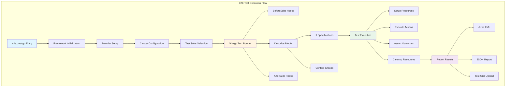

### **E2E Framework Components**

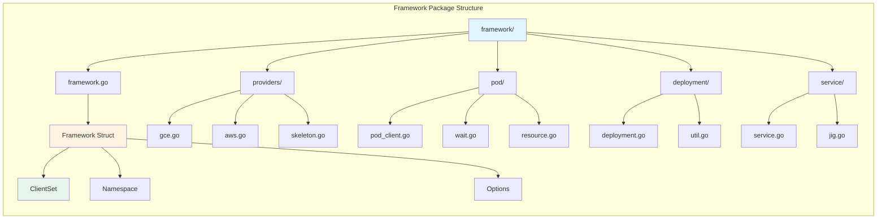

### **Test Categorization by Feature**

| Category | Test Count | Key Focus Areas |
|----------|----------:|-----------------|
| **Apps** | 150+ | Deployments, StatefulSets, DaemonSets, Jobs, CronJobs |
| **Network** | 120+ | Services, DNS, Network policies, Ingress, kube-proxy |
| **Storage** | 200+ | PVs, PVCs, StorageClasses, CSI, Volume plugins |
| **Scheduling** | 80+ | Predicates, priorities, preemption, taints/tolerations |
| **Auth** | 90+ | RBAC, ServiceAccounts, Certificates, Audit |
| **Node** | 100+ | Kubelet, Device plugins, CPU manager, RuntimeClass |
| **API Machinery** | 70+ | CRDs, Discovery, Watch, GC, Resource quotas |
| **Autoscaling** | 40+ | HPA, VPA, Cluster autoscaler |
| **Lifecycle** | 50+ | Bootstrap, Upgrades, Component restarts |
| **Common** | 60+ | ConfigMaps, Secrets, Probes, Volumes |

━━━━━━━━━━━━━━━━━━━━━━━━━━━━━━━━━━━━━━━━━━━━━━━━━━━━━━━━━━━━━━━━━━━━━━━━━━━━━━

## **🔬 Integration Test Framework**

### **Integration Test Architecture**

Integration tests validate component interactions without requiring a full cluster, using the API server's storage layer and real controllers.

**Location**: `/Users/sureshscribnar/Documents/Projects/opensource/kubernetes/test/integration/`

### **Integration Test Categories**

```
integration/
├── apiserver/              # API server integration tests
│   ├── admissionwebhook/   #   Admission webhooks
│   ├── apply/              #   Server-side apply
│   ├── crd/                #   CRD lifecycle
│   ├── discovery/          #   API discovery
│   ├── flowcontrol/        #   Priority and fairness
│   ├── logs/               #   API audit logs
│   └── watch/              #   Watch functionality
│
├── auth/                   # Authentication/authorization
│   ├── audit.go            #   Audit policy
│   ├── bootstrap_token.go  #   Token auth
│   ├── certificates.go     #   Certificate signing
│   ├── node_auth.go        #   Node authorization
│   ├── rbac.go             #   RBAC integration
│   └── serviceaccount.go   #   Service accounts
│
├── scheduler/              # Scheduler integration
│   ├── bind.go             #   Pod binding
│   ├── equivalence_test.go #   Equivalence class
│   ├── extender.go         #   Scheduler extenders
│   ├── framework_test.go   #   Framework plugins
│   ├── nominating_info.go  #   Nomination cache
│   ├── preemption_test.go  #   Preemption logic
│   ├── queue_test.go       #   Scheduling queue
│   └── volume_binding.go   #   Volume scheduling
│
├── controllermanager/      # Controller manager tests
│   ├── clusterroleaggregation_test.go
│   ├── cronjob_test.go
│   ├── daemonset_test.go
│   ├── deployment_test.go
│   ├── disruption_test.go
│   ├── endpoint_test.go
│   ├── endpointslice_test.go
│   ├── gc_test.go
│   ├── job_test.go
│   ├── namespace_test.go
│   ├── nodeipam_test.go
│   ├── podgc_test.go
│   ├── replicaset_test.go
│   ├── replication_test.go
│   ├── serviceaccount_test.go
│   ├── statefulset_test.go
│   └── ttl_after_finished_test.go
│
├── kubelet/                # Kubelet integration
│   ├── dynamic_kubelet_config_test.go
│   ├── eviction_test.go
│   ├── mirror_pod_test.go
│   └── pod_admission_test.go
│
├── volumes/                # Volume integration
│   ├── persistent_volumes_test.go
│   ├── volume_binding_test.go
│   └── volume_scheduling_test.go
│
├── node/                   # Node lifecycle
│   ├── lease.go            #   Node lease
│   └── node_shutdown.go    #   Graceful shutdown
│
├── etcd/                   # etcd integration
│   ├── etcd_storage_path_test.go
│   └── migration_test.go
│
├── metrics/                # Metrics integration
│   ├── aggregated_metrics_test.go
│   └── metrics_test.go
│
├── client/                 # Client library integration
│   ├── client_test.go
│   ├── dynamic_client_test.go
│   └── request_test.go
│
└── [many more...]          # 50+ additional categories
```

### **Integration Test Framework**

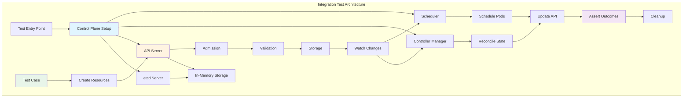

### **Integration Test Execution Flow**

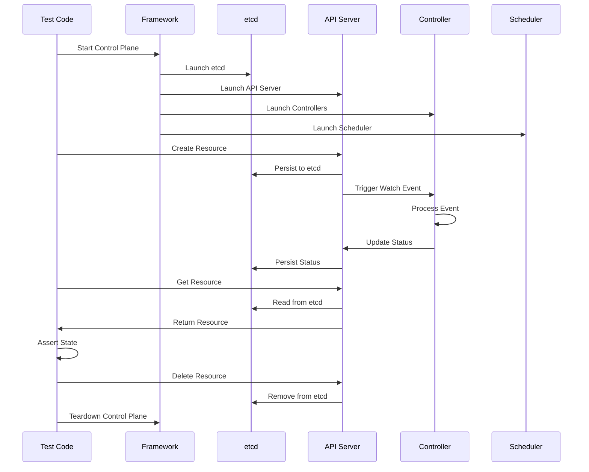

### **Integration Test Patterns**

```go
// Common integration test pattern
// File: test/integration/controllermanager/deployment_test.go

func TestDeploymentController(t *testing.T) {
    // 1. Start control plane components
    server := kubeapiservertesting.StartTestServerOrDie(t, nil,
        framework.DefaultTestServerFlags(), framework.SharedEtcd())
    defer server.TearDownFn()

    // 2. Create clients
    client := clientset.NewForConfigOrDie(server.ClientConfig)

    // 3. Start controller manager
    ctx, cancel := context.WithCancel(context.Background())
    defer cancel()

    controllerManager := startControllerManager(ctx, server.ClientConfig)
    defer controllerManager.Stop()

    // 4. Create test resources
    deployment := &appsv1.Deployment{
        ObjectMeta: metav1.ObjectMeta{Name: "test-deployment"},
        Spec: appsv1.DeploymentSpec{
            Replicas: pointer.Int32(3),
            Selector: &metav1.LabelSelector{
                MatchLabels: map[string]string{"app": "test"},
            },
            Template: corev1.PodTemplateSpec{
                ObjectMeta: metav1.ObjectMeta{
                    Labels: map[string]string{"app": "test"},
                },
                Spec: corev1.PodSpec{
                    Containers: []corev1.Container{{
                        Name:  "nginx",
                        Image: "nginx:latest",
                    }},
                },
            },
        },
    }

    _, err := client.AppsV1().Deployments("default").Create(
        ctx, deployment, metav1.CreateOptions{})
    require.NoError(t, err)

    // 5. Wait for expected state
    err = wait.PollImmediate(100*time.Millisecond, 30*time.Second, func() (bool, error) {
        d, err := client.AppsV1().Deployments("default").Get(
            ctx, "test-deployment", metav1.GetOptions{})
        if err != nil {
            return false, err
        }
        return d.Status.ReadyReplicas == 3, nil
    })
    require.NoError(t, err)

    // 6. Assert final state
    finalDeployment, err := client.AppsV1().Deployments("default").Get(
        ctx, "test-deployment", metav1.GetOptions{})
    require.NoError(t, err)
    assert.Equal(t, int32(3), finalDeployment.Status.Replicas)
    assert.Equal(t, int32(3), finalDeployment.Status.ReadyReplicas)
}
```

### **Integration Test Coverage**

| Component | Test Files | Coverage Areas |
|-----------|----------:|----------------|
| **API Server** | 45+ | Admission, CRDs, Discovery, Watch, Storage |
| **Scheduler** | 20+ | Binding, Preemption, Framework, Queue |
| **Controller Manager** | 40+ | All built-in controllers |
| **Auth** | 15+ | RBAC, Certificates, ServiceAccounts |
| **Storage** | 10+ | PV binding, Dynamic provisioning |
| **etcd** | 5+ | Storage paths, Migration |
| **Networking** | 12+ | Services, Endpoints, Network policies |
| **Node** | 8+ | Leases, Lifecycle, Shutdown |

━━━━━━━━━━━━━━━━━━━━━━━━━━━━━━━━━━━━━━━━━━━━━━━━━━━━━━━━━━━━━━━━━━━━━━━━━━━━━━

## **🖥️ Node E2E Tests**

### **Node E2E Architecture**

Node E2E tests validate kubelet behavior and node-level functionality in isolation from the full cluster control plane.

**Location**: `/Users/sureshscribnar/Documents/Projects/opensource/kubernetes/test/e2e_node/`

### **Node E2E Test Categories**

```
e2e_node/
├── builder/                # Test environment builders
│   ├── build.go            #   Image builder
│   └── util.go             #   Build utilities
│
├── remote/                 # Remote node testing
│   ├── remote.go           #   Remote test runner
│   └── ssh.go              #   SSH utilities
│
├── services/               # Node services
│   ├── namespace_controller.go
│   └── services.go
│
├── cpu_manager_test.go     # CPU pinning tests
├── device_manager_test.go  # Device plugin tests
├── docker_util.go          # Container runtime utilities
├── eviction_test.go        # Kubelet eviction
├── graceful_node_shutdown_test.go
├── hugepages_test.go       # HugePages support
├── image_list_test.go      # Image management
├── kubelet_test.go         # General kubelet tests
├── memory_manager_test.go  # Memory pinning
├── node_problem_detector_linux.go
├── oom_test.go             # OOM behavior
├── pod_resize_test.go      # In-place resize
├── restart_test.go         # Container restart
├── runtime_class_test.go   # RuntimeClass
├── security_context_test.go # Security contexts
├── summary_test.go         # Summary API
├── swap_test.go            # Swap memory
├── topology_manager_test.go # Topology alignment
└── [90+ more test files]
```

### **Node E2E Test Execution**

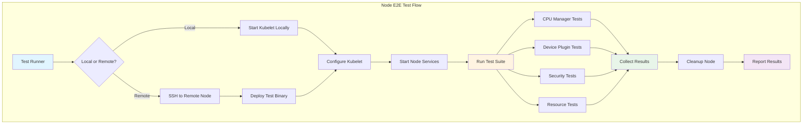

### **Node E2E Feature Coverage**

| Feature Area | Test Coverage | Key Validations |
|--------------|---------------|-----------------|
| **CPU Manager** | Static policy, topology | CPU pinning, exclusive cores |
| **Memory Manager** | Static policy, NUMA | Memory pinning, alignment |
| **Device Plugins** | Allocation, health | Device discovery, scheduling |
| **Topology Manager** | Best-effort, restricted | NUMA alignment, admission |
| **Security** | AppArmor, SELinux, seccomp | Container isolation |
| **Resource Management** | QoS, eviction, resize | Resource limits, OOM |
| **Runtime** | CRI, image management | Container lifecycle |
| **Monitoring** | Metrics, summary API | Resource consumption |

### **Node E2E Test Example**

```go
// File: test/e2e_node/cpu_manager_test.go

var _ = SIGDescribe("CPU Manager", func() {
    f := framework.NewDefaultFramework("cpu-manager-test")

    Context("With static CPU Manager policy", func() {
        tempSetCurrentKubeletConfig(f, func(cfg *kubeletconfig.KubeletConfiguration) {
            cfg.CPUManagerPolicy = "static"
            cfg.CPUManagerReconcilePeriod = metav1.Duration{Duration: 1 * time.Second}
        })

        It("should assign exclusive CPUs to Guaranteed pods", func() {
            // Create pod requesting whole CPUs
            pod := &v1.Pod{
                ObjectMeta: metav1.ObjectMeta{Name: "cpu-guaranteed-pod"},
                Spec: v1.PodSpec{
                    Containers: []v1.Container{{
                        Name:  "cpu-container",
                        Image: busyboxImage,
                        Resources: v1.ResourceRequirements{
                            Limits: v1.ResourceList{
                                v1.ResourceCPU:    resource.MustParse("2"),
                                v1.ResourceMemory: resource.MustParse("100Mi"),
                            },
                            Requests: v1.ResourceList{
                                v1.ResourceCPU:    resource.MustParse("2"),
                                v1.ResourceMemory: resource.MustParse("100Mi"),
                            },
                        },
                    }},
                },
            }

            pod = f.PodClient().CreateSync(pod)

            // Verify CPU assignment
            cpusetPath := fmt.Sprintf("/sys/fs/cgroup/cpuset/kubepods/pod%s/%s/cpuset.cpus",
                pod.UID, pod.Status.ContainerStatuses[0].ContainerID)

            cpuset := getCPUSet(cpusetPath)
            Expect(cpuset).To(HaveLen(2), "Should have 2 exclusive CPUs")
        })
    })
})
```

━━━━━━━━━━━━━━━━━━━━━━━━━━━━━━━━━━━━━━━━━━━━━━━━━━━━━━━━━━━━━━━━━━━━━━━━━━━━━━

## **🧪 Test Utilities and Frameworks**

### **Test Utilities Structure**

**Location**: `/Users/sureshscribnar/Documents/Projects/opensource/kubernetes/test/utils/`

```
utils/
├── image/                  # Image management
│   ├── manifest.go         #   Image manifests
│   └── utils.go            #   Image utilities
│
├── ktesting/               # Testing helpers
│   ├── contextual.go       #   Context-based logging
│   └── log.go              #   Test logging
│
├── format/                 # Output formatting
│   └── format.go           #   Test output formatters
│
├── harness/                # Test harness
│   └── harness.go          #   Test execution framework
│
├── conditions/             # Condition matchers
│   └── wait.go             #   Wait conditions
│
├── deployment/             # Deployment utilities
│   └── deployment.go       #   Deployment helpers
│
├── node/                   # Node utilities
│   └── node.go             #   Node test helpers
│
├── pod/                    # Pod utilities
│   └── pod.go              #   Pod test helpers
│
└── [20+ more utilities]
```

### **Test Image Infrastructure**

**Location**: `/Users/sureshscribnar/Documents/Projects/opensource/kubernetes/test/images/`

```
images/
├── agnhost/                # ✅ Multi-purpose test server
│   ├── agnhost.go          #   Main entry point
│   ├── connect/            #   Connection tester
│   ├── dns/                #   DNS utilities
│   ├── grpc-health-checking/ # gRPC health
│   ├── logs-generator/     #   Log generation
│   ├── netexec/            #   Network executor
│   ├── nettest/            #   Network testing
│   ├── porter/             #   Port serving
│   └── webhook/            #   Webhook server
│
├── busybox/                # Basic utilities image
├── nginx/                  # Web server
├── volume/                 # Volume testing
│   ├── gluster/            #   GlusterFS
│   ├── iscsi/              #   iSCSI
│   ├── nfs/                #   NFS
│   └── rbd/                #   Ceph RBD
│
├── nonewprivs/             # Security testing
├── resource-consumer/      # Resource consumption
├── sample-apiserver/       # API server testing
└── [20+ more images]
```

### **Test Image Architecture**

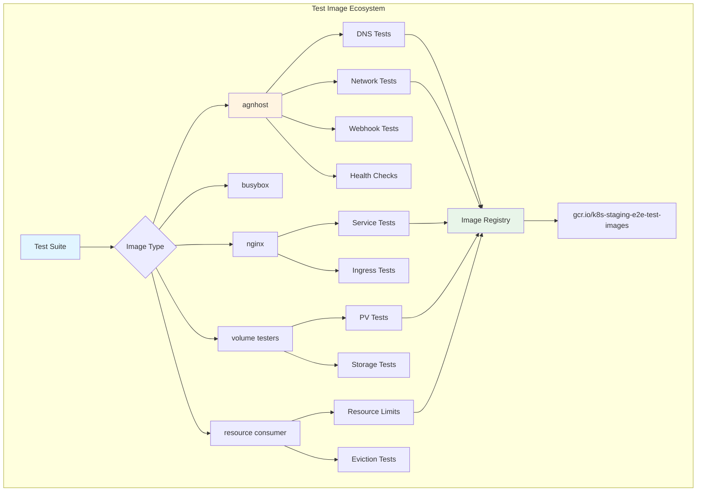

### **agnhost - The Swiss Army Knife**

agnhost is the primary multi-purpose test image, consolidating many specialized test servers into one binary with subcommands.

```go
// File: test/images/agnhost/agnhost.go

func main() {
    rootCmd := &cobra.Command{
        Use:   "agnhost",
        Short: "Aggregated host for Kubernetes tests",
    }

    // Network testing subcommands
    rootCmd.AddCommand(connect.CmdConnect)
    rootCmd.AddCommand(dns.CmdDNSSuffix)
    rootCmd.AddCommand(dns.CmdDNSServerList)
    rootCmd.AddCommand(netexec.CmdNetexec)
    rootCmd.AddCommand(nettest.CmdNettest)
    rootCmd.AddCommand(porter.CmdPorter)

    // Service testing
    rootCmd.AddCommand(grpc.CmdGRPCHealthChecking)
    rootCmd.AddCommand(webhook.CmdWebhook)

    // Logging and monitoring
    rootCmd.AddCommand(logs.CmdLogsGenerator)
    rootCmd.AddCommand(serve_hostname.CmdServeHostname)

    // Resource testing
    rootCmd.AddCommand(pause.CmdPause)
    rootCmd.AddCommand(test_webserver.CmdTestWebserver)

    rootCmd.Execute()
}
```

**agnhost Usage Examples:**

```bash
# DNS testing
agnhost dns-suffix --domain=cluster.local

# Network connectivity testing
agnhost netexec --http-port=8080 --udp-port=8081

# gRPC health checking
agnhost grpc-health-checking

# Webhook server
agnhost webhook --cert-dir=/certs --port=8443

# Simple HTTP server
agnhost serve-hostname --port=9376

# Port serving (multi-protocol)
agnhost porter --port=8080
```

━━━━━━━━━━━━━━━━━━━━━━━━━━━━━━━━━━━━━━━━━━━━━━━━━━━━━━━━━━━━━━━━━━━━━━━━━━━━━━

## **🎨 Ginkgo/Gomega Test Framework**

### **BDD Testing with Ginkgo**

Kubernetes uses Ginkgo as its primary testing framework, providing behavior-driven development (BDD) style test organization.

### **Ginkgo Test Structure**

```go
// BDD-style test organization
// File: test/e2e/apps/deployment.go

var _ = SIGDescribe("Deployment", func() {
    f := framework.NewDefaultFramework("deployment")

    // Describe blocks organize related tests
    Describe("Deployment creation", func() {

        // Context blocks provide test scenarios
        Context("with valid configuration", func() {

            // BeforeEach runs before each test
            BeforeEach(func() {
                // Setup code
            })

            // It blocks are individual test specifications
            It("should create all pods [Conformance]", func() {
                // Test implementation
                deployment := createDeployment(f)
                Expect(deployment).NotTo(BeNil())

                err := waitForDeploymentComplete(deployment)
                Expect(err).NotTo(HaveOccurred())

                pods := getDeploymentPods(deployment)
                Expect(pods).To(HaveLen(3))
            })

            It("should support rolling updates", func() {
                // Another test
            })

            // AfterEach runs after each test
            AfterEach(func() {
                // Cleanup code
            })
        })

        Context("with invalid configuration", func() {
            It("should fail validation", func() {
                // Negative test
            })
        })
    })
})
```

### **Ginkgo Execution Flow**

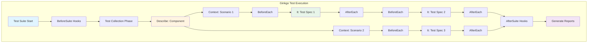

### **Gomega Matchers**

Gomega provides expressive assertion matchers:

```go
// Common Gomega matchers used in Kubernetes tests

// Equality
Expect(pod.Name).To(Equal("test-pod"))
Expect(pod.Status.Phase).To(BeEquivalentTo(v1.PodRunning))

// Nil checking
Expect(err).NotTo(HaveOccurred())
Expect(pod).NotTo(BeNil())

// Collection matchers
Expect(pods).To(HaveLen(3))
Expect(pods).To(ContainElement(expectedPod))
Expect(labels).To(HaveKey("app"))
Expect(labels).To(HaveKeyWithValue("app", "nginx"))

// Numeric matchers
Expect(replicas).To(BeNumerically(">=", 1))
Expect(readyReplicas).To(BeNumerically("==", totalReplicas))

// String matchers
Expect(output).To(ContainSubstring("success"))
Expect(name).To(MatchRegexp("^test-.*"))

// Eventually (polling)
Eventually(func() int {
    pods, _ := getPods()
    return len(pods)
}, timeout, interval).Should(Equal(3))

// Consistently (stability check)
Consistently(func() v1.PodPhase {
    pod, _ := getPod()
    return pod.Status.Phase
}, duration, interval).Should(Equal(v1.PodRunning))
```

### **Test Decorators and Labels**

```go
// Test categorization and filtering

// Conformance tests - required for certification
var _ = SIGDescribe("Pods", func() {
    It("should create pod [Conformance]", func() {
        // Test implementation
    })
})

// Feature gate tests
var _ = SIGDescribe("Job tracking", Feature(features.JobTrackingWithFinalizers), func() {
    // Only run when feature gate is enabled
})

// Flaky test marker
var _ = SIGDescribe("Network", func() {
    It("should handle connection drops [Flaky]", func() {
        // Known flaky test
    })
})

// Slow test marker
var _ = SIGDescribe("Storage", func() {
    It("should expand volume [Slow]", func() {
        // Long-running test
    })
})

// Serial execution (not parallel)
var _ = SIGDescribe("Cluster upgrade", func() {
    It("should upgrade all nodes [Serial]", func() {
        // Must run alone
    })
})

// SIG ownership
var _ = SIGDescribe("Deployment", func() {
    // Owned by SIG Apps
})
```

### **Focus and Skip**

```go
// Focus on specific tests during development
FIt("should test this specific case", func() {
    // Only this test runs
})

FDescribe("Focus on this suite", func() {
    // Only tests in this Describe run
})

// Skip tests temporarily
XIt("should test this but skip for now", func() {
    // Skipped
})

XDescribe("Skip this entire suite", func() {
    // All tests skipped
})
```

━━━━━━━━━━━━━━━━━━━━━━━━━━━━━━━━━━━━━━━━━━━━━━━━━━━━━━━━━━━━━━━━━━━━━━━━━━━━━━

## **🔄 Test Execution Workflows**

### **Test Execution Architecture**

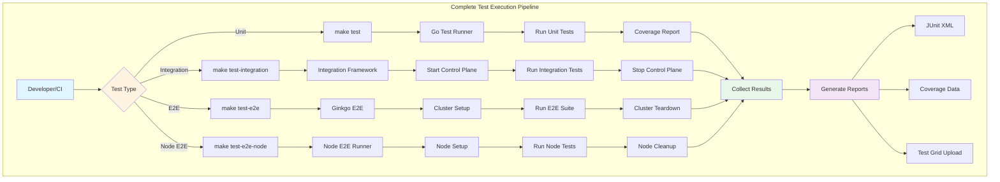

### **Test Execution Commands**

```bash
# Unit tests
make test                           # All unit tests
make test WHAT=./pkg/kubelet/...   # Specific package
make test-unit-verbose              # Verbose output

# Integration tests
make test-integration               # All integration tests
make test-integration WHAT=./test/integration/apiserver/...

# E2E tests
make test-e2e                       # Build and run E2E
hack/ginkgo-e2e.sh                 # Direct E2E runner

# E2E with filters
hack/ginkgo-e2e.sh --ginkgo.focus="Deployment"  # Focus on Deployment tests
hack/ginkgo-e2e.sh --ginkgo.skip="Slow"        # Skip slow tests

# Node E2E
make test-e2e-node                 # Local node E2E
test/e2e_node/runner/remote/run_remote.go --hosts=<node-ip>  # Remote

# Conformance tests
make test-e2e-conformance          # Conformance suite only

# Specific test suites
hack/ginkgo-e2e.sh --ginkgo.focus="\[Conformance\]"
hack/ginkgo-e2e.sh --ginkgo.focus="\[sig-apps\]"
hack/ginkgo-e2e.sh --ginkgo.focus="\[sig-network\]"
```

### **CI/CD Integration**

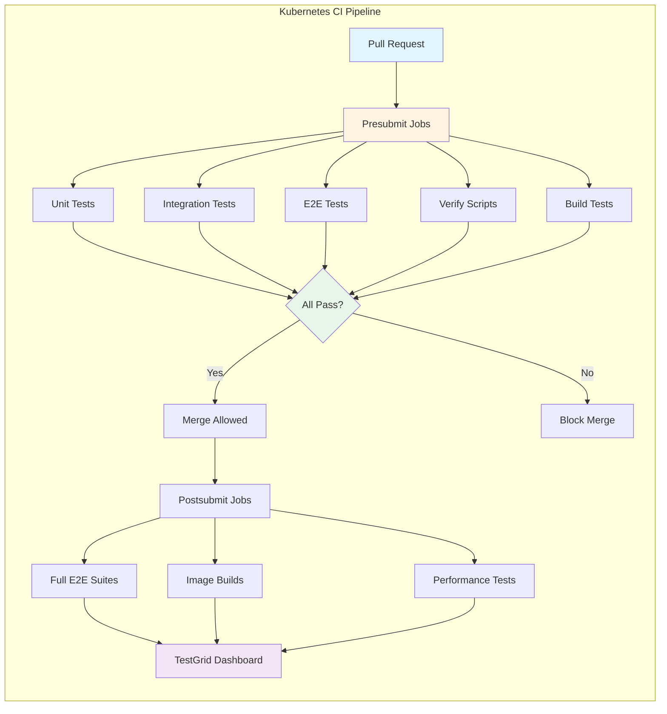

### **Test Grid and Reporting**

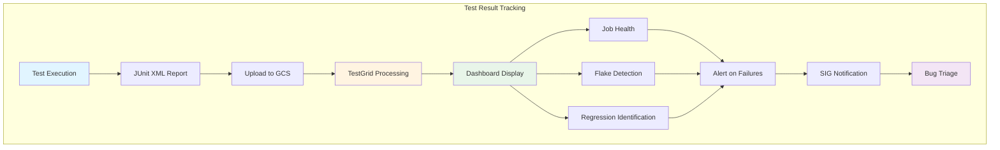

━━━━━━━━━━━━━━━━━━━━━━━━━━━━━━━━━━━━━━━━━━━━━━━━━━━━━━━━━━━━━━━━━━━━━━━━━━━━━━

## **🎯 Conformance Testing**

### **Conformance Test Suite**

Conformance tests define the minimum requirements for a Kubernetes distribution to be considered conformant.

**Location**: `/Users/sureshscribnar/Documents/Projects/opensource/kubernetes/test/conformance/`

### **Conformance Architecture**

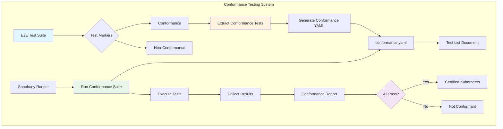

### **Conformance Test Categories**

| Category | Test Count | Description |
|----------|----------:|-------------|
| **API Machinery** | 80+ | Core API operations, discovery, watch |
| **Apps** | 60+ | Deployments, StatefulSets, DaemonSets |
| **Auth** | 40+ | ServiceAccounts, RBAC basics |
| **Networking** | 50+ | Services, DNS, basic connectivity |
| **Storage** | 45+ | PersistentVolumes, basic volume types |
| **Scheduling** | 35+ | Basic pod scheduling, node selection |
| **Node** | 30+ | Pod lifecycle, container basics |

### **Conformance Test Marking**

```go
// File: test/e2e/apps/deployment.go

// [Conformance] tag marks test as required for conformance
var _ = SIGDescribe("Deployment", func() {
    f := framework.NewDefaultFramework("deployment")

    It("should create and stop a working application [Conformance]", func() {
        // This test is part of conformance suite
        // Must pass for Kubernetes certification

        By("Creating a deployment")
        deployment := createDeployment(f, deploymentSpec)

        By("Waiting for deployment to complete")
        err := waitForDeploymentComplete(deployment)
        Expect(err).NotTo(HaveOccurred())

        By("Verifying all replicas are ready")
        verifyReplicasReady(deployment)

        By("Deleting the deployment")
        err = deleteDeployment(f, deployment.Name)
        Expect(err).NotTo(HaveOccurred())
    })

    It("should support advanced deployment strategies", func() {
        // Not marked [Conformance] - optional feature
    })
})
```

### **Generating Conformance Documentation**

```bash
# Extract conformance tests and generate docs
hack/update-conformance-docs.sh

# Generates:
# - test/conformance/testdata/conformance.yaml
# - Conformance test list in docs/

# Run only conformance tests
hack/ginkgo-e2e.sh --ginkgo.focus="\[Conformance\]"
```

━━━━━━━━━━━━━━━━━━━━━━━━━━━━━━━━━━━━━━━━━━━━━━━━━━━━━━━━━━━━━━━━━━━━━━━━━━━━━━

## **🐛 Fuzz Testing**

### **Fuzz Test Infrastructure**

**Location**: `/Users/sureshscribnar/Documents/Projects/opensource/kubernetes/test/fuzz/`

### **Fuzz Testing Architecture**

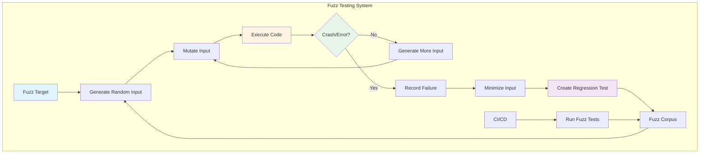

### **Fuzz Test Example**

```go
// Fuzz testing for API encoding/decoding
// File: test/fuzz/api_codec_fuzz.go

func FuzzAPIDecode(f *testing.F) {
    scheme := runtime.NewScheme()
    corev1.AddToScheme(scheme)

    codec := serializer.NewCodecFactory(scheme).UniversalDeserializer()

    f.Fuzz(func(t *testing.T, data []byte) {
        obj, _, err := codec.Decode(data, nil, nil)
        if err != nil {
            // Error is acceptable for random input
            return
        }

        // If decode succeeds, validate the object
        if obj != nil {
            // Should not panic on valid objects
            _ = obj.GetObjectKind()
        }
    })
}
```

━━━━━━━━━━━━━━━━━━━━━━━━━━━━━━━━━━━━━━━━━━━━━━━━━━━━━━━━━━━━━━━━━━━━━━━━━━━━━━

## **📦 Test Fixtures and Data**

### **Test Fixtures Structure**

**Location**: `/Users/sureshscribnar/Documents/Projects/opensource/kubernetes/test/fixtures/`

```
fixtures/
├── pkg/                    # Package test fixtures
│   ├── kubectl/            #   kubectl test data
│   │   ├── apply/          #     Apply test cases
│   │   ├── diff/           #     Diff test cases
│   │   └── edit/           #     Edit test cases
│   └── volume/             #   Volume test data
│
└── doc-yaml/               # YAML documentation fixtures
    └── [example YAMLs]
```

### **Fixture Usage Pattern**

```go
// File: test/integration/kubectl/apply_test.go

func TestApplyWithFixtures(t *testing.T) {
    testCases := []struct {
        name     string
        fixture  string
        expected string
    }{
        {
            name:     "apply deployment",
            fixture:  "test/fixtures/pkg/kubectl/apply/deployment.yaml",
            expected: "deployment.apps/test created",
        },
        {
            name:     "apply service",
            fixture:  "test/fixtures/pkg/kubectl/apply/service.yaml",
            expected: "service/test created",
        },
    }

    for _, tc := range testCases {
        t.Run(tc.name, func(t *testing.T) {
            data, err := os.ReadFile(tc.fixture)
            require.NoError(t, err)

            output := applyYAML(t, data)
            assert.Contains(t, output, tc.expected)
        })
    }
}
```

━━━━━━━━━━━━━━━━━━━━━━━━━━━━━━━━━━━━━━━━━━━━━━━━━━━━━━━━━━━━━━━━━━━━━━━━━━━━━━

## **🎪 Kubemark - Hollow Node Testing**

### **Kubemark Architecture**

Kubemark is a performance testing tool that runs "hollow" nodes - nodes that simulate real kubelet/kube-proxy without actually running containers.

**Location**: `/Users/sureshscribnar/Documents/Projects/opensource/kubernetes/test/kubemark/`

### **Hollow Node Concept**

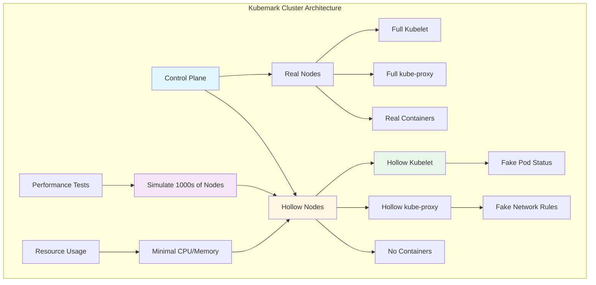

### **Hollow Kubelet Implementation**

```go
// File: test/kubemark/hollow_kubelet.go

// HollowKubelet simulates a kubelet without running real containers
type HollowKubelet struct {
    KubeletConfiguration

    // Fake container runtime
    fakeRuntime *fake.FakeRuntime

    // Fake volume plugins
    fakeVolumePlugins map[string]volume.VolumePlugin
}

func (hk *HollowKubelet) Run() {
    // Start kubelet without real container operations
    // Report fake pod status to API server
    // Respond to API requests but don't execute them

    for {
        // Sync loop
        pods := hk.fetchPods()
        for _, pod := range pods {
            // Mark all pods as running immediately
            hk.updatePodStatus(pod, v1.PodRunning)
        }
        time.Sleep(10 * time.Second)
    }
}
```

### **Kubemark Use Cases**

| Use Case | Description | Benefits |
|----------|-------------|----------|
| **Scalability Testing** | Test control plane with 1000s of nodes | Find scalability bottlenecks |
| **API Server Load** | Generate realistic API traffic | Stress test API server |
| **Scheduler Performance** | Test scheduling at scale | Optimize scheduler |
| **Controller Performance** | Test controllers with many objects | Find controller bottlenecks |
| **etcd Load Testing** | Stress test etcd with many writes | Validate etcd configuration |

━━━━━━━━━━━━━━━━━━━━━━━━━━━━━━━━━━━━━━━━━━━━━━━━━━━━━━━━━━━━━━━━━━━━━━━━━━━━━━

## **🔍 Test Commands (test/cmd)**

### **CLI Command Tests**

**Location**: `/Users/sureshscribnar/Documents/Projects/opensource/kubernetes/test/cmd/`

The test/cmd directory contains comprehensive command-line interface tests for all Kubernetes binaries.

```
cmd/
├── kubectl/                # kubectl command tests
│   ├── apply.sh            #   kubectl apply tests
│   ├── create.sh           #   kubectl create tests
│   ├── delete.sh           #   kubectl delete tests
│   ├── diff.sh             #   kubectl diff tests
│   ├── get.sh              #   kubectl get tests
│   ├── patch.sh            #   kubectl patch tests
│   ├── run.sh              #   kubectl run tests
│   └── [20+ more tests]
│
├── kubeadm/                # kubeadm command tests
│   ├── kubeadm-init.sh     #   kubeadm init tests
│   ├── kubeadm-join.sh     #   kubeadm join tests
│   └── kubeadm-upgrade.sh  #   kubeadm upgrade tests
│
└── [37 more directories]   # Other command tests
```

### **kubectl Command Test Pattern**

```bash
# File: test/cmd/kubectl/apply.sh

# Setup test environment
setup_test() {
    export KUBE_TEST_DIR="$(mktemp -d)"
    start_local_cluster
}

# Test kubectl apply
test_apply_basic() {
    # Create a deployment
    kubectl apply -f - <<EOF
apiVersion: apps/v1
kind: Deployment
metadata:
  name: test-deployment
spec:
  replicas: 3
  selector:
    matchLabels:
      app: test
  template:
    metadata:
      labels:
        app: test
    spec:
      containers:
      - name: nginx
        image: nginx:latest
EOF

    # Verify creation
    output=$(kubectl get deployment test-deployment -o jsonpath='{.spec.replicas}')
    assert_equal "3" "$output"

    # Update the deployment
    kubectl apply -f - <<EOF
apiVersion: apps/v1
kind: Deployment
metadata:
  name: test-deployment
spec:
  replicas: 5
  selector:
    matchLabels:
      app: test
  template:
    metadata:
      labels:
        app: test
    spec:
      containers:
      - name: nginx
        image: nginx:latest
EOF

    # Verify update
    output=$(kubectl get deployment test-deployment -o jsonpath='{.spec.replicas}')
    assert_equal "5" "$output"
}

# Run test
setup_test
test_apply_basic
cleanup_test
```

━━━━━━━━━━━━━━━━━━━━━━━━━━━━━━━━━━━━━━━━━━━━━━━━━━━━━━━━━━━━━━━━━━━━━━━━━━━━━━

## **📊 Test Metrics and Instrumentation**

### **Instrumentation Test Structure**

**Location**: `/Users/sureshscribnar/Documents/Projects/opensource/kubernetes/test/instrumentation/`

```
instrumentation/
├── testdata/               # Instrumentation test data
│   ├── metrics/            #   Metrics expectations
│   └── logs/               #   Log format expectations
│
├── decode_metric.go        # Metric parsing utilities
└── stability.go            # Stability checking
```

### **Metrics Testing Architecture**

```mermaid
graph TB
    subgraph "Metrics Testing System"
        A[Component] --> B[Expose Metrics]
        B --> C[/metrics Endpoint]

        D[Instrumentation Test] --> E[Scrape Metrics]
        E --> C

        E --> F[Parse Prometheus Format]
        F --> G[Validate Metrics]

        G --> H1[Check Stability]
        G --> H2[Check Labels]
        G --> H3[Check Values]

        H1 --> I{Stable?}
        H2 --> I
        H3 --> I

        I -->|Yes| J[Pass]
        I -->|No| K[Fail]

        L[Expected Metrics] --> M[testdata/metrics/]
        M --> G
    end

    style A fill:#e1f5ff
    style E fill:#fff4e1
    style G fill:#e8f5e9
    style I fill:#f3e5f5
```

### **Metric Stability Testing**

```go
// File: test/instrumentation/stability.go

type MetricStability string

const (
    STABLE MetricStability = "STABLE"
    ALPHA  MetricStability = "ALPHA"
    BETA   MetricStability = "BETA"
)

// ValidateMetricStability ensures metrics maintain stability guarantees
func ValidateMetricStability(t *testing.T, component string) {
    // Scrape metrics
    metrics := scrapeMetrics(component)

    // Load expected metrics
    expected := loadExpectedMetrics(component)

    for _, metric := range expected {
        actual := findMetric(metrics, metric.Name)

        if metric.Stability == STABLE {
            // Stable metrics must exist with same signature
            require.NotNil(t, actual, "Stable metric %s must exist", metric.Name)
            require.Equal(t, metric.Labels, actual.Labels,
                "Stable metric %s labels must not change", metric.Name)
        }
    }
}
```

━━━━━━━━━━━━━━━━━━━━━━━━━━━━━━━━━━━━━━━━━━━━━━━━━━━━━━━━━━━━━━━━━━━━━━━━━━━━━━

## **🎓 Best Practices**

### **Writing E2E Tests**

```go
// ✅ GOOD: Well-structured E2E test
var _ = SIGDescribe("MyFeature", func() {
    f := framework.NewDefaultFramework("my-feature")

    It("should do something useful [Conformance]", func() {
        // Use descriptive By() statements
        By("Creating test resources")
        pod := createPod(f)

        By("Waiting for pod to be ready")
        err := waitForPodReady(pod)
        Expect(err).NotTo(HaveOccurred())

        By("Verifying expected behavior")
        output := execInPod(pod, "echo hello")
        Expect(output).To(Equal("hello\n"))

        By("Cleaning up resources")
        deletePod(f, pod.Name)
    })
})

// ❌ BAD: Unclear test with no structure
var _ = SIGDescribe("MyFeature", func() {
    It("test", func() {
        pod := createPod(nil)
        time.Sleep(30 * time.Second)  // Don't use sleep!
        output := execInPod(pod, "echo hello")
        if output != "hello\n" {      // Use Gomega matchers!
            panic("failed")
        }
        // No cleanup!
    })
})
```

### **Integration Test Guidelines**

```go
// ✅ GOOD: Proper integration test
func TestDeploymentController(t *testing.T) {
    // Start control plane
    server := kubeapiservertesting.StartTestServerOrDie(t, nil, nil, framework.SharedEtcd())
    defer server.TearDownFn()

    // Create client
    client := clientset.NewForConfigOrDie(server.ClientConfig)

    // Start controllers
    ctx, cancel := context.WithCancel(context.Background())
    defer cancel()

    cm := startControllers(ctx, server.ClientConfig)
    defer cm.Stop()

    // Test with proper waiting
    deployment := createDeployment(client)

    err := wait.PollImmediate(100*time.Millisecond, 30*time.Second, func() (bool, error) {
        d, err := client.AppsV1().Deployments("default").Get(ctx, deployment.Name, metav1.GetOptions{})
        if err != nil {
            return false, err
        }
        return d.Status.ReadyReplicas == 3, nil
    })
    require.NoError(t, err)
}
```

### **Test Performance**

```bash
# Run tests in parallel
ginkgo -p -nodes=4 test/e2e/...

# Focus on specific tests during development
ginkgo -focus="Deployment" test/e2e/apps/

# Skip slow tests for quick iteration
ginkgo -skip="Slow" test/e2e/...

# Run with verbose output for debugging
ginkgo -v test/e2e/...
```

### **Test Debugging**

```go
// Add debug logging
framework.Logf("Debug: pod status = %+v", pod.Status)

// Use ginkgo debug
It("should work", func() {
    By("Step 1")
    // If this fails, By() shows which step failed

    By("Step 2")
    // Clear progression of test steps
})

// Preserve failed test artifacts
if t.Failed() {
    // Dump pod logs
    logs := getPodLogs(pod)
    framework.Logf("Pod logs:\n%s", logs)

    // Dump events
    events := getEvents(namespace)
    framework.Logf("Events:\n%+v", events)
}
```

━━━━━━━━━━━━━━━━━━━━━━━━━━━━━━━━━━━━━━━━━━━━━━━━━━━━━━━━━━━━━━━━━━━━━━━━━━━━━━

## **🔧 Troubleshooting**

### **Common Test Failures**

| Issue | Cause | Solution |
|-------|-------|----------|
| **Timeout waiting for pod** | Slow image pull | Use pre-pulled test images |
| **Flaky network tests** | Race conditions | Add proper synchronization |
| **Resource quota exceeded** | Leaked resources | Improve cleanup |
| **etcd connection errors** | Port conflicts | Use unique ports per test |
| **API server not ready** | Startup race | Add readiness checks |

### **Debugging E2E Failures**

```bash
# Run single test with maximum verbosity
hack/ginkgo-e2e.sh \
    --ginkgo.focus="specific test name" \
    --ginkgo.v \
    --kubectl-path=/usr/local/bin/kubectl

# Preserve cluster after failure
export DELETE_NAMESPACE=false
export CLEANUP_CLUSTER=false
hack/ginkgo-e2e.sh --ginkgo.focus="failing test"

# Collect cluster state
kubectl describe pods --all-namespaces > pods.txt
kubectl describe nodes > nodes.txt
kubectl get events --all-namespaces > events.txt

# Check test logs
cat /tmp/ginkgo-e2e.log
```

### **Integration Test Debugging**

```bash
# Run with race detector
go test -race ./test/integration/...

# Run with CPU profiling
go test -cpuprofile=cpu.prof ./test/integration/apiserver/...

# Run with memory profiling
go test -memprofile=mem.prof ./test/integration/scheduler/...

# Analyze profiles
go tool pprof cpu.prof
```

━━━━━━━━━━━━━━━━━━━━━━━━━━━━━━━━━━━━━━━━━━━━━━━━━━━━━━━━━━━━━━━━━━━━━━━━━━━━━━

## **📚 Navigation**

### **Related Documentation**

| Document | Description |
|----------|-------------|
| **[01-repository-overview.md](01-repository-overview.md)** | Complete repository structure |
| **[02-cmd-binaries.md](02-cmd-binaries.md)** | Binary commands and entry points |
| **[03-pkg-implementation.md](03-pkg-implementation.md)** | Core implementation packages |
| **[07-hack-tools.md](07-hack-tools.md)** | Development and build scripts |
| **[08-build-system.md](08-build-system.md)** | Build infrastructure |

### **External Resources**

- [E2E Testing Guide](https://github.com/kubernetes/community/blob/master/contributors/devel/sig-testing/e2e-tests.md)
- [Ginkgo Documentation](https://onsi.github.io/ginkgo/)
- [TestGrid Dashboard](https://testgrid.k8s.io/)
- [Conformance Tests](https://github.com/cncf/k8s-conformance)

━━━━━━━━━━━━━━━━━━━━━━━━━━━━━━━━━━━━━━━━━━━━━━━━━━━━━━━━━━━━━━━━━━━━━━━━━━━━━━

## **✅ Summary**

The Kubernetes test infrastructure is a comprehensive, multi-layered testing ecosystem that ensures reliability and quality across all components:

- **E2E Tests**: Complete user workflow validation with 25+ test categories
- **Integration Tests**: Component interaction testing with 60+ suites
- **Node E2E**: Isolated kubelet and node feature testing
- **Ginkgo/Gomega**: BDD-style test framework for expressive tests
- **Test Images**: 30+ specialized container images for various test scenarios
- **Conformance**: Certification test suite for Kubernetes distributions
- **CI/CD Integration**: Automated testing in presubmit and postsubmit jobs
- **Kubemark**: Performance testing with hollow nodes at scale

This infrastructure enables Kubernetes to maintain high quality standards while rapidly evolving.

---

**Document Version**: 1.0
**Last Updated**: 2025-11-16
**Maintainer**: Kubernetes SIG Testing
