# **KUBERNETES HACK TOOLS AND AUTOMATION**

**Development Scripts, Code Generation, and Build Automation**

━━━━━━━━━━━━━━━━━━━━━━━━━━━━━━━━━━━━━━━━━━━━━━━━━━━━━━━━━━━━━━━━━━━━━━━━━━━━━━

## **📊 Hack Directory At A Glance**

### **Overview**

The `hack/` directory is the automation and development tooling hub for Kubernetes. It contains over 100 shell scripts that handle code generation, verification, testing, building, and development workflows. These scripts are essential for maintaining code quality and consistency across the massive Kubernetes codebase.

| Aspect | Details |
|--------|---------|
| **Location** | `/Users/sureshscribnar/Documents/Projects/opensource/kubernetes/hack/` |
| **Total Scripts** | 96+ shell scripts |
| **Shared Libraries** | 9 library files in hack/lib/ |
| **Make Rules** | 10 make rule implementations |
| **Primary Language** | Bash with Go tools |
| **Key Functions** | Code generation, verification, testing, building |
| **Maintenance** | ✅ ACTIVE - Core development infrastructure |

### **Hack Directory Structure**

```
hack/
├── Core Workflow Scripts (20+)
│   ├── verify-all.sh           # ✅ Run all verification checks
│   ├── update-all.sh           # ✅ Update all generated code
│   ├── test-go.sh              # ✅ Run Go unit tests
│   ├── build-go.sh             # ✅ Build Go binaries
│   └── [16 more workflows]
│
├── Code Generation (25+)
│   ├── update-codegen.sh       # ✅ Generate client/informer/lister
│   ├── update-openapi-spec.sh  # ✅ Generate OpenAPI specs
│   ├── update-generated-protobuf.sh  # ✅ Generate protobuf
│   ├── update-swagger-spec.sh  # ✅ Generate Swagger docs
│   └── [21 more generators]
│
├── Verification Scripts (30+)
│   ├── verify-boilerplate.sh   # ✅ Check license headers
│   ├── verify-gofmt.sh         # ✅ Check Go formatting
│   ├── verify-golangci-lint.sh # ✅ Run linters
│   ├── verify-imports.sh       # ✅ Check import order
│   └── [26 more verifiers]
│
├── lib/                        # ✅ Shared shell libraries
│   ├── golang.sh               #    Go build utilities
│   ├── etcd.sh                 #    etcd management
│   ├── init.sh                 #    Initialization
│   ├── logging.sh              #    Logging functions
│   ├── test.sh                 #    Test utilities
│   ├── util.sh                 #    General utilities
│   └── version.sh              #    Version management
│
├── make-rules/                 # ✅ Make rule implementations
│   ├── build.sh                #    Build rules
│   ├── test.sh                 #    Test rules
│   ├── verify.sh               #    Verify rules
│   ├── update.sh               #    Update rules
│   └── [6 more rules]
│
├── tools/                      # ✅ Tool binaries and configs
│   ├── go.mod                  #    Tool dependencies
│   └── tools.go                #    Tool imports
│
├── boilerplate/                # ✅ License header templates
│   └── boilerplate.*.txt       #    Language-specific headers
│
├── conformance/                # ✅ Conformance test tools
│   └── extract.go              #    Extract conformance tests
│
├── e2e-internal/               # ✅ E2E test utilities
│   └── e2e-suite.sh            #    E2E suite runner
│
├── jenkins/                    # 🚧 CI/CD integration (legacy)
│   └── [jenkins scripts]
│
└── [40+ additional scripts]
```

━━━━━━━━━━━━━━━━━━━━━━━━━━━━━━━━━━━━━━━━━━━━━━━━━━━━━━━━━━━━━━━━━━━━━━━━━━━━━━

## **🔄 Core Workflow Scripts**

### **Master Verification and Update Scripts**

These scripts orchestrate multiple related tasks in the correct order.

### **verify-all.sh - Complete Verification**

**Purpose**: Run all verification checks to ensure code quality and consistency.

**Location**: `/Users/sureshscribnar/Documents/Projects/opensource/kubernetes/hack/verify-all.sh`

```bash
#!/usr/bin/env bash

# verify-all.sh runs all verification scripts
# This is the master verification script run in CI

set -o errexit
set -o nounset
set -o pipefail

KUBE_ROOT=$(dirname "${BASH_SOURCE[0]}")/..
source "${KUBE_ROOT}/hack/lib/init.sh"

# List of all verification scripts
VERIFY_SCRIPTS=(
  "verify-boilerplate.sh"
  "verify-gofmt.sh"
  "verify-govet.sh"
  "verify-golangci-lint.sh"
  "verify-imports.sh"
  "verify-staging-client-go.sh"
  "verify-codegen.sh"
  "verify-generated-files.sh"
  "verify-openapi-spec.sh"
  "verify-swagger-spec.sh"
  "verify-typecheck.sh"
  "verify-vendor.sh"
  "verify-dependencies.sh"
  "verify-flags.sh"
  # ... and many more
)

# Run all verifiers
failed=()
for script in "${VERIFY_SCRIPTS[@]}"; do
  echo "Running ${script}..."
  if ! "${KUBE_ROOT}/hack/${script}"; then
    failed+=("${script}")
  fi
done

# Report results
if [[ ${#failed[@]} -eq 0 ]]; then
  echo "All verification passed!"
  exit 0
else
  echo "Verification failed for: ${failed[*]}"
  exit 1
fi
```

### **Verification Workflow**

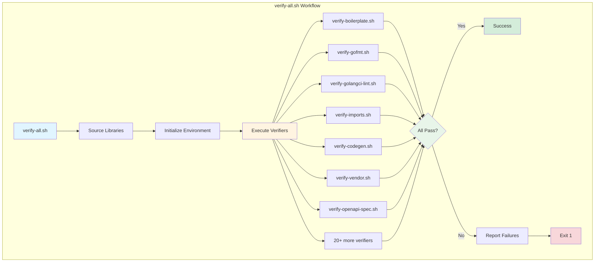

### **update-all.sh - Complete Code Generation**

**Purpose**: Regenerate all auto-generated code and documentation.

**Location**: `/Users/sureshscribnar/Documents/Projects/opensource/kubernetes/hack/update-all.sh`

```bash
#!/usr/bin/env bash

# update-all.sh regenerates all auto-generated code
# Run this after modifying API types or code generation config

set -o errexit
set -o nounset
set -o pipefail

KUBE_ROOT=$(dirname "${BASH_SOURCE[0]}")/..
source "${KUBE_ROOT}/hack/lib/init.sh"

# Update scripts in dependency order
UPDATE_SCRIPTS=(
  "update-vendor.sh"              # Update vendor dependencies first
  "update-codegen.sh"             # Generate client code
  "update-generated-protobuf.sh"  # Generate protobuf
  "update-openapi-spec.sh"        # Generate OpenAPI
  "update-swagger-spec.sh"        # Generate Swagger
  "update-generated-docs.sh"      # Generate docs
  "update-api-reference-docs.sh"  # Generate API reference
  # ... and more
)

for script in "${UPDATE_SCRIPTS[@]}"; do
  echo "Running ${script}..."
  "${KUBE_ROOT}/hack/${script}"
done

echo "All updates complete!"
```

### **Update Workflow**

```mermaid
graph TB
    subgraph "update-all.sh Workflow"
        A[update-all.sh] --> B[Initialize]

        B --> C[Sequential Execution]
        C --> D1[update-vendor.sh]
        D1 --> D2[update-codegen.sh]
        D2 --> D3[update-generated-protobuf.sh]
        D3 --> D4[update-openapi-spec.sh]
        D4 --> D5[update-swagger-spec.sh]
        D5 --> D6[update-generated-docs.sh]
        D6 --> D7[10+ more updates]

        D7 --> E[All Code Updated]

        F[Developer] --> G[Modify API Types]
        G --> A
        E --> H[Verify Changes]
        H --> I[Commit Generated Code]
    end

    style A fill:#e1f5ff
    style C fill:#fff4e1
    style E fill:#e8f5e9
    style I fill:#d4edda
```

━━━━━━━━━━━━━━━━━━━━━━━━━━━━━━━━━━━━━━━━━━━━━━━━━━━━━━━━━━━━━━━━━━━━━━━━━━━━━━

## **🏗️ Build Scripts**

### **build-go.sh - Go Binary Builder**

**Purpose**: Build Kubernetes Go binaries with proper configuration.

**Location**: `/Users/sureshscribnar/Documents/Projects/opensource/kubernetes/hack/build-go.sh`

```bash
#!/usr/bin/env bash

# build-go.sh builds Go binaries for Kubernetes
# Supports cross-compilation and custom build flags

set -o errexit
set -o nounset
set -o pipefail

KUBE_ROOT=$(dirname "${BASH_SOURCE[0]}")/..
source "${KUBE_ROOT}/hack/lib/init.sh"
source "${KUBE_ROOT}/hack/lib/golang.sh"

# Parse arguments
KUBE_BUILD_PLATFORMS="${KUBE_BUILD_PLATFORMS:-}"
KUBE_BUILD_TARGETS="${KUBE_BUILD_TARGETS:-}"

# Set up build environment
kube::golang::setup_env

# Detect host platform if not specified
if [[ -z "${KUBE_BUILD_PLATFORMS}" ]]; then
  KUBE_BUILD_PLATFORMS="$(kube::golang::host_platform)"
fi

# Build specified targets or all binaries
if [[ -z "${KUBE_BUILD_TARGETS}" ]]; then
  KUBE_BUILD_TARGETS=(
    cmd/kube-apiserver
    cmd/kube-controller-manager
    cmd/kube-scheduler
    cmd/kubelet
    cmd/kube-proxy
    cmd/kubectl
    # ... all binaries
  )
fi

# Execute build
kube::golang::build_binaries "${KUBE_BUILD_TARGETS[@]}"

# Copy binaries to output directory
kube::golang::place_bins
```

### **Build Process Flow**

```mermaid
graph TB
    subgraph "build-go.sh Process"
        A[build-go.sh] --> B[Source Libraries]
        B --> C[Parse Arguments]

        C --> D{Target Specified?}
        D -->|No| E[Build All Binaries]
        D -->|Yes| F[Build Specific Targets]

        E --> G[Detect Platform]
        F --> G

        G --> H[Setup Build Environment]
        H --> I[Set Build Flags]

        I --> J[CGO Settings]
        J --> K[LDFLAGS for Version]
        K --> L[GOFLAGS]

        L --> M[Execute Go Build]
        M --> N[For Each Target]

        N --> O[go build]
        O --> P[Binary Output]

        P --> Q[Copy to _output/]
        Q --> R[Set Permissions]
        R --> S[Build Complete]
    end

    style A fill:#e1f5ff
    style M fill:#fff4e1
    style O fill:#e8f5e9
    style S fill:#d4edda
```

### **build-cross.sh - Cross-Compilation**

**Purpose**: Build binaries for multiple platforms simultaneously.

```bash
#!/usr/bin/env bash

# build-cross.sh builds binaries for all supported platforms

PLATFORMS=(
  "linux/amd64"
  "linux/arm64"
  "linux/arm"
  "linux/ppc64le"
  "linux/s390x"
  "darwin/amd64"
  "darwin/arm64"
  "windows/amd64"
)

for platform in "${PLATFORMS[@]}"; do
  KUBE_BUILD_PLATFORMS="${platform}" hack/build-go.sh
done
```

### **Cross-Compilation Architecture**

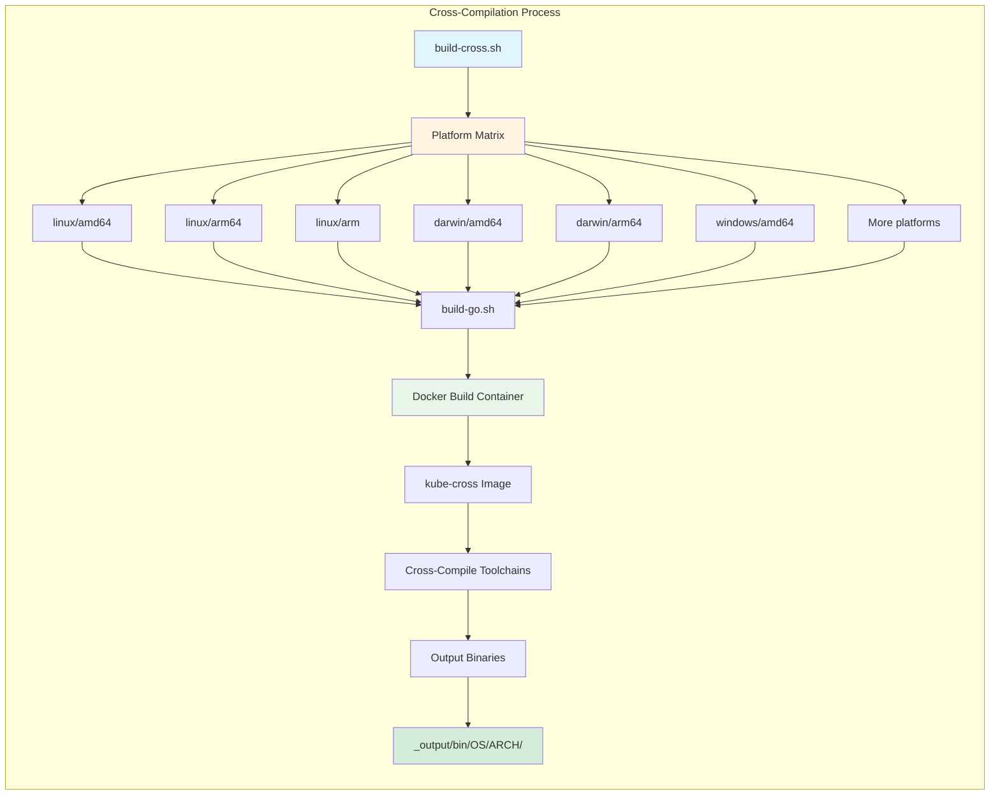

### **local-up-cluster.sh - Local Development Cluster**

**Purpose**: Start a complete Kubernetes cluster locally for development.

**Location**: `/Users/sureshscribnar/Documents/Projects/opensource/kubernetes/hack/local-up-cluster.sh`

```bash
#!/usr/bin/env bash

# local-up-cluster.sh starts a local Kubernetes cluster
# Runs all components from source for development

set -o errexit
set -o nounset
set -o pipefail

KUBE_ROOT=$(dirname "${BASH_SOURCE[0]}")/..
source "${KUBE_ROOT}/hack/lib/init.sh"

# Configuration
API_HOST=${API_HOST:-localhost}
API_PORT=${API_PORT:-8080}
KUBELET_HOST=${KUBELET_HOST:-127.0.0.1}
KUBELET_PORT=${KUBELET_PORT:-10250}

# Start etcd
echo "Starting etcd..."
kube::etcd::start

# Start API server
echo "Starting kube-apiserver..."
"${KUBE_OUTPUT_HOSTBIN}/kube-apiserver" \
  --etcd-servers=http://127.0.0.1:2379 \
  --service-cluster-ip-range=10.0.0.0/16 \
  --bind-address=0.0.0.0 \
  --insecure-port="${API_PORT}" \
  &> /tmp/kube-apiserver.log &

# Wait for API server
kube::util::wait_for_url "http://${API_HOST}:${API_PORT}/healthz"

# Start controller manager
echo "Starting kube-controller-manager..."
"${KUBE_OUTPUT_HOSTBIN}/kube-controller-manager" \
  --master="http://${API_HOST}:${API_PORT}" \
  &> /tmp/kube-controller-manager.log &

# Start scheduler
echo "Starting kube-scheduler..."
"${KUBE_OUTPUT_HOSTBIN}/kube-scheduler" \
  --master="http://${API_HOST}:${API_PORT}" \
  &> /tmp/kube-scheduler.log &

# Start kubelet
echo "Starting kubelet..."
"${KUBE_OUTPUT_HOSTBIN}/kubelet" \
  --kubeconfig=/tmp/kubeconfig \
  --pod-manifest-path=/tmp/manifests \
  &> /tmp/kubelet.log &

# Start kube-proxy
echo "Starting kube-proxy..."
"${KUBE_OUTPUT_HOSTBIN}/kube-proxy" \
  --master="http://${API_HOST}:${API_PORT}" \
  &> /tmp/kube-proxy.log &

echo "Cluster started successfully!"
echo "API server: http://${API_HOST}:${API_PORT}"
```

### **Local Cluster Startup Flow**

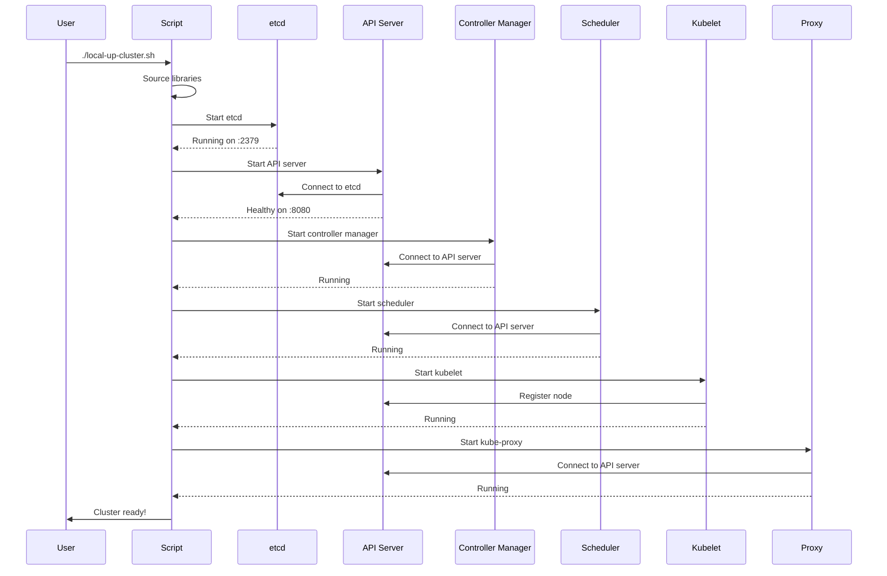

━━━━━━━━━━━━━━━━━━━━━━━━━━━━━━━━━━━━━━━━━━━━━━━━━━━━━━━━━━━━━━━━━━━━━━━━━━━━━━

## **🧬 Code Generation Scripts**

### **Code Generation Overview**

Kubernetes heavily uses code generation to maintain consistency and reduce boilerplate. Multiple generators create different types of code.

### **update-codegen.sh - Client Code Generation**

**Purpose**: Generate client libraries, informers, and listers for Kubernetes APIs.

**Location**: `/Users/sureshscribnar/Documents/Projects/opensource/kubernetes/hack/update-codegen.sh`

```bash
#!/usr/bin/env bash

# update-codegen.sh generates:
# - Clientsets (typed clients)
# - Listers (read-only indexers)
# - Informers (watch-based caches)

set -o errexit
set -o nounset
set -o pipefail

KUBE_ROOT=$(dirname "${BASH_SOURCE[0]}")/..
source "${KUBE_ROOT}/hack/lib/init.sh"

# Run code generators
"${KUBE_ROOT}/hack/update-codegen-clients.sh"
"${KUBE_ROOT}/hack/update-codegen-internal.sh"

echo "Codegen complete"
```

### **Code Generation Architecture**

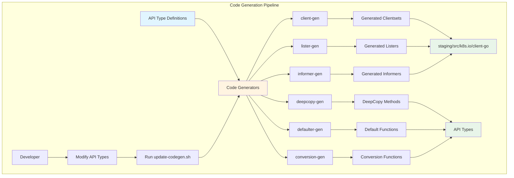

### **Generated Code Example**

```go
// Input: API type definition
// File: staging/src/k8s.io/api/apps/v1/types.go
type Deployment struct {
    metav1.TypeMeta
    metav1.ObjectMeta
    Spec   DeploymentSpec
    Status DeploymentStatus
}

// Generated: DeepCopy method
// File: staging/src/k8s.io/api/apps/v1/zz_generated.deepcopy.go
func (in *Deployment) DeepCopyObject() runtime.Object {
    if c := in.DeepCopy(); c != nil {
        return c
    }
    return nil
}

// Generated: Typed client
// File: staging/src/k8s.io/client-go/kubernetes/typed/apps/v1/deployment.go
type DeploymentInterface interface {
    Create(ctx context.Context, deployment *v1.Deployment, opts metav1.CreateOptions) (*v1.Deployment, error)
    Update(ctx context.Context, deployment *v1.Deployment, opts metav1.UpdateOptions) (*v1.Deployment, error)
    Delete(ctx context.Context, name string, opts metav1.DeleteOptions) error
    Get(ctx context.Context, name string, opts metav1.GetOptions) (*v1.Deployment, error)
    List(ctx context.Context, opts metav1.ListOptions) (*v1.DeploymentList, error)
    Watch(ctx context.Context, opts metav1.ListOptions) (watch.Interface, error)
    // ... more methods
}

// Generated: Lister
// File: staging/src/k8s.io/client-go/listers/apps/v1/deployment.go
type DeploymentLister interface {
    List(selector labels.Selector) (ret []*v1.Deployment, err error)
    Deployments(namespace string) DeploymentNamespaceLister
}

// Generated: Informer
// File: staging/src/k8s.io/client-go/informers/apps/v1/deployment.go
type DeploymentInformer interface {
    Informer() cache.SharedIndexInformer
    Lister() v1.DeploymentLister
}
```

### **update-openapi-spec.sh - OpenAPI Generation**

**Purpose**: Generate OpenAPI v2 and v3 specifications for Kubernetes APIs.

```bash
#!/usr/bin/env bash

# update-openapi-spec.sh generates OpenAPI specifications
# Used for API documentation and client generation

set -o errexit
set -o nounset
set -o pipefail

KUBE_ROOT=$(dirname "${BASH_SOURCE[0]}")/..

# Generate OpenAPI spec
go run ./cmd/openapi-gen \
  --go-header-file "${KUBE_ROOT}/hack/boilerplate/boilerplate.go.txt" \
  --output-file-base "zz_generated.openapi" \
  --output-package "k8s.io/kubernetes/pkg/generated/openapi" \
  k8s.io/api/core/v1 \
  k8s.io/api/apps/v1 \
  k8s.io/api/batch/v1 \
  # ... all API groups

# Write spec to file
go run ./cmd/kube-apiserver --dump-openapi-spec=/tmp/swagger.json

# Validate spec
swagger validate /tmp/swagger.json
```

### **OpenAPI Generation Flow**

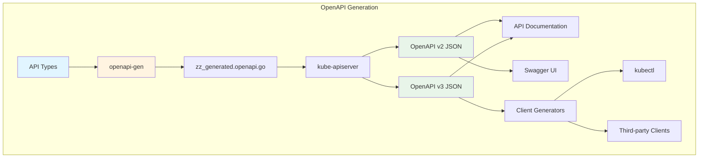

### **update-generated-protobuf.sh - Protobuf Generation**

**Purpose**: Generate protobuf serialization code for efficient wire protocol.

```bash
#!/usr/bin/env bash

# update-generated-protobuf.sh generates protobuf code
# Protobuf provides efficient binary serialization

set -o errexit
set -o nounset
set -o pipefail

KUBE_ROOT=$(dirname "${BASH_SOURCE[0]}")/..
source "${KUBE_ROOT}/hack/lib/protoc.sh"

# Install protoc if needed
kube::protoc::install

# Generate .proto files from Go types
go run ./vendor/k8s.io/code-generator/cmd/go-to-protobuf \
  --proto-import="${KUBE_ROOT}/vendor" \
  --packages="$(kube::protoc::packages)" \
  --go-header-file="${KUBE_ROOT}/hack/boilerplate/boilerplate.go.txt"

# Generate Go code from .proto files
protoc \
  --proto_path="${KUBE_ROOT}/vendor" \
  --go_out=paths=source_relative:. \
  $(find . -name "generated.proto")
```

### **update-vendor.sh - Dependency Management**

**Purpose**: Update vendored dependencies using Go modules.

```bash
#!/usr/bin/env bash

# update-vendor.sh updates vendor/ directory
# Ensures all dependencies are properly vendored

set -o errexit
set -o nounset
set -o pipefail

KUBE_ROOT=$(dirname "${BASH_SOURCE[0]}")/..
cd "${KUBE_ROOT}"

# Update all modules in workspace
for module in $(find staging/src/k8s.io -name go.mod); do
  dir=$(dirname "${module}")
  echo "Updating ${dir}..."
  (cd "${dir}" && go mod tidy && go mod vendor)
done

# Update main module
go mod tidy
go mod vendor

# Prune unused dependencies
go mod vendor -prune

echo "Vendor update complete"
```

### **Dependency Update Flow**

```mermaid
graph TB
    subgraph "Vendor Update Process"
        A[Developer] --> B[Add/Update Dependency]
        B --> C[go get package@version]

        C --> D[update-vendor.sh]

        D --> E[Go Mod Tidy]
        E --> F[Resolve Dependencies]
        F --> G[Update go.sum]

        G --> H[Go Mod Vendor]
        H --> I[Copy to vendor/]

        I --> J[Verify Licenses]
        J --> K[Check Allowed List]

        K --> L{Approved?}
        L -->|Yes| M[Commit Changes]
        L -->|No| N[Request Approval]

        N --> O[Add to godeps.json]
        O --> M
    end

    style A fill:#e1f5ff
    style D fill:#fff4e1
    style H fill:#e8f5e9
    style M fill:#d4edda
```

━━━━━━━━━━━━━━━━━━━━━━━━━━━━━━━━━━━━━━━━━━━━━━━━━━━━━━━━━━━━━━━━━━━━━━━━━━━━━━

## **✅ Verification Scripts**

### **Code Quality Verification**

Verification scripts ensure code meets quality standards before merge.

### **verify-boilerplate.sh - License Headers**

**Purpose**: Verify all files have proper Apache 2.0 license headers.

```bash
#!/usr/bin/env bash

# verify-boilerplate.sh checks license headers

set -o errexit
set -o nounset
set -o pipefail

KUBE_ROOT=$(dirname "${BASH_SOURCE[0]}")/..

# Check all Go files
missing=()
while IFS= read -r -d '' file; do
  if ! head -n 15 "${file}" | grep -q "Apache License"; then
    missing+=("${file}")
  fi
done < <(find . -name "*.go" -not -path "./vendor/*" -print0)

if [[ ${#missing[@]} -ne 0 ]]; then
  echo "Files missing license header:"
  printf '%s\n' "${missing[@]}"
  exit 1
fi

echo "All files have proper license headers"
```

### **verify-gofmt.sh - Go Formatting**

**Purpose**: Ensure all Go code is properly formatted with gofmt.

```bash
#!/usr/bin/env bash

# verify-gofmt.sh checks Go formatting

set -o errexit
set -o nounset
set -o pipefail

# Find unformatted files
unformatted=$(find . -name "*.go" -not -path "./vendor/*" -exec gofmt -l {} +)

if [[ -n "${unformatted}" ]]; then
  echo "The following files are not gofmt'd:"
  echo "${unformatted}"
  echo ""
  echo "Run: hack/update-gofmt.sh"
  exit 1
fi

echo "All Go files are properly formatted"
```

### **verify-golangci-lint.sh - Comprehensive Linting**

**Purpose**: Run golangci-lint for comprehensive code quality checks.

**Location**: `/Users/sureshscribnar/Documents/Projects/opensource/kubernetes/hack/verify-golangci-lint.sh`

```bash
#!/usr/bin/env bash

# verify-golangci-lint.sh runs comprehensive linting

set -o errexit
set -o nounset
set -o pipefail

KUBE_ROOT=$(dirname "${BASH_SOURCE[0]}")/..

# Install golangci-lint if needed
if ! command -v golangci-lint &> /dev/null; then
  echo "Installing golangci-lint..."
  go install github.com/golangci/golangci-lint/cmd/golangci-lint@latest
fi

# Run linter with config
golangci-lint run \
  --config="${KUBE_ROOT}/.golangci.yaml" \
  --timeout=30m \
  ./...

echo "Linting passed!"
```

### **golangci-lint Configuration**

**File**: `/Users/sureshscribnar/Documents/Projects/opensource/kubernetes/.golangci.yaml`

```yaml
# golangci-lint configuration for Kubernetes

run:
  timeout: 30m
  skip-dirs:
    - vendor
    - third_party
  skip-files:
    - ".*\\.pb\\.go$"
    - "zz_generated.*\\.go$"

linters:
  enable:
    - gofmt
    - goimports
    - govet
    - golint
    - ineffassign
    - misspell
    - staticcheck
    - unused
    - errcheck
    - gosimple
    - gocritic
  disable:
    - structcheck  # deprecated
    - deadcode     # deprecated

linters-settings:
  govet:
    check-shadowing: true
  goimports:
    local-prefixes: k8s.io/kubernetes
  gocritic:
    enabled-tags:
      - diagnostic
      - performance
      - style
    disabled-checks:
      - commentFormatting
      - whyNoLint

issues:
  exclude-rules:
    - path: _test\.go
      linters:
        - errcheck
        - ineffassign
```

### **Linting Architecture**

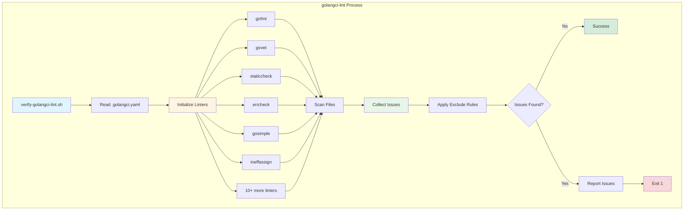

### **verify-imports.sh - Import Order**

**Purpose**: Verify Go imports are properly organized.

```bash
#!/usr/bin/env bash

# verify-imports.sh checks import organization
# Imports should be grouped: stdlib, external, k8s.io

set -o errexit
set -o nounset
set -o pipefail

# Run goimports in verify mode
bad_files=$(find . -name "*.go" -not -path "./vendor/*" -exec goimports -l {} +)

if [[ -n "${bad_files}" ]]; then
  echo "The following files have incorrect import organization:"
  echo "${bad_files}"
  echo ""
  echo "Run: hack/update-goimports.sh"
  exit 1
fi

echo "All imports are properly organized"
```

### **verify-dependencies.sh - Dependency Validation**

**Purpose**: Ensure dependencies meet license and security requirements.

```bash
#!/usr/bin/env bash

# verify-dependencies.sh validates dependencies

set -o errexit
set -o nounset
set -o pipefail

KUBE_ROOT=$(dirname "${BASH_SOURCE[0]}")/..

# Check for unwanted dependencies
UNWANTED="${KUBE_ROOT}/hack/unwanted-dependencies.json"

# Scan all dependencies
for dep in $(go list -m all | awk '{print $1}'); do
  # Check against unwanted list
  if jq -e ".unwanted[] | select(.module == \"${dep}\")" "${UNWANTED}" > /dev/null; then
    echo "ERROR: Unwanted dependency found: ${dep}"
    exit 1
  fi

  # Verify license
  if ! hack/verify-licenses.sh "${dep}"; then
    echo "ERROR: Invalid license for: ${dep}"
    exit 1
  fi
done

echo "All dependencies are valid"
```

### **Dependency Validation Flow**

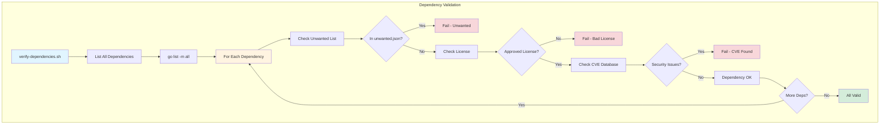

━━━━━━━━━━━━━━━━━━━━━━━━━━━━━━━━━━━━━━━━━━━━━━━━━━━━━━━━━━━━━━━━━━━━━━━━━━━━━━

## **🧪 Test Scripts**

### **test-go.sh - Unit Test Runner**

**Purpose**: Run Go unit tests with proper configuration.

**Location**: `/Users/sureshscribnar/Documents/Projects/opensource/kubernetes/hack/test-go.sh`

```bash
#!/usr/bin/env bash

# test-go.sh runs Go unit tests

set -o errexit
set -o nounset
set -o pipefail

KUBE_ROOT=$(dirname "${BASH_SOURCE[0]}")/..
source "${KUBE_ROOT}/hack/lib/init.sh"
source "${KUBE_ROOT}/hack/lib/test.sh"

# Configure test environment
export KUBE_TIMEOUT=${KUBE_TIMEOUT:-600s}
export KUBE_COVER=${KUBE_COVER:-n}
export KUBE_RACE=${KUBE_RACE:-n}

# Determine what to test
WHAT="${WHAT:-./...}"

# Build test flags
TEST_FLAGS=(
  "-timeout=${KUBE_TIMEOUT}"
  "-v"
)

if [[ "${KUBE_COVER}" == "y" ]]; then
  TEST_FLAGS+=("-coverprofile=coverage.out" "-covermode=atomic")
fi

if [[ "${KUBE_RACE}" == "y" ]]; then
  TEST_FLAGS+=("-race")
fi

# Run tests
echo "Running unit tests: ${WHAT}"
go test "${TEST_FLAGS[@]}" ${WHAT}

# Generate coverage report if enabled
if [[ "${KUBE_COVER}" == "y" ]]; then
  go tool cover -html=coverage.out -o coverage.html
  echo "Coverage report: coverage.html"
fi
```

### **Test Execution Flow**

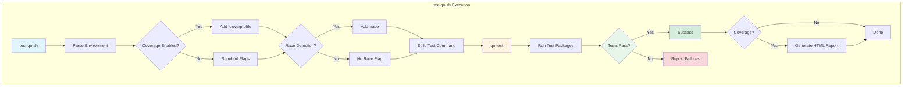

### **ginkgo-e2e.sh - E2E Test Runner**

**Purpose**: Run Ginkgo-based end-to-end tests.

```bash
#!/usr/bin/env bash

# ginkgo-e2e.sh runs E2E tests using Ginkgo

set -o errexit
set -o nounset
set -o pipefail

KUBE_ROOT=$(dirname "${BASH_SOURCE[0]}")/..

# E2E configuration
export E2E_FOCUS="${E2E_FOCUS:-}"
export E2E_SKIP="${E2E_SKIP:-}"
export E2E_PARALLEL="${E2E_PARALLEL:-1}"

# Build E2E test binary
echo "Building E2E test binary..."
go test -c ./test/e2e -o /tmp/e2e.test

# Build ginkgo if needed
if ! command -v ginkgo &> /dev/null; then
  go install github.com/onsi/ginkgo/v2/ginkgo@latest
fi

# Run E2E tests
GINKGO_FLAGS=(
  "--nodes=${E2E_PARALLEL}"
  "--flake-attempts=2"
  "--timeout=24h"
)

if [[ -n "${E2E_FOCUS}" ]]; then
  GINKGO_FLAGS+=("--focus=${E2E_FOCUS}")
fi

if [[ -n "${E2E_SKIP}" ]]; then
  GINKGO_FLAGS+=("--skip=${E2E_SKIP}")
fi

ginkgo "${GINKGO_FLAGS[@]}" /tmp/e2e.test -- \
  --provider=local \
  --kubeconfig="${HOME}/.kube/config"
```

### **E2E Test Execution**

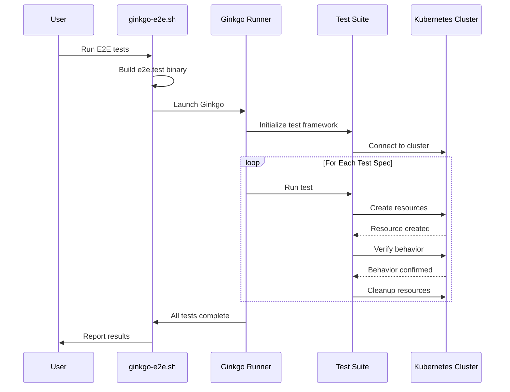

━━━━━━━━━━━━━━━━━━━━━━━━━━━━━━━━━━━━━━━━━━━━━━━━━━━━━━━━━━━━━━━━━━━━━━━━━━━━━━

## **📚 Shared Libraries (hack/lib/)**

### **Library Overview**

The `hack/lib/` directory contains reusable shell libraries used across all hack scripts.

**Location**: `/Users/sureshscribnar/Documents/Projects/opensource/kubernetes/hack/lib/`

```
lib/
├── init.sh                 # ✅ Common initialization
├── golang.sh               # ✅ Go build utilities
├── etcd.sh                 # ✅ etcd management
├── logging.sh              # ✅ Logging functions
├── util.sh                 # ✅ General utilities
├── version.sh              # ✅ Version management
├── test.sh                 # ✅ Test utilities
├── protoc.sh               # ✅ Protobuf utilities
└── verify-generated.sh     # ✅ Verify generated code
```

### **init.sh - Common Initialization**

```bash
#!/usr/bin/env bash

# init.sh provides common initialization for all scripts

set -o errexit
set -o nounset
set -o pipefail

# Set up root directory
KUBE_ROOT=$(dirname "${BASH_SOURCE[0]}")/../..
cd "${KUBE_ROOT}"

# Source all libraries
source "${KUBE_ROOT}/hack/lib/logging.sh"
source "${KUBE_ROOT}/hack/lib/util.sh"
source "${KUBE_ROOT}/hack/lib/version.sh"
source "${KUBE_ROOT}/hack/lib/golang.sh"

# Set up output directories
export KUBE_OUTPUT="${KUBE_ROOT}/_output"
export KUBE_OUTPUT_BINPATH="${KUBE_OUTPUT}/bin"

# Detect host platform
export KUBE_HOST_PLATFORM=$(kube::util::host_platform)

# Initialize complete
kube::log::status "Environment initialized"
```

### **golang.sh - Go Build Utilities**

```bash
#!/usr/bin/env bash

# golang.sh provides Go build utilities

# Setup Go build environment
kube::golang::setup_env() {
  # Set GOROOT and GOPATH
  export GOROOT="${GOROOT:-$(go env GOROOT)}"
  export GOPATH="${GOPATH:-$(go env GOPATH)}"

  # Set build flags
  export KUBE_GO_BUILD_FLAGS="${KUBE_GO_BUILD_FLAGS:-}"
  export KUBE_GO_BUILD_TAGS="${KUBE_GO_BUILD_TAGS:-}"

  # Set version info
  local git_commit=$(git rev-parse HEAD)
  local git_version=$(git describe --tags --always --dirty)
  local build_date=$(date -u +'%Y-%m-%dT%H:%M:%SZ')

  export KUBE_GIT_COMMIT="${git_commit}"
  export KUBE_GIT_VERSION="${git_version}"
  export KUBE_BUILD_DATE="${build_date}"

  # Build LD flags
  export KUBE_LDFLAGS="
    -X k8s.io/component-base/version.gitCommit=${git_commit}
    -X k8s.io/component-base/version.gitVersion=${git_version}
    -X k8s.io/component-base/version.buildDate=${build_date}
  "
}

# Build Go binaries
kube::golang::build_binaries() {
  local -a targets=("$@")

  for target in "${targets[@]}"; do
    kube::log::status "Building ${target}..."

    go build \
      -ldflags "${KUBE_LDFLAGS}" \
      -tags "${KUBE_GO_BUILD_TAGS}" \
      -o "${KUBE_OUTPUT_BINPATH}/$(basename ${target})" \
      "./${target}"
  done
}

# Detect host platform
kube::golang::host_platform() {
  local host_os
  local host_arch

  case "$(uname -s)" in
    Darwin) host_os=darwin ;;
    Linux) host_os=linux ;;
    *) echo "Unsupported host OS" >&2; return 1 ;;
  esac

  case "$(uname -m)" in
    x86_64) host_arch=amd64 ;;
    arm64|aarch64) host_arch=arm64 ;;
    *) echo "Unsupported architecture" >&2; return 1 ;;
  esac

  echo "${host_os}/${host_arch}"
}
```

### **etcd.sh - etcd Management**

```bash
#!/usr/bin/env bash

# etcd.sh manages etcd for development

export ETCD_VERSION="v3.5.9"
export ETCD_HOST="127.0.0.1"
export ETCD_PORT="2379"

# Start etcd server
kube::etcd::start() {
  local data_dir="${KUBE_OUTPUT}/etcd"
  mkdir -p "${data_dir}"

  # Download etcd if needed
  if ! command -v etcd &> /dev/null; then
    kube::etcd::install
  fi

  kube::log::status "Starting etcd on ${ETCD_HOST}:${ETCD_PORT}..."

  etcd \
    --name=kubernetes-test \
    --data-dir="${data_dir}" \
    --listen-client-urls="http://${ETCD_HOST}:${ETCD_PORT}" \
    --advertise-client-urls="http://${ETCD_HOST}:${ETCD_PORT}" \
    &> "${KUBE_OUTPUT}/etcd.log" &

  export ETCD_PID=$!

  # Wait for etcd to be ready
  kube::etcd::wait_ready
}

# Wait for etcd to be healthy
kube::etcd::wait_ready() {
  local timeout=30
  local elapsed=0

  while ! etcdctl endpoint health &> /dev/null; do
    if [[ ${elapsed} -ge ${timeout} ]]; then
      kube::log::error "etcd failed to start"
      return 1
    fi
    sleep 1
    ((elapsed++))
  done

  kube::log::status "etcd is ready"
}

# Stop etcd
kube::etcd::stop() {
  if [[ -n "${ETCD_PID:-}" ]]; then
    kill "${ETCD_PID}" || true
  fi
}
```

### **logging.sh - Logging Functions**

```bash
#!/usr/bin/env bash

# logging.sh provides colored logging functions

# Color codes
KUBE_LOG_COLOR_STATUS='\033[0;32m'  # Green
KUBE_LOG_COLOR_WARNING='\033[0;33m' # Yellow
KUBE_LOG_COLOR_ERROR='\033[0;31m'   # Red
KUBE_LOG_COLOR_RESET='\033[0m'      # Reset

# Log status message (green)
kube::log::status() {
  local message="$1"
  echo -e "${KUBE_LOG_COLOR_STATUS}[STATUS]${KUBE_LOG_COLOR_RESET} ${message}"
}

# Log warning message (yellow)
kube::log::warning() {
  local message="$1"
  echo -e "${KUBE_LOG_COLOR_WARNING}[WARNING]${KUBE_LOG_COLOR_RESET} ${message}" >&2
}

# Log error message (red)
kube::log::error() {
  local message="$1"
  echo -e "${KUBE_LOG_COLOR_ERROR}[ERROR]${KUBE_LOG_COLOR_RESET} ${message}" >&2
}

# Log with timestamp
kube::log::timestamped() {
  local message="$1"
  echo "[$(date +'%Y-%m-%d %H:%M:%S')] ${message}"
}
```

### **util.sh - General Utilities**

```bash
#!/usr/bin/env bash

# util.sh provides general utility functions

# Wait for URL to be available
kube::util::wait_for_url() {
  local url="$1"
  local timeout="${2:-60}"
  local elapsed=0

  while ! curl -s "${url}" > /dev/null; do
    if [[ ${elapsed} -ge ${timeout} ]]; then
      kube::log::error "Timeout waiting for ${url}"
      return 1
    fi
    sleep 1
    ((elapsed++))
  done

  kube::log::status "${url} is ready"
}

# Get array of changed files
kube::util::get_changed_files() {
  local base="${1:-origin/master}"
  git diff --name-only "${base}" HEAD
}

# Check if running in CI
kube::util::is_ci() {
  [[ -n "${CI:-}" ]] || [[ -n "${JENKINS_HOME:-}" ]]
}

# Detect host platform
kube::util::host_platform() {
  local os=$(uname -s | tr '[:upper:]' '[:lower:]')
  local arch=$(uname -m)

  case "${arch}" in
    x86_64) arch=amd64 ;;
    aarch64) arch=arm64 ;;
  esac

  echo "${os}/${arch}"
}
```

### **Library Usage Pattern**

```bash
#!/usr/bin/env bash

# Example script using hack/lib libraries

set -o errexit
set -o nounset
set -o pipefail

# Source common initialization (sources all libraries)
KUBE_ROOT=$(dirname "${BASH_SOURCE[0]}")/..
source "${KUBE_ROOT}/hack/lib/init.sh"

# Use logging functions
kube::log::status "Starting my script"

# Use Go build functions
kube::golang::setup_env
kube::golang::build_binaries cmd/kubectl

# Use etcd functions
kube::etcd::start
trap kube::etcd::stop EXIT

# Use utility functions
kube::util::wait_for_url "http://localhost:8080/healthz"

kube::log::status "Script complete"
```

━━━━━━━━━━━━━━━━━━━━━━━━━━━━━━━━━━━━━━━━━━━━━━━━━━━━━━━━━━━━━━━━━━━━━━━━━━━━━━

## **⚙️ Make Rules (hack/make-rules/)**

### **Make Rule Structure**

The `hack/make-rules/` directory contains the implementation for Makefile targets.

**Location**: `/Users/sureshscribnar/Documents/Projects/opensource/kubernetes/hack/make-rules/`

```
make-rules/
├── build.sh                # Build targets
├── test.sh                 # Test targets
├── verify.sh               # Verification targets
├── update.sh               # Update targets
├── clean.sh                # Clean targets
├── cross.sh                # Cross-compilation
├── test-cmd.sh             # Command tests
├── test-integration.sh     # Integration tests
├── test-e2e-node.sh        # Node E2E tests
└── make-help.sh            # Help system
```

### **Makefile Integration**

```makefile
# Main Makefile delegates to hack/make-rules/

.PHONY: all
all: build

.PHONY: build
build:
	hack/make-rules/build.sh

.PHONY: test
test:
	hack/make-rules/test.sh

.PHONY: test-integration
test-integration:
	hack/make-rules/test-integration.sh

.PHONY: test-e2e
test-e2e:
	hack/ginkgo-e2e.sh

.PHONY: verify
verify:
	hack/make-rules/verify.sh

.PHONY: update
update:
	hack/make-rules/update.sh

.PHONY: clean
clean:
	hack/make-rules/clean.sh
```

### **Make Rule Workflow**

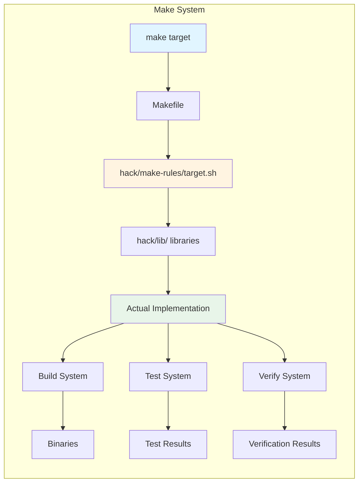

━━━━━━━━━━━━━━━━━━━━━━━━━━━━━━━━━━━━━━━━━━━━━━━━━━━━━━━━━━━━━━━━━━━━━━━━━━━━━━

## **🔧 Tools Directory (hack/tools/)**

### **Tool Dependencies**

The `hack/tools/` directory manages development tool dependencies.

**Location**: `/Users/sureshscribnar/Documents/Projects/opensource/kubernetes/hack/tools/`

```
tools/
├── go.mod                  # Tool dependencies
├── go.sum                  # Dependency checksums
└── tools.go                # Tool imports
```

### **tools.go - Import Tools**

```go
// File: hack/tools/tools.go

//go:build tools
// +build tools

// Package tools imports all tool dependencies
// This ensures they are tracked in go.mod
package tools

import (
	_ "github.com/golangci/golangci-lint/cmd/golangci-lint"
	_ "github.com/onsi/ginkgo/v2/ginkgo"
	_ "k8s.io/code-generator"
	_ "k8s.io/code-generator/cmd/client-gen"
	_ "k8s.io/code-generator/cmd/lister-gen"
	_ "k8s.io/code-generator/cmd/informer-gen"
	_ "k8s.io/code-generator/cmd/deepcopy-gen"
	_ "k8s.io/code-generator/cmd/defaulter-gen"
	_ "k8s.io/code-generator/cmd/conversion-gen"
	_ "k8s.io/code-generator/cmd/openapi-gen"
	_ "sigs.k8s.io/controller-tools/cmd/controller-gen"
	// ... all development tools
)
```

### **Installing Tools**

```bash
# Install all development tools
cd hack/tools
go install $(go list -f '{{join .Imports " "}}' .)

# Tools are installed to $(go env GOPATH)/bin
# Add to PATH for easy access
export PATH="$(go env GOPATH)/bin:${PATH}"
```

━━━━━━━━━━━━━━━━━━━━━━━━━━━━━━━━━━━━━━━━━━━━━━━━━━━━━━━━━━━━━━━━━━━━━━━━━━━━━━

## **📄 Boilerplate Templates (hack/boilerplate/)**

### **License Header Templates**

**Location**: `/Users/sureshscribnar/Documents/Projects/opensource/kubernetes/hack/boilerplate/`

```
boilerplate/
├── boilerplate.go.txt      # Go files
├── boilerplate.py.txt      # Python files
├── boilerplate.sh.txt      # Shell scripts
└── boilerplate.*.txt       # Other file types
```

### **Go Boilerplate**

```go
/*
Copyright 2025 The Kubernetes Authors.

Licensed under the Apache License, Version 2.0 (the "License");
you may not use this file except in compliance with the License.
You may obtain a copy of the License at

    http://www.apache.org/licenses/LICENSE-2.0

Unless required by applicable law or agreed to in writing, software
distributed under the License is distributed on an "AS IS" BASIS,
WITHOUT WARRANTIES OR CONDITIONS OF ANY KIND, either express or implied.
See the License for the specific language governing permissions and
limitations under the License.
*/
```

━━━━━━━━━━━━━━━━━━━━━━━━━━━━━━━━━━━━━━━━━━━━━━━━━━━━━━━━━━━━━━━━━━━━━━━━━━━━━━

## **🎓 Best Practices**

### **Writing New Hack Scripts**

```bash
#!/usr/bin/env bash

# ✅ GOOD: Proper script structure

set -o errexit   # Exit on error
set -o nounset   # Exit on undefined variable
set -o pipefail  # Exit on pipe failure

# Find and source libraries
KUBE_ROOT=$(dirname "${BASH_SOURCE[0]}")/..
source "${KUBE_ROOT}/hack/lib/init.sh"

# Use logging functions
kube::log::status "Starting my script"

# Do work...

kube::log::status "Script complete"


# ❌ BAD: No error handling, no libraries
#!/bin/bash
cd /some/path
./command
# Script might continue after errors!
```

### **Using Code Generators**

```bash
# After modifying API types, always regenerate code
hack/update-codegen.sh
hack/update-openapi-spec.sh
hack/update-generated-protobuf.sh

# Verify generated code is correct
hack/verify-codegen.sh
hack/verify-openapi-spec.sh

# Commit both your changes AND generated code
git add .
git commit -m "Add new API field

Generated with: hack/update-codegen.sh"
```

### **Running Verification Locally**

```bash
# Before creating a PR, run all verifications
hack/verify-all.sh

# Or run specific verifications
hack/verify-gofmt.sh
hack/verify-golangci-lint.sh
hack/verify-codegen.sh

# Fix issues automatically where possible
hack/update-gofmt.sh        # Format code
hack/update-goimports.sh    # Fix imports
hack/update-codegen.sh      # Regenerate code
```

━━━━━━━━━━━━━━━━━━━━━━━━━━━━━━━━━━━━━━━━━━━━━━━━━━━━━━━━━━━━━━━━━━━━━━━━━━━━━━

## **🔍 Troubleshooting**

### **Common Issues**

| Issue | Cause | Solution |
|-------|-------|----------|
| **verify-codegen.sh fails** | Generated code out of sync | Run `hack/update-codegen.sh` |
| **golangci-lint timeout** | Large codebase | Increase timeout in `.golangci.yaml` |
| **etcd won't start** | Port already in use | Kill existing etcd: `pkill etcd` |
| **Build fails with version error** | Git not configured | Ensure `.git/` exists |
| **Cross-compilation fails** | Docker not available | Install Docker or use native builds |

### **Debugging Scripts**

```bash
# Run script with debug output
bash -x hack/verify-codegen.sh

# Check what files would be modified
git diff --name-only

# Verify environment
hack/lib/init.sh
env | grep KUBE_
```

### **Performance Tips**

```bash
# Parallel verification (faster)
hack/verify-gofmt.sh &
hack/verify-boilerplate.sh &
wait

# Skip slow checks during development
QUICK=true hack/verify-all.sh

# Use cached builds
KUBE_BUILD_CACHE=1 hack/build-go.sh
```

━━━━━━━━━━━━━━━━━━━━━━━━━━━━━━━━━━━━━━━━━━━━━━━━━━━━━━━━━━━━━━━━━━━━━━━━━━━━━━

## **📚 Navigation**

### **Related Documentation**

| Document | Description |
|----------|-------------|
| **[01-repository-overview.md](01-repository-overview.md)** | Complete repository structure |
| **[02-cmd-binaries.md](02-cmd-binaries.md)** | Binary commands and entry points |
| **[06-test-infrastructure.md](06-test-infrastructure.md)** | Testing framework and E2E tests |
| **[08-build-system.md](08-build-system.md)** | Build infrastructure and hermetic builds |

### **External Resources**

- [Development Guide](https://github.com/kubernetes/community/tree/master/contributors/devel)
- [Code Generation](https://github.com/kubernetes/code-generator)
- [golangci-lint](https://golangci-lint.run/)

━━━━━━━━━━━━━━━━━━━━━━━━━━━━━━━━━━━━━━━━━━━━━━━━━━━━━━━━━━━━━━━━━━━━━━━━━━━━━━

## **✅ Summary**

The hack directory is the automation backbone of Kubernetes development:

- **96+ Scripts**: Comprehensive automation for all development tasks
- **Code Generation**: Automated client, OpenAPI, and protobuf generation
- **Verification**: 30+ checks ensuring code quality and consistency
- **Build System**: Cross-platform builds with version embedding
- **Test Execution**: Unit, integration, and E2E test runners
- **Shared Libraries**: Reusable functions for consistent scripting
- **Make Integration**: Clean interface via Makefile targets

This infrastructure enables hundreds of contributors to work efficiently while maintaining high code quality standards.

---

**Document Version**: 1.0
**Last Updated**: 2025-11-16
**Maintainer**: Kubernetes SIG Testing / SIG Architecture
