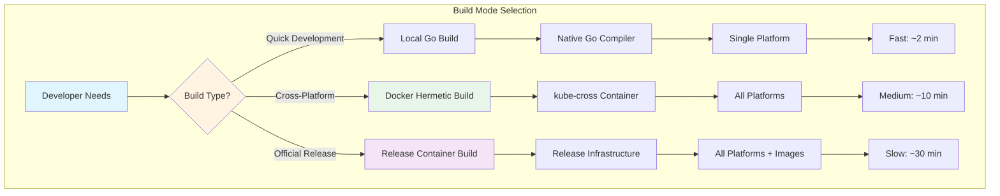
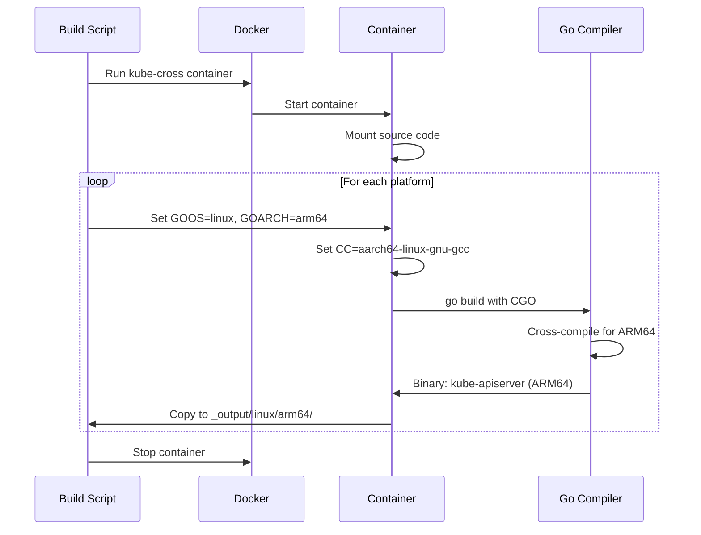
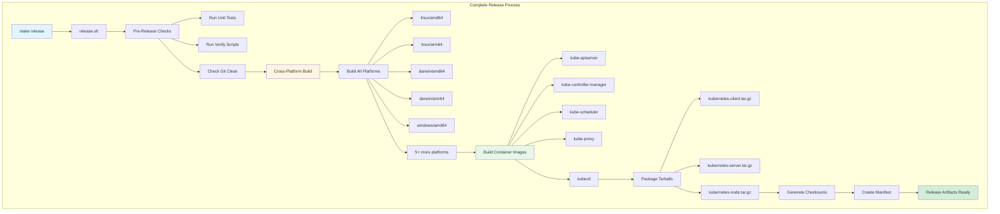
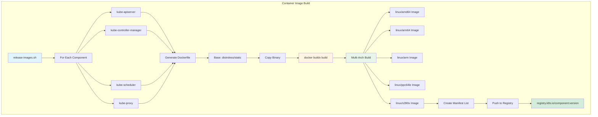
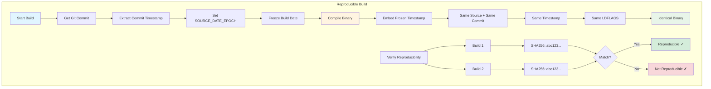

# **KUBERNETES BUILD SYSTEM**

**Build Infrastructure, Hermetic Builds, and Release Engineering**

━━━━━━━━━━━━━━━━━━━━━━━━━━━━━━━━━━━━━━━━━━━━━━━━━━━━━━━━━━━━━━━━━━━━━━━━━━━━━━

## **📊 Build System At A Glance**

### **Overview**

The Kubernetes build system is a sophisticated infrastructure that produces reproducible, cross-platform binaries and container images. It supports hermetic builds via Docker containers, native Go builds, and advanced release engineering workflows.

| Aspect | Details |
|--------|---------|
| **Location** | `/Users/sureshscribnar/Documents/Projects/opensource/kubernetes/build/` |
| **Build Types** | Local Go, Docker hermetic, Cross-compilation |
| **Supported Platforms** | linux/{amd64,arm64,arm,ppc64le,s390x}, darwin/{amd64,arm64}, windows/amd64 |
| **Container Runtime** | Docker with kube-cross build image |
| **Build Artifacts** | Binaries, tarballs, container images |
| **Reproducibility** | SOURCE_DATE_EPOCH for deterministic builds |
| **Maintenance** | ✅ ACTIVE - Core infrastructure |

### **Build Directory Structure**

```
build/
├── Build Orchestration Scripts
│   ├── run.sh                  # ✅ Main build entry point
│   ├── release.sh              # ✅ Release build orchestrator
│   ├── shell.sh                # ✅ Interactive build container shell
│   ├── make-clean.sh           # ✅ Clean build artifacts
│   ├── common.sh               # ✅ Common build functions
│   └── util.sh                 # ✅ Utility functions
│
├── Release Engineering
│   ├── release-in-a-container.sh  # ✅ Containerized release builds
│   ├── release-images.sh       # ✅ Build container images
│   ├── package-tarballs.sh     # ✅ Create release tarballs
│   └── dependencies.yaml       # ✅ Dependency specifications
│
├── build-image/                # ✅ kube-cross build container
│   ├── Dockerfile              #    Multi-arch toolchain image
│   ├── cross/                  #    Cross-compilation tools
│   └── variants/               #    Platform-specific variants
│
├── root/                       # ✅ Files for root filesystem
│   ├── Makefile.generated_files #   Generated file tracking
│   └── [build configs]         #    Build configuration files
│
├── lib/                        # ✅ Build library functions
│   ├── golang.sh               #    Go build utilities
│   ├── release.sh              #    Release utilities
│   └── version.sh              #    Version management
│
├── pause/                      # ✅ Pause container image
│   ├── Dockerfile              #    Minimal pause container
│   └── pause.c                 #    Pause binary source
│
└── server-image/               # ✅ Server component images
    └── kube-apiserver/         #    Component-specific images
```

━━━━━━━━━━━━━━━━━━━━━━━━━━━━━━━━━━━━━━━━━━━━━━━━━━━━━━━━━━━━━━━━━━━━━━━━━━━━━━

## **🏗️ Build Modes**

### **Three Build Modes**

Kubernetes supports three different build modes, each with specific use cases:



### **Build Mode Comparison**

| Mode | Speed | Reproducibility | Cross-Compile | Use Case |
|------|-------|----------------|---------------|----------|
| **Local Go** | ⚡ Fast | ⚠️ Variable | ❌ No | Local development iteration |
| **Docker Hermetic** | 🐢 Medium | ✅ High | ✅ Yes | CI builds, multi-platform |
| **Release Container** | 🐌 Slow | ✅ Perfect | ✅ Yes | Official releases |

━━━━━━━━━━━━━━━━━━━━━━━━━━━━━━━━━━━━━━━━━━━━━━━━━━━━━━━━━━━━━━━━━━━━━━━━━━━━━━

## **🔨 Local Go Build**

### **Quick Development Builds**

Local Go builds use your system's Go compiler for fast iteration during development.

### **Build Script: build/run.sh**

**Location**: `/Users/sureshscribnar/Documents/Projects/opensource/kubernetes/build/run.sh`

```bash
#!/usr/bin/env bash

# run.sh is the main entry point for building Kubernetes
# Decides whether to use local Go or Docker build

set -o errexit
set -o nounset
set -o pipefail

KUBE_ROOT=$(dirname "${BASH_SOURCE[0]}")/..
source "${KUBE_ROOT}/build/common.sh"

# Detect build mode
if [[ "${KUBE_BUILD_WITH_DOCKER:-}" == "true" ]]; then
  # Docker hermetic build
  "${KUBE_ROOT}/build/run-in-docker.sh" "$@"
else
  # Local Go build
  "${KUBE_ROOT}/hack/build-go.sh" "$@"
fi
```

### **Local Build Process**

```mermaid
graph TB
    subgraph "Local Go Build Flow"
        A[make all] --> B[build/run.sh]
        B --> C{Use Docker?}

        C -->|No| D[Local Go Build]
        D --> E[hack/build-go.sh]

        E --> F[Detect Go Version]
        F --> G[Set Build Environment]

        G --> H[Parse Targets]
        H --> I{Specific Target?}

        I -->|No| J[Build All Binaries]
        I -->|Yes| K[Build Specific Binary]

        J --> L[For Each Binary]
        K --> L

        L --> M[Set LDFLAGS]
        M --> N[Version Information]
        M --> O[Git Commit/Tag]

        N --> P[go build]
        O --> P

        P --> Q[Output to _output/bin/]
        Q --> R[Set Executable Permissions]

        R --> S{More Binaries?}
        S -->|Yes| L
        S -->|No| T[Build Complete]
    end

    style A fill:#e1f5ff
    style E fill:#fff4e1
    style P fill:#e8f5e9
    style T fill:#d4edda
```



### **Version Embedding**

```bash
# File: build/lib/version.sh

# Get Git version information
kube::version::get_version_vars() {
  # Git commit hash
  KUBE_GIT_COMMIT=$(git rev-parse HEAD)

  # Git tree state (clean or dirty)
  if git diff-index --quiet HEAD --; then
    KUBE_GIT_TREE_STATE="clean"
  else
    KUBE_GIT_TREE_STATE="dirty"
  fi

  # Git version from tags
  KUBE_GIT_VERSION=$(git describe --tags --always --dirty)

  # Build date (RFC3339)
  KUBE_BUILD_DATE=$(date -u +'%Y-%m-%dT%H:%M:%SZ')

  # Git major/minor version
  KUBE_GIT_MAJOR=$(echo "${KUBE_GIT_VERSION}" | cut -d. -f1 | sed 's/v//')
  KUBE_GIT_MINOR=$(echo "${KUBE_GIT_VERSION}" | cut -d. -f2)
}

# Build LDFLAGS for version embedding
kube::version::ldflags() {
  kube::version::get_version_vars

  local -a ldflags=(
    "-X k8s.io/component-base/version.gitVersion=${KUBE_GIT_VERSION}"
    "-X k8s.io/component-base/version.gitCommit=${KUBE_GIT_COMMIT}"
    "-X k8s.io/component-base/version.gitTreeState=${KUBE_GIT_TREE_STATE}"
    "-X k8s.io/component-base/version.buildDate=${KUBE_BUILD_DATE}"
    "-X k8s.io/component-base/version.gitMajor=${KUBE_GIT_MAJOR}"
    "-X k8s.io/component-base/version.gitMinor=${KUBE_GIT_MINOR}"
  )

  echo "${ldflags[*]}"
}
```

### **Version Information Access**

```go
// File: staging/src/k8s.io/component-base/version/version.go

package version

import (
	"fmt"
	"runtime"
)

// Info contains version information
type Info struct {
	Major        string
	Minor        string
	GitVersion   string
	GitCommit    string
	GitTreeState string
	BuildDate    string
	GoVersion    string
	Compiler     string
	Platform     string
}

// Version information set via LDFLAGS during build
var (
	gitMajor     string = "0"
	gitMinor     string = "0"
	gitVersion   string = "v0.0.0-master+$Format:%h$"
	gitCommit    string = "$Format:%H$"
	gitTreeState string = ""
	buildDate    string = "1970-01-01T00:00:00Z"
)

// Get returns the version information
func Get() Info {
	return Info{
		Major:        gitMajor,
		Minor:        gitMinor,
		GitVersion:   gitVersion,
		GitCommit:    gitCommit,
		GitTreeState: gitTreeState,
		BuildDate:    buildDate,
		GoVersion:    runtime.Version(),
		Compiler:     runtime.Compiler,
		Platform:     fmt.Sprintf("%s/%s", runtime.GOOS, runtime.GOARCH),
	}
}
```

### **Build Output Structure**

```
_output/
├── bin/                        # Built binaries
│   ├── kube-apiserver
│   ├── kube-controller-manager
│   ├── kube-scheduler
│   ├── kubelet
│   ├── kube-proxy
│   ├── kubectl
│   └── [22 more binaries]
│
├── dockerized/                 # Docker build artifacts
│   └── bin/
│       └── linux/
│           ├── amd64/
│           ├── arm64/
│           └── [more platforms]
│
└── release-stage/              # Release staging area
    ├── client/
    ├── server/
    └── node/
```

━━━━━━━━━━━━━━━━━━━━━━━━━━━━━━━━━━━━━━━━━━━━━━━━━━━━━━━━━━━━━━━━━━━━━━━━━━━━━━

## **🐳 Docker Hermetic Build**

### **Reproducible Cross-Platform Builds**

Hermetic builds use a Docker container with a complete cross-compilation toolchain to produce identical binaries regardless of the host system.

### **kube-cross Build Image**

**Location**: `/Users/sureshscribnar/Documents/Projects/opensource/kubernetes/build/build-image/`

The `kube-cross` image contains:
- Go compiler (specific version)
- Cross-compilation toolchains for all supported platforms
- Build tools and dependencies
- Fixed versions of all build dependencies

```dockerfile
# File: build/build-image/Dockerfile

FROM golang:1.21.5

# Install cross-compilation toolchains
RUN apt-get update && apt-get install -y \
    gcc-aarch64-linux-gnu \
    gcc-arm-linux-gnueabihf \
    gcc-powerpc64le-linux-gnu \
    gcc-s390x-linux-gnu \
    gcc-mingw-w64-x86-64 \
    && rm -rf /var/lib/apt/lists/*

# Set up cross-compilation environment
ENV CGO_ENABLED=1

# Platform-specific compiler configurations
ENV CC_FOR_linux_amd64=gcc
ENV CC_FOR_linux_arm64=aarch64-linux-gnu-gcc
ENV CC_FOR_linux_arm=arm-linux-gnueabihf-gcc
ENV CC_FOR_linux_ppc64le=powerpc64le-linux-gnu-gcc
ENV CC_FOR_linux_s390x=s390x-linux-gnu-gcc
ENV CC_FOR_windows_amd64=x86_64-w64-mingw32-gcc

# Install build tools
RUN go install github.com/google/addlicense@latest
RUN go install golang.org/x/tools/cmd/goimports@latest

# Set working directory
WORKDIR /go/src/k8s.io/kubernetes

# Default command
CMD ["/bin/bash"]
```

### **Docker Build Process**

```mermaid
graph TB
    subgraph "Docker Hermetic Build"
        A[make all] --> B[build/run.sh]
        B --> C[KUBE_BUILD_WITH_DOCKER=true]

        C --> D[build/run-in-docker.sh]
        D --> E[Pull kube-cross Image]

        E --> F[Start Build Container]
        F --> G[Mount Source Code]
        G --> H[Mount Output Directory]

        H --> I[Inside Container]
        I --> J[hack/build-go.sh]

        J --> K{Target Platforms?}
        K --> L[For Each Platform]

        L --> M[Set GOOS/GOARCH]
        M --> N[Set CC for Platform]
        N --> O[CGO Cross-Compile]

        O --> P[go build]
        P --> Q[Output to _output/dockerized/]

        Q --> R{More Platforms?}
        R -->|Yes| L
        R -->|No| S[All Platforms Built]

        S --> T[Copy to Host _output/]
        T --> U[Set Permissions]
        U --> V[Build Complete]
    end

    style A fill:#e1f5ff
    style F fill:#fff4e1
    style P fill:#e8f5e9
    style V fill:#d4edda
```



### **run-in-docker.sh**

```bash
#!/usr/bin/env bash

# run-in-docker.sh runs build in Docker container

set -o errexit
set -o nounset
set -o pipefail

KUBE_ROOT=$(dirname "${BASH_SOURCE[0]}")/..
source "${KUBE_ROOT}/build/common.sh"

# Kube-cross image
KUBE_CROSS_IMAGE="${KUBE_CROSS_IMAGE:-registry.k8s.io/kube-cross:v1.28.0-1}"

# Detect Docker or Podman
DOCKER_CMD="${DOCKER_CMD:-docker}"
if ! command -v "${DOCKER_CMD}" &> /dev/null; then
  if command -v podman &> /dev/null; then
    DOCKER_CMD="podman"
  else
    echo "Error: Docker or Podman required" >&2
    exit 1
  fi
fi

# Pull build image
echo "Pulling build image: ${KUBE_CROSS_IMAGE}"
"${DOCKER_CMD}" pull "${KUBE_CROSS_IMAGE}"

# Create output directory
mkdir -p "${KUBE_OUTPUT}"

# Run build in container
"${DOCKER_CMD}" run \
  --rm \
  --interactive \
  --tty \
  --volume "${KUBE_ROOT}:/go/src/k8s.io/kubernetes:Z" \
  --volume "${KUBE_OUTPUT}:/go/src/k8s.io/kubernetes/_output:Z" \
  --workdir /go/src/k8s.io/kubernetes \
  --env "KUBE_BUILD_PLATFORMS=${KUBE_BUILD_PLATFORMS:-}" \
  "${KUBE_CROSS_IMAGE}" \
  hack/build-go.sh "$@"
```

### **Cross-Compilation for Multiple Platforms**

```bash
# Build for all supported platforms
export KUBE_BUILD_PLATFORMS=(
  "linux/amd64"
  "linux/arm64"
  "linux/arm"
  "linux/ppc64le"
  "linux/s390x"
  "darwin/amd64"
  "darwin/arm64"
  "windows/amd64"
)

# Execute cross-platform build
KUBE_BUILD_WITH_DOCKER=true make cross
```

### **Platform-Specific Build**



━━━━━━━━━━━━━━━━━━━━━━━━━━━━━━━━━━━━━━━━━━━━━━━━━━━━━━━━━━━━━━━━━━━━━━━━━━━━━━

## **📦 Release Engineering**

### **Official Release Builds**

Release builds create complete distributions with binaries, images, and tarballs for all platforms.

### **release.sh - Release Orchestrator**

**Location**: `/Users/sureshscribnar/Documents/Projects/opensource/kubernetes/build/release.sh`

```bash
#!/usr/bin/env bash

# release.sh orchestrates complete release builds

set -o errexit
set -o nounset
set -o pipefail

KUBE_ROOT=$(dirname "${BASH_SOURCE[0]}")/..
source "${KUBE_ROOT}/build/common.sh"
source "${KUBE_ROOT}/build/lib/release.sh"

# Release configuration
KUBE_RELEASE_RUN_TESTS="${KUBE_RELEASE_RUN_TESTS:-y}"
KUBE_RELEASE_PLATFORMS="${KUBE_RELEASE_PLATFORMS:-$(kube::release::all_platforms)}"

# Step 1: Run pre-release checks
if [[ "${KUBE_RELEASE_RUN_TESTS}" == "y" ]]; then
  echo "Running pre-release tests..."
  make test
  make verify
fi

# Step 2: Build all binaries
echo "Building binaries for all platforms..."
KUBE_BUILD_WITH_DOCKER=true \
KUBE_BUILD_PLATFORMS="${KUBE_RELEASE_PLATFORMS}" \
  make cross

# Step 3: Build container images
echo "Building container images..."
"${KUBE_ROOT}/build/release-images.sh"

# Step 4: Package tarballs
echo "Creating release tarballs..."
"${KUBE_ROOT}/build/package-tarballs.sh"

# Step 5: Generate checksums
echo "Generating checksums..."
kube::release::create_checksums

# Step 6: Create release manifest
echo "Creating release manifest..."
kube::release::create_manifest

echo "Release build complete!"
echo "Artifacts in: ${KUBE_OUTPUT}/release-stage/"
```

### **Release Build Flow**



### **Release Artifacts**

```
_output/release-stage/
├── client/
│   ├── kubernetes-client-linux-amd64.tar.gz
│   ├── kubernetes-client-linux-arm64.tar.gz
│   ├── kubernetes-client-darwin-amd64.tar.gz
│   ├── kubernetes-client-darwin-arm64.tar.gz
│   ├── kubernetes-client-windows-amd64.tar.gz
│   └── [more platforms]
│
├── server/
│   ├── kubernetes-server-linux-amd64.tar.gz
│   ├── kubernetes-server-linux-arm64.tar.gz
│   └── [more platforms]
│
├── node/
│   ├── kubernetes-node-linux-amd64.tar.gz
│   ├── kubernetes-node-linux-arm64.tar.gz
│   └── [more platforms]
│
├── LICENSES/
│   └── [all dependency licenses]
│
├── SHA256SUMS
├── SHA512SUMS
└── release-manifest.json
```

### **package-tarballs.sh**

```bash
#!/usr/bin/env bash

# package-tarballs.sh creates release tarballs

set -o errexit
set -o nounset
set -o pipefail

KUBE_ROOT=$(dirname "${BASH_SOURCE[0]}")/..
source "${KUBE_ROOT}/build/lib/release.sh"

# Create client tarball
kube::release::package_client_tarballs() {
  local platform=$1
  local tarball="kubernetes-client-${platform}.tar.gz"

  tar czf "${KUBE_RELEASE_STAGE}/client/${tarball}" \
    -C "${KUBE_OUTPUT}/dockerized/bin/${platform}" \
    kubectl

  echo "Created client tarball: ${tarball}"
}

# Create server tarball
kube::release::package_server_tarballs() {
  local platform=$1
  local tarball="kubernetes-server-${platform}.tar.gz"

  tar czf "${KUBE_RELEASE_STAGE}/server/${tarball}" \
    -C "${KUBE_OUTPUT}/dockerized/bin/${platform}" \
    kube-apiserver \
    kube-controller-manager \
    kube-scheduler \
    kube-proxy \
    kubelet \
    kubectl

  echo "Created server tarball: ${tarball}"
}

# Create node tarball
kube::release::package_node_tarballs() {
  local platform=$1
  local tarball="kubernetes-node-${platform}.tar.gz"

  tar czf "${KUBE_RELEASE_STAGE}/node/${tarball}" \
    -C "${KUBE_OUTPUT}/dockerized/bin/${platform}" \
    kubelet \
    kube-proxy

  echo "Created node tarball: ${tarball}"
}

# Package all platforms
for platform in ${KUBE_RELEASE_PLATFORMS}; do
  kube::release::package_client_tarballs "${platform}"
  kube::release::package_server_tarballs "${platform}"
  kube::release::package_node_tarballs "${platform}"
done
```

━━━━━━━━━━━━━━━━━━━━━━━━━━━━━━━━━━━━━━━━━━━━━━━━━━━━━━━━━━━━━━━━━━━━━━━━━━━━━━

## **🎨 Container Images**

### **Component Container Images**

Each Kubernetes component is packaged as a container image for deployment.

### **release-images.sh**

**Location**: `/Users/sureshscribnar/Documents/Projects/opensource/kubernetes/build/release-images.sh`

```bash
#!/usr/bin/env bash

# release-images.sh builds container images for all components

set -o errexit
set -o nounset
set -o pipefail

KUBE_ROOT=$(dirname "${BASH_SOURCE[0]}")/..
source "${KUBE_ROOT}/build/common.sh"

# Image registry
REGISTRY="${REGISTRY:-registry.k8s.io}"
VERSION="${VERSION:-$(kube::version::git_version)}"

# Components to build images for
COMPONENTS=(
  "kube-apiserver"
  "kube-controller-manager"
  "kube-scheduler"
  "kube-proxy"
  "kubectl"
)

# Build images
for component in "${COMPONENTS[@]}"; do
  echo "Building image for ${component}..."

  # Create Dockerfile
  cat > /tmp/Dockerfile.${component} <<EOF
FROM gcr.io/distroless/static:latest
COPY ${component} /usr/local/bin/${component}
ENTRYPOINT ["/usr/local/bin/${component}"]
EOF

  # Build multi-arch image
  docker buildx build \
    --platform linux/amd64,linux/arm64,linux/arm,linux/ppc64le,linux/s390x \
    --tag "${REGISTRY}/${component}:${VERSION}" \
    --file /tmp/Dockerfile.${component} \
    --push \
    "${KUBE_OUTPUT}/dockerized/bin/linux"

  echo "Built and pushed: ${REGISTRY}/${component}:${VERSION}"
done
```

### **Image Build Architecture**



### **Pause Container**

The pause container is a minimal container used as the infrastructure container for pods.

**Location**: `/Users/sureshscribnar/Documents/Projects/opensource/kubernetes/build/pause/`

```c
// File: build/pause/pause.c

// Minimal pause program that does nothing but wait for signals
// Used as pod infrastructure container

#include <signal.h>
#include <stdio.h>
#include <stdlib.h>
#include <sys/types.h>
#include <sys/wait.h>
#include <unistd.h>

static void sigdown(int signo) {
  psignal(signo, "Shutting down, got signal");
  exit(0);
}

static void sigreap(int signo) {
  while (waitpid(-1, NULL, WNOHANG) > 0);
}

int main() {
  if (signal(SIGINT, sigdown) == SIG_ERR)
    return 1;
  if (signal(SIGTERM, sigdown) == SIG_ERR)
    return 2;
  if (signal(SIGCHLD, sigreap) == SIG_ERR)
    return 3;

  for (;;)
    pause();

  fprintf(stderr, "error: infinite loop terminated\n");
  return 42;
}
```

```dockerfile
# File: build/pause/Dockerfile

FROM scratch
ARG ARCH
ADD pause-${ARCH} /pause
ENTRYPOINT ["/pause"]
```

### **Pause Container Build**

```bash
# Build pause binary for all architectures
for arch in amd64 arm64 arm ppc64le s390x; do
  gcc -static -o pause-${arch} pause.c
  strip pause-${arch}
done

# Build multi-arch pause image
docker buildx build \
  --platform linux/amd64,linux/arm64,linux/arm,linux/ppc64le,linux/s390x \
  --tag registry.k8s.io/pause:3.9 \
  --push \
  .
```

━━━━━━━━━━━━━━━━━━━━━━━━━━━━━━━━━━━━━━━━━━━━━━━━━━━━━━━━━━━━━━━━━━━━━━━━━━━━━━

## **🔒 Reproducible Builds**

### **SOURCE_DATE_EPOCH**

Kubernetes implements reproducible builds using `SOURCE_DATE_EPOCH` to ensure identical binaries from the same source.

### **Reproducibility Implementation**

```bash
# File: build/lib/version.sh

# Get reproducible build timestamp
kube::version::build_date() {
  if [[ -n "${SOURCE_DATE_EPOCH:-}" ]]; then
    # Use SOURCE_DATE_EPOCH for reproducible builds
    date -u -d "@${SOURCE_DATE_EPOCH}" '+%Y-%m-%dT%H:%M:%SZ'
  else
    # Use current time
    date -u '+%Y-%m-%dT%H:%M:%SZ'
  fi
}

# Set SOURCE_DATE_EPOCH from Git commit
kube::version::set_epoch_from_git() {
  export SOURCE_DATE_EPOCH=$(git log -1 --format=%ct)
}
```

### **Reproducible Build Process**



### **Build Verification**

```bash
#!/usr/bin/env bash

# Verify build reproducibility

set -o errexit
set -o nounset

# Build 1
SOURCE_DATE_EPOCH=1234567890 make all
cp _output/bin/kubectl /tmp/kubectl-build1
sha256sum /tmp/kubectl-build1 > /tmp/checksum1

# Clean
make clean

# Build 2 (same SOURCE_DATE_EPOCH)
SOURCE_DATE_EPOCH=1234567890 make all
cp _output/bin/kubectl /tmp/kubectl-build2
sha256sum /tmp/kubectl-build2 > /tmp/checksum2

# Compare
if diff /tmp/checksum1 /tmp/checksum2; then
  echo "✓ Builds are reproducible"
else
  echo "✗ Builds are NOT reproducible"
  exit 1
fi
```

━━━━━━━━━━━━━━━━━━━━━━━━━━━━━━━━━━━━━━━━━━━━━━━━━━━━━━━━━━━━━━━━━━━━━━━━━━━━━━

## **🧹 Build Cleanup**

### **make-clean.sh**

**Location**: `/Users/sureshscribnar/Documents/Projects/opensource/kubernetes/build/make-clean.sh`

```bash
#!/usr/bin/env bash

# make-clean.sh removes all build artifacts

set -o errexit
set -o nounset
set -o pipefail

KUBE_ROOT=$(dirname "${BASH_SOURCE[0]}")/..

echo "Cleaning build artifacts..."

# Remove output directories
rm -rf "${KUBE_ROOT}/_output"
rm -rf "${KUBE_ROOT}/_artifacts"

# Remove generated files
find "${KUBE_ROOT}" -name "zz_generated.*.go" -delete
find "${KUBE_ROOT}" -name "*.test" -delete

# Remove vendor (optional)
if [[ "${CLEAN_VENDOR:-}" == "true" ]]; then
  rm -rf "${KUBE_ROOT}/vendor"
fi

# Remove Go build cache (optional)
if [[ "${CLEAN_CACHE:-}" == "true" ]]; then
  go clean -cache -testcache -modcache
fi

echo "Clean complete"
```

### **Selective Cleanup**

```bash
# Clean only binaries
make clean

# Clean everything including vendor
CLEAN_VENDOR=true make clean

# Clean including Go cache
CLEAN_CACHE=true make clean

# Clean and rebuild
make clean && make all
```

━━━━━━━━━━━━━━━━━━━━━━━━━━━━━━━━━━━━━━━━━━━━━━━━━━━━━━━━━━━━━━━━━━━━━━━━━━━━━━

## **⚡ Build Optimization**

### **Incremental Builds**

```bash
# Build specific targets only
make WHAT=cmd/kubectl

# Build specific platform
KUBE_BUILD_PLATFORMS=linux/amd64 make all

# Skip tests during build
KUBE_RELEASE_RUN_TESTS=n make release
```

### **Parallel Builds**

```bash
# Build with more parallelism
GOMAXPROCS=8 make all

# Parallel cross-compilation
KUBE_BUILD_PLATFORMS="linux/amd64 linux/arm64" make -j2 cross
```

### **Build Cache**

```go
// Use Go build cache for faster rebuilds
// Cache is automatically managed by Go

// Check cache statistics
$ go env GOCACHE
/Users/username/Library/Caches/go-build

// Clean cache if needed
$ go clean -cache
```

### **Build Performance Comparison**

| Build Type | Targets | Platforms | Time | Cache Benefit |
|------------|---------|-----------|------|---------------|
| **Single Binary** | kubectl | darwin/amd64 | 30s | 90% faster on rebuild |
| **All Binaries** | 28 binaries | darwin/amd64 | 2m | 80% faster on rebuild |
| **Cross-Compile** | All | 8 platforms | 15m | 50% faster on rebuild |
| **Full Release** | All + Images | 8 platforms | 45m | 40% faster on rebuild |

━━━━━━━━━━━━━━━━━━━━━━━━━━━━━━━━━━━━━━━━━━━━━━━━━━━━━━━━━━━━━━━━━━━━━━━━━━━━━━

## **🎓 Best Practices**

### **Local Development**

```bash
# ✅ GOOD: Fast iteration with local Go build
make all                    # Build for current platform
make WHAT=cmd/kubectl       # Build specific binary

# ✅ GOOD: Test before building
make test                   # Run unit tests
make verify                 # Run verification

# ❌ BAD: Don't use Docker builds for local development
KUBE_BUILD_WITH_DOCKER=true make all  # Slow!
```

### **CI/CD Builds**

```bash
# ✅ GOOD: Use Docker builds for reproducibility
export KUBE_BUILD_WITH_DOCKER=true
make all

# ✅ GOOD: Cross-compile in CI
export KUBE_BUILD_PLATFORMS="linux/amd64 linux/arm64"
make cross

# ✅ GOOD: Verify reproducibility
SOURCE_DATE_EPOCH=$(git log -1 --format=%ct) make all
```

### **Release Builds**

```bash
# ✅ GOOD: Complete release process
make release

# ✅ GOOD: Verify before release
make test
make verify
make release

# ✅ GOOD: Custom release platforms
export KUBE_RELEASE_PLATFORMS="linux/amd64 linux/arm64"
make release
```

━━━━━━━━━━━━━━━━━━━━━━━━━━━━━━━━━━━━━━━━━━━━━━━━━━━━━━━━━━━━━━━━━━━━━━━━━━━━━━

## **🔍 Troubleshooting**

### **Common Build Issues**

| Issue | Cause | Solution |
|-------|-------|----------|
| **Version shows "v0.0.0+$Format"** | Not in Git repo | Clone with `.git/` directory |
| **Docker build fails** | Docker not running | Start Docker daemon |
| **Cross-compile errors** | Missing toolchain | Use Docker build with kube-cross |
| **Out of disk space** | Large build artifacts | Run `make clean` |
| **CGO errors** | Missing C compiler | Install gcc or use Docker build |
| **Permission denied** | Output directory permissions | Check `_output/` permissions |

### **Debug Build Issues**

```bash
# Show build environment
make echo-all

# Verbose build output
V=1 make all

# Show exact commands
make -n all

# Build single binary with debug
go build -v -x ./cmd/kubectl
```

### **Verify Build Environment**

```bash
# Check Go version
go version

# Check Docker
docker info

# Check available platforms
go tool dist list

# Check Git version info
git describe --tags --always
```

━━━━━━━━━━━━━━━━━━━━━━━━━━━━━━━━━━━━━━━━━━━━━━━━━━━━━━━━━━━━━━━━━━━━━━━━━━━━━━

## **📚 Navigation**

### **Related Documentation**

| Document | Description |
|----------|-------------|
| **[01-repository-overview.md](01-repository-overview.md)** | Complete repository structure |
| **[02-cmd-binaries.md](02-cmd-binaries.md)** | Binary commands and entry points |
| **[07-hack-tools.md](07-hack-tools.md)** | Development and automation scripts |
| **[09-cluster-deployment.md](09-cluster-deployment.md)** | Cluster deployment tools |

### **External Resources**

- [Go Build Documentation](https://pkg.go.dev/cmd/go#hdr-Compile_packages_and_dependencies)
- [Docker Buildx](https://docs.docker.com/buildx/working-with-buildx/)
- [Reproducible Builds](https://reproducible-builds.org/)

━━━━━━━━━━━━━━━━━━━━━━━━━━━━━━━━━━━━━━━━━━━━━━━━━━━━━━━━━━━━━━━━━━━━━━━━━━━━━━

## **✅ Summary**

The Kubernetes build system provides a robust, reproducible infrastructure for building binaries and images:

- **Three Build Modes**: Local Go (fast), Docker hermetic (reproducible), Release (complete)
- **Cross-Compilation**: Support for 8+ platforms with complete toolchains
- **Version Embedding**: Git commit, tag, and timestamp in every binary
- **Reproducible Builds**: SOURCE_DATE_EPOCH for bit-identical rebuilds
- **Container Images**: Multi-arch images for all components
- **Release Engineering**: Complete release artifacts with tarballs and checksums
- **Build Optimization**: Incremental builds, caching, and parallelization

This infrastructure enables consistent, reproducible builds across development, CI/CD, and official releases.

---

**Document Version**: 1.0
**Last Updated**: 2025-11-16
**Maintainer**: Kubernetes SIG Release / SIG Architecture
