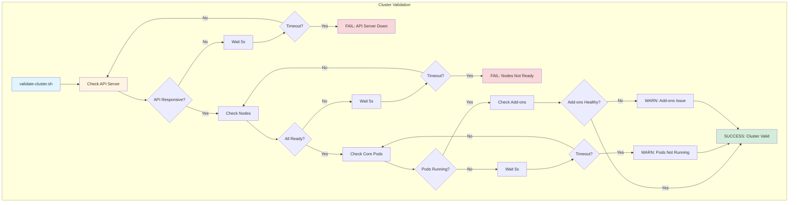
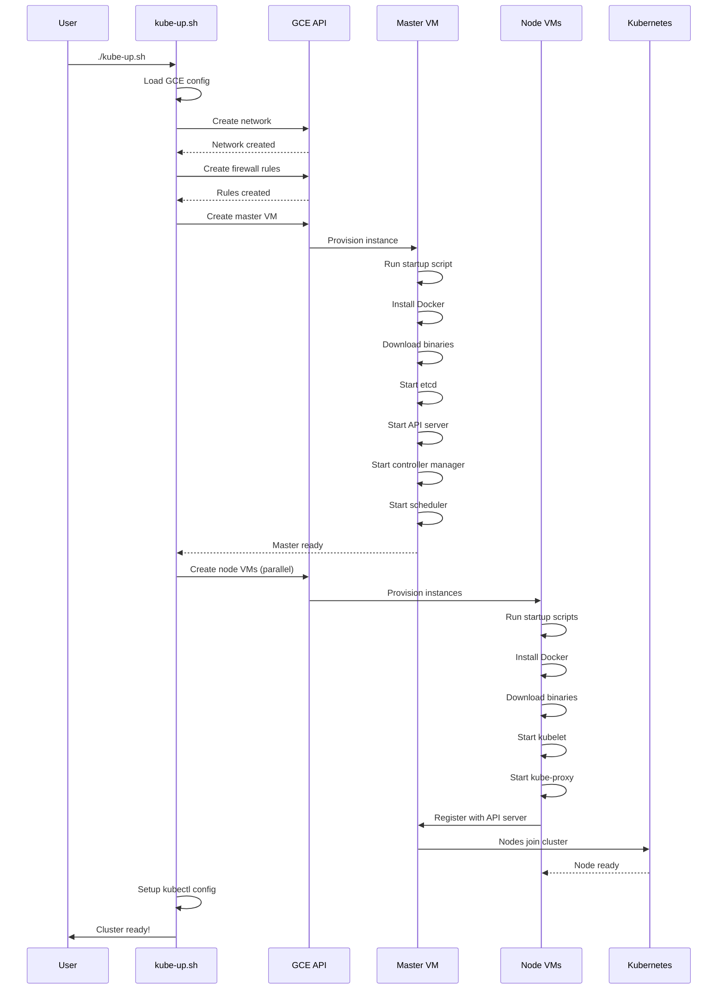
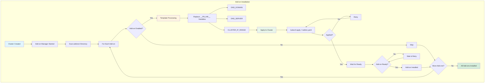
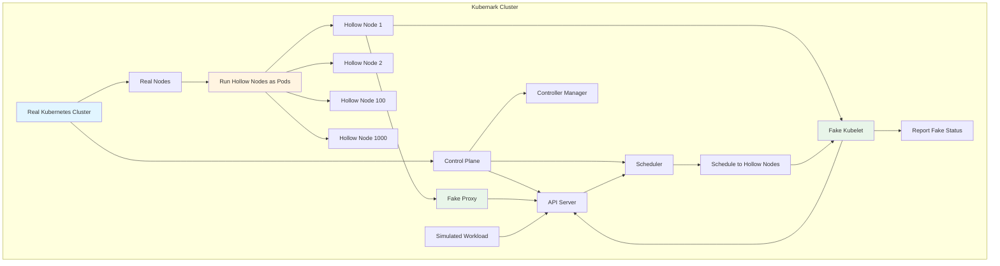

# **KUBERNETES CLUSTER DEPLOYMENT**

**Cluster Deployment Scripts, Configuration, and Automation**

━━━━━━━━━━━━━━━━━━━━━━━━━━━━━━━━━━━━━━━━━━━━━━━━━━━━━━━━━━━━━━━━━━━━━━━━━━━━━━

## **📊 Cluster Deployment At A Glance**

### **Overview**

The `cluster/` directory contains comprehensive deployment automation for bringing up Kubernetes clusters across different cloud providers and environments. While many of these scripts are legacy (replaced by kubeadm in production), they remain valuable for development, testing, and understanding cluster bootstrap processes.

| Aspect | Details |
|--------|---------|
| **Location** | `/Users/sureshscribnar/Documents/Projects/opensource/kubernetes/cluster/` |
| **Primary Use** | Development clusters, testing, CI/CD |
| **Production Tool** | kubeadm (see cmd/kubeadm/) |
| **Cloud Providers** | GCE, AWS, Azure (via cluster/gce/) |
| **Main Scripts** | kube-up.sh, kube-down.sh, kubectl.sh, validate-cluster.sh |
| **Maintenance** | 🚧 STABLE - Maintained for development use |

### **Cluster Directory Structure**

```
cluster/
├── Cluster Lifecycle Scripts
│   ├── kube-up.sh              # ✅ Create cluster
│   ├── kube-down.sh            # ✅ Destroy cluster
│   ├── kubectl.sh              # ✅ kubectl wrapper with cluster config
│   ├── validate-cluster.sh     # ✅ Verify cluster health
│   ├── common.sh               # ✅ Common functions
│   ├── kube-util.sh            # ✅ Utility functions
│   └── get-kube.sh             # ✅ Download Kubernetes release
│
├── gce/                        # ✅ Google Cloud Platform deployment
│   ├── config-default.sh       #    Default GCE configuration
│   ├── configure-vm.sh         #    VM instance setup
│   ├── upgrade.sh              #    Cluster upgrade automation
│   ├── util.sh                 #    GCE-specific utilities
│   ├── gci/                    #    Google Container-Optimized OS (22 subdirs)
│   ├── windows/                #    Windows node support (10 subdirs)
│   └── [15 more subdirectories]
│
├── addons/                     # ✅ Cluster add-ons
│   ├── dns/                    #    CoreDNS/kube-dns
│   ├── metrics-server/         #    Metrics Server
│   ├── dashboard/              #    Kubernetes Dashboard
│   ├── storage-class/          #    Storage class definitions
│   ├── volumesnapshots/        #    Volume snapshot CRDs
│   ├── calico-policy-controller/ # Network policy
│   ├── fluentd-gcp/            #    Logging (GCP)
│   ├── metadata-agent/         #    Metadata service
│   ├── node-problem-detector/  #    Node diagnostics
│   └── [12 more addons]
│
├── kubemark/                   # ✅ Hollow node testing
│   ├── start-kubemark.sh       #    Start hollow nodes
│   ├── stop-kubemark.sh        #    Stop hollow nodes
│   └── config/                 #    Kubemark configuration
│
├── log-dump/                   # ✅ Cluster log collection
│   ├── log-dump.sh             #    Collect all cluster logs
│   └── core/                   #    Core log collection
│
├── images/                     # ✅ Custom container images
│   └── conformance/            #    Conformance test image
│
├── skeleton/                   # ✅ Template for new providers
│   └── util.sh                 #    Provider interface
│
└── pre-existing/               # ✅ Use existing cluster
    └── util.sh                 #    Pre-existing cluster interface
```

━━━━━━━━━━━━━━━━━━━━━━━━━━━━━━━━━━━━━━━━━━━━━━━━━━━━━━━━━━━━━━━━━━━━━━━━━━━━━━

## **🚀 Cluster Lifecycle Management**

### **Core Deployment Scripts**

The main cluster lifecycle scripts provide a simple interface for creating, managing, and destroying development clusters.

### **kube-up.sh - Create Cluster**

**Location**: `/Users/sureshscribnar/Documents/Projects/opensource/kubernetes/cluster/kube-up.sh`

```bash
#!/usr/bin/env bash

# kube-up.sh creates a Kubernetes cluster
# Delegates to provider-specific implementation

set -o errexit
set -o nounset
set -o pipefail

KUBE_ROOT=$(dirname "${BASH_SOURCE[0]}")/..
source "${KUBE_ROOT}/cluster/kube-util.sh"
source "${KUBE_ROOT}/cluster/common.sh"

# Detect or use specified provider
KUBERNETES_PROVIDER="${KUBERNETES_PROVIDER:-gce}"

# Source provider-specific utilities
source "${KUBE_ROOT}/cluster/${KUBERNETES_PROVIDER}/util.sh"

# Verify prerequisites
verify-prereqs

# Set up cluster configuration
detect-project
detect-primary-zone

# Configure cluster
set-cluster-config

# Create cluster
echo "Creating cluster on ${KUBERNETES_PROVIDER}..."
kube-up

# Verify cluster is healthy
"${KUBE_ROOT}/cluster/validate-cluster.sh"

echo "Cluster created successfully!"
echo "kubectl configured to use cluster: ${CLUSTER_NAME}"
```

### **Cluster Creation Flow**

```mermaid
graph TB
    subgraph "Cluster Creation Process"
        A[./cluster/kube-up.sh] --> B[Load Provider Utils]
        B --> C{Provider?}

        C -->|GCE| D1[cluster/gce/util.sh]
        C -->|AWS| D2[cluster/aws/util.sh]
        C -->|Other| D3[cluster/provider/util.sh]

        D1 --> E[Verify Prerequisites]
        D2 --> E
        D3 --> E

        E --> F[Cloud CLI installed]
        F --> G[Credentials configured]
        G --> H[Project/Region set]

        H --> I[Configure Cluster]
        I --> J[Set cluster name]
        J --> K[Set node count]
        K --> L[Set machine types]
        L --> M[Set network config]

        M --> N[Create Infrastructure]
        N --> O1[Create Network/VPC]
        N --> O2[Create Firewall Rules]
        N --> O3[Create Master VM]
        N --> O4[Create Node VMs]

        O4 --> P[Install Components]
        P --> Q1[Install Docker/containerd]
        P --> Q2[Install kubelet]
        P --> Q3[Install kube-proxy]

        Q3 --> R[Start Control Plane]
        R --> S1[Start etcd]
        R --> S2[Start API server]
        R --> S3[Start Controller manager]
        R --> S4[Start Scheduler]

        S4 --> T[Join Nodes]
        T --> U[Nodes register with API server]

        U --> V[Install Addons]
        V --> W1[CoreDNS]
        V --> W2[kube-proxy]
        V --> W3[CNI plugin]

        W3 --> X[Validate Cluster]
        X --> Y[Check node status]
        Y --> Z[Cluster Ready]
    end

    style A fill:#e1f5ff
    style I fill:#fff4e1
    style N fill:#e8f5e9
    style Z fill:#d4edda
```



### **kube-down.sh - Destroy Cluster**

**Location**: `/Users/sureshscribnar/Documents/Projects/opensource/kubernetes/cluster/kube-down.sh`

```bash
#!/usr/bin/env bash

# kube-down.sh destroys a Kubernetes cluster

set -o errexit
set -o nounset
set -o pipefail

KUBE_ROOT=$(dirname "${BASH_SOURCE[0]}")/..
source "${KUBE_ROOT}/cluster/kube-util.sh"

# Detect provider
KUBERNETES_PROVIDER="${KUBERNETES_PROVIDER:-gce}"
source "${KUBE_ROOT}/cluster/${KUBERNETES_PROVIDER}/util.sh"

# Confirm deletion
echo "WARNING: This will delete cluster: ${CLUSTER_NAME}"
read -p "Are you sure? (yes/no): " confirm

if [[ "${confirm}" != "yes" ]]; then
  echo "Cluster deletion cancelled"
  exit 0
fi

# Delete cluster
echo "Deleting cluster..."
kube-down

echo "Cluster deleted successfully"
```

### **kubectl.sh - Configured kubectl**

**Location**: `/Users/sureshscribnar/Documents/Projects/opensource/kubernetes/cluster/kubectl.sh`

```bash
#!/usr/bin/env bash

# kubectl.sh is a wrapper that uses cluster-specific config

set -o errexit
set -o nounset
set -o pipefail

KUBE_ROOT=$(dirname "${BASH_SOURCE[0]}")/..
source "${KUBE_ROOT}/cluster/kube-util.sh"

# Detect provider and get kubeconfig
KUBERNETES_PROVIDER="${KUBERNETES_PROVIDER:-gce}"
source "${KUBE_ROOT}/cluster/${KUBERNETES_PROVIDER}/util.sh"

# Get kubeconfig path
KUBECONFIG="${KUBECONFIG:-$(detect-kubeconfig)}"

# Run kubectl with cluster config
kubectl --kubeconfig="${KUBECONFIG}" "$@"
```

### **validate-cluster.sh - Health Check**

**Location**: `/Users/sureshscribnar/Documents/Projects/opensource/kubernetes/cluster/validate-cluster.sh`

```bash
#!/usr/bin/env bash

# validate-cluster.sh verifies cluster health

set -o errexit
set -o nounset
set -o pipefail

KUBE_ROOT=$(dirname "${BASH_SOURCE[0]}")/..
source "${KUBE_ROOT}/cluster/kube-util.sh"

KUBERNETES_PROVIDER="${KUBERNETES_PROVIDER:-gce}"
source "${KUBE_ROOT}/cluster/${KUBERNETES_PROVIDER}/util.sh"

echo "Validating cluster ${CLUSTER_NAME}..."

# Wait for API server
echo "Checking API server..."
attempt=0
while ! kubectl cluster-info &> /dev/null; do
  if [[ ${attempt} -gt 60 ]]; then
    echo "ERROR: API server not available after 60 attempts"
    exit 1
  fi
  echo "Waiting for API server... (${attempt}/60)"
  sleep 5
  ((attempt++))
done
echo "✓ API server is responsive"

# Check nodes are ready
echo "Checking nodes..."
attempt=0
while true; do
  not_ready=$(kubectl get nodes --no-headers 2>/dev/null | \
              grep -v -w "Ready" | wc -l)

  if [[ ${not_ready} -eq 0 ]]; then
    echo "✓ All nodes are Ready"
    break
  fi

  if [[ ${attempt} -gt 60 ]]; then
    echo "ERROR: Nodes not ready after 60 attempts"
    kubectl get nodes
    exit 1
  fi

  echo "Waiting for nodes... (${attempt}/60, ${not_ready} not ready)"
  sleep 5
  ((attempt++))
done

# Check core pods
echo "Checking core pods..."
namespaces=("kube-system" "kube-public")
for ns in "${namespaces[@]}"; do
  not_running=$(kubectl get pods -n "${ns}" --no-headers 2>/dev/null | \
                grep -v "Running\|Completed" | wc -l)

  if [[ ${not_running} -eq 0 ]]; then
    echo "✓ All pods in ${ns} are Running"
  else
    echo "WARNING: ${not_running} pods in ${ns} are not Running"
    kubectl get pods -n "${ns}"
  fi
done

echo ""
echo "Cluster validation successful!"
echo "Cluster ${CLUSTER_NAME} is healthy and ready to use."
```

### **Validation Process**



━━━━━━━━━━━━━━━━━━━━━━━━━━━━━━━━━━━━━━━━━━━━━━━━━━━━━━━━━━━━━━━━━━━━━━━━━━━━━━

## **☁️ GCE Provider Implementation**

### **GCE Deployment Architecture**

The GCE provider is the most complete implementation and serves as the reference for other providers.

**Location**: `/Users/sureshscribnar/Documents/Projects/opensource/kubernetes/cluster/gce/`

### **GCE Directory Structure**

```
gce/
├── config-default.sh           # Default configuration
├── config-test.sh              # Test cluster configuration
├── util.sh                     # GCE provider implementation
├── configure-vm.sh             # VM instance configuration
├── upgrade.sh                  # Cluster upgrade automation
├── list-resources.sh           # List GCE resources
├── delete-nodes.sh             # Node management
│
├── gci/                        # Google Container-Optimized OS
│   ├── node.yaml               #   Node configuration
│   ├── master.yaml             #   Master configuration
│   ├── configure.sh            #   GCI setup scripts
│   ├── health-monitor.sh       #   Node health monitoring
│   └── [18 more files]
│
├── windows/                    # Windows node support
│   ├── configure.ps1           #   Windows node setup
│   ├── k8s-node-setup.psm1     #   PowerShell module
│   └── [8 more files]
│
└── manifests/                  # Static pod manifests
    ├── kube-apiserver.manifest
    ├── kube-controller-manager.manifest
    ├── kube-scheduler.manifest
    └── etcd.manifest
```

### **GCE Configuration**

**File**: `/Users/sureshscribnar/Documents/Projects/opensource/kubernetes/cluster/gce/config-default.sh`

```bash
#!/usr/bin/env bash

# Default GCE cluster configuration

# Project and zone
GCE_PROJECT="${GCE_PROJECT:-kubernetes-dev}"
GCE_ZONE="${GCE_ZONE:-us-central1-b}"

# Cluster configuration
CLUSTER_NAME="${CLUSTER_NAME:-kubernetes}"
NUM_NODES="${NUM_NODES:-3}"
MASTER_SIZE="${MASTER_SIZE:-n1-standard-2}"
NODE_SIZE="${NODE_SIZE:-n1-standard-2}"

# Image configuration
GCE_IMAGE="${GCE_IMAGE:-cos-stable}"
GCE_IMAGE_PROJECT="${GCE_IMAGE_PROJECT:-cos-cloud}"

# Network configuration
NETWORK="${NETWORK:-default}"
ENABLE_IP_ALIASES="${ENABLE_IP_ALIASES:-true}"
CLUSTER_IP_RANGE="${CLUSTER_IP_RANGE:-10.244.0.0/16}"
SERVICE_CLUSTER_IP_RANGE="${SERVICE_CLUSTER_IP_RANGE:-10.0.0.0/16}"

# Kubernetes configuration
KUBERNETES_VERSION="${KUBERNETES_VERSION:-}"
KUBE_ENABLE_CLUSTER_DNS="${KUBE_ENABLE_CLUSTER_DNS:-true}"
KUBE_ENABLE_NODE_PROBLEM_DETECTOR="${KUBE_ENABLE_NODE_PROBLEM_DETECTOR:-true}"

# Feature gates
FEATURE_GATES="${FEATURE_GATES:-}"

# Admission plugins
ADMISSION_CONTROL="${ADMISSION_CONTROL:-NodeRestriction,PodSecurityPolicy}"

# Storage
ENABLE_DEFAULT_STORAGE_CLASS="${ENABLE_DEFAULT_STORAGE_CLASS:-true}"
DEFAULT_STORAGE_CLASS="${DEFAULT_STORAGE_CLASS:-standard}"
```

### **GCE Cluster Creation**

```bash
# File: cluster/gce/util.sh (simplified)

function kube-up() {
  # Detect or create network
  detect-or-create-network

  # Create firewall rules
  create-firewall-rules

  # Create master instance
  echo "Creating master instance..."
  gcloud compute instances create "${MASTER_NAME}" \
    --project="${GCE_PROJECT}" \
    --zone="${GCE_ZONE}" \
    --machine-type="${MASTER_SIZE}" \
    --image="${GCE_IMAGE}" \
    --image-project="${GCE_IMAGE_PROJECT}" \
    --boot-disk-size=200GB \
    --metadata-from-file \
      startup-script=configure-vm.sh,\
      kube-env=kube-env.yaml \
    --tags=kubernetes-master \
    --scopes=cloud-platform

  # Wait for master to be ready
  wait-for-master

  # Create node instances
  echo "Creating ${NUM_NODES} node instances..."
  for ((i=0; i<${NUM_NODES}; i++)); do
    gcloud compute instances create "${NODE_NAME_PREFIX}-${i}" \
      --project="${GCE_PROJECT}" \
      --zone="${GCE_ZONE}" \
      --machine-type="${NODE_SIZE}" \
      --image="${GCE_IMAGE}" \
      --image-project="${GCE_IMAGE_PROJECT}" \
      --boot-disk-size=100GB \
      --metadata-from-file \
        startup-script=configure-vm.sh,\
        kube-env=kube-env.yaml \
      --tags=kubernetes-node \
      --scopes=cloud-platform &
  done

  wait  # Wait for all nodes to be created

  # Configure kubectl
  setup-kubeconfig
}
```

### **GCE Deployment Flow**



### **VM Configuration Script**

**File**: `/Users/sureshscribnar/Documents/Projects/opensource/kubernetes/cluster/gce/configure-vm.sh`

```bash
#!/usr/bin/env bash

# configure-vm.sh runs on each VM instance during startup

set -o errexit
set -o nounset
set -o pipefail

# Load configuration from metadata
curl -H "Metadata-Flavor: Google" \
  http://metadata.google.internal/computeMetadata/v1/instance/attributes/kube-env \
  -o /tmp/kube-env

source /tmp/kube-env

# Install Docker
if ! command -v docker &> /dev/null; then
  curl -fsSL https://get.docker.com | sh
  systemctl enable docker
  systemctl start docker
fi

# Download Kubernetes binaries
KUBE_VERSION="${KUBERNETES_VERSION:-v1.28.0}"
KUBE_URL="https://dl.k8s.io/${KUBE_VERSION}/bin/linux/amd64"

for binary in kubelet kube-proxy kubectl; do
  curl -L "${KUBE_URL}/${binary}" -o "/usr/local/bin/${binary}"
  chmod +x "/usr/local/bin/${binary}"
done

# Configure based on role
if [[ "${KUBE_NODE_ROLE}" == "master" ]]; then
  # Master configuration
  configure-master
else
  # Node configuration
  configure-node
fi

echo "VM configuration complete"
```

━━━━━━━━━━━━━━━━━━━━━━━━━━━━━━━━━━━━━━━━━━━━━━━━━━━━━━━━━━━━━━━━━━━━━━━━━━━━━━

## **🔌 Cluster Add-ons**

### **Add-on Architecture**

Cluster add-ons are additional components that provide essential cluster services like DNS, monitoring, and logging.

**Location**: `/Users/sureshscribnar/Documents/Projects/opensource/kubernetes/cluster/addons/`

### **Add-on Categories**

```
addons/
├── dns/                        # ✅ DNS service (CoreDNS)
│   ├── coredns/
│   │   ├── coredns.yaml.base
│   │   └── coredns.yaml.in
│   └── kube-dns/
│       └── kube-dns.yaml.base
│
├── metrics-server/             # ✅ Resource metrics
│   ├── metrics-server-deployment.yaml
│   └── metrics-server-service.yaml
│
├── dashboard/                  # 🚧 Kubernetes Dashboard (optional)
│   └── dashboard.yaml
│
├── storage-class/              # ✅ Default storage classes
│   ├── gce/
│   │   └── default.yaml
│   └── aws/
│       └── default.yaml
│
├── volumesnapshots/            # ✅ Volume snapshot CRDs
│   ├── crd/
│   │   ├── snapshot.storage.k8s.io_volumesnapshots.yaml
│   │   ├── snapshot.storage.k8s.io_volumesnapshotcontents.yaml
│   │   └── snapshot.storage.k8s.io_volumesnapshotclasses.yaml
│   └── volume-snapshot-controller/
│
├── calico-policy-controller/   # 🚧 Network policy (Calico)
│   └── calico-policy-controller.yaml
│
├── fluentd-gcp/                # 🚧 Logging (GCP)
│   ├── fluentd-gcp-ds.yaml
│   └── fluentd-gcp-configmap.yaml
│
├── metadata-agent/             # ✅ GCP metadata service
│   └── stackdriver/
│
├── node-problem-detector/      # ✅ Node diagnostics
│   ├── npd.yaml
│   └── npd-config.yaml
│
├── ip-masq-agent/              # ✅ IP masquerading
│   └── ip-masq-agent.yaml
│
├── kube-proxy/                 # ✅ kube-proxy DaemonSet
│   └── kube-proxy-ds.yaml
│
├── rbac/                       # ✅ RBAC configurations
│   ├── cluster-loadbalancing/
│   └── kubelet-api-auth/
│
└── addon-manager/              # ✅ Add-on lifecycle manager
    ├── kube-addons.sh
    └── namespace.yaml
```

### **CoreDNS Add-on**

**File**: `/Users/sureshscribnar/Documents/Projects/opensource/kubernetes/cluster/addons/dns/coredns/coredns.yaml.base`

```yaml
apiVersion: v1
kind: ServiceAccount
metadata:
  name: coredns
  namespace: kube-system
---
apiVersion: rbac.authorization.k8s.io/v1
kind: ClusterRole
metadata:
  name: system:coredns
rules:
- apiGroups: [""]
  resources: ["endpoints", "services", "pods", "namespaces"]
  verbs: ["list", "watch"]
- apiGroups: ["discovery.k8s.io"]
  resources: ["endpointslices"]
  verbs: ["list", "watch"]
---
apiVersion: rbac.authorization.k8s.io/v1
kind: ClusterRoleBinding
metadata:
  name: system:coredns
roleRef:
  apiGroup: rbac.authorization.k8s.io
  kind: ClusterRole
  name: system:coredns
subjects:
- kind: ServiceAccount
  name: coredns
  namespace: kube-system
---
apiVersion: v1
kind: ConfigMap
metadata:
  name: coredns
  namespace: kube-system
data:
  Corefile: |
    .:53 {
        errors
        health {
          lameduck 5s
        }
        ready
        kubernetes __PILLAR__DNS__DOMAIN__ in-addr.arpa ip6.arpa {
          pods insecure
          fallthrough in-addr.arpa ip6.arpa
          ttl 30
        }
        prometheus :9153
        forward . /etc/resolv.conf {
          max_concurrent 1000
        }
        cache 30
        loop
        reload
        loadbalance
    }
---
apiVersion: apps/v1
kind: Deployment
metadata:
  name: coredns
  namespace: kube-system
  labels:
    k8s-app: kube-dns
spec:
  replicas: __PILLAR__DNS__REPLICAS__
  selector:
    matchLabels:
      k8s-app: kube-dns
  template:
    metadata:
      labels:
        k8s-app: kube-dns
    spec:
      serviceAccountName: coredns
      containers:
      - name: coredns
        image: registry.k8s.io/coredns/coredns:v1.10.1
        resources:
          limits:
            memory: 170Mi
          requests:
            cpu: 100m
            memory: 70Mi
        args: [ "-conf", "/etc/coredns/Corefile" ]
        volumeMounts:
        - name: config-volume
          mountPath: /etc/coredns
          readOnly: true
        ports:
        - containerPort: 53
          name: dns
          protocol: UDP
        - containerPort: 53
          name: dns-tcp
          protocol: TCP
        - containerPort: 9153
          name: metrics
          protocol: TCP
        livenessProbe:
          httpGet:
            path: /health
            port: 8080
            scheme: HTTP
          initialDelaySeconds: 60
          timeoutSeconds: 5
          successThreshold: 1
          failureThreshold: 5
        readinessProbe:
          httpGet:
            path: /ready
            port: 8181
            scheme: HTTP
      volumes:
      - name: config-volume
        configMap:
          name: coredns
          items:
          - key: Corefile
            path: Corefile
---
apiVersion: v1
kind: Service
metadata:
  name: kube-dns
  namespace: kube-system
  labels:
    k8s-app: kube-dns
spec:
  selector:
    k8s-app: kube-dns
  clusterIP: __PILLAR__DNS__SERVER__
  ports:
  - name: dns
    port: 53
    protocol: UDP
  - name: dns-tcp
    port: 53
    protocol: TCP
  - name: metrics
    port: 9153
    protocol: TCP
```

### **Add-on Installation Flow**



### **Metrics Server Add-on**

**File**: `/Users/sureshscribnar/Documents/Projects/opensource/kubernetes/cluster/addons/metrics-server/metrics-server-deployment.yaml`

```yaml
apiVersion: v1
kind: ServiceAccount
metadata:
  name: metrics-server
  namespace: kube-system
---
apiVersion: apps/v1
kind: Deployment
metadata:
  name: metrics-server
  namespace: kube-system
  labels:
    k8s-app: metrics-server
spec:
  selector:
    matchLabels:
      k8s-app: metrics-server
  template:
    metadata:
      labels:
        k8s-app: metrics-server
    spec:
      serviceAccountName: metrics-server
      containers:
      - name: metrics-server
        image: registry.k8s.io/metrics-server/metrics-server:v0.6.4
        args:
        - --cert-dir=/tmp
        - --secure-port=4443
        - --kubelet-preferred-address-types=InternalIP,ExternalIP,Hostname
        - --kubelet-use-node-status-port
        - --metric-resolution=15s
        ports:
        - containerPort: 4443
          name: https
          protocol: TCP
        resources:
          requests:
            cpu: 100m
            memory: 200Mi
        volumeMounts:
        - name: tmp-dir
          mountPath: /tmp
      volumes:
      - name: tmp-dir
        emptyDir: {}
---
apiVersion: v1
kind: Service
metadata:
  name: metrics-server
  namespace: kube-system
  labels:
    k8s-app: metrics-server
spec:
  selector:
    k8s-app: metrics-server
  ports:
  - port: 443
    protocol: TCP
    targetPort: https
---
apiVersion: apiregistration.k8s.io/v1
kind: APIService
metadata:
  name: v1beta1.metrics.k8s.io
spec:
  service:
    name: metrics-server
    namespace: kube-system
  group: metrics.k8s.io
  version: v1beta1
  insecureSkipTLSVerify: true
  groupPriorityMinimum: 100
  versionPriority: 100
```

━━━━━━━━━━━━━━━━━━━━━━━━━━━━━━━━━━━━━━━━━━━━━━━━━━━━━━━━━━━━━━━━━━━━━━━━━━━━━━

## **🧪 Kubemark - Hollow Node Testing**

### **Kubemark Overview**

Kubemark creates a performance testing environment with "hollow" nodes that simulate real nodes without running actual containers.

**Location**: `/Users/sureshscribnar/Documents/Projects/opensource/kubernetes/cluster/kubemark/`

### **Kubemark Architecture**



### **start-kubemark.sh**

```bash
#!/usr/bin/env bash

# start-kubemark.sh creates hollow nodes for performance testing

set -o errexit
set -o nounset
set -o pipefail

KUBE_ROOT=$(dirname "${BASH_SOURCE[0]}")/../..

# Configuration
NUM_HOLLOW_NODES="${NUM_HOLLOW_NODES:-1000}"
KUBEMARK_MASTER="${KUBEMARK_MASTER:-kubemark-master}"

# Create namespace
kubectl create namespace kubemark

# Create configmap with kubeconfig for hollow nodes
kubectl create configmap kubeconfig \
  --from-file=kubeconfig=/etc/kubernetes/admin.conf \
  -n kubemark

# Create hollow node template
cat <<EOF | kubectl apply -f -
apiVersion: v1
kind: ReplicationController
metadata:
  name: hollow-node
  namespace: kubemark
spec:
  replicas: ${NUM_HOLLOW_NODES}
  selector:
    name: hollow-node
  template:
    metadata:
      labels:
        name: hollow-node
    spec:
      containers:
      - name: hollow-kubelet
        image: registry.k8s.io/kubemark:latest
        command:
        - /bin/sh
        - -c
        - /kubemark --morph=kubelet --name=\$(hostname) --kubeconfig=/kubeconfig/kubeconfig
        volumeMounts:
        - name: kubeconfig-volume
          mountPath: /kubeconfig
          readOnly: true
      - name: hollow-proxy
        image: registry.k8s.io/kubemark:latest
        command:
        - /bin/sh
        - -c
        - /kubemark --morph=proxy --kubeconfig=/kubeconfig/kubeconfig
        volumeMounts:
        - name: kubeconfig-volume
          mountPath: /kubeconfig
          readOnly: true
      volumes:
      - name: kubeconfig-volume
        configMap:
          name: kubeconfig
EOF

echo "Started ${NUM_HOLLOW_NODES} hollow nodes"
echo "Monitor with: kubectl get nodes"
```

### **Kubemark Use Cases**

| Scenario | Hollow Nodes | Purpose | Metrics |
|----------|------------:|---------|---------|
| **Control Plane Scalability** | 5,000 | Test API server with many nodes | API latency, etcd performance |
| **Scheduler Performance** | 2,000 | Test scheduling at scale | Scheduling throughput, latency |
| **Controller Scalability** | 3,000 | Test controllers with many objects | Reconciliation time, memory usage |
| **Pod Density** | 1,000 | Test with 100 pods/node | API calls, watch efficiency |

━━━━━━━━━━━━━━━━━━━━━━━━━━━━━━━━━━━━━━━━━━━━━━━━━━━━━━━━━━━━━━━━━━━━━━━━━━━━━━

## **📋 Log Collection**

### **log-dump.sh - Comprehensive Log Collection**

**Location**: `/Users/sureshscribnar/Documents/Projects/opensource/kubernetes/cluster/log-dump/log-dump.sh`

```bash
#!/usr/bin/env bash

# log-dump.sh collects all cluster logs for debugging

set -o errexit
set -o nounset
set -o pipefail

KUBE_ROOT=$(dirname "${BASH_SOURCE[0]}")/../..
source "${KUBE_ROOT}/cluster/kube-util.sh"

# Output directory
LOG_DIR="${LOG_DIR:-/tmp/kubernetes-logs-$(date +%Y%m%d-%H%M%S)}"
mkdir -p "${LOG_DIR}"

echo "Collecting cluster logs to ${LOG_DIR}..."

# Collect cluster info
kubectl cluster-info dump --output-directory="${LOG_DIR}/cluster-info"

# Collect node logs
echo "Collecting node logs..."
for node in $(kubectl get nodes -o name | cut -d/ -f2); do
  node_dir="${LOG_DIR}/nodes/${node}"
  mkdir -p "${node_dir}"

  # Describe node
  kubectl describe node "${node}" > "${node_dir}/describe.txt"

  # Get node logs (if accessible)
  if kubectl get node "${node}" -o jsonpath='{.status.addresses[?(@.type=="InternalIP")].address}' &> /dev/null; then
    node_ip=$(kubectl get node "${node}" -o jsonpath='{.status.addresses[?(@.type=="InternalIP")].address}')

    # SSH and collect logs
    ssh "${node_ip}" "sudo journalctl -u kubelet" > "${node_dir}/kubelet.log" || true
    ssh "${node_ip}" "sudo journalctl -u docker" > "${node_dir}/docker.log" || true
  fi
done

# Collect pod logs
echo "Collecting pod logs..."
for ns in $(kubectl get namespaces -o name | cut -d/ -f2); do
  ns_dir="${LOG_DIR}/pods/${ns}"
  mkdir -p "${ns_dir}"

  for pod in $(kubectl get pods -n "${ns}" -o name | cut -d/ -f2); do
    pod_dir="${ns_dir}/${pod}"
    mkdir -p "${pod_dir}"

    # Describe pod
    kubectl describe pod -n "${ns}" "${pod}" > "${pod_dir}/describe.txt"

    # Get pod logs (all containers)
    for container in $(kubectl get pod -n "${ns}" "${pod}" -o jsonpath='{.spec.containers[*].name}'); do
      kubectl logs -n "${ns}" "${pod}" -c "${container}" > "${pod_dir}/${container}.log" 2>&1 || true
      kubectl logs -n "${ns}" "${pod}" -c "${container}" --previous > "${pod_dir}/${container}.previous.log" 2>&1 || true
    done
  done
done

# Collect events
echo "Collecting events..."
kubectl get events --all-namespaces --sort-by='.lastTimestamp' > "${LOG_DIR}/events.txt"

# Create tarball
echo "Creating tarball..."
tar czf "${LOG_DIR}.tar.gz" -C "$(dirname ${LOG_DIR})" "$(basename ${LOG_DIR})"

echo "Log collection complete: ${LOG_DIR}.tar.gz"
```

### **Log Collection Flow**

```mermaid
graph TB
    subgraph "Log Collection Process"
        A[log-dump.sh] --> B[Create Output Dir]
        B --> C[Collect Cluster Info]

        C --> D1[kubectl cluster-info dump]
        D1 --> E[Cluster Metadata]

        C --> F[For Each Node]
        F --> G1[kubectl describe node]
        F --> G2[SSH to node]
        G2 --> H1[journalctl kubelet]
        G2 --> H2[journalctl docker]
        G2 --> H3[System logs]

        C --> I[For Each Namespace]
        I --> J[For Each Pod]
        J --> K1[kubectl describe pod]
        J --> K2[kubectl logs (all containers)]
        J --> K3[Previous logs]

        C --> L[Collect Events]
        L --> M[kubectl get events --all-namespaces]

        M --> N[Create Tarball]
        N --> O[logs-TIMESTAMP.tar.gz]
    end

    style A fill:#e1f5ff
    style C fill:#fff4e1
    style N fill:#e8f5e9
    style O fill:#d4edda
```

━━━━━━━━━━━━━━━━━━━━━━━━━━━━━━━━━━━━━━━━━━━━━━━━━━━━━━━━━━━━━━━━━━━━━━━━━━━━━━

## **🎓 Best Practices**

### **Development Clusters**

```bash
# ✅ GOOD: Use cluster scripts for development
export KUBERNETES_PROVIDER=gce
export NUM_NODES=3
./cluster/kube-up.sh

# ✅ GOOD: Validate after creation
./cluster/validate-cluster.sh

# ✅ GOOD: Use cluster kubectl wrapper
./cluster/kubectl.sh get nodes

# ❌ BAD: Don't use for production
# Use kubeadm for production clusters
```

### **Testing at Scale**

```bash
# ✅ GOOD: Use Kubemark for scale testing
export NUM_HOLLOW_NODES=1000
./cluster/kubemark/start-kubemark.sh

# ✅ GOOD: Monitor performance
kubectl top nodes
kubectl get --raw /metrics

# ✅ GOOD: Clean up after testing
./cluster/kubemark/stop-kubemark.sh
```

### **Troubleshooting Clusters**

```bash
# ✅ GOOD: Collect comprehensive logs
./cluster/log-dump/log-dump.sh

# ✅ GOOD: Check cluster health
./cluster/validate-cluster.sh

# ✅ GOOD: Check individual components
./cluster/kubectl.sh get componentstatuses
./cluster/kubectl.sh get nodes
./cluster/kubectl.sh get pods --all-namespaces
```

━━━━━━━━━━━━━━━━━━━━━━━━━━━━━━━━━━━━━━━━━━━━━━━━━━━━━━━━━━━━━━━━━━━━━━━━━━━━━━

## **🔍 Troubleshooting**

### **Common Issues**

| Issue | Cause | Solution |
|-------|-------|----------|
| **kube-up.sh fails** | Cloud credentials not set | Configure `gcloud auth` or `aws configure` |
| **Nodes not joining** | Network/firewall issues | Check firewall rules, network connectivity |
| **Add-ons not starting** | Resource constraints | Check node resources, increase node size |
| **DNS not working** | CoreDNS not ready | Check CoreDNS pods: `kubectl get pods -n kube-system` |
| **kubectl connection refused** | API server not ready | Wait and retry, check master logs |

### **Debugging Cluster Creation**

```bash
# Enable verbose output
export KUBE_VERBOSE=1
./cluster/kube-up.sh

# Check GCE instances
gcloud compute instances list --project="${GCE_PROJECT}"

# SSH to master
gcloud compute ssh kubernetes-master --project="${GCE_PROJECT}"

# Check component status on master
sudo systemctl status etcd
sudo systemctl status kube-apiserver
sudo systemctl status kube-controller-manager
sudo systemctl status kube-scheduler

# Check component logs
sudo journalctl -u etcd -f
sudo journalctl -u kube-apiserver -f
```

### **Add-on Debugging**

```bash
# Check add-on status
kubectl get pods -n kube-system

# Check specific add-on
kubectl describe pod -n kube-system coredns-xxxxx

# Check add-on logs
kubectl logs -n kube-system coredns-xxxxx

# Restart add-on
kubectl rollout restart deployment -n kube-system coredns
```

━━━━━━━━━━━━━━━━━━━━━━━━━━━━━━━━━━━━━━━━━━━━━━━━━━━━━━━━━━━━━━━━━━━━━━━━━━━━━━

## **📚 Navigation**

### **Related Documentation**

| Document | Description |
|----------|-------------|
| **[01-repository-overview.md](01-repository-overview.md)** | Complete repository structure |
| **[02-cmd-binaries.md](02-cmd-binaries.md)** | Binary commands including kubeadm |
| **[06-test-infrastructure.md](06-test-infrastructure.md)** | Testing framework and E2E tests |
| **[07-hack-tools.md](07-hack-tools.md)** | Development scripts and automation |
| **[08-build-system.md](08-build-system.md)** | Build infrastructure |

### **External Resources**

- [kubeadm Documentation](https://kubernetes.io/docs/setup/production-environment/tools/kubeadm/)
- [Cluster API](https://cluster-api.sigs.k8s.io/)
- [kops](https://kops.sigs.k8s.io/)
- [Google Kubernetes Engine](https://cloud.google.com/kubernetes-engine)

━━━━━━━━━━━━━━━━━━━━━━━━━━━━━━━━━━━━━━━━━━━━━━━━━━━━━━━━━━━━━━━━━━━━━━━━━━━━━━

## **✅ Summary**

The cluster deployment infrastructure provides comprehensive automation for development and testing:

- **Lifecycle Management**: Simple scripts for creating, validating, and destroying clusters
- **GCE Provider**: Complete reference implementation for Google Cloud Platform
- **Cluster Add-ons**: Essential services like DNS, metrics, and monitoring
- **Kubemark**: Performance testing with hollow nodes at massive scale
- **Log Collection**: Comprehensive debugging information gathering
- **Development Focus**: Optimized for development and CI/CD workflows

**Important Note**: For production clusters, use **kubeadm** (see `cmd/kubeadm/`) or managed Kubernetes services. The cluster/ scripts are primarily for development, testing, and CI/CD environments.

---

**Document Version**: 1.0
**Last Updated**: 2025-11-16
**Maintainer**: Kubernetes SIG Testing / SIG Cluster Lifecycle
