# **KUBERNETES API DEFINITIONS**

**OpenAPI Specifications, Discovery Documents, and API Generation**

━━━━━━━━━━━━━━━━━━━━━━━━━━━━━━━━━━━━━━━━━━━━━━━━━━━━━━━━━━━━━━━━━━━━━━━━━━━━━━

## **📋 Table of Contents**

1. [Overview](#overview)
2. [Directory Structure](#directory-structure)
3. [OpenAPI Specifications](#openapi-specifications)
4. [Discovery Documents](#discovery-documents)
5. [API Rules](#api-rules)
6. [API Generation Workflow](#api-generation-workflow)
7. [Relationship to Other Directories](#relationship-to-other-directories)
8. [API Consumption](#api-consumption)
9. [Development Workflows](#development-workflows)
10. [Troubleshooting](#troubleshooting)

━━━━━━━━━━━━━━━━━━━━━━━━━━━━━━━━━━━━━━━━━━━━━━━━━━━━━━━━━━━━━━━━━━━━━━━━━━━━━━

## **🎯 Overview**

### **Purpose**

The `api/` directory contains **generated API documentation and specifications** that describe the Kubernetes API surface. It serves as the **machine-readable contract** between the API server and clients.

**Location**: `/Users/sureshscribnar/Documents/Projects/opensource/kubernetes/api/`

### **Key Responsibilities**

| Responsibility | Description |
|----------------|-------------|
| **OpenAPI Specs** | OpenAPI v2 (Swagger) and v3 specifications for all Kubernetes APIs |
| **Discovery Documents** | Group/version discovery metadata consumed by clients |
| **API Rules** | Validation rules ensuring API consistency and compatibility |
| **Client Generation** | Source for generating client libraries and SDKs |
| **Documentation** | Machine-readable API documentation for tools |

### **Important Characteristics**

✅ **Generated Content** - All files are auto-generated, do not edit manually
✅ **Build Artifact** - Created during build process from source types
✅ **Versioned** - Contains specs for all API versions (v1, v1beta1, v1alpha1)
✅ **Complete** - Covers all API groups including core, apps, batch, etc.
✅ **Machine-Readable** - JSON format for tool consumption

━━━━━━━━━━━━━━━━━━━━━━━━━━━━━━━━━━━━━━━━━━━━━━━━━━━━━━━━━━━━━━━━━━━━━━━━━━━━━━

## **📁 Directory Structure**

### **Top-Level Layout**

```
/Users/sureshscribnar/Documents/Projects/opensource/kubernetes/api/
│
├── openapi-spec/           # ✅ ACTIVE - OpenAPI specifications (v2 and v3)
│   ├── swagger.json        #    OpenAPI v2 specification (complete API)
│   └── v3/                 #    OpenAPI v3 specifications (per group)
│       ├── apis_openapi.json
│       ├── api__v1_openapi.json
│       ├── apis__apps__v1_openapi.json
│       ├── apis__batch__v1_openapi.json
│       └── [100+ more files]
│
├── discovery/              # ✅ ACTIVE - Discovery documents (62+ files)
│   ├── aggregated_v2.json  #    Complete aggregated discovery
│   ├── api__v1.json        #    Core API v1 discovery
│   ├── apis__apps__v1.json #    apps/v1 group discovery
│   ├── apis__batch__v1.json #   batch/v1 group discovery
│   └── [60+ more group/version files]
│
├── api-rules/              # ✅ ACTIVE - API validation rules
│   ├── violation_exceptions.list
│   ├── codegen_violation_exceptions.list
│   └── [more exception lists]
│
└── OWNERS                  # 🚧 STABLE - Ownership file
```

### **Content Statistics**

| Category | Count | Format |
|----------|------:|--------|
| **OpenAPI v2 Files** | 1 | swagger.json (aggregated) |
| **OpenAPI v3 Files** | 100+ | Per-group JSON files |
| **Discovery Documents** | 62+ | Per-group/version JSON |
| **API Rule Files** | 8 | Exception lists |
| **Total Size** | ~50 MB | JSON specifications |

━━━━━━━━━━━━━━━━━━━━━━━━━━━━━━━━━━━━━━━━━━━━━━━━━━━━━━━━━━━━━━━━━━━━━━━━━━━━━━

## **📄 OpenAPI Specifications**

### **OpenAPI v2 (Swagger)**

**File**: `/Users/sureshscribnar/Documents/Projects/opensource/kubernetes/api/openapi-spec/swagger.json`

**Purpose**: Complete Kubernetes API specification in OpenAPI v2 format (Swagger).

**Characteristics**:
- **Single file** containing all API groups and versions
- **~60,000 lines** of JSON
- **Legacy format** for older tools
- **Comprehensive** - includes all types, operations, and schemas

**Structure**:

```json
{
  "swagger": "2.0",
  "info": {
    "title": "Kubernetes",
    "version": "unversioned"
  },
  "paths": {
    "/api/v1/namespaces": { ... },
    "/api/v1/pods": { ... },
    "/apis/apps/v1/deployments": { ... }
  },
  "definitions": {
    "io.k8s.api.core.v1.Pod": { ... },
    "io.k8s.api.apps.v1.Deployment": { ... }
  }
}
```

### **OpenAPI v3**

**Directory**: `/Users/sureshscribnar/Documents/Projects/opensource/kubernetes/api/openapi-spec/v3/`

**Purpose**: Modern OpenAPI v3 specifications, split by API group for efficiency.

**Organization**:

| File Pattern | Purpose | Example |
|--------------|---------|---------|
| `api__v1_openapi.json` | Core API (v1) | Pods, Services, ConfigMaps |
| `apis__<group>_openapi.json` | Group overview | apis__apps_openapi.json |
| `apis__<group>__<version>_openapi.json` | Specific version | apis__apps__v1_openapi.json |

**Key Files**:

```
v3/
├── apis_openapi.json                      # API groups index
├── api__v1_openapi.json                   # Core v1 API
├── apis__apps__v1_openapi.json            # apps/v1 (Deployments, StatefulSets)
├── apis__batch__v1_openapi.json           # batch/v1 (Jobs, CronJobs)
├── apis__networking.k8s.io__v1_openapi.json  # networking/v1 (Ingress, NetworkPolicy)
├── apis__storage.k8s.io__v1_openapi.json  # storage/v1 (StorageClass, VolumeAttachment)
├── apis__rbac.authorization.k8s.io__v1_openapi.json  # RBAC
└── [100+ more files]
```

### **OpenAPI v3 Structure**

```json
{
  "openapi": "3.0.0",
  "info": {
    "title": "Kubernetes apps/v1",
    "version": "v1.32.0"
  },
  "paths": {
    "/apis/apps/v1/deployments": {
      "get": { "responses": { ... } },
      "post": { "requestBody": { ... } }
    }
  },
  "components": {
    "schemas": {
      "io.k8s.api.apps.v1.Deployment": {
        "type": "object",
        "properties": { ... }
      }
    }
  }
}
```

### **API Groups Covered**

| API Group | Versions | Key Resources |
|-----------|----------|---------------|
| **core** | v1 | Pod, Service, ConfigMap, Secret, PersistentVolume |
| **apps** | v1 | Deployment, StatefulSet, DaemonSet, ReplicaSet |
| **batch** | v1 | Job, CronJob |
| **networking.k8s.io** | v1, v1beta1, v1alpha1 | Ingress, NetworkPolicy, IngressClass |
| **storage.k8s.io** | v1, v1beta1, v1alpha1 | StorageClass, VolumeAttachment, CSIDriver |
| **rbac.authorization.k8s.io** | v1 | Role, RoleBinding, ClusterRole, ClusterRoleBinding |
| **policy** | v1 | PodDisruptionBudget |
| **autoscaling** | v1, v2 | HorizontalPodAutoscaler |
| **certificates.k8s.io** | v1, v1alpha1 | CertificateSigningRequest, ClusterTrustBundle |
| **coordination.k8s.io** | v1, v1alpha2, v1alpha1 | Lease, LeaseCandidate |
| **discovery.k8s.io** | v1 | EndpointSlice |
| **events.k8s.io** | v1 | Event |
| **flowcontrol.apiserver.k8s.io** | v1 | FlowSchema, PriorityLevelConfiguration |
| **node.k8s.io** | v1 | RuntimeClass |
| **scheduling.k8s.io** | v1 | PriorityClass |
| **admissionregistration.k8s.io** | v1, v1beta1, v1alpha1 | ValidatingWebhook, MutatingWebhook |
| **apiextensions.k8s.io** | v1 | CustomResourceDefinition |
| **apiregistration.k8s.io** | v1 | APIService |
| **authentication.k8s.io** | v1, v1beta1, v1alpha1 | TokenRequest, SelfSubjectReview |
| **authorization.k8s.io** | v1 | SubjectAccessReview, SelfSubjectAccessReview |
| **resource.k8s.io** | v1alpha3, v1beta1 | ResourceClaim, DeviceClass |
| **storagemigration.k8s.io** | v1alpha1 | StorageVersionMigration |

━━━━━━━━━━━━━━━━━━━━━━━━━━━━━━━━━━━━━━━━━━━━━━━━━━━━━━━━━━━━━━━━━━━━━━━━━━━━━━

## **🔍 Discovery Documents**

### **Purpose**

Discovery documents enable **dynamic client discovery** of available API groups, versions, and resources without hardcoding.

**Directory**: `/Users/sureshscribnar/Documents/Projects/opensource/kubernetes/api/discovery/`

### **Discovery Hierarchy**

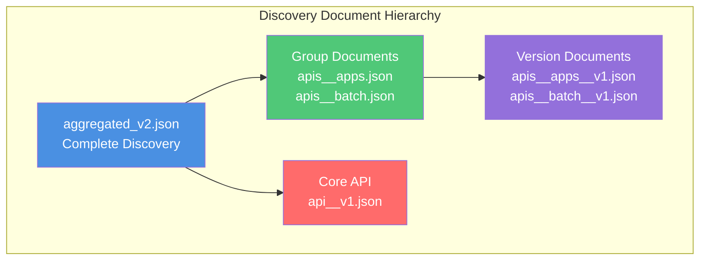

### **Aggregated Discovery**

**File**: `/Users/sureshscribnar/Documents/Projects/opensource/kubernetes/api/discovery/aggregated_v2.json`

**Purpose**: Single file containing all API groups, versions, and resources.

**Structure**:

```json
{
  "kind": "APIGroupDiscoveryList",
  "apiVersion": "apidiscovery.k8s.io/v2",
  "items": [
    {
      "metadata": { "name": "apps" },
      "versions": [
        {
          "version": "v1",
          "resources": [
            {
              "resource": "deployments",
              "verbs": ["create", "delete", "get", "list", "patch", "update", "watch"],
              "categories": ["all"]
            },
            {
              "resource": "statefulsets",
              "verbs": ["create", "delete", "get", "list", "patch", "update", "watch"]
            }
          ]
        }
      ]
    }
  ]
}
```

### **Group Discovery**

**Pattern**: `apis__<group>.json`

**Example**: `/Users/sureshscribnar/Documents/Projects/opensource/kubernetes/api/discovery/apis__apps.json`

```json
{
  "kind": "APIGroup",
  "apiVersion": "v1",
  "name": "apps",
  "versions": [
    {
      "groupVersion": "apps/v1",
      "version": "v1"
    }
  ],
  "preferredVersion": {
    "groupVersion": "apps/v1",
    "version": "v1"
  }
}
```

### **Version Discovery**

**Pattern**: `apis__<group>__<version>.json`

**Example**: `/Users/sureshscribnar/Documents/Projects/opensource/kubernetes/api/discovery/apis__apps__v1.json`

```json
{
  "kind": "APIResourceList",
  "apiVersion": "v1",
  "groupVersion": "apps/v1",
  "resources": [
    {
      "name": "deployments",
      "singularName": "deployment",
      "namespaced": true,
      "kind": "Deployment",
      "verbs": ["create", "delete", "deletecollection", "get", "list", "patch", "update", "watch"],
      "categories": ["all"],
      "storageVersionHash": "8aSe+NMegvE="
    },
    {
      "name": "deployments/scale",
      "singularName": "",
      "namespaced": true,
      "kind": "Scale",
      "verbs": ["get", "patch", "update"]
    },
    {
      "name": "deployments/status",
      "singularName": "",
      "namespaced": true,
      "kind": "Deployment",
      "verbs": ["get", "patch", "update"]
    }
  ]
}
```

### **Core API Discovery**

**File**: `/Users/sureshscribnar/Documents/Projects/opensource/kubernetes/api/discovery/api__v1.json`

**Purpose**: Discovery for the core API group (Pods, Services, etc.)

```json
{
  "kind": "APIResourceList",
  "apiVersion": "v1",
  "groupVersion": "v1",
  "resources": [
    {
      "name": "pods",
      "singularName": "pod",
      "namespaced": true,
      "kind": "Pod",
      "verbs": ["create", "delete", "deletecollection", "get", "list", "patch", "update", "watch"],
      "categories": ["all"],
      "storageVersionHash": "xPOwRZ+Yhw8="
    },
    {
      "name": "services",
      "singularName": "service",
      "namespaced": true,
      "kind": "Service",
      "verbs": ["create", "delete", "get", "list", "patch", "update", "watch"],
      "categories": ["all"],
      "storageVersionHash": "0/CO1lhkEBI="
    }
  ]
}
```

### **Discovery Usage Flow**

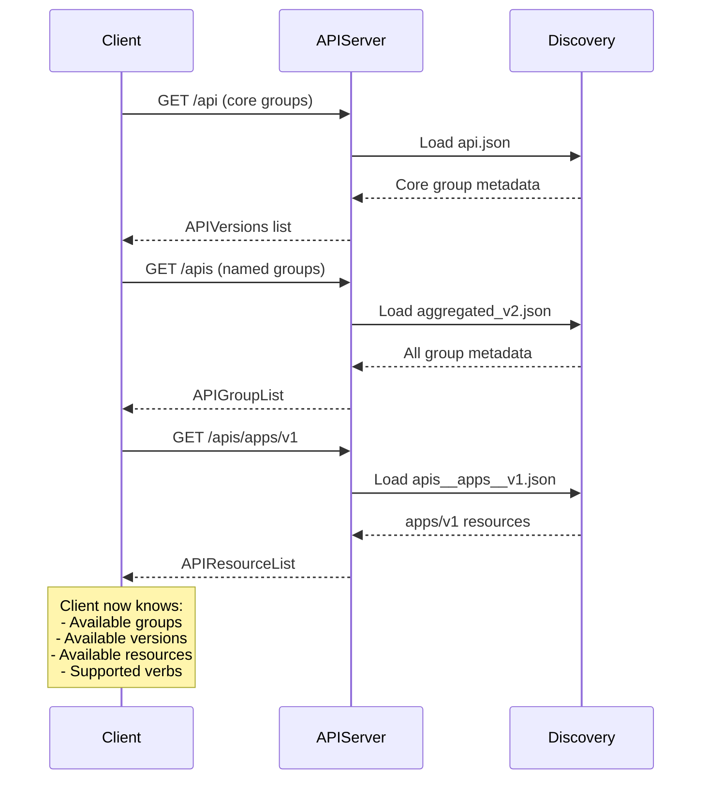

━━━━━━━━━━━━━━━━━━━━━━━━━━━━━━━━━━━━━━━━━━━━━━━━━━━━━━━━━━━━━━━━━━━━━━━━━━━━━━

## **✅ API Rules**

### **Purpose**

API rules enforce **backwards compatibility** and **consistency** across the Kubernetes API surface.

**Directory**: `/Users/sureshscribnar/Documents/Projects/opensource/kubernetes/api/api-rules/`

### **Rule Categories**

| Rule Type | Purpose | Enforced By |
|-----------|---------|-------------|
| **API Compatibility** | Prevent breaking changes | openapi-gen validation |
| **Code Generation** | Ensure types are generatable | code-generator checks |
| **Naming Conventions** | Consistent field/type names | API linters |
| **Versioning** | Proper alpha/beta/GA transitions | API reviewers |

### **Violation Exception Lists**

```
api-rules/
├── violation_exceptions.list              # Known API rule violations
├── codegen_violation_exceptions.list      # Code generation exceptions
├── frozen_violation_exceptions.list       # Frozen exceptions (no new additions)
├── prerelease_violation_exceptions.list   # Pre-release exceptions
└── [more exception files]
```

### **Example Violations**

**File**: `violation_exceptions.list`

```
# API field that violates naming convention but preserved for compatibility
API rule violation: names_match,io.k8s.api.core.v1.EnvVar,ValueFrom

# Required field added to existing type (compatibility break)
API rule violation: required_field,io.k8s.api.batch.v1.JobSpec,Completions

# Type changed (breaking change allowed with exception)
API rule violation: type_changed,io.k8s.api.apps.v1.DeploymentSpec,Replicas
```

### **API Validation Workflow**

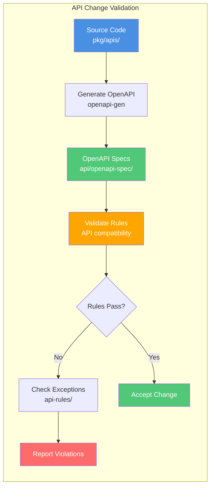

### **API Compatibility Guarantees**

| Version | Compatibility | Breaking Changes |
|---------|---------------|------------------|
| **v1 (GA)** | Guaranteed backwards compatible | Never allowed |
| **v1beta1** | Best-effort compatibility | Allowed with notice |
| **v1alpha1** | No compatibility guarantee | Allowed freely |

━━━━━━━━━━━━━━━━━━━━━━━━━━━━━━━━━━━━━━━━━━━━━━━━━━━━━━━━━━━━━━━━━━━━━━━━━━━━━━

## **🔄 API Generation Workflow**

### **Generation Pipeline**

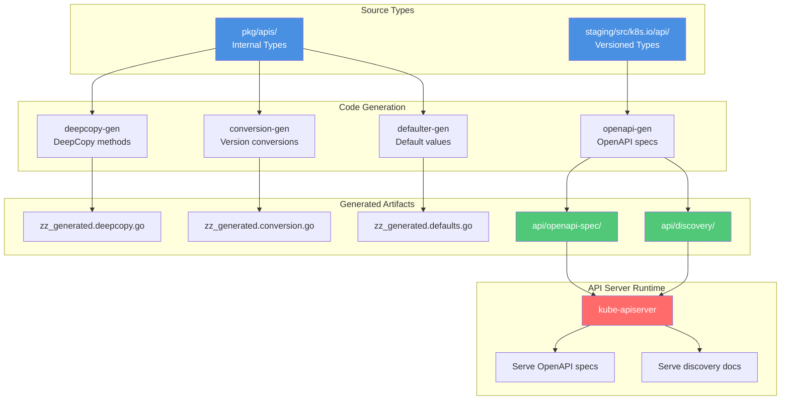

### **Generation Commands**

**Update all generated code**:

```bash
# Location: /Users/sureshscribnar/Documents/Projects/opensource/kubernetes/
make update
# Or specifically:
./hack/update-codegen.sh
./hack/update-openapi-spec.sh
```

**Verify generated code is up-to-date**:

```bash
./hack/verify-codegen.sh
./hack/verify-openapi-spec.sh
```

### **Code Generation Markers**

**Markers in source code** tell generators what to produce:

```go
// pkg/apis/apps/types.go

// +k8s:deepcopy-gen:interfaces=k8s.io/apimachinery/pkg/runtime.Object
// +k8s:openapi-gen=true
// +genclient

// Deployment enables declarative updates for Pods and ReplicaSets.
type Deployment struct {
    metav1.TypeMeta
    // +optional
    metav1.ObjectMeta

    // Specification of the desired behavior of the Deployment.
    // +optional
    Spec DeploymentSpec

    // Most recently observed status of the Deployment.
    // +optional
    Status DeploymentStatus
}
```

**Common Markers**:

| Marker | Purpose |
|--------|---------|
| `+k8s:deepcopy-gen:interfaces=...` | Generate DeepCopy methods |
| `+k8s:openapi-gen=true` | Include in OpenAPI spec |
| `+genclient` | Generate client methods |
| `+genclient:nonNamespaced` | Resource is cluster-scoped |
| `+optional` | Field is optional |
| `+required` | Field is required |
| `+listType=map` | List has map semantics |
| `+kubebuilder:validation:...` | Validation rules |

### **OpenAPI Generation Process**

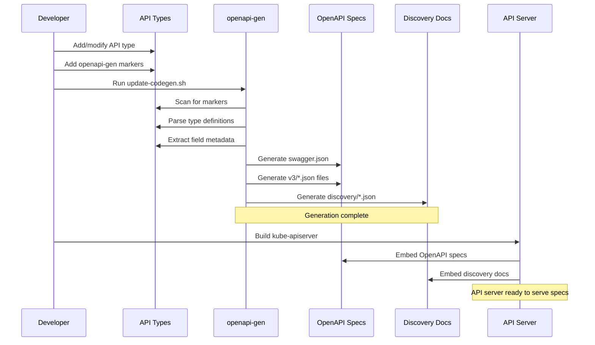

### **Build Integration**

**During build**:

1. **Source scan** - Find all types with markers
2. **Type analysis** - Extract structure, fields, validation
3. **Spec generation** - Create OpenAPI JSON
4. **Discovery generation** - Create discovery JSON
5. **Embedding** - Include in kube-apiserver binary

**Build target**:

```makefile
# From Makefile
.PHONY: generated_files
generated_files:
    hack/update-generated-protobuf.sh
    hack/update-codegen.sh
    hack/update-openapi-spec.sh
    hack/update-generated-docs.sh
```

━━━━━━━━━━━━━━━━━━━━━━━━━━━━━━━━━━━━━━━━━━━━━━━━━━━━━━━━━━━━━━━━━━━━━━━━━━━━━━

## **🔗 Relationship to Other Directories**

### **Three-Way Relationship**

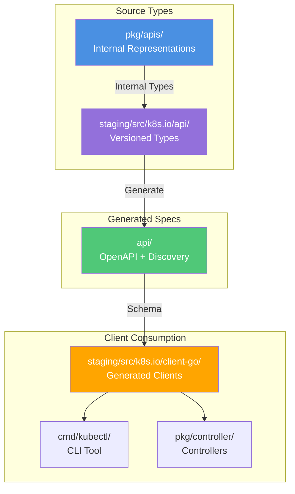

### **Directory Relationships**

| Directory | Relationship | Data Flow |
|-----------|--------------|-----------|
| **pkg/apis/** | Source → api/ | Internal types generate specs |
| **staging/src/k8s.io/api/** | Source → api/ | Versioned types generate specs |
| **staging/src/k8s.io/client-go/** | api/ → Consumption | Uses specs for client generation |
| **cmd/kube-apiserver/** | api/ → Runtime | Serves specs at runtime |
| **cmd/kubectl/** | api/ → Consumption | Uses discovery for commands |
| **vendor/** | api/ → External | Vendored clients use specs |

### **API Type Evolution**

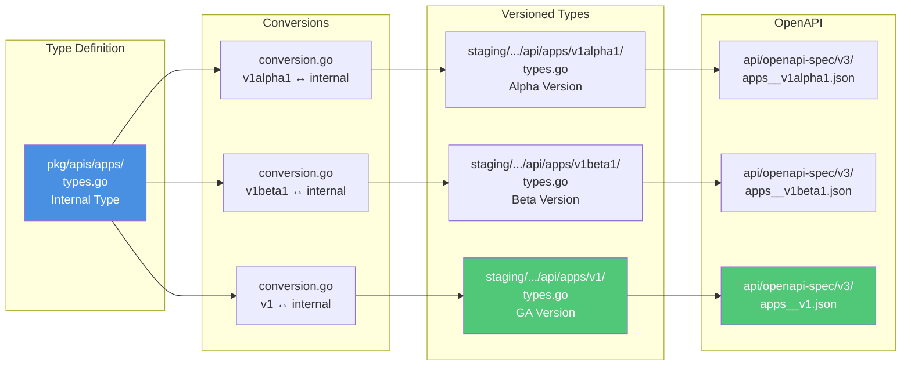

### **API Server Integration**

**File**: `/Users/sureshscribnar/Documents/Projects/opensource/kubernetes/cmd/kube-apiserver/app/server.go`

```go
// API server embeds and serves OpenAPI specs
import (
    "k8s.io/apiserver/pkg/server"
    "k8s.io/kube-openapi/pkg/common"
)

func buildGenericConfig() {
    // Install OpenAPI v2
    genericConfig.OpenAPIConfig = server.DefaultOpenAPIConfig(
        generatedopenapi.GetOpenAPIDefinitions,
        openapinamer.NewDefinitionNamer(scheme),
    )

    // Install OpenAPI v3
    genericConfig.OpenAPIV3Config = server.DefaultOpenAPIV3Config(
        generatedopenapi.GetOpenAPIDefinitions,
        openapinamer.NewDefinitionNamer(scheme),
    )
}
```

### **Storage in etcd**

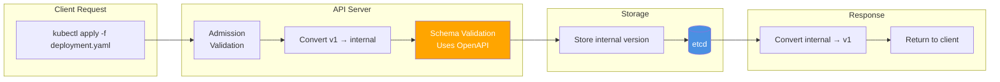

━━━━━━━━━━━━━━━━━━━━━━━━━━━━━━━━━━━━━━━━━━━━━━━━━━━━━━━━━━━━━━━━━━━━━━━━━━━━━━

## **📚 API Consumption**

### **Client Libraries**

**client-go** uses discovery and OpenAPI for client generation:

**File**: `/Users/sureshscribnar/Documents/Projects/opensource/kubernetes/staging/src/k8s.io/client-go/discovery/discovery_client.go`

```go
// DiscoveryClient discovers server-supported API groups, versions, resources
type DiscoveryClient struct {
    restClient restclient.Interface
    LegacyPrefix string
}

// ServerGroups returns the supported groups
func (d *DiscoveryClient) ServerGroups() (*metav1.APIGroupList, error) {
    // GET /api and /apis
    // Returns data from api/discovery/
}

// ServerResourcesForGroupVersion returns resources for a group/version
func (d *DiscoveryClient) ServerResourcesForGroupVersion(groupVersion string) (*metav1.APIResourceList, error) {
    // GET /apis/{group}/{version}
    // Returns data from api/discovery/apis__{group}__{version}.json
}
```

### **kubectl Discovery**

**kubectl** uses discovery to determine available resources:

```bash
# kubectl get <resource>
# 1. Calls discovery API to find resource
# 2. Maps resource name to API path
# 3. Makes GET request to appropriate endpoint
```

**File**: `/Users/sureshscribnar/Documents/Projects/opensource/kubernetes/staging/src/k8s.io/kubectl/pkg/cmd/get/get.go`

```go
func (o *GetOptions) Run(f cmdutil.Factory, cmd *cobra.Command, args []string) error {
    // Use discovery to find resource
    r := f.NewBuilder().
        Unstructured().
        NamespaceParam(o.Namespace).
        ResourceTypeOrNameArgs(true, args...).  // Uses discovery
        Do()

    // Fetch and display
    return o.printObject(r)
}
```

### **Dynamic Client**

**Dynamic client** uses discovery for runtime type information:

```go
import (
    "k8s.io/client-go/dynamic"
    "k8s.io/apimachinery/pkg/runtime/schema"
)

// Create dynamic client
dynamicClient, _ := dynamic.NewForConfig(config)

// Use discovery to find GVR (GroupVersionResource)
gvr := schema.GroupVersionResource{
    Group:    "apps",
    Version:  "v1",
    Resource: "deployments",
}

// Get resource
deployment, _ := dynamicClient.Resource(gvr).
    Namespace("default").
    Get(context.TODO(), "my-deployment", metav1.GetOptions{})
```

### **OpenAPI Schema Validation**

**Client-side validation** uses OpenAPI schemas:

```go
import (
    "k8s.io/client-go/openapi"
    "k8s.io/kube-openapi/pkg/validation/spec"
)

// Fetch OpenAPI spec from server
openAPIClient := openapi.NewOpenAPIClient(restClient)
openAPISchema, _ := openAPIClient.OpenAPISchema()

// Validate object against schema
validator := validation.NewSchemaValidator(openAPISchema)
errors := validator.Validate(object)
```

### **Code Generation from OpenAPI**

**External tools** generate clients from OpenAPI specs:

```bash
# Generate Go client from OpenAPI spec
openapi-generator generate \
  -i api/openapi-spec/swagger.json \
  -g go \
  -o ./generated/client

# Generate Python client
openapi-generator generate \
  -i api/openapi-spec/swagger.json \
  -g python \
  -o ./python-client
```

### **API Server Runtime Serving**

**API Server serves these files at runtime**:

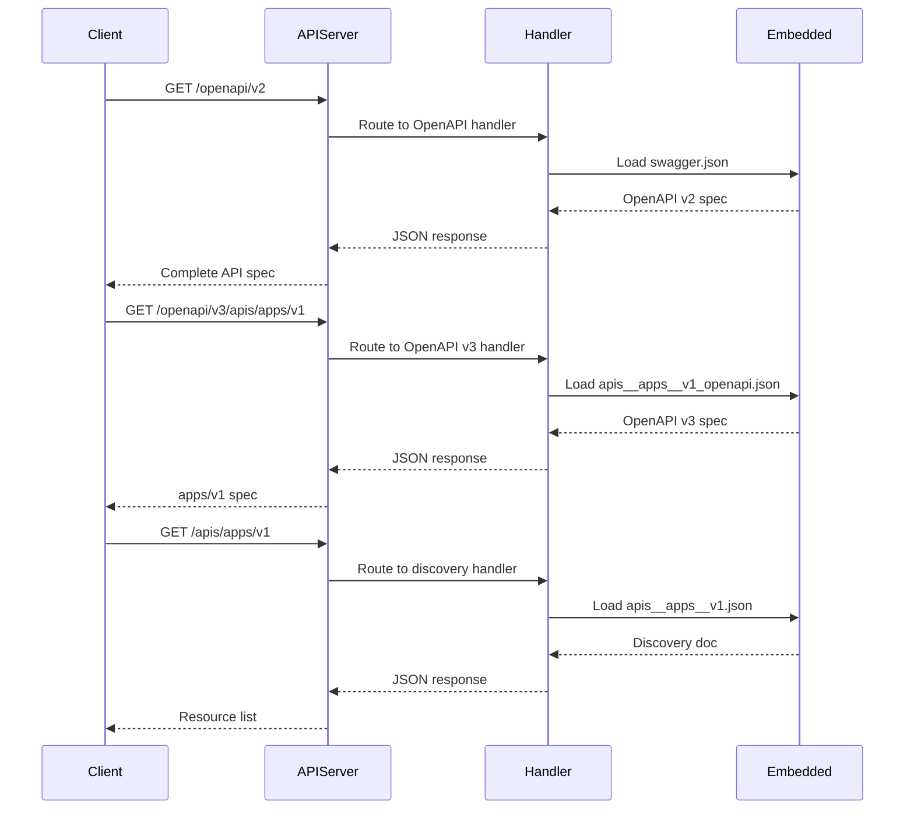

**Endpoint mapping**:

| Endpoint | Source File | Purpose |
|----------|-------------|---------|
| `/openapi/v2` | `api/openapi-spec/swagger.json` | OpenAPI v2 spec |
| `/openapi/v3` | `api/openapi-spec/v3/apis_openapi.json` | OpenAPI v3 index |
| `/openapi/v3/apis/apps/v1` | `api/openapi-spec/v3/apis__apps__v1_openapi.json` | apps/v1 spec |
| `/api` | `api/discovery/api.json` | Core API discovery |
| `/api/v1` | `api/discovery/api__v1.json` | Core v1 resources |
| `/apis` | `api/discovery/aggregated_v2.json` | All groups discovery |
| `/apis/apps/v1` | `api/discovery/apis__apps__v1.json` | apps/v1 resources |

━━━━━━━━━━━━━━━━━━━━━━━━━━━━━━━━━━━━━━━━━━━━━━━━━━━━━━━━━━━━━━━━━━━━━━━━━━━━━━

## **🛠️ Development Workflows**

### **Adding a New API Field**

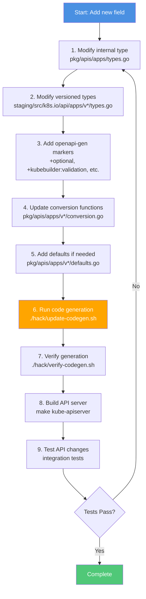

### **Step-by-Step Example**

**1. Modify Internal Type**

File: `/Users/sureshscribnar/Documents/Projects/opensource/kubernetes/pkg/apis/apps/types.go`

```go
type DeploymentSpec struct {
    // ... existing fields ...

    // NEW FIELD: Maximum time for deployment to make progress
    // +optional
    ProgressDeadlineSeconds *int32
}
```

**2. Modify Versioned Types**

File: `/Users/sureshscribnar/Documents/Projects/opensource/kubernetes/staging/src/k8s.io/api/apps/v1/types.go`

```go
type DeploymentSpec struct {
    // ... existing fields ...

    // +optional
    // +kubebuilder:validation:Minimum=1
    ProgressDeadlineSeconds *int32 `json:"progressDeadlineSeconds,omitempty" protobuf:"varint,9,opt,name=progressDeadlineSeconds"`
}
```

**3. Update Conversion** (if field differs between versions)

File: `/Users/sureshscribnar/Documents/Projects/opensource/kubernetes/pkg/apis/apps/v1/conversion.go`

```go
func Convert_v1_DeploymentSpec_To_apps_DeploymentSpec(in *v1.DeploymentSpec, out *apps.DeploymentSpec, s conversion.Scope) error {
    // Auto-generated conversion handles most fields
    // Manual conversion needed only for special cases
    out.ProgressDeadlineSeconds = in.ProgressDeadlineSeconds
    return autoConvert_v1_DeploymentSpec_To_apps_DeploymentSpec(in, out, s)
}
```

**4. Add Defaults**

File: `/Users/sureshscribnar/Documents/Projects/opensource/kubernetes/pkg/apis/apps/v1/defaults.go`

```go
func SetDefaults_DeploymentSpec(obj *appsv1.DeploymentSpec) {
    if obj.ProgressDeadlineSeconds == nil {
        val := int32(600) // 10 minutes default
        obj.ProgressDeadlineSeconds = &val
    }
}
```

**5. Generate Code**

```bash
cd /Users/sureshscribnar/Documents/Projects/opensource/kubernetes/

# Generate all code
./hack/update-codegen.sh

# This generates:
# - api/openapi-spec/swagger.json (updated)
# - api/openapi-spec/v3/apis__apps__v1_openapi.json (updated)
# - zz_generated.deepcopy.go files
# - zz_generated.conversion.go files
# - zz_generated.defaults.go files
```

**6. Verify**

```bash
# Verify all generated code is correct
./hack/verify-codegen.sh

# Check OpenAPI spec
./hack/verify-openapi-spec.sh

# Check API compatibility
./hack/verify-api-compatibility.sh
```

**7. Build**

```bash
# Build API server
make kube-apiserver

# Or build all
make all
```

**8. Test**

```bash
# Run unit tests
make test WHAT=./pkg/apis/apps/...

# Run integration tests
make test-integration WHAT=./test/integration/apps/...
```

### **Inspecting Generated OpenAPI**

After generation, check the OpenAPI spec:

**File**: `api/openapi-spec/v3/apis__apps__v1_openapi.json`

```json
{
  "components": {
    "schemas": {
      "io.k8s.api.apps.v1.DeploymentSpec": {
        "type": "object",
        "properties": {
          "progressDeadlineSeconds": {
            "type": "integer",
            "format": "int32",
            "description": "Maximum time for deployment to make progress",
            "minimum": 1
          }
        }
      }
    }
  }
}
```

### **Common Generation Commands**

| Command | Purpose |
|---------|---------|
| `./hack/update-codegen.sh` | Generate all code (deepcopy, conversion, defaults, clients) |
| `./hack/update-openapi-spec.sh` | Generate OpenAPI specifications |
| `./hack/verify-codegen.sh` | Verify generated code is up-to-date |
| `./hack/verify-openapi-spec.sh` | Verify OpenAPI specs are current |
| `make update` | Update all generated files |
| `make verify` | Verify all generated files |

━━━━━━━━━━━━━━━━━━━━━━━━━━━━━━━━━━━━━━━━━━━━━━━━━━━━━━━━━━━━━━━━━━━━━━━━━━━━━━

## **🔧 Troubleshooting**

### **Common Issues**

#### **Issue: Generated files out of sync**

**Symptom**:
```
Error: api/openapi-spec/swagger.json is out of sync
Run: ./hack/update-codegen.sh
```

**Solution**:
```bash
# Regenerate all files
./hack/update-codegen.sh

# Verify
./hack/verify-codegen.sh
```

#### **Issue: API compatibility violation**

**Symptom**:
```
API rule violation: required_field,io.k8s.api.apps.v1.DeploymentSpec,NewField
```

**Solution**:
```go
// Make field optional instead of required
type DeploymentSpec struct {
    // +optional  ← Add this marker
    NewField string `json:"newField,omitempty"`
}
```

Or add to exception list:
```bash
echo "API rule violation: required_field,io.k8s.api.apps.v1.DeploymentSpec,NewField" \
  >> api/api-rules/violation_exceptions.list
```

#### **Issue: OpenAPI generation fails**

**Symptom**:
```
Error: failed to generate OpenAPI for io.k8s.api.apps.v1.Deployment
```

**Solution**:
1. Check type has proper markers:
```go
// +k8s:openapi-gen=true
type Deployment struct { ... }
```

2. Check all fields are serializable:
```go
// Bad - channel not serializable
Chan chan string

// Good - use pointer to known type
Status *DeploymentStatus
```

3. Regenerate:
```bash
./hack/update-codegen.sh
```

#### **Issue: Discovery document missing resources**

**Symptom**:
```
kubectl get myresource
error: the server doesn't have a resource type "myresource"
```

**Solution**:
1. Check resource is registered in scheme
2. Verify discovery document generated
3. Rebuild API server:
```bash
make kube-apiserver
```

#### **Issue: Client-go doesn't recognize new field**

**Symptom**:
```go
deployment.Spec.NewField = "value"  // Field doesn't exist
```

**Solution**:
1. Ensure field added to versioned type in staging/src/k8s.io/api/
2. Regenerate clients:
```bash
./hack/update-codegen.sh
```
3. Rebuild client-go:
```bash
cd staging/src/k8s.io/client-go
go build ./...
```

### **Verification Checklist**

Before submitting PR:

```bash
# 1. Verify all generated code is updated
./hack/verify-codegen.sh

# 2. Verify OpenAPI specs
./hack/verify-openapi-spec.sh

# 3. Verify API compatibility
./hack/verify-api-compatibility.sh

# 4. Run unit tests
make test WHAT=./pkg/apis/...

# 5. Run integration tests
make test-integration WHAT=./test/integration/...

# 6. Build all binaries
make all
```

### **Debugging OpenAPI Generation**

**Enable verbose output**:

```bash
# Run with verbose logging
KUBE_VERBOSE=5 ./hack/update-codegen.sh

# Check specific generator
cd staging/src/k8s.io/code-generator
go run ./cmd/openapi-gen \
  --input-dirs k8s.io/api/apps/v1 \
  --output-package k8s.io/kubernetes/api/openapi-spec \
  -v 5
```

**Check generated file**:

```bash
# Verify swagger.json is valid
cat api/openapi-spec/swagger.json | jq . > /dev/null

# Check for specific type
cat api/openapi-spec/swagger.json | \
  jq '.definitions["io.k8s.api.apps.v1.Deployment"]'
```

### **Common Gotchas**

| Issue | Cause | Fix |
|-------|-------|-----|
| **Missing +optional marker** | Required field breaks compatibility | Add `// +optional` |
| **Wrong JSON tag** | Field name doesn't match convention | Use `json:"fieldName,omitempty"` |
| **Missing omitempty** | Zero values always serialized | Add `omitempty` to JSON tag |
| **Circular reference** | Type references itself | Use pointer: `*SelfType` |
| **Unexported field** | Field starts with lowercase | Export field: `FieldName` |
| **No protobuf tag** | Missing protobuf serialization | Add `protobuf:"..."` tag |

━━━━━━━━━━━━━━━━━━━━━━━━━━━━━━━━━━━━━━━━━━━━━━━━━━━━━━━━━━━━━━━━━━━━━━━━━━━━━━

## **📊 API Statistics**

### **Current API Surface**

| Metric | Count |
|--------|------:|
| **API Groups** | 25+ |
| **API Versions** | 60+ |
| **Resource Types** | 100+ |
| **OpenAPI v2 Size** | ~15 MB |
| **OpenAPI v3 Files** | 100+ |
| **Discovery Files** | 62+ |
| **Total Spec Size** | ~50 MB |

### **API Group Distribution**

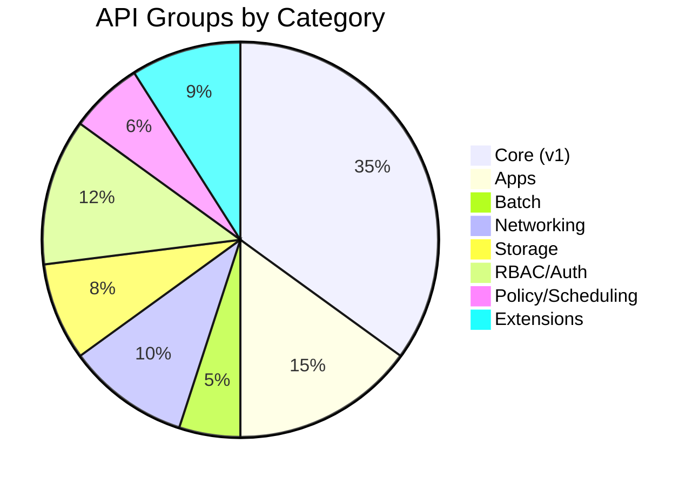

### **Version Distribution**

| Stability | Groups | Examples |
|-----------|-------:|----------|
| **v1 (GA)** | 15 | core/v1, apps/v1, batch/v1 |
| **v1beta1** | 8 | resource.k8s.io/v1beta1 |
| **v1alpha1** | 12 | certificates/v1alpha1, coordination/v1alpha1 |
| **v1alpha2** | 3 | coordination/v1alpha2 |
| **v1alpha3** | 2 | resource.k8s.io/v1alpha3 |

━━━━━━━━━━━━━━━━━━━━━━━━━━━━━━━━━━━━━━━━━━━━━━━━━━━━━━━━━━━━━━━━━━━━━━━━━━━━━━

## **🔗 Related Documentation**

### **Internal References**

| Document | Relationship |
|----------|--------------|
| [01-repository-overview.md](01-repository-overview.md) | High-level structure context |
| [03-pkg-implementation.md](03-pkg-implementation.md) | Source types in pkg/apis/ |
| [04-staging-architecture.md](04-staging-architecture.md) | Versioned types in staging/src/k8s.io/api/ |
| [07-hack-tools.md](07-hack-tools.md) | Code generation scripts |
| [11-code-organization-patterns.md](11-code-organization-patterns.md) | Code generation details |
| [13-development-workflows.md](13-development-workflows.md) | Complete development process |

### **External Resources**

- **OpenAPI Specification**: https://swagger.io/specification/
- **Kubernetes API Conventions**: https://git.k8s.io/community/contributors/devel/sig-architecture/api-conventions.md
- **API Changes Guidelines**: https://git.k8s.io/community/contributors/devel/sig-architecture/api_changes.md
- **Code Generation Guide**: https://git.k8s.io/community/contributors/devel/sig-architecture/generating-clientset.md

━━━━━━━━━━━━━━━━━━━━━━━━━━━━━━━━━━━━━━━━━━━━━━━━━━━━━━━━━━━━━━━━━━━━━━━━━━━━━━

## **📝 Summary**

### **Key Takeaways**

✅ **Generated Content** - All files in api/ are auto-generated from source types
✅ **Two Formats** - OpenAPI v2 (legacy) and v3 (modern, split by group)
✅ **Discovery Enabled** - Clients use discovery docs for dynamic resource lookup
✅ **API Compatibility** - Rules enforce backwards compatibility guarantees
✅ **Build Integration** - Specs generated during build and embedded in API server
✅ **Client Foundation** - Basis for all client libraries and SDKs

### **Best Practices**

1. **Never edit generated files** - Always modify source types
2. **Use proper markers** - openapi-gen, optional, validation rules
3. **Maintain compatibility** - Follow API version guarantees
4. **Verify before commit** - Run verify-codegen.sh
5. **Test thoroughly** - Integration tests for API changes
6. **Document changes** - Update API docs for new fields

### **Quick Commands**

```bash
# Generate all specs
./hack/update-codegen.sh

# Verify generation
./hack/verify-codegen.sh

# Check compatibility
./hack/verify-api-compatibility.sh

# View OpenAPI spec
curl http://localhost:8080/openapi/v2

# View discovery
curl http://localhost:8080/apis/apps/v1
```

━━━━━━━━━━━━━━━━━━━━━━━━━━━━━━━━━━━━━━━━━━━━━━━━━━━━━━━━━━━━━━━━━━━━━━━━━━━━━━

**Document Status**: ✅ Active | **Last Generated**: Build time | **Maintenance**: Auto-generated

**Navigation**: [README](00-README.md) | [Previous: Cluster Deployment](09-cluster-deployment.md) | [Next: Code Organization](11-code-organization-patterns.md)
