# **KUBERNETES CODE ORGANIZATION PATTERNS**

**Module Boundaries, Code Generation, API Versioning, and Development Conventions**

━━━━━━━━━━━━━━━━━━━━━━━━━━━━━━━━━━━━━━━━━━━━━━━━━━━━━━━━━━━━━━━━━━━━━━━━━━━━━━

## **📋 Table of Contents**

1. [Overview](#overview)
2. [Go Workspace Structure](#go-workspace-structure)
3. [Module Boundaries](#module-boundaries)
4. [Code Generation System](#code-generation-system)
5. [API Versioning Patterns](#api-versioning-patterns)
6. [Testing Patterns](#testing-patterns)
7. [Import Restrictions](#import-restrictions)
8. [Package Naming Conventions](#package-naming-conventions)
9. [File Organization Standards](#file-organization-standards)
10. [Development Workflows](#development-workflows)

━━━━━━━━━━━━━━━━━━━━━━━━━━━━━━━━━━━━━━━━━━━━━━━━━━━━━━━━━━━━━━━━━━━━━━━━━━━━━━

## **🎯 Overview**

### **Purpose**

This document describes the **organizational patterns and conventions** used throughout the Kubernetes codebase. Understanding these patterns is essential for:

- **Contributing** code that follows project standards
- **Navigating** the codebase efficiently
- **Understanding** module relationships and boundaries
- **Maintaining** code quality and consistency

### **Key Patterns**

| Pattern | Purpose | Enforced By |
|---------|---------|-------------|
| **Go Workspaces** | Multi-module monorepo management | go.work |
| **Staging Modules** | Independent publishable packages | Module boundaries |
| **Code Generation** | Automate boilerplate and clients | Generator tools |
| **API Versioning** | Multiple API versions with conversions | Internal + versioned types |
| **Import Restrictions** | Prevent circular dependencies | import-boss tool |
| **Test Co-location** | Tests near implementation | Go convention |
| **Generated File Naming** | Identify auto-generated code | zz_generated.* prefix |

━━━━━━━━━━━━━━━━━━━━━━━━━━━━━━━━━━━━━━━━━━━━━━━━━━━━━━━━━━━━━━━━━━━━━━━━━━━━━━

## **📦 Go Workspace Structure**

### **Workspace Configuration**

**File**: `/Users/sureshscribnar/Documents/Projects/opensource/kubernetes/go.work`

```go
// This is a generated file. Do not edit directly.

go 1.25.0

godebug default=go1.25

use (
    .                                           // Main kubernetes module
    ./staging/src/k8s.io/api                    // API type definitions
    ./staging/src/k8s.io/apiextensions-apiserver
    ./staging/src/k8s.io/apimachinery
    ./staging/src/k8s.io/apiserver
    ./staging/src/k8s.io/cli-runtime
    ./staging/src/k8s.io/client-go
    ./staging/src/k8s.io/cloud-provider
    ./staging/src/k8s.io/cluster-bootstrap
    ./staging/src/k8s.io/code-generator
    ./staging/src/k8s.io/component-base
    ./staging/src/k8s.io/component-helpers
    ./staging/src/k8s.io/controller-manager
    ./staging/src/k8s.io/cri-api
    ./staging/src/k8s.io/cri-client
    ./staging/src/k8s.io/csi-translation-lib
    ./staging/src/k8s.io/dynamic-resource-allocation
    ./staging/src/k8s.io/endpointslice
    ./staging/src/k8s.io/externaljwt
    ./staging/src/k8s.io/kms
    ./staging/src/k8s.io/kube-aggregator
    ./staging/src/k8s.io/kube-controller-manager
    ./staging/src/k8s.io/kube-proxy
    ./staging/src/k8s.io/kube-scheduler
    ./staging/src/k8s.io/kubectl
    ./staging/src/k8s.io/kubelet
    ./staging/src/k8s.io/metrics
    ./staging/src/k8s.io/mount-utils
    ./staging/src/k8s.io/pod-security-admission
    ./staging/src/k8s.io/sample-apiserver
    ./staging/src/k8s.io/sample-cli-plugin
    ./staging/src/k8s.io/sample-controller
)
```

**Total Modules**: 32 (1 main + 31 staging)

### **Workspace Architecture**

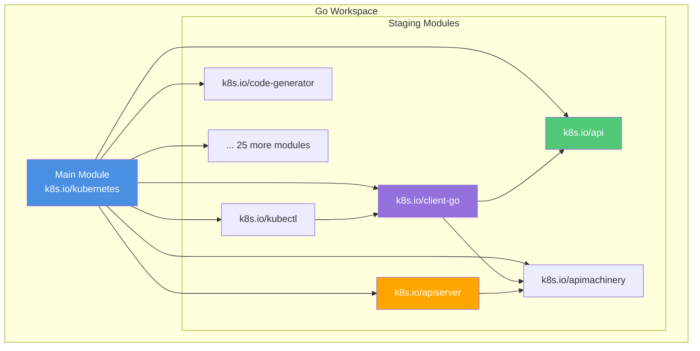

### **Why Go Workspaces?**

| Benefit | Description |
|---------|-------------|
| **Local Development** | Edit staging modules without publishing |
| **Cross-module Changes** | Make changes across modules atomically |
| **Dependency Resolution** | Workspace modules override vendor/ |
| **Build Efficiency** | Shared build cache across modules |
| **Version Coordination** | Ensure compatible versions during development |

### **Module Resolution Order**

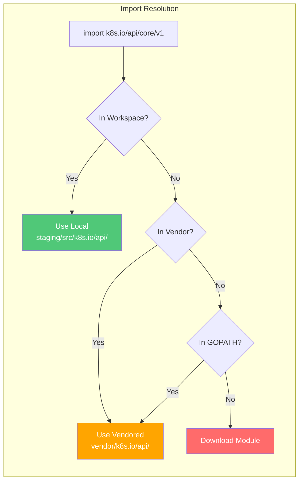

━━━━━━━━━━━━━━━━━━━━━━━━━━━━━━━━━━━━━━━━━━━━━━━━━━━━━━━━━━━━━━━━━━━━━━━━━━━━━━

## **🔗 Module Boundaries**

### **Main Module**

**Module**: `k8s.io/kubernetes`
**Path**: `/Users/sureshscribnar/Documents/Projects/opensource/kubernetes/`

**Contains**:
- `cmd/` - Binary entry points
- `pkg/` - Core implementations
- `test/` - Integration and E2E tests
- `hack/` - Build and development tools

**Exports**: Nothing (binaries only)

**Imports**: All staging modules

### **Staging Modules**

**Pattern**: `staging/src/k8s.io/<module>/`

**Published to**: `k8s.io/<module>`

**Purpose**: Independent, reusable libraries

**Example Module: client-go**

**Path**: `/Users/sureshscribnar/Documents/Projects/opensource/kubernetes/staging/src/k8s.io/client-go/`

**go.mod**:
```go
module k8s.io/client-go

go 1.25.0

require (
    k8s.io/api v0.0.0
    k8s.io/apimachinery v0.0.0
    // ... other dependencies
)

replace (
    k8s.io/api => ../api
    k8s.io/apimachinery => ../apimachinery
)
```

### **Replace Directives**

**Purpose**: Point to local staging modules during development

```go
replace (
    k8s.io/api => ./staging/src/k8s.io/api
    k8s.io/apiextensions-apiserver => ./staging/src/k8s.io/apiextensions-apiserver
    k8s.io/apimachinery => ./staging/src/k8s.io/apimachinery
    k8s.io/apiserver => ./staging/src/k8s.io/apiserver
    k8s.io/cli-runtime => ./staging/src/k8s.io/cli-runtime
    k8s.io/client-go => ./staging/src/k8s.io/client-go
    k8s.io/cloud-provider => ./staging/src/k8s.io/cloud-provider
    k8s.io/cluster-bootstrap => ./staging/src/k8s.io/cluster-bootstrap
    k8s.io/code-generator => ./staging/src/k8s.io/code-generator
    k8s.io/component-base => ./staging/src/k8s.io/component-base
    // ... 22 more replace directives
)
```

### **Module Dependency Graph**

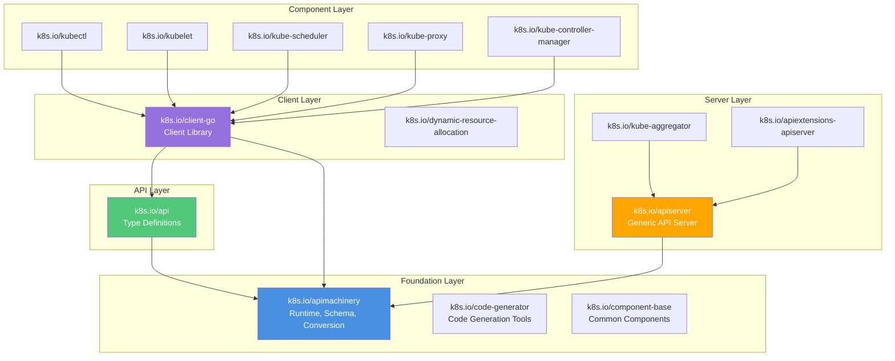

### **Module Publishing**

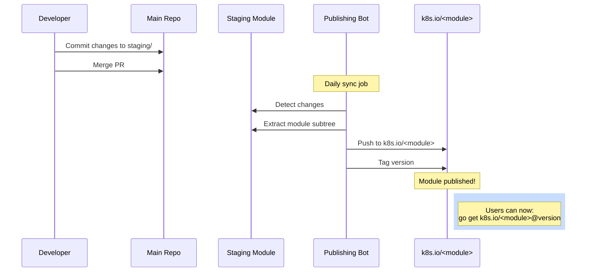

━━━━━━━━━━━━━━━━━━━━━━━━━━━━━━━━━━━━━━━━━━━━━━━━━━━━━━━━━━━━━━━━━━━━━━━━━━━━━━

## **⚙️ Code Generation System**

### **Overview**

Kubernetes uses **extensive code generation** to avoid manual boilerplate. Generators create:

- DeepCopy methods (object cloning)
- Client libraries (REST clients)
- Informers (caching clients)
- Listers (cached list operations)
- Conversions (between API versions)
- Defaults (default field values)
- OpenAPI specs (API documentation)
- Protobuf bindings (efficient serialization)

### **Code Generation Pipeline**

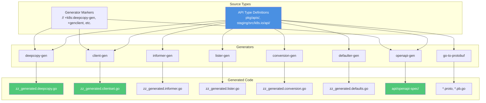

### **Generator Markers**

**Markers are special comments** that tell generators what to produce:

#### **Type-Level Markers**

```go
// +k8s:deepcopy-gen:interfaces=k8s.io/apimachinery/pkg/runtime.Object
// +k8s:openapi-gen=true
// +genclient
// +genclient:nonNamespaced

// Deployment enables declarative updates for Pods and ReplicaSets.
type Deployment struct {
    metav1.TypeMeta   `json:",inline"`
    metav1.ObjectMeta `json:"metadata,omitempty" protobuf:"bytes,1,opt,name=metadata"`

    Spec   DeploymentSpec   `json:"spec,omitempty" protobuf:"bytes,2,opt,name=spec"`
    Status DeploymentStatus `json:"status,omitempty" protobuf:"bytes,3,opt,name=status"`
}
```

| Marker | Purpose |
|--------|---------|
| `+k8s:deepcopy-gen:interfaces=...` | Generate DeepCopy + DeepCopyInto methods implementing interface |
| `+k8s:deepcopy-gen=true` | Generate DeepCopy methods |
| `+k8s:deepcopy-gen=false` | Skip DeepCopy generation for this type |
| `+k8s:openapi-gen=true` | Include type in OpenAPI specification |
| `+genclient` | Generate client methods (Get, List, Create, etc.) |
| `+genclient:nonNamespaced` | Resource is cluster-scoped |
| `+genclient:noStatus` | Resource has no status subresource |
| `+genclient:onlyVerbs=create,delete` | Generate only specified verbs |
| `+genclient:skipVerbs=watch` | Skip specified verbs |

#### **Field-Level Markers**

```go
type DeploymentSpec struct {
    // +optional
    Replicas *int32 `json:"replicas,omitempty"`

    // +required
    Selector *metav1.LabelSelector `json:"selector"`

    // +optional
    // +kubebuilder:validation:Minimum=0
    // +kubebuilder:validation:Maximum=3600
    ProgressDeadlineSeconds *int32 `json:"progressDeadlineSeconds,omitempty"`

    // +optional
    // +listType=map
    // +listMapKey=name
    Containers []Container `json:"containers"`
}
```

| Marker | Purpose |
|--------|---------|
| `+optional` | Field is optional (omitempty) |
| `+required` | Field is required |
| `+kubebuilder:validation:Minimum=N` | Minimum value validation |
| `+kubebuilder:validation:Maximum=N` | Maximum value validation |
| `+kubebuilder:validation:Pattern=regex` | Regex pattern validation |
| `+listType=map\|set\|atomic` | List semantics for merging |
| `+listMapKey=field` | Key field for list maps |
| `+patchStrategy=merge\|retainKeys` | Patch merge strategy |
| `+patchMergeKey=name` | Key for patch merges |

#### **Package-Level Markers**

**File**: `doc.go` in package root

```go
// +k8s:deepcopy-gen=package
// +k8s:openapi-gen=true
// +k8s:defaulter-gen=TypeMeta
// +groupName=apps.k8s.io

// Package v1 contains API Schema definitions for the apps v1 API group
package v1
```

| Marker | Purpose |
|--------|---------|
| `+k8s:deepcopy-gen=package` | Generate DeepCopy for all types in package |
| `+k8s:conversion-gen=<package>` | Generate conversions to/from package |
| `+k8s:defaulter-gen=TypeMeta` | Generate defaulters for types |
| `+groupName=<group>` | API group name |
| `+k8s:openapi-gen=true` | Include package in OpenAPI |

### **Generated File Naming**

**Convention**: `zz_generated.<purpose>.go`

| File Pattern | Generator | Purpose |
|--------------|-----------|---------|
| `zz_generated.deepcopy.go` | deepcopy-gen | DeepCopy methods |
| `zz_generated.conversion.go` | conversion-gen | Version conversions |
| `zz_generated.defaults.go` | defaulter-gen | Default values |
| `*.pb.go` | protoc | Protobuf bindings |
| `zz_generated.openapi.go` | openapi-gen | OpenAPI definitions (in-code) |

**Why `zz_` prefix?**
- Files sort **last** alphabetically
- Clearly identifies **generated** code
- Prevents **manual editing**

### **DeepCopy Generation**

**Example Generated Code**:

```go
// zz_generated.deepcopy.go

// DeepCopyInto is an autogenerated deepcopy function, copying the receiver, writing into out.
func (in *Deployment) DeepCopyInto(out *Deployment) {
    *out = *in
    out.TypeMeta = in.TypeMeta
    in.ObjectMeta.DeepCopyInto(&out.ObjectMeta)
    in.Spec.DeepCopyInto(&out.Spec)
    in.Status.DeepCopyInto(&out.Status)
}

// DeepCopy is an autogenerated deepcopy function, copying the receiver, creating a new Deployment.
func (in *Deployment) DeepCopy() *Deployment {
    if in == nil {
        return nil
    }
    out := new(Deployment)
    in.DeepCopyInto(out)
    return out
}

// DeepCopyObject is an autogenerated deepcopy function, copying the receiver, creating a new runtime.Object.
func (in *Deployment) DeepCopyObject() runtime.Object {
    if c := in.DeepCopy(); c != nil {
        return c
    }
    return nil
}
```

### **Client Generation**

**Generated clientset structure**:

```
staging/src/k8s.io/client-go/kubernetes/
├── typed/
│   ├── apps/
│   │   └── v1/
│   │       ├── apps_client.go          # Group client
│   │       ├── deployment.go           # Deployment client
│   │       ├── statefulset.go          # StatefulSet client
│   │       └── zz_generated.*.go       # Generated implementations
│   ├── core/
│   │   └── v1/
│   │       ├── core_client.go
│   │       ├── pod.go
│   │       ├── service.go
│   │       └── zz_generated.*.go
│   └── [more groups]
└── clientset.go                        # Main clientset
```

**Usage**:

```go
import (
    "k8s.io/client-go/kubernetes"
    appsv1 "k8s.io/client-go/kubernetes/typed/apps/v1"
)

// Create clientset
clientset, _ := kubernetes.NewForConfig(config)

// Get deployment client (generated)
deploymentClient := clientset.AppsV1().Deployments("default")

// Use generated methods
deployment, _ := deploymentClient.Get(ctx, "my-app", metav1.GetOptions{})
```

### **Informer Generation**

**Generated informer structure**:

```
staging/src/k8s.io/client-go/informers/
├── apps/
│   └── v1/
│       ├── deployment.go              # Deployment informer
│       ├── statefulset.go             # StatefulSet informer
│       └── interface.go               # Shared interfaces
├── core/
│   └── v1/
│       ├── pod.go                     # Pod informer
│       └── service.go                 # Service informer
└── generic.go                         # Generic informer
```

**Usage**:

```go
import (
    "k8s.io/client-go/informers"
)

// Create informer factory (generated)
informerFactory := informers.NewSharedInformerFactory(clientset, time.Minute*5)

// Get deployment informer (generated)
deploymentInformer := informerFactory.Apps().V1().Deployments()

// Add event handler
deploymentInformer.Informer().AddEventHandler(cache.ResourceEventHandlerFuncs{
    AddFunc:    onAdd,
    UpdateFunc: onUpdate,
    DeleteFunc: onDelete,
})

// Start informers
informerFactory.Start(stopCh)
```

### **Code Generation Workflow**

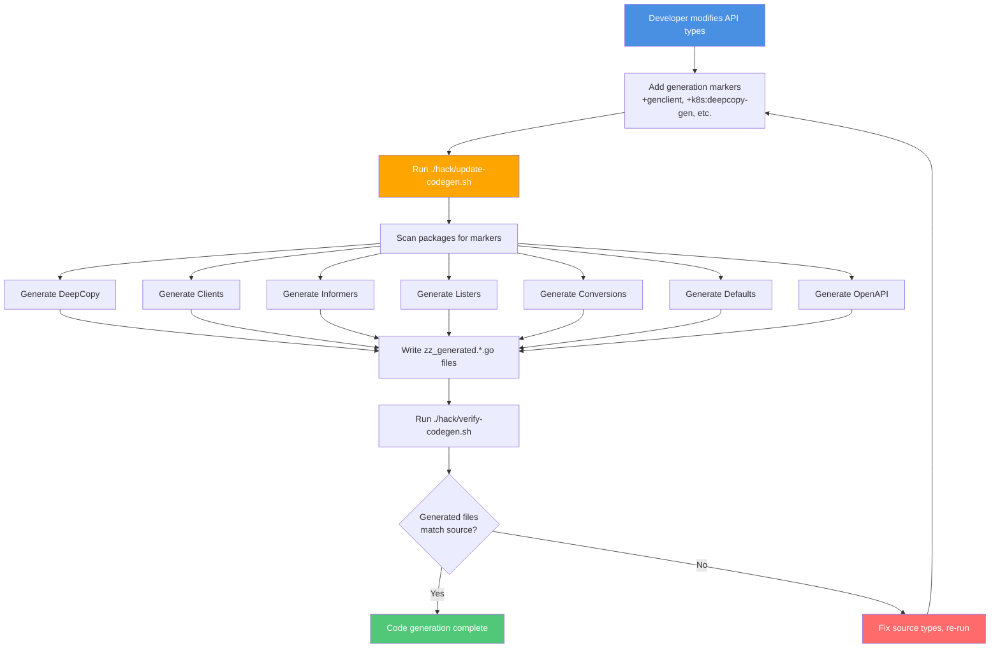

### **Generation Commands**

```bash
# Location: /Users/sureshscribnar/Documents/Projects/opensource/kubernetes/

# Update all generated code
./hack/update-codegen.sh

# Verify generated code is current
./hack/verify-codegen.sh

# Update specific generators
./hack/update-generated-protobuf.sh
./hack/update-openapi-spec.sh

# Generate for specific module
cd staging/src/k8s.io/api
../../../../hack/update-codegen.sh
```

━━━━━━━━━━━━━━━━━━━━━━━━━━━━━━━━━━━━━━━━━━━━━━━━━━━━━━━━━━━━━━━━━━━━━━━━━━━━━━

## **🔄 API Versioning Patterns**

### **Internal vs Versioned Types**

**Kubernetes uses a hub-and-spoke model** for API versions:

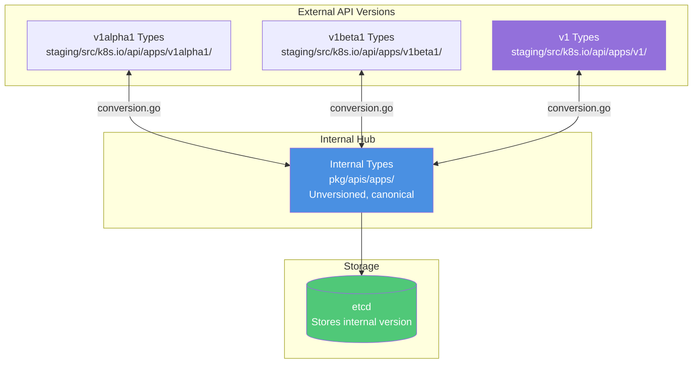

### **Why Internal Types?**

| Benefit | Description |
|---------|-------------|
| **Single Source of Truth** | One canonical representation |
| **Simplified Conversions** | Only N conversions (not N²) |
| **Version Independence** | Core logic doesn't care about versions |
| **Easy Version Addition** | Add new version without changing core |
| **Storage Stability** | Internal version stored in etcd |

### **Type Organization**

```
pkg/apis/apps/                          # Internal types (unversioned)
├── types.go                            #   Internal type definitions
├── register.go                         #   Register with scheme
├── validation/                         #   Validation logic
│   └── validation.go
└── install/                            #   Install all versions
    └── install.go

staging/src/k8s.io/api/apps/v1/         # Versioned types (v1)
├── types.go                            #   v1 type definitions
├── register.go                         #   Register v1 with scheme
├── zz_generated.deepcopy.go            #   Generated DeepCopy
├── zz_generated.conversion.go          #   Generated conversions
└── zz_generated.defaults.go            #   Generated defaults

staging/src/k8s.io/api/apps/v1beta1/    # Versioned types (v1beta1)
├── types.go
├── register.go
└── zz_generated.*.go

pkg/apis/apps/v1/                       # Conversion helpers (in main repo)
├── conversion.go                       #   Manual conversion functions
├── defaults.go                         #   Default value functions
└── zz_generated.conversion.go          #   Generated conversion helpers
```

### **Conversion Flow**

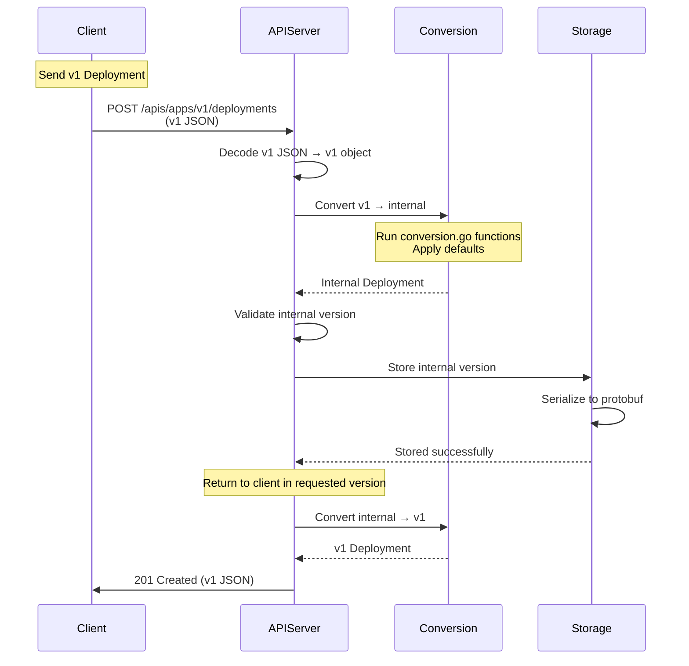

### **Conversion Functions**

**Automatic conversion** (generated):

**File**: `staging/src/k8s.io/api/apps/v1/zz_generated.conversion.go`

```go
// Auto-generated conversion function
func autoConvert_v1_Deployment_To_apps_Deployment(in *v1.Deployment, out *apps.Deployment, s conversion.Scope) error {
    out.ObjectMeta = in.ObjectMeta
    if err := Convert_v1_DeploymentSpec_To_apps_DeploymentSpec(&in.Spec, &out.Spec, s); err != nil {
        return err
    }
    if err := Convert_v1_DeploymentStatus_To_apps_DeploymentStatus(&in.Status, &out.Status, s); err != nil {
        return err
    }
    return nil
}
```

**Manual conversion** (for special cases):

**File**: `pkg/apis/apps/v1/conversion.go`

```go
// Manual conversion override for special handling
func Convert_v1_DeploymentSpec_To_apps_DeploymentSpec(in *v1.DeploymentSpec, out *apps.DeploymentSpec, s conversion.Scope) error {
    // Call auto-generated conversion
    if err := autoConvert_v1_DeploymentSpec_To_apps_DeploymentSpec(in, out, s); err != nil {
        return err
    }

    // Special handling for fields that changed between versions
    if in.Replicas == nil {
        out.Replicas = 1  // Default in older version
    } else {
        out.Replicas = *in.Replicas
    }

    return nil
}
```

### **Default Values**

**File**: `pkg/apis/apps/v1/defaults.go`

```go
func SetDefaults_Deployment(obj *appsv1.Deployment) {
    // Set default replicas
    if obj.Spec.Replicas == nil {
        obj.Spec.Replicas = pointer.Int32(1)
    }

    // Set default strategy
    if obj.Spec.Strategy.Type == "" {
        obj.Spec.Strategy.Type = appsv1.RollingUpdateDeploymentStrategyType
    }

    // Set default rolling update params
    if obj.Spec.Strategy.Type == appsv1.RollingUpdateDeploymentStrategyType {
        if obj.Spec.Strategy.RollingUpdate == nil {
            obj.Spec.Strategy.RollingUpdate = &appsv1.RollingUpdateDeployment{}
        }
        if obj.Spec.Strategy.RollingUpdate.MaxSurge == nil {
            obj.Spec.Strategy.RollingUpdate.MaxSurge = &intstr.IntOrString{
                Type:   intstr.String,
                StrVal: "25%",
            }
        }
        if obj.Spec.Strategy.RollingUpdate.MaxUnavailable == nil {
            obj.Spec.Strategy.RollingUpdate.MaxUnavailable = &intstr.IntOrString{
                Type:   intstr.String,
                StrVal: "25%",
            }
        }
    }
}
```

### **Version Lifecycle**

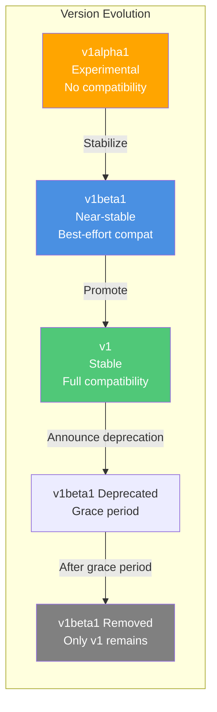

### **Multi-Version Support**

**API Server serves all versions simultaneously**:

```go
// pkg/controlplane/instance.go

func (c *Config) Complete() CompletedConfig {
    // Register all API versions
    if err := c.APIGroupInfo.AddVersionedTypes(
        appsv1alpha1.SchemeGroupVersion,
        &appsv1alpha1.Deployment{},
        &appsv1alpha1.DeploymentList{},
    ); err != nil {
        return err
    }

    if err := c.APIGroupInfo.AddVersionedTypes(
        appsv1beta1.SchemeGroupVersion,
        &appsv1beta1.Deployment{},
        &appsv1beta1.DeploymentList{},
    ); err != nil {
        return err
    }

    if err := c.APIGroupInfo.AddVersionedTypes(
        appsv1.SchemeGroupVersion,
        &appsv1.Deployment{},
        &appsv1.DeploymentList{},
    ); err != nil {
        return err
    }
}
```

**Client can request any version**:

```bash
# Get as v1
curl https://api-server/apis/apps/v1/namespaces/default/deployments/my-app

# Get as v1beta1
curl https://api-server/apis/apps/v1beta1/namespaces/default/deployments/my-app

# Same object, different serialization
```

━━━━━━━━━━━━━━━━━━━━━━━━━━━━━━━━━━━━━━━━━━━━━━━━━━━━━━━━━━━━━━━━━━━━━━━━━━━━━━

## **✅ Testing Patterns**

### **Test Organization**

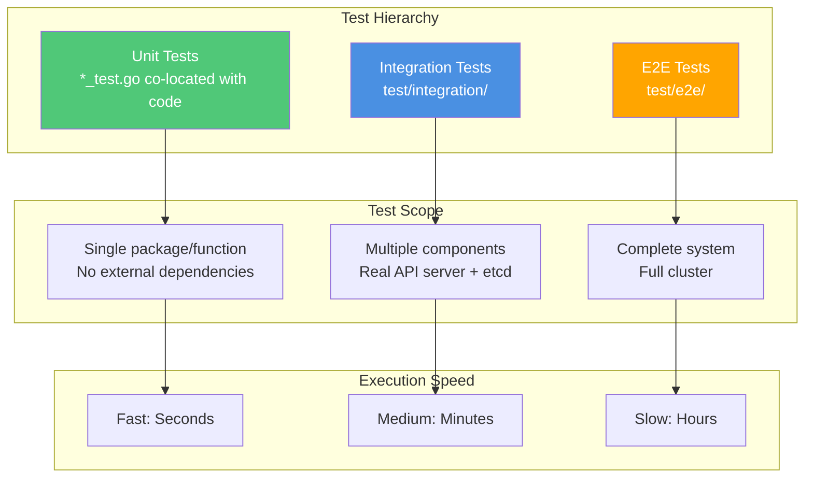

### **Unit Test Co-location**

**Pattern**: Tests live **next to** the code they test

```
pkg/controller/deployment/
├── deployment_controller.go           # Implementation
├── deployment_controller_test.go      # Unit tests
├── sync.go                            # Sync logic
├── sync_test.go                       # Sync tests
├── util.go                            # Utilities
└── util_test.go                       # Utility tests
```

**Example Unit Test**:

**File**: `pkg/controller/deployment/deployment_controller_test.go`

```go
package deployment

import (
    "testing"
    "k8s.io/client-go/tools/cache"
)

func TestDeploymentController_syncDeployment(t *testing.T) {
    // Setup test fixtures
    deployment := newDeployment("test", 3)

    // Create fake clientset
    fakeClient := fake.NewSimpleClientset(deployment)

    // Create controller with fake client
    controller := NewDeploymentController(
        fakeClient,
        nil, // informer
        nil, // rsInformer
        nil, // podInformer
    )

    // Run sync
    err := controller.syncDeployment("default/test")

    // Assert results
    if err != nil {
        t.Errorf("syncDeployment() error = %v", err)
    }

    // Verify actions taken
    actions := fakeClient.Actions()
    if len(actions) != 1 {
        t.Errorf("expected 1 action, got %d", len(actions))
    }
}
```

### **Integration Test Organization**

```
test/integration/
├── apiserver/                         # API server tests
│   ├── apiserver_test.go
│   └── [more tests]
├── controller/                        # Controller tests
│   ├── deployment/
│   │   └── deployment_test.go
│   ├── replicaset/
│   │   └── replicaset_test.go
│   └── [more controllers]
├── scheduler/                         # Scheduler tests
│   └── scheduler_test.go
└── [67 total subdirectories]
```

**Example Integration Test**:

**File**: `test/integration/controller/deployment/deployment_test.go`

```go
package deployment

import (
    "context"
    "testing"
    "k8s.io/kubernetes/test/integration/framework"
)

func TestDeploymentCreation(t *testing.T) {
    // Start control plane (API server + etcd)
    ctx, cancel := context.WithCancel(context.Background())
    defer cancel()

    server := framework.NewControlPlaneWithOptions(
        framework.ControlPlaneOptions{
            StartReplicaSetController: true,
            StartDeploymentController: true,
        },
    )
    defer server.Teardown()

    // Use real client
    client := server.Client()

    // Create deployment
    deployment := newDeployment("test", 3)
    created, err := client.AppsV1().Deployments("default").Create(
        ctx, deployment, metav1.CreateOptions{},
    )
    if err != nil {
        t.Fatalf("Failed to create deployment: %v", err)
    }

    // Wait for replica sets to be created
    err = wait.Poll(100*time.Millisecond, 30*time.Second, func() (bool, error) {
        rsList, _ := client.AppsV1().ReplicaSets("default").List(ctx, metav1.ListOptions{})
        return len(rsList.Items) > 0, nil
    })

    if err != nil {
        t.Fatalf("ReplicaSet was not created: %v", err)
    }
}
```

### **E2E Test Organization**

```
test/e2e/
├── apimachinery/                      # API machinery tests
├── apps/                              # Apps tests (Deployments, etc.)
│   ├── deployment.go
│   ├── statefulset.go
│   └── daemonset.go
├── auth/                              # Auth/RBAC tests
├── network/                           # Networking tests
├── node/                              # Node tests
├── scheduling/                        # Scheduler tests
└── [33 total subdirectories]
```

**E2E Test Framework**:

```go
// test/e2e/apps/deployment.go

var _ = SIGDescribe("Deployment", func() {
    f := framework.NewDefaultFramework("deployment")

    It("should create and scale a deployment", func() {
        // Create deployment
        deployment := newDeployment("nginx", 1)
        deployment, err := f.ClientSet.AppsV1().Deployments(f.Namespace.Name).Create(
            context.TODO(), deployment, metav1.CreateOptions{},
        )
        Expect(err).NotTo(HaveOccurred())

        // Wait for rollout
        err = waitForDeploymentComplete(f.ClientSet, deployment)
        Expect(err).NotTo(HaveOccurred())

        // Scale up
        deployment.Spec.Replicas = pointer.Int32(3)
        deployment, err = f.ClientSet.AppsV1().Deployments(f.Namespace.Name).Update(
            context.TODO(), deployment, metav1.UpdateOptions{},
        )
        Expect(err).NotTo(HaveOccurred())

        // Wait for scale
        err = waitForDeploymentComplete(f.ClientSet, deployment)
        Expect(err).NotTo(HaveOccurred())

        // Verify 3 pods
        pods, err := f.ClientSet.CoreV1().Pods(f.Namespace.Name).List(
            context.TODO(), metav1.ListOptions{},
        )
        Expect(err).NotTo(HaveOccurred())
        Expect(len(pods.Items)).To(Equal(3))
    })
})
```

### **Test Execution**

```bash
# Run all unit tests
make test

# Run tests for specific package
make test WHAT=./pkg/controller/deployment/...

# Run integration tests
make test-integration

# Run specific integration test
make test-integration WHAT=./test/integration/controller/deployment/...

# Run E2E tests
make test-e2e

# Run specific E2E test
go test ./test/e2e/apps/ -ginkgo.focus="Deployment"
```

### **Test Helper Patterns**

**Fake clients** for unit tests:

```go
import "k8s.io/client-go/kubernetes/fake"

// Create fake clientset
fakeClient := fake.NewSimpleClientset(
    &corev1.Pod{...},      // Pre-populated objects
    &appsv1.Deployment{...},
)

// Use like real client
pod, err := fakeClient.CoreV1().Pods("default").Get(ctx, "my-pod", metav1.GetOptions{})
```

**Test frameworks** for integration tests:

```go
import "k8s.io/kubernetes/test/integration/framework"

// Start test API server
server := framework.NewControlPlaneWithOptions(...)
defer server.Teardown()

// Get real client
client := server.Client()
```

━━━━━━━━━━━━━━━━━━━━━━━━━━━━━━━━━━━━━━━━━━━━━━━━━━━━━━━━━━━━━━━━━━━━━━━━━━━━━━

## **🚫 Import Restrictions**

### **Purpose**

**Import restrictions** prevent:
- Circular dependencies
- Layering violations
- Unwanted coupling
- Main repo → staging imports (should be reversed)

**Enforced by**: `import-boss` tool (cmd/import-boss/)

### **Restriction Files**

**File**: `.import-restrictions`

**Locations**:
```
cmd/kube-apiserver/.import-restrictions
cmd/kube-controller-manager/.import-restrictions
cmd/kubeadm/.import-restrictions
pkg/kubectl/.import-restrictions
staging/src/k8s.io/client-go/.import-restrictions
[... many more]
```

### **Example Restriction File**

**File**: `/Users/sureshscribnar/Documents/Projects/opensource/kubernetes/cmd/kube-apiserver/.import-restrictions`

```json
{
  "Rules": [
    {
      "SelectorRegexp": "k8s[.]io",
      "AllowedPrefixes": [
        "k8s.io/api",
        "k8s.io/apimachinery",
        "k8s.io/apiserver",
        "k8s.io/client-go",
        "k8s.io/component-base",
        "k8s.io/klog",
        "k8s.io/utils"
      ],
      "ForbiddenPrefixes": [
        "k8s.io/kubernetes/cmd",
        "k8s.io/kubernetes/pkg/kubectl"
      ]
    },
    {
      "SelectorRegexp": "^k8s[.]io/kubernetes/pkg",
      "AllowedPrefixes": [
        "k8s.io/kubernetes/pkg/api",
        "k8s.io/kubernetes/pkg/apis",
        "k8s.io/kubernetes/pkg/kubeapiserver",
        "k8s.io/kubernetes/pkg/registry"
      ]
    }
  ]
}
```

### **Import Restriction Enforcement**

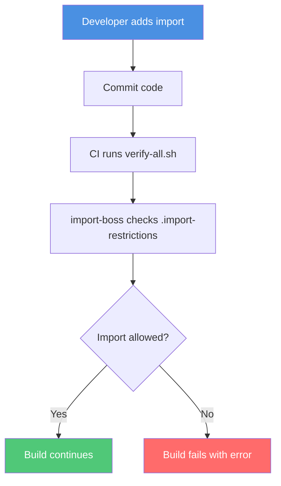

### **Common Restriction Patterns**

| Pattern | Reason |
|---------|--------|
| `staging/ → pkg/` **FORBIDDEN** | Staging must be independent |
| `client-go → kubectl` **FORBIDDEN** | Client lib shouldn't depend on CLI |
| `cmd/ → cmd/` **RESTRICTED** | Binaries shouldn't cross-import |
| `pkg/apis/ → pkg/registry/` **ALLOWED** | Registry needs API types |

### **Verification**

```bash
# Check all import restrictions
./hack/verify-import-boss.sh

# Or as part of full verification
./hack/verify-all.sh
```

**Example error**:

```
Import restriction violation:
  File: pkg/kubectl/cmd/apply/apply.go
  Imports: k8s.io/kubernetes/cmd/kube-apiserver/app
  Violated rule: kubectl cannot import from cmd/
```

━━━━━━━━━━━━━━━━━━━━━━━━━━━━━━━━━━━━━━━━━━━━━━━━━━━━━━━━━━━━━━━━━━━━━━━━━━━━━━

## **📛 Package Naming Conventions**

### **General Patterns**

| Convention | Example | Purpose |
|------------|---------|---------|
| **Lowercase** | `deployment` not `Deployment` | Go package naming |
| **No underscores** | `replicaset` not `replica_set` | Go convention |
| **Singular** | `pod` not `pods` | Package represents concept |
| **Short** | `util` not `utilities` | Import readability |
| **Descriptive** | `validation` not `val` | Clear purpose |

### **API Package Naming**

```
pkg/apis/<group>/                      # Internal API
pkg/apis/<group>/v1/                   # Versioned conversion helpers
pkg/apis/<group>/validation/           # Validation logic
pkg/apis/<group>/install/              # Installation/registration

staging/src/k8s.io/api/<group>/<version>/  # Versioned types
```

**Examples**:
```
pkg/apis/apps/                         # Apps group internal
pkg/apis/apps/v1/                      # v1 conversion
pkg/apis/apps/validation/              # Validation
staging/src/k8s.io/api/apps/v1/        # v1 types (published)
```

### **Implementation Package Naming**

```
pkg/<component>/                       # Component root
pkg/<component>/<subcomponent>/        # Specific functionality
```

**Examples**:
```
pkg/controller/                        # Controller framework
pkg/controller/deployment/             # Deployment controller
pkg/kubelet/                           # Kubelet root
pkg/kubelet/container/                 # Container runtime
pkg/proxy/                             # Proxy root
pkg/proxy/iptables/                    # iptables mode
```

### **Utility Package Naming**

| Package | Purpose |
|---------|---------|
| `util` | General utilities |
| `wait` | Waiting/polling utilities |
| `retry` | Retry logic |
| `validation` | Validation helpers |
| `metrics` | Metrics collection |
| `framework` | Test framework |

━━━━━━━━━━━━━━━━━━━━━━━━━━━━━━━━━━━━━━━━━━━━━━━━━━━━━━━━━━━━━━━━━━━━━━━━━━━━━━

## **📂 File Organization Standards**

### **Standard Files**

| File | Purpose | Required |
|------|---------|----------|
| `doc.go` | Package documentation | ✅ Yes |
| `types.go` | Type definitions | ✅ For APIs |
| `register.go` | Scheme registration | ✅ For APIs |
| `zz_generated.*.go` | Generated code | ✅ Auto-created |
| `*_test.go` | Unit tests | ✅ Recommended |
| `OWNERS` | Code ownership | ✅ Yes |
| `BUILD` | Bazel build (deprecated) | 🚧 Legacy |

### **doc.go Template**

**File**: `pkg/controller/deployment/doc.go`

```go
/*
Copyright 2025 The Kubernetes Authors.

Licensed under the Apache License, Version 2.0 (the "License");
you may not use this file except in compliance with the License.
You may obtain a copy of the License at

    http://www.apache.org/licenses/LICENSE-2.0

Unless required by applicable law or agreed to in writing, software
distributed under the License is distributed on an "AS IS" BASIS,
WITHOUT WARRANTIES OR CONDITIONS OF ANY KIND, either express or implied.
See the License for the specific language governing permissions and
limitations under the License.
*/

// Package deployment contains the controller for managing Deployments.
//
// The deployment controller is responsible for:
// - Creating and managing ReplicaSets for Deployments
// - Performing rolling updates and rollbacks
// - Scaling Deployments up and down
// - Cleaning up old ReplicaSets
package deployment
```

### **File Grouping**

**Group related functionality**:

```
pkg/controller/deployment/
├── doc.go                             # Package docs
├── deployment_controller.go           # Main controller
├── sync.go                            # Sync logic
├── recreate.go                        # Recreate strategy
├── rolling.go                         # Rolling update strategy
├── rollback.go                        # Rollback logic
├── util.go                            # Utilities
├── progress.go                        # Progress tracking
├── deployment_controller_test.go      # Controller tests
├── sync_test.go                       # Sync tests
└── util_test.go                       # Utility tests
```

### **Generated File Recognition**

**Always named with `zz_generated.` prefix**:

```
zz_generated.deepcopy.go               # DeepCopy methods
zz_generated.conversion.go             # Conversions
zz_generated.defaults.go               # Defaults
*.pb.go                                # Protobuf (different pattern)
```

**Header comment**:
```go
// Code generated by <tool>. DO NOT EDIT.
```

━━━━━━━━━━━━━━━━━━━━━━━━━━━━━━━━━━━━━━━━━━━━━━━━━━━━━━━━━━━━━━━━━━━━━━━━━━━━━━

## **🔄 Development Workflows**

### **Feature Development Workflow**

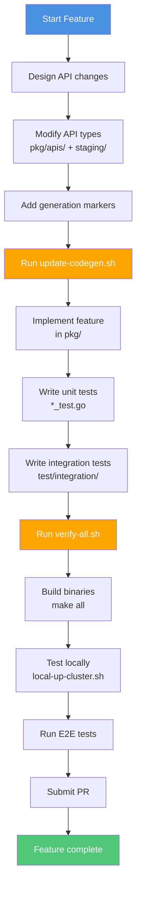

### **Quick Reference Commands**

```bash
# Code generation
./hack/update-codegen.sh               # Generate all code
./hack/verify-codegen.sh               # Verify generation

# Building
make all                               # Build all binaries
make kube-apiserver                    # Build API server
make kubectl                           # Build kubectl

# Testing
make test                              # Run unit tests
make test-integration                  # Run integration tests
make test-e2e                          # Run E2E tests

# Verification
./hack/verify-all.sh                   # Run all checks
./hack/verify-import-boss.sh           # Check imports
./hack/verify-api-compatibility.sh     # Check API compat

# Local cluster
./hack/local-up-cluster.sh             # Start local cluster
```

━━━━━━━━━━━━━━━━━━━━━━━━━━━━━━━━━━━━━━━━━━━━━━━━━━━━━━━━━━━━━━━━━━━━━━━━━━━━━━

## **📝 Summary**

### **Key Patterns**

✅ **Go Workspaces** - 32 modules in monorepo with local development
✅ **Code Generation** - Extensive automation for boilerplate
✅ **API Versioning** - Hub-and-spoke with internal types
✅ **Test Co-location** - Unit tests next to implementation
✅ **Import Restrictions** - Enforced dependency boundaries
✅ **Consistent Naming** - Clear package and file conventions
✅ **Generated Recognition** - zz_generated.* prefix

### **Best Practices**

1. **Always generate code** after API changes
2. **Use proper markers** for code generation
3. **Follow naming conventions** for packages and files
4. **Co-locate tests** with implementation
5. **Respect import restrictions** - check .import-restrictions
6. **Document packages** with doc.go
7. **Verify before commit** with verify-all.sh

━━━━━━━━━━━━━━━━━━━━━━━━━━━━━━━━━━━━━━━━━━━━━━━━━━━━━━━━━━━━━━━━━━━━━━━━━━━━━━

## **🔗 Related Documentation**

| Document | Relationship |
|----------|--------------|
| [01-repository-overview.md](01-repository-overview.md) | Overall structure |
| [03-pkg-implementation.md](03-pkg-implementation.md) | Implementation patterns |
| [04-staging-architecture.md](04-staging-architecture.md) | Module publishing |
| [06-test-infrastructure.md](06-test-infrastructure.md) | Testing details |
| [07-hack-tools.md](07-hack-tools.md) | Development scripts |
| [10-api-definitions.md](10-api-definitions.md) | API specifications |
| [12-dependency-graph.md](12-dependency-graph.md) | Component dependencies |
| [13-development-workflows.md](13-development-workflows.md) | Complete workflows |

━━━━━━━━━━━━━━━━━━━━━━━━━━━━━━━━━━━━━━━━━━━━━━━━━━━━━━━━━━━━━━━━━━━━━━━━━━━━━━

**Document Status**: ✅ Active | **Patterns**: Stable | **Maintenance**: Regular updates

**Navigation**: [README](00-README.md) | [Previous: API Definitions](10-api-definitions.md) | [Next: Dependency Graph](12-dependency-graph.md)
