# **KUBERNETES DEPENDENCY GRAPH**

**Component Relationships, Dependencies, and Import Restrictions**

━━━━━━━━━━━━━━━━━━━━━━━━━━━━━━━━━━━━━━━━━━━━━━━━━━━━━━━━━━━━━━━━━━━━━━━━━━━━━━

## **📋 Table of Contents**

1. [Overview](#overview)
2. [Dependency Layers](#dependency-layers)
3. [Component Interactions](#component-interactions)
4. [Build vs Runtime Dependencies](#build-vs-runtime-dependencies)
5. [Import Restriction Enforcement](#import-restriction-enforcement)
6. [Circular Dependency Prevention](#circular-dependency-prevention)
7. [Staging Module Dependencies](#staging-module-dependencies)
8. [External Dependency Management](#external-dependency-management)
9. [Version Pinning Strategies](#version-pinning-strategies)
10. [Troubleshooting](#troubleshooting)

━━━━━━━━━━━━━━━━━━━━━━━━━━━━━━━━━━━━━━━━━━━━━━━━━━━━━━━━━━━━━━━━━━━━━━━━━━━━━━

## **🎯 Overview**

### **Purpose**

This document maps the **dependency relationships** between Kubernetes components, explaining:

- **Layer architecture** (foundation → client → server → binary)
- **Component interactions** (how pieces communicate)
- **Dependency management** (vendoring, versioning, pinning)
- **Import restrictions** (enforced boundaries)
- **Circular dependency prevention** (architectural safeguards)

### **Dependency Categories**

| Category | Description | Examples |
|----------|-------------|----------|
| **Foundation** | Core utilities, no Kubernetes-specific logic | apimachinery, component-base |
| **API** | Type definitions | k8s.io/api |
| **Client** | Client libraries | client-go |
| **Server** | API server framework | apiserver, apiextensions-apiserver |
| **Components** | Kubernetes binaries | kubectl, kubelet, kube-apiserver |
| **External** | Third-party dependencies | etcd, gRPC, Prometheus |

### **Dependency Flow Direction**

```
Components → Server → Client → API → Foundation → External
```

**Rule**: Dependencies flow **downward** only (no circular references)

━━━━━━━━━━━━━━━━━━━━━━━━━━━━━━━━━━━━━━━━━━━━━━━━━━━━━━━━━━━━━━━━━━━━━━━━━━━━━━

## **📊 Dependency Layers**

### **Layer Architecture**

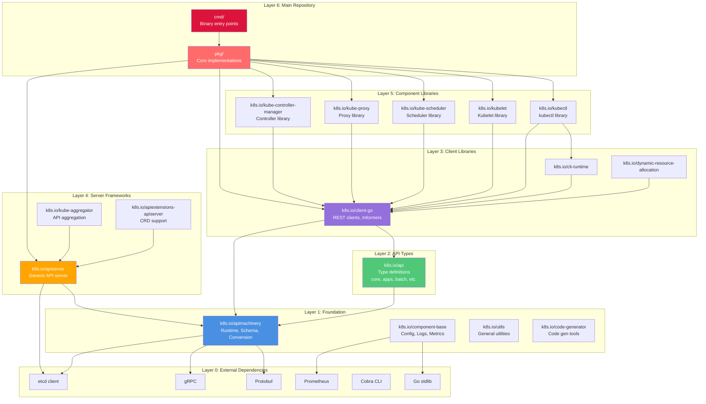

### **Layer Descriptions**

#### **Layer 0: External Dependencies**

**Purpose**: Third-party libraries with no Kubernetes dependencies

**Key Dependencies**:

| Dependency | Version | Purpose |
|------------|---------|---------|
| `go.etcd.io/etcd/client/v3` | v3.6.4 | etcd client library |
| `google.golang.org/grpc` | v1.72.2 | gRPC framework |
| `google.golang.org/protobuf` | v1.36.8 | Protocol buffers |
| `github.com/prometheus/client_golang` | v1.23.2 | Prometheus metrics |
| `github.com/spf13/cobra` | v1.10.0 | CLI framework |
| `golang.org/x/net` | v0.43.0 | Network utilities |
| `go.uber.org/zap` | v1.27.0 | Logging |

**Characteristics**:
- ✅ No Kubernetes dependencies
- ✅ Stable versions
- ✅ Wide ecosystem adoption
- ✅ Vendored for reproducibility

#### **Layer 1: Foundation**

**Purpose**: Core Kubernetes utilities, independent of API types

**Modules**:

| Module | Purpose | Exports |
|--------|---------|---------|
| `k8s.io/apimachinery` | Runtime, schema, conversion framework | runtime.Object, schema.GroupVersion |
| `k8s.io/component-base` | Component configuration, metrics, logs | config, metrics, version |
| `k8s.io/utils` | General utilities | pointer, clock, net helpers |
| `k8s.io/code-generator` | Code generation tools | deepcopy-gen, client-gen |
| `k8s.io/klog/v2` | Kubernetes logging | Logging interface |

**Key Package**: `k8s.io/apimachinery/pkg/runtime`

```go
// Core abstraction for all Kubernetes objects
type Object interface {
    GetObjectKind() schema.ObjectKind
    DeepCopyObject() Object
}

// Scheme manages type registration and conversions
type Scheme struct {
    // Type registry
    // Conversion functions
    // Default values
}
```

#### **Layer 2: API Types**

**Purpose**: Kubernetes API type definitions

**Module**: `k8s.io/api`

**Structure**:
```
k8s.io/api/
├── core/v1/              # Core types (Pod, Service, etc.)
├── apps/v1/              # Apps types (Deployment, StatefulSet)
├── batch/v1/             # Batch types (Job, CronJob)
├── networking/v1/        # Networking types
├── storage/v1/           # Storage types
└── [20+ more groups]
```

**Dependency**: ONLY `k8s.io/apimachinery` (no other k8s.io/* modules)

**Why separate?**
- **Minimal dependencies** - Just type definitions
- **Version independence** - Multiple API versions coexist
- **Client generation** - Clean types for code generation
- **Wide usage** - Many external projects import only k8s.io/api

#### **Layer 3: Client Libraries**

**Purpose**: Client libraries for accessing Kubernetes APIs

**Primary Module**: `k8s.io/client-go`

**Dependencies**:
```
client-go → api (type definitions)
         → apimachinery (runtime, schema)
         → component-base (config)
```

**Major Components**:

| Package | Purpose |
|---------|---------|
| `kubernetes/typed/` | Type-safe clients per API group |
| `informers/` | Caching clients with event handlers |
| `listers/` | Read-only cache accessors |
| `tools/cache/` | Shared informer framework |
| `tools/clientcmd/` | Kubeconfig parsing |
| `rest/` | Low-level REST client |
| `discovery/` | API discovery |

**Supporting Modules**:

| Module | Purpose |
|--------|---------|
| `k8s.io/cli-runtime` | CLI utilities (kubectl framework) |
| `k8s.io/metrics` | Metrics API client |
| `k8s.io/dynamic-resource-allocation` | Dynamic resource allocation |

#### **Layer 4: Server Frameworks**

**Purpose**: Generic API server framework

**Primary Module**: `k8s.io/apiserver`

**Key Features**:
- HTTP/2 server framework
- Authentication/authorization
- Admission control
- Storage backend abstraction
- OpenAPI serving
- Watch streaming
- Aggregation support

**Dependencies**:
```
apiserver → apimachinery (runtime)
         → component-base (config, metrics)
         → etcd/client/v3 (storage)
         → client-go (aggregation)
```

**Supporting Modules**:

| Module | Purpose |
|--------|---------|
| `k8s.io/apiextensions-apiserver` | CustomResourceDefinition support |
| `k8s.io/kube-aggregator` | API aggregation layer |

#### **Layer 5: Component Libraries**

**Purpose**: Component-specific logic as libraries

**Modules**:

| Module | Purpose | Key Features |
|--------|---------|--------------|
| `k8s.io/kubectl` | kubectl implementation | Commands, plugins, formatting |
| `k8s.io/kubelet` | Kubelet library | Pod lifecycle, container runtime |
| `k8s.io/kube-scheduler` | Scheduler library | Scheduling algorithms, plugins |
| `k8s.io/kube-proxy` | Proxy library | Service proxy, iptables/ipvs |
| `k8s.io/kube-controller-manager` | Controller library | Common controller framework |

**Common Dependencies**:
```
All component libraries → client-go → api → apimachinery
```

#### **Layer 6: Main Repository**

**Purpose**: Main Kubernetes monorepo

**Structure**:
```
k8s.io/kubernetes/
├── pkg/                  # Core implementations
│   ├── controller/       # Controller implementations
│   ├── kubelet/          # Kubelet implementation
│   ├── scheduler/        # Scheduler implementation
│   ├── proxy/            # Proxy implementation
│   └── apis/             # Internal API types
└── cmd/                  # Binary entry points
    ├── kube-apiserver/
    ├── kube-controller-manager/
    ├── kube-scheduler/
    ├── kubelet/
    └── kubectl/
```

**Dependencies**: Everything (top of the stack)

```
cmd/ → pkg/ → staging/ → vendor/
```

━━━━━━━━━━━━━━━━━━━━━━━━━━━━━━━━━━━━━━━━━━━━━━━━━━━━━━━━━━━━━━━━━━━━━━━━━━━━━━

## **🔄 Component Interactions**

### **API Server Interactions**

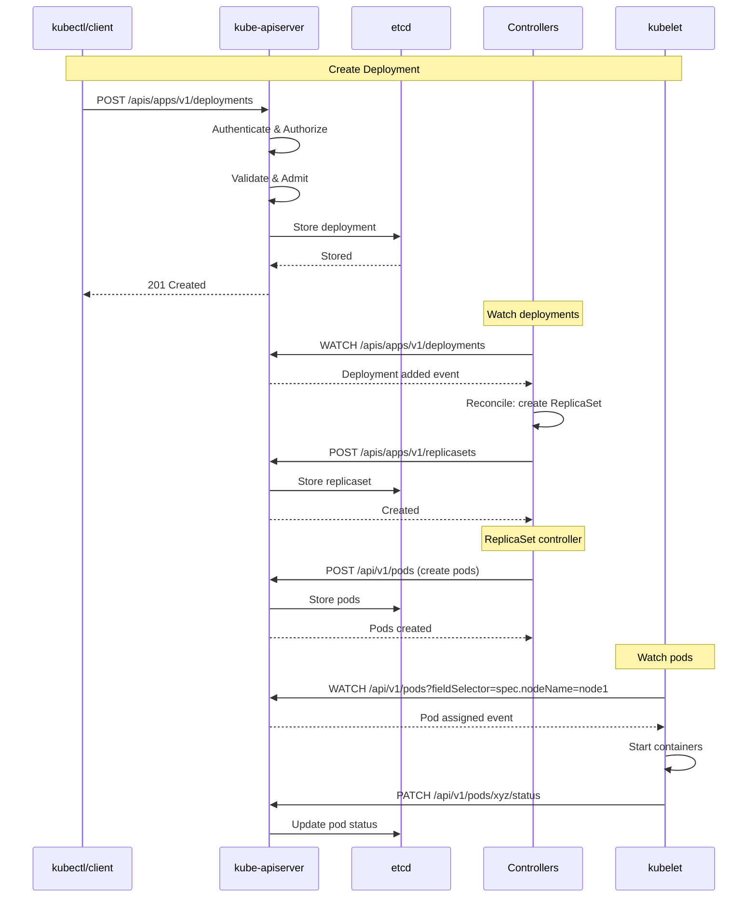

### **Controller Manager Dependencies**

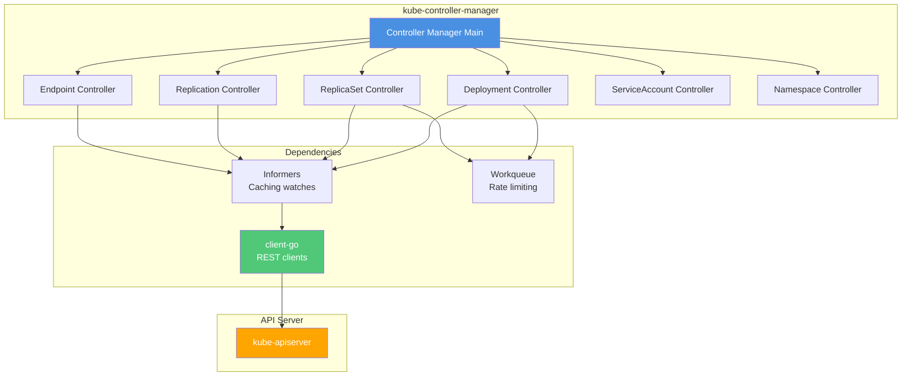

### **Scheduler Dependencies**

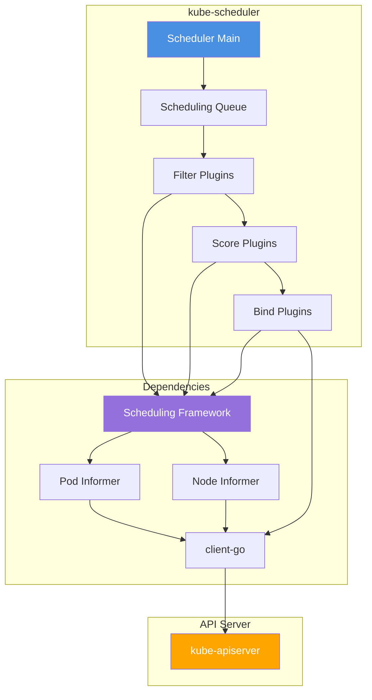

### **Kubelet Dependencies**

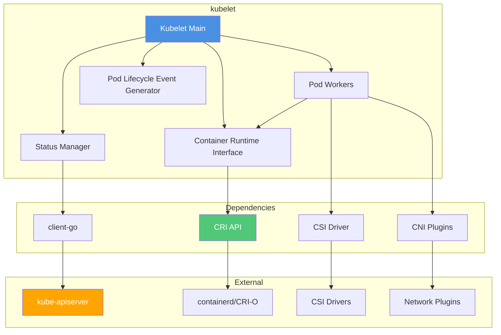

### **kube-proxy Dependencies**

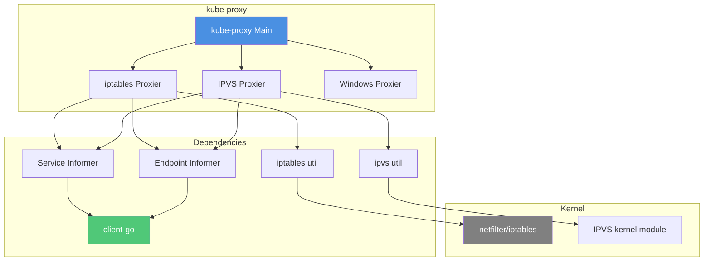

### **kubectl Dependencies**

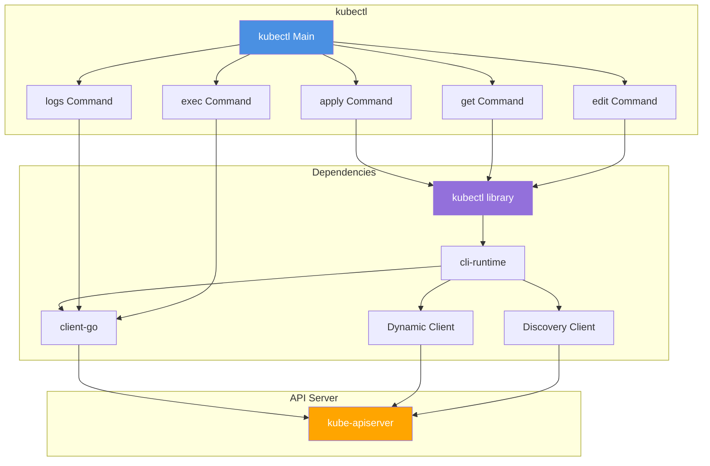

━━━━━━━━━━━━━━━━━━━━━━━━━━━━━━━━━━━━━━━━━━━━━━━━━━━━━━━━━━━━━━━━━━━━━━━━━━━━━━

## **⚙️ Build vs Runtime Dependencies**

### **Dependency Types**

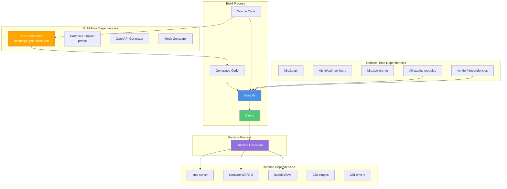

### **Build-Time Dependencies**

**Purpose**: Only needed during build, not in final binary

| Tool | Purpose | When Used |
|------|---------|-----------|
| `deepcopy-gen` | Generate DeepCopy methods | Code generation |
| `client-gen` | Generate typed clients | Code generation |
| `informer-gen` | Generate informers | Code generation |
| `lister-gen` | Generate listers | Code generation |
| `conversion-gen` | Generate conversions | Code generation |
| `defaulter-gen` | Generate defaults | Code generation |
| `openapi-gen` | Generate OpenAPI specs | Code generation |
| `protoc` | Compile protobuf | Protobuf generation |
| `go-bindata` | Embed static files | Asset embedding |

**Invocation**:
```bash
# Build-time only
./hack/update-codegen.sh

# These tools are NOT in the final binaries
```

### **Compile-Time Dependencies**

**Purpose**: Imported by source code, compiled into binary

**Categories**:

1. **Staging Modules** (k8s.io/*)
   - Always used via workspace or replace directives
   - Compiled into binary

2. **Vendored Modules** (vendor/)
   - Third-party dependencies
   - Included in binary

3. **Standard Library**
   - Go stdlib
   - Compiled into binary

**Example**:
```go
import (
    "k8s.io/api/core/v1"           // Compile-time: type definitions
    "k8s.io/client-go/kubernetes"   // Compile-time: client library
    "github.com/spf13/cobra"        // Compile-time: CLI framework
)
```

### **Runtime Dependencies**

**Purpose**: External systems required at runtime

| Dependency | Used By | Required |
|------------|---------|----------|
| **etcd** | kube-apiserver | ✅ Yes |
| **containerd/CRI-O** | kubelet | ✅ Yes (one of) |
| **iptables/ipvs** | kube-proxy | ✅ Yes (one of) |
| **CNI plugins** | kubelet | ✅ Yes |
| **CSI drivers** | kubelet | ⚠️ Optional (for storage) |
| **Cloud provider** | cloud-controller-manager | ⚠️ Optional |
| **CoreDNS** | Cluster | ✅ Yes (for DNS) |

**Not Vendored**: Runtime dependencies are **separate processes**

━━━━━━━━━━━━━━━━━━━━━━━━━━━━━━━━━━━━━━━━━━━━━━━━━━━━━━━━━━━━━━━━━━━━━━━━━━━━━━

## **🚫 Import Restriction Enforcement**

### **Enforcement Mechanism**

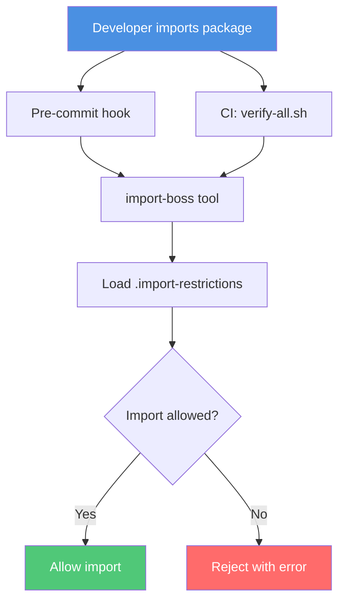

### **Import Restriction Rules**

**File**: `.import-restrictions` in each directory

**Example**: `cmd/kube-apiserver/.import-restrictions`

```json
{
  "Rules": [
    {
      "SelectorRegexp": "k8s[.]io",
      "AllowedPrefixes": [
        "k8s.io/api",
        "k8s.io/apimachinery",
        "k8s.io/apiserver",
        "k8s.io/client-go",
        "k8s.io/component-base"
      ],
      "ForbiddenPrefixes": [
        "k8s.io/kubernetes/cmd",
        "k8s.io/kubernetes/pkg/kubectl",
        "k8s.io/kubectl"
      ]
    }
  ]
}
```

**Interpretation**:
- ✅ **Allowed**: API server can import apiserver, client-go, component-base
- ❌ **Forbidden**: API server cannot import kubectl or other cmd/ binaries

### **Common Restrictions**

| From | To | Allowed | Reason |
|------|-----|---------|--------|
| `staging/` | `pkg/` | ❌ No | Staging must be independent |
| `staging/` | `cmd/` | ❌ No | Staging must be independent |
| `pkg/kubectl/` | `pkg/kubelet/` | ❌ No | Components shouldn't cross-depend |
| `client-go` | `kubectl` | ❌ No | Client library can't depend on CLI |
| `apimachinery` | `api` | ❌ No | Foundation can't depend on types |
| `apiserver` | `apimachinery` | ✅ Yes | Server uses foundation |
| `client-go` | `api` | ✅ Yes | Client uses types |

### **Verification**

```bash
# Check all import restrictions
./hack/verify-import-boss.sh

# Output on violation:
# Import restriction violation in cmd/kube-apiserver/app/server.go:
#   Imports: k8s.io/kubernetes/pkg/kubectl
#   Violated: ForbiddenPrefixes rule
```

━━━━━━━━━━━━━━━━━━━━━━━━━━━━━━━━━━━━━━━━━━━━━━━━━━━━━━━━━━━━━━━━━━━━━━━━━━━━━━

## **♻️ Circular Dependency Prevention**

### **Architectural Safeguards**

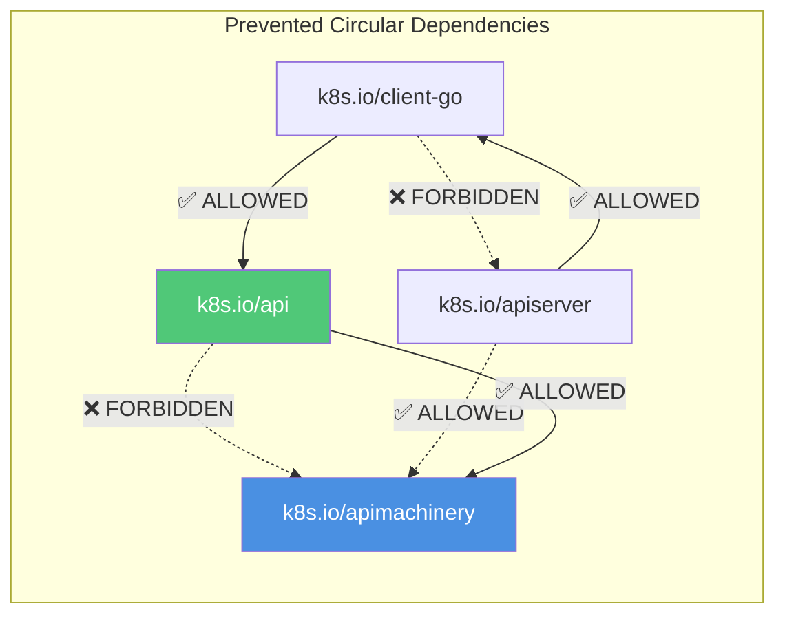

### **Prevention Strategies**

#### **1. Layered Architecture**

**Rule**: Dependencies flow one direction only

```
cmd/ → pkg/ → staging/ → vendor/
```

**Enforcement**:
- Import restrictions
- Code review
- Automated checks

#### **2. Interface Abstraction**

**Problem**: Package A needs Package B, but B also needs A

**Solution**: Define interface in A, implement in B

**Example**:

```go
// pkg/apis/core/types.go (Layer: API)
package core

// Pod type definition (no dependencies on kubelet)
type Pod struct {
    Spec PodSpec
}

// pkg/kubelet/types.go (Layer: Implementation)
package kubelet

import "k8s.io/api/core/v1"

// Kubelet depends on Pod type (one-way dependency)
type PodManager struct {
    pods map[string]*v1.Pod
}
```

#### **3. Event-Based Communication**

**Problem**: Components need to notify each other

**Solution**: Watch/Informer pattern (no direct coupling)

```go
// Controller watches API server (no direct dependency on scheduler)
informer.AddEventHandler(cache.ResourceEventHandlerFuncs{
    AddFunc: func(obj interface{}) {
        // React to additions
    },
})
```

#### **4. Dependency Injection**

**Problem**: Hard-coded dependencies create cycles

**Solution**: Inject dependencies at runtime

```go
// Instead of:
func NewController() *Controller {
    client := kubernetes.NewForConfigOrDie(...)  // Hard-coded
}

// Do:
func NewController(client kubernetes.Interface) *Controller {
    // Injected dependency
}
```

### **Detection**

```bash
# Go's module system prevents circular imports
# This will fail at compile time:

# Package A imports B
# Package B imports A
# Error: import cycle not allowed
```

━━━━━━━━━━━━━━━━━━━━━━━━━━━━━━━━━━━━━━━━━━━━━━━━━━━━━━━━━━━━━━━━━━━━━━━━━━━━━━

## **📦 Staging Module Dependencies**

### **Staging Dependency Graph**

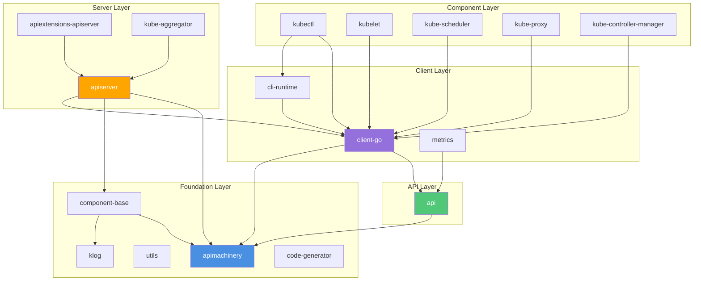

### **Module-Specific Dependencies**

#### **k8s.io/api**

**Dependencies**:
- `k8s.io/apimachinery` (runtime, schema)

**Dependents**:
- `k8s.io/client-go`
- `k8s.io/apiserver`
- All component modules

**Exports**: API type definitions

#### **k8s.io/apimachinery**

**Dependencies**:
- Standard library only
- Some third-party (encoding, conversion)

**Dependents**:
- `k8s.io/api`
- `k8s.io/client-go`
- `k8s.io/apiserver`
- Almost everything

**Exports**: Runtime framework, schema, conversion

#### **k8s.io/client-go**

**Dependencies**:
- `k8s.io/api`
- `k8s.io/apimachinery`
- `k8s.io/component-base`

**Dependents**:
- `k8s.io/kubectl`
- `k8s.io/kubelet`
- All controllers
- External projects

**Exports**: REST clients, informers, listers

#### **k8s.io/apiserver**

**Dependencies**:
- `k8s.io/apimachinery`
- `k8s.io/component-base`
- `k8s.io/client-go`
- `go.etcd.io/etcd/client/v3`

**Dependents**:
- `k8s.io/apiextensions-apiserver`
- `k8s.io/kube-aggregator`
- Custom API servers

**Exports**: Generic API server framework

━━━━━━━━━━━━━━━━━━━━━━━━━━━━━━━━━━━━━━━━━━━━━━━━━━━━━━━━━━━━━━━━━━━━━━━━━━━━━━

## **🌐 External Dependency Management**

### **Vendoring Strategy**

**Kubernetes uses Go modules with vendoring**:

```
k8s.io/kubernetes/
├── go.mod                    # Module dependencies
├── go.sum                    # Dependency checksums
└── vendor/                   # Vendored dependencies
    ├── github.com/
    ├── golang.org/
    ├── google.golang.org/
    ├── go.etcd.io/
    └── k8s.io/              # Staging modules also vendored
```

### **Major External Dependencies**

| Category | Dependencies | Purpose |
|----------|--------------|---------|
| **Storage** | `go.etcd.io/etcd/client/v3` v3.6.4 | etcd client |
| **RPC** | `google.golang.org/grpc` v1.72.2 | gRPC framework |
| **Serialization** | `google.golang.org/protobuf` v1.36.8 | Protocol buffers |
| **Metrics** | `github.com/prometheus/client_golang` v1.23.2 | Prometheus metrics |
| **CLI** | `github.com/spf13/cobra` v1.10.0 | CLI framework |
| **Logging** | `go.uber.org/zap` v1.27.0 | Structured logging |
| **Testing** | `github.com/onsi/ginkgo/v2` v2.21.0 | BDD testing |
| **Networking** | `github.com/vishvananda/netlink` v1.3.1 | Netlink interface |
| **Container** | `github.com/opencontainers/runc` | Container runtime |
| **Auth** | `gopkg.in/go-jose/go-jose.v2` v2.6.3 | JWT/OAuth |

### **Dependency Update Process**

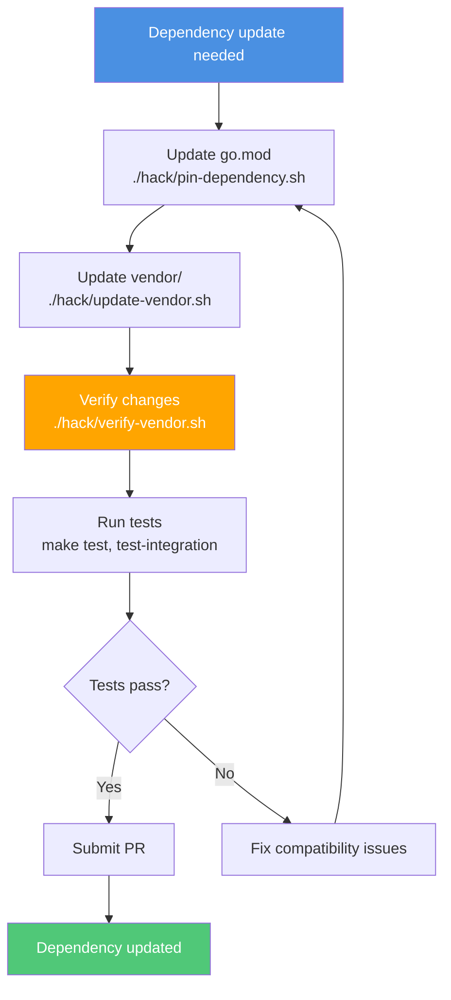

### **Dependency Commands**

```bash
# Pin a specific version
./hack/pin-dependency.sh github.com/pkg/errors v0.9.1

# Update vendor directory
./hack/update-vendor.sh

# Verify vendor is clean
./hack/verify-vendor.sh

# Update all dependencies
./hack/update-all.sh
```

━━━━━━━━━━━━━━━━━━━━━━━━━━━━━━━━━━━━━━━━━━━━━━━━━━━━━━━━━━━━━━━━━━━━━━━━━━━━━━

## **📌 Version Pinning Strategies**

### **Pinning Philosophy**

| Dependency Type | Strategy | Reason |
|----------------|----------|--------|
| **Critical (etcd, gRPC)** | Conservative upgrades | Stability > new features |
| **Utilities** | Regular updates | Bug fixes, performance |
| **Testing** | Latest stable | Best tooling experience |
| **Security** | Immediate patches | Security is priority |

### **Version Constraints**

**File**: `go.mod`

```go
require (
    // Exact version for critical dependencies
    go.etcd.io/etcd/client/v3 v3.6.4

    // Minimum version with patch updates allowed
    google.golang.org/grpc v1.72.2

    // Version ranges for non-critical
    github.com/spf13/cobra v1.10.0
)

replace (
    // Force specific version (override transitive deps)
    github.com/pkg/errors => github.com/pkg/errors v0.9.1

    // Local development (staging modules)
    k8s.io/api => ./staging/src/k8s.io/api
)
```

### **Transitive Dependency Management**

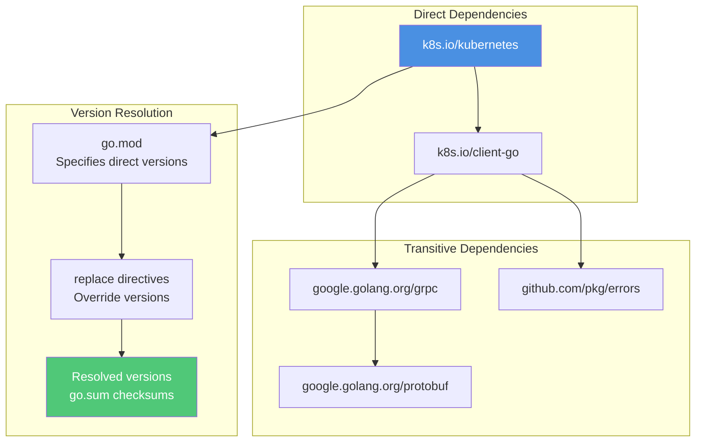

### **Checksum Verification**

**File**: `go.sum`

```
go.etcd.io/etcd/api/v3 v3.6.4 h1:hash...
go.etcd.io/etcd/api/v3 v3.6.4/go.mod h1:hash...
go.etcd.io/etcd/client/pkg/v3 v3.6.4 h1:hash...
```

**Purpose**:
- **Integrity** - Verify unchanged source
- **Reproducibility** - Same source every build
- **Security** - Detect tampering

━━━━━━━━━━━━━━━━━━━━━━━━━━━━━━━━━━━━━━━━━━━━━━━━━━━━━━━━━━━━━━━━━━━━━━━━━━━━━━

## **🔧 Troubleshooting**

### **Common Issues**

#### **Issue: Import cycle detected**

**Symptom**:
```
import cycle not allowed
package A imports B
package B imports A
```

**Solution**:
1. Review import restrictions
2. Break cycle with interface abstraction
3. Move common code to lower layer

#### **Issue: Dependency version conflict**

**Symptom**:
```
module requires version X but go.mod requires Y
```

**Solution**:
```bash
# Update to compatible versions
./hack/pin-dependency.sh module@version
./hack/update-vendor.sh
```

#### **Issue: Import restriction violation**

**Symptom**:
```
Import restriction violation:
  File: cmd/kubectl/kubectl.go
  Imports: k8s.io/kubernetes/pkg/kubelet
  Violated: ForbiddenPrefixes
```

**Solution**:
1. Don't import forbidden packages
2. Use allowed alternatives
3. Refactor if architectural issue

#### **Issue: Vendor out of sync**

**Symptom**:
```
vendor/ is out of sync with go.mod
```

**Solution**:
```bash
./hack/update-vendor.sh
./hack/verify-vendor.sh
```

### **Dependency Analysis Tools**

```bash
# List all dependencies
go list -m all

# Dependency graph
go mod graph

# Why is this dependency included?
go mod why -m github.com/pkg/errors

# Tidy up go.mod
go mod tidy

# Download dependencies
go mod download
```

━━━━━━━━━━━━━━━━━━━━━━━━━━━━━━━━━━━━━━━━━━━━━━━━━━━━━━━━━━━━━━━━━━━━━━━━━━━━━━

## **📊 Dependency Statistics**

### **Current State**

| Metric | Count |
|--------|------:|
| **Staging Modules** | 31 |
| **External Modules** | 1,297 |
| **Total Dependencies** | 1,328 |
| **Direct Dependencies** | ~100 |
| **Transitive Dependencies** | ~1,200 |
| **Vendor Size** | ~300 MB |

### **Dependency Distribution**

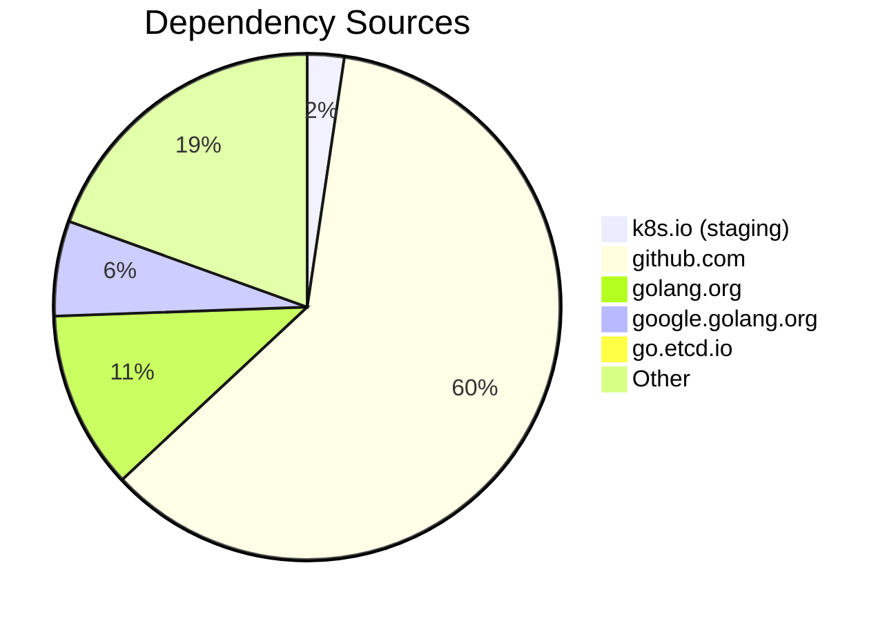

━━━━━━━━━━━━━━━━━━━━━━━━━━━━━━━━━━━━━━━━━━━━━━━━━━━━━━━━━━━━━━━━━━━━━━━━━━━━━━

## **📝 Summary**

### **Key Concepts**

✅ **Layered Architecture** - Dependencies flow downward only
✅ **Import Restrictions** - Enforced boundaries prevent violations
✅ **Staging Modules** - Independent, publishable libraries
✅ **Vendoring** - Reproducible builds with go modules
✅ **Version Pinning** - Controlled dependency updates
✅ **Circular Prevention** - Architectural safeguards

### **Best Practices**

1. **Respect layer boundaries** - Don't import upward
2. **Check import restrictions** - Before adding imports
3. **Use interfaces** - To break dependency cycles
4. **Update carefully** - Test thoroughly after dep updates
5. **Vendor consistently** - Keep go.mod and vendor/ in sync
6. **Pin critical deps** - Stability over latest versions

━━━━━━━━━━━━━━━━━━━━━━━━━━━━━━━━━━━━━━━━━━━━━━━━━━━━━━━━━━━━━━━━━━━━━━━━━━━━━━

## **🔗 Related Documentation**

| Document | Relationship |
|----------|--------------|
| [01-repository-overview.md](01-repository-overview.md) | High-level structure |
| [04-staging-architecture.md](04-staging-architecture.md) | Staging module details |
| [05-vendor-dependencies.md](05-vendor-dependencies.md) | Vendored dependencies |
| [11-code-organization-patterns.md](11-code-organization-patterns.md) | Code patterns |
| [13-development-workflows.md](13-development-workflows.md) | Development process |

━━━━━━━━━━━━━━━━━━━━━━━━━━━━━━━━━━━━━━━━━━━━━━━━━━━━━━━━━━━━━━━━━━━━━━━━━━━━━━

**Document Status**: ✅ Active | **Dependencies**: Managed via go.mod | **Maintenance**: Regular updates

**Navigation**: [README](00-README.md) | [Previous: Code Organization](11-code-organization-patterns.md) | [Next: Development Workflows](13-development-workflows.md)
