# **KUBERNETES DEVELOPMENT WORKFLOWS**

**Complete Development Processes, Build Systems, Testing, and Contribution Guidelines**

━━━━━━━━━━━━━━━━━━━━━━━━━━━━━━━━━━━━━━━━━━━━━━━━━━━━━━━━━━━━━━━━━━━━━━━━━━━━━━

## **📋 Table of Contents**

1. [Overview](#overview)
2. [Development Environment Setup](#development-environment-setup)
3. [Feature Development Workflow](#feature-development-workflow)
4. [Build Process](#build-process)
5. [Testing Workflow](#testing-workflow)
6. [Code Generation Workflow](#code-generation-workflow)
7. [PR Submission Process](#pr-submission-process)
8. [Local Development & Testing](#local-development--testing)
9. [Debugging Techniques](#debugging-techniques)
10. [Release Process Overview](#release-process-overview)

━━━━━━━━━━━━━━━━━━━━━━━━━━━━━━━━━━━━━━━━━━━━━━━━━━━━━━━━━━━━━━━━━━━━━━━━━━━━━━

## **🎯 Overview**

### **Purpose**

This document provides **complete workflows** for developing Kubernetes features, from initial setup through PR submission and release.

### **Workflow Categories**

| Workflow | Purpose | Time | Complexity |
|----------|---------|------|------------|
| **Setup** | Initial development environment | 1-2 hours | Medium |
| **Feature Development** | Add new feature or fix bug | Days-Weeks | High |
| **Build** | Compile binaries | 5-30 min | Low |
| **Testing** | Verify changes | 10 min - hours | Medium |
| **Code Generation** | Update generated code | 5-15 min | Low |
| **PR Submission** | Submit for review | 30 min | Medium |
| **Local Testing** | Test changes locally | 30 min - hours | Medium |
| **Debugging** | Troubleshoot issues | Variable | High |

━━━━━━━━━━━━━━━━━━━━━━━━━━━━━━━━━━━━━━━━━━━━━━━━━━━━━━━━━━━━━━━━━━━━━━━━━━━━━━

## **⚙️ Development Environment Setup**

### **Prerequisites**

**Required Software**:

| Tool | Version | Purpose |
|------|---------|---------|
| **Go** | 1.25.0+ | Primary language |
| **Git** | 2.x | Version control |
| **Make** | 4.x | Build system |
| **Docker** | 24.x+ | Container builds |
| **etcd** | 3.6.x | Local testing |
| **kubectl** | Latest | Client tool |

**Optional Tools**:

| Tool | Purpose |
|------|---------|
| **kind** | Local Kubernetes cluster |
| **minikube** | Alternative local cluster |
| **delve** | Go debugger |
| **code** | VS Code (IDE) |
| **goland** | JetBrains IDE |

### **Initial Setup**

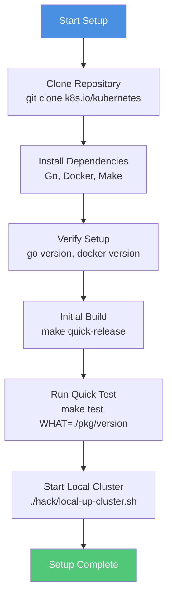

### **Step-by-Step Setup**

**1. Clone Repository**

```bash
# Clone main repository
git clone https://github.com/kubernetes/kubernetes.git
cd kubernetes

# Verify workspace structure
ls -la
# Should see: cmd/, pkg/, staging/, vendor/, hack/, etc.
```

**2. Install Go**

```bash
# Check Go version
go version
# Should be: go version go1.25.0 or newer

# If not installed, download from https://golang.org/dl/
```

**3. Install Docker**

```bash
# Check Docker
docker version

# On Mac: Install Docker Desktop
# On Linux: Install docker-ce
```

**4. Install Make**

```bash
# Check make
make --version

# Usually pre-installed on Unix systems
# Mac: Install via Xcode Command Line Tools
# Linux: apt-get install build-essential
```

**5. Install etcd (for local testing)**

```bash
# Mac
brew install etcd

# Linux
# Download from https://github.com/etcd-io/etcd/releases
```

**6. Verify Setup**

```bash
# Run verification
./hack/verify-all.sh

# This checks:
# - Go version
# - Required tools
# - Code formatting
# - Generated files
```

### **IDE Configuration**

**VS Code** (`.vscode/settings.json`):

```json
{
  "go.gopath": "${workspaceFolder}",
  "go.goroot": "/usr/local/go",
  "go.toolsEnvVars": {
    "GO111MODULE": "on"
  },
  "go.useLanguageServer": true,
  "gopls": {
    "experimentalWorkspaceModule": true
  },
  "files.watcherExclude": {
    "**/vendor/**": true,
    "**/_output/**": true
  }
}
```

**GoLand/IntelliJ**:
1. Open project root
2. Enable Go Modules: Preferences → Go → Go Modules → Enable
3. Set GOROOT to Go 1.25.0+
4. Mark vendor/ as excluded

━━━━━━━━━━━━━━━━━━━━━━━━━━━━━━━━━━━━━━━━━━━━━━━━━━━━━━━━━━━━━━━━━━━━━━━━━━━━━━

## **🚀 Feature Development Workflow**

### **Complete Development Cycle**

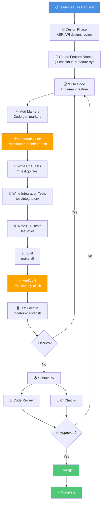

### **Phase 1: Design**

**For significant features**, create a KEP (Kubernetes Enhancement Proposal):

1. **Review existing KEPs**: https://github.com/kubernetes/enhancements/
2. **Create KEP**: Use template from enhancements repo
3. **Get approval**: SIG review and approval

**For API changes**:
- Design API types
- Follow API conventions
- Ensure backward compatibility
- Document breaking changes

### **Phase 2: Implementation**

**Directory structure for new feature**:

```bash
# Example: Adding new controller

# 1. Add API types
staging/src/k8s.io/api/apps/v1/
└── my_new_type.go

# 2. Add internal types
pkg/apis/apps/
└── types.go  # Add MyNewType

# 3. Add implementation
pkg/controller/mynewcontroller/
├── doc.go
├── controller.go
├── controller_test.go
├── sync.go
└── sync_test.go

# 4. Add integration tests
test/integration/mynewcontroller/
└── controller_test.go

# 5. Add E2E tests
test/e2e/apps/
└── mynewcontroller.go
```

### **Phase 3: Code Generation**

```bash
# Add markers to types
# +k8s:deepcopy-gen=true
# +genclient
# +k8s:openapi-gen=true

# Generate all code
./hack/update-codegen.sh

# Generated files:
# - zz_generated.deepcopy.go
# - zz_generated.conversion.go
# - zz_generated.defaults.go
# - client-go files
# - informers
# - listers
```

### **Phase 4: Testing**

```bash
# Write unit tests
pkg/controller/mynewcontroller/controller_test.go

# Write integration tests
test/integration/mynewcontroller/controller_test.go

# Write E2E tests
test/e2e/apps/mynewcontroller.go

# Run tests (covered in Testing Workflow section)
```

### **Phase 5: Verification**

```bash
# Run all verification checks
./hack/verify-all.sh

# This runs:
# - verify-boilerplate.sh      (license headers)
# - verify-gofmt.sh             (code formatting)
# - verify-golint.sh            (linting)
# - verify-govet.sh             (static analysis)
# - verify-codegen.sh           (generated code)
# - verify-openapi-spec.sh      (OpenAPI specs)
# - verify-imports.sh           (import organization)
# - verify-import-boss.sh       (import restrictions)
# - verify-vendor.sh            (vendor consistency)
```

### **Phase 6: Local Testing**

```bash
# Start local cluster with your changes
./hack/local-up-cluster.sh

# In another terminal, test your feature
kubectl apply -f test-manifest.yaml
kubectl get mynewresource
```

━━━━━━━━━━━━━━━━━━━━━━━━━━━━━━━━━━━━━━━━━━━━━━━━━━━━━━━━━━━━━━━━━━━━━━━━━━━━━━

## **🔨 Build Process**

### **Build System Overview**

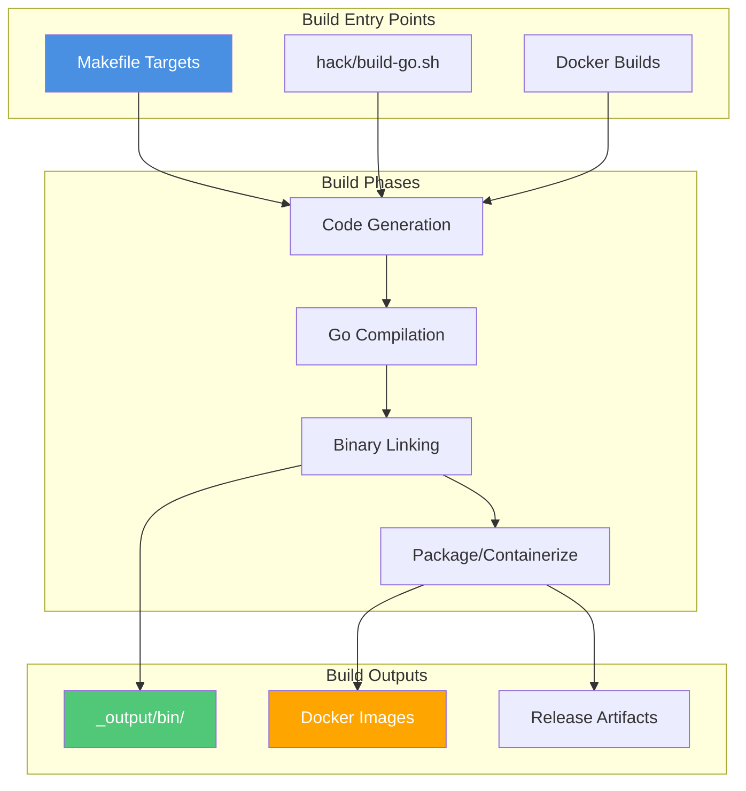

### **Build Targets**

**Quick builds** (for development):

| Command | Output | Time | Use Case |
|---------|--------|------|----------|
| `make` | All binaries | 10-30 min | Full build |
| `make quick-release` | Quick binaries | 5-10 min | Fast development |
| `make kube-apiserver` | API server only | 2-5 min | API development |
| `make kubectl` | kubectl only | 1-2 min | CLI development |
| `make kubelet` | kubelet only | 2-5 min | Node development |

**Complete builds**:

| Command | Output | Time | Use Case |
|---------|--------|------|----------|
| `make release` | Full release | 30-60 min | Release candidates |
| `make release-images` | Docker images | 20-40 min | Container images |
| `make cross` | Cross-platform | 40-80 min | Multi-platform |

### **Build Configuration**

**Environment variables**:

```bash
# Build specific version
export KUBE_GIT_VERSION=v1.32.0-dev

# Cross-compilation
export KUBE_BUILD_PLATFORMS="linux/amd64 linux/arm64"

# Verbose output
export KUBE_VERBOSE=5

# Skip tests during build
export KUBE_SKIP_TEST=y
```

### **Build Process Details**

**Step-by-step build**:

```bash
# 1. Generate code (if needed)
./hack/update-codegen.sh

# 2. Build specific binary
make kube-apiserver

# Build process:
# a. Verify Go version
# b. Set build metadata (version, commit, date)
# c. Compile Go code
# d. Link binary
# e. Output to _output/bin/
```

**Build output structure**:

```
_output/
├── bin/                              # Compiled binaries
│   ├── kube-apiserver
│   ├── kube-controller-manager
│   ├── kube-scheduler
│   ├── kubelet
│   ├── kube-proxy
│   ├── kubectl
│   └── [more binaries]
├── dockerized/                       # Docker build artifacts
├── images/                           # Docker images
└── release-tars/                     # Release archives
```

### **Build Modes**

**Development build** (fastest):

```bash
# Quick, unoptimized build
make quick-release

# Characteristics:
# - No optimization
# - Debug symbols included
# - Fast compilation
# - Larger binaries
```

**Release build** (optimized):

```bash
# Optimized for production
make release

# Characteristics:
# - Full optimization
# - Debug symbols stripped
# - Slower compilation
# - Smaller binaries
```

**Cross-platform build**:

```bash
# Build for multiple platforms
make cross

# Platforms:
# - linux/amd64
# - linux/arm64
# - darwin/amd64 (Mac Intel)
# - darwin/arm64 (Mac Apple Silicon)
# - windows/amd64
```

### **Build Workflow**

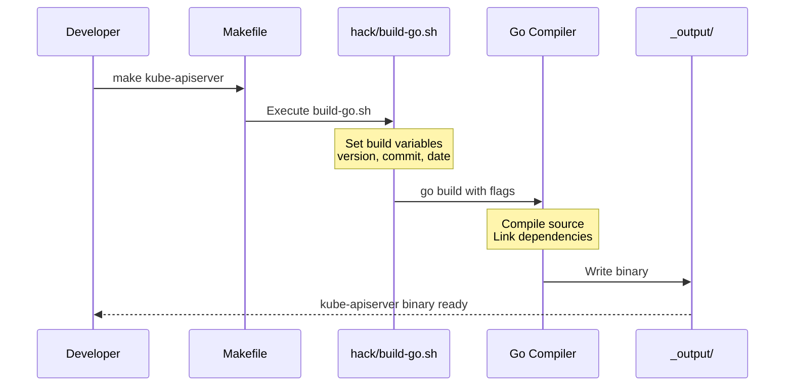

━━━━━━━━━━━━━━━━━━━━━━━━━━━━━━━━━━━━━━━━━━━━━━━━━━━━━━━━━━━━━━━━━━━━━━━━━━━━━━

## **🧪 Testing Workflow**

### **Test Pyramid**

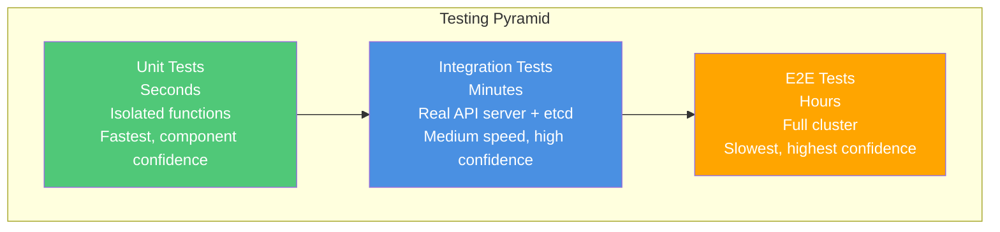

### **Test Execution**

**Unit tests** (run most frequently):

```bash
# Run all unit tests
make test

# Run specific package tests
make test WHAT=./pkg/controller/deployment

# Run specific test
go test ./pkg/controller/deployment -run TestDeploymentController

# Run with verbose output
make test WHAT=./pkg/controller/deployment KUBE_TEST_VERBOSE=1

# Run with coverage
make test WHAT=./pkg/controller/deployment KUBE_COVER=1
```

**Integration tests** (run before PR):

```bash
# Run all integration tests (takes ~30-60 minutes)
make test-integration

# Run specific integration test
make test-integration WHAT=./test/integration/controller/deployment

# Run with verbose output
make test-integration WHAT=./test/integration/controller/deployment KUBE_TEST_VERBOSE=1
```

**E2E tests** (run less frequently):

```bash
# Build E2E test binary
make WHAT=test/e2e/e2e.test

# Run E2E tests against existing cluster
go run ./hack/e2e.go -- --test --test_args="--ginkgo.focus=Deployment"

# Run conformance tests
make test-e2e-node

# Run with specific focus
make test-e2e FOCUS="Deployment"
```

### **Test Selection Strategy**

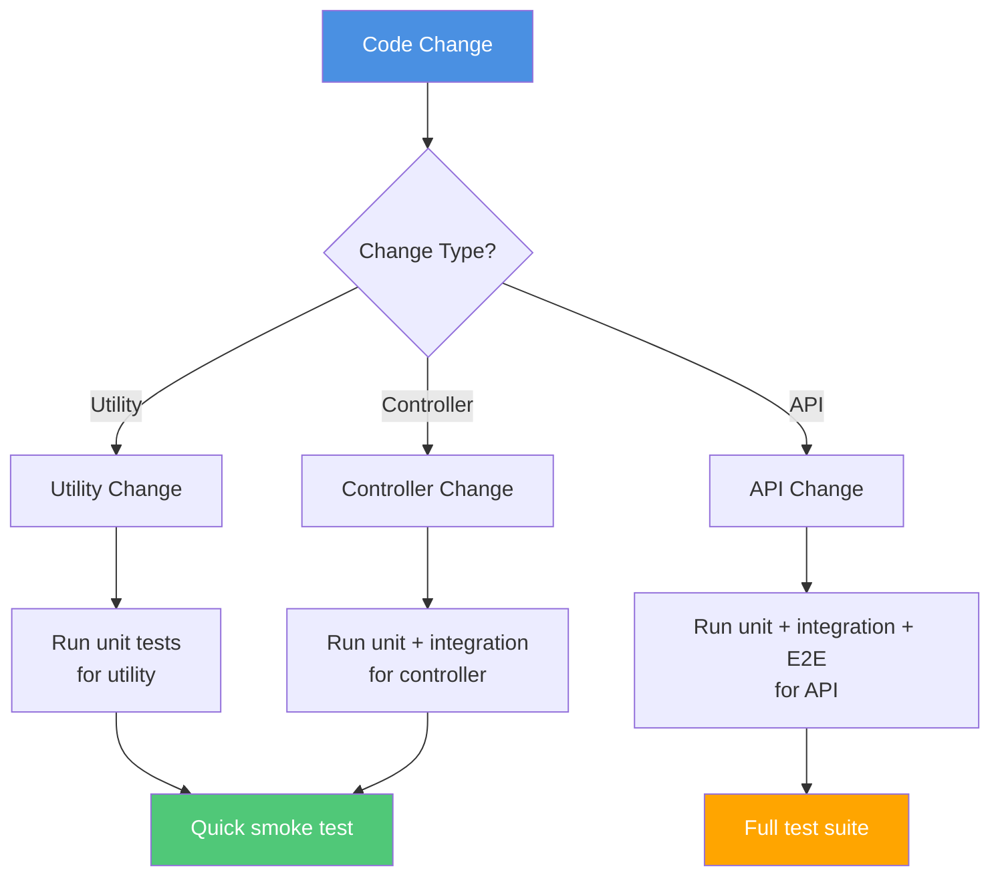

### **Test Writing Patterns**

**Unit test example**:

```go
// pkg/controller/deployment/deployment_controller_test.go
func TestDeploymentController_syncDeployment(t *testing.T) {
    // Setup
    deployment := newDeployment("test", 3, nil)
    fakeClient := fake.NewSimpleClientset(deployment)

    controller := &DeploymentController{
        client: fakeClient,
        // ... initialize controller
    }

    // Execute
    err := controller.syncDeployment("default/test")

    // Assert
    if err != nil {
        t.Errorf("syncDeployment() error = %v", err)
    }

    // Verify actions
    actions := fakeClient.Actions()
    if len(actions) != 1 {
        t.Errorf("expected 1 action, got %d", len(actions))
    }
}
```

**Integration test example**:

```go
// test/integration/controller/deployment/deployment_test.go
func TestDeploymentCreation(t *testing.T) {
    // Start control plane (real API server + etcd)
    ctx, cancel := context.WithCancel(context.Background())
    defer cancel()

    controlPlane := framework.NewControlPlane(t)
    defer controlPlane.Teardown()

    client := controlPlane.Client()

    // Create deployment
    deployment := newDeployment("test", 3)
    created, err := client.AppsV1().Deployments("default").Create(
        ctx, deployment, metav1.CreateOptions{},
    )
    if err != nil {
        t.Fatalf("Failed to create deployment: %v", err)
    }

    // Wait for replica set
    err = wait.Poll(100*time.Millisecond, 30*time.Second, func() (bool, error) {
        rsList, _ := client.AppsV1().ReplicaSets("default").List(
            ctx, metav1.ListOptions{},
        )
        return len(rsList.Items) > 0, nil
    })

    if err != nil {
        t.Fatalf("ReplicaSet not created: %v", err)
    }
}
```

**E2E test example**:

```go
// test/e2e/apps/deployment.go
var _ = SIGDescribe("Deployment", func() {
    f := framework.NewDefaultFramework("deployment")

    It("should create and scale deployment", func() {
        // Create deployment
        deployment := newDeployment("nginx", 1)
        deployment, err := f.ClientSet.AppsV1().Deployments(f.Namespace.Name).Create(
            context.TODO(), deployment, metav1.CreateOptions{},
        )
        Expect(err).NotTo(HaveOccurred())

        // Wait for rollout
        err = waitForDeploymentComplete(f.ClientSet, deployment)
        Expect(err).NotTo(HaveOccurred())

        // Scale deployment
        deployment.Spec.Replicas = pointer.Int32(3)
        deployment, err = f.ClientSet.AppsV1().Deployments(f.Namespace.Name).Update(
            context.TODO(), deployment, metav1.UpdateOptions{},
        )
        Expect(err).NotTo(HaveOccurred())

        // Wait for scale
        err = waitForDeploymentComplete(f.ClientSet, deployment)
        Expect(err).NotTo(HaveOccurred())

        // Verify pods
        pods, err := f.ClientSet.CoreV1().Pods(f.Namespace.Name).List(
            context.TODO(), metav1.ListOptions{},
        )
        Expect(err).NotTo(HaveOccurred())
        Expect(len(pods.Items)).To(Equal(3))
    })
})
```

### **Test Verification Workflow**

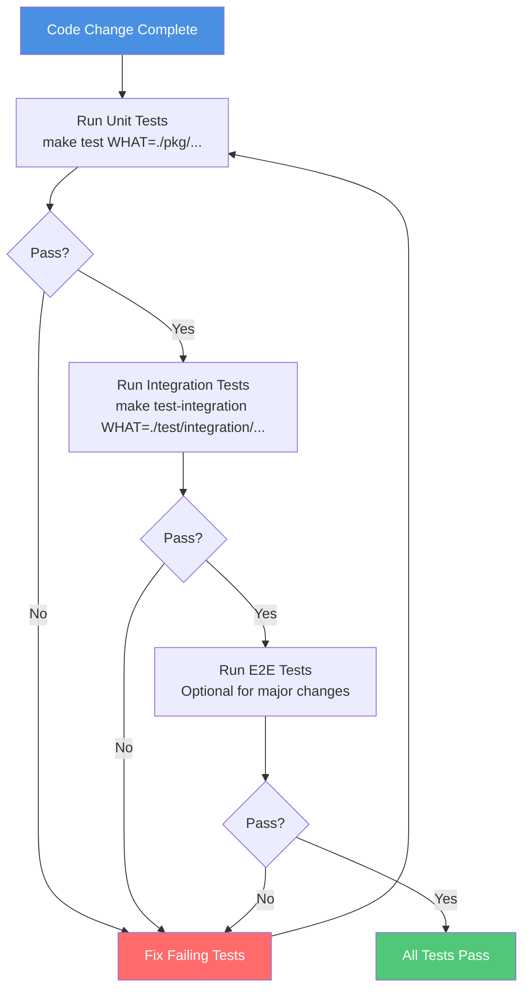

━━━━━━━━━━━━━━━━━━━━━━━━━━━━━━━━━━━━━━━━━━━━━━━━━━━━━━━━━━━━━━━━━━━━━━━━━━━━━━

## **⚙️ Code Generation Workflow**

### **Generation Process**

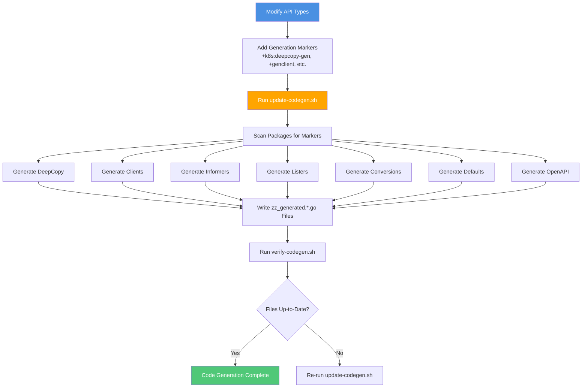

### **Generation Commands**

**Update all generated code**:

```bash
# Generate everything
./hack/update-codegen.sh

# This runs:
# - deepcopy-gen (DeepCopy methods)
# - client-gen (typed clients)
# - informer-gen (informers)
# - lister-gen (listers)
# - conversion-gen (conversions)
# - defaulter-gen (defaults)
# - openapi-gen (OpenAPI specs)
```

**Verify generated code**:

```bash
# Check if generated code is up-to-date
./hack/verify-codegen.sh

# Output on success:
# All generated code is up-to-date

# Output on failure:
# Generated code is out of date. Please run:
#   ./hack/update-codegen.sh
```

**Update specific generators**:

```bash
# Update only OpenAPI specs
./hack/update-openapi-spec.sh

# Update only protobuf
./hack/update-generated-protobuf.sh

# Update only docs
./hack/update-generated-docs.sh
```

### **Common Generation Scenarios**

**Scenario 1: Adding new API field**

```bash
# 1. Add field to type
vim pkg/apis/apps/types.go

# 2. Add field to versioned type
vim staging/src/k8s.io/api/apps/v1/types.go

# 3. Update conversion if needed
vim pkg/apis/apps/v1/conversion.go

# 4. Generate code
./hack/update-codegen.sh

# 5. Verify
./hack/verify-codegen.sh
```

**Scenario 2: Adding new API type**

```bash
# 1. Add type definition
vim staging/src/k8s.io/api/apps/v1/my_new_type.go

# 2. Add markers
# +genclient
# +k8s:deepcopy-gen:interfaces=k8s.io/apimachinery/pkg/runtime.Object

# 3. Add to scheme
vim staging/src/k8s.io/api/apps/v1/register.go

# 4. Generate code
./hack/update-codegen.sh

# This creates:
# - zz_generated.deepcopy.go (DeepCopy methods)
# - client-go/kubernetes/typed/apps/v1/mynewtype.go (client)
# - client-go/informers/apps/v1/mynewtype.go (informer)
# - client-go/listers/apps/v1/mynewtype.go (lister)
```

━━━━━━━━━━━━━━━━━━━━━━━━━━━━━━━━━━━━━━━━━━━━━━━━━━━━━━━━━━━━━━━━━━━━━━━━━━━━━━

## **📤 PR Submission Process**

### **PR Workflow**

```mermaid
graph TB
    START[Changes Complete]

    COMMIT[Commit Changes<br/>git commit -s -m "message"]

    PUSH[Push to Fork<br/>git push origin feature-branch]

    CREATE_PR[Create Pull Request<br/>On GitHub]

    LINT[CI: Linting & Formatting]
    BUILD[CI: Build All Platforms]
    UNIT[CI: Unit Tests]
    INT[CI: Integration Tests]
    VERIFY[CI: Verify Generated Code]

    CHECKS{All Checks Pass?}

    REVIEW[Code Review]

    APPROVE{Approved?}

    LGTM[LGTM Label Applied]

    MERGE[Auto-Merge via Prow]

    DONE[PR Merged]

    FAILED[Fix Issues]

    START --> COMMIT
    COMMIT --> PUSH
    PUSH --> CREATE_PR

    CREATE_PR --> LINT
    CREATE_PR --> BUILD
    CREATE_PR --> UNIT
    CREATE_PR --> INT
    CREATE_PR --> VERIFY

    LINT --> CHECKS
    BUILD --> CHECKS
    UNIT --> CHECKS
    INT --> CHECKS
    VERIFY --> CHECKS

    CHECKS -->|No| FAILED
    CHECKS -->|Yes| REVIEW

    REVIEW --> APPROVE

    APPROVE -->|No| FAILED
    APPROVE -->|Yes| LGTM

    LGTM --> MERGE
    MERGE --> DONE

    FAILED --> COMMIT

    style START fill:#4a90e2,color:#fff
    style MERGE fill:#50c878,color:#fff
    style DONE fill:#50c878,color:#fff
    style FAILED fill:#ff6b6b,color:#fff
```

### **Pre-PR Checklist**

**Before submitting**:

```bash
# 1. Verify code is formatted
./hack/verify-gofmt.sh

# 2. Update generated code
./hack/update-codegen.sh

# 3. Verify generated code is current
./hack/verify-codegen.sh

# 4. Run unit tests
make test WHAT=./pkg/controller/deployment

# 5. Run integration tests (if applicable)
make test-integration WHAT=./test/integration/controller/deployment

# 6. Verify all checks
./hack/verify-all.sh

# 7. Commit with sign-off
git commit -s -m "Add deployment feature X"
```

### **Commit Message Format**

**Format**:
```
<area>: <short summary>

<detailed description>

<optional footer>
```

**Example**:
```
controller/deployment: Add progressive rollout support

This adds support for progressive rollouts where deployments can
gradually shift traffic to new versions based on metrics.

Implements KEP-1234

Fixes #12345
```

**Requirements**:
- **Sign-off**: Include `Signed-off-by` (use `git commit -s`)
- **Area prefix**: Indicate affected component
- **Descriptive**: Explain what and why, not how
- **References**: Link to issues/KEPs

### **PR Description Template**

```markdown
**What type of PR is this?**
/kind feature
/sig apps

**What this PR does / why we need it**:
This PR adds support for progressive rollouts in the Deployment controller,
allowing gradual traffic shifting based on metrics.

**Which issue(s) this PR fixes**:
Fixes #12345

**Special notes for your reviewer**:
- New API field added: `Spec.ProgressiveRollout`
- Integration test added in `test/integration/deployment/`
- E2E test added in `test/e2e/apps/deployment.go`

**Does this PR introduce a user-facing change?**:
```release-note
Deployments now support progressive rollouts via the new
`spec.progressiveRollout` field, enabling gradual traffic
shifting based on metrics.
```

**Additional documentation**:
- KEP: kubernetes/enhancements#1234
- User guide: kubernetes/website#5678
```

### **CI Checks**

**Automatic checks run on every PR**:

| Check | Purpose | Time |
|-------|---------|------|
| **pull-kubernetes-verify** | Code quality, formatting | 10-15 min |
| **pull-kubernetes-unit** | Unit tests | 30-45 min |
| **pull-kubernetes-integration** | Integration tests | 1-2 hours |
| **pull-kubernetes-e2e-gce** | E2E tests on GCE | 2-3 hours |
| **pull-kubernetes-node-e2e** | Node E2E tests | 1-2 hours |

**Required for merge**:
- ✅ All checks passing
- ✅ At least one approval from OWNERS
- ✅ `lgtm` label applied
- ✅ `approved` label applied

### **Review Process**

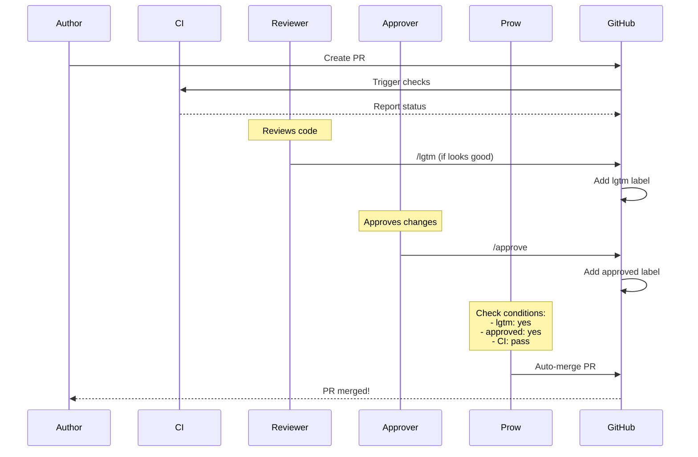

━━━━━━━━━━━━━━━━━━━━━━━━━━━━━━━━━━━━━━━━━━━━━━━━━━━━━━━━━━━━━━━━━━━━━━━━━━━━━━

## **🖥️ Local Development & Testing**

### **Local Cluster Options**

| Method | Speed | Complexity | Use Case |
|--------|-------|------------|----------|
| **local-up-cluster.sh** | Fast | Low | Quick testing |
| **kind** | Medium | Low | Full cluster simulation |
| **minikube** | Medium | Low | Alternative to kind |
| **kubeadm** | Slow | High | Production-like setup |

### **local-up-cluster.sh**

**Fastest way to test changes locally**:

```bash
# Start local cluster
./hack/local-up-cluster.sh

# This starts:
# - etcd
# - kube-apiserver
# - kube-controller-manager
# - kube-scheduler
# - kubelet (optional)

# In another terminal, use cluster:
export KUBECONFIG=/var/run/kubernetes/admin.kubeconfig
kubectl get nodes
```

**Configuration options**:

```bash
# Enable specific features
FEATURE_GATES=MyFeature=true ./hack/local-up-cluster.sh

# Use specific etcd
ETCD_HOST=127.0.0.1 ./hack/local-up-cluster.sh

# Enable audit logging
ENABLE_AUDIT=true ./hack/local-up-cluster.sh
```

### **kind (Kubernetes IN Docker)**

**Multi-node cluster in Docker**:

```bash
# Install kind
go install sigs.k8s.io/kind@latest

# Create cluster
kind create cluster --name dev

# Build Kubernetes node image from source
kind build node-image

# Create cluster with custom image
kind create cluster --name dev --image kindest/node:latest

# Load local images
docker build -t my-controller:dev .
kind load docker-image my-controller:dev --name dev

# Use cluster
kubectl cluster-info --context kind-dev
```

**kind configuration** (`kind-config.yaml`):

```yaml
kind: Cluster
apiVersion: kind.x-k8s.io/v1alpha4
nodes:
- role: control-plane
  kubeadmConfigPatches:
  - |
    kind: InitConfiguration
    nodeRegistration:
      kubeletExtraArgs:
        feature-gates: "MyFeature=true"
- role: worker
- role: worker
```

### **Testing Workflow with Local Cluster**

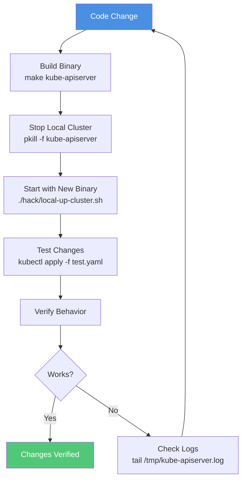

### **Debugging Local Cluster**

**Log locations**:

```bash
# API server logs
tail -f /tmp/kube-apiserver.log

# Controller manager logs
tail -f /tmp/kube-controller-manager.log

# Scheduler logs
tail -f /tmp/kube-scheduler.log

# etcd logs
tail -f /tmp/etcd.log
```

**Common issues**:

| Issue | Solution |
|-------|----------|
| **Port already in use** | `pkill -f kube-apiserver` |
| **etcd not starting** | `rm -rf /tmp/etcd` |
| **Can't connect** | Check KUBECONFIG path |
| **Features not enabled** | Set FEATURE_GATES |

━━━━━━━━━━━━━━━━━━━━━━━━━━━━━━━━━━━━━━━━━━━━━━━━━━━━━━━━━━━━━━━━━━━━━━━━━━━━━━

## **🐛 Debugging Techniques**

### **Debugging Tools**

| Tool | Purpose | Use Case |
|------|---------|----------|
| **delve** | Go debugger | Step-through debugging |
| **pprof** | Profiling | Performance analysis |
| **kubectl debug** | Pod debugging | Container inspection |
| **logs** | Log analysis | Behavior investigation |

### **Using Delve**

**Install delve**:

```bash
go install github.com/go-delve/delve/cmd/dlv@latest
```

**Debug binary**:

```bash
# Build with debug symbols
go build -gcflags="all=-N -l" -o kube-apiserver cmd/kube-apiserver/main.go

# Start with delve
dlv exec ./kube-apiserver -- \
  --etcd-servers=http://127.0.0.1:2379 \
  --service-cluster-ip-range=10.0.0.0/24

# In delve console:
(dlv) break main.main
(dlv) continue
(dlv) next
(dlv) print variable
```

**Debug test**:

```bash
# Debug specific test
dlv test ./pkg/controller/deployment -- -test.run TestDeploymentController

# In delve:
(dlv) break deployment_controller_test.go:123
(dlv) continue
```

### **Profiling with pprof**

**Enable pprof** in your code:

```go
import (
    _ "net/http/pprof"
    "net/http"
)

func main() {
    go func() {
        http.ListenAndServe("localhost:6060", nil)
    }()

    // Your code
}
```

**Collect profile**:

```bash
# CPU profile
go tool pprof http://localhost:6060/debug/pprof/profile?seconds=30

# Memory profile
go tool pprof http://localhost:6060/debug/pprof/heap

# Goroutine profile
go tool pprof http://localhost:6060/debug/pprof/goroutine
```

**Analyze**:

```bash
# Interactive analysis
(pprof) top
(pprof) list functionName
(pprof) web  # Visualize (requires graphviz)
```

### **Log-Based Debugging**

**Increase log verbosity**:

```bash
# Run with verbose logging
kube-apiserver --v=5

# Levels:
# 0: Only errors
# 1: Important info
# 2: Useful steady-state info
# 3: Extended info about changes
# 4: Debug-level verbosity
# 5: Trace-level verbosity
```

**Add debug logs**:

```go
import "k8s.io/klog/v2"

func myFunction() {
    klog.V(2).Infof("Processing deployment: %s", name)
    klog.V(4).Infof("Full object: %+v", deployment)
}
```

━━━━━━━━━━━━━━━━━━━━━━━━━━━━━━━━━━━━━━━━━━━━━━━━━━━━━━━━━━━━━━━━━━━━━━━━━━━━━━

## **🚢 Release Process Overview**

### **Release Cycle**

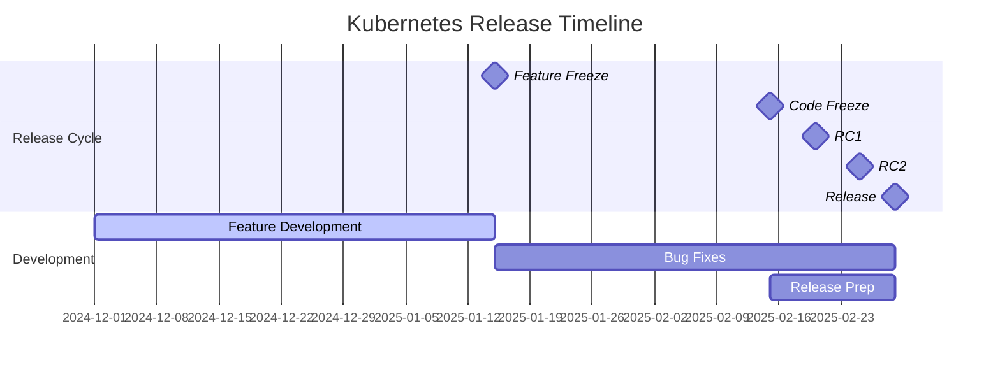

**Typical timeline**: ~3-4 months per release

**Phases**:
1. **Development** (weeks 1-6): Feature development
2. **Feature Freeze** (week 7): No new features
3. **Code Freeze** (week 11): Only bug fixes
4. **Release Candidates** (weeks 12-13): RC builds
5. **Release** (week 14): Official release

### **Release Artifacts**

**What gets released**:

| Artifact | Format | Purpose |
|----------|--------|---------|
| **Binaries** | tar.gz | Server, node, client binaries |
| **Container Images** | Docker | Component images |
| **Debian Packages** | .deb | Package manager install |
| **RPM Packages** | .rpm | Package manager install |
| **Release Notes** | Markdown | Changelog |

### **Versioning**

**Format**: `v<major>.<minor>.<patch>`

**Examples**:
- `v1.32.0` - Major release
- `v1.32.1` - Patch release
- `v1.33.0-alpha.1` - Alpha release
- `v1.33.0-beta.1` - Beta release
- `v1.33.0-rc.1` - Release candidate

━━━━━━━━━━━━━━━━━━━━━━━━━━━━━━━━━━━━━━━━━━━━━━━━━━━━━━━━━━━━━━━━━━━━━━━━━━━━━━

## **📝 Summary**

### **Quick Reference**

**Daily development**:
```bash
# 1. Make changes
vim pkg/controller/deployment/controller.go

# 2. Generate code
./hack/update-codegen.sh

# 3. Build
make kube-apiserver

# 4. Test
make test WHAT=./pkg/controller/deployment

# 5. Verify
./hack/verify-all.sh
```

**Before PR**:
```bash
# Complete verification
./hack/verify-all.sh

# Run tests
make test WHAT=./pkg/...
make test-integration WHAT=./test/integration/...

# Commit
git commit -s -m "controller: Add feature X"

# Push
git push origin feature-branch
```

**Local testing**:
```bash
# Start cluster
./hack/local-up-cluster.sh

# Test changes
kubectl apply -f test.yaml

# Check logs
tail -f /tmp/kube-apiserver.log
```

━━━━━━━━━━━━━━━━━━━━━━━━━━━━━━━━━━━━━━━━━━━━━━━━━━━━━━━━━━━━━━━━━━━━━━━━━━━━━━

## **🔗 Related Documentation**

| Document | Relationship |
|----------|--------------|
| [06-test-infrastructure.md](06-test-infrastructure.md) | Testing details |
| [07-hack-tools.md](07-hack-tools.md) | Build and development scripts |
| [08-build-system.md](08-build-system.md) | Build infrastructure |
| [11-code-organization-patterns.md](11-code-organization-patterns.md) | Code generation |
| [14-quick-reference.md](14-quick-reference.md) | Command cheat sheet |

━━━━━━━━━━━━━━━━━━━━━━━━━━━━━━━━━━━━━━━━━━━━━━━━━━━━━━━━━━━━━━━━━━━━━━━━━━━━━━

**Document Status**: ✅ Active | **Workflows**: Current | **Maintenance**: Regular updates

**Navigation**: [README](00-README.md) | [Previous: Dependency Graph](12-dependency-graph.md) | [Next: Quick Reference](14-quick-reference.md)
