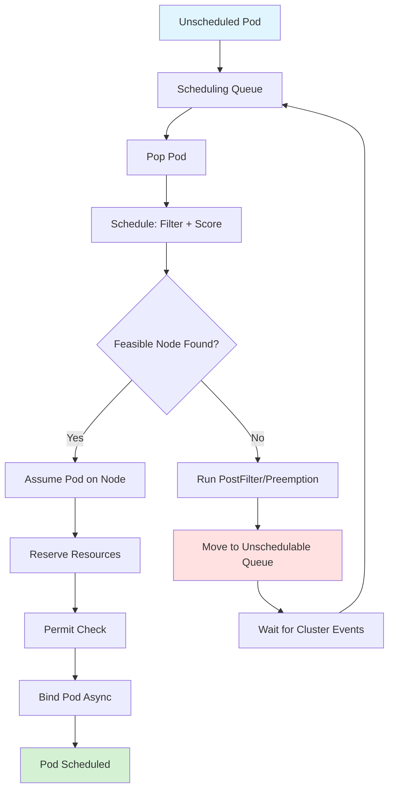
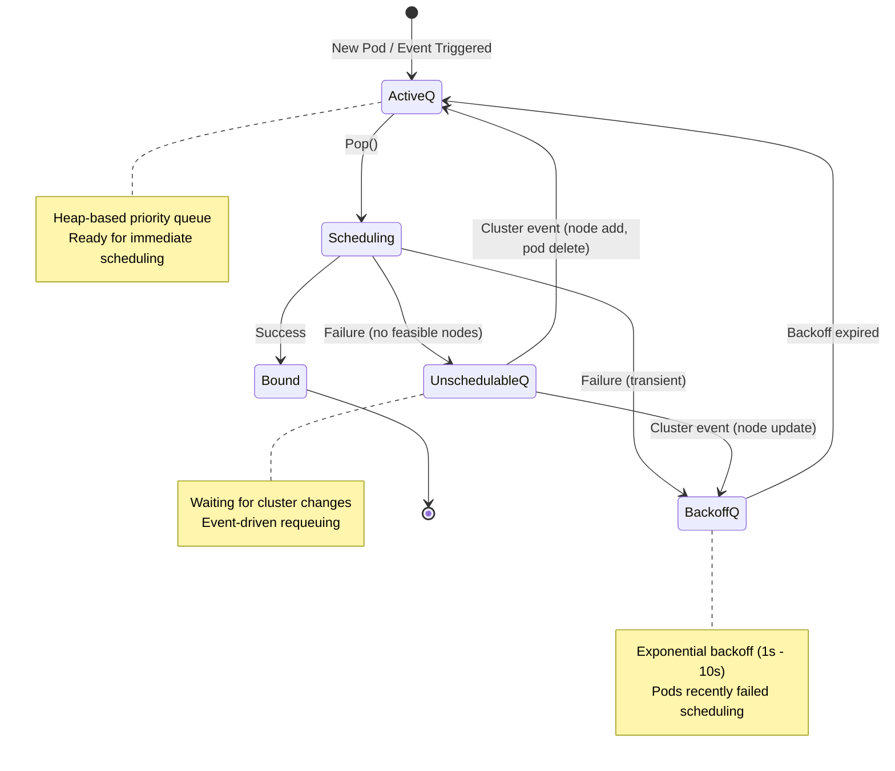
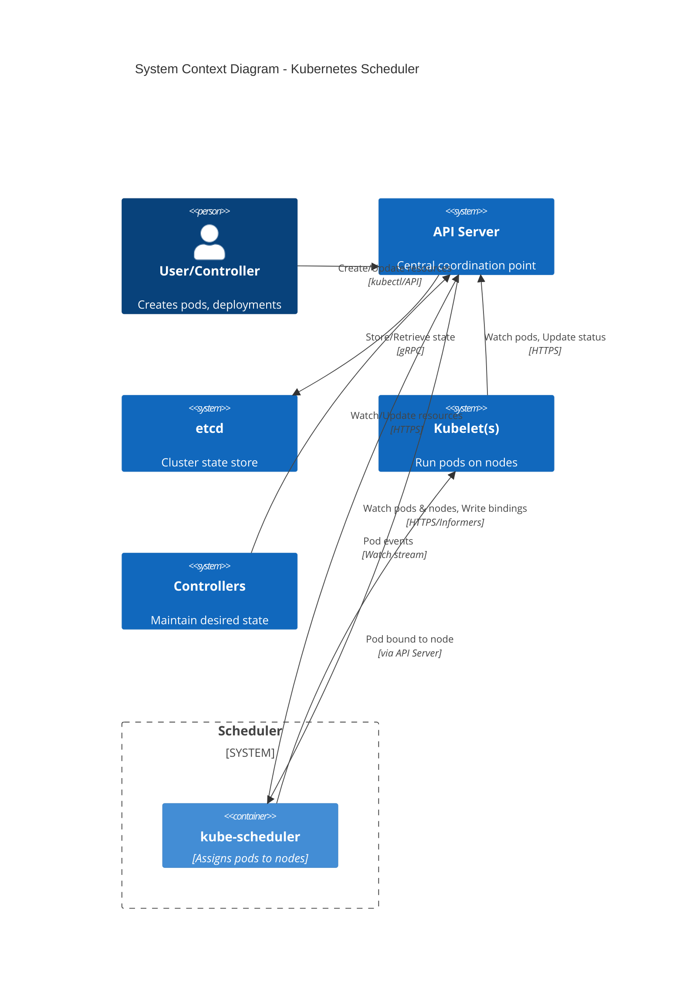

# Kubernetes Scheduler Architecture: Overview and Introduction

**Document Version:** 1.0
**Last Updated:** 2025-10-20
**Authors:** Architecture Analysis Team
**Status:** Living Document

---

## Table of Contents

1. [Executive Summary](#executive-summary)
2. [Purpose and Scope](#purpose-and-scope)
3. [High-Level Overview](#high-level-overview)
4. [Key Responsibilities](#key-responsibilities)
5. [System Context](#system-context)
6. [Architectural Principles](#architectural-principles)
7. [Technology Stack](#technology-stack)
8. [Document Navigation](#document-navigation)

---

## Executive Summary

The Kubernetes Scheduler is a critical control plane component responsible for making pod-to-node placement decisions in a Kubernetes cluster. It is a sophisticated, extensible system that evaluates cluster state, applies complex filtering and scoring logic through a plugin-based framework, and ultimately binds pods to suitable nodes while considering resource constraints, affinity rules, taints/tolerations, and custom scheduling policies.

### Key Statistics

- **Codebase Size**: ~208 Go source files
  - `cmd/kube-scheduler`: 10 files (bootstrapping, configuration, CLI)
  - `pkg/scheduler`: 198 files (core logic, framework, plugins, queue, cache)

- **Core Components**: 6 major subsystems
  - Scheduler Core
  - Plugin Framework (12 extension points)
  - Queue Management (3-tier queue system)
  - Cache System (optimistic assume/bind)
  - Event Handling System
  - Metrics and Observability

- **Plugin Ecosystem**: 25+ in-tree plugins
- **Extension Points**: 12 distinct plugin integration points
- **Concurrency**: Up to 16 parallel worker threads (configurable)

---

## Purpose and Scope

### Purpose

This documentation provides comprehensive architectural analysis of the Kubernetes Scheduler, covering:

1. **High-level architecture** - System components and their relationships
2. **Functional specifications** - What the scheduler does and how
3. **Technical specifications** - How it's implemented, data structures, algorithms, and concurrency patterns
4. **Operational aspects** - Deployment, scaling, and observability

### Scope

**In Scope:**
- Complete analysis of `cmd/kube-scheduler` and `pkg/scheduler`
- All scheduling workflows and algorithms
- Plugin framework architecture
- Queue and cache implementations
- Concurrency and synchronization mechanisms
- Event handling and cluster state watching
- Metrics, logging, and debugging capabilities

**Out of Scope:**
- Individual plugin implementation details (covered at high level only)
- Kubernetes API server internals
- etcd storage layer
- kubelet node-side pod lifecycle management
- Custom scheduler implementations

### Intended Audience

- **Platform Engineers** - Understanding scheduler behavior for troubleshooting
- **Plugin Developers** - Building custom scheduler plugins
- **Kubernetes Contributors** - Enhancing or maintaining scheduler code
- **System Architects** - Designing scalable Kubernetes deployments
- **Technical Leaders** - Evaluating scheduling capabilities

---

## High-Level Overview

The Kubernetes Scheduler operates as a continuous loop that:

1. **Watches** for unscheduled pods from the API server
2. **Filters** nodes to find those that can fit the pod
3. **Scores** feasible nodes to rank them
4. **Selects** the best node (with fairness via reservoir sampling)
5. **Assumes** the pod is bound (optimistic concurrency)
6. **Binds** the pod to the node (asynchronously)
7. **Updates** cluster state and triggers event-driven requeuing



### Core Scheduling Loop

The scheduler's main loop, implemented in `ScheduleOne()` at `pkg/scheduler/schedule_one.go:66`, processes one pod at a time:

```
while cluster is running:
    pod = NextPod()  // Blocking call

    // Scheduling Cycle (synchronous)
    result = schedulePod(pod)
    if result.success:
        assume(pod, result.node)
        reserve(pod, result.node)
        permit(pod, result.node)

        // Binding Cycle (asynchronous goroutine)
        go bind(pod, result.node)
    else:
        handleFailure(pod, result.error)
```

---

## Key Responsibilities

### 1. Pod Placement Decision-Making

**Primary Goal**: Assign each unscheduled pod to the most suitable node in the cluster.

**Considerations**:
- **Resource Availability**: CPU, memory, ephemeral storage, extended resources
- **Node Conditions**: Ready, unschedulable, cordoned
- **Affinity/Anti-Affinity**: Pod-to-pod relationships and preferences
- **Taints and Tolerations**: Node restrictions and pod permissions
- **Volume Bindings**: PVC attachments, topology constraints, zone awareness
- **Image Locality**: Prefer nodes with container images already pulled
- **Port Availability**: Ensure host port conflicts are avoided
- **Custom Policies**: Extender webhooks and custom plugin logic

### 2. Priority and Preemption

**Priority Handling**:
- Schedule higher-priority pods before lower-priority pods
- Preempt (evict) lower-priority pods to make room for higher-priority ones
- Respect PodDisruptionBudgets during preemption
- Track nominated nodes for preempted pods

**Implementation**: `pkg/scheduler/framework/plugins/defaultpreemption/`

### 3. Resource Management

**Resource Tracking**:
- Maintain in-memory cache of cluster state (nodes, pods, volumes)
- Track assumed pods (optimistically scheduled but not yet bound)
- Update resource availability as pods are scheduled
- Handle pod updates and deletions

**Snapshot-Based Scheduling**:
- Take a consistent snapshot of cluster state at the start of each cycle
- Avoid lock contention during filtering/scoring
- Refresh snapshot periodically

### 4. Extensibility via Plugin Framework

**Plugin Architecture**:
- 12 well-defined extension points in the scheduling workflow
- Plugin registry for in-tree and out-of-tree plugins
- Profile-based configuration for multi-scheduler deployments
- Plugin weights for scoring functions

**Extension Points**:
1. PreEnqueue, 2. QueueSort, 3. PreFilter, 4. Filter, 5. PostFilter
6. PreScore, 7. Score, 8. Reserve, 9. Permit, 10. PreBind, 11. Bind, 12. PostBind

### 5. Queue Management

**Three-Tier Queue System**:



### 6. Event-Driven Optimization

**Queueing Hints**:
- Plugins register interest in specific cluster events
- Events trigger targeted pod requeuing (not full queue flush)
- Reduces unnecessary scheduling attempts
- Improves throughput in large clusters

**Event Types**:
- Node: Add, Update (capacity, taints, labels), Delete
- Pod: Add, Update, Delete (assigned and unassigned pods)
- PVC, PV, StorageClass, CSINode
- Service, ResourceClaim, ResourceSlice

---

## System Context

### Scheduler's Position in Kubernetes Architecture



### Key Interactions

1. **API Server → Scheduler**:
   - Pod add/update/delete events (unscheduled pods)
   - Node add/update/delete events
   - PVC, PV, Service, and other resource events

2. **Scheduler → API Server**:
   - Pod bindings (assigns pod to node)
   - Pod status updates (condition: PodScheduled)
   - Pod nominated node updates (for preemption)

3. **Scheduler ↔ Extenders** (optional):
   - HTTP callbacks for custom filtering/scoring/binding
   - Used for integration with external scheduling systems

---

## Architectural Principles

### 1. **Separation of Concerns**

- **Scheduling Cycle**: Find a suitable node (synchronous)
- **Binding Cycle**: Bind pod to node (asynchronous)
- Clear separation allows binding to happen in background without blocking next pod

### 2. **Optimistic Concurrency**

- **Assume Mechanism**: Scheduler assumes pod is bound before actual API call
- Updates in-memory cache immediately
- Allows scheduling next pod without waiting for bind confirmation
- Rolls back on binding failure

```go
// pkg/scheduler/schedule_one.go:209
err = sched.assume(logger, assumedPod, scheduleResult.SuggestedHost)
```

### 3. **Extensibility via Plugins**

- Core scheduling logic is framework, not hardcoded
- Plugins implement specific policies (affinity, taints, resource fits)
- Easy to add custom scheduling logic
- Profile-based multi-scheduler support

### 4. **Performance Optimization**

**Adaptive Node Evaluation**:
- Don't evaluate all nodes if cluster is large
- Default: 50% - (numNodes/125), minimum 5%
- Configurable per profile

**Parallel Filtering**:
- Parallelize filter plugin execution across nodes
- Chunk size: `sqrt(numNodes)`
- Up to 16 workers (default)

**Event-Driven Requeuing**:
- Queueing hints prevent unnecessary scheduling attempts
- Only requeue pods when relevant cluster state changes

### 5. **Reliability and Correctness**

**Informer-Based Watches**:
- Reliable event delivery from API server
- Local caching with periodic resync
- List/Watch consistency guarantees

**Deadlock Prevention**:
- Strict lock ordering: `main > activeQueue > backoffQueue > nominator`
- Documented in `pkg/scheduler/backend/queue/scheduling_queue.go:171`

**Graceful Failure Handling**:
- Retry with backoff on transient errors
- Move to unschedulable queue on permanent failures
- Event-driven recovery

### 6. **Observability**

- Comprehensive metrics (Prometheus)
- Structured logging (klog)
- Debug endpoints (cache dumps, queue inspection)
- Profiling support (pprof)

---

## Technology Stack

### Core Dependencies

| Category | Technology | Purpose |
|----------|-----------|---------|
| **Language** | Go 1.21+ | System implementation language |
| **API Framework** | client-go | Kubernetes API client library |
| **Informers** | SharedInformerFactory | Watch and cache API resources |
| **CLI Framework** | cobra + pflag | Command-line interface |
| **Logging** | klog/v2 | Structured logging |
| **Metrics** | Prometheus client | Observability and monitoring |
| **Testing** | Go testing, Ginkgo | Unit and integration tests |

### Key Internal Packages

```
k8s.io/kubernetes/
├── cmd/kube-scheduler/           # Entry point, CLI, configuration
│   ├── app/                      # Scheduler server setup
│   │   ├── server.go            # Main server logic
│   │   ├── options/             # CLI options and validation
│   │   └── config/              # Configuration structures
│   └── scheduler.go             # main() function
│
└── pkg/scheduler/               # Core scheduler implementation
    ├── scheduler.go             # Scheduler struct, New(), Run()
    ├── schedule_one.go          # Main scheduling loop
    ├── eventhandlers.go         # Cluster event handling
    │
    ├── framework/               # Plugin framework
    │   ├── interface.go         # Plugin interfaces
    │   ├── runtime/             # Framework runtime
    │   ├── plugins/             # 25+ in-tree plugins
    │   └── parallelize/         # Parallel execution utilities
    │
    ├── backend/
    │   ├── queue/               # Priority queue implementation
    │   ├── cache/               # Scheduler cache (assume/bind)
    │   └── api_dispatcher/      # Async API call dispatcher
    │
    ├── metrics/                 # Prometheus metrics
    └── util/                    # Common utilities
```

---

## Document Navigation

This architecture documentation is organized into 20 documents:

### High-Level Architecture (Documents 1-3)
1. **Overview and Introduction** (this document)
2. **System Architecture** - Component diagrams and subsystems
3. **Deployment and Runtime** - Deployment patterns and initialization

### Functional Specifications (Documents 4-8)
4. **Functional Requirements** - Core scheduling functions
5. **Scheduling Workflow** - Complete scheduling cycle
6. **Plugin Framework Specification** - Extension points and lifecycle
7. **Queue Management Specification** - Queue architecture
8. **Event Handling Specification** - Event-driven requeuing

### Technical Specifications (Documents 9-18)
9. **Bootstrapping and Initialization** - Startup sequence
10. **Data Structures** - All major data structures
11. **Scheduling Algorithm Technical** - Filtering and scoring
12. **Plugin Framework Runtime** - Plugin execution internals
13. **Cache Implementation** - Assume/bind mechanism
14. **Queue Implementation** - Priority queue internals
15. **Concurrency and Synchronization** - Parallel execution patterns
16. **Preemption Logic** - Priority and preemption algorithms
17. **Binding and API Integration** - Binding cycle and API calls
18. **Metrics and Observability** - Monitoring and debugging

### Appendices (Documents 19-20)
19. **Plugin Catalog** - Complete list of in-tree plugins
20. **Glossary and References** - Terms, file references, KEPs

---

## Key Design Decisions and Trade-offs

### 1. In-Memory Caching vs. Always Querying API Server

**Decision**: Maintain in-memory cache with informer-based watches

**Rationale**:
- Low latency for scheduling decisions
- Reduces API server load
- Consistent snapshot during scheduling cycle

**Trade-off**: Memory footprint grows with cluster size

### 2. Synchronous Scheduling + Asynchronous Binding

**Decision**: Separate scheduling and binding cycles

**Rationale**:
- Binding can take time (API calls, webhooks)
- Don't block next pod from being scheduled
- Optimistic assumption allows continued scheduling

**Trade-off**: Must handle binding failures and rollbacks

### 3. Plugin Framework vs. Hardcoded Logic

**Decision**: Extensible plugin framework

**Rationale**:
- Supports custom scheduling policies
- Easier to maintain and test
- Enables multi-scheduler deployments with different profiles

**Trade-off**: Slight performance overhead, complexity in plugin interactions

### 4. Three-Tier Queue System

**Decision**: activeQ, backoffQ, unschedulableQ

**Rationale**:
- Prevents tight retry loops (backoff)
- Avoids wasted scheduling attempts (unschedulableQ)
- Event-driven optimization

**Trade-off**: Complexity in queue management logic

### 5. Percentage-Based Node Evaluation

**Decision**: Don't evaluate all nodes in large clusters

**Rationale**:
- Latency reduction in large clusters
- Statistically sufficient for good placement
- Adaptive based on cluster size

**Trade-off**: May not always find absolute best node

---

## Next Steps

Proceed to [02-system-architecture.md](./02-system-architecture.md) for detailed component architecture and inter-component communication patterns.

---

**Document Status**: Complete
**Next Review**: Upon significant scheduler changes or Kubernetes major version updates
