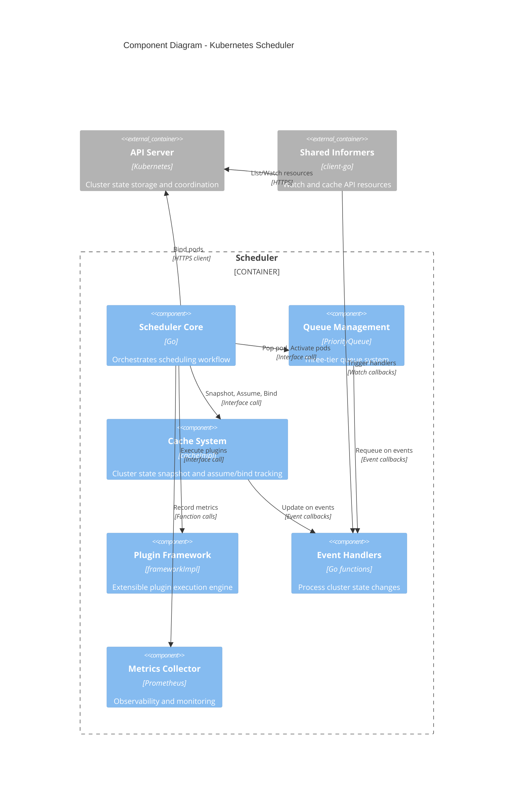
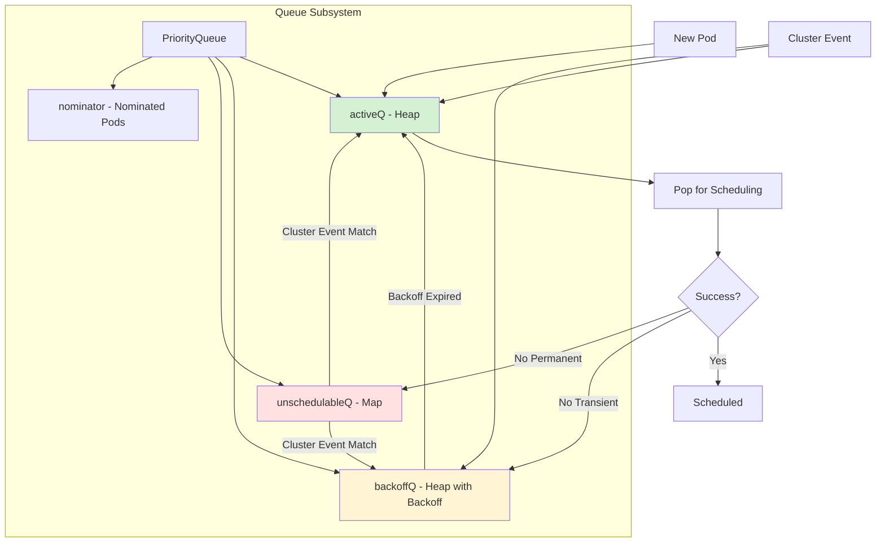
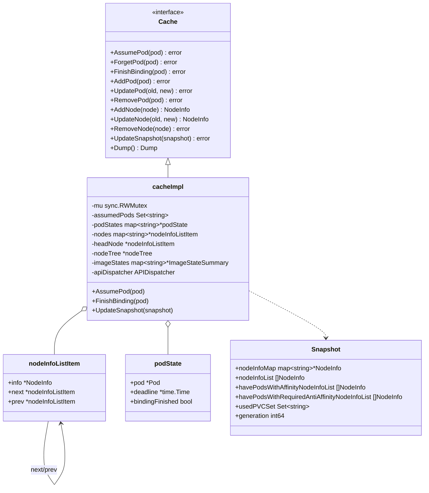
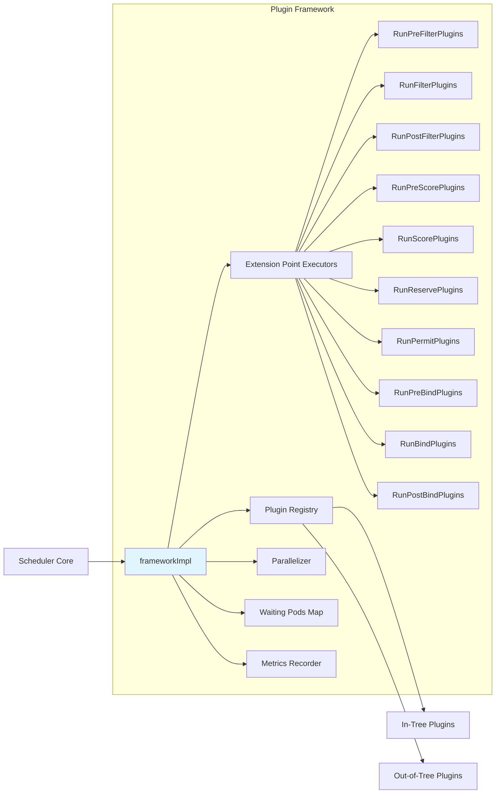
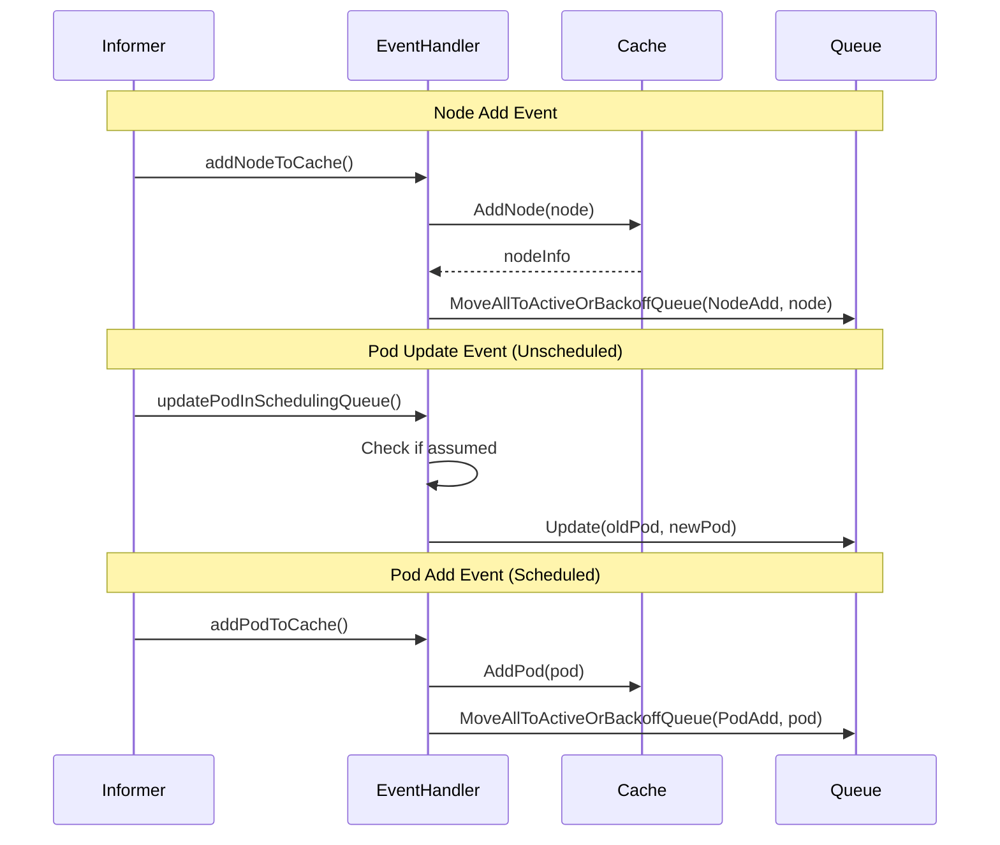
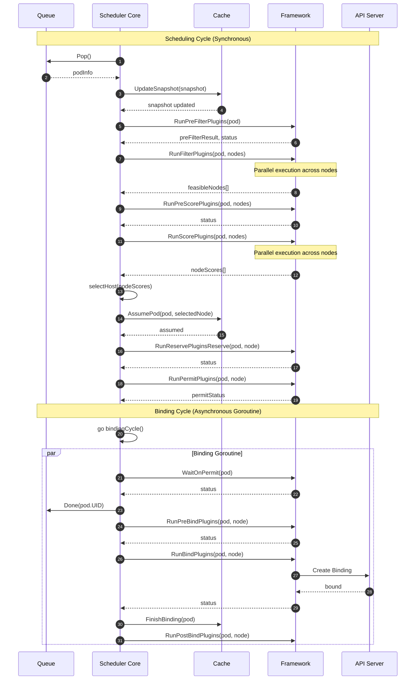
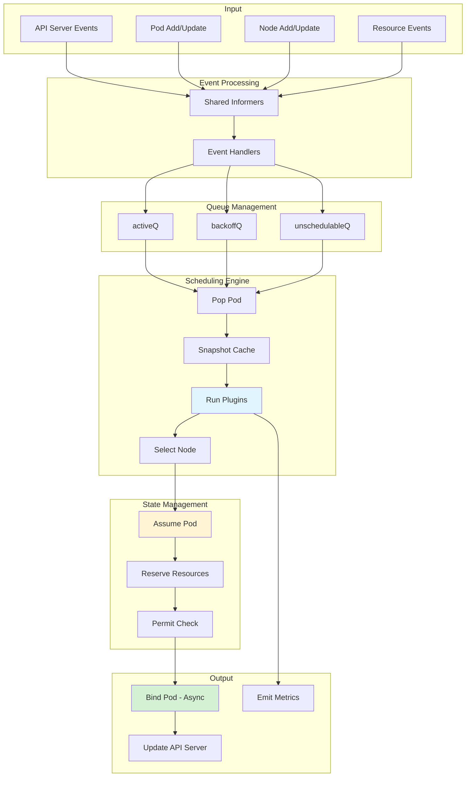
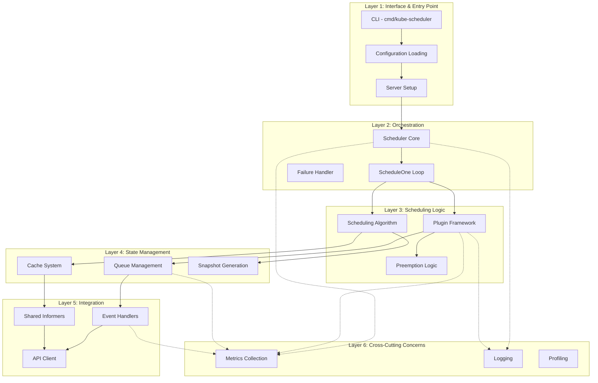
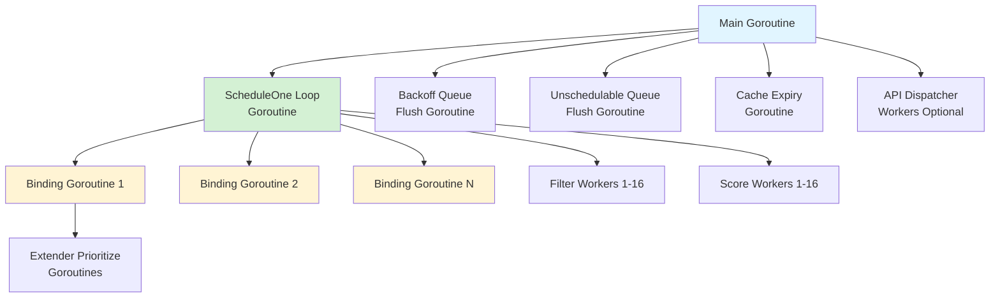

# Kubernetes Scheduler: System Architecture

**Document Version:** 1.0
**Last Updated:** 2025-10-20
**Status:** Living Document

---

## Table of Contents

1. [Component Architecture Overview](#component-architecture-overview)
2. [Major Subsystems](#major-subsystems)
3. [Component Interactions](#component-interactions)
4. [Data Flow Architecture](#data-flow-architecture)
5. [Layered Architecture View](#layered-architecture-view)
6. [Thread and Concurrency Model](#thread-and-concurrency-model)

---

## Component Architecture Overview

The Kubernetes Scheduler is composed of six major subsystems that work together to assign pods to nodes:



---

## Major Subsystems

### 1. Scheduler Core (`pkg/scheduler/scheduler.go`)

**Responsibility**: Orchestrate the scheduling workflow and coordinate between subsystems.

**Key Components**:
- **Scheduler struct** (`scheduler.go:72`): Main scheduler object
- **ScheduleOne()** (`schedule_one.go:66`): Main scheduling loop
- **schedulingCycle()** (`schedule_one.go:150`): Synchronous scheduling phase
- **bindingCycle()** (`schedule_one.go:278`): Asynchronous binding phase

**Core Fields**:
```go
type Scheduler struct {
    Cache             internalcache.Cache           // Cluster state cache
    SchedulingQueue   internalqueue.SchedulingQueue // Priority queue
    Profiles          profile.Map                   // Framework instances per profile
    Extenders         []fwk.Extender               // External schedulers (optional)
    NextPod           func() (*framework.QueuedPodInfo, error) // Pop from queue
    SchedulePod       func(...) (ScheduleResult, error)        // Scheduling algorithm
    FailureHandler    FailureHandlerFn             // Handle scheduling failures
    StopEverything    <-chan struct{}              // Shutdown signal
    APIDispatcher     *apidispatcher.APIDispatcher // Async API calls (feature gated)
    // ...
}
```

**Source Reference**: `pkg/scheduler/scheduler.go:72-125`

---

### 2. Queue Management Subsystem (`pkg/scheduler/backend/queue/`)

**Responsibility**: Manage pods waiting to be scheduled using a three-tier queue system.



**Key Components**:

1. **PriorityQueue** (`scheduling_queue.go:163`):
   - Main queue structure
   - Coordinates all three sub-queues
   - Implements `SchedulingQueue` interface

2. **activeQ** (`active_queue.go`):
   - Heap-based priority queue
   - Pods ready for immediate scheduling
   - Sorted by QueueSort plugin (default: priority/timestamp)

3. **backoffQ** (`backoff_queue.go`):
   - Heap with expiry time tracking
   - Exponential backoff: 1s (initial) to 10s (max)
   - Automatically moves to activeQ when backoff expires

4. **unschedulableQ** (`unschedulable_pods.go`):
   - Map-based storage
   - Pods waiting for cluster state changes
   - Event-driven requeuing via queueing hints

5. **nominator** (`nominator.go`):
   - Tracks nominated nodes for preempted pods
   - Used during node evaluation to consider nominated pods

**Source Reference**: `pkg/scheduler/backend/queue/scheduling_queue.go`

---

### 3. Cache System (`pkg/scheduler/backend/cache/`)

**Responsibility**: Maintain consistent, fast access to cluster state and track assumed pods.



**Key Features**:

1. **Assume/Bind Mechanism**:
   - `AssumePod()`: Mark pod as assumed (optimistic scheduling)
   - `FinishBinding()`: Mark binding complete (allows expiration)
   - `ForgetPod()`: Rollback on binding failure

2. **Doubly-Linked List**:
   - Most recently updated nodes at head
   - Efficient snapshot generation (stop at last snapshot's generation)
   - O(1) move to head operation

3. **Snapshot System**:
   - Consistent view of cluster state during scheduling
   - Generation-based incremental updates
   - Separate lists for affinity tracking

**Source Reference**: `pkg/scheduler/backend/cache/cache.go:61-109`

---

### 4. Plugin Framework (`pkg/scheduler/framework/`)

**Responsibility**: Execute plugins at defined extension points during scheduling.



**Key Components**:

1. **frameworkImpl** (`framework/runtime/framework.go:54`):
   ```go
   type frameworkImpl struct {
       registry             Registry                     // Plugin factory functions
       snapshotSharedLister fwk.SharedLister            // Snapshot interface
       waitingPods          *waitingPodsMap             // Permit plugin coordination
       scorePluginWeight    map[string]int              // Plugin scoring weights

       // Plugin slices for each extension point
       preEnqueuePlugins    []fwk.PreEnqueuePlugin
       preFilterPlugins     []fwk.PreFilterPlugin
       filterPlugins        []fwk.FilterPlugin
       postFilterPlugins    []fwk.PostFilterPlugin
       preScorePlugins      []fwk.PreScorePlugin
       scorePlugins         []fwk.ScorePlugin
       reservePlugins       []fwk.ReservePlugin
       permitPlugins        []fwk.PermitPlugin
       preBindPlugins       []fwk.PreBindPlugin
       bindPlugins          []fwk.BindPlugin
       postBindPlugins      []fwk.PostBindPlugin
       // ...
   }
   ```

2. **CycleState** (thread-safe state container):
   - Stores plugin-specific data during scheduling
   - Uses `sync.Map` for concurrent access
   - Passed through all plugin extension points

3. **WaitingPodsMap**:
   - Coordinates Permit plugins
   - Allows plugins to signal approval/rejection asynchronously
   - Implements timeouts (max 15 minutes)

**Source Reference**: `pkg/scheduler/framework/runtime/framework.go:54-94`

---

### 5. Event Handling Subsystem (`pkg/scheduler/eventhandlers.go`)

**Responsibility**: React to cluster state changes and trigger appropriate actions.

**Event Handlers**:



**Event Types Handled**:

| Resource | Event Type | Handler Function | Actions |
|----------|-----------|------------------|---------|
| Node | Add | `addNodeToCache` | Update cache, requeue pods |
| Node | Update | `updateNodeInCache` | Update cache, requeue if node more schedulable |
| Node | Delete | `deleteNodeFromCache` | Remove from cache, requeue all pods |
| Pod (unscheduled) | Add | `addPodToSchedulingQueue` | Add to queue |
| Pod (unscheduled) | Update | `updatePodInSchedulingQueue` | Update in queue |
| Pod (unscheduled) | Delete | `deletePodFromSchedulingQueue` | Remove from queue |
| Pod (scheduled) | Add | `addPodToCache` | Add to cache, requeue waiting pods |
| Pod (scheduled) | Update | `updatePodInCache` | Update cache, requeue if resources freed |
| Pod (scheduled) | Delete | `deletePodFromCache` | Remove from cache, requeue waiting pods |
| PVC | Add/Update/Delete | `addPVCToCache`, etc. | Update cache, requeue pods waiting for volumes |
| PV | Add/Update/Delete | `addPVToCache`, etc. | Update cache, requeue pods |
| StorageClass | Add | `addStorageClassToQueue` | Requeue pods waiting for storage |
| CSINode | Add/Update | `addCSINodeToCache`, etc. | Update cache, requeue pods with volume requirements |

**Source Reference**: `pkg/scheduler/eventhandlers.go`

---

### 6. Metrics and Observability (`pkg/scheduler/metrics/`)

**Responsibility**: Collect and expose metrics for monitoring and debugging.

**Key Metrics**:

1. **Scheduling Latency**:
   - `scheduler_scheduling_algorithm_latency_microseconds`: Time to schedule a pod
   - `scheduler_binding_duration_seconds`: Time to bind a pod
   - `scheduler_e2e_scheduling_duration_seconds`: End-to-end scheduling time

2. **Queue Metrics**:
   - `scheduler_queue_incoming_pods_total`: Pods added to queue
   - `scheduler_pending_pods`: Pods in queue by state (active, backoff, unschedulable)
   - `scheduler_pod_scheduling_attempts`: Histogram of scheduling attempts per pod

3. **Framework Metrics**:
   - `scheduler_plugin_execution_duration_seconds`: Plugin execution time per extension point
   - `scheduler_framework_extension_point_duration_seconds`: Extension point total duration

4. **Event Metrics**:
   - `scheduler_event_handling_duration_seconds`: Event handler execution time

5. **Goroutine Metrics**:
   - `scheduler_goroutines`: Number of goroutines by operation (binding, prioritizing)

**Source Reference**: `pkg/scheduler/metrics/`

---

## Component Interactions

### Scheduling Flow with Component Interactions



---

## Data Flow Architecture

### Data Flow Diagram



---

## Layered Architecture View



---

## Thread and Concurrency Model

### Goroutine Structure



**Goroutine Breakdown**:

1. **Main Goroutine**: Initializes scheduler and starts subsystems
2. **ScheduleOne Loop** (`Run()` in `scheduler.go:524`): Continuously pops and schedules pods
3. **Backoff Queue Flush**: Moves pods from backoffQ to activeQ when backoff expires
4. **Unschedulable Queue Flush**: Periodically moves long-waiting pods back to activeQ
5. **Cache Expiry Cleanup**: Removes expired assumed pods
6. **Binding Goroutines**: One per scheduled pod (asynchronous binding)
7. **Filter/Score Workers**: Pool of workers for parallel plugin execution
8. **Extender Prioritize Goroutines**: One per extender (if configured)
9. **API Dispatcher Workers** (feature gated): Async API call workers

**Synchronization Points**:
- Queue Pop: Blocks until pod available
- Permit Wait: Blocks until plugins approve
- WaitGroup: Extender prioritization
- Context Cancellation: Graceful shutdown

---

## Next Steps

Continue to [03-deployment-and-runtime.md](./03-deployment-and-runtime.md) for deployment architecture and runtime initialization details.

---

**Document Status**: Complete
**Next Review**: Upon scheduler refactoring or major architectural changes
