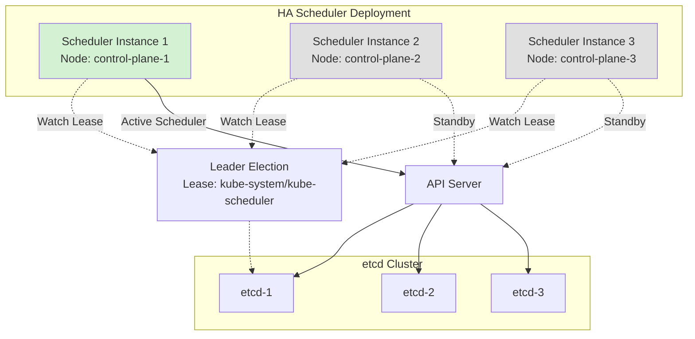
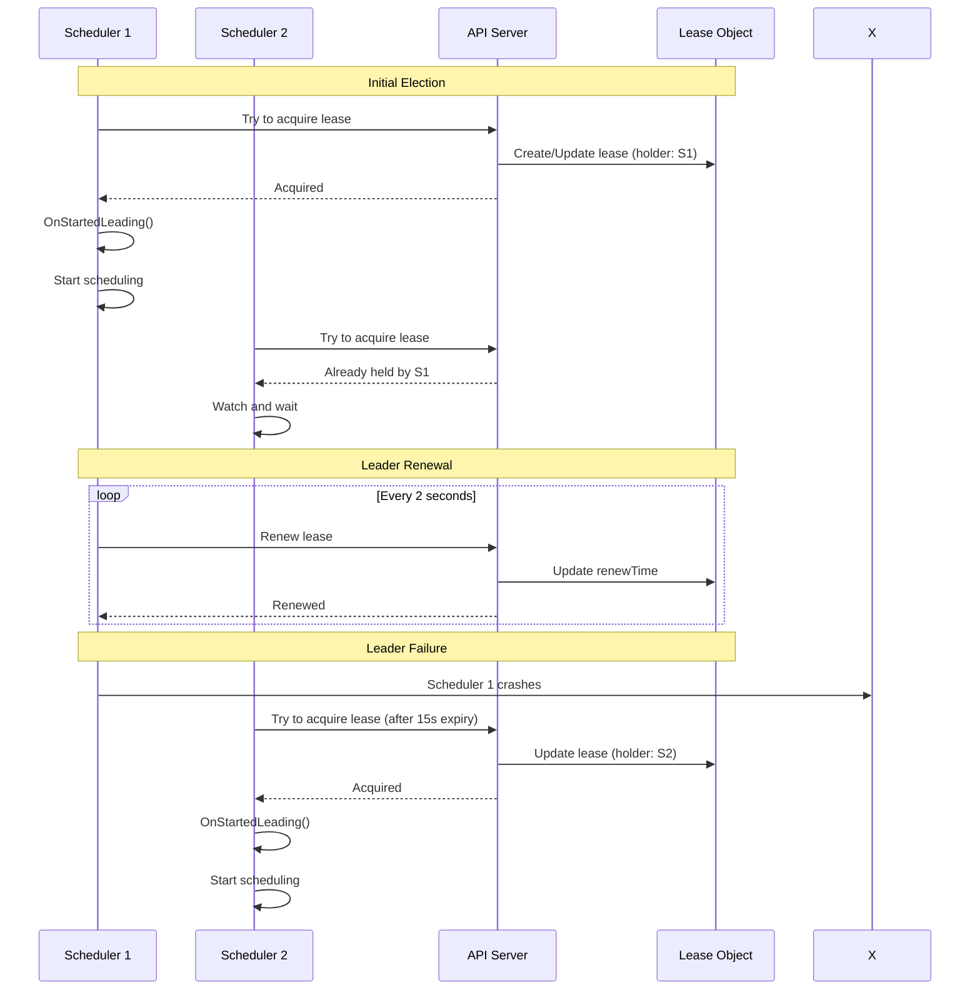
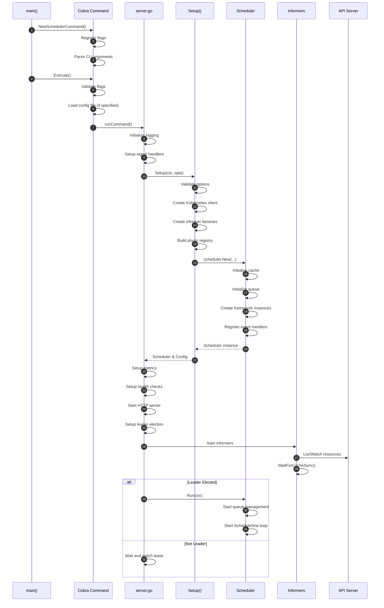
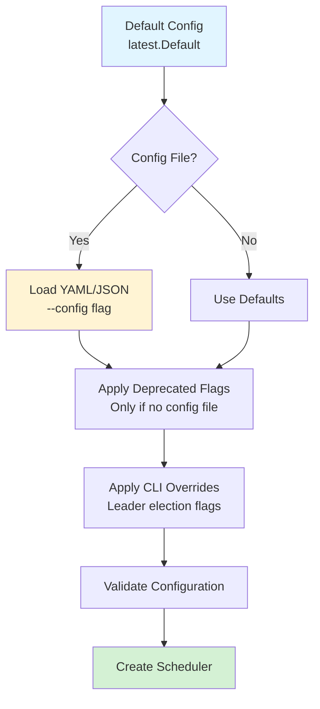
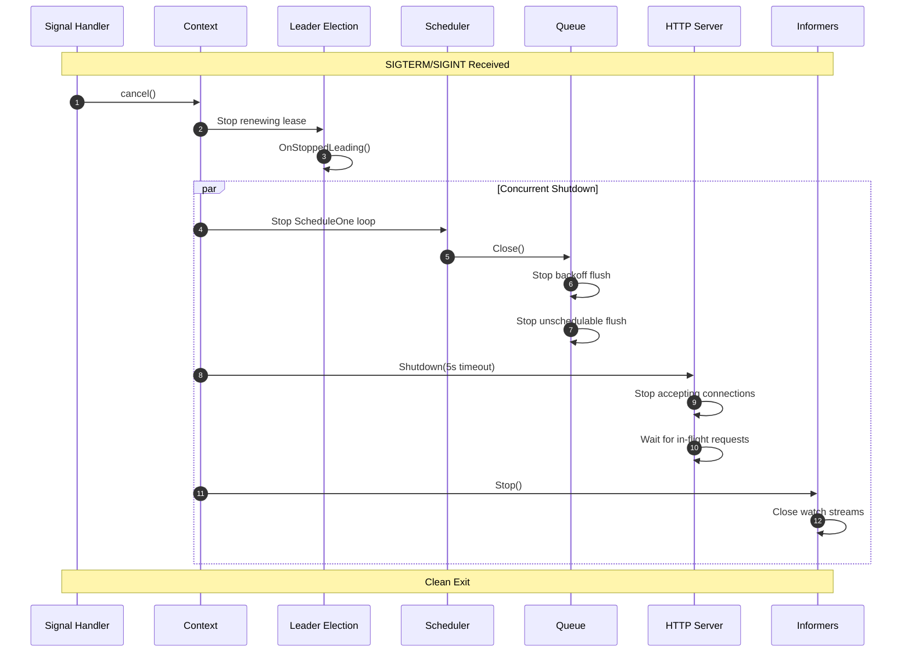

# Kubernetes Scheduler: Deployment and Runtime

**Document Version:** 1.0
**Last Updated:** 2025-10-20
**Status:** Living Document

---

## Table of Contents

1. [Deployment Architecture](#deployment-architecture)
2. [Leader Election and High Availability](#leader-election-and-high-availability)
3. [Runtime Initialization Flow](#runtime-initialization-flow)
4. [Configuration Management](#configuration-management)
5. [Health Checks and Readiness](#health-checks-and-readiness)
6. [Graceful Shutdown](#graceful-shutdown)

---

## Deployment Architecture

### Standard Deployment

The scheduler runs as a static pod or deployment in the `kube-system` namespace:

```yaml
apiVersion: v1
kind: Pod
metadata:
  name: kube-scheduler
  namespace: kube-system
spec:
  containers:
  - name: kube-scheduler
    image: registry.k8s.io/kube-scheduler:v1.29.0
    command:
    - kube-scheduler
    - --authentication-kubeconfig=/etc/kubernetes/scheduler.conf
    - --authorization-kubeconfig=/etc/kubernetes/scheduler.conf
    - --bind-address=0.0.0.0
    - --kubeconfig=/etc/kubernetes/scheduler.conf
    - --leader-elect=true
    - --port=0  # Deprecated, disabled
    - --secure-port=10259
    livenessProbe:
      httpGet:
        path: /healthz
        port: 10259
        scheme: HTTPS
    readinessProbe:
      httpGet:
        path: /readyz
        port: 10259
        scheme: HTTPS
```

### High Availability Deployment



---

## Leader Election and High Availability

### Leader Election Mechanism

**Implementation**: Kubernetes Lease-based leader election

**Configuration** (`cmd/kube-scheduler/app/server.go:171`):
```go
LeaderElection: &leaderelection.LeaderElectionConfig{
    Lock:          resourcelock.New(...),  // Lease lock
    LeaseDuration: 15 * time.Second,       // How long leader holds lease
    RenewDeadline: 10 * time.Second,       // Leader must renew before this
    RetryPeriod:   2 * time.Second,        // Non-leader retry interval
    Callbacks: leaderelection.LeaderCallbacks{
        OnStartedLeading: func(ctx context.Context) {
            // Start scheduler work
            sched.Run(ctx)
        },
        OnStoppedLeading: func() {
            // Lost leadership, exit
            klog.Fatal("leaderelection lost")
        },
        OnNewLeader: func(identity string) {
            // New leader elected
            klog.Infof("new leader elected: %s", identity)
        },
    },
}
```

### Leader Election Flow



**Key Parameters**:
- **LeaseDuration** (15s): How long the lease is valid
- **RenewDeadline** (10s): Leader must renew before this deadline
- **RetryPeriod** (2s): How often non-leaders check the lease

**Lease Object** (`kube-system/kube-scheduler`):
```yaml
apiVersion: coordination.k8s.io/v1
kind: Lease
metadata:
  name: kube-scheduler
  namespace: kube-system
spec:
  holderIdentity: "scheduler-instance-1_abc123"
  leaseDurationSeconds: 15
  acquireTime: "2025-10-20T10:00:00Z"
  renewTime: "2025-10-20T10:05:30Z"
  leaseTransitions: 3
```

---

## Runtime Initialization Flow

### Complete Bootstrap Sequence



### Initialization Steps Detail

#### 1. Command Creation and Flag Registration
**Location**: `cmd/kube-scheduler/app/server.go:90-136`

```go
func NewSchedulerCommand(registryOptions ...Option) *cobra.Command {
    opts := options.NewOptions()

    cmd := &cobra.Command{
        Use: "kube-scheduler",
        Long: `The Kubernetes scheduler...`,
        RunE: func(cmd *cobra.Command, args []string) error {
            return runCommand(cmd, opts, registryOptions...)
        },
    }

    // Register flags in named sets
    nfs := opts.Flags
    verflag.AddFlags(nfs.FlagSet("global"))
    // ... more flag registration

    return cmd
}
```

#### 2. Configuration Loading
**Location**: `cmd/kube-scheduler/app/options/options.go:299-343`

**Priority order**:
1. Default configuration
2. Config file (if --config specified)
3. CLI flags (override config file)

#### 3. Scheduler Instantiation
**Location**: `pkg/scheduler/scheduler.go:277-446`

```go
func New(ctx context.Context,
    client clientset.Interface,
    informerFactory informers.SharedInformerFactory,
    ...) (*Scheduler, error) {

    // Create snapshot
    snapshot := internalcache.NewEmptySnapshot()

    // Create cache
    schedulerCache := internalcache.New(ctx, ttl, apiDispatcher)

    // Create queue
    podQueue := internalqueue.NewSchedulingQueue(...)

    // Create framework instances (one per profile)
    profiles, err := profile.NewMap(ctx, options.profiles, registry, ...)

    // Register event handlers
    addAllEventHandlers(sched, informerFactory, ...)

    return sched, nil
}
```

#### 4. Informer Synchronization
**Location**: `cmd/kube-scheduler/app/server.go:312`

```go
func startInformersAndWaitForSync(ctx context.Context, ...) {
    informerFactory.Start(ctx.Done())
    dynInformerFactory.Start(ctx.Done())

    informerFactory.WaitForCacheSync(ctx.Done())
    dynInformerFactory.WaitForCacheSync(ctx.Done())

    sched.WaitForHandlersSync(ctx)
}
```

#### 5. HTTP Server Start
**Location**: `cmd/kube-scheduler/app/server.go:247`

**Endpoints**:
- `/healthz`: Liveness probe
- `/readyz`: Readiness probe
- `/metrics`: Prometheus metrics
- `/debug/pprof/*`: Profiling (if enabled)
- `/configz`: Current configuration

#### 6. Scheduler Main Loop
**Location**: `pkg/scheduler/scheduler.go:524-551`

```go
func (sched *Scheduler) Run(ctx context.Context) {
    sched.SchedulingQueue.Run(logger)

    if sched.APIDispatcher != nil {
        sched.APIDispatcher.Run(logger)
    }

    // Start ScheduleOne in dedicated goroutine
    go wait.UntilWithContext(ctx, sched.ScheduleOne, 0)

    <-ctx.Done()
    sched.SchedulingQueue.Close()
}
```

---

## Configuration Management

### Configuration Sources



### Configuration Structure

**Type**: `KubeSchedulerConfiguration` (`pkg/scheduler/apis/config/types.go`)

```yaml
apiVersion: kubescheduler.config.k8s.io/v1
kind: KubeSchedulerConfiguration
clientConnection:
  kubeconfig: /etc/kubernetes/scheduler.conf
  qps: 50
  burst: 100
leaderElection:
  leaderElect: true
  leaseDuration: 15s
  renewDeadline: 10s
  retryPeriod: 2s
  resourceName: kube-scheduler
  resourceNamespace: kube-system
profiles:
- schedulerName: default-scheduler
  plugins:
    queueSort:
      enabled:
      - name: PrioritySort
    preFilter:
      enabled:
      - name: NodeResourcesFit
      - name: NodePorts
      # ...
    filter:
      enabled:
      - name: NodeUnschedulable
      - name: NodeName
      - name: TaintToleration
      # ...
    score:
      enabled:
      - name: NodeResourcesBalancedAllocation
        weight: 1
      - name: ImageLocality
        weight: 1
  pluginConfig:
  - name: NodeResourcesFit
    args:
      scoringStrategy:
        type: LeastAllocated
percentageOfNodesToScore: 0  # Adaptive
```

---

## Health Checks and Readiness

### Health Check Architecture

```mermaid
graph TB
    subgraph "Health Endpoints"
        H1[/healthz<br/>Liveness]
        H2[/livez<br/>Liveness]
        H3[/readyz<br/>Readiness]
    end

    subgraph "Health Checks"
        C1[ping]
        C2[log]
        C3[LeaderElection.WatchDog]
        C4[ShutdownHealthz]
        C5[sched-handler-sync]
    end

    H1 --> C1
    H1 --> C2

    H2 --> C1
    H2 --> C2

    H3 --> C1
    H3 --> C2
    H3 --> C3
    H3 --> C4
    H3 --> C5

    style H1 fill:#d4f1d4
    style H2 fill:#d4f1d4
    style H3 fill:#fff4d4
```

### Readiness Checks

**Location**: `cmd/kube-scheduler/app/server.go:284`

```go
healthz.InstallReadyzHandler(mux, checks...)
```

**Checks**:
1. **ping**: Basic HTTP response
2. **log**: Logging system functional
3. **leaderelection**: Leader election watchdog (if enabled)
4. **shutdown**: Context not done
5. **sched-handler-sync**: All informer event handlers synced

**Handler Sync Check** (`pkg/scheduler/scheduler.go`):
```go
func (sched *Scheduler) WaitForHandlersSync(ctx context.Context) bool {
    return cache.WaitForNamedCacheSync(
        "scheduler",
        ctx.Done(),
        func() bool {
            for _, registration := range sched.registeredHandlers {
                if !registration.HasSynced() {
                    return false
                }
            }
            return true
        },
    )
}
```

---

## Graceful Shutdown

### Shutdown Sequence



### Implementation Details

**Signal Setup** (`cmd/kube-scheduler/app/server.go:153`):
```go
ctx, cancel := context.WithCancel(context.Background())
defer cancel()

go func() {
    stopCh := server.SetupSignalHandler()
    <-stopCh
    cancel()
}()
```

**Scheduler Shutdown** (`pkg/scheduler/scheduler.go:540`):
```go
func (sched *Scheduler) Run(ctx context.Context) {
    sched.SchedulingQueue.Run(logger)
    go wait.UntilWithContext(ctx, sched.ScheduleOne, 0)

    <-ctx.Done()  // Wait for cancellation

    // Cleanup
    if sched.APIDispatcher != nil {
        sched.APIDispatcher.Close()
    }
    sched.SchedulingQueue.Close()
    sched.Profiles.Close()
}
```

**HTTP Server Shutdown** (`cmd/kube-scheduler/app/server.go:252`):
```go
go func() {
    <-ctx.Done()
    if err := server.Close(); err != nil {
        logger.Error(err, "Failed to close HTTP server")
    }
}()
```

---

## Operational Considerations

### Resource Requirements

**Typical Resource Usage**:
- **CPU**: 100m - 500m (scales with cluster size)
- **Memory**: 100Mi - 2Gi (scales with number of nodes and pods)

**Factors Affecting Resource Usage**:
- Number of nodes
- Number of pods (pending and scheduled)
- Number of plugin extension points enabled
- Complexity of custom plugins
- Event rate (cluster churn)

### Scaling Considerations

**Horizontal Scaling**:
- Only one active scheduler at a time (leader election)
- Standby replicas provide high availability
- No performance benefit from multiple replicas

**Vertical Scaling**:
- Increase CPU for faster scheduling cycles
- Increase memory for larger clusters (cache size)

**Performance Tuning**:
- `--percentage-of-nodes-to-score`: Lower value = faster scheduling
- `--parallelism`: More workers = faster filtering/scoring
- Plugin configuration: Disable unnecessary plugins

---

**Document Status**: Complete
**Next Steps**: Continue to [04-functional-requirements.md](./04-functional-requirements.md)
