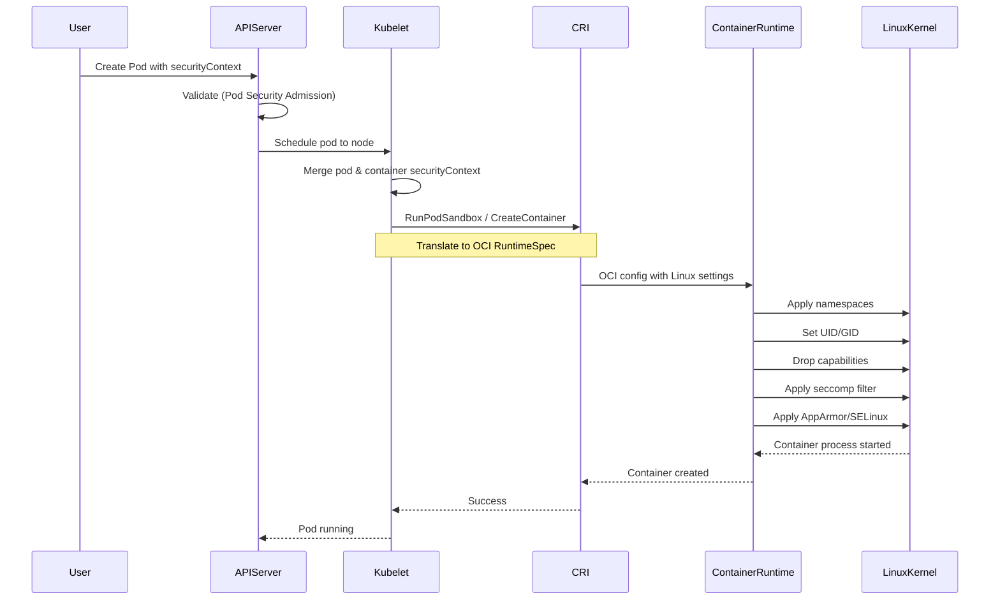

# **Security Context and Capabilities - Deep Architectural Analysis**

━━━━━━━━━━━━━━━━━━━━━━━━━━━━━━━━━━━━━━━━━━━━━━━━━━━━━━━━━━━━━━━━━━━━━━━━━━━━━━

## **📋 Document Overview**

**Target Audience**: Platform engineers, Kubernetes architects, security engineers, SREs managing production clusters, open-source contributors

**Scope**: Deep technical analysis of Kubernetes security context, Linux capabilities, AppArmor, SELinux, and seccomp profiles. This document examines how kubelet translates Kubernetes security policies into container runtime configurations, the Linux kernel security mechanisms involved, and implementation details for platform engineers building secure multi-tenant platforms.

**Prerequisites**:
- Understanding of [Pod Security Standards](./01-pod-security-standards.md)
- Familiarity with [kubelet architecture](../kubelet/high-level/01-kubelet-architecture.md)
- Knowledge of Linux container security primitives

━━━━━━━━━━━━━━━━━━━━━━━━━━━━━━━━━━━━━━━━━━━━━━━━━━━━━━━━━━━━━━━━━━━━━━━━━━━━━━

## **🎯 Design Philosophy**

### **Defense in Depth Strategy**

Kubernetes security context implements multiple layers of container isolation:

```
┌──────────────────────────────────────────────────────────────┐
│  KUBERNETES SECURITY LAYERS                                   │
├──────────────────────────────────────────────────────────────┤
│                                                               │
│  Layer 1: Linux Namespaces                                   │
│           └─ Process, network, mount isolation               │
│                                                               │
│  Layer 2: Cgroups                                            │
│           └─ Resource limits (CPU, memory)                   │
│                                                               │
│  Layer 3: Capabilities                                       │
│           └─ Fine-grained privilege control                  │
│                                                               │
│  Layer 4: Seccomp                                            │
│           └─ System call filtering                           │
│                                                               │
│  Layer 5: AppArmor / SELinux                                 │
│           └─ Mandatory access control                        │
│                                                               │
│  Layer 6: Read-only root filesystem                          │
│           └─ Immutable container filesystem                  │
│                                                               │
└──────────────────────────────────────────────────────────────┘
```

### **Core Security Principles**

```
┌──────────────────────────────────────────────────────────────┐
│  SECURITY CONTEXT DESIGN PRINCIPLES                          │
├──────────────────────────────────────────────────────────────┤
│                                                               │
│  1. LEAST PRIVILEGE                                          │
│     └─ Containers run with minimal necessary permissions    │
│                                                               │
│  2. FAIL SAFE DEFAULTS                                       │
│     └─ Secure by default, explicit opt-in for privileges    │
│                                                               │
│  3. PRINCIPLE OF SEPARATION                                  │
│     └─ Isolate containers from host and each other          │
│                                                               │
│  4. NO ROOT PROCESSES                                        │
│     └─ Run as non-root user when possible                   │
│                                                               │
│  5. IMMUTABLE INFRASTRUCTURE                                 │
│     └─ Read-only root filesystem, writable volumes          │
│                                                               │
│  6. AUDIT AND ACCOUNTABILITY                                 │
│     └─ Security decisions logged and attributable           │
│                                                               │
└──────────────────────────────────────────────────────────────┘
```

━━━━━━━━━━━━━━━━━━━━━━━━━━━━━━━━━━━━━━━━━━━━━━━━━━━━━━━━━━━━━━━━━━━━━━━━━━━━━━

## **🏗️ Security Context Architecture**

### **Pod vs Container Security Context**

```yaml
apiVersion: v1
kind: Pod
metadata:
  name: security-demo
spec:
  # POD-LEVEL SECURITY CONTEXT
  securityContext:
    runAsUser: 1000          # Default UID for all containers
    runAsGroup: 3000         # Default GID
    fsGroup: 2000            # Group ownership for volumes
    fsGroupChangePolicy: "OnRootMismatch"
    supplementalGroups: [4000, 5000]
    seccompProfile:
      type: RuntimeDefault   # Applied to all containers
    seLinuxOptions:
      level: "s0:c123,c456"
    sysctls:
    - name: net.ipv4.ip_forward
      value: "1"

  containers:
  - name: app
    image: myapp:1.0

    # CONTAINER-LEVEL SECURITY CONTEXT (overrides pod-level)
    securityContext:
      runAsUser: 2000        # Overrides pod-level 1000
      runAsNonRoot: true
      allowPrivilegeEscalation: false
      privileged: false
      readOnlyRootFilesystem: true
      capabilities:
        drop: ["ALL"]
        add: ["NET_BIND_SERVICE"]
      seccompProfile:
        type: Localhost
        localhostProfile: "profiles/audit.json"
      seLinuxOptions:
        level: "s0:c123,c456"
```

**Precedence Rules**:
1. Container-level settings override pod-level settings
2. If only pod-level set, applies to all containers
3. Some settings only available at pod level (fsGroup, sysctls)
4. Some settings only available at container level (capabilities, privileged)

### **Security Context Translation Flow**



━━━━━━━━━━━━━━━━━━━━━━━━━━━━━━━━━━━━━━━━━━━━━━━━━━━━━━━━━━━━━━━━━━━━━━━━━━━━━━

## **👤 User and Group IDs**

### **runAsUser and runAsGroup**

```go
// pkg/kubelet/kuberuntime/security_context.go

func (m *kubeGenericRuntimeManager) determineEffectiveSecurityContext(
    pod *v1.Pod,
    container *v1.Container,
    uid *int64,
    username string,
) *runtimeapi.LinuxContainerSecurityContext {

    effectiveUID := uid
    effectiveGID := int64(0)

    // Container-level runAsUser overrides pod-level
    if container.SecurityContext != nil && container.SecurityContext.RunAsUser != nil {
        effectiveUID = container.SecurityContext.RunAsUser
    } else if pod.Spec.SecurityContext != nil && pod.Spec.SecurityContext.RunAsUser != nil {
        effectiveUID = pod.Spec.SecurityContext.RunAsUser
    }

    // Container-level runAsGroup overrides pod-level
    if container.SecurityContext != nil && container.SecurityContext.RunAsGroup != nil {
        effectiveGID = *container.SecurityContext.RunAsGroup
    } else if pod.Spec.SecurityContext != nil && pod.Spec.SecurityContext.RunAsGroup != nil {
        effectiveGID = *pod.Spec.SecurityContext.RunAsGroup
    }

    return &runtimeapi.LinuxContainerSecurityContext{
        RunAsUser:  &runtimeapi.Int64Value{Value: *effectiveUID},
        RunAsGroup: &runtimeapi.Int64Value{Value: effectiveGID},
    }
}
```

**OCI Runtime Spec Translation**:
```json
{
  "process": {
    "user": {
      "uid": 1000,
      "gid": 3000,
      "additionalGids": [2000, 4000, 5000]
    }
  }
}
```

**What Happens in Container**:
```bash
# Inside container
$ id
uid=1000 gid=3000 groups=2000,3000,4000,5000

# Container process runs as this user
$ ps aux
USER       PID  COMMAND
1000         1  /app/server
```

### **runAsNonRoot Validation**

```go
// pkg/kubelet/kuberuntime/security_context_container.go

func verifyRunAsNonRoot(pod *v1.Pod, container *v1.Container, uid int64) error {
    // Check if runAsNonRoot is set
    nonRoot := false
    if container.SecurityContext != nil && container.SecurityContext.RunAsNonRoot != nil {
        nonRoot = *container.SecurityContext.RunAsNonRoot
    } else if pod.Spec.SecurityContext != nil && pod.Spec.SecurityContext.RunAsNonRoot != nil {
        nonRoot = *pod.Spec.SecurityContext.RunAsNonRoot
    }

    if !nonRoot {
        return nil  // Not enforced
    }

    // Enforce: UID must not be 0
    if uid == 0 {
        return fmt.Errorf("container's runAsUser breaks non-root policy (runAsNonRoot=true but UID=0)")
    }

    return nil
}
```

**Enforcement Timeline**:
- **API server**: Does NOT validate runAsNonRoot (admission allows pod creation)
- **kubelet**: Validates before starting container
- **Failure**: Pod enters `CreateContainerError` state

**Example Failure**:
```yaml
apiVersion: v1
kind: Pod
metadata:
  name: root-violation
spec:
  securityContext:
    runAsUser: 0          # UID 0 = root
    runAsNonRoot: true    # But we said non-root!
  containers:
  - name: app
    image: nginx
```

```bash
$ kubectl describe pod root-violation
...
Events:
  Warning  Failed  Error: container has runAsNonRoot and image will run as root
```

### **fsGroup and Supplemental Groups**

**fsGroup** sets group ownership of volumes:

```go
// pkg/volume/util/fsgroup/fsgroup.go

func SetVolumeOwnership(pod *v1.Pod, volumePath string) error {
    if pod.Spec.SecurityContext == nil || pod.Spec.SecurityContext.FSGroup == nil {
        return nil  // No fsGroup set
    }

    fsGroup := *pod.Spec.SecurityContext.FSGroup

    // Change ownership of volume to fsGroup
    return filepath.Walk(volumePath, func(path string, info os.FileInfo, err error) error {
        if err != nil {
            return err
        }

        // chown -R :fsGroup volumePath
        return os.Chown(path, -1, int(fsGroup))
    })
}
```

**Example**:
```yaml
spec:
  securityContext:
    fsGroup: 2000  # All volumes will be owned by GID 2000
  containers:
  - name: app
    volumeMounts:
    - name: data
      mountPath: /data
  volumes:
  - name: data
    persistentVolumeClaim:
      claimName: my-pvc
```

**Result in Container**:
```bash
$ ls -la /data
drwxrwsr-x 2 root 2000 4096 Jan 15 10:00 .
-rw-r--r-- 1 root 2000  123 Jan 15 10:01 file.txt
```

**Performance Consideration**:
- fsGroup change walks entire volume tree
- Large volumes (millions of files) = slow pod startup
- Use `fsGroupChangePolicy: "OnRootMismatch"` to skip if already correct

━━━━━━━━━━━━━━━━━━━━━━━━━━━━━━━━━━━━━━━━━━━━━━━━━━━━━━━━━━━━━━━━━━━━━━━━━━━━━━

## **🔑 Linux Capabilities**

### **Capability System Overview**

Traditional Unix: **root** (UID 0) has all privileges, non-root has limited privileges

Linux capabilities: Split root privileges into **44 distinct capabilities**

```
┌─────────────────────────────────────────────────────────────┐
│  TRADITIONAL MODEL          vs       CAPABILITY MODEL        │
├─────────────────────────────────────────────────────────────┤
│                                                              │
│  ┌──────────────┐                  ┌──────────────┐         │
│  │  root (UID=0)│                  │  CAP_NET_ADMIN│        │
│  │              │                  │  CAP_SYS_TIME │        │
│  │  All powers  │                  │  CAP_CHOWN    │        │
│  └──────────────┘                  │  ...          │        │
│                                     └──────────────┘         │
│  ┌──────────────┐                  ┌──────────────┐         │
│  │  non-root    │                  │  (no caps)   │         │
│  │              │                  │              │         │
│  │  Limited     │                  │  Fine-grained│         │
│  └──────────────┘                  └──────────────┘         │
│                                                              │
└─────────────────────────────────────────────────────────────┘
```

### **Common Capabilities**

| **Capability** | **Allows** | **Risk** | **Common Use** |
|----------------|-----------|----------|----------------|
| `CAP_NET_BIND_SERVICE` | Bind to ports < 1024 | Low | Web servers binding to port 80/443 |
| `CAP_NET_ADMIN` | Network configuration | High | CNI plugins, network troubleshooting |
| `CAP_SYS_ADMIN` | Wide-ranging admin operations | Critical | Container runtimes, system management |
| `CAP_SYS_TIME` | Set system clock | Medium | NTP daemons |
| `CAP_CHOWN` | Change file ownership | Medium | Backup tools |
| `CAP_DAC_OVERRIDE` | Bypass file permissions | High | Backup/restore, admin tools |
| `CAP_FOWNER` | Bypass owner checks | Medium | File management tools |
| `CAP_KILL` | Send signals to any process | Medium | Process managers |
| `CAP_NET_RAW` | Use RAW/PACKET sockets | Medium | Ping, network diagnostics |
| `CAP_SYS_PTRACE` | Trace arbitrary processes | High | Debuggers, profilers |

**Complete List**: See `man capabilities` (44 capabilities in Linux 5.x)

### **Default Container Capabilities**

**Docker/containerd default** (without Kubernetes):
```
CAP_CHOWN
CAP_DAC_OVERRIDE
CAP_FOWNER
CAP_FSETID
CAP_KILL
CAP_SETGID
CAP_SETUID
CAP_SETPCAP
CAP_NET_BIND_SERVICE
CAP_NET_RAW
CAP_SYS_CHROOT
CAP_MKNOD
CAP_AUDIT_WRITE
CAP_SETFCAP
```

**Kubernetes default** (unless overridden):
- Same as Docker default
- Pod Security Standards `restricted` profile REQUIRES dropping ALL

### **Kubernetes Capability Configuration**

```yaml
apiVersion: v1
kind: Pod
metadata:
  name: capability-demo
spec:
  containers:
  - name: app
    image: myapp:1.0
    securityContext:
      capabilities:
        # DROP capabilities
        drop:
          - ALL              # Drop all default capabilities

        # ADD back only what's needed
        add:
          - NET_BIND_SERVICE # Allow binding to port 80
```

**kubelet Implementation**:

```go
// pkg/kubelet/kuberuntime/security_context.go

func (m *kubeGenericRuntimeManager) getContainerCapabilities(
    container *v1.Container,
) []string {

    // Start with default capabilities
    caps := defaultCapabilities()

    if container.SecurityContext == nil || container.SecurityContext.Capabilities == nil {
        return caps
    }

    // Apply drops
    for _, drop := range container.SecurityContext.Capabilities.Drop {
        if drop == "ALL" {
            caps = []string{}  // Clear all capabilities
        } else {
            caps = removeCapability(caps, string(drop))
        }
    }

    // Apply adds
    for _, add := range container.SecurityContext.Capabilities.Add {
        caps = append(caps, string(add))
    }

    return caps
}
```

**OCI Runtime Spec Translation**:
```json
{
  "process": {
    "capabilities": {
      "bounding": ["CAP_NET_BIND_SERVICE"],
      "effective": ["CAP_NET_BIND_SERVICE"],
      "inheritable": ["CAP_NET_BIND_SERVICE"],
      "permitted": ["CAP_NET_BIND_SERVICE"],
      "ambient": ["CAP_NET_BIND_SERVICE"]
    }
  }
}
```

### **Capability Sets Explained**

Linux has **5 capability sets per process**:

```
┌──────────────────────────────────────────────────────────────┐
│  LINUX CAPABILITY SETS                                        │
├──────────────────────────────────────────────────────────────┤
│                                                               │
│  1. PERMITTED                                                │
│     └─ Capabilities process is allowed to use                │
│                                                               │
│  2. EFFECTIVE                                                │
│     └─ Capabilities currently active                         │
│                                                               │
│  3. INHERITABLE                                              │
│     └─ Capabilities preserved across execve()                │
│                                                               │
│  4. BOUNDING                                                 │
│     └─ Limit on capabilities that can be gained              │
│                                                               │
│  5. AMBIENT (Linux 4.3+)                                     │
│     └─ Capabilities inherited by non-root processes          │
│                                                               │
└──────────────────────────────────────────────────────────────┘
```

**Kubernetes sets all 5 identically** for simplicity

**Checking Capabilities in Running Container**:
```bash
# View capabilities of PID 1
kubectl exec -it my-pod -- cat /proc/1/status | grep Cap

# Output:
# CapInh: 00000000a80425fb   (Inheritable)
# CapPrm: 00000000a80425fb   (Permitted)
# CapEff: 00000000a80425fb   (Effective)
# CapBnd: 00000000a80425fb   (Bounding)
# CapAmb: 00000000a80425fb   (Ambient)

# Decode capability bitmask
kubectl exec -it my-pod -- capsh --decode=00000000a80425fb
# Output: cap_chown,cap_dac_override,cap_fowner,cap_fsetid,cap_kill,cap_setgid,cap_setuid,cap_setpcap,cap_net_bind_service,cap_net_raw,cap_sys_chroot,cap_mknod,cap_audit_write,cap_setfcap
```

### **Privileged Containers**

**privileged: true** grants **ALL capabilities** and disables many isolation features:

```yaml
spec:
  containers:
  - name: privileged-debug
    image: ubuntu:22.04
    securityContext:
      privileged: true  # DANGEROUS - avoid in production
```

**What privileged: true Does**:

```go
// pkg/kubelet/kuberuntime/security_context.go

func (m *kubeGenericRuntimeManager) generateContainerConfig(
    container *v1.Container,
    pod *v1.Pod,
) (*runtimeapi.ContainerConfig, error) {

    if container.SecurityContext != nil && container.SecurityContext.Privileged != nil && *container.SecurityContext.Privileged {
        // Privileged mode
        return &runtimeapi.ContainerConfig{
            Linux: &runtimeapi.LinuxContainerConfig{
                SecurityContext: &runtimeapi.LinuxContainerSecurityContext{
                    Privileged: true,
                    Capabilities: &runtimeapi.Capability{
                        Add: allCapabilities(),  // Add ALL capabilities
                    },
                    // SELinux/AppArmor disabled
                    SelinuxOptions: nil,
                    // Seccomp disabled
                    SeccompProfilePath: "",
                    // Access to all host devices
                    Devices: allHostDevices(),
                },
            },
        }
    }
}
```

**Privileged Container Can**:
- ✅ Access all host devices (`/dev/*`)
- ✅ Modify kernel modules (`insmod`, `rmmod`)
- ✅ Modify kernel parameters (`sysctl`)
- ✅ Access host network interfaces
- ✅ See all host processes (if `hostPID: true`)
- ✅ Mount filesystems
- ✅ **Essentially has root access to host**

**Security Risk**: Privileged container = compromised host

**Legitimate Use Cases**:
- Container runtimes (Docker-in-Docker)
- System monitoring tools (node-problem-detector)
- CNI plugins requiring low-level network access

**Best Practice**: Use fine-grained capabilities instead

━━━━━━━━━━━━━━━━━━━━━━━━━━━━━━━━━━━━━━━━━━━━━━━━━━━━━━━━━━━━━━━━━━━━━━━━━━━━━━

## **🛡️ Seccomp Profiles**

### **What is Seccomp?**

**Seccomp** (Secure Computing Mode): Linux kernel feature to **filter system calls**

**Goal**: Reduce attack surface by blocking dangerous syscalls

```
Application Process
      ↓
    syscall()
      ↓
Seccomp Filter ← Configurable allow/deny list
      ↓
    ┌─────────────┐
    │ Allow?      │
    └─────────────┘
      ↓          ↓
    Yes         No
      ↓          ↓
Linux Kernel   SIGKILL / EPERM / Log
```

### **Seccomp Modes**

| **Mode** | **Behavior** | **Use Case** |
|----------|-------------|--------------|
| `Unconfined` | No filtering (all syscalls allowed) | Legacy default (insecure) |
| `RuntimeDefault` | Container runtime's default profile | **Recommended default** |
| `Localhost` | Custom profile from node filesystem | Advanced use cases |

### **RuntimeDefault Profile**

**containerd default** (approximately):
- **Allow**: ~300 syscalls (read, write, open, close, mmap, etc.)
- **Block**: ~140 dangerous syscalls

**Blocked Syscalls Examples**:
- `acct` - process accounting (could DoS disk)
- `add_key`, `keyctl` - kernel keyring (privilege escalation)
- `bpf` - BPF programs (kernel exploitation)
- `clock_settime` - set system time
- `create_module`, `init_module`, `delete_module` - kernel modules
- `iopl`, `ioperm` - direct I/O port access
- `kexec_load` - load new kernel
- `mount`, `umount2` - filesystem mounting
- `pivot_root` - change root filesystem
- `ptrace` - trace/debug processes
- `reboot` - reboot system
- `swapon`, `swapoff` - swap management
- `syslog` - kernel log access

**Full List**: https://github.com/containerd/containerd/blob/main/contrib/seccomp/seccomp_default.go

### **Kubernetes Seccomp Configuration**

```yaml
apiVersion: v1
kind: Pod
metadata:
  name: seccomp-demo
spec:
  # Pod-level seccomp (applies to all containers)
  securityContext:
    seccompProfile:
      type: RuntimeDefault

  containers:
  - name: app
    image: myapp:1.0
    # Container-level seccomp (overrides pod-level)
    securityContext:
      seccompProfile:
        type: Localhost
        localhostProfile: profiles/audit.json
```

**kubelet Implementation**:

```go
// pkg/kubelet/kuberuntime/security_context.go

func (m *kubeGenericRuntimeManager) getSeccompProfile(
    pod *v1.Pod,
    container *v1.Container,
) string {

    // Container-level overrides pod-level
    if container.SecurityContext != nil && container.SecurityContext.SeccompProfile != nil {
        return m.getSeccompProfilePath(container.SecurityContext.SeccompProfile)
    }

    if pod.Spec.SecurityContext != nil && pod.Spec.SecurityContext.SeccompProfile != nil {
        return m.getSeccompProfilePath(pod.Spec.SecurityContext.SeccompProfile)
    }

    // No seccomp specified
    return ""
}

func (m *kubeGenericRuntimeManager) getSeccompProfilePath(profile *v1.SeccompProfile) string {
    switch profile.Type {
    case v1.SeccompProfileTypeRuntimeDefault:
        return "runtime/default"  // Special value for container runtime

    case v1.SeccompProfileTypeLocalhost:
        // Load from /var/lib/kubelet/seccomp/<localhostProfile>
        return filepath.Join(m.seccompProfileRoot, profile.LocalhostProfile)

    case v1.SeccompProfileTypeUnconfined:
        return "unconfined"

    default:
        return ""
    }
}
```

### **Custom Seccomp Profiles**

**Location**: `/var/lib/kubelet/seccomp/<profile>.json`

**Example - Audit Profile** (logs blocked syscalls instead of killing):
```json
{
  "defaultAction": "SCMP_ACT_LOG",
  "architectures": [
    "SCMP_ARCH_X86_64",
    "SCMP_ARCH_X86",
    "SCMP_ARCH_X32"
  ],
  "syscalls": [
    {
      "names": [
        "read",
        "write",
        "open",
        "close",
        "stat",
        "fstat"
      ],
      "action": "SCMP_ACT_ALLOW"
    },
    {
      "names": [
        "reboot",
        "mount",
        "umount2"
      ],
      "action": "SCMP_ACT_ERRNO"
    }
  ]
}
```

**Seccomp Actions**:
- `SCMP_ACT_ALLOW`: Allow syscall
- `SCMP_ACT_ERRNO`: Return error (EPERM)
- `SCMP_ACT_KILL`: Kill process
- `SCMP_ACT_LOG`: Allow but log to audit
- `SCMP_ACT_TRAP`: Send SIGSYS signal

**Using Custom Profile**:
```yaml
spec:
  securityContext:
    seccompProfile:
      type: Localhost
      localhostProfile: profiles/audit.json
```

**Debugging Seccomp Violations**:
```bash
# View kernel audit log
sudo ausearch -m SECCOMP -ts recent

# Output:
# type=SECCOMP msg=audit(1705315200.123:456): auid=1000 uid=0 gid=0 ses=4 pid=12345 comm="app" exe="/usr/bin/app" sig=31 arch=c000003e syscall=165 compat=0 ip=0x7f8b9c8a1234 code=0x0
# Syscall 165 = mount (blocked)
```

━━━━━━━━━━━━━━━━━━━━━━━━━━━━━━━━━━━━━━━━━━━━━━━━━━━━━━━━━━━━━━━━━━━━━━━━━━━━━━

## **🔐 AppArmor**

### **What is AppArmor?**

**AppArmor** (Application Armor): Linux kernel security module implementing **Mandatory Access Control (MAC)**

**Goal**: Confine programs to limited set of resources

```
┌──────────────────────────────────────────────────────────────┐
│  TRADITIONAL DAC           vs           APPARMOR MAC          │
├──────────────────────────────────────────────────────────────┤
│                                                               │
│  User owns file                     AppArmor profile says:   │
│  User can chmod                     - /etc/passwd: read-only │
│  User can share                     - /tmp/*: read-write     │
│                                     - network: tcp/80        │
│  ┌──────────────┐                   - /proc/*/mem: deny      │
│  │ File perms   │                                            │
│  │ User sets    │                  ┌──────────────┐          │
│  └──────────────┘                  │ Kernel       │          │
│                                     │ enforces     │          │
│                                     └──────────────┘          │
│                                                               │
└──────────────────────────────────────────────────────────────┘
```

### **AppArmor Profiles**

**Location**: `/etc/apparmor.d/`

**Example Profile**:
```
# /etc/apparmor.d/nginx-custom
#include <tunables/global>

profile nginx-custom flags=(attach_disconnected,mediate_deleted) {
  #include <abstractions/base>

  # Allow network access
  network inet tcp,
  network inet udp,

  # File access rules
  /etc/nginx/** r,                    # Read nginx config
  /var/log/nginx/** w,                # Write logs
  /var/cache/nginx/** rw,             # Read-write cache
  /usr/sbin/nginx ix,                 # Execute nginx binary

  # Deny access to sensitive files
  deny /etc/shadow r,
  deny /root/** rwx,

  # Capabilities
  capability net_bind_service,
  capability dac_override,
}
```

**Profile Modes**:
- **Enforce**: Violations are blocked
- **Complain**: Violations are logged but allowed (audit mode)
- **Unconfined**: No restrictions

### **Kubernetes AppArmor Configuration**

**Current Status** (Kubernetes v1.30):
- AppArmor support is **beta** (since v1.4)
- Configured via **annotations** (not securityContext fields)
- **Graduating to GA** in future versions

**Configuration**:
```yaml
apiVersion: v1
kind: Pod
metadata:
  name: apparmor-demo
  annotations:
    # Apply to specific container
    container.apparmor.security.beta.kubernetes.io/app: localhost/nginx-custom

    # Or use runtime default
    container.apparmor.security.beta.kubernetes.io/sidecar: runtime/default

    # Or unconfined
    container.apparmor.security.beta.kubernetes.io/debug: unconfined

spec:
  containers:
  - name: app
    image: nginx:1.25
  - name: sidecar
    image: sidecar:1.0
  - name: debug
    image: busybox:1.36
```

**Annotation Format**:
```
container.apparmor.security.beta.kubernetes.io/<container-name>: <profile>
```

**Profile Options**:
- `runtime/default`: Container runtime's default AppArmor profile
- `localhost/<profile-name>`: Custom profile from `/etc/apparmor.d/<profile-name>`
- `unconfined`: No AppArmor restrictions

**kubelet Validation**:

```go
// pkg/kubelet/kuberuntime/security_context.go

func (m *kubeGenericRuntimeManager) getAppArmorProfile(
    pod *v1.Pod,
    containerName string,
) string {

    // Check pod annotations
    annotationKey := fmt.Sprintf("container.apparmor.security.beta.kubernetes.io/%s", containerName)
    profile, exists := pod.Annotations[annotationKey]

    if !exists {
        return ""  // No AppArmor profile specified
    }

    // Validate profile exists on node
    if strings.HasPrefix(profile, "localhost/") {
        profileName := strings.TrimPrefix(profile, "localhost/")
        if err := m.validateAppArmorProfile(profileName); err != nil {
            return ""  // Profile not found, pod creation will fail
        }
    }

    return profile
}

func (m *kubeGenericRuntimeManager) validateAppArmorProfile(profileName string) error {
    // Check if profile is loaded
    // cat /sys/kernel/security/apparmor/profiles | grep profileName
    profiles, err := os.ReadFile("/sys/kernel/security/apparmor/profiles")
    if err != nil {
        return err
    }

    if !strings.Contains(string(profiles), profileName) {
        return fmt.Errorf("AppArmor profile %s not loaded on node", profileName)
    }

    return nil
}
```

**Loading Custom Profiles on Nodes**:
```bash
# On each node, load AppArmor profile
sudo apparmor_parser -r -W /etc/apparmor.d/nginx-custom

# Verify profile is loaded
sudo aa-status | grep nginx-custom

# Output:
# nginx-custom (enforce)
```

**Debugging AppArmor Denials**:
```bash
# View AppArmor audit logs
sudo dmesg | grep -i apparmor

# Or use aa-logprof for interactive analysis
sudo aa-logprof

# Output:
# Profile:  nginx-custom
# Execute:  /usr/sbin/nginx
# Severity: 8
#
# Denied: /etc/passwd r
```

━━━━━━━━━━━━━━━━━━━━━━━━━━━━━━━━━━━━━━━━━━━━━━━━━━━━━━━━━━━━━━━━━━━━━━━━━━━━━━

## **🔒 SELinux**

### **What is SELinux?**

**SELinux** (Security-Enhanced Linux): Another Linux MAC system (alternative to AppArmor)

**Used By**: RHEL, CentOS, Fedora, Amazon Linux

**SELinux Modes**:
- **Enforcing**: Violations blocked
- **Permissive**: Violations logged but allowed
- **Disabled**: SELinux not active

### **SELinux Contexts**

Every process and file has an SELinux context:

```
user:role:type:level
```

**Example**:
```bash
$ ls -Z /var/lib/kubelet/pods
drwxr-xr-x. root root system_u:object_r:container_file_t:s0 pod-abc123

$ ps -eZ | grep nginx
system_u:system_r:container_t:s0:c123,c456 12345 nginx
```

**Fields**:
- `user`: SELinux user (typically `system_u` for containers)
- `role`: SELinux role (typically `system_r`)
- `type`: SELinux type (typically `container_t` for containers)
- `level`: MCS (Multi-Category Security) level for isolation

### **Kubernetes SELinux Configuration**

```yaml
apiVersion: v1
kind: Pod
metadata:
  name: selinux-demo
spec:
  # Pod-level SELinux context
  securityContext:
    seLinuxOptions:
      level: "s0:c123,c456"   # MCS labels for isolation
      # user: "system_u"      # Usually don't override
      # role: "system_r"      # Usually don't override
      # type: "container_t"   # Usually don't override

  containers:
  - name: app
    image: myapp:1.0
    # Container-level SELinux (overrides pod-level)
    securityContext:
      seLinuxOptions:
        level: "s0:c789,c012"
```

**kubelet Implementation**:

```go
// pkg/kubelet/kuberuntime/security_context.go

func (m *kubeGenericRuntimeManager) getSELinuxOptions(
    pod *v1.Pod,
    container *v1.Container,
) *runtimeapi.SELinuxOption {

    var selinux *v1.SELinuxOptions

    // Container-level overrides pod-level
    if container.SecurityContext != nil && container.SecurityContext.SELinuxOptions != nil {
        selinux = container.SecurityContext.SELinuxOptions
    } else if pod.Spec.SecurityContext != nil && pod.Spec.SecurityContext.SELinuxOptions != nil {
        selinux = pod.Spec.SecurityContext.SELinuxOptions
    }

    if selinux == nil {
        return nil
    }

    return &runtimeapi.SELinuxOption{
        User:  selinux.User,
        Role:  selinux.Role,
        Type:  selinux.Type,
        Level: selinux.Level,
    }
}
```

**OCI Runtime Spec Translation**:
```json
{
  "process": {
    "selinuxLabel": "system_u:system_r:container_t:s0:c123,c456"
  }
}
```

### **SELinux MCS Isolation**

**MCS** (Multi-Category Security): Isolates containers from each other

```
Container A: s0:c123,c456
Container B: s0:c789,c012

Container A CANNOT access Container B's files (different categories)
```

**Automatic MCS Assignment**:
- kubelet automatically assigns unique MCS labels to pods
- Ensures pod isolation even on same node

**Checking SELinux Context in Container**:
```bash
kubectl exec -it my-pod -- id -Z
# Output: system_u:system_r:container_t:s0:c123,c456
```

**Debugging SELinux Denials**:
```bash
# View SELinux audit log
sudo ausearch -m AVC -ts recent

# Output:
# type=AVC msg=audit(1705315200.123:456): avc: denied { read } for pid=12345 comm="app" name="secret.txt" dev="dm-0" ino=98765 scontext=system_u:system_r:container_t:s0:c123,c456 tcontext=system_u:object_r:etc_t:s0 tclass=file

# Use audit2why to explain
sudo ausearch -m AVC -ts recent | audit2why

# Output:
# Was caused by:
#   Missing type enforcement (TE) allow rule.
#   You can use audit2allow to generate a loadable module to allow this access.
```

━━━━━━━━━━━━━━━━━━━━━━━━━━━━━━━━━━━━━━━━━━━━━━━━━━━━━━━━━━━━━━━━━━━━━━━━━━━━━━

## **🚫 Privilege Escalation Prevention**

### **allowPrivilegeEscalation**

**Purpose**: Prevent container process from gaining more privileges than parent

**Mechanism**: Sets `no_new_privs` bit on process

```yaml
spec:
  containers:
  - name: app
    securityContext:
      allowPrivilegeEscalation: false  # Recommended for security
```

**What It Prevents**:

```bash
# Without allowPrivilegeEscalation: false

# Container runs as UID 1000
$ id
uid=1000

# But can execute setuid binary to become root
$ sudo su
Password: <enter password>
# Now UID 0 (root)

# With allowPrivilegeEscalation: false

$ sudo su
sudo: effective uid is not 0, is /usr/bin/sudo on a file system with the 'nosuid' option set or an NFS file system without root privileges?
```

**Implementation**:

```go
// pkg/kubelet/kuberuntime/security_context.go

func (m *kubeGenericRuntimeManager) determineEffectiveSecurityContext(
    pod *v1.Pod,
    container *v1.Container,
) *runtimeapi.LinuxContainerSecurityContext {

    allowPrivilegeEscalation := true  // Default: allow

    if container.SecurityContext != nil && container.SecurityContext.AllowPrivilegeEscalation != nil {
        allowPrivilegeEscalation = *container.SecurityContext.AllowPrivilegeEscalation
    }

    return &runtimeapi.LinuxContainerSecurityContext{
        NoNewPrivs: !allowPrivilegeEscalation,  // Inverted logic
    }
}
```

**OCI Runtime Spec**:
```json
{
  "process": {
    "noNewPrivileges": true
  }
}
```

**Kernel Behavior**:
- `execve()` calls will NOT gain privileges
- Setuid/setgid bits ignored
- File capabilities ignored
- Secure for running untrusted code

**Restricted Profile**: REQUIRES `allowPrivilegeEscalation: false`

━━━━━━━━━━━━━━━━━━━━━━━━━━━━━━━━━━━━━━━━━━━━━━━━━━━━━━━━━━━━━━━━━━━━━━━━━━━━━━

## **📁 Read-Only Root Filesystem**

### **readOnlyRootFilesystem**

**Purpose**: Make container's root filesystem immutable

**Benefits**:
- Prevents malware from writing to filesystem
- Ensures containers are stateless
- Simplifies image security scanning

```yaml
spec:
  containers:
  - name: app
    image: myapp:1.0
    securityContext:
      readOnlyRootFilesystem: true
    volumeMounts:
    - name: tmp
      mountPath: /tmp      # Writable tmpfs
    - name: cache
      mountPath: /var/cache
  volumes:
  - name: tmp
    emptyDir: {}
  - name: cache
    emptyDir: {}
```

**OCI Runtime Spec**:
```json
{
  "root": {
    "path": "rootfs",
    "readonly": true
  },
  "mounts": [
    {
      "destination": "/tmp",
      "type": "tmpfs",
      "options": ["rw", "nosuid", "nodev", "noexec"]
    }
  ]
}
```

**Testing Read-Only Filesystem**:
```bash
kubectl exec -it my-pod -- touch /test
# Output: touch: cannot touch '/test': Read-only file system

kubectl exec -it my-pod -- touch /tmp/test
# Success (tmpfs is writable)
```

**Common Writable Mounts Needed**:
- `/tmp` - Temporary files
- `/var/cache` - Application cache
- `/var/log` - Logs (or use stdout/stderr)
- `/run` - Runtime files (PID files, sockets)

━━━━━━━━━━━━━━━━━━━━━━━━━━━━━━━━━━━━━━━━━━━━━━━━━━━━━━━━━━━━━━━━━━━━━━━━━━━━━━

## **🔗 Related Documentation**

### **Security Policies**
- **[Pod Security Standards](./01-pod-security-standards.md)** - Namespace-level security policies
- **[Secrets and Encryption](./03-secrets-and-encryption.md)** - Protecting sensitive data
- **[RBAC Patterns](./05-rbac-patterns-troubleshooting.md)** - Authorization and access control

### **Container Runtime**
- **[kubelet Architecture](../kubelet/high-level/01-kubelet-architecture.md)** - Container lifecycle management
- **[CRI Implementation](../kubelet/middle-level/02-cri-implementation.md)** - Container runtime interface

### **Observability**
- **[Audit Logging](../observability/02-logging-and-analysis.md)** - Security event monitoring
- **[Metrics and Monitoring](../observability/01-metrics-and-dashboards.md)** - Security metrics

━━━━━━━━━━━━━━━━━━━━━━━━━━━━━━━━━━━━━━━━━━━━━━━━━━━━━━━━━━━━━━━━━━━━━━━━━━━━━━

## **📚 Key Takeaways**

### **For Platform Engineers**

1. **Defense in Depth Requires All Layers**:
   - Linux capabilities: Fine-grained privilege control
   - Seccomp: System call filtering
   - AppArmor/SELinux: Mandatory access control
   - Read-only root: Immutable filesystem

2. **Restricted Profile Security Requirements**:
   - `runAsNonRoot: true`
   - `capabilities.drop: ["ALL"]`
   - `allowPrivilegeEscalation: false`
   - `seccompProfile.type: RuntimeDefault`

3. **Capability Management**:
   - Drop ALL capabilities by default
   - Add back only what's strictly needed
   - Avoid `CAP_SYS_ADMIN` (grants too much power)
   - Never use `privileged: true` in production

4. **Seccomp Best Practices**:
   - Use `RuntimeDefault` for all production workloads
   - Custom profiles for advanced use cases
   - Audit mode (`SCMP_ACT_LOG`) for testing

5. **AppArmor vs SELinux**:
   - AppArmor: Simpler, path-based, Ubuntu/Debian default
   - SELinux: More powerful, label-based, RHEL/CentOS default
   - Both provide MAC - choose based on distro

### **For Kubernetes Contributors**

1. **Implementation Locations**:
   - Security context translation: `pkg/kubelet/kuberuntime/security_context.go`
   - Capability management: `pkg/kubelet/kuberuntime/security_context.go`
   - Seccomp profiles: `pkg/kubelet/kuberuntime/security_context_linux.go`
   - AppArmor validation: `pkg/security/apparmor/validate.go`

2. **OCI Runtime Spec Translation**:
   - Kubernetes SecurityContext → OCI LinuxSecurityContext
   - kubelet generates OCI config for container runtime
   - Container runtime applies to Linux kernel

3. **Validation Points**:
   - API server: Pod Security Admission
   - kubelet: Profile existence checks (AppArmor, seccomp)
   - Container runtime: Final enforcement

4. **Testing Security Features**:
   - Unit tests: `pkg/kubelet/kuberuntime/security_context_test.go`
   - Integration tests: `test/integration/security/`
   - E2E tests: `test/e2e/auth/pod_security_context.go`

━━━━━━━━━━━━━━━━━━━━━━━━━━━━━━━━━━━━━━━━━━━━━━━━━━━━━━━━━━━━━━━━━━━━━━━━━━━━━━

**Document Version**: 1.0
**Kubernetes Version**: v1.30
**Last Updated**: 2024-01-15
**Maintained By**: Kubernetes Architecture Study Group
