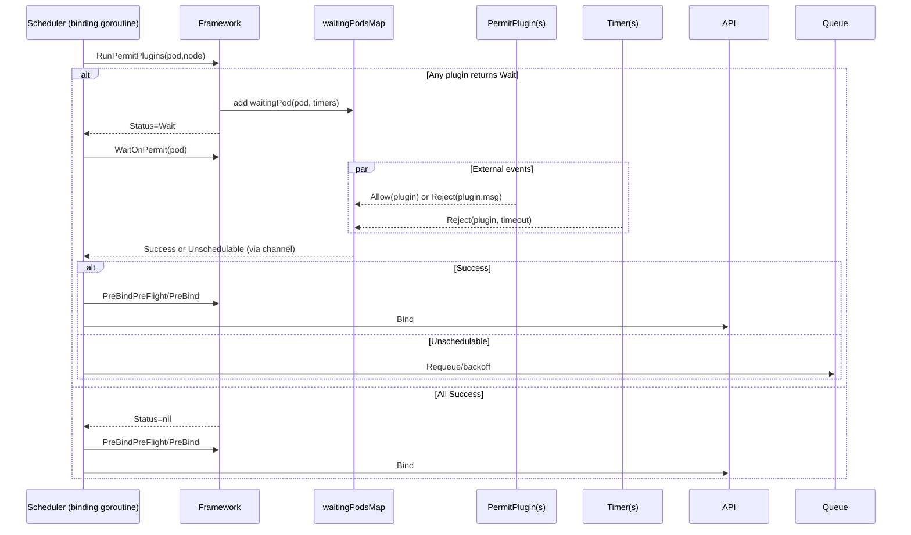

# Concurrency Deep Dive: Permit/WaitOnPermit

Overview
- Waiting pods map: `framework/runtime/waiting_pods_map.go` stores pods that reached Permit and must wait. Created in `pkg/scheduler/scheduler.go` via `frameworkruntime.NewWaitingPodsMap()` and passed into each profile with `WithWaitingPods`.
- Lifecycle: `RunPermitPlugins` may return Wait with per-plugin timeouts → pod enters waiting map. Binding goroutine then calls `WaitOnPermit` to block until allowed or rejected.

Waiting pod internals
- Struct: `waitingPod` holds the Pod, a buffered channel `s` (size 1), and `pendingPlugins` timers.
- Timers: each Permit plugin that returned Wait adds a `time.AfterFunc` timer. On timeout, `Reject(plugin, msg)` fires.
- Non-blocking signals: `Allow(plugin)` stops that plugin’s timer and, when last pending plugin allows, sends Success into `s` (non-blocking). `Reject(plugin,msg)` stops all timers and sends Unschedulable into `s` (non-blocking). Mutex protects the map and timers.

Framework behavior
- `RunPermitPlugins`: collects per-plugin wait times (capped to `maxTimeout`), constructs `waitingPod`, adds it to `waitingPods`, and returns Status=Wait.
- `WillWaitOnPermit`: checks membership in waiting map (used to decide early `NominatedNodeName` update).
- `WaitOnPermit`: removes waiting pod from map, then blocks on `s`. Records `PermitWaitDuration` metric; returns Unschedulable on reject or error.
- Interaction with preemption: preemptor can reject victims in waiting via `GetWaitingPod(...).Reject(...)`.

Correctness and races
- Single completion: buffered channel + removal from map ensures exactly one terminal signal is observed.
- Timeouts: per-plugin; earliest timeout triggers rejection; all timers are stopped on any terminal outcome.
- Context: binding goroutine uses `bindingCycleCtx`; cancellation unblocks downstream work but completion still relies on `s` signal.

Embedded sequence (binding phase)

Operational tips
- Permit plugins must be idempotent and quick; keep external signaling simple (call `Allow/Reject`).
- Use `GetWaitingPod` for targeted decisions (e.g., preemption or controller feedback) and avoid polling.
- Observe `scheduler_scheduler_extension_point_duration_seconds{extension_point="Permit"}` and `scheduler_permit_wait_duration_seconds` for bottlenecks.

References
- `pkg/scheduler/framework/runtime/framework.go` (RunPermitPlugins, WaitOnPermit)
- `pkg/scheduler/framework/runtime/waiting_pods_map.go`
- `pkg/scheduler/schedule_one.go` (binding cycle)
- `pkg/scheduler/framework/preemption/preemption.go`

